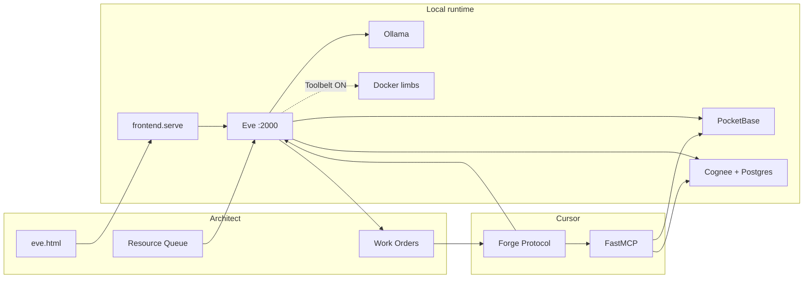

# EMPIRE — Complete System Snapshot for Research Matching

**Audience:** Any human or AI evaluating upgrades, tools, architectures, or “add this to EMPIRE” ideas.  
**Purpose:** Ground external research in **what is actually built**, not manifesto aspiration alone.  
**Date of snapshot:** 2026-09-07  
**Canonical repo:** https://github.com/sbrookshire-raine/Empire  
**Local roots:** `C:\EMPIRE` (code) · `C:\Empire_Workbench` (Architect workbench FS)

**How to use this file**

1. Paste this document (or its path) into research chats **before** proposing stack changes.
2. Score every idea against **§8 Hard directives**, **§11 Limb pattern**, **§15 Fit rubric**.
3. Prefer **extend existing limbs / Compose / MCP / Eve tools** over new platforms.
4. If an idea conflicts with §8 or §14, park it or reframe — do not “upgrade past” the Architect’s constraints.

**Related briefs (narrower):**

| Doc | Use when |
|-----|----------|
| [`EMPIRE_GUIDE.md`](../EMPIRE_GUIDE.md) | Short collaborator handoff |
| [`EMPIRE_MANIFESTO.md`](../EMPIRE_MANIFESTO.md) | Phase vision only (not implementation truth) |
| [`docs/manifest/`](manifest/README.md) | Deep per-subsystem reference |
| [`docs/EMPIRE_IDEA_QUEUE.md`](EMPIRE_IDEA_QUEUE.md) | Smoke tests + forge backlog + hard rejects |
| [`AGENTS.md`](../AGENTS.md) | Day-to-day ops cheat sheet |

---

## 1. One-paragraph identity

EMPIRE is a **meter-free, zero-cloud, Windows-local AI workbench**. The conversational agent **Eve** runs on **local Ollama**, remembers via **Cognee** (graph/vector on a VHDX), tracks **Tasks** in **PocketBase**, and helps the human **Architect** triage ideas into filesystem **Work Orders** that **Cursor** (Systems Mechanic) forges into code. The UI is **plain HTML + HTMX + Alpine.js** (no React/Next). Optional heavy capabilities are **Toolbelt limbs** (default OFF). Docker is used for **specific services** (Postgres for Cognee, on-demand Weaviate), not as a general Kubernetes control plane for the core stack.

---

## 2. Roles (do not conflate)

| Role | Who | Authority |
|------|-----|-----------|
| **Architect** | Human owner | Vision, priorities, smoke tests, accept/reject Work Orders |
| **Systems Mechanic** | Cursor IDE agent | Writes code, MCP, scripts; follows Forge Protocol; stays technical |
| **Eve** | Local agent `:2000` | Chat, triage, memory/tasks tools, limbs when enabled — **not** Cursor |
| **Research AI** (you, if reading this) | Advisor | Match ideas to this snapshot; propose fit/park/reframe — do not assume unbuilt platforms |

**Persona boundary:** Eve’s personality (`eve_instructions.md`, ARC/Scanner) applies **only** to the Eve runtime. Cursor and research AIs stay infrastructure-focused.

---

## 3. Hardware / OS assumptions (as operated)

| Item | Reality |
|------|---------|
| OS | Windows 11 |
| Inference | Local Ollama; GPU shared (class: ~16 GB VRAM) |
| Context budget | Chat modes use shared **`num_ctx` 8192** (not 32k default) |
| Heavy storage | Cognee on `V:\Cognee` (NTFS VHDX backed by T7 `I:\EMPIRE_VHDX\…`) |
| Workbench | `C:\Empire_Workbench\` (separate from repo) |
| Network posture | Bind **`127.0.0.1`**; remote later via Tailscale/Cloudflare Tunnel — **never** open LAN as shortcut |

---

## 4. Service topology (as built)

| Service | Bind / URL | Role | Always-on? |
|---------|------------|------|------------|
| Frontend / Workbench | http://127.0.0.1:8080 | Static + Python APIs (`frontend/serve.py`) | Cold start |
| Eve Workbench UI | http://127.0.0.1:8080/eve.html | Chat, tasks, memory, models, toolbelt | Cold start |
| Dashboard | http://127.0.0.1:8080/dashboard.html | Health cards | Cold start |
| DAZE | http://127.0.0.1:8080/daze.html | Radial day / time reclaim UI | Cold start (data needs PB) |
| Primitives UI | http://127.0.0.1:8080/primitives.html | Curated Cognee ingest | On demand |
| PocketBase | http://127.0.0.1:8090 | Tasks + `day_blocks` (SQLite) | Cold start |
| Ollama | http://localhost:11434 (/v1) | Local LLM + embeddings host | Cold start |
| Eve agent | http://127.0.0.1:2000 | Eve framework agent (Node, built) | Cold start |
| Cognee Postgres | Docker `empire-cognee-postgres` :5432 | pgvector backend for Cognee | Typically with stack |
| Weaviate (Wiki Local) | Docker `empire-weaviate-*` :8091 | On-demand Wikipedia dumps | **Opt-in** (`-Weaviate` / `start-weaviate.ps1`) |
| Voice speech API | :8000 (optional) | STT/TTS OpenAI-compatible | **Opt-in** (`start-voice.ps1`) |

**Cold start:** Plug in T7 → `Start-EMPIRE.bat` or `.\scripts\launch-empire.ps1`.  
**Stop:** `Stop-EMPIRE.bat`.  
**Rebuild Eve after TS tool changes:** `Restart-EMPIRE.bat` or `npm run build` in `agents/empire-task-agent`.

---

## 5. Repository & workbench map

### 5.1 Code root `C:\EMPIRE`

| Path | Purpose |
|------|---------|
| `frontend/` | Zero-build UI + Python HTTP APIs (chat proxy, memory, ollama, companion, wiki drift, toolbelt) |
| `agents/empire-task-agent/` | **Only** npm project — Eve tools, skills, routing, build output |
| `mcp/` | FastMCP Python servers for Cursor |
| `pipeline/` | Python workers (Cognee ingest, scouts, companion, stems helpers, etc.) |
| `backend/pocketbase/` | PocketBase binary + migrations (data local, often gitignored) |
| `scripts/` | PowerShell / bat orchestration |
| `docs/` | Guides, idea queue, limb docs |
| `config/` | Cognee env patterns (secrets often local-only) |
| `mock_data_ingest/` | Stub fixtures only (no live SaaS APIs) |
| `.cursor/mcp.json` | Cursor MCP registration |
| `.cursor/rules/` | Mechanic stack + architecture rules |

### 5.2 Architect workbench `C:\Empire_Workbench`

| Folder | Purpose |
|--------|---------|
| `00_Resource_Queue` | Intake files for triage |
| `00_Core_Profile` | Living **ARCHITECT_NOW.md** (+ companion artifacts) |
| `01_Memory_Bank` | Human memory notes (not Cognee itself) |
| `02_Skills_and_Prompts` | Prompt/skill materials |
| `03_Active_Tools` | Harvested/flattened tool code; LEGO index |
| `04_Thought_Experiments` | Scratch caches: `wiki_cache/`, `web_cache/`, `container_cache/`, notes |
| `05_Work_Orders` | Markdown forge requests for Cursor |
| `stem_factory/input|output` | Stem Factory inbox/outbox |

**Non-destructive rule:** Harvest with **copy**, not move. After successful Forge on a Work Order, Mechanic may delete **that** WO `.md` only.

---

## 6. Core brain vs optional limbs

### 6.1 Always available (not Toolbelt-gated)

- Cognee memory tools: remember / recall / improve / forget  
- PocketBase Tasks CRUD  
- Workbench list/read (rooted at `C:\Empire_Workbench`)  
- Work Order drafting  
- Workbench health  
- Ollama health / model suite surfaces  
- Docling convert (staging → Resource Queue)  
- Companion **NOW** inject + `architect_now_update`  
- GPU lease status (observability)

### 6.2 Toolbelt limbs (default **all OFF**)

Persisted in `%LOCALAPPDATA%\EMPIRE\eve-toolbelt.json`. Enabling a category registers the matching Eve tools for that turn.

| Category ID | Label | What it unlocks |
|-------------|-------|-----------------|
| `gumloop_cloud` | Gumloop Cloud | External Gumloop workflows (parked preference: local-first) |
| `web_research` | Web Research | Firecrawl/Exa-style research (when wired) |
| `tool_forge` | Tool Forge | `read_active_tool` for `03_Active_Tools` |
| `wiki_local` | Wiki Local | Weaviate Truth Drift search/compare; wiki cache |
| `time_reclaim` | Time Reclaim | DAZE day_blocks tools |
| `stem_factory` | Stem Factory | Demucs stems via Shard path |
| `web_scout` | Web Scout | Fetch URL → `web_cache` md |
| `thought_experiments` | Thought Experiments | Capture YouTube/idea notes |
| `voice_presence` | Voice Presence | STT/TTS tools (needs speech server) |
| `vision_local` | Vision Local | `qwen3-vl` describe (GPU lease) |
| `container_scout` | Container Scout | Docker Hub search/detail + local `empire-*` status |

**Invariant:** Scratch scout caches **never** auto-`cognee_remember`. Promote only on explicit Architect request.

---

## 7. Feature inventory (built as of snapshot)

### 7.1 Chat & Workbench

- Neon Storm themed Eve Workbench tabs: Chat, Tasks, Memory, Projects, Models, More  
- Modes: **Fast** (Qwen ~14b), **Deep** (Qwen ~32b), **Librarian** (Command-R ~35b) with per-mode sampling; shared 8192 ctx  
- Durable chat history under `%LOCALAPPDATA%\EMPIRE\chat-history\`  
- Rolling chat continuity / summary path (server-side; smoke T-04)  
- Fast-mode model A/B config (`ollama-fast-ab.json`)  
- Toolbelt UI for limbs  
- Mic/composer hooks for future/local voice (limb OFF by default)

### 7.2 Memory (Cognee)

- Upload `.md/.txt/.pdf` → dataset **`eve_memory`**  
- Optimize recall → curated **`eve_core`**  
- Curated primitives path → **`primitives_test`** (UI `primitives.html`)  
- Cross-process lock: `%LOCALAPPDATA%\EMPIRE\cognee.lock`  
- Production embed: **`nomic-embed-text`** (embed A/B is test-only, parked for production swap)

### 7.3 Companion / Architect identity

- Historical distill from Obsidian vault (`SBX_Vault`) via `pipeline.companion_profile`  
- Living facts: `C:\Empire_Workbench\00_Core_Profile\ARCHITECT_NOW.md` **wins** over old journals  
- Inject NOW on personal turns; do not dump historical card as “current life” every message  
- Cognee is **not** always-on prefetch on every chat turn (timeouts killed UX)

### 7.4 Tasks vs Work Orders vs Idea Queue

| Concept | Store | Owner |
|---------|-------|-------|
| **Task** | PocketBase | Eve/UI day-to-day todos |
| **Work Order** | `05_Work_Orders/*.md` | Eve drafts; Cursor forges |
| **Idea Queue** | `docs/EMPIRE_IDEA_QUEUE.md` | Architect + Mechanic backlog / smokes |
| **Chat history** | Local JSON | UI transcripts — not Eve session revive |
| **Cognee memory** | V:\Cognee | Long-term knowledge |
| **Scout cache** | `04_Thought_Experiments/*_cache/` | Scratch research fuel |

### 7.5 Triage & Forge Protocol

**Triage (Eve):** Resource Queue → USEFUL NOW / COOL IDEA / JUNK → optional `draft_work_order`.  
**Forge (Cursor), when Architect says Process Work Orders:**

1. Read every `05_Work_Orders/*.md`  
2. Read cited `source_file` from Resource Queue (**copy**, don’t destroy)  
3. Build/extend MCP under `mcp/` if needed; register `.cursor/mcp.json`  
4. Wire Eve tool + skill + `empire-routing.md`  
5. Rebuild Eve if TS changed  
6. On success only: delete that WO file  

### 7.6 Wiki Local / Truth Drift

- On-demand Weaviate Wikipedia (not full wiki→Cognee ingest — **halted**)  
- Tools: search + compare years; Interpreter/glasses heuristics  
- Server-side `wiki_drift_api` can inject compare cards so Fast mode cannot skip tools  
- Cache: `wiki_cache/`; promote only via `promote_wiki_cache` / explicit remember  

### 7.7 Other forged limbs / helpers

- **Web Scout** — HTTP fetch → `web_cache`  
- **Container Scout** — Docker Hub API + `docker ps` filter `empire-*` → `container_cache` (no auto-pull/run)  
- **DAZE** — PocketBase `day_blocks` + radial UI  
- **Stem Factory** — Demucs via Shard `.venv-cuda`  
- **Docling** — PDF/Office → markdown Resource Queue  
- **Voice / Vision** — scaffolded limbs; GPU lease coordination  
- **Thought experiments** — note capture under Thought Experiments  
- **Provenance** footers on scout md (`pipeline/provenance.py`)  
- **LEGO whiteboard** — http://127.0.0.1:8080/lego.html; catalog `config/lego-bricks.json`; docs `docs/LEGO_WHITEBOARD.md`

### 7.8 MCP servers registered (Cursor)

`empire-pocketbase`, `empire-cognee`, `empire-workbench`, `empire-work-orders`, `empire-wiki-scout`, `empire-daze`, `empire-stem-factory`, `empire-docling`, `empire-web-scout`, `empire-container-scout`, `empire-atlas`

Eve tools generally mirror these backends via TypeScript + `python -m pipeline.*`.

### 7.9 Eve tools (high-level groups)

**Core:** cognee_*, task CRUD, workbench_*, draft_work_order, check_workbench_health, ollama/pb health, get_model_suite, architect_now_update, docling_convert, promote_wiki_cache, gpu_lease_status  

**Limb-gated:** wiki_scout_*, daze_*, stem_*, web_scout, thought_experiment_capture, voice_*, vision_describe, container_scout_*, read_active_tool  

**Disabled / forbidden for Eve in ops:** cloud sandbox `bash`, generic `read_file`/`write_file`/`glob`/`grep`/`web_search`/`web_fetch` as substitutes for workbench tools — routing forbids inventing cloud FS.

---

## 8. Hard directives (non-negotiable)

### 8.1 Banned in application/runtime code

- React, Next.js, Vue, Svelte, SPA frameworks  
- Firebase, Supabase, other cloud BaaS  
- Paid cloud LLM APIs in app code  
- Frontend build steps for core UI  
- Cloud deployment targets as runtime shortcut  
- Exposing services on LAN instead of tunnel later  

### 8.2 Required stack

- Frontend: HTML + HTMX + Alpine via CDN  
- Backend tasks: PocketBase `127.0.0.1:8090`  
- Inference: Ollama `localhost:11434`  
- Memory: Cognee remember/recall/improve/forget  
- MCP: Python FastMCP in `mcp/`  
- Eve: only under `agents/*`, local Ollama provider  

### 8.3 Build vs operational phase

- **Build (Cursor):** frontier cloud models OK; **do not** switch Cursor Base URL to Ollama while building  
- **Operational (Eve):** always Ollama  

### 8.4 Mechanic coding rules (Cursor)

- Prefer **full files** over hunt-and-replace snippets when handing code to Architect (project rule)  
- Graceful failures on missing/locked files  
- No hallucinated paths — use real `C:\EMPIRE`, `C:\Empire_Workbench`, `path.join`  
- MCP-native: check existing MCP before new wrappers  

### 8.5 Capability Atlas hard rejects (do not forge)

From idea queue — research that maps to these should be **parked or reframed**:

- Mega FastMCP gateway rewrite  
- Postgres as memory authority (replacing Cognee role)  
- Default `num_ctx` 32k on this VRAM class  
- Always-on Weaviate for working docs  
- Near-term ComfyUI / Electron shell  
- Auto-`cognee_remember` from scout caches  
- Full Wikipedia → Cognee re-ingest  
- Paid cloud LLM in app code  
- Running **core** EMPIRE (Eve/Ollama/Cognee/PocketBase) on local Kubernetes as cold-start default  

---

## 9. Primary data flows

### Chat turn (simplified)

1. Browser → `frontend` → Eve session/stream  
2. Optional inject: ARCHITECT_NOW / wiki drift cards / continuity summary  
3. Eve may call tools (core always; limbs if Toolbelt on)  
4. Reply streamed to UI; history archived locally  

### Memory upload

1. Workbench Memory tab → `/api/memory/upload`  
2. Job under `data/eve_memory/jobs/`  
3. `pipeline.cognee_worker` under cognee.lock → `eve_memory`  

### Scout → triage → memory (pattern)

1. Limb tool writes **scratch md** under Thought Experiments  
2. Architect/Eve triages  
3. Explicit promote/remember only  

### Containerized add-on (intended pattern — not K8s core)

1. **Discover** image (Container Scout / Hub)  
2. Triage USEFUL NOW  
3. Work Order → Mechanic adds Compose or `start-*.ps1` + Eve/MCP client to localhost API  
4. Toolbelt category OFF by default  
5. On-demand start/stop (Weaviate is the reference implementation)

---

## 10. Chat models & GPU

| Mode | Typical model class | Temp (approx) | Intent |
|------|---------------------|---------------|--------|
| Fast | Qwen 14b (abliterated variant in ops) | ~0.2 | Strict tools |
| Deep | Qwen 32b | ~0.7 | Creative |
| Librarian | Command-R 35b | ~0.4 | Balanced |

- Vision limb: `qwen3-vl:8b` (competes for VRAM — GPU lease)  
- Stem Factory: separate CUDA venv under Shard path  
- One heavy GPU tenant at a time is an operational design rule  

---

## 11. How new capabilities are supposed to land (“limb pattern”)

When research proposes a new capability, EMPIRE’s default forge shape is:

1. **Python pipeline** module under `pipeline/` (graceful errors, Windows paths)  
2. **FastMCP** wrapper under `mcp/` + `.cursor/mcp.json`  
3. **Eve** `defineTool` under `agents/empire-task-agent/agent/tools/`  
4. **Skill** playbook under `agent/skills/`  
5. **Routing** row in `empire-routing.md`  
6. **Toolbelt** category if heavy/optional (default OFF)  
7. **Docs** + idea-queue smoke row  
8. **Rebuild Eve**  
9. **No auto-ingest to Cognee** unless Architect explicitly promotes  

If the capability is a **containerized third-party service**:

- Prefer **Docker Compose / start-stop scripts** on localhost  
- Eve talks to its **HTTP/gRPC API**, not to Kubernetes  
- Kubernetes is only reconsidered for multi-node / many long-lived helpers / dedicated lab box — see [`KUBERNETES_AND_CONTAINERS.md`](KUBERNETES_AND_CONTAINERS.md)

---

## 12. Manifesto phases vs build truth

| Phase | Theme | Build truth (2026-09) |
|-------|--------|------------------------|
| 1 Intake & Triage | Collect/shortlist | **Working** — Resource Queue, triage skill, Work Orders |
| 2 Evaluation | USEFUL NOW / COOL IDEA / JUNK | **Working** — Eve categorizes; Cursor forges |
| 3 Thought Experiments | Ideas/YouTube research | **Partial** — capture + web scout; Gumloop parked behind local-first |
| 4 LEGO Whiteboard | Composable tool blocks | **Working** — `lego.html` + `config/lego-bricks.json`; Apply → Toolbelt |
| 5 Time reclaim | DAZE / body time | **Working UI + tools** — needs Architect smoke |
| 6 Remote access | Tailscale / CF Tunnel | **Docs ready**; localhost until Architect enables |
| 7 Voice presence | Local STT/TTS | **Scaffold** — limb + docs; speech server opt-in |

---

## 13. Docker policy (accurate mental model)

| Statement | Verdict |
|-----------|---------|
| “Docker containers are runnable units” | **True** |
| “Kubernetes is the only/right manager of containers” | **False** for this single-host stack |
| “EMPIRE already manages some containers” | **True** — Postgres Compose; Weaviate scripts; Eve sandboxes may appear |
| “Container Scout runs Kubernetes” | **False** — Hub search + local status only |
| “Add-ons that ship as images belong on K8s first” | **Usually false** — Compose/scripts + localhost API + Eve tool first |
| “Put Eve/Ollama/Cognee/PB on K8s for HA” | **Parked** — fights VRAM/RAM; not RAID; single PC ≠ cluster HA |

---

## 14. Explicitly parked / halted (with reason)

| Item | Why |
|------|-----|
| Full Wikipedia → Cognee ingest | Cost/noise; scout+cache+promote instead |
| Always-on Weaviate cold start | RAM; on-demand preferred |
| EMPIRE core on local Kubernetes | Control-plane tax; single-host; GPU contention |
| Auto memory from scout caches | Pollutes graph; triage first |
| Gumloop as default research | Local scouts first |
| ComfyUI / Electron near-term | Stack + focus conflict |
| `num_ctx` 32k default | 16 GB VRAM class |

---

## 15. Fit rubric for external research

Paste an idea through this checklist before recommending “forge it”:

1. **Local-only?** No paid LLM/BaaS requirement in runtime?  
2. **Stack-legal?** No React/SPA/cloud deploy required?  
3. **Role-clear?** Eve runtime vs Cursor forge vs Architect smoke?  
4. **Limb-shaped?** Can it be Toolbelt OFF + pipeline + MCP + Eve tool?  
5. **Resource budget?** GPU/RAM vs Ollama + Cognee coexistence?  
6. **Memory policy?** Scratch cache vs explicit Cognee promote?  
7. **Lifecycle?** If containerized: Compose/scripts enough, or truly multi-node?  
8. **Duplicate?** Does Wiki/Web/Container Scout, Docling, DAZE, or Active Tools already cover it?  
9. **Outcome class:** `forge now` / `smoke existing` / `park with reason` / `idea-queue only`

**Reframe examples**

| Research pitch | Better EMPIRE match |
|----------------|---------------------|
| “Add Kubernetes to manage tools” | Container Scout discovery + Compose limb runner |
| “Replace memory with Postgres” | Keep Cognee; Postgres already supports Cognee |
| “Bigger context window” | Mode/routing + summarize; don’t default 32k |
| “Ingest all of Wikipedia” | Truth Drift scout + promote selected cards |
| “Electron app” | Keep HTMX Workbench; tunnel for remote (Phase 6) |

---

## 16. Glossary (collision-prone terms)

| Term | EMPIRE meaning |
|------|----------------|
| **Eve** | Local agent product, not Cursor |
| **Architect** | Human owner |
| **Mechanic** | Cursor forging code |
| **Limb** | Optional Toolbelt capability |
| **Task** | PocketBase todo |
| **Work Order** | Markdown forge ticket |
| **Idea Queue** | `EMPIRE_IDEA_QUEUE.md` backlog |
| **Scout cache** | Scratch md under Thought Experiments |
| **Promote** | Explicit copy/ingest into Cognee |
| **Forge Protocol** | Cursor implements Work Orders |
| **Truth Drift** | Cross-year wiki compare via Weaviate |
| **Companion / NOW** | Living Architect facts file, not full vault dump |
| **LEGO** | Indexed composable tools — UI whiteboard later |
| **containerd** | Container **runtime**, not an image registry |
| **Docker Hub** | Public image catalog (discovery) |
| **Kubernetes** | Cluster orchestrator — parked for core; optional future for many limbs |

---

## 17. Key file index (open these, don’t invent)

| Need | Path |
|------|------|
| This snapshot | `docs/EMPIRE_RESEARCH_SNAPSHOT.md` |
| Short guide | `EMPIRE_GUIDE.md` |
| Vision phases | `EMPIRE_MANIFESTO.md` |
| Eve persona | `eve_instructions.md` |
| Eve routing | `agents/empire-task-agent/agent/empire-routing.md` |
| Toolbelt categories | `agents/empire-task-agent/agent/lib/toolbelt.ts` |
| Mechanic rules | `.cursor/rules/empire-architecture.mdc`, `stack-rules.mdc` |
| Idea / smoke / rejects | `docs/EMPIRE_IDEA_QUEUE.md` |
| Wiki Local | `docs/WIKI_SCOUT.md` |
| Containers / K8s | `docs/KUBERNETES_AND_CONTAINERS.md`, `docs/CONTAINER_SCOUT.md` |
| Web scout | `docs/WEB_SCOUT.md` |
| Voice | `docs/VOICE_PRESENCE.md` |
| Remote | `docs/REMOTE_ACCESS.md` |
| Cognee VHDX | `docs/COGNEE_VHDX.md` |
| Deep manifest | `docs/manifest/README.md` |
| MCP registry | `.cursor/mcp.json` |
| Chat UI | `frontend/eve.html`, `eve-workbench.js` |
| Ops | `AGENTS.md`, `Start-EMPIRE.bat`, `Stop-EMPIRE.bat` |

---

## 18. Elevator pitch (for research AIs)

> EMPIRE is already a working local stack: HTMX Workbench → Eve (Ollama) → Cognee + PocketBase + filesystem workbench, with optional Docker limbs and MCP for Cursor. Upgrades should attach as **default-OFF limbs** that respect localhost, VRAM, and explicit memory promotion — not as platform replacements (Kubernetes-for-everything, cloud BaaS, SPA rewrites, or auto-ingesting the internet into the graph).

---

*Maintainer: update this file when a capability moves from parked→forged or when hard rejects change. Prefer accuracy over optimism.*
