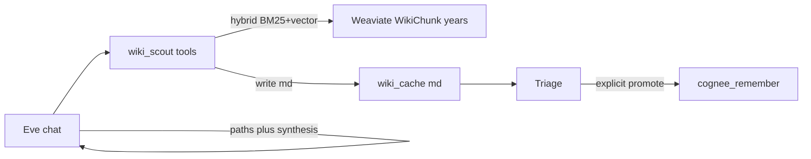

# Wikipedia Weaviate scout (Truth Drift cache)

Local-first research limb for EMPIRE: query the existing Docker Weaviate Wikipedia index (already nomic-encoded), write **Truth Drift–aware markdown** into a learn-from cache, answer from that cache, and **only then** promote useful files into Cognee.

Do **not** re-ingest the full Wikipedia corpus into Cognee. Overnight wiki→Cognee ingest remains **halted**.

## Purpose

- Prefer the **local encyclopedia** (multi-year WikiChunk snapshots) before any web research.
- Support **Truth Drift**: same topic across 2017 / 2021 / 2026 snapshots.
- Keep chat context small (`num_ctx` 8192): tools return short summaries + file paths; full text stays on disk.
- Never auto-`cognee_remember` scout hits — triage first, promote explicitly.

## Pipeline



## Prerequisites

| Item | Value |
|------|--------|
| Weaviate URL | `http://127.0.0.1:8091` (`WEAVIATE_URL`) |
| API key | `WEAVIATE_API_KEY` (heist default in [WEAVIATE_HEIST.md](WEAVIATE_HEIST.md)) |
| Archive mount | `D:\weaviate_v2_archive\weaviate` (temporary Docker RW mount; GET/query only) |
| Embeddings | Ollama `nomic-embed-text` — Weaviate runs with `DEFAULT_VECTORIZER_MODULE=none`. Scout embeds the query locally and runs **hybrid** (BM25 + vector, named vector `default`). Pure `nearVector` returns empty on this archive; BM25-only is the fallback if embed fails. |
| Cache root | `C:\Empire_Workbench\04_Thought_Experiments\wiki_cache\` (`EMPIRE_WIKI_CACHE_DIR`) |
| Frontend port | Workbench stays on **8080**; Weaviate uses **8091** |

### Boot Weaviate (on demand)

See [WEAVIATE_HEIST.md](WEAVIATE_HEIST.md) for the full `docker run` snippet. Wait until ready:

```powershell
# GET http://127.0.0.1:8091/v1/.well-known/ready
# Header: Authorization: Bearer <WEAVIATE_API_KEY>
```

### Tear down

```powershell
docker stop empire-weaviate-heist-2017
docker rm empire-weaviate-heist-2017
```

## Collections (Truth Drift years)

| Year | Collection | Typical `snapshot_id` |
|------|------------|------------------------|
| 2017 | `WikiChunk` | `20170301` |
| 2021 | `WikiChunk2021` | `20210501` |
| 2026 | `WikiChunk2026` | `20260401` |

## Cache layout and frontmatter

Root: `C:\Empire_Workbench\04_Thought_Experiments\wiki_cache\`

- Single-hit files: `{sanitized_title}_{year}_{short_id}.md`
- Compare files: `compare_{sanitized_query}_{stamp}.md` with `kind: truth_drift_compare`

### Single-hit frontmatter

```yaml
---
source: weaviate
kind: wiki_chunk
collection: WikiChunk2021
snapshot_year: "2021"
snapshot_id: "20210501"
title: "Example"
doc_id: "wikipedia:..."
chunk_id: "..."
query: "user query"
fetched_at: "ISO-8601"
distance: 0.12
---
# Example (2021)

…chunk text…
```

### Compare frontmatter

```yaml
---
source: weaviate
kind: truth_drift_compare
query: "user query"
fetched_at: "ISO-8601"
years: ["2017", "2021", "2026"]
---
# Truth Drift: {query}

## 2017
…

## 2021
…
```

Body text is truncated per chunk (default ~6k chars) so files stay triage-friendly.

## CLI (Mechanic smoke)

```powershell
.\venv\Scripts\python.exe -m pipeline.wiki_scout search "Cambrai" --year 2017
.\venv\Scripts\python.exe -m pipeline.wiki_scout compare "Cambrai"
```

## MCP tools

Server: `empire-wiki-scout` (`.cursor/mcp.json`) → `mcp/wiki_scout_mcp.py`

| Tool | Args | Result |
|------|------|--------|
| `wiki_scout_search` | `query`, optional `year`, `limit` | `{ ok, paths[], titles[], note }` |
| `wiki_scout_compare_years` | `query`, optional `years`, `limit_per_year` | `{ ok, path, years_found[], note }` |

If Weaviate is down, tools return `{ ok: false, error: "…" }` — they do not crash Eve.

## Eve usage

1. Enable **Wiki Local** in the Workbench Toolbelt (default **OFF**).
2. Ask for encyclopedia / Truth Drift facts (e.g. “What did Wikipedia say about Cambrai in 2017 vs 2026?”).
3. Eve calls `wiki_scout_search` / `wiki_scout_compare_years`, then answers from summaries + cache paths.
4. To keep something in long-term memory: triage the cache file, then call `cognee_remember` (dataset `eve_memory` by default, or a dedicated `truth_drift` dataset once the Architect creates that workflow).

Do **not** dump full multi-article bodies into chat context.

## Promote to Cognee

| When | Action |
|------|--------|
| Useful after triage | `cognee_remember` on the cache `.md` path (or Workbench upload) |
| Not useful | Leave in `wiki_cache` or delete manually — scout never auto-promotes |
| Full corpus | **Forbidden** — do not restart overnight wiki→Cognee ingest |

Default promote dataset: **`eve_memory`**. Optional later: small curated **`truth_drift`** dataset for compare files only.

## Ops / failure modes

| Symptom | Likely cause | Fix |
|---------|--------------|-----|
| `Weaviate not reachable` | Container stopped | Boot per heist doc on 8091 |
| Auth / 401 | Wrong API key | Set `WEAVIATE_API_KEY` to heist key |
| Empty hits | Query mismatch / wrong year | Try another year or broader query |
| Embed failure | Ollama down / missing nomic | `ollama serve` + `ollama pull nomic-embed-text` |
| Port conflict | Something else on 8091 | Stop other Weaviate; never steal Workbench 8080 |

## What not to run

- Full overnight `wiki_ingest` / Weaviate→Cognee dump for new data (halted).
- Auto-remember of every scout hit.
- Treating Weaviate as always-on stack dependency (on-demand only unless Architect adds a cold-start profile later).

## Future expansions (build later)

Ordered backlog — document only; not part of the current ship:

1. **Web scout** — same markdown contract; Toolbelt `web_research`; local HTTP then Playwright; no paid search APIs.
2. **Promote helper** — `promote_wiki_cache(path, dataset)` wrapping `cognee_remember`.
3. **Model A/B** — trial Fast/Deep alternatives one mode at a time; keep `num_ctx=8192`; measure tool JSON reliability.
4. **Always-on Weaviate profile** — optional `start-stack` hook only if Architect wants wiki up on cold start.
5. **Truth Drift Cognee dataset** — curated `truth_drift` for promoted compares only.
6. **Cross-link Gumloop** — only if local scout fails and Gumloop limb is enabled.

## Related files

| Path | Role |
|------|------|
| [pipeline/wiki_scout.py](../pipeline/wiki_scout.py) | Query + cache writer + CLI |
| [mcp/wiki_scout_mcp.py](../mcp/wiki_scout_mcp.py) | FastMCP tools |
| [docs/WEAVIATE_HEIST.md](WEAVIATE_HEIST.md) | Docker boot / collections / tear-down |
| [EMPIRE_GUIDE.md](../EMPIRE_GUIDE.md) | Collaborator brief |
| Eve skill `skill-wiki-scout.md` | When Eve should call scout tools |
