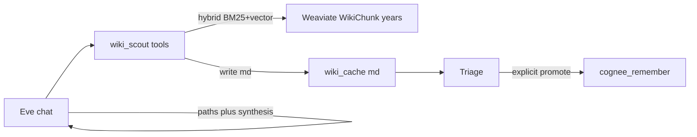

# Wikipedia Weaviate scout (Truth Drift cache)

Local-first research limb for EMPIRE: query the existing Docker Weaviate Wikipedia index (already nomic-encoded), write **Truth Drift–aware markdown** into a learn-from cache, answer from that cache, and **only then** promote useful files into Cognee.

Do **not** re-ingest the full Wikipedia corpus into Cognee. Overnight wiki→Cognee ingest remains **halted**.

## Retrieval ownership (2026-09-23 migration)

**Eve owns Wikipedia retrieval.** It is an **autonomous MCP tool process**, not regex middleware:

| | Default (autonomous) | Legacy escape hatch |
|---|---|---|
| Who decides a lookup is needed | Eve (Qwen) — intent, conversation context, pronouns | Workbench regex (`frontend/wiki_drift_api.py`) |
| How the archive is read | `empire-wiki-scout` MCP tools: `wiki_scout_search`, `wiki_resolve`, `wiki_extract`, `wiki_read_section`, `wiki_scout_compare_years`, `wiki_scratch_*` | Server injects `[[EMPIRE_WIKI_LOOKUP]]` / `[[EMPIRE_WIKI_EXTRACT]]` / `[[EMPIRE_WIKI_DRIFT]]` into the turn |
| Evidence contract | Answer only from tool output; empty EXTRACT → refuse | Answer only from the injected block |
| Enable with | nothing (default) | `EMPIRE_WIKI_MIDDLEWARE=1` in the Workbench process |

Why the regex middleware was retired:

1. **It fought the model.** Endless regex patching to route natural-language questions ("the band … albums", "that page") was fragile; Qwen resolves pronouns and follow-ups on its own when a tool is available.
2. **It starved the model.** Injecting a `[[EMPIRE_WIKI_*]]` marker made `chat_continuity` suppress the prior-turn summary, so the model lost exactly the conversation history it needed to resolve anaphora.
3. **It hid the tools.** The injection set `%LOCALAPPDATA%\EMPIRE\eve-wiki-lookup-lock.json`, which un-registered `wiki_scout_search` / `wiki_scout_compare_years` for the turn, so a bad regex meant no retrieval at all.

The escape hatch is kept for one release cycle: harnesses that must pin the old injection contract turn it on explicitly (`scripts/test-wiki-chat-smoke.py`, `scripts/e2e_full_verify.py`, `scripts/e2e_truth_drift.py`, `scripts/run-wiki-calibrate.py --injection`). `frontend/wiki_drift_api.py` still ships the classifier (`is_wiki_lookup_query`, `is_truth_drift_query`) because `serve.py` uses it as a **catalog routing guard** for mixed asks — that classification never injects evidence.

### Reasoning protocol + prompt budget (2026-09-23)

Eve runs a **MANDATORY EXECUTION PROTOCOL** (`eve_instructions.md`): before every tool call
and before every final answer she writes `<thought>Ask: … Have: … Next: …</thought>`, and
`Have:` must state what she actually holds. `wiki_scout_search` reinforces it: a **repeated
identical search** returns `repeat_call: true` plus a hint to use `wiki_read_section` /
`wiki_extract` instead of restating the lead.

Two facts make or break this on a 14B model:

1. **The prompt must fit.** Eve's own prompt is ~11k tokens (system instructions + routing
   ≈ 5.8k, plus ~32 tool schemas ≈ 5.3k). Ollama's OpenAI-compat endpoint **ignores
   per-request `options.num_ctx`**, so the model runs at the *server* default — measured
   `prompt_eval_count=4098` on an 8192 window, i.e. more than half the prompt (including the
   protocol) was silently dropped. Fix:
   ```powershell
   .\scripts\ensure-ollama-parallel.ps1 -NumParallel 1 -ContextLength 16384
   ```
   and the agent declares the same window (`SHARED_NUM_CTX` in
   `agents/empire-task-agent/agent/lib/ollama-config.ts`). Verify with
   `curl http://127.0.0.1:11434/api/ps` → `context_length: 16384`.
2. **Continuation turns carry no history.** Eve's own `POST /session/{id}` sends the system
   prompt + the new user line only. Cross-turn context ("that page") comes from the
   Workbench's `[[EMPIRE_CHAT_SUMMARY]]` block, which is why the follow-up hop must be
   tested through `http://127.0.0.1:8080`, not against port 2000 directly.
3. **Lookups must stay on the index (measured 2026-09-23).** `resolve("white stripes")` used to
   miss ("The White Stripes" is the indexed title), fall into a fuzzy `LIKE '%…%'` join over the
   7.1M-row index (~9.5 s) and then a ripgrep scan that timed out at 12 s — the whole wiki tool
   call took **10.7 s**. Now the article-prefixed variant resolves as an exact hit, the fuzzy
   branch is two narrow scans ranked in Python, and the rg last resort is capped at 3 s / 4
   batches: the same call is **0.06 s**. If wiki lookups ever get slow again, check the index
   first: `I:\EMPIRE_DATA\wiki-reports\{year}\title-index.sqlite` (32 GB for 2026) and rebuild
   with `.\scripts\build-wiki-title-index.ps1 -Year 2026`.

Verified two-turn behaviour (both routes) with:

```powershell
$env:PYTHONPATH='C:\EMPIRE'
.\venv\Scripts\python.exe scripts\test-eve-cot-multihop.py --via-frontend
```

Turn 1 `Who is Kate Bush?` → `wiki_scout_search` → lead. Turn 2 `What else is on that page?`
→ **`wiki_read_section`** → discography albums. Reasoning blocks are written by the model and
**stripped by the proxy** (`frontend/eve_proxy.py::strip_reasoning_blocks`) before the user
sees them; `--via-frontend` therefore grades behaviour, while the direct route (port 2000)
shows the raw `<thought>` text.

### Known gap: one-turn multi-hop (tracked E-10)
Eve lands the right page and, for **trace** questions ("which 80s song got popular again because of *Stranger Things*?"), the fast model answers the article **lead** instead of hopping to the page that holds the fact. Verified 2026-09-23:

- the tools do expose the path (`wiki_scout_search` → `wiki_read_section("Running Up That Hill")` → the archive lead states the revival);
- the agent loop does support sequential tool calls (the same question phrased as two explicit steps returns the song);
- the system prompt, the skill, and the tool reply rule all now instruct the hop.

So it is a model-behaviour gap, not a retrieval wiring gap. `scripts/test-wiki-chat-smoke.py` reports these three cases as `WARN known-gap` and everything else must pass. Options to close it are listed as **E-10** in [`EMPIRE_IDEA_QUEUE.md`](EMPIRE_IDEA_QUEUE.md) (follow-up turn, expose the Title DNS link web as a tool, or try Deep).

## Purpose

- Prefer the **local encyclopedia** (multi-year WikiChunk snapshots) before any web research.
- Support **Truth Drift**: same topic across 2017 / 2021 / 2026 snapshots.
- Keep chat context small (`num_ctx` 8192): tools return short summaries + file paths; full text stays on disk.
- Never auto-`cognee_remember` scout hits — triage first, promote explicitly.

## Pipeline



## Wiki Interpreter

Before Eve sees results, scout:

1. Retrieves a **wide candidate pool** (default ~20) via hybrid BM25+vector  
2. Scores with **Wikipedia heuristics** (title match, term overlap, date-bearing chunks; demote disambiguation / year-stub / fictional noise; strip year lists from chat questions before retrieve/rerank)  
3. Optionally **BGE-reranks** locally if `sentence-transformers` is installed (`BAAI/bge-reranker-base`, CPU by default)  
4. Builds **query-aware snippets** (best sentence/window for the question, not always chunk start)  
5. Marks **`usable` / confidence** — weak or undated answers to when/who/last questions get `usable=false` so Eve can refuse to invent  
6. Returns **structured cards**: `title`, `kind_hint`, `rank_why`, `snippet` (+ cache paths)

Cards are **page/chunk hits**, not footnote counts. Snapshot years are frozen dumps.

```powershell
# Optional glasses upgrade (one-time):
.\venv\Scripts\python.exe -m pip install sentence-transformers

$env:PYTHONPATH="C:\EMPIRE"
.\venv\Scripts\python.exe -m pipeline.wiki_scout compare "Artificial Intelligence"
```

Env knobs: `EMPIRE_WIKI_CANDIDATE_POOL`, `EMPIRE_WIKI_INTERPRETER_TOP_K`, `EMPIRE_WIKI_RERANK=0` to disable rerank, `EMPIRE_WIKI_RERANK_MODEL`.

### Glasses eval (regression)

```powershell
$env:PYTHONPATH="C:\EMPIRE"
.\venv\Scripts\python.exe -m pipeline.wiki_glasses_eval --no-rerank
# Reports land in C:\Empire_Workbench\04_Thought_Experiments\wiki_cache\glasses_eval_*.md
```

Note: coverage is **not identical across years**. Spot-checks show some famous primaries
(e.g. `Ludwig van Beethoven`, `Marie Curie`, `Nile`, `Industrial Revolution`) exist in
**2017 and 2026** but are **absent from the 2021 collection** (same Wikipedia `page_id`
returns 0 objects). Default single-year search uses 2021 — so “missing Beethoven” is often
a **2021 hole**, not “Wikipedia has no Beethoven.” Prefer `compare_years` or search 2017/2026
when a topic looks oddly empty. When a primary is missing in that year, the interpreter
falls back to disambiguation / related pages instead of Medal/School/film satellites.

## Prerequisites

| Item | Value |
|------|--------|
| Weaviate URL | `http://127.0.0.1:8091` (`WEAVIATE_URL`) |
| API key | `WEAVIATE_API_KEY` (heist default in [WEAVIATE_HEIST.md](WEAVIATE_HEIST.md)) |
| Archive mount | `I:\weaviate_v2_archive\weaviate` (canonical). `D:\weaviate_v2_archive` is legacy. Docker RW mount; GET/query only. |
| Title DNS | `I:\EMPIRE_DATA\wiki-reports\{year}\title-index.sqlite` — chat lookup existence gate. Build: `.\scripts\build-wiki-title-index.ps1` |
| Markdown corpus | `D:\wiki_md\{year}\` — conversion output; lead/body pull after a DNS hit |
| Embeddings | Ollama `nomic-embed-text` — Weaviate runs with `DEFAULT_VECTORIZER_MODULE=none`. Scout embeds the query locally and runs **hybrid** (BM25 + vector, named vector `default`). Pure `nearVector` returns empty on this archive; BM25-only is the fallback if embed fails. |
| Cache root | `C:\Empire_Workbench\04_Thought_Experiments\wiki_cache\` (`EMPIRE_WIKI_CACHE_DIR`) |
| Frontend port | Workbench stays on **8080**; Weaviate uses **8091** |

### Boot Weaviate (on demand)

**Easiest** — include Wiki Local when starting EMPIRE (still off by default):

```bat
Start-EMPIRE.bat -Weaviate
```

Or PowerShell only:

```powershell
.\scripts\launch-empire.ps1 -Weaviate
.\scripts\start-weaviate.ps1          # wiki alone, stack already up
.\scripts\stop-weaviate.ps1           # tear down when done
```

Needs Docker + `I:\weaviate_v2_archive\weaviate`. Full manual `docker run`: [WEAVIATE_HEIST.md](WEAVIATE_HEIST.md).

### Title DNS (chat lookup)

Normal who/what/cast questions do **not** use Weaviate. They resolve the title in SQLite, then read the lead (and preferred H2 section) from `D:\wiki_md`. Cast questions pull the **Cast** section and may hop to actor pages.

Eve calls **`wiki_scout_search`** herself for a normal lookup (Title DNS → lead), then escalates to **`wiki_extract`** / **`wiki_read_section`** when the lead is not enough. In the default autonomous mode nothing locks the tools.

Only on the legacy escape hatch (`EMPIRE_WIKI_MIDDLEWARE=1`) does Workbench set `%LOCALAPPDATA%\EMPIRE\eve-wiki-lookup-lock.json`, so Eve **does not register** `wiki_scout_search` / `wiki_scout_compare_years` on a turn that already carries injected evidence (90 s TTL, self-expiring).

Multi-hop work uses the research **scratchpad** + **Error Book** (`pipeline/wiki_scratchpad.py`) — not Cognee.

**The Error Book is written automatically since 2026-09-24** (it used to be inert outside the legacy
middleware: 52 `wiki_scout_search` calls in a day, zero entries). `mcp/wiki_scout_mcp.py` appends a
miss server-side — deduped by query, so repeats do not spam it — and returns `known_miss` plus the
hint, which is retry-aware: *this exact query has missed, never invent a page, try the bare title
once, then say plainly it is not in the archive*. That closes the loop that let "the local archive
doesn't have a page on X" stand while `Drum kit` and `Juggling` sat in the index. The file is bounded
(`EMPIRE_WIKI_ERROR_BOOK_MAX`, default 500 entries).

**Question shapes.** `pipeline/wiki_interpreter.extract_wiki_subject` pulls the subject out of a conversational question. Measured live 2026-09-23: `What is magnetism?` resolved but **`How do magnets work?` missed the wiki entirely** (the question form fell through to a literal title lookup), which is why the 14B looped on a "no page" answer. `how do/does <noun> work|function|operate` and `how <noun> work(s)` now yield the subject noun (`How does magnetism work?` → `Magnetism`). Pronouns are excluded, so `how do I install python?` stays a non-lookup question.

**Repeat refusal (bounded loops).** `wiki_scout_search` counts identical searches per subject/year inside a 180 s window: strike 1 = normal, strike 2 = cards + "do NOT repeat, call `wiki_read_section`/`wiki_extract`", **strike 3 = refused with no cards** (`HARD_STOP_REPEAT_HINT`). Measured: the 14B issued **7 identical searches / 66 s** and ended in an apology (the soft hint alone was ignored 6×); after the guard the same question costs 2 searches / 14–26 s. The window means a later genuine question about the same subject is not refused. Unit tests: `tests/pipeline/test_wiki_scout.py`.

`wiki_scout_search` is Title DNS only by default. Opt in to Weaviate similarity after a miss with `EMPIRE_WIKI_WEAVIATE_FALLBACK=1`.

**Ambiguity is a first-class outcome (R-02, 2026-09-24).** A bare subject that has no page of its own while its singular family does gets flagged, and the tool returns every reading as its own card with a short lead:

| Asked | Bare page? | Family found | Result |
|-------|-----------|--------------|--------|
| `magnets` | no | `Magnet`, `Magnetism` | **`ambiguous: true`**, 3 cards (adds **The Magnets**, an a cappella group) |
| `magnetism`, `magnet` | yes | — | plain hit — not flagged |
| `white stripes` | no | none | plain hit (**The White Stripes**) — no false ambiguity |
| `batteries` | alias → `Batteries (journal)` | `Battery` | **`ambiguous: true`** |

Trigger precision comes from three conditions together (bare page absent · singular stem page present · stem page is a concrete article; alias redirection counts as "resolves elsewhere"). Cost: **~20 ms** — exact PK lookups (0.3 ms) plus one range scan (3.0 ms) on the 7.1M-row index; `LIKE 'magnet%'` measured **701 ms**, so candidates are found with an explicit range predicate, never LIKE.

The tool's `chat_reply_rule` for this case instructs Eve to answer from the candidate that matches the question's meaning **and name the page**, or to name the candidates and **ask** — never to present one reading as the only match. Measured effect on `How do magnets work?` (see the A/B in [`VOICE_PRESENCE.md`](VOICE_PRESENCE.md)): the 14B now asks "…could refer to the musical group **The Magnets**, a **Magnet**, or **Magnetism** — which did you mean?" instead of grounding on a band.

**Question-shaped queries** also resolve now: `tell me about the band the white stripes` used to keep the kind phrase (`the band the white stripes` → miss, 1.8 s in the fuzzy fallback); `_trim_subject` strips a leading kind phrase when a real subject remains, so it resolves in 0.58 s. "the city of London" and bare "the band" are deliberately left alone.

**Workbench eval (offline-first):** see [WIKI_WORKBENCH_EVAL.md](WIKI_WORKBENCH_EVAL.md).

```powershell
.\scripts\build-wiki-title-index.ps1            # 2026 default
.\venv\Scripts\python.exe -m pipeline.wiki_title_dns seed-common-aliases --year 2026 --write-tsv
.\scripts\import-wiki-mediawiki-meta.ps1 -Year 2026
.\venv\Scripts\python.exe scripts\run-wiki-calibrate.py --suite workbench --injection
```

Optional redirect aliases (tab-separated `alias<TAB>canonical`): `I:\EMPIRE_DATA\wiki-reports\2026\redirects.tsv`  
Optional disambiguation titles: `I:\EMPIRE_DATA\wiki-reports\2026\page_props_disambig.tsv`  
Optional full dumps: `--RedirectSql` / `--PageSql` on `import-wiki-mediawiki-meta.ps1`.

### Deferred (kill criteria)

| Item | Build only if |
|------|----------------|
| **ZIM / openzim-mcp** | Section I/O from `D:\wiki_md` is too slow or Architect needs a single-file reader |
| **GBNF / schema masks** | LOOKUP lock + tool hide still shows tool loops after scratchpad |
| **DuckDB link analytics** | SQLite neighbor ranking becomes the bottleneck |
| **SetFit intent router** | One-Letter Fork / follow-ups still fail after rule-based disambiguation |
| **Full GraphRAG / embed-all** | Never for this corpus |

### Link web (title → title)

After the phone book exists, index `outgoing_links` from each article header:

```powershell
.\scripts\build-wiki-title-index.ps1 -Links
.\venv\Scripts\python.exe -m pipeline.wiki_title_dns neighbors "Cheese"
```

This is Wikipedia’s own spiderweb, not embeddings. Lookup ranks those links by the question (cast vs song vs cheddar) and may inject neighbor leads — still not Cognee.

Redirect aliases: `python -m pipeline.wiki_title_dns import-redirects --year 2026 --redirects PATH`.

Weaviate hybrid search stays for **Truth Drift / compare_years** only (unless `EMPIRE_WIKI_WEAVIATE_FALLBACK=1`).

Ready check: `GET http://127.0.0.1:8091/v1/.well-known/ready` with  
`Authorization: Bearer <WEAVIATE_API_KEY>`.

### Tear down

```powershell
.\scripts\stop-weaviate.ps1
# or with full EMPIRE shutdown:
Stop-EMPIRE.bat -Weaviate
```

Or:

```powershell
docker stop empire-weaviate-heist-2017
docker rm empire-weaviate-heist-2017
```

## Collections (Truth Drift years)

| Year | Collection | Typical `snapshot_id` |
|------|------------|------------------------|
| 2017 | `WikiChunk` | `20170301` |
| 2021 | `WikiChunk2021` | `20210501` |
| 2026 | `WikiChunk2026` | `20260401` |

## Cache layout and frontmatter

Root: `C:\Empire_Workbench\04_Thought_Experiments\wiki_cache\`

- Single-hit files: `{sanitized_title}_{year}_{short_id}.md`
- Compare files: `compare_{sanitized_query}_{stamp}.md` with `kind: truth_drift_compare`

### Single-hit frontmatter

```yaml
---
source: weaviate
kind: wiki_chunk
collection: WikiChunk2021
snapshot_year: "2021"
snapshot_id: "20210501"
title: "Example"
doc_id: "wikipedia:..."
chunk_id: "..."
query: "user query"
fetched_at: "ISO-8601"
distance: 0.12
---
# Example (2021)

…chunk text…
```

### Compare frontmatter

```yaml
---
source: weaviate
kind: truth_drift_compare
query: "user query"
fetched_at: "ISO-8601"
years: ["2017", "2021", "2026"]
---
# Truth Drift: {query}

## 2017
…

## 2021
…
```

Body text is truncated per chunk (default ~6k chars) so files stay triage-friendly.

## CLI (Mechanic smoke)

```powershell
.\venv\Scripts\python.exe -m pipeline.wiki_scout search "Cambrai" --year 2017
.\venv\Scripts\python.exe -m pipeline.wiki_scout compare "Cambrai"
```

## MCP tools

Server: `empire-wiki-scout` (`.cursor/mcp.json`) → `mcp/wiki_scout_mcp.py`

| Tool | Args | Result |
|------|------|--------|
| `wiki_scout_search` | `query`, optional `year`, `limit` | `{ ok, paths[], titles[], note }` |
| `wiki_scout_compare_years` | `query`, optional `years`, `limit_per_year` | `{ ok, path, years_found[], note }` |

If Weaviate is down, tools return `{ ok: false, error: "…" }` — they do not crash Eve.

## Eve usage

1. Enable **Wiki Local** in the Workbench Toolbelt (default **OFF**).
2. Ask for encyclopedia / Truth Drift facts (e.g. “What did Wikipedia say about Cambrai in 2017 vs 2026?”).
3. Eve calls `wiki_scout_search` / `wiki_scout_compare_years`, then answers from summaries + cache paths.
4. To keep something in long-term memory: triage the cache file, then **`promote_wiki_cache`** (auto-routes compare → `truth_drift`, single hit → `eve_memory`).

Do **not** dump full multi-article bodies into chat context.

## Promote to Cognee

| When | Action |
|------|--------|
| Useful after triage | `promote_wiki_cache` on the cache `.md` path |
| Compare / Truth Drift file | Routes to Cognee dataset **`truth_drift`** automatically |
| Single wiki chunk file | Routes to **`eve_memory`** automatically |
| Not useful | Leave in `wiki_cache` or delete manually — scout never auto-promotes |
| Full corpus | **Forbidden** — do not restart overnight wiki→Cognee ingest |

Routing config: [`config/wiki-promote.json`](../config/wiki-promote.json). Override with `--dataset` or tool `dataset` arg.

### Explicit promote helper

```powershell
$env:PYTHONPATH="C:\EMPIRE"
# Auto-route from front matter kind:
.\venv\Scripts\python.exe -m pipeline.wiki_scout promote "C:\Empire_Workbench\04_Thought_Experiments\wiki_cache\compare_topic_20260101T120000Z.md"
# Single hit (→ eve_memory):
.\venv\Scripts\python.exe -m pipeline.wiki_scout promote "C:\Empire_Workbench\04_Thought_Experiments\wiki_cache\Battle_of_Cambrai_2017_abcd1234.md"
# Override:
.\venv\Scripts\python.exe -m pipeline.wiki_scout promote "...\compare_....md" --dataset eve_memory
```

Eve / MCP tool: `promote_wiki_cache`. Never automatic. Response includes `dataset` + `dataset_reason`.

### Remember a Title DNS lead (explicit)

Do **not** ingest the encyclopedia into Cognee. If a lookup was useful:

```powershell
.\venv\Scripts\python.exe -m pipeline.wiki_title_dns remember "Kate Bush" --year 2026
```

That writes a **lead-only** wiki_cache file and promotes it to **`eve_memory`**. Same title is skipped next time (`remembered-titles.jsonl`). Eve tool / MCP: `remember_wiki_lead`. Still never automatic.

## Ops / failure modes

| Symptom | Likely cause | Fix |
|---------|--------------|-----|
| `Weaviate not reachable` | Container stopped | Boot per heist doc on 8091 |
| Auth / 401 | Wrong API key | Set `WEAVIATE_API_KEY` to heist key |
| Empty hits | Query mismatch / wrong year | Try another year or broader query |
| Embed failure | Ollama down / missing nomic | `ollama serve` + `ollama pull nomic-embed-text` |
| Port conflict | Something else on 8091 | Stop other Weaviate; never steal Workbench 8080 |

## What not to run

- Full overnight `wiki_ingest` / Weaviate→Cognee dump for new data (halted).
- Auto-remember of every scout hit.
- Treating Weaviate as always-on stack dependency (on-demand only unless Architect adds a cold-start profile later).

## Future expansions (build later)

Ordered backlog — document only where not yet shipped:

1. ~~**Web scout**~~ — shipped as Toolbelt `web_scout` ([WEB_SCOUT.md](WEB_SCOUT.md)); Playwright escalation still later.
2. ~~**Promote helper**~~ — `promote_wiki_cache` shipped.
3. ~~**Model A/B**~~ — Fast-mode A/B via `ollama-fast-ab.json` shipped; Deep/Librarian stay pinned.
4. **Always-on Weaviate profile** — optional `start-stack` hook only if Architect wants wiki up on cold start.
5. **Truth Drift Cognee dataset** — `truth_drift` auto-route on promote (F-05 done).
6. **Cross-link Gumloop** — only if local scout fails and Gumloop limb is enabled.

## Related files

| Path | Role |
|------|------|
| [pipeline/wiki_scout.py](../pipeline/wiki_scout.py) | Query + cache writer + CLI |
| [mcp/wiki_scout_mcp.py](../mcp/wiki_scout_mcp.py) | FastMCP tools |
| [docs/WEAVIATE_HEIST.md](WEAVIATE_HEIST.md) | Docker boot / collections / tear-down |
| [EMPIRE_GUIDE.md](../EMPIRE_GUIDE.md) | Collaborator brief |
| Eve skill `skill-wiki-scout.md` | When Eve should call scout tools |
