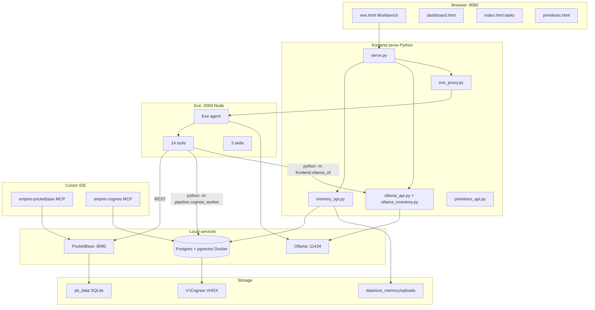

# 02 — Architecture

## System diagram



## Process boundaries

| Process | Language | Started by | Talks to |
|---------|----------|------------|----------|
| `frontend.serve` | Python | `start-frontend.ps1` / `start-stack.ps1` | PocketBase, Ollama, Eve proxy, Postgres (memory jobs) |
| `pocketbase serve` | Go binary | `start-pocketbase*.ps1` | SQLite `pb_data/` |
| `eve start` | Node (built) | `start-eve.ps1` | Ollama, PocketBase REST, Python subprocesses |
| `ollama serve` | Ollama | User / OS | GPU, model files |
| `empire-cognee-postgres` | Docker | `ensure-cognee-postgres.ps1` | `V:\Cognee` via env |
| MCP servers | Python stdio | Cursor | PocketBase, Cognee worker |

## Request flows

### Chat message (Workbench → Eve)

1. User sends message on **Chat** tab (`eve-workbench.js`)
2. `POST /api/eve/session` or continue → `eve_proxy.py` → `http://127.0.0.1:2000/eve/v1/session`
3. Eve agent step starts → reads **active Ollama model** from `%LOCALAPPDATA%\EMPIRE\ollama-active-model.json`
4. Eve may call tools (PocketBase, Cognee, model suite)
5. NDJSON stream returned via `GET /api/eve/session/:id/stream`

### Memory upload (Workbench → Cognee)

1. User drops files on **Memory** tab → `POST /api/memory/upload`
2. `memory_api.py` validates files, creates job under `data/eve_memory/jobs/`
3. Background worker runs `pipeline.cognee_worker ingest-files` (serialized by `cognee.lock`)
4. Embed model: `nomic-embed-text` from `config/cognee.env`
5. UI polls `GET /api/memory/jobs/:id` until `ready`

### Model switch (Workbench or Eve)

1. UI: `PUT /api/ollama/model` or Eve tool `switch_chat_model`
2. Writes `ollama-active-model.json`
3. Next Eve **step** uses new model (`agent.ts` `step.started` handler)
4. UI may call `newChat()` after switch to avoid mixed-model context

### Cursor recall (MCP)

1. Cursor calls `cognee_recall` on `empire-cognee` MCP
2. `cognee_mcp.py` → `pipeline.cognee_subprocess` → `cognee_worker recall`
3. Same lock and Postgres backend as Eve

## Repository layout

```
EMPIRE/
├── agents/empire-task-agent/   # Eve agent (only npm project)
├── backend/pocketbase/           # Binary (gitignored), migrations, pb_data (gitignored)
├── config/                     # services.json, cognee.env (gitignored; use .example)
├── data/
│   ├── curated_primitives/       # Fuel + directives (not mixed)
│   └── eve_memory/               # Upload staging + job state
├── docs/manifest/                # This documentation set
├── frontend/                     # Static UI + Python HTTP server
├── mcp/                          # FastMCP servers for Cursor
├── mock_data_ingest/             # Stub fixtures for pipeline tests
├── pipeline/                     # Cognee workers, ingest, wiki (halted)
├── scripts/                      # PowerShell orchestration
├── tests/                        # Python + JS harness tests
├── venv/                         # Python virtualenv (gitignored)
├── AGENTS.md                     # Operator quick reference
└── requirements.txt
```

## Key integration files

| File | Role |
|------|------|
| `config/services.json` | Service definitions for dashboard roll-in/out |
| `config/cognee.env` | Cognee LLM, embed, Postgres, `SYSTEM_ROOT_DIRECTORY` |
| `%LOCALAPPDATA%\EMPIRE\ollama-active-model.json` | Active Eve chat model |
| `%LOCALAPPDATA%\EMPIRE\cognee.lock` | Cross-process Cognee mutex |
| `.cursor/mcp.json` | Cursor MCP server registration |

## Next

- [04-services-and-ports](04-services-and-ports.md) — port table
- [05-frontend-and-apis](05-frontend-and-apis.md) — HTTP API detail
