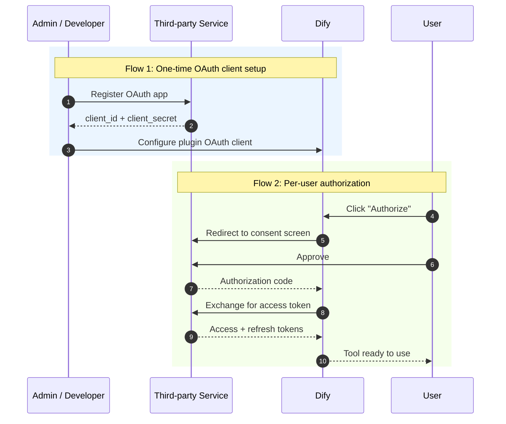
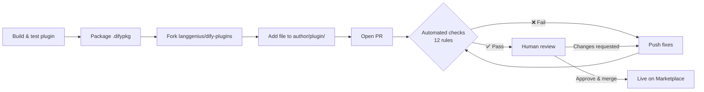

# Dify Documentation — Plugin Development Guide

*This document was scraped from the official Dify documentation and cleaned/reformatted for ingestion into NotebookLM (for building a learning plan). It is part of a multi-file set covering the full Dify docs guide.*

- **Source:** https://docs.dify.ai/en/home
- **Total pages in this file:** 40
- **Date scraped:** 2026-07-18

## Table of Contents

- **[Plugin Development](#plugin-development)**
  - [Dev Guides And Walkthroughs](#dev-guides-and-walkthroughs)
    - [Agent Strategy Plugin](#agent-strategy-plugin)
    - [Cheatsheet](#cheatsheet)
    - [Model Provider Plugin](#model-provider-plugin)
    - [Data Source Plugin](#data-source-plugin)
    - [Slack Bot](#slack-bot)
    - [Flomo Tool (10-min)](#flomo-tool-10-min)
    - [Markdown Exporter](#markdown-exporter)
    - [Multimodal Tool](#multimodal-tool)
    - [Endpoint Plugin](#endpoint-plugin)
    - [Tool OAuth](#tool-oauth)
    - [Tool Plugin](#tool-plugin)
    - [Trigger Plugin](#trigger-plugin)
  - [Features And Specs](#features-and-specs)
    - [Bundle Plugin Package](#bundle-plugin-package)
    - [Integrate Custom Models](#integrate-custom-models)
    - [Reverse Invocation of Dify Services](#reverse-invocation-of-dify-services)
    - [App](#app)
    - [Reverse Invocation Model](#reverse-invocation-model)
    - [Node](#node)
    - [Tool](#tool)
    - [General Specs](#general-specs)
    - [Model Specs](#model-specs)
    - [Model API Interface](#model-api-interface)
    - [Multilingual README](#multilingual-readme)
    - [Persistent Storage](#persistent-storage)
    - [Manifest](#manifest)
    - [Plugin Logging](#plugin-logging)
    - [Plugin Debugging](#plugin-debugging)
    - [Tool Return](#tool-return)
  - [Getting Started](#getting-started)
    - [Choose a Plugin Type](#choose-a-plugin-type)
    - [Dify Plugin CLI](#dify-plugin-cli)
    - [Dify Plugin](#dify-plugin)
  - [Publishing](#publishing)
    - [Frequently Asked Questions](#frequently-asked-questions)
    - [Automatically Publish Plugins via PR](#automatically-publish-plugins-via-pr)
    - [Package as Local File and Share](#package-as-local-file-and-share)
    - [Publish Plugins](#publish-plugins)
    - [Publish to Dify Marketplace](#publish-to-dify-marketplace)
    - [Publish to Individual GitHub Repository](#publish-to-individual-github-repository)
    - [Plugin Development Guidelines](#plugin-development-guidelines)
    - [Privacy Guidelines](#privacy-guidelines)
    - [Sign Plugins for Third-Party Signature Verification](#sign-plugins-for-third-party-signature-verification)

---

## Plugin Development

### Dev Guides And Walkthroughs

#### Agent Strategy Plugin

*Build a Function Calling agent strategy from scratch, with a worked example showing how to give an LLM tools and let it autonomously fetch the current time*

**Source:** https://docs.dify.ai/en/develop-plugin/dev-guides-and-walkthroughs/agent-strategy-plugin

Build a Function Calling agent strategy from scratch, with a worked example showing how to give an LLM tools and let it autonomously fetch the current time

An **Agent Strategy Plugin** gives an LLM the reasoning and decision-making logic to choose tools, call them, and handle their results, so it can solve problems autonomously.

This guide walks through building a **Function Calling** strategy that lets the model fetch the current time on its own.

#### Prerequisites

* Dify plugin scaffolding tool
* Python environment (version 3.12)

For details on preparing the plugin development tool, see [CLI](https://docs.dify.ai/en/develop-plugin/getting-started/cli).

> **💡 Tip:**
>   Run `dify version` in your terminal to confirm that the scaffolding tool is installed.

***

#### 1. Initialize the Plugin Template

Run the following command to create a development template for your Agent plugin:

```bash theme={null}
dify plugin init
```

Follow the on-screen prompts; the comments below explain each choice.

```bash theme={null}
➜  Dify Plugins Developing dify plugin init
Edit profile of the plugin
Plugin name (press Enter to next step): # Enter the plugin name
Author (press Enter to next step): Author name # Enter the plugin author
Description (press Enter to next step): Description # Enter the plugin description
---
Select the language you want to use for plugin development, and press Enter to con
BTW, you need Python 3.12+ to develop the Plugin if you choose Python.
-> python # Select Python environment
  go (not supported yet)
---
Based on the ability you want to extend, we have divided the Plugin into four type

- Tool: It's a tool provider, but not only limited to tools, you can implement an
- Model: Just a model provider, extending others is not allowed.
- Extension: Other times, you may only need a simple http service to extend the fu
- Agent Strategy: Implement your own logics here, just by focusing on Agent itself

What's more, we have provided the template for you, you can choose one of them b
  tool
-> agent-strategy # Select Agent strategy template
  llm
  text-embedding
---
Configure the permissions of the plugin, use up and down to navigate, tab to sel
Backwards Invocation:
Tools:
    Enabled: [✔]  You can invoke tools inside Dify if it's enabled # Enabled by default
Models:
    Enabled: [✔]  You can invoke models inside Dify if it's enabled # Enabled by default
    LLM: [✔]  You can invoke LLM models inside Dify if it's enabled # Enabled by default
    Text Embedding: [✘]  You can invoke text embedding models inside Dify if it'
    Rerank: [✘]  You can invoke rerank models inside Dify if it's enabled
...
```

Initialization creates a folder with everything you need for plugin development:

```text theme={null}
├── GUIDE.md               # User guide and documentation
├── PRIVACY.md             # Privacy policy and data handling guidelines
├── README.md              # Project overview and setup instructions
├── _assets/               # Static assets directory
│   └── icon.svg           # Agent strategy provider icon/logo
├── main.py                # Main application entry point
├── manifest.yaml          # Basic plugin configuration
├── provider/              # Provider configurations directory
│   └── basic_agent.yaml   # Your agent provider settings
├── requirements.txt       # Python dependencies list
└── strategies/            # Strategy implementation directory
    ├── basic_agent.py     # Basic agent strategy implementation
    └── basic_agent.yaml   # Basic agent strategy configuration
```

All key functionality for this plugin is in the `strategies/` directory.

***

#### 2. Develop the Plugin

Agent Strategy Plugin development revolves around two files:

* **Plugin Declaration**: `strategies/basic_agent.yaml`
* **Plugin Implementation**: `strategies/basic_agent.py`

##### 2.1 Define Parameters

Start by declaring the plugin's parameters in `strategies/basic_agent.yaml`. These parameters power the plugin's core features, such as calling an LLM or using tools.

We recommend starting with these four parameters:

* **`model`**: The large language model to call (e.g., GPT-4, GPT-4o-mini).
* **`tools`**: A list of tools that enhance your plugin's functionality.
* **`query`**: The user input or prompt content sent to the model.
* **`maximum_iterations`**: The maximum iteration count, which prevents excessive computation.

Example:

```yaml theme={null}
identity:
  name: basic_agent # the name of the agent_strategy
  author: novice # the author of the agent_strategy
  label:
    en_US: BasicAgent # the English label of the agent_strategy
description:
  en_US: BasicAgent # the English description of the agent_strategy
parameters:
  - name: model # the name of the model parameter
    type: model-selector # model-type
    scope: tool-call&llm # the scope of the parameter
    required: true
    label:
      en_US: Model
      zh_Hans: 模型
      pt_BR: Model
  - name: tools # the name of the tools parameter
    type: array[tools] # the type of tool parameter
    required: true
    label:
      en_US: Tools list
      zh_Hans: 工具列表
      pt_BR: Tools list
  - name: query # the name of the query parameter
    type: string # the type of query parameter
    required: true
    label:
      en_US: Query
      zh_Hans: 查询
      pt_BR: Query
  - name: maximum_iterations
    type: number
    required: false
    default: 5
    label:
      en_US: Maxium Iterations
      zh_Hans: 最大迭代次数
      pt_BR: Maxium Iterations
    max: 50 # if you set the max and min value, the display of the parameter will be a slider
    min: 1
extra:
  python:
    source: strategies/basic_agent.py
```

Dify automatically renders a configuration interface from these parameter declarations:

  

##### 2.2 Retrieve Parameters and Execute

When users fill out these fields, your plugin receives the submitted values. In `strategies/basic_agent.py`, define a Pydantic model that validates the incoming parameters:

```python theme={null}
from dify_plugin.entities.agent import AgentInvokeMessage
from dify_plugin.interfaces.agent import AgentModelConfig, AgentStrategy, ToolEntity
from pydantic import BaseModel

class BasicParams(BaseModel):
    maximum_iterations: int
    model: AgentModelConfig
    tools: list[ToolEntity]
    query: str
```

Then parse the parameters in `_invoke` and run your strategy logic:

```python theme={null}
class BasicAgentAgentStrategy(AgentStrategy):
    def _invoke(self, parameters: dict[str, Any]) -> Generator[AgentInvokeMessage]:
        params = BasicParams(**parameters)
```

#### 3. Invoke the Model

Invoking the model is central to an Agent strategy. Use `session.model.llm.invoke()` from the SDK to call an LLM for text generation, dialogue, and similar tasks.

For the LLM to drive tool calls, it must output structured arguments that match each tool's interface—input the tool can accept, derived from the user's instructions.

The method takes the following parameters:

* `model`
* `prompt_messages`
* `tools`
* `stop`
* `stream`

Method signature:

```python theme={null}
def invoke(
        self,
        model_config: LLMModelConfig,
        prompt_messages: list[PromptMessage],
        tools: list[PromptMessageTool] | None = None,
        stop: list[str] | None = None,
        stream: bool = True,
    ) -> Generator[LLMResultChunk, None, None] | LLMResult:...
```

For the full implementation, see the **Invoke Model** tab in the [sample code](#sample-code) below.

With this in place, the plugin calls the LLM whenever a user enters a command, builds tool-invocation parameters from the model's output, and lets the model dispatch the configured tools to complete complex tasks.

  

#### 4. Invoke Tools

Once the model has produced tool parameters, the plugin must actually call the tools. Use `session.tool.invoke()` to make those requests.

The method takes the following parameters:

* `provider`
* `tool_name`
* `parameters`

Method signature:

```python theme={null}
 def invoke(
        self,
        provider_type: ToolProviderType,
        provider: str,
        tool_name: str,
        parameters: dict[str, Any],
    ) -> Generator[ToolInvokeMessage, None, None]:...
```

To let the LLM generate the tool-call parameters itself, feed the model's extracted tool calls into your invocation code:

```python theme={null}
tool_instances = (
    {tool.identity.name: tool for tool in params.tools} if params.tools else {}
)
for tool_call_id, tool_call_name, tool_call_args in tool_calls:
    tool_instance = tool_instances[tool_call_name]
    self.session.tool.invoke(
        provider_type=ToolProviderType.BUILT_IN,
        provider=tool_instance.identity.provider,
        tool_name=tool_instance.identity.name,
        parameters={**tool_instance.runtime_parameters, **tool_call_args},
    )
```

Your plugin can now perform Function Calling automatically—for instance, retrieving the current time.

  

#### 5. Create Logs

Complex tasks usually take multiple steps, and you need to track each step's result to analyze decisions and refine your strategy. The SDK's `create_log_message` and `finish_log_message` let you record state before and after each call, which speeds up problem diagnosis.

For example:

* Log a "starting model call" message before calling the model to show execution progress.
* Log a "call succeeded" message once the model responds, so its output can be traced end to end.

```python theme={null}
model_log = self.create_log_message(
            label=f"{params.model.model} Thought",
            data={},
            metadata={"start_at": model_started_at, "provider": params.model.provider},
            status=ToolInvokeMessage.LogMessage.LogStatus.START,
        )
yield model_log
self.session.model.llm.invoke(...)
yield self.finish_log_message(
    log=model_log,
    data={
        "output": response,
        "tool_name": tool_call_names,
        "tool_input": tool_call_inputs,
    },
    metadata={
        "started_at": model_started_at,
        "finished_at": time.perf_counter(),
        "elapsed_time": time.perf_counter() - model_started_at,
        "provider": params.model.provider,
    },
)
```

Once set up, the workflow log shows the execution results:

  

When a task spans multiple rounds, set the `parent` parameter in your log calls to nest the logs hierarchically and keep them easy to follow:

```python theme={null}
function_call_round_log = self.create_log_message(
    label="Function Call Round1 ",
    data={},
    metadata={},
)
yield function_call_round_log

model_log = self.create_log_message(
    label=f"{params.model.model} Thought",
    data={},
    metadata={"start_at": model_started_at, "provider": params.model.provider},
    status=ToolInvokeMessage.LogMessage.LogStatus.START,
    # add parent log
    parent=function_call_round_log,
)
yield model_log
```

##### Sample Code

  **Invoke Model:**

    The following code gives the Agent strategy plugin the ability to invoke the model:

    ```python theme={null}
    import json
    from collections.abc import Generator
    from typing import Any, cast

    from dify_plugin.entities.agent import AgentInvokeMessage
    from dify_plugin.entities.model.llm import LLMModelConfig, LLMResult, LLMResultChunk
    from dify_plugin.entities.model.message import (
        PromptMessageTool,
        UserPromptMessage,
    )
    from dify_plugin.entities.tool import ToolInvokeMessage, ToolParameter, ToolProviderType
    from dify_plugin.interfaces.agent import AgentModelConfig, AgentStrategy, ToolEntity
    from pydantic import BaseModel

    class BasicParams(BaseModel):
        maximum_iterations: int
        model: AgentModelConfig
        tools: list[ToolEntity]
        query: str

    class BasicAgentAgentStrategy(AgentStrategy):
        def _invoke(self, parameters: dict[str, Any]) -> Generator[AgentInvokeMessage]:
            params = BasicParams(**parameters)
            chunks: Generator[LLMResultChunk, None, None] | LLMResult = (
                self.session.model.llm.invoke(
                    model_config=LLMModelConfig(**params.model.model_dump(mode="json")),
                    prompt_messages=[UserPromptMessage(content=params.query)],
                    tools=[
                        self._convert_tool_to_prompt_message_tool(tool)
                        for tool in params.tools
                    ],
                    stop=params.model.completion_params.get("stop", [])
                    if params.model.completion_params
                    else [],
                    stream=True,
                )
            )
            response = ""
            tool_calls = []
            tool_instances = (
                {tool.identity.name: tool for tool in params.tools} if params.tools else {}
            )

            for chunk in chunks:
                # check if there is any tool call
                if self.check_tool_calls(chunk):
                    tool_calls = self.extract_tool_calls(chunk)
                    tool_call_names = ";".join([tool_call[1] for tool_call in tool_calls])
                    try:
                        tool_call_inputs = json.dumps(
                            {tool_call[1]: tool_call[2] for tool_call in tool_calls},
                            ensure_ascii=False,
                        )
                    except json.JSONDecodeError:
                        # ensure ascii to avoid encoding error
                        tool_call_inputs = json.dumps(
                            {tool_call[1]: tool_call[2] for tool_call in tool_calls}
                        )
                    print(tool_call_names, tool_call_inputs)
                if chunk.delta.message and chunk.delta.message.content:
                    if isinstance(chunk.delta.message.content, list):
                        for content in chunk.delta.message.content:
                            response += content.data
                            print(content.data, end="", flush=True)
                    else:
                        response += str(chunk.delta.message.content)
                        print(str(chunk.delta.message.content), end="", flush=True)

                if chunk.delta.usage:
                    # usage of the model
                    usage = chunk.delta.usage

            yield self.create_text_message(
                text=f"{response or json.dumps(tool_calls, ensure_ascii=False)}\n"
            )
            result = ""
            for tool_call_id, tool_call_name, tool_call_args in tool_calls:
                tool_instance = tool_instances[tool_call_name]
                tool_invoke_responses = self.session.tool.invoke(
                    provider_type=ToolProviderType.BUILT_IN,
                    provider=tool_instance.identity.provider,
                    tool_name=tool_instance.identity.name,
                    parameters={**tool_instance.runtime_parameters, **tool_call_args},
                )
                if not tool_instance:
                    tool_invoke_responses = {
                        "tool_call_id": tool_call_id,
                        "tool_call_name": tool_call_name,
                        "tool_response": f"there is not a tool named {tool_call_name}",
                    }
                else:
                    # invoke tool
                    tool_invoke_responses = self.session.tool.invoke(
                        provider_type=ToolProviderType.BUILT_IN,
                        provider=tool_instance.identity.provider,
                        tool_name=tool_instance.identity.name,
                        parameters={**tool_instance.runtime_parameters, **tool_call_args},
                    )
                    result = ""
                    for tool_invoke_response in tool_invoke_responses:
                        if tool_invoke_response.type == ToolInvokeMessage.MessageType.TEXT:
                            result += cast(
                                ToolInvokeMessage.TextMessage, tool_invoke_response.message
                            ).text
                        elif (
                            tool_invoke_response.type == ToolInvokeMessage.MessageType.LINK
                        ):
                            result += (
                                f"result link: {cast(ToolInvokeMessage.TextMessage, tool_invoke_response.message).text}."
                                + " please tell user to check it."
                            )
                        elif tool_invoke_response.type in {
                            ToolInvokeMessage.MessageType.IMAGE_LINK,
                            ToolInvokeMessage.MessageType.IMAGE,
                        }:
                            result += (
                                "image has been created and sent to user already, "
                                + "you do not need to create it, just tell the user to check it now."
                            )
                        elif (
                            tool_invoke_response.type == ToolInvokeMessage.MessageType.JSON
                        ):
                            text = json.dumps(
                                cast(
                                    ToolInvokeMessage.JsonMessage,
                                    tool_invoke_response.message,
                                ).json_object,
                                ensure_ascii=False,
                            )
                            result += f"tool response: {text}."
                        else:
                            result += f"tool response: {tool_invoke_response.message!r}."

                    tool_response = {
                        "tool_call_id": tool_call_id,
                        "tool_call_name": tool_call_name,
                        "tool_response": result,
                    }
            yield self.create_text_message(result)

        def _convert_tool_to_prompt_message_tool(
            self, tool: ToolEntity
        ) -> PromptMessageTool:
            """
            convert tool to prompt message tool
            """
            message_tool = PromptMessageTool(
                name=tool.identity.name,
                description=tool.description.llm if tool.description else "",
                parameters={
                    "type": "object",
                    "properties": {},
                    "required": [],
                },
            )

            parameters = tool.parameters
            for parameter in parameters:
                if parameter.form != ToolParameter.ToolParameterForm.LLM:
                    continue

                parameter_type = parameter.type
                if parameter.type in {
                    ToolParameter.ToolParameterType.FILE,
                    ToolParameter.ToolParameterType.FILES,
                }:
                    continue
                enum = []
                if parameter.type == ToolParameter.ToolParameterType.SELECT:
                    enum = (
                        [option.value for option in parameter.options]
                        if parameter.options
                        else []
                    )

                message_tool.parameters["properties"][parameter.name] = {
                    "type": parameter_type,
                    "description": parameter.llm_description or "",
                }

                if len(enum) > 0:
                    message_tool.parameters["properties"][parameter.name]["enum"] = enum

                if parameter.required:
                    message_tool.parameters["required"].append(parameter.name)

            return message_tool

        def check_tool_calls(self, llm_result_chunk: LLMResultChunk) -> bool:
            """
            Check if there is any tool call in llm result chunk
            """
            return bool(llm_result_chunk.delta.message.tool_calls)

        def extract_tool_calls(
            self, llm_result_chunk: LLMResultChunk
        ) -> list[tuple[str, str, dict[str, Any]]]:
            """
            Extract tool calls from llm result chunk

            Returns:
                List[Tuple[str, str, Dict[str, Any]]]: [(tool_call_id, tool_call_name, tool_call_args)]
            """
            tool_calls = []
            for prompt_message in llm_result_chunk.delta.message.tool_calls:
                args = {}
                if prompt_message.function.arguments != "":
                    args = json.loads(prompt_message.function.arguments)

                tool_calls.append(
                    (
                        prompt_message.id,
                        prompt_message.function.name,
                        args,
                    )
                )

            return tool_calls
    ```

  **Handle Tools:**

    The following code invokes the model and sends well-formed requests to the tools it selects:

    ```python theme={null}
    import json
    from collections.abc import Generator
    from typing import Any, cast

    from dify_plugin.entities.agent import AgentInvokeMessage
    from dify_plugin.entities.model.llm import LLMModelConfig, LLMResult, LLMResultChunk
    from dify_plugin.entities.model.message import (
        PromptMessageTool,
        UserPromptMessage,
    )
    from dify_plugin.entities.tool import ToolInvokeMessage, ToolParameter, ToolProviderType
    from dify_plugin.interfaces.agent import AgentModelConfig, AgentStrategy, ToolEntity
    from pydantic import BaseModel

    class BasicParams(BaseModel):
        maximum_iterations: int
        model: AgentModelConfig
        tools: list[ToolEntity]
        query: str

    class BasicAgentAgentStrategy(AgentStrategy):
        def _invoke(self, parameters: dict[str, Any]) -> Generator[AgentInvokeMessage]:
            params = BasicParams(**parameters)
            chunks: Generator[LLMResultChunk, None, None] | LLMResult = (
                self.session.model.llm.invoke(
                    model_config=LLMModelConfig(**params.model.model_dump(mode="json")),
                    prompt_messages=[UserPromptMessage(content=params.query)],
                    tools=[
                        self._convert_tool_to_prompt_message_tool(tool)
                        for tool in params.tools
                    ],
                    stop=params.model.completion_params.get("stop", [])
                    if params.model.completion_params
                    else [],
                    stream=True,
                )
            )
            response = ""
            tool_calls = []
            tool_instances = (
                {tool.identity.name: tool for tool in params.tools} if params.tools else {}
            )

            for chunk in chunks:
                # check if there is any tool call
                if self.check_tool_calls(chunk):
                    tool_calls = self.extract_tool_calls(chunk)
                    tool_call_names = ";".join([tool_call[1] for tool_call in tool_calls])
                    try:
                        tool_call_inputs = json.dumps(
                            {tool_call[1]: tool_call[2] for tool_call in tool_calls},
                            ensure_ascii=False,
                        )
                    except json.JSONDecodeError:
                        # ensure ascii to avoid encoding error
                        tool_call_inputs = json.dumps(
                            {tool_call[1]: tool_call[2] for tool_call in tool_calls}
                        )
                    print(tool_call_names, tool_call_inputs)
                if chunk.delta.message and chunk.delta.message.content:
                    if isinstance(chunk.delta.message.content, list):
                        for content in chunk.delta.message.content:
                            response += content.data
                            print(content.data, end="", flush=True)
                    else:
                        response += str(chunk.delta.message.content)
                        print(str(chunk.delta.message.content), end="", flush=True)

                if chunk.delta.usage:
                    # usage of the model
                    usage = chunk.delta.usage

            yield self.create_text_message(
                text=f"{response or json.dumps(tool_calls, ensure_ascii=False)}\n"
            )
            result = ""
            for tool_call_id, tool_call_name, tool_call_args in tool_calls:
                tool_instance = tool_instances[tool_call_name]
                tool_invoke_responses = self.session.tool.invoke(
                    provider_type=ToolProviderType.BUILT_IN,
                    provider=tool_instance.identity.provider,
                    tool_name=tool_instance.identity.name,
                    parameters={**tool_instance.runtime_parameters, **tool_call_args},
                )
                if not tool_instance:
                    tool_invoke_responses = {
                        "tool_call_id": tool_call_id,
                        "tool_call_name": tool_call_name,
                        "tool_response": f"there is not a tool named {tool_call_name}",
                    }
                else:
                    # invoke tool
                    tool_invoke_responses = self.session.tool.invoke(
                        provider_type=ToolProviderType.BUILT_IN,
                        provider=tool_instance.identity.provider,
                        tool_name=tool_instance.identity.name,
                        parameters={**tool_instance.runtime_parameters, **tool_call_args},
                    )
                    result = ""
                    for tool_invoke_response in tool_invoke_responses:
                        if tool_invoke_response.type == ToolInvokeMessage.MessageType.TEXT:
                            result += cast(
                                ToolInvokeMessage.TextMessage, tool_invoke_response.message
                            ).text
                        elif (
                            tool_invoke_response.type == ToolInvokeMessage.MessageType.LINK
                        ):
                            result += (
                                f"result link: {cast(ToolInvokeMessage.TextMessage, tool_invoke_response.message).text}."
                                + " please tell user to check it."
                            )
                        elif tool_invoke_response.type in {
                            ToolInvokeMessage.MessageType.IMAGE_LINK,
                            ToolInvokeMessage.MessageType.IMAGE,
                        }:
                            result += (
                                "image has been created and sent to user already, "
                                + "you do not need to create it, just tell the user to check it now."
                            )
                        elif (
                            tool_invoke_response.type == ToolInvokeMessage.MessageType.JSON
                        ):
                            text = json.dumps(
                                cast(
                                    ToolInvokeMessage.JsonMessage,
                                    tool_invoke_response.message,
                                ).json_object,
                                ensure_ascii=False,
                            )
                            result += f"tool response: {text}."
                        else:
                            result += f"tool response: {tool_invoke_response.message!r}."

                    tool_response = {
                        "tool_call_id": tool_call_id,
                        "tool_call_name": tool_call_name,
                        "tool_response": result,
                    }
            yield self.create_text_message(result)

        def _convert_tool_to_prompt_message_tool(
            self, tool: ToolEntity
        ) -> PromptMessageTool:
            """
            convert tool to prompt message tool
            """
            message_tool = PromptMessageTool(
                name=tool.identity.name,
                description=tool.description.llm if tool.description else "",
                parameters={
                    "type": "object",
                    "properties": {},
                    "required": [],
                },
            )

            parameters = tool.parameters
            for parameter in parameters:
                if parameter.form != ToolParameter.ToolParameterForm.LLM:
                    continue

                parameter_type = parameter.type
                if parameter.type in {
                    ToolParameter.ToolParameterType.FILE,
                    ToolParameter.ToolParameterType.FILES,
                }:
                    continue
                enum = []
                if parameter.type == ToolParameter.ToolParameterType.SELECT:
                    enum = (
                        [option.value for option in parameter.options]
                        if parameter.options
                        else []
                    )

                message_tool.parameters["properties"][parameter.name] = {
                    "type": parameter_type,
                    "description": parameter.llm_description or "",
                }

                if len(enum) > 0:
                    message_tool.parameters["properties"][parameter.name]["enum"] = enum

                if parameter.required:
                    message_tool.parameters["required"].append(parameter.name)

            return message_tool

        def check_tool_calls(self, llm_result_chunk: LLMResultChunk) -> bool:
            """
            Check if there is any tool call in llm result chunk
            """
            return bool(llm_result_chunk.delta.message.tool_calls)

        def extract_tool_calls(
            self, llm_result_chunk: LLMResultChunk
        ) -> list[tuple[str, str, dict[str, Any]]]:
            """
            Extract tool calls from llm result chunk

            Returns:
                List[Tuple[str, str, Dict[str, Any]]]: [(tool_call_id, tool_call_name, tool_call_args)]
            """
            tool_calls = []
            for prompt_message in llm_result_chunk.delta.message.tool_calls:
                args = {}
                if prompt_message.function.arguments != "":
                    args = json.loads(prompt_message.function.arguments)

                tool_calls.append(
                    (
                        prompt_message.id,
                        prompt_message.function.name,
                        args,
                    )
                )

            return tool_calls
    ```

  **Complete Example:**

    A complete sample that covers model invocation, tool handling, and multi-round logging:

    ```python theme={null}
    import json
    import time
    from collections.abc import Generator
    from typing import Any, cast

    from dify_plugin.entities.agent import AgentInvokeMessage
    from dify_plugin.entities.model.llm import LLMModelConfig, LLMResult, LLMResultChunk
    from dify_plugin.entities.model.message import (
        PromptMessageTool,
        UserPromptMessage,
    )
    from dify_plugin.entities.tool import ToolInvokeMessage, ToolParameter, ToolProviderType
    from dify_plugin.interfaces.agent import AgentModelConfig, AgentStrategy, ToolEntity
    from pydantic import BaseModel

    class BasicParams(BaseModel):
        maximum_iterations: int
        model: AgentModelConfig
        tools: list[ToolEntity]
        query: str

    class BasicAgentAgentStrategy(AgentStrategy):
        def _invoke(self, parameters: dict[str, Any]) -> Generator[AgentInvokeMessage]:
            params = BasicParams(**parameters)
            function_call_round_log = self.create_log_message(
                label="Function Call Round1 ",
                data={},
                metadata={},
            )
            yield function_call_round_log
            model_started_at = time.perf_counter()
            model_log = self.create_log_message(
                label=f"{params.model.model} Thought",
                data={},
                metadata={"start_at": model_started_at, "provider": params.model.provider},
                status=ToolInvokeMessage.LogMessage.LogStatus.START,
                parent=function_call_round_log,
            )
            yield model_log
            chunks: Generator[LLMResultChunk, None, None] | LLMResult = (
                self.session.model.llm.invoke(
                    model_config=LLMModelConfig(**params.model.model_dump(mode="json")),
                    prompt_messages=[UserPromptMessage(content=params.query)],
                    tools=[
                        self._convert_tool_to_prompt_message_tool(tool)
                        for tool in params.tools
                    ],
                    stop=params.model.completion_params.get("stop", [])
                    if params.model.completion_params
                    else [],
                    stream=True,
                )
            )
            response = ""
            tool_calls = []
            tool_instances = (
                {tool.identity.name: tool for tool in params.tools} if params.tools else {}
            )
            tool_call_names = ""
            tool_call_inputs = ""
            for chunk in chunks:
                # check if there is any tool call
                if self.check_tool_calls(chunk):
                    tool_calls = self.extract_tool_calls(chunk)
                    tool_call_names = ";".join([tool_call[1] for tool_call in tool_calls])
                    try:
                        tool_call_inputs = json.dumps(
                            {tool_call[1]: tool_call[2] for tool_call in tool_calls},
                            ensure_ascii=False,
                        )
                    except json.JSONDecodeError:
                        # ensure ascii to avoid encoding error
                        tool_call_inputs = json.dumps(
                            {tool_call[1]: tool_call[2] for tool_call in tool_calls}
                        )
                    print(tool_call_names, tool_call_inputs)
                if chunk.delta.message and chunk.delta.message.content:
                    if isinstance(chunk.delta.message.content, list):
                        for content in chunk.delta.message.content:
                            response += content.data
                            print(content.data, end="", flush=True)
                    else:
                        response += str(chunk.delta.message.content)
                        print(str(chunk.delta.message.content), end="", flush=True)

                if chunk.delta.usage:
                    # usage of the model
                    usage = chunk.delta.usage

            yield self.finish_log_message(
                log=model_log,
                data={
                    "output": response,
                    "tool_name": tool_call_names,
                    "tool_input": tool_call_inputs,
                },
                metadata={
                    "started_at": model_started_at,
                    "finished_at": time.perf_counter(),
                    "elapsed_time": time.perf_counter() - model_started_at,
                    "provider": params.model.provider,
                },
            )
            yield self.create_text_message(
                text=f"{response or json.dumps(tool_calls, ensure_ascii=False)}\n"
            )
            result = ""
            for tool_call_id, tool_call_name, tool_call_args in tool_calls:
                tool_instance = tool_instances[tool_call_name]
                tool_invoke_responses = self.session.tool.invoke(
                    provider_type=ToolProviderType.BUILT_IN,
                    provider=tool_instance.identity.provider,
                    tool_name=tool_instance.identity.name,
                    parameters={**tool_instance.runtime_parameters, **tool_call_args},
                )
                if not tool_instance:
                    tool_invoke_responses = {
                        "tool_call_id": tool_call_id,
                        "tool_call_name": tool_call_name,
                        "tool_response": f"there is not a tool named {tool_call_name}",
                    }
                else:
                    # invoke tool
                    tool_invoke_responses = self.session.tool.invoke(
                        provider_type=ToolProviderType.BUILT_IN,
                        provider=tool_instance.identity.provider,
                        tool_name=tool_instance.identity.name,
                        parameters={**tool_instance.runtime_parameters, **tool_call_args},
                    )
                    result = ""
                    for tool_invoke_response in tool_invoke_responses:
                        if tool_invoke_response.type == ToolInvokeMessage.MessageType.TEXT:
                            result += cast(
                                ToolInvokeMessage.TextMessage, tool_invoke_response.message
                            ).text
                        elif (
                            tool_invoke_response.type == ToolInvokeMessage.MessageType.LINK
                        ):
                            result += (
                                f"result link: {cast(ToolInvokeMessage.TextMessage, tool_invoke_response.message).text}."
                                + " please tell user to check it."
                            )
                        elif tool_invoke_response.type in {
                            ToolInvokeMessage.MessageType.IMAGE_LINK,
                            ToolInvokeMessage.MessageType.IMAGE,
                        }:
                            result += (
                                "image has been created and sent to user already, "
                                + "you do not need to create it, just tell the user to check it now."
                            )
                        elif (
                            tool_invoke_response.type == ToolInvokeMessage.MessageType.JSON
                        ):
                            text = json.dumps(
                                cast(
                                    ToolInvokeMessage.JsonMessage,
                                    tool_invoke_response.message,
                                ).json_object,
                                ensure_ascii=False,
                            )
                            result += f"tool response: {text}."
                        else:
                            result += f"tool response: {tool_invoke_response.message!r}."

                    tool_response = {
                        "tool_call_id": tool_call_id,
                        "tool_call_name": tool_call_name,
                        "tool_response": result,
                    }
            yield self.create_text_message(result)

        def _convert_tool_to_prompt_message_tool(
            self, tool: ToolEntity
        ) -> PromptMessageTool:
            """
            convert tool to prompt message tool
            """
            message_tool = PromptMessageTool(
                name=tool.identity.name,
                description=tool.description.llm if tool.description else "",
                parameters={
                    "type": "object",
                    "properties": {},
                    "required": [],
                },
            )

            parameters = tool.parameters
            for parameter in parameters:
                if parameter.form != ToolParameter.ToolParameterForm.LLM:
                    continue

                parameter_type = parameter.type
                if parameter.type in {
                    ToolParameter.ToolParameterType.FILE,
                    ToolParameter.ToolParameterType.FILES,
                }:
                    continue
                enum = []
                if parameter.type == ToolParameter.ToolParameterType.SELECT:
                    enum = (
                        [option.value for option in parameter.options]
                        if parameter.options
                        else []
                    )

                message_tool.parameters["properties"][parameter.name] = {
                    "type": parameter_type,
                    "description": parameter.llm_description or "",
                }

                if len(enum) > 0:
                    message_tool.parameters["properties"][parameter.name]["enum"] = enum

                if parameter.required:
                    message_tool.parameters["required"].append(parameter.name)

            return message_tool

        def check_tool_calls(self, llm_result_chunk: LLMResultChunk) -> bool:
            """
            Check if there is any tool call in llm result chunk
            """
            return bool(llm_result_chunk.delta.message.tool_calls)

        def extract_tool_calls(
            self, llm_result_chunk: LLMResultChunk
        ) -> list[tuple[str, str, dict[str, Any]]]:
            """
            Extract tool calls from llm result chunk

            Returns:
                List[Tuple[str, str, Dict[str, Any]]]: [(tool_call_id, tool_call_name, tool_call_args)]
            """
            tool_calls = []
            for prompt_message in llm_result_chunk.delta.message.tool_calls:
                args = {}
                if prompt_message.function.arguments != "":
                    args = json.loads(prompt_message.function.arguments)

                tool_calls.append(
                    (
                        prompt_message.id,
                        prompt_message.function.name,
                        args,
                    )
                )

            return tool_calls
    ```

#### 6. Debug the Plugin

With the declaration file and implementation code complete, verify that the plugin runs correctly. Dify supports remote debugging: go to **Plugin Management** to obtain your debug key and remote server address.

  

In your plugin project, copy `.env.example` to `.env` and fill in the remote server address and debug key.

```bash theme={null}
INSTALL_METHOD=remote
REMOTE_INSTALL_URL=debug.dify.ai:5003
REMOTE_INSTALL_KEY=********-****-****-****-************
```

Then run:

```bash theme={null}
python -m main
```

The plugin appears in your workspace, where team members can also access it.

  

#### Package the Plugin (Optional)

Once everything works, package your plugin by running:

```bash theme={null}
# Replace ./basic_agent/ with your actual plugin project path.

dify plugin package ./basic_agent/
```

A file named `basic_agent.difypkg` (matching your plugin name) appears in your current folder. This is your final plugin package.

Congratulations! You've developed, tested, and packaged your Agent Strategy Plugin.

#### Publish the Plugin (Optional)

You can now upload the package to the [Dify Plugins repository](https://github.com/langgenius/dify-plugins). Before doing so, ensure it meets the [Plugin Publishing Guidelines](https://docs.dify.ai/en/develop-plugin/publishing/marketplace-listing/release-to-dify-marketplace). Once approved, your code merges into the main branch, and the plugin automatically goes live on the [Dify Marketplace](https://marketplace.dify.ai/).

***

#### Further Exploration

Complex tasks often need multiple rounds of thinking and tool calls, repeating the model invoke → tool use cycle until the task ends or the iteration limit is reached. Managing prompts well is crucial in this process. See the [complete Function Calling implementation](https://github.com/langgenius/dify-official-plugins/blob/main/agent-strategies/cot_agent/strategies/function_calling.py) for a standardized approach to letting models call external tools and handle their outputs.

#### Cheatsheet

*A quick reference for Dify plugin development, covering environment setup, installation, the development process, and plugin types*

**Source:** https://docs.dify.ai/en/develop-plugin/dev-guides-and-walkthroughs/cheatsheet

A quick reference for Dify plugin development, covering environment setup, installation, the development process, and plugin types

#### Environment Requirements

* Python version 3.12
* Dify plugin scaffold tool (`dify-plugin-daemon`)

For setup instructions, see [Initializing Development Tools](https://docs.dify.ai/en/develop-plugin/getting-started/cli).

#### Obtain the Dify Plugin Development Package

Download the [Dify Plugin CLI](https://github.com/langgenius/dify-plugin-daemon/releases) from the GitHub releases page.

##### Installation Methods for Different Platforms

**macOS [Brew](https://github.com/langgenius/homebrew-dify) (Global Installation)**:

```bash theme={null}
brew tap langgenius/dify
brew install dify
```

After installation, open a new terminal window and enter the `dify version` command. If it outputs the version information, the installation was successful.

**macOS ARM (M Series Chips)**:

```bash theme={null}
# Download dify-plugin-darwin-arm64
chmod +x dify-plugin-darwin-arm64
./dify-plugin-darwin-arm64 version
```

**macOS Intel**:

```bash theme={null}
# Download dify-plugin-darwin-amd64
chmod +x dify-plugin-darwin-amd64
./dify-plugin-darwin-amd64 version
```

**Linux**:

```bash theme={null}
# Download dify-plugin-linux-amd64
chmod +x dify-plugin-linux-amd64
./dify-plugin-linux-amd64 version
```

**Global Installation (Recommended)**:

```bash theme={null}
# Rename and move to system path
# Example (macOS ARM)
mv dify-plugin-darwin-arm64 dify
sudo mv dify /usr/local/bin/
dify version
```

#### Run the Development Package

The following examples use `dify` as the command. If you installed locally, replace the command accordingly—for example, `./dify-plugin-darwin-arm64 plugin init`.

#### Plugin Development Process

##### 1. Create a New Plugin

```bash theme={null}
./dify plugin init
```

Follow the prompts to configure the basic plugin information.

For a full walkthrough, see [Dify Plugin Development: Hello World Guide](https://docs.dify.ai/en/develop-plugin/dev-guides-and-walkthroughs/tool-plugin).

##### 2. Run in Development Mode

Configure the `.env` file, then run the following command in the plugin directory:

```bash theme={null}
python -m main
```

For debugging details, see [Remote Debugging Plugins](https://docs.dify.ai/en/develop-plugin/features-and-specs/plugin-types/remote-debug-a-plugin).

##### 3. Package and Deploy

Package the plugin:

```bash theme={null}
cd ..
dify plugin package ./yourapp
```

For publishing details, see the [Publishing Overview](https://docs.dify.ai/en/develop-plugin/publishing/marketplace-listing/release-overview).

#### Plugin Categories

##### Tool Labels

Category tags are defined in [`ToolLabelEnum`](https://github.com/langgenius/dify-plugin-sdks/blob/main/python/dify_plugin/entities/tool.py):

```python theme={null}
class ToolLabelEnum(Enum):
    SEARCH = "search"
    IMAGE = "image"
    VIDEOS = "videos"
    WEATHER = "weather"
    FINANCE = "finance"
    DESIGN = "design"
    TRAVEL = "travel"
    SOCIAL = "social"
    NEWS = "news"
    MEDICAL = "medical"
    PRODUCTIVITY = "productivity"
    EDUCATION = "education"
    BUSINESS = "business"
    ENTERTAINMENT = "entertainment"
    UTILITIES = "utilities"
    OTHER = "other"
```

#### Plugin Type Reference

Dify supports several plugin types:

* **Tool plugin**: Integrate third-party APIs and services. See [Dify Plugin Development: Hello World Guide](https://docs.dify.ai/en/develop-plugin/dev-guides-and-walkthroughs/tool-plugin).
* **Model plugin**: Integrate AI models. See [Model Plugin](https://docs.dify.ai/en/develop-plugin/features-and-specs/plugin-types/model-designing-rules) and [Quick Integration of a New Model](https://docs.dify.ai/en/develop-plugin/dev-guides-and-walkthroughs/creating-new-model-provider).
* **Agent strategy plugin**: Customize Agent thinking and decision-making strategies. See [Agent Strategy Plugin](https://docs.dify.ai/en/develop-plugin/features-and-specs/advanced-development/reverse-invocation).
* **Extension plugin**: Extend Dify platform functionality, such as Endpoints and WebApp. See [Extension Plugin](https://docs.dify.ai/en/develop-plugin/dev-guides-and-walkthroughs/endpoint).
* **Data source plugin**: Serve as the document data source and starting point for knowledge pipelines. See [Data Source Plugin](https://docs.dify.ai/en/develop-plugin/dev-guides-and-walkthroughs/datasource-plugin).
* **Trigger plugin**: Automatically trigger workflow execution on third-party events. See [Trigger Plugin](https://docs.dify.ai/en/develop-plugin/dev-guides-and-walkthroughs/trigger-plugin).

#### Model Provider Plugin

*Build a model provider plugin, from project setup and provider configuration to model implementation, debugging, and publishing*

**Source:** https://docs.dify.ai/en/develop-plugin/dev-guides-and-walkthroughs/creating-new-model-provider

Build a model provider plugin, from project setup and provider configuration to model implementation, debugging, and publishing

#### Prerequisites

* [Dify Plugin CLI](https://docs.dify.ai/en/develop-plugin/getting-started/cli)
* Basic Python programming skills and understanding of object-oriented programming
* Familiarity with the API documentation of the model provider you want to integrate

#### Step 1: Create and Configure a New Plugin Project

##### Initialize the Project

```bash theme={null}
dify plugin init
```

##### Choose Model Plugin Template

Select the `LLM` type plugin template from the available options. This template provides a complete code structure for model integration.

  

##### Configure Plugin Permissions

For a model provider plugin, configure the following essential permissions:

* **Models**: Base permission for model operations.
* **LLM**: Permission for large language model functionality.
* **Storage**: Permission for file operations (if needed).

  

##### Directory Structure Overview

After initialization, your plugin project has a directory structure similar to this (assuming a provider named `my_provider` that supports LLM and Embedding):

```bash theme={null}
models/my_provider/
├── models                # Model implementation and configuration directory
│   ├── llm               # LLM type
│   │   ├── _position.yaml  (Optional, controls sorting)
│   │   ├── model1.yaml     # Configuration for specific model
│   │   └── llm.py          # LLM implementation logic
│   └── text_embedding    # Embedding type
│       ├── _position.yaml
│       ├── embedding-model.yaml
│       └── text_embedding.py
├── provider              # Provider-level code directory
│   └── my_provider.py    # Provider credential validation
└── manifest.yaml         # Plugin manifest file
```

#### Step 2: Understand Model Configuration Methods

Dify supports two model configuration methods that determine how users interact with your provider's models:

##### Predefined Models (`predefined-model`)

Predefined models require only unified provider credentials. Once a user configures their API key or other authentication details for the provider, they can immediately access all predefined models.

**Example**: The OpenAI provider offers predefined models like `gpt-3.5-turbo-0125` and `gpt-4o-2024-05-13`. A user only needs to configure their OpenAI API key once to access all these models.

##### Custom Models (`customizable-model`)

Custom models require additional configuration for each model instance. This approach is useful when models need individual parameters beyond the provider-level credentials.

**Example**: Xinference supports both LLM and Text Embedding, but each model has a unique `model_uid`. Users must configure this `model_uid` separately for each model they want to use.

The two configuration methods can coexist within a single provider. For instance, a provider might offer some predefined models while also allowing users to add custom models with specific configurations.

#### Step 3: Create Model Provider Files

Creating a new model provider involves two main components:

* **Provider configuration YAML file**: Defines the provider's basic information, supported model types, and credential requirements.
* **Provider class implementation**: Implements authentication validation and other provider-level functionality.

##### 3.1 Create the Model Provider Configuration File

The provider configuration is a YAML file that declares the provider's basic information, supported model types, configuration methods, and credential rules. Place it in the root directory of your plugin project.

Here's an annotated example of the `anthropic.yaml` configuration file:

```yaml theme={null}
# Basic provider identification
provider: anthropic                # Provider ID (must be unique)
label:
  en_US: Anthropic                 # Display name in UI
description:
  en_US: Anthropic's powerful models, such as Claude 3.
  zh_Hans: Anthropic 的强大模型，例如 Claude 3。
icon_small:
  en_US: icon_s_en.svg            # Small icon for provider (displayed in selection UI)
icon_large:
  en_US: icon_l_en.svg            # Large icon (displayed in detail views)
background: "#F0F0EB"             # Background color for provider in UI

# Help information for users
help:
  title:
    en_US: Get your API Key from Anthropic
    zh_Hans: 从 Anthropic 获取 API Key
  url:
    en_US: https://console.anthropic.com/account/keys

# Supported model types and configuration approach
supported_model_types:
  - llm                           # This provider offers LLM models
configurate_methods:
  - predefined-model              # Uses predefined models approach

# Provider-level credential form definition
provider_credential_schema:
  credential_form_schemas:
    - variable: anthropic_api_key  # Variable name for API key
      label:
        en_US: API Key
      type: secret-input           # Secure input for sensitive data
      required: true
      placeholder:
        zh_Hans: 在此输入你的 API Key
        en_US: Enter your API Key
    - variable: anthropic_api_url
      label:
        en_US: API URL
      type: text-input             # Regular text input
      required: false
      placeholder:
        zh_Hans: 在此输入你的 API URL
        en_US: Enter your API URL

# Model configuration
models:
  llm:                            # Configuration for LLM type models
    predefined:
      - "models/llm/*.yaml"       # Pattern to locate model configuration files
    position: "models/llm/_position.yaml"  # File defining display order

# Implementation file locations
extra:
  python:
    provider_source: provider/anthropic.py  # Provider class implementation
    model_sources:
      - "models/llm/llm.py"                 # Model implementation file
```

##### Custom Model Configuration

If your provider supports custom models, add a `model_credential_schema` section defining the additional fields users must configure for each model. This is typical for providers that support fine-tuned models or require model-specific parameters.

Here's an example from the OpenAI provider:

```yaml theme={null}
model_credential_schema:
  model: # Fine-tuned model name field
    label:
      en_US: Model Name
      zh_Hans: 模型名称
    placeholder:
      en_US: Enter your model name
      zh_Hans: 输入模型名称
  credential_form_schemas:
  - variable: openai_api_key
    label:
      en_US: API Key
    type: secret-input
    required: true
    placeholder:
      zh_Hans: 在此输入你的 API Key
      en_US: Enter your API Key
  - variable: openai_organization
    label:
        zh_Hans: 组织 ID
        en_US: Organization
    type: text-input
    required: false
    placeholder:
      zh_Hans: 在此输入你的组织 ID
      en_US: Enter your Organization ID
  # Additional fields as needed...
```

For the complete model provider YAML specification, see [Model Schema](https://docs.dify.ai/en/develop-plugin/features-and-specs/plugin-types/model-schema).

##### 3.2 Write the Model Provider Code

Next, create a Python file for your provider class in the `/provider` directory, named after your provider (e.g., `anthropic.py`).

The provider class must inherit from `ModelProvider` and implement at least the `validate_provider_credentials` method:

```python theme={null}
import logging
from dify_plugin.entities.model import ModelType
from dify_plugin.errors.model import CredentialsValidateFailedError
from dify_plugin import ModelProvider

logger = logging.getLogger(__name__)

class AnthropicProvider(ModelProvider):
    def validate_provider_credentials(self, credentials: dict) -> None:
        """
        Validate provider credentials by testing them against the API.

        This method should attempt to make a simple API call to verify
        that the credentials are valid.

        :param credentials: Provider credentials as defined in the YAML schema
        :raises CredentialsValidateFailedError: If validation fails
        """
        try:
            # Get an instance of the LLM model type and use it to validate credentials
            model_instance = self.get_model_instance(ModelType.LLM)
            model_instance.validate_credentials(
                model="claude-3-opus-20240229",
                credentials=credentials
            )
        except CredentialsValidateFailedError as ex:
            # Pass through credential validation errors
            raise ex
        except Exception as ex:
            # Log and re-raise other exceptions
            logger.exception(f"{self.get_provider_schema().provider} credentials validate failed")
            raise ex
```

Dify calls `validate_provider_credentials` whenever a user saves provider credentials, so it should:

1. Attempt to validate the credentials by making a simple API call.
2. Return silently if validation succeeds.
3. Raise `CredentialsValidateFailedError` with a helpful message if validation fails.

###### For Custom Model Providers

For providers that exclusively use custom models (where each model requires its own configuration), you can implement a simpler provider class. For example, with Xinference:

```python theme={null}
from dify_plugin import ModelProvider

class XinferenceProvider(ModelProvider):
    def validate_provider_credentials(self, credentials: dict) -> None:
        """
        For custom-only model providers, validation happens at the model level.
        This method exists to satisfy the abstract base class requirement.
        """
        pass
```

#### Step 4: Implement Model-Specific Code

After setting up your provider, implement the model-specific code that handles API calls for each model type you support. This involves:

1. Creating model configuration YAML files for each specific model.
2. Implementing the model type classes that handle API communication.

For detailed instructions, see:

* [Model Design Rules](https://docs.dify.ai/en/develop-plugin/features-and-specs/plugin-types/model-designing-rules): Standards for integrating predefined models.
* [Model Schema](https://docs.dify.ai/en/develop-plugin/features-and-specs/plugin-types/model-schema): Standards for model configuration files.

##### 4.1 Define Model Configuration (YAML)

For each specific model, create a YAML file in the appropriate model type directory (e.g., `models/llm/`) to define its properties, parameters, and features.

**Example (`claude-3-5-sonnet-20240620.yaml`)**:

```yaml theme={null}
model: claude-3-5-sonnet-20240620   # API identifier for the model
label:
  en_US: claude-3-5-sonnet-20240620 # Display name in UI
model_type: llm                     # Must match directory type
features:                           # Special capabilities
  - agent-thought
  - vision
  - tool-call
  - stream-tool-call
  - document
model_properties:                   # Inherent model properties
  mode: chat                        # "chat" or "completion"
  context_size: 200000              # Maximum context window
parameter_rules:                    # User-adjustable parameters
  - name: temperature
    use_template: temperature       # Reference predefined template
  - name: top_p
    use_template: top_p
  - name: max_tokens
    use_template: max_tokens
    required: true
    default: 8192
    min: 1
    max: 8192
pricing:                           # Optional pricing information
  input: '3.00'
  output: '15.00'
  unit: '0.000001'                 # Per million tokens
  currency: USD
```

##### 4.2 Implement Model Calling Code (Python)

Create a Python file for each model type you support (e.g., `llm.py` in the `models/llm/` directory). This class handles API communication, parameter transformation, and result formatting.

Here's an example implementation structure for an LLM:

```python theme={null}
import logging
from typing import Union, Generator, Optional, List
from dify_plugin.provider_kits.llm import LargeLanguageModel # Base class
from dify_plugin.provider_kits.llm import LLMResult, LLMResultChunk, LLMUsage # Result classes
from dify_plugin.provider_kits.llm import PromptMessage, PromptMessageTool # Message classes
from dify_plugin.errors.provider_error import InvokeError, InvokeAuthorizationError # Error classes

logger = logging.getLogger(__name__)

class MyProviderLargeLanguageModel(LargeLanguageModel):
    def _invoke(self, model: str, credentials: dict, prompt_messages: List[PromptMessage],
                model_parameters: dict, tools: Optional[List[PromptMessageTool]] = None,
                stop: Optional[List[str]] = None, stream: bool = True,
                user: Optional[str] = None) -> Union[LLMResult, Generator[LLMResultChunk, None, None]]:
        """
        Core method for invoking the model API.

        Parameters:
            model: The model identifier to call
            credentials: Authentication credentials
            prompt_messages: List of messages to send
            model_parameters: Parameters like temperature, max_tokens
            tools: Optional tool definitions for function calling
            stop: Optional list of stop sequences
            stream: Whether to stream responses (True) or return complete response (False)
            user: Optional user identifier for API tracking

        Returns:
            If stream=True: Generator yielding LLMResultChunk objects
            If stream=False: Complete LLMResult object
        """
        # Prepare API request parameters
        api_params = self._prepare_api_params(
            credentials, model_parameters, prompt_messages, tools, stop
        )

        try:
            # Call appropriate helper method based on streaming preference
            if stream:
                return self._invoke_stream(model, api_params, user)
            else:
                return self._invoke_sync(model, api_params, user)
        except Exception as e:
            # Handle and map errors
            self._handle_api_error(e)

    def _invoke_stream(self, model: str, api_params: dict, user: Optional[str]) -> Generator[LLMResultChunk, None, None]:
        """Helper method for streaming API calls"""
        # Implementation details for streaming calls
        pass

    def _invoke_sync(self, model: str, api_params: dict, user: Optional[str]) -> LLMResult:
        """Helper method for synchronous API calls"""
        # Implementation details for synchronous calls
        pass

    def validate_credentials(self, model: str, credentials: dict) -> None:
        """
        Validate that the credentials work for this specific model.
        Called when a user tries to add or modify credentials.
        """
        # Implementation for credential validation
        pass

    def get_num_tokens(self, model: str, credentials: dict,
                       prompt_messages: List[PromptMessage],
                       tools: Optional[List[PromptMessageTool]] = None) -> int:
        """
        Estimate the number of tokens for given input.
        Optional but recommended for accurate cost estimation.
        """
        # Implementation for token counting
        pass

    @property
    def _invoke_error_mapping(self) -> dict[type[InvokeError], list[type[Exception]]]:
        """
        Define mapping from vendor-specific exceptions to Dify standard exceptions.
        This helps standardize error handling across different providers.
        """
        return {
            InvokeAuthorizationError: [
                # List vendor-specific auth errors here
            ],
            # Other error mappings
        }
```

The most important method to implement is `_invoke`, which handles the core API communication. This method should:

1. Transform Dify's standardized inputs into the format required by the provider's API.
2. Make the API call with proper error handling.
3. Transform the API response into Dify's standardized output format.
4. Handle both streaming and non-streaming modes.

#### Step 5: Debug and Test Your Plugin

Dify supports remote debugging, so you can test your plugin during development:

1. In your Dify instance, go to **Plugin Management** and click **Debug Plugin** to get your debug key and server address.

2. Configure your local environment with these values in a `.env` file:

   ```dotenv theme={null}
   INSTALL_METHOD=remote
   REMOTE_INSTALL_URL=<your-dify-host>:5003
   REMOTE_INSTALL_KEY=****-****-****-****-****
   ```

3. Run your plugin locally with `python -m main` and test it in Dify.

#### Step 6: Package and Publish

When your plugin is ready:

1. Package it using the scaffolding tool:

   ```bash theme={null}
   dify plugin package models/
   ```

2. Test the packaged plugin locally before submitting.

3. Submit a pull request to the [Dify official plugins repository](https://github.com/langgenius/dify-official-plugins).

For more details on the publishing process, see the [Publishing Overview](https://docs.dify.ai/en/develop-plugin/publishing/marketplace-listing/release-overview).

#### Reference Resources

* [Quick Integration of a New Model](https://docs.dify.ai/en/develop-plugin/dev-guides-and-walkthroughs/creating-new-model-provider): How to add new models to existing providers.
* [Basic Concepts of Plugin Development](https://docs.dify.ai/en/develop-plugin/getting-started/getting-started-dify-plugin): Return to the plugin development getting started guide.
* [Model Schema](https://docs.dify.ai/en/develop-plugin/features-and-specs/plugin-types/model-schema): Detailed model configuration specifications.
* [General Specifications](https://docs.dify.ai/en/develop-plugin/features-and-specs/plugin-types/general-specifications): Plugin manifest file configuration.
* [Dify Plugin SDK Reference](https://github.com/langgenius/dify-plugin-sdks): Base classes, data structures, and error types.

#### Data Source Plugin

*Build a Dify 1.9.0+ data source plugin that feeds documents into the knowledge pipeline*

**Source:** https://docs.dify.ai/en/develop-plugin/dev-guides-and-walkthroughs/datasource-plugin

Build a Dify 1.9.0+ data source plugin that feeds documents into the knowledge pipeline

Data source plugins, introduced in Dify 1.9.0, supply documents to a knowledge pipeline and serve as the starting point for the entire pipeline.

This guide covers the plugin architecture, code examples, and debugging methods you need to build and launch a data source plugin.

#### Prerequisites

You should have a basic understanding of the knowledge pipeline and plugin development:

* [Step 2: Knowledge Pipeline Orchestration](https://docs.dify.ai/en/cloud/use-dify/knowledge/knowledge-pipeline/knowledge-pipeline-orchestration)
* [Dify Plugin Development: Hello World Guide](https://docs.dify.ai/en/develop-plugin/dev-guides-and-walkthroughs/tool-plugin)

#### Data Source Plugin Types

Dify supports three types of data source plugins: web crawler, online document, and online drive. Each type corresponds to a different parent class, and the class that implements your plugin's functionality must inherit from it.

> **ℹ️ Info:**
>   To learn how to inherit from a parent class to implement plugin functionality, see [Tool Plugin: Write the Tool Code](https://docs.dify.ai/en/develop-plugin/dev-guides-and-walkthroughs/tool-plugin#4-write-the-tool-code).

Each data source plugin type supports multiple data sources. For example:

* **Web Crawler**: Jina Reader, FireCrawl
* **Online Document**: Notion, Confluence, GitHub
* **Online Drive**: OneDrive, Google Drive, Box, AWS S3, Tencent COS

The relationship between data source types and data source plugin types is illustrated below.

  *[Image: Data Source Type]*

#### Develop a Data Source Plugin

##### Create a Data Source Plugin

Create a data source plugin with the scaffolding command-line tool by selecting the `datasource` type. After you complete the setup, the tool generates the plugin project code.

```bash theme={null}
dify plugin init
```

  *[Image: Datasource Plugin Init]*

> **ℹ️ Info:**
>   Typically, a data source plugin does not need to use other features of the Dify platform, so no additional permissions are required.

###### Data Source Plugin Structure

A data source plugin consists of three main components:

* The `manifest.yaml` file: Describes the basic information about the plugin.
* The `provider` directory: Contains the plugin provider's description and authentication implementation code.
* The `datasources` directory: Contains the description and core logic for fetching data from the data source.

```text theme={null}
├── _assets
│   └── icon.svg
├── datasources
│   ├── your_datasource.py
│   └── your_datasource.yaml
├── main.py
├── manifest.yaml
├── PRIVACY.md
├── provider
│   ├── your_datasource.py
│   └── your_datasource.yaml
├── README.md
└── requirements.txt
```

###### Set the Correct Version and Tag

* In the `manifest.yaml` file, set the minimum supported Dify version:

  ```yaml theme={null}
  minimum_dify_version: 1.9.0
  ```

* In the same file, add the following tag so the plugin appears under the data source category in the Dify Marketplace:

  ```yaml theme={null}
  tags:
    - rag
  ```

* In the `requirements.txt` file, set the plugin SDK version:

  ```text theme={null}
  dify-plugin>=0.5.0,<0.6.0
  ```

##### Add the Data Source Provider

###### Create the Provider YAML File

The content of a provider YAML file is essentially the same as that for tool plugins, with only the following two differences:

```yaml theme={null}
# Specify the provider type for the data source plugin: online_drive, online_document, or website_crawl
provider_type: online_drive # online_document, website_crawl

# Specify data sources
datasources:
  - datasources/PluginName.yaml
```

> **ℹ️ Info:**
>   For more about creating a provider YAML file, see [Tool Plugin: Add Third-Party Service Credentials](https://docs.dify.ai/en/develop-plugin/dev-guides-and-walkthroughs/tool-plugin#2-add-third-party-service-credentials).

> **ℹ️ Info:**
>   Data source plugins support authentication via OAuth 2.0 or API Key.
>
>   To configure OAuth, see [Add OAuth Support to Your Tool Plugin](https://docs.dify.ai/en/develop-plugin/dev-guides-and-walkthroughs/tool-oauth).

###### Create the Provider Code File

* With API Key authentication, the provider code file is identical to that of a tool plugin. You only need to change the provider class's parent class to `DatasourceProvider`.

  ```python theme={null}
  class YourDatasourceProvider(DatasourceProvider):

      def _validate_credentials(self, credentials: Mapping[str, Any]) -> None:
          try:
              """
              IMPLEMENT YOUR VALIDATION HERE
              """
          except Exception as e:
              raise ToolProviderCredentialValidationError(str(e))
  ```

* With OAuth authentication, data source plugins differ slightly from tool plugins: when obtaining access via OAuth, they can also return the username and avatar to display on the frontend. `_oauth_get_credentials` and `_oauth_refresh_credentials` must therefore return a `DatasourceOAuthCredentials` object containing `name`, `avatar_url`, `expires_at`, and `credentials`.

  The `DatasourceOAuthCredentials` class is defined as follows:

  ```python theme={null}
  class DatasourceOAuthCredentials(BaseModel):
      name: str | None = Field(None, description="The name of the OAuth credential")
      avatar_url: str | None = Field(None, description="The avatar url of the OAuth")
      credentials: Mapping[str, Any] = Field(..., description="The credentials of the OAuth")
      expires_at: int | None = Field(
          default=-1,
          description="""The expiration timestamp (in seconds since Unix epoch, UTC) of the credentials.
          Set to -1 or None if the credentials do not expire.""",
      )
  ```

The function signatures for `_oauth_get_authorization_url`, `_oauth_get_credentials`, and `_oauth_refresh_credentials` are as follows:

  **_oauth_get_authorization_url:**

    ```python theme={null}
    def _oauth_get_authorization_url(self, redirect_uri: str, system_credentials: Mapping[str, Any]) -> str:
    """
    Generate the authorization URL for {{ .PluginName }} OAuth.
    """
    try:
        """
        IMPLEMENT YOUR AUTHORIZATION URL GENERATION HERE
        """
    except Exception as e:
        raise DatasourceOAuthError(str(e))
    return ""
    ```

  **_oauth_get_credentials:**

    ```python theme={null}
    def _oauth_get_credentials(
    self, redirect_uri: str, system_credentials: Mapping[str, Any], request: Request
    ) -> DatasourceOAuthCredentials:
    """
    Exchange code for access_token.
    """
    try:
        """
        IMPLEMENT YOUR CREDENTIALS EXCHANGE HERE
        """
    except Exception as e:
        raise DatasourceOAuthError(str(e))
    return DatasourceOAuthCredentials(
        name="",
        avatar_url="",
        expires_at=-1,
        credentials={},
    )
    ```

  **_oauth_refresh_credentials:**

    ```python theme={null}
    def _oauth_refresh_credentials(
    self, redirect_uri: str, system_credentials: Mapping[str, Any], credentials: Mapping[str, Any]
    ) -> DatasourceOAuthCredentials:
    """
    Refresh the credentials
    """
    return DatasourceOAuthCredentials(
        name="",
        avatar_url="",
        expires_at=-1,
        credentials={},
    )
    ```

##### Add the Data Source

The YAML file format and data source code format vary across the three types of data sources.

###### Web Crawler

In the provider YAML file for a web crawler data source plugin, `output_schema` must always return four parameters: `source_url`, `content`, `title`, and `description`.

```yaml theme={null}
output_schema:
    type: object
    properties:
      source_url:
        type: string
        description: the source url of the website
      content:
        type: string
        description: the content from the website
      title:
        type: string
        description: the title of the website
      "description":
        type: string
        description: the description of the website
```

In the main logic code for a web crawler plugin, the class must inherit from `WebsiteCrawlDatasource` and implement the `_get_website_crawl` method, using the `create_crawl_message` method to return the crawl results.

To crawl multiple web pages and return them in batches, set `WebSiteInfo.status` to `processing` and call `create_crawl_message` for each batch of crawled pages. After all pages have been crawled, set `WebSiteInfo.status` to `completed`.

```python theme={null}
class YourDataSource(WebsiteCrawlDatasource):

    def _get_website_crawl(
        self, datasource_parameters: dict[str, Any]
    ) -> Generator[ToolInvokeMessage, None, None]:

        crawl_res = WebSiteInfo(web_info_list=[], status="", total=0, completed=0)
        crawl_res.status = "processing"
        yield self.create_crawl_message(crawl_res)

        ### your crawl logic
           ...
        crawl_res.status = "completed"
        crawl_res.web_info_list = [
            WebSiteInfoDetail(
                title="",
                source_url="",
                description="",
                content="",
            )
        ]
        crawl_res.total = 1
        crawl_res.completed = 1

        yield self.create_crawl_message(crawl_res)
```

###### Online Document

The return value for an online document data source plugin must include at least a `content` field to represent the document's content. For example:

```yaml theme={null}
output_schema:
    type: object
    properties:
      workspace_id:
        type: string
        description: workspace id
      page_id:
        type: string
        description: page id
      content:
        type: string
        description: page content
```

In the main logic code for an online document plugin, the class must inherit from `OnlineDocumentDatasource` and implement two methods: `_get_pages` and `_get_content`.

When a user runs the plugin, it first calls the `_get_pages` method to retrieve a list of documents. After the user selects a document from the list, it then calls the `_get_content` method to fetch the document's content.

  **_get_pages:**

    ```python theme={null}
    def _get_pages(self, datasource_parameters: dict[str, Any]) -> DatasourceGetPagesResponse:
        # your get pages logic
        response = requests.get(url, headers=headers, params=params, timeout=30)
        pages = []
        for item in  response.json().get("results", []):
            page = OnlineDocumentPage(
                page_name=item.get("title", ""),
                page_id=item.get("id", ""),
                type="page",
                last_edited_time=item.get("version", {}).get("createdAt", ""),
                parent_id=item.get("parentId", ""),
                page_icon=None,
            )
            pages.append(page)
        online_document_info = OnlineDocumentInfo(
            workspace_name=workspace_name,
            workspace_icon=workspace_icon,
            workspace_id=workspace_id,
            pages=[page],
            total=pages.length(),
        )
        return DatasourceGetPagesResponse(result=[online_document_info])
    ```

  **_get_content:**

    ```python theme={null}
    def _get_content(self, page: GetOnlineDocumentPageContentRequest) -> Generator[DatasourceMessage, None, None]:
    # your fetch content logic, example
    response = requests.get(url, headers=headers, params=params, timeout=30)
    ...
    yield self.create_variable_message("content", "")
    yield self.create_variable_message("page_id", "")
    yield self.create_variable_message("workspace_id", "")
    ```

###### Online Drive

An online drive data source plugin returns a file, so it must adhere to the following specification:

```yaml theme={null}
output_schema:
    type: object
    properties:
      file:
        $ref: "https://dify.ai/schemas/v1/file.json"
```

In the main logic code for an online drive plugin, the class must inherit from `OnlineDriveDatasource` and implement two methods: `_browse_files` and `_download_file`.

When a user runs the plugin, it first calls `_browse_files` to get a file list. At this point, `prefix` is empty, indicating a request for the root directory's file list. The list contains both folder and file entries. If the user opens a folder, `_browse_files` is called again, and the `prefix` in `OnlineDriveBrowseFilesRequest` is the folder ID used to retrieve the file list within that folder.

After a user selects a file, the plugin uses the `_download_file` method and the file ID to get the file's content. You can use the `_get_mime_type_from_filename` method to get the file's MIME type, allowing the pipeline to handle different file types appropriately.

When the file list contains multiple files, you can set `OnlineDriveFileBucket.is_truncated` to `True` and `OnlineDriveFileBucket.next_page_parameters` to the parameters needed to fetch the next page, such as the next page's request ID or URL, depending on the service provider.

  **_browse_files:**

    ```python theme={null}
    def _browse_files(
    self, request: OnlineDriveBrowseFilesRequest
    ) -> OnlineDriveBrowseFilesResponse:

    credentials = self.runtime.credentials
    bucket_name = request.bucket
    prefix = request.prefix or ""  # Allow empty prefix for root folder; When you browse the folder, the prefix is the folder id
    max_keys = request.max_keys or 10
    next_page_parameters = request.next_page_parameters or {}

    files = []
    files.append(OnlineDriveFile(
        id="",
        name="",
        size=0,
        type="folder" # or "file"
    ))

    return OnlineDriveBrowseFilesResponse(result=[
        OnlineDriveFileBucket(
            bucket="",
            files=files,
            is_truncated=False,
            next_page_parameters={}
        )
    ])
    ```

  **_download_file:**

    ```python theme={null}
    def _download_file(self, request: OnlineDriveDownloadFileRequest) -> Generator[DatasourceMessage, None, None]:
    credentials = self.runtime.credentials
    file_id = request.id

    file_content = bytes()
    file_name = ""

    mime_type = self._get_mime_type_from_filename(file_name)

    yield self.create_blob_message(file_content, meta={
        "file_name": file_name,
        "mime_type": mime_type
    })

    def _get_mime_type_from_filename(self, filename: str) -> str:
    """Determine MIME type from file extension."""
    import mimetypes
    mime_type, _ = mimetypes.guess_type(filename)
    return mime_type or "application/octet-stream"
    ```

For storage services like AWS S3, the `prefix`, `bucket`, and `id` variables have special uses and can be applied flexibly as needed during development:

* `prefix`: Represents the file path prefix. For example, `prefix=container1/folder1/` retrieves the files or file list from the `folder1` folder in the `container1` bucket.
* `bucket`: Represents the file bucket. For example, `bucket=container1` retrieves the files or file list in the `container1` bucket. This field can be left blank for non-standard S3 protocol drives.
* `id`: Since the `_download_file` method does not use the `prefix` variable, the full file path must be included in the `id`. For example, `id=container1/folder1/file1.txt` indicates retrieving the `file1.txt` file from the `folder1` folder in the `container1` bucket.

> **💡 Tip:**
>   For reference implementations, see the [official Google Drive plugin](https://github.com/langgenius/dify-official-plugins/blob/main/datasources/google_cloud_storage/datasources/google_cloud_storage.py) and the [official AWS S3 plugin](https://github.com/langgenius/dify-official-plugins/blob/main/datasources/aws_s3_storage/datasources/aws_s3_storage.py).

#### Debug the Plugin

Data source plugins support two debugging methods: remote debugging and installing the plugin locally. Note the following:

* If the plugin uses OAuth authentication, the `redirect_uri` for remote debugging differs from that of a local plugin. Update the relevant configuration in your service provider's OAuth App accordingly.
* While data source plugins support single-step debugging, we still recommend testing them in a complete knowledge pipeline to ensure full functionality.

#### Final Checks

Before packaging and publishing, make sure you've completed all of the following:

* Set the minimum supported Dify version to `1.9.0`.
* Set the SDK version to `dify-plugin>=0.5.0,<0.6.0`.
* Write the `README.md` and `PRIVACY.md` files.
* Include only English content in the code files.
* Replace the default icon with the data source provider's logo.

#### Package and Publish

In the plugin directory, run the following command to generate a `.difypkg` plugin package:

```bash theme={null}
dify plugin package . -o your_datasource.difypkg
```

Next, you can:

* Import and use the plugin in your Dify environment.
* Publish the plugin to Dify Marketplace by submitting a pull request.

> **ℹ️ Info:**
>   For the plugin publishing process, see [Publishing Plugins](https://docs.dify.ai/en/develop-plugin/publishing/marketplace-listing/release-overview).

#### Slack Bot

*Build a Slack Bot plugin that connects a Dify app to Slack, from project setup through debugging and packaging*

**Source:** https://docs.dify.ai/en/develop-plugin/dev-guides-and-walkthroughs/develop-a-slack-bot-plugin

Build a Slack Bot plugin that connects a Dify app to Slack, from project setup through debugging and packaging

In this guide, you'll build an AI-powered Slack Bot that answers user questions right inside Slack. If you haven't developed a plugin before, read the [Plugin Development Quick Start Guide](https://docs.dify.ai/en/develop-plugin/dev-guides-and-walkthroughs/tool-plugin) first.

#### Project Background

A Slack Bot plugin lets your team chat with an LLM directly in Slack, putting AI where conversations already happen.

Slack is an open, real-time communication platform with a robust API, including a webhook-based event system that is straightforward to build on. This guide uses that system to create the Slack Bot plugin, illustrated in the diagram below:

  

> **📝 Note:**
>   Two similar terms appear throughout this guide:
>
>   * **Slack Bot**: A chatbot on the Slack platform—a virtual user you can interact with in real time.
>   * **Slack Bot plugin**: A plugin in the Dify Marketplace that connects a Dify application with Slack. This guide shows you how to build it.

##### How It Works

1. **A user messages the Slack Bot**

   When a user in Slack sends a message to the Bot, the Slack Bot immediately issues a webhook request to the Dify platform.

2. **Slack forwards the message to the Slack Bot plugin**

   The Dify platform triggers the Slack Bot plugin, which relays the message to the Dify application—much like an email system delivering to a recipient's address. You establish this connection by setting up a Slack webhook address through Slack's API and entering it in the plugin. The plugin processes the Slack request and forwards it to the Dify application, where the LLM analyzes the input and generates a response.

3. **The plugin returns the response to Slack**

   Once the plugin receives the reply from the Dify application, it sends the LLM's answer back along the same route to the Slack Bot, so users get the response right where they're chatting.

#### Prerequisites

* **Dify plugin development tool**: See [Initializing the Development Tool](https://docs.dify.ai/en/develop-plugin/getting-started/cli).
* **Python environment (version 3.12)**: See the [Python official downloads page](https://www.python.org/downloads/).
* **A Slack App with an OAuth token**: See the steps below.

To create the Slack App, go to the [Slack API platform](https://api.slack.com/apps), create an app from scratch, and pick the workspace where it will be deployed.

  

1. **Enable Webhooks**:

  

2. **Install the App in Your Slack Workspace**:

  

3. **Obtain an OAuth Token** for plugin development:

  

#### 1. Develop the Plugin

Before you start coding, make sure you've read [Quick Start: Developing an Extension Plugin](https://docs.dify.ai/en/develop-plugin/dev-guides-and-walkthroughs/endpoint) or have built a Dify plugin before.

##### 1.1 Initialize the Project

Run the following command to set up your plugin development environment:

```bash theme={null}
dify plugin init
```

Follow the prompts to provide basic project info. Select the `extension` template, and grant both `Apps` and `Endpoints` permissions.

For additional details on reverse-invoking Dify services within a plugin, see [Reverse Invocation: App](https://docs.dify.ai/en/develop-plugin/features-and-specs/advanced-development/reverse-invocation-app).

  

##### 1.2 Edit the Configuration Form

The plugin needs two pieces of information: which Dify app handles the replies, and the Slack App token that authenticates the bot's responses. Add both fields to the plugin's form.

Modify the YAML file in the `group` directory (for example, `group/slack.yaml`). The form's filename comes from the information you provided when creating the plugin, so adjust the path accordingly.

**Sample Code**:

`slack.yaml`

```yaml theme={null}
settings:
  - name: bot_token
    type: secret-input
    required: true
    label:
      en_US: Bot Token
      zh_Hans: Bot Token
      pt_BR: Token do Bot
      ja_JP: Bot Token
    placeholder:
      en_US: Please input your Bot Token
      zh_Hans: 请输入你的 Bot Token
      pt_BR: Por favor, insira seu Token do Bot
      ja_JP: ボットトークンを入力してください
  - name: allow_retry
    type: boolean
    required: false
    label:
      en_US: Allow Retry
      zh_Hans: 允许重试
      pt_BR: Permitir Retentativas
      ja_JP: 再試行を許可
    default: false
  - name: app
    type: app-selector
    required: true
    label:
      en_US: App
      zh_Hans: 应用
      pt_BR: App
      ja_JP: アプリ
    placeholder:
      en_US: the app you want to use to answer Slack messages
      zh_Hans: 你想要用来回答 Slack 消息的应用
      pt_BR: o app que você deseja usar para responder mensagens do Slack
      ja_JP: あなたが Slack メッセージに回答するために使用するアプリ
endpoints:
  - endpoints/slack.yaml
```

Two configuration fields deserve a closer look:

```yaml theme={null}
  - name: app
    type: app-selector
    scope: chat
```

* **`type`**: Set to `app-selector`, which lets users forward messages to a specific Dify app when using this plugin.
* **`scope`**: Set to `chat`, meaning the plugin can only interact with app types such as agent, chatbot, or Chatflow.

Finally, in the `endpoints/slack.yaml` file, change the request method to `POST` so the endpoint can handle incoming Slack messages.

**Sample Code**:

`endpoints/slack.yaml`

```yaml theme={null}
path: "/"
method: "POST"
extra:
  python:
    source: "endpoints/slack.py"
```

#### 2. Edit the Function Code

Modify the `endpoints/slack.py` file and add the following code:

```python theme={null}
import json
import traceback
from typing import Mapping
from werkzeug import Request, Response
from dify_plugin import Endpoint
from slack_sdk import WebClient
from slack_sdk.errors import SlackApiError

class SlackEndpoint(Endpoint):
    def _invoke(self, r: Request, values: Mapping, settings: Mapping) -> Response:
        """
        Invokes the endpoint with the given request.
        """
        retry_num = r.headers.get("X-Slack-Retry-Num")
        if (not settings.get("allow_retry") and (r.headers.get("X-Slack-Retry-Reason") == "http_timeout" or ((retry_num is not None and int(retry_num) > 0)))):
            return Response(status=200, response="ok")
        data = r.get_json()

        # Handle Slack URL verification challenge
        if data.get("type") == "url_verification":
            return Response(
                response=json.dumps({"challenge": data.get("challenge")}),
                status=200,
                content_type="application/json"
            )

        if (data.get("type") == "event_callback"):
            event = data.get("event")
            if (event.get("type") == "app_mention"):
                message = event.get("text", "")
                if message.startswith("<@"):
                    message = message.split("> ", 1)[1] if "> " in message else message
                    channel = event.get("channel", "")
                    blocks = event.get("blocks", [])
                    blocks[0]["elements"][0]["elements"] = blocks[0].get("elements")[0].get("elements")[1:]
                    token = settings.get("bot_token")
                    client = WebClient(token=token)
                    try:
                        response = self.session.app.chat.invoke(
                            app_id=settings["app"]["app_id"],
                            query=message,
                            inputs={},
                            response_mode="blocking",
                        )
                        try:
                            blocks[0]["elements"][0]["elements"][0]["text"] = response.get("answer")
                            result = client.chat_postMessage(
                                channel=channel,
                                text=response.get("answer"),
                                blocks=blocks
                            )
                            return Response(
                                status=200,
                                response=json.dumps(result),
                                content_type="application/json"
                            )
                        except SlackApiError as e:
                            raise e
                    except Exception as e:
                        err = traceback.format_exc()
                        return Response(
                            status=200,
                            response="Sorry, I'm having trouble processing your request. Please try again later." + str(err),
                            content_type="text/plain",
                        )
                else:
                    return Response(status=200, response="ok")
            else:
                return Response(status=200, response="ok")
        else:
            return Response(status=200, response="ok")
```

#### 3. Debug the Plugin

Go to the Dify platform and obtain the remote debugging address and key for your plugin.

  

Back in your plugin project, copy the `.env.example` file, rename it to `.env`, and fill in the debugging details:

```bash theme={null}
INSTALL_METHOD=remote
REMOTE_INSTALL_URL=debug.dify.ai:5003
REMOTE_INSTALL_KEY=********-****-****-****-************
```

Start the plugin:

```bash theme={null}
python -m main
```

You should now see the plugin installed in your Workspace on Dify's plugin management page, where other team members can also access it.

##### Configure the Plugin Endpoint

On Dify's plugin management page, locate the newly installed test plugin and create a new endpoint. Enter a name and your **Bot Token**, then select the app you want to connect.

  

After saving, a **POST** request URL is generated:

  

Next, complete the Slack App setup:

1. **Enable Event Subscriptions**

     

   Paste the POST request URL you generated above.

     

2. **Grant Required Permissions**

     

***

#### 4. Verify the Plugin

The plugin calls the Dify application through `self.session.app.chat.invoke`, passing in parameters such as `app_id` and `query`, and returns the response to the Slack Bot. Run `python -m main` again to restart the plugin, then check that Slack displays the Dify app's reply:

  

***

#### 5. Package the Plugin (Optional)

Once you confirm the plugin works correctly, package it with the following command. The command produces a `slack_bot.difypkg` file in the current directory—your final plugin package. For detailed packaging steps, see [Package as a Local File and Share](https://docs.dify.ai/en/develop-plugin/publishing/marketplace-listing/release-by-file).

```bash theme={null}
# Replace ./slack_bot with your actual plugin project path.

dify plugin package ./slack_bot
```

Congratulations—you've developed, tested, and packaged a plugin!

***

#### 6. Publish the Plugin (Optional)

You can now upload it to the [Dify Marketplace repository](https://github.com/langgenius/dify-plugins) for public release. Before publishing, ensure your plugin meets the [Publishing to Dify Marketplace Guidelines](https://docs.dify.ai/en/develop-plugin/publishing/marketplace-listing/release-to-dify-marketplace). Once approved, your code is merged into the main branch, and the plugin goes live on the [Dify Marketplace](https://marketplace.dify.ai/).

***

#### Related Resources

* [Plugin Development Basics](https://docs.dify.ai/en/develop-plugin/getting-started/getting-started-dify-plugin): Comprehensive overview of Dify plugin development
* [Plugin Development Quick Start Guide](https://docs.dify.ai/en/develop-plugin/dev-guides-and-walkthroughs/tool-plugin): Start developing plugins from scratch
* [Develop an Extension Plugin](https://docs.dify.ai/en/develop-plugin/dev-guides-and-walkthroughs/endpoint): Extension plugin development
* [Reverse Invocation of Dify Services](https://docs.dify.ai/en/develop-plugin/features-and-specs/advanced-development/reverse-invocation): How to call Dify platform capabilities
* [Reverse Invocation: App](https://docs.dify.ai/en/develop-plugin/features-and-specs/advanced-development/reverse-invocation-app): How to call apps within the platform
* [Publishing Plugins](https://docs.dify.ai/en/develop-plugin/publishing/marketplace-listing/release-overview): The publishing process
* [Publishing to Dify Marketplace](https://docs.dify.ai/en/develop-plugin/publishing/marketplace-listing/release-to-dify-marketplace): Marketplace publishing guide
* [Endpoint Detailed Definition](https://docs.dify.ai/en/develop-plugin/dev-guides-and-walkthroughs/endpoint): Endpoint reference

#### Further Reading

For a complete Dify plugin project example, visit the [GitHub repository](https://github.com/langgenius/dify-plugins). You'll also find additional plugins with full source code and implementation details.

To explore more about plugin development, see the following:

**Quick Starts**:

* [Develop an Extension Plugin](https://docs.dify.ai/en/develop-plugin/dev-guides-and-walkthroughs/endpoint)
* [Develop a Model Plugin](https://docs.dify.ai/en/develop-plugin/dev-guides-and-walkthroughs/creating-new-model-provider)
* [Bundle Plugins: Packaging Multiple Plugins](https://docs.dify.ai/en/develop-plugin/features-and-specs/advanced-development/bundle)

**Plugin Interface Docs**:

* [Defining Plugin Information via Manifest File](https://docs.dify.ai/en/develop-plugin/features-and-specs/plugin-types/plugin-info-by-manifest): Manifest structure
* [Endpoint](https://docs.dify.ai/en/develop-plugin/dev-guides-and-walkthroughs/endpoint): Endpoint reference
* [Reverse Invocation](https://docs.dify.ai/en/develop-plugin/features-and-specs/advanced-development/reverse-invocation): Calling Dify capabilities from a plugin
* [General Specifications](https://docs.dify.ai/en/develop-plugin/features-and-specs/plugin-types/general-specifications): Tool specifications
* [Model Schema](https://docs.dify.ai/en/develop-plugin/features-and-specs/plugin-types/model-schema): Model schema reference

#### Flomo Tool (10-min)

*Build a functional Dify tool plugin that connects to the Flomo note-taking service end-to-end in about ten minutes*

**Source:** https://docs.dify.ai/en/develop-plugin/dev-guides-and-walkthroughs/develop-flomo-plugin

Build a functional Dify tool plugin that connects to the Flomo note-taking service end-to-end in about ten minutes

#### What You'll Build

By the end of this guide, you'll have created a Dify plugin that:

* Connects to the Flomo note-taking API
* Allows users to save notes from AI conversations directly to Flomo
* Handles authentication and error states properly
* Is ready for distribution in the Dify Marketplace

  - **Time required** — 10 minutes

  - **Prerequisites** — Basic Python knowledge and a Flomo account

#### Step 1: Install the Dify Plugin CLI and Create a Project

  1. **Install Dify Plugin CLI**

          **Mac:**

            ```bash theme={null}
            brew tap langgenius/dify
            brew install dify
            ```

          **Linux:**

            Download the latest binary from the [Dify Plugin Daemon releases page](https://github.com/langgenius/dify-plugin-daemon/releases). Pick `dify-plugin-linux-amd64` for x86_64 or `dify-plugin-linux-arm64` for ARM.

            ```bash theme={null}
            chmod +x dify-plugin-linux-amd64
            sudo mv dify-plugin-linux-amd64 /usr/local/bin/dify
            ```

        Verify the installation:

        ```bash theme={null}
        dify version
        ```

  1. **Initialize a plugin project**
        Create a new plugin project using:

        ```bash theme={null}
        dify plugin init
        ```

        Follow the prompts to set up your plugin:

        * Name it `flomo`
        * Select `tool` as the plugin type
        * Complete the other required fields

  1. **Navigate to the project**
        ```bash theme={null}
        cd flomo
        ```

        The project contains the basic structure for your plugin with all necessary files.

#### Step 2: Define Your Plugin Manifest

> **ℹ️ Info:**
>   The `manifest.yaml` file defines your plugin's metadata, permissions, and capabilities.

Create a `manifest.yaml` file:

```yaml theme={null}
version: 0.0.4
type: plugin
author: yourname
label:
  en_US: Flomo
  zh_Hans: Flomo 浮墨笔记
created_at: "2023-10-01T00:00:00Z"
icon: icon.png

resource:
  memory: 67108864  # 64MB
  permission:
    storage:
      enabled: false

plugins:
  tools:
    - provider/flomo.yaml

meta:
  version: 0.0.1
  arch:
    - amd64
    - arm64
  runner:
    language: python
    version: 3.12
    entrypoint: main
```

#### Step 3: Create the Tool Definition

A tool plugin uses two YAML files: a **provider** file that declares credentials and lists the tools, and one **tool** file per callable tool. See [General Specifications](https://docs.dify.ai/en/develop-plugin/features-and-specs/plugin-types/general-specifications) for the full schema.

Create `provider/flomo.yaml`:

```yaml theme={null}
identity:
  author: yourname
  name: flomo
  label:
    en_US: Flomo Note
    zh_Hans: Flomo 浮墨笔记
  description:
    en_US: Add notes to your Flomo account directly from Dify.
    zh_Hans: 直接从 Dify 添加笔记到您的 Flomo 账户。
  icon: icon.png
credentials_for_provider:
  api_url:
    type: secret-input
    required: true
    label:
      en_US: API URL
      zh_Hans: API URL
    placeholder:
      en_US: https://flomoapp.com/iwh/{token}/{secret}/
    help:
      en_US: Flomo API URL from your Flomo account settings.
      zh_Hans: 从您的 Flomo 账户设置中获取的 API URL。
tools:
  - tools/flomo.yaml
extra:
  python:
    source: provider/flomo.py
```

Create `tools/flomo.yaml`:

```yaml theme={null}
identity:
  name: flomo
  author: yourname
  label:
    en_US: Save to Flomo
    zh_Hans: 保存到 Flomo
description:
  human:
    en_US: Save the conversation content as a Flomo note.
    zh_Hans: 将对话内容保存为 Flomo 笔记。
  llm: >
    Saves content to the user's Flomo account. Use this tool when the user
    asks to save, capture, or remember the current message. Takes a single
    `content` parameter containing the text to save.
parameters:
  - name: content
    type: string
    required: true
    label:
      en_US: Note content
      zh_Hans: 笔记内容
    human_description:
      en_US: Content to save as a note in Flomo.
      zh_Hans: 要保存为 Flomo 笔记的内容。
    llm_description: The text to save as a Flomo note.
    form: llm
extra:
  python:
    source: tools/flomo.py
```

#### Step 4: Implement Core Utility Functions

Create a utility module in `utils/flomo_utils.py` for API interaction:

  ```python utils/flomo_utils.py theme={null}
  import requests

  def send_flomo_note(api_url: str, content: str) -> None:
      """
      Send a note to Flomo via the API URL. Raises requests.RequestException on network errors,
      and ValueError on invalid status codes or input.
      """
      api_url = api_url.strip()
      if not api_url:
          raise ValueError("API URL is required and cannot be empty.")
      if not api_url.startswith('https://flomoapp.com/iwh/'):
          raise ValueError(
              "API URL should be in the format: https://flomoapp.com/iwh/{token}/{secret}/"
          )
      if not content:
          raise ValueError("Content cannot be empty.")

      headers = {'Content-Type': 'application/json'}
      response = requests.post(api_url, json={"content": content}, headers=headers, timeout=10)

      if response.status_code != 200:
          raise ValueError(f"API URL is not valid. Received status code: {response.status_code}")
  ```

#### Step 5: Implement the Tool Provider

The Tool Provider handles credential validation. Create `provider/flomo.py`:

  ```python provider/flomo.py theme={null}
  from typing import Any
  from dify_plugin import ToolProvider
  from dify_plugin.errors.tool import ToolProviderCredentialValidationError
  import requests
  from utils.flomo_utils import send_flomo_note

  class FlomoProvider(ToolProvider):
      def _validate_credentials(self, credentials: dict[str, Any]) -> None:
          try:
              api_url = credentials.get('api_url', '').strip()
              # Use utility for validation and sending test note
              send_flomo_note(api_url, "Hello, #flomo https://flomoapp.com")
          except ValueError as e:
              raise ToolProviderCredentialValidationError(str(e))
          except requests.RequestException as e:
              raise ToolProviderCredentialValidationError(f"Connection error: {str(e)}")
  ```

#### Step 6: Implement the Tool

The Tool class handles actual API calls when the user invokes the plugin. Create `tools/flomo.py`:

  ```python tools/flomo.py theme={null}
  from collections.abc import Generator
  from typing import Any
  from dify_plugin import Tool
  from dify_plugin.entities.tool import ToolInvokeMessage
  import requests
  from utils.flomo_utils import send_flomo_note

  class FlomoTool(Tool):
      def _invoke(self, tool_parameters: dict[str, Any]) -> Generator[ToolInvokeMessage]:
          content = tool_parameters.get("content", "")
          api_url = self.runtime.credentials.get("api_url", "")

          try:
              send_flomo_note(api_url, content)
          except ValueError as e:
              yield self.create_text_message(str(e))
              return
          except requests.RequestException as e:
              yield self.create_text_message(f"Connection error: {str(e)}")
              return

          # Return success message and structured data
          yield self.create_text_message(
              "Note created successfully! Your content has been sent to Flomo."
          )
          yield self.create_json_message({
              "status": "success",
              "content": content,
          })
  ```

> **⚠️ Warning:**
>   Always handle exceptions gracefully and return user-friendly error messages. Remember that your plugin represents your brand in the Dify ecosystem.

#### Step 7: Test Your Plugin

  1. **Set up debug environment**
        Copy the example environment file:

        ```bash theme={null}
        cp .env.example .env
        ```

        Edit the `.env` file with your Dify environment details:

        ```bash theme={null}
        INSTALL_METHOD=remote
        REMOTE_INSTALL_URL=debug-plugin.dify.dev:5003
        REMOTE_INSTALL_KEY=your_debug_key
        ```

        You can find your debug URL and key in the Dify dashboard: click the **Plugins** icon in the top-right corner, then click the debug icon. Copy the **API Key** and **Host Address** (the host already includes the port).

  1. **Install dependencies and run**
        ```bash theme={null}
        pip install -r requirements.txt
        python -m main
        ```

        Your plugin will connect to your Dify instance in debug mode.

  1. **Test functionality**
        In your Dify instance, open the **Plugins** page and find your plugin (marked as **debugging**). Add your Flomo API credentials and test sending a note.

#### Step 8: Package and Distribute

When you're ready to share your plugin:

```bash theme={null}
dify plugin package ./
```

This creates a `plugin.difypkg` file you can upload to the Dify Marketplace.

#### FAQ and Troubleshooting

  **Plugin doesn't appear in debug mode:**

    Make sure your `.env` file is properly configured and you're using the correct debug key.

  **API authentication errors:**

    Double-check your Flomo API URL format. It should be in the form: `https://flomoapp.com/iwh/{token}/{secret}/`

  **Packaging fails:**

    Ensure all required files are present and the `manifest.yaml` structure is valid.

#### Summary

You've built a functioning Dify plugin that connects with an external API service. The same pattern works for integrating with thousands of services—from databases and search engines to productivity tools and custom APIs.

  - **Documentation** — Write your `README.md` in English (en_US) describing functionality, setup, and usage examples

  - **Localization** — Create additional README files like `readme/README_zh_Hans.md` for other languages

  - [ ] Add a privacy policy (PRIVACY.md) if publishing your plugin

  - [ ] Include comprehensive examples in documentation

  - [ ] Test thoroughly with various document sizes and formats


#### Markdown Exporter

*Learn how to create a plugin that exports conversations to different document formats*

**Source:** https://docs.dify.ai/en/develop-plugin/dev-guides-and-walkthroughs/develop-md-exporter

Learn how to create a plugin that exports conversations to different document formats

#### What You'll Build

You'll build a practical Dify plugin that exports conversations into popular document formats. By the end, your plugin will:

* Convert markdown text to Word documents (.docx)
* Export conversations as PDF files
* Handle file creation with proper formatting
* Provide a clean user experience for document exports

  - **Time required** — 15 minutes

  - **Prerequisites** — Basic Python knowledge and familiarity with document manipulation libraries

#### Step 1: Set Up Your Environment

  1. **Install the Dify Plugin CLI**

          **Mac:**

            ```bash theme={null}
            brew tap langgenius/dify
            brew install dify
            ```

          **Linux:**

            Get the latest Dify Plugin CLI from the [Dify GitHub releases page](https://github.com/langgenius/dify-plugin-daemon/releases).

            ```bash theme={null}
            # Download appropriate version
            chmod +x dify-plugin-linux-amd64
            mv dify-plugin-linux-amd64 dify
            sudo mv dify /usr/local/bin/
            ```

        Verify installation:

        ```bash theme={null}
        dify version
        ```

  1. **Create the plugin project**
        Initialize a new plugin project:

        ```bash theme={null}
        dify plugin init
        ```

        Follow the prompts:

        * **Name**: `md_exporter`
        * **Type**: `tool`
        * Complete the remaining details as prompted.

#### Step 2: Define the Plugin Manifest

Create the `manifest.yaml` file to define your plugin's metadata:

```yaml theme={null}
version: 0.0.4
type: plugin
author: your_username
label:
  en_US: Markdown Exporter
  zh_Hans: Markdown导出工具
created_at: "2025-09-30T00:00:00Z"
icon: icon.png

resource:
  memory: 134217728  # 128MB
  permission:
    storage:
      enabled: true  # We need storage for temp files

plugins:
  tools:
    - word_export.yaml
    - pdf_export.yaml

meta:
  version: 0.0.1
  arch:
    - amd64
    - arm64
  runner:
    language: python
    version: 3.12
    entrypoint: main
```

#### Step 3: Define the Word Export Tool

Create a `word_export.yaml` file to define the Word document export tool:

```yaml theme={null}
identity:
  author: your_username
  name: word_export
  label:
    en_US: Export to Word
    zh_Hans: 导出为Word文档
description:
  human:
    en_US: Export conversation content to a Word document (.docx)
    zh_Hans: 将对话内容导出为Word文档(.docx)
  llm: >
    A tool that converts markdown text to a Word document (.docx) format.
    Use this tool when the user wants to save or export the conversation
    content as a Word document. The input text should be in markdown format.
credential_schema: {}  # No credentials needed
tool_schema:
  markdown_content:
    type: string
    required: true
    label:
      en_US: Markdown Content
      zh_Hans: Markdown内容
    human_description:
      en_US: The markdown content to convert to Word format
      zh_Hans: 要转换为Word格式的Markdown内容
  document_name:
    type: string
    required: false
    label:
      en_US: Document Name
      zh_Hans: 文档名称
    human_description:
      en_US: Name for the exported document (without extension)
      zh_Hans: 导出文档的名称（无需扩展名）
```

#### Step 4: Define the PDF Export Tool

Create a `pdf_export.yaml` file for PDF exports:

```yaml theme={null}
identity:
  author: your_username
  name: pdf_export
  label:
    en_US: Export to PDF
    zh_Hans: 导出为PDF文档
description:
  human:
    en_US: Export conversation content to a PDF document
    zh_Hans: 将对话内容导出为PDF文档
  llm: >
    A tool that converts markdown text to a PDF document.
    Use this tool when the user wants to save or export the conversation
    content as a PDF file. The input text should be in markdown format.
credential_schema: {}  # No credentials needed
tool_schema:
  markdown_content:
    type: string
    required: true
    label:
      en_US: Markdown Content
      zh_Hans: Markdown内容
    human_description:
      en_US: The markdown content to convert to PDF format
      zh_Hans: 要转换为PDF格式的Markdown内容
  document_name:
    type: string
    required: false
    label:
      en_US: Document Name
      zh_Hans: 文档名称
    human_description:
      en_US: Name for the exported document (without extension)
      zh_Hans: 导出文档的名称（无需扩展名）
```

#### Step 5: Install Required Dependencies

Create or update `requirements.txt` with the necessary libraries:

```text theme={null}
python-docx>=0.8.11
markdown>=3.4.1
weasyprint>=59.0
beautifulsoup4>=4.12.2
```

#### Step 6: Implement the Word Export

Create a utility module in `utils/docx_utils.py`:

  ```python utils/docx_utils.py theme={null}
  import os
  import tempfile
  import uuid
  from docx import Document
  from docx.shared import Pt
  from docx.enum.text import WD_PARAGRAPH_ALIGNMENT
  import markdown
  from bs4 import BeautifulSoup

  def convert_markdown_to_docx(markdown_text, document_name=None):
      """
      Convert markdown text to a Word document and return the file path
      """
      if not document_name:
          document_name = f"exported_document_{uuid.uuid4().hex[:8]}"

      # Convert markdown to HTML
      html = markdown.markdown(markdown_text)
      soup = BeautifulSoup(html, 'html.parser')

      # Create a new Word document
      doc = Document()

      # Process HTML elements and add to document
      for element in soup.find_all(['h1', 'h2', 'h3', 'h4', 'p', 'ul', 'ol']):
          if element.name == 'h1':
              heading = doc.add_heading(element.text.strip(), level=1)
              heading.alignment = WD_PARAGRAPH_ALIGNMENT.CENTER
          elif element.name == 'h2':
              doc.add_heading(element.text.strip(), level=2)
          elif element.name == 'h3':
              doc.add_heading(element.text.strip(), level=3)
          elif element.name == 'h4':
              doc.add_heading(element.text.strip(), level=4)
          elif element.name == 'p':
              paragraph = doc.add_paragraph(element.text.strip())
          elif element.name in ('ul', 'ol'):
              for li in element.find_all('li'):
                  doc.add_paragraph(li.text.strip(), style='ListBullet')

      # Create temp directory if it doesn't exist
      temp_dir = tempfile.gettempdir()
      if not os.path.exists(temp_dir):
          os.makedirs(temp_dir)

      # Save the document
      file_path = os.path.join(temp_dir, f"{document_name}.docx")
      doc.save(file_path)

      return file_path
  ```

#### Step 7: Implement the PDF Export

Create a utility module in `utils/pdf_utils.py`:

  ```python utils/pdf_utils.py theme={null}
  import os
  import tempfile
  import uuid
  import markdown
  from weasyprint import HTML, CSS
  from weasyprint.text.fonts import FontConfiguration

  def convert_markdown_to_pdf(markdown_text, document_name=None):
      """
      Convert markdown text to a PDF document and return the file path
      """
      if not document_name:
          document_name = f"exported_document_{uuid.uuid4().hex[:8]}"

      # Convert markdown to HTML
      html_content = markdown.markdown(markdown_text)

      # Add basic styling
      styled_html = f"""
      <!DOCTYPE html>
      <html>
      <head>
          <meta charset="UTF-8">
          <title>{document_name}</title>
          <style>
              body {{ font-family: Arial, sans-serif; margin: 40px; line-height: 1.6; }}
              h1 {{ text-align: center; color: #333; }}
              h2, h3, h4 {{ color: #444; margin-top: 20px; }}
              p {{ margin-bottom: 15px; }}
              ul, ol {{ margin-left: 20px; }}
          </style>
      </head>
      <body>
          {html_content}
      </body>
      </html>
      """

      # Create temp directory if it doesn't exist
      temp_dir = tempfile.gettempdir()
      if not os.path.exists(temp_dir):
          os.makedirs(temp_dir)

      # Output file path
      file_path = os.path.join(temp_dir, f"{document_name}.pdf")

      # Configure fonts
      font_config = FontConfiguration()

      # Render PDF
      HTML(string=styled_html).write_pdf(
          file_path,
          stylesheets=[],
          font_config=font_config
      )

      return file_path
  ```

#### Step 8: Create the Tool Implementations

First, create the Word export tool in `tools/word_export.py`:

  ```python tools/word_export.py theme={null}
  import os
  import base64
  from collections.abc import Generator
  from typing import Any
  from dify_plugin import Tool
  from dify_plugin.entities.tool import ToolInvokeMessage
  from utils.docx_utils import convert_markdown_to_docx

  class WordExportTool(Tool):
      def _invoke(self, tool_parameters: dict[str, Any]) -> Generator[ToolInvokeMessage]:
          # Extract parameters
          markdown_content = tool_parameters.get("markdown_content", "")
          document_name = tool_parameters.get("document_name", "exported_document")

          if not markdown_content:
              yield self.create_text_message("Error: No content provided for export.")
              return

          try:
              # Convert markdown to Word
              file_path = convert_markdown_to_docx(markdown_content, document_name)

              # Read the file as binary
              with open(file_path, 'rb') as file:
                  file_content = file.read()

              # Encode as base64
              file_base64 = base64.b64encode(file_content).decode('utf-8')

              # Return success message and file
              yield self.create_text_message(
                  f"Document exported successfully as Word (.docx) format."
              )

              yield self.create_file_message(
                  file_name=f"{document_name}.docx",
                  file_content=file_base64,
                  mime_type="application/vnd.openxmlformats-officedocument.wordprocessingml.document"
              )

          except Exception as e:
              yield self.create_text_message(f"Error exporting to Word: {str(e)}")
              return
  ```

Next, create the PDF export tool in `tools/pdf_export.py`:

  ```python tools/pdf_export.py theme={null}
  import os
  import base64
  from collections.abc import Generator
  from typing import Any
  from dify_plugin import Tool
  from dify_plugin.entities.tool import ToolInvokeMessage
  from utils.pdf_utils import convert_markdown_to_pdf

  class PDFExportTool(Tool):
      def _invoke(self, tool_parameters: dict[str, Any]) -> Generator[ToolInvokeMessage]:
          # Extract parameters
          markdown_content = tool_parameters.get("markdown_content", "")
          document_name = tool_parameters.get("document_name", "exported_document")

          if not markdown_content:
              yield self.create_text_message("Error: No content provided for export.")
              return

          try:
              # Convert markdown to PDF
              file_path = convert_markdown_to_pdf(markdown_content, document_name)

              # Read the file as binary
              with open(file_path, 'rb') as file:
                  file_content = file.read()

              # Encode as base64
              file_base64 = base64.b64encode(file_content).decode('utf-8')

              # Return success message and file
              yield self.create_text_message(
                  f"Document exported successfully as PDF format."
              )

              yield self.create_file_message(
                  file_name=f"{document_name}.pdf",
                  file_content=file_base64,
                  mime_type="application/pdf"
              )

          except Exception as e:
              yield self.create_text_message(f"Error exporting to PDF: {str(e)}")
              return
  ```

#### Step 9: Create the Entrypoint

Create a `main.py` file at the root of your project:

  ```python main.py theme={null}
  from dify_plugin import PluginRunner
  from tools.word_export import WordExportTool
  from tools.pdf_export import PDFExportTool

  plugin = PluginRunner(
      tools=[
          WordExportTool(),
          PDFExportTool(),
      ],
      providers=[]  # No credential providers needed
  )
  ```

#### Step 10: Test Your Plugin

  1. **Set up your debug environment**
        First, create your `.env` file from the template:

        ```bash theme={null}
        cp .env.example .env
        ```

        Configure it with your Dify environment details:

        ```dotenv theme={null}
        INSTALL_METHOD=remote
        REMOTE_INSTALL_URL=debug-plugin.dify.dev:5003
        REMOTE_INSTALL_KEY=your_debug_key
        ```

  1. **Install dependencies**
        ```bash theme={null}
        pip install -r requirements.txt
        ```

  1. **Start the plugin in debug mode**
        ```bash theme={null}
        python -m main
        ```

#### Step 11: Package for Distribution

When you're ready to share your plugin:

```bash theme={null}
dify plugin package ./
```

This creates a `plugin.difypkg` file for distribution.

#### Creative Use Cases

  - **Report generation** — Use this plugin to convert analysis summaries into professional reports for clients

  - **Session documentation** — Export coaching or consulting session notes as formatted documents

#### Beyond the Basics

Here are some interesting ways to extend this plugin:

* **Custom templates**: Add company branding or personalized styles.
* **Multi-format support**: Expand to export as HTML, Markdown, or other formats.
* **Image handling**: Process and include images from conversations.
* **Table support**: Implement proper formatting for data tables.
* **Collaborative editing**: Add integration with Google Docs or similar platforms.

**Technical Insights:**

  The core challenge in document conversion is maintaining formatting and structure. This plugin first converts markdown to HTML as an intermediate format, then processes that HTML into the target format.

  The two-step process provides flexibility: you can support additional formats by adding new output modules that work with the HTML representation.

  For PDF generation, the plugin uses WeasyPrint because it offers high-quality PDF rendering with CSS support. For Word documents, python-docx provides granular control over document structure.

#### Summary

You've built a practical plugin that lets users export conversations in professional document formats, bridging the gap between AI conversations and traditional document workflows.

  - **Documentation** — Write your README.md in English (en_US) describing functionality, setup, and usage examples

  - **Localization** — Create additional README files like `readme/README_zh_Hans.md` for other languages

  - [ ] Add a privacy policy (PRIVACY.md) if publishing your plugin

  - [ ] Include comprehensive examples in documentation

  - [ ] Test thoroughly with various document sizes and formats


#### Multimodal Tool

*Configure a tool plugin to emit images, audio, or video so the Knowledge Base node can embed multimodal outputs alongside text*

**Source:** https://docs.dify.ai/en/develop-plugin/dev-guides-and-walkthroughs/develop-multimodal-data-processing-tool

Configure a tool plugin to emit images, audio, or video so the Knowledge Base node can embed multimodal outputs alongside text

In knowledge pipelines, the Knowledge Base node supports input in two multimodal data formats: `multimodal-Parent-Child` and `multimodal-General`.

For the Knowledge Base node to recognize and embed a tool plugin's multimodal output (such as text, images, audio, or video), complete two configurations:

* **In the tool code file**: Call the tool session interface to upload files and construct the `files` object.
* **In the tool provider YAML file**: Declare the `output_schema` as either `multimodal-Parent-Child` or `multimodal-General`.

#### Upload Files and Construct File Objects

When processing multimodal data such as images, first upload the file through Dify's tool session to obtain the file metadata.

The following example, taken from the official **Dify Extractor** plugin, shows how to upload a file and construct a `files` object.

```python theme={null}
# Upload the file using the tool session
file_res = self._tool.session.file.upload(
    file_name,   # filename
    file_blob,   # file binary data
    mime_type,   # MIME type, e.g., "image/png"
)

# Generate a Markdown image reference using the file preview URL
image_url = f""
```

The upload interface returns an `UploadFileResponse` object containing the file information:

```python theme={null}
from enum import Enum
from pydantic import BaseModel

class UploadFileResponse(BaseModel):
    class Type(str, Enum):
        DOCUMENT = "document"
        IMAGE = "image"
        VIDEO = "video"
        AUDIO = "audio"

        @classmethod
        def from_mime_type(cls, mime_type: str):
            if mime_type.startswith("image/"):
                return cls.IMAGE
            if mime_type.startswith("video/"):
                return cls.VIDEO
            if mime_type.startswith("audio/"):
                return cls.AUDIO
            return cls.DOCUMENT
    id: str
    name: str
    size: int
    extension: str
    mime_type: str
    type: Type | None = None
    preview_url: str | None = None
```

Map the file information (`name`, `size`, `extension`, `mime_type`, and so on) to the `files` field in the multimodal output structure.

  ```json multimodal_parent_child_structure highlight={22-62} expandable theme={null}
  {
      "$id": "https://dify.ai/schemas/v1/multimodal_parent_child_structure.json",
      "$schema": "http://json-schema.org/draft-07/schema#",
      "version": "1.0.0",
      "type": "object",
      "title": "Multimodal Parent-Child Structure",
      "description": "Schema for multimodal parent-child structure (v1)",
      "properties": {
          "parent_mode": {
          "type": "string",
          "description": "The mode of parent-child relationship"
          },
          "parent_child_chunks": {
          "type": "array",
          "items": {
              "type": "object",
              "properties": {
              "parent_content": {
                  "type": "string",
                  "description": "The parent content"
              },
              "files": {
                  "type": "array",
                  "items": {
                  "type": "object",
                  "properties": {
                      "name": {
                      "type": "string",
                      "description": "file name"
                      },
                      "size": {
                      "type": "number",
                      "description": "file size"
                      },
                      "extension": {
                      "type": "string",
                      "description": "file extension"
                      },
                      "type": {
                      "type": "string",
                      "description": "file type"
                      },
                      "mime_type": {
                      "type": "string",
                      "description": "file mime type"
                      },
                      "transfer_method": {
                      "type": "string",
                      "description": "file transfer method"
                      },
                      "url": {
                      "type": "string",
                      "description": "file url"
                      },
                      "related_id": {
                      "type": "string",
                      "description": "file related id"
                      }
                  },
                  "required": ["name", "size", "extension", "type", "mime_type", "transfer_method", "url", "related_id"]
                  },
                  "description": "List of files"
              },
              "child_contents": {
                  "type": "array",
                  "items": {
                  "type": "string"
                  },
                  "description": "List of child contents"
              }
              },
              "required": ["parent_content", "child_contents"]
          },
          "description": "List of parent-child chunk pairs"
          }
      },
      "required": ["parent_mode", "parent_child_chunks"]
  }
  ```

  ```json multimodal_general_structure highlight={18-56} expandable theme={null}
  {
      "$id": "https://dify.ai/schemas/v1/multimodal_general_structure.json",
      "$schema": "http://json-schema.org/draft-07/schema#",
      "version": "1.0.0",
      "type": "array",
      "title": "Multimodal General Structure",
      "description": "Schema for multimodal general structure (v1) - array of objects",
      "properties": {
          "general_chunks": {
          "type": "array",
          "items": {
              "type": "object",
              "properties": {
              "content": {
                  "type": "string",
                  "description": "The content"
              },
              "files": {
                  "type": "array",
                  "items": {
                  "type": "object",
                  "properties": {
                      "name": {
                      "type": "string",
                      "description": "file name"
                      },
                      "size": {
                      "type": "number",
                      "description": "file size"
                      },
                      "extension": {
                      "type": "string",
                      "description": "file extension"
                      },
                      "type": {
                      "type": "string",
                      "description": "file type"
                      },
                      "mime_type": {
                      "type": "string",
                      "description": "file mime type"
                      },
                      "transfer_method": {
                      "type": "string",
                      "description": "file transfer method"
                      },
                      "url": {
                      "type": "string",
                      "description": "file url"
                      },
                      "related_id": {
                      "type": "string",
                      "description": "file related id"
                      }
                  },
                  "description": "List of files"
              }
              }
              },
              "required": ["content"]
          },
          "description": "List of content and files"
          }
      }
  }
  ```

#### Declare Multimodal Output Structure

Dify's official JSON schemas define the structure of multimodal data.

To let the Knowledge Base node recognize the plugin's multimodal output type, point the `result` field under `output_schema` in the plugin's provider YAML file to the corresponding official schema URL.

```yaml theme={null}
output_schema:
  type: object
  properties:
    result:
      # multimodal-Parent-Child
      $ref: "https://dify.ai/schemas/v1/multimodal_parent_child_structure.json"

      # multimodal-General
      # $ref: "https://dify.ai/schemas/v1/multimodal_general_structure.json"
```

For example, a complete YAML configuration using `multimodal-Parent-Child` looks like this:

```yaml expandable theme={null}
identity:
  name: multimodal_tool
  author: langgenius
  label:
    en_US: multimodal tool
    zh_Hans: 多模态提取器
    pt_BR: multimodal tool
description:
  human:
    en_US: Process documents into multimodal-Parent-Child chunk structures
    zh_Hans: 将文档处理为多模态父子分块结构
    pt_BR: Processar documentos em estruturas de divisão pai-filho
  llm: Processes documents into hierarchical multimodal-Parent-Child chunk structures

parameters:
  - name: input_text
    human_description:
      en_US: The text you want to chunk.
      zh_Hans: 输入文本
      pt_BR: Conteúdo de Entrada
    label:
      en_US: Input Content
      zh_Hans: 输入文本
      pt_BR: Conteúdo de Entrada
    llm_description: The text you want to chunk.
    required: true
    type: string
    form: llm

output_schema:
  type: object
  properties:
    result:
      $ref: "https://dify.ai/schemas/v1/multimodal_parent_child_structure.json"
extra:
  python:
    source: tools/parent_child_chunk.py
```

#### Endpoint Plugin

*Define, configure, and implement HTTP Endpoints in a Dify plugin, using the Neko Cat project as an example*

**Source:** https://docs.dify.ai/en/develop-plugin/dev-guides-and-walkthroughs/endpoint

Define, configure, and implement HTTP Endpoints in a Dify plugin, using the Neko Cat project as an example

Endpoints are HTTP interfaces exposed by a plugin for integration with external systems. This guide explains their structure using the [Neko Cat](https://github.com/langgenius/dify-plugin-sdks/tree/main/python/examples/neko) project as an example. For the complete plugin code, see the [GitHub repository](https://github.com/langgenius/dify-plugin-sdks/tree/main/python/examples/neko).

#### Group Definition

An Endpoint group is a collection of multiple Endpoints. When you create a new Endpoint in a Dify plugin, you may need to fill in the following configuration.

  

Besides the **Endpoint Name**, you can add form items by writing the group's configuration. After saving, you can see the multiple interfaces the group contains, all sharing the same configuration.

  

##### Structure

* **`settings`** (map[string] [ProviderConfig](https://docs.dify.ai/en/develop-plugin/features-and-specs/plugin-types/general-specifications#providerconfig)): Endpoint configuration definition.
* **`endpoints`** (list[string], required): Points to the specific `endpoint` interface definitions.

```yaml theme={null}
settings:
  api_key:
    type: secret-input
    required: true
    label:
      en_US: API key
      zh_Hans: API key
      ja_Jp: API key
      pt_BR: API key
    placeholder:
      en_US: Please input your API key
      zh_Hans: 请输入你的 API key
      ja_Jp: あなたの API key を入れてください
      pt_BR: Por favor, insira sua chave API
endpoints:
  - endpoints/duck.yaml
  - endpoints/neko.yaml
```

#### Interface Definition

* **`path`** (string): Follows the Werkzeug interface standard.
* **`method`** (string): Interface method; supports only `HEAD`, `GET`, `POST`, `PUT`, `DELETE`, and `OPTIONS`.
* **`extra`** (object): Configuration information beyond the basic details.
  * **`python`** (object)
    * **`source`** (string): The source code that implements this interface.

```yaml theme={null}
path: "/duck/<app_id>"
method: "GET"
extra:
  python:
    source: "endpoints/duck.py"
```

#### Interface Implementation

Implement a subclass of `dify_plugin.Endpoint` and its `_invoke` method.

* **Input parameters**
  * **`r`** (Request): The `Request` object from `werkzeug`.
  * **`values`** (Mapping): Path parameters parsed from the path.
  * **`settings`** (Mapping): Configuration information for this Endpoint.
* **Return**
  * A `Response` object from `werkzeug`; streaming responses are supported.
  * Returning a string directly is not supported.

Example code:

```python theme={null}
import json
from typing import Mapping
from werkzeug import Request, Response
from dify_plugin import Endpoint

class Duck(Endpoint):
    def _invoke(self, r: Request, values: Mapping, settings: Mapping) -> Response:
        """
        Invokes the endpoint with the given request.
        """
        app_id = values["app_id"]

        def generator():
            yield f"{app_id} 
"

        return Response(generator(), status=200, content_type="text/html")
```

#### Notes

* Endpoints are only instantiated when the plugin is called; they are not long-running services.
* Pay attention to security when developing Endpoints, and avoid executing dangerous operations.
* Endpoints can handle webhook callbacks or provide interfaces for other systems to connect to.

If you're new to plugin development, start with [Getting Started with Plugin Development](https://docs.dify.ai/en/develop-plugin/dev-guides-and-walkthroughs/tool-plugin) and the [Developer Cheatsheet](https://docs.dify.ai/en/develop-plugin/dev-guides-and-walkthroughs/cheatsheet).

#### Related Resources

* [Basic Concepts of Plugin Development](https://docs.dify.ai/en/develop-plugin/getting-started/getting-started-dify-plugin): The overall architecture of plugin development.
* [Neko Cat Example](https://docs.dify.ai/en/develop-plugin/dev-guides-and-walkthroughs/endpoint): An example of extension plugin development.
* [General Specifications Definition](https://docs.dify.ai/en/develop-plugin/features-and-specs/plugin-types/general-specifications): Common structures like ProviderConfig.
* [Develop a Slack Bot Plugin Example](https://docs.dify.ai/en/develop-plugin/dev-guides-and-walkthroughs/develop-a-slack-bot-plugin): Another plugin development example.
* [Getting Started with Plugin Development](https://docs.dify.ai/en/develop-plugin/dev-guides-and-walkthroughs/tool-plugin): Develop a plugin from scratch.
* [Reverse Invocation of Dify Services](https://docs.dify.ai/en/develop-plugin/features-and-specs/advanced-development/reverse-invocation-app): Use the reverse invocation feature.

#### Tool OAuth

*Replace manual API-key entry with an OAuth authorization flow so users grant access to third-party services with one click*

**Source:** https://docs.dify.ai/en/develop-plugin/dev-guides-and-walkthroughs/tool-oauth

Replace manual API-key entry with an OAuth authorization flow so users grant access to third-party services with one click

  *[Image: OAuth Authorize Example]*

This guide teaches you how to build [OAuth](https://oauth.net/2/) support into your tool plugin.

OAuth is a better way to authorize tool plugins that need to access user data from third-party services, like Gmail or GitHub. Instead of requiring the user to manually enter API keys, OAuth lets the tool act on behalf of the user with their explicit consent.

#### Background

OAuth in Dify involves **two separate flows** that developers should understand and design for.



##### Flow 1: OAuth Client Setup (Admin / Developer Flow)

> **📝 Note:**
>   On Dify Cloud, the Dify team creates OAuth apps for popular tool plugins and sets up OAuth clients, so users don't need to configure this themselves.
>
>   Admins of self-hosted Dify instances must go through this setup flow.

Admins or developers of a Dify instance first register an OAuth app with the third-party service as a trusted application. This provides the credentials needed to configure the Dify tool provider as an OAuth client.

As an example, here are the steps to set up an OAuth client for Dify's Gmail tool provider:

  **Create a Google Cloud Project:**

    1. Go to [Google Cloud Console](https://console.cloud.google.com) and create a new project, or select an existing one.
    2. Enable the required APIs (e.g., Gmail API).

  **Configure the OAuth Consent Screen:**

    1. Navigate to **APIs & Services** > **OAuth consent screen**.
    2. Choose the **External** user type for public plugins.
    3. Fill in the application name, user support email, and developer contact.
    4. Add authorized domains if needed.
    5. For testing, add test users in the **Test users** section.

  **Create OAuth 2.0 Credentials:**

    1. Go to **APIs & Services** > **Credentials**.
    2. Click **Create Credentials** > **OAuth 2.0 Client IDs**.
    3. Choose the **Web application** type.
    4. A `client_id` and a `client_secret` will be generated. Save these as the credentials.

  **Enter Credentials in Dify:**

    Enter the `client_id` and `client_secret` in the OAuth Client configuration popup to set up the tool provider as a client.

      *[Image: OAuth Client Settings Dialog]*

  **Authorize Redirect URI:**

    Register the redirect URI generated by Dify on the Google OAuth Client's page:

      *[Image: OAuth Google Redirect URI]*

    > **ℹ️ Info:**
>       Dify displays the `redirect_uri` in the OAuth Client configuration popup. It usually follows the format:
>
>       ```bash theme={null}
>       https://{your-dify-domain}/console/api/oauth/plugin/{plugin-id}/{provider-name}/{tool-name}/callback
>       ```
>
>       For self-hosted Dify, `your-dify-domain` should match `CONSOLE_WEB_URL`.
>

> **💡 Tip:**
>   Each service has unique requirements, so always consult the specific OAuth documentation for the services you're integrating with.

##### Flow 2: User Authorization (Dify User Flow)

After configuring OAuth clients, individual Dify users can now authorize your plugin to access their personal accounts.

  *[Image: OAuth User Authorization]*

#### Implementation

##### 1. Define OAuth Schema in Provider Manifest

The `oauth_schema` section of the provider manifest tells Dify what credentials your plugin's OAuth setup needs and what the OAuth flow produces. Setting up OAuth requires two schemas:

###### client_schema

Defines the input for OAuth client setup:

```yaml gmail.yaml theme={null}
oauth_schema:
  client_schema:
    - name: "client_id"
      type: "secret-input"
      required: true
      url: "https://developers.google.com/identity/protocols/oauth2"
    - name: "client_secret"
      type: "secret-input"
      required: true
```

> **ℹ️ Info:**
>   The `url` field links to the third-party service's help documentation, giving admins and developers a reference during setup.

###### credentials_schema

Specifies what the user authorization flow produces (Dify manages these automatically):

```yaml theme={null}
# also under oauth_schema
  credentials_schema:
    - name: "access_token"
      type: "secret-input"
    - name: "refresh_token"
      type: "secret-input"
    - name: "expires_at"
      type: "secret-input"
```

> **ℹ️ Info:**
>   Include `oauth_schema` and `credentials_for_provider` together to offer both OAuth and API key authentication options.

##### 2. Complete Required OAuth Methods in Tool Provider

Add these imports where your `ToolProvider` is implemented:

```python theme={null}
from dify_plugin.entities.oauth import ToolOAuthCredentials
from dify_plugin.errors.tool import ToolProviderCredentialValidationError, ToolProviderOAuthError
```

Your `ToolProvider` class must implement these three OAuth methods (using `GmailProvider` as an example):

> **⚠️ Warning:**
>   Never return the `client_secret` in the credentials of `ToolOAuthCredentials`; doing so could lead to security issues.

  ```python _oauth_get_authorization_url expandable theme={null}
  def _oauth_get_authorization_url(self, redirect_uri: str, system_credentials: Mapping[str, Any]) -> str:
  	"""
  	Generate the authorization URL using credentials from OAuth Client Setup Flow.
      This URL is where users grant permissions.
      """
      # Generate random state for CSRF protection (recommended for all OAuth flows)
      state = secrets.token_urlsafe(16)

      # Define Gmail-specific scopes - request minimal necessary permissions
      scope = "read:user read:data"  # Replace with your required scopes

      # Assemble Gmail-specific payload
      params = {
          "client_id": system_credentials["client_id"],    # From OAuth Client Setup
          "redirect_uri": redirect_uri,                    # Dify generates this - DON'T modify
          "scope": scope,
          "response_type": "code",                         # Standard OAuth authorization code flow
          "access_type": "offline",                        # Critical: gets refresh token (if supported)
          "prompt": "consent",                             # Forces reauth when scopes change (if supported)
          "state": state,                                  # CSRF protection
      }

      return f"{self._AUTH_URL}?{urllib.parse.urlencode(params)}"
  ```

  ```python _oauth_get_credentials expandable theme={null}
  def _oauth_get_credentials(
      self, redirect_uri: str, system_credentials: Mapping[str, Any], request: Request
  ) -> ToolOAuthCredentials:
      """
      Exchange authorization code for access token and refresh token. This is called
  	to create ONE credential set for one account connection.
      """
      # Extract authorization code from OAuth callback
      code = request.args.get("code")
      if not code:
          raise ToolProviderOAuthError("Authorization code not provided")

      # Check for authorization errors from OAuth provider
      error = request.args.get("error")
      if error:
          error_description = request.args.get("error_description", "")
          raise ToolProviderOAuthError(f"OAuth authorization failed: {error} - {error_description}")

      # Exchange authorization code for tokens using OAuth Client Setup credentials

  	# Assemble Gmail-specific payload
      data = {
          "client_id": system_credentials["client_id"],        # From OAuth Client Setup
          "client_secret": system_credentials["client_secret"], # From OAuth Client Setup
          "code": code,                                        # From user's authorization
          "grant_type": "authorization_code",                  # Standard OAuth flow type
          "redirect_uri": redirect_uri,                        # Must exactly match authorization URL
      }

      headers = {"Content-Type": "application/x-www-form-urlencoded"}

      try:
          response = requests.post(
              self._TOKEN_URL,
              data=data,
              headers=headers,
              timeout=10
          )
          response.raise_for_status()

          token_data = response.json()

          # Handle OAuth provider errors in response
          if "error" in token_data:
              error_desc = token_data.get('error_description', token_data['error'])
              raise ToolProviderOAuthError(f"Token exchange failed: {error_desc}")

          access_token = token_data.get("access_token")
          if not access_token:
              raise ToolProviderOAuthError("No access token received from provider")

          # Build credentials dict matching your credentials_schema
          credentials = {
              "access_token": access_token,
              "token_type": token_data.get("token_type", "Bearer"),
          }

          # Include refresh token if provided (critical for long-term access)
          refresh_token = token_data.get("refresh_token")
          if refresh_token:
              credentials["refresh_token"] = refresh_token

          # Handle token expiration - some providers don't provide expires_in
          expires_in = token_data.get("expires_in", 3600)  # Default to 1 hour
          expires_at = int(time.time()) + expires_in

          return ToolOAuthCredentials(credentials=credentials, expires_at=expires_at)

      except requests.RequestException as e:
          raise ToolProviderOAuthError(f"Network error during token exchange: {str(e)}")
      except Exception as e:
          raise ToolProviderOAuthError(f"Failed to exchange authorization code: {str(e)}")
  ```

  ```python _oauth_refresh_credentials theme={null}
  def _oauth_refresh_credentials(
      self, redirect_uri: str, system_credentials: Mapping[str, Any], credentials: Mapping[str, Any]
  ) -> ToolOAuthCredentials:
      """
      Refresh the credentials using the refresh token.
  	Dify calls this automatically when tokens expire.
      """
      refresh_token = credentials.get("refresh_token")
      if not refresh_token:
          raise ToolProviderOAuthError("No refresh token available")

      # Standard OAuth refresh token flow
      data = {
          "client_id": system_credentials["client_id"],       # From OAuth Client Setup
          "client_secret": system_credentials["client_secret"], # From OAuth Client Setup
          "refresh_token": refresh_token,                     # From previous authorization
          "grant_type": "refresh_token",                      # OAuth refresh flow
      }

      headers = {"Content-Type": "application/x-www-form-urlencoded"}

      try:
          response = requests.post(
              self._TOKEN_URL,
              data=data,
              headers=headers,
              timeout=10
          )
          response.raise_for_status()

          token_data = response.json()

          # Handle refresh errors
          if "error" in token_data:
              error_desc = token_data.get('error_description', token_data['error'])
              raise ToolProviderOAuthError(f"Token refresh failed: {error_desc}")

          access_token = token_data.get("access_token")
          if not access_token:
              raise ToolProviderOAuthError("No access token received from provider")

          # Build new credentials, preserving existing refresh token
          new_credentials = {
              "access_token": access_token,
              "token_type": token_data.get("token_type", "Bearer"),
              "refresh_token": refresh_token,  # Keep existing refresh token
          }

          # Handle token expiration
          expires_in = token_data.get("expires_in", 3600)

          # update refresh token if new one provided
          new_refresh_token = token_data.get("refresh_token")
          if new_refresh_token:
              new_credentials["refresh_token"] = new_refresh_token

          # Calculate new expiration timestamp for Dify's token management
          expires_at = int(time.time()) + expires_in

          return ToolOAuthCredentials(credentials=new_credentials, expires_at=expires_at)

      except requests.RequestException as e:
          raise ToolProviderOAuthError(f"Network error during token refresh: {str(e)}")
      except Exception as e:
          raise ToolProviderOAuthError(f"Failed to refresh credentials: {str(e)}")
  ```

##### 3. Access Tokens in Your Tools

Use OAuth credentials to make authenticated API calls in your `Tool` implementation:

```python theme={null}
class YourTool(BuiltinTool):
    def _invoke(self, user_id: str, tool_parameters: dict[str, Any]) -> ToolInvokeMessage:
        if self.runtime.credential_type == CredentialType.OAUTH:
            access_token = self.runtime.credentials["access_token"]

        response = requests.get("https://api.service.com/data",
                              headers={"Authorization": f"Bearer {access_token}"})
        return self.create_text_message(response.text)
```

`self.runtime.credentials` automatically provides the current user's tokens. Dify handles refresh automatically.

For plugins that support both OAuth and `API_KEY` authentication, use `self.runtime.credential_type` to differentiate between the two authentication types.

##### 4. Specify the Correct Versions

OAuth requires a recent SDK and Dify version. Pin the plugin SDK in `requirements.txt`:

```text theme={null}
dify_plugin>=0.5.0
```

In `manifest.yaml`, add the minimum Dify version:

```yaml theme={null}
meta:
  version: 0.0.1
  arch:
    - amd64
    - arm64
  runner:
    language: python
    version: "3.12"
    entrypoint: main
  minimum_dify_version: 1.7.1
```

#### Tool Plugin

*Develop a Dify tool plugin from initialization to packaging, using Google Search as a worked example*

**Source:** https://docs.dify.ai/en/develop-plugin/dev-guides-and-walkthroughs/tool-plugin

Develop a Dify tool plugin from initialization to packaging, using Google Search as a worked example

Tools are third-party services that Chatflow, Workflow, and Agent applications can call. They extend Dify applications with capabilities such as online search and image generation.

  

In this guide, a *tool plugin* is a complete project that includes tool provider files, functional code, and supporting structures. A tool provider can bundle multiple tools, each offering a distinct capability:

```text theme={null}
- Tool Provider
    - Tool A
    - Tool B
```

  

This guide uses Google Search as an example to walk through tool plugin development.

#### Prerequisites

* Dify plugin scaffolding tool
* Python environment (version 3.12)

To set up the scaffolding tool, see [Initializing Development Tools](https://docs.dify.ai/en/develop-plugin/getting-started/cli).

#### Create a New Project

Run the scaffolding command line tool to create a new Dify plugin project.

```bash theme={null}
./dify-plugin-darwin-arm64 plugin init
```

If you have renamed the binary file to `dify` and copied it to the `/usr/local/bin` path, you can run the following command to create a new plugin project:

```bash theme={null}
dify plugin init
```

> **📝 Note:**
>   The following examples use `dify` as the command. If you run into issues, replace `dify` with the path to your command-line tool.

#### Choose Plugin Type and Template

Each template in the scaffolding tool is a complete code project. For this example, select the `Tool` plugin.

> **💡 Tip:**
>   If you are already familiar with plugin development and don't need a template, see the [General Specifications](https://docs.dify.ai/en/develop-plugin/features-and-specs/plugin-types/general-specifications) guide to build any plugin type.

  

##### Configure Plugin Permissions

The plugin also needs permissions to read from the Dify platform. Grant this example plugin the following permissions:

* Tools
* Apps
* Enable persistent storage, with the default storage size
* Allow registering Endpoints

> **💡 Tip:**
>   In the terminal, use the arrow keys to select permissions and the Tab key to grant them.

After checking all permission items, press Enter to complete the plugin creation. The system generates the plugin project code automatically.

  

#### Develop the Tool Plugin

##### 1. Create the Tool Provider File

The tool provider file is a YAML file that serves as the plugin's base configuration, supplying the authorization information the tool needs.

In the plugin template project, go to the `/provider` directory and rename the YAML file to `google.yaml`. This file describes the tool provider: name, icon, author, and other details shown when the plugin is installed.

Example code:

```yaml theme={null}
identity: # Basic information about the tool provider
    author: Your-name # Author
    name: google # Unique name; must not duplicate another provider's name
    label: # Label shown in the frontend
        en_US: Google # English label
        zh_Hans: Google # Chinese label
    description: # Description shown in the frontend
        en_US: Google # English description
        zh_Hans: Google # Chinese description
    icon: icon.svg # Tool icon; must be placed in the _assets folder
    tags: # Tags shown in the frontend
        - search
```

Make sure the file path is in the `/tools` directory, with the complete path as follows:

```yaml theme={null}
plugins:
    tools:
        - 'google.yaml'
```

`google.yaml` must be referenced by its absolute path within the plugin project; in this example, it sits in the project root directory. In the YAML file, `identity` holds the tool provider's basic information: author, name, label, description, and icon.

* The icon must be an attachment resource placed in the `_assets` folder in the project root directory.
* Tags help users find plugins by category. These are all the currently supported tags:

```python theme={null}
class ToolLabelEnum(Enum):
  SEARCH = 'search'
  IMAGE = 'image'
  VIDEOS = 'videos'
  WEATHER = 'weather'
  FINANCE = 'finance'
  DESIGN = 'design'
  TRAVEL = 'travel'
  SOCIAL = 'social'
  NEWS = 'news'
  MEDICAL = 'medical'
  PRODUCTIVITY = 'productivity'
  EDUCATION = 'education'
  BUSINESS = 'business'
  ENTERTAINMENT = 'entertainment'
  UTILITIES = 'utilities'
  OTHER = 'other'
```

##### 2. Add Third-Party Service Credentials

For convenience, this example uses the Google Search API provided by the third-party service SerpApi. SerpApi requires an API key, so add a `credentials_for_provider` field to the YAML file.

The complete code:

```yaml theme={null}
identity:
    author: Dify
    name: google
    label:
        en_US: Google
        zh_Hans: Google
        pt_BR: Google
    description:
        en_US: Google
        zh_Hans: GoogleSearch
        pt_BR: Google
    icon: icon.svg
    tags:
        - search
credentials_for_provider: # Add the credentials_for_provider field
    serpapi_api_key:
        type: secret-input
        required: true
        label:
            en_US: SerpApi API key
            zh_Hans: SerpApi API key
        placeholder:
            en_US: Please input your SerpApi API key
            zh_Hans: Please enter your SerpApi API key
        help:
            en_US: Get your SerpApi API key from SerpApi
            zh_Hans: Get your SerpApi API key from SerpApi
        url: https://serpapi.com/manage-api-key
tools:
    - tools/google_search.yaml
extra:
    python:
        source: google.py
```

* The sub-level structure of `credentials_for_provider` must meet the requirements in [General Specifications](https://docs.dify.ai/en/develop-plugin/features-and-specs/plugin-types/general-specifications).
* Specify which tools the provider includes. This example includes only one file, `tools/google_search.yaml`.
* Besides its basic information, a provider needs code logic, so specify its implementation file. This example uses `google.py`, but leave it unimplemented for now and write the `google_search` tool code first.

##### 3. Fill in the Tool YAML File

A tool plugin can contain multiple tools, each described by its own YAML file covering basic information, parameters, and output.

Continuing with the `GoogleSearch` tool, create a new `google_search.yaml` file in the `/tools` folder.

```yaml theme={null}
identity:
    name: google_search
    author: Dify
    label:
        en_US: GoogleSearch
        zh_Hans: Google Search
        pt_BR: GoogleSearch
description:
    human:
        en_US: A tool for performing a Google SERP search and extracting snippets and webpages. Input should be a search query.
        zh_Hans: A tool for performing a Google SERP search and extracting snippets and webpages. Input should be a search query.
        pt_BR: A tool for performing a Google SERP search and extracting snippets and webpages. Input should be a search query.
    llm: A tool for performing a Google SERP search and extracting snippets and webpages. Input should be a search query.
parameters:
    - name: query
      type: string
      required: true
      label:
          en_US: Query string
          zh_Hans: Query string
          pt_BR: Query string
      human_description:
          en_US: used for searching
          zh_Hans: used for searching web content
          pt_BR: used for searching
      llm_description: key words for searching
      form: llm
extra:
    python:
        source: tools/google_search.py
```

* **`identity`**: Basic information about the tool, including name, author, label, and description.
* **`parameters`**: The parameter list.
  * **`name`** (required): Parameter name; must be unique among the tool's parameters.
  * **`type`** (required): Parameter type. One of `string`, `number`, `boolean`, `select`, or `secret-input`, rendered as a string, number, boolean, dropdown, or encrypted input box. Use `secret-input` for sensitive information.
  * **`label`** (required): Parameter label, shown in the frontend.
  * **`form`** (required): Form type, either `llm` or `form`.
    * In Agent applications, `llm` means the LLM infers the parameter itself, while `form` means the parameter can be preset before using the tool.
    * In Workflow applications, both `llm` and `form` parameters are filled in via the frontend, but `llm` parameters are used as input variables for the tool node.
  * **`required`** (optional): Whether the parameter is required.
    * In `llm` mode, a required parameter must be inferred by the Agent.
    * In `form` mode, a required parameter must be filled in on the frontend before the conversation begins.
  * **`options`** (optional): Parameter options.
    * In `llm` mode, Dify passes all options to the LLM, which can infer based on them.
    * In `form` mode, the frontend displays the options when `type` is `select`.
  * **`default`** (optional): Default value.
  * **`min`** (optional): Minimum value; applies when the parameter type is `number`.
  * **`max`** (optional): Maximum value; applies when the parameter type is `number`.
  * **`human_description`** (optional): Description shown in the frontend; supports multiple languages.
  * **`placeholder`** (optional): Hint text for the input field; applies when the form type is `form` and the parameter type is `string`, `number`, or `secret-input`. Supports multiple languages.
  * **`llm_description`** (optional): Description passed to the LLM. Write it in as much detail as possible so the LLM understands the parameter.

##### 4. Write the Tool Code

With the tool configuration in place, write the code that implements the tool's logic. Create `google_search.py` in the `/tools` directory with the following content:

```python theme={null}
from collections.abc import Generator
from typing import Any

import requests

from dify_plugin import Tool
from dify_plugin.entities.tool import ToolInvokeMessage

SERP_API_URL = "https://serpapi.com/search"

class GoogleSearchTool(Tool):
    def _parse_response(self, response: dict) -> dict:
        result = {}
        if "knowledge_graph" in response:
            result["title"] = response["knowledge_graph"].get("title", "")
            result["description"] = response["knowledge_graph"].get("description", "")
        if "organic_results" in response:
            result["organic_results"] = [
                {
                    "title": item.get("title", ""),
                    "link": item.get("link", ""),
                    "snippet": item.get("snippet", ""),
                }
                for item in response["organic_results"]
            ]
        return result

    def _invoke(self, tool_parameters: dict[str, Any]) -> Generator[ToolInvokeMessage]:
        params = {
            "api_key": self.runtime.credentials["serpapi_api_key"],
            "q": tool_parameters["query"],
            "engine": "google",
            "google_domain": "google.com",
            "gl": "us",
            "hl": "en",
        }

        response = requests.get(url=SERP_API_URL, params=params, timeout=5)
        response.raise_for_status()
        valuable_res = self._parse_response(response.json())

        yield self.create_json_message(valuable_res)
```

This code sends a request to `serpapi` and uses `self.create_json_message` to return formatted JSON data. To learn more about return data types, see [Remote Debugging Plugins](https://docs.dify.ai/en/develop-plugin/features-and-specs/plugin-types/remote-debug-a-plugin) and [Persistent Storage KV](https://docs.dify.ai/en/develop-plugin/features-and-specs/plugin-types/persistent-storage-kv).

##### 5. Complete the Tool Provider Code

Finally, implement the provider's credential validation logic. If validation fails, the code raises a `ToolProviderCredentialValidationError` exception; once validation succeeds, the `google_search` tool service is requested correctly.

Create a `google.py` file in the `/provider` directory with the following content:

```python theme={null}
from typing import Any

from dify_plugin import ToolProvider
from dify_plugin.errors.tool import ToolProviderCredentialValidationError
from tools.google_search import GoogleSearchTool

class GoogleProvider(ToolProvider):
    def _validate_credentials(self, credentials: dict[str, Any]) -> None:
        try:
            for _ in GoogleSearchTool.from_credentials(credentials).invoke(
                tool_parameters={"query": "test", "result_type": "link"},
            ):
                pass
        except Exception as e:
            raise ToolProviderCredentialValidationError(str(e))
```

#### Debug the Plugin

After development, test whether the plugin works correctly. Dify provides remote debugging so you can quickly verify the plugin's functionality in a test environment.

Go to the [Plugin Management](https://cloud.dify.ai/plugins) page to get the remote server address and debug key.

  

Back in the plugin project, copy the `.env.example` file, rename it to `.env`, and fill in the remote server address and debug key.

`.env` file:

```bash theme={null}
INSTALL_METHOD=remote
REMOTE_INSTALL_URL=debug.dify.ai:5003
REMOTE_INSTALL_KEY=********-****-****-****-************
```

Run `python -m main` to start the plugin. On the **Plugins** page, you can see the plugin installed in the workspace, where other team members can also access it.

  

#### Package the Plugin (Optional)

Once the plugin runs correctly, package and name it with the following command. It produces a `google.difypkg` file in the current folder—the final plugin package.

```bash theme={null}
# Replace ./google with the actual path of the plugin project

dify plugin package ./google
```

Congratulations—you've developed, debugged, and packaged a tool plugin!

#### Publish the Plugin (Optional)

To publish the plugin to the Dify Marketplace, make sure it follows the specifications in [Publish to Dify Marketplace](https://docs.dify.ai/en/develop-plugin/publishing/marketplace-listing/release-to-dify-marketplace). After the review passes, the code is merged into the main branch and automatically released on the [Dify Marketplace](https://marketplace.dify.ai/).

For the full process, see the [Publishing Overview](https://docs.dify.ai/en/develop-plugin/publishing/marketplace-listing/release-overview).

#### Explore More

##### Quick Start

* [Developing Extension Plugins](https://docs.dify.ai/en/develop-plugin/dev-guides-and-walkthroughs/endpoint)
* [Developing Model Plugins](https://docs.dify.ai/en/develop-plugin/dev-guides-and-walkthroughs/creating-new-model-provider)
* [Bundle Plugins: Packaging Multiple Plugins](https://docs.dify.ai/en/develop-plugin/features-and-specs/advanced-development/bundle)

##### Plugin Interface Documentation

* [General Specifications](https://docs.dify.ai/en/develop-plugin/features-and-specs/plugin-types/general-specifications): Manifest structure and tool specifications.
* [Endpoint](https://docs.dify.ai/en/develop-plugin/dev-guides-and-walkthroughs/endpoint): Detailed Endpoint definition.
* [Reverse Invocation](https://docs.dify.ai/en/develop-plugin/features-and-specs/advanced-development/reverse-invocation): Reverse invocation of Dify capabilities.
* [Model Schema](https://docs.dify.ai/en/develop-plugin/features-and-specs/plugin-types/model-schema): Models.
* [Agent Plugins](https://docs.dify.ai/en/develop-plugin/features-and-specs/advanced-development/reverse-invocation): Extending Agent strategies.

#### Next Steps

* [Remote Debugging Plugins](https://docs.dify.ai/en/develop-plugin/features-and-specs/plugin-types/remote-debug-a-plugin): Learn more advanced debugging techniques.
* [Persistent Storage](https://docs.dify.ai/en/develop-plugin/features-and-specs/plugin-types/persistent-storage-kv): Use data storage in plugins.
* [Slack Bot Plugin Development Example](https://docs.dify.ai/en/develop-plugin/dev-guides-and-walkthroughs/develop-a-slack-bot-plugin): A more complex plugin development case.
* [Tool Plugin](https://docs.dify.ai/en/develop-plugin/features-and-specs/plugin-types/tool): Advanced features of tool plugins.

#### Trigger Plugin

*Build a Dify 1.10.0+ trigger plugin that turns third-party webhook events into workflow start signals*

**Source:** https://docs.dify.ai/en/develop-plugin/dev-guides-and-walkthroughs/trigger-plugin

Build a Dify 1.10.0+ trigger plugin that turns third-party webhook events into workflow start signals

#### What Is a Trigger Plugin?

Triggers were introduced in Dify v1.10.0 as a new type of start node. Unlike functional nodes such as Code, Tool, or Knowledge Retrieval, a trigger **converts third-party events into an input format that Dify can recognize and process**.

  *[Image: Trigger Plugin Intro]*

For example, if you configure Dify as the `new email` event receiver in Gmail, Gmail automatically sends an event to Dify every time you receive a new email, and that event can trigger a workflow. However:

* Gmail's original event format is not compatible with Dify's input format.
* There are thousands of platforms worldwide, each with its own unique event format.

Trigger plugins close this gap: they define and parse events from different platforms and unify them into an input format that Dify can accept.

#### Technical Overview

Dify triggers are built on webhooks, a widely adopted mechanism across the web. Mainstream SaaS platforms such as GitHub, Slack, and Linear support webhooks and document them thoroughly.

A webhook is an HTTP-based event dispatcher: once you configure an event-receiving address, the platform automatically pushes event data to that address whenever a subscribed event occurs.

To handle webhook events from different platforms in a unified way, Dify defines two core concepts: **Subscription** and **Event**.

* **Subscription**: The configuration that registers Dify's network address as the target server in a third-party platform's developer console.
* **Event**: A platform may send multiple types of events (such as *email received*, *email deleted*, or *email marked as read*), all pushed to the registered address. A trigger plugin can handle multiple event types, and each event corresponds to a Plugin Trigger node in a Dify workflow.

#### Plugin Development

Developing a trigger plugin follows the same process as other plugin types (Tool, Data Source, Model, and so on).

Create a development template with the `dify plugin init` command. The generated file structure follows the standard plugin format specification.

```text theme={null}
├── _assets
│   └── icon.svg
├── events
│   └── star
│       ├── star_created.py
│       └── star_created.yaml
├── main.py
├── manifest.yaml
├── provider
│   ├── github.py
│   └── github.yaml
├── README.md
├── PRIVACY.md
└── requirements.txt
```

* `manifest.yaml`: Describes the plugin's basic metadata.
* `provider` directory: Contains the provider's metadata, the code for creating subscriptions, and the code for classifying events after receiving webhook requests.
* `events` directory: Contains the code for event handling and filtering, which supports local event filtering at the node level. You can create subdirectories to group related events.

> **📝 Note:**
>   For trigger plugins, set the minimum required Dify version to `1.10.0` and the SDK version to `>= 0.6.0`.

The following sections use GitHub as an example to walk through the development process.

##### Create a Subscription

Webhook configuration methods vary significantly across mainstream SaaS platforms:

* Some platforms (such as GitHub) support API-based webhook configuration. For these platforms, once OAuth authentication is completed, Dify can automatically set up the webhook.

* Other platforms (such as Notion) do not provide a webhook configuration API and may require users to perform manual authentication.

To accommodate these differences, we divide the subscription process into two parts: the **Subscription Constructor** and the **Subscription** itself.

For platforms like Notion, creating a subscription requires the user to manually copy the callback URL provided by Dify and paste it into their Notion workspace to complete the webhook setup. This process corresponds to the **Paste URL to create a new subscription** option in the Dify interface.

  *[Image: Paste URL to Create a New Subscription]*

To support subscription creation via manual URL pasting, modify two files: `github.yaml` and `github.py`.

  **github.yaml:**

    GitHub webhooks use an encryption mechanism, so a secret key is required to decrypt and validate incoming requests. Declare `webhook_secret` in `github.yaml`.

    ```yaml theme={null}
    subscription_schema:
    - name: "webhook_secret"
      type: "secret-input"
      required: false
      label:
        zh_Hans: "Webhook Secret"
        en_US: "Webhook Secret"
        ja_JP: "Webhookシークレット"
      help:
        en_US: "Optional webhook secret for validating GitHub webhook requests"
        ja_JP: "GitHub Webhookリクエストの検証用のオプションのWebhookシークレット"
        zh_Hans: "可选的用于验证 GitHub webhook 请求的 webhook 密钥"
    ```

  **github.py:**

    First, implement the `dispatch_event` interface. All requests sent to the callback URL are processed by this interface, and the processed events appear in the **Request Logs** section for debugging and verification.

      *[Image: Manual Setup]*

    In the code, you can retrieve the `webhook_secret` declared in `github.yaml` via `subscription.properties`.

    The `dispatch_event` method determines the event type from the request content. In the example below, the `_dispatch_trigger_event` method handles this extraction.

    > **💡 Tip:**
>       For the complete code sample, see [Dify's GitHub trigger plugin](https://github.com/langgenius/dify-plugin-sdks/tree/main/python/examples/github_trigger).
>

    ```python theme={null}
    class GithubTrigger(Trigger):
        """Handle GitHub webhook event dispatch."""

        def _dispatch_event(self, subscription: Subscription, request: Request) -> EventDispatch:
            webhook_secret = subscription.properties.get("webhook_secret")
            if webhook_secret:
                self._validate_signature(request=request, webhook_secret=webhook_secret)

            event_type: str | None = request.headers.get("X-GitHub-Event")
            if not event_type:
                raise TriggerDispatchError("Missing GitHub event type header")

            payload: Mapping[str, Any] = self._validate_payload(request)
            response = Response(response='{"status": "ok"}', status=200, mimetype="application/json")
            event: str = self._dispatch_trigger_event(event_type=event_type, payload=payload)
            return EventDispatch(events=[event] if event else [], response=response)
    ```

##### Handle Events

Once an event is extracted, the corresponding implementation must filter the original HTTP request and transform it into an input format that Dify workflows can accept.

Taking the Issue event as an example, define the event in `events/issues/issues.yaml` and its implementation in `events/issues/issues.py`. Define the event's output in the `output_schema` section of `issues.yaml`, which follows the same JSON Schema specification as tool plugins.

  **issues.yaml:**

    ```yaml theme={null}
    identity:
      name: issues
      author: langgenius
      label:
        en_US: Issues
        zh_Hans: 议题
        ja_JP: イシュー
    description:
      en_US: Unified issues event with actions filter
      zh_Hans: 带 actions 过滤的统一 issues 事件
      ja_JP: アクションフィルタ付きの統合イシューイベント
    output_schema:
      type: object
      properties:
        action:
          type: string
        issue:
          type: object
          description: The issue itself
    extra:
      python:
        source: events/issues/issues.py
    ```

  **issues.py:**

    ```python theme={null}
    from collections.abc import Mapping
    from typing import Any

    from werkzeug import Request

    from dify_plugin.entities.trigger import Variables
    from dify_plugin.errors.trigger import EventIgnoreError
    from dify_plugin.interfaces.trigger import Event

    class IssuesUnifiedEvent(Event):
        """Unified Issues event. Filters by actions and common issue attributes."""

        def _on_event(self, request: Request, parameters: Mapping[str, Any], payload: Mapping[str, Any]) -> Variables:
            payload = request.get_json()
            if not payload:
                raise ValueError("No payload received")

            allowed_actions = parameters.get("actions") or []
            action = payload.get("action")
            if allowed_actions and action not in allowed_actions:
                raise EventIgnoreError()

            issue = payload.get("issue")
            if not isinstance(issue, Mapping):
                raise ValueError("No issue in payload")

            return Variables(variables={**payload})
    ```

##### Filter Events

To filter out certain events (for example, to focus only on Issue events with a specific label), add `parameters` to the event definition in `issues.yaml`. Then, in the `_on_event` method, raise an `EventIgnoreError` exception for events that don't meet the configured criteria.

  **issues.yaml:**

    ```yaml theme={null}
    parameters:
    - name: added_label
      label:
        en_US: Added Label
        zh_Hans: 添加的标签
        ja_JP: 追加されたラベル
      type: string
      required: false
      description:
        en_US: "Only trigger if these specific labels were added (e.g., critical, priority-high, security, comma-separated). Leave empty to trigger for any label addition."
        zh_Hans: "仅当添加了这些特定标签时触发（例如：critical, priority-high, security，逗号分隔）。留空则对任何标签添加触发。"
        ja_JP: "これらの特定のラベルが追加された場合のみトリガー（例: critical, priority-high, security，カンマ区切り）。空の場合は任意のラベル追加でトリガー。"
    ```

  **issues.py:**

    ```python theme={null}
    def _check_added_label(self, payload: Mapping[str, Any], added_label_param: str | None) -> None:
        """Check if the added label matches the allowed labels"""
        if not added_label_param:
            return

        allowed_labels = [label.strip() for label in added_label_param.split(",") if label.strip()]
        if not allowed_labels:
            return

        # The payload contains the label that was added
        label = payload.get("label", {})
        label_name = label.get("name", "")

        if label_name not in allowed_labels:
            raise EventIgnoreError()

    def _on_event(self, request: Request, parameters: Mapping[str, Any], payload: Mapping[str, Any]) -> Variables:
        # ...
        # Apply all filters
        self._check_added_label(payload, parameters.get("added_label"))

        return Variables(variables={**payload})
    ```

##### Create Subscriptions via OAuth or API Key

To enable automatic subscription creation via OAuth or API key, modify the `github.yaml` and `github.py` files.

  **github.yaml:**

    In `github.yaml`, add the following fields.

    ```yaml theme={null}
    subscription_constructor:
      parameters:
      - name: "repository"
        label:
          en_US: "Repository"
          zh_Hans: "仓库"
          ja_JP: "リポジトリ"
        type: "dynamic-select"
        required: true
        placeholder:
          en_US: "owner/repo"
          zh_Hans: "owner/repo"
          ja_JP: "owner/repo"
        help:
          en_US: "GitHub repository in format owner/repo (e.g., microsoft/vscode)"
          zh_Hans: "GitHub 仓库，格式为 owner/repo（例如：microsoft/vscode）"
          ja_JP: "GitHubリポジトリは owner/repo 形式で入力してください（例: microsoft/vscode）"
      credentials_schema:
        access_tokens:
          help:
            en_US: Get your Access Tokens from GitHub
            ja_JP: GitHub からアクセストークンを取得してください
            zh_Hans: 从 GitHub 获取您的 Access Tokens
          label:
            en_US: Access Tokens
            ja_JP: アクセストークン
            zh_Hans: Access Tokens
          placeholder:
            en_US: Please input your GitHub Access Tokens
            ja_JP: GitHub のアクセストークンを入力してください
            zh_Hans: 请输入你的 GitHub Access Tokens
          required: true
          type: secret-input
          url: https://github.com/settings/tokens?type=beta
      extra:
        python:
          source: provider/github.py
    ```

    `subscription_constructor` is a concept abstracted by Dify to define how a subscription is constructed. It includes the following fields:

    * `parameters` (optional): Defines the parameters required to create a subscription, such as the event types to subscribe to or the target GitHub repository.
    * `credentials_schema` (optional): Declares the credentials required to create a subscription with an API key or access token, such as `access_tokens` for GitHub.
    * `oauth_schema` (optional): Required for subscription creation via OAuth. For details on how to define it, see [Add OAuth Support to Your Tool Plugin](https://docs.dify.ai/en/develop-plugin/dev-guides-and-walkthroughs/tool-oauth).

  **github.py:**

    In `github.py`, create a `Constructor` class to implement the automatic subscription logic.

    ```python theme={null}
    class GithubSubscriptionConstructor(TriggerSubscriptionConstructor):
        """Manage GitHub trigger subscriptions."""
        def _validate_api_key(self, credentials: Mapping[str, Any]) -> None:
            # ...

        def _create_subscription(
            self,
            endpoint: str,
            parameters: Mapping[str, Any],
            credentials: Mapping[str, Any],
            credential_type: CredentialType,
        ) -> Subscription:
            repository = parameters.get("repository")
            if not repository:
                raise ValueError("repository is required (format: owner/repo)")

            try:
                owner, repo = repository.split("/")
            except ValueError:
                raise ValueError("repository must be in format 'owner/repo'") from None

            events: list[str] = parameters.get("events", [])
            webhook_secret = uuid.uuid4().hex
            url = f"https://api.github.com/repos/{owner}/{repo}/hooks"
            headers = {
                "Authorization": f"Bearer {credentials.get('access_tokens')}",
                "Accept": "application/vnd.github+json",
            }

            webhook_data = {
                "name": "web",
                "active": True,
                "events": events,
                "config": {"url": endpoint, "content_type": "json", "insecure_ssl": "0", "secret": webhook_secret},
            }

            try:
                response = requests.post(url, json=webhook_data, headers=headers, timeout=10)
            except requests.RequestException as exc:
                raise SubscriptionError(f"Network error while creating webhook: {exc}", error_code="NETWORK_ERROR") from exc

            if response.status_code == 201:
                webhook = response.json()
                return Subscription(
                    expires_at=int(time.time()) + self._WEBHOOK_TTL,
                    endpoint=endpoint,
                    parameters=parameters,
                    properties={
                        "external_id": str(webhook["id"]),
                        "repository": repository,
                        "events": events,
                        "webhook_secret": webhook_secret,
                        "active": webhook.get("active", True),
                    },
                )

            response_data: dict[str, Any] = response.json() if response.content else {}
            error_msg = response_data.get("message", "Unknown error")
            error_details = response_data.get("errors", [])
            detailed_error = f"Failed to create GitHub webhook: {error_msg}"
            if error_details:
                detailed_error += f" Details: {error_details}"

            raise SubscriptionError(
                detailed_error,
                error_code="WEBHOOK_CREATION_FAILED",
                external_response=response_data,
            )
    ```

***

Once you have modified these two files, you'll see the **Create with API Key** option in the Dify interface.

The same `Constructor` class also supports automatic subscription creation via OAuth: add an `oauth_schema` field under `subscription_constructor` to enable OAuth authentication.

  *[Image: OAuth & API Key Options]*

#### Explore More

The interface definitions for the core classes in trigger plugin development are as follows.

##### Trigger

```python theme={null}
class Trigger(ABC):
    @abstractmethod
    def _dispatch_event(self, subscription: Subscription, request: Request) -> EventDispatch:
        """
        Internal method to implement event dispatch logic.

        Subclasses must override this method to handle incoming webhook events.

        Implementation checklist:
        1. Validate the webhook request:
           - Check the signature/HMAC using the properties stored in subscription.properties when the subscription was created
           - Verify the request is from the expected source
        2. Extract event information:
           - Parse event type from headers or body
           - Extract relevant payload data
        3. Return EventDispatch with:
           - events: List of Event names to invoke (can be single or multiple)
           - response: Appropriate HTTP response for the webhook

        Args:
            subscription: The Subscription object with endpoint and properties fields
            request: Incoming webhook HTTP request

        Returns:
            EventDispatch: Event dispatch routing information

        Raises:
            TriggerValidationError: For security validation failures
            TriggerDispatchError: For parsing or routing errors
        """
        raise NotImplementedError("This plugin should implement `_dispatch_event` method to enable event dispatch")

```

##### TriggerSubscriptionConstructor

```python theme={null}
class TriggerSubscriptionConstructor(ABC, OAuthProviderProtocol):
    # OPTIONAL
    def _validate_api_key(self, credentials: Mapping[str, Any]) -> None:
        raise NotImplementedError(
            "This plugin should implement `_validate_api_key` method to enable credentials validation"
        )

    # OPTIONAL
    def _oauth_get_authorization_url(self, redirect_uri: str, system_credentials: Mapping[str, Any]) -> str:
        raise NotImplementedError(
            "The trigger you are using does not support OAuth, please implement `_oauth_get_authorization_url` method"
        )

    # OPTIONAL
    def _oauth_get_credentials(
        self, redirect_uri: str, system_credentials: Mapping[str, Any], request: Request
    ) -> TriggerOAuthCredentials:
        raise NotImplementedError(
            "The trigger you are using does not support OAuth, please implement `_oauth_get_credentials` method"
        )

    # OPTIONAL
    def _oauth_refresh_credentials(
        self, redirect_uri: str, system_credentials: Mapping[str, Any], credentials: Mapping[str, Any]
    ) -> OAuthCredentials:
        raise NotImplementedError(
            "The trigger you are using does not support OAuth, please implement `_oauth_refresh_credentials` method"
        )

    @abstractmethod
    def _create_subscription(
        self,
        endpoint: str,
        parameters: Mapping[str, Any],
        credentials: Mapping[str, Any],
        credential_type: CredentialType,
    ) -> Subscription:
        """
        Internal method to implement subscription logic.

        Subclasses must override this method to handle subscription creation.

        Implementation checklist:
        1. Use the endpoint parameter provided by Dify
        2. Register webhook with external service using their API
        3. Store all necessary information in Subscription.properties for future operations (e.g., dispatch_event)
        4. Return Subscription with:
           - expires_at: Set appropriate expiration time
           - endpoint: The webhook endpoint URL allocated by Dify for receiving events, same as the endpoint parameter
           - parameters: The parameters of the subscription
           - properties: All configuration and external IDs

        Args:
            endpoint: The webhook endpoint URL allocated by Dify for receiving events
            parameters: Subscription creation parameters
            credentials: Authentication credentials
            credential_type: The type of the credentials, e.g., "api-key", "oauth2", "unauthorized"

        Returns:
            Subscription: Subscription details with metadata for future operations

        Raises:
            SubscriptionError: For operational failures (API errors, invalid credentials)
            ValueError: For programming errors (missing required params)
        """
        raise NotImplementedError(
            "This plugin should implement `_create_subscription` method to enable event subscription"
        )

    @abstractmethod
    def _delete_subscription(
        self, subscription: Subscription, credentials: Mapping[str, Any], credential_type: CredentialType
    ) -> UnsubscribeResult:
        """
        Internal method to implement unsubscription logic.

        Subclasses must override this method to handle subscription removal.

        Implementation guidelines:
        1. Extract necessary IDs from subscription.properties (e.g., external_id)
        2. Use credentials and credential_type to call external service API to delete the webhook
        3. Handle common errors (not found, unauthorized, etc.)
        4. Always return UnsubscribeResult with detailed status
        5. Never raise exceptions for operational failures - use UnsubscribeResult.success=False

        Args:
            subscription: The Subscription object with endpoint and properties fields

        Returns:
            UnsubscribeResult: Always returns result, never raises for operational failures
        """
        raise NotImplementedError(
            "This plugin should implement `_delete_subscription` method to enable event unsubscription"
        )

    @abstractmethod
    def _refresh_subscription(
        self, subscription: Subscription, credentials: Mapping[str, Any], credential_type: CredentialType
    ) -> Subscription:
        """
        Internal method to implement subscription refresh logic.

        Subclasses must override this method to handle simple expiration extension.

        Implementation patterns:
        1. For webhooks without expiration (e.g., GitHub):
           - Update the Subscription.expires_at=-1 then Dify will never call this method again

        2. For lease-based subscriptions (e.g., Microsoft Graph):
           - Use the information in Subscription.properties to call service's lease renewal API if available
           - Handle renewal limits (some services limit renewal count)
           - Update Subscription.properties and Subscription.expires_at for the next renewal if needed

        Args:
            subscription: Current subscription with properties
            credential_type: The type of the credentials, e.g., "api-key", "oauth2", "unauthorized"
            credentials: Current authentication credentials from credentials_schema.
                        For API key auth, according to `credentials_schema` defined in the YAML.
                        For OAuth auth, according to `oauth_schema.credentials_schema` defined in the YAML.
                        For unauthorized auth, there is no credentials.

        Returns:
            Subscription: Same subscription with extended expiration
                        or new properties and expires_at for the next renewal

        Raises:
            SubscriptionError: For operational failures (API errors, invalid credentials)
        """
        raise NotImplementedError("This plugin should implement `_refresh` method to enable subscription refresh")

    # OPTIONAL
    def _fetch_parameter_options(
        self, parameter: str, credentials: Mapping[str, Any], credential_type: CredentialType
    ) -> list[ParameterOption]:
        """
        Fetch the parameter options of the trigger.

        Implementation guidelines:
        When you need to fetch parameter options from an external service, use the credentials
        and credential_type to call the external service API, then return the options to Dify
        for user selection.

        Args:
            parameter: The parameter name for which to fetch options
            credentials: Authentication credentials for the external service
            credential_type: The type of credentials (e.g., "api-key", "oauth2", "unauthorized")

        Returns:
            list[ParameterOption]: A list of available options for the parameter

        Examples:
            GitHub Repositories:
            >>> result = provider.fetch_parameter_options(parameter="repository")
            >>> print(result)  # [ParameterOption(label="owner/repo", value="owner/repo")]

            Slack Channels:
            >>> result = provider.fetch_parameter_options(parameter="channel")
            >>> print(result)
```

##### Event

```python theme={null}
class Event(ABC):
    @abstractmethod
    def _on_event(self, request: Request, parameters: Mapping[str, Any], payload: Mapping[str, Any]) -> Variables:
        """
        Transform the incoming webhook request into structured Variables.

        This method should:
        1. Parse the webhook payload from the request
        2. Apply filtering logic based on parameters
        3. Extract relevant data matching the output_schema
        4. Return a structured Variables object

        Args:
            request: The incoming webhook HTTP request containing the raw payload.
                    Use request.get_json() to parse JSON body.
            parameters: User-configured parameters for filtering and transformation
                       (e.g., label filters, regex patterns, threshold values).
                       These come from the subscription configuration.
            payload: The decoded payload from previous step `Trigger.dispatch_event`.
                     It will be delivered into `_on_event` method.
        Returns:
            Variables: Structured variables matching the output_schema
                      defined in the event's YAML configuration.

        Raises:
            EventIgnoreError: When the event should be filtered out based on parameters
            ValueError: When the payload is invalid or missing required fields

        Example:
            >>> def _on_event(self, request, parameters):
            ...     payload = request.get_json()
            ...
            ...     # Apply filters
            ...     if not self._matches_filters(payload, parameters):
            ...         raise EventIgnoreError()
            ...
            ...     # Transform data
            ...     return Variables(variables={
            ...         "title": payload["issue"]["title"],
            ...         "author": payload["issue"]["user"]["login"],
            ...         "url": payload["issue"]["html_url"],
            ...     })
        """

    def _fetch_parameter_options(self, parameter: str) -> list[ParameterOption]:
        """
        Fetch the parameter options of the trigger.

        To be implemented by subclasses.

        Implementing it is optional, which is why it's not an abstract method.
        """
        raise NotImplementedError(
            "This plugin should implement `_fetch_parameter_options` method to enable dynamic select parameter"
        )
```

### Features And Specs

#### Bundle Plugin Package

*Package multiple plugins into a Bundle with Marketplace, GitHub, and Package dependencies*

**Source:** https://docs.dify.ai/en/develop-plugin/features-and-specs/advanced-development/bundle

Package multiple plugins into a Bundle with Marketplace, GitHub, and Package dependencies

A Bundle plugin package is a collection of multiple plugins packaged together, so users can install them all in one step.

Use the Dify Plugin CLI to package multiple plugins into a Bundle. Bundle dependencies come in three types:

* **`Marketplace`**: Stores the plugin's ID and version. During import, Dify downloads the plugin package from the Dify Marketplace.
* **`GitHub`**: Stores the GitHub repository address, release version number, and asset filename. During import, Dify downloads the plugin package from the corresponding GitHub repository.
* **`Package`**: Stores the plugin package directly within the Bundle. No reference source is stored, but this can make the Bundle file larger.

#### Prerequisites

* Dify plugin scaffolding tool
* Python environment (version 3.12)

To set up the plugin development scaffolding tool, see [Initialize Development Tools](https://docs.dify.ai/en/develop-plugin/getting-started/cli).

#### Create a Bundle Project

In the current directory, run the scaffolding command-line tool to create a new plugin package project:

```bash theme={null}
./dify-plugin-darwin-arm64 bundle init
```

If you have renamed the binary to `dify` and copied it to `/usr/local/bin`, run:

```bash theme={null}
dify bundle init
```

##### 1. Fill in Plugin Information

Follow the prompts to configure the plugin name, author information, and plugin description. If you are collaborating as a team, you can also enter the organization name as the author.

> **📝 Note:**
>   The name must be 1–128 characters long and can only contain letters, numbers, hyphens, and underscores.

  

Press Enter, and the Bundle plugin project directory is created automatically.

  

##### 2. Add Dependencies

###### Marketplace

```bash theme={null}
dify-plugin bundle append marketplace . --marketplace_pattern=langgenius/openai:0.0.1
```

`marketplace_pattern` is the reference to the plugin in the Marketplace, in the format `organization_name/plugin_name:version_number`.

###### GitHub

```bash theme={null}
dify-plugin bundle append github . --repo_pattern=langgenius/openai:0.0.1/openai.difypkg
```

`repo_pattern` is the reference to the plugin on GitHub, in the format `organization_name/repository_name:release/asset_name`.

###### Package

```bash theme={null}
dify-plugin bundle append package . --package_path=./openai.difypkg
```

`package_path` is the path to the plugin package.

#### Package the Bundle Project

Run the following command to package the Bundle plugin:

```bash theme={null}
dify-plugin bundle package ./bundle
```

This creates a `bundle.difybndl` file in the current directory—the final packaged result.

#### Integrate Custom Models

*Integrate a custom model into Dify, using Xinference as an example*

**Source:** https://docs.dify.ai/en/develop-plugin/features-and-specs/advanced-development/customizable-model

Integrate a custom model into Dify, using Xinference as an example

A **custom model** is an LLM that you deploy or configure yourself. This guide uses [Xinference](https://inference.readthedocs.io/en/latest/) as an example to show how to integrate a custom model into your **model plugin**.

By default, a custom model automatically includes two parameters, its **model type** and **model name**, so the provider YAML file needs no additional definitions.

You do not need to implement `validate_provider_credential` in your provider configuration file. At runtime, Dify calls the corresponding model layer's `validate_credentials` method based on the model type and model name the user selects.

#### Integrate a Custom Model Plugin

Integrating a custom model takes four steps:

1. **Create a model provider file**: Identify the model types your custom model will include.
2. **Create code files by model type**: Create separate code files for each model type (e.g., `llm` or `text_embedding`). Keeping each model type in its own logical layer simplifies maintenance and future expansion.
3. **Develop the model invocation logic**: Within each model-type module, create a Python file named for that model type (for example, `llm.py`). Define a class in the file that implements the model logic, conforming to the system's model interface specifications.
4. **Debug the plugin**: Write unit and integration tests for the new provider functionality, ensuring that all components work as intended.

##### 1. Create the Model Provider File

In your plugin’s `/provider` directory, create a `xinference.yaml` file.

The `Xinference` family of models supports **LLM**, **Text Embedding**, and **Rerank** model types, so your `xinference.yaml` must include all three.

**Example**:

```yaml theme={null}
provider: xinference  # Identifies the provider
label:                # Display name; can set both en_US (English) and zh_Hans (Chinese). If zh_Hans is not set, en_US is used by default.
  en_US: Xorbits Inference
icon_small:           # Small icon; store in the _assets folder of this provider’s directory. The same multi-language logic applies as with label.
  en_US: icon_s_en.svg
icon_large:           # Large icon
  en_US: icon_l_en.svg
help:                 # Help information
  title:
    en_US: How to deploy Xinference
    zh_Hans: 如何部署 Xinference
  url:
    en_US: https://github.com/xorbitsai/inference

supported_model_types:  # Model types Xinference supports: LLM/Text Embedding/Rerank
- llm
- text-embedding
- rerank

configurate_methods:     # Xinference is locally deployed and does not offer predefined models. Refer to its documentation to learn which model to use. Thus, we choose a customizable-model approach.
- customizable-model

provider_credential_schema:
  credential_form_schemas:
```

Next, define the `provider_credential_schema`. Since `Xinference` supports text-generation, embeddings, and reranking models, you can configure it as follows:

```yaml theme={null}
provider_credential_schema:
  credential_form_schemas:
  - variable: model_type
    type: select
    label:
      en_US: Model type
      zh_Hans: 模型类型
    required: true
    options:
    - value: text-generation
      label:
        en_US: Language Model
        zh_Hans: 语言模型
    - value: embeddings
      label:
        en_US: Text Embedding
    - value: reranking
      label:
        en_US: Rerank
```

Every model in Xinference requires a `model_name`:

```yaml theme={null}
  - variable: model_name
    type: text-input
    label:
      en_US: Model name
      zh_Hans: 模型名称
    required: true
    placeholder:
      zh_Hans: 填写模型名称
      en_US: Input model name
```

Because Xinference is locally deployed, users must also supply the server address (`server_url`) and model UID:

```yaml theme={null}
  - variable: server_url
    label:
      zh_Hans: 服务器 URL
      en_US: Server url
    type: text-input
    required: true
    placeholder:
      zh_Hans: 在此输入 Xinference 的服务器地址，如 https://example.com/xxx
      en_US: Enter the url of your Xinference, for example https://example.com/xxx

  - variable: model_uid
    label:
      zh_Hans: 模型 UID
      en_US: Model uid
    type: text-input
    required: true
    placeholder:
      zh_Hans: 在此输入你的 Model UID
      en_US: Enter the model uid
```

This completes the YAML configuration for your custom model provider. Next, create the code files for each model defined in the configuration.

##### 2. Develop the Model Code

Xinference supports `llm`, `rerank`, `speech2text`, and `tts`, so create a corresponding directory under `/models` for each type, each containing its feature code.

Below is an example for an `llm` type model. Create a file named `llm.py`, then define a class such as `XinferenceAILargeLanguageModel` that extends `__base.large_language_model.LargeLanguageModel`. The class must implement the following methods.

###### LLM Invocation

The core method for invoking the LLM, supporting both streaming and synchronous responses:

```python theme={null}
def _invoke(
    self,
    model: str,
    credentials: dict,
    prompt_messages: list[PromptMessage],
    model_parameters: dict,
    tools: Optional[list[PromptMessageTool]] = None,
    stop: Optional[list[str]] = None,
    stream: bool = True,
    user: Optional[str] = None
) -> Union[LLMResult, Generator]:
    """
    Invoke the large language model.

    :param model: model name
    :param credentials: model credentials
    :param prompt_messages: prompt messages
    :param model_parameters: model parameters
    :param tools: tools for tool calling
    :param stop: stop words
    :param stream: determines if response is streamed
    :param user: unique user id
    :return: full response or a chunk generator
    """
```

Implement streaming and synchronous responses as separate functions. Python treats any function containing `yield` as a generator that returns `Generator`, so splitting them keeps the return types clean:

```python theme={null}
def _invoke(self, stream: bool, **kwargs) -> Union[LLMResult, Generator]:
    if stream:
        return self._handle_stream_response(**kwargs)
    return self._handle_sync_response(**kwargs)

def _handle_stream_response(self, **kwargs) -> Generator:
    for chunk in response:
        yield chunk

def _handle_sync_response(self, **kwargs) -> LLMResult:
    return LLMResult(**response)
```

###### Pre-calculate Input Tokens

If your model doesn't provide a token-counting interface, return `0`:

```python theme={null}
def get_num_tokens(
    self,
    model: str,
    credentials: dict,
    prompt_messages: list[PromptMessage],
    tools: Optional[list[PromptMessageTool]] = None
) -> int:
    """
    Get the number of tokens for the given prompt messages.
    """
    return 0
```

Alternatively, you can call `self._get_num_tokens_by_gpt2(text: str)` from the `AIModel` base class, which uses a GPT-2 tokenizer. Remember this is an approximation and may not match your model exactly.

###### Validate Model Credentials

Similar to provider-level credential checks, but scoped to a single model:

```python theme={null}
def validate_credentials(self, model: str, credentials: dict) -> None:
    """
    Validate model credentials.
    """
```

###### Dynamic Model Parameters Schema

Unlike [predefined models](https://docs.dify.ai/en/develop-plugin/features-and-specs/plugin-types/model-schema), no YAML file defines which parameters a model supports, so you must generate the parameter schema dynamically.

For example, Xinference supports `max_tokens`, `temperature`, and `top_p`. Other providers (e.g., `OpenLLM`) may support parameters like `top_k` only for certain models, so the schema must adapt to each model's capabilities:

```python theme={null}
def get_customizable_model_schema(self, model: str, credentials: dict) -> AIModelEntity | None:
    """
        used to define customizable model schema
    """
    rules = [
        ParameterRule(
            name='temperature', type=ParameterType.FLOAT,
            use_template='temperature',
            label=I18nObject(
                zh_Hans='温度', en_US='Temperature'
            )
        ),
        ParameterRule(
            name='top_p', type=ParameterType.FLOAT,
            use_template='top_p',
            label=I18nObject(
                zh_Hans='Top P', en_US='Top P'
            )
        ),
        ParameterRule(
            name='max_tokens', type=ParameterType.INT,
            use_template='max_tokens',
            min=1,
            default=512,
            label=I18nObject(
                zh_Hans='最大生成长度', en_US='Max Tokens'
            )
        )
    ]

    # if model is A, add top_k to rules
    if model == 'A':
        rules.append(
            ParameterRule(
                name='top_k', type=ParameterType.INT,
                use_template='top_k',
                min=1,
                default=50,
                label=I18nObject(
                    zh_Hans='Top K', en_US='Top K'
                )
            )
        )

    # ... additional ParameterRule entries omitted for brevity ...

    entity = AIModelEntity(
        model=model,
        label=I18nObject(
            en_US=model
        ),
        fetch_from=FetchFrom.CUSTOMIZABLE_MODEL,
        model_type=model_type,
        model_properties={
            ModelPropertyKey.MODE:  ModelType.LLM,
        },
        parameter_rules=rules
    )

    return entity
```

###### Error Mapping

When an error occurs during model invocation, map it to one of the runtime's `InvokeError` types so Dify can handle different errors consistently:

* `InvokeConnectionError`
* `InvokeServerUnavailableError`
* `InvokeRateLimitError`
* `InvokeAuthorizationError`
* `InvokeBadRequestError`

```python theme={null}
@property
def _invoke_error_mapping(self) -> dict[type[InvokeError], list[type[Exception]]]:
    """
    Map model invocation errors to unified error types.
    The key is the error type thrown to the caller.
    The value is the error type thrown by the model, which needs to be mapped to a
    unified Dify error for consistent handling.
    """
    # return {
    #   InvokeConnectionError: [requests.exceptions.ConnectionError],
    #   ...
    # }
```

For more details on interface methods, see the [Model Documentation](https://docs.dify.ai/zh/develop-plugin/features-and-specs/plugin-types/model-schema).

For the complete code files discussed in this guide, see the [GitHub repository](https://github.com/langgenius/dify-official-plugins/tree/main/models/xinference).

##### 3. Debug the Plugin

After development, test the plugin to make sure it runs correctly. For details, see:

- **[Debug Plugin](https://docs.dify.ai/en/develop-plugin/dev-guides-and-walkthroughs/cheatsheet)**

##### 4. Publish the Plugin

To list the plugin on the Dify Marketplace, see Publish to Dify Marketplace.

#### Explore More

**Quick Start**:

* [Develop Extension Plugin](https://docs.dify.ai/en/develop-plugin/features-and-specs/plugin-types/general-specifications)
* [Develop Tool Plugin](https://docs.dify.ai/en/develop-plugin/dev-guides-and-walkthroughs/tool-plugin)
* [Bundle Plugins: Package Multiple Plugins](https://docs.dify.ai/en/develop-plugin/features-and-specs/advanced-development/bundle)

**Plugins Endpoint Docs**:

* [Manifest](https://docs.dify.ai/en/develop-plugin/features-and-specs/plugin-types/plugin-info-by-manifest) Structure
* [Endpoint](https://docs.dify.ai/en/develop-plugin/dev-guides-and-walkthroughs/endpoint) Definitions
* [Reverse-Invocation of the Dify Service](https://docs.dify.ai/en/develop-plugin/features-and-specs/advanced-development/reverse-invocation)
* [Tools](https://docs.dify.ai/en/develop-plugin/features-and-specs/plugin-types/tool)
* [Models](https://docs.dify.ai/en/develop-plugin/features-and-specs/plugin-types/model-schema)

#### Reverse Invocation of Dify Services

*Call App, Model, Tool, and Node services in the Dify platform from your plugin*

**Source:** https://docs.dify.ai/en/develop-plugin/features-and-specs/advanced-development/reverse-invocation

Call App, Model, Tool, and Node services in the Dify platform from your plugin

Through reverse invocation, plugins can call services within the main Dify platform to extend their capabilities.

#### Callable Dify Modules

* **[App](https://docs.dify.ai/en/develop-plugin/features-and-specs/advanced-development/reverse-invocation-app)**: Access data from Apps within the Dify platform.
* **[Model](https://docs.dify.ai/en/develop-plugin/features-and-specs/advanced-development/reverse-invocation-model)**: Invoke LLM capabilities within the Dify platform, including all model types and functions such as TTS and Rerank.
* **[Tool](https://docs.dify.ai/en/develop-plugin/features-and-specs/advanced-development/reverse-invocation-tool)**: Call other tool-type plugins within the Dify platform.
* **[Node](https://docs.dify.ai/en/develop-plugin/features-and-specs/advanced-development/reverse-invocation-node)**: Call nodes within a specific Chatflow/Workflow application in the Dify platform.

#### Related Resources

* [Develop Extension Plugins](https://docs.dify.ai/en/develop-plugin/dev-guides-and-walkthroughs/endpoint) - Learn how to develop plugins that integrate with external systems
* [Develop a Slack Bot Plugin](https://docs.dify.ai/en/develop-plugin/dev-guides-and-walkthroughs/develop-a-slack-bot-plugin) - An example of using reverse invocation to integrate with the Slack platform
* [Bundle Type Plugins](https://docs.dify.ai/en/develop-plugin/features-and-specs/advanced-development/bundle) - Learn how to package multiple plugins that use reverse invocation
* [Using Persistent Storage](https://docs.dify.ai/en/develop-plugin/features-and-specs/plugin-types/persistent-storage-kv) - Enhance plugin capabilities through KV storage

#### App

*Call the Chat, Workflow, and Completion interfaces of Dify Apps from your plugin*

**Source:** https://docs.dify.ai/en/develop-plugin/features-and-specs/advanced-development/reverse-invocation-app

Call the Chat, Workflow, and Completion interfaces of Dify Apps from your plugin

A plugin can reverse invoke an App within Dify to access its data, with both streaming and non-streaming calls. If you are unfamiliar with the basics of reverse invocation, first read [Reverse Invocation of Dify Services](https://docs.dify.ai/en/develop-plugin/features-and-specs/advanced-development/reverse-invocation).

**Interface Types**:

* **Chat Interface**: `Chatbot`, `Agent`, and `Chatflow` applications are all chat-based and share the same input and output parameter types, so they share this interface.
* **Workflow Interface**: Used by Workflow applications.
* **Completion Interface**: Used by Completion (text generation) applications.

Plugins can only access Apps within the Workspace where the plugin resides.

#### Call the Chat Interface

##### Entry Point

```python theme={null}
    self.session.app.chat
```

##### Interface Specification

```python theme={null}
    def invoke(
        self,
        app_id: str,
        query: str,
        inputs: dict,
        response_mode: Literal["streaming", "blocking"] = "streaming",
        conversation_id: str | None = None,
        user: str | None = None,
    ) -> Generator[dict, None, None] | dict:
        pass
```

When `response_mode` is `streaming`, this interface returns `Generator[dict]`; otherwise it returns `dict`. For the specific interface fields, see the return results of `ServiceApi`.

##### Use Case

This example calls a Chat type App within an `Endpoint` and returns the result directly:

```python theme={null}
import json
from typing import Mapping
from werkzeug import Request, Response
from dify_plugin import Endpoint

class Duck(Endpoint):
    def _invoke(self, r: Request, values: Mapping, settings: Mapping) -> Response:
        """
        Invokes the endpoint with the given request.
        """
        app_id = values["app_id"]

        def generator():
            response = self.session.app.chat.invoke(
                app_id=app_id,
                query="Hello from the plugin",
                inputs={},
                response_mode="streaming",
                conversation_id="some-conversation-id",
            )

            for data in response:
                yield f"{json.dumps(data)} 
"

        return Response(generator(), status=200, content_type="text/html")
```

#### Call the Workflow Interface

##### Entry Point

```python theme={null}
    self.session.app.workflow
```

##### Interface Specification

```python theme={null}
    def invoke(
        self,
        app_id: str,
        inputs: dict,
        response_mode: Literal["streaming", "blocking"] = "blocking",
        user: str | None = None,
    ) -> Generator[dict, None, None] | dict:
        pass
```

#### Call the Completion Interface

##### Entry Point

```python theme={null}
    self.session.app.completion
```

##### Interface Specification

```python theme={null}
    def invoke(
        self,
        app_id: str,
        inputs: dict,
        response_mode: Literal["streaming", "blocking"] = "blocking",
        user: str | None = None,
    ) -> Generator[dict, None, None] | dict:
        pass
```

#### Related Resources

* [Reverse Invocation of Dify Services](https://docs.dify.ai/en/develop-plugin/features-and-specs/advanced-development/reverse-invocation) - Understand the fundamental concepts of reverse invocation
* [Reverse Invocation Model](https://docs.dify.ai/en/develop-plugin/features-and-specs/advanced-development/reverse-invocation-model) - Learn how to call model capabilities within the platform
* [Reverse Invocation Tool](https://docs.dify.ai/en/develop-plugin/features-and-specs/advanced-development/reverse-invocation-tool) - Learn how to call other plugins
* [Develop a Slack Bot Plugin](https://docs.dify.ai/en/develop-plugin/dev-guides-and-walkthroughs/develop-a-slack-bot-plugin) - A practical application case using reverse invocation
* [Develop Extension Plugins](https://docs.dify.ai/en/develop-plugin/dev-guides-and-walkthroughs/endpoint) - Learn how to develop extension plugins

#### Reverse Invocation Model

*Invoke LLM, embedding, rerank, TTS, speech-to-text, and moderation models from your plugin*

**Source:** https://docs.dify.ai/en/develop-plugin/features-and-specs/advanced-development/reverse-invocation-model

Invoke LLM, embedding, rerank, TTS, speech-to-text, and moderation models from your plugin

A plugin can reverse invoke Dify's internal LLM capabilities, including all model types and functions within the platform, such as TTS and Rerank. If you are unfamiliar with the basics of reverse invocation, first read [Reverse Invocation of Dify Services](https://docs.dify.ai/en/develop-plugin/features-and-specs/advanced-development/reverse-invocation).

Every model invocation takes a `ModelConfig` type parameter. Its structure is defined in the [General Specifications Definition](https://docs.dify.ai/en/develop-plugin/features-and-specs/plugin-types/general-specifications) and varies slightly by model type.

For example, `LLM` type models also require `completion_params` and `mode` parameters. You can construct this structure manually or use `model-selector` type parameters or configurations.

#### Invoke LLM

##### Entry Point

```python theme={null}
    self.session.model.llm
```

##### Interface

```python theme={null}
    def invoke(
        self,
        model_config: LLMModelConfig,
        prompt_messages: list[PromptMessage],
        tools: list[PromptMessageTool] | None = None,
        stop: list[str] | None = None,
        stream: bool = True,
    ) -> Generator[LLMResultChunk, None, None] | LLMResult:
        pass
```

If the model you are invoking does not have `tool_call` capability, the `tools` passed here will not take effect.

##### Use Case

This example invokes OpenAI's `gpt-4o-mini` model within a `Tool`:

```python theme={null}
from collections.abc import Generator
from typing import Any

from dify_plugin import Tool
from dify_plugin.entities.model.llm import LLMModelConfig
from dify_plugin.entities.tool import ToolInvokeMessage
from dify_plugin.entities.model.message import SystemPromptMessage, UserPromptMessage

class LLMTool(Tool):
    def _invoke(self, tool_parameters: dict[str, Any]) -> Generator[ToolInvokeMessage]:
        response = self.session.model.llm.invoke(
            model_config=LLMModelConfig(
                provider='openai',
                model='gpt-4o-mini',
                mode='chat',
                completion_params={}
            ),
            prompt_messages=[
                SystemPromptMessage(
                    content='you are a helpful assistant'
                ),
                UserPromptMessage(
                    content=tool_parameters.get('query')
                )
            ],
            stream=True
        )

        for chunk in response:
            if chunk.delta.message:
                assert isinstance(chunk.delta.message.content, str)
                yield self.create_text_message(text=chunk.delta.message.content)
```

Note that the code passes the `query` parameter from `tool_parameters`.

##### Best Practice

Avoid constructing `LLMModelConfig` manually. Instead, let users select the model they want in the UI by adding a `model` parameter to the tool's parameter list:

```yaml theme={null}
identity:
  name: llm
  author: Dify
  label:
    en_US: LLM
    zh_Hans: LLM
    pt_BR: LLM
description:
  human:
    en_US: A tool for invoking a large language model
    zh_Hans: 用于调用大型语言模型的工具
    pt_BR: A tool for invoking a large language model
  llm: A tool for invoking a large language model
parameters:
  - name: prompt
    type: string
    required: true
    label:
      en_US: Prompt string
      zh_Hans: 提示字符串
      pt_BR: Prompt string
    human_description:
      en_US: used for searching
      zh_Hans: 用于搜索网页内容
      pt_BR: used for searching
    llm_description: key words for searching
    form: llm
  - name: model
    type: model-selector
    scope: llm
    required: true
    label:
      en_US: Model
      zh_Hans: 使用的模型
      pt_BR: Model
    human_description:
      en_US: Model
      zh_Hans: 使用的模型
      pt_BR: Model
    llm_description: which Model to invoke
    form: form
extra:
  python:
    source: tools/llm.py
```

Because the `scope` of the `model` parameter is `llm`, users can only select `llm` type models. The previous use case then becomes:

```python theme={null}
from collections.abc import Generator
from typing import Any

from dify_plugin import Tool
from dify_plugin.entities.model.llm import LLMModelConfig
from dify_plugin.entities.tool import ToolInvokeMessage
from dify_plugin.entities.model.message import SystemPromptMessage, UserPromptMessage

class LLMTool(Tool):
    def _invoke(self, tool_parameters: dict[str, Any]) -> Generator[ToolInvokeMessage]:
        response = self.session.model.llm.invoke(
            model_config=tool_parameters.get('model'),
            prompt_messages=[
                SystemPromptMessage(
                    content='you are a helpful assistant'
                ),
                UserPromptMessage(
                    content=tool_parameters.get('prompt')
                )
            ],
            stream=True
        )

        for chunk in response:
            if chunk.delta.message:
                assert isinstance(chunk.delta.message.content, str)
                yield self.create_text_message(text=chunk.delta.message.content)
```

#### Invoke Summary

This interface summarizes a piece of text using the system model within your current workspace.

##### Entry Point

```python theme={null}
    self.session.model.summary
```

##### Interface

```python theme={null}
    def invoke(
        self, text: str, instruction: str,
    ) -> str:
```

* **`text`**: The text to summarize.
* **`instruction`**: Additional instructions, letting you control the style of the summary.

#### Invoke TextEmbedding

##### Entry Point

```python theme={null}
    self.session.model.text_embedding
```

##### Interface

```python theme={null}
    def invoke(
        self,
        model_config: TextEmbeddingModelConfig,
        texts: list[str],
        input_type: EmbeddingInputType = EmbeddingInputType.QUERY,
    ) -> TextEmbeddingResult:
        pass
```

#### Invoke Rerank

##### Entry Point

```python theme={null}
    self.session.model.rerank
```

##### Interface

```python theme={null}
    def invoke(
        self, model_config: RerankModelConfig, docs: list[str], query: str
    ) -> RerankResult:
        pass
```

#### Invoke TTS

##### Entry Point

```python theme={null}
    self.session.model.tts
```

##### Interface

```python theme={null}
    def invoke(
        self, model_config: TTSModelConfig, content_text: str
    ) -> Generator[bytes, None, None]:
        pass
```

The `bytes` stream returned by the `tts` interface is an `mp3` audio byte stream, and each iteration returns a complete audio segment. For more in-depth processing, choose an appropriate audio library.

#### Invoke Speech2Text

##### Entry Point

```python theme={null}
    self.session.model.speech2text
```

##### Interface

```python theme={null}
    def invoke(
        self, model_config: Speech2TextModelConfig, file: IO[bytes]
    ) -> str:
        pass
```

Here, `file` is an audio file encoded in `mp3` format.

#### Invoke Moderation

##### Entry Point

```python theme={null}
    self.session.model.moderation
```

##### Interface

```python theme={null}
    def invoke(self, model_config: ModerationModelConfig, text: str) -> bool:
        pass
```

A return value of `true` indicates that the `text` contains sensitive content.

#### Related Resources

* [Reverse Invocation of Dify Services](https://docs.dify.ai/en/develop-plugin/features-and-specs/advanced-development/reverse-invocation) - Understand the fundamental concepts of reverse invocation
* [Reverse Invocation of App](https://docs.dify.ai/en/develop-plugin/features-and-specs/advanced-development/reverse-invocation-app) - Learn how to invoke Apps within the platform
* [Reverse Invocation of Tool](https://docs.dify.ai/en/develop-plugin/features-and-specs/advanced-development/reverse-invocation-tool) - Learn how to invoke other plugins
* [Model Plugin Development Guide](https://docs.dify.ai/en/develop-plugin/dev-guides-and-walkthroughs/creating-new-model-provider) - Learn how to develop custom model plugins
* [Model Designing Rules](https://docs.dify.ai/en/develop-plugin/features-and-specs/plugin-types/model-designing-rules) - Understand the design principles of model plugins

#### Node

*Invoke the Parameter Extractor and Question Classifier nodes from your plugin*

**Source:** https://docs.dify.ai/en/develop-plugin/features-and-specs/advanced-development/reverse-invocation-node

Invoke the Parameter Extractor and Question Classifier nodes from your plugin

A plugin can reverse invoke the capabilities of certain nodes within a Dify Chatflow/Workflow application.

Plugins can call the `ParameterExtractor` and `QuestionClassifier` nodes. Both encapsulate complex prompt and code logic, using LLMs to handle tasks that are difficult to solve with hardcoded rules.

#### Call the Parameter Extractor Node

##### Entry Point

```python theme={null}
    self.session.workflow_node.parameter_extractor
```

##### Interface

```python theme={null}
    def invoke(
        self,
        parameters: list[ParameterConfig],
        model: ModelConfig,
        query: str,
        instruction: str = "",
    ) -> NodeResponse
        pass
```

* **`parameters`**: The list of parameters to extract.
* **`model`**: Conforms to the `LLMModelConfig` specification.
* **`query`**: The source text for parameter extraction.
* **`instruction`**: Any additional instructions the LLM might need.

For the structure of `NodeResponse`, see the [General Specifications Definition](https://docs.dify.ai/en/develop-plugin/features-and-specs/plugin-types/general-specifications#noderesponse).

##### Use Case

This example extracts a person's name from a conversation:

```python theme={null}
from collections.abc import Generator
from dify_plugin import Tool
from dify_plugin.entities.tool import ToolInvokeMessage
from dify_plugin.entities.workflow_node import ModelConfig, NodeResponse, ParameterConfig

class ParameterExtractorTool(Tool):
    def _invoke(
        self, tool_parameters: dict
    ) -> Generator[ToolInvokeMessage, None, None]:
        response: NodeResponse = self.session.workflow_node.parameter_extractor.invoke(
            parameters=[
                ParameterConfig(
                    name="name",
                    description="name of the person",
                    required=True,
                    type="string",
                )
            ],
            model=ModelConfig(
                provider="langgenius/openai/openai",
                name="gpt-4o-mini",
                completion_params={},
            ),
            query="My name is John Doe",
            instruction="Extract the name of the person",
        )

        extracted_name = response.outputs.get("name", "Name not found")
        yield self.create_text_message(extracted_name)
```

`NodeResponse` is a Pydantic model defined in `dify_plugin.entities.workflow_node` with three dictionary fields: `process_data`, `inputs`, and `outputs`. Extracted values live under `response.outputs`.

#### Call the Question Classifier Node

##### Entry Point

```python theme={null}
    self.session.workflow_node.question_classifier
```

##### Interface

```python theme={null}
    def invoke(
        self,
        classes: list[ClassConfig],
        model: ModelConfig,
        query: str,
        instruction: str = "",
    ) -> NodeResponse:
        pass
```

`ClassConfig` is also exported from `dify_plugin.entities.workflow_node`. The interface parameters match those of `ParameterExtractor`, and the final result is stored in `response.outputs["class_name"]`.

#### Tool

*Call installed tools, Workflow as Tool, and custom tools from your plugin*

**Source:** https://docs.dify.ai/en/develop-plugin/features-and-specs/advanced-development/reverse-invocation-tool

Call installed tools, Workflow as Tool, and custom tools from your plugin

A plugin can reverse invoke other tool-type plugins within the Dify platform. If you are unfamiliar with the basics of reverse invocation, first read [Reverse Invocation of Dify Services](https://docs.dify.ai/en/develop-plugin/features-and-specs/advanced-development/reverse-invocation).

Consider the following scenarios:

* A tool-type plugin implements a function, but the result is not as expected and the data needs post-processing.
* A task requires a web scraper, and you want the flexibility to choose the scraping service.
* You need to aggregate results from multiple tools, which is difficult to handle in a Workflow application.

In these cases, your plugin needs to call other existing tools: tools from the marketplace, a self-built Workflow as a Tool, or a custom tool. All of them are available through the plugin's `self.session.tool` field.

#### Call Installed Tools

Call any tool installed in the current Workspace, including other tool-type plugins.

##### Entry Point

```python theme={null}
    self.session.tool
```

##### Interface

```python theme={null}
    def invoke_builtin_tool(
        self, provider: str, tool_name: str, parameters: dict[str, Any]
    ) -> Generator[ToolInvokeMessage, None, None]:
        pass
```

* **`provider`**: The plugin ID plus the tool provider name, formatted like `langgenius/google/google`.
* **`tool_name`**: The specific tool name.
* **`parameters`**: The arguments passed to the tool.

#### Call Workflow as Tool

See the [Tool Plugin documentation](https://docs.dify.ai/en/develop-plugin/dev-guides-and-walkthroughs/tool-plugin) for more information on Workflow as Tool.

##### Entry Point

```python theme={null}
    self.session.tool
```

##### Interface

```python theme={null}
    def invoke_workflow_tool(
        self, provider: str, tool_name: str, parameters: dict[str, Any]
    ) -> Generator[ToolInvokeMessage, None, None]:
        pass
```

* **`provider`**: The ID of this tool.
* **`tool_name`**: The name specified when the tool was created.

#### Call Custom Tool

##### Entry Point

```python theme={null}
    self.session.tool
```

##### Interface

```python theme={null}
    def invoke_api_tool(
        self, provider: str, tool_name: str, parameters: dict[str, Any]
    ) -> Generator[ToolInvokeMessage, None, None]:
        pass
```

* **`provider`**: The ID of this tool.
* **`tool_name`**: The `operation_id` from the OpenAPI specification. If no `operation_id` exists, this is the `tool_name` automatically generated by Dify, which you can find on the tool management page.

#### Related Resources

* [Reverse Invocation of Dify Services](https://docs.dify.ai/en/develop-plugin/features-and-specs/advanced-development/reverse-invocation) - Understand the fundamental concepts of reverse invocation
* [Reverse Invocation App](https://docs.dify.ai/en/develop-plugin/features-and-specs/advanced-development/reverse-invocation-app) - Learn how to call Apps within the platform
* [Reverse Invocation Model](https://docs.dify.ai/en/develop-plugin/features-and-specs/advanced-development/reverse-invocation-model) - Learn how to call model capabilities within the platform
* [Tool Plugin Development Guide](https://docs.dify.ai/en/develop-plugin/dev-guides-and-walkthroughs/tool-plugin) - Learn how to develop tool plugins
* [Advanced Tool Plugins](https://docs.dify.ai/en/develop-plugin/dev-guides-and-walkthroughs/tool-plugin) - Learn about advanced features like Workflow as Tool

#### General Specs

*Common data structures shared across plugin types, including I18nObject, ProviderConfig, ModelConfig, NodeResponse, and ToolSelector*

**Source:** https://docs.dify.ai/en/develop-plugin/features-and-specs/plugin-types/general-specifications

Common data structures shared across plugin types, including I18nObject, ProviderConfig, ModelConfig, NodeResponse, and ToolSelector

This page covers structures common to all plugin types. Read it alongside [Basic Concepts of Plugin Development](https://docs.dify.ai/en/develop-plugin/getting-started/getting-started-dify-plugin) and the [Developer Cheatsheet](https://docs.dify.ai/en/develop-plugin/getting-started/cli) for a picture of the overall architecture.

#### Path Specifications

File paths in the manifest or any YAML file follow two rules, depending on the file type:

* Multimedia files such as images and videos (for example, the plugin's `icon`) go in the `_assets` folder under the plugin's root directory.
* Regular text files, such as `.py` or `.yaml` code files, are referenced by their absolute path within the plugin project.

#### Common Structures

Some data structures are shared between tools, models, and Endpoints. They are defined here.

##### I18nObject

`I18nObject` is an internationalization structure that conforms to the [IETF BCP 47](https://tools.ietf.org/html/bcp47) standard. Four languages are supported:

- **Type:** `string` — English (United States).

- **Type:** `string` — Simplified Chinese.

- **Type:** `string` — Japanese.

- **Type:** `string` — Portuguese (Brazil).

##### ProviderConfig

`ProviderConfig` is a common provider form structure used by both `Tool` and `Endpoint`.

- **Type:** `string` — Form item name.

- **Type:** `I18nObject` — Display labels, following the [IETF BCP 47](https://tools.ietf.org/html/bcp47) standard.

- **Type:** `provider_config_type` — Form field type. Determines how the field is rendered in the UI.

- **Type:** `provider_config_scope` — Optional range specification. Varies based on the value of `type`.

- **Type:** `boolean` — Whether the field must not be empty.

- **Type:** `any` — Default value. Only supports basic types: `float`, `int`, `string`.

- **Type:** `array[provider_config_option]` — Available options. Only used when `type` is `select`.

- **Type:** `object` — Help document link label, following [IETF BCP 47](https://tools.ietf.org/html/bcp47).

- **Type:** `string` — Help document link.

- **Type:** `object` — Placeholder text in multiple languages, following [IETF BCP 47](https://tools.ietf.org/html/bcp47).

##### ProviderConfigOption (object)

- **Type:** `string` — Option value.

- **Type:** `object` — Option display label, following [IETF BCP 47](https://tools.ietf.org/html/bcp47).

##### ProviderConfigType (string)

- **Type:** `string` — Configuration information that will be encrypted.

- **Type:** `string` — Plain text input field.

- **Type:** `string` — Dropdown selection field.

- **Type:** `boolean` — Switch/toggle control.

- **Type:** `object` — Model configuration selector, including provider name, model name, and model parameters.

- **Type:** `object` — Application ID selector.

- **Type:** `object` — Tool configuration selector, including tool provider, name, and parameters.

- **Type:** `string` — Dataset selector (TBD).

##### ProviderConfigScope (string)

When `type` is `model-selector`:

- **Type:** `string` — All model types.

- **Type:** `string` — Large language models only.

- **Type:** `string` — Text embedding models only.

- **Type:** `string` — Reranking models only.

- **Type:** `string` — Text-to-speech models only.

- **Type:** `string` — Speech-to-text models only.

- **Type:** `string` — Content moderation models only.

- **Type:** `string` — Vision models only.

When `type` is `app-selector`:

- **Type:** `string` — All application types.

- **Type:** `string` — Chat applications only.

- **Type:** `string` — Workflow applications only.

- **Type:** `string` — Completion applications only.

When `type` is `tool-selector`:

- **Type:** `string` — All tool types.

- **Type:** `string` — Plugin tools only.

- **Type:** `string` — API tools only.

- **Type:** `string` — Workflow tools only.

##### ModelConfig

- **Type:** `string` — Model provider name containing the `plugin_id`, in the form `langgenius/openai/openai`.

- **Type:** `string` — Specific model name.

- **Type:** `enum` — Model type enumeration; see [Model Design Rules](https://docs.dify.ai/en/develop-plugin/features-and-specs/plugin-types/model-designing-rules#modeltype).

##### NodeResponse

- **Type:** `dict` — Variables ultimately passed into the node.

- **Type:** `dict` — Output results of the node.

- **Type:** `dict` — Data generated during node execution.

##### ToolSelector

- **Type:** `string` — Tool provider name.

- **Type:** `string` — Tool name.

- **Type:** `string` — Tool description.

- **Type:** `dict[string, any]` — Tool configuration information.

- **Type:** `dict[string, dict]` — Parameters that require LLM reasoning.    - **Type:** `string` — Parameter name.    - **Type:** `string` — Parameter type.    - **Type:** `boolean` — Whether the parameter is required.    - **Type:** `string` — Parameter description.    - **Type:** `any` — Default value.    - **Type:** `array[string]` — Available options for the parameter.

#### Related Resources

* [Basic Concepts of Plugin Development](https://docs.dify.ai/en/develop-plugin/getting-started/getting-started-dify-plugin)—an overview of Dify plugin development
* [Developer Cheatsheet](https://docs.dify.ai/en/develop-plugin/dev-guides-and-walkthroughs/cheatsheet)—quick reference for common commands and concepts
* [Tool Plugin Development Details](https://docs.dify.ai/en/develop-plugin/dev-guides-and-walkthroughs/tool-plugin)—defining plugin information and the tool plugin development process
* [Model Design Rules](https://docs.dify.ai/en/develop-plugin/features-and-specs/plugin-types/model-designing-rules)—standards for model configuration

#### Model Specs

*Reference for the entities that define a Dify model plugin, including Provider, AIModelEntity, model types, configuration methods, parameter rules, and credential schemas*

**Source:** https://docs.dify.ai/en/develop-plugin/features-and-specs/plugin-types/model-designing-rules

Reference for the entities that define a Dify model plugin, including Provider, AIModelEntity, model types, configuration methods, parameter rules, and credential schemas

A model plugin describes itself with two entities: a [Provider](#provider) that handles authentication and lists supported models, and one [AIModelEntity](#aimodelentity) per model declaring its type, features, and parameters.

> **📝 Note:**
>   All entities below are `Pydantic BaseModel` subclasses from the `dify_plugin.entities.model` module.

#### Quick Decision

  - **Authentication only: predefined models** — User pastes an API key, gets your full model list. Set `configurate_methods: [predefined-model]` and define each model's AIModelEntity in YAML.

  - **User-supplied models** — User configures their own model name and base URL (OpenAI-compatible endpoints, custom deployments). Use `configurate_methods: [customizable-model]` and see [Customizable Model](https://docs.dify.ai/en/develop-plugin/features-and-specs/advanced-development/customizable-model).

  - **Mixed** — Built-in catalog plus user-added custom models. Combine both `configurate_methods` values.

  - **Walkthrough** — For an end-to-end example, see [Creating a New Model Provider](https://docs.dify.ai/en/develop-plugin/dev-guides-and-walkthroughs/creating-new-model-provider).

#### Provider

- **Type:** `string` — Provider identifier, for example `openai`.

- **Type:** `object` — Provider display name (i18n). Supports `en_US` (English) and `zh_Hans` (Chinese).    - **Type:** `string` — Chinese label. Falls back to `en_US` if not set.    - **Type:** `string` — English label

- **Type:** `object` — Provider description (i18n).    - **Type:** `string` — Chinese description.    - **Type:** `string` — English description.

- **Type:** `object` — Small provider icon, stored in the `_assets` directory under the provider implementation directory.    - **Type:** `string` — Chinese icon.    - **Type:** `string` — English icon.

- **Type:** `object` — Large provider icon, stored in the `_assets` directory under the provider implementation directory.    - **Type:** `string` — Chinese icon.    - **Type:** `string` — English icon.

- **Type:** `string` — Background color value, for example `#FFFFFF`. If empty, the frontend default color is used.

- **Type:** `object` — Help information.    - **Type:** `object` — Help title (i18n).      - **Type:** `string` — Chinese title.      - **Type:** `string` — English title.    - **Type:** `object` — Help link (i18n).      - **Type:** `string` — Chinese link.      - **Type:** `string` — English link.

- **Type:** `array[ModelType]` — Supported model types.

- **Type:** `array[ConfigurateMethod]` — Configuration methods.

- **Type:** `ProviderCredentialSchema` — Provider credential specification.

- **Type:** `ModelCredentialSchema` — Model credential specification.

#### AIModelEntity

- **Type:** `string` — Model identifier, for example `gpt-3.5-turbo`.

- **Type:** `object` — Model display name (i18n). Supports `en_US` (English) and `zh_Hans` (Chinese).    - **Type:** `string` — Chinese label.    - **Type:** `string` — English label.

- **Type:** `ModelType` — Model type.

- **Type:** `array[ModelFeature]` — Supported features.

- **Type:** `object` — Model properties.    - **Type:** `LLMMode` — Mode (model type `llm`).    - **Type:** `integer` — Context size (model types `llm` and `text-embedding`).    - **Type:** `integer` — Maximum number of chunks (model types `text-embedding` and `moderation`).    - **Type:** `integer` — Maximum file upload size in MB (model type `speech2text`).    - **Type:** `string` — Supported file extensions, for example `mp3,mp4` (model type `speech2text`).    - **Type:** `string` — Default voice; one of `alloy`, `echo`, `fable`, `onyx`, `nova`, `shimmer` (model type `tts`).    - **Type:** `array` — Available voices (model type `tts`).      - **Type:** `string` — Voice model.      - **Type:** `string` — Voice model display name.      - **Type:** `string` — Languages the voice model supports.    - **Type:** `integer` — Word limit per conversion; defaults to splitting by paragraph (model type `tts`).    - **Type:** `string` — Supported audio file extensions, for example `mp3,wav` (model type `tts`).    - **Type:** `integer` — Number of concurrent text-to-audio conversion tasks (model type `tts`).    - **Type:** `integer` — Maximum characters per chunk (model type `moderation`).

- **Type:** `array[ParameterRule]` — Rules for model call parameters.

- **Type:** `PriceConfig` — Pricing information.

- **Type:** `boolean` — Whether the model is deprecated. Deprecated models no longer appear in the model list, but existing configurations keep working. Defaults to `False`.

#### ModelType

- **Type:** `string` — Text generation model.

- **Type:** `string` — Text embedding model.

- **Type:** `string` — Rerank model.

- **Type:** `string` — Speech to text.

- **Type:** `string` — Text to speech.

- **Type:** `string` — Content moderation.

#### ConfigurateMethod

- **Type:** `string` — Predefined model. The user configures unified provider credentials once to use all predefined models under the provider.

- **Type:** `string` — Customizable model. The user adds a credential configuration for each model.

- **Type:** `string` — Fetch from remote. Like `predefined-model`, only unified provider credentials are needed, but the model list is fetched from the provider using those credentials.

#### ModelFeature

- **Type:** `string` — Agent reasoning. Generally, models over 70B have chain-of-thought capabilities.

- **Type:** `string` — Vision (image understanding).

- **Type:** `string` — Tool calling.

- **Type:** `string` — Multiple tool calling.

- **Type:** `string` — Streaming tool calling.

#### FetchFrom

- **Type:** `string` — Predefined model.

- **Type:** `string` — Remote model.

#### LLMMode

- **Type:** `string` — Text completion.

- **Type:** `string` — Chat.

#### ParameterRule

- **Type:** `string` — Actual parameter name used in the model call.

- **Type:** `string` — Template to use.

Five parameter templates are predefined:

* `temperature`
* `top_p`
* `frequency_penalty`
* `presence_penalty`
* `max_tokens`

Set one of these names in `use_template` to inherit the default configuration from `entities.defaults.PARAMETER_RULE_TEMPLATE`; you then only need `name` and `use_template`. Any additional parameters you set override the template defaults. See `openai/llm/gpt-3.5-turbo.yaml` and the examples in [Creating a New Model Provider](https://docs.dify.ai/en/develop-plugin/dev-guides-and-walkthroughs/creating-new-model-provider).

- **Type:** `object` — Label (i18n).    - **Type:** `string` — Chinese label.    - **Type:** `string` — English label.

- **Type:** `string` — Parameter type.    - **Type:** `string` — Integer.    - **Type:** `string` — Floating point.    - **Type:** `string` — String.    - **Type:** `string` — Boolean.

- **Type:** `object` — Help information (i18n).    - **Type:** `string` — Chinese help text.    - **Type:** `string` — English help text.

- **Type:** `boolean` — Whether the parameter is required. Defaults to `False`.

- **Type:** `int/float/string/boolean` — Default value.

- **Type:** `int/float` — Minimum value. Numeric types only.

- **Type:** `int/float` — Maximum value. Numeric types only.

- **Type:** `integer` — Number of decimal places to keep. Numeric types only.

- **Type:** `array[string]` — Dropdown option values. Only applies when `type` is `string`. If not set or null, values are unrestricted.

#### PriceConfig

- **Type:** `float` — Input (prompt) unit price.

- **Type:** `float` — Output (returned content) unit price.

- **Type:** `float` — Price unit. For example, if pricing is per 1M tokens, the unit token count corresponding to the unit price is `0.000001`.

- **Type:** `string` — Currency unit.

#### ProviderCredentialSchema

- **Type:** `array[CredentialFormSchema]` — Credential form specification.

#### ModelCredentialSchema

- **Type:** `object` — Model identifier. The default variable name is `model`.    - **Type:** `object` — Display name of the model form item.      - **Type:** `string` — English.      - **Type:** `string` — Chinese.    - **Type:** `object` — Placeholder text for the model form item.      - **Type:** `string` — English.      - **Type:** `string` — Chinese.

- **Type:** `array[CredentialFormSchema]` — Credential form specification.

#### CredentialFormSchema

- **Type:** `string` — Form item variable name.

- **Type:** `object` — Form item label.    - **Type:** `string` — English.    - **Type:** `string` — Chinese.

- **Type:** `FormType` — Form item type.

- **Type:** `boolean` — Whether the form item is required.

- **Type:** `string` — Default value.

- **Type:** `array[FormOption]` — Dropdown content. Specific to the `select` and `radio` types.

- **Type:** `object` — Form item placeholder. Specific to the `text-input` type.    - **Type:** `string` — English.    - **Type:** `string` — Chinese.

- **Type:** `integer` — Maximum input length. Specific to the `text-input` type. `0` means no limit.

- **Type:** `array[FormShowOnObject]` — Show this item only when other form item values meet the given conditions. Empty means always show.

##### FormType

- **Type:** `string` — Text input component.

- **Type:** `string` — Password input component.

- **Type:** `string` — Single-select dropdown.

- **Type:** `string` — Radio component.

- **Type:** `string` — Switch component. Only supports `true` and `false`.

##### FormOption

- **Type:** `object` — Label.    - **Type:** `string` — English.    - **Type:** `string` — Chinese.

- **Type:** `string` — Dropdown option value.

- **Type:** `array[FormShowOnObject]` — Show this option only when other form item values meet the given conditions. Empty means always show.

##### FormShowOnObject

- **Type:** `string` — Variable name of the other form item.

- **Type:** `string` — Variable value of the other form item.

#### Related Resources

* [Model Architecture Details](https://docs.dify.ai/en/develop-plugin/features-and-specs/plugin-types/model-schema)—architecture specifications for model plugins
* [Quickly Integrate a New Model](https://docs.dify.ai/en/develop-plugin/dev-guides-and-walkthroughs/creating-new-model-provider)—apply these rules to add new models
* [General Specifications](https://docs.dify.ai/en/develop-plugin/features-and-specs/plugin-types/general-specifications)—plugin manifest configuration
* [Create a New Model Provider](https://docs.dify.ai/en/develop-plugin/dev-guides-and-walkthroughs/creating-new-model-provider)—develop a new model provider plugin

#### Model API Interface

*Interfaces and data structures for implementing Dify model plugins, covering LLM, TextEmbedding, Rerank, Speech2Text, Text2Speech, and Moderation models*

**Source:** https://docs.dify.ai/en/develop-plugin/features-and-specs/plugin-types/model-schema

Interfaces and data structures for implementing Dify model plugins, covering LLM, TextEmbedding, Rerank, Speech2Text, Text2Speech, and Moderation models

#### Introduction

This page is the technical reference for the interfaces and data structures you implement when integrating AI models with Dify through a model plugin.

> **📝 Note:**
>   Before diving into this API reference, we recommend reading [Model Design Rules](https://docs.dify.ai/en/develop-plugin/features-and-specs/plugin-types/model-designing-rules) for the conceptual model and [Creating a New Model Provider](https://docs.dify.ai/en/develop-plugin/dev-guides-and-walkthroughs/creating-new-model-provider) for a step-by-step walkthrough.

##### Quick Decision: Which Method Do I Implement?

| If your model is a... | Implement                                       |
| :-------------------- | :---------------------------------------------- |
| Chat/completion LLM   | `LargeLanguageModel._invoke`, `_get_num_tokens` |
| Embedding model       | `TextEmbeddingModel._invoke`, `_get_num_tokens` |
| Rerank model          | `RerankModel._invoke`                           |
| Speech-to-text        | `Speech2TextModel._invoke`                      |
| Text-to-speech        | `Text2SpeechModel._invoke`                      |
| Moderation            | `ModerationModel._invoke`                       |

Every provider also implements `validate_provider_credentials` (provider-level auth) and, if the model is user-configurable, `validate_credentials` per model type.

  - **[Provider Implementation](#model-provider)** — Learn how to implement model provider classes for different AI service providers

  - **[Model Types](#models)** — Implementation details for the five supported model types: LLM, Embedding, Rerank, Speech2Text, and Text2Speech

  - **[Data Structures](#entities)** — Comprehensive reference for all data structures used in the model API

  - **[Error Handling](#common-interfaces)** — Guidelines for proper error mapping and exception handling

#### Model Provider

Every model provider must inherit from the `__base.model_provider.ModelProvider` base class and implement the credential validation interface.

##### Provider Credential Validation

  ```python Core Implementation theme={null}
  def validate_provider_credentials(self, credentials: dict) -> None:
      """
      Validate provider credentials by making a test API call

      Parameters:
          credentials: Provider credentials as defined in `provider_credential_schema`

      Raises:
          CredentialsValidateFailedError: If validation fails
      """
      try:
          # Example implementation: validate using an LLM model instance
          model_instance = self.get_model_instance(ModelType.LLM)
          model_instance.validate_credentials(
              model="example-model",
              credentials=credentials
          )
      except Exception as ex:
          logger.exception(f"Credential validation failed")
          raise CredentialsValidateFailedError(f"Invalid credentials: {str(ex)}")
  ```

  ```python Custom Model Provider theme={null}
  class XinferenceProvider(Provider):
      def validate_provider_credentials(self, credentials: dict) -> None:
          """
          For custom-only model providers, a simple implementation is sufficient
          as validation happens at the model level
          """
          pass
  ```

- **Type:** `dict` — Credential information as defined in the provider's YAML configuration under `provider_credential_schema`, typically fields such as `api_key` and `organization_id`.

> **⚠️ Warning:**
>   If validation fails, your implementation must raise a `CredentialsValidateFailedError` exception. This ensures proper error handling in the Dify UI.

> **💡 Tip:**
>   For predefined model providers, implement a thorough validation method that verifies the credentials against your API. For custom model providers (where each model has its own credentials), a simplified implementation is sufficient.

#### Models

Dify supports five distinct model types, each with its own interface. All model types share the common requirements below.

##### Common Interfaces

Every model implementation, regardless of type, must implement these two fundamental methods:

###### 1. Model Credential Validation

  ```python Implementation theme={null}
  def validate_credentials(self, model: str, credentials: dict) -> None:
      """
      Validate that the provided credentials work with the specified model

      Parameters:
          model: The specific model identifier (e.g., "gpt-4")
          credentials: Authentication details for the model

      Raises:
          CredentialsValidateFailedError: If validation fails
      """
      try:
          # Make a lightweight API call to verify credentials
          # Example: List available models or check account status
          response = self._api_client.validate_api_key(credentials["api_key"])

          # Verify the specific model is available if applicable
          if model not in response.get("available_models", []):
              raise CredentialsValidateFailedError(f"Model {model} is not available")

      except ApiException as e:
          raise CredentialsValidateFailedError(str(e))
  ```

- **Type:** `string` — The specific model identifier to validate (e.g., "gpt-4", "claude-3-opus")

- **Type:** `dict` — Credential information as defined in the provider's configuration

###### 2. Error Mapping

  ```python Implementation theme={null}
  @property
  def _invoke_error_mapping(self) -> dict[type[InvokeError], list[type[Exception]]]:
      """
      Map provider-specific exceptions to standardized Dify error types

      Returns:
          Dictionary mapping Dify error types to lists of provider exception types
      """
      return {
          InvokeConnectionError: [
              requests.exceptions.ConnectionError,
              requests.exceptions.Timeout,
              ConnectionRefusedError
          ],
          InvokeServerUnavailableError: [
              ServiceUnavailableError,
              HTTPStatusError
          ],
          InvokeRateLimitError: [
              RateLimitExceededError,
              QuotaExceededError
          ],
          InvokeAuthorizationError: [
              AuthenticationError,
              InvalidAPIKeyError,
              PermissionDeniedError
          ],
          InvokeBadRequestError: [
              InvalidRequestError,
              ValidationError
          ]
      }
  ```

**Available Error Types:**

  - **Type:** `class` — Network connection failures, timeouts

  - **Type:** `class` — Service provider is down or unavailable

  - **Type:** `class` — Rate limits or quota limits reached

  - **Type:** `class` — Authentication or permission issues

  - **Type:** `class` — Invalid parameters or requests

> **💡 Tip:**
>   You can alternatively raise these standardized error types directly in your code instead of relying on the error mapping. This approach gives you more control over error messages.

##### LLM Implementation

To implement a Large Language Model provider, inherit from the `__base.large_language_model.LargeLanguageModel` base class and implement these methods:

###### 1. Model Invocation

This core method handles both streaming and non-streaming API calls to language models.

  ```python Core Implementation theme={null}
  def _invoke(
      self,
      model: str,
      credentials: dict,
      prompt_messages: list[PromptMessage],
      model_parameters: dict,
      tools: Optional[list[PromptMessageTool]] = None,
      stop: Optional[list[str]] = None,
      stream: bool = True,
      user: Optional[str] = None
  ) -> Union[LLMResult, Generator[LLMResultChunk, None, None]]:
      """
      Invoke the language model
      """
      # Prepare API parameters
      api_params = self._prepare_api_parameters(
          model,
          credentials,
          prompt_messages,
          model_parameters,
          tools,
          stop
      )

      try:
          # Choose between streaming and non-streaming implementation
          if stream:
              return self._invoke_stream(model, api_params, user)
          else:
              return self._invoke_sync(model, api_params, user)

      except Exception as e:
          # Map errors using the error mapping property
          self._handle_api_error(e)

  # Helper methods for streaming and non-streaming calls
  def _invoke_stream(self, model, api_params, user):
      # Implement streaming call and yield chunks
      pass

  def _invoke_sync(self, model, api_params, user):
      # Implement synchronous call and return complete result
      pass
  ```

**Parameters:**

  - **Type:** `string` — Model identifier (e.g., "gpt-4", "claude-3")

  - **Type:** `dict` — Authentication credentials for the API

  - **Type:** `list[PromptMessage]` — Message list in Dify's standardized format:      * For `completion` models: include a single `UserPromptMessage`.     * For `chat` models: include `SystemPromptMessage`, `UserPromptMessage`, `AssistantPromptMessage`, and `ToolPromptMessage` as needed.

  - **Type:** `dict` — Model-specific parameters (temperature, top_p, etc.) as defined in the model's YAML configuration

  - **Type:** `list[PromptMessageTool]` — Tool definitions for function calling capabilities

  - **Type:** `list[string]` — Stop sequences that will halt model generation when encountered

  - **Type:** `boolean` — Whether to return a streaming response

  - **Type:** `string` — User identifier for API monitoring

**Return Values:**

  - **Type:** `Generator[LLMResultChunk, None, None]` — A generator yielding chunks of the response as they become available

  - **Type:** `LLMResult` — A complete response object with the full generated text

> **💡 Tip:**
>   We recommend implementing separate helper methods for streaming and non-streaming calls to keep your code organized and maintainable.

###### 2. Token Counting

  ```python Implementation theme={null}
  def get_num_tokens(
      self,
      model: str,
      credentials: dict,
      prompt_messages: list[PromptMessage],
      tools: Optional[list[PromptMessageTool]] = None
  ) -> int:
      """
      Calculate the number of tokens in the prompt
      """
      # Convert prompt_messages to the format expected by the tokenizer
      text = self._convert_messages_to_text(prompt_messages)

      try:
          # Use the appropriate tokenizer for this model
          tokenizer = self._get_tokenizer(model)
          return len(tokenizer.encode(text))
      except Exception:
          # Fall back to a generic tokenizer
          return self._get_num_tokens_by_gpt2(text)
  ```

> **ℹ️ Info:**
>   If the model doesn't provide a tokenizer, you can use the base class's `_get_num_tokens_by_gpt2(text)` method for a reasonable approximation.

###### 3. Custom Model Schema (Optional)

  ```python Implementation theme={null}
  def get_customizable_model_schema(
      self,
      model: str,
      credentials: dict
  ) -> Optional[AIModelEntity]:
      """
      Get parameter schema for custom models
      """
      # For fine-tuned models, you might return the base model's schema
      if model.startswith("ft:"):
          base_model = self._extract_base_model(model)
          return self._get_predefined_model_schema(base_model)

      # For standard models, return None to use the predefined schema
      return None
  ```

> **ℹ️ Info:**
>   This method is only necessary for providers that support custom models. It allows custom models to inherit parameter rules from base models.

##### TextEmbedding Implementation

> **ℹ️ Info:**
>   Text embedding models convert text into high-dimensional vectors that capture semantic meaning, which is useful for retrieval, similarity search, and classification.

To implement a Text Embedding provider, inherit from the `__base.text_embedding_model.TextEmbeddingModel` base class:

###### 1. Core Embedding Method

  ```python Implementation theme={null}
  def _invoke(
      self,
      model: str,
      credentials: dict,
      texts: list[str],
      user: Optional[str] = None
  ) -> TextEmbeddingResult:
      """
      Generate embedding vectors for multiple texts
      """
      # Set up API client with credentials
      client = self._get_client(credentials)

      # Handle batching if needed
      batch_size = self._get_batch_size(model)
      all_embeddings = []
      total_tokens = 0
      start_time = time.time()

      # Process in batches to avoid API limits
      for i in range(0, len(texts), batch_size):
          batch = texts[i:i+batch_size]

          # Make API call to the embeddings endpoint
          response = client.embeddings.create(
              model=model,
              input=batch,
              user=user
          )

          # Extract embeddings from response
          batch_embeddings = [item.embedding for item in response.data]
          all_embeddings.extend(batch_embeddings)

          # Track token usage
          total_tokens += response.usage.total_tokens

      # Calculate usage metrics
      elapsed_time = time.time() - start_time
      usage = self._create_embedding_usage(
          model=model,
          tokens=total_tokens,
          latency=elapsed_time
      )

      return TextEmbeddingResult(
          model=model,
          embeddings=all_embeddings,
          usage=usage
      )
  ```

**Parameters:**

  - **Type:** `string` — Embedding model identifier

  - **Type:** `dict` — Authentication credentials for the embedding service

  - **Type:** `list[string]` — List of text inputs to embed

  - **Type:** `string` — User identifier for API monitoring

**Return Value:**

  - **Type:** `object` — A structured response containing:      * `model`: The model used for embedding.     * `embeddings`: Embedding vectors in the same order as the input texts.     * `usage`: Metadata about token usage and costs.

###### 2. Token Counting Method

  ```python Implementation theme={null}
  def get_num_tokens(
      self,
      model: str,
      credentials: dict,
      texts: list[str]
  ) -> int:
      """
      Calculate the number of tokens in the texts to be embedded
      """
      # Join all texts to estimate token count
      combined_text = " ".join(texts)

      try:
          # Use the appropriate tokenizer for this model
          tokenizer = self._get_tokenizer(model)
          return len(tokenizer.encode(combined_text))
      except Exception:
          # Fall back to a generic tokenizer
          return self._get_num_tokens_by_gpt2(combined_text)
  ```

> **💡 Tip:**
>   For embedding models, accurate token counting is important for cost estimation, but not critical for functionality. The `_get_num_tokens_by_gpt2` method provides a reasonable approximation for most models.

##### Rerank Implementation

> **ℹ️ Info:**
>   Reranking models help improve search quality by re-ordering a set of candidate documents based on their relevance to a query, typically after an initial retrieval phase.

To implement a Reranking provider, inherit from the `__base.rerank_model.RerankModel` base class:

  ```python Implementation theme={null}
  def _invoke(
      self,
      model: str,
      credentials: dict,
      query: str,
      docs: list[str],
      score_threshold: Optional[float] = None,
      top_n: Optional[int] = None,
      user: Optional[str] = None
  ) -> RerankResult:
      """
      Rerank documents based on relevance to the query
      """
      # Set up API client with credentials
      client = self._get_client(credentials)

      # Prepare request data
      request_data = {
          "query": query,
          "documents": docs,
      }

      # Call reranking API endpoint
      response = client.rerank(
          model=model,
          **request_data,
          user=user
      )

      # Process results
      ranked_results = []
      for i, result in enumerate(response.results):
          # Create RerankDocument for each result
          doc = RerankDocument(
              index=result.document_index,  # Original index in docs list
              text=docs[result.document_index],  # Original text
              score=result.relevance_score  # Relevance score
          )
          ranked_results.append(doc)

      # Sort by score in descending order
      ranked_results.sort(key=lambda x: x.score, reverse=True)

      # Apply score threshold filtering if specified
      if score_threshold is not None:
          ranked_results = [doc for doc in ranked_results if doc.score >= score_threshold]

      # Apply top_n limit if specified
      if top_n is not None and top_n > 0:
          ranked_results = ranked_results[:top_n]

      return RerankResult(
          model=model,
          docs=ranked_results
      )
  ```

**Parameters:**

  - **Type:** `string` — Reranking model identifier

  - **Type:** `dict` — Authentication credentials for the API

  - **Type:** `string` — The search query text

  - **Type:** `list[string]` — List of document texts to be reranked

  - **Type:** `float` — Minimum score a document must reach to be included in the results

  - **Type:** `int` — Maximum number of results to return

  - **Type:** `string` — User identifier for API monitoring

**Return Value:**

  - **Type:** `object` — A structured response containing:      * `model`: The model used for reranking.     * `docs`: List of `RerankDocument` objects with index, text, and score.

> **⚠️ Warning:**
>   Reranking can be computationally expensive, especially with large document sets. Implement batching for large document collections to avoid timeouts or excessive resource consumption.

##### Speech2Text Implementation

> **ℹ️ Info:**
>   Speech-to-text models convert spoken language from audio files into written text, enabling applications like transcription services, voice commands, and accessibility features.

To implement a Speech-to-Text provider, inherit from the `__base.speech2text_model.Speech2TextModel` base class:

  ```python Implementation theme={null}
  def _invoke(
      self,
      model: str,
      credentials: dict,
      file: IO[bytes],
      user: Optional[str] = None
  ) -> str:
      """
      Convert speech audio to text
      """
      # Set up API client with credentials
      client = self._get_client(credentials)

      try:
          # Determine the file format
          file_format = self._detect_audio_format(file)

          # Prepare the file for API submission
          # Most APIs require either a file path or binary data
          audio_data = file.read()

          # Call the speech-to-text API
          response = client.audio.transcriptions.create(
              model=model,
              file=("audio.mp3", audio_data),  # Adjust filename based on actual format
              user=user
          )

          # Extract and return the transcribed text
          return response.text

      except Exception as e:
          # Map to appropriate error type
          self._handle_api_error(e)

      finally:
          # Reset file pointer for potential reuse
          file.seek(0)
  ```

  ```python Helper Methods theme={null}
  def _detect_audio_format(self, file: IO[bytes]) -> str:
      """
      Detect the audio format based on file header
      """
      # Read the first few bytes to check the file signature
      header = file.read(12)
      file.seek(0)  # Reset file pointer

      # Check for common audio format signatures
      if header.startswith(b'RIFF') and header[8:12] == b'WAVE':
          return 'wav'
      elif header.startswith(b'ID3') or header.startswith(b'\xFF\xFB'):
          return 'mp3'
      elif header.startswith(b'OggS'):
          return 'ogg'
      elif header.startswith(b'fLaC'):
          return 'flac'
      else:
          # Default or additional format checks
          return 'mp3'  # Default assumption
  ```

**Parameters:**

  - **Type:** `string` — Speech-to-text model identifier

  - **Type:** `dict` — Authentication credentials for the API

  - **Type:** `IO[bytes]` — Binary file object containing the audio to transcribe

  - **Type:** `string` — User identifier for API monitoring

**Return Value:**

  - **Type:** `string` — The transcribed text from the audio file

> **💡 Tip:**
>   Audio format detection is important for proper handling of different file types. Consider implementing a helper method to detect the format from the file header as shown in the example.

> **⚠️ Warning:**
>   Some speech-to-text APIs have file size limitations. Consider implementing chunking for large audio files if necessary.

##### Text2Speech Implementation

> **ℹ️ Info:**
>   Text-to-speech models convert written text into natural-sounding speech, enabling applications such as voice assistants, screen readers, and audio content generation.

To implement a Text-to-Speech provider, inherit from the `__base.text2speech_model.Text2SpeechModel` base class:

  ```python Implementation theme={null}
  def _invoke(
      self,
      model: str,
      credentials: dict,
      content_text: str,
      streaming: bool,
      user: Optional[str] = None
  ) -> Union[bytes, Generator[bytes, None, None]]:
      """
      Convert text to speech audio
      """
      # Set up API client with credentials
      client = self._get_client(credentials)

      # Get voice settings based on model
      voice = self._get_voice_for_model(model)

      try:
          # Choose implementation based on streaming preference
          if streaming:
              return self._stream_audio(
                  client=client,
                  model=model,
                  text=content_text,
                  voice=voice,
                  user=user
              )
          else:
              return self._generate_complete_audio(
                  client=client,
                  model=model,
                  text=content_text,
                  voice=voice,
                  user=user
              )
      except Exception as e:
          self._handle_api_error(e)
  ```

  ```python Helper Methods theme={null}
  def _stream_audio(self, client, model, text, voice, user=None):
      """
      Implementation for streaming audio output
      """
      # Make API request with stream=True
      response = client.audio.speech.create(
          model=model,
          voice=voice,
          input=text,
          stream=True,
          user=user
      )

      # Yield chunks as they arrive
      for chunk in response:
          if chunk:
              yield chunk

  def _generate_complete_audio(self, client, model, text, voice, user=None):
      """
      Implementation for complete audio file generation
      """
      # Make API request for complete audio
      response = client.audio.speech.create(
          model=model,
          voice=voice,
          input=text,
          user=user
      )

      # Get audio data as bytes
      audio_data = response.content
      return audio_data
  ```

**Parameters:**

  - **Type:** `string` — Text-to-speech model identifier

  - **Type:** `dict` — Authentication credentials for the API

  - **Type:** `string` — Text content to be converted to speech

  - **Type:** `boolean` — Whether to return streaming audio or complete file

  - **Type:** `string` — User identifier for API monitoring

**Return Value:**

  - **Type:** `Generator[bytes, None, None]` — A generator yielding audio chunks as they become available

  - **Type:** `bytes` — Complete audio data as bytes

> **💡 Tip:**
>   Most text-to-speech APIs require you to specify a voice along with the model. Consider implementing a mapping between Dify's model identifiers and the provider's voice options.

> **⚠️ Warning:**
>   Long text inputs may need to be chunked for better speech synthesis quality. Consider implementing text preprocessing to handle punctuation, numbers, and special characters properly.

##### Moderation Implementation

> **ℹ️ Info:**
>   Moderation models analyze content for potentially harmful, inappropriate, or unsafe material, helping maintain platform safety and content policies.

To implement a Moderation provider, inherit from the `__base.moderation_model.ModerationModel` base class:

  ```python Implementation theme={null}
  def _invoke(
      self,
      model: str,
      credentials: dict,
      text: str,
      user: Optional[str] = None
  ) -> bool:
      """
      Analyze text for harmful content

      Returns:
          bool: False if the text is safe, True if it contains harmful content
      """
      # Set up API client with credentials
      client = self._get_client(credentials)

      try:
          # Call moderation API
          response = client.moderations.create(
              model=model,
              input=text,
              user=user
          )

          # Check if any categories were flagged
          result = response.results[0]

          # Return True if flagged in any category, False if safe
          return result.flagged

      except Exception as e:
          # Log the error but default to safe if there's an API issue.
          # This is a conservative approach; production systems might want
          # different fallback behavior.
          logger.error(f"Moderation API error: {str(e)}")
          return False
  ```

  ```python Detailed Implementation theme={null}
  def _invoke(
      self,
      model: str,
      credentials: dict,
      text: str,
      user: Optional[str] = None
  ) -> bool:
      """
      Analyze text for harmful content with detailed category checking
      """
      # Set up API client with credentials
      client = self._get_client(credentials)

      try:
          # Call moderation API
          response = client.moderations.create(
              model=model,
              input=text,
              user=user
          )

          # Get detailed category results
          result = response.results[0]
          categories = result.categories

          # Check specific categories based on your application's needs
          # For example, you might want to flag certain categories but not others
          critical_violations = [
              categories.harassment,
              categories.hate,
              categories.self_harm,
              categories.sexual,
              categories.violence
          ]

          # Flag content if any critical category is violated
          return any(critical_violations)

      except Exception as e:
          self._handle_api_error(e)
          # Default to safe in case of error
          return False
  ```

**Parameters:**

  - **Type:** `string` — Moderation model identifier

  - **Type:** `dict` — Authentication credentials for the API

  - **Type:** `string` — Text content to be analyzed

  - **Type:** `string` — User identifier for API monitoring

**Return Value:**

  - **Type:** `boolean` — Boolean indicating content safety:      * `False`: The content is safe.     * `True`: The content contains harmful material.

> **⚠️ Warning:**
>   Moderation is often used as a safety mechanism. Consider the implications of false negatives (letting harmful content through) versus false positives (blocking safe content) when implementing your solution.

> **💡 Tip:**
>   Many moderation APIs provide detailed category scores rather than just a binary result. Consider extending this implementation to return more detailed information about specific categories of harmful content if your application needs it.

#### Entities

##### PromptMessageRole

The role of a message in a conversation.

```python theme={null}
class PromptMessageRole(Enum):
    """
    Enum class for prompt message.
    """
    SYSTEM = "system"
    USER = "user"
    ASSISTANT = "assistant"
    TOOL = "tool"
```

##### PromptMessageContentType

The type of message content: plain text or image.

```python theme={null}
class PromptMessageContentType(Enum):
    """
    Enum class for prompt message content type.
    """
    TEXT = 'text'
    IMAGE = 'image'
```

##### PromptMessageContent

Base class for message content. It exists only for type declarations—do not instantiate it directly.

```python theme={null}
class PromptMessageContent(BaseModel):
    """
    Model class for prompt message content.
    """
    type: PromptMessageContentType
    data: str  # Content data
```

Content currently supports two types, text and image, and a single message can combine text with multiple images. Instantiate `TextPromptMessageContent` and `ImagePromptMessageContent` instead.

##### TextPromptMessageContent

```python theme={null}
class TextPromptMessageContent(PromptMessageContent):
    """
    Model class for text prompt message content.
    """
    type: PromptMessageContentType = PromptMessageContentType.TEXT
```

When a message combines text and images, wrap the text in this entity and add it to the `content` list.

##### ImagePromptMessageContent

```python theme={null}
class ImagePromptMessageContent(PromptMessageContent):
    """
    Model class for image prompt message content.
    """
    class DETAIL(Enum):
        LOW = 'low'
        HIGH = 'high'

    type: PromptMessageContentType = PromptMessageContentType.IMAGE
    detail: DETAIL = DETAIL.LOW  # Resolution
```

When a message combines text and images, wrap each image in this entity and add it to the `content` list. `data` accepts an image URL or a base64-encoded image string.

##### PromptMessage

Base class for all role-specific messages. It exists only for type declarations—do not instantiate it directly.

```python theme={null}
class PromptMessage(ABC, BaseModel):
    """
    Model class for prompt message.
    """
    role: PromptMessageRole  # Message role
    content: Optional[str | list[PromptMessageContent]] = None  # Either a string or a content list; the list form supports multimodal input, see PromptMessageContent
    name: Optional[str] = None  # Optional name
```

##### UserPromptMessage

Represents a user message.

```python theme={null}
class UserPromptMessage(PromptMessage):
    """
    Model class for user prompt message.
    """
    role: PromptMessageRole = PromptMessageRole.USER
```

##### AssistantPromptMessage

Represents a model response, typically used for few-shot examples or chat history input.

```python theme={null}
class AssistantPromptMessage(PromptMessage):
    """
    Model class for assistant prompt message.
    """
    class ToolCall(BaseModel):
        """
        Model class for assistant prompt message tool call.
        """
        class ToolCallFunction(BaseModel):
            """
            Model class for assistant prompt message tool call function.
            """
            name: str  # Tool name
            arguments: str  # Tool parameters

        id: str  # Tool call ID; only meaningful for OpenAI tool calls. Uniquely identifies one invocation, since the same tool can be called multiple times
        type: str  # Defaults to "function"
        function: ToolCallFunction  # Tool call information

    role: PromptMessageRole = PromptMessageRole.ASSISTANT
    tool_calls: list[ToolCall] = []  # Model's tool call results (only returned when tools are passed in and the model decides to call them)
```

`tool_calls` holds the tool calls the model returns when the request includes `tools`.

##### SystemPromptMessage

Represents a system message, typically used to set system instructions for the model.

```python theme={null}
class SystemPromptMessage(PromptMessage):
    """
    Model class for system prompt message.
    """
    role: PromptMessageRole = PromptMessageRole.SYSTEM
```

##### ToolPromptMessage

Represents a tool message, which passes a tool's execution result back to the model for next-step planning.

```python theme={null}
class ToolPromptMessage(PromptMessage):
    """
    Model class for tool prompt message.
    """
    role: PromptMessageRole = PromptMessageRole.TOOL
    tool_call_id: str  # Tool call ID; if the provider doesn't support OpenAI tool calls, you can pass the tool name instead
```

Pass the tool's execution result through the inherited `content` field.

##### PromptMessageTool

```python theme={null}
class PromptMessageTool(BaseModel):
    """
    Model class for prompt message tool.
    """
    name: str  # Tool name
    description: str  # Tool description
    parameters: dict  # Tool parameters dict
```

##### LLMResult

```python theme={null}
class LLMResult(BaseModel):
    """
    Model class for llm result.
    """
    model: str  # Model actually used
    prompt_messages: list[PromptMessage]  # Prompt message list
    message: AssistantPromptMessage  # Reply message
    usage: LLMUsage  # Token usage and cost information
    system_fingerprint: Optional[str] = None  # Request fingerprint; see OpenAI's parameter definition
```

##### LLMResultChunkDelta

The incremental delta within each chunk of a streaming response.

```python theme={null}
class LLMResultChunkDelta(BaseModel):
    """
    Model class for llm result chunk delta.
    """
    index: int  # Sequence number
    message: AssistantPromptMessage  # Reply message
    usage: Optional[LLMUsage] = None  # Token usage and cost information; only returned in the last chunk
    finish_reason: Optional[str] = None  # Completion reason; only returned in the last chunk
```

##### LLMResultChunk

A single chunk in a streaming response.

```python theme={null}
class LLMResultChunk(BaseModel):
    """
    Model class for llm result chunk.
    """
    model: str  # Model actually used
    prompt_messages: list[PromptMessage]  # Prompt message list
    system_fingerprint: Optional[str] = None  # Request fingerprint; see OpenAI's parameter definition
    delta: LLMResultChunkDelta  # Content changes in this chunk
```

##### LLMUsage

```python theme={null}
class LLMUsage(ModelUsage):
    """
    Model class for llm usage.
    """
    prompt_tokens: int  # Tokens used by the prompt
    prompt_unit_price: Decimal  # Prompt unit price
    prompt_price_unit: Decimal  # Prompt price unit, i.e., the number of tokens the unit price applies to
    prompt_price: Decimal  # Prompt cost
    completion_tokens: int  # Tokens used by the completion
    completion_unit_price: Decimal  # Completion unit price
    completion_price_unit: Decimal  # Completion price unit, i.e., the number of tokens the unit price applies to
    completion_price: Decimal  # Completion cost
    total_tokens: int  # Total tokens used
    total_price: Decimal  # Total cost
    currency: str  # Currency unit
    latency: float  # Request latency in seconds
```

##### TextEmbeddingResult

```python theme={null}
class TextEmbeddingResult(BaseModel):
    """
    Model class for text embedding result.
    """
    model: str  # Model actually used
    embeddings: list[list[float]]  # Embedding vectors, in the same order as the input texts
    usage: EmbeddingUsage  # Usage information
```

##### EmbeddingUsage

```python theme={null}
class EmbeddingUsage(ModelUsage):
    """
    Model class for embedding usage.
    """
    tokens: int  # Tokens used
    total_tokens: int  # Total tokens used
    unit_price: Decimal  # Unit price
    price_unit: Decimal  # Price unit, i.e., the number of tokens the unit price applies to
    total_price: Decimal  # Total cost
    currency: str  # Currency unit
    latency: float  # Request latency in seconds
```

##### RerankResult

```python theme={null}
class RerankResult(BaseModel):
    """
    Model class for rerank result.
    """
    model: str  # Model actually used
    docs: list[RerankDocument]  # List of reranked documents
```

##### RerankDocument

```python theme={null}
class RerankDocument(BaseModel):
    """
    Model class for rerank document.
    """
    index: int  # Index in the original docs list
    text: str  # Document text
    score: float  # Relevance score
```

#### Related Resources

* [Model Design Rules](https://docs.dify.ai/en/develop-plugin/features-and-specs/plugin-types/model-designing-rules): standards for model configuration.
* [Model Plugin Introduction](https://docs.dify.ai/en/develop-plugin/features-and-specs/plugin-types/model-designing-rules): core concepts of model plugins.
* [Quickly Integrate a New Model](https://docs.dify.ai/en/develop-plugin/dev-guides-and-walkthroughs/creating-new-model-provider): add new models to existing providers.
* [Create a New Model Provider](https://docs.dify.ai/en/develop-plugin/dev-guides-and-walkthroughs/creating-new-model-provider): develop a new model provider from scratch.

#### Multilingual README

*Add per-language README files so Dify Marketplace shows your plugin's documentation in each user's preferred language*

**Source:** https://docs.dify.ai/en/develop-plugin/features-and-specs/plugin-types/multilingual-readme

Add per-language README files so Dify Marketplace shows your plugin's documentation in each user's preferred language

A plugin's README is the first thing users read on the [Dify Marketplace](https://marketplace.dify.ai) detail page. Adding translations lets non-English users read your docs in their own language without losing the original.

#### File Specifications

| Language            | Required | Filename            | Path        |
| :------------------ | :------- | :------------------ | :---------- |
| English             | Yes      | `README.md`         | Plugin root |
| Simplified Chinese  | No       | `README_zh_Hans.md` | `readme/`   |
| Japanese            | No       | `README_ja_JP.md`   | `readme/`   |
| Portuguese (Brazil) | No       | `README_pt_BR.md`   | `readme/`   |

All files must be UTF-8 encoded. The English `README.md` always stays in the plugin root; every other language goes inside a `readme/` subdirectory.

```text theme={null}
your_plugin/
├── README.md
├── readme/
│   ├── README_zh_Hans.md
│   ├── README_ja_JP.md
│   └── README_pt_BR.md
├── manifest.yaml
├── main.py
└── ...
```

#### Recommended Structure

Keep READMEs concise, under \~500 words. The Marketplace detail page surfaces the README directly, so optimize it for someone evaluating whether to install:

```markdown theme={null}
# Plugin Name

One-sentence summary of what the plugin does.

## Features

- Key capability 1
- Key capability 2
- Key capability 3

## Setup

1. Where to get the credentials (link to the upstream service).
2. Where to paste them in Dify.

## Usage

A minimal example — for a tool, show the inputs and outputs. For a model
provider, show the model selector. Screenshots help.

## Privacy

Briefly describe what data the plugin sends to third parties. Link to your
PRIVACY.md.
```

Avoid putting a full API reference or development notes in the README; those belong in source comments or a separate docs site. The Marketplace audience is end users picking a plugin, not contributors reading your codebase.

#### How the Marketplace Picks a Language

When a visitor opens your plugin's detail page, the Marketplace looks for a README matching their UI language. If a match exists in the `readme/` directory, it renders that file. Otherwise it falls back to the English `README.md`.

  *[Image: Plugin Detail Page in English]*

> **📝 Note:**
>   Language codes are matched exactly: `README_zh_Hans.md` serves Simplified Chinese only; Traditional Chinese users see the English fallback.

#### Persistent Storage

*Store data across plugin interactions with the built-in key-value storage*

**Source:** https://docs.dify.ai/en/develop-plugin/features-and-specs/plugin-types/persistent-storage-kv

Store data across plugin interactions with the built-in key-value storage

#### Overview

Most plugin tools and endpoints operate in a stateless, single-round interaction model:

1. Receive a request
2. Process data
3. Return a response
4. End the interaction

However, many real-world applications require maintaining state across multiple interactions. This is where **persistent storage** becomes essential.

> **ℹ️ Info:**
>   Persistent storage lets plugins keep data within the same workspace across interactions, enabling stateful applications and memory features.

Dify currently provides a key-value (KV) storage system for plugins; more flexible and powerful storage interfaces are planned based on developer needs.

#### Access Storage

All storage operations are performed through the `storage` object available in your plugin's session:

```python theme={null}
# Access the storage interface
storage = self.session.storage
```

#### Storage Operations

##### Store Data

Store data with the `set` method:

```python theme={null}
def set(self, key: str, val: bytes) -> None:
    """
    Store data in persistent storage

    Parameters:
        key: Unique identifier for your data
        val: Binary data to store (bytes)
    """
    pass
```

> **⚠️ Warning:**
>   The value must be in `bytes` format. This provides flexibility to store various types of data, including files.

###### Example: Storing Different Data Types

```python theme={null}
# String data (must convert to bytes)
storage.set("user_name", "John Doe".encode('utf-8'))

# JSON data
import json
user_data = {"name": "John", "age": 30, "preferences": ["AI", "NLP"]}
storage.set("user_data", json.dumps(user_data).encode('utf-8'))

# File data
with open("image.jpg", "rb") as f:
    image_data = f.read()
    storage.set("profile_image", image_data)
```

##### Retrieve Data

Retrieve stored data with the `get` method:

```python theme={null}
def get(self, key: str) -> bytes:
    """
    Retrieve data from persistent storage

    Parameters:
        key: Unique identifier for your data

    Returns:
        The stored data as bytes, or None if key doesn't exist
    """
    pass
```

###### Example: Retrieving and Converting Data

```python theme={null}
# Retrieving string data
name_bytes = storage.get("user_name")
if name_bytes:
    name = name_bytes.decode('utf-8')
    print(f"Retrieved name: {name}")

# Retrieving JSON data
import json
user_data_bytes = storage.get("user_data")
if user_data_bytes:
    user_data = json.loads(user_data_bytes.decode('utf-8'))
    print(f"User preferences: {user_data['preferences']}")
```

##### Delete Data

Delete stored data with the `delete` method:

```python theme={null}
def delete(self, key: str) -> None:
    """
    Delete data from persistent storage

    Parameters:
        key: Unique identifier for the data to delete
    """
    pass
```

#### Best Practices

  - **Use Descriptive Keys** — Create a consistent naming scheme for your keys to avoid conflicts and make your code more maintainable.

  - **Handle Missing Keys** — Always check if data exists before processing it, as the key might not be found.

  - **Serialize Complex Data** — Convert complex objects to JSON or other serialized formats before storing.

  - **Implement Error Handling** — Wrap storage operations in try/except blocks to handle potential errors gracefully.

#### Common Use Cases

* **User preferences**: Store user settings and preferences between sessions.
* **Conversation history**: Maintain context from previous conversations.
* **API tokens**: Store authentication tokens securely.
* **Cached data**: Store frequently accessed data to reduce API calls.
* **File storage**: Store user-uploaded files or generated content.

#### Manifest

*YAML schema for the plugin manifest that declares name, author, runtime, resources, permissions, and which tools/models/endpoints the plugin ships*

**Source:** https://docs.dify.ai/en/develop-plugin/features-and-specs/plugin-types/plugin-info-by-manifest

YAML schema for the plugin manifest that declares name, author, runtime, resources, permissions, and which tools/models/endpoints the plugin ships

The manifest is a YAML file that defines a plugin's basic information: name, author, included tools and models, and more. If the file is malformed, plugin parsing and packaging fails.

For the overall plugin architecture, see [Basic Concepts of Plugin Development](https://docs.dify.ai/en/develop-plugin/getting-started/getting-started-dify-plugin) and the [Developer Cheatsheet](https://docs.dify.ai/en/develop-plugin/dev-guides-and-walkthroughs/cheatsheet).

#### Code Example

Below is a simple manifest file; each field is explained in the Structure section that follows. For a real-world example, see the [Google tool plugin manifest](https://github.com/langgenius/dify-official-plugins/blob/main/tools/google/manifest.yaml).

```yaml theme={null}
version: 0.0.1
type: "plugin"
author: "Yeuoly"
name: "neko"
label:
  en_US: "Neko"
created_at: "2024-07-12T08:03:44.658609186Z"
icon: "icon.svg"
resource:
  memory: 1048576
  permission:
    tool:
      enabled: true
    model:
      enabled: true
      llm: true
    endpoint:
      enabled: true
    app:
      enabled: true
    storage:
      enabled: true
      size: 1048576
plugins:
  endpoints:
    - "provider/neko.yaml"
meta:
  version: 0.0.1
  arch:
    - "amd64"
    - "arm64"
  runner:
    language: "python"
    version: "3.12"
    entrypoint: "main"
privacy: "./privacy.md"
```

#### Structure

- **Type:** `version` — Plugin version.

- **Type:** `string` — Plugin type. Currently only `plugin` is supported; `bundle` support is planned.

- **Type:** `string` — Author, defined as the organization name in the Marketplace.

- **Type:** `object` — Multilingual name.

- **Type:** `RFC3339` — Creation time. The Marketplace requires this to be no later than the current time.

- **Type:** `string` — Icon path.

- **Type:** `object` — Resources the plugin requests.    - **Type:** `int64` — Maximum memory usage in bytes. Mainly relates to AWS Lambda resource allocation on Dify Cloud.    - **Type:** `object` — Permissions the plugin requests.      - **Type:** `object` — Permission for reverse invocation of tools.        - **Type:** `boolean` — Whether to enable tool permissions.      - **Type:** `object` — Permission for reverse invocation of models.        - **Type:** `boolean` — Whether to enable model permissions.        - **Type:** `boolean` — Whether to enable large language model permissions.        - **Type:** `boolean` — Whether to enable text embedding model permissions.        - **Type:** `boolean` — Whether to enable rerank model permissions.        - **Type:** `boolean` — Whether to enable text-to-speech model permissions.        - **Type:** `boolean` — Whether to enable speech-to-text model permissions.        - **Type:** `boolean` — Whether to enable content moderation model permissions.      - **Type:** `object` — Permission for reverse invocation of nodes.        - **Type:** `boolean` — Whether to enable node permissions.      - **Type:** `object` — Permission to register `endpoint`.        - **Type:** `boolean` — Whether to enable endpoint permissions.      - **Type:** `object` — Permission for reverse invocation of `app`.        - **Type:** `boolean` — Whether to enable app permissions.      - **Type:** `object` — Permission to apply for persistent storage.        - **Type:** `boolean` — Whether to enable storage permissions.        - **Type:** `int64` — Maximum allowed persistent storage size, in bytes.

- **Type:** `object` — Lists the YAML files for the capabilities the plugin extends, as absolute paths within the plugin package. For example, to extend a model, define a file such as `openai.yaml` and list its path here. The file must exist at that path, or packaging fails.    > **⚠️ Warning:**
>      The following combinations are not allowed:      * Extending both tools and models.     * Extending both models and Endpoints.     * Having no extensions at all.      Currently, each extension type supports only one provider.
    - **Type:** `array[string]` — Plugin extension for [Tool](https://docs.dify.ai/en/develop-plugin/dev-guides-and-walkthroughs/tool-plugin) providers.    - **Type:** `array[string]` — Plugin extension for [Model](https://docs.dify.ai/en/develop-plugin/features-and-specs/plugin-types/model-designing-rules) providers.    - **Type:** `array[string]` — Plugin extension for [Endpoints](https://docs.dify.ai/en/develop-plugin/dev-guides-and-walkthroughs/develop-a-slack-bot-plugin) providers.    - **Type:** `array[string]` — Plugin extension for [Agent Strategy](https://docs.dify.ai/en/develop-plugin/features-and-specs/advanced-development/reverse-invocation) providers.

- **Type:** `object` — Metadata for the plugin.    - **Type:** `version` — Manifest format version. The initial version is `0.0.1`.    - **Type:** `array[string]` — Supported architectures. Currently only `amd64` and `arm64` are supported.    - **Type:** `object` — Runtime configuration.      - **Type:** `string` — Programming language. Currently only Python is supported.      - **Type:** `string` — Language version. Currently only `3.12` is supported.      - **Type:** `string` — Program entry point. For Python, this should be `main`.

- **Type:** `string` — Relative path or URL of the plugin's privacy policy, for example `"./privacy.md"` or `"https://your-web/privacy"`. **Required for listing on the Dify Marketplace**, where plugins must clearly state how they use user data. For details, see the [Plugin Privacy Data Protection Guidelines](https://docs.dify.ai/en/develop-plugin/publishing/standards/privacy-protection-guidelines).

#### Plugin Logging

*Emit logs from your plugin with the SDK's plugin_logger_handler, visible during remote debugging and in daemon container logs*

**Source:** https://docs.dify.ai/en/develop-plugin/features-and-specs/plugin-types/plugin-logging

Emit logs from your plugin with the SDK's plugin_logger_handler, visible during remote debugging and in daemon container logs

While developing or debugging a plugin, you often want to log what your code is doing.

The plugin SDK provides a handler for Python's standard `logging` library. Add it to your logger to write any string to both the standard output during remote debugging and the plugin daemon container logs (Community Edition only).

#### Example

Import `plugin_logger_handler` and add it to your logger. The following example shows a tool plugin.

```python theme={null}
from collections.abc import Generator
from typing import Any
from dify_plugin import Tool
from dify_plugin.entities.tool import ToolInvokeMessage

# Import logging and custom handler
import logging
from dify_plugin.config.logger_format import plugin_logger_handler

# Set up logging with the custom handler
logger = logging.getLogger(__name__)
logger.setLevel(logging.INFO)
logger.addHandler(plugin_logger_handler)

class LoggerDemoTool(Tool):
    def _invoke(self, tool_parameters: dict[str, Any]) -> Generator[ToolInvokeMessage]:

        # Log messages with different severity levels
        logger.info("This is an INFO log message.")
        logger.warning("This is a WARNING log message.")
        logger.error("This is an ERROR log message.")

        yield self.create_text_message("Hello, Dify!")
```

#### Plugin Debugging

*Run your in-development plugin locally and attach it to a live Dify workspace for end-to-end testing, no packaging required*

**Source:** https://docs.dify.ai/en/develop-plugin/features-and-specs/plugin-types/remote-debug-a-plugin

Run your in-development plugin locally and attach it to a live Dify workspace for end-to-end testing, no packaging required

Remote debugging is the fastest way to iterate on a plugin. You run the plugin process on your laptop, and Dify treats it as if it were installed in the workspace. Save your edits and restart the process, and the changes take effect immediately.

#### Prerequisites

* A Dify workspace where you can access **Plugins** in the top-right corner.
* A scaffolded plugin project (see [CLI](https://docs.dify.ai/en/develop-plugin/getting-started/cli) if you haven't created one yet).
* Python 3.12 and the plugin's dependencies installed (`pip install -r requirements.txt`).

#### Step 1: Get the Debug URL and Key

Open the **Plugins** page in Dify and click the debug icon (the small bug icon next to **Install Plugin**). A dialog shows the **remote install host:port** and an **API key**.

  

  **Dify Cloud:**

    The host is something like `debug-plugin.dify.dev:5003`. The key is unique to your workspace; anyone with the key can attach a plugin, so do not share it.

  **Self-hosted:**

    The host defaults to `127.0.0.1:5003` and is configured by `PLUGIN_REMOTE_INSTALLING_HOST` / `PLUGIN_REMOTE_INSTALLING_PORT` in the plugin daemon's environment. Make sure port `5003` is reachable from your dev machine. If Dify runs in Docker on the same host, use the daemon container's bridge IP (or expose the port).

#### Step 2: Configure the Plugin's `.env`

In your plugin project, copy `.env.example` to `.env` and fill in the values:

```bash theme={null}
INSTALL_METHOD=remote
REMOTE_INSTALL_URL=debug-plugin.dify.dev:5003
REMOTE_INSTALL_KEY=********-****-****-****-************
```

> **📝 Note:**
>   `REMOTE_INSTALL_URL` is the combined `host:port` from Step 1, not two separate variables.

#### Step 3: Run the Plugin

From the plugin project directory:

```bash theme={null}
pip install -r requirements.txt
python -m main
```

The process stays in the foreground and logs incoming invocations. Edit your code and restart the process to apply changes.

#### Step 4: Verify the Install

Go back to the Dify **Plugins** page. The plugin appears in the list, labeled with a debug marker. Other members of the workspace can also see and use it.

  

> **✅ Check:**
>   The plugin tile shows a debug indicator and your local terminal logs the first registration handshake. You're attached.

Trigger the plugin as you would any other: call it from a workflow node, run it as a tool inside an Agent, or hit an endpoint URL. Invocations land on your local process and you can attach a debugger.

#### Troubleshooting

  **Connection refused / cannot reach host:**

    The daemon is not listening on the address you put in `REMOTE_INSTALL_URL`. On self-hosted setups, confirm the daemon container has `PLUGIN_REMOTE_INSTALLING_ENABLED=true` and that port `5003` is exposed. On cloud, double-check you copied the host:port exactly as shown in the debug dialog.

  **Plugin starts but never appears in the Plugins list:**

    The most common cause is a stale or wrong `REMOTE_INSTALL_KEY`. Regenerate the key from the debug dialog and rerun `python -m main`. Also confirm the daemon log shows the incoming registration.

  **`plugin_unique_identifier is not valid`:**

    The `author` field in `manifest.yaml` or in `provider/*.yaml` doesn't match a value the daemon accepts. Set it to your GitHub handle, then restart.

  **Changes don't take effect:**

    The plugin process needs to restart after every edit; there's no hot reload. Stop with `Ctrl+C` and rerun `python -m main`.

#### Related Resources

* [CLI](https://docs.dify.ai/en/develop-plugin/getting-started/cli)—Scaffold a plugin and set up `.env`
* [Plugin Logging](https://docs.dify.ai/en/develop-plugin/features-and-specs/plugin-types/plugin-logging)—Emit structured logs from inside your plugin
* [Package as Local File and Share](https://docs.dify.ai/en/develop-plugin/publishing/marketplace-listing/release-by-file)—Ship the plugin once debugging is done

#### Tool Return

*How tool plugins return messages (text, links, images, files, JSON), create standard and streaming variables, and define output schemas for workflow references*

**Source:** https://docs.dify.ai/en/develop-plugin/features-and-specs/plugin-types/tool

How tool plugins return messages (text, links, images, files, JSON), create standard and streaming variables, and define output schemas for workflow references

#### Overview

A tool returns its results as messages and variables. This page covers the message interfaces, variable creation, and output schema definitions.

  - **[Message Types](#message-return)** — Return different types of messages such as text, links, images, and JSON

  - **[Variables](#variables)** — Create and manipulate variables for workflow integration

  - **[Output Schema](#custom-output-variables)** — Define custom output variables for workflow references

#### Data Structure

##### Message Return

Dify supports several message types—text, links, images, file blobs, and JSON—each returned through a dedicated interface.

By default, a tool's output in a workflow includes three fixed variables: `files`, `text`, and `json`. The methods below populate these variables.

> **💡 Tip:**
>   While you can use methods like `create_image_message` to return an image, tools also support custom output variables, which make it easier to reference specific data in a workflow.

##### Message Types

  ```python Image URL theme={null}
  def create_image_message(self, image: str) -> ToolInvokeMessage:
      """
      Return an image URL message

      Dify will automatically download the image from the provided URL
      and display it to the user.

      Args:
          image: URL to an image file

      Returns:
          ToolInvokeMessage: Message object for the tool response
      """
      pass
  ```

  ```python Link theme={null}
  def create_link_message(self, link: str) -> ToolInvokeMessage:
      """
      Return a clickable link message

      Args:
          link: URL to be displayed as a clickable link

      Returns:
          ToolInvokeMessage: Message object for the tool response
      """
      pass
  ```

  ```python Text theme={null}
  def create_text_message(self, text: str) -> ToolInvokeMessage:
      """
      Return a text message

      Args:
          text: Text content to be displayed

      Returns:
          ToolInvokeMessage: Message object for the tool response
      """
      pass
  ```

  ```python File theme={null}
  def create_blob_message(self, blob: bytes, meta: dict = None) -> ToolInvokeMessage:
      """
      Return a file blob message

      For returning raw file data such as images, audio, video,
      or documents (PPT, Word, Excel, etc.)

      Args:
          blob: Raw file data in bytes
          meta: File metadata dictionary. Include 'mime_type' to specify
                the file type, otherwise 'octet/stream' will be used

      Returns:
          ToolInvokeMessage: Message object for the tool response
      """
      pass
  ```

  ```python JSON theme={null}
  def create_json_message(self, json: dict) -> ToolInvokeMessage:
      """
      Return a formatted JSON message

      Useful for data transmission between workflow nodes.
      In agent mode, most LLMs can read and understand JSON data.

      Args:
          json: Python dictionary to be serialized as JSON

      Returns:
          ToolInvokeMessage: Message object for the tool response
      """
      pass
  ```

**Parameters:**

  - **Type:** `string` — URL to an image that will be downloaded and displayed.

  - **Type:** `string` — URL to display as a clickable link.

  - **Type:** `string` — Text content to display.

  - **Type:** `bytes` — Raw file data in bytes.

  - **Type:** `dict` — File metadata, including:      * `mime_type`: The MIME type of the file, for example `image/png`.     * Other metadata relevant to the file.

  - **Type:** `dict` — Python dictionary to serialize as JSON.

> **💡 Tip:**
>   When working with file blobs, always specify the `mime_type` in the `meta` dictionary to ensure proper handling of the file. For example: `{"mime_type": "image/png"}`.

##### Variables

  ```python Standard Variable theme={null}
  from typing import Any

  def create_variable_message(self, variable_name: str, variable_value: Any) -> ToolInvokeMessage:
      """
      Create a named variable for workflow integration

      For non-streaming output variables. If multiple instances with the
      same name are created, the latest one overrides previous values.

      Args:
          variable_name: Name of the variable to create
          variable_value: Value of the variable (any Python data type)

      Returns:
          ToolInvokeMessage: Message object for the tool response
      """
      pass
  ```

  ```python Streaming Variable theme={null}
  def create_stream_variable_message(
      self, variable_name: str, variable_value: str
  ) -> ToolInvokeMessage:
      """
      Create a streaming variable with typewriter effect

      When referenced in an answer node in a Chatflow application,
      the text will be output with a typewriter effect.

      Args:
          variable_name: Name of the variable to create
          variable_value: String value to stream (only strings supported)

      Returns:
          ToolInvokeMessage: Message object for the tool response
      """
      pass
  ```

**Parameters:**

  - **Type:** `string` — Name of the variable to create or update.

  - **Type:** `Any/string` — Value to assign to the variable:      * Standard variables: any Python data type.     * Streaming variables: string data only.

> **⚠️ Warning:**
>   `create_stream_variable_message` currently only supports string data. Complex data types cannot be streamed with the typewriter effect.

#### Custom Output Variables

To reference a tool's output variables in a Workflow application, declare which variables the tool might output using [JSON Schema](https://json-schema.org/) in the tool's manifest.

##### Define Output Schema

  ```yaml Tool Manifest with Output Schema theme={null}
  identity:
    author: example_author
    name: example_tool
    label:
      en_US: Example Tool
      zh_Hans: 示例工具
      ja_JP: ツール例
      pt_BR: Ferramenta de exemplo
  description:
    human:
      en_US: A simple tool that returns a name
      zh_Hans: 返回名称的简单工具
      ja_JP: 名前を返す簡単なツール
      pt_BR: Uma ferramenta simples que retorna um nome
    llm: A simple tool that returns a name variable
  output_schema:
    type: object
    properties:
      name:
        type: string
        description: "The name returned by the tool"
      age:
        type: integer
        description: "The age returned by the tool"
      profile:
        type: object
        properties:
          interests:
            type: array
            items:
              type: string
          location:
            type: string
  ```

**Schema Structure:**

  - **Type:** `object` — Root object defining the tool's output schema.

  - **Type:** `string` — Must be `object` for tool output schemas.

  - **Type:** `object` — Dictionary of all possible output variables.

  - **Type:** `object` — Definition of each output variable, including its type and description.

> **⚠️ Warning:**
>   Defining an output schema is not enough on its own: your implementation must still return each variable with `create_variable_message()`. Otherwise, the workflow receives `None` for that variable.

##### Example Implementation

  ```python Basic Variable Example theme={null}
  def run(self, inputs):
      # Process inputs and generate a name
      generated_name = "Alice"

      # Return the name as a variable that matches the output_schema
      return self.create_variable_message("name", generated_name)
  ```

  ```python Complex Structure Example theme={null}
  def run(self, inputs):
      # Generate complex structured data
      user_data = {
          "name": "Bob",
          "age": 30,
          "profile": {
              "interests": ["coding", "reading", "hiking"],
              "location": "San Francisco"
          }
      }

      # Return individual variables
      self.create_variable_message("name", user_data["name"])
      self.create_variable_message("age", user_data["age"])
      self.create_variable_message("profile", user_data["profile"])

      # Also return a text message for display
      return self.create_text_message(f"User {user_data['name']} processed successfully")
  ```

> **💡 Tip:**
>   For complex workflows, you can define multiple output variables and return them all. This gives workflow designers more flexibility when using your tool.

#### Examples

##### Complete Tool Implementation

  ```python Weather Forecast Tool theme={null}
  import requests
  from typing import Any

  class WeatherForecastTool:
      def run(self, inputs: dict) -> Any:
          # Get location from inputs
          location = inputs.get("location", "London")

          try:
              # Call weather API (example only)
              weather_data = self._get_weather_data(location)

              # Create variables for workflow use
              self.create_variable_message("temperature", weather_data["temperature"])
              self.create_variable_message("conditions", weather_data["conditions"])
              self.create_variable_message("forecast", weather_data["forecast"])

              # Create a JSON message for data transmission
              self.create_json_message(weather_data)

              # Create an image message for the weather map
              self.create_image_message(weather_data["map_url"])

              # Return a formatted text response
              return self.create_text_message(
                  f"Weather in {location}: {weather_data['temperature']}°C, {weather_data['conditions']}. "
                  f"Forecast: {weather_data['forecast']}"
              )

          except Exception as e:
              # Handle errors gracefully
              return self.create_text_message(f"Error retrieving weather data: {str(e)}")

      def _get_weather_data(self, location: str) -> dict:
          # Mock implementation - in a real tool, this would call a weather API
          return {
              "location": location,
              "temperature": 22,
              "conditions": "Partly Cloudy",
              "forecast": "Sunny with occasional showers tomorrow",
              "map_url": "https://example.com/weather-map.png"
          }
  ```

> **💡 Tip:**
>   When designing tools, consider both the direct output (what the user sees) and the variable output (what other workflow nodes can use). This separation provides flexibility in how your tool is used.

### Getting Started

#### Choose a Plugin Type

*A short decision guide for picking between Tool, Model, Agent Strategy, Extension, Datasource, and Trigger plugins*

**Source:** https://docs.dify.ai/en/develop-plugin/getting-started/choose-plugin-type

A short decision guide for picking between Tool, Model, Agent Strategy, Extension, Datasource, and Trigger plugins

Dify supports several plugin types, each targeting a different extension point inside the platform. Pick the one that matches how your code will be invoked.

#### Quick Decision

| You want to...                                                                           | Build a...                                                                             |
| :--------------------------------------------------------------------------------------- | :------------------------------------------------------------------------------------- |
| Add a callable action to Agents and Workflows (search, send email, transform data, etc.) | [Tool](https://docs.dify.ai/en/develop-plugin/dev-guides-and-walkthroughs/tool-plugin)                     |
| Make a new LLM, embedding, rerank, TTS, STT, or moderation model selectable inside Dify  | [Model](https://docs.dify.ai/en/develop-plugin/dev-guides-and-walkthroughs/creating-new-model-provider)    |
| Implement a custom reasoning loop for Agents (ReAct, Function Calling variant, etc.)     | [Agent Strategy](https://docs.dify.ai/en/develop-plugin/dev-guides-and-walkthroughs/agent-strategy-plugin) |
| Expose an HTTP endpoint that external services can call to drive a Dify workflow         | [Extension (Endpoint)](https://docs.dify.ai/en/develop-plugin/dev-guides-and-walkthroughs/endpoint)        |
| Ingest documents from an external system into a knowledge base                           | [Datasource](https://docs.dify.ai/en/develop-plugin/dev-guides-and-walkthroughs/datasource-plugin)         |
| Start a workflow when something happens upstream (a webhook fires, a file lands)         | [Trigger](https://docs.dify.ai/en/develop-plugin/dev-guides-and-walkthroughs/trigger-plugin)               |

#### Common Questions

  **Can one plugin combine multiple types?:**

    Yes. A Tool plugin can also expose endpoints. For example, a Discord bot plugin sends messages (tool) and receives webhooks (endpoint) in one package. Model plugins are stricter: they cannot bundle tools or endpoints.

  **Tool vs. Agent Strategy: what's the difference?:**

    A Tool is an individual capability the Agent decides to call (like "search the web"). An Agent Strategy is the *reasoning loop itself*: the policy that decides which tools to call, in what order, and when to stop. Build a tool unless you're replacing how Agents think.

  **Datasource vs. Trigger: both pull from external systems?:**

    Datasource brings documents into a knowledge base for retrieval. Trigger fires a workflow in real time on an upstream event. The same systems can power both, but the consumption pattern differs: indexing vs. event-driven execution.

  **Extension vs. Tool: when is a plain HTTP endpoint right?:**

    Extensions are for the other direction: an outside service calls *into* Dify. Tools are for Agents/Workflows calling *out* to a service. Build an Extension when your plugin is the entry point, not the action.

#### Next Steps

Once you've picked a type, set up the CLI and scaffold a project:

  - **[Install the CLI](https://docs.dify.ai/en/develop-plugin/getting-started/cli)** — Get `dify` on your machine and run `dify plugin init`.

  - **[Read the manifest spec](https://docs.dify.ai/en/develop-plugin/features-and-specs/plugin-types/general-specifications)** — Understand the YAML structure every plugin shares.

#### Dify Plugin CLI

*Install the Dify Plugin CLI, scaffold a new plugin project, and run it against a Dify instance for local development*

**Source:** https://docs.dify.ai/en/develop-plugin/getting-started/cli

Install the Dify Plugin CLI, scaffold a new plugin project, and run it against a Dify instance for local development

The Dify Plugin CLI manages your plugin development workflow, from project initialization to packaging. This guide covers installing the CLI, scaffolding a plugin project, and running it against a Dify instance.

> **📝 Note:**
>   This is the Dify Plugin CLI (the `dify` command) for building plugins. It is not the Dify CLI ([difyctl](https://docs.dify.ai/en/cli/overview)), which runs and manages Dify apps from the command line.

#### Prerequisites

Before you begin, make sure you have:

* Python 3.12
* Homebrew (macOS only, used to install the CLI)

#### Install the CLI

  **Mac:**

    ```bash theme={null}
    brew tap langgenius/dify
    brew install dify
    ```

  **Linux:**

    Download the latest binary from the [Dify Plugin Daemon releases page](https://github.com/langgenius/dify-plugin-daemon/releases). Pick `dify-plugin-linux-amd64` for x86_64 hosts or `dify-plugin-linux-arm64` for ARM hosts.

    ```bash theme={null}
    chmod +x dify-plugin-linux-amd64
    sudo mv dify-plugin-linux-amd64 /usr/local/bin/dify
    ```

  **Windows:**

    Download `dify-plugin-windows-amd64.exe` (or `dify-plugin-windows-arm64.exe`) from the [Dify Plugin Daemon releases page](https://github.com/langgenius/dify-plugin-daemon/releases), rename it to `dify.exe`, and add its folder to your `PATH`.

Verify the installation:

```bash theme={null}
dify version
```

#### Create a Plugin Project

Create a new plugin project with:

```bash theme={null}
dify plugin init
```

Fill in the required fields when prompted:

```bash theme={null}
Edit profile of the plugin
Plugin name (press Enter to next step): hello-world
Author (press Enter to next step): langgenius
Description (press Enter to next step): hello world example
Repository URL (Optional) (press Enter to next step): Repository URL (Optional)
  Enable multilingual README: [✔] English is required by default

Languages to generate:
    English: [✔] (required)
  → 简体中文 (Simplified Chinese): [✔]
    日本語 (Japanese): [✘]
    Português (Portuguese - Brazil): [✘]

Controls:
  ↑/↓ Navigate • Space/Tab Toggle selection • Enter Next step
```

Choose `python` and press Enter to use the Python plugin template, then select the type of plugin you want to build:

```bash theme={null}
Select the type of plugin you want to create, and press `Enter` to continue
Before starting, here's some basic knowledge about Plugin types in Dify:

- Tool: Tool Providers like Google Search, Stable Diffusion, etc. Used to perform specific tasks.
- Model: Model Providers like OpenAI, Anthropic, etc. Use their models to enhance AI capabilities.
- Endpoint: Similar to Service API in Dify and Ingress in Kubernetes. Extend HTTP services as endpoints with custom logic.
- Trigger: Webhook-based providers that turn third-party platform events into workflow start signals.
- Agent Strategy: Implement your own agent strategies like Function Calling, ReAct, ToT, CoT, etc.

Based on the ability you want to extend, Plugins are divided into six types: Tool, Model, Extension, Agent Strategy, Datasource, and Trigger.

- Tool: A tool provider that can also implement endpoints. For example, building a Discord Bot requires both sending and receiving messages.
- Model: Strictly for model providers, no other extensions allowed.
- Extension: For simple HTTP services that extend functionality.
- Agent Strategy: Implement custom agent logic with a focused approach.
- Datasource: Provide datasource for Dify Knowledge Pipeline.
- Trigger: Build webhook integrations that emit events to kick off workflows.

We've provided templates to help you get started. Choose one of the options below:
-> tool
  agent-strategy
  llm
  text-embedding
  rerank
  tts
  speech2text
  moderation
  extension
  datasource
  trigger
```

When prompted for the minimal Dify version, leave it blank to use the latest version:

```bash theme={null}
Edit minimal Dify version requirement, leave it blank by default
Minimal Dify version (press Enter to next step):
```

The CLI creates a new directory named after your plugin and sets up the basic project structure. Move into it:

```bash theme={null}
cd hello-world
```

#### Run the Plugin

From the `hello-world` directory, copy the example environment file:

```bash theme={null}
cp .env.example .env
```

Edit the `.env` file to set your plugin's environment variables, such as API keys or other configurations. To get the debugging credentials, log in to your Dify environment, click **Plugins** in the top-right corner, then click the debug icon. In the pop-up window, copy the **API Key** and **Host Address**.

```bash theme={null}
INSTALL_METHOD=remote
REMOTE_INSTALL_URL=debug-plugin.dify.dev:5003
REMOTE_INSTALL_KEY=********-****-****-****-************
```

> **📝 Note:**
>   `REMOTE_INSTALL_URL` combines host and port in `host:port` form. The host and port are shown together in the **API Key** card on the Plugins page.

Install the dependencies and run your plugin:

```bash theme={null}
pip install -r requirements.txt
python -m main
```

#### Dify Plugin

*Modular components that extend Dify AI applications with external services, custom logic, and specialized tools*

**Source:** https://docs.dify.ai/en/develop-plugin/getting-started/getting-started-dify-plugin

Modular components that extend Dify AI applications with external services, custom logic, and specialized tools

Dify plugins are modular components that extend your Dify-built AI applications with external services, custom functions, and specialized tools.

  *[Image: Marketplace]*

Through plugins, your AI applications can:

* Connect to external APIs
* Process different types of data
* Perform specialized calculations
* Execute real-world actions

#### Start Here

  - **[Choose a Plugin Type](https://docs.dify.ai/en/develop-plugin/getting-started/choose-plugin-type)** — A short decision guide for picking between Tool, Model, Agent Strategy, Extension, Datasource, and Trigger plugins.

  - **[Install the CLI](https://docs.dify.ai/en/develop-plugin/getting-started/cli)** — Set up `dify` on your machine and scaffold a new plugin project in minutes.

#### Types of Plugins

  **Models:**

    Package and manage AI models as plugins

    [Learn more](https://docs.dify.ai/en/develop-plugin/dev-guides-and-walkthroughs/creating-new-model-provider)

  **Tools:**

    Build specialized capabilities for Agents and workflows

    [Learn more](https://docs.dify.ai/en/develop-plugin/dev-guides-and-walkthroughs/tool-plugin)

  **Agent Strategies:**

    Create custom reasoning strategies for autonomous Agents

    [Learn more](https://docs.dify.ai/en/develop-plugin/dev-guides-and-walkthroughs/agent-strategy-plugin)

  **Extensions:**

    Integrate with external services through HTTP webhooks

    [Learn more](https://docs.dify.ai/en/develop-plugin/dev-guides-and-walkthroughs/endpoint)

  **Datasources:**

    Feed external content into Dify's Knowledge Pipeline

    [Learn more](https://docs.dify.ai/en/develop-plugin/dev-guides-and-walkthroughs/datasource-plugin)

  **Triggers:**

    Kick off workflows from third-party platform events received via webhooks

    [Learn more](https://docs.dify.ai/en/develop-plugin/dev-guides-and-walkthroughs/trigger-plugin)

#### Additional Resources

  - **[Development & Debugging](https://docs.dify.ai/en/develop-plugin/features-and-specs/plugin-types/remote-debug-a-plugin)** — Tools and techniques for efficient plugin development

  - **[Publishing & Marketplace](https://docs.dify.ai/en/develop-plugin/publishing/marketplace-listing/release-overview)** — Package and share your plugins with the Dify community

  - **[API & SDK Reference](https://docs.dify.ai/en/develop-plugin/features-and-specs/plugin-types/general-specifications)** — Technical specifications and documentation

  - **[Community & Contributions](https://docs.dify.ai/en/develop-plugin/publishing/standards/contributor-covenant-code-of-conduct)** — Communicate with other developers and contribute to the ecosystem

### Publishing

#### Frequently Asked Questions

*Common issues and fixes for building, packaging, debugging, and installing Dify plugins*

**Source:** https://docs.dify.ai/en/develop-plugin/publishing/faq/faq

Common issues and fixes for building, packaging, debugging, and installing Dify plugins

#### Package and Install

##### Why does `dify plugin package` fail with `plugin_unique_identifier is not valid`?

The `author` field in `manifest.yaml` and any `provider/*.yaml` file must match your GitHub handle. Update it in every file, repackage with `dify plugin package`, and reinstall.

##### Why am I seeing `plugin verification has been enabled, and the plugin you want to install has a bad signature`?

Self-hosted Dify enforces signature verification on plugin packages by default. You have two options:

1. **Recommended for production**: sign your package. See [Third-Party Signature Verification](https://docs.dify.ai/en/develop-plugin/publishing/standards/third-party-signature-verification).
2. **For development and trusted internal use**: disable verification. Add `FORCE_VERIFYING_SIGNATURE=false` to `docker/.env`, then restart:

   ```bash theme={null}
   cd docker
   docker compose down
   docker compose up -d
   ```

   This allows installing any unsigned plugin, including ones outside the Marketplace, so only do this in environments you control.

##### Is there a maximum size for a `.difypkg` file?

Yes. The plugin daemon rejects packages over a configurable limit (default `50MB`). If you ship large model weights or static assets, host them externally and download on first use, or contact Dify support about raising the limit for marketplace plugins.

##### My plugin needs Python 3.13. Can I change the runtime?

No. Plugins run inside a managed Python 3.12 environment. Pin your dependencies to versions compatible with 3.12. The daemon does not honor a different runtime version in `manifest.yaml`.

#### Remote Debugging

##### Why does my plugin start but never appear in the workspace?

Three things to check, in order: (1) the daemon log shows an incoming registration, (2) the `REMOTE_INSTALL_KEY` matches what's shown in the debug dialog, (3) `REMOTE_INSTALL_URL` uses the `host:port` format (not separate variables). See [Plugin Debugging](https://docs.dify.ai/en/develop-plugin/features-and-specs/plugin-types/remote-debug-a-plugin) for the full troubleshooting list.

##### Do my code changes hot-reload?

No. Stop the plugin process with `Ctrl+C` and rerun `python -m main` after every change.

#### OAuth and Credentials

##### What callback URL should I configure with the upstream OAuth provider?

Use `https://`&lt;your-dify-host&gt;`/console/api/oauth/plugin/`&lt;author&gt;`//tool/callback` for tool plugins, replacing `tool` with `datasource` or `trigger` for those plugin types. The exact pattern is shown in your plugin's OAuth setup card inside Dify.

##### Why are my OAuth tokens not refreshing?

The plugin SDK refreshes tokens automatically when they expire, provided your provider implementation returns a valid `refresh_token` from the initial authorization. Confirm `OAuthCredentials.refresh_token` is populated, and that your `_oauth_refresh_credentials` method is implemented.

#### Marketplace Publishing

##### Why was my Marketplace PR rejected by the automated check?

The reviewer runs a 12-check pre-flight on every PR. The most common failures:

* **`author` in `manifest.yaml` contains `langgenius` or `dify`**: reserved for first-party plugins; use your own GitHub handle.
* **`dify_plugin` SDK pin is below `0.5.0`**: bump the pin in `requirements.txt`.
* **`README.md` contains Chinese characters**: move translations to `readme/README_zh_Hans.md` (see [Multilingual README](https://docs.dify.ai/en/develop-plugin/features-and-specs/plugin-types/multilingual-readme)).
* **PR title or body contains Chinese**: only the bilingual notice line is allowlisted; everything else must be English.
* **Missing `PRIVACY.md` or `_assets/`**: both are required, and `PRIVACY.md` must be non-empty.
* **Version is already published**: bump `version` in `manifest.yaml` before re-submitting.

The full list of checks lives in [Publish to Dify Marketplace](https://docs.dify.ai/en/develop-plugin/publishing/marketplace-listing/release-to-dify-marketplace#reviewer-checklist).

##### How long does the Marketplace review take?

PRs to `langgenius/dify-plugins` are typically reviewed within a few business days. PRs that haven't seen reviewer activity in 14–30 days are marked stale; respond on the PR to reset that timer.

##### How do I publish an update for a plugin already on the Marketplace?

Bump `version` in `manifest.yaml`, open a new PR against `langgenius/dify-plugins` with the new package. The Marketplace shows the new version once merged. See [Auto-publish PR](https://docs.dify.ai/en/develop-plugin/publishing/marketplace-listing/plugin-auto-publish-pr) for the GitHub Action that automates this.

##### Can I monetize my plugin?

Not currently. The Marketplace only accepts free plugins. Future pricing policies will be announced separately.

#### Storage and Limits

##### Where do plugin logs go?

Self-hosted: container logs of the plugin daemon (`docker compose logs plugin_daemon`). Cloud: visible in the workspace's plugin debug panel during remote debugging only; persisted logs are not exposed in the UI. Use [Plugin Logging](https://docs.dify.ai/en/develop-plugin/features-and-specs/plugin-types/plugin-logging) for structured output.

##### Is plugin storage scoped per workspace?

Yes. The KV storage API (`self.session.storage`) is isolated per workspace per plugin install. Two workspaces using the same plugin do not share keys. See [Persistent Storage (KV)](https://docs.dify.ai/en/develop-plugin/features-and-specs/plugin-types/persistent-storage-kv).

#### Automatically Publish Plugins via PR

*Automate plugin packaging and Marketplace PR creation with a GitHub Actions workflow that runs on every push to main*

**Source:** https://docs.dify.ai/en/develop-plugin/publishing/marketplace-listing/plugin-auto-publish-pr

Automate plugin packaging and Marketplace PR creation with a GitHub Actions workflow that runs on every push to main

#### Background

Updating a plugin that others actively use is tedious by hand: modify the code, bump the version, push changes, create a branch, package the file, and open a PR—every release.

**Plugin Auto-PR** is a GitHub Actions workflow that automates the whole sequence. One push packages the plugin and opens the Marketplace PR, so you can focus on building.

#### Concepts

##### GitHub Actions

GitHub Actions automates development tasks in GitHub. When triggered (for example, by a code push), it runs your workflow in a cloud-based virtual machine, handling everything from build to deployment.

  

GitHub Actions usage limits:

* **Public repositories**: Unlimited.
* **Private repositories**: 2000 minutes per month.

##### Plugin Auto-PR

The workflow runs these steps:

1. Triggers when you push code to the main branch of your plugin source repository.
2. Reads plugin information from the `manifest.yaml` file.
3. Packages the plugin as a `.difypkg` file.
4. Pushes the packaged file to your forked `dify-plugins` repository.
5. Creates a new branch and commits the changes.
6. Creates a PR to merge into the upstream repository.

#### Prerequisites

##### Repositories

* Your own plugin source code repository (e.g., `your-name/plugin-source`).
* Your own fork of the plugin repository (e.g., `your-name/dify-plugins`).
* The plugin directory structure already in place in your fork:

```text theme={null}
dify-plugins/
└── your-author-name
    └── plugin-name
```

##### Permissions

Create a GitHub Personal Access Token (PAT) that can push code to your forked repository and create PRs to the upstream repository.

#### Parameters and Configuration

##### Setup Requirements

Auto-publishing needs two things in place.

The `manifest.yaml` file drives the automation:

* **`name`**: Your plugin's name (affects package and branch names).
* **`version`**: Semantic version number (increment with each release).
* **`author`**: Your GitHub username (determines repository paths).

The `PLUGIN_ACTION` secret in your plugin source repository holds the credentials:

* **Value**: A Personal Access Token (PAT) with sufficient permissions.
* **Permissions**: Push branches to your forked repository and create PRs to the upstream repository.

##### Automatically Generated Parameters

Once set up, the workflow derives these parameters for you:

* **GitHub username**: Read from the `author` field in `manifest.yaml`.
* **Author folder name**: Matches the `author` field.
* **Plugin name**: Read from the `name` field in `manifest.yaml`.
* **Branch name**: `bump-{plugin-name}-plugin-{version}`.
* **Package filename**: `{plugin-name}-{version}.difypkg`.
* **PR title and content**: Generated from the plugin name and version.

#### Step-by-Step Guide

  1. **Prepare Repositories**
        Ensure you have forked the official `dify-plugins` repository and have your own plugin source repository.

  1. **Configure Secret**
        In your plugin source repository, go to **Settings** > **Secrets and variables** > **Actions** > **New repository secret** and create a secret:

        * **Name**: `PLUGIN_ACTION`
        * **Value**: A GitHub Personal Access Token (PAT) with write permissions to the target repository (`your-name/dify-plugins`)

          

  1. **Create Workflow File**
        Create a `.github/workflows/` directory in your repository, add a file named `plugin-publish.yml`, and paste in the workflow below.

        At a high level, the workflow runs on every push to `main`, downloads the Dify Plugin CLI, packages the plugin from the manifest, checks out your `dify-plugins` fork, and opens a PR against `langgenius/dify-plugins` with the new `.difypkg`.

        **Complete workflow YAML:**

          ```yaml theme={null}
          # .github/workflows/plugin-publish.yml
          name: Auto Create PR on Main Push

          on:
            push:
              branches: [ main ]  # Trigger on push to main
            workflow_dispatch:    # Allow manual runs from the Actions tab

          jobs:
            create_pr: # Renamed job for clarity
              runs-on: ubuntu-latest
              steps:
                - name: Checkout code
                  uses: actions/checkout@v3

                - name: Print working directory # Kept for debugging
                  run: |
                    pwd
                    ls -la

                - name: Download CLI tool
                  run: |
                    # Create bin directory in runner temp
                    mkdir -p $RUNNER_TEMP/bin
                    cd $RUNNER_TEMP/bin

                    # Download CLI tool
                    wget https://github.com/langgenius/dify-plugin-daemon/releases/latest/download/dify-plugin-linux-amd64
                    chmod +x dify-plugin-linux-amd64

                    # Show download location and file
                    echo "CLI tool location:"
                    pwd
                    ls -la dify-plugin-linux-amd64

                - name: Get basic info from manifest # Changed step name and content
                  id: get_basic_info
                  run: |
                    PLUGIN_NAME=$(grep "^name:" manifest.yaml | cut -d' ' -f2)
                    echo "Plugin name: $PLUGIN_NAME"
                    echo "plugin_name=$PLUGIN_NAME" >> $GITHUB_OUTPUT

                    VERSION=$(grep "^version:" manifest.yaml | cut -d' ' -f2)
                    echo "Plugin version: $VERSION"
                    echo "version=$VERSION" >> $GITHUB_OUTPUT

                    # If the author's name is not your github username, you can change the author here
                    AUTHOR=$(grep "^author:" manifest.yaml | cut -d' ' -f2)
                    echo "Plugin author: $AUTHOR"
                    echo "author=$AUTHOR" >> $GITHUB_OUTPUT

                - name: Package Plugin
                  id: package
                  run: |
                    # Use the downloaded CLI tool to package
                    cd $GITHUB_WORKSPACE
                    # Use variables for package name
                    PACKAGE_NAME="${{ steps.get_basic_info.outputs.plugin_name }}-${{ steps.get_basic_info.outputs.version }}.difypkg"
                    # Use CLI from runner temp
                    $RUNNER_TEMP/bin/dify-plugin-linux-amd64 plugin package . -o "$PACKAGE_NAME"

                    # Show packaging result
                    echo "Package result:"
                    ls -la "$PACKAGE_NAME"
                    echo "package_name=$PACKAGE_NAME" >> $GITHUB_OUTPUT

                    # Show full file path and directory structure (kept for debugging)
                    echo "\\nFull file path:"
                    pwd
                    echo "\\nDirectory structure:"
                    tree || ls -R

                - name: Checkout target repo
                  uses: actions/checkout@v3
                  with:
                    # Use author variable for repository
                    repository: ${{steps.get_basic_info.outputs.author}}/dify-plugins
                    path: dify-plugins
                    token: ${{ secrets.PLUGIN_ACTION }}
                    fetch-depth: 1 # Fetch only the last commit to speed up checkout
                    persist-credentials: true # Persist credentials for subsequent git operations

                - name: Prepare and create PR
                  run: |
                    # Debug info (kept)
                    echo "Debug: Current directory $(pwd)"
                    # Use variable for package name
                    PACKAGE_NAME="${{ steps.get_basic_info.outputs.plugin_name }}-${{ steps.get_basic_info.outputs.version }}.difypkg"
                    echo "Debug: Package name: $PACKAGE_NAME"
                    ls -la

                    # Move the packaged file to the target directory using variables
                    mkdir -p dify-plugins/${{ steps.get_basic_info.outputs.author }}/${{ steps.get_basic_info.outputs.plugin_name }}
                    mv "$PACKAGE_NAME" dify-plugins/${{ steps.get_basic_info.outputs.author }}/${{ steps.get_basic_info.outputs.plugin_name }}/

                    # Enter the target repository directory
                    cd dify-plugins

                    # Configure git
                    git config user.name "GitHub Actions"
                    git config user.email "actions@github.com"

                    # Ensure we are on the latest main branch
                    git fetch origin main
                    git checkout main
                    git pull origin main

                    # Create and switch to a new branch using variables and new naming convention
                    BRANCH_NAME="bump-${{ steps.get_basic_info.outputs.plugin_name }}-plugin-${{ steps.get_basic_info.outputs.version }}"
                    git checkout -b "$BRANCH_NAME"

                    # Add and commit changes (using git add .)
                    git add .
                    git status # for debugging
                    # Use variables in commit message
                    git commit -m "bump ${{ steps.get_basic_info.outputs.plugin_name }} plugin to version ${{ steps.get_basic_info.outputs.version }}"

                    # Push to remote (use force just in case the branch existed before from a failed run)
                    git push -u origin "$BRANCH_NAME" --force

                    # Confirm branch has been pushed and wait for sync (GitHub API might need a moment)
                    git branch -a
                    echo "Waiting for branch to sync..."
                    sleep 10  # Wait 10 seconds for branch sync

                - name: Create PR via GitHub API
                  env:
                    GH_TOKEN: ${{ secrets.PLUGIN_ACTION }} # Use the provided token for authentication
                  run: |
                    gh pr create \
                      --repo langgenius/dify-plugins \
                      --head "${{ steps.get_basic_info.outputs.author }}:${{ steps.get_basic_info.outputs.plugin_name }}-${{ steps.get_basic_info.outputs.version }}" \
                      --base main \
                      --title "bump ${{ steps.get_basic_info.outputs.plugin_name }} plugin to version ${{ steps.get_basic_info.outputs.version }}" \
                      --body "bump ${{ steps.get_basic_info.outputs.plugin_name }} plugin package to version ${{ steps.get_basic_info.outputs.version }}

                      Changes:
                      - Updated plugin package file" || echo "PR already exists or creation skipped." # Handle cases where PR already exists

                - name: Print environment info # Kept for debugging
                  run: |
                    echo "GITHUB_WORKSPACE: $GITHUB_WORKSPACE"
                    echo "Current directory contents:"
                    ls -R
          ```

  1. **Update manifest.yaml**
        Make sure these fields are set correctly:

        ```yaml theme={null}
        version: 0.0.x  # Version number
        author: your-github-username  # GitHub username/Author name
        name: your-plugin-name  # Plugin name
        ```

#### Usage Guide

##### First-Time Setup

Before the first automated release, confirm that:

1. You have forked the official `dify-plugins` repository.
2. Your plugin source repository structure is correct.
3. The `PLUGIN_ACTION` secret is set in your plugin source repository.
4. The workflow file `.github/workflows/plugin-publish.yml` exists.
5. The `name` and `author` fields in `manifest.yaml` are configured correctly.

##### Subsequent Updates

To publish new versions after setup:

1. Modify the code.

2. Update the `version` field in `manifest.yaml`.

     

3. Push all changes to the main branch.

4. Wait for GitHub Actions to complete packaging, branch creation, and PR submission.

#### Outcome

When you push code to the main branch of your plugin source repository, GitHub Actions runs the publishing process automatically:

* Packages the plugin in `{plugin-name}-{version}.difypkg` format.
* Pushes the packaged file to the target repository.
* Creates a PR to merge into the fork repository.

  

#### Example Repository

See the [example repository](https://github.com/Yevanchen/exa-in-dify) for a working configuration and best practices.

#### Package as Local File and Share

*Package a Dify plugin into a `.difypkg` file you can install directly or hand off to others, with no marketplace or GitHub release required*

**Source:** https://docs.dify.ai/en/develop-plugin/publishing/marketplace-listing/release-by-file

Package a Dify plugin into a `.difypkg` file you can install directly or hand off to others, with no marketplace or GitHub release required

A `.difypkg` is the portable form of a Dify plugin. Once you have one, anyone can install it through the Plugins page by uploading the file. This is the right path for **private plugins**, **internal testing**, or **out-of-band distribution** to a small group.

For wider distribution, see the [Publishing Overview](https://docs.dify.ai/en/develop-plugin/publishing/marketplace-listing/release-overview).

#### Prerequisites

* The [Dify Plugin CLI](https://docs.dify.ai/en/develop-plugin/getting-started/cli) installed. Run `dify version` to confirm.
* A completed plugin project. If you haven't built one yet, start with the [Tool Plugin walkthrough](https://docs.dify.ai/en/develop-plugin/dev-guides-and-walkthroughs/tool-plugin).
* The plugin tested with [remote debugging](https://docs.dify.ai/en/develop-plugin/features-and-specs/plugin-types/remote-debug-a-plugin) before packaging.

> **📝 Note:**
>   The `author` field in `manifest.yaml` and every `provider/*.yaml` must match your GitHub handle. Mismatches cause `plugin_unique_identifier is not valid` at install time. See [General Specifications](https://docs.dify.ai/en/develop-plugin/features-and-specs/plugin-types/general-specifications) for the full manifest spec.

#### Package the Plugin

  1. **Move above the project**
        Navigate to the directory **above** your plugin project (so the project is a subdirectory of the current working directory).

  1. **Run the packager**
        ```bash theme={null}
        dify plugin package ./your_plugin_project
        ```

        The CLI produces a `your_plugin_project.difypkg` file in the current directory.

  

#### Install from the File

  1. **Open the Plugins page**
        In Dify, click the **Plugins** icon in the top-right corner.

  1. **Choose Install Plugin > Via Local File**
        Or drag the `.difypkg` onto the empty area of the Plugins page.

  1. **Confirm the install**
        Review the permissions the plugin requests, then click **Install**.

  

> **✅ Check:**
>   The plugin is now in the workspace and ready to use in Agents, Workflows, or Tools. No further action required.

> **⚠️ Warning:**
>   Self-hosted Dify enforces signature verification by default. Unsigned `.difypkg` files installed via Local File will be rejected unless you sign them or change the verification setting. See [Third-Party Signature Verification](https://docs.dify.ai/en/develop-plugin/publishing/standards/third-party-signature-verification).

#### Share the File

Hand the `.difypkg` file to your users directly: over email, an internal file share, or any channel you control. They install it with the same flow above.

If you want broader distribution instead, consider:

  - **[Publish on GitHub](https://docs.dify.ai/en/develop-plugin/publishing/marketplace-listing/release-to-individual-github-repo)** — Attach the `.difypkg` to a GitHub release; users install via repo URL.

  - **[Submit to Marketplace](https://docs.dify.ai/en/develop-plugin/publishing/marketplace-listing/release-to-dify-marketplace)** — Open a PR against `langgenius/dify-plugins` for the official catalog.

#### Related Resources

* [Publishing Overview](https://docs.dify.ai/en/develop-plugin/publishing/marketplace-listing/release-overview)
* [Dify Plugin CLI](https://docs.dify.ai/en/develop-plugin/getting-started/cli)
* [Remote Debugging](https://docs.dify.ai/en/develop-plugin/features-and-specs/plugin-types/remote-debug-a-plugin)
* [Third-Party Signature Verification](https://docs.dify.ai/en/develop-plugin/publishing/standards/third-party-signature-verification)
* [General Specifications](https://docs.dify.ai/en/develop-plugin/features-and-specs/plugin-types/general-specifications)

#### Publish Plugins

*Three ways to distribute a Dify plugin (Marketplace, GitHub repository, or local file) and how to pick the right one*

**Source:** https://docs.dify.ai/en/develop-plugin/publishing/marketplace-listing/release-overview

Three ways to distribute a Dify plugin (Marketplace, GitHub repository, or local file) and how to pick the right one

Dify supports three ways to distribute a plugin. They differ in how much vetting happens up front and how broad an audience the plugin reaches.

Before publishing, finish development and testing, and read the [Plugin Development Guidelines](https://docs.dify.ai/en/develop-plugin/publishing/standards/contributor-covenant-code-of-conduct).

#### Choose a Method

  - **[Marketplace](https://docs.dify.ai/en/develop-plugin/publishing/marketplace-listing/release-to-dify-marketplace)** — Official catalog. Reviewed, trusted, one-click install for every Dify user.

  - **[GitHub Repository](https://docs.dify.ai/en/develop-plugin/publishing/marketplace-listing/release-to-individual-github-repo)** — Self-hosted on GitHub. No review; users install via repo URL.

  - **[Local File](https://docs.dify.ai/en/develop-plugin/publishing/marketplace-listing/release-by-file)** — A `.difypkg` file you hand off directly. Right for private or internal plugins.

#### Compare

|                  |  Marketplace                |  GitHub                      |  Local File                 |
| :--------------- | :----------------------------------------------- | :------------------------------------------------- | :----------------------------------------------------- |
| **Audience**     | Every Dify user                                  | Anyone with the repo URL                           | People you give the file to                            |
| **Review**       | Yes: 12 automated checks + human review          | None                                               | None                                                   |
| **Install path** | One click from Marketplace UI                    | Install from GitHub dialog                         | Upload via Plugins page                                |
| **Versioning**   | New PR per version, automated workflow available | GitHub releases with `.difypkg` asset              | Repackage and redistribute                             |
| **Best for**     | Polished, broadly useful plugins                 | Open-source projects, internal tools shared by URL | Private plugins, internal testing, ad-hoc distribution |

> **💡 Tip:**
>   Many developers ship to **GitHub first** for fast iteration, then submit to the **Marketplace** once the plugin is stable. The same `.difypkg` works for all three methods; only the distribution channel differs.

#### Quick Rules of Thumb

* **Want broad reach and review?** Use the **Marketplace**.
* **Want full control over releases and versioning?** Use **GitHub**.
* **Private or one-off use?** Use a **Local File**.

#### Related Resources

  - **[Plugin Development Guidelines](https://docs.dify.ai/en/develop-plugin/publishing/standards/contributor-covenant-code-of-conduct)** — Quality bar for Marketplace submissions.

  - **[Privacy Guidelines](https://docs.dify.ai/en/develop-plugin/publishing/standards/privacy-protection-guidelines)** — `PRIVACY.md` and data-disclosure requirements.

  - **[General Specifications](https://docs.dify.ai/en/develop-plugin/features-and-specs/plugin-types/general-specifications)** — Manifest fields every plugin must set.

  - **[Getting Started](https://docs.dify.ai/en/develop-plugin/getting-started/getting-started-dify-plugin)** — New to plugins? Start here.

#### Publish to Dify Marketplace

*Submit a plugin to the Dify Marketplace, from the pre-submission checklist and the 12 reviewer checks through the PR flow and what happens after approval*

**Source:** https://docs.dify.ai/en/develop-plugin/publishing/marketplace-listing/release-to-dify-marketplace

Submit a plugin to the Dify Marketplace, from the pre-submission checklist and the 12 reviewer checks through the PR flow and what happens after approval

The Marketplace is the official catalog of community-built and partner-built Dify plugins. Submitting your plugin here puts it one click away from every Dify user.

Plugins are published by opening a Pull Request against [`langgenius/dify-plugins`](https://github.com/langgenius/dify-plugins). A reviewer (and a set of automated checks) walks through the PR, and on approval the plugin goes live on [marketplace.dify.ai](https://marketplace.dify.ai/) automatically.

If you have not built a plugin yet, start with the [Tool Plugin walkthrough](https://docs.dify.ai/en/develop-plugin/dev-guides-and-walkthroughs/tool-plugin).

#### Before You Submit

The Dify reviewer runs an automated 12-check pre-flight on every PR. Most rejections are mechanical, and fixing them up front saves a review cycle.

  **Project files:**

    Every plugin directory must contain:

    | File / Folder   | Purpose                                       |
    | :-------------- | :-------------------------------------------- |
    | `manifest.yaml` | Plugin metadata (name, author, version, etc.) |
    | `README.md`     | English-only description, setup, usage        |
    | `PRIVACY.md`    | Privacy policy (required, non-empty)          |
    | `_assets/`      | Plugin icon and any other static assets       |

    See [General Specifications](https://docs.dify.ai/en/develop-plugin/features-and-specs/plugin-types/general-specifications) for manifest fields and [Privacy Guidelines](https://docs.dify.ai/en/develop-plugin/publishing/standards/privacy-protection-guidelines) for the privacy policy.

  **Manifest rules:**

    * **Author** in `manifest.yaml` must not contain `langgenius` or `dify`; those are reserved for first-party plugins. Use your own GitHub handle.
    * **Version** must be a new value. Submitting an already-published version is rejected.
    * **Icon** must be an actual icon in `_assets/`, not a leftover template default.

  **Dependencies:**

    * `pip install -r requirements.txt` must succeed cleanly.
    * The plugin SDK pin must be at least `dify_plugin>=0.5.0`.
    * The plugin must install and package without errors against the current daemon (the reviewer runs `test-plugin-install.py` and `upload-package.py --test`).

  **Language:**

    * **PR title and body** must be in English. The bilingual notice line `【中文用户 & Non English User】请使用英语提交，否则会被关闭 ：）` is the only allowlisted exception.
    * **`README.md`** must contain no Chinese characters. Add translations as `readme/README_`&lt;lang&gt;`.md` instead. See [Multilingual README](https://docs.dify.ai/en/develop-plugin/features-and-specs/plugin-types/multilingual-readme).

#### Reviewer Checklist

These are the exact checks the reviewer runs, in order. Treat this as your pre-flight before opening the PR.

| #  | Check                    | Common cause of failure                                                    |
| :- | :----------------------- | :------------------------------------------------------------------------- |
| 1  | **Single `.difypkg`**    | PR includes more than one packaged file, or none                           |
| 2  | **PR language**          | CJK characters in title or body outside the allowlisted notice             |
| 3  | **Project structure**    | Missing `manifest.yaml`, `README.md`, `PRIVACY.md`, or `_assets/`          |
| 4  | **Manifest author**      | Author contains `langgenius` or `dify`                                     |
| 5  | **Icon**                 | Default template icon left in place, or icon missing                       |
| 6  | **Version**              | This version is already on the Marketplace                                 |
| 7  | **README language**      | Chinese characters in `README.md` (use `readme/README_zh_Hans.md` instead) |
| 8  | **PRIVACY.md**           | Missing or empty                                                           |
| 9  | **Dependencies install** | `pip install -r requirements.txt` errors                                   |
| 10 | **SDK version**          | `dify_plugin` pinned below `0.5.0`                                         |
| 11 | **Install test**         | Plugin fails to install via the daemon                                     |
| 12 | **Packaging test**       | Plugin fails to repackage cleanly                                          |

A failing check stops the review and posts a status table with `❌ Fail` rows and required fixes; you address them and push again.

#### Submit the PR

  1. **Read the Plugin Development Guidelines**
        Skim the [Plugin Development Guidelines](https://docs.dify.ai/en/develop-plugin/publishing/standards/contributor-covenant-code-of-conduct). Reviewers use them to judge non-mechanical concerns: uniqueness, brand alignment, content quality, IP, and maintenance commitment.

  1. **Write your privacy policy**
        Create `PRIVACY.md` in the plugin root (or host it and put the URL in the manifest). Follow [Privacy Guidelines](https://docs.dify.ai/en/develop-plugin/publishing/standards/privacy-protection-guidelines): declare what data the plugin and any third-party services it calls collect.

  1. **Package the plugin**
        From the directory above your plugin project:

        ```bash theme={null}
        dify plugin package ./your_plugin_project
        ```

        This produces `your_plugin_project.difypkg`.

  1. **Fork and add your file**
        Fork [`langgenius/dify-plugins`](https://github.com/langgenius/dify-plugins). Create a folder at `<your-author-name>/`&lt;your-plugin-name&gt;`/` and drop the `.difypkg` inside.

  1. **Open the PR**
        Push to your fork, then open a PR against `main` using the repository's PR template. Title and body in English.

  1. **Respond to the review**
        The automated checks post first, then a human reviewer follows up. Address feedback by pushing new commits; the checks rerun on each push.



> **💡 Tip:**
>   The first review usually lands within a week. If it takes longer, the reviewer leaves a comment explaining the delay.

> **✅ Check:**
>   Once merged to `main`, the plugin appears on [marketplace.dify.ai](https://marketplace.dify.ai/) automatically, with no separate publishing step.

#### After Approval

You own the plugin from the merge onward:

* **Bug fixes and feature requests.** Triage issues from your users.
* **Compatibility updates.** When Dify ships a breaking API change, the team publishes migration notes; you update the plugin. Dify engineers can help if needed.
* **Versioning.** Bump `version` in `manifest.yaml`, repackage, open a new PR with the new `.difypkg`. The [Auto-publish PR workflow](https://docs.dify.ai/en/develop-plugin/publishing/marketplace-listing/plugin-auto-publish-pr) automates this from a GitHub Action.

> **⚠️ Warning:**
>   While the Marketplace is in public beta, avoid breaking changes to plugins already in use. Add new fields instead of renaming existing ones; deprecate before removing.

#### PR Lifecycle

| Status                    | What it means                                 | What to do                                             |
| :------------------------ | :-------------------------------------------- | :----------------------------------------------------- |
| **Open, awaiting review** | Within the first \~7 days, no action needed   | Wait                                                   |
| **Changes requested**     | A check failed, or the reviewer left feedback | Push fixes; checks rerun automatically                 |
| **Stale (14 days idle)**  | No response from you in two weeks             | Reply on the PR to reset the timer; it can be reopened |
| **Closed (30 days idle)** | Closed for inactivity                         | Open a fresh PR; the closed one can't be reopened      |

#### Frequently Asked Questions

  **How do I know if my plugin is too similar to an existing one?:**

    The Marketplace deduplicates by *function*, not by *integration*. A second Google-search plugin that only adds new translations is a duplicate. A Google-search plugin that adds batched queries, better error handling, or a meaningful new capability is fine; say so in the PR description.

  **My PR was marked stale or closed. What now?:**

    **Stale** PRs (14 days idle) can be reopened; reply on the PR or push a fix to restart the clock. **Closed** PRs (30 days idle) cannot be reopened; fix the feedback and open a fresh PR with the same package.

  **Can I update plugins during the public beta?:**

    Yes. Avoid breaking changes: add fields rather than rename, deprecate before removing.

  **Can I publish a paid plugin?:**

    Not currently. The Marketplace accepts free plugins only; monetization policies will be announced separately.

  **The PR body needs both English and Chinese for our team. Is that allowed?:**

    No. Only the single allowlisted bilingual notice line is permitted in the PR title/body. Put internal multilingual notes elsewhere (commit messages, internal docs).

#### Related Resources

  - **[Publishing Overview](https://docs.dify.ai/en/develop-plugin/publishing/marketplace-listing/release-overview)** — Compare Marketplace, GitHub, and local-file distribution.

  - **[Plugin Development Guidelines](https://docs.dify.ai/en/develop-plugin/publishing/standards/contributor-covenant-code-of-conduct)** — The full content and quality bar reviewers apply.

  - **[Privacy Guidelines](https://docs.dify.ai/en/develop-plugin/publishing/standards/privacy-protection-guidelines)** — How to write a `PRIVACY.md` that passes review.

  - **[Auto-publish PR Workflow](https://docs.dify.ai/en/develop-plugin/publishing/marketplace-listing/plugin-auto-publish-pr)** — GitHub Action that packages and opens the PR for you on every push.

  - **[Multilingual README](https://docs.dify.ai/en/develop-plugin/features-and-specs/plugin-types/multilingual-readme)** — Add `readme/README_`&lt;lang&gt;`.md` files for non-English users.

  - **[General Specifications](https://docs.dify.ai/en/develop-plugin/features-and-specs/plugin-types/general-specifications)** — Manifest field reference.

#### Publish to Individual GitHub Repository

*Distribute a Dify plugin from your own GitHub repository so users can install it directly via repo URL, with no marketplace review required*

**Source:** https://docs.dify.ai/en/develop-plugin/publishing/marketplace-listing/release-to-individual-github-repo

Distribute a Dify plugin from your own GitHub repository so users can install it directly via repo URL, with no marketplace review required

Publishing through a personal GitHub repository lets you ship a plugin without going through Dify Marketplace review. Users install the plugin by entering your repo URL and selecting a release that contains a `.difypkg` asset.

This method fits when:

* You want full control over versioning and the release cadence.
* The plugin is open source and you want others to read, fork, or contribute to it.
* The plugin is for internal use within a team or org, but you still want one canonical install URL.
* Your plugin is awaiting marketplace review and you need an interim distribution channel.

For a comparison with other publishing methods, see the [Publishing Overview](https://docs.dify.ai/en/develop-plugin/publishing/marketplace-listing/release-overview).

#### Prerequisites

* A packaged plugin (`.difypkg` file). If you don't have one yet, see [Package as Local File and Share](https://docs.dify.ai/en/develop-plugin/publishing/marketplace-listing/release-by-file).
* A GitHub account.
* A Dify workspace where you (or your users) have permission to install plugins.

#### Step 1: Create a GitHub Repository

  1. **Create the repository**
        On GitHub, create a new public repository. The name typically matches your plugin name (for example, `dify-plugin-flomo`).

  1. **Push your plugin source**
        Initialize git in your plugin project and push the source code:

        ```bash theme={null}
        cd your_plugin_project
        git init
        git add .
        git commit -m "initial commit"
        git branch -M main
        git remote add origin https://github.com/<your-handle>/<repo-name>.git
        git push -u origin main
        ```

  1. **Confirm the manifest**
        The `author` field in `manifest.yaml` and in any `provider/*.yaml` must match your GitHub handle. Mismatches cause `plugin_unique_identifier is not valid` when users try to install. See the [General Specifications](https://docs.dify.ai/en/develop-plugin/features-and-specs/plugin-types/general-specifications) for manifest details.

#### Step 2: Build the Plugin Package

From the directory **above** your plugin project, run:

```bash theme={null}
dify plugin package ./your_plugin_project
```

This produces `your_plugin_project.difypkg` in the current directory.

#### Step 3: Publish a GitHub Release

GitHub releases are how Dify discovers installable versions of your plugin.

  1. **Tag a release**
        On your repository page, click **Releases** > **Draft a new release**. Create a new tag using semantic versioning (for example, `v0.0.1`). The tag should match the `version` field in your `manifest.yaml`.

  1. **Attach the .difypkg file**
        In the release form, drag the `.difypkg` file into the **Assets** area. Dify reads this asset when users install from your repo.

  1. **Publish**
        Add release notes describing what changed, then click **Publish release**.

> **💡 Tip:**
>   Repeat Steps 2 and 3 for each new version. Bump the `version` in `manifest.yaml` first, repackage, then create a new tag and release.

#### Step 4: Install from Your Repository

Share your repository URL with users. They install it in Dify as follows:

  1. **Open the Plugins page**
        In Dify, go to **Plugins** in the top-right corner.

  1. **Install from GitHub**
        Click **Install Plugin** > **From GitHub**.

  1. **Enter repository details**
        Paste the repository URL (for example, `https://github.com/`&lt;your-handle&gt;`/<repo-name>`), then select the version from the dropdown. Dify pulls the matching `.difypkg` asset from that release.

  1. **Confirm installation**
        Review the permissions the plugin requests, then click **Install**.

> **✅ Check:**
>   The plugin appears on the user's Plugins page within seconds of clicking **Install**. Dify pulls the `.difypkg` from your GitHub release on demand.

#### Troubleshooting

* **`plugin_unique_identifier is not valid`**: The `author` field in `manifest.yaml` (and `provider/*.yaml`) doesn't match the GitHub handle that owns the repo. Update it, repackage, and re-release.
* **No versions appear in the install dialog**: The release has no `.difypkg` asset attached, or the repo has no releases yet. Open the release on GitHub and confirm the asset is listed under **Assets**.
* **Signature verification error**: Self-hosted Dify instances may have signature verification enabled. See [Third-Party Signature Verification](https://docs.dify.ai/en/develop-plugin/publishing/standards/third-party-signature-verification) to sign your release, or see the [FAQ](https://docs.dify.ai/en/develop-plugin/publishing/faq/faq) for the bypass option.

#### Related Resources

* [Publishing Overview](https://docs.dify.ai/en/develop-plugin/publishing/marketplace-listing/release-overview): Compare publishing methods.
* [Package as Local File and Share](https://docs.dify.ai/en/develop-plugin/publishing/marketplace-listing/release-by-file): Build a `.difypkg` package.
* [Publish to Dify Marketplace](https://docs.dify.ai/en/develop-plugin/publishing/marketplace-listing/release-to-dify-marketplace): Submit through the official marketplace.
* [Third-Party Signature Verification](https://docs.dify.ai/en/develop-plugin/publishing/standards/third-party-signature-verification): Sign packages for verified installs.
* [General Specifications](https://docs.dify.ai/en/develop-plugin/features-and-specs/plugin-types/general-specifications): Manifest field reference.

#### Plugin Development Guidelines

*Requirements every Dify Marketplace plugin must meet to pass review, covering quality, language, privacy, IP, maintenance, and prohibited content*

**Source:** https://docs.dify.ai/en/develop-plugin/publishing/standards/contributor-covenant-code-of-conduct

Requirements every Dify Marketplace plugin must meet to pass review, covering quality, language, privacy, IP, maintenance, and prohibited content

By submitting a plugin to the Dify Marketplace, you agree to follow the requirements on this page. Meeting them up front gets your plugin through review faster and helps keep the Marketplace useful and trustworthy.

#### Value and uniqueness

* **Generative AI focus.** The plugin's core capability should integrate models, tools, or services that meaningfully extend AI applications on Dify.
* **No functional duplicates.** Don't reskin an existing Marketplace plugin. Each plugin should be unique and stand on its own.
* **Meaningful updates.** New versions must add real capability, not just metadata bumps.
* **Explain new submissions.** In your PR description, say briefly why the plugin is needed and what gap it fills.

#### Plugin checklist

Before opening the publish PR, confirm each item:

* **Unique name.** Search the Marketplace first.
* **Brand alignment.** The plugin name reflects what it actually is.
* **Works end-to-end.** Tested via [remote debugging](https://docs.dify.ai/en/develop-plugin/features-and-specs/plugin-types/remote-debug-a-plugin); production-ready.
* **README in English** with setup steps, required credentials, and usage. No exaggerated claims, ads, self-promotion, offensive content, real user data in screenshots, or dead links.
* **Clear error messages** for required fields and failure modes.
* **Authentication steps documented in full**, with no skipped steps.
* **Privacy policy ready.** See [Privacy Guidelines](https://docs.dify.ai/en/develop-plugin/publishing/standards/privacy-protection-guidelines).
* **Credentials handled securely**, never hardcoded, never exposed.
* **Performance acceptable.** Does not noticeably degrade Dify itself.

#### Language

English is the primary language for every user-facing string: plugin name, description, field labels, help text, error messages. Additional translations are welcome on top of English.

#### Prohibited and restricted plugins

| Category                                         | Reason                                                         |
| ------------------------------------------------ | -------------------------------------------------------------- |
| **Prohibited**: misleading or malicious behavior | spam, phishing, credential theft, deceiving the review process |
| **Prohibited**: offensive content                | violence, hate speech, discrimination                          |
| **Prohibited**: financial transactions           | payments, asset transfers, token transfers                     |
| **Restricted**: frequent defects                 | repeated submissions with critical bugs                        |
| **Restricted**: unnecessary splitting            | multiple plugins for the same API/auth; bundle them instead    |
| **Restricted**: duplicate submissions            | re-submitting essentially the same plugin                      |

Prohibited plugins are rejected. Restricted plugins may be delayed or asked to consolidate.

#### Monetization

**The Dify Marketplace currently accepts free plugins only.** Pricing policies, if introduced, will be announced separately.

#### Trademarks and intellectual property

* **You must have the rights** to any logo, trademark, or copyrighted material you include. We may ask for proof for recognizable third-party brands.
* **Do not use Dify's logos** in your plugin assets.
* **Image quality** must be sharp and well-cropped. No misleading or offensive icons.

Dify may ask for changes or remove a plugin if a rights holder complains or if unauthorized use is found.

#### Updates and versioning

* **Announce breaking changes** in the plugin description or via GitHub Release Notes before users hit them.
* **Update regularly** for bug fixes, Dify platform changes, security patches, and upstream-service changes.
* **Deprecation notice.** If retiring a plugin, give users time to migrate and suggest alternatives where possible.

#### Maintenance and support

You own technical support for your plugin. Provide **at least one** support channel (GitHub repository or email) and keep it active.

If a plugin is left unmaintained and the owner doesn't respond after a reasonable notification, Dify may tag it as `Maintenance Lacking` or `Potential Risk`, restrict new installs, and eventually unpublish it.

#### Privacy and data

You **must** declare whether your plugin collects personal data and, if so, what types. The full guidelines are in [Privacy Guidelines](https://docs.dify.ai/en/develop-plugin/publishing/standards/privacy-protection-guidelines).

Your privacy policy must state:

* What data is collected
* How it is used
* What is shared with third parties (with links to their privacy policies)

Plugins that handle sensitive data (health, finance, children's information) get extra scrutiny. Collecting or transmitting user data without consent is grounds for removal.

#### Review and discretion

* Dify may reject or remove plugins that don't meet these requirements or that abuse the review process.
* Reviews aim to land within a reasonable window; turnaround depends on submission volume and complexity.
* Reviewers communicate via the support channel you provide; keep it monitored.

#### Related resources

* [Publishing Overview](https://docs.dify.ai/en/develop-plugin/publishing/marketplace-listing/release-overview)
* [Publish to Dify Marketplace](https://docs.dify.ai/en/develop-plugin/publishing/marketplace-listing/release-to-dify-marketplace)
* [Privacy Guidelines](https://docs.dify.ai/en/develop-plugin/publishing/standards/privacy-protection-guidelines)
* [Remote Debugging](https://docs.dify.ai/en/develop-plugin/features-and-specs/plugin-types/remote-debug-a-plugin)

#### Privacy Guidelines

*How to declare data collection and write the privacy policy required for every plugin submitted to the Dify Marketplace*

**Source:** https://docs.dify.ai/en/develop-plugin/publishing/standards/privacy-protection-guidelines

How to declare data collection and write the privacy policy required for every plugin submitted to the Dify Marketplace

Every plugin submitted to the Dify Marketplace must be transparent about how it handles user data. This page tells you what to declare and how to write the policy reviewers expect.

The whole submission boils down to one question: does your plugin collect or transmit any user personal data, either directly or through a third-party service it calls?

If yes, list the data types and link a privacy policy. If no, say so explicitly.

> **📝 Note:**
>   "Personal data" means any information that identifies a specific individual on its own or when combined with other data: anything that could locate, contact, or target a unique person.

#### Identify the Data Your Plugin Handles

Walk through the three categories below. Anything you collect, store, log, or send to a third party must be declared.

##### Direct Identifiers

* Full name, first name, last name
* Email address
* Phone number
* Home address or other physical address
* Government IDs (passport, driver's license, Social Security number, etc.)

##### Indirect Identifiers

* Device identifiers (IMEI, MAC address, device ID)
* IP address
* Location data (GPS coordinates, city, region)
* Online identifiers (cookies, advertising IDs)
* Usernames, profile pictures
* Biometric data (fingerprints, facial recognition)
* Browsing history, purchase history
* Health or financial information

##### Combinable Data

Data that becomes identifying when joined with other data:

* Age, gender
* Occupation
* Interests

##### Third-Party Services Count Too

Your plugin is responsible for what the services it calls collect. If your plugin uses Slack, you must reference [Slack's privacy policy](https://slack.com/trust/privacy/privacy-policy) and disclose what Slack receives.

Before submitting, read the privacy policy of every third-party API the plugin touches and make sure your declaration covers it.

#### Write the Privacy Policy

Your policy, either a `PRIVACY.md` in the plugin repository or a hosted URL, must cover:

* **What** is collected (from the categories above).
* **How** it is used.
* **Where** it goes, including any third parties and links to their policies.

If you're unsure where to start, look at the privacy policy of any plugin published by the Dify team for a working template.

#### Declare It in the Manifest

The privacy URL goes in the plugin manifest. See [General Specifications](https://docs.dify.ai/en/develop-plugin/features-and-specs/plugin-types/general-specifications) for the exact field.

#### Common Questions

  **What counts as 'collect and use' personal data?:**

    Any of: collecting, transmitting, storing, logging, sharing, or analyzing user data. Concrete examples:

    * Forms that gather personally identifiable information
    * Login or third-party-auth flows
    * Capturing user input that may contain PII
    * Analytics that track user behavior or usage patterns
    * Storing messages, chat logs, or email addresses
    * Accessing connected social-media profiles
    * Collecting health or fitness data
    * Storing search queries or browsing behavior
    * Processing financial information (bank details, credit scores, transactions)

  **What if my plugin collects nothing?:**

    Say so explicitly in the privacy policy. Reviewers still expect a `PRIVACY.md` file or hosted URL; it just needs to state that no user data is collected, stored, or transmitted, including by any third-party services the plugin calls.

  **My plugin handles sensitive data: what changes?:**

    Plugins that touch health, finance, biometrics, or children's data get extra review. Be explicit about each data type, the legal basis for collecting it, retention period, and how users can request deletion.

#### Related Resources

* [Publishing Overview](https://docs.dify.ai/en/develop-plugin/publishing/marketplace-listing/release-overview)
* [Plugin Development Guidelines](https://docs.dify.ai/en/develop-plugin/publishing/standards/contributor-covenant-code-of-conduct)
* [Publish to Dify Marketplace](https://docs.dify.ai/en/develop-plugin/publishing/marketplace-listing/release-to-dify-marketplace)
* [General Specifications](https://docs.dify.ai/en/develop-plugin/features-and-specs/plugin-types/general-specifications)

#### Sign Plugins for Third-Party Signature Verification

*Enable signed `.difypkg` installation in Dify Community Edition without disabling signature verification entirely (generate keys, sign packages, distribute the public key)*

**Source:** https://docs.dify.ai/en/develop-plugin/publishing/standards/third-party-signature-verification

Enable signed `.difypkg` installation in Dify Community Edition without disabling signature verification entirely (generate keys, sign packages, distribute the public key)

> **⚠️ Warning:**
>   Third-party signature verification is a **Dify Community Edition** feature. Dify Cloud manages signatures centrally and does not expose these controls.

Self-hosted Dify enforces signature verification by default. Third-party signature verification lets administrators safely install plugins that are not on the Marketplace without disabling verification entirely.

Two scenarios:

  - **Admin signs an approved plugin** — The admin reviews a `.difypkg` from a trusted developer and signs it with their own key before installing.

  - **Developer ships a signed plugin** — The developer signs the `.difypkg` and publishes the matching public key. Admins who trust the developer add that public key to the verification list.

The mechanics are the same in both cases: generate a key pair, sign with the private key, verify with the public key.

#### Generate a Key Pair

```bash theme={null}
dify signature generate -f your_key_pair
```

Two files appear in the current directory:

| File                        | Use                                |
| :-------------------------- | :--------------------------------- |
| `your_key_pair.private.pem` | Sign plugins (keep secret)         |
| `your_key_pair.public.pem`  | Verify signatures (share publicly) |

> **⚠️ Warning:**
>   Guard the private key. Anyone who has it can sign plugins that pass verification on installations trusting your public key.

#### Sign and Verify a Plugin

  1. **Sign the package**
        ```bash theme={null}
        dify signature sign your_plugin_project.difypkg -p your_key_pair.private.pem
        ```

        Produces `your_plugin_project.signed.difypkg` in the same directory.

  1. **Verify the signed package**
        ```bash theme={null}
        dify signature verify your_plugin_project.signed.difypkg -p your_key_pair.public.pem
        ```

        Confirms the signature matches before you distribute or install.

> **ℹ️ Info:**
>   If you omit `-p`, `dify signature verify` checks against the Dify Marketplace public key. Any plugin not signed by Dify will fail verification in that mode.

#### Enable Verification on the Daemon

Admins install signed plugins by giving the plugin daemon a list of trusted public keys.

  1. **Place the public key**
        Put the `.public.pem` file somewhere the daemon container can reach it. For Docker Compose installs:

        ```bash theme={null}
        mkdir -p docker/volumes/plugin_daemon/public_keys
        cp your_key_pair.public.pem docker/volumes/plugin_daemon/public_keys/
        ```

  1. **Configure the daemon environment**
        Set these variables on the `plugin_daemon` service:

        | Variable                                         | Value                                                     |
        | :----------------------------------------------- | :-------------------------------------------------------- |
        | `FORCE_VERIFYING_SIGNATURE`                      | `true`                                                    |
        | `THIRD_PARTY_SIGNATURE_VERIFICATION_ENABLED`     | `true`                                                    |
        | `THIRD_PARTY_SIGNATURE_VERIFICATION_PUBLIC_KEYS` | Comma-separated paths to public keys inside the container |

        A `docker-compose.override.yaml` snippet:

        ```yaml theme={null}
        services:
          plugin_daemon:
            environment:
              FORCE_VERIFYING_SIGNATURE: true
              THIRD_PARTY_SIGNATURE_VERIFICATION_ENABLED: true
              THIRD_PARTY_SIGNATURE_VERIFICATION_PUBLIC_KEYS: /app/storage/public_keys/your_key_pair.public.pem
        ```

        > **📝 Note:**
>           `docker/volumes/plugin_daemon` mounts to `/app/storage` inside the container, so the path in `THIRD_PARTY_SIGNATURE_VERIFICATION_PUBLIC_KEYS` must use the in-container path.
>

  1. **Restart Dify**
        ```bash theme={null}
        cd docker
        docker compose down
        docker compose up -d
        ```

        Verified installs are now enforced: signed `.difypkg` files matching the configured public keys install cleanly; unsigned or mismatched ones are rejected.

#### Related Resources

* [Package as Local File and Share](https://docs.dify.ai/en/develop-plugin/publishing/marketplace-listing/release-by-file)
* [Publish to Individual GitHub Repository](https://docs.dify.ai/en/develop-plugin/publishing/marketplace-listing/release-to-individual-github-repo)
* [Plugin Development Guidelines](https://docs.dify.ai/en/develop-plugin/publishing/standards/contributor-covenant-code-of-conduct)
* [Publishing FAQ](https://docs.dify.ai/en/develop-plugin/publishing/faq/faq)

---
