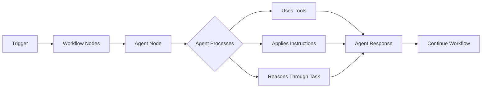
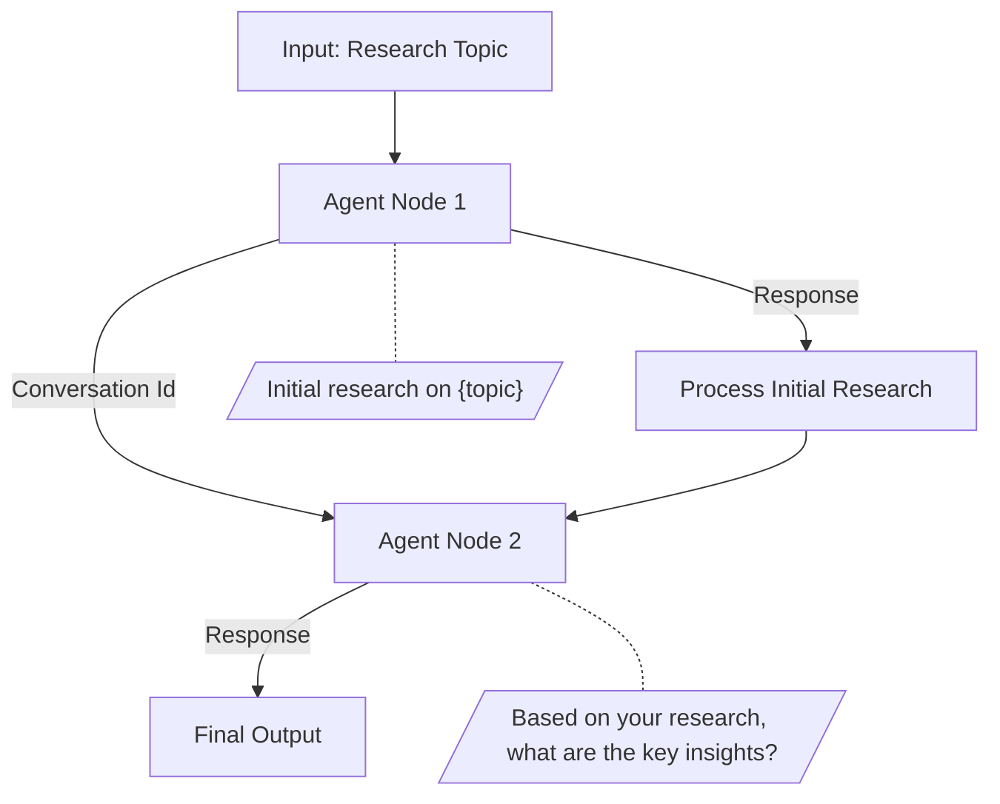
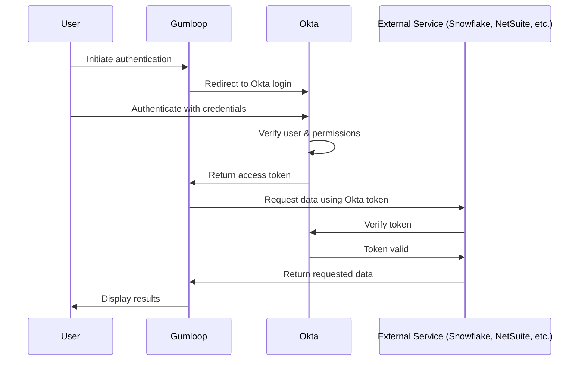
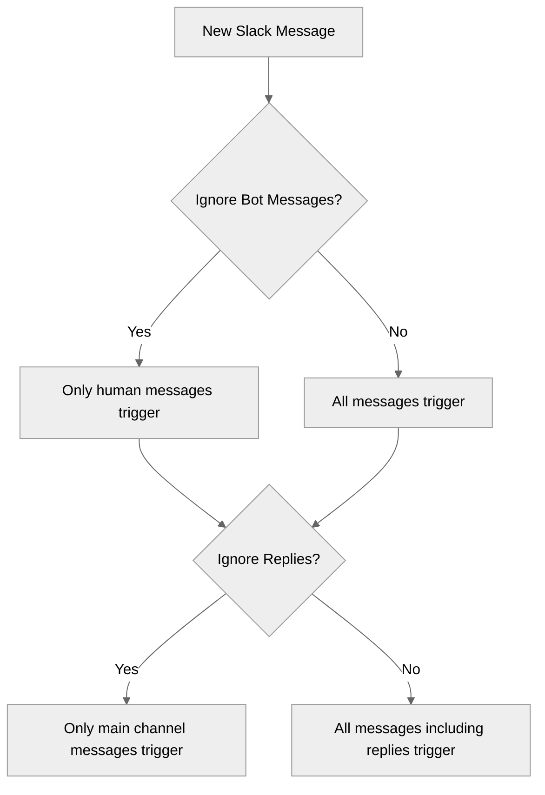
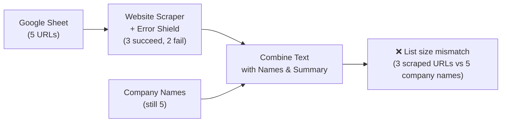
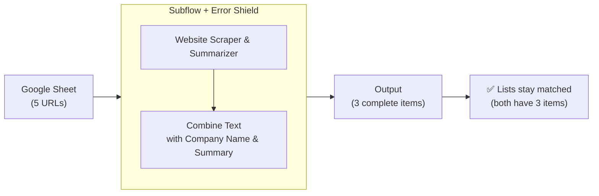
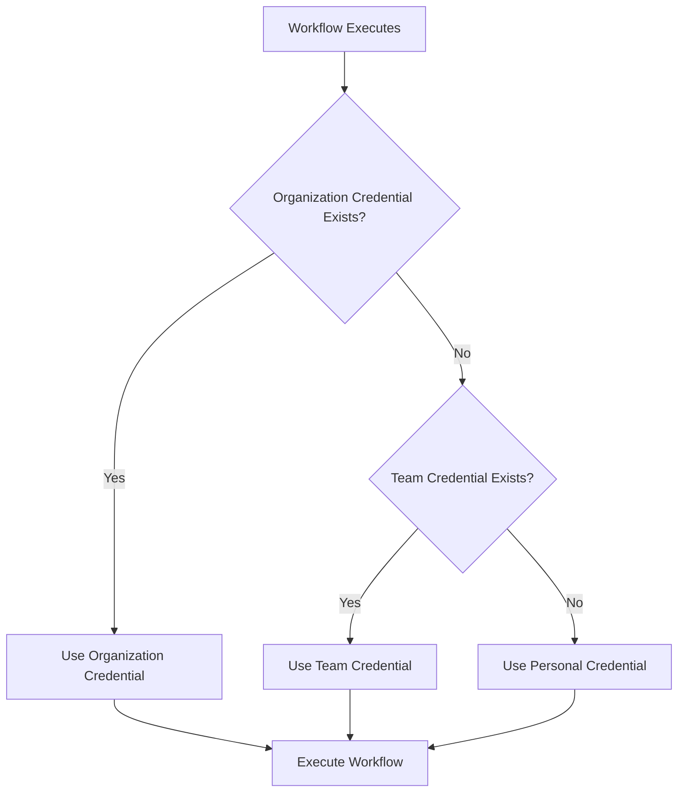
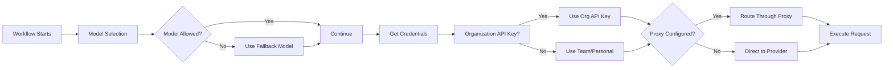

# Gumloop Documentation — Complete Guide (Part 1: Core Concepts & Reference)

*This document was scraped and cleaned from Gumloop's official documentation for ingestion into NotebookLM as a learning-plan source. Custom UI components (callouts, cards, tabs, steps, accordions) have been converted to plain Markdown.*

- **Source:** https://docs.gumloop.com
- **Part:** 1 of 3 — Getting Started & Overview, Core Concepts, Common Errors & Troubleshooting, CLI Reference, API Reference, Enterprise Features
- **Pages in this file:** 122 (of 420 total pages across the full guide)
- **Date scraped:** 2026-07-18

## Table of Contents

- [Getting Started & Overview](#getting-started-overview)
  - [Getting Started with Gumloop](#getting-started-with-gumloop)
  - [MCP Server](#mcp-server)
  - [Welcome to Gumloop](#welcome-to-gumloop)
- [Core Concepts](#core-concepts)
  - [AI Models](#ai-models)
  - [Agent Artifacts (Files)](#agent-artifacts-files)
  - [Agent Email Inbox](#agent-email-inbox)
  - [Agent Node](#agent-node)
  - [Agent Skills](#agent-skills)
  - [Agent Triggers](#agent-triggers)
  - [Agents](#agents)
  - [Alerts](#alerts)
  - [Brain](#brain)
  - [Code Sandbox & Secrets](#code-sandbox-secrets)
  - [Community Template Submission Guidelines](#community-template-submission-guidelines)
  - [Connectors](#connectors)
  - [Create Triggers With AI](#create-triggers-with-ai)
  - [Credits](#credits)
  - [Custom Slack App Integration](#custom-slack-app-integration)
  - [Evaluations](#evaluations)
  - [Gumloop Interfaces](#gumloop-interfaces)
  - [Hosted Pages](#hosted-pages)
  - [Human in the Loop](#human-in-the-loop)
  - [Loop Mode](#loop-mode)
  - [Node Versioning](#node-versioning)
  - [Node and Workflow Library](#node-and-workflow-library)
  - [Okta Integration](#okta-integration)
  - [Organization and Teams](#organization-and-teams)
  - [Rate Limits](#rate-limits)
  - [Reflections](#reflections)
  - [Run Log](#run-log)
  - [Share Permissions](#share-permissions)
  - [Subflows](#subflows)
  - [Tips & Tricks](#tips-tricks)
  - [Types](#types)
  - [User Roles](#user-roles)
  - [Using Agents in Microsoft Teams](#using-agents-in-microsoft-teams)
  - [Using Agents in Slack](#using-agents-in-slack)
  - [Workflow Checkpoints](#workflow-checkpoints)
  - [Workflow Triggers](#workflow-triggers)
  - [Workflows](#workflows)
  - [Working With Files](#working-with-files)
- [Common Errors & Troubleshooting](#common-errors-troubleshooting)
  - [Flow Terminated Due to Excess Memory Consumption](#flow-terminated-due-to-excess-memory-consumption)
  - [Join List Items vs Loop Mode](#join-list-items-vs-loop-mode)
  - [List Size Mismatch Errors](#list-size-mismatch-errors)
  - [Type Mismatch Errors](#type-mismatch-errors)
- [CLI Reference](#cli-reference)
  - [Agents](#agents)
  - [Artifacts](#artifacts)
  - [Authentication](#authentication)
  - [Brain](#brain)
  - [Chat](#chat)
  - [Gumloop for Terminal](#gumloop-for-terminal)
  - [MCP Servers](#mcp-servers)
  - [Sessions](#sessions)
  - [Skills](#skills)
- [API Reference](#api-reference)
  - Agents
    - [Attach or detach agent skills](#attach-or-detach-agent-skills)
    - [Attach or update an agent MCP server](#attach-or-update-an-agent-mcp-server)
    - [Create agent](#create-agent)
    - [Detach an agent MCP server](#detach-an-agent-mcp-server)
    - [List agent MCP servers](#list-agent-mcp-servers)
    - [List agents](#list-agents)
    - [Retrieve agent](#retrieve-agent)
    - [Update agent](#update-agent)
  - Artifacts
    - [Download artifact](#download-artifact)
    - [List artifacts](#list-artifacts)
  - Authentication
    - [Authentication](#authentication)
  - Brain
    - [Search Company Brain](#search-company-brain)
  - Chat Completions
    - [Create chat completion](#create-chat-completion)
  - Evaluations
    - [Get evaluation config](#get-evaluation-config)
    - [Get evaluation metrics](#get-evaluation-metrics)
    - [List evaluations](#list-evaluations)
    - [Retrieve evaluation](#retrieve-evaluation)
    - [Update evaluation config](#update-evaluation-config)
  - File Operations
    - [Download file](#download-file)
    - [Download multiple files](#download-multiple-files)
    - [Upload file](#upload-file)
    - [Upload multiple files](#upload-multiple-files)
  - Getting Automation Details
    - [List saved flows](#list-saved-flows)
    - [List workbooks and their saved flows](#list-workbooks-and-their-saved-flows)
    - [Retrieve automation run history](#retrieve-automation-run-history)
    - [Retrieve input schema](#retrieve-input-schema)
  - Getting Started
    - [Getting Started](#getting-started)
  - MCP
    - [Call MCP tools](#call-mcp-tools)
    - [List MCP server tools](#list-mcp-server-tools)
    - [List MCP servers](#list-mcp-servers)
    - [Retrieve an MCP server](#retrieve-an-mcp-server)
  - Models
    - [List models](#list-models)
  - OAuth
    - [OAuth 2.0](#oauth-20)
  - Organization
    - [Export data](#export-data)
    - [Get data export status](#get-data-export-status)
    - [Manage custom role users](#manage-custom-role-users)
    - [Manage workspace users](#manage-workspace-users)
    - [Retrieve audit logs](#retrieve-audit-logs)
  - Running an Automation
    - [Kill flow run](#kill-flow-run)
    - [Retrieve run details](#retrieve-run-details)
    - [Start flow run](#start-flow-run)
  - SDK
    - [JavaScript SDK](#javascript-sdk)
    - [Python SDK](#python-sdk)
  - Sessions
    - [Cancel session](#cancel-session)
    - [Create session](#create-session)
    - [List sessions](#list-sessions)
    - [Retrieve session](#retrieve-session)
    - [Send message](#send-message)
  - Skills
    - [Create skill](#create-skill)
    - [Delete skill](#delete-skill)
    - [Download skill](#download-skill)
    - [List skills](#list-skills)
    - [Update skill](#update-skill)
  - Teams
    - [List teams](#list-teams)
- [Enterprise Features](#enterprise-features)
    - [AI Model Governance & Configuration](#ai-model-governance-configuration)
    - [App Activity](#app-activity)
    - [Audit Logging](#audit-logging)
    - [Custom Roles](#custom-roles)
    - [Hosted MCPs](#hosted-mcps)
    - [Organization Analytics](#organization-analytics)
    - [Proxied MCPs](#proxied-mcps)
    - [SSO, SAML & SCIM](#sso-saml-scim)
    - [Static Egress IPs](#static-egress-ips)
    - [Usage Data Export](#usage-data-export)
  - App Policies
    - [App Claims](#app-claims)
    - [App Policies](#app-policies)
    - [App Rules](#app-rules)
    - [Domain Restrictions](#domain-restrictions)

---

## Getting Started & Overview

### Getting Started with Gumloop

**Source:** https://docs.gumloop.com/getting-started/introduction

There are two fundamental concepts in Gumloop: **agents** and **workflows**. Agents are AI-powered assistants that use tools to solve tasks for you. Workflows let those agents run automatically—on a schedule, in bulk, or triggered by events. Watch the video below for a quick intro, then dive into our courses to start building!

  *[Embedded media]*

  
In a more agentic... An AI agent... Agents... Agentic workflows... AI this, agents that. I know you feel like I do.
    It's all a little overwhelming.

  
Behind the hype, though, there's some real magic. Agents can take care of and automate tasks in your business that
    frankly you hate doing, or speed up crucial ones so you can focus on the important stuff in your business.

  
You'd be surprised of the work you do today that could be taken care of by an agent, if only you could build one.

  
Well, in this course, we're going to build that agent step by step. We'll cover how to think about using agents and
    where they can be useful in your business, how to set up an agent with the right tools, models, and skills. Now,
    these may be words today that you don't know, and that's totally fine. We'll cover all of them one by one.

  
And then how to deploy that agent for your team to use in Slack, in email, or even have it run in the background to
    accomplish work for you.

  
So join me in the next lesson where we build our first agent. And as you get there, think of something in your
    business you wish could be taken care of for you, and I'll see you there.

#### Start Learning

  - **[Build your first agent](https://docs.gumloop.com/core-concepts/agents)**: Create an AI assistant that intelligently orchestrates your tools to solve complex tasks

  - **[Build your first workflow](https://docs.gumloop.com/core-concepts/workbooks)**: Create visual, drag-and-drop automations with 100+ pre-built nodes and integrations

### MCP Server

*Connect to the Gumloop MCP server from Claude, Cursor, VS Code, and other MCP-compatible clients.*

**Source:** https://docs.gumloop.com/mcp-server/overview

Connect to the Gumloop MCP server from Claude, Cursor, VS Code, and other MCP-compatible clients.

Gumloop exposes a remote [Model Context Protocol (MCP)](https://www.gumloop.com/blog/what-is-mcp-model-context-protocol-a-simple-guide) server that lets any compatible AI client manage your workflows, agents, sessions, skills, and more.

Connect to the Gumloop MCP server natively in Claude, Cursor, and other clients, or use [`mcp-remote`](https://www.npmjs.com/package/mcp-remote) for clients that don't yet support remote MCP.

```text
https://mcp.gumloop.com/gumloop/mcp
```

> **Info:** You'll need a Gumloop API key. Get one from [Connectors page](https://www.gumloop.com/personal/connectors). The server handles OAuth automatically: you'll be prompted to sign in and authorize access the first time you connect.

#### Setup

##### Claude

Navigate to **Settings > Connectors** and add a new MCP integration with the URL:

```text
https://mcp.gumloop.com/gumloop/mcp
```

##### Cursor

1. Open Cursor Settings (Cmd/Ctrl + Shift + J)
2. Go to **MCP** and click **Add new MCP server**
3. Select **Type: SSE** and enter the server URL:

```text
https://mcp.gumloop.com/gumloop/mcp
```

##### VS Code

Add the following to your `.vscode/mcp.json`:

```json
{
  "mcpServers": {
    "gumloop": {
      "command": "npx",
      "args": ["-y", "mcp-remote", "https://mcp.gumloop.com/gumloop/mcp"]
    }
  }
}
```

##### Windsurf

1. Open Windsurf settings (Cmd/Ctrl + ,)
2. Scroll to **Cascade > MCP servers**
3. Select **Add Server > Add custom server**
4. Add:

```json
{
  "mcpServers": {
    "gumloop": {
      "command": "npx",
      "args": ["-y", "mcp-remote", "https://mcp.gumloop.com/gumloop/mcp"]
    }
  }
}
```

##### Gumloop CLI

You can also explore and call tools from your terminal:

```bash
gumloop mcp list                                    # List connected servers
gumloop mcp tools gumloop                           # Browse available tools
gumloop mcp call gumloop list_agents --args-json '{}' # Call a tool
```

See the [CLI MCP docs](https://docs.gumloop.com/cli/mcp) for the full reference.

#### Available Tools

The Gumloop MCP server exposes 40 tools across these categories:

##### Agent Management

| Tool                      | Description                                                                                                |
| ------------------------- | ---------------------------------------------------------------------------------------------------------- |
| `list_agents`             | List agents in your account, with optional search and workspace filtering                                  |
| `get_agent`               | Fetch a single agent's configuration by its ID                                                             |
| `create_agent`            | Create a new agent with a name, model, and optional configuration (including `skill_ids` to attach skills) |
| `update_agent`            | Update an existing agent's metadata or configuration                                                       |
| `attach_agent_skills`     | Attach one or more existing skills to a Gumloop agent                                                      |
| `detach_agent_skills`     | Detach one or more skills from a Gumloop agent                                                             |
| `attach_agent_mcp_server` | Attach an MCP server (connector) to an agent, or update its configuration if already attached              |
| `detach_agent_mcp_server` | Detach an MCP server (connector) from an agent                                                             |
| `list_models`             | List the model groups available to agents                                                                  |

##### Agent Sessions

| Tool                   | Description                                                                       |
| ---------------------- | --------------------------------------------------------------------------------- |
| `start_agent`          | Send a message to an agent and start an asynchronous interaction                  |
| `get_agent_status`     | Poll the status of an agent interaction and retrieve the response when completed  |
| `create_agent_session` | Start a session on an agent and return the completed response                     |
| `get_session`          | Fetch the state and result of an agent session by ID                              |
| `send_session_message` | Send a follow-up message to an existing session and return the completed response |
| `cancel_session`       | Cancel an in-progress agent session                                               |

##### Skills

| Tool             | Description                                                                  |
| ---------------- | ---------------------------------------------------------------------------- |
| `list_skills`    | List skills in your account, with optional search, filtering, and pagination |
| `create_skill`   | Create a skill from one or more files stored in your workspace               |
| `update_skill`   | Replace a skill's files with files stored in your workspace                  |
| `delete_skill`   | Delete a skill from your account                                             |
| `download_skill` | Get a download URL for a skill archive                                       |

##### Artifacts

| Tool                   | Description                                                                              |
| ---------------------- | ---------------------------------------------------------------------------------------- |
| `list_agent_artifacts` | List the artifacts an agent has produced, with optional session filtering and pagination |
| `download_artifact`    | Get a download URL for an agent artifact                                                 |

##### Teams

| Tool         | Description                                                   |
| ------------ | ------------------------------------------------------------- |
| `list_teams` | List the teams (workspaces) the authenticated user belongs to |

##### MCP Server Management

| Tool                    | Description                                                                |
| ----------------------- | -------------------------------------------------------------------------- |
| `list_mcp_servers`      | List the MCP servers connected to your account                             |
| `get_mcp_server`        | Fetch a single connected MCP server's configuration by ID                  |
| `list_mcp_server_tools` | List the tools exposed by a connected MCP server                           |
| `call_mcp_tool`         | Execute a single tool on a connected MCP server                            |
| `list_mcp_resources`    | List the resources exposed by a connected MCP server                       |
| `read_mcp_resource`     | Read the contents of a resource from a connected MCP server by URI         |
| `list_mcp_prompts`      | List the prompts exposed by a connected MCP server                         |
| `get_mcp_prompt`        | Get a rendered prompt from a connected MCP server, with optional arguments |

##### Company Brain

| Tool           | Description                                                                |
| -------------- | -------------------------------------------------------------------------- |
| `search_brain` | Search your Company Brain's indexed knowledge sources for relevant content |

##### Documentation & Admin

| Tool                   | Description                                                                                   |
| ---------------------- | --------------------------------------------------------------------------------------------- |
| `search_documentation` | Search Gumloop documentation using semantic and keyword search with filtering options         |
| `ask_gummie`           | Ask questions and get AI-powered answers from Gumloop documentation with citations            |
| `get_audit_logs`       | Retrieve organization audit logs with event details and filtering by time period (admin only) |

##### Workflow Management

| Tool               | Description                                                                           |
| ------------------ | ------------------------------------------------------------------------------------- |
| `list_saved_flows` | List saved flows/items in your account for a specific user or project                 |
| `list_workbooks`   | List workbooks and their associated saved flows with nested flow information          |
| `start_flow_run`   | Start/trigger flow execution with optional input parameters                           |
| `get_run_details`  | Retrieve detailed flow run information including state, outputs, logs, and timestamps |
| `get_run_history`  | Retrieve automation run history for workbooks or saved items with execution details   |

#### Example Prompts

Once connected, try these with your AI client:

```text
Show me all my saved flows
```

```text
Start the "Daily Report" flow with input parameter date set to today
```

```text
Create a new agent called "Research Assistant" using the GPT-4o model
```

```text
Start a session with my Research Assistant agent and ask it to summarize the latest quarterly report
```

```text
What MCP servers are connected to my account?
```

```text
Search my Company Brain for our refund policy and summarize what it says
```

#### Related Resources

  - **[Gumloop MCP Integration](https://docs.gumloop.com/nodes/mcp/gumloop)**: Full tool reference and usage examples.

  - **[API Reference](https://docs.gumloop.com/api-reference/mcp/list-servers)**: Programmatically manage MCP servers and call tools via the REST API.

  - **[CLI Reference](https://docs.gumloop.com/cli/mcp)**: Explore and call MCP tools from your terminal.

  - **[Custom MCP Servers](https://docs.gumloop.com/nodes/mcp/custom_mcp_servers)**: Connect your own MCP servers to Gumloop.

#### Need Help?

* [Agents documentation](https://docs.gumloop.com/core-concepts/agents) for using MCP tools with agents
* Need help? [Reach out to us](https://portal.usepylon.com/gumloop/forms/help)
* Browse our [Knowledge Base](https://support.gumloop.com/) for common questions

### Welcome to Gumloop

**Source:** https://docs.gumloop.com/index

### Welcome to Gumloop 👋

  
Build powerful AI automations without code—from simple workflows to intelligent agents.

  
    - **[Create Agents](https://docs.gumloop.com/core-concepts/agents)**: Build AI assistants that intelligently orchestrate your tools to solve complex tasks

    - **[Build Workflows](https://docs.gumloop.com/core-concepts/workbooks)**: Create visual, drag-and-drop automations with 100+ pre-built nodes and integrations

    - **[API Reference](https://docs.gumloop.com/api-reference/getting-started)**: Trigger automations programmatically with webhooks, REST APIs, and SDKs

    - **[Gumloop University](https://university.gumloop.com/)**: Learn to become a Gumloop and AI pro with short video lessons. No prior knowledge required.

---

## Core Concepts

### AI Models

*Gumloop gives your agents access to the top models from every major provider. You choose the model in **Agent Preferences**, at the top of the agent's configuration.*

**Source:** https://docs.gumloop.com/core-concepts/ai_models

Gumloop gives your agents access to the top models from every major provider. You choose the model in **Agent Preferences**, at the top of the agent's configuration.

> **Info:** AI models evolve rapidly. New models are usually available in Gumloop within a day of their public release, so you have the latest options even if this page has not caught up yet.

#### Choosing a model

Open the model dropdown in **Agent Preferences**. The fastest way to choose is one of the three presets at the top:

*[Screenshot: Agent model picker showing Recommended, Smartest, and Fastest presets, a provider list, and a model detail card for Claude 4.8 Opus]*

* **Recommended**: the best balance of speed, quality, and cost. This is the default for new agents.
* **Smartest**: maximum intelligence for complex reasoning and agentic work.
* **Fastest**: optimized for speed and low latency on simple, high-volume tasks.

Each preset maps to a current best-in-class model that Gumloop keeps up to date, so you do not have to track model releases yourself. On **Enterprise** plans, your organization can choose which model each preset points to, so you may see different models than the defaults. See [AI Model Governance & Configuration](https://docs.gumloop.com/enterprise-features/ai_model_control).

To pick a specific model instead, search by name or browse by provider: **Anthropic**, **OpenAI**, **Google**, **DeepSeek**, **MiniMax**, **Z.ai**, and more.

> **Tip:** Start with **Recommended** for most agents. Switch to **Smartest** when a task needs deeper reasoning, or **Fastest** for simple, high-volume runs where latency matters.

#### Reading the model card

Selecting or hovering a model opens a detail card so you can compare options at a glance:

* **Description**: what the model is best at.
* **Speed** and **Intelligence**: relative ratings across the catalog.
* **Provider** and **Context**: who makes the model and how much it can read at once (in tokens and approximate words).
* **Tool Calling** and **Vision**: capability checks.
* **Badges**: extra labels that call out how a model is served. Models marked **US-provider hosted** are served by US providers under Zero Data Retention (ZDR) policies.

> **Note:** For agents that read images or screenshots, pick one with **Vision**.

#### Available models

These are the models you can choose for an agent, grouped by provider. Every one supports tool calling, so it can use your apps and workflows. Models marked **Vision** can also read images and screenshots. New models are added continually, so the in-product picker is always the most up-to-date list.

| Provider  | Model             | Vision |
| --------- | ----------------- | ------ |
| Anthropic | Claude 5 Sonnet   | Yes    |
| Anthropic | Claude 4.8 Opus   | Yes    |
| Anthropic | Claude 4.7 Opus   | Yes    |
| Anthropic | Claude 4.6 Opus   | Yes    |
| Anthropic | Claude 4.6 Sonnet | Yes    |
| Anthropic | Claude 4.5 Sonnet | Yes    |
| Anthropic | Claude 4.5 Haiku  | Yes    |
| OpenAI    | GPT-5.6 Sol       | Yes    |
| OpenAI    | GPT-5.6 Terra     | Yes    |
| OpenAI    | GPT-5.6 Luna      | Yes    |
| OpenAI    | GPT-5.5           | Yes    |
| OpenAI    | GPT-5.4           | Yes    |
| OpenAI    | GPT-5.4 Mini      | Yes    |
| OpenAI    | GPT-5.4 Nano      | Yes    |
| OpenAI    | GPT-5.3 Codex     | Yes    |
| OpenAI    | GPT-5.2           | Yes    |
| OpenAI    | GPT-5.2 Codex     | Yes    |
| OpenAI    | GPT-OSS 120B      | No     |
| Google    | Gemini 3.1 Pro    | Yes    |
| Google    | Gemini 3.5 Flash  | Yes    |
| Google    | Gemini 3 Flash    | Yes    |
| DeepSeek  | DeepSeek V4 Flash | No     |
| DeepSeek  | DeepSeek V4 Pro   | No     |
| MiniMax   | MiniMax M3        | Yes    |
| Qwen      | Qwen3.5 397B      | Yes    |
| Moonshot  | Kimi K2.7 Code    | Yes    |
| Moonshot  | Kimi K2.6         | Yes    |
| Z.ai      | GLM-5.2           | No     |
| SpaceXAI  | Grok 4.5          | Yes    |

> **Note:** GPT-OSS 120B, Qwen3.5 397B, Kimi K2.6, and Grok 4.5 are exclusive to agents and are not available in workflow AI nodes.

#### How agents are charged

In agents, model cost is **token-based and variable**. You are charged for the tokens each message uses, which depends on the model, the length of the conversation, and the tools available. There are no fixed per-message tiers. Open **Chat Details** on any conversation to see its exact usage, and see [Credits](https://docs.gumloop.com/core-concepts/credits) for the full breakdown.

#### Bring your own key (BYOK)

Provide your own provider API key to cut model costs. BYOK gives you **50% off** AI model credits in both agents and workflow AI nodes, and it also applies to voice transcription.

**Requirements:** Pro plan or higher, and your own OpenAI, Anthropic, Google AI, Perplexity, or SpaceXAI account.

  
**Pro**

Add a key under your **personal credentials** at [Connectors page](https://www.gumloop.com/personal/connectors) so your own calls route through it, or add a **shared team key** so the whole team can use it without managing individual keys. Pro users cannot set keys at the organization level.

  
**Enterprise**

Admins can set **organization API keys** that override personal and team keys for everyone, and route all AI requests through a **custom proxy** at [gumloop.com/settings/organization/api-keys](https://gumloop.com/settings/organization/api-keys). See [AI Model Governance & Configuration](https://docs.gumloop.com/enterprise-features/ai_model_control) for model access control, proxy setup, and model name mapping.

> **Note:** All open-source models (such as GPT-OSS 120B, LLaMA, DeepSeek, Qwen, Kimi, MiniMax, and GLM) are accessed through US-based providers under Zero Data Retention (ZDR) policies, and carry a **US-provider hosted** badge in the model picker. Your data is never used for model training and is not stored after inference.

#### Using these models in workflows

The same models power workflow AI nodes, and they are billed the **same way as agents**: by token usage.

  
**How workflow AI nodes are charged**

Workflow AI nodes (such as Ask AI, Analyze Image, and Generate Report) are billed by **token usage**, based on the model you pick and how many input and output tokens each call uses. There are no fixed per-call tiers, so a short prompt costs far less than a long-context one.

    * Smaller, faster models cost less per token than frontier models.
    * With **BYOK**, workflow AI node calls cost **50% fewer credits**, the same discount agents get.
    * **Image generation** is billed at a flat **30 credits per image** (15 with BYOK), regardless of size, quality, or model. **Audio transcription** is billed by audio length at a small per-minute rate that depends on the model (roughly 1 to 2 credits per minute), and BYOK halves it.

    For the full workflow credit breakdown, see [Credits](https://docs.gumloop.com/core-concepts/credits).

### Agent Artifacts (Files)

**[Video: Agent Artifacts]**

**Source:** https://docs.gumloop.com/core-concepts/agent_artifacts

*[Video: Agent Artifacts]*

When your Gumloop agents generate files during a conversation, those files are saved as **artifacts**. Reports, spreadsheets, images, code files, HTML dashboards: anything your agent creates can be viewed, downloaded, shared, and version-tracked directly from the chat.

#### How Artifacts Work

When an agent generates a file in its sandbox (using code execution, data processing, or any tool that produces a file), it exports the file using a built-in export tool. This:

1. Saves the file to secure cloud storage
2. Creates a versioned artifact record
3. Generates preview thumbnails and representations
4. Displays the file as a rich card in the chat

You don't need to configure anything. Agents automatically export files they create, and artifacts appear inline in the conversation as they're generated.

#### Viewing Artifacts

##### In-Chat Preview

When an agent exports a file, it appears as a card in the chat message showing the filename, file type icon, and a thumbnail preview (for supported types). Click the card to open a side panel preview without leaving the chat.

##### Dedicated Viewer Page

Each artifact has its own shareable page at a unique URL. The viewer page shows:

* Full-width file preview
* Filename, file type, and size
* Who created it and which agent generated it
* Links to view the source chat and agent (if you have access)

##### Files Sidebar

All files from a conversation are listed in the **Files** section of the chat sidebar. Click any file to preview it, open it in a new tab, copy its link, or download it.

#### Supported Preview Types

Gumloop can render inline previews for many file types:

| File Type                                          | Preview                        |
| -------------------------------------------------- | ------------------------------ |
| **HTML** (.html)                                   | Interactive sandboxed preview  |
| **Images** (.png, .jpg, .gif, .webp, .svg)         | Native image viewer            |
| **PDF** (.pdf)                                     | PDF viewer                     |
| **Spreadsheets** (.csv, .xlsx, .xls)               | Spreadsheet viewer             |
| **Presentations** (.pptx, .ppt)                    | Slide viewer or PDF preview    |
| **Text & Code** (.txt, .md, .py, .js, .json, etc.) | Syntax-highlighted text viewer |
| **All other files**                                | Download prompt with file size |

> **Info:** Files larger than 50 MB cannot be previewed inline and are shown as download-only.

#### Actions

From the viewer page or the in-chat card, you can perform several actions on an artifact:

  *[Image: Artifact options menu showing Share, Copy link, and Download actions]*

| Action              | Description                                             |
| ------------------- | ------------------------------------------------------- |
| **Download**        | Download the original file to your device               |
| **Share**           | Open the share dialog to manage who can access the file |
| **Copy link**       | Copy a shareable URL to your clipboard                  |
| **Open in new tab** | Open the dedicated viewer page                          |
| **Version history** | View all versions of the file                           |
| **Full screen**     | Available for HTML artifacts only                       |

#### Automatic Versioning

When an agent exports a file with the **same filename** multiple times in the same conversation, Gumloop automatically creates new versions instead of overwriting. This gives you a full history of how a file evolved during the conversation.

  *[Image: Version history panel showing Version 2 and Version 1 with timestamps and file sizes]*

Each version shows:

* **Version number** (v1, v2, v3, etc.)
* **Timestamp** of when it was created
* **File size**

Click any version to view it. The latest version is always shown by default.

> **Tip:** Agents are instructed to keep the same filename and let the system handle versioning. If you see files like `report_v2.pdf` instead of version 2 of `report.pdf`, you can update your agent's instructions to tell it not to rename files for versioning.

#### Sharing & Access Control

Artifacts use Gumloop's [share permissions](https://docs.gumloop.com/core-concepts/share_permissions) system. You can control who can view, download, and manage each file.

##### Share Dialog

Click **Share** from the options menu to open the share dialog:

  *[Image: Artifact share dialog showing General Access options: Restricted, Organization, and Anyone]*

You can:

* **Add specific users** by email
* **Set General Access** to control broader visibility

##### General Access Levels

| Level            | Who Can Access                                                   |
| ---------------- | ---------------------------------------------------------------- |
| **Restricted**   | Only you and explicitly shared users                             |
| **Organization** | All members of your organization                                 |
| **Anyone**       | Anyone with the link, including people without a Gumloop account |

##### Default File Sharing

Each agent has a **Default File Sharing** setting that controls how new artifacts are shared when created. You can configure this in **Agent Settings > Chat Preferences > Default File Sharing**:

| Setting          | What Happens                                                                       |
| ---------------- | ---------------------------------------------------------------------------------- |
| **Default**      | Team agents share with the team. Personal agents keep files restricted (only you). |
| **Organization** | Files are shared with your entire organization                                     |
| **Anyone**       | Files are publicly accessible via link                                             |

> **Info:** The default sharing setting applies to **new** artifacts only. You can always change the sharing level of any individual artifact after it's created.

##### Requesting Access

If someone shares a file link with you but you don't have access:

* **Not signed in**: You'll see a prompt to create a Gumloop account
* **Signed in, no access**: You'll see a **Request Access** button that sends a notification to the file's owner or a workspace admin. If they have Slack connected, they can approve with a single click. See [Action Requests](https://docs.gumloop.com/core-concepts/share_permissions#action-requests) for more details.

#### HTML Artifacts

HTML files get special treatment. Agents can generate fully interactive HTML pages, dashboards, and web applications that render directly in the viewer.

##### Full Screen Mode

HTML artifacts support a **full screen mode** that hides the toolbar and gives the artifact the full browser window. This is useful for dashboards, interactive tools, and presentations. Click the full screen button in the viewer toolbar to enter full screen.

##### Security

HTML artifacts run in a **strict security sandbox**. This is important because agents can generate arbitrary HTML and JavaScript. The sandbox:

* Blocks access to your Gumloop session, cookies, and storage
* Blocks direct network requests (fetch, XHR, WebSocket)
* Prevents opening new windows or popups
* Automatically strips sensitive headers from any proxied requests

**Safe requests** (GET, HEAD) from within an HTML artifact are automatically proxied. **Unsafe requests** (POST, PUT, DELETE) require your explicit approval via a confirmation dialog.

#### Interactive Artifacts (Live Data)

  *[Video: Live Artifacts]*

Interactive artifacts are HTML files that pull **live data from your connected integrations** every time you open them. Instead of showing a static snapshot from when the agent ran, the data refreshes on each view using your own credentials.

This is the difference between an agent handing you a screenshot of your Slack channels vs. giving you a live dashboard that always shows the latest.

##### How They Work

When you ask an agent to build something that needs live data, it creates two things:

1. **An HTML file** with the layout, styling, and JavaScript for the UI
2. **One or more Python data scripts** that fetch data from your integrations at view time

The HTML calls `fetch('/gumloop/data/...')` to request data. Gumloop intercepts these requests, runs the matching Python script in a secure sandbox, and returns the results as JSON. The HTML then renders the data.

You don't need to know any of this to use it. Just ask your agent for a dashboard, report, or tool that uses your connected apps, and it handles the wiring.

##### Integration Consent

When you open an interactive artifact for the first time, you'll see a consent overlay that lists every integration the file can access and the specific actions it can perform.

  *[Image: Integration consent overlay showing the file is requesting permission to use Slack with 1 tool, with an I acknowledge, continue button]*

**You must approve before any scripts run.** This is a deliberate security step. It means:

* You always know exactly which integrations a file will use
* No data is fetched until you explicitly approve
* If someone shares a file with you, you decide whether to grant it access to your accounts

> **Tip:** Consent is per-session. If you refresh the page, you'll see the consent overlay again. This is intentional: it ensures you're always aware of what a file is doing.

##### Your Credentials, Your Data

Interactive artifacts run using the **viewer's** connected accounts, not the creator's. This is a core design choice.

If your teammate creates a "Team Slack Dashboard" and shares it with you:

* When **they** open it, they see data from **their** Slack account
* When **you** open it, you see data from **your** Slack account
* The file creator never sees your data and you never see theirs

Each time a script runs, Gumloop mints a short-lived, scoped token that only allows the specific integrations and tools that the file declared. The token expires in 5 minutes and is invalidated as soon as the script finishes. Your credentials are never exposed to the HTML itself.

> **Warning:** If you haven't connected a required integration, you'll see a setup prompt asking you to connect it before the file can load. The artifact won't execute until all required integrations are connected.

##### What Can You Build?

Anything that combines a UI with live integration data. Here are some example prompts:

**Dashboards and monitors:**

* "Build me a dashboard that shows my open Linear issues, today's Google Calendar events, and my unread Gmail count."
* "Create a live team status page that pulls from Slack, Google Sheets, and HubSpot."
* "Make a monitoring page that shows my recent GitHub pull requests and their CI status."

**Interactive tools:**

* "Create an HTML form where I can compose a message, pick a Slack channel from a dropdown, and send it."
* "Build a tool that lets me search my Google Drive files and preview them."
* "Make a form that creates a new Linear issue with title, description, and assignee fields."

**Reports with live data:**

* "Generate a weekly summary report that pulls my Gmail activity, calendar meetings, and Slack messages from the past 7 days."
* "Create a CRM overview that shows my HubSpot deals pipeline with real-time data."

**Multi-integration workflows:**

* "Build a meeting prep page that, given a calendar event, pulls the attendee list from Google Calendar, finds their LinkedIn profiles, and shows recent email threads."

> **Tip:** The more specific you are about which integrations and data you want, the better the result. Tell the agent exactly which tools you want it to pull from.

##### How Teams Use Interactive Artifacts

Interactive artifacts are especially powerful for teams because the same file works differently for each person.

**Shared dashboards:** A team lead creates a "My Open Tasks" dashboard and shares it with the whole team. Each team member opens the same link but sees their own tasks, their own calendar, their own inbox. One artifact, personalized for everyone.

**Self-service tools:** An ops lead creates a "Post to #announcements" tool with a form. Anyone on the team can use it to send formatted messages to the channel without needing Slack open.

**Onboarding kits:** Create a "New Hire Status" page that shows a new team member their onboarding checklist from Linear, upcoming meetings from Google Calendar, and key documents from Google Drive. Share the link in your onboarding workflow.

**Client-facing reports:** Build a report template that pulls live data from your CRM. Share it with stakeholders, and each person sees data scoped to their access level.

##### Credits

Every time a data script runs, the **viewer** is charged credits for the sandbox execution time. The creator is not charged when someone else opens their file.

This means:

* You pay for what you use, not for what others view
* If you share a dashboard with 10 people, each person pays for their own data loads
* If you have no credits remaining, scripts won't execute and you'll see an error

##### Refreshing Data

Data scripts run each time you open the artifact. If the HTML includes a refresh button or auto-refresh timer, each refresh triggers a new script execution.

Keep in mind:

* Each execution costs credits
* Each execution creates a fresh sandbox (no state carried between refreshes)
* Scripts have a 5-minute timeout for long-running queries

##### Error Handling

If a data script fails (the integration is disconnected, the API returns an error, or the script times out), the HTML receives an error response. Well-built artifacts will show a friendly error message. If the agent didn't include error handling, the section may simply be blank.

Common reasons a script might fail:

* You haven't connected the required integration
* Your integration token has expired (reconnect in Settings > Integrations)
* The script timed out (queries that scan large amounts of data may exceed the 5-minute limit)
* You've run out of credits

#### Mobile Behavior

On mobile devices, artifacts work slightly differently:

* Clicking a file card opens the dedicated viewer page in a new tab (instead of a side panel)
* Auto-preview of new files is disabled to avoid disrupting the chat experience

#### Files Page

All your files are accessible from a dedicated **Files** page at [gumloop.com/personal/files](https://www.gumloop.com/personal/files). This page provides a centralized view of every artifact you've created or received across all your agent conversations.

The Files page has three tabs for filtering your view:

| Tab                | What It Shows                                                            |
| ------------------ | ------------------------------------------------------------------------ |
| **Mine**           | Files you created (from your own agent conversations)                    |
| **Shared with me** | Files that others have shared with you directly or via your organization |
| **Organization**   | All files visible to your organization                                   |

  *[Image: Files page showing the Shared with me tab with file cards grouped by date]*

You can search files by name, filter by media type, and sort by date. Each file card shows a thumbnail preview, filename, file type, and version number.

#### Workspace Files (Persistent Across Conversations)

By default, files created during an agent conversation are scoped to that conversation. However, agents can also work with **workspace files** that persist across conversations.

Files saved to the `/home/user/.workspace/` directory in the agent's sandbox are treated as **workspace-scoped artifacts**. These files are not tied to a single conversation — they persist and are available in future conversations with the same agent.

##### How Workspace Scope Works

* **Project members** share a common workspace. Files saved to `.workspace/` by one member are visible to other members of the same project.
* **Non-members** get an isolated workspace. Their `.workspace/` files are private and only accessible to them.

This is useful for agents that maintain ongoing project files, configuration, or reference data that should carry over between sessions.

> **Info:** Workspace files follow the same artifact system — they are versioned, previewable, and shareable just like conversation-scoped artifacts.

***

#### Common Questions

  
**Where are my files stored?**

Artifacts are stored securely in Google Cloud Storage. Files are accessible through the Gumloop viewer or via download. They persist as long as the conversation exists.

  
**Is there a file size limit?**

There is no hard limit on file size for creation. However, files larger than 50 MB cannot be previewed inline and will show a download prompt instead.

  
**Can I delete an artifact?**

Artifact deletion is managed by the file owner. If you're the owner (the person who ran the agent conversation that created the file), you have full control.

  
**What happens if the agent generates the same file multiple times?**

If the agent exports a file with the same filename in the same conversation, it automatically creates a new **version**. You can browse all versions from the version history panel. No data is lost.

  
**Can I share a file with someone outside my organization?**

Yes. You can either add them by email in the share dialog, or set General Access to "Anyone" to make the file accessible via link. Enterprise admins can restrict public sharing if needed.

  
**Why can't I see the 'View chat' or 'View agent' link on a shared file?**

These links only appear if you have access to the source agent. Artifact access does not automatically grant access to the agent that created it. Ask the agent owner to share the agent with you separately.

  
**Can I change the default sharing for all files my agent creates?**

Yes. Go to your agent's **Settings > Chat Preferences > Default File Sharing** and choose between Default, Organization, or Anyone. This applies to all new files the agent creates going forward.

  
**What's the difference between a static artifact and an interactive artifact?**

A **static** artifact is a regular file (PDF, image, CSV, or even a plain HTML page) that shows the same content every time you open it. An **interactive** artifact is an HTML file with attached data scripts that fetch live data from your integrations each time you open it. You can tell by whether you see a consent overlay when you open the file.

  
**Do interactive artifacts use my credentials or the creator's?**

**Yours.** Interactive artifacts always run with the viewer's connected accounts. The creator's credentials are never used when you open a shared file. This means you'll see your own data, and the creator never has access to it.

  
**Why do I see a consent screen every time I open an interactive file?**

Consent is per-session by design. Each time you open the file, you're reminded which integrations it will access and you must explicitly approve. This ensures you're always aware of what the file is doing with your accounts.

  
**What happens if I haven't connected a required integration?**

You'll see a setup screen that lists the integrations the file needs. You can connect them directly from this screen. The file won't run any scripts until all required integrations are connected.

  
**Who pays the credits when someone opens my shared interactive file?**

The **viewer** pays. Each time someone opens an interactive artifact, the scripts run using their credits. The creator is not charged when others view their files.

  
**Can an interactive artifact perform actions (send messages, create issues) or only read data?**

Both. Agents can build artifacts with forms and buttons that trigger write actions like sending a Slack message or creating a Linear issue. These actions run with your credentials and cost your credits, just like read operations.

  
**Can the HTML in an interactive artifact access my browsing session or cookies?**

No. HTML artifacts run in a strict sandbox that blocks access to your Gumloop session, cookies, localStorage, and all direct network requests. The only way the HTML can reach external services is through Gumloop's security proxy, which strips sensitive headers and blocks private network access.

  
**My interactive artifact shows an error or blank section. What should I try?**

Common fixes: (1) Check that all required integrations are connected in Settings > Integrations. (2) If a token has expired, disconnect and reconnect the integration. (3) Make sure you have credits remaining. (4) For very large queries, the script may have timed out (5-minute limit). Try asking the agent to reduce the data scope.

#### Related Documentation

  - **[Agents](https://docs.gumloop.com/core-concepts/agents)**: Learn how to create and configure agents

  - **[Share Permissions](https://docs.gumloop.com/core-concepts/share_permissions)**: Understand roles, access levels, and sharing

  - **[Working With Files](https://docs.gumloop.com/core-concepts/files)**: Upload and manage files in workflows

### Agent Email Inbox

*Give your agent a dedicated email address so anyone can interact with it by sending an email.*

**Source:** https://docs.gumloop.com/core-concepts/agents_email

Give your agent a dedicated email address so anyone can interact with it by sending an email.

  - **Dedicated Inbox**: Each agent gets a unique `@gumloopagents.com` email address that routes messages straight to the agent.

  - **Threaded Conversations**: Email replies stay threaded. The agent maintains full conversation history across multiple email exchanges.

  - **Works with Attachments**: Send files as email attachments and the agent can process them just like it would in chat.

  - **Control Access Anytime**: Update the email alias or disable the inbox whenever the agent no longer needs it.

***

#### Enabling the Email Inbox

1. **Open the Email Inbox Page**

   Navigate to your agent, then click **Email Inbox** under **External Channels** in the sidebar.

       *[Screenshot: Email Inbox option under External Channels in the agent sidebar]*

       You will see a page describing the feature and its benefits.

       *[Screenshot: Email Inbox setup page with Enable Email Inbox button]*

2. **Enable the Inbox**

   Click **Enable Email Inbox**. Gumloop automatically generates a unique email alias based on your agent's name. The alias follows the format:

       ```text theme={"dark"}
       your-agent-name@gumloopagents.com
       ```

       *[Screenshot: Email Inbox enabled showing the generated email address with copy and edit buttons]*

       You can copy the address using the copy button, or click the pencil icon to customize the alias.

3. **Start Sending Emails**

   Send an email to your agent's address from any email client. The agent processes the message and replies directly to the sender's inbox.

       *[Screenshot: Email conversation showing a user message and the agent's response inside the Gumloop chat interface]*

       All email interactions also appear in the agent's chat history inside Gumloop, so you can review conversations from either place.

***

#### Customizing the Email Alias

You can change the email alias at any time:

1. Open the **Email Inbox** page for your agent
2. Click the **pencil icon** next to the current address
3. Type your preferred alias and press **Enter** (or click the checkmark)

**Alias rules:**

* 3 to 64 characters
* Alphanumeric characters and hyphens only
* Must start and end with a letter or number

When you change the alias, the old address stops working immediately and the new address becomes active. Any emails sent to the old alias after the change will not be delivered.

> **Warning:** Changing the alias means anyone using the old address will need to update it. Share the new address with your team after making changes.

***

#### How It Works Behind the Scenes

When someone sends an email to your agent's address, here is what happens:

1. **Email received**: The inbound email arrives at `gumloopagents.com` and is routed to Gumloop's email processing service.
2. **Agent lookup**: Gumloop looks up which agent is registered to the email alias.
3. **Sender verification**: Gumloop verifies the message's DKIM signature against the sender's domain and matches the sender's email to a Gumloop account. The sender must have a Gumloop account, and their domain must have DKIM configured. Messages without a valid DKIM signature are rejected. See [Sender Domain Authentication (DKIM)](#sender-domain-authentication-dkim) for setup details.
4. **Permission check**: Gumloop verifies that the sender has permission to use the agent (same access control as the chat interface).
5. **Thread resolution**: If the email is a reply, Gumloop matches it to an existing conversation using email headers (`References`, `In-Reply-To`). New emails start a fresh conversation.
6. **Attachment processing**: Any file attachments are decoded and stored securely, then passed to the agent as file inputs.
7. **Agent execution**: The agent processes the message using the same AI engine as the chat interface, with access to all configured tools, integrations, and workflows.
8. **Reply sent**: The agent's response is formatted as an HTML email and sent back to the sender (and any CC'd recipients). File outputs from the agent are included as attachments.
9. **Conversation persisted**: The full exchange is saved to the agent's interaction history, visible in both the Gumloop UI and future email threads.

> **Info:** The email channel uses the same AI agent engine, tools, and credentials as the chat interface. There is no difference in agent capabilities between email and chat.

***

#### Sender Domain Authentication (DKIM)

Gumloop verifies the **DKIM signature** of every inbound email so it can confirm that the sender's domain actually authorized the message. Without this check, anyone could spoof an email from a teammate's address and gain access to that user's agents and credentials.

If the sender's domain does not have DKIM configured, the email is rejected. The sender usually receives a generic bounce from their mail provider that looks like an "Address not found" or "domain couldn't be found" error, even though the real cause is missing DKIM on their own outbound mail.

##### When This Affects You

* **Personal accounts** on Gmail, Outlook, iCloud, and similar consumer providers already have DKIM enabled by default. No action is needed.
* **Workspace and corporate domains** (custom domains hosted on Google Workspace, Microsoft 365, or another provider) need DKIM enabled by an administrator before they can email a Gumloop agent.

##### Setting Up DKIM on Your Domain

Ask your IT administrator to enable DKIM signing for the sending domain. Both major providers have step-by-step guides:

  - **[Google Workspace](https://knowledge.workspace.google.com/admin/security/set-up-dkim)**: Generate a DKIM key in the Admin console, add the provided TXT record to DNS, then turn on signing.

  - **[Microsoft 365 / Outlook](https://learn.microsoft.com/en-us/defender-office-365/email-authentication-dkim-configure)**: Add the two CNAME records for your custom domain in DNS, then enable DKIM in the Microsoft Defender portal.

DNS changes can take up to 48 hours to propagate. Once DKIM is active and outbound mail is signed, emails to your agent will go through.

> **Info:** If you administer your own mail server, configure DKIM using your provider's documentation and confirm a `DKIM-Signature` header is present on outbound messages. Gumloop accepts any valid DKIM signature where the signing domain (`d=`) matches the sender's domain.

##### Confirming DKIM is the Cause of a Bounce

If an email to your agent bounced and you're not sure why, open the bounce message and view the original headers:

* **Gmail**: open the message, click the three-dot menu, then **Show original**.
* **Outlook**: open the message, click **File > Properties** (desktop) or the three-dot menu and **View message source** (web).

Look at the `Authentication-Results` header. A line like `dkim=none` or `dkim=fail` (or no DKIM line at all) confirms the sender's domain is not signing outbound mail.

***

#### Threading and Conversation History

The email inbox supports full conversation threading:

* **New emails** start a new conversation with the agent.
* **Replies** (using your email client's reply button) continue the existing conversation. The agent has access to the full thread history.
* **CC recipients** are preserved. When the agent replies, it CCs everyone who was on the original email.
* **Subject lines** are included as context for new conversations, helping the agent understand the topic.

The agent uses standard email headers (`References` and `In-Reply-To`) to track threads, so threading works correctly across Gmail, Outlook, Apple Mail, and other email clients.

***

#### Credentials and Authentication

Email interactions use the same credential model as the chat interface:

* The agent uses the **sender's personal credentials** for any integrations (Gmail, Salesforce, etc.)
* If the sender has not authenticated with a required service, the agent will notify them in the reply
* Team credential settings (personal vs. team default) apply the same way as in chat

> **Info:** The sender's email address must match their Gumloop account email. If someone sends an email from an address not associated with a Gumloop account, they will receive an error reply asking them to sign up.

***

#### Concurrency and Rate Limits

Email agent interactions follow the same concurrency limits as other agent channels:

* If you have too many agent interactions running simultaneously, the email will receive a reply explaining that the request was rate-limited
* **Enterprise users** benefit from automatic queuing: instead of being rejected, their messages are queued and processed in order. The sender receives a notification with their queue position.
* If a message takes too long to process (exceeds the time limit), the sender receives an error reply

***

#### Disabling the Email Inbox

To turn off the email inbox:

1. Open the **Email Inbox** page for your agent
2. Click the red **Disable** button

Once disabled, any emails sent to the agent's address will no longer be delivered. You can re-enable the inbox at any time.

***

#### Permissions

Managing the email inbox requires **Editor access** to the agent. Viewers and "Use Only" users cannot enable, disable, or change the email alias.

Organization admins can also restrict email inbox access using **policy controls**. If email inboxes have been restricted by your admin, you will see a message indicating this on the setup page.

***

#### Troubleshooting

  
**My email bounced with 'Address not found' or 'domain couldn't be found'**

This almost always means the sender's domain does not have DKIM signing enabled. The bounce message from your mail provider can be misleading: `gumloopagents.com` exists and is reachable, but Gumloop rejected the message because the DKIM signature could not be verified.

    **Fix**: Ask your IT administrator to enable DKIM on the sender's domain. See [Sender Domain Authentication (DKIM)](#sender-domain-authentication-dkim) for the Google Workspace and Microsoft 365 setup guides.

    To confirm this is the cause, open the bounce email, view the original headers, and look for `dkim=` in the `Authentication-Results` header. A `dkim=none` or missing DKIM signature confirms the issue.

  
**The sender received a 'sign up for Gumloop' reply**

The sender's email address must match an existing Gumloop account. Either invite them to your organization or have them sign up at [gumloop.com](https://gumloop.com) using the same email address they're sending from.

  
**The agent didn't reply to my email**

Check the agent's chat history in Gumloop. If the email made it through, the conversation will appear there. If not, the email was rejected before it reached the agent. Common causes:

    * DKIM is not configured on the sender's domain (see above).
    * The sender's email does not match a Gumloop account.
    * The sender does not have permission to use the agent.
    * The email inbox has been disabled or restricted by an admin policy.

***

#### FAQ

  
**Who can send emails to the agent?**

Anyone with a Gumloop account and read access to the agent can send emails to it. The sender's email address must match the email on their Gumloop account, and the sender's domain must have DKIM configured.

  
**Can I use my own custom domain?**

Not currently. All agent email addresses use the `@gumloopagents.com` domain. Custom domain support may be added in the future.

  
**What happens if I send an email from an address not linked to Gumloop?**

You will receive an error reply asking you to sign up for a Gumloop account at [gumloop.com](https://gumloop.com).

  
**Are email attachments supported?**

Yes. File attachments are processed and made available to the agent. The agent can also send files back as attachments in its reply.

  
**How does CC work?**

If you CC other people on your email to the agent, the agent's reply will also CC those recipients. This makes it easy to keep team members in the loop.

  
**Can the agent send emails proactively?**

No. The email inbox is inbound-only. The agent only replies to emails it receives. It cannot initiate email conversations on its own. If you need outbound email capabilities, use the Gmail or email MCP integrations as agent tools.

  
**What email format does the agent reply in?**

The agent replies in HTML format with clean formatting, including support for headings, lists, code blocks, and tables. The reply also includes a plain-text fallback for email clients that do not render HTML.

  
**Can I have the same agent on both Slack and email?**

Yes. An agent can be connected to Slack, email, and the Gumloop chat interface simultaneously. Each channel maintains its own conversation threads.

  
**What happens to old threads if I change the alias?**

Existing conversation threads are preserved in the agent's history. However, replies to those threads using the old email address will no longer be delivered. You would need to start a new email thread using the new address.

  
**Is there a limit on email size or attachment count?**

Standard email size limits apply. Very large attachments may fail to process. For best results, keep individual attachments under 25 MB.

  
**Why does my agent need DKIM on my domain?**

Gumloop uses DKIM signature verification to confirm that emails really came from the sender's domain. Without it, anyone could spoof a teammate's address and access their agents and credentials. Personal Gmail and Outlook accounts already have DKIM. Custom workspace domains need an admin to enable it. See [Sender Domain Authentication (DKIM)](#sender-domain-authentication-dkim).

### Agent Node

**[Video: Agents as a Node]**

**Source:** https://docs.gumloop.com/core-concepts/agent_node

*[Video: Agents as a Node]*

The Agent node lets you run any of your pre-configured agents directly within your workflows. This brings the intelligent, adaptive decision-making of agents into your structured automation pipelines, and unlocks powerful capabilities like scheduling agents, triggering them via webhooks, and responding to events automatically.

> **Info:** **New to Agents?** Agents are AI-powered assistants that use tools to solve open-ended tasks. Learn about creating and configuring agents in the [Agents documentation](https://docs.gumloop.com/core-concepts/agents).

#### Why Use Agents in Workflows?

Placing agents inside workflows gives you the best of both worlds, and unlocks capabilities that standalone agents don't have:

| Capability                 | Standalone Agent | Agent in Workflow |
| -------------------------- | ---------------- | ----------------- |
| **Manual Chat**            | ✅ Yes            | ✅ Yes             |
| **Scheduled Runs**         | ❌ No             | ✅ Yes             |
| **Webhook Triggers**       | ❌ No             | ✅ Yes             |
| **Event-Based Triggers**   | ❌ No             | ✅ Yes             |
| **Chain with Other Nodes** | ❌ No             | ✅ Yes             |
| **Batch Processing**       | ❌ No             | ✅ Yes             |

**The key insight**: By embedding an agent in a workflow, your agent inherits all the triggering and automation capabilities that workflows provide.

  - **Schedule Your Agents**: Run agents on a schedule: daily summaries, weekly reports, or any cadence you need.

  - **Trigger via Webhook**: Call your agent from external systems using webhook triggers.

  - **Respond to Events**: Trigger agents when events happen: new emails, form submissions, database updates.

  - **Chain with Logic**: Combine agent intelligence with deterministic workflow logic for hybrid automation.

#### How It Works



1. A trigger starts your workflow (schedule, webhook, event, or manual)
2. Your workflow passes data to the Agent node as a prompt
3. The agent processes the request using its configured tools, integrations, and instructions
4. The agent returns its response and any generated attachments
5. Your workflow continues with the agent's output

#### Adding an Agent Node

  *[Image: Agent node on the workflow showing the agent dropdown]*

1. Add an **Agent** node from the "Using AI" category
2. Select an agent from the dropdown (shows all agents you have access to)
3. Configure your prompt and optional settings

Once you select an agent, the node displays the agent's icon, name, and available tools:

  *[Image: Agent node with an agent selected showing the prompt field and outputs]*

> **Tip:** **Quick Edit**: Click the **Edit Agent** button in the node toolbar to jump directly into the agent builder and modify the agent's tools, instructions, or model.

  *[Image: Edit Agent modal showing model preferences and tools configuration]*

#### Node Inputs

| Input                        | Type     | Required | Description                                                                                   |
| ---------------------------- | -------- | -------- | --------------------------------------------------------------------------------------------- |
| **Agent**                    | Dropdown | Yes      | Select which agent to run                                                                     |
| **Prompt**                   | Text     | Yes      | The message to send to the agent                                                              |
| **Previous Conversation ID** | Text     | No       | Continue an existing conversation (see [Continuing Conversations](#continuing-conversations)) |

The **Prompt** input can be a static value or connected from another node's output, allowing you to pass dynamic data to your agent.

#### Node Outputs

| Output               | Type | Description                                                    |
| -------------------- | ---- | -------------------------------------------------------------- |
| **Response**         | Text | The agent's final text response                                |
| **Messages**         | Text | Full conversation history as JSON (includes tool calls)        |
| **Attachment Names** | Text | Comma-separated file objects of generated files (e.g., images) |
| **Conversation Id**  | Text | ID for continuing this conversation in future runs             |

#### Continuing Conversations

By default, each Agent node run starts a fresh conversation. To maintain context across multiple interactions (for example, to ask follow-up questions or build on previous responses) you can continue an existing conversation.

**To enable conversation continuity:**

1. Click **Show More Options** in the Agent node
2. Enable the **Continue Conversation?** toggle
3. Connect a `Conversation Id` output from a previous Agent node to the **Previous Conversation ID** input

  *[Image: Agent node with Continue Conversation option enabled showing the Previous Conversation ID input field]*

**Example: Multi-Turn Research Workflow**



The second Agent node receives the `Conversation Id` from the first, allowing it to reference and build upon the initial research without needing to repeat context in the prompt.

> **Note:** **When to use conversation continuity**: Use this when you need the agent to remember what it said or did in a previous step. If each Agent node handles an independent task, you don't need to continue conversations.

#### Permissions & Access

When you run a workflow with an Agent node, two things must be in place for it to work:

1. **Agent Access**: The user running the workflow must have access to the agent
2. **Credential Access**: The user must have authenticated with any integrations the agent uses

##### Agent Access

If a user tries to run a workflow but doesn't have access to the agent, the node will fail with an error. This commonly happens when you share a workflow (as an interface, template, or with collaborators) but forget to share the underlying agent.

**Ways to share an agent:**

| Method                           | How to Set Up                                                                        | Best For                                    |
| -------------------------------- | ------------------------------------------------------------------------------------ | ------------------------------------------- |
| **Share with specific users**    | Open agent → Share → Add users by email. Choose a role: Editor, Viewer, or Use Only. | Small teams, specific collaborators         |
| **Share with your organization** | Open agent → Share → Set General Access to "Organization"                            | Pro/Enterprise plans, company-wide agents   |
| **Share with anyone**            | Open agent → Share → Set General Access to "Anyone with link"                        | Public agents, templates for external users |

  *[Image: Agent share dialog showing General Access options and role selection]*

Agents support three sharing roles when adding individual users:

| Role         | What They Can Do                                                     |
| ------------ | -------------------------------------------------------------------- |
| **Editor**   | Full access to view, edit, configure, and manage the agent           |
| **Viewer**   | Can view the agent's configuration and chat with it, but cannot edit |
| **Use Only** | Can only chat with the agent. Cannot see any configuration details.  |

  *[Image: Agent share dialog showing Editor, Viewer, and Use Only role options]*

##### Credential Access

Even if a user has access to the agent, they also need to have authenticated with any integrations the agent uses. For example, if your agent uses Gmail and Google Drive, users running the workflow must have their own Gmail and Google Drive credentials set up in Gumloop.

If credentials are missing, the agent won't be able to make tool calls for those integrations, and the task may fail or produce incomplete results.

> **Warning:** **Important**: The agent runs using the credentials of the user running the workflow, not the agent creator's credentials. Each user needs their own authenticated credentials for the integrations the agent uses.

##### Setting Up Users with the Setup Link

To make it easy for others to authenticate with the required integrations, you can share an **agent setup link**. This link guides users through connecting the necessary credentials.

**To find the setup link:**

1. Open your agent
2. Click the **Share** button
3. Click **Copy setup link** from the share settings

Share this link with anyone who needs to run workflows using your agent. They'll be guided to authenticate with the required integrations before using the agent.

#### Credit Costs

The Agent node has a base cost of 3 credits per run, charged on top of the actual credit cost of running the agent. For example, if an agent's total credit cost is 10 credits, you'd be charged 13 credits total on the workflow. This is similar to how custom nodes and MCP nodes also have a 3 credit base cost.

Beyond the base cost, credits are based on the AI model, message length, conversation history, and any tools or workflows the agent calls. For detailed pricing information, see [Understanding Credit Costs](https://docs.gumloop.com/core-concepts/agents#understanding-credit-costs) in the Agents documentation.

#### Loop Mode Support

The Agent node supports **Loop Mode** for batch processing multiple prompts:

1. Enable Loop Mode on the Agent node
2. Connect a list of prompts as input
3. Each item is sent as a separate message to the agent

> **Info:** Each loop iteration starts a **new conversation** unless you explicitly manage conversation IDs. For multi-turn conversations within a loop, you'll need to track and pass conversation IDs between iterations.

#### Use Cases

  
**Scheduled Agent Reports**

Run agents on a schedule to generate daily summaries, weekly reports, or periodic analyses without manual intervention.

    **Example**: Every Monday at 9am → Agent analyzes last week's sales data → Sends summary to Slack

  
**Webhook-Triggered Agent Actions**

Trigger agents from external systems via webhooks. Connect your agent to any system that can make HTTP requests.

    **Example**: CRM sends webhook when deal closes → Agent generates personalized onboarding plan → Saves to Notion

  
**Event-Driven Agent Responses**

Use trigger nodes to run agents when events happen: new emails, form submissions, database changes.

    **Example**: New support email arrives → Agent analyzes urgency and sentiment → Routes to appropriate team

  
**Hybrid Decision Workflows**

Combine deterministic workflow logic with intelligent agent decisions where human-like judgment is needed.

    **Example**: Lead data → Workflow enriches → Agent evaluates fit → Workflow routes to sales or nurture

  
**Batch Processing with Agents**

Process lists of items through an agent using Loop Mode. Research multiple companies, analyze multiple documents, or handle multiple requests in batch.

    **Example**: List of 50 companies → Agent researches each → Compiled report output

#### Best Practices

  - **Choose the Right Agent**: Select agents configured for your specific use case. Ensure the agent has the necessary tools and integrations for the task.

  - **Write Clear Prompts**: Be specific about what you want the agent to do. Include relevant context and use template variables to pass dynamic data.

  - **Handle Outputs Appropriately**: Parse the **Messages** output if you need detailed conversation data. Check **Attachment Names** when expecting generated files.

  - **Start with Simple Triggers**: Test your agent workflow manually first, then add scheduling or event triggers once you've verified the agent behaves correctly.

#### Troubleshooting

  
**Agent Not Found**

**Cause**: The selected agent was deleted or you lost access to it.

    **Solution**: Verify the agent exists in your [Agents page](https://www.gumloop.com/agents) and that you have permission to access it.

  
**Permission Denied**

**Cause**: You don't have sufficient access to the agent.

    **Solution**: Ask the agent owner to share the agent with you. They can add you by email from the Share dialog and assign you an appropriate role (Editor, Viewer, or Use Only). See [Permissions & Access](#permissions--access) for details.

  
**Conversation Not Found**

**Cause**: The conversation ID is invalid or you don't have access to it.

    **Solution**: Verify the conversation ID is correct and from a conversation you initiated. Make sure you're connecting the `Conversation Id` output from the correct previous Agent node.

  
**Missing Credentials**

**Cause**: The agent needs integrations you haven't authenticated.

    **Solution**: Visit your [Connectors page](https://www.gumloop.com/personal/connectors) and authenticate with the required services. If you received a setup link from the workflow creator, use that to set up all required credentials.

  
**Agent Tool Calls Failing**

**Cause**: You have access to the agent but haven't authenticated with the integrations it uses.

    **Solution**: Check which integrations the agent uses (Gmail, Google Drive, Slack, etc.) and ensure you have credentials set up for each one. Ask the workflow creator for the agent setup link if needed.

#### Related Resources

  - **[Agents](https://docs.gumloop.com/core-concepts/agents)**: Learn how to create and configure agents

  - **[Agents in Slack](https://docs.gumloop.com/core-concepts/agents_slack)**: Deploy agents to Slack channels

  - **[Workflow Triggers](https://docs.gumloop.com/core-concepts/workflow_triggers)**: Learn about workflow triggers

### Agent Skills

*Skills are reusable knowledge packs that teach your agents how to do specific work, and get better over time.*

**Source:** https://docs.gumloop.com/core-concepts/skills

Skills are reusable knowledge packs that teach your agents how to do specific work, and get better over time.

  *[Video: Gumloop Skills]*

Skills teach your agents how to do specific work **your way**, and get better at it over time.

#### What is a skill?

A **skill** is a reusable set of instructions (and optionally templates and scripts) that teaches an agent how to do a specific task.

Think of a skill as a **playbook** your agent can pull out when it needs it:

  - **Example: outreach emails**: A step-by-step outreach process, your templates, and follow-up rules.

  - **Example: support triage**: An escalation checklist, severity rules, and response templates.

  - **Example: weekly reporting**: Which KPIs to include, the exact format, and optional scripts to compute metrics.

> **Info:** Skills can feel like **memory**, because the agent can update them after you give feedback. Technically, it is not remembering your conversation. It is updating a shared playbook that gets reused in future conversations.

> **Tip:** **This is the superpower:** when your agent makes a mistake and you correct it, the agent can update the relevant skill so it does it right next time.

**See a 15-second example**

> **You:** "Reply to this customer email. Keep it short and friendly." 
  > **Agent:** *\[replies, but uses the wrong sign-off]* 
  > **You:** "We never sign off with 'Best'. Use 'Thanks' instead." 
  > **Agent:** "Got it. I updated the relevant skill so future replies use 'Thanks'."

#### Why Skills?

When you set up an agent, you typically give it two things:

  - **System Prompt**: Defines who the agent is. "You're a sales assistant. Be professional." Always active, always loaded.

  - **Tools**: Gives the agent hands. Gmail, Salesforce, Slack, etc. The raw ability to take actions.

That gets you an agent that **can** send emails and update your CRM. But it doesn't know **your** outreach process, **your** email templates, or **your** follow-up rules. It's winging it every time.

> **Tip:** **Skills fill that gap.** A skill is a set of instructions, templates, and even executable scripts that teach your agent exactly how to do a specific task. Your agent can read, follow, improve, and even create skills on its own.

#### The New Employee Analogy

The simplest way to understand skills is to imagine you just hired someone new.

| What you give them                             | Agent equivalent  | What it does                                                          |
| ---------------------------------------------- | ----------------- | --------------------------------------------------------------------- |
| **Job description & company handbook**         | **System prompt** | Defines who they are, their tone, and universal rules. Always active. |
| **Software logins** (Gmail, Salesforce, Slack) | **Tools**         | Gives them the raw ability to take actions.                           |
| **Training materials & SOPs**                  | **Skills**        | Teaches them your specific processes, templates, and best practices.  |

Without skills, your agent has access to email and CRM but improvises every time. It might send a decent email, but it won't follow your specific outreach sequence, use your templates, or log things the way you want.

**Skills are the difference between "an AI that can send emails" and "an AI that follows our exact outreach process."**

#### When Do You Need a Skill?

Not everything needs to be a skill. Here's a quick guide:

  
**System Prompt**

**Put it in the system prompt** if it applies to **every single conversation:**

    * Agent personality and tone
    * Universal guardrails ("Never share pricing without approval")
    * Response format rules

    The system prompt is always loaded in full. Keep it short and universal.

  
**Tool**

**Use a tool** if it's a **simple, one-off action:**

    * "What's on my calendar today?"
    * "Send this message on Slack"
    * "Look up this contact in Salesforce"

    Tools give the agent the raw ability to interact with external services.

  
**Skill**

**Create a skill** when you have:

    * A **multi-step process** the agent should follow every time
    * **Templates** or specific formats the agent should use
    * **Domain knowledge** that's too long for the system prompt
    * **Instructions that only apply sometimes** (skills load on demand, saving tokens)
    * Work that **multiple agents** need to do the same way

> **Info:** **Rule of thumb:** If your instructions are over 200 words and don't apply to every single conversation, they belong in a skill, not the system prompt.

| Scenario                                             | System Prompt | Tool | Skill |
| ---------------------------------------------------- | ------------- | ---- | ----- |
| "Be friendly and professional"                       | ✅             |      |       |
| "Send this email for me"                             |               | ✅    |       |
| "Draft outreach emails using our 5-step sequence"    |               |      | ✅     |
| "Generate a weekly sales report with specific KPIs"  |               |      | ✅     |
| "Never delete customer data without confirmation"    | ✅             |      |       |
| "Triage support tickets using our escalation matrix" |               |      | ✅     |

#### How Agents Use Skills

Here's what happens behind the scenes:

> **Warning:** **Skill-Tool Dependencies:** If a skill is designed to use a specific integration (e.g., Salesforce, Gmail) but that integration is not connected to the agent, the skill will load successfully but fail at execution. There is no automatic dependency enforcement — make sure any integration a skill depends on is also connected to the agent.

1. **Conversation starts**

   Your agent loads up and sees a list of all attached skills, but only the **names and descriptions** (not the full instructions). This keeps things fast and lightweight.

2. **You ask something**

   You send a message like "Draft an outreach email to the VP of Sales at Acme Corp."

3. **Agent finds the right skill**

   The agent scans the skill descriptions and finds `email-outreach-playbook` is relevant. It reads the full skill from the sandbox.

4. **Agent follows the instructions**

   Now the agent has the complete playbook in context. It follows the step-by-step process: researches the prospect, personalizes the email using your template, and drafts it exactly the way you want.

5. **Conversation ends**

   If the agent made any changes to skills during the conversation (more on that below), those changes are automatically saved.

> **Info:** **Key insight:** Skills are only loaded when needed. If you have 20 skills attached to an agent but the user asks a simple question, the agent doesn't waste time or tokens loading irrelevant skills. This is fundamentally different from a system prompt, which is always loaded in full.

#### Built-in System Skills

Every Gumloop team comes with two built-in system skills that are automatically available to your agents:

  - **skill-creator**: Powers the **Create With AI** flow. When skill creation is enabled on an agent and you click **Create With AI**, the agent uses this skill to guide you through skill creation step by step — naming, scoping, writing instructions, and validating the result.

  - **gumcp-client**: Enables agents to call your connected integrations (Gmail, Salesforce, Slack, Google Sheets, etc.) **directly from Python scripts** in the sandbox. This is what makes it possible to build skills that combine custom logic with real tool calls — e.g., a script that reads from Sheets, processes the data, and posts a summary to Slack.

> **Info:** Both system skills are **read-only** — they are maintained by Gumloop and updated automatically. You cannot edit or delete them. The `skill-creator` skill is only active when skill creation is enabled on the agent (via the **Skill Editing & Creation** toggle in Tools).

#### Creating Skills

There are three ways to create a skill. Pick whichever feels most natural.

> **Warning:** **Naming Rules:** Skill names are validated by the backend and must follow these constraints: >  >   * Lowercase letters, digits, and hyphens only   * No spaces, underscores, or uppercase letters   * Maximum 64 characters   * Cannot start or end with a hyphen   * No consecutive hyphens >  >   ✅ `my-cool-skill` · ❌ `My_Skill`, `my skill`, `mySkill`

*[Screenshot: Skills page showing the three creation methods: Create With AI, Upload Files, and Write Skill Instructions]*

  
**Create With AI (Recommended)**

The easiest way to get started. Click **Create Skill** → **Create With AI**, and a chat opens where the AI walks you through skill creation step by step.

    You describe what you want the skill to do, and the AI:

    1. Helps you nail down the scope and name
    2. Writes the instructions based on your description
    3. Adds any necessary scripts or reference files
    4. Validates everything to make sure it's properly formatted

    **Best for:** Anyone who isn't sure where to start, or wants a quick way to turn ideas into skills.

  
**Write Skill Instructions**

A simple form where you fill in three fields: **Name**, **Description**, and **Instructions**. Click **Create** and you're done.

    *[Screenshot: The Write Skill Instructions form showing name, description, and instructions fields]*

    **Best for:** Simple skills that are just instructions (no scripts or extra files needed). Great for brand voice guidelines, email templates, response formatting rules, etc.

  
**Upload Files**

Upload a `.md`, `.zip`, or `.skill` file containing a properly formatted `SKILL.md`. If you're uploading a `.zip`, it can include scripts, references, and assets alongside the `SKILL.md`.

    *[Screenshot: Upload Skill File]*

    **Best for:** Technical users with existing documentation, SOPs, or code they want to package as a skill.

#### What's Inside a Skill?

At its core, a skill is a folder containing a `SKILL.md` file with instructions your agent can read. Some skills also include helper scripts, reference docs, and templates.

```text
email-outreach-playbook/
  SKILL.md              ← Required: the instructions
  scripts/              ← Optional: executable code
    personalize_email.py
  references/           ← Optional: detailed docs
    email_templates.md
    prospect_research_checklist.md
  assets/               ← Optional: templates and files
    signature_template.html
```

> **Tip:** Most skills only need the `SKILL.md` file. You can always add scripts and references later as the skill grows.

##### Why This Structure Exists

The directory structure isn't just organizational — it reflects how the agent uses each part:

| Component         | What it's for                                                  | How the agent uses it                                                                                                  |
| ----------------- | -------------------------------------------------------------- | ---------------------------------------------------------------------------------------------------------------------- |
| **`SKILL.md`**    | Instructions, decision logic, context                          | Loaded directly into the agent's context window. Keep it under **500 lines** for token efficiency and focus.           |
| **`references/`** | Detailed documentation, lookup tables, API specs               | Read **on demand** when the agent needs specific details. Keeps `SKILL.md` lean.                                       |
| **`scripts/`**    | Deterministic logic — calculations, data transforms, API calls | **Executed in the sandbox** and the output is used in the agent's response. Never left to the agent to reason through. |
| **`assets/`**     | Static files used in output — templates, images                | Referenced by instructions or scripts when producing output.                                                           |

> **Info:** **Rule of thumb:** If the agent needs to *reason* through something (decisions, steps, context), it belongs in `SKILL.md` instructions. If the agent needs to *calculate or process* something and the result must be correct every time, it belongs in a `scripts/` file. >  >   The 500-line soft limit on `SKILL.md` is enforced as a validation warning — skills exceeding it still work, but you should move detailed content to `references/` to keep the agent's context focused.

##### The SKILL.md File

Every skill starts with a short header (called "frontmatter") that tells the agent what the skill does and when to use it, followed by the actual instructions:

```yaml
---
name: email-outreach-playbook
description: Draft personalized cold outreach emails for sales prospects.
  Use when the user asks to contact or email a prospect.
---

#### Overview
This skill guides the outreach process for cold prospects.

#### Step 1: Research the Prospect
- Look up the prospect's company and role
- Note recent news or achievements to personalize the email

#### Step 2: Draft the Email
- Use the greeting: "Hey {first_name},"
- Reference something specific about their company
- Keep it under 150 words
...
```

> **Warning:** The **description** is the most important part. Your agent uses it to decide whether to load the skill for the current task. Be specific about **what** the skill does and **when** to use it. A vague description means the agent might never find your skill. >  >   **Description constraints:** Maximum 1,024 characters. No angle brackets allowed.

**Optional frontmatter fields**

Beyond `name` and `description`, you can add these optional fields to your frontmatter:

  | Field                    | What it does                                                                                                                                                       | Example                                |
  | ------------------------ | ------------------------------------------------------------------------------------------------------------------------------------------------------------------ | -------------------------------------- |
  | **`icon`**               | Sets the skill's icon in the UI. Uses [Lucide](https://lucide.dev) icon names in kebab-case.                                                                       | `icon: chart-line`                     |
  | **`color`**              | Sets the skill's accent color in the UI.                                                                                                                           | `color: Blue`                          |
  | **`related_server_ids`** | Links the skill to specific integrations, enabling integration-scoped discovery. When set, agents working with that integration are more likely to find the skill. | `related_server_ids: [gsheets, slack]` |

  Available colors: `Grey`, `Blue`, `Green`, `Orange`, `Red`, `Yellow`, `Teal`, `Pink`, `Purple`, `Bronze`, `Black`

  ```yaml theme={"dark"}
  ---
  name: weekly-sales-summary
  description: Generate a weekly sales performance summary from Google Sheets data.
  icon: chart-line
  color: Green
  related_server_ids: [gsheets, slack]
  ---
  ```

  
> **Info:** **Server IDs** must match the actual integration identifiers, not display names. For example, Google Sheets is `gsheets`, not `google-sheets`. The agent can discover correct IDs by running `python3 /home/user/skills/gumcp-client/scripts/list_tools.py` in the sandbox.

#### Attaching Skills to Agents

Once you've created a skill, attach it to the agents that should use it.

*[Screenshot: The Skills section in agent configuration showing the + Skill button]*

1. **Open agent configuration**

   Go to your agent's configuration page.

2. **Find the Skills section**

   Scroll down to the **Skills** section.

3. **Add a skill**

   Click **+ Skill** and select a skill from the list (or create a new one right there).

That's it. Your agent can now find and use that skill whenever it's relevant.

> **Info:** [Personal assistant agents (the general agent you chat with)](https://www.gumloop.com/chat) automatically have access to all skills in your space. You don't need to attach skills manually for those. >  >   **General Agent vs. Custom Agent skill behavior:** The general agent discovers skills from your full library dynamically using semantic search — it finds skills by matching your request against skill descriptions. Custom agents only see skills explicitly attached to them (listed in the system prompt). A practical consequence: when an agent creates a new skill during a conversation, on a custom agent it gets auto-attached; on the general agent it is added to your library but not auto-attached to anything.

#### Skills That Improve Over Time

This is the most powerful part of skills, and what makes them fundamentally different from static instructions.

**Your agent can edit, improve, and create skills on its own.**

This behavior is controlled by the **Skill Editing & Creation** toggle in your agent's Tools configuration. It's **enabled by default**.

*[Screenshot: Skill Editing & Creation toggle enabled in agent tools]*

* **Enabled (default):** The agent can create new skills, update existing ones, and fix its own mistakes. This is the recommended option because it lets the agent iterate, learn from corrections, and continuously improve.
* **Disabled:** The agent can still **read and use** skills you've already attached, but cannot create or modify skills. Choose this for tighter control over your skill library.

> **Info:** **This toggle is global** — it applies to all skills on the agent, not per-skill. There is no way to lock individual skills while keeping others editable. If you need certain skills to be immutable, disable the toggle entirely.

> **Tip:** Keep this enabled to unlock the full compound learning effect described below. An agent that can refine its own playbooks gets better with every conversation.

  
**Fixing a template**

> **You:** "Draft an outreach email to the VP at Acme Corp." 
    > **Agent:** *\[drafts email using the outreach-playbook skill]* 
    > **You:** "Actually, we don't use that greeting anymore. Use 'Hey \{first\_name}' instead." 
    > **Agent:** "Got it. I've updated the outreach playbook skill with the new greeting."

    Next time the agent drafts an outreach email, it uses the corrected greeting. **The fix is permanent.** It's saved back to the skill.

  
**Learning from experience**

> **Conversation 1:** You ask the agent to summarize your emails. It does a basic job. 
    > **You:** "Group them by sender." 
    > **Agent:** *\[creates an email-summary skill with the grouping rule]*  
    > **Conversation 2:** You ask the agent to summarize your emails. It groups by sender automatically. 
    > **You:** "Also flag anything from my boss as urgent." 
    > **Agent:** *\[updates the skill to add the urgent-flagging rule]*  
    > **Conversation 3:** You ask the agent to summarize your emails. It groups by sender AND flags your boss's emails. No corrections needed.

  
**Creating a skill from scratch**

> **You:** "Every Monday I need you to pull last week's support tickets from Zendesk, categorize them, and post a summary to #support-updates in Slack." 
    > **Agent:** "I'll create a skill to remember this workflow." 
    > *\[Creates a `weekly-support-summary` skill with the full process, automatically attached to this agent]*

    The agent now remembers this process for every future Monday.

> **Info:** **Version history:** You can view a full timeline of file-level changes (added, modified, removed) in the **Edits** tab on each skill's detail page. Each version shows what changed and when, along with which agent made the edit. This helps you track how a skill evolves over time. We still recommend manually copying your skill instructions before enabling free agent editing on critical skills.

> **Info:** **Concurrent edits:** If two conversations edit the same skill simultaneously, the last one to complete wins and overwrites the other. Teams with multiple users on shared agents should be aware of this race condition.

##### The Compound Effect

Every correction, every new instruction, every "actually, do it this way" compounds over time:

| Timeline    | What the skill looks like                                                      |
| ----------- | ------------------------------------------------------------------------------ |
| **Day 1**   | A basic outreach skill with a simple template.                                 |
| **Week 1**  | Includes templates for 3 scenarios and an updated greeting.                    |
| **Month 1** | Has 10 templates, a research checklist, follow-up rules, and a scoring script. |
| **Month 6** | Essentially a senior salesperson's playbook.                                   |

This happens naturally through normal usage. You just tell the agent what to do differently, and it updates its own playbook.

> **Tip:** Think of skills as a **living knowledge base**. Every interaction is a chance for the agent to learn and get better. System prompts are static. Tools are static. Skills are alive.

#### FAQs

  
**Do skills give my agent memory?**

Skills can feel like memory because your agent can **update a skill** after you correct it.

    Technically, skills are not conversation memory. Skills are saved playbooks your agent can reuse later, and the agent still needs to **load the skill again** in future conversations when it is relevant.

  
**Why did my agent not use a skill I created?**

Skills are **loaded on demand**. Your agent sees skill names and descriptions first, then decides what to load based on relevance.

    Common fixes:

    * Make the skill **description** more specific about what it does and when to use it.
    * Make sure the skill is attached to the right agent. (Personal assistant agents can access all skills in your space. Custom agents only see attached skills.)

  
**Why did my skill update not save after I corrected the agent?**

A few edge cases can prevent changes from being saved:

    * **Invalid `SKILL.md` frontmatter**: If `SKILL.md` is missing required fields like `name` or `description`, or the YAML is malformed, the skill update is skipped and the previous version stays intact.
    * **Rename mismatch**: If the skill folder name and the `name:` field do not match, saving is skipped.
    * **Concurrent edits**: If two conversations edit the same skill at the same time, the last conversation to finish wins.
    * **Conversation ended abnormally**: Skill edits are saved at the end of a completed agent turn. If the conversation crashes, is interrupted, or ends before the agent's turn finishes, any skill changes made during that session may not have been saved. If you suspect this happened, check the skill and re-apply any corrections in a new conversation.

    You can review what changed in the **Edits** tab on the skill's detail page, which shows a file-level diff for each version.

#### What Kinds of Skills Should You Build?

  - **Workflow Skills**: Multi-step business processes. Sales outreach sequences, onboarding checklists, content publishing workflows.

  - **Knowledge Skills**: Domain expertise. Product features, pricing tiers, competitive positioning, company policies.

  - **Template Skills**: Consistent formatting. Email templates, report formats, Slack update structures, CRM field mapping.

  - **Automation Skills**: Deterministic code the agent runs in the sandbox. Data transformations, metric calculations, invoice validation.

##### Calling Integrations From Scripts

Your skill scripts can do more than local calculations — they can **call your connected integrations** (Google Sheets, Gmail, Slack, Salesforce, etc.) directly from Python using the built-in `gumcp-client` system skill.

In plain terms: you can write a Python script that reads data from one service, processes it, and writes the result to another — all in one go, without the agent needing to figure out each step.

> **Info:** **How it works under the hood:** The `gumcp-client` skill provides a Python `Client` class that's pre-installed in every agent sandbox. Your script imports it, creates a client with credentials that are already set up as environment variables, and calls tools using the `server__tool_name` format (e.g. `gsheets__read_spreadsheet`, `slack__send_message`). The agent just runs the script and uses the printed output.

*[Image: GuMCP client tool call screenshot]*

**Example: Summarize a Google Sheet and post to Slack**

Say you want a skill that pulls sales data from a Google Sheet, computes totals, and gives the agent a clean summary to post. Here's how it works:

  **`SKILL.md`** tells the agent when and how:

  ```text theme={"dark"}
  ---
  name: weekly-sales-summary
  description: Generate a weekly sales summary from the team spreadsheet.
    Use when the user asks for sales numbers, weekly summary, or
    team performance update.
  related_server_ids: [gsheets, slack]
  ---

  ## Steps
  1. Run: python3 scripts/generate_summary.py
  2. Review the printed output
  3. Post the summary to the #sales Slack channel (or present to the user)
  ```

  **`scripts/generate_summary.py`** does the heavy lifting:

  ```python theme={"dark"}
  import json, os
  from gumcp_client import Client

  def get_client():
      return Client(
          user_id=os.getenv("GUMCP_USER_ID"),
          gumcp_api_key=os.getenv("GUMCP_API_KEY"),
          base_url=os.getenv("GUMCP_BASE_URL"),
      )

  with get_client() as client:
      # Read the raw data from your team spreadsheet
      raw = client.call_tool(
          "gsheets__read_spreadsheet",
          dict(spreadsheet_id="1ABC...", range="Sales!A1:F100")
      )
      data = json.loads(raw[0])
      rows = data.get("values", [])

      # Process with Python — exact math, no guessing
      total_revenue = sum(float(r[3]) for r in rows[1:])
      top_rep = max(rows[1:], key=lambda r: float(r[3]))

      print("Total revenue: $" + format(total_revenue, ",.2f"))
      print("Top performer: " + top_rep[0] + " ($" + format(float(top_rep[3]), ",.2f") + ")")
  ```

  The agent runs this script in its sandbox, gets the printed output, and uses it in its response. If you want it posted to Slack, the agent can do that as a separate step (or you could add the Slack post directly to the script).

  **Why this is useful:** The spreadsheet might have hundreds of rows. If the agent called the Google Sheets tool directly, all that raw data would land in the agent's context window, costing tokens and potentially getting truncated. With a script, the data stays in the sandbox — only the summary comes back.

**Example: Read a Google Doc and extract action items**

A skill that reads meeting notes from Google Docs and pulls out the to-do items:

  **`scripts/extract_action_items.py`:**

  ```python theme={"dark"}
  import json, os
  from gumcp_client import Client

  def get_client():
      return Client(
          user_id=os.getenv("GUMCP_USER_ID"),
          gumcp_api_key=os.getenv("GUMCP_API_KEY"),
          base_url=os.getenv("GUMCP_BASE_URL"),
      )

  with get_client() as client:
      raw = client.call_tool(
          "gdocs__read_document",
          dict(document_id="1XYZ...")
      )
      content = json.loads(raw[0])

      # Parse the document text with Python
      lines = content.get("text", "").split("\n")
      action_items = [l for l in lines if l.strip().startswith("- [ ]")]

      for item in action_items:
          print(item)
  ```

  The agent reads the printed output and can then create tasks in your project management tool, send reminders via Slack, or just present them to you.

> **Tip:** **Server IDs aren't always obvious.** Google Sheets is `gsheets`, Google Docs is `gdocs`, Google Calendar is `gcalendar`, Google BigQuery is `gbigquery`. The agent can run `python3 /home/user/skills/gumcp-client/scripts/list_tools.py` in its sandbox to discover the exact IDs and available tools for your connected integrations.

###### When to use scripts vs. direct tool calls

Your agent can already call integrations directly — "read this spreadsheet" or "send this Slack message" work fine as regular tool calls. **You don't need scripts for most integration tasks.** Both approaches have strengths:

|                   | Direct tool calls                                            | Scripts in the sandbox                                       |
| ----------------- | ------------------------------------------------------------ | ------------------------------------------------------------ |
| **Best for**      | Simple, one-off actions                                      | Multi-step processing, large data, exact calculations        |
| **Example**       | "Send this email", "Post to Slack"                           | "Read 500 rows from Sheets, compute totals, format a report" |
| **Agent sees**    | The full tool response — can reason about it, ask follow-ups | Only the printed output — data stays in the sandbox          |
| **Repeatability** | Agent decides approach each time                             | Script runs identically every time, saved in the skill       |
| **Token cost**    | Full response goes into context window                       | Data processed in sandbox, only summary enters context       |
| **Flexibility**   | Agent can adapt based on what it gets back                   | Logic is fixed in code — great for precision, less adaptive  |

**Start with direct tool calls.** They're simpler, and the agent can reason about the results conversationally. Move logic into a script when you hit one of these cases:

* The tool response is very large and you only need a subset (avoids flooding the agent's context)
* You need to chain multiple calls together (read → filter → compute → write) without round-tripping
* The calculation must be exact every time (Python math vs. the agent estimating)
* The same process should run identically across conversations — save it once, reuse everywhere

> **Info:** **Most skills don't need scripts or integration calls.** The majority of useful skills are just well-written instructions and templates. Integration scripts are a power feature for when you need them, not a starting point.

**See detailed examples for each skill type**

**Workflow Skill: Sales outreach sequence**

  * Step 1: Research the prospect
  * Step 2: Personalize the email using a template
  * Step 3: Log the activity in Salesforce
  * Step 4: Set a follow-up reminder for 3 days later

  **Knowledge Skill: Product knowledge base**

  * Product features and pricing tiers
  * Common customer questions and answers
  * Competitive positioning

  **Template Skill: Email templates by scenario**

  * Cold outreach template
  * Follow-up template
  * Meeting request template
  * Thank you template

  **Automation Skill: Weekly analytics report**

  * `SKILL.md`: Report structure and formatting rules
  * `scripts/calculate_metrics.py`: Pulls data and computes KPIs
  * `assets/report_template.md`: The markdown template

  **Integration-Specific Skill: Salesforce deal management**

  * When to create vs update opportunities
  * Required fields for each stage
  * Naming conventions for deals
  * When to notify the team

#### Skill Examples (Inspiration)

If you want to see real skill folders, complete with `SKILL.md` files and supporting resources, browse these public examples:

* [Anthropic Skills examples repo](https://github.com/anthropics/skills/tree/main/skills)

> **Info:** If you have used Claude Skills before, the packaging concept is very similar: a folder with a `Skill.md` file and optional resources. Gumloop uses `SKILL.md` and adds agent-specific features like attaching skills to agents and letting agents improve skills over time. For reference, see [How to create custom Skills](https://support.claude.com/en/articles/12512198-how-to-create-custom-skills).

#### Best Practices

  
**Write specific descriptions**

The description is how your agent decides whether to load a skill. Be specific about **what** it does and **when** to use it.

    ✅ **Good:** "Generate weekly sales performance reports from BigQuery data, formatted as Markdown tables with week-over-week comparisons. Use when the user asks for sales reports or weekly metrics."

    ❌ **Bad:** "Helps with reports."

    A vague description means the agent might never find your skill.

  
**Keep skills focused**

One skill should do one thing well. Don't create a mega-skill called "everything" with 3,000 lines of instructions.

    Instead of one "sales-operations" skill, create:

    * `outreach-playbook` (email sequences)
    * `crm-logging` (Salesforce field mapping)
    * `deal-qualification` (scoring criteria)

    Focused skills are easier to maintain, share, and compose.

  
**Include examples in your instructions**

Show the agent what good output looks like. Include sample inputs and expected outputs in your `SKILL.md`.

    ```text theme={"dark"}
    ## Example
    Input: "Draft an email to John at Acme Corp"
    Expected output:
    - Subject: Quick question about [specific thing]
    - Greeting: Hey John,
    - Body: 2-3 sentences, personalized
    - CTA: One clear ask
    ```

    Agents learn better from examples than abstract descriptions.

  
**Use scripts for things that must be exact**

If the skill involves math, data formatting, or any logic that needs to be 100% correct every time, put it in a Python script in the `scripts/` directory. Don't rely on the agent to reason through calculations.

    **The pattern works like this:**

    1. **`SKILL.md`** describes *when* and *why* to run the script (e.g., "After collecting the sales data, run the commission calculator to compute payouts")
    2. **The script** handles the *how* — deterministic logic that produces the same correct result every time
    3. **The agent** executes the script in its sandbox, reads the output, and uses it in the response

    This separation means the agent handles context and judgment (which deals to include, how to present results) while the script handles precision (the actual math).

    **Example: Sales commission calculator**

    `SKILL.md` instructions:

    ```text theme={"dark"}
    ## Computing Commissions
    When the user asks for commission calculations:
    1. Collect the deal data (rep name, deal value, deal stage)
    2. Run: python3 scripts/calculate_commission.py --input deals.json
    3. Present the results in a table, highlighting any reps above quota
    ```

    `scripts/calculate_commission.py` handles the actual math:

    ```python theme={"dark"}
    # Tiered commission rates, quota thresholds, accelerators
    # — all encoded in code, not left to the agent
    ```

    Other good candidates for scripts: tax calculations, metric aggregations, data transformations, invoice validation, and any formula-driven logic.

  
**Start simple, let the agent improve it**

You don't need to write the perfect skill on day one. Create a basic version with core instructions, then let the agent refine it through usage.

    Create a simple skill via "Write Skill Instructions" → use it a few times → give feedback → the agent updates the skill → repeat.

  
**Don't duplicate the system prompt**

If your system prompt says "Always be professional" and a skill says "Use casual language," the agent gets confused.

    **System prompt** = who the agent is (always active).

    **Skills** = how to do specific tasks (loaded on demand).

    Keep them separate and non-contradictory.

  
**Keep SKILL.md under 500 lines**

Skills exceeding 500 lines trigger a validation warning and consume significant tokens when loaded. Move detailed content to the `references/` directory instead — the agent can selectively read reference files as needed rather than loading everything at once.

  
**Be mindful of skill scale**

All attached skills are listed in the agent's system prompt (roughly 50–100 tokens per skill). Attaching a very large number of skills to a single custom agent adds meaningful token overhead on every request. Keep attached skills focused and relevant; use the general agent if you need access to your full skill library.

  
**Avoid these common mistakes**

* **Don't create catch-all mega-skills** with thousands of lines — break them into focused, single-purpose skills.
    * **Don't duplicate system prompt content in a skill** — if it applies to every interaction, it belongs in the system prompt.
    * **Don't create skills that just restate tool documentation** — skills should add your business logic and process, not explain how Gmail works.
    * **Don't put time-sensitive information in skills without labeling it** — "Q4 promotion ends Dec 31" will be wrong in January.

#### Managing Skills

You can view, search, and manage all your skills from the **Skills** page in the sidebar. Each skill shows its name, description, connected apps, last edit time, and creator.

*[Screenshot: The Skills page showing skill search, creation, and management]*

##### Finding Skills

Use the tabs at the top of the Skills page to switch between views:

| Tab                | What It Shows                                                             |
| ------------------ | ------------------------------------------------------------------------- |
| **Mine**           | Skills you created                                                        |
| **Shared with me** | Skills that others have shared with you directly or via your organization |
| **Organization**   | All skills visible to your entire organization                            |

*[Screenshot: Skills page showing the Shared with me tab]*

##### Popular Skills

At the top of the Skills page, a **Popular Skills** carousel highlights the most-used skills in your workspace. These are ranked automatically based on usage across your team — skills that are referenced, run, or viewed most frequently appear here. Click any card to open the skill's detail page.

*[Screenshot: Popular Skills carousel showing the most-used skills in the workspace]*

##### Searching and Filtering

The Skills page includes a search bar and a **Filters** panel to help you find exactly what you need.

**Search** works server-side — type a query and results are filtered by skill name and description as you type (with a short debounce so it doesn't fire on every keystroke).

Click the **Filters** button to open the filter panel. Available filters:

*[Screenshot: Skills filter panel showing Sort by, Creator, App, In use by, and Not in use options]*

| Filter         | What it does                                                                                                                                         |
| -------------- | ---------------------------------------------------------------------------------------------------------------------------------------------------- |
| **Sort by**    | Order results by **Newest**, **Oldest**, **Most Used**, or **Popular**. Defaults to Newest.                                                          |
| **Creator**    | Show only skills created by a specific team member.                                                                                                  |
| **App**        | Show only skills linked to a specific integration (e.g., Google Sheets, Slack). This uses the `related_server_ids` field in the skill's frontmatter. |
| **In use by**  | Show only skills attached to a specific agent.                                                                                                       |
| **Not in use** | Toggle to show only skills that are not currently attached to any agent — useful for cleanup.                                                        |

> **Info:** The **In use by** and **Not in use** filters are mutually exclusive. Enabling the "Not in use" toggle automatically clears any agent filter, and vice versa.

All filters are reflected in the URL as query parameters, so you can bookmark or share filtered views with your team. A badge on the Filters button shows the number of active filters, and you can clear them all at once with the **Clear Filters** button inside the panel.

##### Skill Detail Page

Clicking on a skill opens its detail page, which has a left panel with metadata and a right panel showing file contents. The left panel is organized into four tabs:

*[Screenshot: Skill detail page showing the Files tab with SKILL.md, references, and scripts folders]*

  
**Files**

The default view. Shows the skill's file tree on the left, with `SKILL.md`, plus any `references/`, `scripts/`, and `assets/` folders. Click a file to preview its contents in the right panel. You can also download the skill from the header.

    #### Editing Files Directly

    You can edit any text file in a skill directly from the browser. Click the edit icon in the top-right corner of the file preview to switch to edit mode.

    *[Screenshot: Skill file editor showing the SKILL.md file open for editing with the edit toggle in the top-right corner]*

    The file viewer has three modes, toggled by the icons in the top-right:

    | Icon        | Mode              | What it does                                   |
    | ----------- | ----------------- | ---------------------------------------------- |
    | File icon   | **Preview**       | Read-only view of the file (default)           |
    | Pencil icon | **Edit**          | Edit the file contents directly                |
    | Diff icon   | **Local Changes** | See a diff of all unsaved changes across files |

    You can edit multiple files before saving. When you are ready, click **Commit** to save all your changes as a single new version. This creates a new entry in the Edits tab so you can always see what changed and roll back if needed.

    
> **Tip:** Use direct editing for quick fixes to instructions, updating templates, or tweaking scripts. For larger rewrites, you might prefer re-uploading a `.zip` file with all your changes.

  
**Edits**

A timeline of all file-level changes to the skill. Each entry shows what happened (file added, modified, or removed), which file was affected, when it happened, and who or which agent made the change. Click an entry to jump to that file in the preview.

  
**Activity**

A timeline of all usage events for the skill, including views, script runs, and edits. Each entry shows the action type, timestamp, and the user or agent involved. This gives you visibility into how actively a skill is being used and by whom.

  
**Used By**

Shows which **agents** and **people** are using this skill, along with usage counts. Agent entries link directly to the agent's configuration page. This is useful for understanding the impact of a skill before editing or deleting it.

##### Usage Tracking

Gumloop automatically tracks usage metrics for every skill:

* **Usage count** — how many times the skill has been used (script runs, referenced in conversations)
* **View count** — how many times the skill has been opened or viewed
* **Last used** — when the skill was last used by any agent or user

These metrics power the **Popular Skills** carousel and the **Most Used** / **Popular** sort options. They also appear in the skill detail page's Activity and Used By tabs.

##### Sharing Skills

You can share skills with specific people, your team, your organization, or anyone with the link. Each person you share with gets a **role** that controls what they can do with the skill.

To share a skill, go to the [Skills page](https://www.gumloop.com/personal/skills), find the skill you want to share, click the **three-dot menu** (⋮), and select **Share**. You can also click the **share icon** in the skill detail view header.

*[Screenshot: Skill share dialog showing role options: Editor, Viewer, and Use Only]*

###### Sharing Roles

Skills support four roles. Each role builds on the one below it:

| Role         | What they can do                                                                                                                                                                                                         |
| ------------ | ------------------------------------------------------------------------------------------------------------------------------------------------------------------------------------------------------------------------ |
| **Owner**    | Full control. Can edit, delete, share with others, and manage general access. Cannot be removed.                                                                                                                         |
| **Editor**   | Can view the skill's files and source code, edit the skill, delete it, and manage sharing (add/remove Editors, Viewers, and Use Only users).                                                                             |
| **Viewer**   | Can view the skill's files, source code, and configuration. Can use the skill in agents. Cannot edit or delete.                                                                                                          |
| **Use Only** | Can use the skill in agents, but **cannot** see the skill's files, source code, or configuration. This is ideal for sharing a skill with people who should benefit from it without seeing your proprietary instructions. |

> **Info:** Every role (including Use Only) can **invoke** the skill, meaning it can be attached to and used by agents. The difference is what you can *see* and *change*.

###### Sharing with Specific People

1. Open the Share dialog for the skill
2. Type an email address in the **Add people** field
3. Click the dropdown arrow on the **Share** button to choose a role (Editor, Viewer, or Use Only)
4. Click **Share**

The person will get access immediately. You can change their role or remove them at any time from the same dialog.

###### General Access

General Access controls who can access the skill *without* being explicitly added by email. The options depend on where the skill lives:

| Setting              | Who gets access                                                 |
| -------------------- | --------------------------------------------------------------- |
| **Restricted**       | Only people you've explicitly added (personal skills only)      |
| **Team**             | All members of the team the skill belongs to (team skills only) |
| **Organization**     | All members of your organization                                |
| **Anyone with link** | Anyone, including people without a Gumloop account              |

When you set General Access to Team, Organization, or Anyone, you also choose which **role** that audience gets (Editor, Viewer, or Use Only).

> **Warning:** **Team skills cannot be set to Restricted.** If a skill lives in a team, the minimum access level is Team. All team members will have access.

###### Requesting Access

If someone tries to open a skill they don't have access to, they'll see an **access gate** with a **Request Access** button. They can choose which role they'd like (Viewer, Editor, or Use Only). The skill owner or an editor receives a notification and can approve or deny the request with one click.

###### Examples

Here are some common sharing patterns:

  
**Share a skill with your team for everyone to use**

Open the Share dialog, set **General Access** to **Team**, and pick the **Use Only** role. Everyone on the team can now use this skill in their agents, but they can't see or modify your instructions.

  
**Let a colleague collaborate on a skill**

Open the Share dialog, add their email, and select **Editor**. They can now view the source, make edits, and even share it with others.

  
**Share a skill publicly as a template**

Set **General Access** to **Anyone with link** and select **Viewer**. Anyone with the link can see the skill's files and use it, but can't modify your original.

  
**Protect proprietary logic while letting others benefit**

Add specific users with the **Use Only** role. They can attach the skill to their agents and benefit from its instructions, but they'll never see the underlying files, prompts, or scripts.

###### Sharing FAQ

  
**Where is the Share button?**

On the [Skills page](https://www.gumloop.com/personal/skills), click the **three-dot menu** (⋮) on any skill you own or can manage, and select **Share**. You can also find the share icon in the header when viewing a skill's detail page.

  
**Who can share a skill?**

Only **Owners** and **Editors** can manage sharing. Viewers and Use Only users cannot add or remove others.

  
**Can a Use Only user see my skill's source code or files?**

No. Use Only users can **only** use the skill in agents. They cannot view the skill's files, instructions, or configuration. They see a message that says "Skill details unavailable" if they try to open the skill detail page.

  
**Can I share a skill with someone outside my organization?**

Yes. You can share with any Gumloop user by email. They don't need to be on your team or in your organization.

  
**What happens if I remove someone's access?**

They immediately lose access to the skill. If the skill was attached to one of their agents, the agent will no longer be able to load that skill.

  
**Can I change someone's role after sharing?**

Yes. Open the Share dialog, click the role label next to their name, and select a new role. The change takes effect immediately.

  
**Can I transfer ownership of a skill?**

Ownership is assigned at creation time. To transfer ownership, contact Gumloop support.

  
**Downloading skill files**

You can download a skill's files directly from the Skills page. Click the three-dot menu on any skill and select **Download**.

    *[Screenshot: Three-dot menu on a skill showing the Download option]*

  
**Renaming and deleting**

From the three-dot menu on any skill, you can rename or delete it (requires Editor or Owner role). Deleted skills are soft-deleted (marked inactive rather than permanently removed), so they can potentially be recovered by Gumloop support if needed.

#### Next Steps

  - **[Agents Overview](https://docs.gumloop.com/core-concepts/agents)**: Learn how to build and configure agents with tools, instructions, and skills

  - **[Using Agents in Slack](https://docs.gumloop.com/core-concepts/agents_slack)**: Deploy your skilled agents to Slack channels for team-wide access

### Agent Triggers

*Run your agents automatically on a schedule or in response to external events like emails, Slack messages, and more.*

**Source:** https://docs.gumloop.com/core-concepts/agent_triggers

Run your agents automatically on a schedule or in response to external events like emails, Slack messages, and more.

Agents can run autonomously without manual interaction. Set up **scheduled triggers** to run on a recurring or one-time basis, or create **event-based triggers** to fire your agent when something happens in an external service.

*[Video: Run Triggers with your Agents]*

*[Screenshot: Trigger type selector showing Scheduled Trigger and Event-Based Trigger options]*

All triggers are managed from the **Triggers** section of your agent's configuration page. Click **+ Trigger** to create a new one.

> **Tip:** Need to monitor multiple services, apply custom logic, or watch an app without a pre-built trigger? Use [**Create With AI**](https://docs.gumloop.com/core-concepts/ai_trigger_creation) to build custom triggers in natural language.

***

#### Scheduled Triggers

Schedule your agent to run automatically on a **recurring schedule** or as a **one-time trigger**. When a trigger fires, the agent receives a prompt you configure and processes it exactly as if you had typed it in the chat.

##### Setting Up a Scheduled Trigger

Go to your agent's configuration page, find the **Triggers** section, and click **+ Trigger**. Choose **Scheduled Trigger** as the type, then fill in three fields:

* **Name**: A short label (e.g., "Daily Ticket Summary")
* **Schedule**: When the trigger should run (recurring cron or one-time)
* **Prompt**: The message your agent receives when the trigger fires

Click **Create** and the trigger is immediately active.

  
**Recurring**

Runs on a cron schedule until you pause or delete it. You don't need to know cron syntax: describe your schedule in plain language and the AI generates the expression.

    *[Image: Create a Scheduled Trigger dialog showing the Recurring tab with name, AI-powered schedule field, cron expression, and prompt]*

    
> **Info:** Minimum interval is 1 minute. Timezones default to your browser's timezone.

  
**One-time**

Runs once and is **automatically deleted** after execution.

    *[Image: Create a Scheduled Trigger dialog showing the One-time tab with name, date/time picker, and prompt]*

    * **Relative** ("In" mode): In 30 minutes, 2 hours, 3 days
    * **Absolute** ("At" mode): Pick a specific date and time

Once created, triggers appear in the **Triggers** section. Click to edit, or use the three-dot menu to enable, disable, or delete.

*[Image: Triggers section showing a created Ticket Summary trigger scheduled at 09:00 PM every 2 days]*

##### Writing Good Trigger Prompts

The prompt is what your agent receives when the trigger fires. Be specific:

| ✅ Good                                                                                           | ❌ Bad                 |
| ------------------------------------------------------------------------------------------------ | --------------------- |
| "Give me a summary of all the Zendesk tickets created in the last two days."                     | "Do the usual thing." |
| "Check my Gmail for unread client emails, summarize them, and post to #client-updates in Slack." | "Check emails."       |

> **Tip:** If your agent has a relevant [skill](https://docs.gumloop.com/core-concepts/skills) for the task, reference it in the prompt. The agent will load the skill and follow its instructions for consistent results.

##### Self-Scheduling

Your agent can create and manage its own triggers during a conversation. Just tell it what you need:

| What you say                                       | What happens                                   |
| -------------------------------------------------- | ---------------------------------------------- |
| "Remind me to check emails every weekday at 9 AM"  | Agent creates a recurring scheduled trigger    |
| "In 30 minutes, check if the deployment succeeded" | Agent creates a one-time delayed trigger       |
| "Show me my active schedules"                      | Agent lists all its triggers                   |
| "Pause the daily email check"                      | Agent disables the trigger without deleting it |

Agents can only manage their own schedules, not those of other agents.

***

#### Event-Based Triggers

Event-based triggers fire your agent when something happens in an external service. Instead of checking manually, your agent reacts automatically to new emails, messages, database changes, and more.

When a trigger fires, the event data (e.g., the email body, the Slack message) is injected into a prompt template you write. The agent processes it as if you had typed it in the chat.

##### Supported Integrations

  - **Gmail**: New email in a label

  - **Slack**: New channel message

  - **Slack Reaction**: Emoji reaction on a message

  - **Microsoft Teams**: New channel message

  - **Google Drive**: New file in a folder

  - **Google Sheets**: New or updated row

  - **Google Calendar**: Upcoming event

  - **Notion**: New or updated page

  - **Airtable**: New or updated record

  - **Zendesk**: New ticket or comment

  - **Salesforce**: New or updated record in any object

  - **Linear**: New or updated issue

  - **Jira**: New issue created

  - **Parallel Web Monitor**: Web changes matching a query

> **Info:** Also supported: **Google Forms**, **Typeform**, **HubSpot**, **incident.io**, and **Jira**. Some integrations (Gmail, Slack, Slack Reaction, Teams, Drive, Forms, Typeform, Zendesk, Parallel Web Monitor) are **real-time** and fire within seconds. Others (Sheets, Calendar, Notion, Airtable, HubSpot, incident.io, Salesforce, Linear, Jira) use **polling** and check for changes approximately every 60 seconds.

##### Setting Up an Event-Based Trigger

Go to your agent's configuration page, find the **Triggers** section, and click **+ Trigger**. Choose **Event-Based Trigger** as the type. Then follow three steps:

1. **Select a Trigger**

   Choose which integration event should fire your agent.

       *[Screenshot: Select Trigger dialog showing available integrations: Google Drive, Google Sheets, Google Calendar, Gmail, Slack, Teams, Notion, and Airtable]*

2. **Configure the Integration**

   Connect your credentials and set up the specific parameters for your trigger. For example, with Gmail you can choose which label to monitor, whether to mark emails as read, and whether to read HTML content.

       *[Screenshot: Gmail trigger setup with credential selection, label filter, and options for Mark as Read and Read as HTML]*

   > **Info:** Your agent uses the credentials of the person who created the trigger. Make sure you've connected the required app on your [Connectors page](https://www.gumloop.com/personal/connectors) before setting up the trigger.

3. **Write a Prompt Template**

   Define what your agent should do when the trigger fires. Use **template variables** (shown as badges) to inject event data into your prompt.

       *[Screenshot: Prompt template editor showing trigger name and a prompt with template variables like Email Body, Attached File Name, and more]*

       Template variables are specific to each integration. For Gmail, you get variables like `Email Body`, `Subject`, `Sender`, and `Attached File Name`. For Slack, you get `Message`, `Sender Name`, `Channel Name`, etc.

##### Prompt Templates

When an event-based trigger fires, the event data is injected into your prompt template before the agent receives it.

**How it works:**

1. You write a prompt template with placeholder variables (shown as badges in the UI)
2. When the trigger fires, each variable is replaced with the actual event data
3. The agent receives the fully resolved prompt and acts on it

**Example:**

Your template:

```text
New email from {Sender}: Subject: {Subject}
{Email Body}
Please categorize this email and draft a response if it's from a client.
```

When fired, your agent sees:

```text
New email from john@acme.com: Subject: Q1 Budget Review
Hi, can we schedule a meeting to discuss the Q1 budget numbers?
Please categorize this email and draft a response if it's from a client.
```

> **Tip:** You can also toggle **Pass Raw Data** to send the entire event payload as JSON instead of using template variables. This is useful when you want the agent to decide what's relevant.

##### Managing Active Triggers

All your triggers (both scheduled and event-based) appear in the **Triggers** section of your agent's configuration. From here you can edit, deactivate, or delete any trigger.

*[Screenshot: Triggers list showing active triggers including Slack Events, Incoming Email, and AI Trigger Editing & Creation with Edit, Deactivate, and Delete options]*

##### Integration Details

  
**Gmail**

**Fires when**: A new email arrives in the specified label. *(Real-time)*

    **Configuration**: Choose your Gmail credential, select a label to monitor (e.g., INBOX, a custom label), and optionally enable "Mark as Read" and "Read as HTML".

    **Available variables**: Email Body, Subject, Sender, Attached File Name, Date, Message ID, Thread ID

    
> **Warning:** Due to Google API limitations, only one Gmail account can be monitored per credential. For multiple accounts, create separate triggers with different credentials.

  
**Slack**

**Fires when**: A new message is posted in the specified channel. *(Real-time)*

    **Configuration**: Choose your Slack credential and select the channel to monitor. "Ignore Bot Messages" is enabled by default. You can also optionally ignore thread replies.

    **Available variables**: Message, Sender Name, Channel Name, Channel ID, Date, Thread ID, Attachment Names

    
> **Tip:** "Ignore Bot Messages" is on by default to prevent infinite loops if your agent posts back to the same channel. We recommend keeping it enabled unless you specifically need to process bot messages.

  
**Slack Reaction**

**Fires when**: Someone reacts to a message with an emoji in the specified channel. *(Real-time)*

    **Configuration**: Choose your Slack credential and select the channel to watch. Optionally filter by specific emoji (e.g., `white_check_mark`, `thumbsup`). Leave the emoji filter empty to trigger on any reaction. "Ignore Reactions From Bots" is enabled by default. You can also include or exclude reactions on thread replies, and optionally read the full thread for additional context.

    **Available variables**: Message, Emoji, Reaction Count, Reacted By, Message Sender, Attachment Names, Thread ID, Thread Link, Channel Name, Channel ID, Date

    
> **Tip:** "Ignore Reactions From Bots" is on by default. Reactions from Gumloop itself are always ignored regardless of this setting, preventing infinite loops if your agent reacts to messages in the same channel.

  
**Microsoft Teams**

**Fires when**: A new message is posted in the specified Teams channel. *(Real-time)*

    **Configuration**: Choose your Teams credential, select the team and channel. Optionally ignore bot messages and thread replies.

    **Available variables**: Message, Sender Name, Channel Name, Channel ID, Date, Subject

    
> **Warning:** Teams triggers only work with Microsoft 365 work or school accounts. Personal Microsoft accounts are not supported.

    
> **Tip:** Want your team to chat with an agent inside a Teams channel instead? See [Using Agents in Microsoft Teams](https://docs.gumloop.com/core-concepts/agents_teams).

  
**Google Drive**

**Fires when**: A new file is uploaded to the specified folder. *(Real-time)*

    **Configuration**: Choose your Google Drive credential and select the folder to watch.

    **Available variables**: File Name, File ID, File Type, Modified Date

  
**Google Sheets**

**Fires when**: A new row is added or an existing row is updated, depending on your trigger mode. *(Polling, \~60s)*

    **Configuration**: Choose your Google Sheets credential, select the spreadsheet and worksheet. Pick a trigger mode: "Create Row" (new rows only) or "Create or Update Row" (new and modified rows).

    **Available variables**: All column values from the row that triggered the event

  
**Google Calendar**

**Fires when**: An event is approaching on your calendar. *(Polling, \~60s)*

    **Configuration**: Choose your Google Calendar credential, select the calendar, and set how many minutes before the event the trigger should fire (default: 15 minutes).

    **Available variables**: Event Title, Start Time, End Time, Attendees, Description, Location

  
**Notion**

**Fires when**: A new page is created or an existing page is updated in the specified database. *(Polling, \~60s)*

    **Configuration**: Choose your Notion credential and select the database to monitor.

    **Available variables**: All database property values from the page that triggered the event

  
**Airtable**

**Fires when**: A new record is created or an existing record is updated in the specified table. *(Polling, \~60s)*

    **Configuration**: Choose your Airtable credential, select the base, table, and optionally a view. Requires a "Last Modified Timestamp" field in your table.

    **Available variables**: All field values from the record that triggered the event

  
**Zendesk**

**Fires when**: Depending on your trigger mode: new ticket created, new comment added, ticket status changed, or ticket enters a view. *(Real-time)*

    **Configuration**: Choose your Zendesk credential and select a trigger mode. Optionally filter by ticket type, priority, or status.

    **Available variables**: Ticket ID, URL, Subject, Description, Status, Priority, Type, Requester Email, Assignee Email, Comments

  
**Google Forms**

**Fires when**: A new form response is submitted. *(Real-time)*

    **Configuration**: Choose your Google credential and select the Google Form to monitor.

    **Available variables**: All submitted form field values

  
**Typeform**

**Fires when**: A new form submission is received. *(Real-time)*

    **Configuration**: Choose your Typeform credential and select the form to monitor.

    **Available variables**: All submitted form field values

  
**HubSpot**

**Fires when**: New records appear in a specified HubSpot list. *(Polling, \~60s)*

    **Configuration**: Choose your HubSpot credential, select the list to monitor, and configure the object type.

    **Available variables**: All property values from the records that triggered the event

  
**incident.io**

**Fires when**: A new incident is detected. *(Polling, \~60s)*

    **Configuration**: Choose your incident.io credential. Optionally filter by severity (Minor, Major, Critical) and mode (Standard, Retrospective, Tutorial, Test).

    **Available variables**: Incident ID, Name, Status, Severity, Timestamps, Summary, Permalink, Slack Channel ID

  
**Salesforce**

**Fires when**: A new record is created or an existing record is updated in the selected Salesforce object, depending on the trigger mode. *(Polling, \~60s)*

    **Configuration**: Choose your Salesforce credential, select the object to monitor (e.g., Lead, Contact, Opportunity, Account, Case, or any custom object), and choose a **Trigger Mode**:

    * **New Record**: Fires when a new record is created
    * **Updated Record**: Fires when an existing record is modified (newly created records are automatically excluded)

    **Available variables**: All fields from the selected Salesforce object (e.g., First Name, Last Name, Email, Company, etc.). The exact fields depend on the object type.

    
> **Info:** The trigger uses a compound cursor based on the relevant timestamp field (`CreatedDate` or `LastModifiedDate`) and record `Id` to avoid duplicates. It fetches up to 5 records per poll. In Updated Record mode, each modification to a record triggers the agent again.

  
**Linear**

**Fires when**: A new issue is created or an existing issue is updated in the selected Linear team, depending on the trigger mode. *(Polling, \~60s)*

    **Configuration**: Choose your Linear credential, select the **Team** to monitor (required), and choose a **Trigger Mode**:

    * **New Issue**: Fires when a new issue is created
    * **Updated Issue**: Fires when an existing issue is modified (newly created issues are automatically excluded)

    Optionally add **Filters** to narrow which issues fire the trigger:

    * **Status**: Filter by issue status (e.g., In Progress, Done, Backlog)
    * **Project**: Filter by Linear project
    * **Priority**: Filter by priority level (e.g., Urgent, High, Medium, Low)
    * **Labels**: Filter by issue labels (matches issues with at least one of the selected labels)
    * **Assignee**: Filter by the team member assigned to the issue

    **Available variables**: Description, Identifier (e.g., "ENG-123"), Title, URL, Assignee, Status, Project, Labels

    
> **Info:** The trigger fetches up to 5 issues per poll. In Updated Issue mode, each modification to an issue triggers the agent again. A Team must be selected — it is a required parameter.

  
**Jira**

**Fires when**: A new issue is created in the selected Jira project. *(Polling, \~60s)*

    **Configuration**: Choose your Jira credential, select the **Resource** (your Jira instance), the **Project** to monitor, and optionally apply filters to narrow which issues fire the trigger.

    **Filter options**:

    * **Standard Filters**: Filter by Status, Priority, Labels, Issue Type, Assignee, and Custom Fields
    * **JQL**: Write a custom Jira Query Language expression for advanced filtering
    * **Saved Filter**: Use an existing filter saved in your Jira instance

    **Available variables**: Issue ID, Key, Summary, and other issue fields based on the **Information to Read** selection

    
> **Info:** The trigger fetches up to 5 new issues per poll. Uses a compound cursor based on the issue's `created` timestamp and issue key to avoid duplicates. You must connect your Jira account on the [Connectors page](https://www.gumloop.com/personal/connectors) before setting up the trigger.

  
**Parallel Web Monitor**

**Fires when**: Relevant changes are detected on the web matching your natural-language query. *(Real-time via webhook)*

    **Configuration**: No credentials required — works out of the box. Write a **Query** describing what you want to monitor and set the **Frequency** for how often to check (hourly, daily, or weekly).

    Unlike other triggers that watch a specific service, the Parallel Web Monitor uses AI to scan the entire web for material changes matching your query. This makes it ideal for open-ended monitoring like tracking competitors, news, or market changes.

    **Query examples**:

    * "OpenAI product announcements and API pricing changes"
    * "Acme Corp product launches, pricing changes, and new partnerships"
    * "YC Startups that have raised Series A funding"
    * "SEC rulings on cryptocurrency ETF applications"
    * "New job postings for VP of Engineering at FAANG companies"

    **Available variables**: Event Output, Event Date, Source URLs

    
> **Tip:** Be specific in your query. "AI news" is too broad — "Anthropic and OpenAI model release announcements" will produce much more relevant results.

***

#### Good to Know

##### File and Attachment Handling

When a trigger passes files or attachments to your agent, the agent **automatically receives and can process them**. This includes:

* **Email attachments** from Gmail triggers (PDFs, spreadsheets, images, etc.)
* **Slack file attachments** from Slack message triggers
* **Google Drive files** from Drive triggers (the actual file content, not just the metadata)
* **Teams attachments** from Microsoft Teams message triggers

Your agent can read text-based files (PDFs, CSVs, DOCX, etc.), parse images using vision capabilities, and use file contents as context for its response. No additional configuration is needed.

##### Credentials

Triggers use the credentials of the **person who created the trigger**, not whoever is chatting with the agent. Make sure you've connected the required app on your [Connectors page](https://www.gumloop.com/personal/connectors) before setting up a trigger.

For team agents, if team credentials are configured, those can be used instead of personal credentials.

##### Auto-Disable on Failure

All triggers (scheduled and event-based) automatically deactivate after **3 consecutive failed runs**. Common causes include expired credentials, deleted resources (channels, folders, databases), or permission changes.

When this happens, the trigger owner receives a notification through **email, Slack DM, and in-app**. The notification links straight to the most recent failed run so you can see what went wrong. You can dismiss it once you've handled it.

To fix: resolve the underlying issue, then re-enable the trigger from the Triggers section. Re-enabling **resets the failure count**, so a trigger won't be immediately disabled again by earlier failures — only failures that happen after you re-enable it count toward the next auto-disable.

##### Overlapping Runs

If a previous trigger execution is still running when the next one fires, the new execution is **skipped**. This prevents duplicate work and ensures your agent finishes one task before starting the next.

##### Credits

Each trigger execution costs credits based on model and tool usage, the same as a normal chat message. One-time scheduled triggers are automatically deleted after execution (whether they succeed or fail).

##### Monthly Trigger Run Limit (Free Plan)

Free plan users have a **monthly limit of 10 triggered runs per trigger**. This applies to all recurring scheduled triggers and event-based triggers. One-time (delayed) triggers are excluded.

The counter tracks completed triggered runs per calendar month and resets on the 1st of each month.

| Threshold   | What Happens                                                         |
| ----------- | -------------------------------------------------------------------- |
| **8 runs**  | You receive a warning notification that your trigger will pause soon |
| **10 runs** | The trigger is automatically paused                                  |

**Notifications are sent via:**

* Email
* Slack DM
* In-app notification

When you receive a warning or pause notification, you can approve to **keep the trigger running for the rest of the month**. This overrides the limit until the next calendar month, when the counter resets.

To unpause a trigger that was automatically disabled, click the action link in the notification (email, Slack, or in-app) and approve to keep it running.

> **Tip:** Upgrade to a paid plan to remove monthly trigger run limits entirely.

***

#### FAQ

  
**Can I change a recurring trigger to one-time (or vice versa)?**

No. Delete the existing trigger and create a new one with the desired type.

  
**What model does the agent use for triggered runs?**

The same model configured for the agent. There's no separate model setting for triggered vs. interactive runs.

  
**Are triggered runs visible in history?**

Yes. They appear in the agent's run history as triggered executions.

  
**Can my agent handle file attachments from triggers?**

Yes. When a trigger includes files (email attachments, Slack files, Google Drive uploads), the agent automatically receives them and can read text-based files, parse images, and use the content in its response.

  
**Why is there a delay with some triggers?**

Some integrations use **polling** instead of real-time webhooks. Polling-based triggers (Google Sheets, Notion, Airtable, Google Calendar, HubSpot, incident.io, Jira) check for changes approximately every 60 seconds. Real-time triggers (Gmail, Slack, Slack Reaction, Teams, Google Drive, Zendesk, Google Forms, Typeform, Parallel Web Monitor) fire within seconds.

  
**Can one agent have multiple triggers?**

Yes. You can add as many scheduled triggers and event-based triggers as you need to a single agent. Each trigger operates independently.

  
**What is the monthly trigger run limit?**

Free plan users are limited to 10 triggered runs per trigger per calendar month. A warning is sent at 8 runs, and the trigger is automatically paused at 10. You can approve to keep it running for the rest of the month from the notification. Paid plans have no trigger run limits.

  
**Can my agent create its own event-based triggers?**

Yes! Agents can create and manage their own **scheduled triggers** and **custom AI triggers** during conversations. Just describe what you want to monitor and the agent builds it. See [Create Triggers With AI](https://docs.gumloop.com/core-concepts/ai_trigger_creation) for details. Pre-built integration triggers must still be set up from the agent's configuration page.

***

#### Related Documentation

  - **[Create Triggers With AI](https://docs.gumloop.com/core-concepts/ai_trigger_creation)**: Build custom multi-service triggers in natural language

  - **[Agents](https://docs.gumloop.com/core-concepts/agents)**: Learn about building and configuring agents

  - **[Workflow Triggers](https://docs.gumloop.com/core-concepts/workflow_triggers)**: Trigger workflows (not agents) based on events

  - **[Agent Skills](https://docs.gumloop.com/core-concepts/skills)**: Teach your agent reusable processes

### Agents

*Agents are AI-powered assistants that use tools to solve open-ended tasks. Unlike workflows that follow a fixed path, an agent decides which tools to use and when, adapting its approach to the task in front of it.*

**Source:** https://docs.gumloop.com/core-concepts/agents

Agents are AI-powered assistants that use tools to solve open-ended tasks. Unlike workflows that follow a fixed path, an agent decides which tools to use and when, adapting its approach to the task in front of it.

*[Video: Building your first agent]*

#### What agents do

You give an agent a goal and a set of tools, and it figures out how to get there: which tools to call, in what order, and when to ask you for input.

* **Adaptive**: takes different approaches for different situations
* **Tool-driven**: uses your apps and workflows as needed
* **Conversational**: works through tasks in a back-and-forth chat
* **Context-aware**: considers your instructions, skills, and conversation history

When you give it a task, the agent analyzes the request, decides which tools to use and in what order, runs them, adapts based on the results, and asks for confirmation when your instructions call for it.

#### Configure an agent in three moves

You do not need to write a long system prompt up front. The fastest way to a useful agent is to let it do real work, then have it write its own instructions.

1. **Connect your apps**

   Open the **Connectors** section and add the integrations the agent needs (Gmail, Salesforce, Slack, and so on). The connectors you add define what the agent can see and do, so start with the two or three it actually needs.

2. **Start chatting and give it a real task**

   Use the built-in chat to run an actual task end to end. Watch where it guesses, asks the wrong thing, or misses a step.

3. **Ask it to write its own instructions and skills**

   Once it completes a task the way you want, tell it: *"Update your system prompt so you always do it this way"* or *"Turn this into a skill."* The agent writes its own [instructions](#self-improving-instructions) and [skills](#skills), getting you 90% of the way without hand-authoring anything.

> **Tip:** This loop is the whole point: correct the agent once, have it capture the correction in its prompt or a skill, and it stops making that mistake. Every conversation makes the agent better.

#### The agent builder

The configuration panel has two tabs:

* **Agent**: everything the agent is made of. **Agent Preferences** holds the model and the system prompt (its instructions), and below that sit **Triggers**, **Connectors**, **Skills**, **Subagents**, and **Abilities**.
* **Settings**: how the agent presents and behaves outside its core logic: **Personalization**, **Agent Details**, **Chat Preferences**, **Slack Preferences**, **Secrets**, and the **Danger Zone**.

The rest of this page covers each part, starting with the ones you will reach for most.

***

#### Connectors

**Connectors** are the integrations your agent connects to, such as Gmail, Salesforce, Slack, Notion, and 150+ more. The connectors you add determine what the agent can access, so this is the most important part of configuration.

*[Screenshot: Connectors section showing connected connector icons, an Add Connector row, and the AI Discovery toggle set to ON]*

Click **+ Connector** to open the picker. The **All** tab lists every available connector (Gumloop-managed and your own), and the **Custom** tab filters to [custom MCP servers](https://docs.gumloop.com/nodes/mcp/custom_mcp_servers) you have added. Pick the few your agent actually needs rather than connecting everything.

*[Screenshot: Add a connector modal with a search box, All and Custom tabs, a Connected list with checkmarks, and an All connectors list]*

The **AI Discovery** toggle on the Connectors header is the same setting as [Tool Discovery](#abilities) in Abilities. It lets the agent load tool schemas on demand instead of all at once, which keeps context lean when you connect many connectors.

##### Account selection

Click any connected app to open its detail view. The **Account** selector controls which login the agent uses to call that app's tools.

*[Screenshot: Google Docs app detail view showing Activity, Tools Enabled, and Rules tiles, with an Account selector offering Use Personal Default and Use Specific Account]*

* **Use Personal Default**: each person who runs the agent uses their own default account. This is the default.
* **Use Specific Account**: pin one account for the agent, useful when you have multiple accounts for the same service.
* **Use Team Default** (team agents only): everyone on the team uses the same shared account.

- **[Credentials](https://docs.gumloop.com/core-concepts/credentials#in-agents)**: How agents authenticate, personal vs. team credentials, and the account selection flow.

##### Tool Management and approvals

The same detail view has a **Tool Management** panel that controls which of an app's tools the agent can call, and which ones need your approval first. Tools are grouped into **Read-only tools** and **Write/delete tools**.

*[Screenshot: Tool Management panel with an approval preset dropdown, read-only and write/delete tool groups, and per-tool allow, ask, and deny controls]*

Set a preset for the whole app, or control each tool individually:

| Preset                     | Behavior                                                                              |
| -------------------------- | ------------------------------------------------------------------------------------- |
| **Always allow**           | Every tool runs without asking.                                                       |
| **Ask each time**          | The agent pauses for approval before any tool call.                                   |
| **Ask for writes/deletes** | Read-only tools run freely; write, delete, and unknown-risk tools pause for approval. |
| **Custom**                 | Set the mode per tool: allow always, ask each time, or never allow (deny).            |

When a tool needs approval, the agent pauses mid-task and shows you an approval card. This is the human-in-the-loop guardrail for sensitive actions.

- **[Human in the Loop](https://docs.gumloop.com/core-concepts/human_in_the_loop)**: How approvals work, what the agent shows you, and how to tune when it pauses.

***

#### Skills

**Skills** teach your agent how to do specific work *your way*: multi-step processes, templates, and domain knowledge that load only when relevant. You rarely write one by hand. The easiest path is to prompt the agent in a chat: get it to do a task well, then say *"turn this into a skill."* When it gets something wrong later, give it feedback in the chat and it updates the skill. The **AI Skill Editing** toggle is what lets it create and edit skills on its own.

*[Screenshot: Skills section with AI Skill Editing toggle and the Skill menu showing Create With AI, Upload Files, Write Skill Instructions, and Add Existing Skill]*

You can also add a skill yourself with **+ Skill**:

* **Create With AI**: describe the skill and the agent generates it.
* **Upload Files**: turn a document or `.zip` into a skill.
* **Write Skill Instructions**: enter a name and description yourself.
* **Add Existing Skill**: attach a skill you already created.

- **[Agent Skills Guide](https://docs.gumloop.com/core-concepts/skills)**: Create skills, attach them to agents, and build a library that improves over time.

***

#### Knowledge Sources

Give your agent a searchable memory of what your company knows. In the **Knowledge Sources** section, attach [Brain](https://docs.gumloop.com/core-concepts/brain) sources (Google Drive, Notion, Slack, GitHub, Confluence, or uploaded files) so the agent answers from your real documents and messages, with citations, instead of guessing.

*[Screenshot: Knowledge Sources section in agent configuration with the prompt Give your agent knowledge: Attach Company Brain sources so this agent can search them, down to the exact files or folders within]*

Click **+ Source** to attach whole sources, or drill into the exact files and folders that matter. When you ask about internal knowledge, the agent searches automatically (shown as *Searching Company Brain* in chat) and can open a full document for more context.

- **[Brain Guide](https://docs.gumloop.com/core-concepts/brain)**: Connect knowledge sources, keep them synced, and give your agents company knowledge to search.

***

#### Triggers

Agents can run on their own, without you starting the chat. The **Triggers** header shows **AI Managed**: when on, the agent can create, edit, and manage its own triggers and schedules during a conversation.

*[Screenshot: Triggers section with AI Managed toggle and the Trigger menu showing Create With AI, App Trigger, Scheduled Trigger, and One-Time Trigger]*

Click **+ Trigger** to add one of four kinds:

| Option                | What it does                                                                                          |
| --------------------- | ----------------------------------------------------------------------------------------------------- |
| **App Trigger**       | Runs the agent when an event happens in another app (new email, new Slack message, a record changes). |
| **Scheduled Trigger** | Runs the agent on a recurring schedule, for example every weekday at 9 AM.                            |
| **One-Time Trigger**  | Runs the agent once at a specific time.                                                               |
| **Create With AI**    | Describe what you want and the agent builds a custom trigger for you.                                 |

- **[Agent Triggers Guide](https://docs.gumloop.com/core-concepts/agent_triggers)**: Set up app and scheduled triggers, write prompt templates, and manage active triggers.

***

#### Subagents

Subagents let your agent delegate to other agents. Instead of doing everything in one conversation, it can spin up focused helpers that work in parallel, then collect the results and continue.

  *[Video: Subagents]*

There are two ways an agent delegates, both through the **invoke\_agent** tool:

  
**Self-cloning**

The agent clones itself, keeping the same tools and instructions. Useful for parallel work: spawn several clones, each handling a different subtask. The clone shows up as **"(Me)"** in the list and is enabled by default. Clones cannot clone themselves again (depth limit of 1), and you can scope a clone to a subset of apps.

  
**Invoking other agents**

The agent calls a different, specialized agent by name. Add agents to the **Subagents** list to allow this. Cross-agent chains are not depth-limited, so a coordinator can delegate to a chain of purpose-built agents.

Each subagent runs as its own conversation with its own context and sandbox, visible in your chat history. How many can run at once depends on your subscription tier.

Behind the scenes, subagents run as queued background tasks with their own time budget (about half the parent's). For batch invocations a shared progress board tracks each one, and the parent can hand specific files to a subagent before it starts. The parent reads each subagent's results when it finishes.

***

#### Abilities

**Abilities** are the agent's built-in capabilities. Most are on by default, and each can be toggled from the **Abilities** section.

*[Screenshot: Abilities section listing Web Search, Web Fetch, Image Generation, Search Past Conversations, Ask Question, Tool Discovery, and App Rules Creation, with a Workflow button]*

| Ability                       | Default            | What it does                                                                                                                                                                      |
| ----------------------------- | ------------------ | --------------------------------------------------------------------------------------------------------------------------------------------------------------------------------- |
| **Web Search**                | On                 | Searches the web for current information. Choose the provider (Exa, Parallel, Firecrawl, or the model's native search).                                                           |
| **Web Fetch**                 | On                 | Reads the content of a specific URL. Choose the provider (Firecrawl, Parallel, Exa, or Gumloop).                                                                                  |
| **Image Generation**          | On                 | Creates images from text prompts.                                                                                                                                                 |
| **Search Past Conversations** | On                 | Searches and retrieves earlier conversations for context. The backbone of an agent that learns over time.                                                                         |
| **Ask Question**              | On                 | Lets the agent pause and ask you a structured, multiple-choice question when it needs a decision.                                                                                 |
| **Tool Discovery**            | Auto               | Loads tool schemas on demand. In **Auto**, the agent loads tools directly when they are small (roughly 10% of context) and switches to on-demand discovery when they grow larger. |
| **App Rules Creation**        | On where available | Lets the agent propose [App Rules](https://docs.gumloop.com/enterprise-features/app-policies/app-rules) for your review during a chat. Enabled by default on plans that include App Rules.                |

Use **+ Workflow** to attach a Gumloop workflow as a tool. The agent decides when to call it, fills in the inputs, and reads the outputs.

> **Tip:** When building workflows for agents to call, use clear Input and Output nodes, descriptive names ("Enrich Lead from LinkedIn Profile", not "Workflow 1"), and keep each one focused on a single job.

***

#### Code sandbox

Every agent has a built-in **code sandbox** for running Python and shell commands in a secure, isolated environment. It is always on, so the agent can analyze data, generate files, and run scripts automatically. You do not need to configure anything. The sandbox persists installed packages and workspace files across conversations and ships with 80+ Python packages preinstalled.

- **[Code Sandbox & Secrets](https://docs.gumloop.com/core-concepts/agent_sandbox_and_secrets)**: Sandbox capabilities, persistence, execution limits, preinstalled packages, and Agent Secrets.

***

#### Evaluations and reflections

Two features help you measure and improve agents over time.

  - **[Evaluations](https://docs.gumloop.com/core-concepts/evaluations)**: Define test cases and grade your agent's responses so you can catch regressions and compare changes before they ship.

  - **[Reflections](https://docs.gumloop.com/core-concepts/reflections)**: Let your agent review its own recent conversations on a schedule and propose improvements to its instructions and skills.

Agents can also produce rich outputs such as documents, spreadsheets, and interactive charts. See [Agent Artifacts](https://docs.gumloop.com/core-concepts/agent_artifacts) for how those are generated, shared, and versioned.

***

#### Embedding agents in workflows

Creating an agent is the 0 to 1. Embedding it in a workflow is the 1 to 100. The **Agent node** runs any of your configured agents inside a workflow, so you can chain it with other nodes and run it in batch.

  *[Embedded media]*

| Capability                       | Standalone Agent | Agent in Workflow |
| -------------------------------- | ---------------- | ----------------- |
| **Manual chat**                  | Yes              | Yes               |
| **Scheduled and event triggers** | Yes              | Yes               |
| **Chain with other nodes**       | No               | Yes               |

- **[Agent Node](https://docs.gumloop.com/core-concepts/agent_node)**: Embed agents in workflows for chaining and batch processing.

***

#### Working in chat

##### Chat input menu

The **+** menu in the chat input bar gives you quick actions while you work:

*[Screenshot: Chat input plus menu showing Add photos and files, Use skill, Mention integration, Mention secret, and an Incognito toggle]*

* **Add photos & files**: attach files and images to your message.
* **Use skill**: manually point the agent at a specific skill.
* **Mention integration**: reference a connected app directly in your message.
* **Mention secret**: reference a stored secret so the agent can use it without you pasting the value.
* **Incognito**: toggle a private conversation (covered below).

##### Voice input

You can send audio instead of typing. Gumloop transcribes it on the server and sends the text to the agent, so the conversation flows the same whether you type or talk.

*[Screenshot: Agent chat input showing the microphone button for voice input]*

Supported formats include mp3, mp4, m4a, wav, and webm, up to 25 MB. Transcription runs on Gumloop's servers using OpenAI transcription models (Whisper and GPT-4o Transcribe), so your agent only ever receives the text transcript, never the raw audio.

##### Message queue and steering

You do not have to wait for the agent to finish before sending your next message. The **message queue** lets you line up follow-ups while the agent works, and it picks them up between steps.

*[Screenshot: Message queue showing multiple queued messages in different states]*

Because queued messages are injected at natural breakpoints, they act as **steering**: redirect the agent ("focus on the Q3 numbers instead"), add missing context ("the deadline is Friday"), or stack a sequence of tasks. You can edit, reorder, or remove a queued message before it is delivered.

##### Context usage meter

The circular meter in the bottom-right of the chat input shows how much of the model's context window is in use. Hover it for a breakdown across System, AI Instructions, Abilities, Tools, Skills, Subagents, and Conversation.

*[Screenshot: Context Usage Meter showing a token breakdown by category]*

> **Tip:** If context fills up, reduce the tools or skills attached, switch to a model with a larger context window, or rely on auto summarization to compress older messages.

##### Incognito mode

Incognito conversations are **not saved to the database**. They are held in temporary memory and auto-deleted after 24 hours. Toggle **Incognito** from the chat input menu before sending.

| Behavior                          | Standard chat      | Incognito chat              |
| --------------------------------- | ------------------ | --------------------------- |
| **Message storage**               | Saved permanently  | Not saved                   |
| **Visible in history and search** | Yes                | No                          |
| **Included in data exports**      | Yes                | No                          |
| **Files and artifacts**           | Stored permanently | Auto-deleted after 24 hours |
| **Used for reflections**          | Yes                | No, excluded                |

> **Warning:** Incognito applies to the whole conversation, including any subagents it spawns. Once it expires, messages and files are permanently gone.

***

#### Understanding credit costs

Agents consume credits based on AI model usage, tool calls, and any workflows they run. Cost depends on the model, message length, conversation history, and the number of tools available.

Open **Chat Details** on any conversation to see the credit breakdown, split into **Chat & Reasoning** and **Tool Calls**, along with the model and source of the chat.

*[Screenshot: Chat Details panel showing source, model, participants, and a credit breakdown split into Chat and Reasoning and Tool Calls]*

- **[Credits](https://docs.gumloop.com/core-concepts/credits)**: Full model pricing, workflow and integration costs, and how to track usage.

***

#### Settings

The **Settings** tab covers how the agent presents and behaves outside its core logic.

*[Screenshot: Settings tab showing Personalization, Agent Details, Chat Preferences with Smart Suggestions and File Sharing Behavior, Slack Preferences, Secrets, and Danger Zone]*

| Section               | What it controls                                                                                                                                                       |
| --------------------- | ---------------------------------------------------------------------------------------------------------------------------------------------------------------------- |
| **Personalization**   | The agent's icon, name, and description.                                                                                                                               |
| **Agent Details**     | Metadata about the agent, plus **Make a Copy** to duplicate it.                                                                                                        |
| **Chat Preferences**  | **Smart Suggestions** (suggested next actions in chat) and **File Sharing Behavior** (Default, Organization, or Anyone with the link) for files the agent generates.   |
| **Slack Preferences** | How the agent behaves in [Slack](https://docs.gumloop.com/core-concepts/agents_slack), including thread responses and attribution.                                                             |
| **Secrets**           | Environment variables and secrets the agent can use. These are injected into the [code sandbox](https://docs.gumloop.com/core-concepts/agent_sandbox_and_secrets) at runtime and never logged. |
| **Danger Zone**       | Delete the agent.                                                                                                                                                      |

***

#### Deploying agents

An agent is not limited to the Gumloop chat. Deploy it where your team already works.

  - **[Slack](https://docs.gumloop.com/core-concepts/agents_slack)**: Deploy agents to Slack channels for team-wide access.

  - **[Microsoft Teams](https://docs.gumloop.com/core-concepts/agents_teams)**: Deploy agents to Microsoft Teams channels.

  - **[Email](https://docs.gumloop.com/core-concepts/agents_email)**: Give your agent an inbox it can read and reply from.

  - **[Hosted pages](https://docs.gumloop.com/core-concepts/hosted_pages)**: Share a public or private hosted chat page for your agent.

***

#### Finding agents

The **Agents** page lists every agent you can access. Use the tabs to switch views:

| Tab                | What it shows                                                        |
| ------------------ | -------------------------------------------------------------------- |
| **Mine**           | Agents you created.                                                  |
| **Shared with me** | Agents others shared with you directly or through your organization. |
| **Organization**   | All agents visible to your organization.                             |

*[Screenshot: Agents page showing the Shared with me tab with agent cards]*

Each card shows the agent name, connected apps, creator, and last activity. You can search by name and switch between grid and list views.

***

#### Managing chats

Every conversation appears in the sidebar. Right-click a chat or open its three-dot menu to manage it.

*[Screenshot: Chat context menu showing Share, Rename, and Delete options]*

| Action     | What it does                                          |
| ---------- | ----------------------------------------------------- |
| **Share**  | Share the conversation as a read-only link.           |
| **Rename** | Give the chat a custom name so you can find it later. |
| **Delete** | Permanently remove the conversation.                  |

> **Tip:** Rename chats to keep your sidebar organized. "Q2 Marketing Plan" is easier to find than an auto-generated title.

***

#### Guardrails

For agents that take real actions, layer on guardrails so they stay within bounds.

  - **[Human in the Loop](https://docs.gumloop.com/core-concepts/human_in_the_loop)**: Make the agent pause for approval before write, delete, and other sensitive tool calls.

  - **[App Rules](https://docs.gumloop.com/enterprise-features/app-policies/app-rules)**: Set conditions that block or flag specific tool calls at the agent or organization level.

***

#### Self-improving instructions

Your agent can update its own system prompt during a conversation. Correct it once ("always check Salesforce first," "keep emails under 100 words") and it edits its instructions so the same mistake does not happen again. Changes take effect on the next step and persist across future conversations. The toggle sits below the system prompt editor and is on by default; there is no version history, so revert by editing the prompt manually.

***

#### AI advanced settings

Click **Advanced** in Agent Preferences to fine-tune how the model behaves. This is an advanced area: the defaults are optimized for a good balance of performance, cost, and reliability, so most people never need to touch it.

*[Screenshot: AI Advanced Settings panel]*

Settings are organized into three tabs.

  
**Model**

Per-provider model parameters. Settings are stored per provider, so switching models preserves your preferences for each.

    *[Screenshot: The Model tab of AI Advanced Settings showing Max Steps, extended thinking, temperature, and max tokens]*

    | Parameter                | Notes                                                                                                                                                         |
    | ------------------------ | ------------------------------------------------------------------------------------------------------------------------------------------------------------- |
    | **Max Steps**            | How many tool calls the agent can make before it has to respond. Default 100, range 1 to 200. Increase for tasks that chain many tools.                       |
    | **Reasoning / thinking** | How much the model deliberates before answering. OpenAI uses Reasoning Effort, Claude uses Extended Thinking with a token budget, Gemini uses Thinking Level. |
    | **Temperature**          | Output randomness. Lower is more focused, higher is more creative. Claude forces this to 1.0 when extended thinking is on.                                    |
    | **Max Tokens**           | Upper bound on generated tokens. Defaults to Auto.                                                                                                            |
    | **Top P / Top K**        | Sampling controls. Adjust Temperature or Top P, not both.                                                                                                     |
    | **Parallel tool calls**  | Whether the model can call multiple tools at once. Disable for strict sequential execution.                                                                   |

  
**Summarization**

When a conversation approaches the model's context limit, older messages are compacted into a structured recap (Goal, Actions Taken, Key Data, Status, Next Steps) while recent messages are kept in full.

    The defaults are optimized: roughly the most recent 40,000 tokens are protected from compaction, and summaries are capped around 30,000 tokens. Switch to override mode to set these yourself or choose the summary model.

  
**Fallback**

If your primary model is unavailable, the agent retries and then switches to a fallback model. Models from the same provider are excluded so you get real redundancy. Auto mode picks fallbacks based on your primary model; override mode lets you pick up to two.

- **[AI Models](https://docs.gumloop.com/core-concepts/ai_models)**: Browse the full model catalog by tier, vision models, and bring-your-own-key (BYOK).

***

#### Best practices and troubleshooting

  
**Best practices**

**Start simple, add complexity**

Begin with two or three apps and short instructions. Test, watch how the agent behaves, then add tools and rules based on real usage. Avoid launching with 15 tools and a 2,000-word prompt.

      
**Treat the agent as a work in progress**

When the agent makes a mistake, ask it: "What could I add to your instructions to prevent this?" Then have it update its own prompt or a skill. Review conversation history for patterns.

      
**Set clear boundaries**

Be explicit about what the agent should never do without approval: delete records, send emails, make purchases, or modify production data. Back this up with [Tool Management](#tool-management-and-approvals) approvals.

  
**Troubleshooting**

**Agent uses the wrong tool**

Make tool and workflow names more descriptive, add "when to use" guidance in the system prompt, and reduce similar tools that might confuse it.

      
**Authentication errors**

Check the app's [account selection](#account-selection), authenticate on your [Connectors page](https://www.gumloop.com/personal/connectors), and set it as your personal default. For team agents, contact your team admin.

      
**Asks for too many (or too few) confirmations**

Tune the app's [Tool Management](#tool-management-and-approvals) preset, or list in the system prompt which actions need approval and which can proceed automatically.

      
**High credit costs**

Switch to a cheaper model for simple tasks, start new conversations instead of long threads, reduce the tool count, and write clearer prompts to cut back-and-forth.

      
**Agent stops before finishing**

Check that every required app is connected and authenticated, review the conversation for the specific tool error, and raise **Max Steps** in AI Advanced Settings if the task needs many tool calls in sequence.

***

#### Next steps

  - **[Agent Triggers](https://docs.gumloop.com/core-concepts/agent_triggers)**: Run agents automatically on a schedule or in response to events.

  - **[Agent Skills](https://docs.gumloop.com/core-concepts/skills)**: Build reusable knowledge packs that teach agents how to do specific work.

  - **[Brain](https://docs.gumloop.com/core-concepts/brain)**: Give agents company knowledge to search from your connected sources.

  - **[Evaluations](https://docs.gumloop.com/core-concepts/evaluations)**: Grade agent responses and catch regressions before they ship.

  - **[Reflections](https://docs.gumloop.com/core-concepts/reflections)**: Let agents review their own work and propose improvements.

  - **[Code Sandbox & Secrets](https://docs.gumloop.com/core-concepts/agent_sandbox_and_secrets)**: Run code securely and manage agent secrets.

  - **[Agent Node](https://docs.gumloop.com/core-concepts/agent_node)**: Embed agents in workflows for chaining and batch processing.

### Alerts

*Set up email notifications for workflow failures directly from your workbook's side panel. Get notified when your automations encounter issues, helping you maintain reliable workflows.*

**Source:** https://docs.gumloop.com/core-concepts/alerts

Set up email notifications for workflow failures directly from your workbook's side panel. Get notified when your automations encounter issues, helping you maintain reliable workflows.

> **Note**: Alerts are available on the Pro plan and above.

#### Setting Up Alerts

1. Open your workbook's side panel and click the bell icon
2. Click "Add Alerts"
3. Enter your email address where you want to receive notifications
4. Optionally enable "Alert only on trigger-based failures"

  *[Image: Alt text]*

#### Configuration Options

* **Email**: Address where alerts will be sent
* **Alert only on trigger-based failures**: When enabled, you'll only receive notifications when automations fail during externally triggered runs (webhooks, Gmail, Slack, etc.). Manual 'Run' button failures won't send alerts.

  *[Image: Alt text]*

#### How It Works

When a workflow failure occurs, you'll receive an email notification containing:

* Which workflow failed
* Run link with the error
* Details about the error

This helps you quickly identify and address issues in your automated workflows.

#### Important Considerations

1. Make sure the email address is correct and accessible
2. Consider enabling "Alert only on trigger-based failures" for production workflows
3. Multiple email addresses can be set up for the same workbook
4. Requires Pro plan or above to access alerts feature

Alerts help you maintain reliable automations by keeping you informed of any issues that require attention.

***

#### Credit Usage Notifications

Looking for credit usage alerts? Credit notification preferences (out-of-credits alerts and percentage-based usage thresholds) are managed separately on the [Subscription page](https://www.gumloop.com/settings/organization/subscription). See [Credit Notification Preferences](https://docs.gumloop.com/core-concepts/credits#credit-notification-preferences) for details.

### Brain

*Brain is your company knowledge base for agents. Connect your tools once, and your agents can search everything your team knows.*

**Source:** https://docs.gumloop.com/core-concepts/brain

Brain is your company knowledge base for agents. Connect your tools once, and your agents can search everything your team knows.

  *[Video: Gumloop Brain]*

Your agents can already take actions through [connectors](https://docs.gumloop.com/core-concepts/agents#connectors) and follow your processes through [skills](https://docs.gumloop.com/core-concepts/skills#what-is-a-skill). What they cannot do out of the box is know what *your company* knows: your documents, your Slack threads, your past decisions, and where any of it lives.

**Brain** is where that knowledge lives.

You connect the tools your team already uses, Gumloop indexes them, and your agents can then search across all of it and answer from your real content, with citations, instead of guessing.

> **Info:** Brain is available on the **Pro** and **Enterprise** plans.

#### How Brain fits with tools and skills

Brain is the third piece of what makes an agent useful. Each answers a different question:

| Piece                                               | Gives your agent                       | Answers                             |
| --------------------------------------------------- | -------------------------------------- | ----------------------------------- |
| [**Connectors**](https://docs.gumloop.com/core-concepts/agents#connectors)  | The ability to take live actions       | "Send this Slack message"           |
| [**Skills**](https://docs.gumloop.com/core-concepts/skills#what-is-a-skill) | Reusable instructions for a task       | "Draft outreach using our sequence" |
| **Brain**                                           | Searchable knowledge from your content | "What does our refund policy say?"  |

> **Info:** They work together. An agent might **search Brain** for your pricing policy, follow a **skill** to format a quote, then use a **connector** to email it.

The mental model for the rest of this page: **indexing a source makes knowledge available; attaching it to an agent makes that knowledge usable by that agent.**

#### Where you access Brain

Open **Brain** from the left sidebar, or jump straight to a page:

  - **[Personal Brain](https://gumloop.com/personal/brain)**: Sources only you can see.

  - **[Organization Brain](https://gumloop.com/settings/organization/brain)**: Sources shared across your company.

The **All**, **Mine**, and **Organization** tabs filter by scope, and **+ Source** adds one. To scope knowledge to a single agent, use its [Knowledge Sources](#giving-an-agent-knowledge) section.

#### How access works

Brain has two layers of access control:

1. **Source scope** — who can *see and search the source* at all.
2. **[Document access](#document-access)** — for supported sources, whether individual documents are further gated by their *own permissions in the original system*.

##### Source scope

Every source has a **scope** that decides who can see and search it. You choose the scope when you add a source, and can change it later.

  - **Personal**: Only you can see and search it.

  - **Team**: Everyone on that [team](https://docs.gumloop.com/core-concepts/teams) can see and search it.

  - **Organization**: Everyone in your organization can see and search it, or only the teams you choose. Often set up once by an admin for the whole company.

> **Info:** **Your data stays yours.** Indexed content is used only to answer your own team's agents. The embedding provider Gumloop uses runs under a zero-data-retention policy, so your content is not retained by it or used to train third-party models, and Brain respects [incognito](https://docs.gumloop.com/core-concepts/agents#incognito-mode) chats.

#### Document access

By default, source scope is the only gate: anyone who can see a source can search everything indexed in it. For **Google Drive** sources, you can go further and have Brain honor each document's *own* Drive permissions. You set this when adding a source (and can change it later on the source's settings), under **Document access**:

  - **Original source**: Only people with access to a document *in the original source* can retrieve its content through Brain. Google Drive permissions are checked per document.

  - **Gumloop access**: Anyone with access to this source in Gumloop can retrieve any document indexed in it, regardless of the original system's permissions.

> **Note:** **Document access** appears only for sources that support it. Google Drive is the only supported source today; other source types always use **Gumloop access**.

When **Original source** is set, Gumloop snapshots each document's Google Drive permissions during sync and enforces them at search time. A user only retrieves a document if they have access to the underlying Drive file, matched by the email on their connected Google account.

> **Warning:** **Some Google Drive grants can't be enforced and stay private.** Direct user access and organization/domain access (matching your verified email domain) are honored. Documents shared only through **"anyone with the link"**, or with a **Google Group**, are treated as *no access* and won't surface to those users — Brain fails closed rather than over-share. Grant people or your domain access directly in Drive if you want those documents retrievable.

> **Warning:** With **Gumloop access**, Brain does not check the source's own per-document permissions. Anyone who can see the source can retrieve anything indexed in it — including files they could not open directly in the original system. Scope such sources to the audience you intend. See [sharing and permissions](https://docs.gumloop.com/core-concepts/share_permissions#general-access).

> **Info:** Changing a source's Document access setting queues a re-sync so permissions are re-snapshotted against the new mode.

#### Adding a source

A **knowledge source** is a connection to a place your knowledge already lives. Gumloop reads from it, indexes the content, and keeps it in sync.

*[Screenshot: Add a source dialog listing Notion, Google Drive, Slack, GitHub, Confluence, Zendesk, and File uploads.]*

1. **Open Add a source**

   On the **Brain** page (or an agent's Knowledge Sources section), click **+ Source** and pick a source type.

2. **Name it and pick an account**

   Give the source a clear, descriptive name. This is how agents and your team will see it. Then choose the connected account Gumloop should use to read the content.

       *[Screenshot: Google Drive source setup showing a Name field and an Account selector.]*

3. **Choose exactly what to sync**

   Narrow the source to only what you want indexed: specific drives, folders, channels, spaces, or repositories. Everything you include inherits the source's scope, so pick with the audience in mind.

       *[Screenshot: Google Drive source setup showing a drive selector and a checklist of folders to sync.]*

4. **Set Document access (supported sources)**

   For sources that support it (Google Drive today), choose how retrieval permissions work: **Original source** to honor each document's own permissions, or **Gumloop access** to let anyone with access to the source in Gumloop retrieve its content. See [Document access](#document-access) below.

5. **Choose organization access (organization sources)**

   When you add a source to **Organization** Brain, a final step controls who in your org gets it: everyone organization-wide, or only specific [teams](https://docs.gumloop.com/core-concepts/teams). Personal and team sources skip this step.

6. **Add the source**

   Click **Add source**. Gumloop starts crawling and indexing.

##### What gets indexed

Brain reads the text in your content. What that means per source:

| Source           | What gets indexed                                                                                                                                                                  |
| ---------------- | ---------------------------------------------------------------------------------------------------------------------------------------------------------------------------------- |
| **Notion**       | Full page content for the pages and databases you connect.                                                                                                                         |
| **Google Drive** | File contents from the drives and folders you pick, including Google Docs, Sheets, and Slides (converted for indexing). Folders organize results but are not documents themselves. |
| **Slack**        | Messages, including thread replies, from the public channels you choose.                                                                                                           |
| **GitHub**       | Files from the repository you connect.                                                                                                                                             |
| **Confluence**   | Pages from the Confluence space you connect.                                                                                                                                       |
| **Zendesk**      | Help Center articles from the categories and sections you pick, and support tickets, including each ticket's subject and full comment thread.                                      |
| **File uploads** | The files you upload: PDFs, Office files (`.docx`, `.pptx`, `.xlsx`), rich text, Markdown, JSON, XML, YAML, and plain text, up to about 400 MB each.                               |

> **Warning:** Brain does not run OCR on images, so text inside images or scanned pages is not indexed. Private Slack channels are not synced.

#### What happens after you add a source

Once a source is added, Gumloop takes over. You do not manage any of this:

1. **Crawl and index**

   Gumloop reads the source, detects what is new or changed, and indexes the content for both semantic (meaning-based) and keyword search. The source moves to **Active** and its items show as **Indexed**.

2. **Stay in sync**

   External sources re-sync automatically (by default about hourly for connectors like Google Drive), so answers reflect the latest version. If a document is deleted or moved out of a source's scope upstream, the next successful sync removes it from Brain too. File uploads do not auto-sync because there is no remote system to poll.

> **Info:** **How long until it is searchable?** Indexing time depends on the source's size, from a minute or two for a small source to longer for large ones. The **Status** column shows progress and flips to Active once items are indexed and ready to search.

> **Info:** If your admins have already set up **Organization** sources, they appear under the Organization tab and are ready to search right away. You do not need to add anything yourself to start benefiting from Brain.

#### Managing your sources

##### The sources list

On the Brain page, each source shows an at-a-glance summary:

| Column       | What it shows                                        |
| ------------ | ---------------------------------------------------- |
| **Name**     | The source name, grouped by source type.             |
| **Docs**     | How many documents are indexed.                      |
| **Activity** | How often the source has been searched recently.     |
| **Access**   | Who can see and search it (its scope).               |
| **Status**   | The current sync status (Active, Paused, and so on). |

The **Overview** panel summarizes total sources and recent activity across everything you can see.

##### A source's detail page

Click any source to open it. You get:

* The list of items it contains, each with its status and last-updated time.
* An **Overview** panel: status, document count, activity, last sync, and who added it.
* **Search this source** to preview what is indexed, and **Edit** to change what it syncs.

*[Screenshot: Confluence source detail page listing indexed items with Access, Status, and Updated columns, and an Overview panel showing Status, Documents, Activity, Last synced, and Added by.]*

##### Source actions

Open the **⋮** menu on any source for its management actions:

*[Screenshot: Source context menu with Re-sync, Pause, Share, Rename, and Delete options.]*

  
**Re-sync**

Force an immediate sync to pull the latest content without waiting for the next scheduled run.

  
**Pause**

Stop syncing and stop any running indexing work. Already-indexed content stays searchable. Resume any time.

  
**Control access**

Change who can see and search the source. For organization sources this controls whether it's available org-wide or only to specific teams; you can also change a source's [Document access](#document-access) from its settings.

  
**Rename**

Change the display name your team and agents see. Renaming does not re-index anything.

  
**Delete**

Remove the source and all of its indexed chunks from Brain. This cannot be undone.

##### Statuses

| Status      | Meaning                                                             |
| ----------- | ------------------------------------------------------------------- |
| **Active**  | The source is connected and syncing normally.                       |
| **Paused**  | Syncing is stopped until you resume it.                             |
| **Syncing** | A sync is currently running.                                        |
| **Indexed** | An item has been processed and is searchable.                       |
| **Failed**  | The last sync hit an error. Re-sync or check the connected account. |
| **Partial** | The last sync finished, but some items did not index.               |

#### The knowledge graph

Every Brain view includes a **knowledge graph**: an interactive 3D map of everything you have indexed. Each point is a piece of your knowledge, clustered by source and colored so you can see how your Slack, Drive, Confluence, and other content group and connect. Click **View knowledge graph** or **Expand** to open it full screen and drag to explore.

*[Screenshot: A 3D knowledge graph showing thousands of points clustered around Slack, Google Drive, Confluence, and file-upload source icons.]*

#### Giving an agent knowledge

Adding a source to Brain makes it available. To let a specific agent *use* it, attach it in that agent's configuration.

*[Screenshot: An agent configuration panel titled Knowledge Sources with the prompt 'Give your agent knowledge: Attach Company Brain sources so this agent can search them, down to the exact files or folders within.']*

1. **Open Knowledge Sources**

   In the agent's configuration, find the **Knowledge Sources** section and click **+ Source**.

2. **Attach sources**

   Pick from your Personal, Team, and Organization sources, or **Upload files** to add knowledge straight to this agent. You can drill into a source to attach only the exact files or folders that are relevant, so the agent searches a focused set.

       *[Screenshot: Add knowledge source dialog with an Upload files option and sources grouped under Personal, Team, and Organization.]*

Once a source is attached, the agent gets two built-in tools automatically:

* **Search Company Brain** runs a hybrid search across the attached sources and returns the most relevant snippets. In chat this shows as *Searching Company Brain*.
* **Read document** fetches the full text of a specific document when a snippet is not enough. In chat this shows as *Reading document*.

The agent decides when to search. When you ask about internal knowledge, it searches Brain, cites what it found, and can open a full document for more context.

#### Prompting an agent to use Brain

Once knowledge is attached, you use the agent normally. It reaches for Brain when a question is about your internal content, often running several searches at once and citing the sources it used.

*[Screenshot: An HR-Bot chat answering a password policy question by searching the Gumloop Policies source across three queries and returning a cited answer.]*

Prompts that work well:

* "According to our internal docs, what is our refund window?"
* "Find the launch retro notes and summarize the top three action items."
* "What did we decide about pricing in the Slack thread last quarter?"
* "Search our knowledge base for the onboarding checklist and turn it into an email."

> **Tip:** Nudge the agent toward Brain when you want a grounded answer: phrases like "according to our docs," "search our knowledge base," or "what do we know about" make it clear you want a cited answer from your content, not a general one.

#### Your agents' artifacts

Beyond the sources you connect, Gumloop can index the [artifacts](https://docs.gumloop.com/core-concepts/agent_artifacts#how-artifacts-work) your agents produce, the files they generate for you in chat, so agents can search and reuse past work instead of starting from scratch.

* Artifacts are indexed at the **Personal** (your artifacts) or **Team** (a project's artifacts) level.
* Only the newest version of each artifact is indexed, and it updates in place when a new version is produced.
* Agents find them with the same **Search Company Brain** and **Read document** tools, so "pull up the deck we made last week" works like any other knowledge lookup.

#### Searching Brain programmatically

Brain search isn't limited to agent chats. The same hybrid search is available anywhere you build, scoped to the sources the authenticated user can access:

  - **[REST API](https://docs.gumloop.com/api-reference/brain/search)**: `POST /brain/search` — search from any language over HTTP.

  - **[Python SDK](https://docs.gumloop.com/api-reference/sdk/python#company-brain)**: `client.brain.search("...")` returns ranked results.

  - **[CLI](https://docs.gumloop.com/cli/brain)**: `gumloop brain search "..."` from your shell.

  - **[MCP server](https://docs.gumloop.com/mcp-server/overview)**: The `search_brain` tool, callable from any MCP client.

Each of these accepts a query, an optional result `limit` (1–50), and an optional `source_type` filter, and returns ranked snippets with their title, source, URL, relevance score, and owner metadata.

#### Credits

Brain usage consumes Gumloop credits:

* **Indexing** is charged as content is processed, so most of the cost lands when you first add a source and when its content changes.
* **Searching** is charged per query, and an agent's Brain searches are billed inside that agent's run.

Bigger sources and heavier search usage cost more. See [Credits](https://docs.gumloop.com/core-concepts/credits#what-you-pay-for) for how credits work across the platform.

#### FAQ

  
**What's the difference between Brain and Skills?**

**Brain** is knowledge your agents can *search* (documents, messages, files). [**Skills**](https://docs.gumloop.com/core-concepts/skills#what-is-a-skill) are instructions that teach an agent *how to do a task* your way. Use Brain for "what do we know about X," and skills for "here's our process for doing X."

  
**How is Brain different from connecting an app like Google Drive as a tool?**

A connector lets an agent take live actions and fetch specific items on demand. Brain pre-indexes your content so the agent can do fast, semantic **search across everything** at once, with citations, instead of navigating a tool call by call.

  
**How long until my content is searchable?**

It depends on the source's size, from a minute or two for a small source to longer for large ones. The source shows **Active** and its items show **Indexed** once they are ready.

  
**If I delete a document in the source, does it leave Brain?**

Yes. When a document is deleted or moved out of a source's scope upstream, the next successful sync removes it from Brain. To remove an entire source, use **Delete**.

  
**Is my data used to train models?**

No. Your indexed content is used only to answer your own team's agents, and the embedding provider Gumloop uses runs under a zero-data-retention policy, so your content is not retained by it or used to train third-party models.

  
**Who can see the sources I add?**

It depends on the source's **scope**. Personal sources are visible only to you, Team sources to that [team](https://docs.gumloop.com/core-concepts/teams), and Organization sources to everyone in your org (or only the teams you pick). Anyone who can see a source can search everything indexed in it, unless you set the source's [Document access](#document-access) to **Original source** (Google Drive), which additionally honors each document's own permissions.

  
**Can Brain respect my Google Drive file permissions?**

Yes. When you add a Google Drive source, set **[Document access](#document-access)** to **Original source**. Brain then snapshots each file's Drive permissions on every sync and only lets a user retrieve a document if they have access to it in Drive. Files shared only via "anyone with the link" or a Google Group stay private in Brain.

  
**What can I upload as a file source?**

Common document formats such as PDFs, Office files (`.docx`, `.pptx`, `.xlsx`), rich text, Markdown, JSON, XML, YAML, and plain text, up to about 400 MB per file. Unsupported types are rejected, and Brain does not read text inside images.

  
**Can agents use files they created themselves?**

Yes. Gumloop can index your agents' [artifacts](https://docs.gumloop.com/core-concepts/agent_artifacts#how-artifacts-work) at the Personal or Team level, so an agent can search and reuse past outputs. Only the newest version of each artifact is indexed.

  
**Can I search Brain myself, not just through an agent?**

Yes. Each source has a **Search this source** box, and the Brain page has a global search so you can find and preview content directly.

  
**What plans include Brain?**

Brain is available on the **Pro** and **Enterprise** plans.

#### Next steps

  - **[Agents Overview](https://docs.gumloop.com/core-concepts/agents)**: Build and configure agents that use your knowledge.

  - **[Agent Skills](https://docs.gumloop.com/core-concepts/skills)**: Teach agents how to do tasks your way, on top of what they know.

### Code Sandbox & Secrets

*Secure code execution and credential management for your AI agents.*

**Source:** https://docs.gumloop.com/core-concepts/agent_sandbox_and_secrets

Secure code execution and credential management for your AI agents.

The Code Sandbox gives your agent the ability to execute Python code and shell commands in a secure, isolated cloud environment. It is **natively enabled** on all agents with no configuration required.

***

#### What the Sandbox Can Do

  - **Run Python Code**: Data analysis, visualizations, computations, file processing, API calls, and more.

  - **Execute Shell Commands**: File operations, package installation, running scripts, and system commands.

  - **Read & Write Files**: Create, modify, and organize files within the sandbox filesystem.

  - **Upload & Download**: Move files between your Gumloop storage and the sandbox environment.

***

#### How It Works

Each conversation runs in its own **secure cloud sandbox** (an isolated VM). The files your agent creates while working stay with that conversation, so if you reopen the chat later they are restored automatically.

Anything that should outlive a single chat lives in one of two durable layers that carry over across all conversations with the same agent: the shared **package environment** and the agent's **workspace folders**.

  
**Persistence Model**

| Scope                                           | What Persists                                                             | Lifetime                                                                                                                |
    | ----------------------------------------------- | ------------------------------------------------------------------------- | ----------------------------------------------------------------------------------------------------------------------- |
    | **Per-conversation**                            | Working directory, variables, and files the agent generates while working | Saved when the chat ends and restored when you reopen that same conversation                                            |
    | **Shared package environment**                  | Installed packages (`pip install`, `npm install`), cached dependencies    | Shared across every chat on the agent. Members with edit access add packages once and they become available to everyone |
    | **Team workspace** (`.workspace/agent/`)        | Skills and files saved to the shared workspace                            | Shared across all conversations and all members of the agent                                                            |
    | **Personal workspace** (`.workspace/personal/`) | Files you save to your private workspace                                  | Private to you, persists across all your conversations with that agent                                                  |

    
> **Info:** Starting a new conversation gives you a fresh working directory, but your installed packages and workspace files are already available from previous sessions.

  
**Isolation**

Conversations are isolated from one another:

    * Each chat runs in its own sandbox, so one conversation can never see another conversation's in-progress working files.
    * Sharing across chats happens only through the workspace folders and the shared package environment described above.
    * Your **personal workspace** is private to you. Other members of the same agent cannot see it.
    * Subagents spawned by your agent run in their own sandboxes but mount the same workspace folders and package environment, so they can reach the same shared files and packages.

***

#### Pre-installed Packages

The sandbox comes with **80+ Python packages** ready to use, so your agent can start working immediately without installing anything.

  
**Data Science & Analysis**

pandas, numpy, scipy, scikit-learn, statsmodels

  
**Visualization**

matplotlib, seaborn, plotly, bokeh

  
**AI & Machine Learning**

openai, anthropic, google-generativeai, mistralai, llama-index-core, gensim

  
**Web & APIs**

requests, aiohttp, beautifulsoup4, scrapy, selenium, playwright

  
**File Processing**

openpyxl, PyMuPDF, python-docx, Pillow, opencv-python, imageio

  
**Media Processing**

moviepy, librosa, ffmpeg-python, yt-dlp, soundfile

  
**Natural Language Processing**

nltk, spacy, textblob

  
**Database & Cloud**

psycopg2-binary, pymongo, PyMySQL, pyodbc, boto3, google-cloud-storage

> **Tip:** Need something that isn't pre-installed? Your agent can install it with `pip install package-name`. Installed packages are shared across every chat on the agent, so you only need to install once. Members with edit access to the agent can add packages for everyone; if you only have view access, your own installs are temporary and last for the current session.

***

#### Execution Limits

| Resource            | Limit                                                                        |
| ------------------- | ---------------------------------------------------------------------------- |
| **Command timeout** | 30 minutes per command                                                       |
| **File ingestion**  | Up to 300 MB per file                                                        |
| **Network access**  | Full internet access (API calls, pip installs, web requests)                 |
| **GUI**             | Headless only. Visualizations must be saved to files (e.g., `plt.savefig()`) |

> **Info:** The sandbox is designed for data analysis, scripting, and automation tasks. It is not intended for training large ML models or running persistent servers.

***

#### Examples

Here are some common ways to use the Code Sandbox:

  
**Data Analysis**

Ask your agent to analyze data:

    ```text theme={"dark"}
    Analyze this CSV file and create a summary with charts showing
    monthly revenue trends and top-performing products.
    ```

    The agent will use pandas to load the data, perform analysis, and generate visualizations with matplotlib or plotly.

  
**API Integration**

Use secrets to call external APIs:

    ```text theme={"dark"}
    Pull all open support tickets from our Pylon API and create
    a spreadsheet grouped by priority level.
    ```

    The agent accesses your configured secrets as environment variables and makes authenticated API calls.

  
**File Processing**

Transform and process files:

    ```text theme={"dark"}
    Take this PDF report, extract all tables, and convert them
    into a clean Excel spreadsheet with proper formatting.
    ```

    The agent uses libraries like PyMuPDF and openpyxl to read PDFs and generate spreadsheets.

  
**Custom Scripts**

Run complex multi-step scripts:

    ```text theme={"dark"}
    Scrape all product listings from this website, clean the data,
    remove duplicates, and export as a CSV with price comparisons.
    ```

    The agent writes and executes Python scripts, using the shell for any system-level operations needed.

***

#### Workspace Files

The agent has two persistent workspace folders that carry over across conversations:

* **Team workspace** (`.workspace/agent/`) — shared by everyone with access to the agent. Files saved here by one member are visible to all other members, which makes it ideal for reference data, configuration, or ongoing project assets. Members with **edit** access can write to it; members with **view** access can read it but not change it.
* **Personal workspace** (`.workspace/personal/`) — private to you. Files you save here persist across your own conversations with the agent and are never visible to other members.

Your agent chooses the right folder automatically based on whether a file should be shared or kept private, so you can simply ask it to save something for later.

Workspace files follow the same artifact system as other agent-generated files: they are versioned, previewable, and shareable.

> **Info:** For more details on file management, versioning, and sharing, see [Agent Artifacts](https://docs.gumloop.com/core-concepts/agent_artifacts).

***

#### Integration with Apps

The sandbox has access to your connected apps via the pre-installed `gumloop` SDK. Your agent can call any of its configured integrations directly from Python code:

```python
from gumloop import Gumloop

client = Gumloop()
result = client.mcp.execute(
    server_id="slack",
    tool_name="send_message",
    arguments={"channel": "#general", "text": "Hello from the sandbox!"}
)
```

This means your agent can combine code execution with any integration, for example: query a database, process the results in Python, then post a summary to Slack.

***

#### Agent Secrets

Agent Secrets let you inject encrypted credentials into the sandbox as environment variables, so your agent can authenticate with external services (APIs, databases, etc.) without ever exposing the raw values.

***

##### Adding a Secret to Your Agent

1. **Open Settings and add a secret**

   Navigate to your agent and click the **Settings** tab. Scroll down to the **Secrets** section, expand it, and click **+ Secret**.

       *[Screenshot: Agent Settings page showing the Secrets section expanded with No secrets configured and an arrow pointing to the + Secret button]*

       Select from your [personal secrets](https://www.gumloop.com/settings/profile/secrets), or create a new one directly from the picker.

2. **Confirm the secret is configured**

   Once added, the secret appears by name in the Secrets section. Your agent now has access to it at runtime.

       *[Screenshot: Agent Settings Secrets section showing Pylon API Key configured]*

       You can add multiple secrets by clicking **+ Secret** again, or remove one via the three-dot menu.

3. **Prompt the agent to use the secret**

   In the agent chat, ask it to perform a task that requires the credential. The agent accesses the secret as an environment variable (e.g. `os.environ["PYLON_API_KEY"]`) and uses it in code, but it can never read or expose the actual value.

       *[Screenshot: Agent chat showing it has access to PYLON_API_KEY and using it to query the Pylon API for tickets created today]*

> **Tip:** If you share an agent that uses personal secrets, other users will be prompted to provide their own values. Your secrets are never exposed.

***

##### Two Types of Secrets

  - **Personal Secrets**: Private to you. No other user can access them. Managed from your [personal secrets settings](https://www.gumloop.com/settings/profile/secrets).

  - **Team Secrets**: Shared across all team members. Available when an agent is in a team space.

***

##### Team Secrets

For agents in a **team space**, you can use shared secrets that all team members can access.

1. **Move agent to a team space**

   Move your agent into a team (or create it there).

2. **Add a team secret**

   In agent Settings > Secrets, click **+ Secret**. The dropdown shows both **Personal Secrets** and **Team Secrets**.

3. **Select a team secret**

   Pick from the Team Secrets section. All team members will share this value.

*[Screenshot: Secret picker showing Personal Secrets and Team Secrets sections with Pylon API Key under Team Secrets]*

***

##### Runtime Resolution

Secrets resolve based on the **running user**, not the agent owner:

* **Personal secret configured**: other users are prompted to provide their own value
* **Team secret configured**: all team members share the same value

When a user encounters a secret they haven't configured, the chat prompts them to configure it:

*[Screenshot: Chat showing Configure secrets prompt with PYLON_API_KEY needed, a dropdown to select from Personal Secrets or add new, and buttons for Skip, Save for me, and Save to agent]*

Options:

* **Skip**: proceed without the secret
* **Save for me**: map a personal secret for this user only
* **Save to agent**: update the agent's default binding

Users can also manage their active secrets during a conversation using the **Secrets** button in the chat composer:

*[Screenshot: Chat composer Secrets popover showing Your secrets with Pylon API Key mapped to PYLON_API_KEY]*

***

##### Comparison

|                    | Personal Secrets                                                      | Team Secrets                           |
| ------------------ | --------------------------------------------------------------------- | -------------------------------------- |
| **Visibility**     | Only you                                                              | All team members                       |
| **Where managed**  | [Personal settings](https://www.gumloop.com/settings/profile/secrets) | Team settings                          |
| **Use case**       | Private API keys, personal tokens                                     | Shared service accounts, org-wide keys |
| **Agent location** | Personal or team space                                                | Team space only                        |
| **Resolution**     | Per-user (each provides their own)                                    | Shared (one value for all)             |

***

##### FAQ

  
**Can the agent see my secret values?**

No. Secrets are injected as environment variables at runtime. The agent can reference them by name (`os.environ["MY_KEY"]`) but never sees the actual value. Values are encrypted and never shown to the agent.

  
**Can I use both personal and team secrets on the same agent?**

Yes. An agent in a team space can use both types. Team secrets share one value for all members. Personal secrets require each user to provide their own value. If you run an agent that has a personal secret you haven't set up yet, the chat will prompt you to bind your own (see [Runtime Resolution](#runtime-resolution)).

  
**Do secrets persist across conversations?**

Yes. Secrets are bound to the agent configuration. They are available every time the agent runs code.

  
**How do I create a new personal secret?**

Go to [gumloop.com/settings/profile/secrets](https://www.gumloop.com/settings/profile/secrets) and add one. It will then appear in the secret picker when configuring agents.

### Community Template Submission Guidelines

*Share your automations with the Gumloop community by publishing them as templates. This guide covers everything you need to know about creating, submitting, and managing templates in the marketplace.*

**Source:** https://docs.gumloop.com/core-concepts/template-submission-guidelines

Share your automations with the Gumloop community by publishing them as templates. This guide covers everything you need to know about creating, submitting, and managing templates in the marketplace.

> **Info:** Gumloop offers two types of automations: **Workflows** (visual, node-based automations) and **Agents** (AI-powered reasoning engines). Each has its own template creation process.

#### Quick Navigation

  - **[Submit a Template](#creating-and-submitting-templates)**: Create and publish your first template

  - **[Edit Templates](#editing-published-templates)**: Update templates after publication

  - **[Delist Templates](#delisting-templates)**: Remove templates from the marketplace

***

#### Creating and Submitting Templates

The process for creating templates differs between Workflows and Agents. Choose the type that matches your automation:

  
**Workflow Templates**

##### Submitting a Workflow Template

    Turn any workflow into a template with setup instructions that guide new users through configuration.

    
1. **Navigate to Your Workflow & Click on the Share Menu**

   Open the workflow you want to share as a template.

           Click the **Share** button in the top-right corner of your workflow.

           
             *[Image: Share Workbook Dialog]*
           

2. **Create Template with Set-up Instructions**

   Select **Create Template with Set-up Instructions** from the options.

           
             *[Image: Share Workbook Dialog]*
           

3. **Review AI-Generated Setup**

   Gumloop automatically generates initial template information including:

           * Template title
           * Description
           * Setup checklist with basic steps
           * Required credentials detection

           This provides a starting point that you can customize.

4. **Configure Template Details**

   Customize your template information to help users understand and implement your workflow.

           
             *[Image: Template Creation Form]*
           

   **General Information**

   **Title**

               Create a clear, action-oriented title that describes what the template does. Include key integrations or tools used.

               Example: "Executive Escalations Email and Slack Automation"

               **Description**

               Provide a detailed overview using markdown formatting. Break your description into sections:

               * Who is this for?
               * What problem does it solve?
               * What does the workflow do?
               * How can users customize it?
               * Any requirements or prerequisites

               **Categories**

               Select at least one category that matches your template's primary use case.

   **Credentials Needed**

   Review the automatically detected credentials required to run your template. These are identified based on the integrations used in your workflow.

               Users will be prompted to connect these services before using your template.

   **Set-up Checklist**

   Create a step-by-step guide that walks users through configuring your template.

               
                 *[Image: Setup Checklist Configuration]*
               

               **For each step:**

               1. **Add a Clear Title**: Describe what the user needs to do (e.g., "Configure Email Trigger Node")

               2. **Provide Detailed Instructions**: Explain exactly what to configure and why. Don't assume users are familiar with your specific setup.

               3. **Link to Relevant Nodes**: Click **Select a node from the canvas** to highlight the specific node users should configure for this step. This helps users navigate complex workflows.

               4. **Include External Resources**: If users need to set up external tools (like copying a Google Sheet template), provide direct links.

   > **Tip:** Use the **Add Step** button to create additional checklist items. You can reorder steps by dragging them.

5. **Submit for Review**

   Once you've configured all details, submit your template for marketplace review. All submissions go through a review process to ensure quality and security standards are met.

           
             *[Image: Submit Template]*
           

   > **Info:** Review the [submission requirements](#submission-requirements) below before submitting to ensure your template meets all guidelines.

  
**Agent Templates**

##### Submitting an Agent Template

    Share your AI agent with the community by publishing it as a template.

    
1. **Navigate to Your Agent**

   Open the agent you want to share as a template.

2. **Click Publish as Template**

   In the left sidebar, click the **Publish as Template** button located directly below the "New Chat" button.

           
             *[Image: Agent Template Publishing]*
           

3. **Configure Template Details**

   Fill in the template information to help users understand your agent's capabilities.

   **Basic Information**

   **Agent Name**

               Create a clear, descriptive name that explains what your agent does.

               **Description**

               Provide a detailed overview of your agent using markdown formatting. Explain:

               * Who is this agent for?
               * What problem does it solve?
               * What capabilities does it have?
               * How can users interact with it?

               **Categories**

               Select at least one category that matches your agent's primary purpose.

   **Instructions**

   This is where you define your agent's behavior and capabilities. The instructions you've configured for your agent will be visible to users.

               Make sure your instructions are clear and explain the agent's role, available tools, and how it should respond to different types of requests.

   **Chat Replay**

   Showcase your agent's capabilities by adding example conversations to your template page. You can select up to 3 chat replays from your existing conversations with the agent.

               
                 *[Image: Chat Replay Selection]*
               

               Chat replays help potential users understand how your agent responds and what kinds of interactions they can expect. When users view your template, they'll see these conversations play back, demonstrating your agent in action.

               
                 *[Image: Chat Replay Preview]*
               

               To add a chat replay, browse your existing conversations and click the **+** button next to any chat you want to include. You can preview each replay before adding it to ensure it showcases your agent effectively.

   > **Warning:** Chat replays will be publicly visible on your template page. Do not include conversations containing sensitive information, personal data, API keys, or confidential content.

   **Preview**

   Review how your agent template will appear to users in the marketplace. Check that all information is accurate and complete before submitting.

4. **Submit for Review**

   Once you've configured all details, submit your agent template for marketplace review.

   > **Info:** Review the [submission requirements](#submission-requirements) below before submitting to ensure your template meets all guidelines.

    
> **Note:** Unlike workflow templates, agent templates don't include node-based setup instructions since agents don't use a visual canvas. Focus on providing clear instructions and a comprehensive description.

***

#### Editing Published Templates

Need to update a template after it's been published? You can make changes and submit them for review.

1. **Open Your Published Template**

   Navigate to the workflow or agent that has been published as a template.

2. **Click the Template Badge**

   In the top-right corner of your workflow or agent, you'll see a **Template** badge or icon. Click on it to open the template editor.

       
         *[Image: Template Badge Location]*
       

3. **Make Your Changes**

   The template editor will open, showing all your template configuration:

       * General Information (title, description, categories)
       * Credentials needed
       * Setup checklist (for workflows)
       * Agent instructions (for agents)

       
         *[Image: Edit Template Interface]*
       

       Update any fields you want to change. You can modify descriptions, add new setup steps, update categories, or refine instructions.

4. **Submit Updated Template for Review**

   Once you've made your changes, click **Save & Submit Edits for Review** at the bottom of the template editor.

       Your updates will be sent to the Gumloop team for review.

5. **Wait for Approval**

   The Gumloop team will review your changes to ensure they meet quality and security standards. Once approved, your updated template will go live on the marketplace.

> **Note:** **Important:** Users who have already cloned your template will not receive the updated version. Template updates only apply to new users who clone the template after your changes are approved. Each user gets their own independent copy when they use a template.

***

#### Delisting Templates

If you need to remove a template from the marketplace, you can delist it at any time.

1. **Open Your Published Template**

   Navigate to the workflow or agent that has been published as a template.

2. **Click the Template Badge**

   In the top-right corner, click the **Template** badge or icon to open the template editor.

       
         *[Image: Template Badge Location]*
       

3. **Delist the Template**

   At the bottom of the template editor, click **Save & Delist Template**.

       
         *[Image: Save and Delist Template]*
       

       This will immediately remove your template from the marketplace.

> **Info:** Delisting a template removes it from the marketplace, but users who have already cloned your template will still have access to their copies. Delisting does not affect existing template clones.

> **Tip:** If you want to relist a template later, you can follow the same process to edit your template and resubmit it for review.

***

#### Submission Requirements

Before submitting your template, ensure it meets all quality, security, and documentation standards.

##### Must-Have Requirements

> **Warning:** If your template doesn't follow these guidelines, we will immediately reject it.

  
**Security Standards**

**No Security Credentials**

    Don't store security credentials anywhere in the template (e.g., no hardcoded API keys in any custom nodes or agent instructions).

    **Remove Sensitive Information**

    Remove all sensitive or personally identifying information (e.g., remove real email addresses, personal data).

  
**Quality Standards**

**No Low-Effort Templates**

    Don't submit low-effort or spammy templates. Templates should be thoughtful and add value to the marketplace.

    **Template Must Work**

    The template has to actually work. If the workflow doesn't run properly or the agent doesn't respond correctly, we will reject it.

    **Accurate Description**

    The description has to match what the automation actually does.

***

#### Preparing Your Template

Before submitting, review these preparation checklists to ensure your template is ready:

  
**Preparing a Workflow**

**Add Context with Note Nodes**

The more context you provide about how your workflow operates, the better. Use Note nodes to explain:

        * Where users need to input their own information or authenticate services
        * What subflows, if/else operators, or custom nodes do
        * Any important logic or decision points

      
**Generalize Your Workflow**

Make your template easier for others to use by removing personal specifics:

        * Check AI prompts for mentions of your company, coworkers, or specific strategies—reword them to be generic
        * Check custom node code for hardcoded API keys or references to internal systems
        * Add notes recommending where users should make their own customizations

      
**Update All Nodes**

Hover over all nodes to check if they're upgraded to the latest versions. If a node needs updates, you'll see an option like "Upgrade Version (v28 to v31)" when hovering over the node.

      
**Use Descriptive Names**

Rename nodes and outputs to clearly describe their purpose:

        | Default Name   | Better Name                |
        | -------------- | -------------------------- |
        | "Gmail Sender" | "Send Weekly Brand Report" |
        | "Ask AI"       | "Generate Report Summary"  |
        | "Response"     | "Personalized Email Copy"  |
        | "Workflow 2"   | "Analyze SEO Keywords"     |

      
**Clean Up Your Canvas**

* Use auto-formatting to organize your layout
        * Group related logic into [subflows](https://docs.gumloop.com/core-concepts/subflows) when appropriate
        * Remove any unused or disconnected nodes

  
**Preparing an Agent**

**Review Connected Workflows**

When users copy an agent template, they also receive copies of any connected workflows. Ensure all connected workflows are appropriate for submission and follow the workflow preparation guidelines.

      
**Remove Unnecessary Tools**

Agents perform best with only the tools they need. Having too many connected tools can negatively impact performance. Remove any tools or workflows that aren't essential to your agent's core functionality.

      
**Templatize Your Instructions**

Read through your AI instructions carefully. If there are hard-coded references to specific URLs, email addresses, or other personal details:

        * Rewrite instructions to remove sensitive information
        * Add a "Template Instructions" section listing all variables users need to customize
        * Make it clear where users should input their own information

        
> **Tip:** Ask your agent for help! Try: "This agent is designed to be copied and used as a template by others. Do you have any suggestions for rewriting the AI Instructions to make it easier to use and customize as a template?"

      
**Add a Custom Icon**

While not required, a well-chosen icon helps your agent stand out in the marketplace and gives users a visual cue about its purpose.

***

#### General Guidelines

Creating great marketplace templates means building automations that solve real problems and can be easily adopted by others across the Gumloop community.

  - **Real-World Relevance**: Make templates that are relevant to real-world use cases

  - **Do Something New**: Check out what's currently on the [marketplace](https://www.gumloop.com/templates) to get a sense of what's already been done

  - **Provide Context**: Provide as much context as possible. Assume that the user may be new to AI automation

  - **Keep It Clean**: Keep your automation clean and easy to understand. For workflows, use auto-formatting and subflows when needed

***

#### Best Practices for the Template Description Page

The template description page is what potential users see when browsing the marketplace. Make it clear, comprehensive, and helpful.

##### Creating Effective Titles

  - **Use Action Verbs**: The title should clearly describe the purpose of the template. Use action verbs (e.g. "Summarize," "Optimize," "Generate," "Analyze").

  - **Include Key Features**: For workflows, include the most important integrations (e.g. Google Sheets, YouTube, Apollo). For agents, highlight key capabilities.

##### Writing the Details Section

Use markdown formatting in the longform description (the "Details" section). Break up the description into sections:

  
**Recommended Sections**

**Who is this for?**

    Describe the target audience.

    **What problem is this solving?**

    Explain the pain point this template addresses.

    **What does this automation do?**

    Provide an overview of how the workflow or agent operates.

    **How can I customize this?**

    For workflows, list configurable nodes and parameters. For agents, explain how users can modify instructions or behavior.

    **Requirements**

    Detail prerequisites and setup needs (credentials, external tools, etc.).

  
**External Resources**

If your automation requires external setup (e.g. a formatted Google Sheet, an Airtable database), include a link to make a copy.

    If necessary, include links to external setup guides (e.g. Notion page, YouTube or Loom videos).

##### Setting Up the Checklist (Workflows Only)

For workflow templates, include brief descriptions of steps a user would need to take to set up the template (e.g., "Make a copy of this Google Sheet," "Connect to this Slack channel," etc.)

  *[Image: Setup Checklist Configuration]*

> **Tip:** If a node is relevant to a particular step, make sure to select that node using the "Select a node from the canvas" button for that step.

***

#### Bannable Offenses

> **Danger:** If your template violates these guidelines, we will ban you and suspend your account.

| Violation             | Description                                                                        |
| --------------------- | ---------------------------------------------------------------------------------- |
| **Malicious Content** | Do not attempt to upload anything malicious. We review all submissions thoroughly. |
| **Plagiarism**        | Do not plagiarize other people's work.                                             |
| **Legal Violations**  | Do not submit anything that could put you, others, or Gumloop at legal risk.       |

***

#### Submission Checklist

Before submitting your template, verify it meets all requirements:

  
**Workflow Templates**

**Pre-Submission Review**

**Content & Quality**

        * [ ] Template solves a real-world problem
        * [ ] Checked marketplace for similar templates
        * [ ] Workflow has been thoroughly tested and runs properly
        * [ ] Description accurately reflects functionality

        **Security**

        * [ ] All credentials and API keys removed
        * [ ] All sensitive/personally identifying information removed

        **Documentation**

        * [ ] Nodes renamed with descriptive names
        * [ ] Outputs renamed to reflect actual data
        * [ ] Note nodes added for context
        * [ ] Auto-formatting applied
        * [ ] Subflows used where appropriate

        **Template Page**

        * [ ] Title uses action verbs
        * [ ] Important integrations included in title
        * [ ] At least one category selected
        * [ ] Details section uses markdown formatting
        * [ ] All recommended sections included in description
        * [ ] External resource links provided where needed
        * [ ] Setup checklist completed with clear steps
        * [ ] Nodes linked to relevant setup steps

  
**Agent Templates**

**Pre-Submission Review**

**Content & Quality**

        * [ ] Template solves a real-world problem
        * [ ] Checked marketplace for similar templates
        * [ ] Agent has been thoroughly tested and responds correctly
        * [ ] Description accurately reflects agent behavior

        **Security**

        * [ ] All credentials and API keys removed from instructions
        * [ ] All sensitive/personally identifying information removed

        **Documentation**

        * [ ] Agent instructions are clear and comprehensive
        * [ ] Agent capabilities and limitations are documented
        * [ ] Example interactions provided

        **Template Page**

        * [ ] Title uses action verbs
        * [ ] Key capabilities included in title
        * [ ] At least one category selected
        * [ ] Details section uses markdown formatting
        * [ ] All recommended sections included in description
        * [ ] Chat replays added to showcase agent capabilities (up to 3)
        * [ ] External resource links provided where needed

***

#### Related Resources

  - **[Subflows Guide](https://docs.gumloop.com/core-concepts/subflows)**: Learn how to use subflows for cleaner, more organized workflows

  - **[Browse Marketplace](https://www.gumloop.com/templates)**: Explore existing templates on the marketplace

### Connectors

**Source:** https://docs.gumloop.com/core-concepts/credentials

#### Overview

Gumloop connects to external services like Gmail, Slack, Salesforce, and more. **Connectors** are how you authenticate these connections securely. You can connect multiple accounts for each service and choose which one to use in each agent or flow.

  - **Personal Connectors**: Private to you. Perfect for individual work, testing, and personal accounts.

  - **Team Connectors**: Shared with your team. Ideal for collaborative agents and flows where everyone uses the same account.

> **Tip:** Start with personal connectors for most work. Use team connectors only when your team needs to run agents and flows with shared accounts.

##### Personal vs Team Connectors

|                         | **Personal Connectors**                     | **Team Connectors**                 |
| ----------------------- | ------------------------------------------- | ----------------------------------- |
| **Who can use?**        | Only you                                    | All team members                    |
| **Where do they work?** | Any space (personal or team)                | Specific team only                  |
| **Default in nodes?**   | Yes, automatic default                      | No, must be selected manually       |
| **Setup**               | One-time, works everywhere                  | Per team                            |
| **Best for**            | Individual work, testing, personal accounts | Team collaboration, shared accounts |
| **Privacy**             | Fully private, even in teams                | Shared with all team members        |

***

#### Connect a Connector

Connect an account once, then reuse it across every agent and flow. You can connect a connector just for yourself (**personal**) or for everyone on a team (**team**).

##### Connect a Personal Connector

1. **Go to your Connectors page**

   Visit your [Connectors page](https://www.gumloop.com/personal/connectors) or navigate via **Settings → Connectors**

2. **Click Add Connector**

   Select the service you want to connect (Gmail, Slack, OpenAI, etc.)

3. **Authenticate**

   **OAuth (most services):** Click "Connect" and follow the authorization flow. No manual token management needed. Examples: Gmail, Slack, Microsoft services.

       **API Keys (some services):** Paste your API key directly. Examples: OpenAI, AWS, Anthropic.

4. **Set as default (optional)**

   If you connect multiple accounts for the same service (e.g., three different Gmail accounts), you can choose which one is your default. If you only have one account connected for a service, it's automatically your default.

  *[Image: Personal Connectors page]*

> **Info:** **Privacy guaranteed:** Even in teams, other members cannot see or use your personal connectors.

##### Connect a Team Connector

Team connectors are shared integrations that everyone on a specific team can use. They are scoped to that team only, and a team's default credential applies to all of its members. Set one up from the team's **Connectors** page (right-click the team in the sidebar, or go to **Settings → Teams → your team → Connectors**), then click **Add Connector**. For a step-by-step walkthrough, see [How do I add shared team credentials (team apps)?](https://support.gumloop.com/articles/7840097063-how-do-i-add-shared-team-credentials-team-apps) in the Knowledge Base.

***

#### Choose Which Account to Use

A connector can have several connected accounts for the same service (for example, three Gmail logins). You pick which account is used, and the options depend on whether you are configuring an **agent** or a **flow**.

> **Tip:** **Rule of thumb:** by default, everyone uses their own account (**Use Personal Default**). Switch to a team account only when everyone should act as the *same* shared login, such as a support inbox or a team Google Drive.

##### In Agents

Each connector connected to your agent has a credential menu (the three-dot icon). Agents can be **shared** with your organization or with specific people, and the account is resolved for whoever **runs** the agent, which is not always you.

**How to choose:**

  - **Everyone as themselves**: Pick **Use Personal Default**. Each person who runs the agent uses their own account, so data stays private to each user. This is the default.

  - **Everyone as one shared login**: In a team agent, pick **Use Team Default** (or pin a team account). Every team member who runs the agent uses that same shared account.

> **Info:** **Which account does the agent run with?** It depends on the option you pick and who runs the agent: >  >   * **Use Personal Default** (the default for both personal and team agents): the agent uses the **running user's own** default account. Share the agent and each person uses their own account, so data stays private to each user.   * **Use Specific Account on a personal agent** pins one of *your* personal accounts. It only applies when **you** run the agent. Anyone you share it with cannot use your personal account, so it falls back to *their* personal default.   * **Use Team Default** or **Use Specific Account on a team agent** uses a shared **team** account, so every team member who runs the agent uses that same account. Anyone outside the team (for example, through an org-wide share) falls back to their own personal default.   * **Agent-owned credentials** are the exception. When you explicitly pin an account as *agent-owned*, everyone who can access the agent uses that account when tools are called, including people you share it with. See [Agent-Owned Credentials](#agent-owned-credentials) below.

###### Personal Agents

Personal agents offer two choices. A personal agent can still be shared, so the table shows which account is used when you run it versus when someone you shared it with runs it.

*[Screenshot: Personal agent credential menu showing Use Personal Default and Use Specific Account options]*

| Option                   | What it does                                                                         | Account used at runtime                                                        |
| ------------------------ | ------------------------------------------------------------------------------------ | ------------------------------------------------------------------------------ |
| **Use Personal Default** | Uses the default account of whoever runs the agent. This is the default setting.     | Each person uses their own account                                             |
| **Use Specific Account** | Pins one of your personal accounts to this agent (e.g., one of two Outlook inboxes). | You: your pinned account. Anyone you share it with: their own personal default |

###### Team Agents

Team agents have a third option: **Use Team Default**. This lets all team members share one account without each person needing their own credentials for that service.

*[Screenshot: Team agent credential menu showing Use Personal Default, Use Team Default, and Use Specific Account options]*

| Option                   | What it does                                                              | Account used at runtime                                                                 |
| ------------------------ | ------------------------------------------------------------------------- | --------------------------------------------------------------------------------------- |
| **Use Personal Default** | Uses the personal account of whoever runs the agent. The default setting. | Each person uses their own account                                                      |
| **Use Team Default**     | Uses the team's shared default account for this service.                  | All team members use the shared team account                                            |
| **Use Specific Account** | Pins one team-connected account so the agent always uses it.              | All team members use that team account (anyone outside the team uses their own default) |

> **Warning:** Changing a team agent's credential affects everyone on the team, so a confirmation dialog appears first. You can **cancel**, **make a personal copy** of the agent instead of changing the shared one, or **select a team account** to proceed.

*[Screenshot: Confirmation dialog asking if you want to change the account this team agent uses]*

Learn more about using agents with credentials in [Using Agents in Slack → Credentials & Authentication](https://docs.gumloop.com/core-concepts/agents_slack#credentials--authentication). For a step-by-step walkthrough, see [How do I assign a specific account to a specific agent?](https://support.gumloop.com/articles/5170418809-how-do-i-assign-a-specific-gmail-or-other-integration-account-to-a-specific-agent) in the Knowledge Base.

##### Agent-Owned Credentials

By default, connectors are **user-owned**: each person who runs the agent uses the account available to them, and a specific account you pin only applies when *you* run the agent. **Agent-owned credentials** change this. When a connector is agent-owned, everyone who can access the agent uses the one account or connection you pinned, without getting direct access to the underlying credential.

> **Info:** **Selection and ownership are separate.** Choosing a specific account decides *which* account the agent uses. Ownership decides *whose* identity runs the tool. Selecting a specific account does not make it agent-owned on its own. You turn that on explicitly.

###### Which ownership mode to use

  - **User-owned / User/Team-owned**: Each person who runs the agent acts as **themselves**, using the account available to them. Pick this when a shared agent should work on each user's own data and that data should stay private to each user. This is the default.

  - **Agent-owned**: The agent is **bound to one specific account**, and everyone who can access it acts as that account no matter who runs the agent. Pick this when you want to hardcode a credential to the agent, such as a shared service account or a support inbox, so the agent always behaves the same way for every user.

###### Turn on agent-owned for a connector

1. **Select a specific account**

   In your agent's **Apps**, open the connector's detail view and select the specific account you want to pin.

2. **Set Credential ownership**

   A **Credential ownership** control appears once a specific account is selected. Choose one of:

       * **User-owned** (labeled **User/Team-owned** on team agents): each user uses the accounts available to them when tools are called. This is the default.
       * **Agent-owned**: everyone using this agent uses the pinned credential when tools are called.

       *[Screenshot: Credential ownership section in a Gmail connector detail view showing the User-owned and Agent-owned options]*

       Connectors set to agent-owned show an **Agent Owned** label in the agent's tool list.

       *[Screenshot: Agent connector list showing a connector labeled Agent Owned]*

> **Warning:** **Agent-owned credentials and `Anyone` public sharing cannot be used together.** A pinned credential would otherwise be exposed to the public. If the agent is already shared with `Anyone`, choosing **Agent-owned** asks you to change general access to a non-public level (organization, team, or restricted) first. Once an agent has an agent-owned credential, the `Anyone` option is disabled in its share dialog.

Agent-owned pins are tied to the workspace they live in. Cloning an agent, using it as a template, or moving it to another workspace removes the agent-owned pin, and the connector reverts to user-owned in the new location.

###### Enterprise availability

For organizations, agent-owned credentials are **restricted by default**. An admin turns them on per [custom role](https://docs.gumloop.com/enterprise-features/user_groups) with the **Agent-owned credentials** feature toggle. Members whose roles do not grant it see the **Agent-owned** option disabled. You can only pin an account you have access to, and Gumloop re-checks that when the agent is saved.

***

##### In Flows

Flows use the same connectors and accounts as agents. Credential selection works a little differently because it happens per node.

**Using connectors in flows**

In flows, every node that requires authentication has a **"Credentials to use"** dropdown. If you have multiple accounts connected for the same service (e.g., three Gmail accounts), you can pick exactly which one to use on each node.

  
    *[Image: Credential selection dropdown in a node]*
  

  
> **Warning:** All nodes default to your personal credential, even in teams. To use a team credential, you must manually select it from the dropdown on each node.

  The dropdown offers three options:

  | Option                  | What it does                                                                                                                                                                                                                                                                                                          |
  | ----------------------- | --------------------------------------------------------------------------------------------------------------------------------------------------------------------------------------------------------------------------------------------------------------------------------------------------------------------- |
  | **Personal Default**    | Uses your default personal account for this service. Selected by default on all new nodes. Use it when working in your personal space, testing, or to use your own account inside a team.                                                                                                                             |
  | **Team Default**        | Uses the team's default account for this service. Must be manually selected. Use when everyone on the team should use the same shared account (e.g., [marketing@company.com](mailto:marketing@company.com)). If no team connector is set up for this service, the node will fail, so configure team connectors first. |
  | **Specific Credential** | Choose any specific account you've connected. Useful when you need different accounts for different parts of the same flow.                                                                                                                                                                                           |

***

#### Manage Your Connectors

  
**Viewing your connectors**

Visit your [Connectors page](https://www.gumloop.com/personal/connectors) to see all your personal connectors, last refresh time, connected services, and defaults.

  
**Refreshing a connector**

OAuth connectors automatically refresh when needed. If you see authentication errors:

    1. Go to your Connectors page
    2. Click **Reauthenticate** on the affected service
    3. Complete the authorization flow again

  
**Removing a connector**

1. Go to your Connectors page
    2. Find the connector to remove and click **Revoke**
    3. Confirm removal

    All auth tokens are removed immediately. Agents and flows using this connector will fail until you reconnect.

  
**Setting defaults**

**Personal default:** Your go-to connector for a service. Used when "Personal Default" is selected in a node. Only affects your account.

    **Team default:** The team's primary connector for a service. Used when "Team Default" is selected. Applies to all team members.

***

#### Admin Setup

Some services require an administrator to authorize Gumloop before anyone on the team can connect their own account.

##### Microsoft Office Setup (Admin Only)

For organizations using Microsoft services (Teams, Outlook, Excel, Word, OneLake), **administrators must configure consent** in Microsoft Entra ID before users can authenticate.

  
**Tenant-Wide Consent**

##### Option 1: Grant Admin Consent (Recommended)

    
1. **Access Microsoft Entra admin center**

   Go to [Microsoft Entra admin center](https://entra.microsoft.com)

2. **Navigate to Enterprise apps**

   Navigate to **Entra ID > Enterprise apps > All applications**

           
             *[Image: Navigate to Enterprise apps]*
           

3. **Search for Gumloop**

   Search for Gumloop using client ID: `d3c2a9a5-7f60-40d1-a8ba-62bab546a0f3`

           
             *[Image: Search for Gumloop]*
           

4. **Grant consent**

   Under **Security > Permissions**, click **Grant admin consent**

  
**Admin Consent Workflow**

##### Option 2: Enable User Requests

    
1. **Open admin consent settings**

   Go to **Entra ID > Enterprise apps > Consent and permissions > Admin consent settings**

2. **Enable user requests**

   Set **Users can request admin consent** to **Yes**

           
             *[Image: Enable admin consent requests]*
           

3. **Configure reviewers**

   Set up reviewers and approval workflow for user requests

  
**App Provisioning**

##### If Gumloop Isn't in Your Tenant Yet

    Use this URL to provision the app (replace `{tenant}` with your tenant ID):

    ```text theme={"dark"}
    https://login.microsoftonline.com/{tenant}/adminconsent?client_id=d3c2a9a5-7f60-40d1-a8ba-62bab546a0f3
    ```

###### Required Permissions by Service

| Integration    | Key Permissions                                                   |
| -------------- | ----------------------------------------------------------------- |
| **Teams**      | `Team.ReadBasic.All`, `ChannelMessage.Read.All`, `Chat.ReadWrite` |
| **Outlook**    | `Mail.ReadWrite`, `Mail.Send`                                     |
| **Excel/Word** | `Files.ReadWrite`, `Sites.ReadWrite.All`                          |
| **OneLake**    | `https://storage.azure.com/user_impersonation`                    |

> **Warning:** **Admin required:** You must be a Global Administrator, Cloud Application Administrator, or Application Administrator to grant consent.

##### Salesforce Setup (Admin Only)

As of September 2025, Salesforce introduced new security restrictions that require administrators to pre-install the Gumloop connected app before users can authenticate with their Salesforce instances. For more details, see the [official Salesforce documentation](https://help.salesforce.com/s/articleView?id=005132365\&type=1).

> **Info:** Gumloop is a **Salesforce Connected App**, not an AppExchange app. You will **not** find it in the Salesforce AppExchange marketplace. A Salesforce administrator needs to authorize the connection directly.

  
**Admin Connects Directly (Recommended)**

The easiest way is for a **Salesforce administrator** to authenticate directly from Gumloop:

    
1. **Go to your Connectors page**

   Visit the [Salesforce connectors page](https://www.gumloop.com/personal/connectors?provider=salesforce) in Gumloop

2. **Click Connect and authorize**

   Click **Connect** next to Salesforce and sign in with your Salesforce admin account.

3. **Gumloop is automatically added**

   The Gumloop connected app is automatically installed in your Salesforce organization. No additional setup needed.

    
> **Tip:** After the admin connects, all users in the Salesforce organization can authenticate their own accounts with Gumloop.

  
**Non-Admin User Flow**

If a **non-admin user** tries to connect before an admin has authorized:

    
1. **User attempts to connect**

   The user visits the [Salesforce connectors page](https://www.gumloop.com/personal/connectors?provider=salesforce) and clicks **Connect**

2. **Admin approval required**

   Salesforce blocks the connection. The Salesforce admin will see a request to approve the Gumloop app in their admin console.

3. **Admin approves the app**

   The admin navigates to **Setup > Apps > Connected Apps > Manage Connected Apps** in Salesforce and approves the pending request.

           
             *[Image: Salesforce connected app setup]*
           

4. **User retries**

   After admin approval, the user can return and successfully complete the OAuth flow.

###### Managing the Connected App in Salesforce

1. Go to **Setup > Apps > Connected Apps > Manage Connected Apps**
2. Find the Gumloop app to view or modify settings
3. Configure user access policies, IP restrictions, and session policies as needed

> **Info:** For more details, refer to the [Salesforce Connected App documentation](https://help.salesforce.com/s/articleView?id=sf.connected_app_overview.htm\&type=5).

***

#### Security & Compliance

  - **SOC 2 Type II**: Certified secure infrastructure and processes

  - **GDPR Compliant**: Full compliance with data protection regulations

  - **[Trust Center](https://trust.gumloop.com/)**: View our complete security documentation

***

#### Related Documentation

  - **[Organization and Teams](https://docs.gumloop.com/core-concepts/teams)**: Understand how personal spaces and teams work

  - **[User Roles & Permissions](https://docs.gumloop.com/core-concepts/organization_user_roles)**: Organization and team permission levels

### Create Triggers With AI

*Let AI build custom polling triggers that monitor any combination of apps and fire your agent when conditions are met.*

**Source:** https://docs.gumloop.com/core-concepts/ai_trigger_creation

Let AI build custom polling triggers that monitor any combination of apps and fire your agent when conditions are met.

The **Create With AI** option lets you describe what you want to monitor in plain language, and your agent builds a custom polling trigger for you automatically. Unlike pre-built [event-based triggers](https://docs.gumloop.com/core-concepts/agent_triggers#event-based-triggers) that are limited to a single integration, AI-created triggers can combine multiple services, apply custom filtering logic, and handle scenarios that no pre-built trigger covers.

*[Screenshot: Trigger type selector showing Create With AI, Scheduled Trigger, and Event-Based Trigger options]*

***

#### When to Use AI Triggers

AI-created triggers (also called **custom MCP triggers**) are the right choice when:

| Scenario                                                       | Why AI trigger?                                                                                                                 |
| -------------------------------------------------------------- | ------------------------------------------------------------------------------------------------------------------------------- |
| Monitor **multiple services** at once                          | Pre-built triggers only watch one app. AI triggers can poll Gmail *and* check Salesforce in the same trigger.                   |
| Apply **custom filtering logic**                               | "Only alert me if the email sender has an open deal in HubSpot" requires logic no pre-built trigger offers.                     |
| Watch a service that **has no pre-built trigger**              | Any app connected via MCP can be monitored, even if Gumloop doesn't have a dedicated trigger node for it.                       |
| Detect **computed conditions**                                 | "Pipeline total dropped 20% since last check" or "Slack message with no reply after 30 minutes" need stateful comparison logic. |
| Combine data from **different sources** to decide when to fire | "New Jira ticket where the reporter has open GitHub PRs" cross-references two systems.                                          |

> **Tip:** If your use case is simple single-service monitoring (e.g., "new email from X" or "new Slack message in #channel"), a [pre-built event-based trigger](https://docs.gumloop.com/core-concepts/agent_triggers#event-based-triggers) is faster to set up and fires in real-time. Use AI triggers for anything more complex.

***

#### How It Works

When you select **Create With AI** from the **+ Trigger** menu (or simply describe what you want in the agent chat), the agent follows a structured process:

1. **Connect required services**

   The agent identifies which apps your trigger needs (e.g., Gmail, Salesforce, Slack). If any are not yet connected to the agent, it prompts you to add and authenticate them before proceeding.

2. **Discover available tools**

   The agent queries each connected service to find the exact tools and parameters available. It never guesses tool names or schemas.

3. **Build the trigger code**

   Based on your request, the agent writes a custom trigger class that polls the relevant services and detects when your condition is met.

4. **Test in a sandbox**

   The trigger code runs in a secure, isolated sandbox environment to verify it works correctly with your real data. If there are issues (wrong credentials, API errors), the agent reports them so you can fix the configuration.

5. **Capture baseline state**

   On its first run, the trigger records the current state of the data (e.g., the latest email ID, the current pipeline total). Future polls compare against this baseline to detect *new* changes.

6. **Activate the trigger**

   Once validated, the trigger is saved and starts polling on the schedule you specified. When the trigger condition is met, your agent receives the event data and acts on it.

***

#### Creating a Trigger

There are two ways to create an AI trigger:

  
**From the + Trigger menu**

Go to your agent's configuration page, find the **Triggers** section, click **+ Trigger**, and select **Create With AI**. This opens a chat where the agent walks you through the process.

  
**From the chat**

Simply describe what you want to your agent in natural language. If the request involves monitoring or automation that needs custom logic, the agent will automatically use the AI trigger creation flow.

    **Examples of what you can say:**

    * "Let me know when I get a new email from @partner.com that has a matching open deal in Salesforce."
    * "Watch Slack #support for messages with no reply after 30 minutes."
    * "Alert me when our Salesforce pipeline total drops more than 20%."

##### What You Need

Before the agent can build your trigger, make sure:

1. **The required apps are connected to the agent.** Go to your agent's **Tools** section and add the integrations the trigger needs. The agent will prompt you if anything is missing.
2. **You've authenticated with each service.** Visit your [Connectors page](https://www.gumloop.com/personal/connectors) to connect credentials.
3. **The agent has trigger creation enabled.** This is on by default for the general personal assistant. For custom agents, ensure the **Triggers** toggle is enabled under Tools.

***

#### Examples

Here are real-world examples to illustrate the range of triggers you can build. Just describe any of these to your agent and it will build the trigger for you.

##### Single-Service Triggers

  
**Inventory threshold alert**

**Prompt:** "Alert me when my Airtable 'Inventory' items drop below 10 in quantity."

    Reads Airtable records and checks quantity fields against a threshold. Uses state to avoid re-alerting on the same item.

    **Services:** Airtable

  
**Deal stage change detection**

**Prompt:** "Notify me when a HubSpot deal moves to 'Closed Won'."

    Polls HubSpot deals and detects *changes* in the deal stage, not just the current value. Stores the last known stage to identify transitions.

    **Services:** HubSpot

  
**Unanswered support messages**

**Prompt:** "Watch Slack #support for messages with no reply after 30 minutes."

    Polls Slack messages, checks timestamps, and fires when a message has been sitting without a reply for the specified window.

    **Services:** Slack

  
**Stale issue detection**

**Prompt:** "Alert me when a Linear issue has been stuck in 'In Progress' for over 5 days."

    Polls Linear issues, performs date arithmetic, and detects stale items. Deduplicates so you only get alerted once per issue.

    **Services:** Linear

  
**Dollar amount mentions**

**Prompt:** "Notify me when someone mentions a dollar amount over \$10k in Slack #sales."

    Parses Slack messages with regex to extract dollar amounts and fires when one exceeds the threshold.

    **Services:** Slack

  
**Pipeline drop monitoring**

**Prompt:** "Alert me when our Salesforce pipeline total drops more than 20% since last check."

    Stores the pipeline total after each poll and compares it to the next check. Fires on significant percentage drops.

    **Services:** Salesforce

##### Multi-Service Triggers

  
**Email + CRM cross-reference**

**Prompt:** "When I get a new Gmail email, check if the sender is already in our HubSpot contacts."

    Polls Gmail for new emails, then queries HubSpot to check if the sender exists as a contact. Fires with both email details and the HubSpot match result.

    **Services:** Gmail + HubSpot

  
**Cross-CRM lead dedup**

**Prompt:** "Watch for new Salesforce leads that don't already exist in HubSpot."

    Polls Salesforce for new leads, then checks HubSpot to see if the lead email already exists. Only fires for leads that are truly net-new across both CRMs.

    **Services:** Salesforce + HubSpot

  
**PR + ticket status mismatch**

**Prompt:** "Alert me when a GitHub PR is opened and the linked Jira ticket is still in 'To Do'."

    Watches GitHub for new PRs, parses the Jira ticket reference from the PR title or description, then checks the ticket status in Jira. Fires when the status hasn't been updated.

    **Services:** GitHub + Jira

  
**Email + deal matching**

**Prompt:** "Notify me about new emails from @partner.com if there's a matching open deal in Salesforce."

    Monitors Gmail for emails from a specific domain, then queries Salesforce to find related open deals. Only fires when both conditions are true.

    **Services:** Gmail + Salesforce

  
**Three-way ticket enrichment**

**Prompt:** "Watch for new Jira tickets -- check if the reporter has open GitHub PRs and find their Slack handle."

    Monitors Jira for new tickets, looks up the reporter in GitHub to find their open PRs, and resolves their Slack handle. Fires with enriched context from all three systems.

    **Services:** Jira + GitHub + Slack

##### External MCP Server Triggers

AI triggers work with any MCP-compatible server, not just Gumloop's built-in integrations. If you've connected an external MCP server (like Notion's official MCP or Stripe's MCP), you can build triggers against it.

  
**External Notion monitoring**

**Prompt:** "Watch for new database entries in Notion."

    Uses an external Notion MCP server to poll for new pages in a database. Works even though Notion isn't a built-in trigger integration.

    **Services:** Notion (external MCP)

  
**Stripe + Gmail cross-check**

**Prompt:** "Notify me about new Stripe subscriptions if the customer email appears in my recent Gmail."

    Combines an external Stripe MCP server with Gmail to cross-reference new subscriptions against your email history.

    **Services:** Stripe (external MCP) + Gmail

***

#### Poll Frequency and Scheduling

Every AI trigger runs on a polling schedule. The agent chooses a frequency based on your intent, but you can also specify it explicitly.

| Frequency                   | Use case                                            | Credit impact             |
| --------------------------- | --------------------------------------------------- | ------------------------- |
| **Every 5 minutes** (300s)  | Time-sensitive monitoring ("notify me immediately") | Highest -- 288 checks/day |
| **Every 15 minutes** (900s) | Standard monitoring                                 | 96 checks/day             |
| **Every hour** (3600s)      | Periodic checks                                     | 24 checks/day             |
| **Every day** (86400s)      | Daily reports or digests                            | 1 check/day               |
| **Every week** (604800s)    | Weekly summaries                                    | \~0.14 checks/day         |

> **Info:** **Minimum frequency:** 5 minutes (300 seconds).   **Maximum frequency:** 1 week (604,800 seconds).   **Default:** 5 minutes if not specified.

> **Tip:** Match the poll frequency to your actual need. If "check every hour" is good enough, don't poll every 5 minutes -- you'll save significant credits over time.

***

#### How Triggers Detect Changes (State Management)

AI triggers use a **state checkpoint system** to track what they've already seen, ensuring they only fire on genuinely new data.

##### How it works

1. **First run (baseline):** The trigger polls the API, records the current state (e.g., the latest email ID, the current pipeline total), and does *not* fire. This establishes the baseline.
2. **Subsequent runs:** Each poll compares the new data against the stored state. If something new is detected, the trigger fires with only the new items.
3. **State updates:** After each successful poll, the trigger updates its stored state so the next poll has an accurate comparison point.

##### State window

State is stored as a **sliding window of up to 5,000 checkpoint entries**. Older entries are automatically trimmed. This is designed for deduplication -- storing only the minimal data needed to identify what's new (like IDs and timestamps), not full API responses.

> **Warning:** State exists only for deduplication. The trigger stores the minimum needed to tell "new" from "already seen." If you need to retain historical data, have your agent save it elsewhere (e.g., Google Sheets, Airtable) when the trigger fires.

***

#### Credit Costs (Polling Only)

AI triggers consume a small number of credits **each time they poll** -- this is the cost of checking whether your condition is met, not the cost of the agent acting on it.

> **Warning:** The credits listed here cover **only the polling check** (running the trigger code in the sandbox). When a trigger actually fires and your agent processes the event, the agent interaction has its own separate credit cost based on the AI model, conversation length, and any tools or workflows the agent uses. See [Understanding Credit Costs](https://docs.gumloop.com/core-concepts/agents#understanding-credit-costs) for details on agent interaction pricing.

**Polling cost formula:**

```text
credits_per_check = execution_time_seconds x 0.018 (rounded up, minimum 1 credit)
credits_per_day = credits_per_check x (86400 / poll_frequency)
```

**Typical polling costs:**

| Trigger complexity      | Execution time | Poll frequency | Credits/check | Credits/day |
| ----------------------- | -------------- | -------------- | ------------- | ----------- |
| Simple (1 API call)     | \~3s           | Every 5 min    | 1             | \~288       |
| Medium (2-3 API calls)  | \~8s           | Every 15 min   | 1             | \~96        |
| Complex (multi-service) | \~15s          | Every hour     | 1             | \~24        |
| Heavy (many API calls)  | \~60s          | Every hour     | 2             | \~48        |

These costs are charged **every poll cycle**, whether the trigger fires or not. The cost of the agent responding when the trigger fires is separate and depends on the agent's model and what actions it takes.

> **Info:** The agent shows you the estimated polling credit cost before activating the trigger, so there are no surprises.

> **Tip:** To reduce polling costs: increase the poll interval (check less often), simplify the trigger logic, or use a pre-built event-based trigger where available (those don't have per-poll costs).

***

#### Limits and Safety

##### Trigger limits

* **Maximum 10 active triggers per agent per user.** This includes all trigger types: AI-created, pre-built integration triggers, and scheduled triggers. If you hit the limit, deactivate or delete unused triggers first.
* **Maximum trigger code size:** 5,000 lines. If a trigger is this large, it probably needs to be simplified.

##### Circuit breaker

If a trigger fires **more than 20 times within 10 minutes**, it is automatically deactivated. This prevents runaway triggers from draining credits or overwhelming your agent.

To re-enable: fix the underlying issue (usually a trigger that fires on every poll instead of only on new data), then re-enable from the **Triggers** section.

##### Deduplication

Each trigger fire is deduplicated based on the data payload. If the exact same data would fire the trigger twice (e.g., due to a race condition), the duplicate is silently dropped.

##### Credit limit protection

If your account runs out of credits, polling is paused automatically. The trigger resumes when credits are available again.

##### Read-only enforcement

AI trigger code can only **read** data from your connected services. It cannot create, update, delete, or send anything. All actions happen through the agent's prompt after the trigger fires.

> **Warning:** The trigger detects the condition; the *agent* takes the action. For example, a trigger can detect "new email from VIP client" but cannot reply to the email itself. The agent does that based on the prompt you configured.

***

#### Managing AI Triggers

##### From the Triggers section

All active triggers (AI-created, pre-built, and scheduled) appear in the **Triggers** section of your agent's configuration page. Click any trigger to see its details, or use the three-dot menu to:

* **Edit** the trigger name, prompt, or poll frequency
* **Test Now** to run the trigger's check immediately
* **Deactivate** the trigger (pauses polling without deleting)
* **Delete** the trigger entirely

*[Screenshot: Trigger management menu showing Edit, Test Now, Deactivate, and Delete options]*

##### From the chat

You can also ask your agent to manage triggers conversationally:

| What you say                                           | What happens                                                    |
| ------------------------------------------------------ | --------------------------------------------------------------- |
| "Show me my active triggers"                           | Agent lists all triggers with their status                      |
| "Change the email trigger to check every hour instead" | Agent updates the poll frequency                                |
| "Pause the Salesforce pipeline monitor"                | Agent deactivates the trigger                                   |
| "Delete the Slack support trigger"                     | Agent removes the trigger                                       |
| "Test the Gmail trigger now"                           | Agent runs the trigger's check immediately and shows the result |

##### Testing a trigger

Use **Test Now** (from the UI or by asking the agent) to run the trigger's check immediately without waiting for the next poll. This is useful for:

* Verifying a newly created trigger works correctly
* Debugging triggers that aren't firing as expected
* Checking what data the trigger would return right now

The test returns one of three statuses:

* **Fired** + data: New items were detected (shows the items)
* **Empty**: No new data since the last poll
* **Error**: Something went wrong (shows the error message)

***

#### Prompt Templates

When an AI trigger fires, the trigger data is injected into a prompt template you configure. The agent receives this prompt and acts on it.

*[Screenshot: Trigger prompt template editor showing field chips and the prompt text area]*

##### Inserting trigger fields

The prompt editor shows all available output fields as **chips** below the text area. Click a chip (or type `@` and select a field) to insert it into your prompt. When the trigger fires, each field chip is replaced with the actual value from the trigger data.

For example, if your trigger outputs `File Name`, `File Url`, `Created Time`, and `File Id`, your prompt might look like:

> A new Google Sheet has been created in your account!
>
> **Name:** `File Name` **Link:** `File Url` **Created:** `Created Time` **File ID:** `File Id`
>
> Let me know if you'd like to do anything with this new sheet.

##### Raw data mode

Toggle **Pass raw JSON event data instead of prompt** at the bottom of the editor to send the entire trigger payload as JSON instead of using the prompt template. This is useful when you want the agent to dynamically decide what's important rather than mapping specific fields.

> **Tip:** Use raw data mode when your trigger returns many fields and you want the agent to interpret them flexibly, or when you're prototyping and don't want to set up a structured prompt yet.

***

#### Supported Server Types

AI triggers work with three types of MCP servers:

  - **Built-in Integrations**: Gumloop's built-in MCP servers (Gmail, Slack, GitHub, Salesforce, Airtable, HubSpot, Linear, Jira, Google Calendar, and 70+ more). Connect from your agent's Tools page.

  - **External MCP Servers**: Any third-party MCP-compatible server (e.g., Notion's MCP at `mcp.notion.com`, Stripe's MCP at `mcp.stripe.com`). Connect via the Custom MCP option in your agent's Tools.

  - **Hosted MCP Servers**: Custom MCP servers deployed through Gumloop's [Hosted MCPs](https://docs.gumloop.com/enterprise-features/hosted_mcps) infrastructure. These are organization-managed servers configured in **Settings → Organization → Hosted MCPs**.

A single trigger can combine servers of **different types**. For example, you can build a trigger that polls a built-in Gmail server *and* an external Stripe MCP server in the same check.

***

#### AI Triggers vs. Pre-Built Triggers vs. Scheduled Triggers

| Feature            | AI Triggers (Create With AI)                    | Pre-Built Triggers             | Scheduled Triggers            |
| ------------------ | ----------------------------------------------- | ------------------------------ | ----------------------------- |
| **Setup**          | Describe in natural language                    | Configure via UI form          | Configure via UI form         |
| **Multi-service**  | Yes -- combine any MCP servers                  | Single service only            | N/A                           |
| **Custom logic**   | Yes -- filtering, thresholds, cross-referencing | Limited to built-in parameters | N/A (prompt-based)            |
| **Latency**        | Polling (minimum 5 min)                         | Real-time or polling (\~60s)   | Cron or one-time              |
| **Any MCP server** | Yes                                             | Only supported integrations    | N/A                           |
| **Credit cost**    | Per-poll sandbox execution                      | Per-trigger execution          | Per-run execution             |
| **Best for**       | Complex, multi-service, conditional monitoring  | Simple single-service events   | Recurring or delayed triggers |

***

#### Troubleshooting

  
**Trigger was created but never fires**

**Common causes:**

    * The baseline captured the current state, and nothing has changed since. Try creating new data in the monitored service, then use **Test Now** to verify.
    * The poll frequency is longer than expected (check if it was set to hourly/daily instead of every 5 minutes).
    * The trigger condition is too specific and no data matches.

  
**Trigger fires on every poll**

The trigger isn't correctly tracking state between polls. This usually means the deduplication logic isn't working -- the trigger is treating existing data as new every time. If this happens repeatedly, the circuit breaker will auto-deactivate the trigger. Delete it and ask your agent to rebuild with better deduplication.

  
**Trigger creation fails with credential errors**

Make sure the required integrations are connected and authenticated:

    1. Go to your [Connectors page](https://www.gumloop.com/personal/connectors) and verify the service is connected
    2. Go to your agent's **Tools** section and verify the integration is added
    3. Try disconnecting and reconnecting the credential

  
**Trigger was auto-deactivated**

Two common reasons:

    * **Circuit breaker:** The trigger fired more than 20 times in 10 minutes. Fix the trigger logic and re-enable.
    * **Credit limit exceeded:** Your account ran out of credits. Add more credits and re-enable.

  
**Trigger shows 'Error' on Test Now**

The error message from the sandbox will tell you what went wrong. Common issues:

    * **Auth errors:** Credentials expired or permissions changed. Reconnect the integration.
    * **API errors:** The external service returned an error. Check if the service is operational.
    * **Code errors:** The trigger logic has a bug. Ask your agent to fix it and recreate the trigger.

  
**Can I edit the trigger code directly?**

No. Trigger code is managed by the AI agent. To change the trigger's behavior, describe what you want differently and the agent will rebuild the trigger. You can update the name, prompt, and poll frequency without rebuilding.

***

#### FAQ

  
**Do I need to know how to code?**

No. You describe what you want in plain language, and the agent writes all the code. You never see or edit code directly.

  
**Can I use AI triggers on custom agents (not just the general agent)?**

Yes. Any agent with the **Triggers** toggle enabled under Tools can create AI triggers. The general personal assistant has this enabled by default.

  
**What happens when the trigger fires?**

The trigger data is injected into the prompt template you configured, and the agent receives it as a new message. The agent then processes the prompt and takes whatever action you specified (reply to email, post to Slack, update a spreadsheet, etc.).

  
**Can one trigger watch multiple services?**

Yes. This is one of the main advantages of AI triggers. A single trigger can poll Gmail, check Salesforce, and verify data in Airtable -- all in one check cycle.

  
**How accurate is the change detection?**

The agent builds stateful deduplication logic tailored to your use case. It tracks IDs, timestamps, hashes, or whatever is appropriate to distinguish new data from previously seen data. The sliding window of 5,000 state entries ensures long-term accuracy without unbounded storage growth.

  
**Can the trigger modify data in my apps?**

No. Triggers are strictly read-only. They can poll and read data, but cannot create, update, or delete anything. All write actions happen through the agent after the trigger fires.

  
**What's the maximum number of AI triggers I can have?**

10 active triggers per agent per user. This limit includes all trigger types (AI-created, pre-built integration triggers, and scheduled triggers).

  
**Can my agent create AI triggers during a conversation?**

Yes. Just describe what you want to monitor, and the agent will build and activate the trigger. You don't need to go through the **+ Trigger** menu.

  
**How do I stop a trigger?**

Either go to the **Triggers** section and click **Deactivate** or **Delete**, or tell your agent "pause the \[trigger name]" or "delete the \[trigger name]" in chat.

***

#### Related Documentation

  - **[Agent Triggers](https://docs.gumloop.com/core-concepts/agent_triggers)**: Pre-built event-based triggers and scheduled triggers

  - **[Agent Skills](https://docs.gumloop.com/core-concepts/skills)**: Teach your agent reusable processes

  - **[Custom MCP Servers](https://docs.gumloop.com/nodes/mcp/custom_mcp_servers)**: Connect external MCP servers to your agent

### Credits

*Credits are the currency that powers your agents on Gumloop. Every agent conversation spends credits based on the AI model it uses, the tools it calls, and how long it runs.*

**Source:** https://docs.gumloop.com/core-concepts/credits

Credits are the currency that powers your agents on Gumloop. Every agent conversation spends credits based on the AI model it uses, the tools it calls, and how long it runs.

  *[Embedded media]*

> **Info:** Agent credit costs are **variable**. The same agent might cost 2 credits for a quick question and 200 for a deep research task. The cost depends on what the agent actually does, not a fixed per-message price.

#### What you pay for

Every agent conversation is billed in real time. The total is made up of three things:

| Component            | What it covers                                                                                                                                  |
| -------------------- | ----------------------------------------------------------------------------------------------------------------------------------------------- |
| **Chat & Reasoning** | The AI model reading your message, thinking, and writing a response. Priced on the tokens used. This is the biggest part of most conversations. |
| **Tool Calls**       | Credits some integrations charge when the agent uses them, either per call or per result returned.                                              |
| **Workflows**        | If the agent runs a workflow, that workflow's full cost is added to the chat. See [Workflow credits](#workflow-credits) below.                  |

> **Note:** **Most tool calls are free.** Reading and writing to apps like [Slack](https://www.gumloop.com/mcp/slack), [Google Sheets](https://www.gumloop.com/mcp/gsheets), and [Gmail](https://www.gumloop.com/mcp/gmail) adds no tool credits. The tools that charge are usually ones that enrich or fetch external data, such as [Apollo](https://www.gumloop.com/mcp/apollo) lead enrichment or [Firecrawl](https://www.gumloop.com/mcp/firecrawl) web scraping. Each tool's [MCP catalog](https://www.gumloop.com/mcp) page notes whether it costs credits.

A few things drive the Chat & Reasoning cost:

* **The model you pick.** Faster, smaller models cost less per token than frontier models. See [AI Models](https://docs.gumloop.com/core-concepts/ai_models).
* **Conversation length.** Every message carries the earlier conversation as context, so longer chats cost more per message.
* **How many tools are connected.** Each tool adds its definition to the prompt, which adds tokens.

> **Warning:** One message can trigger several AI steps. When an agent uses tools, it loops: decide which tool to call, read the result, then respond. Each step is billed separately, which is why a chat that uses tools costs more than a simple question.

##### Example: researching a lead

You ask an agent to research a sales lead with Apollo, then summarize whether they are a good fit. Here is how that one task maps to credits:

| What the agent does                                                                | Credit type                                   |
| ---------------------------------------------------------------------------------- | --------------------------------------------- |
| Pulls the lead's data with [Apollo](https://www.gumloop.com/mcp/apollo) enrichment | **Tool Call** (Apollo charges for enrichment) |
| Reads that data and writes the summary                                             | **Chat & Reasoning** (your model's tokens)    |

Had the agent only read a [Google Sheet](https://www.gumloop.com/mcp/gsheets) and summarized it, there would be no tool cost at all, just Chat & Reasoning, since Google Sheets is free.

> **Tip:** To lower this chat's cost, run the agent on a cheaper model or add your own API key (BYOK). Both reduce the Chat & Reasoning portion. The Apollo charge stays the same, since it is a third-party cost passed straight through.

#### Where to see what a chat cost

The running credit cost of a conversation appears as a badge with a coins icon in the **chat header**, next to the agent's name. It updates live as the conversation goes.

For the full breakdown, open the **Chat Details** panel from the chat header. It splits the cost into **Chat & Reasoning** and **Tool Calls** (plus **Workflows** when the agent ran one), alongside the model and source of the chat.

*[Screenshot: Chat Details panel showing source, model, participants, and a credit breakdown split into Chat and Reasoning and Tool Calls]*

#### Tracking usage over time

##### Insights dashboard

The [Insights dashboard](https://www.gumloop.com/settings/organization/insights) (Settings > Organization > Insights) is the best place to see credit spend across all your agents and workflows. It shows total credits spent for the selected period, a credit spend and volume chart, and leaderboards of your top agents, models, and workflows.

*[Screenshot: Insights dashboard showing total credits spent, a credit spend and volume chart, and leaderboards for top agents, models, and workflows]*

> **Note:** The Insights dashboard is an **Enterprise** feature.

The tabs let you dig deeper: **Models** breaks spend down by AI model, **Credit Explorer** lets you slice usage, and **Forecasts** projects where your spend is heading.

##### Credit logs

For a transaction-level view, open [Settings > Profile > Usage & Limits](https://www.gumloop.com/settings/profile/usage-limits). The credit logs table lists every credit event in your account:

* **Grouped view** (default): one row per agent conversation or workflow run, showing its total. Expand a row to see the individual charges inside it (AI steps, tool calls, workflow costs).
* **Detailed view**: one row per individual charge, with the exact type and amount.

Filter by category to focus on **Agent Chats** or **Workflow Runs**. Many rows include a **View** link that jumps straight to the source conversation or run. Organization admins and managers can see usage across all users at [Settings > Organization > Usage & Limits](https://www.gumloop.com/settings/organization/limits), which adds a **User** column.

##### Ask the analytics agent

You can also ask about credit usage in plain language. The [analytics agent](https://docs.gumloop.com/enterprise-features/organization_analytics) answers questions like "how many credits did we spend in the last 30 days, broken down by user?" and returns tables, charts, or CSV exports. It is available on the Organization Analytics page and in Slack.

##### Export

Export credit logs as CSV from [Settings > Organization > Data Export](https://www.gumloop.com/settings/organization/data_export) for external analysis or compliance.

#### Reducing credit costs

* **Pick the right model.** Start with the **Recommended** preset in Agent Preferences. Use **Fastest** for simple, high-volume tasks, and only reach for **Smartest** when a task needs deep reasoning. See [AI Models](https://docs.gumloop.com/core-concepts/ai_models).
* **Bring your own key (BYOK).** Use your own provider API key and AI model calls consume **50% fewer credits**, in both agents (the Chat & Reasoning portion) and workflow AI nodes (Pro plan or higher).
* **Start fresh conversations.** A new chat for a new topic avoids carrying old context that inflates token costs.
* **Connect only the tools you need.** Every tool definition adds tokens to the prompt.

**How BYOK works**

When you bring your own provider API key, your **AI model calls consume 50% fewer credits**, since they run on your key instead of ours. In agents this applies to the **Chat & Reasoning** portion of every conversation, and in workflows it applies to **AI nodes**.

  The reduction applies to AI model calls only. **Tool Call** credits and the fixed per-node costs of non-AI workflow nodes are separate and are not affected.

  Requires Pro plan or higher and your own OpenAI, Anthropic, Google AI, Perplexity, or SpaceXAI account.

  Add a key under **personal credentials** at [Connectors page](https://www.gumloop.com/personal/connectors), or add a **shared team key** for the whole team. Enterprise admins can set organization-level keys. See [AI Models](https://docs.gumloop.com/core-concepts/ai_models#bring-your-own-key-byok) for details.

#### Interactive artifact costs

When you open an [interactive artifact](https://docs.gumloop.com/core-concepts/agent_artifacts#interactive-artifacts-live-data) that pulls live data, a Python script runs in a secure sandbox. This is billed at roughly **1 credit per 55 seconds** of runtime, with a minimum of 1 credit per run. The **viewer** pays, not the creator. Most scripts finish in seconds, so the typical cost is 1 credit per load.

#### Credit Notification Preferences

Gumloop can email you when your organization's credit usage crosses key thresholds. Manage these on your [Subscription page](https://www.gumloop.com/settings/organization/subscription).

*[Screenshot: Credit Notification Preferences showing Out of Credits Notification toggle and Credit Usage Notifications with configurable thresholds at 75% and 90%]*

* **Out of Credits Notification**: an email when credits reach zero. On by default.
* **Credit Usage Notifications**: an email when usage crosses a threshold. Defaults to **75%** and **90%**. Add, remove, or reset thresholds as needed.

> **Tip:** Set these up early so you have time to top up before running out.

##### Per-Chat Credit Warnings

Admins and Security role holders can also set **per-chat credit warnings** through [Custom Roles](https://docs.gumloop.com/enterprise-features/user_groups#per-chat-credit-warnings). When a single chat's credit spend crosses a configured threshold (e.g. 5,000 or 10,000 credits), the agent pauses and creates an [Action Request](https://docs.gumloop.com/core-concepts/human_in_the_loop) for approval before continuing. This prevents any one conversation from consuming an unexpected amount of credits.

#### Getting more credits

* Buy more credits anytime from the [pricing page](https://www.gumloop.com/pricing).
* Seeing consistent usage? Buy a credit bundle, upgrade to a higher tier on the [pricing page](https://www.gumloop.com/pricing), or enable [credit overage](https://www.gumloop.com/settings/organization/subscription).

> **Warning:** **Credits don't roll over** month to month (except Enterprise plans).

***

#### Workflow Credits

Most workflow nodes have **fixed, per-node costs** you can calculate before running. AI nodes are the exception: they are billed by **token usage**, the same way agents are.

##### AI Nodes

AI nodes (such as Ask AI, Analyze Image, and Generate Report) are billed by **token usage**, the same way agents are, based on the model you pick and how many input and output tokens each call uses. There are no fixed per-call tiers, so a short prompt costs far less than a long-context one. With **BYOK**, AI node calls cost **50% fewer credits** (Pro plan or higher). See the full per-node breakdown below.

  
**How workflow credits work**

```text
    Total Cost = 1 credit (base) + Node costs
    ```

    Every workflow costs **1 credit** to execute, plus the cost of each node that runs.

  
**Node credit costs**

      
**Free Nodes (0 credits)**

Most native Gumloop nodes cost **nothing**:

        * Text manipulation (Combine Text, Text Formatter, Find & Replace)
        * Logic (If/Else, Switch, Router)
        * Loops (For Each, Loop Mode)
        * Data transformation (Filter, Join, Split)
        * Most integrations (Google Sheets, Slack, Gmail, Airtable, Salesforce, etc.)
        * Input/Output nodes

      
**AI Nodes**

AI nodes (such as Ask AI, Analyze Image, and Generate Report) are billed by **token usage**, the same way agents are. The cost of a call depends on the model you pick and how many input and output tokens it uses, so a short prompt costs far less than a long-context one. There are no fixed per-call tiers.

        * **Pick the right model.** Smaller, faster models cost less per token than frontier models. See [AI Models](https://docs.gumloop.com/core-concepts/ai_models).
        * **Keep inputs lean.** Fewer tokens in and out means a lower cost.
        * **Bring your own key (BYOK).** Run AI node calls on your own provider key for **50% fewer credits** (Pro plan or higher).

        
> **Note:** **Image generation** is billed at a flat **30 credits per image** (15 with BYOK), regardless of size, quality, or model. **Audio transcription** is billed by audio length at a small per-minute rate that depends on the model (roughly 1 to 2 credits per minute), and BYOK halves it.

      
**Data & Web Nodes**

**Data Enrichment:**

        * Enrich Contact Information: 60 credits
        * Enrich Company Information: 60 credits
        * Search Companies: 30 credits
        * Email Validator: 10 credits

        **Web Scraping:**

        * Web Agent Scraper: 10 credits
        * Website Crawler: 10 credits
        * Advanced Web Search: 5 credits
        * Advanced Website Scraper: 2 credits
        * Web Search: 2 credits
        * Website Scraper: 1 credit

      
**Custom/Code Nodes**

**Custom & MCP Nodes:** 3 credits each

        These nodes run in isolated virtual environments for security, which incurs infrastructure costs.

    

  
**Example workflow costs**

**Simple Workflow (1 credit total):** Read Google Sheet, filter rows, send Slack message. Only the 1 credit base cost, since all three nodes are free.

    **AI-Powered Workflow:** Read emails (0), categorize with an AI node, update Airtable (0), plus the 1 credit base. The AI node is billed by the tokens it uses, so its cost depends on the model and how much text it processes.

    **Custom Node Workflow:** Combine text (0), run an AI node (billed by tokens), plus a custom node (3) and the 1 credit base.

    **Data Enrichment Workflow (121 credits total):** Read Airtable (0), enrich 2 contacts (60 each = 120), update Salesforce (0), plus the 1 credit base.

    
> **Warning:** Enrichment nodes get expensive in loops. Enriching 100 contacts costs 6,001 credits (1 + 60x100).

    
> **Tip:** Hover over any node's '?' icon to see its credit cost.

  
**Important workflow notes**

**Failed workflows:** if a workflow stops partway, you're only charged for the nodes that ran before the failure.

    **Loop mode:** nodes in loop mode run once per item. Multiply the node cost by the number of items (e.g. a 60 credit Enrich Contact node over 10 contacts = 600 credits).

***

#### Learn more

* [AI Models](https://docs.gumloop.com/core-concepts/ai_models): choose the right model and set up BYOK
* [Pricing plans](https://www.gumloop.com/pricing): subscription tiers and credit bundles
* [Why we moved to credits](https://blog.gumloop.com/gumloop-credits/): the reasoning behind the model

### Custom Slack App Integration

**[Video: Custom Slack App Integration]**

**Source:** https://docs.gumloop.com/core-concepts/custom_slack_app

*[Video: Custom Slack App Integration]*

Connect your own Slack app to a Gummie agent for custom branding, dedicated bot identity, and advanced enterprise deployments.

> **Info:** **This is an advanced feature.** For most users, we recommend using the [standard Gumloop Slack integration](https://docs.gumloop.com/core-concepts/agents_slack), which is simpler to set up and works great for the majority of use cases. Only use a custom Slack app if you have specific requirements for branding, multiple agents, or enterprise compliance.

#### When to Use a Custom Slack App

The standard Gumloop integration (`@Gumloop`) is the fastest way to get agents into Slack—it works out of the box with minimal setup. However, there are scenarios where connecting your own custom Slack app makes sense:

  - **Custom Branding**: Give your agent a unique name and avatar that reflects its purpose—like "Sales Assistant" or "Support Bot" instead of "@Gumloop"

  - **Multiple Agents, Same Workspace**: Run multiple agents with distinct identities in the same Slack workspace without confusion

  - **Enterprise Compliance**: Meet IT security policies that require all Slack integrations to be owned and managed internally

  - **White-Label Solutions**: Build products or services with AI agents that appear under your brand, not Gumloop's

##### Standard Integration vs Custom Slack App

| Aspect                    | Standard Integration                    | Custom Slack App                            |
| ------------------------- | --------------------------------------- | ------------------------------------------- |
| **Bot Identity**          | @Gumloop (shared)                       | Your custom name & avatar                   |
| **Setup Complexity**      | Simple (minutes)                        | Advanced (10-15 minutes)                    |
| **Slash Commands**        | ✅ `/gummie add`, `/gummie remove`, etc. | ❌ Not supported                             |
| **Direct Messages (DMs)** | ❌ Not supported (channels only)         | ✅ Supported                                 |
| **Scope**                 | Per channel                             | Per custom app (works across all channels)  |
| **Multiple Agents**       | One per channel                         | One per custom app                          |
| **Best For**              | Most users                              | Enterprise, white-label, multi-agent setups |

> **Tip:** **Start with the [standard integration first](https://docs.gumloop.com/core-concepts/agents_slack).** If you find you need custom branding or multiple agents later, you can always add a custom Slack app.

***

#### Prerequisites

Before setting up a custom Slack app, ensure you have:

  
**Slack Requirements**

* Admin access to your Slack workspace (to create and install apps)
    * Permission to create Slack apps at [api.slack.com](https://api.slack.com/apps)

  
**Gumloop Requirements**

* An existing Gummie agent created in Gumloop

***

#### Setup Options

Gumloop offers two ways to connect a custom Slack app to your agent:

  
**New App (Recommended)**

**Best for:** Users who don't have an existing Slack app and want the fastest setup experience.

    Gumloop provides a pre-configured manifest that automatically sets up all the required permissions and event subscriptions for you. This is the easiest path.

  
**Existing App**

**Best for:** Users who already have a Slack app created or need specific configurations not covered by the manifest.

    Connect an existing Slack app by providing its Client ID, Client Secret, and Signing Secret from Slack's API dashboard.

***

#### Option 1: Create a New App (Recommended)

This guided workflow walks you through creating a new Slack app with all the correct settings pre-configured.

1. **Open the Slack Connection Dialog**

   In your agent, click the **"Add to Slack"** button in the top bar.

       
         *[Image: Add to Slack button in the agent top bar]*
       

       In the connection dialog, select the **"Custom App"** tab.

       
         *[Image: Custom App tab in the Add to Slack dialog showing New App and Existing App options]*
       

2. **Choose New App**

   A modal will appear asking how you'd like to connect your Slack app. Select **"New App"** to create a fresh Slack app with Gumloop's pre-configured settings.

       
         *[Image: Modal showing New App and Existing App options]*
       

3. **Customize Your App**

   Enter the details for your custom Slack app:

       * **App Name**: The display name your bot will have in Slack (e.g., "Sales Assistant", "Support Bot")
       * **App Tag**: The @mention handle for your bot (e.g., `@salesassistant`)
       * **App Description** (optional): A description others will see when viewing your app in Slack

       
         *[Image: Customization modal with App Name, App Tag, and App Description fields]*
       

   > **Tip:** Choose a descriptive name that reflects what your agent does. This is what your team will see when the bot responds in Slack.

       Click **"Next"** when you're done.

4. **Follow the Setup Guide**

   Gumloop provides a step-by-step setup guide with everything you need:

       
         *[Image: Setup Guide showing 5 steps to create and configure the Slack app]*
       

       **Here's what to do:**

       1. **Copy the Slack manifest JSON** — Click the **"Copy"** button. This manifest contains all the pre-configured permissions, scopes, and event subscriptions your app needs.

       2. **Create a new Slack app** — Click **"Open"** to go to [api.slack.com/apps](https://api.slack.com/apps), then:
          * Click **"Create New App"**
          * Choose **"From an app manifest"**
          
            *[Image: Slack App from Manifest Option]*
          
          * Select your Slack workspace

       3. **Paste the manifest JSON** — In the manifest editor, paste the JSON you copied from Gumloop. This automatically configures:

          
            *[Image: Paste Gumloop's Slack Manifest Code here]*
          

          * All required bot token scopes (including the `im:*` scopes needed for direct messages)
          * Event subscriptions with the correct webhook URL (including `message.im` for DMs)
          * Interactivity with the correct request URL
          * The App Home **Messages tab**, so users can DM your bot
          * Bot user settings

       4. **Complete installation in Slack** — Review the app settings and click **"Create"**, then **"Install to Workspace"** and authorize the app.

       5. **Return to Gumloop** — Come back to this page and click **"Next"** to continue.

5. **Enter Your App Credentials**

   After creating your Slack app, you'll need to provide credentials from Slack's **Basic Information** page.

       
         *[Image: Credential entry form requesting Client ID, Client Secret, and Signing Secret]*
       

       **In your Slack app settings, go to "Basic Information" and copy:**

       * **Client ID** — Found under "App Credentials"
       * **Client Secret** — Click "Show" to reveal, then copy
       * **Signing Secret** — Click "Show" to reveal, then copy

       
         *[Image: Credential entry form requesting Client ID, Client Secret, and Signing Secret]*
       

   > **Warning:** Never share your Client Secret or Signing Secret publicly. Treat them like passwords.

       Click **"Connect to Slack"** to complete the OAuth flow and authorize the connection.

6. **Ensure Slack App is Installed to the Workspace**

   Make sure your Slack app is installed to your workspace. If you skipped this step earlier, go to your Slack app settings → **OAuth & Permissions** → **Install to Workspace**.

       
         *[Image: Install Custom Slack App]*
       

7. **Invite Your Bot to Channels**

   Your custom bot needs to be invited to channels where you want it to work.

       In Slack, go to each channel and type:

       ```text theme={"dark"}
       /invite @YourBotName
       ```

       Replace `@YourBotName` with the App Tag you configured (e.g., `@salesassistant`).

       
         *[Image: Slack channel showing bot being invited with /invite command]*
       

       Your custom Slack app agent is now ready! @mention your bot in a channel, or [send it a direct message](#direct-messages-dms), to start a conversation.

> **Note:** **Already connected a custom Slack app before direct messages were supported?** Existing apps won't receive DMs until you update them. See [Enabling DMs on an already-connected app](#enabling-dms-on-an-already-connected-app).

***

#### Option 2: Connect an Existing App

If you already have a Slack app or need custom configurations, you can connect it directly to Gumloop.

1. **Open the Slack Connection Dialog**

   In your agent, click the **"Add to Slack"** button in the top bar, then select the **"Custom App"** tab in the connection dialog.

       
         *[Image: Add to Slack button in the agent top bar]*
       

2. **Choose Existing App**

   Select **"Existing App"** to connect a Slack app you've already created.

       
         *[Image: Modal showing New App and Existing App options]*
       

3. **Configure Your Slack App (If Not Already Done)**

   Before connecting, ensure your existing Slack app has the required configuration:

   **Required Bot Token Scopes**

   In your Slack app settings, go to **OAuth & Permissions** and add these scopes:

           | Scope               | Purpose                                           |
           | ------------------- | ------------------------------------------------- |
           | `app_mentions:read` | Receive @mentions of your bot                     |
           | `channels:history`  | Read messages in public channels                  |
           | `channels:read`     | List available channels                           |
           | `chat:write`        | Send messages as your bot                         |
           | `groups:history`    | Read messages in private channels                 |
           | `groups:read`       | List private channels                             |
           | `im:history`        | Read direct messages sent to your bot             |
           | `im:read`           | Detect direct message channels (required for DMs) |
           | `im:write`          | Open direct message channels to reply             |
           | `users:read`        | Look up user information                          |
           | `users:read.email`  | Match Slack users to Gumloop accounts             |
           | `files:read`        | Access file attachments                           |
           | `files:write`       | Attach generated files/images to messages         |
           | `reactions:write`   | Add emoji reactions to messages                   |

   > **Tip:** The `im:history`, `im:read`, and `im:write` scopes are what allow users to **direct message** your bot. If you leave them out, DMs won't reach your agent.

   **Required Event Subscriptions**

   In your Slack app settings, go to **Event Subscriptions**:

           1. Toggle **"Enable Events"** to ON
           2. Set the **Request URL** to:
              ```text theme={"dark"}
              https://api.gumloop.com/api/v1/external/slack/events
              ```
           3. Wait for verification (green checkmark)
           4. Under **"Subscribe to bot events"**, add:
              * `app_mention`
              * `message.channels`
              * `message.groups` (for private channels)
              * `message.im` (for direct messages)
           5. Save changes

   **Required App Home Configuration (for DMs)**

   To let users **direct message** your bot, you must expose the writable Messages tab. In your Slack app settings, go to **Features → App Home**:

           1. Under **Show Tabs**, enable the **Messages Tab**.
           2. Check **"Allow users to send Slash commands and messages from the messages tab"**.

           
             *[Image: Slack App Home settings with the Messages Tab enabled and the 'Allow users to send Slash commands and messages from the messages tab' checkbox selected]*
           

           Without this, Slack hides the message box in your bot's DM view and users can't message it directly.

   **Required Interactivity Configuration**

   In your Slack app settings, go to **Interactivity & Shortcuts**:

           1. Toggle **"Interactivity"** to ON
           2. Set the **Request URL** to:
              ```text theme={"dark"}
              https://api.gumloop.com/api/v1/external/slack/interactive
              ```
           3. Save changes

           This enables your custom Slack app to handle interactive components like button clicks, modal submissions, and form responses from your agent.

   **Install to Workspace**

   Go to **OAuth & Permissions** and click **"Install to Workspace"** if you haven't already. Authorize the app when prompted.

4. **Enter Your App Credentials**

   Provide the credentials from your Slack app's **Basic Information** page:

       
         *[Image: Credential entry form requesting Client ID, Client Secret, and Signing Secret]*
       

       * **Client ID** — Found under "App Credentials"
       * **Client Secret** — Click "Show" to reveal, then copy
       * **Signing Secret** — Click "Show" to reveal, then copy

       Click **"Connect to Slack"** to complete the OAuth flow.

5. **Assign to Your Agent and Invite to Channels**

   Select your custom Slack app credential from the dropdown and click **"Add"**.

       Then invite your bot to channels in Slack:

       ```text theme={"dark"}
       /invite @YourBotName
       ```

***

#### Enabling DMs on an Already-Connected App

Direct message support was added after custom Slack apps first launched. If you connected your custom app **before** DMs were available, your app is missing the App Home Messages tab and the `im:*` scopes, so direct messages never reach your agent. Update it with the one-time steps below.

1. **Enable the App Home Messages tab**

   In your Slack app settings at [api.slack.com/apps](https://api.slack.com/apps), go to **Features → App Home** and, under **Show Tabs**:

       1. Enable the **Messages Tab**.
       2. Check **"Allow users to send Slash commands and messages from the messages tab"**.

       
         *[Image: Slack App Home settings with the Messages Tab enabled and the 'Allow users to send Slash commands and messages from the messages tab' checkbox selected]*
       

2. **Subscribe to the message.im event**

   Go to **Event Subscriptions → Subscribe to bot events** and add `message.im`, then save.

3. **Add the direct-message scopes**

   Go to **OAuth & Permissions** and make sure `im:history`, `im:read`, and `im:write` are in your **Bot Token Scopes**.

4. **Reconnect the credential in Gumloop**

   Because the credential was stored before these scopes existed, you must reconnect it so Gumloop requests the new scopes. In your agent, open the Slack connection dialog, reconnect your custom Slack app credential, and re-authorize when prompted.

   > **Warning:** Reconnecting is required—existing custom-app credentials were granted without the `im:*` scopes, so Slack won't deliver DMs until the credential is re-authorized.

***

#### Using Your Custom Slack App Agent

Once set up, interacting with your custom Slack app agent works similarly to the standard Gumloop integration, with a few key differences.

##### Starting a Conversation

@mention your custom bot in any channel where it's been invited:

```text
@YourBotName What are the latest support tickets?
```

  *[Image: Interaction with Custom Slack App]*

The agent will:

1. Process your request using its configured tools and workflows
2. Respond in a thread to keep conversations organized
3. Continue the conversation within the thread based on your agent's settings

> **Tip:** **Thread commands work here too!** Type `!stop` to stop the agent's response, or `!link` to get a link to view the conversation in Gumloop.

##### Direct Messages (DMs)

Your custom bot can also be messaged directly—no channel or @mention required. Open a DM with your bot from the Slack sidebar (or the **Messages** tab on the app's profile) and just start typing:

```text
What are the latest support tickets?
```

Each top-level message you send starts a new conversation; reply within that message's thread to continue the same conversation.

> **Note:** DMs are unique to custom Slack apps. The [standard Gumloop integration](https://docs.gumloop.com/core-concepts/agents_slack) works in public and private channels only.

> **Info:** DMs require the App Home **Messages tab** to be enabled and the `im:history`, `im:read`, and `im:write` scopes to be granted. Apps created with Gumloop's **New App** manifest have this configured automatically. If you connected an **existing app**—or linked a custom app before DM support shipped—follow [Enabling DMs on an already-connected app](#enabling-dms-on-an-already-connected-app).

##### Interactive Features

Custom Slack apps fully support Slack interactive components. Your agent can send messages with buttons, open modals, and collect form responses, just like the standard Gumloop integration.

Supported interactive components include:

* **Button clicks** — Respond to action buttons in agent messages
* **Modal submissions** — Collect structured input through Slack modals
* **Form responses** — Process multi-field form submissions from users

> **Info:** Interactive features require the **Interactivity Request URL** to be configured. If you used Gumloop's manifest to create your app, this is already set up. For existing apps, see the [Interactivity configuration step](#option-2-connect-an-existing-app) above.

##### Key Differences from Standard Integration

  
**No Slash Commands**

Custom Slack apps don't support `/gummie` slash commands. You cannot use:

    * `/gummie add` — Bot is added by inviting to channels instead
    * `/gummie remove` — Remove bot by kicking from channels
    * `/gummie active` — You know which bot is in a channel by its name
    * `/gummie help` — Not available

    **To manage your custom app agent:**

    * Add to channels: `/invite @YourBotName`
    * Remove from channels: `/kick @YourBotName` or remove via channel settings

  
**Works Across All Channels**

Unlike the standard integration which is channel-specific, your custom Slack app works in **any channel where it's invited**. You don't need to "add" the agent to each channel—just invite the bot.

  
**Distinct Bot Identity**

Your agent appears with whatever name and avatar you configured in Slack's app settings. Team members interact with `@YourBotName` instead of `@Gumloop`.

##### Slack Preferences

All the same Slack preferences available for standard agents apply to custom Slack apps:

* **Thread Response Trigger**: Control whether the agent responds to all messages in a thread or only when @mentioned
* **Stream Reasoning**: Show or hide the agent's thought process
* **Hide Workflow Run Results**: Show or hide workflow execution details

Configure these in your agent's settings under **Slack Preferences**.

  *[Image: Slack preferences settings panel]*

#### Credential Ownership Options

When creating your custom Slack app credential, you can choose who has access:

| Credential Type  | Who Can Use It           | Best For                    |
| ---------------- | ------------------------ | --------------------------- |
| **Personal**     | Only you                 | Testing, personal projects  |
| **Team**         | All team members         | Team-shared agents          |
| **Organization** | All organization members | Enterprise-wide deployments |

***

#### Troubleshooting

  
**Bot doesn't respond to messages**

**Check these items:**

    * **Is the Slack app installed to your workspace?** This is the most common issue. Go to your Slack app settings → **OAuth & Permissions** → **Install to Workspace**.

      
        *[Image: Install Custom Slack App to Workspace]*
      

    * Is the bot invited to the channel? (`/invite @YourBotName`)

    * Did you @mention the bot in your message?

    * Are the event subscriptions configured correctly in Slack?

    * Is the webhook URL verified? (`https://api.gumloop.com/api/v1/external/slack/events`)

    * Is the credential properly assigned to your agent in Gumloop?

    * Does the user have a Gumloop account with matching email?

  
**Bot doesn't respond to direct messages (DMs)**

**Check these items:**

    * **Is the App Home Messages tab enabled?** Go to your Slack app settings → **Features → App Home** → enable the **Messages Tab** and check **"Allow users to send Slash commands and messages from the messages tab"**.
    * Is `message.im` subscribed under **Event Subscriptions → Subscribe to bot events**?
    * Are the `im:history`, `im:read`, and `im:write` scopes granted under **OAuth & Permissions**?
    * **Did you connect this app before DM support shipped?** Existing credentials were stored without the `im:*` scopes—reconnect the credential in Gumloop so it re-requests them. See [Enabling DMs on an already-connected app](#enabling-dms-on-an-already-connected-app).

  
**Bot works in some channels but not others**

**Check:**

    * Is the bot invited to the non-working channels?
    * For private channels, do you have `groups:history` and `groups:read` scopes configured?
    * Is there a different agent assigned via the standard integration in that channel?

  
**Webhook URL verification fails in Slack**

The URL `https://api.gumloop.com/api/v1/external/slack/events` should verify automatically.

    **If it fails:**

    * Check for typos in the URL
    * Ensure you're using HTTPS (not HTTP)
    * Try again after a few minutes (temporary network issues)
    * Contact Gumloop support if the issue persists

  
**Buttons or modals not working**

If interactive components (buttons, modals, form submissions) are not working:

    * **Is Interactivity enabled?** Go to your Slack app settings → **Interactivity & Shortcuts** → ensure the toggle is ON
    * **Is the Request URL correct?** It should be set to `https://api.gumloop.com/api/v1/external/slack/interactive`
    * **Is the Signing Secret correct?** Gumloop uses your app's Signing Secret to verify interactive payloads. Re-check the value in **Basic Information** → **App Credentials**
    * **Did you use the manifest?** If you created your app using Gumloop's manifest, interactivity is pre-configured. If you connected an existing app, you may need to add this manually.

  
**Can't find credentials in Slack**

In your Slack app at [api.slack.com/apps](https://api.slack.com/apps):

    * **Client ID, Client Secret, Signing Secret**: Found in **Basic Information** → **App Credentials**
    * Click "Show" next to each secret to reveal it, then copy

***

#### Important Limitations

  - **One Agent Per Custom App**: Each custom Slack app credential can only be assigned to one Gummie agent. Create separate Slack apps for each agent you need.

  - **No Slash Commands**: Custom Slack apps don't support `/gummie` commands. Manage your bot by inviting/removing it from channels directly.

  - **Credential Exclusivity**: A custom Slack app credential cannot be shared between multiple agents. Assigning it to a second agent removes it from the first.

  - **Manual Channel Management**: Unlike the standard integration, you must manually invite your custom bot to each channel where you want it to work.

***

#### Security Considerations

  
**Credential Protection**

Your Slack app's Client Secret and Signing Secret are stored securely in Gumloop and used to verify that incoming webhooks and interactive payloads are actually from Slack. Both event callbacks and interactive component actions (button clicks, modal submissions) are verified using your app's Signing Secret before processing. Never share these secrets or expose them in logs.

  
**User Matching**

Users must have matching email addresses in Slack and Gumloop for the integration to work. This ensures proper authentication and prevents unauthorized access.

  
**Permission Verification**

Before processing messages, Gumloop verifies:

    * The user has a valid Gumloop account
    * The user has permission to access the agent
    * For team agents, team membership is verified

***

#### FAQ

  
**Can I use both the standard @Gumloop bot and a custom app in the same workspace?**

Yes! They operate independently. The standard bot uses channel-based mapping with `/gummie` commands, while custom apps use bot-based mapping with direct invites. You can have both active in different channels.

  
**What's the difference between New App and Existing App setup?**

**New App** uses a pre-configured manifest that automatically sets up all required permissions and events—it's faster and less error-prone. **Existing App** lets you connect a Slack app you've already created, but you're responsible for ensuring all scopes and events are configured correctly.

  
**What happens if I delete my custom Slack app in Slack?**

The credential in Gumloop will stop working immediately. You'll need to create a new app and set it up again.

  
**How do I update my bot's name or avatar?**

Update these in your Slack app settings at [api.slack.com/apps](https://api.slack.com/apps). Changes will reflect in Slack automatically—no changes needed in Gumloop.

  
**Can I have multiple custom apps assigned to one agent?**

Yes! This is useful when you want the same agent available in multiple Slack workspaces. Each workspace installation creates a separate credential, and you can assign all of them to a single agent.

***

#### Next Steps

  - **[Build Your First Agent](https://docs.gumloop.com/core-concepts/agents)**: Learn how to create and configure agents in Gumloop

  - **[Standard Slack Integration](https://docs.gumloop.com/core-concepts/agents_slack)**: Review the standard Slack setup if you haven't used it yet

  - **[Managing Credentials](https://docs.gumloop.com/core-concepts/credentials)**: Learn more about credential types and management

### Evaluations

*Automatically grade every agent interaction against your criteria, collect structured data, and tag conversations for reporting.*

**Source:** https://docs.gumloop.com/core-concepts/evaluations

Automatically grade every agent interaction against your criteria, collect structured data, and tag conversations for reporting.

Evaluations give you **automated quality assurance** for your agents. After every interaction completes, an AI evaluator analyzes the full conversation transcript and produces a structured report: a grade, per-criterion pass/fail results with rationales, sentiment analysis, applied tags, and extracted data points.

Think of it as having a QA analyst reviewing every single conversation your agent has, 24/7, without you lifting a finger.

> **Info:** Evaluations is a **Pro** feature. If you're on the free tier, you'll see an upgrade prompt when you try to enable it.

#### Where to Find Evaluations

Open your agent and click **Evaluations** in the left-hand sidebar.

*[Screenshot: Agent sidebar showing the Evaluations menu item]*

***

#### The Building Blocks

Before jumping into setup, here's the mental model. Evaluations have four building blocks:

  - **Criteria**: **Quality rules** the evaluator checks pass/fail on every conversation. Like a QA checklist.

  - **Tags**: **Labels** applied for categorization and filtering. Like folders in your inbox.

  - **Data Points**: **Structured values** extracted from conversations. Like columns in a spreadsheet.

  - **Sentiment**: **Emotional tone** of the interaction. A customer satisfaction thermometer.

**Criteria** answer: "Did the agent do what it was supposed to do?" Each one is a yes/no check.

**Tags** answer: "What kind of conversation was this?" Use them to filter and find patterns.

**Data Points** answer: "What specific facts or values came up?" They pull structured data out of unstructured conversation.

**Sentiment** answers: "How did the user feel?" Optionally let negative sentiment affect the grade.

***

#### How Evaluations Work

1. **Interaction Completes**

   Your agent finishes a conversation (reaches the "completed" state). Incognito chats and internal system interactions are never evaluated.

2. **Transcript is Built**

   The evaluator constructs a role-tagged transcript of the entire conversation, including user messages, agent responses, tool calls, and results. Long transcripts are automatically trimmed.

3. **AI Evaluator Runs**

   A single structured-output LLM call analyzes the transcript against your configured criteria, tags, data points, and sentiment settings.

4. **Grade is Computed**

   The overall grade is determined deterministically based on criterion failures, priority levels, call outcome, sentiment, and action failures.

5. **Results Stored & Alerts Fired**

   Results are persisted. If the grade is "Critical," the agent owner receives an immediate Slack DM alert.

  
**When does the evaluation fire?**

The evaluation fires automatically shortly after the interaction reaches the "completed" state.

    * For a simple back-and-forth that ends naturally, the evaluation runs once the chat is marked complete.
    * The evaluation covers the **entire transcript** up to that point.
    * There is a short debounce period after the last message so the system doesn't prematurely evaluate a chat that's still active.

  
**What happens if I keep chatting after the evaluation ran?**

If you continue a conversation after an evaluation has already run:

    * The new messages extend the transcript, and the interaction re-enters an active state.
    * Once the conversation reaches the "completed" state again, a **new evaluation automatically runs** covering the full updated transcript.
    * The new evaluation replaces the previous result. You don't need to manually re-run it.
    * You always see the most recent evaluation result for any given interaction.

  
**Do I have to manually re-run it, or is it automatic?**

Fully automatic. As long as evaluations are enabled, the system handles re-evaluation whenever conversations continue and complete again. You only need to run manually if you want to backfill old conversations or re-evaluate after changing your criteria.

***

#### Setting Up Evaluations

Navigate to your agent's **Evaluations** tab in the sidebar. You'll see the settings panel:

*[Screenshot: Evaluation settings panel showing the enable toggle, model selector, sentiment analysis, and auto-tags options]*

| Setting                        | What It Does                                                                          |
| ------------------------------ | ------------------------------------------------------------------------------------- |
| **Enable evaluations**         | Toggle to start automatically grading interactions                                    |
| **Default analysis model**     | Which LLM runs the evaluation. "Smartest" = most accurate but costs more per token    |
| **Sentiment analysis**         | Captures overall sentiment (Positive / Neutral / Negative). Optionally affects grade. |
| **Suggest tags automatically** | Lets the evaluator propose new tags beyond your predefined vocabulary                 |

> **Tip:** For sentiment, you can provide custom **guidance** (e.g., "Consider the customer's final message tone, not their initial frustration") and check "Negative sentiment affects the overall grade" to auto-downgrade negative experiences.

***

#### Configuring Criteria, Tags & Data Points

  
**Criteria**

Criteria are the **quality rules** your evaluator checks every interaction against. Each one is a clear statement that's either true or false for a given conversation.

    **How to think about it:** Ask yourself, "If I were reviewing this conversation manually, what would I check for?" Each answer becomes a criterion.

    *[Screenshot: Evaluation criteria table]*

    ### Adding a Criterion

    Click **+ Add criterion** and fill in:

    *[Screenshot: Add criterion form]*

    | Field                 | Description                                                                            |
    | --------------------- | -------------------------------------------------------------------------------------- |
    | **Name**              | A short label (e.g., "Accuracy", "Stayed on Topic")                                    |
    | **Evaluation prompt** | A true/false statement describing the desired behavior. Be specific.                   |
    | **Type**              | Categorizes the criterion: Prohibited action, Prohibited words, Voice & tone, or Other |
    | **Priority**          | Warning (downgrades to Warning) or Critical (downgrades to Critical + Slack alert)     |

    ### Types & Priority

    | Type                  | When to Use                                                            |
    | --------------------- | ---------------------------------------------------------------------- |
    | **Prohibited action** | Agent must NOT do something (e.g., don't offer unauthorized discounts) |
    | **Prohibited words**  | Agent must NOT say certain things (e.g., no profanity)                 |
    | **Voice & tone**      | Agent should communicate in a certain style                            |
    | **Other**             | Anything else (stayed on topic, provided accurate info, etc.)          |

    **Choosing priority:** Use "Critical" for rules that must never be broken (data leaks, compliance violations). Use "Warning" for quality standards that matter but aren't urgent (tone issues, minor drifts).

    
**Example criteria for common use cases**

| Use Case | Criterion                 | Prompt                                                                                       | Type              | Priority |
      | -------- | ------------------------- | -------------------------------------------------------------------------------------------- | ----------------- | -------- |
      | Support  | Stayed on Topic           | "The agent stayed focused on resolving the customer's issue and did not go off on tangents." | Other             | Warning  |
      | Support  | Accuracy                  | "The agent provided factually correct information and did not hallucinate."                  | Other             | Critical |
      | Sales    | No Unauthorized Discounts | "The agent did not offer discounts not in the approved pricing sheet."                       | Prohibited action | Critical |
      | Sales    | Professional Tone         | "The agent maintained a professional, friendly tone throughout."                             | Voice & tone      | Warning  |
      | Helpdesk | No PII Disclosure         | "The agent did not reveal personal information of other employees."                          | Prohibited action | Critical |
      | Content  | Brand Voice               | "The content matches the brand's voice: confident, concise, and jargon-free."                | Voice & tone      | Warning  |

    
> **Tip:** Write evaluation prompts as true/false statements. The evaluator returns "success" if it holds, "failure" if it doesn't, and "unknown" if there's not enough info to judge.

    **Limit:** 30 criteria per agent.

  
**Tags**

Tags are **labels for categorization**. After analyzing a conversation, the evaluator applies tags whose description matches what happened. You can then filter your interactions list by tag.

    **How to think about it:** Tags are like labels in Gmail. They don't pass/fail anything. They just categorize. Ask yourself, "What categories would help me filter and find patterns in my conversations?"

    *[Screenshot: Tags section showing AI_SLOP and OFF_COURSE tags]*

    ### Adding a Tag

    Click **+ Add tag** and provide:

    | Field           | Description                                                                  |
    | --------------- | ---------------------------------------------------------------------------- |
    | **Name**        | Automatically uppercased to `UPPER_SNAKE_CASE`. Max 100 characters.          |
    | **Description** | Tells the evaluator when to apply this tag. Be specific. Max 500 characters. |

    ### How Tags Work

    * You define a vocabulary of tags with descriptions
    * The evaluator applies matching tags after analyzing the conversation
    * Tag names are normalized (e.g., "off course" → `OFF_COURSE`)
    * You can manually add/remove tags on any evaluated interaction
    * Use them to filter the interactions list

    
**Example tags for common use cases**

| Tag                  | Description                                                                          | Use Case             |
      | -------------------- | ------------------------------------------------------------------------------------ | -------------------- |
      | `ESCALATION_NEEDED`  | "Customer asked to speak with a human or the issue is too complex for the agent."    | Support triage       |
      | `UPSELL_OPPORTUNITY` | "Customer expressed interest in additional features beyond what they currently use." | Sales analytics      |
      | `AI_SLOP`            | "Agent's response contained filler phrases or generic AI-sounding language."         | Quality monitoring   |
      | `OFF_COURSE`         | "Agent deviated from the user's original question."                                  | Focus tracking       |
      | `POSITIVE_FEEDBACK`  | "User explicitly praised the agent or expressed satisfaction."                       | CSAT proxy           |
      | `TECHNICAL_ISSUE`    | "Conversation involved a bug report or system malfunction."                          | Issue categorization |

    
> **Tip:** Enable "Suggest tags automatically" in Settings and the evaluator will also generate new tags for patterns it notices beyond your predefined vocabulary.

    **Limit:** 50 tags per agent.

  
**Data Points**

Data collection lets you **extract structured values** from every interaction. Define what to extract, and the evaluator pulls it out automatically.

    **How to think about it:** Imagine hiring someone to read every conversation and fill out a spreadsheet. Each column is a data point. You define the column name, value type, and extraction instructions.

    *[Screenshot: Data collection section showing a Confidence Score data point]*

    ### Adding a Data Point

    Click **+ Add data point** and configure:

    | Field           | Description                                                                  |
    | --------------- | ---------------------------------------------------------------------------- |
    | **Name**        | What you're extracting (e.g., "Confidence Score")                            |
    | **Type**        | Text, Boolean, Integer, or Number                                            |
    | **Description** | Extraction instructions. Be precise about what to look for and valid values. |

    ### Data Point Types

    | Type        | Returns      | Best For                            |
    | ----------- | ------------ | ----------------------------------- |
    | **Text**    | String       | Categories, summaries, reasons      |
    | **Boolean** | Yes / No     | Binary checks (was something done?) |
    | **Integer** | Whole number | Counts, quantities                  |
    | **Number**  | Decimal      | Scores, ratings, percentages        |

    
**Example data points for common use cases**

| Name                 | Type    | Description                                                                                   | Use Case                 |
      | -------------------- | ------- | --------------------------------------------------------------------------------------------- | ------------------------ |
      | Confidence Score     | Number  | "Rate 1-10 how confident the agent appeared based on hedging language vs. direct statements." | Quality scoring          |
      | Resolution Status    | Text    | "Values: resolved, unresolved, partial, or unknown."                                          | Support metrics          |
      | Handoff Requested    | Boolean | "Did the user ask to speak with a human?"                                                     | Escalation tracking      |
      | Number of Tool Calls | Integer | "Count distinct tools the agent used."                                                        | Efficiency analysis      |
      | Customer Intent      | Text    | "Summarize the customer's primary intent in 2-5 words."                                       | Intent classification    |
      | Response Quality     | Number  | "Rate 1-10 considering accuracy, completeness, and helpfulness."                              | Performance benchmarking |

    
> **Tip:** Data points that return `null` mean the evaluator couldn't find the information in the transcript. This is expected for data points that don't apply to every conversation.

    **Limit:** 40 data points per agent.

***

#### Understanding Results

Once an interaction is evaluated, you can see the full results in the interaction detail view's **Overview** tab.

*[Screenshot: Evaluation result showing summary, grade, outcome, sentiment, criteria results, tags, and collected data]*

##### Grades

| Grade        | API Value         | Meaning             | What Triggers It                                                                                  |
| ------------ | ----------------- | ------------------- | ------------------------------------------------------------------------------------------------- |
| **Pass**     | `pass`            | Met all criteria    | No failures, call wasn't a failure, sentiment not negative                                        |
| **Warning**  | `needs_review`    | Needs review        | Warning-priority criterion failed, OR call outcome "failure", OR negative sentiment affects grade |
| **Critical** | `needs_attention` | Immediate attention | Critical-priority criterion failed, OR tool/action failures during interaction                    |

> **Info:** When using the [Evaluations API](https://docs.gumloop.com/api-reference/evaluations/list-evaluations), use the API values (`pass`, `needs_review`, `needs_attention`) for the `grade` query parameter, not the UI labels.

**Grade computation logic (deterministic)**

The grade is computed deterministically (not by the LLM) after results come back:

  1. If there were **action failures** (tool errors) → **Critical**
  2. If any **Critical-priority criterion** failed → **Critical**
  3. If any **Warning-priority criterion** failed → **Warning**
  4. If overall **call outcome** was "failure" → **Warning**
  5. If **sentiment** is negative AND affects grade → **Warning**
  6. Otherwise → **Pass**

##### What's Shown in Results

* **Summary**: One or two sentence narrative of what happened
* **Grade**: Pass / Warning / Critical badge
* **Outcome**: Successful / Failed / Unknown
* **Sentiment**: Positive / Neutral / Negative (if enabled)
* **Tags**: Applied tags from your vocabulary + auto-generated
* **Criteria**: Per-criterion pass/fail with the evaluator's rationale
* **Collected data**: Extracted values for each data point

##### Interactions List View

The interactions list includes an **Evaluation** column showing the grade and criteria pass rate at a glance (e.g., "Pass 3/3" or "Critical 1/3"). Lifecycle states also appear: Queued, Evaluating, or Failed.

***

#### Running Evaluations Manually

Evaluations run automatically, but you can also trigger them manually from the **Chats** page.

1. **Go to Chats**

   Navigate to your agent's **Chats** page from the left-hand sidebar.

2. **Find the Interaction**

   Locate the chat you want to evaluate. The **Evaluation** column shows the current state.

3. **Open the Actions Menu**

   Click the **three-dot menu** (⋮) on the right side of the interaction row.

4. **Click Run Evaluation**

   Select **"Run evaluation"** from the dropdown. Results will appear shortly.

*[Screenshot: Interactions list showing the three-dot menu with Run evaluation option]*

You can also select multiple interactions for bulk evaluation.

**When to use manual runs:**

* Backfilling existing conversations after enabling evaluations
* Re-evaluating after changing your criteria/tags/data points
* Retrying a failed evaluation
* Spot-checking specific conversations on demand

> **Info:** Manual evaluations use the **current** configuration. If you've changed your setup, a re-run reflects the new rules.

***

#### Alerts

When an interaction receives a **Critical** grade, the agent owner gets an immediate Slack DM with the agent's name, which criteria failed, and a direct link to the interaction.

No additional setup required, as long as Slack is connected.

> **Tip:** Warning-grade interactions are flagged in the interactions list but don't trigger an alert. Review them periodically by filtering for Warning grades.

***

#### Credits and Costs

Evaluations are billed as **AI credits** under the "AI Utilities" category. Each evaluation is a single LLM call.

**What determines the cost?**

Three factors:

  1. **Transcript length**: Longer conversations use more input tokens. A 5-message chat costs significantly less than a 50-message conversation.
  2. **Analysis model**: The model you select determines the per-token rate. "Smartest" costs more than faster alternatives.
  3. **Schema complexity**: More criteria, tags, and data points = more output tokens to generate.

  The evaluator checks that the user has sufficient credits before running. If credits are insufficient, the evaluation is skipped silently.

##### Where to See Credit Usage

View all evaluation credit usage on your **[Usage & Limits](https://www.gumloop.com/settings/organization/limits)** page. Filter by "AI Utilities" to see individual evaluation runs and their credit amounts.

*[Screenshot: Credit Usage Logs page filtered to AI Utilities showing Interaction Evaluation entries]*

***

#### Limits

| Resource               | Maximum        |
| ---------------------- | -------------- |
| Criteria per agent     | 30             |
| Tags per agent         | 50             |
| Data points per agent  | 40             |
| Tag name length        | 100 characters |
| Tag description length | 500 characters |

***

#### Exporting Evaluation Data

Every evaluation result, including grades, criteria outcomes, extracted data points, tags, and sentiment, is available through the [Evaluations API](https://docs.gumloop.com/api-reference/evaluations/list-evaluations). You can use this to export evaluation data to any external system (spreadsheets, databases, BI tools, etc.).

##### API

Use the **List evaluations** endpoint to pull all results for an agent:

```bash
curl 'https://api.gumloop.com/api/v1/agents/AGENT_ID/evaluations?page_size=100' \
  -H 'Authorization: Bearer YOUR_API_KEY'
```

Each result includes:

* `grade` (pass / needs\_review / needs\_attention)
* `criteria_results` with per-criterion pass/fail and rationale
* `data_results` with extracted values for each configured data point
* `applied_tags`
* `sentiment`
* `summary`

Paginate through all results using the `next_cursor` field. Filter by grade with `?grade=needs_attention`.

For a single evaluation, use the [Retrieve evaluation](https://docs.gumloop.com/api-reference/evaluations/retrieve-evaluation) endpoint.

For aggregate metrics over time, use the [Get metrics](https://docs.gumloop.com/api-reference/evaluations/get-metrics) endpoint.

> **Tip:** Build a Gumloop workflow that calls the evaluations API on a schedule and pushes results to Google Sheets, a database, or a webhook for automated reporting.

##### Python

```python
import csv
import requests

API_KEY = "YOUR_API_KEY"
AGENT_ID = "YOUR_AGENT_ID"

### Paginate through all evaluations
cursor = None
all_evaluations = []
while True:
    params = {"page_size": 100}
    if cursor:
        params["cursor"] = cursor
    response = requests.get(
        f"https://api.gumloop.com/api/v1/agents/{AGENT_ID}/evaluations",
        headers={"Authorization": f"Bearer {API_KEY}"},
        params=params,
    )
    response.raise_for_status()
    data = response.json()
    all_evaluations.extend(data["evaluations"])
    cursor = data.get("next_cursor")
    if not cursor:
        break

### Export data points to CSV
with open("eval_export.csv", "w", newline="") as f:
    writer = csv.writer(f)
    writer.writerow(["interaction_id", "grade", "sentiment", "summary"])
    for ev in all_evaluations:
        writer.writerow([ev["interaction_id"], ev["grade"], ev["sentiment"], ev["summary"]])
```

***

#### FAQ

  
**Which interactions get evaluated?**

All completed interactions are evaluated, except:

    * **Incognito chats**: Never evaluated (privacy guarantee)
    * **Internal interactions**: Agent-to-agent feedback loops like reflections are excluded
    * **Non-terminal states**: Only interactions that reach "completed" are evaluated

  
**Can I evaluate interactions from before I enabled evaluations?**

Yes. Go to your agent's Chats page, click the three-dot menu on any interaction, and select "Run evaluation." You can also select multiple for bulk evaluation. They'll be graded against your current criteria.

  
**What happens if I keep chatting after an evaluation already ran?**

The interaction re-enters an active state. Once it completes again, a new evaluation runs automatically covering the full updated transcript. The new result replaces the previous one.

  
**Does the evaluation fire only once per chat?**

By default, yes. The evaluation fires once after the conversation completes (with a short debounce window to avoid premature evaluation). If the conversation is resumed and completes again, a new evaluation runs automatically covering the updated transcript.

  
**What happens if the evaluation fails?**

It's marked as "Failed" rather than showing a misleading pass. Doesn't affect metrics. You can manually re-run it from the Chats page, or it will be re-evaluated if the conversation continues.

  
**How is the analysis model different from my agent's model?**

It's a separate LLM call dedicated to evaluation. Doesn't affect your agent's behavior. You can choose a different model. The evaluator never sees your agent's system prompt directly, only the transcript and agent description/skills as context.

  
**Does the evaluator see my agent's system prompt?**

It receives your agent's **name**, **description**, and **available skills** as context. It does NOT receive the full system prompt. Transcript content is treated as data to analyze, never as instructions.

  
**What counts as an 'action failure'?**

Tool/integration errors during the interaction (e.g., an API call that returned an error, a tool that timed out). These automatically cause a "Critical" grade.

  
**Can I set up evaluations at the organization level?**

Currently configured per agent. Organization-level configs are planned for a future release.

  
**What happens if I delete a criterion or tag?**

Past evaluation results retain their original data. Deleting only affects future evaluations.

  
**Can I edit tags on an evaluation result?**

Yes. Manually add or remove tags using the tag editor in the evaluation detail view.

  
**Why does my evaluation show 'Inconclusive'?**

All criteria returned "unknown" (evaluator couldn't determine pass/fail). Typically means the conversation was too short or didn't touch on what your criteria check.

  
**How much do evaluations cost in credits?**

Each evaluation is billed based on tokens used. Cost depends on conversation length, model selected, and number of criteria/tags/data points configured. Track usage on your [Usage & Limits](https://www.gumloop.com/settings/organization/limits) page under "AI Utilities."

  
**Can I export evaluation data?**

Yes. The [Evaluations API](https://docs.gumloop.com/api-reference/evaluations/list-evaluations) gives you full programmatic access to all evaluation results, including grades, criteria outcomes, extracted data points, tags, and sentiment. You can paginate through results and export them to any destination (CSV, Google Sheets, databases, etc.). See the [Exporting Evaluation Data](#exporting-evaluation-data) section above for examples.

### Gumloop Interfaces

**Source:** https://docs.gumloop.com/core-concepts/interfaces

Transform your workflows into intuitive, user-friendly interfaces with Gumloop Interfaces. Instead of requiring users to navigate complex workflows, share your workflows as simple, customizable interfaces that anyone can easily use.

  *[Video: Gumloop Interfaces]*

#### Why Gumloop Interfaces?

  - **The Problem**: Without Interfaces, sharing workflows means users need to navigate complex workflows, understand technical implementation details, and handle data formats correctly

  - **The Solution**: Gumloop Interfaces creates simple interface designs, manages data processing behind the scenes, handles credentials seamlessly, and delivers results directly to users

#### Creating an Interface

*[Video]*

1. **Add Interface Node**

   In your workflow, click the "Add Interface" button on the top left panel. A new Interface node appears in your workflow.

2. **Open Interface Editor**

   Hover over the Interface node and click 'Edit Interface' to access the configuration panel.

3. **Configure Basic Details**

   Add your interface title and description to help users understand what the interface does.

4. **Customize Visual Elements**

   **Choose an interface icon:**

       * Upload a custom image
       * Select an emoji

       **Add a header image:**

       * Generate with AI: Describe what you want and get unique images
       * Choose from galleries: Abstract, Nature, Gradients or Search on Unsplash
       * Upload your own

> **Tip:** Add detailed instructions in the AI image generation prompt to get the best output.

#### Understanding Interface Outputs

Different input types produce specific output formats in your workflow:

| Input Type  | Output in Workflow | Details                                                            |
| ----------- | ------------------ | ------------------------------------------------------------------ |
| Text Field  | Text string        | Any text input from single words to paragraphs                     |
| Number      | Numeric value      | Positive or negative numbers based on configuration                |
| Email       | Email string       | Validated email address format                                     |
| Date        | ISO datetime       | Standardized date format                                           |
| File Upload | File object        | Supports PDF, PNG, CSV, XLSX, DOCX, MP4, MP3 and more (Max: 200MB) |
| Dropdown    | Text string        | Value of the selected option                                       |
| Checkbox    | Boolean            | True when checked, False when unchecked                            |

> **Note:** When a field is optional and left empty, it passes an empty value to your workflow

#### Interface Elements

  
**Basic Inputs**

**Text Field**

**Purpose:** Collect written information

        **Features:**

        * Single or multi-line text entry
        * Set character limits for quality control

      
**Number Input**

**Purpose:** Collect numeric values

        **Features:**

        * Set minimum/maximum boundaries
        * Guide users with placeholder examples

      
**Email Field**

**Purpose:** Collect valid email addresses

        **Features:**

        * Automatic format checking
        * Prevents invalid submissions

      
**Date Picker**

**Purpose:** Collect dates consistently

        **Features:**

        * Visual calendar selection
        * Outputs dates in ISO format

      
**File Upload**

**Purpose:** Accept file submissions

        **Features:**

        * Handle multiple files
        * 200MB limit per file
        * Support for common file types like PDF, DOC/DOCX, XLS/XLSX, CSV, TXT, MP3, MP4, JPEG, PNG, etc.

  
**Interactive Elements**

**Select Dropdown**

**Purpose:** Present fixed choice options

        **Features:**

        * Easily add/remove choices
        * Set default selection

        **Returns:** Text of selected option

      
**Checkbox**

**Purpose:** Yes/No selections

        **Features:**

        * Starts unchecked by default
        * Simple toggle interaction

  
**Structure**

Organize your interface with:

    * **Headings:** Create clear sections
    * **Description Text:** Guide users with explanations
    * **Dividers:** Separate different parts visually

    
> **Tip:** Drag and drop any element to reorder your interface layout

#### Input Configuration Options

Customize each input field with these settings to guide users effectively:

| Setting           | Description                      | Usage Example                                    |
| ----------------- | -------------------------------- | ------------------------------------------------ |
| Custom Field Name | The name shown above the input   | "Phone Number" instead of default "Text"         |
| Helper Text       | Guidance shown below the field   | "Include country code for international numbers" |
| Placeholder       | Example text in empty fields     | "+1 (555) 0123"                                  |
| Default Value     | Pre-filled starting value        | "United States" in a country dropdown            |
| Required/Optional | Whether the field must be filled | Mark email as required for contact information   |

#### Access & Security

*[Video]*

##### Interface Access & Sharing

1. **Configure Access Settings**

   Access 'Edit Interface Access' to control who can use your interface.

       **General Access options:**

       * **Restricted** (default): Only explicitly shared users can access
       * **Organization**: All members of your organization can access
       * **Anyone with link**: Accessible via shared URL to anyone, including unauthenticated users

2. **Share Your Interface**

   Share the interface link directly from the node, or add specific users by email from the Share dialog

3. **Control Workflow Visibility**

   Toggle "Allow workflow access from interface" to add a 'View Workflow' button that lets users see the underlying workflow (requires appropriate workflow permissions)

> **Warning:** **Important:** Interface access permissions are **separate** from workflow access permissions. This means: >  >   * A user can have access to use an interface without having access to view or edit the underlying workflow   * Interface access and workflow access need to be configured separately   * You can share an interface widely while keeping the workflow private, or vice versa   * Making a workflow public does **not** automatically make its interfaces public (and vice versa)

##### Authentication & Credentials

  
**User Authentication**

Users must sign in to Gumloop to use interfaces. This ensures secure access and proper credential management.

  
**Service Credentials**

**Critical:** When building workflows with service nodes (Gmail, Google Sheets, Slack, etc.):

    * The workflow will use the interface user's credentials, not the workflow creator's
    * Users will need valid credentials for any services accessed in the workflow
    * **Example:** If your workflow includes a `Gmail Sender` node:
      * The email will be sent from the interface user's Gmail account, not yours
      * The interface user will need to connect their Gmail account when using the interface

    Credentials connect directly to services and nothing is stored by Gumloop.

##### Usage & Credits

  - **Credit Deduction**: Credits are deducted from the interface user's account/organization, not the creator's account. If the user belongs to an organization, credits are deducted from the organization's balance.

  - **Output Display**: Interfaces show the same output as the workflow. You can use an 'Output' node to output any data in the interface once the workflow has successfully ran. Interface output supports markdown formatting.

##### Interface Management

* Users with workflow edit access can modify the interface
* Interfaces work with both triggered and non-triggered workflows
* Interface inputs connect directly to workflow inputs

#### Real-World Examples

  
**In-depth Business Researcher**

Research and analyze companies comprehensively with structured inputs:

    **Interface Structure:**

    **Company Name** (Text field)

    * Helper text: "Enter the company's full legal name"
    * Example: "Stripe, Inc."

    **Research Focus** (Dropdown)

    * Options: Company Overview, Market Position, Key Products/Services, Leadership Team, Financial Performance, Recent News
    * Helper text: "Select areas to focus the research on"

    **Competitor Analysis?** (Checkbox)

    * Helper text: "Include analysis of top 3 competitors"

    **Output Format** (Dropdown)

    * Options: PDF Report, Google Doc, Markdown
    * Default: Google Doc

    **Output:** Detailed research report with sources cited

  
**Content Tone Adjuster**

Rewrite content to match specific tones and styles:

    **Interface Structure:**

    **Content URL** (Text field)

    * Helper text: "Paste the link to the article or blog you want to use"

    **Target Tone** (Dropdown)

    * Options: Professional & Formal, Casual & Friendly, Technical & Detailed, Simple & Clear, Persuasive & Sales
    * Helper text: "Select the desired tone for your content"

    **Industry** (Dropdown)

    * Options: Technology, Healthcare, Finance, Education, etc.
    * Helper text: "Select your industry for contextual accuracy"

    **Brand Voice Guidelines** (File upload, optional)

    * Helper text: "Upload your brand guidelines (PDF, DOC)"

    **Output:** Rewritten content in desired tone with original/new comparison

  
**Social Media Content Calendar Generator**

Create a comprehensive content calendar with guided inputs:

    **Interface Structure:**

    **Brand/Company Name** (Text field)

    * Helper text: "Enter your brand or company name"

    **Target Platform** (Dropdown)

    * Options: LinkedIn, Twitter, Instagram, Facebook

    **Content Period** (Dropdown)

    * Options: 1 week, 2 weeks, 1 month
    * Default: 1 week

    **Key Topics/Themes** (Text field)

    * Helper text: "Enter topics, products, or themes to focus on"
    * Example: "Product launches, Industry tips, Customer success stories"

    **Output:** Detailed content calendar in spreadsheet format with post suggestions

#### Summary

Gumloop Interfaces takes complex workflows and makes them simple to use. Your team doesn't need to be tech-savvy - they just fill out a clean, simple interface and the automation handles everything else.

### Hosted Pages

*Give your agent a standalone page on gumloopagents.com that anyone can open directly.*

**Source:** https://docs.gumloop.com/core-concepts/hosted_pages

Give your agent a standalone page on gumloopagents.com that anyone can open directly.

Hosted Pages let you publish your agent on a dedicated URL at `gumloopagents.com`. Instead of sharing access to the Gumloop builder, you give people a clean, focused chat interface where they can interact with your agent directly.

  - **Dedicated URL**: Each agent gets its own `your-agent.gumloopagents.com` link that people can bookmark and open directly.

  - **Focused Chat Surface**: People use the agent from a standalone chat page instead of navigating through the Gumloop builder.

  - **No Separate App Needed**: The hosted page uses the same agent instructions and tools you already configured in Gumloop.

  - **Control Access Anytime**: Update the URL alias or disable the hosted page whenever you want.

***

#### Setting Up a Hosted Page

1. **Open the Hosted Page Channel**

   Navigate to your agent, then click **Hosted Page** under **External Channels** in the sidebar.

       *[Screenshot: External Channels sidebar showing Email, Slack, Microsoft Teams, and Hosted Page options]*

       You'll see a page describing the feature and its benefits.

       *[Screenshot: Hosted Page setup page showing benefits and Enable Hosted Page button]*

2. **Enable the Hosted Page**

   Click **Enable Hosted Page**. Gumloop automatically generates a URL alias based on your agent's name. The alias follows the format:

       ```text theme={"dark"}
       your-agent-name.gumloopagents.com
       ```

       You can copy the URL using the copy button, or click the pencil icon to customize the alias.

3. **Share the Link**

   Share the hosted page URL with anyone who needs to use the agent. When they open the link, they'll see a standalone chat interface with your agent's name and icon.

       *[Screenshot: Hosted page chat interface showing the agent name, tools, and message input]*

***

#### Customizing the URL Alias

You can change the hosted page alias at any time:

1. Click the pencil icon next to the current URL
2. Type your desired alias (3-64 characters, lowercase letters, numbers, and hyphens only)
3. Press **Enter** or click the checkmark to save

The alias must be unique across all Gumloop agents. If the alias you want is already taken, you'll need to choose a different one.

> **Info:** Certain aliases like `admin`, `api`, `app`, `auth`, `beta`, `docs`, `gumstack`, `help`, `localhost`, `mcp`, `sandbox`, `staging`, `support`, `ws`, and `www` are reserved and cannot be used.

***

#### Authentication and Sign-In

Hosted pages require users to sign in before they can chat with the agent. Here's how the authentication flow works:

1. A visitor opens the hosted page URL (e.g., `your-agent.gumloopagents.com`)
2. The page resolves the agent alias and loads the agent's profile (name, icon, tools)
3. The visitor is prompted to sign in through Gumloop's authentication
4. After signing in, a secure one-time session token is exchanged, and the visitor is redirected back to the hosted page with full chat access

> **Info:** The sign-in session is scoped to the hosted page domain. Authentication uses a secure broker flow where credentials never pass through the hosted subdomain directly.

***

#### Permissions and Access

Hosted pages use the same permission system as the rest of Gumloop. Each role determines what a user can do both on the hosted page itself and in the configuration panel within the Gumloop builder.

| Permission Level   | Hosted Page (Chat)  | Builder Config Panel                     | Conversation History                  |
| ------------------ | ------------------- | ---------------------------------------- | ------------------------------------- |
| **Owner / Editor** | Chat with the agent | Enable/disable hosted page, change alias | View all conversations from all users |
| **Viewer**         | Chat with the agent | View settings (read-only)                | View all conversations from all users |
| **Use-Only**       | Chat with the agent | No access                                | Only their own conversations          |

> **Info:** The "view all conversations" ability requires workspace-level access (being a member of the agent's project or an organization admin). Users who are individually shared into an agent only see their own conversations, regardless of their role.

The hosted page chat interface automatically hides features that aren't relevant for the surface:

* **No configuration panel**: Users cannot see or modify agent settings from the hosted page
* **No external channel management**: The sidebar for Email, Slack, and other channels is hidden
* **No app-level navigation**: The hosted page doesn't show the Gumloop builder navigation

Users can still share individual chat links directly from the hosted page.

Only users with **Editor** or **Owner** access can enable, disable, or modify the hosted page configuration. These roles carry the `manage_hosting` permission required for these actions. Organization administrators can also restrict hosted pages through [App Rules](https://docs.gumloop.com/enterprise-features/app-policies/app-rules) if needed.

> **Warning:** Hosted Pages is a Pro feature. Free-tier users will see an upgrade prompt when attempting to enable a hosted page.

***

#### Credits and Billing

Conversations on hosted pages consume credits the same way as regular agent chats in the Gumloop builder. The credit cost depends on:

* **AI model usage**: Token consumption based on the model your agent uses
* **Tool calls**: Each MCP integration or workflow execution costs credits
* **Conversation length**: Longer conversations with more context use more tokens

Credits are charged to the **account of the person chatting**. For team agents where users belong to the same organization, credits come from the shared organization credit pool. If a user outside your organization has been shared into the agent, their usage is deducted from their own credit balance.

> **Tip:** Monitor credit usage from the [Credits](https://docs.gumloop.com/core-concepts/credits) page. If you're sharing hosted pages widely, consider setting up credit alerts.

***

#### Credentials and Integrations

When someone interacts with your agent through a hosted page, the agent uses the **chatting user's own credentials**. This is the same behavior as Slack, the Gumloop builder, and all other surfaces. This means:

* **MCP integrations** (Gmail, Slack, Salesforce, etc.) use the chatting user's connected accounts
* **Workflows** run with the chatting user's credentials
* **API keys** (BYOK or platform-provided) are resolved from the chatting user's account

If a hosted page user hasn't connected a required integration (e.g., Google Docs), they will be prompted to connect it before the agent can use that tool on their behalf.

> **Warning:** Each user's actions through the hosted page use their own connected accounts. Make sure users understand which integrations the agent may use on their behalf.

***

#### Disabling a Hosted Page

To disable a hosted page:

1. Navigate to the **Hosted Page** channel in your agent's sidebar
2. Click **Disable Hosted Page** in the status section

Disabling the hosted page immediately makes the URL inaccessible. The alias reservation is preserved, so if you re-enable later, you can use the same alias (unless it's been claimed by another agent in the meantime).

***

#### FAQ

  
**Can I use a custom domain for my hosted page?**

Hosted pages are currently served on the `gumloopagents.com` domain only. Custom domains are not supported at this time.

  
**Do hosted page users need a Gumloop account?**

Yes. Users are prompted to sign in when they first visit a hosted page. If they don't already have a Gumloop account, one is created during the sign-in process. This ensures secure access and proper credit tracking.

  
**Can I restrict who can access the hosted page?**

Access is controlled through Gumloop's standard sharing and permissions system. Users need at least **Use-Only** level access to the agent. This can come from being directly shared into the agent, being a member of the agent's workspace project, or having organization-level access. Organization admins can also restrict hosted pages entirely via App Rules.

  
**What happens to existing conversations if I change the alias?**

Changing the alias updates the URL. Existing conversations are preserved in the agent's chat history and remain accessible to users who sign in again on the new URL.

  
**Is the hosted page available on mobile?**

Yes. The hosted page is a responsive web interface that works on mobile browsers. Users can open the URL on any device and interact with the agent.

  
**Can I embed the hosted page in my own website?**

Hosted pages are designed to be opened as standalone pages at their `gumloopagents.com` URL. Embedding via iframe is not officially supported. If you need to embed an agent in your own site, consider using the [Gumloop API](https://docs.gumloop.com/api-reference/agents/run-agent) to build a custom integration.

  
**Who pays for credit usage on hosted pages?**

Credits are charged to the person chatting. For team agents where all users are in the same organization, this comes from the shared organization credit pool. Users outside the organization use their own credits.

  
**What's the difference between the hosted page and sharing the agent?**

Sharing an agent gives someone access through the Gumloop builder, where they see the full navigation, configuration options, and other workbooks. A hosted page provides a standalone, distraction-free chat surface at a dedicated URL. Use hosted pages when you want people to interact with your agent without needing to navigate the Gumloop platform.

  
**Can I see all conversations happening on my hosted page?**

It depends on your role and how you were given access. **Owners**, **Editors**, and **Viewers** who are members of the agent's workspace can see all conversations from all users. **Use-Only** users, and any user who was individually shared into the agent (rather than being a workspace member), can only see their own conversations.

  
**How do hosted pages work for team agents?**

For agents in a team workspace, any workspace member with the appropriate role can access the hosted page. Organization admins automatically get Owner-level access. Members of the agent's workspace project inherit their project-level role. The agent's tools and integrations remain the same regardless of who is chatting.

### Human in the Loop

*Keep humans in control of your AI agents with tool approval settings, app rules, and the Ask Question ability.*

**Source:** https://docs.gumloop.com/core-concepts/human_in_the_loop

Keep humans in control of your AI agents with tool approval settings, app rules, and the Ask Question ability.

  *[Video: Human in the Loop]*

Human in the Loop lets you decide **exactly** when your agent needs to pause and ask for permission before taking an action. Instead of blindly trusting every tool call, you can require approval for sensitive operations like sending emails, creating repositories, or deleting records.

Your agent works autonomously on low-risk tasks, while you stay in control of the high-stakes ones.

***

#### How It Works

1. **Agent pauses**

   When the agent tries to use a tool that requires approval, it stops and shows you exactly what it wants to do: the tool, the arguments, and the intent.

2. **You get notified**

   You receive an approval request via in-app notification, Slack DM, or directly in the chat thread.

3. **You approve or reject**

   If approved, the agent continues from where it left off. If rejected, it acknowledges the rejection and adjusts its approach.

The agent never executes a gated tool call without your explicit go-ahead.

***

#### Setting Up Approval Controls

  
**App-Level Settings**

The most common approach. When you add a connector (like GitHub, Gmail, or Slack) to your agent, you can configure its **Approval Settings** to control when the agent needs permission.

    Open your agent's configuration, find the connector in the **Connectors** list, and click the approval icon next to it.

    *[Screenshot: Approval Settings dropdown showing Always allow, Ask each time, Ask for writes/deletes, and Custom options]*

    | Mode                       | What it does                                                                       |
    | -------------------------- | ---------------------------------------------------------------------------------- |
    | **Always allow**           | The agent can use all tools from this app without asking. This is the default.     |
    | **Ask each time**          | Every tool call requires your approval, whether it reads or writes data.           |
    | **Ask for writes/deletes** | Read-only tools run freely. Write and delete operations require approval.          |
    | **Custom**                 | Set approval requirements on a per-tool basis. You control each tool individually. |

    
> **Tip:** **"Ask for writes/deletes"** is a great default for most apps. It lets your agent gather information freely while keeping you in the loop for any changes.

  
**Per-Tool Custom**

When you select **Custom** as the approval mode, you unlock per-tool controls. Open the app's detail view to see the **Tool Management** section.

    *[Screenshot: GitHub app detail view showing Tool Management with Read-only tools and Write/delete tools groups]*

    Tools are grouped by risk level: **Read-only tools** (fetch data) and **Write/delete tools** (modify or create data). Each group can be set to **Always allow** or **Custom**.

    When a group is set to Custom, you configure each individual tool:

    *[Screenshot: Per-tool approval settings showing individual tools with Always allow, Ask each time, and Never allow options]*

    | Icon          | Mode              | What it does                 |
    | ------------- | ----------------- | ---------------------------- |
    | ✓ (checkmark) | **Always allow**  | Runs without asking.         |
    | ✋ (hand)      | **Ask each time** | Always requires approval.    |
    | 🚫 (block)    | **Never allow**   | Completely blocked from use. |

    For example, you might allow "Add Comment To Issue" freely, require approval for "Create Repository", and block "Delete Repository" entirely.

  
**App Rules (CEL)**

App Rules let you define **conditional** approval requirements using [CEL expressions](https://cel.dev/) that evaluate the actual arguments of each tool call. For example: "Require approval only when the email recipient is outside my company domain."

    You can create rules in two ways:

    
      
**Via the agent's chat**

Ask your agent to create a rule in natural language. The agent translates it into a CEL condition and presents it for your approval.

        *[Screenshot: Agent creating an approval rule for non-gumloop.com email recipients via chat, showing the CEL condition]*

      
**Via the app config UI**

Open the app's detail view and use the **Rules** section to create rules manually.

        *[Screenshot: Gmail app configuration showing the Rules section with an active 'Approve external email recipients' rule]*

    

    
> **Info:** App Rules require the **App Rules Creation** ability to be enabled on your agent if you want the agent to create rules via chat. You can always create rules manually through the config UI. For a deeper dive, see the [App Rules documentation](https://docs.gumloop.com/enterprise-features/app-policies/app-rules).

  
**Ask Question**

The **Ask Question** ability is different from the approval settings above. Instead of gating tool calls, it lets your agent proactively ask you a question when it needs input to continue.

    *[Screenshot: Agent Abilities section showing the Ask Question toggle set to ON]*

    When enabled, the agent can present you with structured choice cards (toggle groups, multi-select options) to gather your preference before proceeding. Useful for decisions like "Which template should I use?" or "Which of these three options do you prefer?"

    Toggle this on in your agent's **Abilities** section.

    
> **Tip:** **Ask Question** is great for open-ended tasks where the agent might need clarification. It lets the agent pause naturally and ask for your input rather than guessing.

***

#### Where You Get Notified

When an agent pauses for approval, you are notified in multiple places so you never miss it.

  
**In the Chat**

The approval card appears directly in the conversation with the tool name, intent, arguments, and **Approve** / **Reject** buttons. Use **⌘ + Enter** to quickly approve.

    *[Screenshot: Approval card in the web chat showing an email send request with To, Subject, and Body fields, plus Reject and Approve buttons]*

    The card includes:

    * **Tool name and icon** at the top (e.g. "Approve Send Email" with the Gmail icon)
    * **Intent** describing what the agent is trying to do
    * **Display fields** showing the key arguments (e.g. To, Subject, Body)
    * **Reject** and **Approve** buttons
    * **"Don't ask again for this tool"** checkbox to remember your decision for future calls

  
**Notification Bell**

The in-app notification bell lights up with a badge count. Approve or reject directly from the inbox without opening the conversation.

    *[Screenshot: Notification bell inbox showing two pending approval requests from the Doc Updater agent with Approve buttons]*

    Quickly approve or reject from here. The inbox also has a **Resolved** tab to review past decisions.

  
**Tasks Page**

The [Tasks page](https://www.gumloop.com/personal/tasks?status=approval_required) has an **Approval Required** filter showing every pending approval across all your agents in one place.

    *[Screenshot: Tasks page filtered by Approval Required status, showing a pending email send task from the Brain agent]*

    A centralized queue for everything that needs your attention, especially useful when you have multiple agents running.

  
**Slack**

For Slack-connected agents, approval buttons appear directly in the Slack thread. You get **Approve**, **Reject**, and **Open in Gumloop** buttons right in Slack.

    *[Screenshot: Slack thread showing an approval request with Approve, Reject, and Open in Gumloop buttons]*

    If you are not watching the thread, you also receive a **Slack DM** so nothing gets missed. Click **Open in Gumloop** to see the full context in the web app.

***

#### Example Walkthroughs

  
**Approving a GitHub tool call**

1. **Configure the app**

   Open your agent's config, find GitHub in the Apps list, and set the approval mode to "Ask each time" (or "Ask for writes/deletes" if you only want to gate mutations).

2. **Ask your agent to do something**

   For example: *"Please create a PR on the docs repo to change the title of the agents skills doc page to just 'Skills'."*

3. **The agent pauses for approval**

   Before executing the GitHub API call, it shows you an approval card with the details:

           *[Screenshot: Approval card for a GitHub tool call showing the intent, query, and Don't ask again checkbox with Reject and Approve buttons]*

4. **Review and decide**

   Check the arguments. If everything looks right, click **Approve**. If something is off, click **Reject** and optionally provide a reason.

5. **The agent continues**

   After approval, the agent picks up right where it left off and completes the task.

  
**Creating a conditional rule via chat**

1. **Enable the App Rules Creation ability**

   Toggle it on in your agent's Abilities section.

2. **Ask your agent to create a rule**

   For example: *"Create a human approval rule for any email that is sent to users without the gumloop.com domain."*

3. **The agent builds the rule**

   It generates the appropriate CEL expression and shows you the rule details:

           *[Screenshot: Agent creating a Gmail approval rule with a CEL condition that checks To/CC/BCC recipients for non-gumloop.com domains]*

4. **Approve the rule**

   Once you approve, the rule is live. You can see it in the app's config:

           *[Screenshot: Gmail app configuration showing the newly created approval rule for external email recipients]*

5. **The rule takes effect immediately**

   Whenever the agent sends email to a non-gumloop.com address, it pauses for approval. Internal emails go through without interruption.

           *[Screenshot: Approval card showing the agent pausing to approve sending an email to an external recipient after the rule takes effect]*

***

#### What Happens When You Reject

When you reject a tool call:

* The agent receives the rejection (and your optional reason).
* It does **not** execute the tool.
* It continues the conversation, often suggesting an alternative approach or asking for clarification.

Rejections are non-destructive. The agent simply adapts and tries a different path.

***

#### Approval Modes at a Glance

| Mode                       | Scope             | Best for                                                  |
| -------------------------- | ----------------- | --------------------------------------------------------- |
| **Always allow**           | App-level         | Trusted, low-risk apps (e.g. read-only integrations)      |
| **Ask each time**          | App-level         | High-sensitivity apps where every action matters          |
| **Ask for writes/deletes** | App-level         | Most apps, letting reads flow freely and gating mutations |
| **Custom**                 | Per-tool          | Fine-grained control over individual tools within an app  |
| **App Rules**              | Conditional (CEL) | Context-dependent approvals based on tool arguments       |
| **Ask Question**           | Ability           | Agent-initiated questions for gathering user input        |

***

#### FAQ

  
**Does the agent time out while waiting for approval?**

No. When an agent pauses for approval, it saves its full state. It can wait indefinitely for your response. When you approve or reject, it resumes exactly where it left off.

  
**Can I approve from Slack without opening the web app?**

Yes. If your agent is connected to Slack, approval buttons appear directly in the Slack thread and in a Slack DM. You can approve or reject right from Slack. You can also click "Open in Gumloop" to see the full context in the web app.

  
**What does &#x22;Don't ask again for this tool&#x22; do?**

When you check this box before approving, the agent remembers your decision for that specific tool. Future calls to the same tool will be auto-approved without asking. This preference is saved to the agent's configuration. You can always change it later in the app's Tool Management settings.

  
**Can I set different approval requirements for different team members?**

Approval settings are configured at the agent level and apply to all users interacting with that agent. For organization-wide policies that apply across all agents, use [App Rules](https://docs.gumloop.com/enterprise-features/app-policies/app-rules) in your organization settings.

  
**What's the difference between App Rules and Approval Settings?**

**Approval Settings** are simple toggles: always allow, ask each time, ask for writes, or custom per-tool. They apply based on the tool's risk category (read vs. write).

    **App Rules** are conditional. They use CEL expressions to inspect the actual arguments of a tool call and decide whether to require approval. For example, "only require approval when the email recipient is outside my domain" is something only App Rules can do.

    Both can work together. Approval Settings act as the baseline, and App Rules add conditional overrides on top.

  
**Where can I see all pending approvals across my agents?**

The [Tasks page](https://www.gumloop.com/personal/tasks?status=approval_required) has an **Approval Required** filter that shows every pending approval across all your agents in one place. You can also use the notification bell in the top-right corner of the app for a quick glance.

  
**What happens if I reject a tool call?**

The agent does not execute the rejected tool. It acknowledges the rejection, and if you provided a reason, it takes that into account. The agent then continues the conversation, often adjusting its approach or asking for clarification.

  
**Can my agent create App Rules on its own?**

Yes, if you enable the **App Rules Creation** ability in your agent's Abilities section. The agent can translate natural-language instructions into CEL conditions. The rule creation itself also requires your approval before it takes effect.

  
**Does Human in the Loop work with sandbox (code execution) tools?**

Yes. When an agent needs to run code in the sandbox (Python or shell), the approval card shows a preview of the code it wants to execute. You can review the exact script before approving. If the code makes MCP tool calls (e.g., sending an email via Gmail), those nested calls are listed in the approval card as well.

### Loop Mode

*Loop Mode allows nodes to process lists of inputs automatically, like a "for loop" in programming. Instead of processing one item at a time, nodes in Loop Mode can handle multiple items efficiently.*

**Source:** https://docs.gumloop.com/core-concepts/loop_mode

Loop Mode allows nodes to process lists of inputs automatically, like a "for loop" in programming. Instead of processing one item at a time, nodes in Loop Mode can handle multiple items efficiently.

#### Basic Concept

When you enable Loop Mode on a node:

* The node processes each item in the list individually
* The output is a list, with each item representing the corresponding input

##### Example

```text
Summarizer Node:
Normal Mode: One email → One summary
Loop Mode: [email1, email2, email3] → [summary1, summary2, summary3]
```

#### Concurrent Processing

Loop Mode can process multiple items simultaneously based on your plan:

* Free Plan: 2 concurrent items
* Pro Plan: 15 concurrent items

For example, with 15 concurrent steps:

```text
Input: 100 websites to scrape
Processing: 15 websites processed simultaneously
Result: Faster completion through parallel processing
```

#### Best Practices

##### 1. Error Protection

Always wrap nodes in Loop Mode with Error Shield to:

* Prevent entire workflow failure if one item fails
* Collect successfully processed items
* Track failed items for troubleshooting

Example:

```text
Web Scraper (Loop Mode) inside Error Shield
Input: [url1, url2, url3]
- Success: [content1, content3]
- Errors: [url2]
```

##### 2. Handling List Size Mismatches

The problem occurs when:

1. Your node has multiple inputs
2. You're connecting values dynamically (from other nodes)
3. The connected lists have different sizes

**Example Problem:**

```text
Ask AI node with:
- Prompt from previous node: [Single Prompt]
- Articles from sheet: [Article1, Article2, Article3]
❌ Error! Lists don't match (1 ≠ 3)
```

**Solution:**
Use the [Duplicate](https://docs.gumloop.com/nodes/list_operations/duplicate) node to match list sizes:

1. Connect your smaller list to a Duplicate node
2. Connect your larger list size to the `list size to match` input of the duplicate node
3. Connect the result to your node

```text
[Single Prompt] → Duplicate (count: 3) → Ask AI
[Article1, Article2, Article3] → Ask AI
Output: AI response for all three Articles
```

#### Additional Tips

1. Use [subflows](https://docs.gumloop.com/core-concepts/subflows) to avoid "list of lists" issues
2. Consider concurrent processing limits for your plan for large loop operations

#### Example Workflow

  *[Image: Alt text]*

In this example, the Summarizer node processes multiple emails in Loop Mode, creating a summary for each email automatically.

### Node Versioning

*Nodes have versions so that future improvements don't cause your existing workflows to break!*

**Source:** https://docs.gumloop.com/core-concepts/node_versions

Nodes have versions so that future improvements don't cause your existing workflows to break!

You may notice a `Upgrade Version` option when you hover over a node if a new version of the node is available.

The following Web Agent Scraper node is version **v6** for example and upgrading it to **v7** would enable new features on the node.

  *[Image: Alt text]*

#### Updgrading a node

Each time you drag a node from the library onto the canvas, you are dragging the most recent version of that node.

There is no way to go back in the version history once you've deleted an outdated node. Only looking forward!

### Node and Workflow Library

*The Hub is your central place to discover and manage custom nodes across your organization. Share custom nodes with specific users or your entire team to build a reusable library of automation components.*

**Source:** https://docs.gumloop.com/core-concepts/node_and_flow_library

The Hub is your central place to discover and manage custom nodes across your organization. Share custom nodes with specific users or your entire team to build a reusable library of automation components.

#### Enhanced Hub Page Experience

##### Advanced Filtering Options

  *[Image: Hub page filtering options]*

The Hub now includes powerful filtering capabilities:

  - **Filter by Creator**: Find workflows created by specific team members

  - **Filter by Nodes**: Discover workflows that use particular nodes or integrations

  - **Content Type Tabs**: Switch between workflows and custom nodes seamlessly

##### Custom Nodes Tab

  *[Image: Custom node filter on Hub page]*

Custom nodes now have their own dedicated space in the Hub, making it easy to view all your custom nodes in one place, manage node permissions and sharing, and track usage across your organization.

#### Sharing Custom Nodes

Custom nodes represent some of the most valuable automation assets within an organization. These sharing features make these powerful tools discoverable and reusable.

##### Publishing Custom Nodes

  *[Image: Share modal]*

1. **Access Node Sharing**

   Hover over the node and click on the `Share` button

2. **Choose Sharing Method**

   Select how you want to share the node:

       * **Share with Organization**: Makes the node discoverable by all organization members
       * **Share with Specific Users**: Gives immediate access to use the node to the selected team members

##### Node Discovery and Usage

When a node is shared directly with you, it appears **immediately** in your node library with no additional action required.

  *[Image: Node discovery.]*

##### Search and Attribution

Every custom node shared within your organization includes:

  - **Creator Attribution**: See who built each node

  - **Creation Date**: Understand how recent or established the node is

  - **Contact Information**: Easy access to reach the creator for questions

  - **Node Description**: Understand what the node does and how to use it

#### Best Practices for Sharing Custom Nodes

  
**Use Descriptive Names**

Choose names that clearly indicate the node's purpose

  
**Write Clear Descriptions**

Explain what the node does, when to use it, and expected outcomes

  
**Test Before Publishing**

Ensure the node works correctly before sharing

  
**Keep Nodes Updated**

Maintain and improve shared nodes based on user feedback

### Okta Integration

**Source:** https://docs.gumloop.com/core-concepts/okta-integration

This guide is for **organization administrators** who want to configure Okta as the authentication provider for Gumloop. By following these steps, you'll register Gumloop as an application in your Okta environment, enabling your organization members to authenticate with Gumloop-connected services (like Snowflake and NetSuite) using your existing Okta identity infrastructure.

> **Note:** **Intended Audience:** Okta administrators and Gumloop organization administrators. This setup is performed once at the organization level and enables Okta authentication for all organization members.

#### What This Guide Covers

This documentation walks through two main configuration areas:

1. **Okta Configuration** - Register Gumloop as an OAuth application in your Okta Admin Console
2. **Gumloop Configuration** - Add the Okta OAuth credentials to your organization at [gumloop.com/settings/organization/oauth-configuration](https://www.gumloop.com/settings/organization/oauth-configuration)

Once complete, your organization members will authenticate through Okta instead of managing individual service credentials.

#### Overview

Okta integration enables enterprise organizations to leverage their existing identity management infrastructure for Gumloop authentication. Instead of managing separate credentials for each service, users authenticate through Okta, which acts as the central authorization server.

> **Note:** **How it works:** This integration connects Gumloop to your Okta environment, allowing Gumloop to use Okta as an authentication provider. For this to work, your external services (Snowflake, NetSuite, Databricks, etc.) must already be configured to accept Okta as an OAuth provider. Gumloop then uses your Okta credentials to authenticate with these Okta-enabled services.

> **Tip:** **Currently supported services:** Any service that supports Okta External OAuth, including Snowflake, NetSuite, Databricks, etc.

##### Why Use Okta with Gumloop?

  - **Centralized Authentication**: Single sign-on experience across all Gumloop-connected services

  - **Enhanced Security**: Leverage your organization's existing security policies and MFA

  - **Simplified Management**: Manage access and permissions from one central location

  - **Compliance Ready**: Meet enterprise security and compliance requirements

***

#### How It Works

When Okta is configured for Gumloop, authentication follows this flow:



> **Note:** Okta acts as the intermediary between Gumloop and external services. Instead of Gumloop directly authenticating with services like Snowflake, it uses the access token from Okta to verify the user's identity and permissions.

***

#### Prerequisites

Before configuring Okta for Gumloop, ensure you have:

1. **Okta Admin Access**

   You must have administrator privileges in your Okta organization to create applications and authorization servers.

2. **External Services Pre-Configured with Okta**

   **Critical:** Each service you want to use with Gumloop (e.g., Snowflake, NetSuite, Databricks) must already be configured to use Okta as an External OAuth provider. This is a separate configuration done within each service's settings, not in Gumloop.

   > **Warning:** **Important:** The Okta integration in Gumloop acts as a connection layer between Gumloop and your Okta-enabled services. It does NOT automatically enable OAuth for services. Each service must be independently configured to trust Okta for authentication before you can use it through Gumloop. >  >       For example: >  >       * **Snowflake:** Must be configured with Okta External OAuth in Snowflake settings       * **NetSuite:** Must have Okta OAuth integration enabled in NetSuite       * **Other services:** Check each service's documentation for "Okta OAuth" or "External OAuth" configuration

       Without this prerequisite, authentication will fail even if Gumloop and Okta are properly connected.

3. **Gumloop Organization**

   Your organization must be on an Enterprise plan and you must be an organization admin so you can access the [OAuth Configuration page](https://www.gumloop.com/settings/organization/oauth-configuration).

***

#### Configuration Procedure

The setup process involves three main stages: creating the Gumloop OAuth client, configuring an authorization server, and collecting the necessary information.

> **Warning:** **Important:** The steps below are representative examples for configuring Okta for External OAuth. You can configure Okta to any desired state and use any desired OAuth flow, provided you can obtain the necessary information for Gumloop's OAuth Configuration page. >  >   Always consult your internal security policies when configuring an authorization server to ensure your organization meets all necessary regulations and compliance requirements.

##### Step 1: Create an OAuth Client for Gumloop

First, you'll create an OAuth-compatible client application in Okta that represents Gumloop.

1. **Navigate to Applications**

   1. Log in to the **Okta Admin Console**
       2. Click **Applications** in the left sidebar
       3. Click **Create App Integration**

2. **Select Application Type**

   1. For **Sign-in method**, select **OIDC - OpenID Connect**
       2. For **Application type**, select **Web Application**
       3. Click **Next**

3. **Configure Application Settings**

   Enter the following details:

       * **App integration name:** `Gumloop`
       * **App logo:** (Optional) Upload the Gumloop logo using [this link](https://canada1.discourse-cdn.com/flex027/uploads/gumloop/original/1X/d02ff8efcde6ac5d3ac8aa0376137d5f804da549.png)
       * **Sign-in redirect URIs:** `https://api.gumloop.com/auth/callback`
       * **Sign-out redirect URIs:** (Leave blank)
       * **Controlled access:** Choose based on your organization's needs (typically "Allow everyone in your organization to access")

       Click **Save**

   > **Tip:** Adding the [Gumloop logo](https://canada1.discourse-cdn.com/flex027/uploads/gumloop/original/1X/d02ff8efcde6ac5d3ac8aa0376137d5f804da549.png) helps your users easily identify the application in their Okta dashboard and during authentication flows.

   > **Note:** You'll configure the grant types in the next step after the application is created.

4. **Configure Grant Types**

   After saving, scroll to the **Grant type** section and click **Edit**:

       1. Under **Client acting on behalf of itself**, check:
          * **Client Credentials**
       2. Under **Core grants**, ensure the following are checked:
          * **Authorization Code**
          * **Refresh Token**
       3. Click **Save**

   > **Info:** Client Credentials grant type enables the application to authenticate on its own behalf, which is required for Gumloop's OAuth flow.

5. **Save Client Credentials**

   After configuring grant types, scroll down to the **Client Credentials** section. You'll see:

       * **Client ID** - Save this value (you'll need it as `<OAUTH_CLIENT_ID>`)
       * **Client secret** - Click **Show secret** to reveal, then save this value (you'll need it as `<OAUTH_CLIENT_SECRET>`)

   > **Warning:** Keep these credentials secure. You'll need them when configuring Gumloop's OAuth Configuration page. The client secret is only shown once, so make sure to copy it now.

##### Step 2: Create an Authorization Server

Next, set up an authorization server that will handle authentication requests for Gumloop.

1. **Access Authorization Servers**

   1. In the **Okta Admin Console**, navigate to **Security** > **API**
       2. Click the **Authorization Servers** tab
       3. Click **Add Authorization Server**

2. **Configure Server Details**

   Enter the following information:

       * **Name:** `Gumloop Authorization Server` (or your preferred name)
       * **Audience:** Your service URL (e.g., `https://abc12345.snowflakecomputing.com` for Snowflake)
       * **Description:** Optional description for documentation purposes

       Click **Save**

3. **Save the Authorization Server ID**

   After creating the authorization server, you'll see an **Issuer** URL with a format like:

       ```text theme={"dark"}
       https://your-domain.okta.com/oauth2/aus8x7abc123def
       ```

       The **Authorization Server ID** is the part after `/oauth2/` (in this example: `aus8x7abc123def`). Save this value as `<AUTHORIZATION_SERVER_ID>` - you'll need it for Gumloop configuration.

##### Step 3: Configure Scopes

Scopes define what permissions and data the Gumloop application can access.

1. **Add Base Scopes**

   1. In your authorization server, click the **Scopes** tab
       2. Click **Add Scope** for each of the following:

       | Scope Name       | Display Name   | Description                                 |
       | ---------------- | -------------- | ------------------------------------------- |
       | `openid`         | OpenID         | Required for OpenID Connect authentication  |
       | `profile`        | Profile        | Access to user profile information          |
       | `email`          | Email          | Access to user email address                |
       | `offline_access` | Offline Access | Enables refresh tokens for long-term access |

   > **Tip:** These are the minimum required scopes for Gumloop. Mark each as a **Default scope** so they're automatically included in authentication requests.

2. **Add Service-Specific Scopes**

   In addition to the base scopes, you must add service-specific scopes for each external service you want to use with Gumloop. These scopes define what roles and permissions users can access within each service.

   > **Warning:** **Important:** Without service-specific scopes, users will be able to authenticate but most operations will fail due to insufficient permissions. Each service requires its own set of scopes.

       ### Common Service Scope Examples:

       **Snowflake:**

       * Create scopes for each role users need access to
       * **Format:** `session:role:ROLE_NAME` (role names must be uppercase unless created with quotes in Snowflake)
       * **Examples:**
         * `session:role:PUBLIC` - Basic read access
         * `session:role:ANALYST` - Analyst role
         * `session:role:DATA_ENGINEER` - Data engineer role
         * `session:role-any` - Allows switching between available roles (advanced)

       **NetSuite:**

       * Add NetSuite-specific role scopes as required by your NetSuite configuration
       * Consult your NetSuite OAuth documentation for required scope formats

       **Other Services:**

       * Refer to each service's External OAuth documentation for required scope formats
       * Most services use role-based scopes similar to Snowflake

   > **Info:** When creating each scope in Okta: >  >       1. Click **Add Scope**       2. **Scope name:** Enter the exact scope (e.g., `session:role:ANALYST`)       3. **Display name:** Enter a user-friendly name (e.g., "Snowflake Analyst Role")       4. **Description:** Add a description for documentation       5. Optionally mark as **Default scope** if all users should have this role

   > **Tip:** You can add more scopes later as your organization's needs grow. Start with the essential roles your users need for their workflows.

##### Step 4: Create Access Policy and Rules

Access policies control who can obtain tokens and under what conditions.

1. **Create an Access Policy**

   1. In your authorization server, click the **Access Policies** tab
       2. Click **Add Policy**
       3. Enter the following:
          * **Name:** `Gumloop Access Policy`
          * **Description:**  description
          * **Assign to:** Select the Gumloop client application you created earlier
       4. Click **Create Policy**

2. **Add a Rule to the Policy**

   1. In the newly created policy, click **Add Rule**
       2. Configure the rule:
          * **Rule name:** `Standard Access Rule`
          * **Grant type:** Select the following:
            * Authorization Code
            * Resource Owner Password
            * Client Credentials
            * Refresh Token
          * **User is:** Select based on your organization's needs (typically "Any user assigned the app")
          * **Scopes requested:** Select "The following scopes:" and choose:
            * `openid`
            * `profile`
            * `email`
            * `offline_access`
            * Any service-specific scopes you created
          * **Token lifetime:** Configure according to your security policies (defaults are typically sufficient)
       3. Click **Create Rule**

##### Step 5: Collect Required Information

Now gather all the information you'll need to configure Gumloop.

1. **Verify Your Collected Information**

   Ensure you have all of the following values before proceeding to configure Gumloop:

       | Information Needed          | Where to Find It                                          | Your Value                  |
       | --------------------------- | --------------------------------------------------------- | --------------------------- |
       | **Okta Domain**             | Your Okta URL (e.g., `company.okta.com`)                  | `<OKTA_DOMAIN>`             |
       | **Authorization Server ID** | From Step 2 - the part after `/oauth2/` in the Issuer URL | `<AUTHORIZATION_SERVER_ID>` |
       | **Client ID**               | From Step 1 - in the Client Credentials section           | `<OAUTH_CLIENT_ID>`         |
       | **Client Secret**           | From Step 1 - in the Client Credentials section           | `<OAUTH_CLIENT_SECRET>`     |

   > **Note:** These four values are all you need to configure Okta authentication in Gumloop. Make sure you have them ready before proceeding to the next section.

***

#### Configuring Gumloop OAuth Configuration

After completing the Okta setup, you'll need to add these credentials to Gumloop so your organization members can use Okta authentication.

> **Tip:** This step must be completed by a **Gumloop organization administrator**. Regular users cannot configure OAuth settings for the organization.

1. **Navigate to OAuth Configuration**

   Go to [gumloop.com/settings/organization/oauth-configuration](https://gumloop.com/settings/organization/oauth-configuration)

2. **Add Okta OAuth Configuration**

   1. Click **Add Credential**
       2. Search **Okta OAuth**
       3. Choose **Okta** as the authentication type

       
         *[Image: Gumloop Okta OAuth search]*
       

3. **Enter Okta Details**

   Fill in the form with the four values you collected:

       * **Okta Domain:** `<OKTA_DOMAIN>` (e.g., `company.okta.com`)
       * **Authorization Server ID:** `<AUTHORIZATION_SERVER_ID>` (e.g., `aus8x7abc123def`)
       * **Client ID:** `<OAUTH_CLIENT_ID>`
       * **Client Secret:** `<OAUTH_CLIENT_SECRET>`

       Click **Save**

       
         *[Image: Gumloop Okta OAuth configuration form showing the four required fields]*
       

***

#### User Authentication Flow

Once Okta is configured, here's what the authentication experience looks like for your organization members:

  
**For Organization Members**

##### Standard Authentication Experience

    When a user needs to authenticate with a service that uses Okta:

    1. Navigate to their [Connectors page](https://www.gumloop.com/personal/connectors)
    2. Find the service (e.g., Snowflake)
    3. Click the **Authenticate** button
    4. Get redirected to your organization's Okta login page
    5. Enter their Okta credentials
    6. Approve the requested permissions (first time only)
    7. Get redirected back to Gumloop - authentication complete!

    
> **Tip:** Users don't need to configure anything - they simply authenticate through Okta using their existing credentials. The organization's OAuth configuration is automatically used.

    **Step 1**:

    
      
    

    **Step 2**:

    
      
    

  
**What Users See**

##### Authentication Options

    On the Connectors page, users will see two authentication options:

    1. **OAuth/SSO Button** (Enabled) - This uses the organization's Okta configuration
    2. **Service Account Credentials** (Disabled) - This option is not available when organization OAuth is configured

    The OAuth/SSO option is the primary authentication method, ensuring all users authenticate through your organization's Okta infrastructure.

***

#### Testing Your Configuration

Before rolling out Okta authentication to your entire organization, verify the setup works correctly.

1. **Test User Authentication**

   1. Have a test user navigate to their [Connectors page](https://www.gumloop.com/personal/connectors)
       2. Click the authentication button for a configured service
       3. Verify they're redirected to Okta
       4. Complete the authentication flow
       5. Confirm successful authentication in Gumloop

2. **Test Workflow Execution**

   1. Create a simple workflow using the Okta-authenticated service
       2. Run the workflow
       3. Verify it executes successfully using Okta credentials
       4. Check that data is retrieved correctly

***

#### Advanced Configuration

##### Using ANY Role with External OAuth

Some services (like Snowflake) support a special `session:role-any` scope that allows users to switch roles after authentication rather than being locked to a specific role.

1. **Add ANY Role Scope**

   In your authorization server, create a scope named `session:role-any` with:

       * **Display name:** `Any Role`
       * **Description:** `Allows switching between available roles after authentication`

2. **Configure Policy**

   Update your access policy rule to include the `session:role-any` scope in the list of allowed scopes.

3. **User Experience**

   Users who authenticate with this scope can switch between their assigned roles within workflows, providing flexibility for workflows that require different permission levels.

##### Multiple Authorization Servers

For complex organizations, you may want separate authorization servers for different environments or services:

  
**By Environment**

**Development vs Production**

    Create separate authorization servers:

    * `Gumloop Development` - For testing and development workflows
    * `Gumloop Production` - For production workflows

    Benefits:

    * Separate token lifetimes and policies
    * Isolated audit trails
    * Different scopes for each environment

  
**By Service**

**Service-Specific Servers**

    Create authorization servers per integration:

    * `Gumloop - Snowflake` - For Snowflake workflows
    * `Gumloop - NetSuite` - For NetSuite workflows

    Benefits:

    * Service-specific policies and scopes
    * Granular access control
    * Easier compliance auditing

***

#### Related Documentation

  - **[Credentials](https://docs.gumloop.com/core-concepts/credentials)**: Learn about personal, team, and organization credentials

  - **[AI Model Governance](https://docs.gumloop.com/enterprise-features/ai_model_control)**: Configure organization-wide AI model access and routing

  - **[Custom Roles](https://docs.gumloop.com/enterprise-features/user_groups)**: Manage organizational roles and permissions

***

#### Need Help?

If you encounter issues during setup or have questions about Okta integration:

* **Email:** [support@gumloop.com](mailto:support@gumloop.com)
* **Okta Support:** For Okta-specific configuration questions, consult [Okta's documentation](https://developer.okta.com/docs/)

### Organization and Teams

**Source:** https://docs.gumloop.com/core-concepts/teams

> **Info:** Organizations and Teams are available only on the **Pro plan** and above.

#### At a Glance

**Think of Gumloop like Google Workspace:**

  - **Organization**: Your company's account that manages billing, users, and security

  - **Personal Space**: Your private space for building and running agents and flows. Only you can access it.

  - **Team**: A shared space where multiple people can view, edit, and run flows & agents together

> **Tip:** Everyone in your organization shares the same credit pool. Start with your personal space for most work, and create teams when you need true collaboration.

***

#### Personal vs Team

Most flows & agents should live in your personal space. Create teams only when collaboration is essential.

|                                  | **Personal** (Recommended)                                                                                                   | **Team**                                                                                                               |
| -------------------------------- | ---------------------------------------------------------------------------------------------------------------------------- | ---------------------------------------------------------------------------------------------------------------------- |
| **Who can see agents & flows?**  | Only you by default. You can [share with specific users](https://docs.gumloop.com/core-concepts/share_permissions) as Editors, Viewers, or Use Only. | All team members can view by default (Viewer access), with options to share more broadly                               |
| **Who can edit agents & flows?** | Only you by default. You can share with others as Editors.                                                                   | Team members need Editor access to edit — grant it via the Share dialog or General Access (not given by default)       |
| **Who can run agents & flows?**  | You directly; others you've shared with (based on their role) or via shared interfaces                                       | All team members can chat with team agents; running workflows requires Editor access. Others via sharing or interfaces |
| **Best for**                     | Most agents and flows, development, testing, production                                                                      | True collaboration where multiple people maintain the same agents and flows                                            |
| **Available on**                 | All plans (Free and above)                                                                                                   | Pro plan and above                                                                                                     |

  
**Personal Space**

Every user gets a personal space automatically when they sign up. **This is where most of your work should happen.**

    * **Fast and flexible**: Build without worrying about breaking others' work
    * **Secure by default**: Your agents, flows, and data stay private
    * **Production-ready**: Run production agents and flows that you maintain
    * **Safe experimentation**: Test ideas without affecting your team

    
> **Info:** Your personal space is private by default, but you can share any agent or flow with specific users by email. Choose their role: **Editor** (full access), **Viewer** (read-only), or for agents, **Use Only** (chat only). You can also set General Access to share with your entire organization. Learn more about [share permissions](https://docs.gumloop.com/core-concepts/share_permissions).

  
**Team**

Teams let multiple members work on the same agents and flows together. **Use these when true collaboration is essential.**

    * **Multiple editors**: Several people can be granted Editor access to maintain the same agent or flow
    * **Shared visibility**: Team members get Viewer access to team agents and flows by default
    * **Team apps**: Everyone uses the same connected integrations
    * **Department resources**: Agents and flows used across an entire team

    
> **Warning:** All team members get Viewer (read-only) access to team agents and flows by default. To let members edit, grant them Editor access through the Share dialog or broaden access via General Access settings. You can also share with users outside the team. Use teams intentionally, not by default.

***

#### Understanding Organizations

An **Organization** is your company's top-level account. It's the umbrella that holds everything together.

  
**Billing & Credits**

All users share one credit pool. When anyone runs an agent or flow, whether in their personal space or a team, it deducts from the organization's credits.

    There's no separate billing per team or per user. One unified account.

  
**User Management**

* Anyone with your company email domain automatically joins your organization (if [domain whitelisting](https://docs.gumloop.com/core-concepts/organization_user_roles) is enabled)
    * **Invite users by email** — invited users appear with a "Pending" status until they accept
    * Organization admins can **resend** or **revoke** pending invitations
    * Add, remove, and manage user permissions across all teams
    * Set which team new members join by default

    *[Screenshot: Organization members list showing a pending invite with Resend Invite and Revoke Invite actions]*

    
> **Tip:** Gumloop's roles are **additive**, so a user can hold multiple roles at once (for example, `{Member, Analytics, Templates}`). Use the **Manage Roles** sheet on the members page to add or remove individual roles instead of promoting or demoting users.

    [Learn more about user roles and permissions →](https://docs.gumloop.com/core-concepts/organization_user_roles)

  
**Settings & Compliance**

* Control security settings across all teams
    * Manage data retention policies
    * Set organization-wide defaults
    * Monitor usage across all teams

[View Organization Settings →](https://www.gumloop.com/settings/organization/general)

  *[Image: Organization overview]*

***

#### Creating a Team

There are two ways to create a team.

##### Option 1: From the Sidebar

On the [Home page](https://www.gumloop.com/hub), find the **Teams** section in the sidebar and click the **+** icon.

*[Screenshot: Click the plus icon in the Teams sidebar section]*

Give your team a name, choose a logo, and pick a brand color. Then click **Create**.

*[Screenshot: New Team dialog with name, logo, and brand color options]*

##### Option 2: From Organization Settings

Go to [Settings → Teams](https://www.gumloop.com/settings/organization/teams) and click the **Create** button.

*[Screenshot: Create a team from organization settings]*

***

#### Adding Team Members

Once you've created a team, there are three ways to add members.

##### Option 1: Invite to Team from the Sidebar (Quickest)

On the [Home page](https://www.gumloop.com/hub), **right-click** on your team in the sidebar and select **Invite to Team**. This opens the invite dialog directly, letting you add members without navigating to settings.

*[Screenshot: Right-click a team to see Settings, Invite to Team, and Leave team options]*

Enter the email address of the person you want to invite. They'll receive an invite and will be added automatically once they accept.

##### Option 2: From Team Settings

On the [Home page](https://www.gumloop.com/hub), **right-click** on your team in the sidebar and select **Settings**.

*[Screenshot: Right-click a team to access Settings]*

Click the **Add Member** button and enter their email address. They'll receive an invite and will be added automatically once they accept.

*[Screenshot: Team settings page showing members and Add Member button]*

##### Option 3: From Organization Settings

1. Go to [Settings → Teams](https://www.gumloop.com/settings/organization/teams)
2. Click on the team you want to manage
3. Click **Add Member** in the Team Members section

***

#### Connecting Team Apps

Team apps are shared integrations and API keys that all team members can use when running agents and flows. There are two ways to connect apps for a team.

##### Option 1: Right-Click from the Sidebar

On the [Home page](https://www.gumloop.com/hub), **right-click** on your team in the sidebar and select **Settings**.

*[Screenshot: Right-click a team to access Settings]*

Then navigate to the **Apps** tab.

Click **Connect New App** to add a new integration.

*[Screenshot: Team Connectors page with Connect New App button]*

##### Option 2: From Organization Settings

1. Go to [Settings → Teams](https://www.gumloop.com/settings/organization/teams)
2. Click on the team, then select **Connectors** in the sidebar
3. Click **Connect New App**

> **Tip:** Team apps are available to all team members. For personal integrations that only you use, connect them from your personal [Connectors page](https://www.gumloop.com/personal/connectors) instead.

***

#### Moving Agents & Flows Between Teams

You can move agents and flows between your personal space and teams:

1. Go to the [Home page](https://www.gumloop.com/hub)
2. Click the three dots (⋮) next to the agent or flow
3. Select **Move to Team**
4. Choose the destination team

You can always move them back if needed. Once in a team, all members can edit them until you move them elsewhere.

***

#### Setting a Default Team

Organization admins can choose which team new members automatically join from the [Teams settings page](https://www.gumloop.com/settings/organization/teams).

  *[Image: Default team settings]*

When someone with your company email signs up:

1. They automatically join your organization
2. They get their personal space
3. They get access to the default team
4. They can request access to other teams

***

#### Common Questions

  
**I shared a link. What can others do with it?**

What others can do depends on their **access level**, which you control through the Share dialog:

    * **No access / not shared**: They can see a preview but cannot interact. They can request access from the owner.
    * **Use Only** (agents only): They can chat with the agent but cannot view its configuration.
    * **Viewer**: They can view the agent or flow but cannot edit it. They can make a copy to their own space.
    * **Editor**: They can view and edit the agent or flow.

    You can also set **General Access** to give your entire team, organization, or anyone with the link a specific role. For public links (Anyone), unauthenticated users are capped at Viewer access.

    
> **Tip:** Want someone to just use your automation without seeing how it works? Share the agent with **Use Only** access or share it as an interface.

  
**Where should I build my agents and flows?**

**Always start in your personal space.** Move to a team only if multiple people need to actively edit the same agent or flow.

    **Keep in personal space if:**

    * You're the primary maintainer
    * It's still in development or testing
    * Others just need to run it (share via interface)

    **Move to a team if:**

    * Multiple people actively edit the same agent or flow
    * The team collectively maintains it
    * You need shared team apps
    * Team members need to cover for each other

  
**Who pays for agents and flows in different teams?**

**Your organization pays for everything.** Whether an agent or flow runs from your personal space or a team, it uses your organization's credit pool. Teams only affect who can access and edit agents and flows, not billing.

***

#### Related Documentation

  - **[Apps & Credentials](https://docs.gumloop.com/core-concepts/credentials)**: Set up personal and team apps

  - **[Credit Usage & Billing](https://docs.gumloop.com/core-concepts/credits)**: How credits work across teams

  - **[User Roles](https://docs.gumloop.com/core-concepts/organization_user_roles)**: Organization and team permissions

### Rate Limits

*Understand concurrency limits for workflows and agents, how they are calculated, and what happens when you hit them.*

**Source:** https://docs.gumloop.com/core-concepts/rate_limits

Understand concurrency limits for workflows and agents, how they are calculated, and what happens when you hit them.

Rate limits control how many workflows and agent interactions can run **at the same time**. They do not limit how many you can run per day — only how many can be active simultaneously.

#### Quick Reference

|                       | Workflows                            | Agents                                     |
| --------------------- | ------------------------------------ | ------------------------------------------ |
| **Free**              | 2 concurrent runs                    | 5 concurrent interactions                  |
| **Pro**               | 5 concurrent runs                    | 25 concurrent interactions                 |
| **Enterprise**        | 15 concurrent runs (customizable)    | 100 concurrent interactions (customizable) |
| **When limit is hit** | Queued (Enterprise) or rejected      | Queued (Enterprise) or rejected            |
| **Scope**             | Organization-wide (Pro & Enterprise) | Organization-wide (Pro & Enterprise)       |

> **Info:** Once a workflow run or agent interaction finishes, it frees up a slot for the next one.

***

#### How Rate Limits Work

Every time you start a workflow or agent interaction, the system checks whether your organization has an available slot. If it does, the execution starts immediately. If all slots are in use, the request is either **queued** or **rejected** depending on your plan.

1. **Request arrives**

   A workflow is triggered or an agent interaction starts — whether from the UI, API, Slack, Teams, or a scheduled trigger.

2. **Slot check**

   The system checks how many executions are currently running across your organization against your concurrency limit.

3. **Outcome**

   * **Under limit** — execution starts immediately
       * **At limit + Enterprise plan** — request is queued and starts automatically when a slot opens
       * **At limit + Free or Pro** — request is rejected

***

#### Workflow Rate Limits

Workflow rate limits control how many workflow runs can execute at the same time across your organization.

##### Limits by Plan

| Plan       | Concurrent Workflow Runs           |
| ---------- | ---------------------------------- |
| Free       | 2                                  |
| Pro        | 5                                  |
| Enterprise | 15 (default, customizable per org) |

##### What Counts Toward the Limit

  - **Counts**: * Any workflow run that is currently **executing** * Runs triggered via UI, API, webhooks, or scheduled triggers

  - **Does NOT Count**: * Runs that have **finished** (completed, failed, or terminated) * Runs that are **queued** (waiting for a slot) * **Subflows** (nested workflow runs) — only the parent run counts

##### How the Limit Is Determined

The system determines your organization's limit in this order:

1. **Custom organization limit** — If your org admin or account manager has set a custom concurrency limit, that value is used.
2. **Plan default** — Otherwise, the default for your subscription plan applies (see table above).
3. **Per-user cap (optional)** — Org admins can set a per-user limit on specific [custom roles](https://docs.gumloop.com/enterprise-features/user_groups). This prevents any single user from using all the org's slots. When a user is in multiple custom roles, the most generous cap across their roles applies.

**Example: Per-User Caps Within an Organization**

**Setup:**

  * Organization concurrency limit: 15
  * A user group has a per-user cap of 5

  **Result:**

  * The organization can have up to 15 workflow runs at once across all members
  * Any user in that group can have at most 5 of those 15 running at once
  * Both limits must be satisfied for a new run to start

  This lets admins prevent a single user from consuming the entire org's capacity.

##### When You Hit the Workflow Limit

  
**Enterprise (Queued)**

When an Enterprise organization hits the limit:

    1. The run is saved as **queued**
    2. When another run finishes, the queued run automatically starts
    3. Queued runs are processed in the order they were submitted

    
> **Info:** The queue can hold a very large number of items. If the queue is full, the request is rejected — but this is extremely unlikely in practice.

  
**Free & Pro (Rejected)**

When a Free or Pro user hits the limit:

    1. The API returns **HTTP 429** (Too Many Requests)
    2. The run does not start or get queued
    3. You need to wait for an existing run to finish, then retry

***

#### Agent Rate Limits

Agent rate limits control how many agent interactions can run at the same time across your organization. Agents have higher default limits than workflows because interactions tend to be conversational and can run longer.

##### Limits by Plan

| Plan       | Concurrent Agent Interactions       |
| ---------- | ----------------------------------- |
| Free       | 5                                   |
| Pro        | 25                                  |
| Enterprise | 100 (default, customizable per org) |

##### What Counts Toward the Limit

  - **Counts**: * Any agent interaction that is currently **running** (actively processing a request or executing tools) * Interactions from all channels: web UI, Slack, Teams, API, and triggers

  - **Does NOT Count**: * Interactions that have **finished** (completed or failed) * Interactions that are **queued** (waiting for a slot) * Interactions that are **idle** (conversation open but agent is not actively working) * The **Pipeline Builder** AI assistant (the in-editor helper for building workflows) * The **Custom Operator Builder** AI assistant * The **App Policy** builder assistant

> **Info:** Builder assistants (Pipeline Builder, Custom Operator Builder, App Policy Builder) are excluded from agent rate limits so that building and editing workflows is never blocked by agent concurrency.

##### How the Limit Is Determined

Agent limits are determined the same way as workflow limits:

1. **Custom organization limit** — A custom agent concurrency limit on the org, if set.
2. **Plan default** — Falls back to the plan-based default shown above.
3. **Per-user cap (optional)** — An optional cap on a [custom role](https://docs.gumloop.com/enterprise-features/user_groups) that restricts how many interactions a single user can run. When a user is in multiple custom roles, the most generous cap across their roles applies.

##### Automatic Slot Cleanup

If an agent interaction crashes or is abandoned without finishing properly, the slot it was using is **automatically freed** after approximately 2 hours. This means you will never get permanently stuck at your limit due to a stuck interaction. Under normal circumstances, slots are released immediately when an interaction finishes — the 2-hour cleanup is only a safety net.

***

#### What Happens When You're Rate Limited

How the system communicates rate limiting depends on where the interaction comes from:

##### Web UI

When chatting with an agent in the browser:

* **Enterprise**: The UI shows a "queued" indicator and waits up to **5 minutes** for a slot to open. If a slot opens, the interaction starts automatically. If not, you are notified.
* **Free & Pro**: An error message is shown: *"Too many concurrent agent interactions. Please try again shortly."*

##### API

When starting an agent or workflow via the API:

* **Enterprise**: If the limit is hit, the request is queued. The API returns the interaction with a `queued` status and a `queue_position` so you can track progress.
* **Free & Pro**: The API returns **HTTP 429** (Too Many Requests).

**API Response Examples**

**Queued (Enterprise):**

  ```json theme={"dark"}
  {
    "interaction_id": "abc123",
    "status": "queued",
    "queue_position": 3
  }
  ```

  **Rate Limited (Free & Pro):**

  ```json theme={"dark"}
  {
    "error": "gummie_rate_limit"
  }
  ```

##### Slack

When an agent receives a Slack message:

* **Enterprise**: If queued, a message is posted in the thread: *"Your agent interaction is queued (position #N). It will be processed shortly."*
* **Free & Pro**: An ephemeral message is sent: *"You have too many agent interactions running at the moment. Please try again shortly."*

##### Microsoft Teams

Follows the same pattern as Slack — Enterprise users see a queued notification, others see an error message.

##### Scheduled & Event-Based Triggers

* **Enterprise**: If the limit is hit, the triggered interaction is queued and will start when capacity is available.
* **Free & Pro**: The trigger execution is skipped.

***

#### How the Queue Works

When an Enterprise organization hits the rate limit, requests are placed in a queue instead of being rejected.

* When a running execution finishes and frees a slot, the next queued item starts automatically
* The user who freed the slot gets slight priority — their own queued items are checked first, then the org-wide queue
* Within each queue, items are processed in the order they were submitted (first in, first out)
* If a queued item can't start because of a per-user cap, it is moved to that user's individual queue (not dropped)

***

#### Tips for Avoiding Rate Limits

  - **Stagger Your Triggers**: If you're triggering many workflows at once (e.g., via webhooks), add small delays between them so they don't all compete for slots at the same time.

  - **Keep Runs Short**: Shorter workflow runs and agent interactions free up slots faster. Optimize long-running workflows to reduce their total execution time.

  - **Use Subflows**: Subflows (nested workflow runs) don't count against your concurrency limit. Break large workflows into a parent with subflows to make better use of your slots.

  - **Upgrade Your Plan**: If you consistently hit limits, consider upgrading. Enterprise plans have the highest limits and also unlock automatic queuing so requests are never lost.

**Enterprise: Request a Custom Limit**

Enterprise organizations can request custom concurrency limits that exceed the defaults. Contact your account manager or [support@gumloop.com](mailto:support@gumloop.com) to adjust:

  * **Workflow concurrency** — the org-wide limit on simultaneous workflow runs
  * **Agent concurrency** — the org-wide limit on simultaneous agent interactions
  * **Per-user caps via user groups** — restrict individual users within the org

  These are set at the organization level and apply to all members.

***

#### Summary

| Aspect                  | Workflows                                                  | Agents                                                     |
| ----------------------- | ---------------------------------------------------------- | ---------------------------------------------------------- |
| **What's limited**      | Concurrent workflow runs                                   | Concurrent agent interactions                              |
| **Limit scope**         | Organization-wide                                          | Organization-wide                                          |
| **Enterprise queuing**  | Yes (automatic)                                            | Yes (automatic)                                            |
| **Free & Pro behavior** | Rejected (HTTP 429)                                        | Rejected (error message or HTTP 429)                       |
| **Stuck slot recovery** | Periodic cleanup                                           | Automatic (\~2 hours)                                      |
| **Customizable limits** | Yes (Enterprise)                                           | Yes (Enterprise)                                           |
| **Per-user caps**       | Yes (via [custom roles](https://docs.gumloop.com/enterprise-features/user_groups)) | Yes (via [custom roles](https://docs.gumloop.com/enterprise-features/user_groups)) |

> **Info:** Looking for the **monthly trigger run limit**? Free plan users are limited to 10 triggered runs per trigger per month. This is a throughput limit (not a concurrency limit) and is documented on the [Agent Triggers](https://docs.gumloop.com/core-concepts/agent_triggers#monthly-trigger-run-limit-free-plan) page.

  - **[Credits](https://docs.gumloop.com/core-concepts/credits)**: Learn about credit costs for workflows and agents

  - **[Custom Roles](https://docs.gumloop.com/enterprise-features/user_groups)**: Configure custom roles and per-user limits

### Reflections

*Let your agents periodically review their own work, find patterns, and propose improvements automatically.*

**Source:** https://docs.gumloop.com/core-concepts/reflections

Let your agents periodically review their own work, find patterns, and propose improvements automatically.

  *[Video: Reflections]*

Reflections give your agent the ability to **learn from its own history**. Instead of relying solely on your feedback, the agent periodically reviews its recent conversations, identifies patterns (repeated mistakes, inefficient tool usage, missing knowledge), and proposes concrete improvements to its skills and instructions.

Think of it as a built-in performance review that runs on autopilot.

***

#### Why Reflections?

Without Reflections, your agent improves only when you explicitly correct it or manually update its instructions. That works for one-off fixes, but it doesn't scale.

With Reflections enabled, your agent:

* **Detects recurring problems** across multiple conversations, not just the one you noticed
* **Proposes targeted fixes** like new skills, instruction updates, or tool configuration changes
* **Backs every suggestion with evidence** from actual conversation transcripts
* **Gets better over time** without requiring constant hands-on management from you

  - **Without Reflections**: You notice the agent keeps making the same mistake. You manually update the instructions or skill. Repeat for every issue you catch.

  - **With Reflections**: The agent reviews its own work on a schedule. It finds the mistake pattern across 8 conversations, proposes a skill fix, and you approve it with one click.

> **Info:** Reflections works best when paired with [Skills](https://docs.gumloop.com/core-concepts/skills) and [Self-Improve Instructions](https://docs.gumloop.com/core-concepts/agents#self-improving-instructions). Skills give the agent structured playbooks to update. Self-Improve Instructions lets the agent tweak its own system prompt. Reflections is the engine that identifies *what* to change.

***

#### How Reflections Work

Here's what happens behind the scenes when a reflection runs:

1. **Gather Recent Activity**

   The agent collects all operations (tool calls, conversations, errors) since its last reflection run. These are the raw data it will analyze.

2. **Mine for Patterns**

   Automated analysis identifies candidates: repeated request types, recurring errors, inefficient tool sequences, frequently re-fetched data. Each pattern gets a confidence score and support count (how many interactions showed it).

3. **Validate with Transcripts**

   This is the critical step. The agent reads actual conversation transcripts for each candidate pattern. It checks whether the pattern is real, consistent across interactions, and worth fixing. Patterns that are one-off, already handled, or inherent to the task get rejected.

4. **Check Existing Knowledge**

   The agent reads its current instructions and skills to make sure it's not proposing a change that's already covered. It also checks previous reflections to see if a pattern is persistent (keeps coming up) or resolved (a past fix worked).

5. **Propose Improvements**

   For each validated pattern, the agent picks the right type of improvement and creates a suggestion with a detailed prompt explaining exactly what to change and why.

##### Types of Improvements

Reflections can propose several types of changes:

| Type                   | When It's Used                                                           | Example                                                                               |
| ---------------------- | ------------------------------------------------------------------------ | ------------------------------------------------------------------------------------- |
| **New Skill**          | A repeating multi-step workflow (3+ tool calls in a consistent sequence) | "Search Jira by status, filter results, format as table" recurs across 8 interactions |
| **Skill Fix**          | An existing skill covers the case but misses an edge case                | The outreach skill works but doesn't handle out-of-office replies                     |
| **Instruction Update** | A behavioral rule or domain fact, not a workflow                         | "Always use UTC for timestamps" or "User X prefers CSV over JSON"                     |
| **Tool Access**        | The agent is working around a missing integration                        | The agent uses sandbox curl instead of the proper API tool                            |

***

#### Setting Up Reflections

##### Enabling Reflections

1. Open your agent's configuration
2. Find **Reflections** in the left side panel

*[Screenshot: Left side panel in agent configuration showing Reflections as a navigable option]*

3. If reflections aren't enabled yet, you'll see an overview page. Click **Enable Reflections**

*[Screenshot: Reflections overview page with Enable Reflections button]*

4. Configure the reflection settings

*[Screenshot: Reflections configuration panel showing Enable Reflections toggle, Apply Behavior selector, Reflection Schedule, and Extra Reflection Instructions]*

5. Click **Save**

Once enabled, a scheduled trigger is automatically created to run reflections on the schedule you configure.

##### Apply Behavior

This controls what happens when the agent proposes an improvement.

*[Screenshot: Apply Behavior dropdown showing Review Queue and Auto-Apply Eligible Reflections options]*

  
**Review Queue (default)**

Every suggestion goes into a queue for you to review. Nothing changes until you explicitly approve it. This is the safest option and the default for all agents.

    **Best for:** Production agents, customer-facing workflows, or any agent where you want full control over changes.

  
**Auto-Apply Eligible Reflections**

Low-risk suggestions with strong evidence get applied automatically. The agent still creates the suggestion, but it fires the improvement run immediately without waiting for your approval.

    **Best for:** Internal agents, personal assistants, or agents where you trust the improvement process and want faster iteration.

    
> **Warning:** Auto-apply only fires suggestions the system classifies as low-risk with sufficient evidence. High-risk or uncertain suggestions still go to the Review Queue even with this mode enabled.

##### Reflection Schedule

Set how often reflections run using a cron schedule. The default is **daily at 10:00 PM UTC**. You can change this to match your needs.

Use the schedule picker to set a custom frequency, like every 2 days, weekly, or at a specific time that works for your team.

> **Tip:** If your agent handles a high volume of conversations daily, consider running reflections daily. For lower-volume agents, every 2-3 days or weekly is usually enough. There's no benefit to reflecting when there's no new activity to analyze.

##### Extra Reflection Instructions

Optionally guide what your agent pays attention to during reflections. This is a free-text field where you can steer the reflection focus.

**Examples:**

* "Focus on repeated tasks, missed tools, and recurring user requests."
* "Pay special attention to error patterns in Salesforce queries."
* "Prioritize improvements that reduce the number of tool calls per interaction."
* "Look for cases where the agent asked for clarification but shouldn't have needed to."

Leave this blank if you want the agent to reflect on everything equally.

##### Report Delivery

Get notified when reflections complete by enabling email or Slack DM reports. These settings are found in the **Configuration** panel on the Reflections page.

*[Screenshot: Report Delivery settings showing Send Email Report, Send Slack DM Report, and Notify When Skipped toggles]*

  
**Send Email Report**

When enabled, completed reflection reports are emailed to the recipients you specify. Toggle this on, then add one or more email addresses. Each address is validated before it's saved.

    **Best for:** Team leads or stakeholders who want to stay informed about agent improvements without logging into Gumloop.

  
**Send Slack DM Report**

When enabled, completed reflection reports are sent as a Slack DM to the agent owner.

    **Best for:** Agent owners who live in Slack and want immediate visibility when their agent proposes changes.

  
**Notify When Skipped**

When enabled, you'll also receive notifications when a scheduled reflection is skipped (because the agent didn't meet the minimum chat threshold). You must have at least one delivery channel (email or Slack DM) enabled before this option becomes available.

    **Best for:** Keeping tabs on agent activity. If reflections are frequently skipped, it may indicate the agent isn't being used enough to benefit from the current reflection schedule.

> **Info:** Report delivery is disabled by default. Enabling reflections alone does not send any notifications outside the Gumloop app. You must explicitly opt in to email or Slack DM reports.

***

#### Reviewing Reflections

When your agent completes a reflection run, the proposed improvements appear on the **Reflections** page. Navigate there from the agent's sidebar.

##### The Reflections Page

*[Screenshot: Reflections page showing reflection cards grouped by date with title, rationale, and status]*

Each reflection shows up as a card grouped by date with:

* **Title**: A short description of the proposed improvement
* **Rationale**: Why the agent thinks this change is needed
* **Status**: Current state of the reflection (Accepted, Completed, etc.)
* **Date**: When the reflection was created

Click any card to see the full details, including the exact prompt the agent will follow if you apply it.

##### Applying a Reflection

To apply a pending reflection:

1. Click the reflection card to open the detail view
2. Review the prompt to understand what will change
3. Click **Apply**

When you apply a reflection, the agent starts a new self-improvement interaction. It follows the prompt's instructions to make the proposed changes (updating skills, modifying instructions, etc.). You can watch this interaction run in the agent's chat history.

> **Info:** Only users with **Owner** or **Editor** access to the agent can apply reflections.

***

#### How Reflections Differ from Other Self-Improvement Features

Gumloop agents have several ways to learn and improve. Here's how they fit together:

| Feature                                                                            | What It Does                                                                                                          | When It Runs                              |
| ---------------------------------------------------------------------------------- | --------------------------------------------------------------------------------------------------------------------- | ----------------------------------------- |
| **[Self-Improve Instructions](https://docs.gumloop.com/core-concepts/agents#self-improving-instructions)** | Agent updates its own system prompt during a conversation based on your feedback                                      | In real-time, during any chat             |
| **[Skill Editing](https://docs.gumloop.com/core-concepts/skills)**                                         | Agent creates or updates skills when you ask it to, or when it learns something new                                   | In real-time, during any chat             |
| **Reflections**                                                                    | Agent reviews past work on a schedule, identifies patterns across many conversations, and proposes batch improvements | On a schedule (e.g., daily, every 2 days) |

Self-Improve Instructions and Skill Editing are **reactive**: they happen when you correct the agent or ask it to learn something. Reflections are **proactive**: the agent looks for problems you might not have noticed yet, across all its recent conversations.

> **Tip:** Use all three together for the best results. Real-time corrections fix issues in the moment. Reflections catch systemic patterns you might miss.

***

#### Best Practices

**Start with Review Queue.** When first enabling Reflections, use the Review Queue mode so you can see what kinds of improvements the agent proposes. Once you're comfortable with the quality, you can switch to Auto-Apply.

**Write specific extra instructions.** Generic instructions like "improve everything" are less useful than targeted ones like "focus on reducing errors in our Salesforce integration" or "look for opportunities to create skills for repeated reporting tasks."

**Check reflections regularly.** Pending reflections don't expire, but they become less relevant over time. Review and apply (or dismiss) them within a few days of creation.

**Let the agent build momentum.** The first few reflections may be modest. As the agent accumulates more conversation history and applies improvements, subsequent reflections become more insightful because they can compare against previous ones.

**Combine with Search Past Conversations.** Enable [Search Past Conversations](https://docs.gumloop.com/core-concepts/agents#abilities) so the reflection agent can look up full conversation transcripts. This makes reflection validation much more accurate.

***

#### FAQ

  
**Does my agent run reflections if there's no new activity?**

No. If there are no new operations since the last reflection, the scheduled run will skip automatically. No credits are consumed.

  
**How many credits do reflections cost?**

Reflections use credits like any other agent interaction. The cost depends on how many operations need to be analyzed and how many conversation transcripts the agent reads for validation. Typically, a reflection run costs roughly the same as a moderate agent conversation.

  
**Can I manually trigger a reflection?**

Reflections run on their configured schedule. To get an immediate reflection, you can adjust the schedule to run soon, or use the agent's chat to ask it to review its recent work (which uses Self-Improve Instructions rather than the formal Reflections system).

  
**What happens if I never apply pending reflections?**

Nothing breaks. Pending reflections stay in the queue indefinitely. Future reflection runs may propose newer, better versions of the same improvement (which supersede the older ones). But stale reflections lose relevance over time, so it's best to review them periodically.

  
**Can auto-apply make a bad change?**

Auto-apply is conservative by design. It only fires suggestions the system classifies as low-risk with enough supporting evidence. High-risk or ambiguous suggestions still go to the Review Queue. That said, if you want full control, stick with Review Queue mode.

  
**Who can apply reflections?**

Only users with **Owner** or **Editor** access to the agent can apply reflections. Viewers can see the reflections page but cannot apply or dismiss suggestions.

  
**Can I see what changed after a reflection is applied?**

Yes. When you apply a reflection, it creates a new interaction in the agent's chat history. You can open that interaction to see exactly what the agent did: which files it edited, which skills it created or updated, and the reasoning behind each change.

### Run Log

**Source:** https://docs.gumloop.com/core-concepts/run_log

The Run Log is your command center for understanding how your workflows execute. It provides real-time insights into every step of your automation, from execution status to detailed input/output data, helping you quickly identify issues and optimize performance.

> **Info:** **Important:** Your workbook must be saved to track run history. Unsaved workbooks will show the current run log, but previous runs may not be recorded until saved.

***

#### How to Access the Run Log

There are two ways to access the Run Log depending on where you are in Gumloop:

  
**From a Run Link**

##### When You're on a Run Link

    You can identify if you're on a run link by checking your URL - it will contain a `run_id` parameter.

    **Example URL:**

    ```text theme={"dark"}
    https://www.gumloop.com/pipeline?workbook_id=YOUR_WORKBOOK_ID&run_id=YOUR_RUN_ID
    ```

    When you're on a run link:

    * The **Current Run** panel appears on the right-hand side
    * It automatically displays the execution details for that specific run
    * You'll see all node statuses, execution times, and outputs

    
      *[Image: Current Run panel on run link]*
    

  
**From Previous Runs**

##### When You're on a Workflow Page

    If you're not on a run link and want to view previous executions:

    
1. **Open your workflow**

   Navigate to the workflow you want to inspect

2. **Go to Previous Runs section**

   Look for the "Previous Runs" section in your workflow interface

           
             *[Image: Previous Runs Section]*
           

3. **Click on a run**

   Select any previous run from the list to open its Run Log

           
             *[Image: Select Previous Run]*
           

    
> **Tip:** Previous runs are only available for saved workbooks. Make sure to save your workbook to preserve run history.

***

#### What You'll See in the Run Log

Once you've accessed the Run Log, here's what information is available:

  - **Execution Status**: Real-time status indicators for each node showing success, errors, or running state

  - **Performance Metrics**: Time taken by each node and total workflow execution time

  - **Credit Tracking**: Credit costs per node and total credits consumed by the workflow

  - **Data Inspection**: Complete access to inputs and outputs for every node

***

#### Run Log Components

##### Execution Status Indicators

Each node displays a clear status indicator to help you quickly identify execution results:

  
**Success**

**Green checkmark** - Node executed successfully without errors

    This means the node completed its task and passed data to the next node as expected.

    
      *[Image: Node status indicators]*
    

  
**Error**

**Red X mark** - Node failed during execution

    Click on the node to view detailed error messages and troubleshoot the issue.

    
      *[Image: Node status indicators]*
    

  
**Running**

**Animated clock** - Node is currently executing

    The node is actively processing. Wait for completion or monitor progress.

    
      *[Image: Node status indicators]*
    

##### Time and Credit Information

Monitor the performance and cost of your workflow execution:

**Per Node:**

* **Execution time**: Duration each node took to run (e.g., "6.18s")
* **Credit cost**: Number of credits consumed by that specific node

**Workflow Summary:**
Located at the bottom of the Run Log, you'll find:

* **Total execution time**: Cumulative time for the entire workflow
* **Total credits consumed**: Sum of all node credit costs

  *[Image: Run Log Summary]*

> **Tip:** Use these metrics to identify bottlenecks and optimize your workflow's performance and credit efficiency.

***

#### Inspecting Inputs and Outputs

One of the most powerful debugging features in the Run Log is the ability to inspect exactly what data flows between nodes.

##### How to View Data

1. **Open the modal**

   Click the **"See all inputs and outputs"** button for any node in the Run Log

       
         *[Image: Inputs and Outputs button]*
       

2. **Review the data**

   A modal appears displaying:

       * **All input data** the node received from previous nodes
       * **All output data** the node produced for downstream nodes

       
         *[Image: Inputs and Outputs Modal]*
       

##### Understanding Data Display

The modal shows data according to its type, with visual icons to help you quickly identify what you're looking at:

| Data Type  | Icon                 | Display Format              | Use Case                                 |
| ---------- | -------------------- | --------------------------- | ---------------------------------------- |
| **Text**   |     | Plain text format           | Verify text content and formatting       |
| **List**   |  | Expandable with item counts | Check list length and individual entries |
| **File**   |  | File names and metadata     | Confirm file processing and names        |
| **Object** | Plain text           | Structured display          | Inspect complex data structures          |

  
**When to Use Input/Output Inspection**

This modal is invaluable for:

    * **Verifying data flow** between nodes is working correctly
    * **Checking text formatting** matches your expectations
    * **Ensuring list items** contain the expected values
    * **Confirming files** are being processed properly
    * **Debugging errors** by seeing exactly what data caused issues

  
**Pro Debugging Tips**

* Start debugging from the first failed node and work backwards
    * Compare inputs vs outputs to see how each node transforms data
    * Use inputs/outputs to understand why a node produced unexpected results
    * Check for empty inputs that might indicate issues with previous nodes
    * Look for the type icons to quickly understand data structure

***

#### Working with Subflows

Subflows have special Run Log behavior that helps you debug complex, nested workflows.

##### Navigation Between Parent and Subflow

When your workflow contains subflows, the Run Log provides two levels of visibility:

1. **Parent Workflow View**: Shows the subflow as a single node with overall status
2. **Subflow Detail View**: Shows individual node execution within the subflow

1. **Click the subflow node**

   In the parent workflow's Run Log, click on any subflow node

       
         *[Image: Subflow in Run Log]*
       

2. **Click 'View Run'**

   A "View Run" option appears - click it to see detailed subflow execution

       
         *[Image: Subflow Run Button]*
       

3. **Return to parent**

   Use the workflow tabs at the bottom of the screen to navigate back to the parent workflow

> **Success:** **Why this matters:** This navigation lets you pinpoint exactly where issues occur in complex workflows and see how data flows through different levels of your automation.

***

#### Loop Mode Execution

When nodes run in Loop Mode, the Run Log enumerates each iteration, giving you visibility into how individual items are processed.

##### Viewing Loop Mode Details

  *[Image: Loop Mode in Run Log]*

  
**How It Works**

**In Loop Mode:**

    1. Expand the node or subflow in the Run Log
    2. Each iteration is numbered (1, 2, 3, etc.)
    3. Click any iteration to view its specific inputs/outputs
    4. Monitor which items succeeded or failed individually

  
**Common Issues**

**List Size Mismatch Error**

    This is one of the most common Loop Mode errors. It happens when a node receives multiple list inputs of different lengths.

    - **[Fix List Size Mismatches](https://docs.gumloop.com/common_errors/list_size_mismatch)**: Learn how to diagnose and resolve list size mismatch errors

***

#### Debugging with the Run Log

##### Common Error Patterns

  
**Authentication Errors**

**How it appears:** "Failed to authenticate" or "Credentials not found"

    **Solution:**

    * Check your credentials in [Credentials settings](https://docs.gumloop.com/core-concepts/credentials)
    * Verify credentials haven't expired or been revoked
    * Re-authenticate the integration if necessary

  
**Empty Input Errors**

**How it appears:** "No input provided" or "Input is required"

    **Solution:**

    * Inspect the previous node's output using the input/output modal
    * Ensure the previous node is outputting data as expected
    * Check for type mismatches between nodes

  
**Timeout Errors**

**How it appears:** "Request timed out" or "Execution exceeded time limit"

    **Solution:**

    * Break large operations into smaller chunks using Loop Mode
    * Add error handling with [Error Shield nodes](https://docs.gumloop.com/nodes/flow_basics/error_shield)
    * Consider using pagination for data source nodes

##### Systematic Debugging Approach

1. **Identify failed nodes**

   Scan the Run Log for nodes with error status indicators

2. **Inspect inputs and outputs**

   Use the input/output modal to see exactly what data the node received and produced

3. **Review error messages**

   Read the specific error information in the node's output

4. **Trace data flow**

   Follow how data changes as it moves through your workflow to identify where issues begin

5. **Check subflows**

   For complex workflows, drill down into subflow runs to isolate the exact location of issues

6. **Compare with history**

   Reference previous successful runs to identify what changed

***

#### Best Practices

  - **Test with Small Samples**: Run workflows with limited data first to quickly identify and fix issues before processing large datasets

  - **Use Error Shield**: Wrap critical nodes in [Error Shield nodes](https://docs.gumloop.com/nodes/flow_basics/error_shield) to see both success and failure paths

  - **Monitor Credit Costs**: Track credit usage in the Run Log to optimize efficiency and reduce unnecessary costs

  - **Save Your Workbook**: Always save your workbook to preserve run history for future troubleshooting and comparison

  - **Document Run Links**: Share run links with team members when asking for help or documenting issues

  - **Review Regularly**: Check previous runs periodically to catch patterns in errors or performance degradation

***

#### Quick Reference: Run Log Features

| Feature             | Purpose                          | How to Access                             |
| ------------------- | -------------------------------- | ----------------------------------------- |
| **Node Status**     | View success/error/running state | Automatically visible in Run Log          |
| **Execution Time**  | Monitor performance per node     | Shown on each node in Run Log             |
| **Credit Cost**     | Track credit usage               | Displayed on each node and in summary     |
| **Inputs/Outputs**  | Debug data flow                  | Click "See all inputs and outputs" button |
| **Subflow Details** | Inspect nested workflows         | Click subflow node → "View Run"           |
| **Loop Iterations** | View individual loop processing  | Expand loop mode node                     |
| **Run History**     | Compare past executions          | Click "Previous Runs" tab                 |
| **Run Links**       | Share for collaboration          | Available in run history                  |

***

#### Need More Help?

  - **[Contact Support](https://portal.usepylon.com/gumloop/forms/help)**: Need help? Reach out to us and we'll assist you.

  - **[Error Troubleshooting](https://docs.gumloop.com/common_errors/list_size_mismatch)**: Learn how to fix common errors like list size mismatches

  - **[Error Shield Node](https://docs.gumloop.com/nodes/flow_basics/error_shield)**: Add error handling to your workflows for better debugging

  - **[Credentials Setup](https://docs.gumloop.com/core-concepts/credentials)**: Configure authentication for integrations

***

#### Summary

The Run Log is your most powerful tool for understanding, debugging, and optimizing Gumloop workflows. By mastering its features - from status indicators to input/output inspection to subflow navigation - you can:

✅ **Quickly identify and resolve issues** with detailed error information\
✅ **Understand data flow** through your entire automation\
✅ **Optimize performance** by monitoring execution time and credit usage\
✅ **Collaborate effectively** by sharing run links with your team\
✅ **Track improvements** by comparing runs over time

> **Tip:** **Pro Tip:** Bookmark successful run logs as reference points. When something breaks, compare the current run with a known-good run to quickly identify what changed.

### Share Permissions

**Source:** https://docs.gumloop.com/core-concepts/share_permissions

Gumloop gives you fine-grained control over who can access your agents, workflows, and other resources. You can share with specific users by email, share with your entire team or organization, or make something public for anyone with the link.

#### How Sharing Works

Every resource in Gumloop (agents, workflows, custom nodes, interfaces) has a **Share dialog** that you access by clicking the **Share** button. The dialog has two main sections:

1. **Users**: Add specific people by email and assign them a role
2. **General Access**: Control broader access for your team, organization, or the public

  *[Image: Workflow share dialog showing user sharing and General Access settings]*

#### Roles

Roles determine what someone can do with a shared resource. Gumloop uses a four-tier role hierarchy:

```text
Owner > Editor > Viewer > Use Only
```

##### Role Comparison

| Permission                    | Owner | Editor | Viewer    | Use Only                            |
| ----------------------------- | ----- | ------ | --------- | ----------------------------------- |
| **View the resource**         | Yes   | Yes    | Yes       | No (agents and skills: invoke only) |
| **Edit the resource**         | Yes   | Yes    | No        | No                                  |
| **Delete the resource**       | Yes   | Yes    | No        | No                                  |
| **Manage sharing**            | Yes   | Yes    | View only | No                                  |
| **Make a copy**               | Yes   | Yes    | Yes       | No                                  |
| **Leave (remove own access)** | No    | Yes    | Yes       | Yes                                 |

##### Owner

The person who created the resource. Owners have full control and **cannot be removed** through the sharing UI. Ownership is assigned at creation time and can only be transferred explicitly.

##### Editor

Full access to view, edit, delete, and manage sharing for the resource. Editors can add and remove other Editors and Viewers.

##### Viewer

Read-only access. Viewers can see the resource and its configuration, view who has access, and make a copy to their own space. They cannot edit anything. This is the role team members get by default on team resources.

##### Use Only

The most restricted role, currently available for **agents** and **skills**. Use Only users can interact with the resource (chat with an agent, or use a skill in their agents) but cannot see its configuration, instructions, tools, or any internal details. This is perfect for sharing a resource with end users who just need to use it without seeing how it works.

#### Sharing with Specific Users

To share a resource with specific people:

1. Open the resource and click the **Share** button
2. Enter their email address in the "Add people" field
3. Click the dropdown arrow on the Share button to choose a role
4. Click **Share**

  *[Image: Agent share dialog showing role selection when sharing with a user]*

The available roles depend on the resource type:

| Resource          | Available Sharing Roles  |
| ----------------- | ------------------------ |
| **Agents**        | Editor, Viewer, Use Only |
| **Skills**        | Editor, Viewer, Use Only |
| **Workflows**     | Editor, Viewer           |
| **Custom Nodes**  | Editor, Viewer           |
| **Interfaces**    | Viewer                   |
| **Chat Sessions** | Viewer                   |

> **Info:** You can share with **any Gumloop user** by email. They don't need to be on your team or in your organization.

##### Changing a User's Role

After sharing, you can change a user's role from the Share dialog. Click the role label next to their name to see available options. You cannot change the Owner's role through the sharing UI.

##### Removing a User

To remove someone's access, click the role label next to their name and select **Remove**. Owners cannot be removed.

##### Leaving a Shared Resource

If you have access to a resource you no longer need, you can remove yourself by clicking your own role and selecting **Leave**. Owners cannot leave their own resources.

#### General Access

General Access controls who can access a resource **without** being explicitly added by email. Think of it as concentric rings, from most restrictive to most open.

  *[Image: Agent share dialog showing General Access options with role selection]*

##### Access Levels

| Level                | Who Gets Access                                      | When to Use                                           |
| -------------------- | ---------------------------------------------------- | ----------------------------------------------------- |
| **Restricted**       | Only explicitly added users and the owner            | Private resources you control access to individually  |
| **Team**             | All members of the team the resource belongs to      | Resources that your whole team should use             |
| **Organization**     | All members of your organization                     | Company-wide resources everyone should access         |
| **Anyone with link** | Everyone, including people without a Gumloop account | Public resources, demos, templates for external users |

> **Warning:** **Anonymous users are capped at Viewer access.** Even if you set General Access to "Anyone with link" with an Editor role, unauthenticated users will only get Viewer-level access. They must sign in to get any elevated role.

##### General Access Roles

When you set General Access to Team, Organization, or Anyone, you also choose **what role** that audience gets. For example, you might give your entire organization Viewer access to an agent, but give your team Editor access.

##### Rules and Constraints

Not every access level is available in every context:

| Resource Location  | Available General Access Levels    |
| ------------------ | ---------------------------------- |
| **Personal space** | Restricted, Organization\*, Anyone |
| **Team space**     | Team, Organization\*, Anyone       |

\*Organization is only available if you belong to an organization.

Key constraints:

* **Team resources cannot be set to Restricted.** If a resource lives in a team, the minimum access level is Team. All team members will have access.
* **Personal resources cannot be set to Team.** There is no team to share with.

#### How Access Is Resolved

When you try to access a resource, Gumloop checks your permissions in a specific order. The first match wins:

1. **Direct user grant** (if you were added by email, this always wins)
2. **Team grant** (if the resource has Team access and you're a team member)
3. **Organization grant** (if the resource has Organization access and you're in the org)
4. **Public grant** (if the resource has Anyone access)
5. **No access** (if none of the above matched)

> **Info:** **Direct grants always take priority.** If you're added as a Viewer directly, you'll be a Viewer even if the Organization-level access is set to Editor. This lets resource owners restrict specific users below the general access level when needed.

#### Making a Copy

Viewers (and above) can make a copy of a shared resource to their own space. This creates an independent copy that they fully own.

  *[Image: Make a Copy button in the agent interface]*

For agents, the **Make a Copy** button appears in the top bar. For workflows, you can duplicate from the hub using the three-dot menu.

Copies are completely independent. Changes to the original don't affect the copy, and vice versa.

#### Sharing Agents

Agents have the richest sharing model with three roles for sharing: **Editor**, **Viewer**, and **Use Only**.

##### Agent Roles in Detail

| Capability                            | Editor | Viewer    | Use Only |
| ------------------------------------- | ------ | --------- | -------- |
| Chat with the agent                   | Yes    | Yes       | Yes      |
| View agent configuration              | Yes    | Yes       | No       |
| Edit instructions, tools, model       | Yes    | No        | No       |
| Manage triggers (webhooks, schedules) | Yes    | No        | No       |
| Create templates from the agent       | Yes    | No        | No       |
| Move agent between workspaces         | Yes    | No        | No       |
| Manage sharing settings               | Yes    | View only | No       |
| Make a copy                           | Yes    | Yes       | No       |

##### Agent-Specific Share Actions

The agent Share dialog includes additional actions at the bottom:

* **Copy agent link**: Copies a direct link to the agent
* **Copy current chat link**: Copies a link to the current conversation
* **Copy setup link**: Copies a link that guides users through authenticating with the agent's required integrations

> **Tip:** **Use the setup link** when sharing agents that rely on integrations (Gmail, Slack, etc.). It walks the recipient through connecting their own credentials so they can use the agent immediately.

#### Sharing Workflows

Workflows support **Editor** and **Viewer** sharing roles.

  *[Image: Workflow share dialog showing Editor and Viewer role options]*

##### Workflow Roles in Detail

| Capability              | Editor | Viewer    |
| ----------------------- | ------ | --------- |
| View the workflow       | Yes    | Yes       |
| Edit, add, remove nodes | Yes    | No        |
| Run the workflow        | Yes    | No        |
| Manage triggers         | Yes    | No        |
| Create templates        | Yes    | No        |
| Move between workspaces | Yes    | No        |
| Manage sharing settings | Yes    | View only |
| Make a copy             | Yes    | Yes       |

##### Workflow vs Interface Access

Workflow access and interface access are **independent**. Sharing a workflow does not automatically share its interfaces, and vice versa. This lets you:

* Share an interface widely while keeping the workflow private
* Give someone Editor access to the workflow without giving them access to run the interface
* Make an interface public without making the underlying workflow public

See [Interfaces documentation](https://docs.gumloop.com/core-concepts/interfaces) for details on interface-specific access.

#### Sharing Custom Nodes

Custom nodes support **Editor** and **Viewer** roles. By default, only the creator (Owner) can edit a custom node.

See [Custom Node Builder](https://docs.gumloop.com/nodes/custom_node_details) for details on custom node sharing.

#### Sharing Chat Sessions

Individual agent chat sessions can be shared with **Viewer** access only. The chat creator (Owner) controls sharing. Shared viewers can read the conversation but cannot send messages.

#### Finding Shared Resources

Every resource listing page in Gumloop (Agents, Skills, Files, Workflows) includes three tabs to help you find what you need:

| Tab                | What It Shows                                                                |
| ------------------ | ---------------------------------------------------------------------------- |
| **Mine**           | Resources you created                                                        |
| **Shared with me** | Resources that others have shared with you directly or via your organization |
| **Organization**   | All resources visible to your entire organization                            |

The **Shared with me** tab is the fastest way to find resources that others have given you access to. It shows agents, skills, files, and workflows where you have been explicitly added as a collaborator, or where the General Access level includes you.

Each listing page also supports search and filters so you can narrow down results by name, creator, and other criteria.

> **Info:** For details on the Shared with me view for each resource type, see: [Agents](https://docs.gumloop.com/core-concepts/agents#finding-agents), [Skills](https://docs.gumloop.com/core-concepts/skills#finding-skills), and [Files](https://docs.gumloop.com/core-concepts/agent_artifacts#files-page).

#### Action Requests

When you try to access a resource you don't have permission to view, Gumloop lets you **request access** directly. This sends a notification to the resource owner or a workspace admin who can grant or deny your request.

##### How It Works

1. **You visit a resource you can't access** (an agent, workflow, file, or team). You'll see a **Request Access** button.
2. **Your request is sent** to the appropriate person, either the resource owner or a workspace admin, via email and Slack (if connected).
3. **The recipient reviews your request** and can approve or deny it with a single click.

##### In-App Inbox

Admins and resource owners can review and respond to action requests directly from the **Inbox** in Gumloop. When a request comes in, it appears as a notification with the requester's name, the requested resource or role, and the time it was submitted.

Each request offers four response options:

* **Approve**: Grant the request immediately.
* **Open**: Review the request details before making a decision.
* **Reject**: Irreversibly deny the request.
* **Dismiss**: Ignore the request without taking action.

Resolved requests move to the **Resolved** tab for reference, and you can use **Clear** to clean up your inbox.

*[Screenshot: Action request inbox showing a role request with Approve, Open, Reject, and Dismiss options]*

##### Slack One-Click Approval

If the approver has Slack connected to Gumloop, they receive the access request as a Slack DM with **Approve** and **Deny** buttons. This lets them grant or deny access with a single click, without leaving Slack.

> **Info:** Slack one-click approval is currently available for **team** and **organization** access requests. Support for other request types (such as individual agent or workflow access) is being rolled out incrementally.

**Prerequisites for Slack notifications:**

* **Approver must have Slack connected.** The person who receives the request (resource owner, team admin, or org admin) needs to have authenticated Slack in their [Connectors page](https://www.gumloop.com/personal/connectors?provider=slack).
* **Requester must have Slack connected.** The person requesting access also needs Slack authenticated so Gumloop can identify which Slack workspace they belong to. Without this, the notification is sent via email only.

> **Tip:** If you're not receiving Slack notifications for access requests, make sure both the requester and the approver have connected Slack in their Gumloop account. Visit your [Connectors page](https://www.gumloop.com/personal/connectors?provider=slack) to check your Slack connection.

##### What You Can Request Access To

| Resource Type          | Who Receives the Request                                        |
| ---------------------- | --------------------------------------------------------------- |
| **Agents**             | The agent owner                                                 |
| **Skills**             | The skill owner                                                 |
| **Workflows**          | The workflow owner                                              |
| **Files**              | The file owner, or the owner of the agent that created the file |
| **Teams**              | A workspace admin                                               |
| **Organization roles** | An organization admin                                           |

##### Request Lifecycle

Each request is tracked with a durable record:

* **Pending**: The request has been sent and is waiting for a decision.
* **Accepted**: The recipient approved the request and access was granted.
* **Rejected**: The recipient denied the request.
* **Expired**: The request was not acted on within the expiry window.

Requests can only be resolved once. If a request is denied, the requester can submit a new request later.

#### Cross-Organization Sharing

You can share resources with users in other organizations by adding them by email. When a resource is shared across organizations:

* The **General Access section is hidden** for cross-org users (to protect internal team/org details)
* Cross-org users see a simple badge showing their access level
* Access is governed by the direct user grant only

#### Enterprise Controls

Organizations on Enterprise plans have additional controls over sharing:

##### Public Sharing Restrictions

Organization admins can restrict users from setting General Access to "Anyone with link" using [User Groups](https://docs.gumloop.com/enterprise-features/user_groups). When this restriction is enabled, the "Anyone" option is hidden in the Share dialog, and API calls to set public access will be rejected.

##### Audit Logging

All sharing operations are logged in the [audit trail](https://docs.gumloop.com/enterprise-features/audit_logging):

* When General Access level is changed
* When a user is granted access
* When a user's access is revoked

Each event records who made the change, who was affected, the role, and the resource.

#### Common Questions

  
**Can I share with someone outside my organization?**

Yes. You can share with any Gumloop user by entering their email in the Share dialog. They don't need to be on your team or in your organization. The resource will appear in their sidebar under "Shared with me."

  
**What happens when I reduce General Access?**

If you lower the General Access level (e.g., from Organization to Restricted), users who were accessing via that level will lose access. Users with direct grants (added by email) are not affected. If you're reducing your own access, the UI will warn you before proceeding.

  
**Can I give someone Use Only access to a workflow?**

No. Use Only is currently available for **agents** and **skills** only. For workflows, the most restricted sharing role is Viewer, which gives read-only access. If you want someone to run your workflow without seeing it, share it as an [interface](https://docs.gumloop.com/core-concepts/interfaces) instead.

  
**What's the difference between Viewer and Use Only?**

**Viewer** can see the resource's configuration and use it. **Use Only** can only use the resource (chat with an agent, or invoke a skill in agents) and cannot see any configuration details, files, or instructions. Use Only is ideal for end users who just need to interact with the resource without seeing how it works.

  
**I'm an Editor but I can't change the Owner's role. Why?**

Owner grants cannot be modified or removed through the sharing UI. Ownership can only be transferred explicitly by the current Owner. This protects the creator's control over their resource.

  
**Why can't I set my team resource to Restricted?**

Resources in a team inherently belong to that team, so team access is the minimum. If you need more restrictive access, move the resource to your personal space first, then share with specific users.

  
**If I make a workflow public, does that make its interface public too?**

No. Workflow access and interface access are configured independently. Making a workflow public does not affect its interface's access settings, and vice versa.

  
**What can anonymous users do with a public resource?**

Anonymous (unauthenticated) users are capped at **Viewer** access regardless of the public grant's role setting. They can view the resource but cannot edit, run, or manage anything. They must sign in to get elevated access.

  
**I was shared a resource but can't find it. Where is it?**

Check the **Shared with me** tab on the relevant listing page (Agents, Skills, Files, or Workflows). This tab shows all resources that others have shared with you. If you still can't find it, the sharing may not have completed. Ask the person who shared it to verify your access in the Share dialog.

#### Related Documentation

  - **[Organization & Teams](https://docs.gumloop.com/core-concepts/teams)**: Understand personal spaces, teams, and organizations

  - **[Organization Roles](https://docs.gumloop.com/core-concepts/organization_user_roles)**: Admin, Manager, and Member roles at the org level

  - **[User Groups](https://docs.gumloop.com/enterprise-features/user_groups)**: Enterprise feature restrictions including public sharing controls

### Subflows

**Source:** https://docs.gumloop.com/core-concepts/subflows

Subflows allow you to use any workflow as a reusable node within other workflows. This modular approach is one of Gumloop's most powerful features, enabling you to build complex automations from smaller, well-tested components.

  *[Video: Basics of Subflows]*

#### Why Use Subflows?

  - **Cleanliness**: Break complex logic into manageable pieces. Like functions in programming, subflows make large automations easier to maintain and debug.

  - **Looping**: Perfect a single task once, then loop it across thousands of items. Build and test on one instance, then scale effortlessly.

  - **Nested Processing**: Handle multi-level data structures with ease. Process emails containing orders, each with multiple items, using nested subflows.

##### Example: Web Scraping at Scale

You want to scrape contact information from thousands of company websites. With subflows, you build one workflow that perfectly handles a single website, then loop it across your entire list. This approach makes testing simple and scaling automatic.

##### Example: Nested Data Processing

Process an email inbox containing orders, where each order has multiple items. Using three nested subflows, you can:

1. **First workflow**: Process the entire inbox and extract orders
2. **Second workflow** (looped): Process each individual order
3. **Third workflow** (looped): Process each item within an order

This creates a triple-nested loop structure, allowing operations at each level of your data hierarchy.

> **Tip:** **Build Workflows Backwards Using Subflows** >  >   When working with lists or batch processing, start by building a subflow that handles a single item perfectly: >  >   1. Create a subflow with input nodes and default test values   2. Perfect the logic for one item at a time   3. Once working, use it as a node in your main workflow   4. Connect your data source and enable Loop Mode >  >   This approach provides parallel processing, faster execution, easier testing, better error handling, and prevents type structure issues.

#### Working with Subflows

##### Adding Subflows to Your Canvas

In the workflow builder, locate the Subflow Library in the node menu. All of your existing workflows appear here and can be dragged onto the canvas like any standard node.

  *[Image: Subflow Library]*

##### Configuring Inputs and Outputs

Subflows need defined inputs and outputs to be useful in other workflows. Here's how to set them up:

###### Step 1: Initial Subflow Without Inputs

Consider this example workflow that scrapes a website, extracts the company name, summarizes it, and categorizes the business:

  *[Image: Example Subflow]*

When you first add this workflow as a subflow node, it has no connection points:

  *[Image: Subflow Node Without Inputs]*

###### Step 2: Adding Input Nodes

Return to the subflow and add an Input node for each parameter you want to accept. For this example, we need one input for the website URL:

  *[Image: Subflow With Input Node]*

> **Info:** You can name your input nodes for clarity, though this is optional. The name will appear as the connection label in   the parent workflow.

After saving, the subflow node now displays the URL input:

  *[Image: Subflow Node With Input]*

###### Step 3: Adding Output Nodes

Add Output nodes for each value you want to return. In this example, we want to output the summary, company name, and category separately:

  *[Image: Completed Subflow]*

The completed subflow node now has both inputs and outputs:

  *[Image: Completed Subflow Node]*

### Tips & Tricks

*Boost your productivity with these workflow building techniques and keyboard shortcuts*

**Source:** https://docs.gumloop.com/core-concepts/tips_and_tricks

Boost your productivity with these workflow building techniques and keyboard shortcuts

####  Resume Button

The easiest way to iterate on your workflow is by using the resume button. Imagine you have a workflow with many steps but you want to iterate on the AI prompt at the end of the workflow. You can tweak that prompt at the end, click the resume button and it'll jump right to the step you care about. No more re-running the whole workflow. This saves credits and tons of time.

*[Screenshot: Resume button demonstration]*

####  Use the @ Symbol to Invoke Badges

You can drag badges into your node OR you can tag them in by typing the @ symbol and bringing them in. I find this much quicker as I'm typing in my workflows.

*[Screenshot: Using @ symbol to invoke badges]*

####  Save Your Work Frequently

There are tons of shortcuts on Gumloop but I use `Cmd + S` the most. I save often as I build to ensure no work is lost.

*[Screenshot: Using Cmd + S to save workflows]*

####  Select Groups of Nodes

Hold your Shift key, click and drag to select many nodes at once. This helps when you want to drag around or delete many nodes at once.

*[Screenshot: Selecting multiple nodes with Shift + drag]*

####  Convert Groups of Nodes to Subflows

If you highlight a group of nodes, you can convert it to a subflow with a single click. If you ever are mid-build and realize a section of it should be a subflow it's very easy to convert it into the right format.

*[Screenshot: Converting selected nodes to subflows]*

####  Change Your Edge Type

I really prefer curved edges on Gumloop. Some people like straight edges. Pick your poison.

*[Screenshot: Changing edge types between curved and straight]*

####  Drag Edges Onto Nodes Themselves

Most people are carefully dragging outputs into inputs. You can just drag the edges onto the nodes themselves! Much bigger targets.

*[Screenshot: Dragging edges directly onto nodes]*

####  Make Custom Nodes

Whenever I need to filter, manipulate data or call any external APIs, I hit `Shift + Cmd + G` to create a custom node inline. I just describe what I want that node to do and AI will build it for me.

*[Screenshot: Creating custom nodes with Shift + Cmd + G]*

####  Use Alerts

If your workflow is super critical, you can set up alerts easily so you get emailed whenever there's an error. Ideally there are no errors but you can sleep easy knowing you'll hear about it if any happen.

*[Screenshot: Setting up workflow alerts]*

#### Keyboard Shortcuts

Master these keyboard shortcuts to speed up your workflow building process.

##### General

| Shortcut               | Action                       |
| ---------------------- | ---------------------------- |
| `Cmd/Ctrl + C`         | Copy selected nodes          |
| `Cmd/Ctrl + V`         | Paste copied nodes           |
| `Cmd/Ctrl + Z`         | Undo last action             |
| `Cmd/Ctrl + Shift + Z` | Redo undone action           |
| `Cmd/Ctrl + S`         | Save current workflow        |
| `Cmd/Ctrl + Shift + S` | Save workflow as new version |
| `Backspace/Delete`     | Delete selected node(s)      |

##### Node and Workflow Management

| Shortcut                   | Action                              |
| -------------------------- | ----------------------------------- |
| `Cmd/Ctrl + B`             | Toggle node menu                    |
| `Cmd/Ctrl + Enter`         | Start or stop workflow run          |
| `Cmd/Ctrl + Shift + Enter` | Resume workflow run                 |
| `Cmd/Ctrl + Shift + +`     | Create new workflow or make subflow |

##### Navigation

| Shortcut             | Action                        |
| -------------------- | ----------------------------- |
| `Cmd/Ctrl + Alt + [` | Navigate to previous workflow |
| `Cmd/Ctrl + Alt + ]` | Navigate to next workflow     |
| `Cmd/Ctrl + 0`       | Zoom to fit all nodes         |

##### AI and Custom Nodes

| Shortcut               | Action                  |
| ---------------------- | ----------------------- |
| `Cmd/Ctrl + G`         | Toggle AI chat (Gummie) |
| `Shift + Cmd/Ctrl + G` | Create custom node      |

### Types

**Source:** https://docs.gumloop.com/core-concepts/types

### Understanding Types in Gumloop

Each input and output in a node has a specific **type** that defines the kind of data it can handle. Understanding types is crucial for building workflows that work correctly, as type mismatches are one of the most common causes of workflow errors.

> **Info:** The most common type you'll encounter is **Text**, as most workflows involve working with text data.

#### Core Data Types

Gumloop primarily works with these data types:

  - **Text**: A single piece of text such as a message, document, or value. **Example:** "Hello, world" or "The quarterly report shows a 15% increase in sales"

  - **List of Text**: A collection of multiple text items. **Example:** \["Email 1", "Email 2", "Email 3"] or \["Product A", "Product B", "Product C"]

  - **List of List of Text**: A nested collection of text lists, similar to a table or matrix. **Example:** A table with rows and columns of data

##### List of List of Text Example

This type is often the output of nodes that read tables or produce grouped data:

```json
[
  ["Apple", "Red", "$1.50"],     // First row: Item, Color, Price
  ["Banana", "Yellow", "$0.75"], // Second row: Item, Color, Price
  ["Orange", "Orange", "$1.25"]  // Third row: Item, Color, Price
]
```

#### Identifying Types in Your Workflow

Types are visually indicated in the node's side-menu when you click on a node.

  *[Image: Node type indicator in side menu]*

#### Type Compatibility

For a workflow to work correctly, the **output type** of one node must match the **input type** of the next node. If the types don't match, the workflow will fail due to a **type mismatch error**.

##### Compatibility Reference Table

| Source Type          | Target Type  | Compatible?                     | Solution if Incompatible         |
| -------------------- | ------------ | ------------------------------- | -------------------------------- |
| Text                 | Text         | 
> **Success:** Compatible
       | N/A                              |
| Text                 | List of text | 
> **Warning:** Incompatible
 | Use Duplicate node               |
| List of text         | Text         | 
> **Warning:** Incompatible
 | Use Join List Items or Loop Mode |
| List of text         | List of text | 
> **Success:** Compatible
       | N/A                              |
| List of List of text | List of text | 
> **Warning:** Incompatible
 | Use Flatten List of Lists        |
| List of List of text | Text         | 
> **Warning:** Incompatible
 | Use Flatten + Join List Items    |

#### Common Type Mismatch Scenarios

  
**Scenario 1: List to Text Connection**

**Problem:** You have a list of items (such as emails from Gmail Reader) but need to process them as a single text input.

    **Example:**

    * Gmail Reader outputs a **List of text** (multiple emails)
    * You want to send a single message to Slack containing all emails

    **Solutions:**

    
      
**Join List Items Node**

Combines all items in the list into one text string.

        * **Input:** List of emails
        * **Output:** One text string containing all emails (with separators)
        * **Use case:** When you need to process all items together as one unit

      
**Loop Mode**

Process each list item one at a time.

        * Each email is processed individually through the workflow
        * Results in multiple outputs (one per email)
        * **Use case:** When you need to process each item independently

    

  
**Scenario 2: Text to List Connection**

**Problem:** You have a single text item but need to use it with each item in a list.

    **Example:**

    * You have a style guide (text) that needs to be applied to multiple blog posts (list)
    * An API key (text) that needs to be used with multiple API calls (list)

    **Solution: Use the Duplicate Node**

    * **Input:** Single text
    * **"List size to match" input:** Connect your list
    * **Output:** List containing copies of your text, matching the size of your other list

  
**Scenario 3: Nested Lists (List of Lists to List)**

**Problem:** You have a nested list (lists within a list) but need a flat list.

    **Example:**

    * Website Crawler outputs URLs for each site (creating a list of lists)
    * You need a simple list of all URLs for processing

    **Solutions:**

    
      
**Flatten List of Lists Node**

Combines all nested lists into one flat list.

        * **Input:** Nested list structure
        * **Output:** Single-level list with all items
        * **Use case:** When you need all items in one flat structure

      
**Subflow with Loop Mode**

Process each inner list separately.

        * Create a subflow to handle each inner list
        * Run the subflow in Loop Mode to process each list
        * **Use case:** When you need to maintain the grouping of items

    

#### Loop Mode: A Powerful Tool for Type Handling

**Loop Mode** is one of the most powerful features for handling type mismatches in Gumloop. When enabled on a node, it allows that node to process a list input one item at a time.

##### How Loop Mode Works

1. **Without Loop Mode**

   * **Input:** List of text \["Item 1", "Item 2", "Item 3"]
       * **Node expecting Text input:** Error: Type mismatch

2. **With Loop Mode Enabled**

   * **Input:** List of text \["Item 1", "Item 2", "Item 3"]
       * **Processing:** Node processes "Item 1", then "Item 2", then "Item 3" separately
       * **Output:** List of results, one for each input item
       * **Result:** Success

##### When to Use Loop Mode

Loop Mode is ideal when you need to:

* Process each item in a list individually
* Apply the same operation to multiple items
* Connect List outputs to nodes that expect Text inputs

##### Loop Mode vs. Join List Items

| Feature              | Loop Mode                                 | Join List Items                             |
| -------------------- | ----------------------------------------- | ------------------------------------------- |
| **Processing Style** | Individual processing                     | Combined processing                         |
| **Input**            | List of items                             | List of items                               |
| **Output**           | List of results                           | Single text item                            |
| **Use Case**         | When each item needs individual attention | When all items should be processed together |
| **Example**          | Summarize each document separately        | Combine all documents and summarize once    |

#### List Operation Nodes for Type Conversion

Gumloop provides several specialized nodes designed specifically for handling type conversions:

  - **Join List Items**: **Purpose:** Combine all items in a list into a single text string * **Input:** List of text * **Output:** Text * **Options:** Choose separator (newline, comma, space, etc.) * **Example use:** Combining search results into one report

  - **Duplicate**: **Purpose:** Create multiple copies of a single text item * **Input:** Text * **Output:** List of text (with repeated items) * **Options:** Specify how many copies or match another list's size * **Example use:** Using the same prompt for multiple documents

  - **Flatten List of Lists**: **Purpose:** Convert a nested list into a simple, flat list * **Input:** List of List of text * **Output:** List of text * **Example use:** Processing crawled web pages

  - **Get List Item**: **Purpose:** Extract a specific item from a list * **Input:** List of text * **Output:** Text (single item) * **Options:** Specify index (position) to extract * **Example use:** Getting only the first search result

  - **Combine Lists**: **Purpose:** Merge multiple lists into one * **Input:** Multiple List of text inputs * **Output:** Single List of text with all items * **Example use:** Combining results from multiple sources

#### Best Practices for Managing Types

  
**Plan Your Data Flow Before Building**

Consider what type of data each step will produce and consume. Identify where type conversions will be needed before you start building your workflow.

  
**Watch for List Size Mismatches**

Use Error Shield around sections processing lists. Use Duplicate node to match list sizes when needed.

  
**Use Descriptive Node Names**

Include type information in your node names and descriptions.

    **Example:** "Join Customer Names (List → Text)"

    This makes it easier to understand data flow at a glance.

  
**Use Subflows for Complex Transformations**

Creates cleaner, more maintainable workflows. Helps isolate and solve type-related issues.

#### Frequently Asked Questions

  
**Why can't I connect these nodes?**

If you can't connect two nodes, check their input/output types. Hover over the connection points to see the expected type. Use appropriate type conversion nodes or Loop Mode to resolve mismatches.

  
**When should I use Loop Mode vs. type conversion nodes?**

* Use **Loop Mode** when you want to process each item in a list individually
    * Use **type conversion nodes** (like Join List Items) when you want to transform the data structure itself

  
**How do I handle a node that outputs multiple different lists?**

When a node outputs multiple lists (like a Google Sheets Reader with multiple columns), you have several options:

    1. Process each list separately with different nodes
    2. Combine the lists first if they need to be processed together
    3. Use Loop Mode to process corresponding items across multiple lists

  
**How do I work with nodes that have a None type output?**

When working with nodes that produce a `None` type output (like JSON Reader or Run Code):

    1. First, understand what the actual output will be at runtime based on your input data
    2. Set up your subsequent nodes expecting that type
    3. Use type conversion nodes if needed to ensure compatibility

#### Related Resources

  - **[Loop Mode](https://docs.gumloop.com/core-concepts/loop_mode)**: Learn more about Loop Mode functionality

  - **[List Operations](https://docs.gumloop.com/nodes/list_operations/combine_lists)**: Explore all list operation nodes

  - **[Error Handling](https://docs.gumloop.com/common_errors/type_mismatch)**: Troubleshoot type mismatch errors

### User Roles

*Composable organization and team roles that determine what each member can do in Gumloop.*

**Source:** https://docs.gumloop.com/core-concepts/organization_user_roles

Composable organization and team roles that determine what each member can do in Gumloop.

> **Note:** Organization roles are available on the **Pro plan and above**. Some feature roles and capabilities require the **Enterprise plan**.

Gumloop's roles are **additive**. A member can hold **multiple roles per scope** (organization or team), and their effective permissions are the **union** of every role they hold. Every member implicitly holds the baseline **Member** role; layer additional roles on top to grant access to specific areas.

> **Info:** For granular, feature-by-feature restrictions (app allowlists, node denylists, concurrency limits), see [Custom Roles](https://docs.gumloop.com/enterprise-features/user_groups). That is a separate, complementary system that restricts what organization roles grant. A user can hold multiple custom roles at the same time.

#### How it works

  - **Union of permissions**: A user with `{Member, Analytics}` can do everything Member and Analytics allow. Revoking one role does not remove permissions granted by another.

  - **Member is implicit**: Every org member automatically holds **Member**. It is not shown in the Manage Roles picker and cannot be removed without removing the user from the org.

  - **Scopes are independent**: Organization roles apply across the org. Team roles apply inside a single team. A user can be a Team Admin on one team and a Team Member on another.

  - **Admin vs Feature roles**: **Admin roles** (Admin, Manager) grant broad authority. **Feature roles** (Security, Developer, Analytics) grant scoped access to one area.

#### Organization Roles

  - **[Admin](#admin)**: Full control: billing, SSO, members, and every feature area.

  - **[Manager](#manager)**: Member operations, credentials, and analytics. No billing or security.

  - **[Member](#member)**: Implicit baseline. Use agents, skills, flowbooks, and personal credentials.

  - **[Security](#security)**: Custom roles, app policies, AI model access, and [App Activity](https://docs.gumloop.com/enterprise-features/app_activity).

  - **[Developer](#developer)**: [Hosted MCPs](https://docs.gumloop.com/enterprise-features/hosted_mcps) and [Proxied MCPs](https://docs.gumloop.com/enterprise-features/proxied_mcps). Requires Enterprise.

  - **[Analytics](#analytics)**: Organization analytics, usage, and data export.

***

##### Admin

> **Info:** **Role ID:** `admin`  ·  **Group:** Admin  ·  **Scope:** Organization

  - **Can access**: * Billing, subscription, and credit limits * SSO, SAML, and SCIM * All member operations * Organization credentials * Team access and team settings * Audit logs * AI model access, app policies, custom roles * Analytics, usage, and data export * [App Activity](https://docs.gumloop.com/enterprise-features/app_activity), [Hosted MCPs](https://docs.gumloop.com/enterprise-features/hosted_mcps), and [Proxied MCPs](https://docs.gumloop.com/enterprise-features/proxied_mcps) (when enabled)

  - **Can assign**: Admin, Manager, Security, Developer, Analytics.

**Cannot do:** Nothing. Admin has full authority, so treat it as a break-glass role.

> **Tip:** **When to assign:** Organization owners, finance leads, and IT admins. Keep the count small since Admin includes billing and SSO.

***

##### Manager

> **Info:** **Role ID:** `manager`  ·  **Group:** Admin  ·  **Scope:** Organization

  - **Can access**: * Invite, remove, and manage members * Organization credentials * Analytics, usage, and data export

  - **Can assign**: Analytics, Member.

**Cannot do:** Change billing, SSO, AI model access, app policies, custom roles, or audit logs. Cannot grant Admin, Manager, Security, or Developer.

> **Tip:** **When to assign:** Team leads and ops managers who handle day-to-day onboarding and need usage visibility without billing or security authority.

***

##### Member

> **Info:** **Role ID:** `member`  ·  **Group:** Feature  ·  **Scope:** Organization and Team  ·  **Baseline:** Yes

  - **Can access**: * Create and use agents, skills, flowbooks, and custom operators * Read organization metadata * Create teams * Manage personal credentials * Leave the organization or a team

  - **Can assign**: Nothing.

**Cannot do:** Any management action: billing, members, credentials, analytics, or security controls.

> **Tip:** **When to assign:** Automatic. Every organization member holds Member implicitly. It cannot be removed without removing the user from the organization.

***

##### Security

> **Info:** **Role ID:** `security`  ·  **Group:** Feature  ·  **Scope:** Organization  ·  **Plan:** Enterprise

  - **Can access**: * [Custom Roles](https://docs.gumloop.com/enterprise-features/user_groups) * [App Policies](https://docs.gumloop.com/enterprise-features/app-policies/overview) * [AI Model Access Controls](https://docs.gumloop.com/enterprise-features/ai_model_control) * [App Activity](https://docs.gumloop.com/enterprise-features/app_activity), [Hosted MCPs](https://docs.gumloop.com/enterprise-features/hosted_mcps), and [Proxied MCPs](https://docs.gumloop.com/enterprise-features/proxied_mcps) (on enabled orgs)

  - **Can assign**: Developer.

**Cannot do:** Billing, SSO, member management, or audit logs. Cannot grant Admin, Manager, or Security.

> **Tip:** **When to assign:** Security engineers, platform leads, and compliance owners who configure guardrails without taking on billing or SSO.

***

##### Developer

> **Info:** **Role ID:** `developer`  ·  **Group:** Feature  ·  **Scope:** Organization  ·  **Requires:** Enterprise

  - **Can access**: * [Hosted MCPs](https://docs.gumloop.com/enterprise-features/hosted_mcps) and [Proxied MCPs](https://docs.gumloop.com/enterprise-features/proxied_mcps) * [App Activity](https://docs.gumloop.com/enterprise-features/app_activity) for their own servers and tools * Standard content (agents, skills, flowbooks, custom operators) via Member

  - **Can assign**: Nothing.

**Cannot do:** Any organization management action. Cannot view audit logs or organization-wide [App Activity](https://docs.gumloop.com/enterprise-features/app_activity).

> **Tip:** **When to assign:** Builders and integration engineers who need to develop and test [Hosted MCPs](https://docs.gumloop.com/enterprise-features/hosted_mcps) and [Proxied MCPs](https://docs.gumloop.com/enterprise-features/proxied_mcps). Granted by Admin or Security.

> **Warning:** Developer is hidden in the Manage Roles UI if Hosted MCPs and Proxied MCPs are not enabled on the organization.

***

##### Analytics

> **Info:** **Role ID:** `analytics`  ·  **Group:** Feature  ·  **Scope:** Organization  ·  **Plan:** Enterprise

  - **Can access**: * Organization analytics dashboard * Usage limits and credit consumption * Data export

  - **Can assign**: Nothing.

**Cannot do:** Member management, credentials, security controls, or billing.

> **Tip:** **When to assign:** Finance, FP\&A, and data analysts who need usage visibility without member management authority. Granted by Admin or Manager.

#### Team Roles

Teams use a simpler two-role system.

##### Team Admin

> **Info:** **Role ID:** `admin` (team scope)  ·  **Scope:** Team

  - **Can access**: * All team content (agents, flowbooks, skills, custom operators) * Team credentials * Team analytics * Team membership

  - **Can assign**: Team Admin, Team Member.

**Cannot do:** Anything outside the team. Team roles do not grant organization-level authority.

> **Tip:** **When to assign:** People who own a team's content end-to-end, including onboarding teammates and managing credentials.

##### Team Member

> **Info:** **Role ID:** `member` (team scope)  ·  **Scope:** Team  ·  **Baseline:** Yes

  - **Can access**: Read access to team content.

  - **Can assign**: Nothing.

**Cannot do:** Manage team membership, credentials, or team roles.

> **Tip:** **When to assign:** Automatic. Every team member holds Team Member implicitly.

> **Info:** **Organization ceiling:** org **Admins** hold `organization:manage_team_access`, which lets them manage team memberships and team roles on every team in the organization, regardless of their team-level role. This is how org admins unblock access issues.

#### Managing Roles

Roles are assigned and revoked individually from the **Manage Roles** sheet. You pick the exact combination of roles the user should hold. This is not a promote or demote action.

*[Screenshot: Manage Roles sheet showing Admin and Feature role groups with checkboxes, each role paired with a View details link.]*

1. **Open the members page**

   Go to [Organization Members](https://www.gumloop.com/settings/organization/members) or a team's **Members** tab.

2. **Open Manage Roles**

   Click the three-dot menu next to the member and choose **Manage Roles**. The sheet opens with every role the member currently holds pre-selected.

3. **Toggle and save**

   Check or uncheck any available role and click **Save**. Roles you are not authorized to assign are hidden. Effective permissions update immediately.

##### Adding a new member with roles

Pre-assign organization roles when you invite someone so they land with the right permissions as soon as they accept.

*[Screenshot: Add Member to Organization modal with fields for email, a multi-select Roles picker showing Member, Manager, Security selected, a Custom Roles selector, and a Teams selector.]*

* **Roles** is a multi-select. Every invitee gets **Member** implicitly; pick any additional roles your own role lets you assign.
* **Custom Roles** picks one or more [Custom Roles](https://docs.gumloop.com/enterprise-features/user_groups) that apply subtractive restrictions on top of the organization roles. New invitees automatically join the default custom role; you can layer additional custom roles on top.
* **Teams** adds the invitee to one or more [teams](https://docs.gumloop.com/core-concepts/teams).

##### Best practices

  
**Start minimal, then layer on**

Every user starts as Member automatically. Add the narrowest additional roles that match their responsibilities. You can always add more later.

  
**Prefer feature roles over Manager or Admin**

If someone only needs analytics visibility, grant **Analytics**, not Manager. Keep the high-authority list short.

  
**Use Security instead of Admin for guardrails**

Custom roles, app policies, and AI model access no longer require Admin. Grant **Security** so platform and security teams can own guardrails without billing or SSO.

  
**Review role assignments quarterly**

Additive roles make it easy to accumulate extras. Run a quarterly review and remove roles that are no longer needed.

#### How permissions resolve

When someone takes an action, Gumloop checks three things. The action goes through only if all three agree.

  - **1. Roles**: The union of everything your organization and team roles grant at the relevant scope. This is the ceiling on what you can do.

  - **2. Item sharing**: For a specific agent, flowbook, or skill, the owner can grant you **Editor**, **Viewer**, or **Use only**. Sharing overrides the default per item.

  - **3. Custom roles**: Your [Custom Roles](https://docs.gumloop.com/enterprise-features/user_groups) can subtract from what roles and sharing allow. For example, they can block certain apps or nodes. A user can hold multiple custom roles, and the effective restriction is composed across all of them.

In short: organization and team roles set the ceiling, sharing adjusts access per item, and custom roles can subtract on top.

#### Role Comparison

Users with multiple roles get the **union** of the "Yes" columns.

| Capability                                         | Admin | Manager           | Security  | Developer | Analytics | Member |
| -------------------------------------------------- | ----- | ----------------- | --------- | --------- | --------- | ------ |
| Billing and subscription                           | Yes   | No                | No        | No        | No        | No     |
| SSO / SAML / SCIM                                  | Yes   | No                | No        | No        | No        | No     |
| Add and remove members                             | Yes   | Yes               | No        | No        | No        | No     |
| Assign roles                                       | All   | Analytics, Member | Developer | No        | No        | No     |
| Audit logs                                         | Yes   | No                | No        | No        | No        | No     |
| AI model access controls                           | Yes   | No                | Yes       | No        | No        | No     |
| App policies                                       | Yes   | No                | Yes       | No        | No        | No     |
| Custom roles                                       | Yes   | No                | Yes       | No        | No        | No     |
| Organization credentials                           | Yes   | Yes               | No        | No        | No        | No     |
| Org analytics, usage, data export                  | Yes   | Yes               | No        | No        | Yes       | No     |
| Create agents, skills, flowbooks, custom operators | Yes   | Yes               | Yes       | Yes       | Yes       | Yes    |
| Create teams                                       | Yes   | Yes               | Yes       | Yes       | Yes       | Yes    |
| App Activity & MCP management (Enterprise)         | Yes   | No                | Yes       | Yes       | No        | No     |

Team Admin can assign Team Admin and Team Member inside the team. Team Member is implicit and has read access to team content.

#### Related Resources

  - **[Custom Roles](https://docs.gumloop.com/enterprise-features/user_groups)**: Additive restriction roles that subtract from what organization roles grant.

  - **[App Policies](https://docs.gumloop.com/enterprise-features/app-policies/overview)**: Allow or block specific apps for users.

  - **[AI Model Access Controls](https://docs.gumloop.com/enterprise-features/ai_model_control)**: Restrict which AI models users can call.

  - **[Audit Logging](https://docs.gumloop.com/enterprise-features/audit_logging)**: Track every administrative action.

  - **[Teams](https://docs.gumloop.com/core-concepts/teams)**: Group users and content for shared access.

### Using Agents in Microsoft Teams

*Connect your Gumloop agents to Microsoft Teams channels so your team can chat with AI-powered assistants where they already work.*

**Source:** https://docs.gumloop.com/core-concepts/agents_teams

Connect your Gumloop agents to Microsoft Teams channels so your team can chat with AI-powered assistants where they already work.

Connect your Gumloop agents to Microsoft Teams so anyone in a channel can interact with them using a simple @mention.

  *[Video: Teams v1]*

#### Why Use Agents in Microsoft Teams?

Bringing agents to Teams transforms how your team learns and adopts AI automation:

  - **Shared Learning**: **Visibility by default**: Every interaction in a channel becomes a learning opportunity for the team. No more siloed knowledge, everyone sees how to use agents effectively.

  - **Natural Integration**: **Where work happens**: Teams already use Microsoft Teams for communication. Agents integrate seamlessly into existing workflows without requiring new tools.

  - **Collaborative Usage**: **Team-wide access**: Instead of one person running automations, entire teams can leverage the same agent with consistent results.

  - **Instant Adoption**: **Zero learning curve**: If your team knows how to @mention someone in Teams, they know how to use an agent. No training required.

> **Info:** **The Learning Effect**: When someone asks an agent a question in a channel, everyone sees the interaction. This passive learning accelerates team-wide adoption faster than any training session could.

#### Prerequisites

Before connecting an agent to Microsoft Teams, make sure you have:

* A **Gumloop account** with an agent you want to deploy
* A **Microsoft 365 work or school account** (personal Microsoft accounts are not supported)
* Permission to install apps in your Microsoft Teams workspace

> **Warning:** Microsoft Teams integration requires a Microsoft 365 work or school account. Personal Microsoft accounts (e.g. outlook.com, hotmail.com) cannot be used because the Microsoft Graph API permissions are only available for enterprise tenants.

#### Adding an Agent to Microsoft Teams

1. **Connect Your Microsoft Account (First-Time Only)**

   Navigate to your agent in Gumloop, then click **Microsoft Teams** under **External Channels** in the sidebar.

       *[Screenshot: External Channels sidebar showing Email, Slack, Microsoft Teams, and Hosted Page options]*

       If you haven't connected a Microsoft Teams credential yet, you'll see a setup screen prompting you to connect. Click **Connect to Microsoft Teams** and follow the OAuth flow to authorize Gumloop with your Microsoft 365 account.

       This links your Microsoft identity to your Gumloop account so the agent can attribute messages to the correct user when someone @mentions it.

   > **Info:** You only need to connect your Microsoft account once. After that, you can add any of your agents to Teams channels.

2. **Install the Gumloop App**

   Once connected, you'll see the setup instructions. Click the **Install** button to add the Gumloop app to your Microsoft Teams workspace.

       *[Screenshot: Microsoft Teams channel setup page showing three steps: Install the Gumloop app, Use the Add Agent Command, and Start Chatting]*

       After clicking Install, Teams opens a dialog confirming the app was added. Choose the channel where you want the agent to respond and click **Go**.

       *[Screenshot: Gumloop app successfully added to Microsoft Teams with channel selection dialog]*

   > **Warning:** Agents can only be added to **public (standard) channels**. Private channels are not supported.

3. **Add Your Agent Using the Compose Command**

   From the Teams compose menu in the channel where you installed the app, choose **Gumloop**, then select **Add Agent**. Paste the agent ID shown on the setup page and submit.

   > **Tip:** Click the copy button next to the agent ID on the setup page to copy it to your clipboard.

#### Using Your Agent in Teams

To interact with your agent, **@mention Gumloop** in any message:

```text
@Gumloop [your question or task]
```

You can `@Gumloop` in a **top-level message** to start a new thread, or inside an **existing thread** to continue the conversation.

> **Warning:** You must @mention **@Gumloop** in every message, including thread replies. Unlike Slack, there is no "respond to all messages in thread" mode. The agent only responds when explicitly mentioned.

> **Info:** **One agent per channel.** Only one Gumloop agent can be active in a channel at a time. To switch agents, remove the current one first, then add the new agent using the compose command.

#### Teams Commands

##### Compose Extension Commands

Teams uses compose extension commands (accessed from the compose menu) instead of Slack-style slash commands.

| Command       | What It Does                                                |
| ------------- | ----------------------------------------------------------- |
| **Add Agent** | Add an agent to the current channel by pasting its agent ID |
| **Remove**    | Remove the active agent from the current channel            |
| **Active**    | Show which agent is currently active in this channel        |
| **Help**      | Show available commands and usage instructions              |

##### Thread Commands

| Command | What It Does                                                                               |
| ------- | ------------------------------------------------------------------------------------------ |
| `!stop` | Stop the agent's current response and prevent further replies in this thread               |
| `!link` | Get a link to view the full conversation in Gumloop, including tool calls and credit usage |

#### Credentials & Authentication

##### How Authentication Works

When you interact with an agent in Teams, the agent uses **your personal default credentials**, not the agent creator's credentials. This ensures proper access control and data privacy.

  
**For Existing Gumloop Users**

If your Microsoft 365 email matches your Gumloop account:

    1. The agent automatically uses your personal default credentials
    2. You have immediate access to all tools and workflows you're authorized to use
    3. No additional setup required

    **Example**: If the agent uses Gmail and Google Calendar, it will access your personal Gmail and Calendar using your authenticated credentials.

  
**For Non-Gumloop Users**

If you're not yet a Gumloop user, you'll see a signup prompt the first time you try to use an agent.

    **What happens**:

    1. Agent responds with a message asking you to sign up
    2. Click the link to create your Gumloop account using your Microsoft 365 email
    3. After signing up, authenticate with the services the agent needs
    4. Return to Teams and @Gumloop the agent again

    
> **Note:** You must use the same email address for Microsoft 365 and Gumloop for the integration to work properly.

  
**Missing Credentials**

If the agent needs a credential you haven't set up yet:

    1. The agent will notify you about the missing authentication
    2. Visit your [Connectors page](https://www.gumloop.com/personal/connectors)
    3. Authenticate with the required service
    4. Return to Teams and retry your request

  
**Personal vs Team Agents**

> **Tip:** **Recommendation**: Always create agents in your personal space unless you need shared team apps or team collaboration features.

    **Personal Agents** (created in personal space):

    * Anyone in the Teams channel can use the agent
    * Each user's request runs on their own personal credentials
    * Non-Gumloop users will be prompted to sign up
    * Best for most use cases

    **Team Agents** (created in a team):

    * **Access control**: Only members of that specific Gumloop team can use the agent
    * **App behavior**: If an MCP integration or app is set to use "team default," the team apps are used instead of personal apps
    * Non-team members will receive an access denied message

    Learn more about the differences between personal and team spaces in the [Organizations and Teams documentation](https://docs.gumloop.com/core-concepts/teams#personal-vs-team).

    | Feature         | Personal Agent                     | Team Agent                                       |
    | --------------- | ---------------------------------- | ------------------------------------------------ |
    | Who can use it? | Anyone in Teams channel            | Only team members                                |
    | Apps used       | Always personal default            | Personal default OR team default (if configured) |
    | Best for        | General use, maximum accessibility | Team collaboration with shared apps              |

> **Info:** For a full walkthrough on configuring team apps with agents, see [Using Team Apps with Agents](https://docs.gumloop.com/core-concepts/agents_slack#using-team-apps-with-agents).

##### Data Privacy & Security

  - **Your Data Stays Private**: When you use an agent with personal credentials, only your authenticated credentials are used. Other team members cannot access your personal data through the agent.

  - **Controlled Access**: Admin security controls and user roles in Gumloop apply to agents just like they do to workflows. You can only access what you're authorized to access.

#### Current Limitations

The Microsoft Teams integration has a few differences compared to the [Slack integration](https://docs.gumloop.com/core-concepts/agents_slack). These are mostly due to technical limitations in the Teams platform.

  - **No Private Channels**: Agents can only be added to **public (standard) channels**. Private channels in Teams are not supported.

  - **No File Uploads**: Agents cannot receive or process file attachments sent in Teams messages. Text-only interactions are supported.

  - **No Custom App Branding**: Unlike Slack, there is no custom app option. All agents respond as **@Gumloop**, so you cannot customize the bot name or avatar.

  - **@Mention Always Required**: You must @mention **Gumloop** in every message, including thread replies. There is no "respond to all messages in thread" mode like in Slack.

#### Best Practices & Troubleshooting

  
**Best Practices**

**Choose the Right Channels**

Deploy agents strategically to appropriate channels:

        **Supported channel types**:

        * Public (standard) channels
        * **Not supported**: Private channels, direct messages, or group chats

        **Example deployments**:

        * **Support**: Customer service agents with ticket triage capabilities
        * **Sales**: Lead research and enrichment agents
        * **Marketing**: Campaign planning and content strategy agents
        * **Data**: Data analysis and reporting agents

      
**Set Channel Expectations**

When adding an agent to a channel, post a message explaining what the agent can do, how to use it (`@Gumloop [your question]`), and a quick example. This reduces friction and encourages proper usage.

      
**Use Descriptive Agent Names**

Give agents clear names so your team knows what each one does:

        * "Support Ticket Assistant", "Sales Lead Researcher"
        * Not: "Agent 1", "My Bot"

      
**Always @Mention the Agent**

Unlike Slack, Teams requires an @mention for every interaction, including thread replies. Remind your team that `@Gumloop` is needed each time they want the agent to respond.

      
**Ensure Credentials Are Set Up**

Before deploying to a team channel: test with your own credentials, document which services team members need to authenticate with, and share the [Connectors page](https://www.gumloop.com/personal/connectors) link.

      
**Combine with Event Triggers**

For maximum automation, combine agents in Teams with [event-based triggers](https://docs.gumloop.com/core-concepts/agent_triggers). The agent handles ad-hoc questions in the channel while triggers automatically process events like new emails, tickets, or database changes.

  
**Troubleshooting**

**Agent Doesn't Respond**

1. Did you @Gumloop the agent in your message? (Required for every message, including thread replies)
        2. Is the Gumloop app installed in the channel?
        3. Has an agent been added using the Add Agent compose command?
        4. Is this a **public (standard) channel**? (Private channels are not supported)
        5. Have you authenticated with the required services?

      
**Signup Prompt for Existing Users**

Your Microsoft 365 email must match your Gumloop account email. If they're different, update one to match the other, then try again.

      
**Authentication Errors**

Visit your [Connectors page](https://www.gumloop.com/personal/connectors), authenticate with the required service, and retry. For team agents, contact your team admin.

      
**Can't Install the Gumloop App**

Some organizations require admin approval for new Teams apps. Contact your Microsoft 365 admin to approve the Gumloop app, or ask them to add it to the organization's app catalog.

      
**Agent Responses Too Slow**

Optimize workflows to use fewer AI nodes, limit tools to only what's necessary, use faster models, or break complex tasks into smaller interactions.

      
**Can't Find Agent ID**

Open your agent in Gumloop, navigate to **Microsoft Teams** under **External Channels**, and copy the agent ID from the setup page. Make sure you've connected your Microsoft account first.

#### Example Use Cases

  
**Support Channel**

**Agent**: Support Ticket Assistant

    **Channel**: Customer Support (public channel)

    **Common interactions**:

    ```text theme={"dark"}
    Team member: "@Gumloop Is ticket #12345 eligible for a refund?"
    Agent: [Checks ticket, reads policy, evaluates eligibility]

    Team member (in thread): "@Gumloop What about ticket #12346?"
    Agent: [Checks ticket #12346]

    Team member: "@Gumloop Pull the last 5 interactions with customer@email.com"
    Agent: [Searches CRM and email, returns history]
    ```

    **Why it works**: Support team gets instant access to information without leaving Teams. Every interaction teaches the team how to use the agent for similar queries.

  
**Sales Channel**

**Agent**: Lead Research Assistant

    **Channel**: Sales Team (public channel)

    **Common interactions**:

    ```text theme={"dark"}
    Team member: "@Gumloop Research this company: [LinkedIn URL]"
    Agent: [Enriches lead, checks CRM for activity, drafts outreach]

    Team member (in thread): "@Gumloop What's the best time to reach out?"
    Agent: [Analyzes contact data, suggests optimal timing]

    Team member: "@Gumloop What's the status of opportunities over $50k?"
    Agent: [Queries Salesforce, summarizes pipeline]
    ```

    **Why it works**: Sales reps get instant research without switching tools. Newer reps learn by watching experienced reps use the agent.

  
**Data Channel**

**Agent**: Data Analysis Assistant

    **Channel**: Data Team (public channel)

    **Common interactions**:

    ```text theme={"dark"}
    Team member: "@Gumloop Compare Q4 revenue vs Q3 by product line"
    Agent: [Runs query, generates comparison]

    Team member (in thread): "@Gumloop Now break it down by region"
    Agent: [Continues analysis with regional breakdown]

    Team member: "@Gumloop Flag any anomalies in yesterday's user signups"
    Agent: [Analyzes data, identifies outliers, reports findings]
    ```

    **Why it works**: Analysts get quick answers to data questions. Non-technical team members learn what data is available and how to access it.

#### FAQ

  
**Do I need a Microsoft 365 work or school account?**

Yes. Microsoft Teams integration only works with Microsoft 365 work or school accounts. Personal Microsoft accounts (outlook.com, hotmail.com, live.com) are not supported because the Microsoft Graph API permissions required are only available for enterprise tenants.

  
**Can I add multiple agents to the same channel?**

Currently, one agent can be active per channel. To switch to a different agent, remove the current one and add the new agent using the Add Agent command.

  
**Does my Teams email need to match my Gumloop email?**

Yes. The agent matches your Microsoft 365 email to your Gumloop account. If they don't match, you'll be prompted to connect your account.

  
**Can I use the same agent in both Slack and Teams?**

Yes. An agent can be deployed to Slack, Microsoft Teams, and other external channels simultaneously. Each channel operates independently.

  
**Can I send files to the agent in Teams?**

No. File uploads are not currently supported in the Teams integration. The agent can only process text messages. If you need file processing, use the [Slack integration](https://docs.gumloop.com/core-concepts/agents_slack) or the [Agent Email Inbox](https://docs.gumloop.com/core-concepts/agents_email), both of which support attachments.

  
**Can I use a custom bot name or avatar in Teams?**

No. Unlike Slack (which supports [Custom Slack Apps](https://docs.gumloop.com/core-concepts/custom_slack_app)), all agents in Teams respond as **@Gumloop**. Custom branding is not available for the Teams integration.

  
**Does the agent respond to all messages in a thread?**

No. You must @mention **Gumloop** in every message, including thread replies. The "respond to all messages in thread" mode available in Slack is not supported in Teams.

  
**Is this different from the Microsoft Teams MCP integration?**

Yes. This feature lets your team chat with a Gumloop agent **inside** Microsoft Teams channels. The [Microsoft Teams MCP server](https://docs.gumloop.com/nodes/mcp/microsoft_teams) is the opposite: it lets an agent **use** Teams as a tool (send messages, create channels, manage meetings) from within Gumloop.

  
**Do I need admin permissions to install the Gumloop app?**

It depends on your organization's Teams policies. Some organizations require admin approval for new apps. If you can't install the app, contact your Microsoft 365 admin.

  
**Can I refresh my Microsoft Teams connection?**

Yes. If your agent stops responding, go to the Microsoft Teams channel page in Gumloop and click **Refresh** to re-authenticate your connection.

  
**How do I remove an agent from a Teams channel?**

Open the compose menu in the channel, choose **Gumloop**, then select **Remove**. This clears the active agent from that channel. You can also check which agent is active by using the **Active** command from the same menu.

#### Next Steps

  - **[Build Your First Agent](https://docs.gumloop.com/core-concepts/agents)**: Learn how to create and configure agents in Gumloop

  - **[Using Agents in Slack](https://docs.gumloop.com/core-concepts/agents_slack)**: Deploy the same agents to Slack channels

  - **[Agent Email Inbox](https://docs.gumloop.com/core-concepts/agents_email)**: Give your agent a dedicated email address

### Using Agents in Slack

*Connect your Gumloop agents to Slack channels so your entire team can interact with AI-powered assistants in the tools they use every day.*

**Source:** https://docs.gumloop.com/core-concepts/agents_slack

Connect your Gumloop agents to Slack channels so your entire team can interact with AI-powered assistants in the tools they use every day.

  *[Video: Using Agents in Slack]*

#### Why Use Agents in Slack?

Bringing agents to Slack transforms how your team learns and adopts AI automation:

  - **Shared Learning**: **Visibility by default**: Every interaction in a channel becomes a learning opportunity for the team. No more siloed knowledge—everyone sees how to use agents effectively.

  - **Natural Integration**: **Where work happens**: Teams already use Slack for communication. Agents integrate seamlessly into existing workflows without requiring new tools.

  - **Collaborative Usage**: **Team-wide access**: Instead of one person running automations, entire teams can leverage the same agent with consistent results.

  - **Instant Adoption**: **Zero learning curve**: If your team knows how to @mention someone in Slack, they know how to use an agent. No training required.

> **Info:** **The Learning Effect**: When someone asks an agent a question in a channel, everyone sees the interaction. This passive learning accelerates team-wide adoption faster than any training session could.

#### Adding an Agent to Slack

1. **Authenticate with Slack (First-Time Only)**

   If you haven't connected Gumloop to your Slack workspace yet, visit the [Connectors page](https://www.gumloop.com/personal/connectors?provider=slack), click **Add Credential** for Slack, and follow the OAuth flow to authorize Gumloop.

       *[Image: Gumloop credentials page showing Slack authentication]*

2. **Connect Your Agent**

   Open your agent in Gumloop and click the **"Add to Slack"** button in the top bar.

       *[Image: Add to Slack button in the agent top bar]*

       This opens a dialog with three connection methods:

   **New Channel**

   Creates a brand new Slack channel and connects your agent to it automatically.

           Enter a channel name, optionally toggle **Make Channel Private**, and click **Create & Connect**.

           *[Image: New Channel tab showing channel name input and private toggle]*

           The Gumloop bot is added to the channel and your agent is ready to go.

   **Existing Channel**

   Connects your agent to a channel that already exists in your Slack workspace.

           Pick a channel from the dropdown and click **Connect**.

           *[Image: Existing Channel tab showing channel dropdown selector]*

   **Slash Command**

   If you prefer to connect manually, this tab gives you a step-by-step guide: install the Gumloop Slack bot, copy the `/gummie add` command for your specific agent, and paste it in any Slack channel.

           *[Image: Slash Command tab showing manual setup steps with copy button]*

   > **Info:** **One agent per channel** with the standard @Gumloop bot. To switch agents, remove the current one first with `/gummie remove`. Need multiple agents in one channel? Use a [Custom Slack App](https://docs.gumloop.com/core-concepts/custom_slack_app) for each additional agent.

   > **Warning:** Agents can be added to **public or private channels**, but **not to direct messages (DMs)**.

#### Using Your Agent in Slack

To interact with your agent, **@mention it** in any message:

```text
@Gumloop [your question or task]
```

You can `@Gumloop` in a **top-level message** to start a new thread, or inside an **existing thread** to continue the conversation. The agent responds wherever you tag it.

*[Image: Agent interaction in Slack showing @Gumloop mention and threaded response]*

> **Tip:** **Need custom branding?** Connect your own Slack app so the agent appears with a custom name and avatar instead of "@Gumloop". See [Custom Slack App Integration](https://docs.gumloop.com/core-concepts/custom_slack_app).

#### Customizing Agent Behavior in Slack

These preferences are in your agent's settings under **Slack Preferences**. Changes take effect immediately for new conversations.

*[Image: Slack preferences settings panel]*

##### Thread Response Trigger

Controls whether the agent responds to **every message** in a thread or **only when @mentioned**.

  
**On All Messages**

Agent responds to every thread reply, no @mention needed. Best for support channels and active collaboration where the agent should participate in every message.

    **Example**: You start with `@Gumloop analyze this customer`. Any follow-up like "What about their purchase history?" automatically triggers the agent.

  
**Only on Mentions (Recommended)**

Agent only responds when explicitly @mentioned. Your team can discuss in the thread without triggering the agent.

    **Example**: After `@Gumloop analyze this customer`, your team can discuss the results freely. The agent only responds again when someone `@Gumloop`s a follow-up.

##### Hide Workflow Run Results

Hides the "View full workflow results" button and run metadata from threads. **Disabled by default** (details shown). Enable it for cleaner, more conversational threads when your team doesn't need workflow visibility.

##### Compact Progress View

Shows a condensed progress summary instead of listing each tool call individually. **Enabled by default.** Keeps threads tidy when the agent uses many tools in a single response.

##### Attribution Stamp

When your agent sends a message in Slack, an **attribution stamp** is automatically included beneath the message. This stamp shows the name of the agent that sent the message along with a **View conversation** link that takes you directly to the full conversation in Gumloop.

  *[Image: Slack message from Gumloop showing the attribution stamp with agent name and View conversation link]*

This makes it easy for anyone in the channel to see which agent is responding and jump into the full Gumloop conversation for more details, tool call history, and credit usage.

> **Info:** Attribution stamps are enabled by default. You can disable them per agent in **Agent Settings > Slack Preferences**.

##### Image Generation

When your agent uses the Image Generation tool, both the **image file** and a **link** are sent directly in the thread. Enable it by adding the **Image Generation** tool in your agent's **Tools** section.

*[Screenshot: Add Image Generation Tool option in agent Tools section]*

> **Info:** Image generation costs **30 credits per image** regardless of model (DALL-E 3, Gemini 2.5 Flash, Gemini 3 Pro, or GPT-Image-1). This is in addition to normal model costs.

#### Credentials & Authentication

##### How Authentication Works

When you interact with an agent in Slack, the agent uses **your personal default credentials** (unless team apps are configured), not the agent creator's credentials. This ensures proper access control and data privacy.

  
**For Existing Gumloop Users**

If your Slack email matches your Gumloop account:

    1. The agent automatically uses your personal default credentials
    2. You have immediate access to all tools and workflows you're authorized to use
    3. No additional setup required

    **Example**: If the agent uses Gmail and Google Calendar, it will access your personal Gmail and Calendar using your authenticated credentials.

  
**For Non-Gumloop Users**

If you're not yet a Gumloop user, you'll see a signup prompt the first time you try to use an agent:

    
      *[Image: Gumloop signup prompt in Slack]*
    

    **What happens**:

    1. Agent responds with a message asking you to sign up
    2. Click the link to create your Gumloop account using your Slack email
    3. After signing up, authenticate with the services the agent needs
    4. Return to Slack and @Gumloop the agent again

    
> **Note:** You must use the same email address for Slack and Gumloop for the integration to work properly.

  
**Missing Credentials**

If the agent needs a credential you haven't set up yet:

    1. The agent will notify you about the missing authentication
    2. Visit your [Connectors page](https://www.gumloop.com/personal/connectors)
    3. Authenticate with the required service
    4. Return to Slack and retry your request

    **Example**: If an agent uses Google Calendar but you haven't authenticated, you'll get a message like:

    ```text theme={"dark"}
    ⚠️ I need access to Google Calendar to complete this task. 
    Please authenticate at: https://www.gumloop.com/personal/connectors
    ```

  
**Personal vs Team Agents**

> **Tip:** **Recommendation**: Always create agents in your personal space unless you need shared team apps or team collaboration features.

    **Personal Agents** (created in personal space):

    * Anyone in the Slack channel can use the agent
    * Each user's request runs on their own personal credentials
    * Non-Gumloop users will be prompted to sign up
    * Best for most use cases

    **Team Agents** (created in a team):

    * **Access control**: Only members of that specific Gumloop team can use the agent
    * **App behavior**: If an MCP integration or app is set to use "team default," the team apps are used instead of personal apps
    * Non-team members will receive an access denied message

    Learn more about the differences between personal and team spaces in the [Organizations and Teams documentation](https://docs.gumloop.com/core-concepts/teams#personal-vs-team).

    ### Key Differences Summary

    | Feature         | Personal Agent                     | Team Agent                                       |
    | --------------- | ---------------------------------- | ------------------------------------------------ |
    | Who can use it? | Anyone in Slack channel            | Only team members                                |
    | Apps used       | Always personal default            | Personal default OR team default (if configured) |
    | Best for        | General use, maximum accessibility | Team collaboration with shared apps              |

##### Using Team Apps with Agents

If you want team members to use your agent without requiring them to set up their own apps, you can configure the agent to use team apps. This is particularly useful when you want to share an agent with your team and have everyone use the same connected integrations.

> **Note:** **Pro or Enterprise plan required**: Teams are available on Pro and Enterprise plans only.

1. **Create or Select a Team**

   First, ensure you have a team set up. On the [Home page](https://www.gumloop.com/hub), find the **Teams** section in the sidebar and click the **+** icon to create a new team.

       *[Screenshot: Click the plus icon in the Teams sidebar section]*

       Alternatively, you can set a **default team** that all organization members automatically join. Go to [Settings → Teams](https://www.gumloop.com/settings/organization/teams), click the three-dot menu next to a team, and select **Make Default**.

       
         *[Image: Default team settings with Make Default option]*
       

       Learn more about creating teams in the [Organizations and Teams documentation](https://docs.gumloop.com/core-concepts/teams#creating-a-team).

2. **Move the Agent to the Team**

   From the hub page, find your agent and click the three-dot menu (⋮). Select **"Move to Team"** and choose the destination team.

       
         *[Image: Move agent to team option]*
       

3. **Connect Team Apps**

   Team apps are shared integrations and API keys that all team members can use. To connect apps for your team, **right-click** on your team in the sidebar and select **Apps**.

       *[Screenshot: Right-click a team to access Apps]*

       Click **Connect New App** to add the integrations your agent needs (e.g., Gmail, Google Drive, Salesforce).

       *[Screenshot: Team Connectors page with Connect New App button]*

       Members of your team will be able to use the apps you connect here through workflows and agents. Learn more about connecting team apps in the [Organizations and Teams documentation](https://docs.gumloop.com/core-concepts/teams#connecting-team-apps).

4. **Configure Agent to Use Team Apps**

   In your agent's settings, switch each integration from "Use Personal Default" to **"Use Team Default"**. Click the three-dot menu next to each integration and select the team app option.

       
         *[Image: Switch agent to use team apps]*
       

> **Warning:** **Important**: When an agent is in a team, users invoking the agent must also be members of that team. Otherwise, they will not be able to use the team apps or invoke the agent. To avoid manually adding users, set a **default team** which automatically includes all organization members.

##### Data Privacy & Security

  - **Your Data Stays Private**: When you use an agent with personal credentials, only your authenticated credentials are used. Other team members cannot access your personal data through the agent.

  - **Controlled Access**: Admin security controls and user roles in Gumloop apply to agents just like they do to workflows. You can only access what you're authorized to access.

#### Slack Commands

##### Channel Commands

| Command                  | What It Does                                                       |
| ------------------------ | ------------------------------------------------------------------ |
| `/gummie add [agent-id]` | Add an agent to the current channel                                |
| `/gummie remove`         | Remove the agent from the current channel                          |
| `/gummie active`         | Show which agent is active in this channel                         |
| `/gummie help`           | Show all available commands                                        |
| `/invite @Gumloop`       | Add the Gumloop bot to the channel (required before `/gummie add`) |

##### Thread Commands

| Command | What It Does                                                                                                                 |
| ------- | ---------------------------------------------------------------------------------------------------------------------------- |
| `!stop` | Stop the agent's current response and prevent further replies in this thread. The agent reacts with 👍 to confirm.           |
| `!link` | Get an ephemeral link (only visible to you) to view the full conversation in Gumloop, including tool calls and credit usage. |

> **Info:** With the standard @Gumloop bot, only one agent can be active per channel. To switch agents, run `/gummie remove` first. If you need **multiple agents in the same channel**, use a [Custom Slack App](https://docs.gumloop.com/core-concepts/custom_slack_app) for each additional agent.

#### Best Practices & Troubleshooting

  
**Best Practices**

**Choose the Right Channels**

Deploy agents strategically to appropriate channels:

        **Supported channel types**:

        * ✅ Public channels
        * ✅ Private channels
        * ❌ Direct messages (DMs) - Not supported

        **Example deployments**:

        * **#support**: Customer service agents with ticket triage capabilities
        * **#sales**: Lead research and enrichment agents
        * **#marketing**: Campaign planning and content strategy agents
        * **#data**: Data analysis and reporting agents

      
**Set Channel Expectations**

When adding an agent to a channel, post a message explaining what the agent can do, how to use it (`@Gumloop [your question]`), and a quick example. This reduces friction and encourages proper usage.

      
**Use Descriptive Agent Names**

* ✅ "Support Ticket Assistant", "Sales Lead Researcher"
        * ❌ "Agent 1", "My Bot"

        Team members can check which agent is active with `/gummie active`.

      
**Configure Thread Response Mode**

* **"On all messages"**: Best for support bots and active collaboration
        * **"Only on mentions"** (Recommended): Best for most use cases, lets teams discuss without triggering the agent

      
**Monitor Usage Patterns**

Watch which questions get asked most, where agents struggle, and which workflows are called most often. Use these insights to refine instructions, add tools, and improve accuracy. View all conversations in the agent's settings page.

      
**Ensure Credentials Are Set Up**

Before deploying to a team channel: test with your own credentials, document which services team members need to authenticate with, and share the [Connectors page](https://www.gumloop.com/personal/connectors) link.

      
**Combine with Workflow Triggers**

For maximum automation, combine agents with Slack triggers. The agent handles ad-hoc questions while a workflow trigger automatically processes every new message for logging.

  
**Troubleshooting**

**Agent Doesn't Respond**

1. ✅ Did you @Gumloop the agent in your message?
        2. ✅ Is Gumloop added to the channel? (`/invite @Gumloop`)
           3\. ✅ Is an agent added to this channel? (`/gummie active` to verify)
           4\. ✅ Is this a public or private channel? (Not DMs)
        3. ✅ Have you authenticated with the required services?

      
**Agent Doesn't Respond in Threads**

Check thread response mode: if set to "Only on mentions," you must @mention the agent in each thread reply. Verify in Gumloop → Agent Settings → Slack → Thread Response Trigger.

      
**Signup Prompt for Existing Users**

Your Slack email must match your Gumloop account email. If they're different, update one to match the other, then try again.

      
**Authentication Errors**

Visit your [Connectors page](https://www.gumloop.com/personal/connectors), authenticate with the required service, and retry. For team agents, contact your team admin.

      
**Wrong Agent Responding**

With the standard @Gumloop bot, only one agent can be active per channel. Run `/gummie active` to check, `/gummie remove` to clear, then `/gummie add [correct-agent-id]`. For multiple agents in one channel, use a [Custom Slack App](https://docs.gumloop.com/core-concepts/custom_slack_app).

      
**Can't Add Agent to Channel**

* ✅ Agents work in public and private channels, **not DMs**
        * ✅ Run `/invite @Gumloop` in the channel first
        * ✅ Ensure you have permission to add apps to the channel
        * ✅ Verify you copied the complete agent ID

      
**Agent Responses Too Slow**

Optimize workflows to use fewer AI nodes, limit tools to only what's necessary, use faster models, or break complex tasks into smaller interactions.

      
**Can't Find Agent ID**

Skip the ID entirely: open your agent and click the **"Add to Slack"** button in the top bar. The **New Channel** and **Existing Channel** tabs handle everything. For the manual method, use the **Commands** tab to copy the full command.

#### Example Use Cases

  
**Support Channel**

**Agent**: Support Ticket Assistant

    **Channel**: #customer-support (public channel)

    **Common interactions**:

    ```text theme={"dark"}
    Team member: "@Gumloop Is ticket #12345 eligible for a refund?"
    Agent: [Checks ticket, reads policy, evaluates eligibility]

    Team member (in thread): "What about ticket #12346?"
    Agent (if "On all messages"): [Automatically checks ticket #12346]
    Or (if "Only on mentions"): [Waits for @mention]

    Team member: "@Gumloop Pull the last 5 interactions with customer@email.com"
    Agent: [Searches CRM and email, returns history]
    ```

    **Why it works**: Support team gets instant access to information without leaving Slack. Every interaction teaches the team how to use the agent for similar queries.

    **Setup tip**: Use "On all messages" mode for support channels to maintain conversation flow.

  
**Sales Channel**

**Agent**: Lead Research Assistant

    **Channel**: #sales-team (public channel)

    **Common interactions**:

    ```text theme={"dark"}
    Team member: "@Gumloop Research this company: [LinkedIn URL]"
    Agent: [Enriches lead, checks CRM for activity, drafts outreach]

    Team member (in thread): "Thanks! What's the best time to reach out?"
    (With "Only on mentions" - no agent response, allows team discussion)

    Team member: "@Gumloop What's the status of opportunities over $50k?"
    Agent: [Queries Salesforce, summarizes pipeline]
    ```

    **Why it works**: Sales reps get instant research without switching tools. Newer reps learn by watching experienced reps use the agent.

    **Setup tip**: Use "Only on mentions" mode to allow sales discussions without agent interruption.

  
**Data Channel**

**Agent**: Data Analysis Assistant

    **Channel**: #data-team (private channel)

    **Common interactions**:

    ```text theme={"dark"}
    Team member: "@Gumloop Compare Q4 revenue vs Q3 by product line"
    Agent: [Runs BigQuery workflow, generates comparison]

    Team member (in thread): "@Gumloop Now break it down by region"
    Agent: [Continues analysis with regional breakdown]

    Team member: "@Gumloop Flag any anomalies in yesterday's user signups"
    Agent: [Analyzes data, identifies outliers, reports findings]
    ```

    **Why it works**: Analysts get quick answers to data questions. Non-technical team members learn what data is available and how to access it.

    **Setup tip**: Works in private channels too! Use "Only on mentions" for controlled analysis requests.

#### Important Limitations

  - **One Agent Per Channel (Standard Bot)**: Only one @Gumloop agent per channel. For multiple agents in the same channel, use a [Custom Slack App](https://docs.gumloop.com/core-concepts/custom_slack_app) for each.

  - **No Direct Messages**: Agents work in public and private channels only, not in DMs.

  - **@Mention Required**: You must @mention the agent to invoke it. Thread behavior depends on your response mode setting.

  - **Credentials Depend on Agent Type**: Personal agents use your personal default apps. Team agents may use team apps if configured.

  - **Email Matching Required**: Your Slack email must match your Gumloop account email for the integration to work.

#### Next Steps

  - **[Build Your First Agent](https://docs.gumloop.com/core-concepts/agents)**: Learn how to create and configure agents in Gumloop

  - **[Using Agents in Teams](https://docs.gumloop.com/core-concepts/agents_teams)**: Deploy the same agents to Microsoft Teams channels

  - **[Browse Agent Templates](https://www.gumloop.com/agents)**: Explore pre-built agents you can deploy immediately

### Workflow Checkpoints

**Source:** https://docs.gumloop.com/core-concepts/checkpoint_history

#### What are Workflow Checkpoints

Checkpoints in Gumloop provide a simple way to create snapshots of your work and roll back when needed.

**Here's how it works:**

* You're always editing the live checkpoint directly
* Create checkpoints whenever you want to save a snapshot
* Any past checkpoint can be made live instantly
* Every checkpoint is saved forever in your history

  *[Video: Checkpoint History Video]*

> **Note:** **Simple analogy**: Think of it like Google Docs. You're always editing the real document, and checkpoints lets you create snapshots of your work you can return to at any time.

#### Understanding Live Checkpoint vs Saved Checkpoints

  
**🚀 Live Checkpoint**

The checkpoint that's currently running and that you're editing. Triggers, interfaces, and webhooks all point to this. All your edits happen here and take effect immediately.

  
**📌 Saved Checkpoints**

Snapshots you've created at specific points in time. These are read-only checkpoints stored in history that can be viewed, duplicated, or promoted to become the new live checkpoint.

#### Quick Overview

|                         | **Live Checkpoint**                             | **Saved Checkpoint**                  |
| ----------------------- | ----------------------------------------------- | ------------------------------------- |
| **What is it?**         | Your current checkpoint that runs everything    | A snapshot saved in history           |
| **Can you edit it?**    | ✅ Yes - you're always editing this              | ❌ No - read-only snapshot             |
| **Runs automatically?** | ✅ Yes - triggers, interfaces, webhooks use this | ❌ No - unless promoted to live        |
| **Create checkpoint**   | Save menu → "Save & Create New Checkpoint"      | Already exists in history             |
| **Make it live**        | Already live                                    | "Make This Checkpoint Live" from menu |

#### How Checkpoints Work

##### The Workflow of Work

1. **Edit Your Workflow**

   You're always working on the live checkpoint. Changes take effect immediately as you save.

2. **Create Checkpoints**

   Use Save menu → **Save & Create New Checkpoint** when you want to save a snapshot of your current work.

3. **Continue Working**

   Keep editing the live checkpoint. Your snapshot remains safely stored.

4. **Roll Back if Needed**

   If something goes wrong, promote any past checkpoint to instantly make it live.

##### Real-World Example: Building a Slack Notification Workflow

```text
Monday: Build working Slack notification workflow → LIVE
        Save & Create New Checkpoint (Checkpoint 1) → snapshot saved
        
Tuesday: Add email notifications → LIVE 
         Accidentally break Slack connection → LIVE broken
         Open Checkpoint History → Make Checkpoint 1 Live → LIVE restored instantly
         
Wednesday: Fix the issue properly → LIVE
           Add email feature again → LIVE
           Save & Create New Checkpoint (Checkpoint 2) → snapshot saved
```

#### Creating and Managing Checkpoints

##### Creating a New Checkpoint

  *[Image: Save dropdown showing Save & Create New Checkpoint option]*

To create a checkpoint to save a snapshot of your workflow:

1. Click the **Save** dropdown arrow
2. Select **"Save & Create New Checkpoint"**
3. Your current state is saved as a checkpoint
4. Continue editing the live checkpoint

> **Info:** **Pro Tip**: Create checkpoints before making major changes, so you have a known-good state to return to if needed.

##### Making a Past Checkpoint Live

When you need to roll back to a stable checkpoint:

  *[Image: Checkpoint History panel showing Make This Checkpoint Live option]*

1. Open Checkpoint History from Save menu
2. Find the stable checkpoint you want
3. Click menu (⋮) → **"Make This Checkpoint Live"**
4. Triggers/interfaces immediately switch to this checkpoint

##### Rolling Back to a Checkpoint

When you need to continue working from a past checkpoint, you can **rollback** to it. This replaces your current working draft with that past checkpoint, allowing you to build directly on top of it.

**Steps to Rollback:**

1. Open **Checkpoint History** from the Save menu
2. Find the checkpoint you want to rollback to
3. Click the menu (⋮) → **"Rollback to This Checkpoint"**
4. Your current draft is replaced with that checkpoint, and you are now editing from it directly

  *[Image: Checkpoint History panel showing Rollback to This Checkpoint option]*

> **Note:** Rolling back is useful when you want to take a past version and **continue evolving it**, rather than just viewing or duplicating it.

***

##### Difference Between Rollback and Make Live

| Action                          | What It Does                                                                                                          |
| ------------------------------- | --------------------------------------------------------------------------------------------------------------------- |
| **Rollback to This Checkpoint** | Sets that past checkpoint as your current working draft so you can continue editing it.                               |
| **Make This Checkpoint Live**   | Switches triggers, interfaces, and webhooks to run that checkpoint immediately, without affecting your current draft. |

**Example Workflow:**

```text
Checkpoint 3: Stable version
Checkpoint 4: New feature added but buggy

You decide to scrap Checkpoint 4 and keep working from Checkpoint 3:
→ Rollback to Checkpoint 3 → Your editor now shows Checkpoint 3 and you continue building from there
→ When ready, Make This Checkpoint Live → Production switches to the updated version
```

This makes **Rollback** perfect for cases where you want to roll back your actual work in progress and build forward from a previous stable point.

#### Working with Triggers

> **Warning:** **Important**: Triggers always run from whichever checkpoint is currently live. When you switch checkpoints, all triggers immediately use the new live checkpoint.

##### How Triggers Behave

* **While editing**: Your saved changes affect triggers immediately (you're editing live)
* **When creating a checkpoint**: Triggers continue running, just creates a snapshot
* **When making past checkpoint live**: All triggers instantly switch to that checkpoint

| Action                       | What Happens to Triggers             | Important Note             |
| ---------------------------- | ------------------------------------ | -------------------------- |
| Edit the workflow            | ❌ No effect until saved              | Changes are local only     |
| **Save** the workflow        | ✅ Changes apply immediately          | Triggers use saved changes |
| Save & Create New Checkpoint | ✅ No change - just saves snapshot    | Triggers keep running      |
| Make past checkpoint live    | ✅ Triggers switch to that checkpoint | Instant switch             |
| Add new trigger + Save       | ✅ Active immediately                 | Must save to activate      |
| Delete trigger + Save        | ✅ Removed immediately                | Must save to deactivate    |

#### Working with Interfaces

Interfaces work exactly like triggers - they always serve the current live checkpoint:

* Users always see the live checkpoint
* Changes to interfaces take effect immediately
* When you promote a past checkpoint, interfaces instantly switch
* No publish step required

#### Past Checkpoints Panel

##### Viewing Past Checkpoints

Click **"View Past Checkpoints"** from the Save menu to see all your checkpoints:

  *[Image: Checkpoint History panel]*

Each checkpoint shows:

* Checkpoint number
* Creation date and time
* Author information
* Live badge (if currently live)
* Menu for actions

##### Available Actions for Past Checkpoints

From the menu (⋮) next to any past checkpoint:

* **Make This Checkpoint Live**: Instantly switch to this checkpoint
* **Rollback to This Checkpoint**: Create a duplicate of this checkpoint as a new snapshot
* **Edit Details**: Update the name or description

  *[Image: Checkpoint menu options]*

#### Advanced: When a Past Checkpoint is Live

> **Info:** This section covers an advanced scenario used by power users who need to maintain stable production while fixing issues.

##### What Happens When You Promote a Past Checkpoint

When you make a past checkpoint live:

1. Triggers, interfaces, and webhooks immediately point to that past checkpoint
2. **Your current work is NOT lost** - it becomes a checkpoint
3. The past checkpoint remains read-only (you can't edit it)
4. You continue editing from where you left off

##### Returning to Your Latest Work

After promoting a past checkpoint, you might want to switch back to your recent edits:

  *[Image: Save menu showing Make This Checkpoint Live when past checkpoint is active]*

When a past checkpoint is live, the Save menu shows **"Make This Checkpoint Live"** - click this to:

* Return your recent edits to live status
* Switch triggers/interfaces back to your latest work

##### Example Scenario: Production Hotfix

```text
1. Production issue occurs
2. Make stable Checkpoint 5 live → Users get working checkpoint
3. Continue fixing in your current checkpoint
4. Test thoroughly
5. Save menu → "Make This Checkpoint Live" → Deploy fix
```

This setup allows you to:

* Instantly restore service with a past checkpoint
* Fix issues without time pressure
* Deploy when ready

#### Best Practices

1. **Checkpoint Before Major Changes**

   Create a checkpoint before adding new features or making significant edits

2. **Name Your Checkpoints**

   Add descriptions to checkpoints so you know what state they represent

3. **Test After Switching**

   When promoting a past checkpoint, verify triggers and interfaces work as expected

#### Common Workflows

##### Quick Rollback

1. Something breaks in production
2. Open Checkpoint History
3. Find last known good checkpoint
4. Click **"Make This Checkpoint Live"**
5. Production is fixed instantly

##### Experimenting Safely

1. Save & Create New Checkpoint (save current state)
2. Make experimental changes
3. If experiment fails: promote the checkpoint back to live
4. If experiment succeeds: create another checkpoint to save it

#### Frequently Asked Questions

  
**Do I need to publish or deploy changes?**

No. You're always editing the live checkpoint. Changes take effect immediately. Creating checkpoints is just for saving snapshots.

  
**What happens to running workflows when I switch checkpoints?**

Currently running workflows continue with their checkpoint. New runs will use the newly promoted checkpoint.

  
**Can I edit a past checkpoint?**

No, past checkpoints are read-only snapshots. To work from one, you can either make it live or use "Rollback to This Checkpoint" to create a duplicate.

  
**Do webhook URLs change when switching checkpoints?**

No, webhook URLs stay constant. They always run whichever checkpoint is currently live.

  
**What's the difference between 'Make Live' and 'Rollback to This Checkpoint'?**

* **Make This Checkpoint Live**: Switches triggers/interfaces to that checkpoint immediately
    * **Rollback to This Checkpoint**: Creates a duplicate snapshot without making it live

  
**When I make a past checkpoint live, do I lose my current work?**

No! Your current work is automatically saved. You can return to it using "Make This Checkpoint Live" from the Save menu.

  
**How do subflows behave when checkpoints change?**

Subflows follow the main workflow's checkpoint. When you switch checkpoints, embedded subflows switch too.

  
**Can I delete old checkpoints?**

Currently, all checkpoints are kept indefinitely. This ensures you can always recover past states.

  
**What if I forget to create checkpoints?**

That's fine! Most users work directly on the live checkpoint without creating snapshots. Checkpoints are optional - create them when you want a safety net.

  
**Do I have unsaved work if I see 'Make This Checkpoint Live' in the menu?**

This appears when a past checkpoint is currently live. Your recent edits are safe and can be made live by clicking this option.

  
**How do global subflows work with checkpoints?**

Global subflows (subflows from other workbooks) behave differently depending on whether they have any checkpoints saved:

    **If the global subflow has NO checkpoints:**

    * You're always working on its live checkpoint
    * Any saves to the global subflow immediately affect ALL workflows using it
    * Changes reflect instantly across all workflows using that subflow

    **If the global subflow HAS checkpoints:**

    * Saves to the global subflow do NOT automatically update workflows using it
    * Each workflow locks to a specific checkpoint of the global subflow
    * To update: hover over the global subflow node and click "Upgrade Node Version"
    * This gives you control over when to adopt changes

    **Example:**

    * Workflow A uses Global Subflow Checkpoint 3
    * You update the Global Subflow and create Checkpoint 4
    * Workflow A continues using Checkpoint 3 until you manually upgrade
    * This prevents unexpected changes in production workflows

#### Summary

**The mental model is simple - just like Google Docs:**

* You're always editing the live checkpoint
* **Save & Create New Checkpoint** = save a snapshot (like starring a revision in Google Docs)
* **Make This Checkpoint Live** = instantly switch to that snapshot
* Triggers, interfaces, and webhooks always use whatever's live

### Workflow Triggers

*Automatically start your workflows based on schedules, webhooks, and external events.*

**Source:** https://docs.gumloop.com/core-concepts/workflow_triggers

Automatically start your workflows based on schedules, webhooks, and external events.

A trigger automatically starts your Gumloop workflow based on external events. For example, your workflow can start whenever:

* A specific time arrives (like 9 AM every day)
* A new email lands in your Gmail
* Someone submits your Typeform
* A new record is added to your Airtable
* A new issue is created in Linear or Jira
* Someone reacts to a message in your Slack channel
* Relevant changes are detected on the web for a topic you're tracking

  *[Image: Trigger button in pipeline]*

#### Types of Triggers

  - **Time Based**: Schedule workflows to run at specific times with daily, weekly, or custom schedules. Perfect for automating regular tasks.

  - **Webhooks**: Start your workflows from external applications. Useful for connecting Gumloop with your other tools.

  - **Email & Messaging**: Trigger workflows from Gmail messages, Slack messages, Slack reactions, Microsoft Teams channels, or other communication platforms.

  - **Database & Forms**: Automatically respond to changes in Airtable, Notion, Google Sheets, or form submissions.

***

#### Time Based Triggers

The time trigger is available under the 'Triggers' category in the Node Library. You can configure the time settings by specifying how frequently the workflow should run or by customizing the settings manually using the settings cog.

##### Manual Time Settings

  
**Time Configuration Parameters**

* **Minute**: The exact minute within the hour (e.g., `0` for the start of the hour)
    * **Hour**: The specific hour of the day (e.g., `6` for 6:00 AM)
    * **Day of Month**: The specific day(s) of the month (use `*` for all days)
    * **Month**: The specific month(s) (use `*` for all months)
    * **Day of Week**: The day of the week (`0` and `7` = Sunday, `1` = Monday, etc.)
    * **Timezone**: The time zone for the schedule
    * **Max Failure Count**: The number of retry attempts if a trigger fails

> **Info:** **Example Configuration**: The workflow is configured to run **every Monday at 6:00 AM Pacific Time**, with up to 3 retry attempts if it fails.

  *[Image: Time trigger configuration]*

***

#### Webhooks

You can add the webhook trigger by clicking on the webhook icon on the top bar:

  *[Image: Webhook in pipeline]*

Check out our [API Reference guide](https://docs.gumloop.com/api-reference/authentication) for more details on how to start workflows via webhook and how to get the output.

  *[Image: Webhook trigger configuration]*

***

#### Triggers as Nodes

Drop these nodes directly into your workflow and toggle the "Activate as workflow trigger" option to trigger your automation:

##### Gmail

Starts your workflow when you receive new emails. It can be set to a specific label or your entire inbox.

> **Warning:** Due to Google watch response API limitations, only one Gmail account can be monitored per credential. For multiple accounts, consider using scheduled time triggers instead. [More info here](https://docs.gumloop.com/nodes/integrations/gmail_reader#important-limitations%3A-multiple-gmail-accounts-%26-email-filtering)

  *[Image: Gmail trigger configuration]*

***

##### Slack

Starts your workflow when you receive a new message in the specified channel. Can work on both new messages and thread replies.

  *[Image: Slack trigger configuration]*

###### Filtering Options

When using the Slack Message Reader as a trigger, two important filtering options help you control exactly which messages will start your workflow:

  
**Ignore Bot Messages**

This toggle controls whether automated messages should trigger your workflow.

    * **No (Default)**: All messages will trigger your workflow, including those from bots and integrations
    * **Yes (Recommended)**: Only human-generated messages will trigger your workflow
      * Prevents potential trigger loops where your workflow output triggers itself
      * Reduces noise from system notifications and other automated messages
      * Essential when your workflow posts back to the same channel

  
**Ignore Replies**

This toggle determines whether thread replies should trigger your workflow.

    * **No (Default)**: All messages trigger your workflow, including replies in threads
      * Best for monitoring ongoing conversations
      * Useful for support bots that need to track entire discussions

    * **Yes**: Only new standalone messages will trigger your workflow
      * Replies within conversation threads are ignored
      * Focuses automation on new topics/conversations only
      * Reduces the volume of triggers in active channels

###### Recommended Trigger Settings

For most automations, we recommend:

* **Ignore Bot Messages: Yes** - Prevents trigger loops and focuses on human communications
* **Ignore Replies: No** - Captures all relevant communications including thread discussions



> **Tip:** When building response bots, always enable "Ignore Bot Messages" to prevent infinite loops where your bot responds to its own messages.

***

##### Slack Reaction Reader

Starts your workflow when someone reacts to a message with an emoji in the specified Slack channel. This is a real-time trigger that fires within seconds of the reaction being added.

  *[Image: Slack Reaction Reader trigger configuration]*

###### Configuration

1. **Add the Node**

   Add the **Slack Reaction Reader** node to your workflow.

2. **Select Channel**

   Choose the Slack channel to watch for reactions.

3. **Filter by Emoji (Optional)**

   Select one or more specific emoji to listen for (e.g., `white_check_mark`, `thumbsup`). Leave empty to trigger on any reaction. Custom workspace emoji are supported.

4. **Activate Trigger**

   Toggle `Activate as flow trigger` to Yes.

5. **Save Workflow**

   Save your workflow.

###### Filtering Options

  
**Ignore Reactions From Bots**

Controls whether reactions added by bots should trigger your workflow.

    * **Yes (Default)**: Only reactions from human users will trigger your workflow. Reactions from Gumloop itself are always ignored regardless of this setting.
    * **No**: All reactions trigger your workflow, including those from bots and integrations.

  
**Include Reactions On Thread Replies**

Controls whether reactions on messages inside threads should trigger your workflow.

    * **Yes (Default)**: Reactions on both top-level channel messages and thread replies will trigger your workflow.
    * **No**: Only reactions on top-level channel messages will trigger your workflow. Reactions inside threads are ignored.

  
**Read Full Thread**

Controls how much message context is included in the output when a reaction fires the trigger.

    * **No (Default)**: Only the single message that was reacted to is returned.
    * **Yes**: The entire thread containing the reacted message is fetched and returned as the Message output.

> **Info:** **Output Data**: When used as a trigger, the node outputs single values for each field: Message, Emoji, Reaction Count, Reacted By, Message Sender, Attachment Names, Thread ID, Thread Link, Channel Name, Channel ID, and Date.

  
**Use Cases**

* Approve requests by reacting with a checkmark emoji
    * Escalate messages that receive a specific emoji (e.g., 🚨) to another channel or system
    * Log reacted messages to a spreadsheet or database for tracking
    * Kick off follow-up workflows when a team lead reacts to a message
    * Build a bookmarking system where reacting saves messages to Notion or Airtable

***

##### Microsoft Teams

Starts your flow when a new message is posted in a specified Microsoft Teams channel. Works with both new messages and thread replies.

> **Warning:** Teams triggers only work with Microsoft 365 work or school accounts. Personal Microsoft accounts are not supported.

  *[Image: Teams Message Reader trigger configuration]*

###### Filtering Options

When using the Teams Message Reader as a trigger, two filtering options help you control which messages start your flow:

  
**Ignore Bot Messages**

This toggle controls whether automated messages should trigger your flow.

    * **No (Default)**: All messages will trigger your flow, including those from bots and applications
    * **Yes (Recommended)**: Only human-generated messages will trigger your flow
      * Prevents potential trigger loops where your flow output triggers itself
      * Reduces noise from system notifications and other automated messages
      * Essential when your flow posts back to the same channel

  
**Ignore Replies**

This toggle determines whether thread replies should trigger your flow.

    * **No (Default)**: All messages trigger your flow, including replies in threads
      * Best for monitoring ongoing conversations
      * Useful for support bots that need to track entire discussions

    * **Yes**: Only new standalone messages will trigger your flow
      * Replies within conversation threads are ignored
      * Focuses automation on new topics/conversations only
      * Reduces the volume of triggers in active channels

###### Recommended Trigger Settings

For most automations, we recommend:

* **Ignore Bot Messages: Yes** - Prevents trigger loops and focuses on human communications
* **Ignore Replies: No** - Captures all relevant communications including thread discussions

> **Tip:** When building response bots, always enable "Ignore Bot Messages" to prevent infinite loops where your bot responds to its own messages.

  
**Configuration Steps**

* Add the Teams Message Reader node to your flow
    * Select your Team and Channel
    * Toggle `Activate as flow trigger`
    * Configure filtering options (Ignore Bot Messages, Ignore Replies)
    * Save workflow

  
**Additional Options**

**Read Full Thread**: When enabled under "More Options", the trigger will fetch the full thread for each incoming message instead of just the new message.

  
**Use Cases**

* Auto-respond to customer questions in support channels
    * Route messages to different workflows based on content
    * Log channel activity to external systems
    * Bridge communications between Teams and other platforms

> **Info:** **Output Data**: When used as a trigger, the node outputs single values (not lists) for each field: Message, Thread ID, Attachment Names, Sender Name, Channel Name, Channel ID, Date, and Subject.

***

##### Incident.io

Automatically starts your workflow when new incidents are detected in incident.io. Polls for updates every 5 minutes.

  *[Image: Incident.io trigger configuration]*

  
**Configuration Steps**

* Add the Incident.io Incidents Reader node to your workflow
    * Configure filters for Severity and/or Mode (optional)
    * Toggle `Activate as workflow trigger`
    * Save workflow

  
**Filter Options**

**Severity**: Filter by incident priority (Minor, Major, Critical)

    **Mode**: Filter by incident type (Standard, Retrospective, Tutorial, Test)

    
> **Info:** Status filters are not applied in trigger mode, only Severity and Mode

  
**Use Cases**

* Automatically notify teams about critical incidents
    * Create support tickets for major incidents
    * Post incident updates to Slack channels
    * Log incidents to tracking systems

> **Info:** **Output Data**: Provides incident ID, name, status, severity, timestamps, summary, permalink, and Slack channel ID as individual outputs

***

##### Airtable

Starts your workflow when your tables update.

  *[Image: Airtable trigger configuration]*

1. **Add Last Modified Timestamp Field**

   Requires a ["Last Modified Timestamp" field type column](https://support.airtable.com/docs/last-modified-time-field) to track changes:

       
         *[Image: Last modified timestamp field in Airtable]*
       

2. **Configure Trigger**

   Set up the Airtable trigger in your workflow and toggle "Activate as workflow trigger"

3. **Wait for Activation**

   Takes a few minutes to activate after creation. Polls for updates every 60 seconds.

***

##### Typeform

Triggers the workflow on new form submissions.

  *[Image: Typeform trigger configuration]*

***

##### Notion

Starts your workflow when your database updates. Takes a few minutes to activate after creation. Polls for updates every 60 seconds.

  *[Image: Notion database trigger configuration]*

***

##### Google Drive

Starts your workflow when your selected Google Drive folder receives a new file upload.

  *[Image: Google Drive trigger configuration]*

***

##### Google Calendar Event Reader

Triggers the workflow `X` minutes before every event on your calendar. Default time is 15 minutes, you can adjust this under the `Minutes Before Event` input.

  *[Image: Google Calendar event trigger configuration]*

***

##### Google Forms

Automatically starts your workflow when someone submits a Google Form. Perfect for automating follow-up actions based on form submissions.

  *[Image: Google Forms trigger configuration]*

  
**Configuration Steps**

* Select your Google Form (via direct selection or URL)
    * Toggle `Activate as workflow trigger`
    * Save workflow

  
**Use Cases**

* Customer onboarding automation
    * Survey response processing
    * Lead qualification workflows
    * Event registration handling

> **Info:** **Output Data**: Provides all submitted form fields as individual outputs

***

##### Google Sheets

Automatically starts your workflow when data in your Google Sheet changes.

  *[Image: Google Sheets trigger mode options]*

###### Trigger Modes

Two trigger modes are available:

  - **Create**: Only triggers on new rows added to the sheet

  - **Create or Update**: Triggers when rows are added OR existing rows are modified

###### Understanding Row Events

* **Row Creation**: Triggers when any new row is added to your sheet
* **Row Update**: Triggers when any cell value is changed in any existing row

###### Configuration

1. **Select Your Sheet**

   Select your Google Sheet (via direct selection or URL)

2. **Specify Worksheet**

   Specify worksheet tab to monitor

3. **Choose Trigger Mode**

   Choose trigger mode based on your needs

4. **Activate Trigger**

   Toggle `Activate as workflow trigger`

5. **Save Workflow**

   Save workflow

###### Timing and Behavior

> **Info:** After creating or updating a trigger, it may take **up to 5 minutes** to become active. The system checks for updates approximately **every 60 seconds** thereafter.

###### Troubleshooting Google Sheets Triggers

  
**Basic Checks**

* **Verify Activation**: Ensure you've saved the workflow after setting up the trigger and running the workflow manually works
    * **Check Permissions**: Confirm your Google account has appropriate access to the spreadsheet
    * **Inspect Headers**: Make sure your sheet has headers in the first row and at least one row of data thereafter

  
**Testing and Updates**

* **Test Simple Changes**: Test the trigger with a simple row addition to verify functionality
    * **Refresh Column Data**: If you've modified your sheet structure, click the refresh icon (🔄) next to the Sheet Name and save

  
**Mode-Specific Considerations**

* **Consider Row Order**: If using the "Create" mode, remember that it only detects newly added rows, not modified existing rows
    * **Unique Identifiers**: For mission-critical workflows, include a unique ID column to ensure reliable row tracking

  
**Reset Trigger**

Consider resetting the trigger by disabling the "Activate as workflow trigger" toggle, saving, enabling the same toggle and saving again

###### Understanding Edge Cases

  
**Column Changes**

* **Adding New Columns**: New columns are automatically included in trigger data
    * **Inserting Columns**: System adapts to columns inserted between existing ones, but may trigger for any rows where the row hash changes
    * **Deleting Columns**: System adapts to columns deleted between existing ones, but may trigger for any rows where the row hash changes

  
**Row Operations**

**Row Additions**: Always triggers workflows in both "Create" and "Create or Update" modes

    **Row Updates**: Only trigger in "Create or Update" mode

    **Row Deletions**:

    * In "Create" mode: No trigger occurs when rows are deleted
    * In "Create or Update" mode: Triggers for rows that shift position after deletion

    **Row Reordering**:

    * In "Create" mode: Not detected
    * In "Create or Update" mode: Triggers for all affected rows as their position-based hashes change

***

##### Zendesk

Automatically starts your workflow when ticket events occur in Zendesk. Supports multiple trigger modes for different use cases.

  *[Image: Zendesk trigger configuration]*

###### Trigger Modes

  
**New Ticket Created**

Triggers when a new ticket is created in Zendesk. You can filter by Type, Priority, and Status to only trigger on specific tickets.

  
**New Comment Added**

Triggers when a new comment is added to any ticket. Applies Type, Priority, and Status filters based on the ticket's current state.

  
**Ticket Status Changed**

Triggers when a ticket's status changes (e.g., from Open to Pending). Useful for escalation workflows and SLA monitoring.

  
**View-Based Triggers**

**New Ticket in View** and **New Comment in View** modes trigger based on Zendesk Views. Only fires when a ticket transitions into the view - tickets already in the view won't trigger.

  
**Configuration Steps**

* Add the Zendesk Ticket Reader node to your workflow
    * Toggle `Activate as workflow trigger`
    * Select a Trigger Mode from the dropdown
    * Configure filters (Type, Priority, Status) or select a View
    * Save workflow

  
**Filter Options**

**Type**: Filter by ticket type (Question, Incident, Problem, Task, Empty)

    **Priority**: Filter by urgency (Low, Normal, High, Urgent, Empty)

    **Status**: Filter by ticket state (Open, Pending, Solved)

    
> **Info:** View-based triggers use the View's built-in filters instead of Type/Priority/Status

  
**Use Cases**

* Alert teams when urgent tickets are created
    * Track customer responses with comment triggers
    * Escalate tickets that change to pending status
    * Monitor SLA compliance with view-based triggers

> **Info:** **Output Data**: Provides Ticket ID, URL, Created Date, Updated Date, Type, Priority, Status, Subject, Description, Requester Email, Submitter Email, Assignee Email, and Comments as individual outputs

***

##### Salesforce

Automatically starts your workflow when records are created or updated in any Salesforce object (Opportunities, Leads, Contacts, Accounts, Cases, custom objects, etc.). Polls for changes every 60 seconds.

  *[Image: Salesforce Record Reader trigger configuration showing New Record and Updated Record modes]*

###### Trigger Modes

  
**New Record**

Triggers when a new record is created in the selected Salesforce object. Uses the record's `CreatedDate` field to detect new entries.

  
**Updated Record**

Triggers when an existing record is modified in the selected Salesforce object. Uses the record's `LastModifiedDate` field to detect changes.

    
> **Info:** Records that were just created (within a few seconds) are automatically filtered out in this mode, so you won't receive duplicate triggers for newly created records. This is because Salesforce may set `LastModifiedDate` slightly after `CreatedDate` on brand-new records.

  
**Configuration Steps**

* Add the **Salesforce Record Reader** node to your workflow
    * Select the **Salesforce Object** you want to monitor (e.g., Contact, Opportunity, Lead)
    * Choose a **Trigger Mode**: **New Record** or **Updated Record**
    * Toggle `Activate as workflow trigger`
    * Save workflow

  
**How It Works**

When activated as a trigger, the Salesforce Record Reader polls your Salesforce org for new or updated records of the selected object type, depending on your chosen trigger mode.

    * Polls every **60 seconds**
    * Fetches up to **5 records per poll**
    * Uses a compound cursor of the relevant timestamp field and record `Id` to track its position and avoid processing the same record twice
    * Automatically retrieves all available fields for the selected object (excluding compound fields like `MailingAddress`)
    * Outputs each field as an individual value for use in downstream nodes
    * In **Updated Record** mode, each update to the same record triggers the workflow again (deduplication includes the modification timestamp)

  
**Supported Objects**

You can monitor any standard or custom Salesforce object, including:

    * **Leads** — Trigger on new or updated leads
    * **Contacts** — Trigger on new or updated contacts
    * **Opportunities** — Trigger on new or updated deals
    * **Accounts** — Trigger on new or updated accounts
    * **Cases** — Trigger on new or updated support cases
    * **Custom Objects** — Any custom object in your Salesforce org

  
**Use Cases**

* Automatically enrich new leads with external data
    * Notify your team in Slack when a new opportunity is created
    * Sync new Salesforce contacts to other CRMs or databases
    * Kick off onboarding workflows when new accounts are added
    * Route new support cases to the right team
    * Re-trigger workflows when a deal stage changes (Updated Record mode)
    * Alert your team when a case is updated or reassigned

> **Info:** **Output Data**: All fields from the selected Salesforce object are returned as individual outputs. The exact fields depend on the object type you selected.

> **Info:** **Authentication**: You must configure your Salesforce credentials in [Connectors page](https://www.gumloop.com/personal/connectors) before using this trigger. Gumloop is a Salesforce Connected App — a Salesforce administrator must authorize the connection first. See [Salesforce Setup](https://docs.gumloop.com/core-concepts/credentials#salesforce-setup-admin-only) for details.

***

##### Linear

Automatically starts your workflow when issues are created or updated in your Linear workspace. Polls for changes every 60 seconds.

  *[Image: Linear Issue Reader trigger configuration showing New Issue and Updated Issue modes]*

###### Trigger Modes

  
**New Issue**

Triggers when a new issue is created in the selected Linear team. Uses the issue's `createdAt` timestamp to detect new entries.

  
**Updated Issue**

Triggers when an existing issue is modified in the selected Linear team. Uses the issue's `updatedAt` timestamp to detect changes.

    
> **Info:** In Updated Issue mode, only genuinely updated issues are returned — issues that were just created are automatically excluded (the trigger filters out any issue whose `createdAt` is after the last poll time).

  
**Configuration Steps**

* Add the **Linear Issue Reader** node to your workflow
    * Select the **Team** you want to monitor (required)
    * Choose a **Trigger Mode**: **New Issue** or **Updated Issue**
    * Optionally add **Filters** to narrow which issues trigger your workflow (Status, Project, Priority, Labels, Assignee)
    * Toggle `Activate as workflow trigger`
    * Save workflow

  
**How It Works**

When activated as a trigger, the Linear Issue Reader polls your Linear workspace for new or updated issues in the selected team.

    * Polls every **60 seconds**
    * Fetches up to **5 issues per poll**
    * Uses a cursor based on the relevant timestamp (`createdAt` or `updatedAt`) to track its position
    * In **Updated Issue** mode, each modification to the same issue triggers the workflow again (deduplication includes the update timestamp)
    * Requires a **Team** to be selected — this is a mandatory parameter for the trigger

  
**Filter Options**

You can optionally add filters to control which issues trigger your workflow:

    * **Status** — Filter by issue status (e.g., In Progress, Done, Backlog)
    * **Project** — Filter by Linear project
    * **Priority** — Filter by priority level (e.g., Urgent, High, Medium, Low)
    * **Labels** — Filter by issue labels (matches issues with at least one of the selected labels)
    * **Assignee** — Filter by the team member assigned to the issue

    
> **Info:** Filters are optional. Without any filters, the trigger fires for all issues in the selected team.

  
**Use Cases**

* Alert your team in Slack when high-priority bugs are filed
    * Automatically create follow-up tasks when issues move to a specific status
    * Sync new Linear issues to external project management tools
    * Notify stakeholders when issues in a specific project are updated
    * Kick off QA workflows when issues are assigned to the QA team
    * Track issue updates for SLA compliance

> **Info:** **Output Data**: Provides Description, Identifier (e.g., "ENG-123"), Title, URL, Assignee, Status, Project, and Labels as individual outputs.

> **Info:** **Authentication**: You must connect your Linear account on the [Connectors page](https://www.gumloop.com/personal/connectors) before using this trigger.

***

##### Jira

Automatically starts your workflow when new issues are created in your Jira projects. Polls for new issues every 60 seconds.

  *[Image: Jira Issue Reader trigger configuration showing Resource, Project, Filter By, and Information to Read fields]*

###### How It Works

1. Add the **Jira Issue Reader** node to your workflow
2. Select your **Resource** (Jira instance) and **Project**
3. Optionally configure filters to narrow which issues trigger your workflow
4. Toggle `Activate as flow trigger`
5. Save your workflow

When activated, the Jira Issue Reader polls your Jira project for newly created issues. Each new issue triggers your workflow with the issue data.

###### Filter Options

The Jira trigger supports three filtering methods (only one can be active at a time):

  
**Standard Filters**

Use built-in filter dropdowns to narrow which issues trigger your workflow:

    * **Statuses**: Filter by issue status (e.g., "To Do", "In Progress", "Done")
    * **Priorities**: Filter by priority level (e.g., "High", "Medium", "Low")
    * **Labels**: Filter by specific labels attached to issues
    * **Issue Type**: Filter by issue type (e.g., Bug, Task, Story)
    * **Assignee**: Filter by the team member assigned to the issue
    * **Custom Fields**: Filter by any custom fields configured in your Jira instance (supports AND/OR logic)

  
**JQL**

Write a custom Jira Query Language expression for advanced filtering. JQL allows complex conditions and combinations for precise control over which issues fire the trigger.

    **Example:**

    ```text theme={"dark"}
    project = "Engineering" AND issuetype = Bug AND priority = High
    ```

  
**Saved Filter**

Select a filter already saved in your Jira instance. This reuses existing filters without writing JQL — and any updates to the filter in Jira are automatically reflected.

  
**Configuration Details**

* **Resource**: Your Jira instance/site URL (required)
    * **Project**: The Jira project to monitor for new issues (required)
    * **Filter By**: Choose between Standard Filters, JQL, or Saved Filter
    * **Information to Read**: Select which issue fields to pass to your workflow (e.g., Summary, Description, Assignee, Status, Priority)
    * Polls every **60 seconds**
    * Fetches up to **5 new issues per poll**
    * Uses a compound cursor based on the issue's `created` timestamp and issue key to avoid duplicates

  
**Use Cases**

* Automatically notify a Slack channel when high-priority bugs are filed
    * Enrich new issues with additional data from external systems
    * Route new tickets to the appropriate team based on labels or issue type
    * Create corresponding records in other tools (Notion, Google Sheets, etc.) when Jira issues are created
    * Trigger QA or deployment workflows when specific issue types are created

> **Info:** **Output Data**: Provides issue fields as individual outputs based on your **Information to Read** selection. Common fields include Summary, Description, Key, Status, Priority, Assignee, Labels, and Issue Type.

> **Info:** **Authentication**: You must connect your Jira account on the [Connectors page](https://www.gumloop.com/personal/connectors) before using this trigger.

***

##### Parallel Web Monitor

Automatically starts your workflow when relevant changes are detected across the web for a topic you define. Unlike other triggers that watch a specific service, the Parallel Web Monitor uses AI to continuously scan the web for material changes matching a natural-language query. This makes it ideal for open-ended monitoring like tracking competitors, industry news, regulatory changes, or market movements.

  *[Image: Parallel Web Monitor trigger configuration showing Query and Frequency fields with 3 outputs: Event Output, Event Date, and Source URLs]*

###### How It Works

1. You describe **what** you want to monitor using a plain-language query
2. You choose **how often** to check (hourly, daily, or weekly)
3. Parallel's AI scans the web at your chosen frequency and detects material changes relevant to your query
4. When a change is detected, your workflow is triggered with the event details

  
**Configuration Steps**

* Add the **Parallel Web Monitor** node to your workflow
    * Write a **Query** describing what you want to monitor — be specific about the topic, company, or product you're tracking
    * Set the **Frequency** for how often to check (from every hour up to every 4 weeks)
    * Toggle `Activate as flow trigger`
    * Save workflow

  
**Query Tips**

Your query determines what the monitor tracks. More specific queries produce more relevant results:

    | Less effective       | More effective                                                      |
    | -------------------- | ------------------------------------------------------------------- |
    | "AI news"            | "OpenAI product announcements and API pricing changes"              |
    | "competitor updates" | "Acme Corp product launches, pricing changes, and new partnerships" |
    | "regulations"        | "SEC rulings on cryptocurrency ETF applications"                    |

    Think of the query as a research brief — tell it exactly what kind of changes matter to you.

  
**Frequency Options**

Choose how often the monitor checks for changes:

    * **Hourly**: Every 1–24 hours (e.g., "Every 2 Hours")
    * **Daily**: Every 1–30 days (e.g., "Daily", "Every 3 Days")
    * **Weekly**: Every 1–4 weeks (e.g., "Weekly", "Every 2 Weeks")

    Shorter intervals catch changes faster but use more credits. For most use cases, checking every few hours or daily is a good balance.

  
**Use Cases**

* Track competitor product launches, pricing changes, or press releases
    * Monitor industry news and regulatory developments relevant to your business
    * Watch for new funding rounds or acquisitions in a specific market
    * Get alerted when a company you're tracking publishes new blog posts or announcements
    * Monitor job postings from target companies to spot hiring trends
    * Track changes to government policy or legislation in your industry

> **Info:** **Output Data**: Provides **Event Output** (a summary of the detected change), **Event Date** (when it was detected), and **Source URLs** (links to the web pages where changes were found). When run manually without an active trigger, the node returns test data so you can verify your workflow.

> **Info:** **No credentials required.** The Parallel Web Monitor does not require you to connect any external accounts — it works out of the box.

***

#### Setting Up Triggers

1. **Add Trigger Node**

   Drag a trigger node into your workflow or configure the time/webhook triggers

2. **Configure Settings**

   Configure the trigger settings

3. **Activate Trigger**

   Toggle 'Activate as workflow trigger' to Yes for node triggers

4. **Connect Nodes**

   Connect it to other nodes in your workflow

5. **Save Your Workflow**

   Save your workflow

***

#### Important Notes

> **Warning:** Triggers automatically deactivate after 3 consecutive failed runs. If the trigger is deleted, you will receive an email notification.

> **Info:** * Triggers are only available on the [Pro tier](https://www.gumloop.com/pricing) and above   * One workflow can have multiple triggers   * Always save your workflow before and after adding triggers   * Test your triggers after setup

***

#### Need Help?

Check our [tutorials](https://www.youtube.com/@Gumloop_Ai) or [reach out to us](https://portal.usepylon.com/gumloop/forms/help) if you need help!

### Workflows

**Source:** https://docs.gumloop.com/core-concepts/workbooks

A workflow is your canvas for building automations in Gumloop. It's where you drag and drop nodes, connect them together, and create powerful automations. Each workbook can contain multiple workflows organized as tabs at the bottom of the screen.

  *[Video: Getting started with Gumloop]*

#### What is a Workbook?

A workbook is a canvas where you chain multiple nodes together to build your automation. You drag nodes from the library onto the canvas, connect them in sequence, and create workflows that process data, use AI, and integrate with external services.

  - **Visual Canvas**: Drag and drop nodes, then connect them with edges to define the workflow of data through your automation

  - **Multiple Workflows in Tabs**: Each tab at the bottom is a separate workflow. Keep related workflows together in one workbook (like how Excel has multiple sheets in one file)

  - **Version Control**: Track run history and save [checkpoints](https://docs.gumloop.com/core-concepts/checkpoint_history) to preserve working versions

Every automation you create in Gumloop lives in a workbook. When you open a workflow, you're working on this canvas where nodes connect together to form your automation logic.

#### Workbook Navigation & Controls

Navigate your workbook canvas efficiently with these controls:

##### Basic Navigation

  
**Zooming**

* **Scroll wheel**: Zoom in and out
    * **Trackpad**: Use pinch gestures to zoom or two finger swipe
    * **Keyboard**: `Cmd/Ctrl + 0` to fit entire workflow in view

  
**Panning**

* **Click and drag**: Click on empty canvas space and drag to move your view
    * Works like Google Maps or Figma

  
**Selecting**

* **Single node**: Click to select
    * **Multiple nodes**: Hold `Shift` and drag to select a group
    * **Deselect**: Click on empty canvas space

##### Canvas Control Buttons

Located in the bottom right corner of your canvas, you'll find these helpful controls:

  *[Image: Canvas control buttons]*

  
**Fit View**

Automatically adjusts the zoom and position to show your entire workflow on screen. Perfect for getting a bird's-eye view of complex workflows.

  
**Auto Format**

Automatically arranges your nodes in a clean, organized layout. Use this when your canvas gets messy or after making significant changes.

  
**Expand All Nodes**

Expands all nodes simultaneously, making it easy to review your entire workflow's logic.

  
**Collapse All Nodes**

Collapses all node nodes to clean up your canvas and focus on the workflow structure.

  
**Snap to Grid**

Toggles grid snapping to help align nodes precisely. Great for creating visually organized workflows.

#### Understanding Tabs and Subflows

The tabs you see at the bottom of your workbook are actually individual **subflows**. This is important to understand:

  *[Image: Workbook tabs showing subflows]*

* Each tab represents a complete workflow that can run independently
* Tabs can also be used as reusable components (subflows) within other workflows
* The main workflow is just one tab, and you can create additional tabs for modular organization

> **Info:** To learn more about how subflows work and how to use them effectively, see the [Subflows documentation](https://docs.gumloop.com/core-concepts/subflows).

##### Managing Tabs

1. **Create a new tab**

   Click the plus `+` icon in the bottom bar to add a new workflow to your workbook

2. **Right-click for options**

   Right-click on any tab to rename, duplicate, or delete workflows within your workbook

3. **Name descriptively**

   Give each tab a clear name that indicates its purpose for easy navigation

> **Tip:** Use descriptive names that clearly indicate each workflow's purpose. This becomes especially helpful as your workbook grows in complexity.

#### Converting Nodes into Subflows

As your workflows grow complex, you can easily convert groups of nodes into modular subflows:

1. **Select nodes**

   Hold `Shift` and drag to select the nodes you want to group

2. **Click 'Make Subflow'**

   Click the "Make Subflow" button in the bottom bar

3. **Automatic setup**

   The selected nodes move to a new tab, and inputs/outputs are automatically configured

  *[Image: Converting selected nodes to a subflow]*

This feature is invaluable when building large automations. Break your workflow into logical chunks, test each piece independently, and reuse components across different workflows.

#### Running and Debugging

Click the **Run** button in the top right corner to execute your workflow. A run report appears showing real-time progress through each node.

  *[Image: Run Button]*

##### Resume Button for Faster Iteration

  *[Image: Resume Button]*

- **Pro Tip: Use Resume to Save Time**: Instead of re-running an entire workflow, use the **Resume** button (`Cmd/Ctrl + Shift + Enter`) to jump to a specific node and continue from there. This saves credits and dramatically speeds up development when you're iterating on specific parts of your workflow.

##### Viewing Run History

Track and debug workflow executions directly from the canvas:

1. **Save your workbook**

   Ensure your workbook is saved to enable run history tracking

2. **Click 'Previous Runs'**

   Click the "Previous Runs" icon in the top right corner

3. **Review execution details**

   View current runs, past executions, success/failure status, and detailed node information

  *[Image: Previous runs interface]*

The run log is invaluable for debugging and understanding how your workflows perform over time.

- **[Run Log Documentation](https://docs.gumloop.com/core-concepts/run_log)**: Learn more about debugging with the run log

#### Sharing Workbooks

Share your workbooks with team members, collaborators, or external stakeholders using Gumloop's sharing system. You can control exactly who has access and what they can do.

  *[Image: Workbook share dialog showing General Access and user sharing options]*

##### Sharing with Specific Users

Add individual users by email and assign them a role:

  *[Image: Workbook share dialog showing Editor and Viewer role options]*

| Role       | What They Can Do                                                                                        |
| ---------- | ------------------------------------------------------------------------------------------------------- |
| **Editor** | View, edit, and run the workbook. Can also manage sharing settings.                                     |
| **Viewer** | View the workbook and its configuration, but cannot edit or run it. Can make a copy to their own space. |

##### General Access

Control broader access with General Access settings:

| Level                | Who Gets Access                                                              |
| -------------------- | ---------------------------------------------------------------------------- |
| **Restricted**       | Only explicitly added users and the owner (personal workbooks only)          |
| **Team**             | All members of the team the workbook belongs to (team workbooks only)        |
| **Organization**     | All members of your organization                                             |
| **Anyone with link** | Anyone, including people without a Gumloop account (capped at Viewer access) |

You can also set the **role** for General Access (e.g., give your entire organization Viewer or Editor access).

> **Info:** For workbooks in a team, the minimum General Access level is **Team**. For personal workbooks, the default is **Restricted**. Learn more in the [Share Permissions documentation](https://docs.gumloop.com/core-concepts/share_permissions).

#### Triggering Workbooks

Automate your workbooks to run on schedules or in response to events:

1. **Click 'Add Trigger'**

   Click the "Add Trigger" button in the top navigation bar

       
         *[Image: Trigger Button]*
       

2. **Choose trigger type**

   Select from time-based schedules, webhooks, or service-specific triggers (Gmail, Slack, etc.)

3. **Configure and activate**

   Set your parameters and enable the trigger to start automated execution

  
**Time-Based Triggers**

Schedule your workbook to run hourly, daily, weekly, or on custom intervals. Great for regular reports or data syncs.

  
**Webhook Triggers**

Start your workbook when external services send HTTP requests. Perfect for real-time integrations with other tools.

  
**Service-Specific Triggers**

Trigger on events from integrated services like Gmail (new emails), Slack (new messages), Google Sheets (new rows), and more.

- **[Triggers Documentation](https://docs.gumloop.com/core-concepts/workflow_triggers)**: Explore all trigger options and configuration details

#### Managing Workbooks

##### Moving Workbooks Between Teams

  
**Move to Team**

1. Go to the [Hub](https://www.gumloop.com/hub)
    2. Click the three dots (⋮) next to the workbook name
    3. Select "Move to Team"
    4. Choose the destination team

    Useful for sharing templates or workflows within your organization.

  
**Duplicate Workbook**

1. Go to the [Hub](https://www.gumloop.com/hub)
    2. Click the three dots (⋮) next to the workbook name
    3. Select "Duplicate"
    4. A copy appears in your current space

    Perfect for creating backups or variations of existing workflows.

  *[Image: Workbook Settings]*

#### Keyboard Shortcuts

Speed up your workflow building with these essential shortcuts:

| Shortcut                   | Action                 |
| -------------------------- | ---------------------- |
| `Cmd/Ctrl + S`             | Save workbook          |
| `Cmd/Ctrl + Enter`         | Run workflow           |
| `Cmd/Ctrl + Shift + Enter` | Resume run             |
| `Cmd/Ctrl + B`             | Toggle node menu       |
| `Cmd/Ctrl + 0`             | Fit view to canvas     |
| `Shift + Drag`             | Select multiple nodes  |
| `@` symbol                 | Reference node outputs |

> **Tip:** Type `@` in any text field to bring up a menu of available node outputs. This is much faster than dragging badges manually.

#### Best Practices

  
**Save Frequently**

Use `Cmd/Ctrl + S` often as you build. Regular saving ensures run history is tracked and prevents data loss. Consider creating [checkpoints](https://docs.gumloop.com/core-concepts/checkpoint_history) before major changes.

  
**Use Descriptive Names**

Name your workbooks, tabs, and even individual nodes clearly. Include version numbers or dates when relevant (e.g., "Customer Onboarding v2" or "Q4 2024 Reports").

  
**Break Into Subflows**

If a workflow has more than 10-15 nodes, consider splitting it into subflows. This improves maintainability, enables reusability, and makes testing easier.

  
**Test Incrementally**

Use the Resume button to test specific parts of your workflow without re-running everything. This saves time and credits during development.

  
**Use Auto Format**

After making significant changes, click the Auto Format button to clean up your canvas layout. A well-organized canvas is easier to understand and maintain.

  
**Set Up Alerts**

For critical workflows, configure [alerts](https://docs.gumloop.com/core-concepts/alerts) to notify you via email if errors occur. This helps you catch issues quickly in production.

#### Related Documentation

  - **[Subflows](https://docs.gumloop.com/core-concepts/subflows)**: Learn how to create and use modular, reusable workflows

  - **[Triggers](https://docs.gumloop.com/core-concepts/workflow_triggers)**: Automate your workbooks with schedules and event-driven triggers

  - **[Run Log](https://docs.gumloop.com/core-concepts/run_log)**: Debug and monitor your workflow executions

  - **[Checkpoint History](https://docs.gumloop.com/core-concepts/checkpoint_history)**: Save and restore versions of your workflows

***

Workbooks provide the foundation for all your automation work in Gumloop. Master the canvas, leverage subflows effectively, and use the tools provided to build maintainable, production-ready workflows.

### Working With Files

*Being able to upload and download files is essential to many workflows.*

**Source:** https://docs.gumloop.com/core-concepts/files

Being able to upload and download files is essential to many workflows.

#### File Upload

If you want your workflow to be able to read from a local file you need to upload it to your remote file storage.

Drag any 'File Operations' node and click on the folder icon.

  *[Image: Alt text]*

The following popup will appear (might look a little different for you)

  *[Image: Alt text]*

Select the "Pick a File to Upload" option and upload your local file!

#### File Download & Delete

From the files pop-up you can right-click on any file to either download it or delete it.

**Deleting a file deletes it from our servers forever so be careful!**

  *[Image: Alt text]*

#### Supported File Types

* .csv
* .pdf
* .doc/.docx
* .xlsx/xls
* .json
* .txt
* .html

We only support these file types currently because these are the ones we've seen a need for thus far.

#### Maximum File Size

Currently, the maximum file size supported is 200MB.

##### File Help

If you need us to add support for a different file type email us at [support@gumloop.com](mailto:support@gumloop.com)

---

## Common Errors & Troubleshooting

### Flow Terminated Due to Excess Memory Consumption

*Each automation run in Gumloop operates within a memory limit. If your flow exceeds this limit during execution, it will be automatically terminated and you will see the following error in your run log:*

**Source:** https://docs.gumloop.com/common_errors/memory_limit

Each automation run in Gumloop operates within a memory limit. If your flow exceeds this limit during execution, it will be automatically terminated and you will see the following error in your run log:

```text
Flow terminated due to excess memory consumption.
```

This page explains why this happens and how to fix it.

#### Why Does This Happen?

When a flow runs, all of its processing, including any concurrent operations like loop mode iterations or subflow executions, shares the same memory allocation. If the combined memory usage of your flow exceeds the allowed threshold, the run is terminated to protect system stability.

When nodes run in [Loop Mode](https://docs.gumloop.com/common_errors/loop_mode), multiple list items are processed concurrently. The number of items processed at the same time depends on your subscription tier:

| Plan       | Concurrent Items |
| ---------- | ---------------- |
| Free       | 2                |
| Pro        | 15               |
| Enterprise | Custom           |

While this concurrency level is manageable on its own, **the most common cause of memory errors is nested concurrency**: for example, a [subflow](https://docs.gumloop.com/core-concepts/subflows) running in loop mode that itself contains another subflow or loop mode node. In this case, the concurrency multiplies: a Pro-tier flow with a loop mode subflow containing another loop mode step could have up to 15 × 15 = 225 concurrent operations, all sharing the same memory allocation.

Other common causes include:

1. **Deeply nested subflow chains:** Each level of nesting multiplies the number of concurrent operations. Even two levels of loop mode nesting can quickly exceed memory limits.

2. **Large data payloads:** In rare cases, processing very large files, long text content, or large API responses can exceed the memory limit even without heavy concurrency. If individual items in your flow carry large payloads, even a small number of concurrent operations may be enough to trigger this error.

#### How to Fix It

##### 1. Reduce Concurrent Processing by Batching Lists

If your flow processes a large list through nested subflows or loop mode nodes, reduce the size of the input list at each level. This limits the number of concurrent operations and lowers peak memory usage.

**Example:** If you have a subflow running in loop mode that itself contains a loop mode node, reduce the input list size so that fewer items are processed at each level. You can use the [List Trimmer](https://docs.gumloop.com/nodes/list_operations/list_trimmer) node to slice your list into smaller chunks and process each batch sequentially rather than all at once.

##### 2. Use the API to Distribute Processing Across Separate Runs

Instead of processing all items within a single flow run, use the [Gumloop API](https://docs.gumloop.com/api-reference/running-an-automation/start-automation) to trigger separate runs for each batch. Each API-triggered run is handled independently, so the memory usage of one run does not affect the others.

You can trigger these separate runs using:

* A [Custom Node](https://docs.gumloop.com/nodes/custom_node_details) within Gumloop, which has built-in secret management for securely storing your API key. Your custom node can split the input list into batches and call the Gumloop API for each batch.
* An external Python script running on your own infrastructure that splits your data and triggers a separate Gumloop API run for each batch.

Each API-triggered run processes a smaller portion of the data independently, so no single run needs to hold all the data in memory at once.

##### 3. Reduce Payload Size

In rare cases, this error can occur even without deeply nested concurrency if individual items in your flow are very large. If your flow handles large files or data objects, consider:

* Filtering or trimming data before processing (e.g., extract only the fields you need from a large JSON response).
* Processing files one at a time rather than in bulk.
* Using pagination when reading from data sources that support it.

If you've reduced your payload size and are still hitting this error, please reach out to [support@gumloop.com](mailto:support@gumloop.com) so we can help diagnose your specific flow.

#### Summary

| Approach                             | When to Use                                                                              |
| ------------------------------------ | ---------------------------------------------------------------------------------------- |
| Batch your lists                     | You have nested loop mode or subflow concurrency multiplying memory usage                |
| Use the API to trigger separate runs | You need to process a very large dataset and batching within a single flow is not enough |
| Reduce payload size                  | Individual items in your flow are very large (big files, long text, etc.)                |

**Still stuck?** [Reach out to us](https://portal.usepylon.com/gumloop/forms/help) and we'll help you optimize your flow.

### Join List Items vs Loop Mode

**Source:** https://docs.gumloop.com/common_errors/join_list_vs_loop_mode

### Join List Items vs Loop Mode: Choosing the Right Approach for List Processing

When working with lists in Gumloop, you'll frequently encounter two powerful options for processing: the **Join List Items** node and **Loop Mode**. Understanding when to use each approach is crucial for creating efficient and effective workflows. This guide explains both methods in detail and provides clear guidance on choosing the right one for your specific automation needs.

  ```mermaid theme={"dark"}
  %%{init: {'theme':'neutral', 'themeVariables': { 'primaryColor': '#f5f5f5', 'primaryBorderColor': '#ddd'}}}%%
  flowchart TB
      A["List Data"] --> B{"How should items be processed?"}
      B -->|"Together as a whole"| C["Join List Items"]
      B -->|"Individually, one at a time"| D["Loop Mode"]
      C --> E["Single Text Output"]
      D --> F["List of Results"]
  ```

#### Understanding the Core Difference

The fundamental difference between these two approaches lies in how they handle list items:

##### Join List Items Node

* **Combines** all list items into a single text value
* Preserves the relationship and context between items
* Outputs a **single text string**
* Allows controlling how items are combined with separators

##### Loop Mode

* **Processes** each list item individually, one at a time
* Treats each item as a separate, independent entity
* Creates a new **list of results** (one per input item)
* Items never get combined or "see" each other

#### Join List Items: Detailed Overview

The Join List Items node is a specialized node designed to convert a list into a single text string by combining all items with a specified separator.

  *[Image: Alt text]*

##### When to Use Join List Items

The Join List Items node is ideal when:

1. **Context Matters**: Items need to be processed together to understand their relationship
   * *Example*: Analyzing sentiment across multiple customer comments requires seeing all comments together

2. **Formatting is Important**: Items need specific formatting when combined
   * *Example*: Creating an HTML list from array items with `<li>` tags

3. **Single Input Required**: The next node expects a single text input
   * *Example*: Sending all project updates in one email or Slack message

4. **Pattern Analysis**: Looking for patterns across multiple items
   * *Example*: Identifying common themes in a list of support tickets

##### Example Configuration

Here's how to configure Join List Items for various outputs:

**Simple List:**

* Separator: Comma (`", "`)
* Input: `["Apple", "Banana", "Cherry"]`
* Output: `"Apple, Banana, Cherry"`

**Numbered List:**

* Custom formatting with prefix/suffix:
* Separator: `Newline`
* Prefix: `"1. "`
* Input: `["Start task", "Complete work", "Review results"]`
* Output:
  `"Start task
  /n Complete work
  /n Review results"`

#### Loop Mode: Detailed Overview

Loop Mode is a processing option available on many Gumloop nodes that changes how they handle list inputs. Instead of requiring a text input, Loop Mode lets the node process each item in a list separately.

  *[Image: Alt text]*

##### How Loop Mode Works

1. The node takes a list input
2. It processes the first item in the list
3. Then processes the second item
4. Continues until all items are processed
5. Outputs a new list with all results

##### Loop Mode Performance Considerations

Loop Mode processes multiple items simultaneously based on your plan:

* Free Plan: 2 concurrent items
* Pro Plan: 15 concurrent items

This parallel processing significantly speeds up operations on large lists.

##### When to Use Loop Mode

Loop Mode is the best choice when:

1. **Independent Processing**: Each item needs to be handled separately
   * *Example*: Sending personalized emails to different customers

2. **Transformation Tasks**: Converting each item independently
   * *Example*: Summarizing each document in a collection

3. **Batch Operations**: Performing the same action on many items
   * *Example*: Categorizing each product description

4. **Multiple Results Needed**: You need a separate result for each input
   * *Example*: Creating a sentiment score for each customer review

##### Loop Mode with Multiple Nodes

For complex processing chains, multiple nodes can use Loop Mode together:

```text
Google Sheets Reader (URLs) → Website Scraper (Loop Mode) → Summarizer (Loop Mode) → Categorizer (Loop Mode)
```

In this workflow:

1. Each URL is scraped individually
2. Each website content is summarized separately
3. Each summary is categorized independently
4. The final output is three lists:
   * List of website content
   * List of summaries
   * List of categories

#### Real-World Business Examples

##### Example 1: Customer Feedback Analysis

**Goal**: Analyze customer feedback to identify common themes and sentiment.

###### Approach 1: Join List Items (Recommended)

```text
Google Sheets Reader (feedback) → Join List Items (newline separator) → Ask AI (analyze feedback)
```

**Why it works**: The AI sees all feedback at once, enabling it to identify patterns, recurring issues, and overall sentiment. This provides a holistic understanding that would be impossible when analyzing individual comments in isolation.

  ```mermaid theme={"dark"}
  %%{init: {'theme':'neutral', 'themeVariables': { 'primaryColor': '#f5f5f5', 'primaryBorderColor': '#ddd'}}}%%
  flowchart LR
      A["Google Sheets (Customer Feedback)"] --> B["Join List Items (newline separator)"]
      B --> C["Ask AI 'Analyze customer feedback'"]
      C --> D["Comprehensive analysis of all feedback"]
  ```

**Sample Ask AI prompt**:

```text
Analyze the following customer feedback and identify:
1. Common themes or issues
2. Overall sentiment
3. Priority areas for improvement
4. Positive aspects worth highlighting

Feedback:
{input}
```

###### Approach 2: Loop Mode (Not Ideal)

```text
Google Sheets Reader (feedback) → Ask AI (Loop Mode) → Summarizer
```

**Why it doesn't work as well**: Each feedback item is processed independently, so the AI cannot recognize patterns across multiple comments. This results in siloed insights that miss the bigger picture and trends.

##### Example 2: Content Distribution

**Goal**: Create social media posts for multiple platforms from content pieces.

###### Approach 1: Loop Mode (Recommended)

```text
Google Sheets Reader (content) → Ask AI (Loop Mode) → Twitter Poster (Loop Mode)
```

**Why it works**: Each content piece needs its own unique social post, and posts don't need context from other content items. Loop Mode processes each piece independently, creating tailored messaging for each.

  ```mermaid theme={"dark"}
  %%{init: {'theme':'neutral', 'themeVariables': { 'primaryColor': '#f5f5f5', 'primaryBorderColor': '#ddd'}}}%%
  flowchart LR
      A["Airtable Reader (Content Calendar)"] --> B["Ask AI (Loop Mode) 'Create social post'"]
      B --> C["Twitter Poster (Loop Mode)"]
      C --> D["Multiple tweets (one per content piece)"]
  ```

**Sample Ask AI prompt** (for each content piece):

```text
Create an engaging Twitter post (280 chars max) for the following content:
{input}

Include relevant hashtags and a call to action.
```

###### Approach 2: Join List Items (Not Ideal)

```text
Google Sheets Reader (content) → Join List Items → Ask AI → Twitter Poster
```

**Why it doesn't work as well**: This would combine all content pieces into one text block, resulting in a single social post about multiple unrelated topics. This creates confusing messaging that doesn't effectively promote any single content piece.

##### Example 3: Document Processing

**Goal**: Extract contact information from multiple PDF documents.

###### Approach 1: Loop Mode (Recommended)

```text
File Reader (PDFs) → Extract Data (Loop Mode) → Airtable Writer
```

**Why it works**: Each document contains different information and needs to be processed separately. Loop Mode handles each PDF individually, extracting unique contact details from each one.

  ```mermaid theme={"dark"}
  %%{init: {'theme':'neutral', 'themeVariables': { 'primaryColor': '#f5f5f5', 'primaryBorderColor': '#ddd'}}}%%
  flowchart LR
      A["File Reader (Multiple PDFs)"] --> B["Extract Data (Loop Mode) Contact Information"]
      B --> C["Airtable Writer (contacts table)"]
  ```

**Extract Data configuration**:

* Field 1: Name (text)
* Field 2: Email (text)
* Field 3: Phone (text)
* Field 4: Company (text)

##### Example 4: Weekly Team Report

**Goal**: Compile a weekly report of all team activities and send as one email.

###### Approach 1: Join List Items (Recommended)

```text
Airtable Reader (activities) → Join List Items (HTML formatting) → Combine Text (email template) → Gmail Sender
```

**Why it works**: All team activities need to be combined into a single cohesive report. Join List Items allows formatting the activities as a properly structured HTML section within the larger email.

  ```mermaid theme={"dark"}
  %%{init: {'theme':'neutral', 'themeVariables': { 'primaryColor': '#f5f5f5', 'primaryBorderColor': '#ddd'}}}%%
  flowchart LR
      A["Airtable Reader (Team Activities)"] --> B["Join List Items (HTML formatting)"]
      C["Current Date"] --> D["Combine Text (Email Template)"]
      B --> D
      D --> E["Gmail Sender"]
  ```

**Join List Items configuration**:

* Separator: `"</li><li>"`
* Prefix: `"
#### Team Activities
<ul><li>"`
* Suffix: `"</li></ul>"`

#### Advanced Strategies: Using Both Methods Together

In complex workflows, combining both methods can create powerful solutions:

##### Example: Processing Reviews by Product Category

**Goal**: Analyze customer reviews grouped by product category.

**Approach**: Use both Loop Mode and Join List Items at different stages.

```text
1. Google Sheets Reader (all reviews)
2. Group by product category (creates nested lists)
3. Subflow (Loop Mode) {
   a. Input: Reviews for one category
   b. Join List Items (all reviews for this category)
   c. Ask AI (analyze sentiment and themes)
   d. Output: Analysis for this category
}
4. Final output: List of analyses by category
```

  ```mermaid theme={"dark"}
  %%{init: {'theme':'neutral', 'themeVariables': { 'primaryColor': '#f5f5f5', 'primaryBorderColor': '#ddd'}}}%%
  flowchart TB
      A["Google Sheets Reader (All Reviews)"] --> B["Group by Product Category"]
      B --> C["Subflow (Loop Mode)"]
      
      subgraph "Inside Subflow"
      D["Input (Reviews for one category)"] --> E["Join List Items"]
      E --> F["Ask AI (Analyze sentiment)"]
      F --> G["Output (Category analysis)"]
      end
      
      C --> H["List of Analyses by Category"]
  ```

This hybrid approach:

1. Uses Loop Mode to process each product category separately
2. Uses Join List Items to analyze all reviews within a category together
3. Produces an analysis that maintains both the category context and the relationships between reviews

#### Decision Framework: Choosing the Right Approach

Ask yourself these questions to determine which approach to use:

1. **Do the items need to be processed together?**
   * Yes → Join List Items
   * No → Loop Mode

2. **Is context across items important?**
   * Yes → Join List Items
   * No → Loop Mode

3. **Do you need separate results for each item?**
   * Yes → Loop Mode
   * No → Join List Items

4. **Are you looking for patterns across all items?**
   * Yes → Join List Items
   * No → Loop Mode

5. **Is there a size limit on the receiving system?**
   * Yes, small limit → Loop Mode (for chunking)
   * No or large limit → Either approach works

#### Quick Reference Table

| Task                                     | Recommended Approach | Explanation                                          |
| ---------------------------------------- | -------------------- | ---------------------------------------------------- |
| Analyzing feedback for trends            | Join List Items      | Needs to see all items together to identify patterns |
| Sending personalized emails              | Loop Mode            | Each recipient gets unique content                   |
| Creating a report with all projects      | Join List Items      | All projects in one coherently formatted document    |
| Processing multiple documents            | Loop Mode            | Each document contains different information         |
| Sentiment analysis of reviews            | Join List Items      | Context between reviews matters                      |
| Posting to multiple social platforms     | Loop Mode            | Each platform needs different formatting             |
| Finding common themes in support tickets | Join List Items      | Requires all tickets to identify similarities        |
| Generating single-item summaries         | Loop Mode            | Each item summarized independently                   |

#### Conclusion

Both Join List Items and Loop Mode are powerful tools in Gumloop with distinct advantages for different scenarios. By understanding when to use each approach, you can build more efficient, effective workflows that process your data exactly as needed.

Remember these key principles:

* Use **Join List Items** when all items need to be processed together as a cohesive whole
* Use **Loop Mode** when each item needs to be processed independently
* Consider combining both approaches for complex workflows with nested data structures

For additional support or to share your use cases, [reach out to us](https://portal.usepylon.com/gumloop/forms/help).

### List Size Mismatch Errors

**Source:** https://docs.gumloop.com/common_errors/list_size_mismatch

List size mismatch errors occur when you try to use lists of different lengths together in a node that's running in Loop Mode or expecting multiple list inputs. They're easy to understand and fix once you know what to look for! This guide will help you identify these errors and show you exactly how to resolve them.

#### What is a List Size Mismatch Error?

A list size mismatch error happens when a node receives multiple list inputs of different lengths. In Gumloop, when a node processes multiple list inputs together (eg in Loop Mode), the lists must be the same size so the node knows how to pair up the items.

Let's look at a simple example using a `Combine Text` node:

* A list of 5 company names from a Google Sheet
* A list of 2 company URLs from an Airtable

The node won't know how to match up the remaining 3 companies, causing a list size mismatch error. Essentially, the Google Sheet list tells the node to loop 5 times while the Airtable list expects 2 iterations - this mismatch means inputs can't be properly paired.

#### Why Do List Size Mismatches Occur?

Let's explore the two main scenarios where list size mismatches typically occur, using a real example workflow that processes company data. You can follow along with the [example workflow here](https://www.gumloop.com/pipeline?workbook_id=bALShPdR6PmV8816HHrJLW).

##### 1. Direct Source vs Processed Data

This scenario occurs when:

* One input comes directly from a source (like a Google Sheet)
* Another input goes through processing that may filter or skip items
* The processed list ends up shorter than the source list

**Real-World Example: Company Data Processing**

In our [example workflow](https://www.gumloop.com/pipeline?workbook_id=bALShPdR6PmV8816HHrJLW), we're:

1. Reading company URLs from a Google Sheet
2. Filtering invalid URLs
3. Scraping and summarizing company information
4. Combining the original company name with its description

  *[Image: Input data showing invalid URL]*

> Note: One of the inputs is not a valid URL

When we run this workflow, we encounter a list size mismatch:

```text
Node 'Combine Text' running in Loop Mode has an input 'input2' which is a list of 4 items.
This is not matching the size of another one of the inputs, which has 5 items.
```

  *[Image: List size mismatch error]*

This error occurs because:

* The company names come directly from the Google Sheet (5 items)
* The descriptions come from filtered and processed data (4 items, one was invalid)
* The `Combine Text` node can't match these different-sized lists

##### 2. Error Shield Effects

A similar mismatch occurs with Error Shield:

* When Error Shield wraps around nodes processing list items
* Failed items are skipped, reducing the output list size
* Other inputs retain their original size

You can see this same issue in action in [this variation of our workflow](https://www.gumloop.com/pipeline?workbook_id=cAr7Ybw5JxmGjQJAb5vsqD\&run_id=fCcACCY6kf5Foj6g6cEZdG) where we use Error Shield around the website scraper instead of a filter.

#### Using Subflows to Resolve List Size Mismatch Errors

The solution to these list size mismatches is proper workflow organization using subflows. Let's see how we can fix our example workflow.

[View the corrected workflow here](https://www.gumloop.com/pipeline?workbook_id=pzYEDhXYvkLxsRdPeDvKEF)

  *[Image: Solution using subflow]*

Key improvements in the solution:

1. Related operations (scraping, summarizing, text combination) are grouped in a subflow
2. Error Shield wraps the entire subflow
3. Failed items are handled consistently throughout the process

This structure ensures that when an item fails:

* All related operations for that item are skipped
* List sizes stay matched throughout the workflow
* Error handling is consistent and predictable

#### Error Shield Placement

The key to resolving list size mismatches is understanding how Subflows & Error Shield affects your data when it's placed in different locations. Let's see why Error Shield works better around a subflow than around individual nodes.

#### The Problem: Error Shield Around Individual Nodes

Let's look at a typical workflow:



When Error Shield is around just the Website Scraper:

1. The scraper fails for 2 URLs
2. Error Shield removes those 2 items from the scraper's output
3. But the company names list hasn't been filtered
4. Result: List size mismatch (3 scraped URLs vs 5 company names)

Essentially, you've filtered out items in one branch of your workflow but not in others.

#### The Solution: Error Shield Around Subflow

Here's the better approach:



When Error Shield wraps a subflow:

1. If the scraper fails for 2 URLs
2. Error Shield removes those items from ALL operations in the subflow
3. Both the scraped content AND company names are removed for failed items
4. Result: Lists stay matched (both have 3 items)

Think of it this way: When Error Shield is around a subflow, it keeps related data together. If anything fails for an item, all data for that item is removed consistently. This prevents mismatches that happen when some data is removed in one place but kept in another.

##### Summary

Remember: If a node can fail for some items in a list, wrap its entire operation group (including any nodes that use related data) in a subflow with Error Shield.

Learn more about subflows here: [https://docs.gumloop.com/core-concepts/subflows](https://docs.gumloop.com/core-concepts/subflows)

**Still stuck?** If you've tried these solutions and still can't resolve your list size mismatch error, [reach out to us](https://portal.usepylon.com/gumloop/forms/help) and we'll help!

### Type Mismatch Errors

**Source:** https://docs.gumloop.com/common_errors/type_mismatch

Type mismatch errors occur when you try to connect nodes with incompatible data types. Don't worry though - they're easy to understand and fix once you know what to look for! This guide will help you identify these errors and show you exactly how to resolve them.

  *[Video: Resolving a type mismatch error]*

#### What is a Type Mismatch Error?

A type mismatch error occurs when you try to connect nodes that expect different types of data. In Gumloop, data flows between nodes in two main formats:

* **Text** (String): A single piece of information (one email, one article, one message)
* **List** (Array): Multiple pieces of information (multiple emails, articles, messages)

The basic rule is simple:

* If a node expects text input → pass in text
* If a node expects list input → pass in list

However, there's a special case: You can pass a **list** into a node that expects **text** by enabling "Loop Mode". When Loop Mode is on, the node will process each item in the list one by one.

**For example:**

  ```mermaid theme={"dark"}
  %%{init: {'theme':'neutral', 'themeVariables': { 'primaryColor': '#f5f5f5', 'primaryBorderColor': '#ddd'}}}%%
  flowchart LR
      A["Google Sheet (list of topics)"] --> B1["Ask AI (Loop Mode ON)"]
      B1 -.- C1["✅ Processes each topic"]

      A --> B2["Ask AI (Loop Mode OFF)"]
      B2 -.- C2["❌ Error"]
  ```

A type mismatch typically happens when you try to:

1. **Send a list where a node expects a single text**

   *Example*: Trying to send \[email1, email2, email3] to a node that expects just one email

2. **Send a single text where a node expects a list**

   *Example*: Trying to send one email to a node that expects \[email1, email2, email3]

When this happens, you'll see a red error message warning you about the mismatch. The good news is that these errors are easy to fix using the right nodes, which we'll cover in this guide.

#### Common Scenarios and Solutions

##### Scenario 1: List → Text (Multiple Items to Single Item)

**The Problem:**
You have a list of items (like multiple research topics from a Google Sheet) that you want to process as a single text input (like merging them and sending as a single message on Slack).

**Example:**

  ```mermaid theme={"dark"}
  %%{init: {'theme':'neutral', 'themeVariables': { 'primaryColor': '#f5f5f5', 'primaryBorderColor': '#ddd'}}}%%
  flowchart TD
      A["Google Sheet Reader (outputs list of research topics)"] --> B["Slack Message Sender (expects single text input)"]
  ```

**Error Message:** `Single Value Expected, List Received`

  *[Image: Alt text]*

**The Solution:**
Use the **Join List Items** node to combine all items in the list into a single text string.

**Steps:**

1. Insert a Join List Items node between your nodes
2. Connect your list output to the Join List Items input
3. Choose a separator (like newline)
4. Connect the Join List Items output to your target node

  *[Image: Alt text]*

**Common Use Case:**

* Combining any list of items into a single text
* Converting any list data into a single text string for nodes that expect text input
* Processing multiple items together rather than individually in a loop

##### Scenario 2: Text → List (Single Item to Multiple Items)

**The Problem:**
You have a single text item (like a writing style guide from a Google Doc) that needs to be used with each item in a list (like multiple blog posts that need the same style guide).

**Example:**

  ```mermaid theme={"dark"}
  %%{init: {'theme':'neutral', 'themeVariables': { 'primaryColor': '#f5f5f5', 'primaryBorderColor': '#ddd'}}}%%
  flowchart TD
      A["Google Sheet Reader (multiple blog topics)"] --> C["Combine Text"]
      B["Google Doc Reader (single style guide)"] --> C
  ```

**Error Message:** `List Expected, Single Value Received`

  *[Image: Alt text]*

**The Solution:**
Use the **Duplicate** node to create a list containing multiple copies of your text.

**Steps:**

1. Add a Duplicate node after your single text source
2. Connect your text to the Duplicate node's input
3. Connect your list to the "List size to match" input
   * This tells the node how many copies to create
4. The output will be a list of identical items matching your other list's size

  *[Image: Alt text]*

**Common Use Case:**

* Using any single text input with multiple list items
* Applying the same data or context across multiple operations
* Converting any single text input into a list to match other list operations

##### Scenario 3: List of Lists → List (Nested Lists)

**The Problem:**
You have a nested list (a list containing other lists) but need a simple, flat list.

**Example:**

  ```mermaid theme={"dark"}
  %%{init: {'theme':'neutral', 'themeVariables': { 'primaryColor': '#f5f5f5', 'primaryBorderColor': '#ddd'}}}%%
  flowchart TD
      A["Google Sheet (list of URLs)"] --> B["Website Crawler (outputs list of URLs for each input, hence the output becomes List of List)"] --> C["Output the URLs for each site on Airtable"]
  ```

**Error Message:** `List Expected, List of List Received`

  *[Image: Alt text]*

###### Two Solutions:

###### Option 1: Use a [Subflow](https://docs.gumloop.com/core-concepts/subflows) (Recommended)

1. Create a subflow to process each inner list
2. Add input/output nodes in the subflow
3. Process the inner list items individually
4. Use the subflow in your main workflow with Loop Mode enabled

  *[Image: Alt text]*

###### Option 2: Use Flatten List Node

1. Add the Flatten List node
2. Connect your nested list to it
3. Get a single-level list as output

  *[Image: Alt text]*

#### Tips for Preventing Type Mismatches

1. **Check Node Types:**
   * Look for list vs text indicators in the node input and output connections

2. **Understanding Loop Mode:**
   * Enable for processing lists item by item
   * Disable when working with entire lists at once
   > Example: If you have a Google Sheet with a column that you want to send to AI as a whole for context, you'd use a `Join List Items` node to merge the contents of each row from that column instead of enabling loop mode and processing each row in a loop.

3. **Plan Your Data Flow:**
   * Think about whether you need to process items individuall in a loop or as a group
   * Consider using Join List Items when you need all items processed together without looping over each item
   * Use Loop Mode when each item needs individual processing

#### Quick Reference Table

| Scenario             | Problem                                 | Solution Node           | How It Works                                                                                                                             |
| -------------------- | --------------------------------------- | ----------------------- | ---------------------------------------------------------------------------------------------------------------------------------------- |
| List → Text          | Need to combine multiple items into one | Join List Items         | Concatenates all items in a list into a single text string, using a separator                                                            |
| Text → List          | Need to use one item with many          | Duplicate               | Creates multiple copies of a single text input to match the size of another list, ensuring compatible data structures                    |
| List of Lists → List | Have nested lists that need flattening  | Subflow or Flatten List | Either processes inner lists through a dedicated workflow (Subflow) or combines all nested items into a single-level list (Flatten List) |

**Still stuck?** If you've tried these solutions and still can't resolve your type mismatch error, [reach out to us](https://portal.usepylon.com/gumloop/forms/help) and we'll help!

---

## CLI Reference

### Agents

*List, inspect, create, and update agents from the terminal.*

**Source:** https://docs.gumloop.com/cli/agents

List, inspect, create, and update agents from the terminal.

`gumloop agents` lets you list, inspect, create, and update your [agents](https://docs.gumloop.com/core-concepts/agents) without leaving the terminal. Every command accepts `--json` to print the raw response payload.

#### List agents

```bash
gumloop agents list
gumloop agents list --search support --limit 50
```

Returns a tab-separated table with `ID`, `NAME`, `MODEL`, `TEAM`, and `ACTIVE`. If the response is paginated, the next cursor is printed at the bottom — pass it back with `--cursor`.

| Flag       | Description                                  |
| ---------- | -------------------------------------------- |
| `--search` | Filter agents by name or description.        |
| `--limit`  | Maximum number of agents to return.          |
| `--cursor` | Pagination cursor from a previous list call. |
| `--json`   | Print the raw response payload.              |

The `--team-id` global flag scopes the listing to a single team.

#### Get an agent

```bash
gumloop agents get agent_abc
```

Prints the agent's name as a header followed by `id`, `model_name`, `team_id`, `is_active`, `folder_id`, `description`, `created_at`, and the system prompt (if set).

> **Tip:** Grab the agent ID from the first column of `gumloop agents list`.

#### Create an agent

```bash
gumloop agents create --name "Support bot" --model auto
```

| Flag                   | Required | Description                                                                             |
| ---------------------- | -------- | --------------------------------------------------------------------------------------- |
| `--name`               | yes      | Display name for the new agent.                                                         |
| `--model`              | yes      | Model name (for example `auto`, `anthropic/claude-sonnet-4`).                           |
| `--description`        |          | Short description.                                                                      |
| `--system-prompt`      |          | Inline system prompt text.                                                              |
| `--system-prompt-file` |          | Path to a file containing the system prompt. Mutually exclusive with `--system-prompt`. |
| `--tools-json`         |          | Inline JSON array of tool config objects.                                               |
| `--tools-file`         |          | Path to a JSON file containing the tools array. Mutually exclusive with `--tools-json`. |
| `--json`               |          | Print the raw response payload.                                                         |

Pass the system prompt from a file:

```bash
gumloop agents create --name "Sales research" --model auto \
  --system-prompt-file ./prompts/sales.md
```

Attach tools (each entry in the array is one tool config; the shape varies by type):

```bash
gumloop agents create --name "Email reader" --model auto \
  --tools-json '[{"type":"gumcp_server","server":"gmail"}]'
```

> **Tip:** To see the exact tool config shape an agent uses, run `gumloop agents get <id> --json` on an existing agent and copy the `tools` array out of the response.

#### Update an agent

```bash
gumloop agents update agent_abc --name "Better bot"
gumloop agents update agent_abc --system-prompt-file new-prompt.md
gumloop agents update agent_abc --inactive
```

Only the flags you pass are changed; everything else is left untouched. The flag surface matches `agents create` and adds:

| Flag                         | Description                                   |
| ---------------------------- | --------------------------------------------- |
| `--is-active` / `--inactive` | Toggle whether the agent runs when triggered. |

### Artifacts

*List and download files produced by agents.*

**Source:** https://docs.gumloop.com/cli/artifacts

List and download files produced by agents.

`gumloop artifacts` exposes the [files](https://docs.gumloop.com/core-concepts/agent_artifacts) an agent has produced — reports, generated docs, exported data, etc. Artifacts are always scoped to an agent.

#### List artifacts

```bash
gumloop artifacts list agent_abc
gumloop artifacts list agent_abc --session session_xyz --limit 50
```

Prints `ID`, `FILENAME`, `VERSION`, `SESSION`, and `CREATED`. If the response is paginated, the next cursor is printed at the bottom.

> **Tip:** Grab the agent ID from `gumloop agents list` and the session ID from `gumloop sessions get <id>` or the URL of the session in the Gumloop hub.

| Flag        | Description                                             |
| ----------- | ------------------------------------------------------- |
| `--session` | Filter to artifacts produced inside a specific session. |
| `--limit`   | Maximum number of artifacts to return.                  |
| `--cursor`  | Pagination cursor from a previous list call.            |
| `--json`    | Print the raw response payload.                         |

#### Download an artifact

```bash
gumloop artifacts download artifact_abc
```

By default the artifact is written to the current directory under its original filename. Use `-o` to change the destination:

| Flag             | Description                                                |
| ---------------- | ---------------------------------------------------------- |
| `-o`, `--output` | File or directory to write to. Use `-` to write to stdout. |
| `--version-id`   | Download a specific artifact version.                      |
| `--json`         | Print download metadata as JSON (path + bytes).            |

```bash
gumloop artifacts download artifact_abc -o ./downloads/
gumloop artifacts download artifact_abc -o -                  # stream to stdout
gumloop artifacts download artifact_abc --version-id av_xyz
```

### Authentication

*Sign in with OAuth or an API key. The CLI stores credentials in your OS keychain.*

**Source:** https://docs.gumloop.com/cli/authentication

Sign in with OAuth or an API key. The CLI stores credentials in your OS keychain.

The Gumloop CLI authenticates with either an [OAuth 2.0](https://docs.gumloop.com/api-reference/oauth) access token or a personal [API key](https://docs.gumloop.com/api-reference/authentication#api-key). Both grant the same permissions; OAuth is recommended because it can refresh on its own.

Credentials are stored in your OS keychain (macOS Keychain, GNOME Keyring, or KWallet) — never in a plaintext file. On headless machines, skip `gumloop login` and use [environment variables](#environment-variables) instead.

#### Login

```bash
gumloop login
```

Pick **OAuth (browser)** or **API key** when prompted:

*[Screenshot: gumloop login prompt asking the user to choose between OAuth (browser) and API key]*

##### OAuth (recommended)

```bash
gumloop login --method oauth
```

Here's what happens:

1. The CLI starts a tiny one-shot web server on `localhost:8765` to receive the OAuth redirect.
2. Your browser opens to the Gumloop consent screen — click **Allow**.
3. Gumloop redirects back to `localhost:8765`, the CLI captures the auth code, exchanges it for tokens, and shuts the server down.
4. Both the access token and refresh token are saved to your OS keychain. Expired access tokens are refreshed automatically — you should not need to re-run `gumloop login` until you explicitly `logout`.

**On a remote box** where the CLI can't open a browser:

```bash
gumloop login --method oauth --no-browser
```

The CLI prints the authorization URL — open it on any machine, complete the flow, and the redirect will still land back on `localhost:8765` on the remote box (use SSH port-forwarding if needed: `ssh -L 8765:localhost:8765 user@host`).

Other options:

| Flag              | Default | Description                                                             |
| ----------------- | ------- | ----------------------------------------------------------------------- |
| `--callback-port` | `8765`  | Local port for the OAuth redirect handler. Change it if 8765 is in use. |
| `--no-browser`    | off     | Print the authorization URL instead of opening a browser.               |

##### API key

```bash
gumloop login --method api-key
```

You'll be prompted for two values:

1. **API key** — generate one on the [Connectors page](https://www.gumloop.com/personal/connectors). Requires the Pro plan or above.
2. **User ID** — your Gumloop user ID, also visible on the [Profile Settings page](https://www.gumloop.com/settings/profile/general).

Pass them inline to skip the prompt:

```bash
gumloop login --api-key gum_xxx --user-id user_abc
```

To keep the key out of your shell history (and `/proc/<pid>/cmdline` on Linux), pipe it in via stdin with `-`:

```bash
echo "$GUMLOOP_API_KEY" | gumloop login --api-key - --user-id user_abc
```

The same `-` trick works for `--access-token`.

##### Verification

`gumloop login` calls a lightweight read endpoint (`models.list`) before saving anything. If the credential is invalid, nothing is written to the keychain.

#### Logout

```bash
gumloop logout
```

This clears every entry the CLI wrote to your keychain. If you signed in with OAuth, the CLI also revokes your refresh token server-side. Revoke failures don't block the local clear — a warning is printed if the server was unreachable.

#### Environment variables

These override stored credentials for a single invocation, which makes them ideal for CI, containers, and headless servers.

| Variable               | Purpose                                                                                      |
| ---------------------- | -------------------------------------------------------------------------------------------- |
| `GUMLOOP_ACCESS_TOKEN` | OAuth access token. Wins over any stored credential.                                         |
| `GUMLOOP_API_KEY`      | Personal API key. Used only if `GUMLOOP_ACCESS_TOKEN` is not set.                            |
| `GUMLOOP_USER_ID`      | User ID for API key auth (sent as the `x-auth-key` header). Required with `GUMLOOP_API_KEY`. |
| `GUMLOOP_TEAM_ID`      | Default team to scope commands to (same as `--team-id`).                                     |
| `GUMLOOP_BASE_URL`     | Override the Gumloop API base URL (same as `--base-url`).                                    |

**Example: GitHub Actions step**

```yaml
- name: Trigger nightly report
  env:
    GUMLOOP_API_KEY: ${{ secrets.GUMLOOP_API_KEY }}
    GUMLOOP_USER_ID: user_abc
  run: |
    uv tool install gumloop
    gumloop sessions create agent_abc --input "Run the nightly report."
```

#### Where credentials are stored

The CLI writes the following entries under the `gumloop-cli` keyring service:

| Entry           | Set when                                                      |
| --------------- | ------------------------------------------------------------- |
| `access_token`  | OAuth login                                                   |
| `refresh_token` | OAuth login (if the server issued one)                        |
| `api_key`       | API-key login                                                 |
| `user_id`       | API-key login                                                 |
| `base_url`      | Always — the API base URL the credentials were issued against |

Inspect them with your OS tooling (Keychain Access on macOS, `secret-tool` / `kwallet-query` on Linux) or wipe them with `gumloop logout`.

> **Warning:** If no keychain backend is available, `gumloop login` refuses to run rather than fall back to a plaintext file. On a headless box, use the [environment variables](#environment-variables) above.

### Brain

*Search your Company Brain's indexed knowledge sources from the terminal.*

**Source:** https://docs.gumloop.com/cli/brain

Search your Company Brain's indexed knowledge sources from the terminal.

[Company Brain](https://docs.gumloop.com/core-concepts/brain) is your organization's knowledge base — the documents, messages, and files you've connected and indexed. `gumloop brain` runs the same hybrid (semantic + keyword) search your agents use, straight from your shell.

> **Note:** Brain is available on the **Pro** and **Enterprise** plans, and each search consumes Gumloop credits.

#### Search

```bash
gumloop brain search "onboarding process"
```

The query returns the most relevant snippets across every source you can access — your Personal sources plus any Team and Organization sources shared with you.

```text
SCORE   SOURCE          TITLE                   URL
0.871   notion          Onboarding Checklist    https://www.notion.so/Onboarding-Checklist-2f1a9c7e
0.804   google_drive    New Hire Handbook       https://docs.google.com/document/d/1a2b3c
```

##### Options

| Flag       | Description                                                                                                                                                                                                          |
| ---------- | -------------------------------------------------------------------------------------------------------------------------------------------------------------------------------------------------------------------- |
| `--limit`  | Maximum number of results to return (1–50). Defaults to 8.                                                                                                                                                           |
| `--source` | Filter by source type. Repeat the flag to allow several, e.g. `--source notion --source slack`. Valid values: `notion`, `google_drive`, `slack`, `github`, `confluence`, `direct_file_uploads`, `gumloop_artifacts`. |
| `--json`   | Print the raw response payload instead of the table.                                                                                                                                                                 |

```bash
gumloop brain search "pricing" --limit 5 --source notion --json
```

The `--json` output includes the full result objects — `document_id`, `source`, `title`, `content`, `url`, `score`, `updated_at`, `owner_name`, `owner_email`, `parent_title`, and `metadata` — which is handy for piping into `jq` or another tool.

#### Related

  - **[Company Brain](https://docs.gumloop.com/core-concepts/brain)**: How Brain indexes your knowledge and how agents use it.

  - **[Brain API](https://docs.gumloop.com/api-reference/brain/search)**: Search Brain over the REST API.

### Chat

*Send chat completions to any Gumloop-supported model from the terminal.*

**Source:** https://docs.gumloop.com/cli/chat

Send chat completions to any Gumloop-supported model from the terminal.

`gumloop chat completions create` is the terminal counterpart of the Python SDK call `client.chat.completions.create(...)`. Every flag maps 1:1 to the matching SDK kwarg.

#### Create a completion

```bash
gumloop chat completions create "Capital of Canada?" -m claude-sonnet-4-5
```

By default, output streams to your terminal when stdout is a TTY and is buffered into a single response when it isn't (e.g. piped to a file or another command). Pass `--stream` or `--no-stream` to be explicit.

| Flag                       | Description                                                                                                                                  |
| -------------------------- | -------------------------------------------------------------------------------------------------------------------------------------------- |
| `-m`, `--model`            | **Required.** Model slug (for example `claude-sonnet-4-5`, `gpt-4o-mini`, `gemini-2.5-pro`).                                                 |
| `-s`, `--system`           | System message prepended to the conversation. Repeatable.                                                                                    |
| `--message-stdin -`        | Read the user message from stdin instead of the positional argument.                                                                         |
| `--max-completion-tokens`  | Cap on completion tokens.                                                                                                                    |
| `--temperature`            | Sampling temperature.                                                                                                                        |
| `--modality`               | Output modality. Repeatable — e.g. `--modality image --modality text` for image-generation models.                                           |
| `--schema-file`            | Path to a JSON Schema file. Sent as `response_format={"type": "json_schema", ...}` for structured output.                                    |
| `--schema-name`            | Name to attach to the schema (defaults to `schema`).                                                                                         |
| `--stream` / `--no-stream` | Force or suppress streaming. When omitted, streams only if stdout is a TTY. `--json` implies `--no-stream` unless `--stream` is also passed. |
| `--json`                   | Print the response as JSON. With `--stream`, emits newline-delimited JSON (one chunk per line).                                              |

#### Pipe from stdin

```bash
cat draft.md | gumloop chat completions create -m claude-sonnet-4-5 \
  --message-stdin - \
  --system "Summarize the input in three bullets."
```

#### Structured output

```bash
gumloop chat completions create "Return JSON with the capital of Canada." \
  -m claude-sonnet-4-5 \
  --schema-file ./capital.schema.json \
  --schema-name capital \
  --json
```

`capital.schema.json`:

```json
{
  "type": "object",
  "properties": { "capital": { "type": "string" } },
  "required": ["capital"],
  "additionalProperties": false
}
```

#### Image generation

```bash
gumloop chat completions create "A red maple leaf on white" \
  -m gpt-image-1.5 \
  --modality image --modality text \
  --json
```

The response carries one or more image attachments on `choices[0].message.images`. Each entry is a data URL the caller can decode or render directly.

#### Streaming with machine output

`--stream --json` emits ndjson — one full `chat.completion.chunk` per line — so consumers can stitch deltas without re-parsing the full SSE wire format.

```bash
gumloop chat completions create "stream me" -m claude-sonnet-4-5 --stream --json
```

> **Tip:** The CLI streams to TTYs by default. When redirecting stdout (`> out.txt`, `| jq`, CI pipes) it switches to unary so output is byte-stable.

### Gumloop for Terminal

*Drive Gumloop agents, sessions, chat completions, MCP servers, Company Brain, skills, and artifacts from your shell.*

**Source:** https://docs.gumloop.com/cli/overview

Drive Gumloop agents, sessions, chat completions, MCP servers, Company Brain, skills, and artifacts from your shell.

`gumloop` is the command line for Gumloop. Sign in once, then drive your agents, sessions, chat completions, MCP integrations, Company Brain, skills, and artifacts from the terminal. Every command has a `--json` mode so you can pipe results into scripts, cron jobs, or any other tool you already use.

#### Install

The CLI is the same package as the [Python SDK](https://docs.gumloop.com/api-reference/sdk/python). Install it however you prefer — for a global, isolated install (recommended) use `uv` or `pipx`:

  ```bash uv theme={"dark"}
  uv tool install gumloop
  ```

  ```bash pipx theme={"dark"}
  pipx install gumloop
  ```

  ```bash pip theme={"dark"}
  pip install gumloop
  ```

Verify the install:

```bash
gumloop --version
```

> **Note:** The Gumloop CLI runs on **macOS** and **Linux** (including WSL). It is not supported on native Windows because credential storage and the OAuth callback server rely on POSIX-only paths. The Python SDK itself works on Windows — import `from gumloop import Gumloop` directly.

##### Linux prerequisites

The CLI stores credentials in your OS keychain. macOS Keychain is always available, but on Linux you need one of:

```bash
sudo apt install gnome-keyring libsecret-1-0
sudo apt install kwalletmanager
```

On a headless box without a keychain, skip `gumloop login` entirely and pass credentials per invocation via [environment variables](https://docs.gumloop.com/cli/authentication#environment-variables).

#### Sign in

```bash
gumloop login
```

Pick **OAuth (browser)** at the prompt. The CLI opens your browser, you click "Allow" on the Gumloop consent screen, and you're signed in. Tokens are stored in your OS keychain and the CLI refreshes them for you when they expire.

Prefer an API key, or running on a headless box? See [Authentication](https://docs.gumloop.com/cli/authentication).

#### Your first command

List the agents you can see:

```bash
gumloop agents list
```

```text
ID                NAME                MODEL                       TEAM            ACTIVE
agent_g6f1a2b3    Sales research      anthropic/claude-sonnet-4   team_4f8c92ab   yes
agent_h7e9c1d4    Support triage      openai/gpt-5                team_4f8c92ab   yes
```

Grab an ID from that table and start a chat:

```bash
gumloop sessions create agent_g6f1a2b3 --input "Summarize this week's pipeline."
```

That's it. From here, every command works the same way — `gumloop <thing> <action>`, with `--help` on anything to see all the flags.

#### Commands

| Command                                                                               | What it does                                                                       |
| ------------------------------------------------------------------------------------- | ---------------------------------------------------------------------------------- |
| [`gumloop login`](https://docs.gumloop.com/cli/authentication#login) / [`logout`](https://docs.gumloop.com/cli/authentication#logout) | Manage stored credentials                                                          |
| [`gumloop agents`](https://docs.gumloop.com/cli/agents)                                                       | List, inspect, create, and update agents                                           |
| [`gumloop sessions`](https://docs.gumloop.com/cli/sessions)                                                   | Create, inspect, send messages to, and cancel agent sessions                       |
| [`gumloop chat`](https://docs.gumloop.com/cli/chat)                                                           | Send chat completions to any supported model (unary, streaming, structured, image) |
| [`gumloop mcp`](https://docs.gumloop.com/cli/mcp)                                                             | Explore connected MCP servers and execute their tools                              |
| [`gumloop brain`](https://docs.gumloop.com/cli/brain)                                                         | Search your Company Brain's indexed knowledge sources                              |
| [`gumloop skills`](https://docs.gumloop.com/cli/skills)                                                       | List, upload, update, and download skill files                                     |
| [`gumloop artifacts`](https://docs.gumloop.com/cli/artifacts)                                                 | List and download artifacts produced by agents                                     |

#### Global flags

These work on every command:

| Flag              | Env var            | Description                                                         |
| ----------------- | ------------------ | ------------------------------------------------------------------- |
| `--team-id`       | `GUMLOOP_TEAM_ID`  | Scope the command to a single team (workspace).                     |
| `--base-url`      | `GUMLOOP_BASE_URL` | Override the Gumloop API base URL (useful for self-hosted/staging). |
| `--version`, `-V` | —                  | Print the CLI version and exit.                                     |
| `--help`, `-h`    | —                  | Show contextual help for any command or subcommand.                 |

Most subcommands additionally accept `--json` to print the raw response payload instead of the human-friendly table, which is handy for piping into `jq`, scripts, or other tools.

### MCP Servers

*Explore the MCP servers available to your account and execute their tools.*

**Source:** https://docs.gumloop.com/cli/mcp

Explore the MCP servers available to your account and execute their tools.

An [MCP server](https://docs.gumloop.com/nodes/mcp/custom_mcp_servers) is an integration — Gmail, Slack, Linear, Notion, your own custom one — that exposes a set of tools your agents (or you, directly) can call. `gumloop mcp` lets you list the servers connected to your account, browse their tools, and invoke them on demand.

#### List servers

```bash
gumloop mcp list
```

Prints `SERVER_ID`, `NAME`, `TYPE`, `STATUS`, `TOOLS` (tool count), and `AUTH_URL`. If a server's `STATUS` is anything other than `connected`, the `AUTH_URL` column has a one-click link to finish connecting it — open it in your browser, approve, and you're done.

#### Inspect a server

```bash
gumloop mcp get gmail
```

Shows the server's full configuration — `server_id`, `type`, `status`, `tool_count`, `description`, the Gumloop auth URL, and the underlying MCP endpoint.

#### List the tools a server exposes

```bash
gumloop mcp tools gmail
```

Returns a table of `NAME`, `TOOL_CALL_ID`, and `DESCRIPTION`. If the server isn't connected yet, the CLI prints the auth URL you need to open instead.

> **Note:** You pass the tool's `NAME` (not `TOOL_CALL_ID`) to `gumloop mcp call`. `TOOL_CALL_ID` is the internal identifier used when an agent invokes the tool through a workflow.

#### Call a tool

```bash
gumloop mcp call gmail list_emails --args-json '{"max_results": 5}'
```

The arguments can come from three places (pick one):

| Flag          | Description                                                                                                       |
| ------------- | ----------------------------------------------------------------------------------------------------------------- |
| `--args-json` | Inline JSON object.                                                                                               |
| `--args-file` | Path to a JSON file.                                                                                              |
| `--args -`    | Read JSON from stdin (use the literal `-`).                                                                       |
| `--ref`       | Optional client-side ref string. The server echoes it back on each result so you can match responses to requests. |
| `--json`      | Print the raw response payload.                                                                                   |

Examples:

```bash
gumloop mcp call gmail send_email --args-file ./email.json
```

```bash
cat email.json | gumloop mcp call gmail send_email --args -
```

The default text output groups results by tool, prints the status and any error, then the content of each result. MCP execution failures are reported per result, so check each printed `status` or use `--json` to pipe the structured response into another tool.

### Sessions

*Start agent conversations, send follow-ups, and cancel running sessions.*

**Source:** https://docs.gumloop.com/cli/sessions

Start agent conversations, send follow-ups, and cancel running sessions.

A **session** is a single conversation thread with one agent — start it, send messages back and forth, then cancel or let it finish. `gumloop sessions` is how you do all of that from the terminal.

#### Create a session

Start a new conversation with an agent, optionally with the first user message:

```bash
gumloop sessions create agent_abc --input "Hello!"
```

Read the message from a file or stdin to avoid escaping:

```bash
echo "Summarize this thread:" | gumloop sessions create agent_abc --input-stdin -
```

```bash
gumloop sessions create agent_abc --input-stdin - < ./prompt.md
```

| Flag              | Description                                                             |
| ----------------- | ----------------------------------------------------------------------- |
| `--input`         | Initial user message text.                                              |
| `--input-stdin -` | Read the initial message from stdin. Mutually exclusive with `--input`. |
| `--session-id`    | Pre-assign a client-side session ID (otherwise the server assigns one). |
| `--json`          | Print the raw response payload.                                         |

The output shows the new session ID, the agent it's running against, its state, the creation timestamp, and the last few messages. Hang on to the session ID — you'll need it to send follow-ups.

> **Tip:** Don't have an agent ID yet? Run `gumloop agents list` to see all the agents you can talk to.

#### Get a session

```bash
gumloop sessions get session_abc
```

Prints the session metadata and the last five messages. Add `--json` for the full transcript.

#### Send a follow-up

```bash
gumloop sessions send session_abc --input "follow-up question"
```

Same input options as `sessions create`:

```bash
cat next-turn.txt | gumloop sessions send session_abc --input-stdin -
```

#### Cancel a session

```bash
gumloop sessions cancel session_abc
```

Stops a session that's currently running.

> **Note:** The CLI returns the agent's final response after each `create` / `send` call but does not stream tokens as they're generated. If you need token-by-token streaming, use [`client.sessions.stream()`](https://docs.gumloop.com/api-reference/sdk/python) from the Python SDK directly.

### Skills

*Upload, update, and download agent skills as files.*

**Source:** https://docs.gumloop.com/cli/skills

Upload, update, and download agent skills as files.

`gumloop skills` lets you manage agent [skills](https://docs.gumloop.com/core-concepts/skills) as files on disk. Each skill is one or more files (markdown, JSON, anything) that an agent can read at runtime.

#### List skills

```bash
gumloop skills list
gumloop skills list --search retrieval --limit 50
```

Prints `ID`, `NAME`, `TEAM`, `USAGE` (usage count), and `UPDATED`. If the response is paginated, the next cursor is printed at the bottom.

| Flag       | Description                                           |
| ---------- | ----------------------------------------------------- |
| `--search` | Filter skills by query string.                        |
| `--server` | Filter to skills related to a specific MCP server ID. |
| `--limit`  | Maximum number of skills to return.                   |
| `--cursor` | Pagination cursor from a previous list call.          |
| `--json`   | Print the raw response payload.                       |

#### Create a skill

Upload one or more files as a new skill:

```bash
gumloop skills create ./my-skill.md
gumloop skills create skills/*.md
```

The skill is created with all of the provided files atomically. The new skill ID is printed on success.

#### Update a skill

Replace the files attached to an existing skill:

```bash
gumloop skills update skill_abc ./new-version.md
```

> **Warning:** `update` is a **full replace**, not a merge. Any file that was attached to the skill but isn't in the new upload is removed. To add a file without losing the existing ones, pass all of them: `gumloop skills update skill_abc existing.md new.md`.

> **Tip:** Grab the skill ID from `gumloop skills list`.

#### Download a skill

```bash
gumloop skills download skill_abc
```

By default the file is written to the current directory under its original filename. Override the destination with `-o`:

| Flag             | Description                                                |
| ---------------- | ---------------------------------------------------------- |
| `-o`, `--output` | File or directory to write to. Use `-` to write to stdout. |
| `--version-id`   | Download a specific skill version.                         |
| `--json`         | Print download metadata as JSON (path + bytes).            |

```bash
gumloop skills download skill_abc -o ./local-name.md
gumloop skills download skill_abc -o -                    # write to stdout
gumloop skills download skill_abc --version-id skv_xyz
```

---

## API Reference

### Agents

#### Attach or detach agent skills

*patch /agents/{agent_id}/skills*

**Source:** https://docs.gumloop.com/api-reference/agents/update-agent-skills

patch /agents/{agent_id}/skills
Attach and/or detach skills on an agent using deltas. This is **not** a replace-list: skills you don't mention are left untouched.

- The operation is idempotent. Re-attaching a skill that's already attached (or detaching one that isn't) is reported under `already_attached` / `already_detached` rather than failing.
- A skill ID may not appear in both `attach` and `detach`.
- Up to 100 unique skill IDs total (`attach` + `detach`) per request.
- Attaching requires `INVOKE` permission on the skill. Detaching is permissive so stale attachments can always be removed.

#### Attach or update an agent MCP server

*put /agents/{agent_id}/mcp-servers/{server_id}*

**Source:** https://docs.gumloop.com/api-reference/agents/attach-agent-mcp-server

put /agents/{agent_id}/mcp-servers/{server_id}
Attach an MCP server (connector) to an agent, or update its configuration if it's already attached (upsert).

The `server_id` is validated against the caller's MCP catalog. Catalog identity fields (`type`, `server_id`, `secret_id`, `mcp_server_url`) always come from the catalog and cannot be spoofed via the request body — the body carries only free-form connector configuration (e.g. approval mode, tool restrictions); any identity keys in it are ignored.

Attach may succeed before OAuth is completed; `auth_status` reflects the catalog's authentication state.

#### Create agent

*post /agents*

**Source:** https://docs.gumloop.com/api-reference/agents/create-agent

post /agents
Create a new agent. The authenticated caller must have permission to create agents on the target team.

#### Detach an agent MCP server

*delete /agents/{agent_id}/mcp-servers/{server_id}*

**Source:** https://docs.gumloop.com/api-reference/agents/detach-agent-mcp-server

delete /agents/{agent_id}/mcp-servers/{server_id}
Detach an MCP server (connector) from an agent. This is idempotent — detaching a server that isn't attached returns `detached: false` rather than an error.

#### List agent MCP servers

*get /agents/{agent_id}/mcp-servers*

**Source:** https://docs.gumloop.com/api-reference/agents/list-agent-mcp-servers

get /agents/{agent_id}/mcp-servers
List the MCP servers (connectors) attached to an agent. Sensitive fields such as `secret_id` and `mcp_server_url` are scrubbed from the response.

#### List agents

*get /agents*

**Source:** https://docs.gumloop.com/api-reference/agents/list-agents

get /agents
List agents the caller has access to. Filter by team, search by name, or narrow to agents that use a specific tool or trigger.

#### Retrieve agent

*get /agents/{agent_id}*

**Source:** https://docs.gumloop.com/api-reference/agents/retrieve-agent

get /agents/{agent_id}
Retrieve a single agent by ID.

#### Update agent

*patch /agents/{agent_id}*

**Source:** https://docs.gumloop.com/api-reference/agents/update-agent

patch /agents/{agent_id}
Update an existing agent. Only fields included in the request body are changed; omitted fields are left untouched.

This endpoint edits document fields only. To attach or detach skills, use [`PATCH /agents/{agent_id}/skills`](https://docs.gumloop.com/api-reference/agents/update-agent-skills); to manage MCP servers, use the [agent MCP server endpoints](https://docs.gumloop.com/api-reference/agents/attach-agent-mcp-server).

### Artifacts

#### Download artifact

*get /artifacts/{artifact_id}/download*

**Source:** https://docs.gumloop.com/api-reference/artifacts/download-artifact

get /artifacts/{artifact_id}/download
Returns a signed download URL for an artifact, plus its filename, media type, and size. Follow `download_url` to fetch the file bytes.

#### List artifacts

*get /agents/{agent_id}/artifacts*

**Source:** https://docs.gumloop.com/api-reference/artifacts/list-artifacts

get /agents/{agent_id}/artifacts
List artifacts (files) produced by an agent. Optionally scope to a specific session, search by filename, sort, and paginate.

### Authentication

#### Authentication

*The Gumloop API supports two authentication methods. Both grant the same permissions and work on every endpoint — pick whichever matches how your app gets the credential.*

**Source:** https://docs.gumloop.com/api-reference/authentication

The Gumloop API supports two authentication methods. Both grant the same permissions and work on every endpoint — pick whichever matches how your app gets the credential.

#### API key

For scripts and integrations you control end to end. Generate one from the [Connectors page](https://www.gumloop.com/personal/connectors), then pass it as a bearer token.

```bash
curl https://api.gumloop.com/api/v1/start_pipeline \
  -H "Authorization: Bearer YOUR_API_KEY" \
  -H "Content-Type: application/json" \
  -d '{"user_id": "xxxxxxxxxxxx", "saved_item_id": "xxxxxxxxxxxx"}'
```

> **Warning:** API keys require the [Pro plan or above](https://www.gumloop.com/pricing).

##### Personal vs Team keys

Gumloop offers two flavors of API key, selectable when you generate one.

|                     | Personal key                    | Team key                                                                   |
| ------------------- | ------------------------------- | -------------------------------------------------------------------------- |
| Acts as             | The owning user only            | Any team member (set `user_id` per request)                                |
| Default credentials | The user's personal credentials | The credentials configured per node (`Personal Default` or `Team Default`) |
| Use when            | Solo use, local development     | Team automations, server-to-server, CI/CD                                  |

When a request includes `project_id`, each node's *Credentials to use* setting decides whether the run uses the calling user's personal credentials or the team's credentials.

> **Note:** The API parameter is still named `project_id` for backwards compatibility — it's the same thing the UI now calls your **team** ID.

> **Tip:** You can find your `user_id` on the [Profile Settings page](https://www.gumloop.com/settings/profile/general). See [Finding Your User ID](https://docs.gumloop.com/api-reference/getting-started#finding-your-user-id) for details.

#### OAuth 2.0

If you're building an app that other Gumloop users sign in to, use [OAuth 2.0](https://docs.gumloop.com/api-reference/oauth). Once you've completed the flow and have an access token, pass it the same way:

```bash
curl https://api.gumloop.com/api/v1/agents \
  -H "Authorization: Bearer ACCESS_TOKEN"
```

### Brain

#### Search Company Brain

*post /brain/search*

**Source:** https://docs.gumloop.com/api-reference/brain/search

post /brain/search
Run a hybrid (semantic + keyword) search across the knowledge sources indexed in your [Company Brain](https://docs.gumloop.com/core-concepts/brain) and return the most relevant, ranked snippets with citations.

Results are scoped to what the authenticated user can see: personal sources, plus any team and organization sources shared with them. Requires the Brain feature, which is available on the Pro and Enterprise plans. Each search consumes Gumloop credits.

### Chat Completions

#### Create chat completion

*post /chat/completions*

**Source:** https://docs.gumloop.com/api-reference/chat-completions/create-completion

post /chat/completions
OpenAI-compatible chat completions endpoint, multiplexed across every model Gumloop supports
(Anthropic, OpenAI, Google Gemini, OpenRouter routes). Set `stream: true` for Server-Sent Events,
or omit it for a unary JSON response. Image-generation models (`gpt-image-*`, `gemini-*-image-preview`,
`dall-e-*`) are dispatched automatically when `modalities` includes `"image"` and yield image
attachments on `choices[0].message.images`.

##### Streaming host

Chat completions live on the streaming host. Send all requests — unary or streaming — to:

```
POST https://ws.gumloop.com/api/v1/chat/completions
```

`api.gumloop.com` does not serve this endpoint; the Python SDK routes there automatically.

##### Billing

Each completion charges the caller's credit balance based on token usage (with cache-token semantics per provider) plus a flat 30-credit fee for image-gen calls. Users who configure their own provider API key get a 50% discount.

### Evaluations

#### Get evaluation config

*get /agents/{agent_id}/evaluation-config*

**Source:** https://docs.gumloop.com/api-reference/evaluations/get-config

get /agents/{agent_id}/evaluation-config
Retrieve the current evaluation configuration for an agent, including criteria, tags, data points, and sentiment settings.

#### Get evaluation metrics

*get /agents/{agent_id}/evaluations/metrics*

**Source:** https://docs.gumloop.com/api-reference/evaluations/get-metrics

get /agents/{agent_id}/evaluations/metrics
Returns aggregated grade and tag counts for an agent's evaluations over a time window.
Useful for dashboards and reporting on agent quality trends.

#### List evaluations

*get /agents/{agent_id}/evaluations*

**Source:** https://docs.gumloop.com/api-reference/evaluations/list-evaluations

get /agents/{agent_id}/evaluations
Returns a cursor-paginated list of evaluation results for a specific agent, newest first.
Only completed and failed evaluations are returned (transient states like queued/in_progress are excluded).

Each evaluation includes the grade, criteria pass/fail results, extracted data points, applied tags, and sentiment analysis.

#### Retrieve evaluation

*get /agents/{agent_id}/evaluations/{evaluation_id}*

**Source:** https://docs.gumloop.com/api-reference/evaluations/retrieve-evaluation

get /agents/{agent_id}/evaluations/{evaluation_id}
Retrieve a single evaluation result by ID. The evaluation must belong to the specified agent.

#### Update evaluation config

*patch /agents/{agent_id}/evaluation-config*

**Source:** https://docs.gumloop.com/api-reference/evaluations/update-config

patch /agents/{agent_id}/evaluation-config
Partially update the evaluation configuration for an agent.
Omitted fields keep their current value. Provided list fields (criteria, tags, data_points) replace that list entirely.

Requires Pro tier or above.

### File Operations

#### Download file

*post /download_file*

**Source:** https://docs.gumloop.com/api-reference/file-operations/download-file

post /download_file

#### Download multiple files

*post /download_files*

**Source:** https://docs.gumloop.com/api-reference/file-operations/download-files

post /download_files

#### Upload file

*post /upload_file*

**Source:** https://docs.gumloop.com/api-reference/file-operations/upload-file

post /upload_file

#### Upload multiple files

*post /upload_files*

**Source:** https://docs.gumloop.com/api-reference/file-operations/upload-files

post /upload_files

### Getting Automation Details

#### List saved flows

*get /list_saved_items*

**Source:** https://docs.gumloop.com/api-reference/getting-automation-details/list-saved-automations

get /list_saved_items

#### List workbooks and their saved flows

*get /list_workbooks*

**Source:** https://docs.gumloop.com/api-reference/getting-automation-details/list-workbooks

get /list_workbooks

#### Retrieve automation run history

*get /get_plrun_saved_item_map*

**Source:** https://docs.gumloop.com/api-reference/getting-automation-details/retrieve-run-history

get /get_plrun_saved_item_map
This endpoint retrieves the run history for automations, either by workbook or saved item. Returns the 10 most recent runs.

#### Retrieve input schema

*get /get_inputs*

**Source:** https://docs.gumloop.com/api-reference/getting-automation-details/retrieve-input-schema

get /get_inputs

### Getting Started

#### Getting Started

*Combining your Gumloop workflows with webhook triggers allows you to build APIs visually with no code!*

**Source:** https://docs.gumloop.com/api-reference/getting-started

Combining your Gumloop workflows with webhook triggers allows you to build APIs visually with no code!

#### Webhooks

All Gumloop workflows can be triggered via your own external app using webhooks.

*[Screenshot: Webhook button location in pipeline builder]*

To see the code necessary to trigger your workflow, navigate to your workflow and click the 'Webhooks' button on the top left side of the pipeline builder.

*[Screenshot: Webhooks configuration modal]*

#### Finding Your User ID

Many API endpoints require a `user_id` parameter. You can find your User ID on the [Profile Settings page](https://www.gumloop.com/settings/profile/general), under your email address.

*[Screenshot: User ID displayed on the Profile Settings page under your email address]*

> **Tip:** Click the copy icon next to your User ID to copy it to your clipboard.

#### Authorization

When making requests to trigger your Gumloop workflows, you can authenticate using one of two methods:

  
**API Key in URL**

The default method is to include your API key as a query parameter in the URL. This method is simpler and works well for most integrations:

    ```bash theme={"dark"}
    curl -X POST \
      https://api.gumloop.com/api/v1/start_pipeline?user_id=xxxxxxxxxxxxxx&saved_item_id=xxxxxxxxxxxxxx&api_key=xxxxxxxxxxxx \
      -H "Content-Type: application/json" \
      -d '{}'
    ```

  
**Authorization Header**

Alternatively, you can use the Authorization header with a Bearer token. This method is preferred when you want to keep credentials out of URLs:

    ```bash theme={"dark"}
    curl -X POST \
      https://api.gumloop.com/api/v1/start_pipeline?user_id=xxxxxxxxxxxxxx&saved_item_id=xxxxxxxxxxxxxx \
      -H "Content-Type: application/json" \
      -H "Authorization: Bearer xxxxxxxxxxxx" \
      -d '{}'
    ```

    You can switch between these methods in the webhook modal by checking or unchecking the "Use Authorization Header" option.

    *[Screenshot: Authorization header toggle in webhook modal]*

> **Note:** All examples below use the Authorization header method, but you can substitute the API key method in any of them.

#### Inputs

Most useful workflows require some input from the user. There are two main approaches to handle inputs in your Gumloop workflows:

  
**Webhook Input Node (Recommended)**

##### Webhook Input Node with JSON Parsing

    **This is the recommended approach for handling inputs.** Use a Webhook Input node to capture the entire request body as a string, then parse it using a JSON Reader node. This method provides maximum flexibility and makes it easy to handle complex, nested data structures.

    *[Screenshot: Webhook Input node in workflow]*

    With this approach, you can send any JSON structure directly in your request body:

    ```bash theme={"dark"}
    curl -X POST \
      https://api.gumloop.com/api/v1/start_pipeline?user_id=xxxxxxxxxxxxxx&saved_item_id=xxxxxxxxxxxxxx \
      -H "Content-Type: application/json" \
      -H "Authorization: Bearer xxxxxxxxxxxx" \
      -d '{
        "recipient": "recipient@gmail.com",
        "subject": "Example of an Email Subject Line",
        "body": "Example of the Text of an Email Body",
      }'
    ```

    The Webhook Inputs node will capture this entire JSON payload as a string, which you can then parse using a JSON Reader node to extract individual fields or work with the entire data structure.

  
**Named Input Nodes**

##### Alternative Method: Named Input Nodes

    While the webhook inputs node with JSON parsing is recommended, there is an alternative method for receiving data that uses named Input nodes. **All the following options require you to set up Input nodes in your workflow where the 'Input name' values represent the name of that input field.** These input names are used to map the information you send via the webhook to the appropriate nodes.

    *[Screenshot: Named input nodes configuration]*

    **Once you have set up your named Input nodes, you can choose from any of the following options to send data to your workflow:**

    
      
**Option 1: Direct Field Mapping**

Just like with the Webhook Input node, you can pass inputs by name directly in the body of the request. This approach is concise and straightforward:

        ```bash theme={"dark"}
        curl -X POST \
          https://api.gumloop.com/api/v1/start_pipeline?user_id=xxxxxxxxxxxxxx&saved_item_id=xxxxxxxxxxxxxx \
          -H "Content-Type: application/json" \
          -H "Authorization: Bearer xxxxxxxxxxxx" \
          -d '{
            "recipient": "recipient@gmail.com",
            "subject": "Example of an Email Subject Line",
            "body": "Example of the Text of an Email Body"
          }'
        ```

      
**Option 2: Header-Based Inputs (Not Recommended)**

When using any of the above methods to trigger a workflow, any provided headers will also be passed along as inputs to the workflow. If you have an Input node with the same name as a header, it will be provided the header value as input.

        This method is not recommended for regular use, but can be useful in specific integration scenarios:

        ```bash theme={"dark"}
        curl -X POST \
          https://api.gumloop.com/api/v1/start_pipeline?user_id=xxxxxxxxxxxxxx&saved_item_id=xxxxxxxxxxxxxx \
          -H "Content-Type: application/json" \
          -H "Authorization: Bearer xxxxxxxxxxxx" \
          -H "recipient: recipient@gmail.com" \
          -H "subject: Example of an Email Subject Line" \
          -H "body: Example of the Text of an Email Body" \
          -d '{}'
        ```

#### Outputs

When you run a Gumloop pipeline remotely, the POST request to `https://api.gumloop.com/api/v1/start_pipeline` will return a `run_id` and a URL that links to the workflow run.

Here is an example of the response:

```json
{
  "run_id": B7uiXDngvzFvUWxHRKQFAD,
  "saved_item_id": q3dasHQBidkNeXvAZo6Dby,
  "url": https://www.gumloop.com/pipeline?run_id=B7uiXDngvzFvUWxHRKQFAD&flow_id=q3dasHQBidkNeXvAZo6Dby
}
```

You can use `run_id` to poll a separate endpoint to get information about the ongoing run like the status, logs, and outputs when it is completed.

##### Polling for Run Status

In order to poll, make a `GET` request to `https://api.gumloop.com/api/v1/get_pl_run` with `run_id` as a query parameter.

Here is an example of a GET request with cURL, Python, and JavaScript and their outputs:

  ```bash cURL theme={"dark"}
  curl 'https://api.gumloop.com/api/v1/get_pl_run?run_id=B7uiXDngvzFvUWxHRKQFAD&user_id=your_user_id' \
    -H 'Authorization: Bearer xxxxxxxxxxxxx'
  ```

  ```python Python theme={"dark"}
  import requests

  url = "https://api.gumloop.com/api/v1/get_pl_run?run_id=B7uiXDngvzFvUWxHRKQFAD&user_id=your_user_id"
  headers = {
      "Authorization": "Bearer xxxxxxxxxxxx"
  }

  response = requests.get(url, headers=headers)
  print(response.json())
  ```

  ```javascript JavaScript theme={"dark"}
  const url = 'https://api.gumloop.com/api/v1/get_pl_run?run_id=B7uiXDngvzFvUWxHRKQFAD&user_id=your_user_id';
  const headers = {
    Authorization: 'Bearer xxxxxxxxxxxxxx',
  };

  fetch(url, {
    method: 'GET',
    headers: headers,
  })
    .then((response) => response.json())
    .then((data) => console.log(data));
  ```

##### Response Structure

```json
{
    "created_ts": "2023-11-19T18:06:31.102786+00:00",
    "finished_ts": null,
    "log": [
        "\u001b[34m__system__: __STARTING__:Read files from GitHub\u001b[0m"
    ],
    "outputs": {},
    "run_id": "B7uiXDngvzFvUWxHRKQFAD",
    "state": "RUNNING",
    "user_id": "your_user_id"
}
```

The key attributes here are `log`, `state`, and `outputs`.

  
**log**

Contains a running log of each node and the activities within it.

  
**state**

One of "STARTED", "RUNNING", "TERMINATED", "FAILED" or "DONE".

  
**outputs**

A JSON object with key-value pair where the key is the `output name` and the value is the `output value`. This will only be populated when your pipeline reaches a "DONE" state and you have named output nodes in your pipeline.

### MCP

#### Call MCP tools

*post /mcp/tools/call*

**Source:** https://docs.gumloop.com/api-reference/mcp/call-tool

post /mcp/tools/call
Execute a batch of 1–5 MCP tool calls. Calls run concurrently and each result reports its own `status`. When Gumloop accepts the request, MCP execution failures such as target server authentication, policy blocks, invalid tools, upstream HTTP errors, and connection failures are returned in `results[*].status` and `results[*].error`. Top-level `4xx` responses are reserved for Gumloop request, authentication, and permission failures. `200` covers homogeneous execution outcomes (all calls succeeded or all calls failed); mixed success/failure batches return `207`. If you previously treated non-2xx HTTP statuses as MCP execution failures, update your integration to inspect each result's `status` and `error`.

#### List MCP server tools

*get /mcp/servers/{server_id}/tools*

**Source:** https://docs.gumloop.com/api-reference/mcp/list-tools

get /mcp/servers/{server_id}/tools
Return the tools exposed by an MCP server. When the server is not in `connected` state, `tools` is empty and `gumloop_auth_url` is returned so the caller can prompt the user to authenticate.

#### List MCP servers

*get /mcp/servers*

**Source:** https://docs.gumloop.com/api-reference/mcp/list-servers

get /mcp/servers
Return the catalog of MCP servers visible to the caller — Gumloop-hosted (`gumcp_server`), user-deployed Gumstack (`gumstack_server`), and custom (`mcp_server`) — along with each server's connection state.

#### Retrieve an MCP server

*get /mcp/servers/{server_id}*

**Source:** https://docs.gumloop.com/api-reference/mcp/retrieve-server

get /mcp/servers/{server_id}
Return a single MCP server. The response populates `allowed_tool_call_ids` with the tool call IDs the caller is permitted to invoke on this server.

### Models

#### List models

*get /models*

**Source:** https://docs.gumloop.com/api-reference/models/list-models

get /models
List the LLMs and preset model chains available to the caller, grouped for display in a model picker.

### OAuth

#### OAuth 2.0

**Source:** https://docs.gumloop.com/api-reference/oauth

Gumloop supports OAuth 2.0, which is recommended if you're building an application that other Gumloop users sign in to. The flow follows the standard **authorization code grant with PKCE (S256)** and issues refresh tokens.

#### Register an OAuth application

OAuth client registration is currently invite-only.

> **Info:** Email **[support@gumloop.com](mailto:support@gumloop.com)** with your app name, use case, redirect URI(s), and logo. We'll review and reach out with a `client_id`.

#### Redirect the user to Gumloop

When authorizing a user, redirect to the authorization endpoint with the correct parameters and scopes.

```http
GET https://api.gumloop.com/oauth/authorize
```

| Parameter                    | Description                                                                  |
| ---------------------------- | ---------------------------------------------------------------------------- |
| `client_id`                  | (required) Client ID from your registered OAuth app                          |
| `redirect_uri`               | (required) One of your app's registered redirect URIs                        |
| `response_type=code`         | (required) Only `code` is supported                                          |
| `scope`                      | (required) Space-separated list of [scopes](#scopes)                         |
| `code_challenge`             | (required) Your PKCE code challenge                                          |
| `code_challenge_method=S256` | (required) Only `S256` is supported                                          |
| `state`                      | (optional, recommended) Opaque value echoed back on redirect to prevent CSRF |

##### Example

```http
GET https://api.gumloop.com/oauth/authorize
  ?response_type=code
  &client_id=YOUR_CLIENT_ID
  &redirect_uri=https%3A%2F%2Fyourapp.com%2Foauth%2Fcallback
  &scope=gumloop_api
  &code_challenge=E9Melhoa2OwvFrEMTJguCHaoeK1t8URWbuGJSstw-cM
  &code_challenge_method=S256
  &state=SECURE_RANDOM
```

#### Handle the redirect

After the user approves your app, Gumloop redirects them back to your `redirect_uri` with the authorization `code` and your `state` in the query string. Always validate that `state` matches the value you sent.

```http
GET https://yourapp.com/oauth/callback?code=9a5190f637d8...&state=SECURE_RANDOM
```

#### Exchange the code for tokens

Exchange the `code` (plus your PKCE `code_verifier`) for an access token.

```http
POST https://api.gumloop.com/oauth/token
Content-Type: application/x-www-form-urlencoded
```

| Parameter                       | Description                                                                       |
| ------------------------------- | --------------------------------------------------------------------------------- |
| `grant_type=authorization_code` | (required)                                                                        |
| `code`                          | (required) Authorization code from the previous step                              |
| `redirect_uri`                  | (required) Same value sent in the authorize request                               |
| `client_id`                     | (required) Your client ID                                                         |
| `code_verifier`                 | (required) The PKCE verifier matching the challenge sent in the authorize request |

##### Example

```bash
curl -X POST https://api.gumloop.com/oauth/token \
  -H "Content-Type: application/x-www-form-urlencoded" \
  -d "grant_type=authorization_code" \
  -d "code=9a5190f637d8..." \
  -d "redirect_uri=https://yourapp.com/oauth/callback" \
  -d "client_id=YOUR_CLIENT_ID" \
  -d "code_verifier=YOUR_CODE_VERIFIER"
```

##### Response

```json
{
  "access_token": "...",
  "token_type": "Bearer",
  "expires_in": 3600,
  "scope": "gumloop_api",
  "refresh_token": "..."
}
```

#### Make API requests

Pass the access token as a bearer header on every request, exactly like an API key:

```bash
curl https://api.gumloop.com/api/v1/agents \
  -H "Authorization: Bearer ACCESS_TOKEN"
```

#### Refresh an access token

When `expires_in` elapses, exchange the refresh token for a new access token.

```http
POST https://api.gumloop.com/oauth/token
Content-Type: application/x-www-form-urlencoded
```

| Parameter                  | Description                                         |
| -------------------------- | --------------------------------------------------- |
| `grant_type=refresh_token` | (required)                                          |
| `refresh_token`            | (required) Refresh token from the previous response |
| `client_id`                | (required) Your client ID                           |

#### Revoke a token

```http
POST https://api.gumloop.com/oauth/revoke
Content-Type: application/x-www-form-urlencoded
```

| Parameter   | Description                                      |
| ----------- | ------------------------------------------------ |
| `token`     | (required) The access or refresh token to revoke |
| `client_id` | (required) Your client ID                        |

#### Scopes

| Scope         | Grants                                               |
| ------------- | ---------------------------------------------------- |
| `gumloop_api` | Call the Gumloop developer API on behalf of the user |
| `userinfo`    | Read the user's basic profile (email, name)          |

> **Warning:** The `gumloop_api` scope requires the authorizing user to be on the [Pro plan or above](https://www.gumloop.com/pricing). Token exchange will fail if the user's account does not meet this requirement.

### Organization

#### Export data

*post /export_data*

**Source:** https://docs.gumloop.com/api-reference/organization/export-data

post /export_data
This endpoint allows enterprise organization administrators to create and initiate a comprehensive data export for their organization or specific workspaces.

The export supports four data types:
- **Workflow data** (`data_type: "workflows"`): Includes workflow runs, workbook details, user information, and other organizational data.
- **Agent data** (`data_type: "agents"`): Includes agent configurations, metadata, tools, and creator information.
- **Agent interaction data** (`data_type: "agent_interactions"`): Includes agent interaction data with timestamps, credit costs, trigger types, and message counts.
- **Credit log data** (`data_type: "credit_logs"`): Includes credit transaction history with charges, balances, categories, and user attribution.

The available `export_fields` depend on the selected `data_type`. See the field descriptions below for details.

**Scoping requirement:** For non-credit-log exports, at least one scoping parameter must be provided: `workspace_ids`, `include_all_workspaces`, `include_personal_workspaces`, or `entity_ids`. Requests that omit all scoping parameters will receive a `400` error.

**Note:** Credit log exports work differently from workflow and agent exports. When `data_type` is `"credit_logs"`, the following parameters are **not applicable** and will be ignored: `export_level`, `workspace_ids`, `include_all_workspaces`, `include_personal_workspaces`, and `entity_ids`. Credit log exports are always scoped to the entire organization. Use `category_filter` to filter by credit log category.

#### Get data export status

*get /export_status*

**Source:** https://docs.gumloop.com/api-reference/organization/export-status

get /export_status
This endpoint retrieves the status of a data export job and optionally downloads the export file (as CSV) if the export has completed successfully.

Use the `data_export_id` returned by the [Export data](https://docs.gumloop.com/api-reference/organization/export-data) endpoint to check progress.

#### Manage custom role users

*post /manage_permission_group_users*

**Source:** https://docs.gumloop.com/api-reference/organization/manage-permission-group-users

post /manage_permission_group_users
This endpoint allows organization administrators to add or remove users from a custom role (formerly "permission group"). Adding a user to a role does not remove them from any other role they belong to.

#### Manage workspace users

*post /manage_workspace_users*

**Source:** https://docs.gumloop.com/api-reference/organization/manage-workspace-users

post /manage_workspace_users
This endpoint allows organization administrators to add or remove users from a workspace.

#### Retrieve audit logs

*get /get_audit_logs*

**Source:** https://docs.gumloop.com/api-reference/organization/get-audit-logs

get /get_audit_logs
This endpoint retrieves audit logs for all users in an organization for a specified time period.

### Running an Automation

#### Kill flow run

*post /kill_pipeline*

**Source:** https://docs.gumloop.com/api-reference/running-an-automation/kill-automation

post /kill_pipeline
This endpoint is used to kill a flow run and all its subflow runs.

#### Retrieve run details

*get /get_pl_run*

**Source:** https://docs.gumloop.com/api-reference/running-an-automation/retrieve-run-details

get /get_pl_run
This endpoint can be used to poll for completion and retrieve final flow outputs. Output nodes must be used to retrieve outputs.

#### Start flow run

*post /start_pipeline*

**Source:** https://docs.gumloop.com/api-reference/running-an-automation/start-automation

post /start_pipeline
This endpoint is used to trigger a flow run via API

### SDK

#### JavaScript SDK

*For convenience, we have created a Gumloop JavaScript SDK to more easily perform operations like starting an automation and retrieving outputs.*

**Source:** https://docs.gumloop.com/api-reference/sdk/javascript

For convenience, we have created a Gumloop JavaScript SDK to more easily perform operations like starting an automation and retrieving outputs.

#### Installation

```bash
npm install gumloop
```

#### Usage

```typescript
import { GumloopClient } from "gumloop";

// Initialize the client
const client = new GumloopClient({
  apiKey: "your_api_key",
  userId: "your_user_id",
});

// Run a workflow and wait for outputs
async function runFlow() {
  try {
    const output = await client.runFlow("your_flow_id", {
      recipient: "example@email.com",
      subject: "Hello",
      body: "World",
    });

    console.log(output);
  } catch (error) {
    console.error("Workflow execution failed:", error);
  }
}

runFlow();
```

Optionally add a `project_id` when creating the client if running automations in a workspace:

```typescript
const client = new GumloopClient({
  apiKey: "your_api_key",
  userId: "your_user_id",
  projectId: "your_project_id"
});
```

#### Python SDK

*The Gumloop Python SDK ships two clients:*

**Source:** https://docs.gumloop.com/api-reference/sdk/python

The Gumloop Python SDK ships two clients:

* **`Gumloop`** — the modern resource client used for chat completions, agents, sessions, MCP, skills, artifacts, and teams.
* **`GumloopClient`** — the legacy flows client used to start saved automations and poll for outputs. Emits a `DeprecationWarning` at construction.

Pick `Gumloop` for new code. Use `GumloopClient` only if you need `run_flow` against an existing saved automation.

#### Installation

```bash
pip install gumloop
```

#### Chat completions

`client.chat.completions.create(...)` is an OpenAI-compatible chat surface that routes to every model Gumloop supports (Anthropic, OpenAI, Google Gemini, OpenRouter routes). The streaming variant returns an iterator of `ChatStreamChunk`; the unary variant returns a `ChatResult`.

```python
from gumloop import Gumloop

client = Gumloop(access_token="your_access_token")

result = client.chat.completions.create(
    model="claude-sonnet-4-5",
    messages=[{"role": "user", "content": "Capital of Canada?"}],
)
print(result.choices[0].message.content)
```

##### Streaming

```python
for chunk in client.chat.completions.create(
    model="claude-sonnet-4-5",
    messages=[{"role": "user", "content": "Write a haiku about Toronto."}],
    stream=True,
):
    delta = chunk.choices[0].delta
    if delta.content:
        print(delta.content, end="", flush=True)
```

##### Structured output

Pass `response_format={"type": "json_schema", "json_schema": {...}}` to constrain the response to a JSON Schema. The SDK accepts the same shape the OpenAI API documents.

```python
result = client.chat.completions.create(
    model="claude-sonnet-4-5",
    messages=[{"role": "user", "content": "Return JSON with the capital of Canada."}],
    response_format={
        "type": "json_schema",
        "json_schema": {
            "name": "answer",
            "strict": True,
            "schema": {
                "type": "object",
                "properties": {"capital": {"type": "string"}},
                "required": ["capital"],
                "additionalProperties": False,
            },
        },
    },
)
print(result.choices[0].message.content)  # '{"capital":"Ottawa"}'
```

##### Image generation

Request an image-generation model (`gpt-image-*`, `gemini-*-image-preview`, `dall-e-*`) with `modalities=["image", "text"]`. The response carries image attachments on `choices[0].message.images` as data URLs. Streaming variants emit partial frames natively for OpenAI gpt-image models.

```python
result = client.chat.completions.create(
    model="gpt-image-1.5",
    messages=[{"role": "user", "content": "A red maple leaf on white"}],
    modalities=["image", "text"],
    image_config={"size": "1024x1024"},
)
for image in result.choices[0].message.images:
    print(image.image_url.url[:64], "...")
```

##### Tool calling

Pass OpenAI-shape tool definitions; the SDK forwards them unchanged so any LLM that supports function calling can invoke them.

```python
result = client.chat.completions.create(
    model="claude-sonnet-4-5",
    messages=[{"role": "user", "content": "What's the weather in Toronto?"}],
    tools=[{
        "type": "function",
        "function": {
            "name": "get_weather",
            "description": "Get current weather for a city",
            "parameters": {
                "type": "object",
                "properties": {"city": {"type": "string"}},
                "required": ["city"],
            },
        },
    }],
)
for tc in result.choices[0].message.tool_calls or []:
    print(tc.function.name, tc.function.arguments)
```

##### Bring your own provider key

When the calling user has configured their own provider API key (OpenAI, Anthropic, etc.) in Gumloop, every completion they make is automatically charged at half the standard credit cost. No SDK change required — pricing is set server-side from the user's account.

#### MCP tools

`client.mcp.execute(...)` returns an `McpExecuteResponse` with one result per tool call. MCP execution failures, such as target server authentication errors or upstream connection failures, are reported on each result instead of being raised as `APIStatusError`. Gumloop request errors, such as missing credentials, invalid request bodies, or endpoint permission failures, can still raise `APIStatusError`.

```python
from gumloop import APIStatusError, Gumloop

client = Gumloop(access_token="your_access_token")

try:
    response = client.mcp.execute(
        server_id="gumloop_slack",
        tool_name="slack_send_message",
        arguments={"channel": "#general", "text": "Hello from Gumloop"},
    )
except APIStatusError as error:
    print(f"Gumloop API request failed: {error}")
    raise

result = response.results[0]
if result.status != "success":
    print(result.error)
else:
    print(result.decoded_content)
```

`decoded_content` is a Python SDK convenience property. Raw REST responses include the underlying `content` array.

#### Company Brain

`client.brain.search(...)` runs a hybrid (semantic + keyword) search across the knowledge sources indexed in your [Company Brain](https://docs.gumloop.com/core-concepts/brain) and returns ranked results scoped to what you can access. Brain is available on the Pro and Enterprise plans, and each search consumes credits.

```python
from gumloop import Gumloop

client = Gumloop(access_token="your_access_token")

response = client.brain.search(
    "what is our refund policy?",
    limit=8,                                 # optional, 1–50 (default 8)
    source_type=["notion", "google_drive"],  # optional filter
)
for result in response.results:
    print(result.score, result.source, result.title, result.url)
```

Each result carries `document_id`, `source`, `title`, `content`, `url`, `score`, `updated_at`, `owner_name`, `owner_email`, `parent_title`, and `metadata`. Omit `source_type` to search every source you can access; valid values are `notion`, `google_drive`, `slack`, `github`, `confluence`, `direct_file_uploads`, and `gumloop_artifacts`.

#### Flows (legacy client)

```python
from gumloop import GumloopClient

### Initialize the client
client = GumloopClient(
    api_key="your_api_key",
    user_id="your_user_id"
)

### Run a workflow and wait for outputs
output = client.run_flow(
    flow_id="your_flow_id",
    inputs={
        "recipient": "example@email.com",
        "subject": "Hello",
        "body": "World"
    }
)

print(output)
```

Optionally add a `project_id` when creating the client if running automations in a workspace:

```python
from gumloop import GumloopClient

### Initialize the client
client = GumloopClient(
    api_key="your_api_key",
    user_id="your_user_id",
    project_id="your_project_id"
)
```

### Sessions

#### Cancel session

*post /sessions/{session_id}/cancel*

**Source:** https://docs.gumloop.com/api-reference/sessions/cancel-session

post /sessions/{session_id}/cancel
Cancel an in-progress session. If the session is currently `processing` or `queued`, any running stream is aborted and the session is transitioned to `failed`. If the session is already `completed` or `failed`, its current state is returned unchanged.

The response carries a `session` envelope but only `id`, `agent_id`, and `state` are populated.

#### Create session

*post /agents/{agent_id}/sessions*

**Source:** https://docs.gumloop.com/api-reference/sessions/create-session

post /agents/{agent_id}/sessions
Create a new session for an agent. When `input` is provided, the message is enqueued and the agent begins processing — the response returns `202` with the session in `processing` or `queued` state. When `input` is omitted, an idle session stub is created and the response returns `201`.

##### Streaming the response

`api.gumloop.com` only serves the non-streaming response above. To stream agent output as it's produced, send the same request body (with `stream: true`) to the streaming host instead:

```
POST https://ws.gumloop.com/api/v1/agents/{agent_id}/sessions
```

The response is `text/event-stream` (Server-Sent Events). With the Python SDK, `client.sessions.stream(agent_id, input="...")` routes to `ws.gumloop.com` automatically and yields parsed `StreamEvent` objects.

If you send `stream: true` to `api.gumloop.com` by mistake, the response is a `400` whose body contains the correct streaming host so you can retry against it.

#### List sessions

*get /agents/{agent_id}/sessions*

**Source:** https://docs.gumloop.com/api-reference/sessions/list-sessions

get /agents/{agent_id}/sessions
List sessions for an agent with cursor-based pagination, optional filtering, and search.

#### Retrieve session

*get /sessions/{session_id}*

**Source:** https://docs.gumloop.com/api-reference/sessions/retrieve-session

get /sessions/{session_id}
Retrieve a session by ID, including its messages, current state, agent metadata, and participants.

#### Send message

*post /sessions/{session_id}/messages*

**Source:** https://docs.gumloop.com/api-reference/sessions/send-message

post /sessions/{session_id}/messages
Append a user message to an existing session and resume the agent. The session must be in a terminal state (`idle`, `completed`, or `failed`); sending to a session that is `processing` or `queued` returns `409 interaction_not_in_terminal_state`.

##### Streaming the response

`api.gumloop.com` only serves the non-streaming response above. To stream agent output as it's produced, send the same request body (with `stream: true`) to the streaming host instead:

```
POST https://ws.gumloop.com/api/v1/sessions/{session_id}/messages
```

The response is `text/event-stream` (Server-Sent Events). With the Python SDK, `client.sessions.stream_message(session_id, input="...")` routes to `ws.gumloop.com` automatically and yields parsed `StreamEvent` objects.

If you send `stream: true` to `api.gumloop.com` by mistake, the response is a `400` whose body contains the correct streaming host so you can retry against it.

### Skills

#### Create skill

*post /skills*

**Source:** https://docs.gumloop.com/api-reference/skills/create-skill

post /skills
Upload a skill package and create a new skill. The package must include a `SKILL.md` with `name` and `description` frontmatter; uploads may be a single `.md` file (stored as `SKILL.md`), or a `.zip` / `.skill` archive containing `SKILL.md` at its root. The initial version is created automatically. Maximum upload size is 10 MB.

#### Delete skill

*delete /skills/{skill_id}*

**Source:** https://docs.gumloop.com/api-reference/skills/delete-skill

delete /skills/{skill_id}
Permanently delete a skill. This is a soft-delete — the skill will no longer appear in listings or be usable by agents.

#### Download skill

*get /skills/{skill_id}/download*

**Source:** https://docs.gumloop.com/api-reference/skills/download-skill

get /skills/{skill_id}/download
Generate a signed URL to download a skill's contents as a `.skill` archive (ZIP). When `version_id` is provided, returns that exact version; otherwise returns the current draft.

#### List skills

*get /skills*

**Source:** https://docs.gumloop.com/api-reference/skills/list-skills

get /skills
List skills the caller has access to. Filter by team, search by name, or narrow to a specific creator, related MCP server, or agent.

#### Update skill

*patch /skills/{skill_id}*

**Source:** https://docs.gumloop.com/api-reference/skills/update-skill

patch /skills/{skill_id}
Replace a skill's files with a new upload. Reparses `SKILL.md` to update the skill's `name`, `description`, and `metadata`, and creates a new version. Maximum upload size is 10 MB.

### Teams

#### List teams

*get /teams*

**Source:** https://docs.gumloop.com/api-reference/teams/list-teams

get /teams
List teams the authenticated caller belongs to.

---

## Enterprise Features

### AI Model Governance & Configuration

**Source:** https://docs.gumloop.com/enterprise-features/ai_model_control

AI Model Governance & Configuration provides enterprise organizations with comprehensive control over AI usage, credentials, and routing. These features enable administrators to implement security policies, manage costs, ensure compliance, and maintain centralized control over AI automation workflows.

#### What You Can Control

  - **Model Restrictions, Presets & Fallbacks**: Restrict which models members can use, set the default agent presets, and configure fallbacks

  - **API Keys & Proxies**: Centrally manage AI provider API keys and proxy routing

  - **AI Proxy Routing**: Route AI requests through custom proxy URLs

Together, these features provide complete governance over AI usage within your organization while maintaining the flexibility and power of Gumloop's automation platform.

***

#### AI Model Access Control

Control which AI models your organization can use, set the default agent presets, and configure fallbacks for restricted models. These settings apply to everyone in your organization.

> **Note:** **Available at:** [gumloop.com/settings/organization/models](https://gumloop.com/settings/organization/models)

The **Models** page has three tabs: **Restrictions**, **Presets**, and **Fallbacks**.

##### Restrictions

Decide exactly which models your members can use. Turn on **Model access control** with the "restrict models?" toggle, then pick an access mode.

*[Screenshot: Restrictions tab with a restrict models toggle, Allow Only Selected and Block Selected access modes, and models grouped by provider with allowed and denied counts]*

* **Allow Only Selected**: members can use only the models you check. Best for compliance-heavy organizations that permit a fixed, approved set.
* **Block Selected**: members can use every model except the ones you check. Best for general access with a few targeted exclusions.

Models are grouped by provider (Anthropic, OpenAI, Google, and more) with running **allowed** and **denied** counts. You can select or clear a whole provider at once, or search for a specific model.

##### Presets

Agents choose a model through three presets: **Recommended**, **Smartest**, and **Fastest**. On this tab you set which model each preset maps to for your whole organization, so members see your choices in the agent model picker instead of the Gumloop defaults.

*[Screenshot: Presets tab showing Recommended, Smartest, and Fastest presets, each mapped to a model]*

By default, Recommended is the best balance of speed, quality, and cost, Smartest maximizes intelligence for complex tasks, and Fastest is optimized for speed and low latency. Override any of them to standardize on the models your organization prefers.

##### Fallbacks

When a flow or agent references a model that is now restricted, Gumloop uses a fallback instead of failing.

*[Screenshot: Fallbacks tab with a Fallback Model selector and an Image Generation Fallback Model selector]*

* **Fallback Model**: the model existing flows fall back to when they reference a restricted model.
* **Image Generation Fallback Model**: the model used for image generation when the selected image model is restricted.

##### Common Use Cases

  
**Compliance**

Enable **Allow Only Selected**, permit only models that meet your data residency and regulatory requirements (HIPAA, GDPR, and so on), and set a compliant **Fallback Model** so restricted references keep working.

  
**Standardization**

Use **Presets** to point Recommended, Smartest, and Fastest at the exact models your organization has approved, so every agent uses consistent models without each builder choosing their own.

***

#### API Keys & Proxies

Centrally manage AI provider API keys at the organization level. When configured, these credentials automatically override personal and team credentials across your entire organization. This page is also where you configure AI proxy routing (see below).

> **Note:** **Available at:** [gumloop.com/settings/organization/api-keys](https://gumloop.com/settings/organization/api-keys) >  >   Enterprise OAuth client configurations for services like Snowflake, Databricks, Okta, and NetSuite now live on a separate page: [OAuth Configuration](https://gumloop.com/settings/organization/oauth-configuration).

  *[Image: Organization Credentials Main Page]*

##### How It Works

Organization credentials follow this hierarchy:



> **Info:** Organization credentials **always take priority** over both team and personal credentials. This ensures consistent billing, access control, and compliance across all workflows in your organization.

##### Supported Providers

| Provider       | API Key Type | What You Get                             |
| -------------- | ------------ | ---------------------------------------- |
| **OpenAI**     | API Key      | Access to GPT models and OpenAI services |
| **Anthropic**  | API Key      | Access to Claude models                  |
| **Perplexity** | API Key      | Access to Perplexity AI models           |
| **SpaceXAI**   | API Key      | Access to Grok models                    |

##### Setup Process

1. **Add New AI Credential**

   
         *[Image: Add AI Organization Credential]*
       

       Click "Add Credential" and select your AI provider (OpenAI, Anthropic, Perplexity, or SpaceXAI). Choose "API Key" as the credential type.

2. **Configure Your API Key**

   Enter your organization's API key for the selected provider. Configure any provider-specific settings as needed.

   > **Warning:** Keep your API keys secure. Never share them in documentation, code repositories, or public channels.

##### Key Benefits

  - **Unified Access**: All members automatically use organization API keys. No need for individual key management across teams.

  - **Cost Control**: Centralized billing for all AI usage. Track consumption across teams and simplify budget management.

  - **Security**: All AI calls use audited and compliant credentials. Maintain consistent security policies across workflows.

  - **Governance**: Prevent unauthorized AI usage through personal credentials. Ensure all usage goes through approved channels.

***

#### AI Proxy Routing

Route AI provider requests through custom proxy URLs to use your own infrastructure, implement security policies, or integrate with specialized AI gateways.

##### Core Features

  
**Custom Proxy URLs**

Route all requests through organization-controlled proxy servers. Direct traffic through your own infrastructure for complete control over AI interactions.

  
**Model Name Mapping**

Map Gumloop model names to custom proxy model identifiers. Use your own model naming conventions while maintaining compatibility with existing workflows.

  
**Provider-Specific Configuration**

Configure different proxies for different AI providers. Customize routing based on your infrastructure and compliance requirements.

##### Setup Process

1. **Access Proxy Configuration**

   
         *[Image: AI Proxy Routing Overview]*
       

       Navigate to the [API Keys & Proxies page](https://gumloop.com/settings/organization/api-keys), find your AI provider credential (OpenAI, Anthropic, etc.), and click "Configure Proxy".

   > **Note:** The "Configure Proxy" button only appears for AI provider credentials.

2. **Set Your Proxy URL**

   Enter your custom proxy base URL (e.g., `https://your-proxy.company.com`). This URL will replace the default AI provider endpoint.

   > **Warning:** Your proxy URL must be accessible from Gumloop infrastructure.

3. **Configure Model Mappings (Optional)**

   
         *[Image: Model Name Mapping]*
       

       Map Gumloop model names to your proxy-specific model identifiers. For example, map `gpt-4` to `custom-gpt-4-enterprise` if your proxy uses non-standard model names.

##### Common Scenarios

  
**Enterprise Gateway**

**Corporate AI Management Platform**

    Route through your corporate AI gateway for:

    * Centralized logging and monitoring
    * Unified cost tracking across all AI usage
    * Consistent security policies
    * Compliance with corporate standards

  
**Custom Models**

**Organization-Specific AI Models**

    Access your fine-tuned models:

    * Route to custom endpoints for specialized models
    * Map standard names to your model variants
    * Maintain workflow compatibility
    * Use organization-trained AI models

  
**Compliance**

**Data Residency & Regulations**

    Meet compliance requirements:

    * Keep all AI requests within geographic regions
    * Route through compliant infrastructure
    * Maintain audit trails for regulatory needs
    * Ensure data never leaves approved locations

##### Configuration Examples

  
**Basic Proxy Setup**

```text
    Proxy URL: https://ai-gateway.company.com/v1
    Model Mappings: (none - use default model names)
    ```

    Simple routing through your gateway without custom model names.

  
**Custom Model Names**

```text
    Proxy URL: https://custom-ai.company.com/api
    Model Mappings:
      gpt-4 → company-gpt-4-tuned
      gpt-3.5-turbo → company-gpt-35-fast
      claude-3-opus → company-claude-opus
    ```

    Map Gumloop model names to your organization's custom model identifiers.

  
**Regional Compliance**

```text
    Proxy URL: https://eu-ai-proxy.company.com/v1
    Model Mappings: (none - standard names with EU routing)
    ```

    Route through EU infrastructure for GDPR compliance while using standard model names.

***

#### How These Features Work Together

When a workflow executes that requires AI, here's what happens:



1. **Model Selection**

   AI Model Access Control determines which models are available based on your allow/deny list configuration.

2. **Credential Resolution**

   Organization API keys (from the API Keys & Proxies page) provide authentication, overriding any team or personal credentials.

3. **Request Routing**

   AI Proxy Routing determines the endpoint and applies any model name mappings before execution.

4. **Execution**

   The request is sent through the configured proxy (if any) with organization credentials to the AI provider.

***

#### Security and Compliance

  - **Access Control**: Configuring AI model access requires the **Admin** or **Security** organization role. See [Organization Roles](https://docs.gumloop.com/core-concepts/organization_user_roles#security) for the full assignment matrix.

  - **Data Security**: Encrypted storage for all credentials and configurations with secure transmission protocols.

  - **Audit Logging**: All administrative actions are logged for compliance and security monitoring.

  - **Enterprise Ready**: Built for organizations with strict compliance and governance requirements.

***

#### Need Help?

For additional support or questions about AI Model Governance & Configuration:

* **Email:** [support@gumloop.com](mailto:support@gumloop.com)
* **Slack:** Reach out in your dedicated support channel

#### Related Documentation

  - **[Custom Roles](https://docs.gumloop.com/enterprise-features/user_groups)**: Manage organizational roles and permissions

  - **[Usage Data Export](https://docs.gumloop.com/enterprise-features/organization_data_export)**: Export and analyze usage data

  - **[Organizations & Teams](https://docs.gumloop.com/core-concepts/teams)**: Understanding organizational structure

### App Activity

*Monitor tool calls, MCP interactions, and integration usage across your organization with real-time activity logs.*

**Source:** https://docs.gumloop.com/enterprise-features/app_activity

Monitor tool calls, MCP interactions, and integration usage across your organization with real-time activity logs.

App Activity gives you a centralized, real-time view of every tool call made across all MCP servers in your organization. Whether you need to debug a failed integration, audit who accessed what, or track usage patterns, this is your go-to dashboard.

*[Screenshot: App Activity page showing the activity histogram and a table of recent tool calls across all MCP servers]*

#### Where to find it

Go to **Settings → Organization → App Activity** at
[gumloop.com/settings/organization/activity](https://gumloop.com/settings/organization/activity).

> **Warning:** App Activity is an **Enterprise** feature. You need the **Admin** role to   view the full organization-wide activity log. Non-admin users will only see   their own activity.

#### Activity Histogram

At the top of the page, a histogram shows tool call volume over the last 24 hours. Each bar represents a time interval, color-coded by status:

* **Green**: Successful calls
* **Red**: Errors or blocked calls

*[Screenshot: Activity histogram showing 24-hour tool call volume with color-coded status bars, and clicking into a server row]*

The histogram gives you a quick visual sense of activity patterns. Spikes in red can indicate integration issues worth investigating.

> **Info:** The histogram is visible when viewing the **Last 24 hours** date range.   Selecting a custom date range longer than 24 hours hides the histogram and   shows only the table.

#### Activity Table

Below the histogram, a table lists every tool call with these columns:

| Column      | What it shows                                                                 |
| ----------- | ----------------------------------------------------------------------------- |
| **Server**  | The MCP server that handled the call (clickable, takes you to server details) |
| **Time**    | When the call happened                                                        |
| **Tool**    | Which specific tool was invoked (e.g., `Get Issue`, `Read Emails`)            |
| **User**    | Who triggered the call                                                        |
| **Source**  | Where the call originated (e.g., Gumloop agent, workflow, external client)    |
| **Latency** | Round-trip time for the call                                                  |
| **Status**  | `Success`, `Error`, `Permission Denied`, or `In Progress`                     |

Clicking any server name in the table takes you directly to that server's detail page, where you can see server-specific activity, tools, and settings.

#### Filtering Activity

Click the **Filters** button in the top right to narrow down what you see. You can filter by:

* **Status**: All Statuses, Success, Error, Permission Denied, or In Progress
* **Server**: Filter to a specific MCP server
* **Tool**: Filter to a specific tool name
* **User**: Filter to a specific user
* **Source**: Filter by where calls originated
* **Date Range**: All Time, Last 24 Hours, Last 7 Days, Last 30 Days, or a custom range

*[Screenshot: Activity filters panel showing dropdowns for Status, Tool, User, Source, and Date Range]*

> **Tip:** Combine filters to quickly find what you need. For example, filter by a   specific server and "Error" status to debug integration issues.

#### Exporting Activity Data

Click the **download icon** (next to the Refresh and Filters buttons) to export the current filtered view as a CSV file. This is useful for compliance reporting, sharing with your team, or doing deeper analysis in a spreadsheet.

#### Server Detail View

When you click into a specific server from the activity table, you see the **server detail page**. This includes a summary of the server's last 7 days of activity:

* **Total Calls**: Total tool calls for this server
* **Unique Users**: Number of distinct users who made calls
* **Error Rate**: Percentage of calls that returned errors
* **Avg Latency**: Average response time

*[Screenshot: Server detail page for Linear showing overview stats (5.4K total calls, 21 unique users, 0.1% error rate, 2.17s avg latency) and a per-server activity log]*

The server detail page also has its own activity histogram and table, scoped to just that server. The histogram here uses latency-based color coding:

* **Green (P25)**: Fast calls (25th percentile and below)
* **Orange (P85-95)**: Moderately slow calls
* **Red (P95+)**: The slowest calls

##### Tools & Access

The **Tools** tab on any server detail page shows every tool discovered on that server, along with a custom-role matrix. This lets you control exactly which [custom roles](https://docs.gumloop.com/enterprise-features/user_groups) can use which tools.

*[Screenshot: Tools & Access tab showing a matrix of tools vs custom roles, with checkboxes to enable or disable access per role]*

Each row shows:

* **Tool name and description**
* **Usage count**: How many times the tool has been called
* **Per-role toggles**: Enable or disable the tool for each custom role

You can also **Disable Server** entirely for a specific group using the toggle at the top of the matrix. This blocks all tools on that server for members of that group.

#### Scoped Analytics

If you are not an organization admin or manager, App Activity automatically scopes the view to show **only your own activity**. This means every user has access to their personal tool call history without being able to see other users' data.

#### FAQ

  
**How far back does activity data go?**

Activity data is available for the lifetime of your organization. Use the
    **Date Range** filter to look at historical data beyond the default 24-hour
    view.

  
**Can I see activity for a specific agent or workflow?**

Yes. Use the **Source** filter to narrow results to a specific origin, and
    the **User** filter to find calls made by a particular user or agent.

  
**What does 'Permission Denied' status mean?**

A tool call with **Permission Denied** status was blocked by your
    organization's [App Policies](https://docs.gumloop.com/enterprise-features/app-policies/overview)
    or tool access settings. Check the **Tools & Access** tab on the relevant
    server, or review your App Rules.

  
**How is this different from Audit Logging?**

[Audit Logging](https://docs.gumloop.com/enterprise-features/audit_logging) tracks administrative
    actions across the platform (sign-ins, credential changes, team management,
    etc.). App Activity specifically tracks **MCP tool calls and integration
    usage**, giving you deeper visibility into what your AI agents and
    automations are actually doing.

### Audit Logging

**Source:** https://docs.gumloop.com/enterprise-features/audit_logging

Audit Logging provides comprehensive tracking and monitoring of user actions across your Gumloop organization. This feature enables administrators to maintain security, compliance, and operational oversight by recording detailed logs of all significant activities within the platform.

#### Overview

Audit logging automatically captures and stores detailed records of user activities, system events, and administrative actions within your organization.

  - **Security Monitoring**: Track unauthorized access attempts and suspicious activities

  - **Compliance Requirements**: Meet regulatory standards for data access and modification tracking

  - **Operational Oversight**: Monitor workflow executions and system usage patterns

  - **Troubleshooting**: Investigate issues by reviewing historical activity patterns

> **Info:** Access audit logs at: [gumloop.com/settings/organization/audit-logging](https://gumloop.com/settings/organization/audit-logging)

  *[Image: Audit Logging Overview]*

##### Filtering by Event Type

You can filter audit logs by event type to quickly find specific activities. Use the **Event Type** dropdown to select from available event types, or search for a specific type.

*[Screenshot: Audit log Event Type filter dropdown showing event types like user_sign_in, credential_retrieval, credential_insertion, and more]*

#### Tracked Events

The audit logging system captures a comprehensive range of activities across the platform including:

  
**Authentication Events**

* **User Sign-ins**: Records when users authenticate to the platform
    * **Session Management**: Tracks session creation and termination

  
**Credential Management**

* **Credential Creation**: New API keys, OAuth connections, and service integrations
    * **Credential Modification**: Updates to existing authentication credentials
    * **Credential Deletion**: Removal of credentials from the system
    * **Credential Retrieval**: Access to stored credentials for workflow execution

  
**Team Operations**

* **Team Creation**: New team setup and configuration
    * **Member Management**: Adding or removing users from teams
    * **Team Deletion**: Permanent removal of teams
    * **Team Renaming**: Changes to team names and metadata

  
**Organization Management**

* **Member Addition/Removal**: Changes to organization membership
    * **Domain Configuration**: Updates to organization domain settings
    * **Metadata Updates**: Changes to organization settings and configuration

  
**Custom Role Management**

* **Role Creation**: New [custom roles](https://docs.gumloop.com/enterprise-features/user_groups) and access controls
    * **Member Changes**: Adding or removing users from a custom role
    * **Role Deletion**: Removal of custom roles

  
**Workflow Operations**

* **Workflow Execution**: Workflow runs and automation triggers
    * **Workflow Termination**: Manual or automatic stopping of workflows
    * **Workflow Completion**: Successful workflow completions
    * **Run Retrieval**: Access to workflow execution results and logs

  
**File Operations**

* **File Uploads**: Documents and data uploaded to the platform
    * **File Downloads**: Access to stored files and documents
    * **File Deletion**: Removal of files from the system

  
**Agent Modification Events**

All changes to agent triggers and skills are logged, including the user who made the change, the affected agent, and the workspace context.

    **Trigger events:**

    * **Trigger Creation**: A new trigger added to an agent, including trigger type and name
    * **Trigger Update**: Changes to an existing trigger's configuration
    * **Trigger Activation**: A previously disabled trigger re-enabled
    * **Trigger Deactivation**: An active trigger disabled
    * **Trigger Deletion**: A trigger removed from an agent

    **Skill events:**

    * **Skill Attach**: A skill linked to an agent
    * **Skill Detach**: A skill removed from an agent

    Each log entry includes the `agent_id`, `agent_name`, `trigger_id` or `skill_id`, the operation performed, and the `workspace_id` when the agent belongs to a team workspace.

#### Audit Log Data Structure

Each audit log entry contains comprehensive metadata and contextual information to provide complete visibility into platform activities.

##### Example: Workbook Creation Log

**View Full Log Example**

```json
  {
    "flow_jsons": [
      [
        {
          "batch": false,
          "category": "Using AI",
          "dynamic_inputs": [],
          "dynamic_outputs": [],
          "id": "eEovMC652wM7Mvzo31G4xM",
          "input_errors": {},
          "inputs": {},
          "is_collapsed": false,
          "operator": "Ask AI",
          "parameter_errors": {
            "Azure Cognitive Services Account": "",
            "Azure Deployment": "",
            "Azure Resource Group": "",
            "Azure Subscription": "",
            "Cache Response": "",
            "Connect MCP Server?": "",
            "MCP Servers": "",
            "Maximum Tokens": "",
            "Reasoning Effort": "",
            "Temperature": "",
            "Thinking Tokens": "",
            "Use Function?": "",
            "azure_cognitive_services_map": "",
            "azure_deployment_map": "",
            "azure_resource_groups_map": "",
            "azure_subscription_map": "",
            "model_preference": "",
            "prompt": "",
            "servers_setup_map": ""
          },
          "parameter_input_errors": {},
          "parameter_inputs": {},
          "parameters": {
            "Azure Cognitive Services Account": null,
            "Azure Deployment": null,
            "Azure Resource Group": null,
            "Azure Subscription": null,
            "Cache Response": null,
            "Connect MCP Server?": null,
            "MCP Servers": null,
            "Maximum Tokens": null,
            "Reasoning Effort": null,
            "Temperature": null,
            "Thinking Tokens": null,
            "Use Function?": null,
            "azure_cognitive_services_map": null,
            "azure_deployment_map": null,
            "azure_resource_groups_map": null,
            "azure_subscription_map": null,
            "model_preference": null,
            "prompt": null,
            "servers_setup_map": null
          },
          "position": {
            "x": 945.508855591821,
            "y": 137.38119073725161
          },
          "version": "v0_11"
        }
      ]
    ],
    "pl_config_info": [
      {
        "pl_config_hash": "{ID}"
      }
    ],
    "saved_items_info": [
      {
        "saved_item_id": "{ID}",
        "saved_item_ref": "{ID}"
      }
    ],
    "user_email": "admin@gumloop.com",
    "workbook_id": "{ID}",
    "workbook_name": "New Workbook",
    "workspace_id": null
  }
  ```

##### Log Entry Components

  - **Core Event Data**: * Event ID (unique identifier) * Timestamp (ISO format) * Event Type (action categorization) * User ID (who performed the action)

  - **Request Context**: * Source IP Address * Session Information * Authentication context

  - **Event Details**: * Action-specific JSON data * Resource identifiers * Configuration parameters

  - **Resource Information**: * Team IDs * Workflow IDs * Affected entities

#### API Access

Access audit logs programmatically using the REST API for integration with external monitoring, SIEM systems, or custom reporting tools.

##### Quick Reference

1. **Endpoint**

   ```text theme={"dark"}
       GET /api/v1/get_audit_logs
       ```

2. **Required Parameters**

   * `organization_id` (string): Organization ID
       * `user_id` (string): Your user ID (admin required)
       * `start_time` (datetime): Start timestamp (ISO format)
       * `end_time` (datetime): End timestamp (ISO format)

3. **Optional Parameters**

   * `event_type` (string): Filter logs by a specific event type (e.g., `"user_sign_in"`, `"credential_retrieval"`, `"flow_execution"`)
       * `page` (integer): Page number (default: 1)
       * `page_size` (integer): Records per page (default: 50)

4. **Authentication**

   Include your API key in the Authorization header

##### Example Request

```bash
curl --request GET \
  --url 'https://api.gumloop.com/api/v1/get_audit_logs?page=1&page_size=50&start_time=2025-01-01T00%3A00%3A00&end_time=2025-01-02T00%3A00%3A00&user_id=user_abc123&organization_id=org_xyz789' \
  --header 'Authorization: Bearer your_api_key_here'
```

> **Tip:** For complete API documentation and advanced usage, see: [Gumloop API Reference](https://docs.gumloop.com/api-reference/organization/get-audit-logs)

#### Data Privacy and Security

  
**Data Protection**

* **Encryption**: All audit logs are encrypted at rest and in transit using industry-standard protocols
    * **Access Control**: Logs are accessible only to organization administrators with proper authentication
    * **Data Isolation**: Organization audit logs are completely isolated from other organizations through strict multi-tenancy controls

  
**Retention and Compliance**

* **Data Retention**: Audit logs are retained according to Enterprise agreement terms
    * **Compliance Standards**: Meets SOC2 Type II and GDPR requirements for audit trail management
    * **Data Export**: Full export capabilities for compliance audits and backup purposes

> **Warning:** Only users with the **Admin** [organization role](https://docs.gumloop.com/core-concepts/organization_user_roles#admin) can access audit logs. Security, Manager, and other feature roles do not grant audit log access. Ensure appropriate role assignments to maintain security controls.

#### Related Resources

  - **[Custom Roles](https://docs.gumloop.com/enterprise-features/user_groups)**: Configure granular permissions and access controls

  - **[Usage Data Export](https://docs.gumloop.com/organization_data_export)**: Export comprehensive platform usage data

  - **[Organizations and Teams](https://docs.gumloop.com/core-concepts/teams)**: Understand organizational structure

  - **[Security & Compliance](https://trust.gumloop.com/)**: View our security certifications

### Custom Roles

*Custom Roles let admins control exactly which apps, tools, scopes, and nodes each group of users can access. They also gate sensitive features and set per-user usage caps.*

**Source:** https://docs.gumloop.com/enterprise-features/user_groups

Custom Roles let admins control exactly which apps, tools, scopes, and nodes each group of users can access. They also gate sensitive features and set per-user usage caps.

> **Warning:** Managing Custom Roles requires the **Admin** or **Security** organization role.

#### Key Concepts

* **Additive membership** — a user can hold multiple custom roles. Their effective access is the union across all roles.
* **Default role** — every new member is auto-assigned to the default role. It cannot be deleted.
* **Restrictions compose least-restrictively** — a user is only blocked from something if **every** role they hold blocks it.

> **Info:** Custom Roles **restrict** what a user can do. [Organization Roles](https://docs.gumloop.com/core-concepts/organization_user_roles) **grant** authority (Admin, Manager, etc.). Both must allow an action for it to succeed.

***

#### Managing Roles

Navigate to [gumloop.com/settings/organization/groups](https://www.gumloop.com/settings/organization/groups).

Each role has the following tabs:

| Tab              | Purpose                                       |
| ---------------- | --------------------------------------------- |
| **Apps**         | Per-app control over tools, scopes, and nodes |
| **Features**     | Toggles for sensitive capabilities            |
| **Usage Limits** | Per-user concurrency and credit caps          |
| **Users**        | Assign members to this role                   |
| **Settings**     | Rename, set as default, or delete             |

***

#### Apps Tab

The **Apps** tab is where you control which apps your users can access and what they can do with each app. It consolidates **tools**, **scopes**, and **nodes** into a single per-app view.

##### Overview

The main view shows all available apps as cards. Each card shows the count of granted tools, scopes, and nodes at a glance.

*[Screenshot: Apps tab showing all available apps as cards with tool, scope, and node counts]*

***

##### Example: Configuring GitHub Access

Let's walk through configuring GitHub access for a custom role.

**Step 1: Open the app**

Click the GitHub card (or click **Add App** and select GitHub). This opens the App Picker with three sub-tabs: **Tools**, **Scopes**, and **Nodes**.

***

**Step 2: Configure Tools**

The Tools tab shows every agent tool available for this app. Toggle individual tools on or off.

In this example, the role grants 61 of 63 GitHub tools (like Search Issues, Search Pull Requests, Search Repositories, etc.):

*[Screenshot: GitHub App Picker Tools tab showing 61 of 63 tools granted with individual toggles for each tool]*

* Use **Select all** / **Deselect all** for bulk changes
* Search for specific tools using the search bar
* Tools that are not selected will be blocked for users in this role

***

**Step 3: Configure Scopes**

The Scopes tab controls which OAuth scopes users in this role can grant when connecting the app.

In this example, all 7 GitHub scopes are granted (`gist`, `project`, `public_repo`, `read:org`, `read:project`, `repo`, `user`):

*[Screenshot: GitHub App Picker Scopes tab showing 7 of 7 scopes granted]*

* Only selected scopes can be authorized by users in this role
* Removing a scope may affect tools or nodes that depend on it

***

**Step 4: Configure Nodes**

The Nodes tab controls which workflow nodes are available for this app. It also has a toggle for **MCP Node Creation** that controls whether users can build new custom nodes for this app.

In this example, 3 GitHub nodes are granted and MCP Node Creation is enabled:

*[Screenshot: GitHub App Picker Nodes tab with MCP Node Creation enabled and 3 nodes granted: GitHub PR Commenter, GitHub PR Description Inserter, Read GitHub Pull Request]*

* **MCP Node Creation** toggle — controls whether users can create new custom MCP nodes for this app
* Individual node toggles — controls which existing nodes are available in the workflow builder

***

**Step 5: Save**

Click **Save** to apply your changes. The app card on the overview will update to reflect the new counts.

***

##### Removing App Access

To completely remove a role's access to an app, click the **three-dot menu** (⋯) on the app card and select **Remove access**.

*[Screenshot: App card menu showing Remove access option]*

This removes all tool, scope, and node grants for that app from this role.

***

##### How App Restrictions Compose

When a user is in **multiple roles**, app access composes with the least-restrictive rule:

| Scenario                                                   | Result                                       |
| ---------------------------------------------------------- | -------------------------------------------- |
| Role A grants 3 GitHub tools, Role B has no GitHub card    | User gets **all** GitHub tools (B is silent) |
| Role A grants `repo` scope only, Role B has no GitHub card | User gets **all** scopes (B is silent)       |
| Role A and Role B both only grant `repo` scope             | User gets only `repo` scope                  |
| Role A removes app access entirely, Role B has no card     | User is **unrestricted** (B is silent)       |

> **Note:** A role with no card for an app is "silent" on that app, meaning it does not restrict it. Only when **every** role a user holds explicitly restricts an app does the restriction apply.

***

#### Features Tab

Controls sensitive capabilities that are gated by default for non-admin members. A user gets a feature if **any** of their roles grants it.

*[Screenshot: Features tab showing toggles for sensitive capabilities]*

| Feature                               | What it allows                                                                               |
| ------------------------------------- | -------------------------------------------------------------------------------------------- |
| **Team creation**                     | Create new teams within the organization                                                     |
| **Team credential addition**          | Add credentials to teams the user has admin access to                                        |
| **Agent email inbox management**      | Enable, change, or disable email inboxes for agents                                          |
| **Agent incognito mode**              | Run agent chats without saving messages to history                                           |
| **MCP node creation**                 | Create MCP nodes within the organization                                                     |
| **Public flow and interface sharing** | Share flows and interfaces publicly                                                          |
| **External chat sharing**             | Share chats outside the organization or publicly                                             |
| **External artifact sharing**         | Share files outside the organization or publicly                                             |
| **Flow modification**                 | Create, update, or delete flows and workbooks                                                |
| **Workflow incognito mode**           | Run workflows without saving run data to history                                             |
| **Agent modification**                | Create, update, or delete agents                                                             |
| **Agent-owned credentials**           | Configure agents to use a pinned account or connection for everyone who can access the agent |
| **Brain access**                      | View and search [Brain](https://docs.gumloop.com/core-concepts/brain) knowledge sources                              |
| **Brain source management**           | Add, update, sync, share, or delete [Brain](https://docs.gumloop.com/core-concepts/brain) sources                    |

> **Info:** Features marked with a shield icon are denied by default for enterprise users unless explicitly granted. Others are allowed by default.

***

#### Usage Limits Tab

Per-user caps that override organization-wide defaults.

*[Screenshot: Usage Limits tab showing concurrent run, agent, and credit caps]*

| Cap                            | Effect                                                                 |
| ------------------------------ | ---------------------------------------------------------------------- |
| **Concurrent Run Limit**       | Max simultaneous workflow runs per user                                |
| **Concurrent Agent Limit**     | Max simultaneous agent interactions per user                           |
| **Monthly Credit Cap**         | Max credits per billing month                                          |
| **Credit Usage Notifications** | Email alerts at thresholds (50%, 80%, 100%)                            |
| **Per-Chat Credit Warnings**   | Pause chat for approval when a single chat's spend crosses a threshold |

Caps compose by taking the **maximum** across a user's roles.

##### Per-Chat Credit Warnings

Per-Chat Credit Warnings pause a user's chat for approval whenever the credit spend **in that single chat** crosses a threshold. This prevents runaway conversations from silently burning through credits.

*[Screenshot: Per-Chat Credit Warnings section showing no warnings configured and a Configure button]*

Click **Configure** to open the threshold picker. Toggle the default thresholds (**5,000**, **10,000**, and **25,000** credits) or add a custom value.

*[Screenshot: Per-Chat Credit Warnings configuration modal with default thresholds at 5,000, 10,000, and 25,000 credits and an Add custom threshold button]*

When a chat hits an enabled threshold, the agent pauses and creates an [Action Request](https://docs.gumloop.com/core-concepts/human_in_the_loop) that the user (or an admin) must approve before the conversation continues.

> **Info:** The default values are recommended to prevent runaway chats while ensuring normal usage is not interrupted.

**Multi-role resolution:** thresholds compose by taking the **maximum** across all of a user's custom roles. For example, if a user belongs to Role A (warning at 5,000 credits) and Role B (warning at 10,000 credits), their chat will pause at **10,000** credits — the higher, least-restrictive value wins.

***

#### Users Tab

Assign members to this role. Adding a user here does **not** remove them from any other role.

***

#### Settings Tab

*[Screenshot: Settings tab with role name, description, default toggle, and delete]*

* **Default Role** toggle — promotes this role to be the org's default
* **Delete Role** — irreversible; members fall back to the default role

***

#### SCIM and IdP Group Sync

If your organization uses SCIM provisioning, IdP groups can be mapped to custom roles automatically.

  - **How it works**: * IdP groups map to custom roles via **priority-based matching** * Each user is assigned to a single target role via SCIM * Manual assignments through the UI are unaffected

  - **Limitations**: * SCIM sync maps each user to **one** role (not multiple) * Multi-membership is still supported via manual assignment * Priority determines which role wins if a user matches multiple groups

For full SCIM setup instructions, see [SSO, SAML, and SCIM](https://docs.gumloop.com/enterprise-features/sso_saml_scim#scim-and-custom-roles).

***

#### FAQ

  
**What happens if a user is in multiple roles?**

* **Apps**: access is the union. Blocked only if every role blocks it.
    * **Features**: granted if any role grants it.
    * **Usage caps**: the highest value wins (including per-chat credit warning thresholds).

  
**What does a 'silent' role mean?**

If a role has no card for an app, it has no opinion on that app. The user is unrestricted for that app by this role. Restrictions only apply when all roles agree.

  
**Can I use the default role as a restrictive baseline?**

Yes. Keep the default role restrictive, then create add-on roles that widen access for specific groups. Or do the opposite: keep default permissive and use stricter roles to narrow access.

***

#### See Also

  - **[Organization Roles](https://docs.gumloop.com/core-concepts/organization_user_roles)**: The authority side of Gumloop's permission model.

  - **[App Policies](https://docs.gumloop.com/enterprise-features/app-policies/overview)**: Block or tag specific tool calls and restrict OAuth domains.

### Hosted MCPs

*Deploy, manage, and monitor custom MCP servers directly from GitHub repositories with full lifecycle management.*

**Source:** https://docs.gumloop.com/enterprise-features/hosted_mcps

Deploy, manage, and monitor custom MCP servers directly from GitHub repositories with full lifecycle management.

Hosted MCPs let your organization build and deploy custom MCP servers on Gumloop's infrastructure. You write the code in a GitHub repository, and Gumloop handles building, deploying, monitoring, and routing requests to your server. Every tool call is logged, and access is controlled through [custom roles](https://docs.gumloop.com/enterprise-features/user_groups).

*[Screenshot: Hosted MCP server detail page showing overview stats, MCP Server URL, live deployment info, and recent activity]*

#### Where to find it

Go to **Settings → Organization → Hosted MCPs** at
[gumloop.com/settings/organization/hosted-mcps](https://gumloop.com/settings/organization/hosted-mcps).

> **Warning:** Hosted MCPs is an **Enterprise** feature. Contact your organization admin   if you don't see it under **Settings → Organization**.

#### Initial Setup

Before creating your first hosted MCP, you need to connect GitHub. Go to
**Hosted MCPs → Settings** (or visit
[gumloop.com/settings/organization/hosted-mcps/setup](https://gumloop.com/settings/organization/hosted-mcps/setup))
to configure two connections:

1. **GitHub OAuth (Personal)**

   Connect your personal GitHub account. This lets Gumloop create repositories
       on your behalf when you set up new servers. Each developer on your team
       connects their own GitHub account.

2. **GitHub App (Organization)**

   Install the Gumloop GitHub App on your GitHub organization. This enables
       **automatic deployments**: every push to your main branch triggers a new
       build and deploy. This is a one-time setup for the whole organization.

> **Tip:** You can revoke either connection at any time from the setup page. Revoking the   GitHub App stops automatic deployments for all hosted MCPs in your org.

#### Server List

The main Hosted MCPs page shows a table of all your organization's servers. Each row displays:

* **Server name** with a status indicator (green dot = active, yellow dot = disabled)
* **Linked GitHub repository** with a badge linking to the repo
* **Tool count** showing how many tools the server exposes
* **Last Updated** timestamp

##### Filtering

Use the toolbar above the table to:

* **Search** by server name or repository
* **Filter: My Servers Only** to show only servers you created
* **Filter: Show Disabled Servers** to include disabled servers in the list
* Click **Settings** to go to the GitHub integration setup page
* Click **Create** to start the new server wizard

#### Creating a New Hosted MCP

Click the **Create** button to launch a 3-step wizard that sets up a new MCP server with a GitHub repository.

##### Step 1: Basic Info

*[Screenshot: Create wizard step 1 showing fields for Server Name, Description, GitHub Repository owner, Repository Name, and Visibility]*

Fill in:

* **Server Name**: A display name for your MCP server (up to 100 characters)
* **Description** (optional): A brief description of what your server does
* **GitHub Repository**: Choose which GitHub account or organization should own the repo
* **Repository Name**: The name for the new GitHub repo (letters, numbers, hyphens, underscores, dots)
* **Visibility**: Public, Private, or Internal

##### Step 2: Authentication & Environment

*[Screenshot: Create wizard step 2 showing authentication type selection (API Key/Credentials), credential field configuration, and environment variables]*

Configure how users will authenticate with your server:

* **No Authentication**: Anyone with access can use the server without credentials
* **API Key / Credentials**: Users provide API keys or tokens. You define the credential fields (variable name, display label, placeholder text) that users fill out in the Gumloop UI
* **OAuth 2.0**: Users authenticate through an OAuth flow with a third-party provider

You can also add **Environment Variables** that get injected into your server at runtime. These are developer secrets (database URLs, API keys for external services, etc.) that are different from user-provided credentials.

> **Info:** **Credentials vs. Environment Variables**: Credentials are provided by each   end user and are unique per person. Environment variables are set by the   server developer and shared across all users of the server.

##### Step 3: Review

*[Screenshot: Create wizard step 3 showing a review summary with Basic Info, GitHub Repository details, and Authentication configuration]*

Review your configuration and click **Create**. Gumloop will:

1. Create a new GitHub repository with boilerplate MCP server code
2. Register the server in your organization
3. Redirect you to the server detail page

From there, you can push code to your repo and deploy.

#### Server Detail Page

Every hosted MCP has a detail page with six tabs:

##### Overview

The overview tab gives you a snapshot of server health and activity for the last 7 days:

* **Total Calls**: Total number of tool calls
* **Unique Users**: How many distinct users made calls
* **Error Rate**: Percentage of calls that failed
* **Avg Latency**: Average response time
* **MCP Server URL**: A unique, stable URL that always points to your latest production deployment. Copy this to configure MCP clients.
* **Live Deployment**: Shows the current deployed commit, author, and date
* **Recent Activity**: A quick-look table of the most recent tool calls

The header also provides quick actions:

* **Copy URL** (link icon): Copy the server URL to your clipboard
* **Repository** button: Jump to the GitHub repo
* **Deploy** button: Trigger a new deployment

##### Tools

The Tools tab shows every tool your server exposes and lets you control access per [custom role](https://docs.gumloop.com/enterprise-features/user_groups).

The matrix view shows:

* **Tool name and description** for each tool
* **Usage count**: How many times each tool has been called
* **Custom role columns**: Toggle access on or off for each role
* **Disable Server** row: Block all tools for a specific role at once

Changes are saved when you click **Save** in the toolbar.

##### Activity

The Activity tab is a server-scoped version of the global [App Activity](https://docs.gumloop.com/enterprise-features/app_activity) page. It shows the same histogram and table, but filtered to just this server.

The histogram here uses latency-based color coding:

* **Green (P25)**: Fast calls
* **Orange (P85-95)**: Moderately slow calls
* **Red (P95+)**: Slowest calls

You get the same filtering, export, and refresh capabilities as the global Activity page.

##### Deployments

*[Screenshot: Deployments tab showing a list of deployments with commit hash, message, status (Live/Ready), author, and date]*

The Deployments tab shows your deployment history. Each deployment entry includes:

* **Commit hash and message**
* **Status**: Building, Deploying, Live, Ready, Failed, or Rolled Back
* **Author**: Who pushed the commit (from GitHub)
* **Date**: When the deployment happened

Deployments are triggered automatically on pushes to the `main` branch (when the GitHub App is installed). You can also manually deploy from the **Deploy** button in the header, choosing a specific branch or commit.

> **Tip:** The **MCP Server URL** at the bottom of the Deployments tab always routes to   the latest production deployment. Previous deployments remain in the history   for rollback purposes.

##### Monitoring

*[Screenshot: Monitoring tab showing Server Health with Active Pods count, Pod Restarts count, and live Runtime Logs]*

The Monitoring tab shows live infrastructure status:

* **Active Pods**: How many server instances are running
* **Pod Restarts**: Number of times pods have restarted since the last deployment
* **Runtime Logs**: A live, streaming log view of your server's output (health checks, request logs, errors, etc.)

Use this tab to diagnose startup issues, confirm your server is healthy, or watch logs in real time.

##### Settings

*[Screenshot: Settings tab showing Server Image upload, Server Name, Description, MCP Server URL, Authentication Method, Environment Variables, and Disable/Delete actions]*

The Settings tab lets you manage:

* **Server Image**: Upload a logo or icon (PNG or JPEG, under 5MB) shown in lists and cards
* **Server Name**: Update the display name
* **Description**: Update what the server does
* **MCP Server URL**: View and copy the server's unique URL
* **Authentication Method**: Shows the auth type configured during creation (cannot be changed after creation)
* **Environment Variables**: Add, edit, or remove developer secrets injected at runtime
* **Disable Server**: Temporarily disable the server. It can be re-enabled later.
* **Delete Server**: Permanently delete the server and all associated configuration

> **Warning:** Deleting a server is permanent and cannot be undone. All deployment history,   activity logs, and tool access settings will be removed.

#### FAQ

  
**What language do I write my MCP server in?**

The boilerplate repository uses Python, but you can use any language that
    implements the MCP protocol. Your server just needs to expose the standard
    MCP endpoints over HTTP.

  
**How do automatic deployments work?**

When the GitHub App is installed, every push to the `main` branch triggers
    a build and deploy. Gumloop builds a container from your code, deploys it,
    and routes the MCP Server URL to the new version once it's healthy.

  
**Can I roll back to a previous deployment?**

Yes. Go to the **Deployments** tab, find the deployment you want to restore,
    and use the actions menu to redeploy that version.

  
**What's the difference between Hosted and Proxied MCPs?**

**Hosted MCPs** are servers you build and deploy on Gumloop's infrastructure
    from a GitHub repository. You own the code and Gumloop handles the hosting.

    **[Proxied MCPs](https://docs.gumloop.com/enterprise-features/proxied_mcps)** are external MCP
    servers (hosted elsewhere) that you connect through Gumloop's managed proxy
    for observability and access control. You don't deploy any code, just
    provide a URL.

  
**How do I control who can use specific tools?**

Go to the **Tools** tab on your server's detail page. The custom-role
    matrix lets you toggle access for each tool per role. You can also disable
    the entire server for a group using the **Disable Server** toggle.

### Organization Analytics

**Source:** https://docs.gumloop.com/enterprise-features/organization_analytics

Organization Analytics gives enterprise organizations a centralized place to track adoption, performance, and outcomes. It combines a built-in dashboard with an AI-powered conversational interface, so you can explore your organization's data without writing SQL or building reports.

#### Overview

The analytics page at [Settings > Organization > Analytics](https://www.gumloop.com/settings/organization/analytics) has two parts: a conversational explorer and a dashboard overview.

*[Screenshot: Organization Analytics page with conversational explorer and dashboard overview]*

##### Conversational Explorer

At the top of the page, you can ask questions in natural language. Type a question or pick from the suggested prompts to get instant answers about your organization's activity.

Suggested prompts include:

* **Who are my top 3 most active users this week?**
* **What are the most used agents this week?**
* **What are the most used MCP servers this week?**

The AI agent connects to your organization's data and returns results as tables, charts, or CSV exports.

##### Dashboard Overview

Below the conversational explorer, the dashboard provides at-a-glance metrics for your organization. Use the date range picker to adjust the time window.

Key metrics include:

* **Credits Used Over Time**: A chart showing total credit consumption across the selected period.

  - **Credit Tracking**: Monitor credit consumption across users, workflows, and agents over any time period

  - **Usage Insights**: Understand which workflows and agents are most active and who is using them

  - **User Activity**: See which team members are running workflows, chatting with agents, and consuming credits

  - **Visual Reports**: Generate charts and download CSV exports for stakeholder reporting

#### How to Access

##### In the Dashboard

Navigate to [Settings > Organization > Analytics](https://www.gumloop.com/settings/organization/analytics) to access the full analytics page with both the conversational explorer and the dashboard overview.

##### In Slack

You can also use the analytics agent directly in Slack:

1. **Add the Gumloop bot to your channel**

   Invite the Gumloop bot to the Slack channel where you want to use analytics.

2. **Enable the analytics agent**

   Type `/gummie add analytics` in the channel to activate the analytics agent.

       *[Screenshot: Running /gummie add analytics in Slack]*

3. **Ask your questions**

   Mention **@Gumloop** in the channel and ask your analytics questions. The agent will respond with results directly in the thread.

       *[Screenshot: Analytics agent responding to a query in Slack]*

#### Chat History

Your conversations with the analytics agent are saved and accessible from the chat history sidebar. You can revisit previous queries, continue where you left off, or start a new chat at any time.

*[Screenshot: Organization Analytics chat history sidebar showing previous conversations]*

> **Info:** Chat history is tied to your analytics permissions. If your VIEW\_ANALYTICS access is revoked, you also lose access to past analytics conversations.

***

#### What You Can Ask

The analytics agent has access to the following data about your organization:

| Data              | What It Covers                                                                                          |
| ----------------- | ------------------------------------------------------------------------------------------------------- |
| **Workflow Runs** | Run history, credit costs, execution counts, completion timestamps                                      |
| **Agent Chats**   | Chat sessions with agents, credit costs per chat, chat volume over time                                 |
| **Agents**        | Agent names, descriptions, models used, tools configured, creator info                                  |
| **Workflows**     | Workflow names, descriptions, creator info                                                              |
| **Users**         | User emails and activity across your organization                                                       |
| **MCP Servers**   | MCP server usage across your organization                                                               |
| **Triggers**      | Agent trigger configurations, types (scheduled, email, Slack, webhooks, polling), status                |
| **Skills**        | Skill names, descriptions, usage counts, which agents have them attached                                |
| **Skill Usage**   | Per-event skill usage log with timestamps, actions (view, use, edit), and which agent/user triggered it |
| **Files**         | Files produced by agents, filenames, scopes, creation timestamps                                        |

##### Example Questions

  
**Credits & Usage**

```text
    How many credits has our organization used in the last 30 days?
    Break it down by user.
    ```

    ```text theme={"dark"}
    Show me daily credit consumption for the past 3 months as a chart.
    ```

    ```text theme={"dark"}
    Which users have been most active in the last 7 days?
    Show their workflow runs and agent chats separately.
    ```

  
**Agents & Workflows**

```text
    What are our top 10 most-run workflows this month? Show credit cost for each.
    ```

    ```text theme={"dark"}
    How many agent chats happened last week? Which agents are most popular?
    ```

    ```text theme={"dark"}
    What are the most used MCP servers this week?
    ```

  
**Triggers**

```text
    How many active triggers do we have? Break them down by type.
    ```

    ```text theme={"dark"}
    Which triggers fire most frequently this month?
    ```

    ```text theme={"dark"}
    Show me all Slack-based triggers and which agents they belong to.
    ```

  
**Skills**

```text
    What are our most-used skills in the last 30 days?
    ```

    ```text theme={"dark"}
    Which agents have the most skills attached?
    ```

    ```text theme={"dark"}
    Show me skill usage trends over the past month, grouped by action type.
    ```

  
**Files**

```text
    How many files were created by agents this week?
    ```

    ```text theme={"dark"}
    Which agents produce the most files? Show the top 5.
    ```

    ```text theme={"dark"}
    Show me file creation volume per day for the last 30 days.
    ```

#### Data Access and Permissions

Organization Analytics enforces role-based access to ensure data security:

| Role        | Data Scope                                                                              |
| ----------- | --------------------------------------------------------------------------------------- |
| **Admin**   | Full access to all organization-wide data across all users                              |
| **Manager** | Full access to all organization-wide data across all users                              |
| **Member**  | Personal data only, can only see their own workflow runs, agent chats, and credit usage |

> **Warning:** Non-admin and non-manager users are automatically scoped to their own data. They cannot query or view other users' activity, even if they explicitly ask for it.

#### Security

Organization Analytics is built with multiple layers of data protection:

* **Organization isolation**: Every query is automatically scoped to your organization. The agent cannot access data from other organizations, even if prompted to do so.
* **Parameterized queries**: All queries use parameterized SQL. User input is never interpolated into query strings, preventing SQL injection.
* **Schema validation**: The agent can only query pre-defined tables and columns. It cannot run arbitrary SQL or access tables outside the analytics schema.
* **Role-based scoping**: Non-admin users are automatically filtered to their own data at the query level, not just at the display level.
* **Prompt injection protection**: The agent is designed to refuse attempts to bypass data access restrictions through prompt injection, role-play scenarios, or other techniques.

#### Credit Usage

Queries made through the analytics agent consume credits based on the amount of data scanned. The agent is optimized to minimize data scanning by:

* Using aggregation queries instead of raw row dumps
* Applying automatic partition filters (defaulting to the last 90 days for time-series tables)
* Limiting result sets to only the data needed to answer your question

> **Tip:** For time-range questions, the agent automatically applies efficient date filters. If you need data beyond the default 90-day window, specify the date range explicitly in your question.

#### Related Resources

  - **[Usage Data Export](https://docs.gumloop.com/enterprise-features/organization_data_export)**: Export raw usage data as CSV for external analysis

  - **[Audit Logging](https://docs.gumloop.com/enterprise-features/audit_logging)**: Track user actions and system events for compliance

  - **[Custom Roles](https://docs.gumloop.com/enterprise-features/user_groups)**: Configure granular permissions and access controls

  - **[AI Model Control](https://docs.gumloop.com/enterprise-features/ai_model_control)**: Manage which AI models are available in your organization

### Proxied MCPs

*Connect external MCP servers through a managed proxy for centralized monitoring, access control, and security.*

**Source:** https://docs.gumloop.com/enterprise-features/proxied_mcps

Connect external MCP servers through a managed proxy for centralized monitoring, access control, and security.

Proxied MCPs let you connect existing, external MCP servers to Gumloop through a managed proxy. Instead of deploying your own code, you point Gumloop at a third-party MCP server URL and get full observability, tool access control, and security, all without changing anything on the remote server.

*[Screenshot: Proxied MCP server detail page for Granola showing overview stats, MCP Server URL, Routing Status, and recent activity]*

#### Where to find it

Go to **Settings → Organization → Proxied MCPs** at
[gumloop.com/settings/organization/proxied-mcps](https://gumloop.com/settings/organization/proxied-mcps).

> **Warning:** Proxied MCPs is an **Enterprise** feature. Contact your organization admin   if you don't see it under **Settings → Organization**.

#### Hosted vs. Proxied

Not sure which one to use? Here's a quick comparison:

|                                | Hosted MCPs                        | Proxied MCPs                                    |
| ------------------------------ | ---------------------------------- | ----------------------------------------------- |
| **You deploy code?**           | Yes, from a GitHub repo            | No, just provide a URL                          |
| **Where does the server run?** | On Gumloop's infrastructure        | On the third party's infrastructure             |
| **Deployment management**      | Full CI/CD with GitHub integration | Not applicable                                  |
| **Monitoring (pods, logs)**    | Yes                                | No                                              |
| **Activity tracking**          | Yes                                | Yes                                             |
| **Tool access control**        | Yes                                | Yes                                             |
| **Best for**                   | Custom internal tools              | Third-party MCP servers (Granola, Notion, etc.) |

Use **[Hosted MCPs](https://docs.gumloop.com/enterprise-features/hosted_mcps)** when you want to build and deploy your own MCP server. Use **Proxied MCPs** when you want to connect an existing third-party server.

#### Server List

The main Proxied MCPs page shows a table of all connected external servers. Each row displays:

* **Server name** with the remote URL (credentials automatically redacted for security)
* **Auth method**: None, API Key, or OAuth 2.0
* **Tool count**: How many tools were discovered on the server
* **Last Updated** timestamp

Use the search bar to filter by name or URL. Click **Connect** to add a new server.

#### Connecting a New Proxied MCP

Click the **Connect** button to launch a multi-step wizard that connects an external MCP server through the proxy.

##### Step 1: Enter the Server URL

*[Screenshot: Connect wizard step 1 showing an input field for the MCP Server URL with a placeholder example]*

Enter the URL of the MCP server you want to connect to. This should be the server's MCP endpoint (e.g., `https://mcp.example.com/mcp`).

Click **Next** to proceed. Gumloop will probe the server to detect its capabilities and authentication requirements.

##### Step 2: Configure Connection

*[Screenshot: Connect wizard step 2 showing Server Configuration with detected auth type, server name, authentication method selection, and credential fields]*

On this step, you configure:

* **Server Name**: A display name for this server in your organization
* **Detected Auth**: Gumloop automatically detects the server's auth requirements and shows it here
* **Authentication**: Choose the method that matches what the server expects:
  * **No Authentication**: No credentials required
  * **API Key / Credentials**: Provide headers or tokens. Define credential fields that become headers sent with every request.
  * **OAuth 2.0**: If the server supports OAuth, users authenticate via an OAuth flow
* **UI / Raw toggle**: Switch between a form-based UI and raw JSON configuration (using the standard `mcpServers` config format)

> **Tip:** If you have an existing MCP server config in JSON format (like you'd use in   Claude Desktop or Cursor), switch to **Raw** mode and paste it directly.

Click **Create Server** (or **Next** if OAuth is detected) to proceed.

##### Step 3: Discover & Activate

After creating the server connection, Gumloop connects to the remote server, discovers available tools and resources, and activates the proxy. For servers using API Key auth, you'll add your credentials at this step. For OAuth servers, you'll complete the OAuth authentication flow.

Once discovery completes, you'll see a summary of discovered tools and the server will be active.

#### Server Detail Page

Every proxied MCP has a detail page with four tabs. Since Gumloop doesn't host the server, there are no Deployments or Monitoring tabs.

##### Overview

The overview tab shows a snapshot of the server's last 7 days:

* **Total Calls**: Number of tool calls routed through the proxy
* **Unique Users**: How many distinct users made calls
* **Error Rate**: Percentage of calls that failed
* **Avg Latency**: Average response time
* **MCP Server URL**: The Gumloop proxy URL that clients should connect to
* **Routing Status**: Shows whether the remote server is reachable and accepting connections (displays "Live" when healthy)
* **Recent Activity**: A table of the most recent tool calls

The **Fetch New Tools** button in the header re-discovers tools from the remote server. Use this when the external server has added new tools or changed its capabilities.

##### Tools

*[Screenshot: Tools tab for a proxied MCP showing a custom-role matrix with tools listed and access toggles per role]*

The Tools tab works the same as for hosted MCPs. You get a custom-role matrix where you can:

* See every discovered tool with its description and usage count
* Toggle access per [custom role](https://docs.gumloop.com/enterprise-features/user_groups)
* Disable the entire server for a specific role

##### Activity

*[Screenshot: Activity tab for a proxied MCP showing usage stats, a 24-hour activity histogram, and a table of recent tool calls]*

The Activity tab shows a server-scoped activity view with:

* **Usage summary**: Total Calls, Unique Users, Error Rate, and Avg Latency for the period
* **Activity histogram**: 24-hour tool call volume with latency color coding (P25/P85-95/P95+)
* **Activity table**: Every tool call with Tool, Time, User, Source, Latency, and Status columns
* **Filters**: Same filtering options as the global [App Activity](https://docs.gumloop.com/enterprise-features/app_activity) page
* **Export**: Download the filtered data as CSV

##### Settings

*[Screenshot: Settings tab for a proxied MCP showing Server Name, Description, MCP Server URL, Authentication Method (OAuth 2.0), and Disable/Delete actions]*

The Settings tab lets you manage:

* **Server Name**: Update the display name
* **Description**: Describe what the server does
* **MCP Server URL**: The proxy URL for MCP clients to connect to
* **Authentication Method**: Shows the configured auth type (set during creation)
* **Disable Server**: Temporarily disable the server. It can be re-enabled later.
* **Delete Server**: Permanently remove the server and all associated configuration

> **Warning:** Deleting a proxied MCP server is permanent. All activity history, tool access   settings, and the proxy configuration will be removed. The external server   itself is not affected.

#### URL Security

When displaying proxied server URLs in the interface, Gumloop automatically **redacts credentials** embedded in URLs. If a server URL contains authentication tokens or API keys, they are masked in the UI to prevent accidental exposure.

##### Allowlisting Gumloop

Gumloop connects from a fixed set of URLs and IP addresses. Servers or OAuth providers that restrict inbound traffic or redirect URLs should permit the following:

* **OAuth redirect URLs**:
  * `https://api.gumloop.com/auth/callback`
  * `https://api.gumstack.com/auth/callback`
* **Source IPs**: Gumloop's [static egress IPs](https://docs.gumloop.com/enterprise-features/static_egress_ips)

#### OAuth Compatibility

Gumloop implements the [MCP authorization spec](https://modelcontextprotocol.io/specification/2025-06-18/basic/authorization). For OAuth servers, it discovers the authorization-server metadata and registers as a client automatically through **Dynamic Client Registration (DCR)** or a **Client ID Metadata Document (CIMD)**. Manually pre-registered (static) client IDs are not used.

#### Token Lifetimes

OAuth servers issue two types of tokens:

* **Access token**: a short-lived credential sent with each request, typically valid for about an hour.
* **Refresh token**: a long-lived credential used to obtain new access tokens, typically valid for weeks to months. Google's, for example, are valid for roughly six months.

Gumloop refreshes an access token when the connection is next used: if the access token has expired, it uses the refresh token to obtain a new one before making the request. Refreshes are not performed on a background schedule, so a connection that is not used is not refreshed in the meantime.

As a result, the refresh token's lifetime determines how long a connection can stay idle before it must be re-authenticated. If a connection goes unused for longer than the refresh token's lifetime, the refresh token expires before it can be used, and the user is prompted to reconnect. Short refresh-token lifetimes (for example, one day) are a common cause of unexpected reconnects, because a normal gap in activity can outlast the token.

#### FAQ

  
**Does the external server need to know about Gumloop?**

No. The external server receives standard MCP requests from the Gumloop
    proxy. It doesn't need any special configuration or awareness of Gumloop.

  
**What happens if the external server goes down?**

Tool calls routed through the proxy will fail, and the **Routing Status** on
    the overview page will reflect the connection issue. Activity logs will show
    errors for the affected period. The proxy continues to check connectivity
    and will resume routing when the server comes back.

  
**Can I change the authentication method after creation?**

The authentication method is configured during server creation and cannot be
    changed afterward. If you need a different auth method, delete the server
    and create a new connection with the correct settings.

  
**How do I update tools when the external server changes?**

Click the **Fetch New Tools** button in the server header. Gumloop will
    re-discover tools from the remote server and update the tool list. Any new
    tools will be enabled for all custom roles by default.

  
**What MCP transports are supported?**

Proxied MCPs support MCP servers that expose an HTTP-based endpoint
    (Streamable HTTP or SSE). The URL you provide should be the server's MCP
    transport endpoint.

  
**Why are a server's tools sometimes unavailable in an agent?**

When an agent conversation starts, Gumloop connects to the agent's MCP
    servers and loads their tools within a time limit, so the agent can respond
    promptly. A server that is slow to respond may not finish connecting within
    that window and is skipped for that turn, leaving its tools temporarily
    unavailable.

### SSO, SAML & SCIM

**Source:** https://docs.gumloop.com/enterprise-features/sso_saml_scim

Enterprise organizations can configure single sign-on (SSO) authentication and automated user provisioning through SAML and SCIM integrations. This enables centralized identity management, enhanced security, and streamlined user lifecycle management.

#### Overview

  - **Dedicated Login Pages**: Custom `gumloop.com/org` login portals for your organization

  - **SAML Authentication**: Enterprise SSO via Okta, Entra ID, Google AD, and more

  - **SCIM Provisioning**: Automated user provisioning plus custom-role and team sync from IdP groups

***

#### Dedicated SSO Login Pages

Enterprise customers can request a dedicated login page at `gumloop.com/{your-org}`. This provides a branded entry point for your organization's users with configurable authentication options.

> **Info:** To request a custom login page, contact [support@gumloop.com](mailto:support@gumloop.com). Delivery is typically within a few hours after SAML connection setup.

##### Available Authentication Methods

Organizations can choose which authentication providers to enable or restrict:

| Provider           | Description                                          | Recommendation                             |
| ------------------ | ---------------------------------------------------- | ------------------------------------------ |
| **SAML SSO**       | Enterprise identity providers (Okta, Entra ID, etc.) | Recommended for enterprise                 |
| **Google SSO**     | Sign in with Google Workspace                        | Suitable for Google-based organizations    |
| **Microsoft SSO**  | Sign in with Microsoft 365                           | Suitable for Microsoft-based organizations |
| **Email/Password** | Traditional username and password                    | Not recommended for enterprise             |

> **Warning:** Email/password authentication is not recommended for enterprise deployments. SAML or OAuth-based SSO provides stronger security controls and centralized identity management.

***

#### SAML Configuration

SAML (Security Assertion Markup Language) enables enterprise single sign-on through your organization's identity provider.

##### Supported Identity Providers

  - **Okta**:       ### Setting Up SAML 
1. **Access SSO Settings**

   Navigate to [gumloop.com/settings/organization/sso](https://www.gumloop.com/settings/organization/sso) > **Note:** SAML and SCIM settings require the **Admin** [organization role](https://docs.gumloop.com/core-concepts/organization_user_roles#admin) and an Enterprise subscription. SCIM-provisioned users land with the baseline **Member** RBAC role; their custom roles and team memberships come from IdP-group mappings (or name-based resolution, if enabled) and don't affect RBAC.

2. **Generate Setup Link**

   Click **Generate Setup Link** to create a SAML connection configuration. This generates the SP (Service Provider) details needed for your identity provider.

3. **Configure Your Identity Provider**

   Use the generated details to configure a SAML application in your IdP. For step-by-step instructions, see the guides for your provider: * [SAML with Okta](https://ssoready.com/docs/idp-configuration/guides-for-common-identity-providers/okta/saml-with-okta) * [SAML with Microsoft Entra ID](https://ssoready.com/docs/idp-configuration/guides-for-common-identity-providers/entra) * [SAML with JumpCloud](https://ssoready.com/docs/idp-configuration/guides-for-common-identity-providers/jumpcloud)

4. **Request Custom Login Page**

   After completing SAML setup, contact [support@gumloop.com](mailto:support@gumloop.com) to request your dedicated login page at `gumloop.com/{your-org}`.

 ### SP-Initiated vs IdP-Initiated Login Gumloop supports **SP-initiated login only**. This means users must start their login flow from Gumloop (the Service Provider) rather than from your identity provider's app dashboard.  
**How It Works**

**SP-Initiated Flow:** 1. User navigates to `gumloop.com/{your-org}` 2. Clicks the SSO login button 3. Redirects to your IdP for authentication 4. Upon successful auth, returns to Gumloop with a valid session This approach ensures Gumloop controls the full authentication handshake, including session token generation and storage.
 
**IdP Tiles & Bookmarks**

**Best Practice:** Instead of IdP-initiated login, configure your IdP to redirect users to your Gumloop login page: * **Okta/Entra Tiles:** Set the tile URL to `https://gumloop.com/{your-org}` * **Browser Bookmarks:** Bookmark your organization's login page * **Company Portals:** Link directly to the SP-initiated login URL This provides the same one-click experience while maintaining security.
  > **Info:** For more technical details on SP vs IdP-initiated SSO, see [SSOReady's guide](https://ssoready.com/blog/guides/idp-vs-sp-initiated-sso/). ### SAML Best Practices   Configure IdP tiles to redirect to your Gumloop login page rather than using IdP-initiated flows

  - **Disable IdP-Initiated**: Prevent IdP-initiated logins in your IdP settings to avoid session handling issues

  - **Test Before Rollout**: Verify the SAML connection with test users before enabling for your entire organization

  - **Document for Users**: Provide clear instructions to users on how to access Gumloop via your organization's login page

##### SAML vs SCIM: User Provisioning

  
**SAML (JIT Provisioning)**

**Just-In-Time (JIT) Provisioning**

    With SAML alone, users are provisioned when they first log in:

    * User authenticates via SAML for the first time
    * Gumloop automatically creates their account on successful auth
    * No pre-provisioning or advance user management

    **Best for:** Organizations that don't need advance user visibility or automated deprovisioning.

  
**SCIM (IdP Provisioning)**

**Direct IdP-Based Provisioning**

    SCIM provides proactive user lifecycle management:

    * Users provisioned before first login (visible in member list)
    * Automatic deprovisioning when removed from IdP
    * Custom-role and team sync from IdP groups (each direction configurable independently)

    **Best for:** Organizations requiring advance user management, automated offboarding, or centralized group-based permissions.

***

#### SCIM Provisioning

SCIM (System for Cross-domain Identity Management) enables automated user provisioning, deprovisioning, and synchronization of both **custom roles** and **teams** between your identity provider and Gumloop. Each direction is configured independently, and each can resolve IdP groups via a curated mapping table or by name match with auto-create on miss.

> **Note:** SCIM is an add-on feature. Contact [support@gumloop.com](mailto:support@gumloop.com) to request SCIM enablement for your organization. The team will evaluate your use case to determine if SCIM is the right solution for your needs.

##### What SCIM Provides

  
**Automated User Provisioning**

When users are assigned to the Gumloop application in your IdP, they are automatically provisioned in Gumloop. Users appear in your organization's member list and can be viewed before they first log in (pre-provisioning).

  
**Automated Deprovisioning**

When users are removed from the Gumloop application in your IdP, they are automatically deprovisioned—removing their access and freeing up seats.

  
**Custom-Role Sync**

IdP groups can be mapped to Gumloop [Custom Roles](https://docs.gumloop.com/enterprise-features/user_groups), enabling centralized access control management. Users in **multiple mapped IdP groups receive the union** of every matched role.

    
> **Warning:** This is **group-based synchronization**, not role-based access control (RBAC). Restrictions are managed through Gumloop's [Custom Roles](https://docs.gumloop.com/enterprise-features/user_groups) system.

  
**Team Sync**

IdP groups can be mapped to Gumloop **teams (projects)**. The team direction is independent of the custom-role direction — you can configure either, both, or neither. Users in multiple mapped IdP groups join every mapped team.

  
**Per-direction Mode (Mapping Table vs Name-Based)**

Each direction (roles, teams) has its own **Use mapping table** toggle:

    * **On (default):** the curated mapping table is the source of truth. IdP groups not in the table are skipped — users keep their current memberships when no mapping matches.
    * **Off (name-based):** Gumloop matches each IdP group's display name directly to a Gumloop role/team (case- and whitespace-insensitive). On miss, a new role or team is **auto-created** using the IdP group's name on the next sync. In this mode the IdP is the source of truth, so users with no matching IdP groups have their roles/teams wiped.

    
> **Warning:** Switching a direction to name-based mode is **destructive on next sync** for users whose IdP groups don't match any Gumloop entity — the UI requires explicit confirmation before applying. Use it only when your IdP is the authoritative system of record for that direction.

##### Setting Up SCIM

1. **Request SCIM Enablement**

   Contact [support@gumloop.com](mailto:support@gumloop.com) to have SCIM enabled for your organization. The team will evaluate your use case to ensure SCIM is the right solution.

2. **Generate SCIM Credentials**

   Once enabled, navigate to [gumloop.com/settings/organization/sso](https://www.gumloop.com/settings/organization/sso) and use **Generate Setup Link** to create SCIM directory credentials.

3. **Configure Your Identity Provider**

   Set up SCIM provisioning in your IdP using the base URL and bearer token from Gumloop. See provider-specific guides:

       * [SCIM with Okta](https://ssoready.com/docs/idp-configuration/guides-for-common-identity-providers/okta/scim-with-okta)
       * [SCIM with Microsoft Entra ID](https://ssoready.com/docs/idp-configuration/guides-for-common-identity-providers/entra)

   > **Info:** SCIM is currently supported for **Okta** and **Microsoft Entra ID** only.

4. **Create Mappings (Optional)**

   Map IdP groups to Gumloop entities under **Group to Custom Role Mappings** and **Group to Team Mappings** in the SSO settings. Each direction is independent.

   > **Info:** Mappings are optional. With the **Use mapping table** toggle on (default) and the table empty, SCIM sync will not modify users' role or team assignments — you can manage them directly in Gumloop. SCIM only changes a user's memberships when an explicit mapping matches.

       For each direction you can instead toggle **Use mapping table** off to switch to name-based mode, where IdP group names auto-resolve to existing Gumloop entities and unmatched names auto-create new ones on the next sync.

5. **Enable Directory Sync**

   Select your SCIM directory on the `/sso` page and enable synchronization. You can trigger manual syncs or configure automated periodic syncs.

##### SCIM and Custom Roles / Teams

  
**How It Works**

IdP groups are mapped to Gumloop [Custom Roles](https://docs.gumloop.com/enterprise-features/user_groups) and/or **teams (projects)**, independently per direction. When users are synced, they are assigned the **union** of every matched mapping.

    **Important considerations:**

    * If a direction's mapping table is empty (and **Use mapping table** is on), SCIM leaves that direction's assignments alone for existing users.
    * Create groups in your IdP first, then map them to Gumloop custom roles or teams.
    * Group names don't need to match exactly when the mapping table is on — you define the mapping by selecting the Gumloop entity per row.
    * If mappings exist but no IdP group matches, the user is placed in the **default custom role** (and the **default team** for new provisions).

  
**Union Semantics**

A user in multiple mapped IdP groups receives the **union** of every matched role and the union of every matched team. There is no priority — every mapping that matches the user's IdP groups contributes.

    Example: if `Engineering → Eng-Role` and `On-Call → On-Call-Role` are both configured and the user belongs to both IdP groups, the user is assigned **both** `Eng-Role` and `On-Call-Role`.

    To grant a single specific role, ensure the user belongs to exactly one mapped IdP group. To revoke SCIM-managed access, remove the user from the SCIM directory (which triggers the deprovisioning path) — clearing the mapping table will not strip existing users while the **Use mapping table** toggle remains on.

  
**Name-Based Mode**

Toggling **Use mapping table** off for a direction switches that direction to name-based resolution:

    * Each IdP group's display name is matched (case- and whitespace-insensitive) against existing Gumloop custom role / team names.
    * **Hit:** the user is assigned that existing entity.
    * **Miss:** a new custom role or team is **auto-created** using the IdP group's name on the next sync.

    Within-org name uniqueness is enforced at create/rename time, so name-based resolution is deterministic. SCIM treats the IdP as authoritative in this mode — users whose IdP groups don't resolve to any Gumloop entity have their roles/teams **wiped**. The UI requires explicit confirmation before switching to name-based mode.

    For team sync only: name-based mode is authoritative **across organizations** — a user's cross-org team memberships not represented in the IdP target set are also removed. SCIM can still only **add** users to teams in the synced org.

##### Sync Operations

| Trigger       | Description                                    |
| ------------- | ---------------------------------------------- |
| **Scheduled** | Automatic periodic sync (every 15 minutes)     |
| **Manual**    | On-demand sync triggered by organization admin |

##### Pre-Provisioned Users

Users assigned to Gumloop in your IdP are visible in your organization's member list before they log in for the first time. This enables:

* Advance seat planning
* Pre-assigning users to teams
* Visibility into pending onboarding

> **Info:** Pre-provisioned users don't consume active seats until they complete their first login.

##### SCIM Best Practices

  - **Map Groups If Needed**: Configure role and team mappings only when you want SCIM to manage those assignments. With **Use mapping table** on and the table empty, users keep their current Gumloop memberships.

  - **Prefer Mapping Table Mode**: Default mapping-table mode is non-destructive — users with no matching IdP group are left alone. Use name-based mode only when your IdP is authoritative and you accept that descoped users will lose roles/teams.

  - **Confirm Before Going Name-Based**: Switching a direction off the mapping table will wipe roles/teams for users whose IdP groups don't match any Gumloop entity on the next sync. The UI gates this behind a confirmation modal — read it.

  - **Test with Pilot Group**: Enable SCIM for a small test group before rolling out to the entire organization.

  - **Monitor Audit Logs**: Review SCIM-related audit events to verify provisioning, mapping changes, and auto-creates land as expected.

  - **Disable = Fresh Start**: Disabling SCIM clears all mapping tables, per-direction toggles, and SCIM tracking rows. Re-enabling starts clean — users remain in the org as if added manually.

##### SCIM Audit Events

SCIM operations are tracked in your organization's [audit logs](https://docs.gumloop.com/enterprise-features/audit_logging):

| Event                                | Description                                                                              |
| ------------------------------------ | ---------------------------------------------------------------------------------------- |
| `SCIM_SYNC_STARTED`                  | Directory sync operation initiated                                                       |
| `SCIM_SYNC_COMPLETED`                | Sync completed with summary stats                                                        |
| `SCIM_SYNC_FAILED`                   | Sync failed with error details                                                           |
| `SCIM_SYNC_ENABLED`                  | SCIM sync enabled for the organization                                                   |
| `SCIM_SYNC_DISABLED`                 | SCIM sync disabled for the organization                                                  |
| `SCIM_USER_PROVISIONED`              | New user provisioned via SCIM                                                            |
| `SCIM_USER_DEPROVISIONED`            | User removed via SCIM                                                                    |
| `SCIM_USER_PERMISSION_GROUP_CHANGED` | User's custom-role assignments updated (union of mapped roles)                           |
| `SCIM_USER_TEAM_CHANGED`             | User's team memberships updated (union of mapped teams)                                  |
| `SCIM_GROUP_MAPPING_UPDATED`         | Curated role mappings table replaced                                                     |
| `SCIM_TEAM_MAPPING_UPDATED`          | Curated team mappings table replaced                                                     |
| `SCIM_AUTO_CREATED_ENTITY`           | A new role or team was auto-created from an unmatched IdP group name (name-based mode)   |
| `SCIM_USE_MAPPING_TABLE_CHANGED`     | A per-direction toggle (role or team) flipped between mapping-table and name-based modes |

***

#### Security & Compliance

Gumloop's SSO implementation follows industry security standards:

  - **SOC 2 Type II**: Certified compliance with SOC 2 Type II controls for security, availability, and confidentiality

  - **SAML 2.0**: Industry-standard SAML 2.0 protocol for secure assertion exchange

  - **Encrypted Transit**: All authentication traffic encrypted via TLS 1.3

  - **Session Management**: Configurable session timeouts and secure token handling

> **Tip:** For detailed security information and certifications, visit [trust.gumloop.com](https://trust.gumloop.com/).

***

#### Related Resources

  - **[Custom Roles](https://docs.gumloop.com/enterprise-features/user_groups)**: Configure granular permissions for synced users

  - **[Audit Logging](https://docs.gumloop.com/enterprise-features/audit_logging)**: Monitor authentication and provisioning events

  - **[Okta Integration](https://docs.gumloop.com/core-concepts/okta-integration)**: Configure Okta for service authentication (Snowflake, NetSuite)

  - **[Organization Roles](https://docs.gumloop.com/core-concepts/organization_user_roles)**: Understand organization member roles and permissions

***

#### Need Help?

* **Setup Assistance:** Contact [support@gumloop.com](mailto:support@gumloop.com)
* **SCIM Enablement:** Request via [support@gumloop.com](mailto:support@gumloop.com)
* **Identity Provider Docs:** [SSOReady Configuration Guides](https://ssoready.com/docs/idp-configuration/guides-for-common-identity-providers)

### Static Egress IPs

*Fixed outbound IP addresses for firewall and allowlist configuration.*

**Source:** https://docs.gumloop.com/enterprise-features/static_egress_ips

Fixed outbound IP addresses for firewall and allowlist configuration.

Gumloop routes all outbound traffic through a fixed set of static IP addresses. If your organization requires firewall allowlisting or network-level access controls, add the following IPs to your allowlist.

> **Info:** These IPs cover all Gumloop services that make outbound requests on your behalf, including workflow execution, agent execution, trigger polling, and MCP integrations.

#### IP Addresses

```text
8.229.10.233
8.231.186.254
34.11.198.142
34.19.1.9
34.53.28.46
34.53.111.40
34.83.79.220
34.105.93.38
34.168.17.238
34.169.30.92
136.117.108.82
136.118.248.115
```

All 12 IPs are individual addresses, not a contiguous CIDR block. Each one should be added as a `/32` entry in your firewall rules.

#### Usage Notes

> **Warning:** Do not allowlist a subset of these IPs. Gumloop distributes traffic across all 12 addresses, and any individual request may originate from any one of them.

* **Region**: All IPs are located in `us-west1` (Oregon, USA).
* **Ports**: These IPs apply to all outbound traffic regardless of destination port. Most requests will be HTTPS (TCP 443), but the same IPs are used for any protocol or port.
* **Stability**: These IPs are static and will not change on a regular basis. Any changes will be reflected on this page.

#### Related Resources

  - **[SSO, SAML & SCIM](https://docs.gumloop.com/enterprise-features/sso_saml_scim)**: Configure single sign-on and user provisioning

  - **[Audit Logging](https://docs.gumloop.com/enterprise-features/audit_logging)**: Track user actions across your organization

  - **[Security & Compliance](https://trust.gumloop.com/)**: View our security certifications

  - **[Rate Limits](https://docs.gumloop.com/core-concepts/rate_limits)**: Understand platform rate limiting

### Usage Data Export

**Source:** https://docs.gumloop.com/enterprise-features/organization_data_export

Usage Data Export allows enterprise organization administrators to export comprehensive data from their Gumloop organization. This feature supports both **one-time exports** and **continuous data drains** for analysis, compliance reporting, credit consumption tracking, and backup purposes.

Exports can be scoped to the **entire organization** or to your **personal data only**. See [Export Scopes](#export-scopes) for details.

#### What You Can Do

  - **Track Credit Consumption**: Monitor credit usage across teams and users over time

  - **Compliance Reporting**: Export data for audit trails and regulatory compliance

  - **Usage Analytics**: Analyze workflow execution patterns and user activity

  - **Data Backup**: Create backups of organizational workflow metadata

  - **Billing Analysis**: Understand cost allocation across teams and projects

  - **Continuous Sync**: Set up data drains to continuously push data to external destinations

> **Info:** Navigate to your organization's data export settings at: [gumloop.com/settings/organization/data\_export](https://gumloop.com/settings/organization/data_export)

The data export page has two tabs: **Exports** for one-time data downloads, and **Drains** for continuous data syncing.

#### Data Types

Gumloop supports six types of data for both exports and drains:

| Data Type              | Description                                                                                                 |
| ---------------------- | ----------------------------------------------------------------------------------------------------------- |
| **Workflow Runs**      | Execution history including run IDs, credit costs, timestamps, and workflow metadata                        |
| **Agents**             | Agent configurations including names, descriptions, system prompts, and tool settings                       |
| **Agent Interactions** | Agent interaction data including timestamps, credit costs, trigger types, and message counts                |
| **Credit Logs**        | Credit usage logs including amounts, categories, and balances                                               |
| **Audit Logs**         | Security and compliance audit logs including user actions, authentication events, and configuration changes |
| **Gumstack**           | Gumstack MCP tool call activity including timestamps, statuses, and latency                                 |

  *[Image: Data Type Selection]*

#### One-Time Exports

One-time exports let you download a snapshot of your organization's data for a specific date range as a CSV file.

##### Export Process

1. **Select Data Type**

   Choose what data you want to export from the six available types.

2. **Select Date Range**

   Define the time period for your data extraction.

       
         *[Image: Date Range Selection]*
       

       **Features:**

       * **Billing Period Presets**: Quickly select a billing period from the dropdown
       * **Custom Date Range**: Pick specific start and end dates with the calendar picker
       * **Timezone Support**: Choose the timezone for date interpretation

3. **Choose Teams**

   Select which teams to include in your export.

   > **Note:** This step applies to **Workflow Runs**, **Agents**, and **Agent Interactions** exports only. **Credit Logs**, **Audit Logs**, and **Gumstack** exports are scoped to the entire organization.

       
         *[Image: Team Selection]*
       

   **Organization Teams**

   * **Searchable List**: Find teams quickly using search functionality
           * **Individual Selection**: Choose specific teams with checkboxes
           * **Select All Toggle**: Bulk select all organization teams

   **Personal Spaces**

   * **Optional Toggle**: Include personal spaces of organization members
           * **Comprehensive Coverage**: When enabled, includes all user personal spaces in the export

           
             *[Image: Personal Space Selection]*
           

4. **Select Data Fields**

   Choose which data categories and fields to include in your export.

       
         *[Image: Data Field Selection]*
       

       ### Field Presets

       | Preset      | Description                                  |
       | ----------- | -------------------------------------------- |
       | **Minimal** | Essential identifiers and timestamps only    |
       | **Default** | Recommended set of commonly used fields      |
       | **Full**    | All available fields including detailed data |
       | **Custom**  | Select specific fields manually              |

       ### Available Data Categories

   **Team Info**

   | Field     | Description                    |
           | --------- | ------------------------------ |
           | Team ID   | Unique identifier for the team |
           | Team Name | Display name of the team       |

   **Workbook Info**

   | Field             | Description                        |
           | ----------------- | ---------------------------------- |
           | Workbook ID       | Unique identifier for the workbook |
           | Workbook Name     | Display name of the workbook       |
           | Created Timestamp | When the workbook was created      |

   **User Info**

   | Field      | Description                    |
           | ---------- | ------------------------------ |
           | User ID    | Unique identifier for the user |
           | User Email | Email address of the user      |

   **Run Info**

   | Field              | Description                            |
           | ------------------ | -------------------------------------- |
           | Run ID             | Unique identifier for the workflow run |
           | Credit Cost        | Number of credits consumed             |
           | Created Timestamp  | When the run started                   |
           | Finished Timestamp | When the run completed                 |

   **Credit Logs**

   | Category        | Fields                                                                                         |
           | --------------- | ---------------------------------------------------------------------------------------------- |
           | **User**        | User Email, Custom Role ID(s) (disabled by default), Custom Role Name(s) (disabled by default) |
           | **Log**         | Date, Category, Type, Name, Amount, Balance                                                    |
           | **Identifiers** | Log ID, Project ID (disabled by default)                                                       |

##### Managing Exports

Monitor and manage all your previous export requests from the **Exports** tab.

  *[Image: Export History]*

**What you'll see:**

* **Status Tracking**: Real-time status updates with colored badges
* **Date Range Display**: Clear indication of exported data timeframes
* **Creation Timestamps**: When each export was requested
* **Download Actions**: Direct CSV file download capability

> **Tip:** When your export completes successfully, you'll receive an email notification confirming that your export is ready for download.

##### Downloaded Data Format

Exported data is provided as CSV files with:

* **Header Row**: Column names matching selected fields
* **Comma Separation**: Standard CSV format for easy import into analysis tools
* **Date Formatting**: ISO 8601 timestamp format

***

#### Data Drains

Data Drains let you continuously push organization data to an external destination. Unlike one-time exports, drains run automatically in the background and sync new data as it becomes available.

  *[Image: Data Drains Overview]*

##### How Drains Work

Once created, a drain continuously monitors your selected data type for new records. When new data appears, it is automatically batched and delivered to your configured destination. The drain keeps track of what has already been synced using an internal cursor, so you never receive duplicate data.

Key behaviors:

* **Automatic syncing**: New data is pushed to your destination without manual intervention
* **Adaptive polling**: Sync frequency adjusts based on data volume, from every 15 seconds during high activity to up to 10 minutes during quiet periods
* **Crash-safe cursor**: The sync cursor advances after each successfully delivered batch, so no data is lost if a delivery fails mid-cycle
* **Automatic error handling**: If a drain encounters 3 consecutive failures, it is automatically paused with an "Error" status

##### Creating a Drain

To create a new drain, switch to the **Drains** tab and click **+ Add Drain**. The drain creation wizard walks you through the following steps:

1. **Select Data Type**

   Choose the type of data you want to continuously sync. Available types are: Workflow Runs, Agents, Agent Interactions, Credit Logs, Audit Logs, and Gumstack.

2. **Configure Scope**

   Depending on the data type, configure filtering options for the drain:

       * **Workflow Runs, Agents, Agent Interactions**: Select which teams to include and optionally include personal workspaces
       * **Credit Logs**: Optionally filter by credit log category
       * **Audit Logs, Gumstack**: No additional scope configuration needed (this step is skipped)

   > **Note:** Unlike one-time exports, drains do not require a date range. They start syncing from the time the drain is created and continue forward.

3. **Select Fields**

   Choose which fields to include in the synced data. The same field presets are available as for one-time exports: Minimal, Default, Full, or Custom.

       
         *[Image: Drain Field Selection]*
       

4. **Configure Destination**

   Set up where data should be delivered. You'll need to provide a **drain name** and select a **destination type**.

       
         *[Image: Drain Destination Configuration]*
       

       Gumloop supports three destination types:

   **Custom Endpoint**

   Push data to any HTTP endpoint you control.

           **Configuration:**

           * **Endpoint Authentication**: Connect your HTTP credentials (URL, authorization header, and optional signing secret)
           * **Format**: Choose between **JSON** (default) or **OTLP** (OpenTelemetry Log Protocol)

           **Payload format (JSON):**

           ```json theme={"dark"}
           {
             "source": "gumloop",
             "drain_id": "abc123",
             "drain_name": "My Drain",
             "data_type": "credit_logs",
             "records": [
               { "user_email": "user@example.com", "amount": 5, "category": "PIPELINE_RUN", ... }
             ]
           }
           ```

           **Headers included:**

           * `Content-Type: application/json`
           * `X-Gumloop-Drain-Id`: The drain's unique identifier
           * `X-Gumloop-Data-Type`: The data type being synced
           * `Authorization`: Your configured authorization header (if set)
           * `X-Gumloop-Signature`: HMAC-SHA256 signature of the request body (if a signing secret is configured)

   > **Tip:** Use the signing secret to verify that incoming requests are genuinely from Gumloop. Compute an HMAC-SHA256 of the raw request body using your signing secret and compare it with the `X-Gumloop-Signature` header.

   **Amazon S3**

   Push data as JSON files to an S3 bucket.

           **Configuration:**

           * **AWS Credentials**: Connect your AWS access key and secret
           * **Bucket**: The name of your S3 bucket
           * **Path Prefix** (optional): A folder path prefix for the uploaded files (e.g., `exports/gumloop`)

           Files are organized by date with the path pattern:

           ```text theme={"dark"}
           {prefix}/{YYYY}/{MM}/{DD}/{drain_id}_{HHMMSS}_{microseconds}.json
           ```

   **Datadog**

   Push data as logs to Datadog.

           **Configuration:**

           * **Datadog API Key**: Connect your Datadog API key credentials

           Logs are sent to Datadog's Log Intake API with:

           * **Source**: `gumloop`
           * **Service**: `gumloop.{data_type}` (e.g., `gumloop.credit_logs`)
           * **Tags**: `drain_id:{id},drain_name:{name}`

   > **Tip:** Supported Datadog sites include `datadoghq.com`, `datadoghq.eu`, `us3.datadoghq.com`, `us5.datadoghq.com`, `ap1.datadoghq.com`, and `ddog-gov.com`.

5. **Review**

   Review all your settings before creating the drain. When you click **Create Drain**, Gumloop runs a preflight check to verify the destination is reachable and properly configured. If the check passes, the drain is created and begins syncing immediately.

##### Managing Drains

The **Drains** tab shows all your configured drains with the following information:

| Column          | Description                               |
| --------------- | ----------------------------------------- |
| **Name**        | Drain name and destination type icon      |
| **Status**      | Current status: Active, Paused, or Error  |
| **Data Type**   | The type of data being synced             |
| **Last Synced** | When data was last successfully delivered |
| **Created**     | When the drain was first set up           |
| **Actions**     | Delete the drain                          |

##### Drain Statuses

| Status     | Description                                                                                                                              |
| ---------- | ---------------------------------------------------------------------------------------------------------------------------------------- |
| **Active** | The drain is running normally and syncing data                                                                                           |
| **Paused** | The drain has been paused                                                                                                                |
| **Error**  | The drain encountered 3 consecutive delivery failures and was automatically paused. Check your destination configuration and credentials |

> **Warning:** Deleting a drain is permanent. If you delete a drain and create a new one, the new drain will start syncing from the current time, not from where the previous drain left off.

***

#### Export Scopes

Every export (one-time or drain) runs in one of two scopes:

| Scope                      | What it returns                                                         | Who can use it                                          |
| -------------------------- | ----------------------------------------------------------------------- | ------------------------------------------------------- |
| **Organization** (default) | All data across selected teams and personal spaces in your organization | Organization admins with the Export Data permission     |
| **Personal**               | Only rows where you are the creator or runner                           | Any organization member with the Export Data permission |

##### Organization Scope

This is the default behavior. Organization-scoped exports let admins select specific teams, include personal spaces, and filter by entity IDs. All existing exports use this scope.

##### Personal Scope

Personal exports return only your own data: workflow runs you triggered, agents you created, and interactions from your sessions. This is useful for individual compliance requests or personal usage auditing.

**How it works:**

* The export filters rows by your user ID automatically. You do not need to select teams or workspaces.
* `start_date`, `end_date`, and `export_fields` are required.
* Team/workspace selection parameters (`workspace_ids`, `include_all_workspaces`) are ignored.
* Supported for **Workflow Runs**, **Agents**, **Agent Interactions**, and **Credit Logs**. Not supported for Audit Logs or Gumstack exports.

**Via the API**, set `export_scope` to `"personal"` in your request body:

```json
{
  "export_scope": "personal",
  "data_type": "workflows",
  "start_date": "2025-01-01T00:00:00",
  "end_date": "2025-06-01T00:00:00",
  "export_fields": ["run_id", "credit_cost", "pl_run_created_ts", "pl_run_finished_ts", "flowbook_name"]
}
```

> **Info:** Personal exports require the **Enterprise** plan. The `export_scope` parameter defaults to `"organization"` when omitted, preserving backward compatibility.

***

#### API Integration

For programmatic access to data export functionality, use the following endpoints:

  
**Create Data Export**

**Endpoint**: `POST /export_data`

    **Request Body:**

    ```json theme={"dark"}
    {
      "user_id": "string",
      "export_fields": [
        "workbook_id",
        "workbook_name", 
        "user_email",
        "run_id",
        "credit_cost",
        "pl_run_created_ts",
        "pl_run_finished_ts"
      ],
      "start_date": "2024-01-01T00:00:00",
      "end_date": "2024-12-31T23:59:59",
      "include_personal_workspaces": false,
      "workspace_ids": ["workspace_id_1", "workspace_id_2"],
      "entity_ids": ["workbook_id_1", "workbook_id_2"]
    }
    ```

    **Optional Parameters:**

    * `export_scope`: `"organization"` (default) or `"personal"`. Personal scope returns only your own data and requires the Enterprise plan.
    * `data_type`: The type of data to export (`"workflows"`, `"agents"`, `"agent_interactions"`, `"credit_logs"`, `"audit_logs"`, or `"gumstack"`). Defaults to `"workflows"`.
    * `entity_ids`: Filter the export to specific entities. For workflow exports, provide workbook IDs. For agent exports, provide agent IDs. Not applicable for credit log exports.

    
> **Note:** **Credit log exports** work differently from workflow and agent exports: >  >       * Team/workspace selection parameters (`workspace_ids`, `include_personal_workspaces`) are **not applicable**       * Credit log exports are always scoped to the entire organization       * Use `category_filter` to filter by a specific credit log category (e.g., `"PIPELINE_RUN"`, `"AGENT_RUN"`)       * Use `permission_group_filter` to filter credit logs by a specific [custom role](https://docs.gumloop.com/enterprise-features/user_groups) (legacy parameter name retained for API compatibility)

  
**Check Export Status**

**Endpoint**: `GET /export_status`

    **Query Parameters:**

    * `user_id` (required): User requesting the status
    * `data_export_id` (required): Export job identifier
    * `download` (optional): Set to `true` to download the file if completed

  
**List Data Drains**

**Endpoint**: `GET /data-drains`

    **Query Parameters:**

    * `organization_id` (required): Your organization ID

    **Response:** Returns an array of drain objects with their current status, configuration, and sync timestamps.

  
**Create Data Drain**

**Endpoint**: `POST /data-drains`

    **Request Body:**

    ```json theme={"dark"}
    {
      "name": "My Credit Logs Drain",
      "drain_type": "custom_endpoint",
      "data_type": "credit_logs",
      "destination_config": {
        "format": "json"
      },
      "export_fields": ["user_email", "timestamp", "category", "type", "name", "amount", "balance"],
      "secret_id": "your_credential_secret_id",
      "organization_id": "your_org_id"
    }
    ```

    **Required Parameters:**

    * `organization_id`: Your organization ID
    * `name`: A display name for the drain
    * `drain_type`: `"custom_endpoint"`, `"s3"`, or `"datadog"`
    * `data_type`: `"workflows"`, `"agents"`, `"agent_interactions"`, `"credit_logs"`, `"audit_logs"`, or `"gumstack"`
    * `destination_config`: Configuration object specific to the destination type
    * `export_fields`: Array of field IDs to include in the synced data

    **Optional Parameters:**

    * `secret_id`: The credential secret ID for authenticating with the destination
    * `project_ids`: Filter to specific team/workspace IDs
    * `include_personal_workspaces`: Include personal workspaces in scope
    * `entity_ids`: Filter to specific entity IDs
    * `category_filter`: Filter credit logs by category
    * `event_type_filter`: Filter audit logs by event type
    * `start_ts`: ISO 8601 timestamp to start syncing from (defaults to current time)

    
> **Note:** When creating a drain, Gumloop performs a **preflight check** to verify the destination is reachable. If the check fails, the drain will not be created and an error will be returned.

  
**Delete Data Drain**

**Endpoint**: `DELETE /data-drains/{drain_id}`

    **Query Parameters:**

    * `organization_id` (required): Your organization ID

- **[Complete API Documentation](https://docs.gumloop.com/api-reference/organization/export-data)**: View the full API reference for detailed endpoint specifications and examples

#### Related Resources

  - **[Audit Logging](https://docs.gumloop.com/enterprise-features/audit_logging)**: Learn about security and compliance audit logging

  - **[Custom Roles](https://docs.gumloop.com/enterprise-features/user_groups)**: Learn about managing user permissions and roles

  - **[Organizations and Teams](https://docs.gumloop.com/core-concepts/teams)**: Understand how to structure your Gumloop organization

  - **[Organization Analytics](https://docs.gumloop.com/enterprise-features/organization_analytics)**: View organization-wide usage analytics and dashboards

### App Policies

#### App Claims

*Claim a provider workspace (a specific Slack workspace, Salesforce org, Notion workspace, etc.) for your organization so only your members can connect to it from Gumloop.*

**Source:** https://docs.gumloop.com/enterprise-features/app-policies/app-claims

Claim a provider workspace (a specific Slack workspace, Salesforce org, Notion workspace, etc.) for your organization so only your members can connect to it from Gumloop.

App Claims let your organization assert ownership of a specific third-party
workspace. Once claimed, anyone outside your organization who tries to connect
to that same workspace from Gumloop will be denied.

*[Screenshot: App Claims tab showing Available Apps with Slack, Notion, and Salesforce cards each displaying a connected user count]*

#### What it does

Many apps treat each customer as a separate "instance" — a single Slack
workspace, a single Salesforce org, a single Notion workspace. When you claim
one from Gumloop, you're telling Gumloop: *"This specific workspace belongs to
our organization."*

From that point on:

* **Members of your org** can continue to connect to that workspace normally.
* **Anyone else** who tries to OAuth into the same workspace from Gumloop is
  blocked, with a message saying the workspace is claimed by another
  organization.

This is useful if you want to stop shadow accounts: somebody outside your
organization shouldn't be able to pull data out of your company's Salesforce
org via Gumloop, even if they happen to have login credentials to it.

> **Info:** Only apps that expose a stable workspace identifier during OAuth can be   claimed. The **Available Apps** section of the tab lists exactly which ones   — Slack, Notion, and Salesforce are common examples.

#### Claiming an app

Claims are always created through the OAuth flow. You can't claim a workspace
without actually signing into it.

1. **Open the App Claims tab**

   Go to [Settings → Organization → App Policies → App Claims](https://gumloop.com/settings/organization/app-policies?tab=app-claims).

2. **Pick an available app**

   Click an app card under **Available Apps** (for example, Slack or
       Salesforce).

3. **Complete OAuth**

   Gumloop opens the provider's OAuth flow in a new tab. Sign in to the
       specific workspace you want to claim for your organization.

4. **Gumloop records the claim**

   Once OAuth completes, Gumloop captures the workspace identifier and
       creates the claim. The workspace now appears in your **Claimed** list and
       enforcement starts immediately.

> **Warning:** Claim the right workspace. If an admin signs into the wrong Slack workspace   or the wrong Salesforce org during the OAuth step, Gumloop will claim that   one. You can delete a claim and start over if this happens.

#### Managing claims

Each claimed workspace can be:

* **Renamed** — you can give the claim a friendly label so other admins know
  what it corresponds to. The underlying workspace identifier stays the same.
* **Disabled** — toggle off to pause enforcement. Other organizations can
  connect to the workspace again while the claim is disabled.
* **Deleted** — remove the claim entirely.

#### What end users see

When someone outside your organization tries to connect to a workspace you've
claimed, their OAuth flow ends with an error explaining that the workspace is
claimed by another organization. They cannot proceed, and no credential is
stored on their account.

Members of your own organization never see this error — they connect normally.

#### Related

  - **[Domain Restrictions](https://docs.gumloop.com/enterprise-features/app-policies/domain-restrictions)**: Require OAuth connections to use a corporate email domain.

  - **[App Policies Overview](https://docs.gumloop.com/enterprise-features/app-policies/overview)**: See how App Claims fit alongside App Rules and Domain Restrictions.

#### App Policies

*Govern how your organization uses third-party apps inside Gumloop: block risky tool calls, require corporate email domains, and claim provider workspaces.*

**Source:** https://docs.gumloop.com/enterprise-features/app-policies/overview

Govern how your organization uses third-party apps inside Gumloop: block risky tool calls, require corporate email domains, and claim provider workspaces.

App Policies let organization admins put guardrails around every third-party
app that runs through Gumloop. You can block risky tool calls, require
corporate email domains when people connect their accounts, and claim a
specific provider workspace (a Slack workspace, Salesforce org, Notion
workspace, etc.) for your organization.

*[Screenshot: App Policies page showing the App Rules tab with enforcement stats, an activity histogram, and a list of rules grouped by server]*

#### Where to find it

Go to **Settings → Organization → App Policies** at
[gumloop.com/settings/organization/app-policies](https://gumloop.com/settings/organization/app-policies).

The page has three tabs that map to the three policy types:

  - **[App Rules](https://docs.gumloop.com/enterprise-features/app-policies/app-rules)**: Block or tag specific tool calls before or after they run.

  - **[Domain Restrictions](https://docs.gumloop.com/enterprise-features/app-policies/domain-restrictions)**: Require new OAuth connections to use a corporate email domain.

  - **[App Claims](https://docs.gumloop.com/enterprise-features/app-policies/app-claims)**: Claim a provider workspace so only your org members can connect to it.

#### Who can use it

> **Warning:** App Policies is an **Enterprise** feature. The page is visible to users with   the **Admin** or **Security** [organization role](https://docs.gumloop.com/core-concepts/organization_user_roles).   Everyone else in your organization will not see it in settings.

#### How it works end-to-end

At a high level, App Policies hook into three different moments:

| Moment                              | Policy type that fires     | What Gumloop checks                                             |
| ----------------------------------- | -------------------------- | --------------------------------------------------------------- |
| A user connects a new OAuth account | Domain Restrictions        | Does the user's email domain match the allowlist for this app?  |
| A user connects a new OAuth account | App Claims                 | Is this provider workspace claimed by a different organization? |
| An agent or pipeline invokes a tool | App Rules (phase `before`) | Does any enabled rule for this app and tool say "block"?        |
| A tool call finishes                | App Rules (phase `after`)  | Does any enabled rule want to block or tag based on the output? |

All three policy types live behind the same page, share the same target model
(see [Target scope](#target-scope) below), and follow the same
fail-closed rule: if Gumloop cannot evaluate a policy cleanly, the request is
treated as blocked.

##### Evaluation pipeline for a tool call

When any tool call runs inside Gumloop (from an agent, a pipeline operator, a
user chatting with an agent, or a [Hosted MCP](https://docs.gumloop.com/enterprise-features/hosted_mcps) server), the platform
calls an internal `check_rules` step both before the tool executes and again
after the result comes back. That check walks every enabled App Rule for the
organization in priority order and applies these steps per rule:

1. **Phase match**

   Skip the rule unless its `check_type` matches the current phase
       (`before` vs. `after`).

2. **Target match**

   Skip the rule unless its target matches the caller. The target can be the
       whole organization, a specific user, or a specific agent (for App Rules,
       agent-level targets are supported).

3. **Scope match**

   Skip the rule if its `scope` restricts it to specific tool names and the
       current tool isn't in that list.

4. **Condition match**

   Evaluate the rule's CEL condition against the call context (see the
       [next section](#how-natural-language-maps-to-code) for what's available).
       If the expression returns `false`, skip the rule. If the expression errors,
       treat it as a match (fail-closed).

5. **Apply the action**

   * **`tag`:** record the rule name against this tool call and keep
         evaluating the remaining rules.
       * **`block`:** stop evaluation immediately and return a blocked decision.
         The tool call is denied with a message that depends on the rule's target
         scope (see [Target scope](#target-scope)).

If no rule matches, the call is allowed and any accumulated tags are attached
to it. Every evaluation (allowed, tagged, or blocked) is recorded and shows up
in the **Enforcement Activity** histogram and the per-rule **Activity** tab.

##### How natural language maps to code

You don't have to write CEL or JSON by hand. The AI rule builder on the
**App Rules** tab takes a plain-English description of what you want and
produces a structured rule with:

* **`check_type`** — `"before"` (pre-flight) or `"after"` (post-flight). *"Stop
  people from sending …"* becomes `"before"`; *"Flag calls that returned
  sensitive fields"* becomes `"after"`.
* **`action`** — `"block"` or `"tag"`. *"Don't allow …"* becomes `"block"`;
  *"Just monitor …"* becomes `"tag"`.
* **`tool_names`** — specific tools on the app the rule applies to, if the
  prompt named any (e.g. "sending messages" on Slack becomes `["send_message"]`).
  Omitted means "any tool on this app".
* **`conditions`** — a CEL expression evaluated with these variables:
  * `args` — the arguments passed to the tool (e.g. `args.channel`,
    `args.query`, `args.to`).
  * `tool_name` — the tool the caller invoked.
  * `server_id` — the app the tool belongs to.
  * `output` — the tool's return value (available only on `after` rules).

For example, *"Do not allow users to send messages in the #general channel
(ID C05QG7RF30A)"* compiles to:

```json
{
  "check_type": "before",
  "action": "block",
  "tool_names": ["send_message"],
  "conditions": "args.channel == \"C05QG7RF30A\""
}
```

Every time you edit the prompt, the builder re-renders this JSON and re-runs
it against the most recent real tool calls on that app, so you can see exactly
which past calls the rule would have caught before you save it. See
[App Rules](https://docs.gumloop.com/enterprise-features/app-policies/app-rules) for the full flow.

##### How agents and pipelines see a policy decision

Policies are enforced inside Gumloop — an agent or pipeline can't bypass them
from its own runtime. Here's what each side sees:

* **Allowed:** the tool runs normally and returns its result. The caller has
  no idea a check happened.
* **Tagged:** the tool still runs and returns its result normally. The tags
  show up in audit views and in the **Activity** tab of each tagging rule, but
  they don't change what the caller sees.
* **Blocked:** the tool doesn't run. The caller (agent or pipeline
  operator) receives an error carrying the reason *"This action has been
  restricted by your organization's security policy."* Agents handle this the
  same way they handle any other tool error: they surface the failure in the
  conversation and can decide whether to try a different tool, ask the user
  for clarification, or abort the task. Pipeline operators fail their step
  with the same message.

End users never see *which* rule blocked them, just that the action was
denied. Admins can see the full context — including the rule name, the
matched condition, and the arguments — in the rule's **Activity** tab.

#### Target scope

Every policy is created against a **target** that decides who the policy
applies to. From most to least broad:

| Target       | Applies to                                  | Where to manage                                                                                                                                |
| ------------ | ------------------------------------------- | ---------------------------------------------------------------------------------------------------------------------------------------------- |
| Organization | Everyone in your organization (the default) | [App Policies settings page](https://www.gumloop.com/settings/organization/app-policies)                                                       |
| User         | A single user                               | API only                                                                                                                                       |
| Agent        | A single AI agent (App Rules only)          | Agent config panel → app detail → **Rules** tab, or via [agent chat](https://docs.gumloop.com/enterprise-features/app-policies/app-rules#agent-created-rules-via-chat) |

The target is set when the policy is created. Org-wide policies cover all users
in your organization; more-specific policies layer on top of them. See
[How overlapping rules interact](https://docs.gumloop.com/enterprise-features/app-policies/app-rules#how-overlapping-rules-interact)
for how rules at different scopes stack.

#### Enabled vs. disabled

Every policy has an **Enabled** toggle. Only enabled policies are enforced.
Disabling a policy pauses it without deleting it, so you can re-enable it later
without re-doing the configuration.

#### Fail-closed by default

If Gumloop can't evaluate a policy for any reason — a CEL expression errors
out, a scope check fails, an unknown action shows up — the request is
**denied**, not allowed. This keeps a misconfigured policy from silently
letting traffic through. The evaluation errors are still attached to the
call so admins can see what went wrong.

#### What end users see when a policy blocks them

* **App Rules:** the tool call fails with a message that depends on the rule's
  target scope:
  * *Organization* rules: *"This action has been restricted by your organization's security policy."*
  * *Agent* rules: *"This action has been restricted by a rule configured for this agent."*
  * *User* rules: *"This action has been restricted by a user-level security rule."*
* **Domain Restrictions:** if someone tries to connect an account whose email
  domain isn't on the allowlist, the OAuth flow ends with an error explaining
  which domain is required.
* **App Claims:** if someone outside your organization tries to connect to a
  provider workspace you've claimed, their connection is rejected with a
  message saying the workspace is claimed by another organization.

Only admins see which specific policy blocked a call. End users only see the
fact that it was blocked.

#### Related

  - **[Custom Roles](https://docs.gumloop.com/enterprise-features/user_groups)**: Grant granular permissions to non-admin users.

  - **[Audit Logs](https://docs.gumloop.com/enterprise-features/audit_logging)**: Track every policy create, update, enable/disable, and enforcement event.

#### App Rules

*Block or tag specific tool calls for third-party apps at the organization or agent level.*

**Source:** https://docs.gumloop.com/enterprise-features/app-policies/app-rules

Block or tag specific tool calls for third-party apps at the organization or agent level.

  *[Video: App policies and rules]*

App Rules let you intercept individual tool calls for any third-party app your organization uses and either **block** them or **tag** them for review. Each rule is a lightweight policy with a phase, an action, a scope, and a CEL condition that Gumloop evaluates automatically every time a tool call runs.

  - **Organization Rules**: Apply to **every user and agent** in your org. Manage at [App Policies settings](https://gumloop.com/settings/organization/app-policies).

  - **Agent Rules**: Apply to a **specific agent's** tool calls only. Manage via agent config or agent chat.

***

#### Rule Scopes

  
**Organization-Level**

Organization-level rules are the default. They apply to **every user and agent** in your organization.

    ### Where to find it

    Go to **Settings → Organization → App Policies** at [gumloop.com/settings/organization/app-policies](https://gumloop.com/settings/organization/app-policies) and open the **App Rules** tab.

    *[Screenshot: App Rules tab with Search and time range filter, Rule matches / Allowed / Tagged / Blocked stat cards, an Enforcement Activity histogram, and a Rules by Server list]*

    ### What you see

    * **Stat cards** for the selected time range: *Rule matches*, *Allowed*, *Tagged*, *Blocked*
    * **Enforcement Activity** histogram: allowed vs. blocked tool calls over time
    * **Rules by Server**: every app with its rules listed. Toggle each rule on or off from here
    * **+ App Rule** button to create a new rule

    ### Creating a rule

    Click **+ App Rule**, pick the app, and the AI rule builder opens (see [Building a rule](#building-a-rule-with-the-ai-rule-builder) below). The rule is scoped to the entire organization by default.

    ### Active rules

    Rules appear under their app in the **Rules by Server** list with a name, description, and toggle.

    *[Screenshot: Rules by Server panel for Slack showing a rule named Block Messages to Restricted Slack Channel with a description and an enabled toggle]*

    ### What users see when blocked

    The tool call fails with: *"This action has been restricted by your organization's security policy."*

    The user doesn't see the rule's name, its condition, or which field tripped it. Admins can see the full context in the rule's **Activity** tab.

  
**Agent-Level**

Agent-level rules target a specific agent, so they only apply to tool calls made by that agent. There are two ways to create them.

    
      
**Via the agent configuration panel**

When configuring an agent, open the detail view of any connected app. The **Rules** tab shows all rules targeting this agent for that app.

        *[Screenshot: Agent configuration panel showing the Rules tab for the Linear app with an active rule]*

        You can toggle rules on or off and click through to the rule detail sheet.

      
**Via agent chat (agent-created rules)**

Agents can propose their own rules during a conversation. To enable this:

        1. Open the agent's configuration panel and find the **Abilities** section.
        2. Toggle **App Rules Creation** to **ON**.

        *[Screenshot: Agent Abilities section showing the App Rules Creation toggle set to ON]*

        Ask the agent something like *"Create a linear app rule to never create a ticket without having at least two labels"* and it will propose a rule for your review.

        All rule mutations require your explicit approval. You'll see a proposal card with **Accept** / **Reject** buttons.

        *[Screenshot: Agent chat showing a rule proposal card with the rule name, description, CEL condition, target tools, and Accept/Reject buttons]*

    

    ### What the agent sees when blocked

    The tool call fails with: *"This action has been restricted by a rule configured for this agent."*

    
> **Info:** Agent-created rules only apply to that specific agent's tool calls. They do not affect other agents, other users, or organization-wide policies.

***

#### How a Rule Works

Every rule has four core pieces of configuration:

1. **Phase (check_type)**

   Pick **before** to check the call before it runs, or **after** to check it once the result comes back. Use *before* to block risky actions and *after* to tag calls based on what was returned.

2. **Action**

   Pick **block** to deny the call, or **tag** to let it through while labeling it with your rule's name for later review.

3. **Scope**

   Limit the rule to specific **tool names** on the app (e.g. only `send_message` in Slack, or only `create_event` in Google Calendar). Leave empty to apply to every tool on that app.

4. **Condition**

   A CEL expression that decides whether the rule fires. You have access to:

       * `args`: the arguments the caller passed to the tool
       * `tool_name`: the tool being called
       * `server_id`: the app the tool belongs to
       * `output`: the tool's return value (only in *after* rules)

       Example: `args.channel == "C05QG7RF30A"` fires whenever Slack's `send_message` targets that specific channel.

***

#### Building a Rule with the AI Rule Builder

Clicking **+ App Rule** (from either scope) opens the rule builder. The left panel is a chat with the AI assistant, and the right panel shows the live rule configuration and simulation results.

*[Screenshot: Rule builder: left side is a chat with the AI assistant, right side shows the generated Rule Configuration JSON and a Simulation tab]*

1. **Describe the rule in plain English**

   For example: *"Do not allow users to send messages in the general channel. Channel ID: C05QG7RF30A."*

       The assistant will ask for any missing details. You can `@mention` tools on the app to pull them into the conversation.

2. **Review the generated configuration**

   The top-right panel shows the `check_type`, `action`, `tool_names`, and `conditions` the assistant produced.

3. **Check the simulation**

   Every time the assistant changes the rule, it re-runs it against recent tool calls and shows the verdict for each. Confirm it catches what you want (no false negatives) and doesn't catch anything unexpected (no false positives).

4. **Save**

   Click **Save** in the top right. The rule starts enforcing immediately once enabled.

> **Tip:** The assistant also accepts follow-ups like *"Change this to block before execution instead of tagging after"* or *"Expand the conditions to cover more edge cases."* You don't have to edit the JSON by hand.

**Suggested prompts to get started**

* *Help me create a new rule for this server*
  * *What types of rules can I create?*
  * *Show me examples of common security rules*
  * *Help me set up a rule to block sensitive operations*
  * *Explain how MCP rules work*

***

#### Editing a Rule

Opening a rule takes you back into the rule builder. The right panel has three tabs:

  - **Simulation**: Re-runs the rule against recent tool calls so you can see the impact of any edit before saving.

  - **Activity**: Shows actual tool calls this rule has evaluated, with verdicts (allowed, tagged, blocked), the user, and the call source.

  - **Settings**: Rename, toggle enabled/disabled, view metadata, or delete the rule.

**Settings tab details**

*[Screenshot: Rule Settings tab showing Name, Description, Enabled toggle, metadata, and Delete Rule button]*

  On the **Settings** tab you can:

  * Rename the rule or change its description (changes save on blur)
  * Toggle **Enabled** on or off
  * See who created the rule, when, and last updated
  * **Delete** the rule (cannot be undone)

***

#### Enforcement Activity

Every evaluated tool call is recorded for auditing. You can view activity in two places:

* **App Rules tab** at the top of the App Policies page: enforcement across every rule in the org, with stat cards and a histogram
* **Activity tab** inside a specific rule: only that rule's history

Tool calls appear with one of three statuses:

| Status      | Meaning                                                                                                  |
| ----------- | -------------------------------------------------------------------------------------------------------- |
| **Allowed** | The call ran normally, no rule matched.                                                                  |
| **Tagged**  | The call ran, but one or more `tag`-action rules matched. Matched rule names shown in the *Rule* column. |
| **Blocked** | A `block`-action rule matched and the call was denied.                                                   |

You can click any tool call to expand it and inspect the arguments and output.

***

#### How Overlapping Rules Interact

Rules at different scopes stack. When a tool call is evaluated, Gumloop checks **all** enabled rules across every scope that matches the caller:

* An **organization-wide** rule is always checked for every caller
* An **agent-scoped** rule is checked only if the caller is that specific agent

If *any* matching rule has action `block` and its condition fires, the call is blocked, regardless of what other rules say. There is no "allow" override.

> **Tip:** Think of it as layering: organization rules set the baseline, and agent rules add agent-specific restrictions. Each layer can only make things *more* restrictive, never less.

***

#### App Rules & Human in the Loop

App Rules are one part of a broader **Human in the Loop** system that keeps humans in control of AI agent actions. While App Rules use CEL conditions to automatically block or tag tool calls, the approval system gives you the option to **pause and ask** before a tool call executes.

##### How they work together

App Rules and approval settings operate at different layers but complement each other:

| Layer                 | What it does                                                                                                                | Example                                                                    |
| --------------------- | --------------------------------------------------------------------------------------------------------------------------- | -------------------------------------------------------------------------- |
| **Approval Settings** | Simple toggles: always allow, ask each time, ask for writes/deletes, or custom per-tool. Based on the tool's risk category. | "Ask me before any Gmail write operation."                                 |
| **App Rules**         | Conditional CEL-based policies that evaluate tool call arguments at runtime. Can block or tag.                              | "Block emails to external domains" or "Tag any Slack message to #general." |

Both layers are evaluated for every tool call. Approval settings act as the baseline, and App Rules add conditional overrides on top. If an App Rule blocks a call, it is denied regardless of approval settings.

##### Using App Rules for conditional approvals

A common pattern is combining **"Always allow"** approval settings with App Rules that **tag** specific calls for review. This lets most tool calls flow freely while flagging the ones that match your conditions for later auditing.

For example:

* Set Gmail approval mode to **Always allow**
* Create an App Rule that **tags** any email sent to recipients outside your company domain
* Your agent sends internal emails without interruption, while external emails are tagged and visible in the enforcement activity view

For more granular approval controls (where the agent pauses and waits for you to approve or reject), see the [Human in the Loop documentation](https://docs.gumloop.com/core-concepts/human_in_the_loop).

  
**Example: conditional approval via agent chat**

You can ask your agent to create an App Rule in natural language. For instance: *"Create a human approval rule for any email sent to users without the gumloop.com domain."*

    The agent translates this into a CEL condition and shows you a proposal card:

    *[Screenshot: Agent creating an approval rule for non-gumloop.com email recipients via chat, showing the CEL condition]*

    Once approved, the rule appears in the app's config:

    *[Screenshot: Gmail app configuration showing the Rules section with an active approval rule for external email recipients]*

  
**Example: approval card in the web chat**

When a tool call triggers an approval requirement, the agent pauses and shows an approval card directly in the conversation:

    *[Screenshot: Approval card in the web chat showing an email send request with To, Subject, and Body fields, plus Reject and Approve buttons]*

    You can review the tool name, intent, and arguments, then **Approve** or **Reject**. Check **"Don't ask again for this tool"** to auto-approve future calls to the same tool.

> **Info:** To set up approval settings, the Ask Question ability, and notification channels for approvals, see the full [Human in the Loop guide](https://docs.gumloop.com/core-concepts/human_in_the_loop).

***

#### FAQ

  
**Can an agent rule override an organization-wide block?**

No. Rules only add restrictions. If an org-wide rule blocks a tool call, an agent rule cannot un-block it. To allow the call, you would need to disable or modify the org-wide rule.

  
**Do agent rules apply when the agent runs inside a pipeline?**

Yes. Agent-scoped rules are evaluated whenever that agent makes a tool call, regardless of whether the agent is running in a direct conversation, through Slack, or inside a pipeline.

  
**Can I create tag rules at the agent level?**

Yes. Both `block` and `tag` actions are supported at every scope level. Tagged calls show up in the enforcement activity views just like org-wide tagged calls.

  
**How do App Rules differ from Human in the Loop approval settings?**

Approval settings are simple mode-based controls (always allow, ask each time, ask for writes/deletes, or custom per-tool). They apply based on the tool's risk category.

    App Rules are conditional. They use CEL expressions to inspect the actual arguments of a tool call. For example, "only block when the email recipient is outside my domain" is something only App Rules can do. Both systems work together: approval settings set the baseline, App Rules add conditional overrides. See the [Human in the Loop guide](https://docs.gumloop.com/core-concepts/human_in_the_loop) for the full picture.

#### Domain Restrictions

*Require OAuth connections to a given app to use an email address from a domain your organization controls.*

**Source:** https://docs.gumloop.com/enterprise-features/app-policies/domain-restrictions

Require OAuth connections to a given app to use an email address from a domain your organization controls.

Domain Restrictions make sure every new OAuth connection to a given app uses
an email from a domain your organization owns. This prevents users from
connecting personal accounts to business-critical apps by mistake.

*[Screenshot: Domain Restrictions tab showing a Google Sheets domain restriction allowing gumloop.com with an enabled toggle]*

#### What it does

When someone in your organization connects a new credential to a protected
app, Gumloop inspects the email address of the account they're authorizing.
If that email's domain isn't on the allowlist you've configured, the OAuth
flow fails and their connection is not saved.

Domain Restrictions only affect **new** connections. Existing credentials that
were already connected before the restriction was added continue to work —
revoke them manually if you want to remove them.

> **Info:** Not every app supports Domain Restrictions. The **Available Apps** section of   the tab lists only the apps where Gumloop can reliably read the connecting   user's email from the provider (Google Workspace, Slack, Microsoft, etc.).

#### Creating a restriction

1. **Open the Domain Restrictions tab**

   Go to [Settings → Organization → App Policies → Domain Restrictions](https://gumloop.com/settings/organization/app-policies?tab=domain-restrictions).

2. **Pick an app**

   Click an app card in **Available Apps**, or click the `+` next to an
       already-restricted app to add another allowed domain.

3. **Enter the required domain**

   Enter a domain like `yourcompany.com`. Any email whose domain matches
       exactly will be allowed; everything else will be blocked.

4. **Confirm**

   Click **Add Restriction**. The restriction is enforced immediately for new
       OAuth connections.

> **Tip:** You can add more than one restriction per app if you want to allow multiple   domains (for example, `yourcompany.com` and `yourcompany.co.uk`). Each   restriction adds one domain to the allowlist for that app.

#### Enable, disable, delete

Each restriction has an **Enabled** toggle. Disabling a restriction pauses
enforcement without deleting the rule, so you can turn it back on later. You
can also delete a restriction from its detail page.

#### What end users see

When someone tries to connect an account that doesn't match, the OAuth flow
ends with an error explaining that their organization requires a different
email domain for this app. They can retry the connection with an account on an
allowed domain.

#### Related

  - **[App Claims](https://docs.gumloop.com/enterprise-features/app-policies/app-claims)**: Restrict connections by provider workspace rather than by email domain.

  - **[Credentials](https://docs.gumloop.com/core-concepts/credentials)**: Learn how OAuth connections are stored and used across Gumloop.

---