# Gumloop Documentation — Complete Guide (Part 2: Node Reference)

*This document was scraped and cleaned from Gumloop's official documentation for ingestion into NotebookLM as a learning-plan source. Custom UI components (callouts, cards, tabs, steps, accordions) have been converted to plain Markdown.*

- **Source:** https://docs.gumloop.com
- **Part:** 2 of 3 — Node Reference — Built-in Nodes, Node Reference — Integration Nodes
- **Pages in this file:** 179 (of 420 total pages across the full guide)
- **Date scraped:** 2026-07-18

## Table of Contents

- [Node Reference — Built-in Nodes](#node-reference-built-in-nodes)
  - Advanced Nodes
    - [Call API](#call-api)
    - [Run Code](#run-code)
    - [Similarity Search](#similarity-search)
  - Audio Processing
    - [Speech to Text](#speech-to-text)
    - [Text to Speech](#text-to-speech)
  - Browser Extension
    - [Browser Extension Input](#browser-extension-input)
    - [Browser Replay](#browser-replay)
  - Custom Node Details
    - [Custom Node Builder](#custom-node-builder)
  - Data Enrichment
    - [Email Validator](#email-validator)
    - [Enrich Company Information](#enrich-company-information)
    - [Enrich Contact Information](#enrich-contact-information)
    - [Search Companies](#search-companies)
  - File Operations
    - [CSV Reader](#csv-reader)
    - [CSV Writer](#csv-writer)
    - [CSV to XLSX Converter](#csv-to-xlsx-converter)
    - [File Reader](#file-reader)
    - [Generate File](#generate-file)
    - [Sort CSV](#sort-csv)
    - [Zip File Reader](#zip-file-reader)
  - Flow Basics
    - [Current Automation Info](#current-automation-info)
    - [Current Datetime](#current-datetime)
    - [Error Shield](#error-shield)
    - [Filter](#filter)
    - [Input](#input)
    - [Join Paths](#join-paths)
    - [Output](#output)
    - [Router](#router)
  - JSON
    - [JSON Reader](#json-reader)
    - [JSON Writer](#json-writer)
  - List Operations
    - [Combine Lists](#combine-lists)
    - [Create List](#create-list)
    - [Duplicate](#duplicate)
    - [Flatten List of Lists](#flatten-list-of-lists)
    - [Get List Item](#get-list-item)
    - [Join List Items](#join-list-items)
    - [List Trimmer](#list-trimmer)
  - Notifications
    - [Custom SMTP Email Sender](#custom-smtp-email-sender)
    - [Send Email Notification](#send-email-notification)
    - [Send SMS Notification](#send-sms-notification)
    - [SendGrid Email Sender](#sendgrid-email-sender)
  - PDF
    - [AI Fill PDF](#ai-fill-pdf)
    - [PDF Reader](#pdf-reader)
  - Text Manipulation
    - [Chunk Text](#chunk-text)
    - [Combine Text](#combine-text)
    - [Find And Replace](#find-and-replace)
    - [Split Text](#split-text)
    - [Text Formatter](#text-formatter)
  - Using AI
    - [AI Content Detector](#ai-content-detector)
    - [AI Filter](#ai-filter)
    - [AI List Sorter](#ai-list-sorter)
    - [AI Web Research](#ai-web-research)
    - [Analyze Image](#analyze-image)
    - [Analyze Video](#analyze-video)
    - [Ask AI](#ask-ai)
    - [Categorizer](#categorizer)
    - [Choosing the Right AI Node](#choosing-the-right-ai-node)
    - [Define AI Function](#define-ai-function)
    - [Extract Data](#extract-data)
    - [Generate Image](#generate-image)
    - [Generate Report](#generate-report)
    - [OpenAI Assistant](#openai-assistant)
    - [Scorer](#scorer)
  - Web Scraping
    - [Job Posting Scraper](#job-posting-scraper)
    - [Website Crawler](#website-crawler)
    - [Website Scraper](#website-scraper)
- [Node Reference — Integration Nodes](#node-reference-integration-nodes)
  - [Airtable Reader](#airtable-reader)
  - [Airtable Updater](#airtable-updater)
  - [Airtable Writer](#airtable-writer)
  - [Apify Task Runner](#apify-task-runner)
  - [Arcads Video Creator](#arcads-video-creator)
  - [Attio Company Reader](#attio-company-reader)
  - [Attio Company Writer](#attio-company-writer)
  - [Attio Contact Reader](#attio-contact-reader)
  - [Attio Contact Writer](#attio-contact-writer)
  - [Attio List Reader](#attio-list-reader)
  - [Attio List Writer](#attio-list-writer)
  - [BigQuery Reader](#bigquery-reader)
  - [BigQuery Workload Identity Federation](#bigquery-workload-identity-federation)
  - [Bluesky Scraper](#bluesky-scraper)
  - [Call Serp API](#call-serp-api)
  - [Canva Autofill](#canva-autofill)
  - [ClickUp Task Reader](#clickup-task-reader)
  - [ClickUp Task Updater](#clickup-task-updater)
  - [ClickUp Task Writer](#clickup-task-writer)
  - [Confluence Page Reader](#confluence-page-reader)
  - [Create Twitter Thread](#create-twitter-thread)
  - [Discord Message Reader](#discord-message-reader)
  - [Discord Message Sender](#discord-message-sender)
  - [Discourse Reader](#discourse-reader)
  - [Facebook Ad Library Scraper](#facebook-ad-library-scraper)
  - [Firestore Writer](#firestore-writer)
  - [Get Youtube Transcript](#get-youtube-transcript)
  - [Ghost Blog Writer](#ghost-blog-writer)
  - [GitHub PR Commenter](#github-pr-commenter)
  - [GitHub PR Description Inserter](#github-pr-description-inserter)
  - [Gmail Reader](#gmail-reader)
  - [Gmail Sender](#gmail-sender)
  - [Gmail Updater](#gmail-updater)
  - [Google Ads Campaign Reader](#google-ads-campaign-reader)
  - [Google Ads Search Term Reader](#google-ads-search-term-reader)
  - [Google Alerts RSS Reader](#google-alerts-rss-reader)
  - [Google Analytics Reader](#google-analytics-reader)
  - [Google Calendar Event Creator](#google-calendar-event-creator)
  - [Google Calendar Event Reader](#google-calendar-event-reader)
  - [Google Calendar Event Updater](#google-calendar-event-updater)
  - [Google Docs Reader](#google-docs-reader)
  - [Google Docs Template Writer](#google-docs-template-writer)
  - [Google Docs Writer](#google-docs-writer)
  - [Google Drive File Reader](#google-drive-file-reader)
  - [Google Drive File Writer](#google-drive-file-writer)
  - [Google Drive Folder Creator](#google-drive-folder-creator)
  - [Google Drive Folder Reader](#google-drive-folder-reader)
  - [Google Sheets Reader](#google-sheets-reader)
  - [Google Sheets Updater](#google-sheets-updater)
  - [Google Sheets Writer](#google-sheets-writer)
  - [Google Slides Reader](#google-slides-reader)
  - [Google Slides Writer](#google-slides-writer)
  - [HubSpot Company Reader](#hubspot-company-reader)
  - [HubSpot Company Updater](#hubspot-company-updater)
  - [HubSpot Contact Reader](#hubspot-contact-reader)
  - [HubSpot Contact Updater](#hubspot-contact-updater)
  - [HubSpot Deal Reader](#hubspot-deal-reader)
  - [HubSpot Email Sender](#hubspot-email-sender)
  - [HubSpot Engagement Reader](#hubspot-engagement-reader)
  - [Incident.io Incidents Reader](#incidentio-incidents-reader)
  - [Jira Issue Reader](#jira-issue-reader)
  - [Jira Issue Updater](#jira-issue-updater)
  - [Jira Issue Writer](#jira-issue-writer)
  - [Launch Phantom](#launch-phantom)
  - [Linear Issue Reader](#linear-issue-reader)
  - [Linear Issue Writer](#linear-issue-writer)
  - [LinkedIn Company Profile Scraper](#linkedin-company-profile-scraper)
  - [LinkedIn Job Scraper](#linkedin-job-scraper)
  - [LinkedIn Post Writer](#linkedin-post-writer)
  - [LinkedIn Profile Scraper](#linkedin-profile-scraper)
  - [Mailgun Sender](#mailgun-sender)
  - [Microsoft OneLake File Writer](#microsoft-onelake-file-writer)
  - [Monday.com Board Reader](#mondaycom-board-reader)
  - [Monday.com Board Updater](#mondaycom-board-updater)
  - [Monday.com Board Writer](#mondaycom-board-writer)
  - [NetSuite OAuth Configuration](#netsuite-oauth-configuration)
  - [Notion Database Reader](#notion-database-reader)
  - [Notion Database Updater](#notion-database-updater)
  - [Notion Database Writer](#notion-database-writer)
  - [Notion Page Reader](#notion-page-reader)
  - [Notion Page Writer](#notion-page-writer)
  - [Outlook Reader](#outlook-reader)
  - [Outlook Sender](#outlook-sender)
  - [Perplexity Web Search](#perplexity-web-search)
  - [Post to WordPress](#post-to-wordpress)
  - [RSS Feed Reader](#rss-feed-reader)
  - [Read GitHub Pull Request](#read-github-pull-request)
  - [Reddit Scraper](#reddit-scraper)
  - [Run Zap](#run-zap)
  - [Salesforce Record Reader](#salesforce-record-reader)
  - [Scrape Hacker News](#scrape-hacker-news)
  - [Semrush Domain Keywords](#semrush-domain-keywords)
  - [Semrush Domain Overview](#semrush-domain-overview)
  - [Semrush Keyword Overview](#semrush-keyword-overview)
  - [Semrush URL Keywords](#semrush-url-keywords)
  - [Slack Block Kit Sender](#slack-block-kit-sender)
  - [Slack Canvas Writer](#slack-canvas-writer)
  - [Slack Message Reader](#slack-message-reader)
  - [Slack Message Sender](#slack-message-sender)
  - [Snowflake OAuth Configuration](#snowflake-oauth-configuration)
  - [Snowflake PAT Configuration](#snowflake-pat-configuration)
  - [Snowflake Reader](#snowflake-reader)
  - [Store in S3](#store-in-s3)
  - [Supabase SQL Writer](#supabase-sql-writer)
  - [Supabase Table Reader](#supabase-table-reader)
  - [Supabase Table Writer](#supabase-table-writer)
  - [Teams Message Reader](#teams-message-reader)
  - [Teams Message Sender](#teams-message-sender)
  - [Translate](#translate)
  - [Tweet](#tweet)
  - [Twitter Scraper](#twitter-scraper)
  - [Typeform Submission Reader](#typeform-submission-reader)
  - [Web Search](#web-search)
  - [Zendesk Ticket Reader](#zendesk-ticket-reader)

---

## Node Reference — Built-in Nodes

### Advanced Nodes

#### Call API

**Source:** https://docs.gumloop.com/nodes/advanced/call_api

#### Node Inputs

* **method**\
  The HTTP method to be used in the API request. It can be either `GET` (used to retrieve data) or `POST` (used to send or modify data).

* **url**\
  The destination URL of the API call, beginning with `https://`. This URL represents the specific address on the internet where the API is accessed.

* **headers** *(optional)*\
  Additional information sent along with the request. Headers often include authentication tokens, specifying the type of data being sent, and more. Each header consists of a key and a value, like `Authorization: Bearer 1223456789`.

* **body** *(optional)*\
  Data that is sent with the request. This is typically used with `POST` requests where the body contains the information that needs to be processed by the API. The body can be provided in two ways: either as a structured list of key/value pairs with an additional type for each value (e.g., string, integer, boolean, json) or as a properly formatted JSON string.

#### Node Output

* **api response**\
  The raw output response from the API after the node executes the request. This is typically in the form of a string containing any data returned by the API, which could be text, numbers, or structured JSON data.

### Node Functionality

This node allows you to interact with external web services or APIs. It can send requests to retrieve data (using `GET` method) or modify data (using `POST` method) at a specified URL. Along with the main request, you can send additional headers for things like authorization or content type declaration. You can also send a body with data associated with your request; for instance, information you want to store or process using the API.

#### When To Use

Use the `Call API` node when you need to connect and communicate with an external service or system that offers a web API. This could be for various purposes such as retrieving user data, updating records, triggering remote processes, or simply requesting real-time data from another service. Whether you're integrating with third-party services or connecting to your own backend systems, this node can be configured to fulfill the needed API call requirements.

#### Run Code

**Source:** https://docs.gumloop.com/nodes/advanced/run_code

#### Node Inputs

* **Inputs**: Define the arguments that you want your function to have. Example input could be named 'location'.
* **Function Body**: This is the body of the function that you want to run. You can write a Python or JavaScript function here that will execute when the node runs. You can access the 'Inputs' through their names within your function. Outputs can be set in this function and will be accessible through Gumloop outputs.
* **Outputs**: Define the outputs that you want your function to have. An example output could be 'temperature'. This is the name of the outputs of your function which will be returned as values accessible through Gumloop outputs.

#### Available Libraries

##### Python Libraries

You can import and use a wide range of Python libraries in your function. Here some of the available packages, organized by category:

* **Data Analysis and Manipulation**: pandas, numpy, scipy, xarray
* **Image Processing**: opencv-python, imageio, scikit-image
* **Machine Learning**: scikit-learn, joblib
* **Natural Language Processing**: nltk, textblob, spacy, gensim
* **Web Scraping**: beautifulsoup4, requests, urllib3, aiohttp
* **Plotting and Visualization**: matplotlib, seaborn, plotly, bokeh
* **File Handling**: openpyxl, xlrd, python-docx
* **Audio Processing**: librosa, soundfile
* **Testing**: pytest
* **Timezone**: pytz
* **Web Server**: tornado

##### Full List of Packages:

For a complete list of available packages, please refer to our [requirements.txt](https://storage.googleapis.com/agenthub-public/docs/requirements.txt).

To import a Python package, simply use the standard import statement within your function body. For example:

```python
def function():
    import pandas as pd
    import numpy as np

    # Your code

    return
```

##### JavaScript Libraries

The following JavaScript libraries are available:

* **AI and Machine Learning SDKs**: ai, @ai-sdk/openai, @ai-sdk/azure, @ai-sdk/anthropic, @ai-sdk/amazon-bedrock, @ai-sdk/google, @ai-sdk/google-vertex, @ai-sdk/mistral, @ai-sdk/cohere, @ai-sdk/groq

To import a JavaScript package, use the `require` statement within your function body. For example:

```javascript
function func() {
  const { openai, createOpenAI } = require('@ai-sdk/openai');

  // Your code

  return {};
}
```

#### Node Output

The output of this node will vary based on the user-defined function's returns. Outputs are defined by the user and can consist of any data type or structure the function is capable of returning.

### Node Functionality

#### When To Use

This node is incredibly versatile and can be used whenever there's a need to run arbitrary Python or JavaScript code within a workflow. It allows for flexible inputs and outputs, meaning it can be adapted to perform a wide range of tasks that require custom code execution. This could be anything from data manipulation, calling external APIs, complex calculations, or conditionally handling information based on inputs provided to the node.

It's especially useful in scenarios where existing nodes do not meet your requirements, and you need a quick, customizable solution that doesn't require developing a new node from scratch. Use this node to embed Python or JavaScript scripts that extend the functionality of your workflows, making them more powerful and tailored to your specific needs.

#### Similarity Search

**Source:** https://docs.gumloop.com/nodes/advanced/similarity_search

This node allows you to search through a large text by breaking it down and finding the parts that are most relevant to your search terms, similar to how you might search for a specific topic in a book by looking at the index.

#### Node Inputs

* **Query**: A search term or phrase you're looking for in the body of text.
* **Num Results**: The number of relevant text sections you want to retrieve that match your query.
* **Chunk Size** (Optional): The size of each text section, which by default is 1000 tokens (roughly corresponds to words or punctuation marks).
* **Text**: The large body of text you want to search within.

#### Node Output

* **Relevant Chunks**: This is a list of text "chunks" or sections that have been determined to be the most relevant to your search query.

#### Node Functionality

The node processes your search query to understand what you're looking for. It then divides the large text into smaller, more manageable sections called chunks. Each chunk is analyzed for its relevance to your query. The node sorts these chunks based on their similarity to your query and returns the number of top matches you specified. It's much like having an incredibly fast reader skim through every page of a book to find exactly the parts that interest you the most.

##### When To Use

Use this node whenever you need to sift through substantial amounts of text to find specific information quickly. This can be extremely useful in activities such as researching a certain topic within large documents, filtering through extensive reports to find mention of specific details, or extracting key sections from long articles.

### Audio Processing

#### Speech to Text

*The Speech to Text node converts audio files into written text using AI transcription technology. This documentation covers everything you need to know about using this node effectively in your Gumloop workflows.*

**Source:** https://docs.gumloop.com/nodes/audio_processing/speech_to_text

The Speech to Text node converts audio files into written text using AI transcription technology. This documentation covers everything you need to know about using this node effectively in your Gumloop workflows.

#### Node Inputs

##### Required Fields

* **Audio File**: The audio recording to be transcribed
  * **Supported Formats**: mp3, mp4, mpeg, mpga, m4a, wav, webm, mov
  * **Maximum File Size**: 25MB

##### Optional Fields

* **Use Link**: When enabled, allows you to provide a URL to the audio file instead of uploading
  * **Link**: The URL of the audio file to transcribe (required if "Use Link" is enabled)
* **Model**: The AI system used for transcription
  * Current available model: OpenAI Whisper

#### Node Output

* **Transcript**: The transcribed text content from the audio file

#### Node Functionality

The Speech to Text node leverages OpenAI's Whisper model to:

* Convert spoken words in audio files into accurate text
* Maintain proper punctuation and capitalization
* Recognize and transcribe multiple languages
* Process various audio formats and quality levels
* Support batch processing via Loop Mode

  ```mermaid theme={"dark"}
  %%{init: {'theme':'neutral', 'themeVariables': { 'primaryColor': '#f5f5f5', 'primaryBorderColor': '#ddd'}}}%%
  flowchart LR
      A[Audio Input] --> B[Speech to Text Node]
      B --> C[Text Transcript]
      
      style B fill:#F06292,color:white
  ```

#### OpenAI Whisper Limitations

The current implementation uses OpenAI's Whisper model, which has the following limitations:

1. **File Size Restriction**:
   * Maximum file size: 25MB

2. **Accuracy Factors**:
   * Audio quality affects transcription accuracy
   * Background noise can reduce precision
   * Heavy accents may result in lower accuracy
   * Technical or specialized terminology may not be recognized correctly

#### When to Use

The Speech to Text node is ideal when you need to:

##### Convert Recordings

* Meeting recordings for documentation
* Interview audio for research
* Voice notes for personal productivity
* Lecture content for educational materials

##### Create Documentation

* Generate meeting minutes automatically
* Create searchable interview transcripts
* Produce podcast transcripts for accessibility
* Develop text-based course materials

##### Process Audio Content

* Extract information from audio messages
* Make audio content searchable
* Prepare data for sentiment analysis
* Archive spoken information in text format

#### Common Use Cases

| Use Case                  | Input                              | Output                        | Business Value                                                     |
| ------------------------- | ---------------------------------- | ----------------------------- | ------------------------------------------------------------------ |
| **Meeting Documentation** | Weekly meeting recording (MP3/MP4) | Complete text transcript      | Searchable records, easier follow-up, team alignment               |
| **Content Repurposing**   | Podcast or video content           | Text for articles, blog posts | Content multiplier, improved SEO, wider audience reach             |
| **Customer Research**     | Interview recordings               | Text for analysis             | Easier pattern recognition, quote extraction, theme identification |
| **Legal Documentation**   | Recorded statements                | Written documentation         | Compliance records, searchable archives, supporting evidence       |

#### Example Workflow: Podcast Content Repurposing

  ```mermaid theme={"dark"}
  %%{init: {'theme':'neutral', 'themeVariables': { 'primaryColor': '#f5f5f5', 'primaryBorderColor': '#ddd'}}}%%
  flowchart LR
      A[Drive File Reader\nPodcast MP3] --> B[Speech to Text]
      B --> C[Ask AI\n'Create podcast summary']
      B --> D[Extract Data\n'Extract key topics']
      C --> E[Google Docs Writer\n'Podcast Summary']
      D --> F[Airtable Writer\n'Content Calendar']
  ```

This workflow automatically:

1. Reads podcast audio files
2. Transcribes them to text
3. Creates a summary and extracts key topics
4. Outputs to Google Docs and Airtable for content planning

#### Credits Usage

* The Speech to Text node consumes 20 credits per run
* Loop Mode processing uses credits for each file processed

In summary, the Speech to Text node provides powerful audio transcription capabilities, making your audio content accessible, searchable, and actionable within your Gumloop workflows.

#### Text to Speech

*This document explains the Text to Speech node, which converts written text into spoken audio files.*

**Source:** https://docs.gumloop.com/nodes/audio_processing/text_to_speech

This document explains the Text to Speech node, which converts written text into spoken audio files.

#### Node Inputs

##### Required Fields

* **Text**: Content to convert to speech
* **New File Name**: Name for output MP3

##### Optional Fields

* **Model**: Voice generation system (ElevenLabs)
  * Can choose from different voices

#### Node Output

* **MP3 File**: Generated audio file

#### Node Functionality

The Text to Speech node:

* Creates natural speech
* Generates MP3 files
* Supports multiple voices
* Supports batch processing via loop mode

#### When to Use

Use this node when you need to:

1. **Create Audio Content**:
   * Generate podcasts
   * Make announcements
   * Create voice-overs

2. **Accessibility Features**:
   * Audio versions of text
   * Reading assistance
   * Voice notifications

3. **Content Production**:
   * Audio tutorials
   * Voice messaging
   * Educational content

#### Common Use Cases

1. **Article Narration**:

```text
Text: Blog post content
Output: Audio version for listeners
Use: Content accessibility
```

2. **Automated Messages**:

```text
Text: "Welcome to our service!"
Output: Welcome message.mp3
Use: Phone systems, websites
```

3. **Language Learning**:

```text
Text: Foreign language phrases
Output: Pronunciation guides
Use: Educational materials
```

#### Important Considerations

1. Requires Authentication with ElevenLabs - Set up in the [Connectors page](https://www.gumloop.com/personal/connectors)
2. You can check the voice samples [here](https://elevenlabs.io/text-to-speech)

In summary, the Text to Speech node helps create audio content from text, perfect for accessibility and content production in your Gumloop workflows.

### Browser Extension

#### Browser Extension Input

**Source:** https://docs.gumloop.com/nodes/browser_extension/browser_extension_input

The Browser Extension Input node allows you to perform actions on a web page captured by the Gumloop Chrome Extension and use it as input for your workflow. It works by capturing the content of the web page you are looking at, and sending it to Gumloop to perform a scraping or screenshotting action on.

This node requires the [Gumloop Chrome Extension](https://chromewebstore.google.com/detail/gumloop/hpkeijgchoedhhdfjdjlaimanpmbnhjm) to function properly.

#### Node Inputs

This node accepts the following input for customization:

* **Action**: Define the action you want to take on the captured web page. Options include:
  * Scrape
  * Scrape source
  * Screenshot
  * Screenshot - full page
  * Get all URLs

#### Node Outputs

The node generates the following outputs:

* **Action Output**: The result of the action performed on the captured web page. This is the scraped text in the case of "Scrape", URL to the screenshot in the case of "Screenshot", etc.
* **URL**: The URL of the captured web page.

#### Node Functionality

The Browser Extension Input node serves as a bridge between the Gumloop Chrome Extension and your workflow. It allows you to perform various actions on a web page captured by the extension and use the results in your workflow.

##### Actions

1. **Scrape**: Extracts the visible text content from the captured web page.
2. **Scrape source**: Retrieves the full HTML source of the captured web page.
3. **Screenshot**: Takes a screenshot of the visible area of the captured web page.
4. **Screenshot - full page**: Captures a full-page screenshot of the entire web page, including content beyond the visible viewport.
5. **Get all URLs**: Extracts all URLs (href attributes) found on the captured web page.

##### When To Use

Use the Browser Extension Input node when you want to:

* Extract information from web pages captured by the Gumloop Chrome Extension.
* Incorporate web page content or screenshots into your workflow.
* Analyze or process web page data as part of your workflow.

This node is particularly useful for web scraping, data extraction, and automating web-based tasks that require interaction with specific web pages.

#### More information

* [Video Tutorial](https://www.loom.com/share/6b343be195ba4a55a66ce26894b303f9)

#### Browser Replay

*The Browser Replay node allows you to replay actions recorded from the Gumloop Chrome Extension to scrape content within a workflow. It provides a powerful way to automate web interactions and extract data from websites.*

**Source:** https://docs.gumloop.com/nodes/browser_extension/browser_replay

The Browser Replay node allows you to replay actions recorded from the Gumloop Chrome Extension to scrape content within a workflow. It provides a powerful way to automate web interactions and extract data from websites.

You can replay the same set of actions on different URLs. This can be helpful for workflows on a website where the content changes, but the layout stays the same, for example taking actions on a given LinkedIn Profile.

This node requires the [Gumloop Chrome Extension](https://chromewebstore.google.com/detail/gumloop/hpkeijgchoedhhdfjdjlaimanpmbnhjm) to function properly.

#### Node Inputs

This node accepts the following inputs for customization:

* **Select Replay**: The name of the Replay that you want to use.
* **URL**: The starting URL for your Replay.
* **Action**: Define the action you want to take after your Replay has been completed. Options include:
  * Scrape
  * Scrape source
  * Screenshot
  * Screenshot - full page
  * Get all URLs
* **Use Advanced Browsing?**: *(Optional)* Enable this to use advanced browsing techniques with residential proxies. This can be helpful for websites that are prone to blocking automated services.
* **Use My Browser Cookies?**: *(Optional)* Enable this to use cookies from your browser during the workflow execution. This can be helpful for websites in which you need to be "logged in" to use the replay properly. When this option is checked, a modal will pop up telling you to enter in the starting URL for your website. When you enter the URL, a new tab will be opened on your browser to capture the cookies, in order to use them when replaying the action.

#### Node Output

The node generates the following output:

* **Action Output**: The result of the action performed at the end of the Replay.

#### Node Functionality

The Browser Replay node executes a series of pre-recorded actions on a web page and then performs a final action to extract data or capture the page state.

##### Key Features

1. **Replay Actions**: Executes a series of pre-recorded actions such as clicks, inputs, scrolls, and navigations.
2. **Flexible Final Action**: Allows various final actions like scraping text, capturing screenshots, or collecting URLs.
3. **Advanced Browsing**: Option to use residential proxies to avoid common blocks and restrictions.
4. **Cookie Support**: Ability to use browser cookies for maintaining session states.

##### When To Use

Use the Browser Replay node when you want to:

* Automate complex web interactions that require multiple steps.
* Extract data from websites that require specific navigation or interaction before the desired content is available.
* Capture screenshots or page sources after a series of interactions.
* Perform web scraping tasks that involve dynamic content or require user authentication.

This node is particularly useful for automating repetitive web tasks, gathering data from complex web applications, or interacting with websites that have dynamic content or require specific user actions.

#### More information

* [Video Tutorial](https://www.loom.com/share/6f0b461e81d64d45b483487f5b45e797)

### Custom Node Details

#### Custom Node Builder

**Source:** https://docs.gumloop.com/nodes/custom_node_details

Custom Nodes let you create your own reusable Gumloop nodes using AI. Describe what you want in plain language, and Gumloop generates the code for you. Once created, you can save, share, and reuse your custom node across any workflow.

> **Info:** Custom Nodes cost **3 credits** per execution and run in an isolated virtual environment with a **5-minute runtime limit**.

#### What Are Custom Nodes?

Custom Nodes allow you to build your own Gumloop nodes, define custom functionality, share with your team, deploy with one click, and integrate with any API or service.

##### Creating a Custom Node

You can find the custom node builder through the node library:

**Step 1: Open the Node Library**

Click the node library button or press `Cmd/Ctrl + B`, then select **Your Custom Nodes**.

  *[Image: Node library showing Your Custom Nodes section]*

**Step 2: Describe Your Node**

Enter a clear description of what you want the node to do. Be specific about inputs, outputs, and the transformation logic.

  *[Image: Custom node creation dialog]*

**Step 3: Generate and Test**

Click **Generate** and Gumloop's AI will create the node for you. Test it with sample data before saving.

#### Node Structure

Custom nodes have three main components that you can configure:

| Component      | Description                                                                                    |
| -------------- | ---------------------------------------------------------------------------------------------- |
| **Inputs**     | Dynamic data inputs with multiple fields, custom names, and various data types including files |
| **Parameters** | Configuration options like text fields, dropdowns, true/false toggles, and multiselect         |
| **Outputs**    | Define output format with multiple outputs, custom naming, and list or single values           |

  *[Image: Custom node configuration interface]*

#### When to Use Custom Nodes

Use Custom Nodes when you need to:

| Use Case                   | Description                                                                             |
| -------------------------- | --------------------------------------------------------------------------------------- |
| **Create Integrations**    | Access internal APIs, company tools, or custom services not available as built-in nodes |
| **Streamline Operations**  | Combine multiple steps and standardize processes into a single reusable node            |
| **Build Missing Features** | New functionalities, specific use cases, or unique requirements for your workflows      |

#### Common Use Cases

**API Integration**

```text
Purpose: Call internal endpoints
Features: Authentication, data cleaning
Share: Team can reuse
```

**Data Processing**

```text
Purpose: Custom data transformations
Features: Specific formatting rules
Use-case: Processing complex or large files
```

**Tool Connection**

```text
Purpose: Connect external services
Features: Custom API calls
Use-case: Accessing integrations not already available on Gumloop
```

#### Sharing and Collaboration

Custom nodes can be shared with teammates and collaborators. By default, only the creator (Owner) can edit a custom node, but you can grant access to others with different roles.

##### Sharing Your Custom Node

**Step 1: Open the Share Dialog**

Hover over the custom node and click the **Share** button.

  *[Image: Share button on custom node hover menu]*

**Step 2: Add Users by Email**

Enter the user's email and choose their role from the Share dropdown:

* **Editor**: Can view, edit, and manage the custom node
* **Viewer**: Can view and use the custom node in their workflows, but cannot edit it

You can also set **General Access** to share the node with your entire team, organization, or anyone with the link.

  *[Image: Share dialog for custom nodes]*

##### Important Considerations

| Consideration             | Details                                                                              |
| ------------------------- | ------------------------------------------------------------------------------------ |
| **AI-Generated Code**     | The AI writes the code for you based on your description, no coding required         |
| **Secure Credentials**    | Use the secrets management system to handle API keys and tokens securely             |
| **Role-Based Access**     | Share as Editor (full access) or Viewer (use only). The creator is always the Owner. |
| **Sharing Access**        | Share with any Gumloop user by email, or set General Access for broader reach        |
| **Iterative Development** | The AI maintains context of your code, so you can refine it with follow-up prompts   |

#### Using Secrets in Custom Nodes

Custom nodes often need to access sensitive data like API keys, tokens, or credentials. Gumloop provides a secure secrets management system that lets you store encrypted secrets and use them in your custom nodes without exposing them in your code or logs.

##### Setting Up Secrets

Before using secrets in a custom node, you need to create them in your Personal Secrets settings:

**Step 1: Navigate to Personal Secrets**

Go to **Settings > Profile > Secrets** or visit [gumloop.com/settings/profile/secrets](https://gumloop.com/settings/profile/secrets).

  *[Image: Personal Secrets page showing empty state]*

**Step 2: Add a New Secret**

Click **+ Add Secret** to open the creation dialog. Enter a descriptive name for your secret (this is how you'll reference it later) and the secret value. The value will be encrypted and stored securely.

  *[Image: Add Secret dialog with name and value fields]*

**Step 3: Manage Your Secrets**

Your secrets appear in a list showing the name and last updated time. You can edit or delete secrets as needed. Note that secret values are never displayed after creation for security.

  *[Image: Personal Secrets list showing saved secrets]*

##### How Secrets Work in Custom Nodes

When you describe a custom node that needs API credentials or sensitive data, Gumloop's AI automatically generates code that accesses these values through environment variables using `os.getenv()` or `os.environ.get()`. This keeps your secrets out of the code itself.

###### Example Prompts

Here are some example prompts that demonstrate how to request secrets in your custom nodes:

**Example 1: API Integration with Authentication**

```text
Create a node that makes a REST API call to any endpoint.
Accept parameters for: API endpoint URL, request method (GET/POST/PUT/DELETE), and request body.
Use an API key from an environment variable for authentication in the Authorization header.
Return the API response and status code.
```

**Example 2: Database Connection**

```text
Create a node that connects to a PostgreSQL database and runs a query.
Use environment variables for the database connection string and credentials.
Accept a SQL query as input and return the results as a list.
```

**Example 3: Third-Party Service Integration**

```text
Create a node that sends SMS messages using Twilio.
Use environment variables for the Twilio Account SID and Auth Token.
Accept phone number and message text as inputs.
Return the message SID on success.
```

###### Generated Code Example

When you use a prompt like Example 1 above, the AI generates code that retrieves secrets from environment variables. Here's what the generated code looks like:

  *[Image: Custom node builder showing environment variables picker and generated code]*

The code uses `os.getenv()` to retrieve the secret value at runtime:

```python
import os
import requests

### Retrieve API key from environment variable
api_key: str | None = os.getenv('TEST_SECRET_API_KEY')
if not api_key:
    return _error('Missing TEST_SECRET_API_KEY environment variable', 401)

### Use the API key in the Authorization header
headers: dict[str, str] = {'Authorization': f'Bearer {api_key}'}

### Make the API request
response = requests.get(endpoint_url, headers=headers)
```

##### Mapping Secrets to Environment Variables

After creating a custom node that requires environment variables, you'll see an **Environment Variables** section in the node's configuration panel. This is where you map your stored secrets to the variables the code expects.

  *[Image: Environment Variables dropdown showing available secrets]*

**How to map secrets:**

1. **Locate the Environment Variables Section**: When you add a custom node to your workflow that requires environment variables, you'll see a picker for each required variable in the node's settings panel on the left side.

2. **Select Your Secret**: Click the dropdown to see all secrets you've created in your Personal Secrets settings. Select the appropriate secret for each environment variable.

3. **Add New Secrets Inline**: If you haven't created the required secret yet, click **+ Create new secret** at the bottom of the dropdown to add a new secret without leaving the workflow builder.

> **Tip:** **Naming convention:** Use descriptive, uppercase names with underscores for your secrets (e.g., `OPENAI_API_KEY`, `STRIPE_SECRET_KEY`, `MY_SERVICE_TOKEN`). This makes it clear what each secret is for and matches common environment variable conventions.

##### Security Features

Gumloop implements several security measures to protect your secrets:

| Feature                 | Description                                                                     |
| ----------------------- | ------------------------------------------------------------------------------- |
| **Encryption at rest**  | All secret values are encrypted before being stored in the database             |
| **Automatic redaction** | Secret values are automatically redacted from logs, outputs, and error messages |
| **No code exposure**    | Secrets are injected at runtime and never appear in your custom node's code     |
| **Personal scope**      | Secrets are tied to your account and not shared with other users                |

###### Automatic Secret Redaction

If your custom node accidentally prints or returns a secret value, Gumloop automatically replaces it with `****SECRET_REDACTED****` in all logs and outputs. This prevents accidental exposure of sensitive data.

  *[Image: Secret redaction in action showing redacted output values]*

In the example above, you can see that even though the custom node outputs the secret value, it appears as `****SECRET_REDACTED****` in the run output. This redaction happens automatically for all secrets you've configured.

> **Warning:** While automatic redaction protects against accidental exposure, it may make debugging harder. Avoid logging or printing sensitive values in your custom node code—instead, log descriptive messages about what your code is doing without including the actual secret values.

##### Best Practices for Secrets

When working with secrets in custom nodes, follow these guidelines:

| ✅ Do                                                                                                 | ❌ Don't                                                                                          |
| ---------------------------------------------------------------------------------------------------- | ------------------------------------------------------------------------------------------------ |
| Use descriptive names that indicate the secret's purpose (e.g., `STRIPE_LIVE_KEY`, `OPENAI_API_KEY`) | Hardcode API keys or credentials directly in your prompts or code                                |
| Create separate secrets for different services—don't reuse API keys across multiple integrations     | Log or print secret values in your custom node code (they'll be redacted, but it's bad practice) |
| Update secrets promptly when you rotate credentials in the external service                          | Share workflows that require secrets without documenting which secrets are needed                |
| Test your custom node with valid credentials before deploying to production workflows                | Use generic names like `SECRET_1` or `API_KEY`—be specific about what each secret is for         |
| Document which secrets are required when sharing workflows with teammates                            |                                                                                                  |

##### Secrets vs. Node Credentials

Custom node secrets are different from the credential connections you see on integration nodes (like Gmail or Slack):

| Aspect         | Personal Secrets                    | Node Credentials              |
| -------------- | ----------------------------------- | ----------------------------- |
| **Purpose**    | API keys and tokens for custom code | OAuth connections to services |
| **Setup**      | Manual entry in Settings            | OAuth flow through Gumloop    |
| **Scope**      | Custom nodes and MCP nodes          | Specific integration nodes    |
| **Management** | Settings > Profile > Secrets        | Per-node credential selector  |

Use Personal Secrets when you're writing custom code that needs to authenticate with an API. Use Node Credentials when you're using Gumloop's built-in integration nodes.

#### Additional Resources

  - **[Custom Node Blog Post](https://blog.gumloop.com/gumloop-custom-nodes/)**: Deep dive into custom node capabilities and use cases

  - **[Video Tutorial](https://www.youtube.com/watch?v=yHjxbmdg-cI&ab_channel=Gumloop)**: Step-by-step walkthrough of building your first custom node

  - **[Custom Node Workshop](https://www.youtube.com/watch?v=ovCCWfgWv4M&ab_channel=Gumloop)**: In-depth workshop covering advanced custom node techniques

### Data Enrichment

#### Email Validator

**Source:** https://docs.gumloop.com/nodes/data_enrichment/email_validator

#### Node Inputs

* **Email**: The email address that needs to be verified. It should be entered in a standard email format (e.g., [user@gmail.com](mailto:user@gmail.com)).

#### Node Output

* **Validation Status**: This output indicates whether the email is valid or not. The result provided will be in a simple string format.

### Node Functionality

The "Email Validator" node is designed to check the validity of email addresses. It ensures that the entered email address is accepted by the host web server. This validation process helps in verifying whether emails can potentially be delivered to the specified address, reducing the chances of sending emails to incorrect or non-existent email addresses.

#### When To Use

You should use the "Email Validator" node when you need to confirm the validity of email addresses in your data collection, mailing lists, or before sending out newsletters and marketing emails. This node is especially useful in scenarios where maintaining high email deliverability rates is crucial, such as in email marketing campaigns, user registration processes, or whenever you're collecting emails from users and need to ensure their accuracy and validity for future communications.

#### Enrich Company Information

**Source:** https://docs.gumloop.com/nodes/data_enrichment/enrich_company_information

#### Overview

The **Enrich Company Information** node allows you to gather comprehensive details about a company using just its domain name. This node connects with multiple data providers to retrieve relevant company insights, making it an invaluable tool for market research, business development, and competitive analysis.

#### Node Inputs

##### Required Fields

* **Domain Name**: The website domain of the company you want to gather information about (e.g., "google.com", "microsoft.com")

##### Optional Fields

* **Data Providers**: Choose which data sources to use:
  * **Apollo**: Comprehensive B2B data (costs 60 credits)
  * **Proxycurl**: Rich company data with LinkedIn insights (costs 60 credits)
  * **SimilarWeb**: Website traffic and analytics data (costs 1 credit)

* **Company Information to Extract**: Select the specific data points you want to gather about the company:
  * **Company Name**: Official name of the company
  * **Description**: Brief overview of what the company does
  * **Industry**: Business sector or category
  * **Company Size**: Number of employees (estimated or reported)
  * **Founded Year**: When the company was established
  * **Location**: Primary headquarters location
  * **Country**: Country where the company is based
  * **LinkedIn URL**: Link to company's LinkedIn profile
  * **Phone Number**: Main contact number
  * **Annual Revenue**: Estimated yearly earnings
  * **Monthly Web Traffic**: Estimated monthly website visitors
  * **Website Ranking**: Position in global website rankings
  * And more...

#### Node Output

The node outputs each selected data point as a separate field. For example:

* **Company Name**: "Google LLC"
* **Industry**: "Technology, Information and Internet"
* **Annual Revenue**: "\$280.5B"
* **Monthly Web Traffic**: "89.3B"

> **Note**: Output availability depends on which data providers you select and whether they have information on the requested company.

#### Node Functionality

The Enrich Company Information node queries multiple data providers to build a comprehensive profile of a company based on its domain name. It's particularly useful for:

* **Automating research**: Get company details without manual searching
* **Database enrichment**: Add information to existing company records
* **Lead qualification**: Assess potential clients based on company attributes
* **Competitive analysis**: Gather intelligence on competitors

#### Credit Costs Explained

Understanding how credits work with this node is important for cost optimization:

  ```mermaid theme={"dark"}
  %%{init: {'theme':'neutral', 'themeVariables': { 'primaryColor': '#f5f5f5', 'primaryBorderColor': '#ddd'}}}%%
  flowchart TD
      A["Enrich Company\nInformation Node"] --> B{"Which providers\nare selected?"}
      B -->|"SimilarWeb only"| C["1 credit\n(regardless of result)"]
      B -->|"Apollo/Proxycurl\n(with or without SimilarWeb)"| D{"Data found in\nSimilarWeb?"}
      D -->|"Yes"| E["1 credit"]
      D -->|"No"| F["60 credits\n(Apollo/Proxycurl APIs used)"]
      
      style F fill:#FFE6E6
      style E fill:#E6FFE6
      style C fill:#E6FFE6
  ```

##### Credit Cost Breakdown:

* **60 credits**: When Apollo or Proxycurl providers are used AND data is not found in SimilarWeb
* **1 credit**: When:
  * Only SimilarWeb is selected as a provider (regardless of whether data is found)
  * Data is successfully found in SimilarWeb
  * You provide your own API keys for the data providers

##### Cost Optimization Strategy:

If you're primarily interested in certain data points like Monthly Web Traffic:

1. First select only SimilarWeb as your provider (1 credit)
2. If the data is not found and you need to try other providers, run a second iteration with Apollo/Proxycurl

#### When To Use

This node is particularly valuable when you need to:

1. **Enrich CRM Data**: Add company details to lead or account records
   ```text theme={"dark"}
   Google Sheets Reader (domains) → Enrich Company Info (Loop Mode) → Ask AI → Google Sheet Updater
   ```

2. **Qualify Sales Leads**: Assess potential customers based on company size, revenue, industry
   ```text theme={"dark"}
   Airtable Reader (prospects) → Enrich Company Info (Loop Mode) → Filter (company size > 100) → Gmail Sender
   ```

3. **Analyze Competitors**: Gather information about companies in your space
   ```text theme={"dark"}
   CSV Reader (competitor domains) → Enrich Company Info (Loop Mode) → Google Sheets Writer
   ```

4. **Build Target Lists**: Identify companies that match specific criteria
   ```text theme={"dark"}
   Website Scraper → Extract Data (domains) → Enrich Company Info → Filter (industry = "Finance") → Airtable Writer
   ```

#### Example Implementation

##### Create an Enriched Company Database

```text
1. Start with a Google Sheet of company domains
2. Read domains with Google Sheets Reader
3. Use Enrich Company Info (Loop Mode) to gather details
   - Select only relevant data points to control costs
   - Consider using only SimilarWeb for initial scan
4. Write enriched data back to a different sheet
```

This workflow provides a cost-effective way to build a detailed company database without manual research.

#### Important Considerations

1. **Data Accuracy**:
   * Information is only as accurate as the data providers' sources
   * Data might be estimated or outdated for some companies
   * Smaller or private companies may have limited information available

2. **Credit Optimization**:
   * Start with SimilarWeb provider only (1 credit) if cost is a concern
   * Use Apollo/Proxycurl only when SimilarWeb doesn't provide the data you need
   * Provide your own API keys (available on Pro+ plans) to reduce credit costs

3. **Large Runs**:
   * Use Error Shield when running in Loop Mode to handle potential failures

#### Related Nodes

* **[Enrich Contact Information](https://docs.gumloop.com/nodes/data_enrichment/enrich_contact_information)**: Get details about specific individuals
* **[Search Companies](https://docs.gumloop.com/nodes/data_enrichment/search_companies)**: Find companies based on criteria rather than specific domains
* **[Email Validator](https://docs.gumloop.com/nodes/data_enrichment/email_validator)**: Verify email addresses associated with companies

#### Enrich Contact Information

**Source:** https://docs.gumloop.com/nodes/data_enrichment/enrich_contact_information

#### Overview

The **Enrich Contact Information** node is a powerful tool for gathering detailed contact information about individuals or companies. By using various data sources, this node can help you find specific details, such as email addresses, phone numbers, and LinkedIn profiles, to support outreach, recruitment, and verification efforts.

***

#### Node Inputs

1. **Inputs**
   * **Description**: Select the data you have available to help locate the contact information you need. You can provide one or more of the following:
     * **Domain Name**: The website address of the company (e.g., "google.com") where you're looking to find contacts.
     * **First Name**: The first name of the individual you're trying to find (e.g., "Bill").
     * **Last Name**: The last name of the individual (e.g., "Gates").
     * **Job Title**: The role of the person you're searching for (e.g., "Founder").
     * **Company**: The company name where the individual works (e.g., "Microsoft").
     * **LinkedIn URL**: The LinkedIn profile URL of the person you're trying to enrich.

2. **Contact Information**
   * **Description**: Specify the pieces of information you'd like to retrieve about the contact. Available options include:
     * **First Name**: The first name of the contact.
     * **Last Name**: The last name of the contact.
     * **Job Title**: The contact's job title.
     * **Email Address**: The contact's email address.
     * **Phone Number**: The contact's phone number.
     * **LinkedIn URL**: The LinkedIn profile URL of the contact.

3. **Multiple Contact Settings**

   * **Enrich Multiple Contacts?**: Toggle to enable returning multiple contacts that match your search criteria.
   * **Maximum Number of Contacts**: Specify the maximum number of contacts to return (default: 5).

   > **Note**: Not all requested information is guaranteed to be found. If specific contact details are unavailable, empty strings will be outputted.

***

#### Node Outputs

The output can include any of the following information, depending on what was requested and available:

* **First Name**: The contact's first name.
* **Last Name**: The contact's last name.
* **Job Title**: The contact's job title within the company.
* **Email Address**: The contact's professional email address.
* **Phone Number**: The contact's phone number.
* **LinkedIn URL**: The LinkedIn profile URL for the contact.

When "Enrich Multiple Contacts" is enabled, each output becomes a list containing multiple values.

***

#### Node Functionality

The **Enrich Contact Information** node connects with multiple data providers to enhance your contact data:

* Apollo
* Proxycurl
* Hunter.io
* ZoomInfo (requires API key)

***

#### When to Use

Use the **Enrich Contact Information** node in situations where you need to expand on basic information about a contact or company. Ideal scenarios include:

1. **Lead Generation**: Find comprehensive contact details for individuals at a target company.
2. **Sales and Outreach**: Collect accurate contact information before reaching out to prospective clients.
3. **Recruitment Efforts**: Verify job titles and find contact information for potential candidates.
4. **Information Verification**: Confirm existing contact data or fill in missing details.
5. **LinkedIn Search**: Locate the LinkedIn profile of a person based on partial information.
6. **Team Research**: When enabled with multiple contacts, research entire teams or departments.

This node streamlines the process of gathering and verifying contact information, helping you maintain accurate and up-to-date data for outreach and networking efforts.

***

#### Additional Details

* **Batch Processing**: Supports loop mode, allowing for the processing of multiple contacts in one run.
* **Credit Cost**:
  * **60 credits** if using providers without API keys.
  * **1 credit** if using providers with API keys.
* **Output Format**: All outputs are provided in list of text `string[]` format if "Enrich Multiple Contacts?" is enabled.
* **Multiple Contact Support**: Return up to 5 contacts (or your specified maximum) matching your search criteria.

> **Important**: Data availability depends on the data sources, and not all requested information is guaranteed to be found.

***

The **Enrich Contact Information** node simplifies the process of gathering detailed contact data, making it easy to reach out to potential leads, contacts, or candidates with confidence in the accuracy of the information obtained.

#### Search Companies

**Source:** https://docs.gumloop.com/nodes/data_enrichment/search_companies

#### Overview

The **Search Companies** node allows you to retrieve detailed information about companies based on various criteria. This is particularly useful for tasks such as market research, lead generation, recruitment, and competitive analysis. By connecting to the Apollo service, the node gathers and returns relevant company data based on your specified filters.

***

#### Node Inputs

1. **Inputs**
   * **Description**: Specifies the criteria for filtering the search. Selecting specific criteria will yield more targeted results. Available options include:
     * **Keywords**: Keywords related to industry or technology.
     * **Company Name**: Name of a specific company.
     * **Industry**: Specific sector (e.g., "Technology", "Healthcare").
     * **Location**: Geographic location (e.g., "California, USA").
     * **Size**: Company size range based on employee count (e.g., "1-50" or "1000-5000").

2. **Company Name** (Optional)
   * **Description**: Enter the name of a specific company to target your search on one entity. Requires "Company Name" to be selected in **Inputs**.

3. **Industry** (Optional)
   * **Description**: Specify an industry to filter results within a particular sector. Requires "Industry" to be selected in **Inputs**.

4. **Location** (Optional)
   * **Description**: Define the geographic location of companies you want to find (e.g., "New York, USA"). Requires "Location" to be selected in **Inputs**.

5. **Size** (Optional)
   * **Description**: Sets a range for company size based on employee numbers (e.g., "1-50" or "500-1000"). This input is conditional on "Size" being included in **Inputs**.

6. **Keywords** (Optional)
   * **Description**: Input specific industry- or technology-related keywords to refine your search results. Requires "Keywords" to be selected in **Inputs**.

7. **# of Results** (Optional)
   * **Description**: Define the number of results to return. Defaults to 10 results, with a maximum of 100.

***

#### Node Outputs

The `Search Companies` node provides the following information about companies that match your search criteria:

* **Company Names**: A list of company names that meet the specified criteria.
* **Websites**: URLs of the companies' official websites.
* **Domains**: Primary domains associated with each company.
* **LinkedIn URLs**: LinkedIn profiles for the companies, if available.

***

#### Node Functionality

This node connects to Apollo’s database to find and retrieve information about companies based on the chosen filters. It allows you to specify different criteria such as keywords, industry, company name, location, and size to conduct a focused search. The node can return data in multiple formats and is designed to be flexible and useful for various research and analysis needs.

***

#### When To Use

1. **Market Research**: To gather insights on companies in a specific industry or region.
2. **Lead Generation**: To build a list of companies in your target market for outreach.
3. **Recruitment and Talent Sourcing**: Identify companies with potential candidates for hiring.
4. **Competitive Analysis**: Understand your competitors by analyzing companies in a similar sector or region.
5. **Partnership Opportunities**: Find potential partners or collaborators based on criteria like industry, location, or company size.

***

#### Notes

* **Flexible Criteria**: Customize search criteria using keywords, location, industry, etc., for precise targeting.
* **Batch Processing**: Capable of handling multiple search parameters in one operation using loop mode.
* **Credit Cost**: Base cost per search is 30 credits per run.

***

#### Usage Tip

* **More Specific Criteria for Refined Results**: Use multiple filters like keywords, location, and industry for a focused search.

The `Search Companies` node is an effective tool for discovering and analyzing company data, suitable for various use cases from research to sales and competitive analysis. By using targeted search inputs, it provides detailed and relevant information to support informed decision-making.

### File Operations

#### CSV Reader

**Source:** https://docs.gumloop.com/nodes/file_operations/csv_reader

The `CSV Reader` node is designed to read data from a CSV file and convert specified columns into separate output lists. This node simplifies working with structured data by allowing users to manually select which columns they want to extract from their CSV files.

#### Node Inputs

* **CSV File**
  * **Type**: File
  * **Description**: The CSV file to be processed by the CSV Reader node. This file should have column headers in the first row.

* **Column Headers**
  * **Description**: A list of column headers that you want to extract from the CSV file. Each header must match exactly with the corresponding header in your CSV file. These headers will determine which columns are extracted and made available as outputs.

#### Node Outputs

The `CSV Reader` creates an output for each column header specified in the Column Headers input. Each output will contain the data from the corresponding column as a list.

For example, if you specify the headers \["First Name", "Email", "Phone"], the node will create three list outputs:

* First Name
* Email
* Phone

#### Node Functionality

The `CSV Reader` node reads content from a CSV file and extracts data from the columns specified in the Column Headers input. Each specified column's data is output as a structured list that can be used in downstream steps within your workflow.

#### When To Use

Use the `CSV Reader` node whenever you need to extract specific columns of data from a CSV file. This node is particularly useful when you know exactly which columns you need from your CSV files and want to ensure precise control over the data extraction process.

##### Common Use Cases

* **Selective Data Importing**: Extracting specific contact fields from a CSV for import into a CRM system
* **Targeted Sales Analysis**: Reading specific metrics from sales data exports
* **Custom Data Migration**: Importing selected product details from a CSV into a database

#### Key Features

* **Manual Column Selection**: Users specify exactly which columns they want to extract, providing precise control over data extraction
* **Exact Header Matching**: Ensures data integrity by requiring exact matches between specified headers and CSV file headers
* **Column-Based Output**: Each specified column of data is output as a separate list
* **Batch Processing Support**: Supports Loop Mode, enabling batch processing of multiple CSV files in a single workflow
* **Dynamic File Input**: Users can define the column headers and pass the CSV file dynamically as an input. Great for workflows with interface or where the CSV is extracted from external sources like Gmail, Slack, Drive, etc.

#### Important Notes

1. **Header Matching**: Column headers must match exactly with the headers in your CSV file, including case sensitivity and spacing
2. **Missing Headers**: If a specified header is not found in the CSV file, the node will generate an error

The `CSV Reader` node is a powerful tool for data extraction, offering precise control over which columns are processed from your CSV files and support for dynamic file input and loop mode.

#### CSV Writer

**Source:** https://docs.gumloop.com/nodes/file_operations/csv_writer

### CSV Writer

The `CSV Writer` node enables you to create new CSV files or modify existing ones with structured data.

#### Required Inputs

* **Column Header Names**: List of headers that define your CSV structure
  * Each header automatically creates a corresponding list input on the node
  * Example: Headers \["Name", "Age", "Email"] create three list inputs
  * Required for both new and existing files

* **CSV Filename**: Name for your new file (e.g., "output.csv")
  * Required only when creating a new file

#### Optional Configuration

* **Write to Existing CSV?**: Toggle between creating new or modifying existing file
  * When enabled, additional inputs appear:
    * **CSV File**: Select the CSV file to modify
    * **Writer Mode**: How data is written to existing file
      * **Add New Row**: Appends a new row at the end of the CSV
      * **Write to Column**: Adds data to columns starting at the last filled entry

#### Node Output

* **Generated CSV File**: The new or modified CSV file

#### Key Features

* **Dynamic Inputs**: Headers automatically create corresponding list inputs
* **Flexible Operations**: Create new files or modify existing ones
* **Batch Processing**: Supports Loop Mode for multiple file operations

### Node Functionality

The CSV Writer node is designed for adding or updating data in a structured way within a CSV file. It can either append a new row to keep the data sequential or populate data directly into specified columns. This flexibility makes it suitable for systematic data updates without altering the integrity of the original data file.

#### When To Use

Use the CSV Writer node for scenarios where you need to continuously add or organize data within a CSV, such as:

* **Updating Reports**: Append weekly or monthly metrics, like sales or inventory numbers, to an ongoing report.
* **Data Compilation**: Collect pieces of information over time and compile them into a structured format, either as new rows or updated columns.

#### Important Notes

1. **Dynamic List Inputs**: All the CSV header inputs expect data in `List` type. Refer to the 'List Operation' nodes if you're dealing with data in a different format.
2. **Data Structure Integrity**: If you're using an existing file the node appends data without overwriting existing entries, maintaining data integrity.

The CSV Writer node is an essential tool for workflows that require frequent data additions or updates to CSV files, streamlining data management and improving organization.

#### CSV to XLSX Converter

*The `CSV to XLSX Converter` node efficiently transforms CSV files into XLSX format.*

**Source:** https://docs.gumloop.com/nodes/file_operations/csv_to_xlsx

The `CSV to XLSX Converter` node efficiently transforms CSV files into XLSX format.

#### Node Inputs

* **CSV File Name**
  * **Type**: File
  * **Description**: Specifies the CSV file to convert. The file should use the `.csv` extension and contain tabular data, with each row representing a data entry and values separated by commas. Ensure the CSV file is correctly formatted for an accurate conversion.

#### Node Output

* **XLSX File**
  * **Description**: The generated XLSX file. This output file preserves the original data structure from the CSV, making it accessible for advanced formatting, formulas, and visualization in spreadsheet applications like Microsoft Excel.

#### Node Functionality

The `CSV to XLSX Converter` node performs a seamless conversion of CSV data into the XLSX format while maintaining the table structure and data integrity. This transformation enables users to leverage the enhanced features of spreadsheet software for further analysis or presentation. Key functionalities include:

* **Data Integrity**: The node reads each row and column from the CSV, accurately replicating them in the XLSX format without altering data types.
* **Automated Formatting**: No manual formatting is required; the node automatically structures the data into an Excel-readable format.

#### When To Use

This node is ideal for workflows where CSV data needs to be converted to XLSX format for enhanced usability in programs like Excel. Typical use cases include:

* **Advanced Data Manipulation**: Use this node when you need to apply formulas, generate pivot tables, or create charts in Excel.
* **Improved Data Presentation**: Convert CSV files into XLSX to utilize Excel’s formatting features, making reports or datasets easier to present and interpret.
* **Compatibility with Excel-Required Applications**: When integrating with systems or workflows that rely on Excel files, this node bridges the format gap by converting CSVs to the required XLSX format.

#### Key Features

* **Batch Conversion Support**: Handles multiple CSV files in a single batch, enabling efficient conversion for large datasets or repetitive tasks.
* **Minimal Configuration**: The node operates with just the CSV file input, making it a straightforward solution for converting data without additional setup.

#### Usage Tips

* **Pre-format CSVs**: Ensure the CSV file is well-structured, with headers and consistent data types across columns, to avoid discrepancies in the XLSX output.
* **File Naming**: The XLSX file will automatically use the CSV’s original filename, substituting the `.csv` extension with `.xlsx`.
* **Ideal for Data Pipelines**: Integrate this node within data workflows where Excel output is required for downstream processing or sharing.

The `CSV to XLSX Converter` node simplifies the transition from CSV to Excel format, enhancing data accessibility and expanding possibilities for structured data manipulation in spreadsheet software.

#### File Reader

*This document explains the File Reader node, which extracts text from various file types.*

**Source:** https://docs.gumloop.com/nodes/file_operations/file_reader

This document explains the File Reader node, which extracts text from various file types.

#### Node Inputs

##### Required Fields

* **File Name**: Upload file or select existing file

  Supported formats:

  * PDF (.pdf)
  * Word (.doc, .docx)
  * Excel (.xls, .xlsx)
  * Text (.txt)
  * CSV (.csv)
  * HTML (.html)
  * JSON (.json)

##### Optional Fields

* **Use Link**: Enable to read from URL instead of upload

#### Node Output

* **File Contents**: Extracted text content

#### Node Functionality

The File Reader node:

* Extracts text from files
* Handles multiple formats
* Preserves text formatting
* Works with URLs or uploads
* Supports batch processing

#### Common Use Cases

1. **Document Processing**:

```text
Input: Contracts.pdf
Output: Text content
Use: Contract analysis
```

2. **Data Import**:

```text
Input: data.csv
Output: Comma-separated text
Use: Data preparation
```

3. **Web Content**:

```text
Input: webpage.html
Output: Page text
Use: Content analysis
```

In summary, the File Reader node helps convert various file types into usable text content for your workflow.

#### Generate File

*The `Generate File` node converts text input into a file in various formats, automating document creation and allowing for easy storage, sharing, or further processing.*

**Source:** https://docs.gumloop.com/nodes/file_operations/generate_file

The `Generate File` node converts text input into a file in various formats, automating document creation and allowing for easy storage, sharing, or further processing.

#### Node Inputs

* **File Name** (text): Specify a name for the file without including the extension. For example, if creating a receipt, you might use "receipt\_2023". The node will add the correct file extension based on the selected file type.

* **File Type** (enum): Choose the format for the file. Available options are:
  * `.pdf`: Ideal for documents that should retain consistent formatting across devices.
  * `.docx`: Commonly used for formatted text documents, such as reports or letters.
  * `.txt`: Plain text format, used for unformatted text files.
  * `.csv`: Used for structured data in spreadsheet format, suitable for tabular data.
  * `.html`: HTML document format, useful for web-based text or simple web pages.

* **File Contents** (text): The text content or data to be saved within the file. For example, the body of a report, a table of data, or any content that needs to be included in the generated file.

#### Optional Parameters

* **Write as Markdown**: For `.pdf` files only. If enabled, it converts Markdown-formatted text into a styled PDF, supporting headers, lists, bold text, etc.

* **Output Link?** (boolean): When enabled, generates a public URL to access the file. This is useful for sharing or downloading the file directly. Keep in mind that public links allow anyone with the URL to access the file.

#### Node Outputs

* **Generated File**: Returns the complete generated file.
* **Generated File URL** (text, optional): If "Output Link" is enabled, provides a public URL where the file can be accessed.

#### Node Functionality

The `Generate File` node automates the process of converting text input into files in multiple formats. It can be used to create PDFs from Markdown content, generate Word documents for formal text, save notes as TXT files, format data into CSV files, or create HTML documents. This node can handle individual file generation or batch operations, making it suitable for workflows that require frequent or automated document creation.

#### When To Use

Use this node whenever you need to programmatically create documents or files. Common use cases include:

* **Automated Document Creation**: Generate receipts, personalized letters, or certificates.
* **Data Export**: Save structured data in CSV format for analysis or reporting.
* **Report Generation**: Create reports in PDF or DOCX formats for sharing with clients or team members.
* **Web Content**: Generate HTML files from text for publishing simple web pages.

#### Usage Tips

* **Batch Mode**: Use Loop Mode to generate multiple files at once from a list of inputs, useful for large-scale document creation.
* **Markdown Support**: For PDFs, you can use Markdown formatting to enhance readability and presentation.
* **Public Links**: Be cautious with sensitive content when enabling public URLs, as these links are accessible to anyone with the URL.

The `Generate File` node is a versatile tool for automating document and data file creation, saving time and streamlining workflows for tasks like report generation, data export, and automated document storage.

#### Sort CSV

*The `Sort CSV` node is used to organize data within a CSV file by sorting rows based on a specified column, making it easier to analyze or visualize data.*

**Source:** https://docs.gumloop.com/nodes/file_operations/sort_csv

The `Sort CSV` node is used to organize data within a CSV file by sorting rows based on a specified column, making it easier to analyze or visualize data.

#### Node Inputs

* **CSV File Name**
  * **Type**: File
  * **Description**: The CSV file to be sorted.

* **Column Index**
  * **Type**: Integer
  * **Description**: Specifies the column to sort by, with zero-based indexing (e.g., 0 for the first column, 1 for the second).

* **Sorted CSV File Name**
  * **Type**: Text
  * **Description**: Name for the generated sorted CSV file.

* **Has Headers**
  * **Type**: Boolean
  * **Description**: Indicates if the CSV file includes a header row. If true, the first row will be treated as the header and preserved at the top of the file.
  * **Optional**: Default is `false`.

* **Reverse Sort**
  * **Type**: Boolean
  * **Description**: If true, sorts the selected column in descending order. Otherwise, the default is ascending.
  * **Optional**: Default is `false`.

#### Node Output

* **Sorted CSV File**
  * **Description**: Returns the newly created sorted CSV file.

#### Node Functionality

The `Sort CSV` node sorts rows within a CSV file based on a specified column index. Users can choose ascending or descending order, and the node automatically maintains the header row (if specified). This node makes it simple to reorganize data by any numeric or text-based column.

The resulting sorted file is saved with the user-defined name, allowing for easy retrieval and further use in workflows or for download.

#### When To Use

Use the `Sort CSV` node whenever you need to arrange CSV data for better readability or analysis. Some typical scenarios include:

* **Prioritizing Data**: Sorting by metrics such as revenue, score, or date to quickly identify top performers or trends.
* **Data Preparation**: Organizing data before generating reports or feeding it into analysis tools, ensuring ordered presentation.
* **Data Cleaning**: Restructuring data in a specific order for consistency across datasets.

#### Usage Example

Imagine you have a CSV with customer data and want to sort by the "Age" column (index 2). Configure the node as follows:

* **Column Index**: `2`
* **Has Headers**: `true` (if the CSV has headers)
* **Reverse Sort**: `false` (for ascending order)

The `Sort CSV` node will then generate a sorted CSV file based on the specified settings.

#### Additional Notes

* **Batch Processing**: The node supports loop mode, enabling you to sort multiple CSV files in a single workflow.
* **File Compatibility**: Ideal for structured data in CSV format; however, ensure the target column is correctly indexed and contains compatible data types for consistent sorting.

This node simplifies CSV data sorting, allowing users to organize large datasets efficiently without manual intervention or additional software.

#### Zip File Reader

*The `Zip File Reader` node extracts and reads file contents from a zip archive, supporting various file formats for efficient batch processing and analysis.*

**Source:** https://docs.gumloop.com/nodes/file_operations/zip_file_reader

The `Zip File Reader` node extracts and reads file contents from a zip archive, supporting various file formats for efficient batch processing and analysis.

#### Node Inputs

##### Required Input

* **Zip File Name**: Upload the zip file or specify an existing zip file from storage.

#### Node Outputs

After successfully reading the zip file, the node provides two outputs:

1. **File Names**: A list of strings with the names of each file inside the zip.
2. **File Contents**: A list of strings containing the extracted text or data from each file within the zip.

#### Node Functionality

The `Zip File Reader` node performs the following tasks:

1. Fetches the specified zip file.
2. Extracts the contents of supported file types, including PDF, JSON, CSV, and TXT.
3. Returns a list of file names and their corresponding content.
4. Logs successful operation completion.

#### Supported File Types

* **PDF**: Extracts text content from PDF documents.
* **JSON**: Reads and parses JSON files.
* **CSV**: Extracts comma-separated values as text.
* **TXT**: Reads plain text files.

#### Common Use Cases

1. **Bulk Document Processing**: Easily extract data from multiple documents stored within a zip file for downstream analysis.
2. **Data Ingestion for Analysis**: Use in workflows that require the extraction of structured data from CSV and JSON files for data processing.
3. **Text Extraction for Content Review**: Useful for pulling text from reports, logs, or archived notes within a zip file for content analysis.

#### Usage Tips

* **Batch Mode**: This node supports loop mode, allowing for the analysis of multiple zip files.
* **Consistent Output Order**: The `file_names` and `file_contents` lists maintain the same order, meaning the content of each file aligns with its name in the output.

The `Zip File Reader` node streamlines the extraction of data from compressed files, making it ideal for workflows requiring quick access to multiple documents stored in a zip format.

### Flow Basics

#### Current Automation Info

*The Current Automation Info node provides metadata about the currently running automation, helping you track and reference workflow execution details.*

**Source:** https://docs.gumloop.com/nodes/flow_basics/current_automation_info

The Current Automation Info node provides metadata about the currently running automation, helping you track and reference workflow execution details.

#### Overview

The Current Automation Info node outputs key information about the current automation and its execution context. It requires no inputs and automatically generates metadata about the current workflow run.

  *[Image: Current Automation Info node interface]*

#### What This Node Does

  - **No Configuration Needed**: Automatically generates metadata without any setup or inputs required

  - **Tracks Execution Context**: Captures when workflows run, who triggered them, and how they're connected

  - **Enables Debugging**: Provides direct links to view specific runs and troubleshoot issues

  - **Creates Audit Trails**: Records execution history for compliance and tracking purposes

#### Node Outputs

The node provides several metadata outputs for tracking, logging, and referencing your automations:

  
**Core Outputs**

| Output                    | Description                                    | Example                                       |
    | ------------------------- | ---------------------------------------------- | --------------------------------------------- |
    | **Run Link**              | Direct URL to view this specific workflow run  | `https://www.gumloop.com/pipeline?run_id=...` |
    | **Run Started Timestamp** | When this workflow execution began (UTC)       | `2023-08-15T14:32:17Z`                        |
    | **User Email**            | Email of the person who triggered the workflow | `user@company.com`                            |

  
**Identification**

| Output          | Description                                      | Example                  |
    | --------------- | ------------------------------------------------ | ------------------------ |
    | **Workflow ID** | Unique identifier for this specific workflow/tab | `fCcACCY6kf5Foj6g6cEZdG` |
    | **Run ID**      | Unique identifier for this execution             | `9JroUj99fMAWEoCtgXQtQj` |
    | **Workbook ID** | Unique identifier for the entire workbook        | `cAr7Ybw5JxmGjQJAb5vsqD` |

  
**Hierarchy**

| Output            | Description                                             | Example                     |
    | ----------------- | ------------------------------------------------------- | --------------------------- |
    | **Parent Run ID** | ID of the parent run (if triggered by another workflow) | `bALShPdR6PmV8816HHrJLW`    |
    | **Root Run ID**   | ID of the first run that started this chain             | `pzYEDhXYvkLxsRdPeDvKEF`    |
    | **Workflow Name** | Name of the current subflow/tab                         | `Customer Data Processor`   |
    | **Workbook Name** | Name of the workbook containing this workflow           | `Sales Pipeline Automation` |

> **Note:** The Parent Run ID will only be populated if the current workflow is running as a subflow of another automation. If the workflow runs independently, this value will be empty.

#### Understanding the ID Hierarchy

Let's clarify how the different IDs relate to each other with a practical example:

  
**Example: Sales Pipeline Workflow**

Imagine you have a workflow called "Sales Pipeline" (the workbook) with three tabs (subflows):

    1. **Lead Generator** (main workflow)
    2. **Email Processor** (subflow)
    3. **Data Enricher** (another subflow)

    When you run the main "Lead Generator" workflow, and it calls the other subflows, here's how the IDs work:

    | Output            | Main Workflow   | Email Processor | Data Enricher        |
    | ----------------- | --------------- | --------------- | -------------------- |
    | **Workbook ID**   | `abc123` (same) | `abc123` (same) | `abc123` (same)      |
    | **Workflow ID**   | `xyz789`        | `def456`        | `ghi789`             |
    | **Run ID**        | `run123`        | `run456`        | `run789`             |
    | **Parent Run ID** | *empty*         | `run123`        | `run123` or `run456` |
    | **Root Run ID**   | `run123`        | `run123`        | `run123`             |

  
**Key Relationships Explained**

* **Workbook ID**: Stays the same for all tabs/workflows in the workbook
    * **Workflow ID**: Unique to each tab/workflow (Lead Generator, Email Processor, etc.)
    * **Run ID**: Unique for each execution instance
    * **Parent Run ID**: Shows which execution triggered this workflow
    * **Root Run ID**: Always points to the original/first workflow that started the chain

#### Common Use Cases

1. **Error Tracking in Triggered Workflows**

   Add this node to workflows running on schedules or webhooks to capture run information when errors occur:

       ```text theme={"dark"}
       [Trigger Node] → Current Automation Info → [Main Workflow Logic]
                                              ↓
                        [Error Shield] → Slack Notification with Run Link
       ```

       If something fails, you'll receive a notification with the exact Run Link to investigate what happened.

2. **Execution Logging**

   Keep a permanent record of every time critical workflows run:

       ```text theme={"dark"}
       Current Automation Info → Google Sheets Writer (Execution Log)
           |
           ↓
       [Rest of your workflow]
       ```

       This creates an audit trail with timestamps of each execution, who ran it, and links to review the runs. You can answer questions like "Where did this data come from?" or "When was this processed?" weeks or months later.

3. **Automated Error Notifications**

   Build a complete error notification system:

       ```text theme={"dark"}
       • Current Automation Info
          ↓
       • [Complex automation logic in a subflow]
          ↓
       • Error Shield (wraps the subflow)
          ↓
       • If error occurs:
          ↓
       • Combine Text:
         "⚠️ Automation Error in {Workflow Name} (Run ID: {Run ID})
          Time: {Run Started Timestamp}
          Triggered by: {User Email}
          Review the run: {Run Link}"
          ↓
       • Slack Message Sender (to your #automation-alerts channel)
       ```

       This gives your team immediate notification with a direct link to review what happened.

#### Best Practices

  
**For Triggered Workflows**

Place the node at the **start** of the workflow to ensure run information is captured even if later steps fail. This is essential for scheduled or webhook-triggered automations where no user is actively watching the run.

  
**For Error Tracking**

Place the node **outside** of subflows or complex logic that might fail. This ensures you can still capture the run details even when other parts of the automation encounter errors.

  
**For Complete Logging**

Add the node both at the **beginning and end** of critical workflows to capture start and completion times. This provides a complete picture of execution duration and success/failure status.

  
**For Reusable Subflows**

If a subflow might be reused in multiple contexts, add this node to understand its execution context and trace back to the original triggering workflow.

#### Important Considerations

> **Info:** The Run Link is particularly valuable for debugging and support as it provides a direct way to view the specific execution details in the Gumloop interface.

> **Warning:** Place this node strategically in your workflows where it will still execute even if other parts of the workflow fail. This ensures you always have execution information available for troubleshooting.

> **Tip:** For critical workflows, consider adding this node at either the beginning or end to capture complete execution information. For maximum visibility, add it at both points.

> **Note:** In triggered workflows (scheduled or webhook-based), this node is essential for tracking executions since no user is actively watching the run in real-time.

#### Current Datetime

**Source:** https://docs.gumloop.com/nodes/flow_basics/current_datetime

#### Node Inputs

* **Format**: *Optional*. Specifies the output format of the datetime. Choices include:

  * `Year-Month-Day`
  * `Day-Month-Year`
  * `Month-Day-Year`
  * `Hour:Minute:Second`
  * `Year-Month-Day Hour:Minute:Second` (default)
  * `Day-Month-Year Hour:Minute:Second`
  * `Month-Day-Year Hour:Minute:Second`
  * `Custom` - allows defining a custom format

* **Timezone**: *Optional*. The timezone in which the current datetime will be outputted. If not provided, it defaults to `UTC`. All available timezones are selectable.

##### Custom Format

When the `format` is set to `Custom`, you can define your own pattern for the date and time using the `custom_format` field. This pattern uses placeholders to represent different parts of the date and time. Here are some common placeholders you can use:

| Placeholder | Description                                                          |
| ----------- | -------------------------------------------------------------------- |
| `%d`        | Day of the month, for example 01 for the first day of the month.     |
| `%m`        | Month of the year, for example 11 for November.                      |
| `%Y`        | The full year, for example 2022.                                     |
| `%H`        | Hour of the day in 24-hour format, for example 13 for 1 PM.          |
| `%M`        | Minute of the hour, for example 30 for half past the hour.           |
| `%S`        | Second of the minute, for example 45 for 45 seconds past the minute. |
| `%b`        | Abbreviated month name, for example 'Nov' for November.              |
| `%A`        | Full weekday name, for example 'Monday'.                             |
| `%I`        | Hour in 12-hour format, for example 01 for 1 o'clock.                |
| `%Z`        | Timezone name, for example 'UTC'.                                    |

For example, if you want the date and time to be displayed as `Day/Month/Year Hour:Minute:Second`, you would use the pattern `'%d/%m/%Y %H:%M:%S'`.

For a full and complete list of formattinig options, see the table in [this documentation](https://docs.python.org/3/library/datetime.html#strftime-and-strptime-behavior)

#### Node Output

* **Current Datetime**: Returns the current date and time in the specified format.

#### Node Functionality

The Current Datetime node provides the current date and time as output. The format of this output can be customized by selecting one of the given options or by specifying a custom pattern. It is also possible to choose the timezone in which the current datetime will be represented.

This is particularly useful when you want to timestamp data, log events with the time of occurrence, or when you need to display the current time to users in different parts of the world in a consistent format.

#### When To Use

Use the Current Datetime node when you need to:

* Capture the exact time an event occurs within your automated process.
* Insert the current date and time into files, databases, or other outputs.
* Display the current time to users in reports or dashboards.
* Record timestamps in logs for debugging or auditing purposes.

It's an essential tool for any process where time tracking is necessary or where actions are time-dependent.

#### Error Shield

**Source:** https://docs.gumloop.com/nodes/flow_basics/error_shield

The Error Shield node protects your workflows by catching and handling errors gracefully. Instead of letting your entire workflow crash when something goes wrong, Error Shield catches the error and lets you decide what happens next.

#### Overview

Think of Error Shield as a safety net for risky operations. When you wrap a node with Error Shield, it creates two possible outcomes: a success path for data that processes correctly, and an error path for handling failures.

  - **Prevent Workflow Crashes**: Catch errors before they stop your entire automation

  - **Handle Failures Gracefully**: Define custom logic for errors instead of generic failure messages

  - **Track Failed Items**: Identify which specific inputs caused problems in Loop Mode

  - **Continue Processing**: Keep your workflow running even when some items fail

#### How It Works

Error Shield wraps around other nodes and monitors their execution. When the wrapped node processes data:

* **Success**: Output workflows to the Success Path
* **Failure**: Output workflows to the Error Path (original input if "Pass Inputs Through" is enabled)

  *[Image: Error Shield with Pass Inputs Through enabled, showing both success and error paths reconnecting via Join Paths]*

This image shows how "Pass Inputs Through" sends the original input to the error path, and how Join Paths merges both success and error paths back together to continue the workflow.

**Try it yourself**: [View and clone this example workflow](https://www.gumloop.com/pipeline?workbook_id=dFkxAUGr3tZ9WVnzgHwYhi)

#### Configuration

  
**Wrapped Node**

The node you want to protect from errors. Simply drag a node inside the Error Shield container to wrap it.

  
**Pass Inputs Through**

When enabled, the Error Path receives the original input that caused the error instead of an error message. This is essential when you need to:

    * Log which specific items failed
    * Retry failed items later
    * Format fallback data based on the original input

    **Example**: If scraping "[https://broken-site.com](https://broken-site.com)" fails, the Error Path receives "[https://broken-site.com](https://broken-site.com)" instead of just an error message.

#### Outputs

  
**Success Path**

Contains data that was successfully processed by the wrapped node.

    **Single Item**: The processed result

    **Loop Mode**: A list containing only the successfully processed items

  
**Error Path**

Triggered when the wrapped node encounters an error.

    **Without "Pass Inputs Through"**: Error message or empty output

    **With "Pass Inputs Through"**: The original input(s) that caused the error

#### Critical Behavior in Loop Mode

Understanding how Error Shield behaves in Loop Mode is essential for building reliable workflows.

##### Node NOT in Loop Mode

When the wrapped node is **not** in Loop Mode, Error Shield processes a single item at a time:

```text
Website Scraper (Normal Mode) wrapped in Error Shield
Input: "https://example.com"

If successful:
✅ Success Path: Scraped content
❌ Error Path: Not triggered

If failed:
❌ Success Path: Not triggered (workflow stops here)
✅ Error Path: "https://example.com" (if Pass Inputs Through enabled)
```

> **Warning:** **Without Loop Mode, a single failure stops the workflow at the Error Shield.** To continue processing after an error, you must use Join Paths to reconnect the error path back into your workflow.

  *[Image: Error Shield in normal mode showing workflow stopping at error]*

##### Node in Loop Mode

When the wrapped node **is** in Loop Mode, Error Shield processes each item individually and continues even when some items fail:

```text
Website Scraper (Loop Mode) wrapped in Error Shield
Input: [
  "https://site1.com",
  "https://site2.com" (fails),
  "https://site3.com",
  "https://site4.com" (fails)
]

Results:
✅ Success Path: [site1 content, site3 content]
❌ Error Path: ["https://site2.com", "https://site4.com"]
```

> **Tip:** **Loop Mode automatically skips failed iterations.** The Success Path contains only successful results, while the Error Path captures all failed inputs. The workflow continues processing remaining items even after failures.

  *[Image: Error Shield wrapping a node in Loop Mode showing successful and failed items]*

#### Working with Join Paths

To continue your workflow after handling errors, use the Join Paths node to merge success and error paths back together.

##### Basic Pattern: Single Item Processing

When processing individual items (not in Loop Mode), you need Join Paths to continue the workflow after an error:

1. **Enable Pass Inputs Through**

   Turn on "Pass Inputs Through" in Error Shield to access the original input on the error path

2. **Format Fallback Data**

   On the error path, create fallback data or a message indicating the failure

       **Example**: Use Combine Text to create "Failed to process: \[original input]"

3. **Join the Paths**

   Connect both success and error paths to a Join Paths node to reunite them

4. **Continue Workflow**

   After Join Paths, continue with the rest of your workflow logic

**Workflow Diagram**:

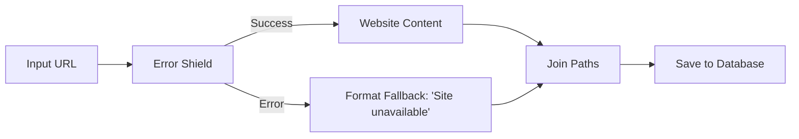

**Error Shield Example with Join Paths**: [View and clone this example workflow](https://www.gumloop.com/pipeline?workbook_id=dFkxAUGr3tZ9WVnzgHwYhi)

> **Info:** Without Join Paths, the error path would be a dead end, and your workflow would stop when an error occurs.

#### Real-World Examples

  
**Web Scraping with Error Handling**

**Scenario**: Scrape product information from multiple websites, some of which may be down or blocked.

    **Setup**:

    1. List of product URLs → Website Scraper (Loop Mode) wrapped in Error Shield
    2. Success Path → Extract product details → Format as JSON
    3. Error Path (Pass Inputs Through enabled) → Log failed URLs to sheet
    4. Join Paths → Send summary email with results and failed URLs

    **Outcome**: Successfully scrapes available sites while documenting failures for manual review

  
**Document Processing with Fallback**

**Scenario**: Process invoices from various sources, providing default values when extraction fails.

    **Setup**:

    1. Invoice PDF → Extract data (wrapped in Error Shield)
    2. Success Path → Format extracted data
    3. Error Path → Create record with "Manual review required" status
    4. Join Paths → Save to database

    **Outcome**: All invoices are logged, with failed extractions flagged for manual processing

  
**API Calls with Retry Logic**

**Scenario**: Fetch user data from external API that occasionally times out.

    **Setup**:

    1. User ID → API call (wrapped in Error Shield)
    2. Success Path → Process user data
    3. Error Path → Wait 30 seconds → Retry API call (wrapped in second Error Shield)
    4. Second Success Path → Process user data
    5. Second Error Path → Log failure and notify admin
    6. Join Paths → Continue workflow

    **Outcome**: Automatic retry for transient failures, with notifications only for persistent errors

  
**Batch Email Sending**

**Scenario**: Send personalized emails to customer list, tracking delivery failures.

    **Setup**:

    1. Customer list → Send Email node (Loop Mode) wrapped in Error Shield
    2. Success Path → Log successful sends to "Delivered" sheet
    3. Error Path (Pass Inputs Through) → Log failed emails to "Bounced" sheet with customer details
    4. Join Paths → Generate summary report

    **Outcome**: Emails sent to all valid addresses, with bounce list for cleaning up customer database

#### Common Use Cases

  - **Web Scraping**: Handle website timeouts, blocks, or invalid URLs without stopping your entire scraping job

  - **File Processing**: Continue processing a batch of files even if some are corrupted or in unexpected formats

  - **API Integrations**: Manage rate limits, timeouts, and invalid responses from external services

  - **Data Validation**: Process valid records while capturing and handling invalid ones separately

#### Setup Guide

1. **Add Error Shield to Canvas**

   Drag the Error Shield node from the Workflow Basics section onto your workflow canvas

2. **Wrap Your Node**

   Place the node you want to protect inside the Error Shield container. The node will now be protected from errors.

3. **Enable Pass Inputs Through (Optional)**

   Toggle this setting if you need to access the original input that caused errors. This is essential for:

       * Logging which specific items failed
       * Creating fallback data based on original input
       * Retrying failed operations

4. **Connect Success Path**

   Wire the Success Path output to the next step in your workflow that should receive successfully processed data

5. **Handle Error Path**

   Connect the Error Path to error handling logic:

       * Log failures to a database or sheet
       * Send notification alerts
       * Create fallback data
       * Format error messages for users

6. **Use Join Paths (If Needed)**

   If both paths need to continue through the same workflow logic, add a Join Paths node to merge them back together

7. **Test Both Paths**

   Run your workflow with both valid and invalid inputs to ensure both success and error paths work as expected

#### Best Practices

  
**Always Use with Risky Operations**

Wrap any node that might fail in Error Shield:

    * External API calls
    * Web scraping
    * File operations
    * Database queries
    * Email sending
    * Data transformations on uncertain input formats

  
**Enable Pass Inputs Through for Loop Mode**

When processing lists, always enable "Pass Inputs Through" so you can track which specific items failed and potentially retry them later.

  
**Use Join Paths for Non-Loop Workflows**

If the wrapped node is NOT in Loop Mode, use Join Paths to allow your workflow to continue after error handling. Without it, errors create dead ends in your workflow.

  
**Consider Using Subflows**

For complex error handling in Loop Mode, wrap your entire processing logic in a subflow, then wrap the subflow in Error Shield. This keeps related data together and prevents list size mismatches.

    [Learn more about Subflows with Error Shield](https://docs.gumloop.com/common_errors/list_size_mismatch#the-solution-error-shield-around-subflow)

#### Additional Resources

  - **[Video Tutorial](https://www.youtube.com/watch?v=3PpFDYBtsT8)**: Watch a step-by-step guide to using Error Shield

  - **[Join Paths Documentation](https://docs.gumloop.com/nodes/flow_basics/join_paths)**: Learn how to merge conditional paths

  - **[Loop Mode Guide](https://docs.gumloop.com/core-concepts/loop_mode)**: Understand how Loop Mode processes lists

  - **[List Size Mismatch Errors](https://docs.gumloop.com/common_errors/list_size_mismatch)**: Fix common errors with Error Shield and Loop Mode

#### Filter

**[Video: Filtering]**

**Source:** https://docs.gumloop.com/nodes/flow_basics/filter

*[Video: Filtering]*

This document explains the Filter node, which lets you selectively pass data through your workflow based on conditions.

#### Node Inputs

##### Required Fields

* **Filter By**: The value to test against your condition
* **Input**: The actual data you want to pass through (if condition is met)

##### Optional Fields

* **Output Blank Value**: When enabled, outputs blank values for filtered items instead of skipping them
* **Configure Inputs**: Lets you make 'conditional value' field dynamic. Helpful for loop mode

#### Node Output

* **Filtered Output**: Data that passes your filter condition

#### Node Functionality

The Filter node works like an "if statement" in your workflow. It checks if `Filter By` meets your condition, and if so, passes through the corresponding `Input` value(s).

#### Filter Types Explained

##### Number Filters

* **Is greater than**: Passes values above your number
* **Is less than**: Passes values below your number
* **Equals**: Passes exact number matches

##### Text Filters

* **Contains**: Checks if text includes your value
* **Is in**: Checks if the exact text is included in your input
* **Starts with**: Matches beginning of text
* **Ends with**: Matches end of text

**Note**: Text filters are case sensitive.
**Tip**: You can use the 'Text Formatter' node before the filter node to avoid case sensitive issues.

##### State Filters

* **Is empty**: Passes empty/null values
* **Is not empty**: Passes any non-empty value
* **Is true**: Passes boolean true values
* **Is false**: Passes boolean false values

#### Loop Mode Tips

1. **Dynamic Conditions**:
   * Use Configure Inputs to make conditions dynamic
   * Example: Filter prices above a certain threshold. [Example Workflow](https://www.gumloop.com/pipeline?workbook_id=rryEtJNtdmKmEs4NHL661o)

2. **Multiple Filters**:
   * Chain multiple filter nodes for complex conditions
   * Example: Price > 100 AND Contains "premium". [Example Workflow](https://www.gumloop.com/pipeline?workbook_id=w8hNhjeaBPvafkm7dbzS9B)

#### Important Considerations

1. Loop mode processes each item independently
2. Consider Output Blank Value impact on downstream nodes
3. For loop mode if you've a single conditional value against a list of inputs, use the 'Duplicate' node for the conditional value to avoid list size mismatch errors

#### Additional Information

[Video Tutorial](https://www.youtube.com/watch?v=2yDaQvYDeBM)

In summary, the Filter node is your workflow's decision maker, letting you precisely control what data continues through your automation based on flexible conditions.

#### Input

*This document outlines the Input node, which lets you add customizable input values to your workflows.*

**Source:** https://docs.gumloop.com/nodes/flow_basics/input_operator

This document outlines the Input node, which lets you add customizable input values to your workflows.

#### Node Inputs

##### Required Fields

* **Input Name**: Name for your input (used when calling workflows through webhooks or agents)

##### Optional Fields

* **Default Value**: A preset value used if no input is provided

#### Node Output

* **Value**: The final input value (either from user input, webhook, or default value)

#### Node Functionality

The Input node creates entry points for data in your workflows. It can:

* Fetch values from other workflows [Subflows](https://docs.gumloop.com/core-concepts/subflows)
* Accept values from webhooks
* Use preset default values
* **Multiple inputs** can now be added within a single input node - no need for separate input nodes for each field

#### Important Considerations

1. Always set clear Input Names for webhook usage
2. Use Default Values for optional inputs

In summary, the Input node is your workflow's front door for data entry, whether from users, webhooks, or default settings.

#### Join Paths

**Source:** https://docs.gumloop.com/nodes/flow_basics/join_paths

The Join Paths node reconnects multiple conditional paths in your workflow back into a single path. When you use If-Else, Router or Error Shield nodes that create branching logic, `Join Paths` eliminates the need for duplicate nodes by merging the paths back together.

#### Overview

Think of Join Paths as a merge point in your workflow. After your workflow splits into different branches based on conditions, Join Paths brings the active branch back to continue processing through the same set of nodes.

  - **Eliminate Duplicate Nodes**: No need to repeat the same nodes in each conditional branch

  - **Cleaner Workflows**: Maintain single processing paths after conditions

  - **Better Maintenance**: Update one set of nodes instead of multiple copies

  - **Resource Efficiency**: Reduce redundant operations and simplify logic

#### How It Works

Join Paths takes multiple input connections but only one path is active during runtime. The active path (determined by your conditional logic) workflows through Join Paths and continues to the next node.

  *[Image: Join Paths reconnecting success and error paths from Error Shield]*

**Key Concept**: Only the executed branch passes data through Join Paths. Non-executed paths are pruned (stopped) at the conditional node, so Join Paths never has to merge conflicting data.

#### Configuration

  
**Input 1 (Required)**

Connect the first potential execution path. This can be any data type (text, list, object, etc.)

  
**Input 2 (Required)**

Connect the second potential execution path. Must match the data type of Input 1 to ensure consistency

  
**Additional Inputs (Optional)**

Add more input connections for complex branching scenarios with 3+ conditional paths. Click the "+" button to add additional inputs.

    **Example**: Processing Google Docs, PDFs, or websites requires 3 inputs on Join Paths

#### Output

  
**Continuation Path**

**Data from Executed Branch**: Join Paths outputs whatever data comes from the active path

    **Type Preservation**: The original data type is maintained (if Input 1 sends text, output is text)

    **No Merging**: Join Paths does NOT combine data from multiple paths - only the active path workflows through

  
**Pruned Paths**

**Non-Executed Branches**: Paths that weren't triggered by the conditional logic are pruned (stopped) and don't reach Join Paths

    **No Dead Data**: You never have to worry about conflicting data from multiple paths because only one path is active at runtime

#### When to Use Join Paths

  - **[If-Else / Router Conditionals](#example-if-else-with-join-paths)**: Reconnect true/false branches after conditional logic

  - **[Error Shield Patterns](#example-error-shield-with-join-paths)**: Merge success and error paths to continue workflow

#### Why Join Paths Matters

Without Join Paths, you're forced to duplicate nodes after every conditional split:

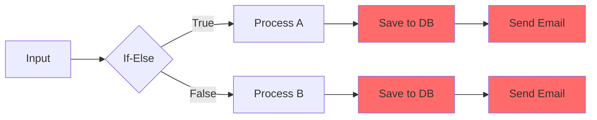

Using Join Paths eliminates duplication by merging paths back together:

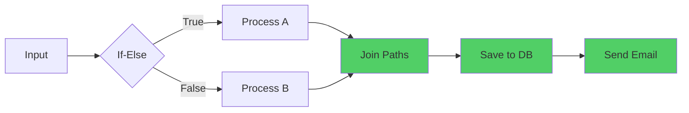

#### Example Workflows

##### Example: If-Else with Join Paths

**Scenario**: Processing content from either Google Docs or websites

**Try it yourself**: [View and clone this example workflow](https://www.gumloop.com/pipeline?workbook_id=e6pr4uX6Ki67rfqCH9cfRj)

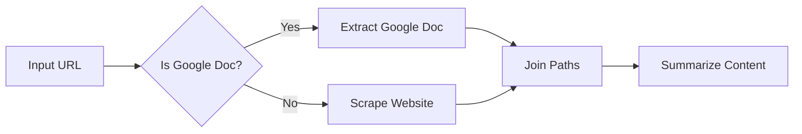

1. **Receive URL Input**

   User provides a URL that could be either a Google Doc or a regular website

2. **Check Document Type**

   If-Else node determines if the URL is a Google Doc link

3. **Extract Content Appropriately**

   * **True path**: Use Google Docs integration to extract content
       * **False path**: Use Website Scraper to get content

4. **Merge Paths**

   Join Paths combines both extraction methods into a single continuation point

5. **Process Uniformly**

   Single Summarize node handles content from either source

> **Info:** **Without Join Paths**, you'd need two separate Summarize nodes - one after the Google Doc extraction and one after the website scraping. With Join Paths, you only maintain one Summarize node.

##### Example: Error Shield with Join Paths

**Scenario**: Web scraping with error handling and result logging

**Try it yourself**: [View and clone this example workflow](https://www.gumloop.com/pipeline?workbook_id=dHSU1njW5f9x77NmUEQVsQ)

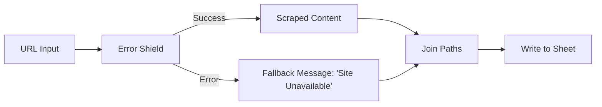

1. **Protect Scraping Operation**

   Wrap Website Scraper in Error Shield to catch failures

2. **Handle Success Path**

   Successfully scraped content workflows directly to Join Paths

3. **Handle Error Path**

   Failed scrapes trigger error path, which creates a fallback message like "Site Unavailable"

4. **Merge Results**

   Join Paths ensures both successful scrapes and error messages continue to the next step

5. **Log All Results**

   Single "Write to Sheet" node logs both successful and failed attempts

> **Tip:** This pattern is essential for Error Shield usage when the node is NOT in Loop Mode. Without Join Paths, the error path becomes a dead end and the workflow stops.

##### Example: Multi-Source Content Processor

**Scenario**: Handling different document types (Google Docs, PDFs, websites)

**Try it yourself**: [View and clone this example workflow](https://www.gumloop.com/pipeline?workbook_id=8y6UQLiZaPvHzFLrmYVeYm)

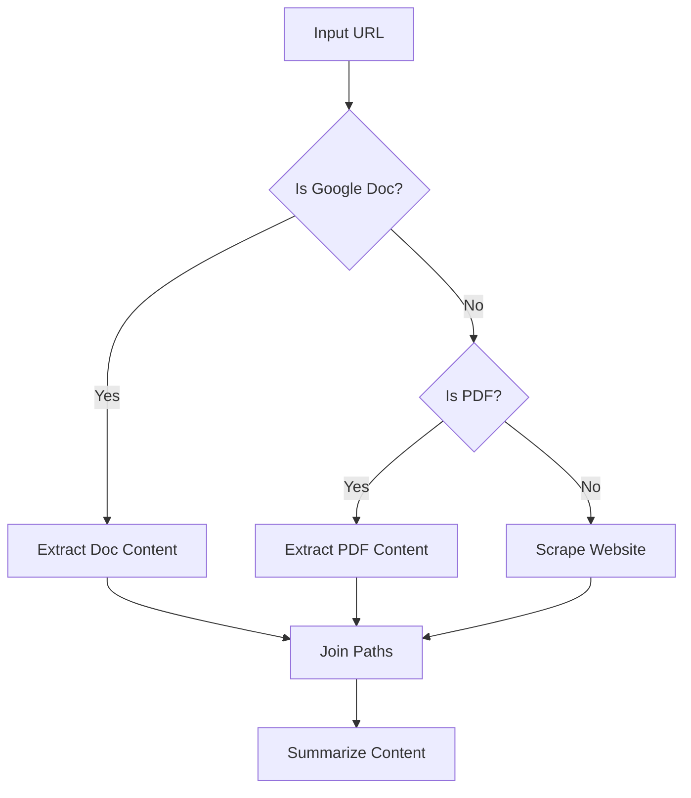

1. **First Conditional Check**

   Check if input is a Google Doc URL

2. **Second Conditional Check**

   If not a Google Doc, check if it's a PDF

3. **Three Processing Paths**

   * **Google Doc**: Use Docs integration
       * **PDF**: Use PDF extraction
       * **Website**: Use web scraper

4. **Merge All Paths**

   Join Paths with 3 inputs consolidates all document types

5. **Unified Processing**

   Single Summarize node processes content regardless of original format

> **Info:** **Note**: When using multiple conditional checks, add additional inputs to Join Paths by clicking the "+" button. This example requires 3 input connections.

#### Loop Mode Limitations

> **Warning:** **Join Paths does NOT support Loop Mode.** Here's why and what to do instead.

##### Why No Loop Mode?

Join Paths is designed for single-path execution where only one branch is active at a time. Loop Mode processes multiple items concurrently, which would create ambiguity:

* Which path's data should continue when multiple branches are active simultaneously?
* How should Join Paths handle item 1 taking the success path while item 2 takes the error path?
* What happens to synchronization between different loop iterations?

This limitation ensures predictable and reliable workflow execution.

##### Solution: [Use Subflows](http://localhost:3001/core-concepts/subflows)

If you need to process multiple items with conditional logic:

1. **Create a Subflow**

   Build your conditional logic and Join Paths inside a subflow that handles a single item

2. **Test with Single Input**

   Verify the subflow works correctly with one item

3. **Enable Loop Mode on Subflow**

   In your main workflow, enable Loop Mode on the subflow node itself (not on nodes inside the subflow)

4. **Pass in List**

   Connect a list of items to the subflow, which will process each item through the conditional logic independently

**Example Pattern**:

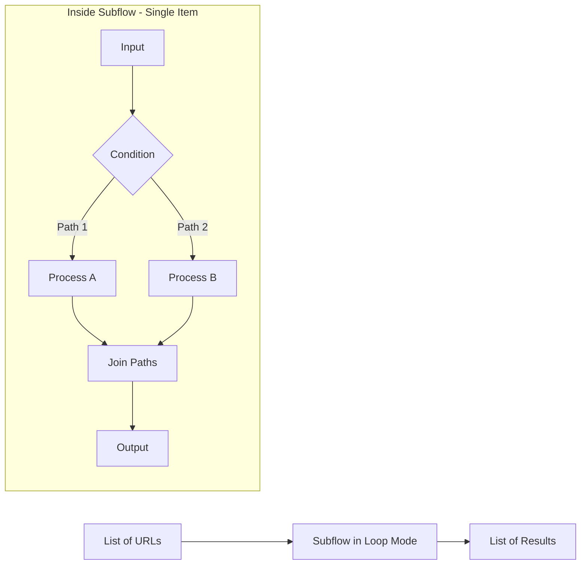

> **Tip:** This approach maintains the benefits of Join Paths while efficiently processing multiple items. Each loop iteration runs the full conditional logic independently.

#### Best Practices

  
**Always Use After Conditional Splits**

Whenever you create a branching condition (If-Else, Error Shield, Router), consider if the paths need to reunite for common processing. If yes, use Join Paths.

  
**Match Data Types Across Inputs**

Ensure all potential paths output the same data type to Join Paths:

    * If one path outputs text, all paths should output text
    * If one path outputs a list, all paths should output lists

    **Why?** The next node after Join Paths expects a consistent data type.

  
**Use for Error Shield (Non-Loop Mode)**

When Error Shield wraps a node that's NOT in Loop Mode, always use Join Paths to:

    * Prevent error paths from becoming dead ends
    * Allow workflow to continue after error handling
    * Enable unified logging of both success and failure cases

  
**Name Your Paths Clearly**

Add clear labels to your conditional branches so you can easily identify which path data came from during debugging.

  
**Test Each Branch Independently**

Before connecting Join Paths:

    1. Test each conditional branch separately
    2. Verify each path produces the expected output type
    3. Then connect Join Paths and test the full workflow

  
**For Lists, Use Subflows**

Don't try to use Join Paths directly in Loop Mode. Instead:

    * Create a subflow with conditional logic + Join Paths
    * Use Loop Mode on the subflow itself
    * Process lists efficiently while maintaining clean conditional logic

#### Additional Resources

  - **[Error Shield Documentation](https://docs.gumloop.com/nodes/flow_basics/error_shield)**: Learn how to use Error Shield with Join Paths

  - **[Subflows Guide](https://docs.gumloop.com/core-concepts/subflows)**: Use Join Paths with Loop Mode via subflows

  - **[Router Node](https://docs.gumloop.com/nodes/flow_basics/router)**: Advanced multi-path routing for 3+ conditions

#### Output

**Source:** https://docs.gumloop.com/nodes/flow_basics/output_operator

The Output node defines the exit points for your workflow, allowing you to pass data out to parent workflows, webhook responses, subflows, and external systems. It's essential for creating reusable workflows and enabling agents to access your workflow results.

*[Image: Output node interface]*

#### Quick Start

1. **Add the Output node to your workflow**

   Drag the Output node from the node library into your canvas at the end of your workflow

2. **Connect your data**

   Drag the output badge from a previous node into the Output field

3. **Name your output**

   Give your output a descriptive name (e.g., "summary", "processed\_data", "email\_list")

4. **Set the output type**

   Choose the appropriate data type: Text, List, or Any

#### Node Configuration

##### Required Fields

  
**Output**

The value or data you want to pass out of the workflow. Connect this to the output of any previous node in your workflow by dragging its output badge into this field.

  
**Output Name**

A descriptive name to identify this output. This name is used when:

    * Accessing the output in parent workflows
    * Retrieving data via webhook responses
    * Using the workflow as a subflow in other workflows
    * Allowing agents to view the results when the workflow is used as a tool

    **Default:** "output"

##### Optional Fields

  
**Output Type**

Sets the expected data format for your output:

    | Type     | Use Case                              | Example                                           |
    | -------- | ------------------------------------- | ------------------------------------------------- |
    | **Text** | Single values like strings or numbers | A summary, email address, or processed text       |
    | **List** | Arrays of values                      | List of URLs, email addresses, or extracted items |
    | **Any**  | Mixed or unknown data types           | API responses, complex objects, or testing        |

##### Multiple Outputs

You can configure multiple outputs within a single Output node by clicking the **+ Add outputs** button. This is useful when your workflow produces several distinct results that need to be accessed separately.

#### When to Use the Output Node

  - **Subflows**: **Required for reusable workflows** When creating a subflow, the Output node defines what data becomes available to the parent workflow. Without it, the parent workflow cannot access any results.

  - **Webhooks**: **Return data to external systems** When your workflow is triggered via webhook, the Output node's data is returned in the API response, making it accessible to the calling system.

  - **Agent Tools**: **Enable agents to view results** When using a workflow as a tool in an agent, the Output node is required for the agent to see and use the results of the workflow execution.

  - **API Responses**: **Programmatic access** When running workflows via the Gumloop API, outputs are returned in the `get_pl_run` response, allowing programmatic access to results.

#### Using Workflows as Agent Tools

> **Warning:** If you're using a workflow as a tool in an agent, you **must** include an Output node for the agent to view the results of the workflow execution.

When an agent invokes a workflow as a tool, it needs to receive the results to continue its reasoning and decision-making. Without an Output node, the agent cannot see what the workflow produced, making the tool effectively useless.

*[Image: Output node connected to Ask AI for agent tool usage]*

##### Example: Creating an Agent-Compatible Workflow

Consider a workflow that uses Ask AI to analyze text. To make this workflow usable as an agent tool:

1. **Build your workflow logic**

   Add your processing nodes (e.g., Ask AI, data extraction, API calls)

2. **Add an Output node at the end**

   Connect the final result to an Output node

3. **Name the output descriptively**

   Use a clear name like "analysis\_result" or "summary" so the agent understands what it's receiving

4. **Save and add to your agent**

   The agent can now invoke this workflow and receive the output to use in its reasoning

> **Info:** The output name you choose will be visible to the agent, so use descriptive names that help the agent understand what data it's receiving.

#### Working with Subflows

The Output node is essential for creating modular, reusable workflows through subflows.

##### Passing Data to Parent Workflows

When you use a workflow as a subflow, all outputs defined in the Output node become available in the parent workflow:

```text
Subflow outputs: "customer_name", "customer_email", "order_total"
Parent workflow: Can access all three outputs when using the subflow node
```

##### Chaining Subflows

Create complex data processing pipelines by passing outputs from one subflow to another:

```text
Subflow A (Data Extraction) -> Output: "extracted_data"
    |
    v
Subflow B (Data Processing) -> Input: receives "extracted_data"
    |
    v
Output: "processed_result"
```

> **Tip:** Name your outputs clearly and consistently across subflows to make your workflows easier to understand and maintain.

#### Output Types Explained

  
**Text**

**Use for single values**

    Choose Text when outputting:

    * A single piece of text or string
    * A number or calculated value
    * A summary or processed result
    * Any single, non-list value

    ```text theme={"dark"}
    Example: "The analysis shows a 15% increase in engagement."
    ```

  
**List**

**Use for arrays of values**

    Choose List when outputting:

    * Multiple items from a loop
    * Extracted lists of data
    * Arrays of URLs, emails, or identifiers
    * Results from batch processing

    ```text theme={"dark"}
    Example: ["email1@example.com", "email2@example.com", "email3@example.com"]
    ```

  
**Any**

**Use for flexible or unknown types**

    Choose Any when:

    * The output type may vary
    * You're working with complex objects
    * You're still testing and iterating
    * The data comes from an unpredictable source

    ```text theme={"dark"}
    Example: {"status": "success", "data": [...], "metadata": {...}}
    ```

#### Common Use Cases

  
**Email Processing Pipeline**

Extract and output email addresses from a document:

    ```text theme={"dark"}
    Document Input -> Extract Data -> Output (name: "email_list", type: List)
    ```

    The parent workflow or webhook can then use this list for further processing.

  
**Content Summarization**

Summarize content and return the result:

    ```text theme={"dark"}
    Content Input -> Ask AI (summarize) -> Output (name: "summary", type: Text)
    ```

    Perfect for creating reusable summarization subflows.

  
**Data Transformation**

Transform data and output multiple results:

    ```text theme={"dark"}
    Raw Data -> Process -> Output (names: "cleaned_data", "error_count", "processing_time")
    ```

    Use multiple outputs to provide comprehensive results.

  
**Agent Research Tool**

Create a research workflow that an agent can use:

    ```text theme={"dark"}
    Search Query Input -> Web Search -> Summarize Results -> Output (name: "research_findings")
    ```

    The agent receives the research findings and can use them in its response.

#### Important Considerations

  
**Output Naming Best Practices**

* Use descriptive, lowercase names with underscores (e.g., `customer_email`, `processed_data`)
    * Avoid generic names like "output" or "result" when possible
    * Keep names consistent across related workflows
    * Consider how the name will appear to agents or in API responses

  
**Type Consistency**

* Match the output type to your actual data to avoid unexpected behavior
    * Use List type when working with Loop Mode results
    * Use Any type sparingly, as it provides less clarity to downstream consumers

  
**Multiple Outputs**

* Add multiple outputs when your workflow produces distinct results
    * Each output can have its own name and type
    * All outputs are available simultaneously to parent workflows and API responses

***

The Output node is your workflow's gateway for sharing results with the outside world. Whether you're building reusable subflows, creating webhook-triggered automations, or enabling agents to use your workflows as tools, properly configured outputs ensure your data flows seamlessly to wherever it needs to go.

#### Router

*The Router node enables smart conditional routing in your workflows by directing data through different paths based on AI decisions or logical conditions.*

**Source:** https://docs.gumloop.com/nodes/flow_basics/router

The Router node enables smart conditional routing in your workflows by directing data through different paths based on AI decisions or logical conditions.

  *[Video: The Router Node]*

#### What Does the Router Node Do?

The Router node acts as a **decision point** in your workflow, splitting your workflow into multiple paths and automatically choosing which path to follow. Think of it like an if-else statement, but significantly more powerful.

  - **Up to 8 Routes**: Create multiple conditional paths instead of just if/else logic

  - **AI-Powered Decisions**: Use intelligent routing based on content understanding

  - **Logical Conditions**: Apply precise rule-based routing with boolean operators

  - **Automatic List Processing**: Process batches with item-by-item evaluation

  *[Image: Router node directing support tickets to different paths]*

**Real-World Example**: Processing incoming support tickets

* Route urgent tickets → Escalation team
* Route billing questions → Finance department
* Route general inquiries → Standard support queue

The Router evaluates each ticket and automatically sends it down the appropriate path.

***

#### AI Routing vs Standard Routing

Choose the right routing mode based on whether your decisions require interpretation or can be defined with exact rules.

  - **AI Routing**: **Use when you need content understanding** Best for analyzing sentiment, understanding context, categorizing nuanced content, and making subjective classifications. **Cost**: 2-30 credits based on the AI model

  - **Standard Routing**: **Use when you have clear criteria** Best for exact keyword matching, numerical comparisons, binary decisions, and deterministic routing. **Cost**: 0 credits (logic-based)

##### Quick Comparison

| Aspect             | AI Routing                    | Standard Routing      |
| ------------------ | ----------------------------- | --------------------- |
| **Decision Logic** | Content interpretation        | Keyword/rule matching |
| **Consistency**    | Intelligent but may vary      | 100% deterministic    |
| **Setup**          | Natural language descriptions | Logical conditions    |
| **Best Use Case**  | Nuanced categorization        | Clear yes/no criteria |

  
**AI Routing Details**

##### When to Use AI Routing

    Use AI routing when your routing decisions require **content understanding and interpretation**.

    **Ideal scenarios:**

    * Analyzing sentiment or tone
    * Understanding context and intent
    * Categorizing nuanced content
    * Making subjective classifications

    **Example Configuration:**

    ```text theme={"dark"}
    Route 1: "Customer Complaint"
    AI Condition: "when the email expresses dissatisfaction, 
                   frustration, or requests a refund"

    Route 2: "Product Inquiry"  
    AI Condition: "when the email asks questions about features, 
                   pricing, or product information"

    Route 3: "Technical Support"
    AI Condition: "when the email reports bugs, technical issues, 
                   or requests help with setup"
    ```

    
> **Info:** AI routing is **enabled by default**. You can select different AI models based on complexity, with credit costs ranging from 2-30 credits per routing decision.

  
**Standard Routing Details**

##### When to Use Standard Routing

    Use standard routing when you have **clear, measurable criteria** that can be defined with exact rules.

    **Ideal scenarios:**

    * Exact keyword matching
    * Numerical comparisons
    * Binary yes/no decisions
    * Deterministic routing (must be 100% consistent)

    **Example Configuration:**

    ```text theme={"dark"}
    Route 1: "Shopify Leads"
    Conditions:
    - website_content [Text] Contains "shopify"
    - OR website_content [Text] Contains "myshopify.com"

    Route 2: "Other Websites"  
    Conditions:
    - website_content [Text] Does not Contain "shopify"
    ```

    
> **Info:** Standard routing uses **0 credits** since it's logic-based with no external API calls.

***

#### Real-World Examples

  
**AI Routing: Support Triage**

##### Support Request Triage

    **[View Full Workflow →](https://gumloop.com/pipeline?workbook_id=2YiTXF7pcXBMgiaiSetQWT)**

    This workflow intelligently categorizes support requests using AI-powered routing.

    
1. **Read Emails**

   Gmail Reader pulls support emails from a specific label

2. **AI Routing**

   Router analyzes content to understand intent and urgency

3. **Route to Teams**

   Each route triggers different actions for appropriate teams

    **Why AI Routing?**\
    Support requests require interpretation - the AI understands context, tone, and intent to determine urgency and category. Keywords alone can't capture this nuance.

    **Router Setup:**

    * **Route 1**: "General Questions" → Slack notification to general support
    * **Route 2**: "Billing Questions" → Email to finance team
    * **Route 3**: "Feature Request" → Create Linear ticket

  
**Standard Routing: Lead Qualifier**

##### Lead Website Analyzer

    **[View Full Workflow →](https://gumloop.com/pipeline?workbook_id=pkHL6gMqMhKKr3XifseevD)**

    This workflow qualifies leads by detecting specific website technologies using logical conditions.

    
1. **Read Prospects**

   Sheet Reader pulls prospect websites from Google Sheet

2. **Scrape Content**

   Website Scraper extracts content from each website

3. **Standard Routing**

   Router uses text conditions to detect platforms

4. **Take Action**

   Qualified leads go to Slack, others receive Gmail rejection

    **Why Standard Routing?**\
    This is deterministic - if scraped content contains specific Shopify keywords, it's definitely a Shopify store. No interpretation needed, just exact keyword matching for 100% consistency.

    **Router Setup:**

    * **Route 1**: "Shopify Leads" (Qualified) - Contains "shopify" OR "myshopify.com"
    * **Route 2**: "Other Websites" (Rejected) - Does not contain "shopify"

***

#### Loop Mode Processing

##### How It Works

When you pass a list to the Router, each item is evaluated separately and can be routed to different paths based on its individual characteristics.

**Example**: [View Loop Mode Workflow →](https://gumloop.com/pipeline?workbook_id=mj89U7XwiPqwJKEfHBPrsg)

```text
Input List: ["urgent ticket", "billing question", "general inquiry"]

Processing:
┌─────────────────────────┐
│ Item 1: "urgent ticket" │ → Routes to Support Team
├─────────────────────────┤
│ Item 2: "billing question" │ → Routes to Finance Team
├─────────────────────────┤
│ Item 3: "general inquiry" │ → Routes to General Team
└─────────────────────────┘

Result: Items distributed across different routes
```

This allows batch processing where each item in your list can take a different path based on its content.

***

#### Configuration

##### Required Inputs

  
**Input to Evaluate**

The specific data field that determines which route to take. The Router analyzes this field to make routing decisions.

    **Example for support tickets:**

    * `ticket_description` - Route based on issue content
    * `priority_level` - Route based on urgency
    * `customer_tier` - Route based on customer status

  
**Routes (Up to 8)**

The different paths your data can follow. Each route represents a distinct outcome or processing path.

    **Example for support system:**

    * Route 1: "Urgent" - High-priority issues
    * Route 2: "Billing Question" - Payment-related
    * Route 3: "Technical Support" - Product issues
    * Route 4: "General Inquiry" - Everything else

##### Optional Settings

  
**Route With AI**

Toggle between AI-powered routing and standard logical routing.

    **Default**: Enabled (AI Mode)

    **When to disable**: When you need deterministic, rule-based routing with zero credit cost

  
**AI Model Selection**

Choose which AI model powers your routing decisions (only available in AI mode).

    **Model tiers:**

    * **Standard models**: 2 credits - Good for straightforward categorization
    * **Advanced models**: 20 credits - Better for complex decisions
    * **Expert models**: 30 credits - Best for nuanced interpretation

***

#### Understanding Outputs

The Router creates separate output branches for each route. Each branch contains all the original inputs.

**Example Setup:**

```text
Inputs to Router:
├── ticket_description (used for routing decision)
├── ticket_title
├── ticket_link
└── customer_email

Routes Created (ie. available outputs):
├── Urgent Branch → [All 4 inputs]
├── Billing Question Branch → [All 4 inputs]
└── Technical Support Branch → [All 4 inputs]
```

##### Visual Workflow

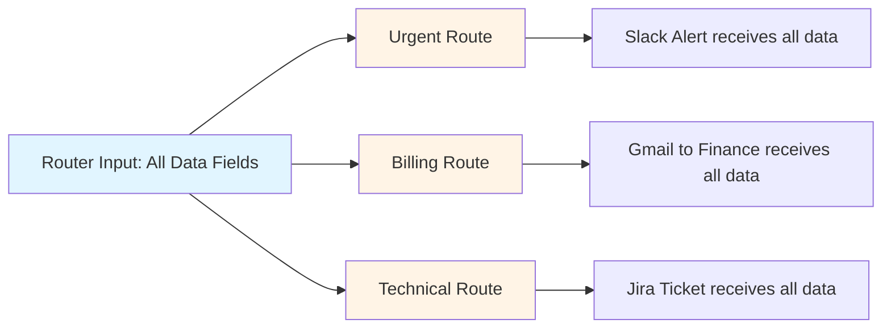

> **Tip:** This design ensures downstream nodes have full context - you don't lose related information when routing.

***

#### Detailed Configuration Guide

  
**AI Routing Setup**

##### Configuring AI Routing

    
      *[Image: Router node in AI mode configuration]*
    

    
1. **Ensure AI Mode is Enabled**

   "Route With AI" should be toggled ON (this is the default)

2. **Select Input to Evaluate**

   Choose which data field the AI should analyze for routing

3. **Create Routes**

   Add up to 8 routes with clear, descriptive names

4. **Write AI Conditions**

   Describe in natural language when each route should be used (optional but recommended)

5. **Choose AI Model**

   Select model based on decision complexity

    ### Best Practices

    
      - **Descriptive Route Names**: ✅ "Positive Review", "Negative Review"\ ❌ "Route A", "Route B" Even without conditions, AI infers logic from clear names

      - **Clear AI Conditions**: ✅ "expresses anger, frustration, or demands action"\ ❌ "negative sentiment" Give AI enough context for accurate decisions

      - **Right Model Selection**: Match model power to complexity: * Simple categorization → Standard * Nuanced interpretation → Expert

      - **Include Examples**:  *[Image: Router examples]* 

  
**Standard Routing Setup**

##### Configuring Standard Routing

    
1. **Disable AI Mode**

   Toggle "Route With AI" to OFF

2. **Create Named Routes**

   Add routes with descriptive names

3. **Build Logical Conditions**

   Use condition operators to define routing rules

4. **Apply Boolean Logic**

   Combine conditions with AND/OR operators

5. **Order Routes Correctly**

   Place most specific conditions first (top to bottom evaluation)

    ### Available Condition Types

    
      
**General Conditions**

| Condition      | Description            |
        | -------------- | ---------------------- |
        | `Is empty`     | Field contains no data |
        | `Is not empty` | Field contains data    |

      
**Text Conditions**

| Condition                        | Description                                    |
        | -------------------------------- | ---------------------------------------------- |
        | `Equals`                         | Exact match (case-sensitive)                   |
        | `Does not equal`                 | Not an exact match                             |
        | `Contains`                       | Includes substring                             |
        | `Does not contain`               | Does not include substring                     |
        | `Starts with`                    | Begins with string                             |
        | `Ends with`                      | Ends with string                               |
        | `Is in`                          | Entire value appears in condition text         |
        | `Is not in`                      | Entire value does NOT appear in condition text |
        | `Is greater than [n] characters` | Length exceeds number                          |
        | `Is less than [n] characters`    | Length under number                            |
        | `Matches regex`                  | Matches regex pattern                          |
        | `Does not match regex`           | Does not match regex                           |

      
**Number Conditions**

| Condition                     | Description        |
        | ----------------------------- | ------------------ |
        | `Equals`                      | Exact number match |
        | `Is not equal to`             | Not exact match    |
        | `Is greater than`             | Larger than value  |
        | `Is less than`                | Smaller than value |
        | `Is greater than or equal to` | Greater or equal   |
        | `Is less than or equal to`    | Less or equal      |

***

#### Best Practices

  
**General**

- **Start Simple**: Begin with 2-3 routes, add complexity gradually as you test and validate

      - **Test Thoroughly**: Validate routing with diverse sample data including edge cases

      - **Descriptive Naming**: Clear route names improve debugging and maintenance significantly

      - **Always Add Fallback**: Include a catch-all route at the bottom to handle unmatched items

      - **Order Matters**: Place specific conditions first, general conditions last

      - **Monitor Run Logs**: Check logs regularly to verify routing behavior

  
**AI Routing**

##### AI-Specific Guidelines

    **Model Selection**

    * Match model complexity to routing difficulty
    * Start with standard models, upgrade only if needed
    * More powerful models = higher accuracy but more credits

    **Condition Writing**

    * Provide context: explain what characteristics define each route
    * Use examples: "emails expressing anger, frustration, or urgency"
    * Be specific: avoid vague terms like "bad" or "negative"
    * Test consistency: run same input multiple times to check variance

    **Optimization**

    * Descriptive route names help even without explicit conditions
    * Include edge case examples in your AI conditions
    * Review misrouted items to refine conditions

  
**Standard Routing**

##### Logic-Based Guidelines

    **Condition Order**

    * Most specific conditions first
    * Broad catch-all conditions last
    * Sequential evaluation means order is critical

    **Data Validation**

    * Verify input data types match expected formats
    * Clean data before routing (trim whitespace, normalize case)
    * Use type conversion nodes if needed

    **Boolean Logic**

    * Combine related conditions with AND/OR effectively
    * Test each condition independently before combining
    * Document complex logic for future maintenance

***

#### Troubleshooting

  
**&#x22;No route matched&#x22; Error**

**Problem**: An item didn't match any route conditions.

    **Solutions:**

    * Add a fallback route with opposite conditions to catch unmatched items
    * Review your conditions - may be too restrictive
    * Check input data for unexpected formats or values

    **Prevention:**

    * Always include a catch-all route at the bottom
    * Test with diverse sample data including edge cases

  
**&#x22;Input type mismatch&#x22; Error**

**Problem**: Inputs being evaluated are different types (e.g., mixing text and lists).

    **Solutions:**

    * Ensure all inputs are the same type
    * Use data conversion nodes before the Router
    * Check upstream nodes for unexpected output types

    **Prevention:**

    * Validate data types in testing
    * Use consistent data structures throughout workflow

    [More details on type mismatch →](https://docs.gumloop.com/common_errors/type_mismatch)

  
**&#x22;List size mismatch&#x22; Error**

**Problem**: List inputs have different lengths.

    **Solutions:**

    * Use Duplicate node to match list sizes
    * Filter lists to same length before routing
    * Verify upstream list generation

    **Prevention:**

    * Check list lengths in testing
    * Ensure list-generating nodes produce consistent outputs

    [More details on list size mismatch →](https://docs.gumloop.com/common_errors/list_size_mismatch)

##### Debugging Checklist

  - **Check Run Logs**: Monitor which routes are being selected and verify expected behavior [View Run Logs Documentation →](https://docs.gumloop.com/core-concepts/run_log)

  - **Test Simple Cases First**: Start with clear-cut examples before testing edge cases

  - **Validate Input Data**: Ensure data is clean, properly formatted, and matches expected types

  - **Use Descriptive Names**: Clear route names make debugging significantly easier

***

#### Need Help?

  - **[Contact Support](https://portal.usepylon.com/gumloop/forms/help)**: Need help? Reach out to us and we'll assist you.

### JSON

#### JSON Reader

*This document outlines the functionality and usage of the JSON Reader node, which enables extracting specific values from JSON data.*

**Source:** https://docs.gumloop.com/nodes/json/read_json_values

This document outlines the functionality and usage of the JSON Reader node, which enables extracting specific values from JSON data.

#### Node Inputs

* **JSON String**: A string containing valid JSON data from which values will be extracted
* **Keys**: Name of the key(s) that you want to read from the JSON structure (supports dot notation)

#### Node Output

* **Key Values**: Each key defined in the input is exposed as a separate output value

#### Node Functionality

The JSON Reader node extracts specified pieces of information from a JSON structure. It takes a JSON string and a list of keys as input, then outputs the values associated with those keys.

The node supports dot notation for accessing nested properties within the JSON structure, allowing you to extract deeply nested values without using multiple JSON Reader nodes.

#### When to Use

Use the JSON Reader node when you need to:

* Extract specific fields from API responses
* Process JSON data from files or other sources
* Convert JSON values into individual outputs for further processing
* Filter specific keys from larger JSON structures
* Access nested JSON properties using dot notation

#### Working with Nested JSON using Dot Notation

The JSON Reader node supports dot notation to easily access nested properties within JSON objects. This eliminates the need for chaining multiple JSON Reader nodes.

##### Dot Notation Syntax

Use periods (`.`) to separate nested property names:

* `parent.child` accesses a child property
* `parent.child.grandchild` accesses a deeply nested property
* `array.0.property` accesses the first item in an array and its property

##### Example: Using Dot Notation

Given this JSON structure:

```json
{
  "success": true,
  "data": {
    "title": "Product Update",
    "content": "New features released",
    "metadata": {
      "author": "John Doe",
      "date": "2024-01-30"
    },
    "tags": ["product", "update", "features"]
  }
}
```

You can extract nested values using these keys:

* `data.title` → "Product Update"
* `data.metadata.author` → "John Doe"
* `data.metadata.date` → "2024-01-30"
* `data.tags.0` → "product" (first tag in the array)

#### Example Use Cases

##### 1. API Response Processing with Nested Properties

```json
{
  "status": "success",
  "results": {
    "user": {
      "id": "12345",
      "profile": {
        "username": "johndoe",
        "email": "john@example.com"
      }
    }
  }
}
```

Keys to extract:

* `status`
* `results.user.id`
* `results.user.profile.username`
* `results.user.profile.email`

##### 2. Configuration Data with Nested Settings

```json
{
  "settings": {
    "appearance": {
      "theme": "dark",
      "fontSize": "medium"
    },
    "preferences": {
      "language": "en",
      "notifications": true
    }
  },
  "version": "2.0.0"
}
```

Keys to extract:

* `version`
* `settings.appearance.theme`
* `settings.preferences.language`
* `settings.preferences.notifications`

##### 3. Working with Arrays and Nested Objects

```json
{
  "orders": [
    {
      "id": "ORD-001",
      "customer": {
        "name": "Alice Smith",
        "email": "alice@example.com"
      },
      "items": [
        {
          "product": "Laptop",
          "price": 999.99
        },
        {
          "product": "Mouse",
          "price": 24.99
        }
      ]
    }
  ]
}
```

Keys to extract:

* `orders.0.id` → "ORD-001"
* `orders.0.customer.name` → "Alice Smith"
* `orders.0.items.0.product` → "Laptop"
* `orders.0.items.1.price` → 24.99

#### Working with Arrays

For processing entire arrays or more complex array operations:

1. Extract the array itself using its path in the JSON
2. Use List Operations nodes to manipulate the array data
3. For iterating over all array items, use Loop Mode on subsequent nodes

#### Important Considerations

1. **Key Sensitivity**: Keys are case-sensitive
2. **Dot Notation Format**: Ensure there are no spaces in the dot notation (use `parent.child`, not `parent . child`)
3. **Invalid JSON**: Ensure your JSON string is valid before processing
4. **Array Indexing**: Array indices start at 0 (e.g., `items.0` for the first item)

#### Related Nodes

* [Write JSON Value](https://docs.gumloop.com/nodes/json/write_json_value): For modifying JSON data
* [Call API](https://docs.gumloop.com/nodes/advanced/call_api): For fetching JSON from APIs
* [If/Else](https://docs.gumloop.com/nodes/flow_basics/if_else): For conditional JSON processing
* [Error Shield](https://docs.gumloop.com/nodes/flow_basics/error_shield): For handling JSON parsing errors
* [Custom Node](https://docs.gumloop.com/nodes/custom_node_details): For creating a customized JSON parser with more advanced functionality

#### JSON Writer

**Source:** https://docs.gumloop.com/nodes/json/write_json_value

#### Node Inputs

The node accepts the following inputs:

* **Keys**: A string representing the key in the JSON object where the value will be added or updated. For example, if you want to change the `name` property in a JSON, you would provide "name" as the key.

> Each key that is defined is exposed as input to the node. Values passed into these inputs become the values in your JSON.

#### Node Output

The node produces the following output:

* **JSON String**: After the node finishes processing the inputs, it outputs a stringified JSON with the updates. This is the new version of the original JSON string, now containing the changes made by adding or updating the value for the specified key.

#### Example Usage:

If you set up keys "name" and "age":

* Input values "John" and "25"
* Output: `{"name": "John", "age": "25"}`

#### Loop Mode

* When enabled, accepts lists of values
* Creates multiple JSON objects, one for each set of inputs

#### When To Use

You can use the `JSON Writer` node whenever you need to manipulate JSON data within an automated process, such as updating configuration settings, modifying response data from an API, or just to ensure certain data fields contain up-to-date information before passing the JSON on to another process or system. This node simplifies tasks that involve the dynamic updating of JSON content without requiring you to write custom code or manually edit JSON strings.

### List Operations

#### Combine Lists

*This document explains the Combine Lists node, which merges multiple lists into one.*

**Source:** https://docs.gumloop.com/nodes/list_operations/combine_lists

This document explains the Combine Lists node, which merges multiple lists into one.

#### Node Inputs

##### Required Fields

* **Input1**: First list of items
* **Input2**: Second list of items
* Add more inputs by clicking "Add Input"

#### Node Output

* **Combined List**: All items in one list in the same sequence they're fed in.

#### Node Functionality

The Combine Lists node:

* Merges multiple lists
* Preserves item order
* Maintains data types
* Handles empty lists
* Supports batch processing

#### Common Use Cases

1. **Data Consolidation**:

```text
Input1: ["John", "Mary"]
Input2: ["Alex", "Sarah"]
Result: ["John", "Mary", "Alex", "Sarah"]
```

2. **List Merging**:

```text
Input1: [1, 2, 3]
Input2: [4, 5, 6]
Result: [1, 2, 3, 4, 5, 6]
```

3. **Category Combining**:

```text
Input1: ["Red", "Blue"]
Input2: ["Green", "Yellow"]
Result: ["Red", "Blue", "Green", "Yellow"]
```

#### Additional Information

[Video Tutorial](https://www.youtube.com/watch?v=Joi5XmctmrQ)

In summary, the Combine Lists node helps merge multiple lists while maintaining their order, perfect for data consolidation tasks.

#### Create List

*This document explains the Create List node, which turns individual items into a list format.*

**Source:** https://docs.gumloop.com/nodes/list_operations/create_list

This document explains the Create List node, which turns individual items into a list format.

#### Node Inputs

##### Optional Fields

* **Input1**: First item
* **Input2**: Second item
* Add more inputs using "Add Input" button

#### Node Output

* **List**: List of all inputs in the same order they're fed in.

#### Node Functionality

The Create List node:

* Builds arrays from items
* Accepts multiple inputs
* Preserves input order
* Handles any text data
* Supports loop mode

#### Examples

1. **Name Collection**:

```text
Input1: "John Smith"
Input2: "Mary Johnson"
Result: ["John Smith", "Mary Johnson"]
```

2. **Data Organization**:

```text
Input1: "Task 1"
Input2: "Task 2"
Input3: "Task 3"
Result: ["Task 1", "Task 2", "Task 3"]
```

3. **Multi-Value Setup**:

```text
Input1: "user@email.com"
Input2: "admin@email.com"
Result: ["user@email.com", "admin@email.com"]
```

#### Additional Information

[Video Tutorial](https://www.youtube.com/watch?v=UbvqAV0AbNs)

In summary, the Create List node transforms individual items into a structured array format, perfect for data organization and batch processing setup.

#### Duplicate

*This document explains the Duplicate node, which creates a list by repeating a single value.*

**Source:** https://docs.gumloop.com/nodes/list_operations/duplicate

This document explains the Duplicate node, which creates a list by repeating a single value.

#### Node Inputs

##### Required Fields

* **Input**: Value to duplicate
* **List Size to Match**: Match another list's size

##### Optional Fields

* **Specify List Size**: Enable manual size control
  * **List Size**: Number of duplicates to create

> Note: If you've a list with an unknown size (eg. using the 'Extract List' option on the Extract Data node), you can directly pass that list onto the 'List size to Match' input to create a duplicate list matching that size.

#### Node Output

* **Duplicated List**: List of repeated values

#### Node Functionality

The Duplicate node:

* Repeats single value
* Creates uniform lists
* Matches list sizes
* Preserves data type
* Supports loop mode

#### Common Use Cases

1. **Default Values**:

```text
Input: "Pending"
Size: 5
Result: ["Pending", "Pending", "Pending", "Pending", "Pending"]
```

2. **Match Reference**:

```text
Input: "Unknown"
Reference: [1, 2, 3]
Result: ["Unknown", "Unknown", "Unknown"]
```

3. **Template Creation**:

```text
Input: "{{placeholder}}"
Size: 3
Result: ["{{placeholder}}", "{{placeholder}}", "{{placeholder}}"]
```

#### Additional Information

[Video Tutorial](https://www.youtube.com/watch?v=FHZ3Ypwjw0c)

In summary, the Duplicate node helps create lists of repeated values, perfect for initialization and placeholder data in your Gumloop workflows.

#### Flatten List of Lists

*This document explains the Flatten List of Lists node, which converts nested lists into a single flat list.*

**Source:** https://docs.gumloop.com/nodes/list_operations/flatten_list

This document explains the Flatten List of Lists node, which converts nested lists into a single flat list.

#### Node Inputs

##### Required Fields

* **Input List of list**: Nested list structure

  Example: `[[1, 2], [3, 4], [5]]`

#### Node Output

* **List**: Single flattened list

  Result: `[1, 2, 3, 4, 5]`

#### Node Functionality

The Flatten List of Lists node:

* Combines nested lists
* Preserves item order
* Handles varying depths
* Maintains data types
* Supports batch processing

#### Example Use Cases

1. **Process Results**:

```text
Input: [[page1_data], [page2_data]]
Output: [all_data_combined]
Use: Process all data together
```

2. **Merge Categories**:

```text
Input: [[fruits], [vegetables]]
Output: [all_items]
Use: Create single inventory
```

3. **Combine Responses**:

```text
Input: [[response1, response2], [response3]]
Output: [response1, response2, response3]
Use: Process all responses
```

#### Important Considerations

1. Maintains original order
2. Works with any length lists
3. Handles empty lists

In summary, the Flatten List of Lists node helps simplify complex nested arrays into single-level lists, making data easier to process in your Gumloop workflows.

#### Get List Item

*This document explains the Get List Item node, which retrieves a specific item from a list by its position.*

**Source:** https://docs.gumloop.com/nodes/list_operations/get_list_item

This document explains the Get List Item node, which retrieves a specific item from a list by its position.

#### Node Inputs

##### Required Fields

* **List**: List of items to retrieve a specific item from
* **Index**: Position of desired item (starts at 0)

#### Node Output

* **Item**: Selected element from the list

#### Example Use Cases

1. **API Response Processing**:

```text
List: [response1, response2, response3]
Index: 0
Result: First API response only
```

2. **Data Extraction**:

```text
List: ["Name", "Email", "Phone"]
Index: 1
Result: "Email" field only
```

3. **Result Selection**:

```text
List: [bestMatch, secondBest, thirdBest]
Index: 0
Result: Best matching result
```

#### Index Examples

```text
Index: 0 → First item
Index: 1 → Second item
Index: -1 → Last item
Index: -2 → Second-to-last item
```

#### Important Considerations

1. Index starts at 0
2. Negative indices allowed
3. Invalid index causes error
4. Works in loop mode
5. Maintains data type

In summary, the Get List Item node helps select specific elements from lists, essential for data processing and workflow control in Gumloop.

#### Join List Items

*This document explains the Join List Items node, which combines list items into a single text string.*

**Source:** https://docs.gumloop.com/nodes/list_operations/join_list_items

This document explains the Join List Items node, which combines list items into a single text string.

#### Node Inputs

##### Required Fields

* **List**: List of items to combine

##### Optional Fields

* **Join Characters**: Separator between items. Deafult is comma `,`
* **Join by Newline**: Put each item on new line

#### Node Output

* **Joined Text**: Combined string result

#### Node Functionality

The Join List Items node:

* Merges list elements
* Adds custom separators
* Supports line breaks
* Preserves item order
* Handles empty items

Here's a visual representation:

  *[Image: Alt text]*

#### Common Use Cases

1. **CSV Creation**:

```text
List: ["name", "email", "phone"]
Join Characters: ","
Result: "name,email,phone"
```

2. **Multi-line Text**:

```text
List: ["Line 1", "Line 2", "Line 3"]
Join by Newline: true
Result:
Line 1
Line 2
Line 3
```

3. **Custom Formatting**:

```text
List: ["apple", "banana", "orange"]
Join Characters: " | "
Result: "apple | banana | orange"
```

#### Important Considerations

1. Choose appropriate separator
2. Consider readability needs
3. Preserves item order

#### Additional Information

[Video Tutorial](https://www.youtube.com/watch?v=wHgpSEYugMk)

In summary, the Join List Items node helps convert lists into formatted text strings for various output needs in your Gumloop workflows.

#### List Trimmer

*This document explains the List Trimmer node, which helps reduce or extract portions of lists.*

**Source:** https://docs.gumloop.com/nodes/list_operations/list_trimmer

This document explains the List Trimmer node, which helps reduce or extract portions of lists.

#### Node Inputs

##### Required Fields

* **List**: List of items to trim

##### Optional Fields

* **Specify Section**: Enable to extract specific range
  * **Start Index**: Enter the starting index of the section you want to keep (inclusive). The first item of the list is index 0.
  * **End Index**: Enter the ending index of the section you want to keep (exclusive).
* **# of Items to Keep**: When not specifying section

#### Node Output

* **Trimmed List**: Resulting shortened list

#### Node Functionality

The List Trimmer node:

* Shortens lists
* Extracts sections
* Uses zero-based indexing
* Preserves item order
* Handles varying sizes

#### When to Use

Use this node when you need to:

1. **Limit Results**:
   * Keep top N items
   * Reduce API responses
   * Control output size

2. **Extract Sections**:
   * Get specific ranges
   * Split data chunks
   * Sample large lists

3. **Data Processing**:
   * Remove unwanted items
   * Focus on key sections
   * Prepare for batch ops

#### Common Use Cases

1. **Keep First Items**:

```text
Input: [A, B, C, D, E]
Items to Keep: 3
Result: [A, B, C]
```

2. **Extract Section**:

```text
Input: [A, B, C, D, E]
Start Index: 1
End Index: 4
Result: [B, C, D]
```

3. **Limit Results**:

```text
Input: [result1...result100]
Items to Keep: 10
Result: First 10 results
```

#### Important Considerations

1. Indices start at 0
2. End index is exclusive
3. Maintains item order
4. Works in loop mode

In summary, the List Trimmer node helps manage list size and extract specific portions of data in your Gumloop workflows.

### Notifications

#### Custom SMTP Email Sender

*This document explains the Custom SMTP Email Sender node, which sends emails using your own SMTP server.*

**Source:** https://docs.gumloop.com/nodes/notification/custom_smtp_email_sender

This document explains the Custom SMTP Email Sender node, which sends emails using your own SMTP server.

#### Node Inputs

##### Required Fields

* **Recipient Email**: Destination address(es)
* **Email Subject**: Message subject line
* **SMTP Server Address**: Server hostname
* **Sender Email**: Your email address
* **Sender Password**: Your email password

##### Optional Fields

* **SMTP Server Port**: Default 465 (SSL) or 587 (TLS)
* **Sender Display Name**: Name shown to recipients
* **Email Body**: Message content
* **Send as HTML**: Enable HTML formatting
* **Connection Type**: SSL/TLS/STARTTLS
* **Attachment**: File to include

##### Show As Input Options

You can expose these fields as inputs:

* Recipient Email
* Email Subject
* SMTP Settings
* Sender Details

#### Node Functionality

The Custom SMTP Email Sender node:

* Sends custom emails
* Supports HTML content
* Handles attachments
* Uses secure connections
* Enables batch sending

#### When to Use

Use this node when you need to:

1. **Send Automated Emails**:
   * Customer notifications
   * System alerts
   * Report distribution

2. **Custom Email Setup**:
   * Use your own domain
   * Maintain brand identity
   * Control email delivery

3. **Bulk Communications**:
   * Newsletter distribution
   * Batch notifications
   * Mass updates

#### Email Format Examples

1. **Single Recipient**:

```text
user@example.com
```

2. **Multiple Recipients**:

```text
user1@example.com, user2@example.com
```

3. **With CC/BCC**:

```text
user@example.com, cc:copy@example.com, bcc:hidden@example.com
```

#### Important Considerations

1. Check email provider settings
2. Use app passwords if required
3. Test connection first
4. Configure spam settings

In summary, the Custom SMTP Email Sender node provides complete control over email sending using your own SMTP server in Gumloop workflows.

#### Send Email Notification

**Source:** https://docs.gumloop.com/nodes/notification/send_email_notification

#### Node Inputs

* **Recipient Email**: The email address where you want to send the notification. This must be a valid email address.
* **Email Subject**: The subject line for the email notification. This can be customized to suit the message you are sending.
* **Send as HTML**: A true or false value indicating whether to send the email in HTML format. By default, this is set to false.
* **Email Body**: The main content or message of the email. This will be what the recipient reads once they open the email.

#### Node Output

* **Email Status**: Text that tells you if the email was sent successfully or if sending failed.

### Node Functionality

The "Send Email Notification" node is designed to send an email message from a predefined Gumloop email account to a specified recipient. It handles both the composition and delivery of the email, ensuring that users don't have to manually perform these tasks. Notably, the node offers the option to send plain text or HTML-formatted emails, catering to different content presentation needs.

#### When To Use

You can use the "Send Email Notification" node whenever you need to automate sending emails. For example:

* Notifying a team member when a task has been completed.
* Sending a confirmation message to a client or customer.
* Alerting an administrator to a significant system event or error.

This node is particularly useful in workflows and workflows that require consistent communication via email, as it ensures messages are sent out promptly and reliably. It is an excellent choice for integrating automated email notifications into various processes without needing manual intervention.

#### Send SMS Notification

*This document explains the Send SMS Notification node, which sends text messages to phone numbers.*

**Source:** https://docs.gumloop.com/nodes/notification/send_sms_notification

This document explains the Send SMS Notification node, which sends text messages to phone numbers.

#### Node Inputs

##### Required Fields

* **Phone Number**: Recipient's number (international format)
  Example: +441632960675
* **Message**: Text content to send

##### Optional Fields

* **Delay Send**: Schedule message for later

  * **Send Time**: When to send scheduled message

  > Format: 2024-04-24T12:00:00

#### Node Output

* Confirmation status of the SMS

#### Node Functionality

The Send SMS node:

* Sends text messages
* Handles international numbers
* Supports scheduling
* Enables batch sending
* Uses Gumloop's phone number

#### When to Use

Use this node when you need to:

1. **Send Alerts**:
   * System notifications
   * Emergency updates
   * Status changes

2. **Customer Communication**:
   * Order updates
   * Appointment reminders
   * Delivery notifications

3. **Team Coordination**:
   * Task assignments
   * Meeting reminders
   * Schedule changes

#### Example Use Cases

1. **Delivery Updates**:

```text
Number: +441632960675
Message: "Your order #123 will arrive in 30 minutes"
```

2. **Appointment Reminders**:

```text
Number: +441632960675
Message: "Reminder: Your appointment is tomorrow at 2 PM"
Delay Send: 24 hours before
```

3. **System Alerts**:

```text
Number: +441632960675
Message: "Alert: Server CPU usage at 90%"
```

#### Scheduling Features

1. **Immediate Send**:

```text
Delay Send: No
Result: Sends right away
```

2. **Future Send**:

```text
Delay Send: Yes
Send Time: 2024-04-24T12:00:00
Must be: 15+ minutes ahead
Maximum: 35 days in future
```

#### Important Considerations

1. Use international format
2. SMS messages must be scheduled at least 15 minutes in advance and at a maximum of 35 days into the future

In summary, the Send SMS Notification node helps automate text message communications in your Gumloop workflows.

#### SendGrid Email Sender

*This document explains the SendGrid Email Sender node, which allows you to send automated emails through the SendGrid email service with support for HTML formatting, multiple recipients, and scheduled delivery.*

**Source:** https://docs.gumloop.com/nodes/notification/sendgrid_email_sender

This document explains the SendGrid Email Sender node, which allows you to send automated emails through the SendGrid email service with support for HTML formatting, multiple recipients, and scheduled delivery.

#### Node Inputs

##### Required Fields

* **Recipient**: Email address(es) to receive your message
  * For multiple recipients, separate with commas (e.g., "[user1@example.com](mailto:user1@example.com), [user2@example.com](mailto:user2@example.com)")
  * Each recipient will see other recipients in the To: field

* **Sender**: Select a verified sender email address from your SendGrid account
  * Must be pre-verified in your SendGrid account
  * Appears as the "From" address

* **Subject**: The email subject line
  * Keep concise but descriptive

* **Body**: The main content of your email
  * Plain text by default
  * Can be formatted as HTML if "Send HTML?" is enabled

##### Optional Fields

* **CC Email(s)**: Carbon copy recipients
  * Comma-separated for multiple addresses
  * Recipients can see who was CC'd

* **BCC Email(s)**: Blind carbon copy recipients
  * Comma-separated for multiple addresses
  * Recipients cannot see who was BCC'd

* **Sender Name**: Custom display name shown in recipient's inbox
  * Example: "Your Company Support" instead of just the email address
  * Makes emails more professional and recognizable

* **Send HTML?**: Toggle to enable HTML formatting
  * When enabled: Body content renders as HTML
  * When disabled: Body content sends as plain text

* **Schedule Send?**: Toggle to schedule email for future delivery
  * Maximum 72 hours in advance
  * Requires UTC timestamp format - You can connect this input directly with the `Datetime` node. Toggle the `Schedule Send` button and under `Configure Inputs` expose the `Send At` field as a dynamic input which can be connected directly with the `Datetime` node.

* **Categories**: Tags for tracking emails in SendGrid analytics
  * Limited to 10 categories per email
  * Categories must be pre-configured in SendGrid
  * Useful for segmenting email reporting

#### Show As Input

The node allows you to configure certain parameters as dynamic inputs. You can enable these in the "Configure Inputs" section:

* **recipient**: String
  * Email address(es) to receive the message
  * Can be dynamically set from previous nodes (e.g., from extracted contact information)

* **cc**: String
  * Carbon copy email address(es)
  * Useful for dynamic notification systems

* **bcc**: String
  * Blind carbon copy email address(es)
  * Perfect for automated logging or monitoring

* **sender**: String
  * The verified sender email address
  * Must match a verified sender in your SendGrid account

* **sender\_name**: String
  * Display name shown with the sender email
  * Customizable for different email types or departments

* **subject**: String
  * Email subject line
  * Can be dynamically generated based on workflow data

* **body**: String
  * Main email content
  * Can be generated by AI nodes or formatted from templates

* **html**: Boolean
  * true/false to enable/disable HTML formatting
  * Toggle based on content type

* **schedule**: Boolean
  * true/false to enable/disable scheduled sending
  * Useful for time-sensitive workflows

* **send\_at**: String
  * UTC timestamp for scheduled delivery
  * Format: "YYYY-MM-DDTHH:MM:SSZ" (e.g., "2024-01-14T15:00:00Z")
  * Must be within 72 hours

* **categories**: String
  * SendGrid categories for tracking
  * Comma-separated for multiple categories

When enabled as inputs, these parameters can be dynamically set by previous nodes in your workflow. If not enabled, the values set in the node configuration will be used.

#### Node Output

* **Email Status**: Status of the email sending attempt

#### Node Functionality

The SendGrid Email Sender node provides:

* Reliable email delivery through SendGrid's infrastructure
* Support for both plain text and HTML emails
* Multiple recipient handling (To, CC, BCC)
* Future scheduling capability
* Email categorization for analytics
* Custom sender name display

#### Example Use Cases

##### 1. Customer Onboarding Series

```text
Workflow: Extract New Customer Data → Format Welcome Email → SendGrid Email Sender
Configuration:
- Subject: "Welcome to {Company Name}!"
- Send HTML?: Yes
- Body: Personalized HTML welcome message with getting started information
```

##### 2. Scheduled Invoice Reminders

```text
Workflow: Airtable Reader → Filter Overdue Invoices → SendGrid Email Sender
Configuration:
- Recipient: Dynamic from Airtable (customer email)
- Subject: "Invoice #{Invoice Number} Payment Reminder"
- Schedule Send?: Yes
- Send At: Next business day at 9:00 AM
```

##### 3. Weekly Team Reports

```text
Workflow: Google Analytics Reader → AI Summarizer → SendGrid Email Sender
Configuration:
- Recipients: Team distribution list
- CC: Manager email
- Subject: "Weekly Performance Report: {Date Range}"
- Send HTML?: Yes
- Body: Analytics data with charts and AI-generated insights
- Categories: "weekly-report, analytics"
```

##### 4. Event Confirmation Emails

```text
Workflow: Google Sheets Reader → For Each Attendee → SendGrid Email Sender
Configuration:
- Recipient: Attendee email (dynamic)
- Subject: "Your Registration for {Event Name} is Confirmed"
- Body: 
  <html>
  <body>
  
### Your Registration is Confirmed!

  
Dear {Name},

  
Thank you for registering for {Event Name}. The event will take place on {Date} at {Time}.

  
Location: {Venue}

  
    
**Important:** Please bring your ticket and ID for check-in.

  
  </body>
  </html>
- Send HTML?: Yes
- Categories: "events, registrations"
```

#### Important Considerations

1. **Sender Verification**
   * All sender addresses must be verified in your SendGrid account
   * Domain verification provides the best deliverability

2. **Scheduling Limitations**
   * Maximum scheduling window is 72 hours
   * Cannot cancel scheduled emails once submitted

3. **HTML Email Best Practices**
   * Test HTML emails before sending to large audiences
   * Include proper DOCTYPE and HTML structure
   * Consider mobile responsiveness

#### Authentication

The SendGrid Email Sender node requires:

1. A SendGrid API key configured in your [Connectors page](https://www.gumloop.com/personal/connectors)

#### Troubleshooting

* **Emails Not Sending**: Verify sender email verification status and API key permissions
* **Delivery Issues**: Check spam scores and content against email best practices
* **Scheduling Errors**: Confirm timestamp format and ensure it's within the 72-hour window
* **Category Errors**: Verify categories exist in your SendGrid account

By using the SendGrid Email Sender node, you can automate personalized email communications with the reliability and analytics capabilities of the SendGrid platform.

### PDF

#### AI Fill PDF

*This document explains the AI Fill PDF node, which automatically fills out PDF forms using AI understanding of context.*

**Source:** https://docs.gumloop.com/nodes/pdf/ai_fill_pdf

This document explains the AI Fill PDF node, which automatically fills out PDF forms using AI understanding of context.

#### Node Inputs

##### Required Fields

* **Context**: Information to use for filling
* **PDF File**: Form to be filled (must have fillable fields)

##### Optional Fields

* **Specify Pages**: Fill specific pages only
* **Image Model**: Choose AI model
* **Temperature**: Controls filling accuracy (0-1)
* **Cache Response**: Save results for reuse

##### Show As Input Options

You can expose these fields as inputs:

* Temperature

#### Node Output

* **Filled PDF File**: Completed form

#### Node Functionality

The AI Fill PDF node:

* Reads form fields
* Understands field context
* Maps data appropriately
* Fills form fields
* Preserves PDF structure

#### Available AI Models

* GPT-5.4 Vision
* GPT-5.4 Mini Vision
* Claude 4.6 Sonnet
* Claude 4.5 Haiku
* Gemini 3.1 Pro
* Gemini 3.5 Flash

#### Common Use Cases

1. **HR Forms**:

```text
Context: Employee data
PDF: Employment forms
Result: Completed paperwork
```

2. **Applications**:

```text
Context: Applicant details
PDF: Application form
Result: Filled application
```

3. **Legal Documents**:

```text
Context: Case information
PDF: Legal templates
Result: Prepared documents
```

#### Important Considerations

1. Advanced models (GPT-5.4, Claude 4.6 Sonnet) cost 20 credits, and standard models cost 2 credits per run
2. PDF must have fillable fields
3. Context should be relevant

#### Additional Information

[Video Tutorial](https://www.youtube.com/watch?v=UBS0hxuqsHw)

In summary, the AI Fill PDF node automates form filling by intelligently mapping provided information to PDF form fields.

#### PDF Reader

*The PDF Reader node extracts text content from PDF files with flexible reading modes to handle everything from simple text-based documents to complex scanned files.*

**Source:** https://docs.gumloop.com/nodes/pdf/pdf_reader

The PDF Reader node extracts text content from PDF files with flexible reading modes to handle everything from simple text-based documents to complex scanned files.

  *[Image: PDF Reader]*

#### Overview

  - **Standard Reading**: Extract text directly from PDFs at no additional cost

  - **Advanced Reading**: AI-powered structured extraction optimized for LLM processing

  - **OCR Mode**: Read scanned documents and image-based PDFs with AI vision

#### Reading Modes

Choose the right reading mode based on your PDF type and use case:

  
**Standard**

**Best for:** Text-based PDFs with selectable text

    * Uses direct text extraction
    * Fastest processing speed
    * **Cost:** 0 additional credits
    * **Limitations:** Cannot read scanned images or handwritten content

  
**Advanced**

**Best for:** Complex PDFs being processed by AI nodes

    * Structured content extraction
    * Optimized for Large Language Models
    * Page-level chunking
    * **Cost:** +5 credits per execution
    * Handles large documents (up to 5 minute timeout)

  
**OCR**

**Best for:** Scanned documents, image-based PDFs, handwritten content

    * Uses AI vision models for text recognition
    * Processes handwriting and multiple languages
    * **Cost:** 2-20 credits depending on AI model:
      * GPT-5.4 Mini Vision: 2 credits
      * Claude 4.5 Haiku: 2 credits
      * GPT-5.4 Vision: 20 credits
      * Claude 4.6 Sonnet: 20 credits
      * Gemini 3.5 Flash/3.1 Pro: Variable

#### Configuration

##### Required Inputs

- `` (file): The PDF file to extract text from. This is a **file picker** that allows you to: * Upload a new file directly * Select an existing file from storage * **Dynamically pass in a file** from other nodes (like Google Drive) > **Note:** Only shown when "Use Link?" is disabled. Accepts `.pdf` files only.

##### Dynamic File Input

To pass PDF files dynamically from other nodes (such as files retrieved from Google Drive):

1. **Enable Dynamic Input**

   Hover over the PDF Reader node and click **"Configure inputs"**

2. **Activate PDF File Name**

   In the configuration panel, enable **"PDF File Name"** as a dynamic input

       
         *[Image: Configure PDF File Name as dynamic input]*
       

3. **Connect File Source**

   Connect the file output from another node (like Google Drive File Reader) to the PDF File Name input

       
         *[Image: Connect file from Google Drive]*
       

##### Optional Settings

  
**Source Options**

- `` (boolean): Enable to read PDF from a URL instead of an uploaded file. When enabled, you'll provide a **File URL** instead of uploading.

    - `` (string): Direct link to a publicly accessible PDF file. Example: `https://example.com/document.pdf` > **Warning:** URL must be publicly accessible without authentication.

  
**Reading Configuration**

- `` (enum): Choose how the PDF should be processed: * **Standard**: Direct text extraction (0 credits) * **Advanced**: AI-powered structured reading (+5 credits) * **OCR**: Optical character recognition (cost varies by model)

    - `` (boolean): Enable to read only specific pages instead of the entire document.

    - `` (string): Comma-separated page numbers and ranges. **Format examples:** * `1-5` (reads pages 1 through 5) * `1, 3, 5` (reads pages 1, 3, and 5) * `1-5, 8, 11-13` (reads pages 1-5, 8, and 11-13) > **Note:** Page numbers are 1-indexed (first page is page 1).

  
**Output Format**

- `` (boolean): Controls how extracted text is returned: * **Enabled**: Returns a list where each item is one page * **Disabled**: Returns all content as a single combined text string > **Tip:** Enable this when you need to process pages individually in Loop Mode.

  
**Password Protection**

- `` (boolean): Enable if your PDF requires a password to open.

    - `` (string): The password needed to decrypt and read the PDF file. Works with both Standard and Advanced reading modes.

#### Output

- `PDF Contents` (string | string[]): The extracted text content from the PDF. **Output type depends on configuration:** * If "Split PDF Content by Page" is **enabled**: Returns `string[]` (list of pages) * If "Split PDF Content by Page" is **disabled**: Returns `string` (combined text) Each page's content is preserved in order. When combined, pages are separated by newline characters.

#### Common Use Cases

1. **Simple Document Extraction**

   Extract all text from a standard PDF document at no additional cost.

       **Configuration:**

       * Reading Mode: Standard
       * Split PDF Content by Page: Disabled

       **Result:** Complete document text as a single string

2. **LLM-Optimized Processing**

   Process complex PDFs with tables and formatting for AI analysis.

       **Configuration:**

       * Reading Mode: Advanced (+5 credits)
       * Connect output to Ask AI or Extract Data nodes

       **Result:** Structured content optimized for AI processing

3. **Scanned Document Digitization**

   Convert scanned PDFs or image-based documents to text.

       **Configuration:**

       * Reading Mode: OCR
       * Choose appropriate AI model (Mini models for cost savings)

       **Result:** Extracted text from non-selectable content

4. **Page-Specific Processing**

   Extract and analyze specific pages from large documents.

       **Configuration:**

       * Specify Pages: Enabled
       * Page Numbers: "1-3, 10"
       * Split PDF Content by Page: Enabled

       **Result:** List containing only selected pages

#### Credit Costs

| Reading Mode | Additional Cost | Best For                               |
| ------------ | --------------- | -------------------------------------- |
| **Standard** | 0 credits       | Text-based PDFs with selectable text   |
| **Advanced** | +5 credits      | Complex documents for AI processing    |
| **OCR**      | 2-20 credits    | Scanned documents, depends on AI model |

> **Info:** **Cost optimization tips:** >  >   * Use Standard mode whenever possible to save credits   * Choose Mini models (GPT-5.4 Mini, Claude 4.5 Haiku) for OCR when quality permits   * Test with single documents before batch processing   * Use page selection to process only needed sections

#### Troubleshooting

  
**Empty or partial text extraction**

**Problem:** PDF Reader returns blank text or missing content

    **Solutions:**

    * Check if PDF contains selectable text (try highlighting text in a PDF viewer)
    * For scanned documents, switch to **OCR mode**
    * For image-based PDFs, use **OCR mode** instead of Standard
    * Verify the PDF isn't corrupted by opening it in another application

  
**Password-protected PDF fails to open**

**Problem:** Error message when trying to read a password-protected PDF

    **Solutions:**

    * Enable **"Is Protected by Password?"** option
    * Enter the correct password in the **Password** field
    * Verify password works by testing in a PDF viewer first
    * Some PDFs have restrictions on copying/extraction - OCR mode may help

  
**URL-based PDF won't load**

**Problem:** Cannot read PDF from provided URL

    **Solutions:**

    * Ensure URL points directly to a PDF file (ends in `.pdf`)
    * Verify URL is publicly accessible (no login required)
    * Check URL doesn't expire or require authentication
    * Try downloading the PDF manually to test URL validity

  
**Processing takes too long or times out**

**Problem:** PDF processing exceeds timeout limits

    **Solutions:**

    * Use **page selection** to process only needed pages
    * Split large documents into smaller files
    * Consider using Standard mode instead of Advanced for faster processing
    * For very large documents, process in batches using Loop Mode

#### Related Nodes

  - **[Extract Data](https://docs.gumloop.com/nodes/using_ai/extract_data)**: Pull structured information from extracted PDF text

  - **[Ask AI](https://docs.gumloop.com/nodes/using_ai/ask_ai)**: Query document content with natural language questions

  - **[File Reader](https://docs.gumloop.com/nodes/file_operations/file_reader)**: Read non-PDF document formats

  - **[AI Fill PDF](https://docs.gumloop.com/nodes/pdf/ai_fill_pdf)**: Fill PDF forms with AI-generated content

#### Batch Processing

The PDF Reader node supports **Loop Mode** for processing multiple PDFs in a single workflow.

> **Tip:** When using Loop Mode: >  >   * Each PDF in the input list is processed independently   * Consider credit costs when processing large batches   * Use "Split PDF Content by Page" to handle per-page analysis across multiple documents

**Example batch workflow:**

1. Provide a list of PDF files as input
2. Enable Loop Mode on PDF Reader
3. Each PDF is read and processed sequentially
4. Combine node aggregates all results

### Text Manipulation

#### Chunk Text

**Source:** https://docs.gumloop.com/nodes/text_manipulation/chunk_text

#### Node Inputs

* **Chunk Size**: This is an integer value that specifies the number of characters each piece of the text should contain after chunking. For example, if you set this to 100, the text will be split into chunks where each chunk has 100 characters. If the text doesn't divide evenly, the last chunk will contain whatever characters remain.
* **Text**: This is the body of text that you want to split up into smaller pieces or chunks.

#### Node Output

* **Text Chunks**: This is the output which consists of a list of text pieces. Each piece in this list is text with the number of characters specified by the `chunk size` input. If the text is 1000 characters long and the `chunk size` is set to 100, you'll receive a list of 10 text chunks.

#### Node Functionality

The Chunk Text node has a simple yet powerful function. It takes a long string of text and divides it into smaller, more manageable pieces based on the number of characters you specify. Think of it like taking a long roll of paper and cutting it into equal lengths. If at the end the last piece is shorter, that is okay, as the goal is to make no piece longer than the specified size.

#### When To Use

You might want to use the Chunk Text node when handling large texts that need to be processed in smaller sections. For example:

* When working with limitations on text size, such as API requests that only accept a certain number of characters at a time.
* If you're displaying text to users in a limited space and need to ensure it fits properly, chunking can help divide it into sizeable sections.
* For text analysis, where analyzing smaller sections can be more manageable or where you might need to compare chunks of text against each other.
* When you need to provide a summary or preview of a text where only a specific character count is allowed.

#### Combine Text

*This document explains the Combine Text node, which merges multiple text values using a customizable template format.*

**Source:** https://docs.gumloop.com/nodes/text_manipulation/combine_text

This document explains the Combine Text node, which merges multiple text values using a customizable template format.

#### Node Inputs

##### Required Fields

* **Format**: A template that defines how text values should be combined

  Example: "Hello `{Name}`, your order total is `{Total}`!"

##### Dynamic Values

* Any connected node's outputs can be used in your format
* Select values by clicking on the format field and choosing from available outputs
* Reference values using input badges

#### Node Output

* **Combined Text**: The final merged result with all placeholders replaced by their values

#### Node Functionality

The Combine Text node:

* Merges text values from connected nodes
* Uses simple template-based formatting with placeholders
* Allows direct selection of values from connected nodes
* Preserves spaces and punctuation
* Works with both single values and lists (Loop Mode)

#### How To Use

1. **Connect Source Nodes**: Link previous nodes that contain the values you want to combine
2. **Create Your Template**: Click inside the format field and:
   * Type your text template
   * Add placeholders by selecting from available connected values
   * Format as needed with spaces, punctuation, and line breaks
3. **Run Your Workflow**: The node will replace all placeholders with their corresponding values

#### Common Use Cases

##### 1. Personalized Messages

```text
Format: "Dear {Customer Name}, thank you for your purchase of {Product}. Your order #{Order Number} will be shipped to {Shipping Address}."

Result: "Dear Alex Smith, thank you for your purchase of Premium Plan. Your order #12345 will be shipped to 123 Main St, New York."
```

##### 2. Document Headers

```text
Format: "REPORT: {Report Type}\nDate: {Current Date}\nPrepared by: {Author Name}"

Result: "REPORT: Q1 Financial Summary
Date: March 31, 2025
Prepared by: Finance Team"
```

##### 3. Data Formatting

```text
Format: "{Company Name} ({Industry})\nFounded: {Year}\nEmployees: {Employee Count}\nRevenue: {Annual Revenue}"

Result: "Acme Corporation (Technology)
Founded: 2010
Employees: 250
Revenue: $25M"
```

##### 4. URL Construction

```text
Format: "https://api.example.com/v1/{Endpoint}?key={API Key}&query={Search Term}"

Result: "https://api.example.com/v1/search?key=abcd1234&query=automation%20tools"
```

##### 5. SQL Query Building

```text
Format: "SELECT * FROM {Table Name} WHERE {Column} = '{Value}' LIMIT {Limit};"

Result: "SELECT * FROM customers WHERE region = 'Northeast' LIMIT 100;"
```

#### Format Tips

##### 1. Basic Text Combination

Combine text with proper spacing:

```text
Format: "{Title} {First Name} {Last Name}"

Result: "Mr. John Smith"
```

##### 2. Custom Separators

Add separators between values:

```text
Format: "{Company Name} - {Industry} - {Location}"

Result: "Acme Corporation - Technology - New York"
```

##### 3. Repeated Values

Use the same value multiple times:

```text
Format: "{Customer Name} purchased {Product}. Please deliver to {Customer Name}."

Result: "John Smith purchased Premium Plan. Please deliver to John Smith."
```

#### Loop Mode

When the Combine Text node runs in Loop Mode:

* It processes each item in input lists independently
* Input lists must be the same length
* Results in a list of combined strings

##### Loop Mode Example

```text
Connected values:
- Names: ["John", "Sarah", "Miguel"]
- Scores: ["85", "92", "78"]

Format: "{Names} scored {Scores}%"

Result: ["John scored 85%", "Sarah scored 92%", "Miguel scored 78%"]
```

In summary, the Combine Text node is a versatile tool for merging values from connected nodes into formatted text, supporting everything from simple concatenation to complex template-based formatting.

#### Find And Replace

*This document explains the Find And Replace node, which allows you to search for and replace specific words, phrases, or patterns within text content.*

**Source:** https://docs.gumloop.com/nodes/text_manipulation/find_and_replace

This document explains the Find And Replace node, which allows you to search for and replace specific words, phrases, or patterns within text content.

#### Node Inputs

##### Required Fields

* **Input**: The text content that will be processed for replacements

* **Replacements**: A list of find/replace pairs to apply, with each pair containing:
  * **Find word**: The text to search for
  * **Replace with**: The text to use as replacement

#### Node Output

* **Output Text**: The resulting text after all replacements have been applied

#### Node Functionality

The Find And Replace node searches for specific words, phrases, or patterns in text and replaces each occurrence with new text. It processes multiple replacements in a single operation, making it efficient for batch text editing tasks.

Key capabilities include:

* Multiple replacements in one operation
* Support for exact match replacements
* Basic regular expression pattern matching (limited support)

#### When to Use

The Find And Replace node is particularly valuable in scenarios requiring text transformation and standardization. Common use cases include:

* **Content Updating**: Replace outdated terminology with current terms
* **Data Cleaning**: Remove or replace unwanted characters and formatting
* **Text Standardization**: Ensure consistent terminology across documents
* **Template Customization**: Replace placeholder text with personalized content
* **Format Conversion**: Transform data from one format to another

**Some specific examples**:

* Replacing product names across marketing materials
* Standardizing date formats in exported data
* Removing sensitive information from documents
* Converting between US and UK English spelling
* Replacing placeholders like `{{name}}` with actual customer names

#### Using Regular Expressions

The Find And Replace node supports basic regular expressions (regex) for pattern matching. When using regex:

* Regular expression patterns **must** be wrapped in forward slashes (`/pattern/`) with any flags at the end
* Without the proper slashes, the node will treat the pattern as literal text

##### Limitations

* **Capture groups are not supported**: While regex patterns can match text, you cannot use capture groups (`$1`, `$2`, etc.) in the replacement text
* For complex regex replacements with capture groups, use the [Run Code node](https://docs.gumloop.com/nodes/advanced/run_code) or the [custom node](https://www.gumloop.com/custom-nodes/builder) feature with Python instead

##### Working Regex Examples

1. **Case-Insensitive Matching**

```text
Input text: "I like eating apples and APPLE pie"
Find word: /apple/i
Replace with: "orange"
Output: "I like eating oranges and orange pie"
Pattern explanation: The 'i' flag makes the pattern match regardless of case
```

2. **Clean Up Extra Spaces**

```text
Input text: "Product    Name:     iPhone    14"
Find word: /\s{2,}/g
Replace with: " "
Output: "Product Name: iPhone 14"
Pattern explanation: \s matches any whitespace, {2,} means 2 or more occurrences
```

3. **Remove HTML Tags**

```text
Input text: "
Hello **world**! This is *important*.
"
Find word: /<[^>]*>/g
Replace with: ""
Output: "Hello world! This is important."
Pattern explanation: < matches opening bracket, [^>]* matches any character except >, > matches closing bracket
```

4. **Redact Phone Numbers**

```text
Input text: "Call me at (555) 123-4567 or (999) 888-7777"
Find word: /\(\d{3}\) \d{3}-\d{4}/g
Replace with: "[REDACTED]"
Output: "Call me at [REDACTED] or [REDACTED]"
Pattern explanation: \( matches literal parenthesis, \d{3} matches exactly 3 digits
```

5. **Remove Line Breaks**

```text
Input text: "First line\nSecond line\r\nThird line"
Find word: /\r?\n/g
Replace with: " "
Output: "First line Second line Third line"
Note: Removes all line breaks (both \n and \r\n) and replaces with spaces
Pattern explanation: \r? matches optional carriage return, \n matches newline
```

##### Common Regex Flags

* `i`: Case-insensitive matching
* `g`: Global matching (replace all occurrences)
* `s`: Dotall mode (makes `.` match newlines)
* `m`: Multiline mode (makes `^` and `$` match line boundaries)

#### Loop Mode Pattern

```text
Input: List of customer emails with placeholders
Process: Replace standard placeholders with personalized information
Output: List of personalized emails ready to send
```

#### Alternative for Complex Replacements

For more advanced regex operations, especially those requiring capture groups, use the **Run Code node** with Python:

```python
import re

### Example: Convert date format using capture groups
text = "Date: 12-31-2023"
result = re.sub(r'(\d{2})-(\d{2})-(\d{4})', r'\3-\1-\2', text)
### Output: "Date: 2023-12-31"

return result
```

#### Important Considerations

1. Replacements are processed in the order they are defined
2. Multiple replacements can interfere with each other if not planned carefully
3. Case-sensitive by default (use regex with 'i' flag for case-insensitive)
4. Regex patterns require proper slashes (`/pattern/`) to be interpreted correctly
5. **Capture groups are not supported** - use the [Run Code node](https://docs.gumloop.com/nodes/advanced/run_code) or the [custom node](https://www.gumloop.com/custom-nodes/builder) feature with Python instead
6. For multiline text operations, use the 's' flag to make '.' match newlines

#### Troubleshooting Common Issues

| Issue                       | Solution                                                   |
| --------------------------- | ---------------------------------------------------------- |
| Regex not working           | Ensure pattern is wrapped in `/pattern/` with proper flags |
| Capture groups not working  | Use Run Code node with Python regex instead                |
| Multiline text not matching | Add 's' flag: `/pattern/s`                                 |
| Case sensitivity issues     | Add 'i' flag: `/pattern/i`                                 |
| Only first match replaced   | Add 'g' flag: `/pattern/g`                                 |

In summary, the Find And Replace node is a powerful text manipulation tool for basic to moderate text processing needs. For advanced regex operations requiring capture groups, consider using the Run Code node with Python for full regex functionality.

#### Split Text

*This document explains the Split Text node, which divides text into a list based on specified characters.*

**Source:** https://docs.gumloop.com/nodes/text_manipulation/split_text

This document explains the Split Text node, which divides text into a list based on specified characters.

#### Node Inputs

##### Required Fields

* **Text**: Content to split

  Example: "apple,banana,orange"

##### Optional Fields

* **Character(s) to Split on**: Delimiter

  Default: comma `,`
* **Split on Newline**: Use line breaks instead

#### Node Output

* **List of Text**: Array of split segments

#### Node Functionality

The Split Text node:

* Divides text into parts
* Uses custom delimiters
* Handles line breaks
* Preserves empty segments
* Supports batch processing

#### Common Use Cases

1. **CSV Data**:

```text
Input: "John,32,New York"
Split on: ","
Output: ["John", "32", "New York"]
```

2. **Line Processing**:

```text
Input: "First line
Second line
Third line"
Split on Newline: true
Output: ["First line", "Second line", "Third line"]
```

3. **Tag Separation**:

```text
Input: "#happy #coding #automation"
Split on: " "
Output: ["#happy", "#coding", "#automation"]
```

#### Additional Information

[Video Tutorial](https://www.youtube.com/watch?v=yIocul7RIGA)

In summary, the Split Text node helps break down text into manageable pieces using delimiters or line breaks, perfect for data processing tasks.

#### Text Formatter

**Source:** https://docs.gumloop.com/nodes/text_manipulation/text_formatter

#### Node Inputs

* **Value**: The text that you want to format.
* **Formatter**: The formatting you want to apply to the given text. Options include:
  * To Lowercase
  * To Uppercase
  * To Propercase
  * Trim Spaces
  * Truncate

#### Node Output

* **Formatted Value**: The text after the specified formatting has been applied to it.

#### Node Functionality

The Text Formatter node formats a given text based on the specified formatting condition. It provides a variety of common text manipulations, allowing you to convert text to all lowercase or uppercase, capitalize the first letter of each word, remove any extra spaces at the beginning or end, or shorten the text to a defined number of tokens.

##### When To Use

Use the Text Formatter node when you need to standardize textual data. Here are some scenarios where it can be particularly useful:

* **To Lowercase**: When you want all the text to be in lowercase for uniformity, like converting email addresses or usernames.
* **To Uppercase**: When you need the text to be in uppercase, which can be helpful for making titles or acronyms stand out.
* **To Propercase**: When you want to make sure that each word starts with a capital letter, which is often used for names or titles.
* **Trim Spaces**: When you need to clean up the text by removing leading and trailing spaces that may have been mistakenly added.
* **Truncate**: When there's a need to shorten textual data to a specific length, such as summarizing content or adhering to character limits in databases or other systems.

Overall, the Text Formatter node helps in tidying up text data, making sure it fits the format that your workflow or database requires.

### Using AI

#### AI Content Detector

**Source:** https://docs.gumloop.com/nodes/using_ai/ai_content_detector

#### Overview

The AI Content Detector is a powerful node that analyzes text to determine whether it was written by a human or generated by AI. Using GPTZero's advanced detection model, it provides reliable analysis with detailed insights and confidence scores.

#### Quick Start

* **Input**: Text content to analyze (single piece or batch)
* **Cost**: 30 credits per 1,000 words
* **Output**: AI detection verdict, confidence score, detailed analysis
* **Main use**: Content verification, authenticity checks, plagiarism detection

#### Core Features

1. **Accurate Detection**
   * Analyzes writing patterns and text structure
   * Provides confidence scores for reliability
   * Identifies mixed content (partially AI-generated)

2. **Detailed Analysis**
   * Writing style metrics
   * Sentence structure analysis
   * Word choice patterns
   * Readability scores

3. **Batch Processing**
   * Analyze multiple texts simultaneously
   * Efficient processing in Loop Mode
   * Consistent results across large datasets

#### Input and Output Specifications

##### Input Fields

* **Content**: Text to analyze (required)
  * Type: Text or List (in Loop Mode)
  * Format: Plain text

##### Output Fields

1. **AI Detection Result**
   * Type: Text (String)
   * Possible values: "Human-written", "AI-generated", "Mixed"

2. **Confidence Level**
   * Range: 0-100%
   * Format: Decimal percentage

3. **Detailed Message**
   * Type: Text (String)
   * Includes: Reasoning for the result and key findings

4. **Writing Statistics**
   * Type: JSON Object
   * Contains: Readability metrics, sentence analysis, pattern detection

#### Practical Workflow Examples

##### 1. Content Marketing Validation Pipeline

**Goal**: Validate blog posts and generate SEO metadata for approved content

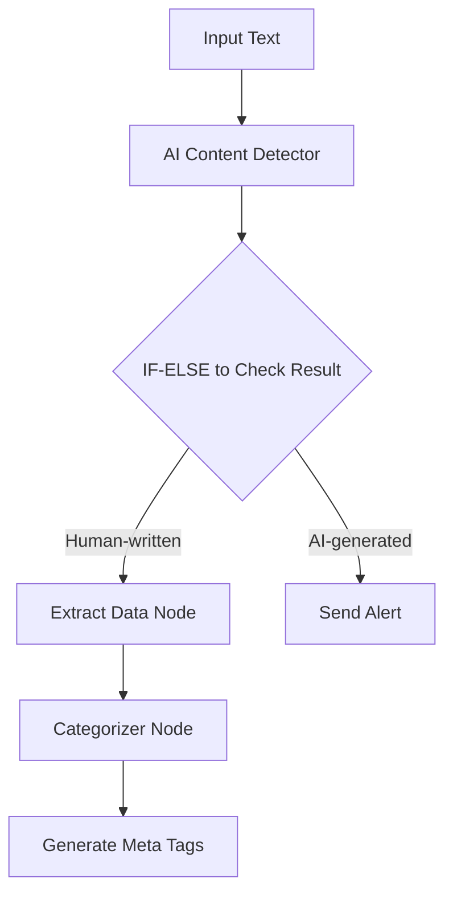

**Nodes Used**:

1. AI Content Detector
   * Analyzes submitted content
   * Confidence threshold: 80%

2. Extract Data Node
   * Pulls key topics and themes
   * Identifies main keywords

3. Categorizer Node
   * Assigns content categories
   * Tags content type

4. Ask AI Node
   * Generates SEO meta descriptions
   * Creates social media snippets

##### 2. Academic Submission Review System

**Goal**: Screen student assignments for AI-generated content and provide detailed feedback

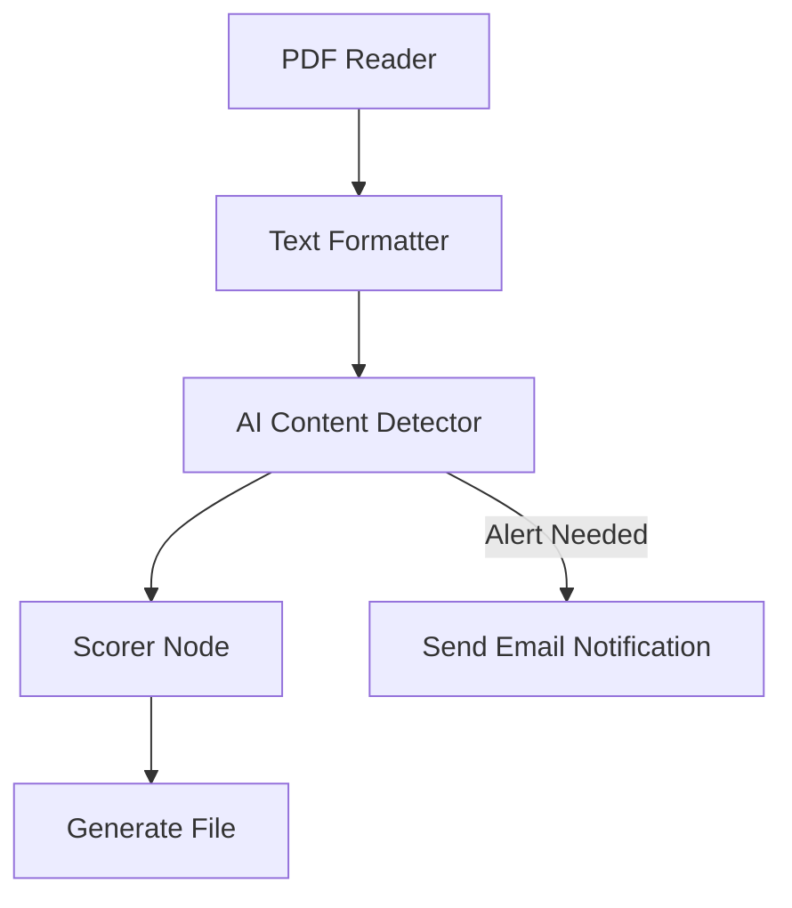

**Workflow Steps**:

1. PDF Reader Node
   * Extracts text from submissions
   * Maintains formatting

2. Text Formatter Node
   * Normalizes text structure

3. AI Content Detector
   * Analyzes content authenticity
   * Generates detailed reports

4. Scorer Node
   * Evaluates writing quality based on set rubric
   * Provides feedback points (enable AI Justification output)

5. Send Email Notification Node
   * Alerts instructors of potential issues
   * Sends automated feedback

##### 3. Content Moderation System

**Goal**: Review and categorize user-submitted content across multiple platforms

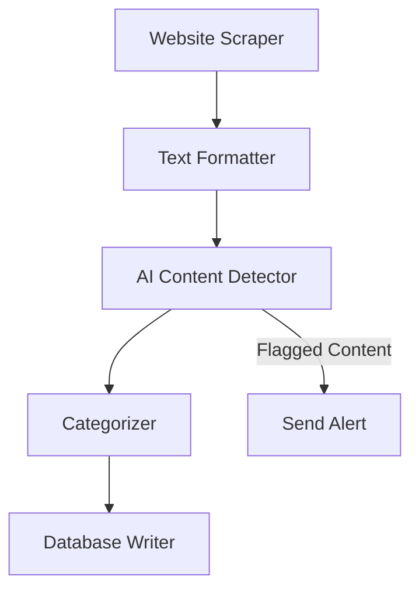

**Integration Points**:

1. Website Scraper Node
   * Extracts relevant text from article or blog

2. AI Content Detector
   * Screens for AI-generated content
   * Provides confidence scores

3. Categorizer Node
   * Classifies content type
   * Tags content themes

4. Airtable Database Writer Node
   * Stores analysis results
   * Updates content status

#### Best Practices

##### Optimization Tips

1. **Batch Processing**
   * Use Loop Mode for multiple content items

2. **Credit Management**
   * Estimate word count beforehand
   * Use Text Formatter, Find & Replace, or Chunk Text to clean input
   * Remove unnecessary content

#### Limitations and Considerations

* Possible false positives
* Language support restrictions

#### Additional Resources

* [GPTZero Documentation](https://gptzero.me/)
* Related nodes: [Categorizer](https://docs.gumloop.com/nodes/using_ai/categorizer), [Ask AI](https://docs.gumloop.com/nodes/using_ai/ask_ai), [Text Formatter](https://docs.gumloop.com/nodes/text_manipulation/text_formatter)

#### AI Filter

*This document explains the AI Filter node, which uses natural language conditions and AI to filter data by comparing two inputs.*

**Source:** https://docs.gumloop.com/nodes/using_ai/ai_filter

This document explains the AI Filter node, which uses natural language conditions and AI to filter data by comparing two inputs.

#### Node Inputs

##### Required Fields

* **Filter By**: Main content to filter
* **Value**: The output you want to pass if the condition is met
* **Condition**: Natural language comparison rule

  Example: "Is the provided text in Spanish"

##### Optional Fields

* **Output Blank Value**: Return blanks for non-matches
* **Temperature**: Controls decision consistency (0-1)
  * 0: More focused, consistent
  * 1: More creative, varied
* **Cache Response**: Save responses for reuse

##### Show As Input

The node allows you to configure certain parameters as dynamic inputs. You can enable these in the "Configure Inputs" section:

* **condition**: String
  * Natural language comparison rule
  * Example: "Is the provided text in Spanish"
  * Example: "Does the text contain pricing information"

* **output\_blank\_value**: Boolean
  * true/false to control what happens with non-matches
  * When true, outputs blank for non-matching items
  * When false, skips non-matching items entirely

* **model\_preference**: String
  * Name of the AI model to use
  * Accepted values: "Claude 4.6 Sonnet", "Claude 4.5 Haiku", "GPT-5.5", "GPT-5.4", etc.

* **Cache Response**: Boolean
  * true/false to enable/disable response caching
  * Helps reduce API calls for identical inputs

* **Temperature**: Number
  * Value between 0 and 1
  * Controls decision consistency
  * Lower values (closer to 0) provide more consistent filtering results

When enabled as inputs, these parameters can be dynamically set by previous nodes in your workflow. If not enabled, the values set in the node configuration will be used.

#### Node Output

* **Filtered Output**: Values that meet your condition

#### Node Functionality

The AI Filter node:

* Compares paired values
* Uses natural language rules
* Evaluates matching criteria

#### Available AI Models

Gumloop supports 30+ AI models across every major provider. Pick the model that fits your task in the node's model dropdown, and see [AI Models](https://docs.gumloop.com/core-concepts/ai_models) for the full list.

> **Info:** Auto-Select uses third-party routing to choose models based on cost and performance. Not ideal when consistent behavior is required.

#### AI Model Selection Guide

Balance quality, speed, and cost when choosing a model:

* Smaller, faster models cost less per token and respond quicker, which suits everyday tasks like classification, short answers, and simple analysis.
* Larger frontier models deliver higher quality on complex reasoning, coding, and detailed or long-form analysis, at a higher cost and slower response.

Additional selection factors:

* Task complexity and required accuracy
* Response time requirements
* Cost considerations
* Consistency needs across runs
* Specialized knowledge requirements

For more detailed information on AI models with advanced reasoning capabilities, you can refer to:

* [Anthropic Models Overview](https://docs.anthropic.com/en/docs/models-overview)
* [Anthropic Extended Thinking Documentation](https://docs.anthropic.com/en/docs/build-with-claude/extended-thinking)
* [OpenAI Reasoning Guide](https://platform.openai.com/docs/guides/reasoning)
* [OpenAI GPT-5 Models](https://openai.com/index/gpt-5/)

#### Important Considerations

1. This node is billed by **token usage**, the same way agents are, so the cost of a run depends on the model you pick and how many input and output tokens it uses
2. Add your own provider API key on the [Connectors page](https://www.gumloop.com/personal/connectors) to run its AI calls for **50% fewer credits** (Pro plan or higher)
3. Values and Filter By lists must match in length
4. Write clear comparison conditions for accurate outputs
5. This node relies heavily on AI model performance, which may vary depending on the complexity of your filtering conditions. For more reliable and consistent filtering:
   * Use the [Filter node](https://docs.gumloop.com/nodes/flow_basics/filter) for straightforward comparisons and exact matching
   * Create a [custom node](https://docs.gumloop.com/nodes/custom_node_details) for complex filtering logic that needs to be precise and deterministic

In summary, the AI Filter node helps you filter content by comparing pairs of values using natural language rules, perfect for complex matching and filtering tasks where some flexibility in interpretation is acceptable. For mission-critical filtering that requires exact matching or complex logic, consider using the standard Filter node or creating a custom node.

#### AI List Sorter

*This document explains the AI List Sorter node, which helps you sort lists using AI when regular filter conditions aren't enough. It's great for tasks like sorting emails by importance or ranking tasks by complexity.*

**Source:** https://docs.gumloop.com/nodes/using_ai/ai_list_sorter

This document explains the AI List Sorter node, which helps you sort lists using AI when regular filter conditions aren't enough. It's great for tasks like sorting emails by importance or ranking tasks by complexity.

#### Node Inputs

##### Required Fields

* **Input List**: The items you want to sort. Can be any list containing text like:
  * Customer reviews
  * Support tickets
  * Product descriptions
  * Tasks
  * Emails

* **Ordering Criteria Prompt**: Tell the AI how to sort your items. Be specific:
  * Example: "Sort these reviews by how urgent they are, considering if the customer is angry and how serious the problem is"
  * Example: "Order these product ideas by potential profit, looking at market size and development costs"
  * Example: "Rank these tasks by how complex they are and how long they'll take"

##### Optional Fields

* **Sort Order**: Choose how to order items
  * Descending (Default): Highest ranked first
  * Ascending: Lowest ranked first

* **Choose AI Model**: Pick which AI to use. This node is billed by token usage, so the cost depends on the model you pick and how many input and output tokens it uses. Adding your own provider API key runs its AI calls for 50% fewer credits.

* **Temperature**: Controls how the AI makes decisions (0-1)
  * 0: More consistent sorting
  * 1: More varied sorting

* **Cache Response**: If active, the AI response for the input will be stored for the future. This can improve performance and cost for repeated requests as the stored response can be used instead of making a new request each time.

##### Show As Input

Make the following node parameters dynamic inputs by enabling them in "Configure Inputs":

* **Ordering Criteria Prompt**: Text (String)
  * Your sorting instructions
  * Example: "Sort by urgency level"

* **Sort Orderr**: Text (String)
  * "Ascending" or "Descending"

* **Model Preference**: Text (String)
  * Which AI model to use
  * Options: "Claude 4.6 Sonnet", "Claude 4.5 Haiku", "GPT-5.5", "GPT-5.4", etc.

* **Temperature**: Text/Number
  * Between 0-1
  * Controls sorting consistency

* **Cache Response**: Boolean
  * true/false to save responses
  * Saves credits on repeated sorts for the same inputs and parameters

#### Available AI Models

Gumloop supports 30+ AI models across every major provider. Pick the model that fits your task in the node's model dropdown, and see [AI Models](https://docs.gumloop.com/core-concepts/ai_models) for the full list.

> **Info:** Auto-Select uses third-party routing to choose models based on cost and performance. Not ideal when consistent behavior is required.

#### AI Model Selection Guide

Balance quality, speed, and cost when choosing a model:

* Smaller, faster models cost less per token and respond quicker, which suits everyday tasks like classification, short answers, and simple analysis.
* Larger frontier models deliver higher quality on complex reasoning, coding, and detailed or long-form analysis, at a higher cost and slower response.

Additional selection factors:

* Task complexity and required accuracy
* Response time requirements
* Cost considerations
* Consistency needs across runs
* Specialized knowledge requirements

For more detailed information on AI models with advanced reasoning capabilities, you can refer to:

* [Anthropic Models Overview](https://docs.anthropic.com/en/docs/models-overview)
* [Anthropic Extended Thinking Documentation](https://docs.anthropic.com/en/docs/build-with-claude/extended-thinking)
* [OpenAI Reasoning Guide](https://platform.openai.com/docs/guides/reasoning)
* [OpenAI GPT-5 Models](https://openai.com/index/gpt-5/)

#### Examples

##### Support Ticket Sorting

```text
Input List:
- "Can't check out, getting error 404"
- "Need password reset help"
- "Charged twice for subscription"
- "Want dark mode feature"

Ordering Criteria: "Sort by urgency and money impact. Problems with payments or buying are most important."

Output:
1. "Charged twice for subscription"
2. "Can't check out, getting error 404"
3. "Need password reset help"
4. "Want dark mode feature"
```

##### Sales Lead Prioritization

```text
Input List:
- "Fortune 500 company, interested in enterprise plan, needs response by EOW"
- "Startup looking for basic tier, currently using competitor"
- "Current customer wanting to upgrade to business plan"
- "Large retail chain requesting custom integration demo"

Ordering Criteria: "Sort by deal size potential, urgency, and likelihood to close. Prioritize enterprise deals and existing customers."

Output:
1. "Fortune 500 company, interested in enterprise plan, needs response by EOW"
2. "Current customer wanting to upgrade to business plan"
3. "Large retail chain requesting custom integration demo"
4. "Startup looking for basic tier, currently using competitor"
```

#### Tips for Best Results

##### Making Your Sorts Better

* The node works best of shorter lists. For large lists, its ideal to break the list into [chunks](https://docs.gumloop.com/nodes/text_manipulation/chunk_text) and run the node in Loop mode.
* Write clear sorting instructions
* Use Loop Mode for multiple lists
* Start with lower temperature (0.2-0.4) for consistent results
* Cache responses when sorting similar items often

##### Writing Good Instructions

Tell the AI exactly what matters when sorting:

```text
"Sort these feature requests by:
1. How many users want it
2. How hard it is to build
3. How many users might quit if we don't build it
4. How much money it could make
Put features that fix core product issues at the top"
```

#### Common Problems and Fixes

##### Getting Different Orders Each Time

\-- Problem: Same input gives different sorting order

\-- Fix: Lower the temperature or make your instructions more specific

##### Bad Sorting Results

\-- Problem: AI isn't sorting how you want

\-- Fix:

* Make your instructions clearer

* Try a better AI model

* Break down your sorting rules into simple points

#### Loop Mode

When you turn this on:

1. Each list gets sorted separately
2. Lists stay organized the same way
3. You get back multiple sorted lists

#### In Summary

The AI List Sorter node helps sort lists using AI when normal filtering isn't enough. It's most effective for:

* Shorter lists
* Complex sorting criteria

#### AI Web Research

**Source:** https://docs.gumloop.com/nodes/using_ai/ai_web_research

This document explains the AI Web Research node, which combines web search and structured data extraction capabilities into one powerful automation node. Built on advanced AI models, this node enables automated web research, data analysis, and information synthesis from multiple sources.

#### Getting Started

##### Quick Setup Video

*[Video]*

##### Step-by-Step Guide

1. **Add your research prompt**

   Write a clear prompt describing what you want to research

       * Use the format: "Given \[input], find/analyze/research \[output]"
       * Example: `"Given a company name, find their latest funding and news"`

2. **Generate Inputs and Outputs**

   Click the button to create your schema

       * The AI analyzes your prompt and generates appropriate fields
       * Review the generated inputs and outputs

3. **Connect inputs**

   Link data from previous nodes

       * The node shows expected input types (List or single value)
       * Match your data sources to the generated inputs

4. **Select Research Type**

   Choose your processor

       * Use Auto-Select for intelligent optimization
       * Or manually select based on your needs

5. **Run and review**

   Execute the research and check outputs

       * Citations and reasoning are always included
       * Connect outputs to downstream nodes

#### Schema Generation

##### Initial Generation

When you click **"Generate Inputs and Outputs"**, the system creates a custom schema based on your research prompt.

*[Image: AI Web Research Node]*

##### Schema Refinement

After generating your initial schema, you can refine it if needed by clicking **"Regenerate Inputs and Outputs"** again. This opens a dialog with two options:

*[Image: Schema Refinement Dialog]*

  
**Refine Current Schema**

**When to use:** You want to adjust the existing fields without starting over

    **How it works:**

    * Provide feedback on what to change
    * The AI modifies your current schema based on feedback
    * Preserves the overall structure while making adjustments

    **Example refinements:**

    * "Add funding information and remove the website field"
    * "Include employee count and industry classification"
    * "Change company description to be more detailed"

  
**Generate New Schema**

**When to use:** You want to completely change your research approach

    **How it works:**

    * Creates a fresh schema from scratch
    * Based on your updated research prompt
    * Discards the previous schema entirely

    **Example scenarios:**

    * Switching from company research to people research
    * Changing from financial analysis to competitive analysis
    * Moving from basic enrichment to deep investigation

#### Research Type Processors

> **Info:** **Pro tip:** Start with Auto-Select mode - it intelligently chooses between lite, base, and core processors to optimize for both cost and performance.

##### Processor Comparison

| Processor | Credits | Time    | Max Fields | Best Use Cases                      |
| --------- | ------- | ------- | ---------- | ----------------------------------- |
| **lite**  | 4       | 5-60s   | \~2        | Quick lookups, simple facts         |
| **base**  | 8       | 15-100s | \~5        | Standard enrichment, basic research |
| **core**  | 20      | 1-5m    | \~10       | Business research, cross-validation |
| **pro**   | 80      | 3-9m    | \~20       | Exploratory research, deep analysis |
| **ultra** | 200     | 5-25m   | \~20       | Comprehensive reports, PDF analysis |

##### Processor Selection Guide

  
**Lite Processor (4 credits)**

**Perfect for simple, fast lookups**

    **Use cases:**

    * Company addresses and phone numbers
    * Website URLs and social media handles
    * Basic business information (founded date, CEO name)
    * Simple yes/no verifications

    **Real examples:**

    ```text theme={"dark"}
    "Given a company name, find their headquarters address"
    "Given a website, extract the contact email"
    "Given a business name, find if they have a mobile app"
    ```

  
**Base Processor (8 credits)**

**Ideal for standard enrichment tasks**

    **Use cases:**

    * Product offerings and service descriptions
    * Team size and office locations
    * Industry classification and business model
    * Recent announcements or updates

    **Real examples:**

    ```text theme={"dark"}
    "Given a company website, extract their main products and pricing tiers"
    "Given a startup name, find their target market and value proposition"
    "Given a business domain, identify their key partnerships"
    ```

  
**Core Processor (20 credits)**

**Recommended for most business research**

    **Use cases:**

    * Competitive positioning and market analysis
    * Financial metrics and growth indicators
    * Leadership team and board composition
    * Technology stack and integrations

    **Real examples:**

    ```text theme={"dark"}
    "Given a company, research their funding history, investors, and valuation"
    "Given a competitor list, analyze their pricing strategies and differentiators"
    "Given an industry, identify top players and market dynamics"
    ```

    
> **Note:** Core processor includes confidence scores and detailed citations for each field.

  
**Pro Processor (80 credits)**

**For complex, exploratory research**

    **Use cases:**

    * Multi-dimensional company analysis
    * Deep competitive intelligence
    * Comprehensive market research
    * Investment due diligence

    **Real examples:**

    ```text theme={"dark"}
    "Given a company, analyze their business model, revenue streams, competitive advantages, risks, and growth potential"
    "Given a market segment, research all major players, their strategies, partnerships, and recent developments"
    "Given an acquisition target, evaluate their technology, team, financials, and strategic fit"
    ```

  
**Ultra Processor (200 credits)**

**Maximum depth for critical research**

    **Use cases:**

    * Analyzing lengthy PDFs and reports on the web
    * Comprehensive regulatory compliance research
    * Deep technical documentation analysis
    * Multi-source investigative research

    **Real examples:**

    ```text theme={"dark"}
    "Given a company's SEC filings URL, extract all financial metrics, risks, and strategic initiatives"
    "Given a technology, research all implementations, case studies, benchmarks, and limitations"
    "Given an industry regulation, analyze compliance requirements, penalties, and implementation guidelines"
    ```

#### Output Structure

##### Standard Outputs

All research tasks include these base outputs:

  - **Citations**: Source URLs and references for all findings

  - **Reasoning**: Detailed explanation of research methodology

> **Note:** The language of the Reasoning output is automatically inferred from your research prompt and input data. If your prompt is written in French, the reasoning will be returned in French. To ensure consistent language across runs, write your research prompt in your preferred language.

##### Enhanced Outputs (Core/Pro/Ultra)

Advanced processors provide additional metadata for each field:

  - **Field-Specific Reasoning**: `[field_name]_reasoning` - How each value was determined

  - **Field Citations**: `[field_name]_citations` - Sources for specific data points

  - **Confidence Scores**: `[field_name]_confidence` - Reliability rating (High, Medium, or Low)

#### Practical Examples

##### Sales Intelligence Workflow

  ```yaml Company Enrichment theme={"dark"}
  Research Prompt: "Given a company domain, find decision makers, 
                   recent news, and technology stack"
  Processor: core
  Inputs: company_domain
  Outputs: 
    - executives (with LinkedIn URLs)
    - recent_developments
    - tech_stack
    - company_size
    - funding_status
  ```

  ```yaml Lead Scoring theme={"dark"}
  Research Prompt: "Given a prospect company, evaluate their fit 
                   based on size, technology, and growth signals"
  Processor: base
  Inputs: company_name
  Outputs:
    - employee_count
    - uses_target_technology
    - recent_hiring
    - expansion_indicators
  ```

##### Investment Research Pipeline

  ```yaml Due Diligence theme={"dark"}
  Research Prompt: "Given a startup, analyze their market position, 
                   team, traction, and competitive landscape"
  Processor: pro
  Inputs: startup_name, website
  Outputs:
    - founding_team_background
    - market_size
    - key_competitors
    - unique_advantages
    - customer_traction
    - risk_factors
  ```

  ```yaml Market Analysis theme={"dark"}
  Research Prompt: "Given an industry vertical, map the ecosystem 
                   including players, trends, and opportunities"
  Processor: ultra
  Inputs: industry_name
  Outputs:
    - market_leaders
    - emerging_players
    - technology_trends
    - regulatory_landscape
    - investment_activity
    - growth_projections
  ```

#### Best Practices

##### Writing Effective Prompts

  
**Do's ✅**

* Be specific about what information you need
    * Use clear input/output structure
    * Specify the context or use case
    * Include any special requirements

    **Good examples:**

    * "Given a SaaS company website, extract pricing tiers, features, and integration partners"
    * "Given a company name and industry, find their main competitors and market share"

  
**Don'ts ❌**

* Avoid vague or open-ended requests
    * Don't ask for subjective opinions
    * Avoid requesting too many fields at once

    **Poor examples:**

    * "Tell me everything about this company"
    * "Is this a good investment?"
    * "Find all possible information"

##### Optimization Strategies

1. **Start with Auto-Select**

   Let the system optimize processor selection for you

2. **Test with small batches**

   Validate your schema with 2-3 examples before scaling

3. **Monitor credit usage**

   Track consumption and adjust processors as needed

4. **Chain nodes strategically**

   Split complex research into multiple focused nodes

##### Advanced Techniques

###### Research Chaining

For comprehensive analysis, chain multiple nodes:

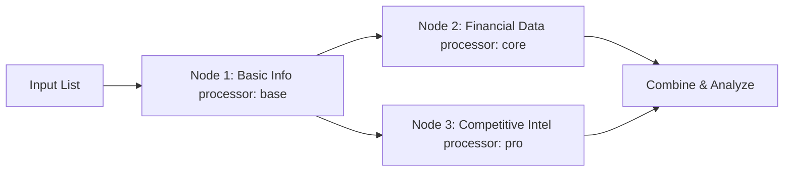

#### Troubleshooting

> **Warning:** The Ultra processor can take up to 25 minutes. Consider using lower processors if speed is critical.

  
**No outputs generated**

* Verify your research prompt is clear and specific
    * Click "Regenerate Inputs and Outputs" to update schema
    * Ensure all required inputs are connected
    * Check that input data is in the correct format

  
**Inconsistent results**

* Add more specific requirements to your prompt
    * Upgrade to core or higher processors
    * Review citations to understand data sources
    * Use confidence scores to filter results

The AI Web Research node represents the most advanced research capability on the Gumloop platform, combining automated web research with precise data extraction to deliver comprehensive, accurate results tailored to your business automation needs.

#### Analyze Image

*This document explains the Analyze Image node, which uses AI vision to extract information and insights from images.*

**Source:** https://docs.gumloop.com/nodes/using_ai/analyze_image

This document explains the Analyze Image node, which uses AI vision to extract information and insights from images.

#### Node Inputs

##### Required Fields

* **Image File**: Upload image or PDF (JPG, PNG, GIF, WEBP or PDF)
* **Prompt**: Question or instruction for analysis. Be detailed here for accurate output

##### Optional Fields

* **Use Link**: Enable to use direct image URLs
  * Only supports publicly accessible media links (e.g., [https://example.com/image.jpg](https://example.com/image.jpg))
  * Does not support Google Drive, Dropbox, or other file-sharing links
  * URL must point directly to the image file
* **Temperature**: Controls analysis creativity (0-1)
  * 0: More focused, consistent
  * 1: More creative, varied
* **Cache Response**: Save responses for reuse

##### Show As Input

The node allows you to configure certain parameters as dynamic inputs. You can enable these in the "Configure Inputs" section:

* **Use Link**: Boolean
  * true/false to use image URL instead of file upload
  * When enabled, allows input of publicly accessible image URLs
  * Remember: Only direct media links are supported

* **Prompt**: String
  * The specific question or instruction for analyzing the image
  * Example: "Describe the main objects in this image"

* **image\_model\_preference**: String
  * Name of the AI model to use for image analysis
  * Accepted values: "GPT-5.5", "GPT-5.4", "Claude 4.6 Sonnet", etc.

* **Cache Response**: Boolean
  * true/false to enable/disable response caching
  * Helps reduce API calls for identical inputs

* **Temperature**: Number
  * Value between 0 and 1
  * Controls analysis consistency and creativity

When enabled as inputs, these parameters can be dynamically set by previous nodes in your workflow. If not enabled, the values set in the node configuration will be used.

#### Node Output

* **Analysis**: AI's detailed response about the image

#### Node Functionality

The Analyze Image can:

* Processes images with AI vision
* Extracts text from images
* Generates descriptions
* Answers queries about content
* Identifies objects and scenes
* Can read image-based PDFs

#### Available AI Models

Vision-capable models for image analysis:

Gumloop supports 30+ AI models across every major provider. Pick the model that fits your task in the node's model dropdown, and see [AI Models](https://docs.gumloop.com/core-concepts/ai_models) for the full list.

#### AI Model Selection Guide

Balance quality, speed, and cost when choosing a model:

* Smaller, faster models cost less per token and respond quicker, which suits everyday tasks like classification, short answers, and simple analysis.
* Larger frontier models deliver higher quality on complex reasoning, coding, and detailed or long-form analysis, at a higher cost and slower response.

Additional selection factors:

* Task complexity and required accuracy
* Response time requirements
* Cost considerations
* Consistency needs across runs
* Specialized knowledge requirements

For more detailed information on AI models with advanced reasoning capabilities, you can refer to:

* [Anthropic Models Overview](https://docs.anthropic.com/en/docs/models-overview)
* [Anthropic Extended Thinking Documentation](https://docs.anthropic.com/en/docs/build-with-claude/extended-thinking)
* [OpenAI Reasoning Guide](https://platform.openai.com/docs/guides/reasoning)
* [OpenAI GPT-5 Models](https://openai.com/index/gpt-5/)

#### Common Use Cases

1. **Text Extraction**:

```text
Prompt: "Extract all text visible in this image"
Use: Scanning documents, reading signs
```

2. **Visual Description**:

```text
Prompt: "Describe this image in detail"
Use: Accessibility, content cataloging
```

3. **Object Detection**:

```text
Prompt: "List all objects in this image"
Use: Inventory, scene analysis
```

#### Important Considerations

1. The Analyze Image node is billed by **token usage**, the same way agents are. The cost of a run depends on the model you pick and the size of the image and prompt, so there are no fixed per-run tiers. Smaller, faster vision models cost less per token than frontier models.
2. Add your own provider API key on the [Connectors page](https://www.gumloop.com/personal/connectors) to run this node's AI calls for **50% fewer credits** (Pro plan or higher).

In summary, the Analyze Image node helps extract meaning and information from images using powerful AI vision models.

#### Analyze Video

**Source:** https://docs.gumloop.com/nodes/using_ai/analyze_video

#### Node Inputs

##### Required Fields

* **Video File**: Upload video (FLV, QuickTime, MPEG, MPEGPS, MPG, MP4, WEBM, WMV, or 3GPP)
* **Prompt**: Question or instruction for analysis. Be specific for best results
* **Video Model**: Choose AI model for analysis (Gemini 3.1 Pro, Gemini 3.5/3 Flash)

##### Optional Fields

* **Use Link**: Enable to use direct video URLs
  * Only supports publicly accessible media links (e.g., [https://example.com/video.mp4](https://example.com/video.mp4))
  * Does not support Google Drive, Dropbox, or other file-sharing links
  * URL must point directly to the media file
* **Temperature**: Controls analysis creativity (0-1, default: 1)
* **Cache Response**: Save responses for reuse

##### Show As Input

The node allows you to configure certain parameters as dynamic inputs. You can enable these in the "Configure Inputs" section:

* **Use Link**: Boolean
  * true/false to use video URL instead of file upload
  * When enabled, allows direct input of video URLs

* **Prompt**: String
  * The specific question or instruction for analyzing the video
  * Example: "Describe the main events in this video"

* **video\_model\_preference**: String
  * Name of the AI model to use for video analysis
  * Accepted values: "Gemini 3.1 Pro", "Gemini 3.5 Flash", "Gemini 3 Flash"

* **Cache Response**: Boolean
  * true/false to enable/disable response caching
  * Helps reduce API calls for identical inputs

* **Temperature**: Number
  * Value between 0 and 1
  * Controls analysis consistency and creativity

When enabled as inputs, these parameters can be dynamically set by previous nodes in your workflow. If not enabled, the values set in the node configuration will be used.

#### Node Output

* **Analysis**: AI's detailed response about the video content

#### Node Functionality

The Analyze Video node can:

* Process video content with AI vision
* Extract text from video frames
* Generate video descriptions
* Answer queries about video content
* Identify objects and actions
* Analyze scenes and transitions
* Track movement and changes

#### Available AI Models

Video analysis requires Gemini models with video support:

| Model                | Best For                           |
| -------------------- | ---------------------------------- |
| **Gemini 3.1 Pro**   | Detailed analysis, complex content |
| **Gemini 3.5 Flash** | Fast processing, balanced quality  |
| **Gemini 3 Flash**   | Quick, basic analysis              |

#### Common Use Cases

1. **Content Description**:

```text
Prompt: "Describe the main events in this video"
Use: Content cataloging, accessibility
```

2. **Text Extraction**:

```text
Prompt: "Extract any text that appears in the video"
Use: Subtitle extraction, text analysis
```

3. **Action Recognition**:

```text
Prompt: "List all activities and actions occurring in this video"
Use: Behavior analysis, event detection
```

4. **Object Tracking**:

```text
Prompt: "Track and describe the movement of specific objects"
Use: Motion analysis, surveillance
```

#### Best Practices

1. **Video Length**:
   * Keep videos reasonably short for better analysis
   * Consider splitting longer videos into segments

2. **Prompt Engineering**:
   * Be specific in your instructions
   * Focus on one analysis task at a time
   * Include temporal aspects if timing is important

3. **Model Selection**:
   * Use Gemini 3.1 Pro for detailed analysis
   * Choose Gemini 3.5 Flash or 3 Flash for quick, basic analysis

4. **Temperature Usage**:
   * Low (0-0.3): Consistent, factual analysis
   * Medium (0.4-0.7): Balanced analysis
   * High (0.8-1.0): Creative descriptions

#### Important Considerations

1. Cost: 20 credits per video analysis
2. Processing time increases with video length
3. Analysis quality depends on video resolution and clarity
4. When using the `Use Link` option make sure the link has the appropriate file extension

In summary, the Analyze Video node provides powerful video analysis capabilities using state-of-the-art AI vision models, suitable for a wide range of applications from content description to detailed motion analysis.

#### Ask AI

*The Ask AI node lets you interact with AI models to process text and generate responses. Connect it to other nodes to create powerful automated workflows that leverage the latest AI capabilities.*

**Source:** https://docs.gumloop.com/nodes/using_ai/ask_ai

The Ask AI node lets you interact with AI models to process text and generate responses. Connect it to other nodes to create powerful automated workflows that leverage the latest AI capabilities.

  *[Video: Getting started with Gumloop: Workflows, nodes & AI]*

#### Quick Start

1. **Add the Ask AI node to your workflow**

   Drag the Ask AI node from the node library into your canvas

2. **Write your prompt**

   Enter clear, detailed instructions in the prompt field to guide the AI

3. **Choose your AI model**

   Select the model that best fits your task complexity and budget

4. **Connect and run**

   Connect inputs from other nodes by dragging output badges into your prompt

#### Node Configuration

##### Required Fields

  
**Prompt**

The main instruction or question for the AI. Your prompt should be clear and detailed to get the best possible response.

    **Example prompt formats:**

    ```text theme={"dark"}
    Analyze this website content and provide a one-page summary:

    [drag Website Scraper badge here]
    ```

    ```text theme={"dark"}
    Write a professional email response to:
    [drag Customer Query badge here]
    ```

##### More Options

  
**Choose AI Model**

Select from over 20 AI models including Claude, GPT, Gemini, and specialized reasoning models. See [AI Model Selection Guide](#ai-model-selection-guide) below for detailed recommendations.

  
**Temperature (0-1)**

Controls response creativity and consistency.

    * **0**: More focused and consistent responses
    * **1** (default): More creative and varied outputs

    Use lower temperatures for factual tasks, higher for creative content.

  
**Maximum Tokens**

Limits the total response length. Sets the upper bound for how long the AI's response can be.

    
> **Info:** For Claude models with Extended Thinking enabled, this must be greater than your Thinking Tokens setting.

  
**Cache Response**

Saves responses for reuse when inputs remain constant.

    **Caching works when ALL of these are identical:**

    * Prompt text (including any inserted input badges)
    * Model selection
    * Temperature setting
    * Maximum tokens
    * Thinking tokens (if applicable)

    Perfect for testing workflows or handling repeated queries.

  
**Thinking Tokens (Claude Extended Thinking only)**

Sets a budget for the model's internal reasoning process before generating the final response.

    **Requirements:**

    * Minimum: 1,024 tokens
    * Must be less than Maximum Tokens
    * Recommended: 4,000-16,000 for complex tasks

    Larger budgets improve reasoning quality but increase cost and response time.

  
**MCP Server Connection**

Connect to a remote Model Context Protocol (MCP) server to extend the AI's capabilities with custom tools and data sources.

    
> **Info:** Learn how to set up and use MCP servers with the Ask AI node in the [Custom MCP Servers documentation](https://docs.gumloop.com/nodes/mcp/custom_mcp_servers).

##### AI Model Fallback

Under **Show More Options**, configure automatic fallback when your selected AI model is unavailable. **Fallback is enabled by default.**

*[Screenshot: AI Model Fallback settings]*

When an error occurs (rate limits, provider outages, timeouts), the system retries based on severity, then falls back to the next model. Fallback models are always from different providers for true redundancy.

| Error Type    | Retries Before Fallback |
| ------------- | ----------------------- |
| Rate Limit    | 2                       |
| Provider 5xx  | 1                       |
| Network Error | 0 (immediate)           |
| Timeout       | 1                       |

**Default (Auto):** The system automatically selects fallback models based on your primary model, always choosing from different providers for true redundancy.

**Override:** Enable to manually select up to 2 fallback models with drag-and-drop priority.

> **Warning:** Disabling fallback means your node will fail if the primary model is unavailable.

##### Dynamic Inputs (Show As Input)

You can configure certain parameters as dynamic inputs that can be set by previous nodes in your workflow:

| Parameter            | Type   | Example Values                                   |
| -------------------- | ------ | ------------------------------------------------ |
| **prompt**           | String | "Summarize this article"                         |
| **Model Preference** | String | "Claude 4.6 Sonnet", "GPT-5.5", "Gemini 3.1 Pro" |
| **Temperature**      | Number | 0 to 1                                           |
| **Maximum Tokens**   | Number | Any positive integer (e.g., 2000)                |
| **Thinking Tokens**  | Number | Minimum 1024 (Claude Extended Thinking only)     |

> **Info:** When enabled as inputs, these parameters can be dynamically set by previous nodes. If not enabled, the values set in the node configuration will be used.

#### Using Connected Node Data

*[Image: Ask AI node example showing connected data]*

Gumloop's interface makes it simple to incorporate data from other nodes:

1. **Connect your nodes**

   Drag a connection line between the source node and your Ask AI node

2. **Access outputs in the side menu**

   Available outputs from connected nodes appear automatically in the side menu

3. **Drag outputs into your prompt**

   Simply drag the output badge from the side menu and drop it into your prompt field

4. **Format around dynamic values**

   Add text before and after the output badges to create well-structured prompts

#### Available AI Models

Gumloop supports 30+ AI models across multiple providers. Pick the model that fits your task in the node's model dropdown, and see [AI Models](https://docs.gumloop.com/core-concepts/ai_models) for the full list. **Auto-Select** (third-party routing that picks a model by cost and performance) and **Azure OpenAI** (with your own credentials) are also available.

##### Deep Research Models

  - **Perplexity Sonar Deep Research**: Comprehensive deep research capabilities with real-time web access for demanding analytical tasks.

> **Info:** Deep Research models perform comprehensive, multi-step reasoning and investigation. They're specifically designed for queries that require thorough research, fact-checking, and synthesizing information from multiple angles.

#### AI Model Selection Guide

Balance quality, speed, and cost when choosing a model:

* Smaller, faster models cost less per token and respond quicker, which suits everyday tasks like classification, short answers, and simple analysis.
* Larger frontier models deliver higher quality on complex reasoning, coding, and detailed or long-form analysis, at a higher cost and slower response.

> **Warning:** **About Auto-Select:** Uses a third-party model routing service that automatically chooses models based on cost, performance, and availability. Not ideal when consistent model behavior is required.

##### When to Use Deep Research Models

Deep Research models are designed for tasks that require comprehensive investigation and analysis:

  
**Ideal For**

**Perfect use cases for Deep Research:**

    * **Market Research**: Analyzing industry trends, competitor landscapes, and market opportunities
    * **Due Diligence**: Investigating companies, technologies, or business proposals
    * **Fact-Checking**: Verifying claims across multiple sources and perspectives
    * **Literature Review**: Synthesizing information from multiple documents or sources
    * **Competitive Analysis**: Deep comparison of products, services, or strategies
    * **Complex Report Generation**: Creating comprehensive reports that require thorough investigation
    * **Multi-Perspective Analysis**: Examining topics from different angles and viewpoints

  
**Not Ideal For**

**When to use other models instead:**

    * **Simple Content Creation**: Use standard models for straightforward writing tasks
    * **Quick Q\&A**: Use advanced models for faster responses to direct questions
    * **Real-Time Interactions**: Deep Research takes longer; use standard models for speed
    * **Code Generation**: Use thinking or expert models for better code-specific performance
    * **Creative Writing**: Use standard or advanced models for creative tasks
    * **Routine Data Processing**: Use standard models for repetitive, straightforward tasks

  
**How It Works**

**Deep Research Process:**

    Deep Research models approach tasks differently than standard AI models:

    1. **Query Understanding**: Thoroughly analyzes your prompt to identify key research questions
    2. **Multi-Step Investigation**: Breaks down complex queries into smaller research tasks
    3. **Information Synthesis**: Combines findings from multiple reasoning paths
    4. **Verification**: Cross-checks information for consistency and accuracy
    5. **Comprehensive Response**: Delivers well-researched, thorough answers

    
> **Info:** This process takes significantly longer than standard models but provides more thorough, well-researched responses for complex analytical tasks.

##### Deep Research Model Comparison

  - **Perplexity Sonar Deep Research**: **Best for:** Comprehensive research tasks * Real-time web access for up-to-date information * Multi-step investigation and synthesis * Best for research requiring current data * Longer processing time

##### Additional Selection Factors

Consider these factors when choosing a model:

* Task complexity and required accuracy
* Response time requirements
* Cost considerations
* Consistency needs across runs
* Specialized knowledge requirements
* Need for comprehensive investigation vs. quick answers

> **Tip:** For more information on advanced AI models: >  >   * [Anthropic Models Overview](https://docs.anthropic.com/en/docs/models-overview)   * [Anthropic Extended Thinking Documentation](https://docs.anthropic.com/en/docs/build-with-claude/extended-thinking)   * [OpenAI Reasoning Guide](https://platform.openai.com/docs/guides/reasoning)   * [OpenAI GPT-5 Models](https://openai.com/index/gpt-5/)

#### Node Output

**Response**: The AI's generated answer or output based on your prompt and configured parameters.

#### Common Use Cases

  
**Content Creation**

```text
    Prompt: "Write a blog post about [drag Topic input badge here]"
    ```

    Perfect for generating articles, social media posts, marketing copy, and other written content at scale.

  
**Data Analysis**

```text
    Prompt: "Analyze these sales figures and provide key insights:
    [drag Sales Data input badge here]"
    ```

    Extract insights, identify trends, and generate summaries from structured or unstructured data.

  
**Customer Support**

```text
    Prompt: "Answer this customer question professionally according to our company policies:
    Customer Question: [drag Customer Query input badge here]"
    ```

    Automate responses to common questions while maintaining brand voice and policy compliance.

  
**Research & Investigation (with Deep Research)**

```text
    Prompt: "Research the competitive landscape for SaaS project management tools, including:
    - Top 5 competitors
    - Their pricing models
    - Key differentiating features
    - Market positioning
    [drag Market Segment input badge here]"
    Model: OpenAI O3 Deep Research or O4 Mini Deep Research
    ```

    Use Deep Research models when you need comprehensive investigation, fact-checking across multiple angles, or thorough analysis of complex topics.

#### Loop Mode Pattern

When processing multiple items in Loop Mode, the Ask AI node analyzes each item individually:

```text
Input: List of articles
Prompt: "Analyze and find key patterns in this article: [drag Current Article output badge here]"
Result: Analysis generated for each article in the list
```

> **Info:** In Loop Mode, your workflow runs once for each item in the input list, allowing batch processing of multiple documents, queries, or data points.

#### Credit Costs

The Ask AI node is billed by **token usage**, the same way agents are. The cost of a run depends on the model you pick and how many input and output tokens it uses, so a short prompt costs far less than a long-context one. There are no fixed per-run tiers.

* Smaller, faster models cost less per token than frontier models. See [AI Models](https://docs.gumloop.com/core-concepts/ai_models).
* Keeping your prompt and inputs lean lowers the cost.

> **Tip:** Add your own provider API key on the [Connectors page](https://www.gumloop.com/personal/connectors) to run this node's AI calls for **50% fewer credits** (Pro plan or higher).

#### Important Considerations

  
**Function Calling**

The 'Use Function' option enables structured output formatting and is only available for OpenAI models.

    
> **Info:** Learn more in the [OpenAI Function Calling Documentation](https://platform.openai.com/docs/guides/function-calling).

  
**Model Selection Strategy**

Consider task complexity when selecting models. For reasoning-heavy tasks, consider thinking-enabled or specialized reasoning models. For straightforward content generation, standard models are often sufficient and more cost-effective.

  
**Working with Connected Nodes**

* Drag output badges from the side menu directly into your prompt
    * Format text around badges for better prompting
    * All outputs from connected nodes appear in the side menu
    * No need for separate Combine Text nodes

  
**Multimodal Content**

The Ask AI node is text-based only:

    * To analyze images, use the [Analyze Image node](https://docs.gumloop.com/nodes/using_ai/analyze_image)
    * To create images, use the [Generate Image node](https://docs.gumloop.com/nodes/using_ai/generate_image)

***

The Ask AI node is your interface to leading AI models, helping you automate text processing and generation tasks with customizable control over output style and format. With Gumloop's improved UI, you can easily incorporate data from connected nodes directly into your prompts, creating powerful automated workflows without complex configuration.

#### Categorizer

*This document explains the Categorizer node, which uses AI to classify text into custom categories.*

**Source:** https://docs.gumloop.com/nodes/using_ai/categorizer

This document explains the Categorizer node, which uses AI to classify text into custom categories.

*[Screenshot: AI Model Fallback settings]*

#### Node Inputs

##### Required Fields

* **Input**: Text to categorize
* **Categories**: Define your classification groups:
  * **Category Name**: Label for the category
  * **Category Description**: Explain what belongs in this category

##### Optional Fields

* **Include Justification**: Get AI's reasoning for selections
* **Additional Context**: Extra guidance for categorization
* **Temperature**: Controls AI decision-making (0-1)
  * 0: More focused, consistent
  * 1: More creative, varied
* **Cache Response**: Save responses for reuse

##### Show As Input

The node allows you to configure certain parameters as dynamic inputs. You can enable these in the "Configure Inputs" section:

* **include\_justification**: Boolean
  * true/false to include explanation for category assignment

* **Additional Context**: String
  * Extra information to guide the categorization process
  * Example: "These items are different types of software bugs"

* **model\_preference**: String
  * Name of the AI model to use
  * Accepted values: "Claude 4.6 Sonnet", "Claude 4.5 Haiku", "GPT-5.5", "GPT-5.4", etc.

* **Cache Response**: Boolean
  * true/false to enable/disable response caching
  * Helps reduce API calls for identical inputs

* **Temperature**: Number
  * Value between 0 and 1
  * Controls categorization consistency

When enabled as inputs, these parameters can be dynamically set by previous nodes in your workflow. If not enabled, the values set in the node configuration will be used.

##### AI Model Fallback

Under **Show More Options**, configure automatic fallback when your selected AI model is unavailable. **Fallback is enabled by default.**

When an error occurs (rate limits, provider outages, timeouts), the system retries based on severity, then falls back to the next model. Fallback models are always from different providers for true redundancy.

| Error Type    | Retries Before Fallback |
| ------------- | ----------------------- |
| Rate Limit    | 2                       |
| Provider 5xx  | 1                       |
| Network Error | 0 (immediate)           |
| Timeout       | 1                       |

**Default (Auto):** The system automatically selects fallback models based on your primary model, always choosing from different providers for true redundancy.

**Override:** Enable to manually select up to 2 fallback models with drag-and-drop priority.

> **Warning:** Disabling fallback means your node will fail if the primary model is unavailable.

#### Node Output

* **Selected Category**: Chosen category name
* **Justification**: AI's reasoning (if enabled)

#### Node Functionality

The Categorizer node:

* Analyzes input text
* Matches to best category
* Provides reasoning (optional)
* Handles batch processing
* Supports custom categories

#### Available AI Models

Gumloop supports 30+ AI models across every major provider. Pick the model that fits your task in the node's model dropdown, and see [AI Models](https://docs.gumloop.com/core-concepts/ai_models) for the full list.

> **Info:** Auto-Select uses third-party routing to choose models based on cost and performance. Not ideal when consistent behavior is required.

#### AI Model Selection Guide

Balance quality, speed, and cost when choosing a model:

* Smaller, faster models cost less per token and respond quicker, which suits everyday tasks like classification, short answers, and simple analysis.
* Larger frontier models deliver higher quality on complex reasoning, coding, and detailed or long-form analysis, at a higher cost and slower response.

Additional selection factors:

* Task complexity and required accuracy
* Response time requirements
* Cost considerations
* Consistency needs across runs
* Specialized knowledge requirements

For more detailed information on AI models with advanced reasoning capabilities, you can refer to:

* [Anthropic Models Overview](https://docs.anthropic.com/en/docs/models-overview)
* [Anthropic Extended Thinking Documentation](https://docs.anthropic.com/en/docs/build-with-claude/extended-thinking)
* [OpenAI Reasoning Guide](https://platform.openai.com/docs/guides/reasoning)
* [OpenAI GPT-5 Models](https://openai.com/index/gpt-5/)

#### Example Use Cases

1. **Sentiment Analysis**:

```text
Categories:
- Positive: "Expresses satisfaction or approval"
- Negative: "Shows dissatisfaction or criticism"
- Neutral: "States facts without emotion"
```

2. **Support Tickets**:

```text
Categories:
- Bug Report: "Technical issues or errors"
- Feature Request: "New functionality suggestions"
- Account Issue: "Login or access problems"
```

3. **Content Classification**:

```text
Categories:
- News: "Current events and reporting"
- Opinion: "Personal views and analysis"
- Tutorial: "How-to guides and instructions"
```

#### Loop Mode

```text
Input: List of customer feedback
Process: Categorize each item
Output: Category per item + justifications
```

#### Important Considerations

1. This node is billed by **token usage**, the same way agents are, so the cost of a run depends on the model you pick and how many input and output tokens it uses
2. Add your own provider API key on the [Connectors page](https://www.gumloop.com/personal/connectors) to run its AI calls for **50% fewer credits** (Pro plan or higher)
3. Write clear category descriptions for accurate outputs
4. Enable justification for important decisions
5. Use additional context for complex rules

#### Additional Information

[Video Tutorial](https://www.youtube.com/watch?v=BfCqMUio_FI)

In summary, the Categorizer node helps organize text into meaningful groups using AI, with optional explanations for each decision.

#### Choosing the Right AI Node

*Select the optimal AI node for your workflow needs*

**Source:** https://docs.gumloop.com/nodes/using_ai/choosing_ai_node

Select the optimal AI node for your workflow needs

  - **[Ask AI](#ask-ai)**: Custom flexible responses

  - **[Categorizer](#categorizer)**: Consistent classification

  - **[Extract Data](#extract-data)**: Structured field extraction

  - **[Scorer](#scorer)**: Objective evaluation

  - **[Analyze Video](#analyze-video)**: Video understanding

  - **[Analyze Image](#analyze-image)**: Image analysis

  - **[AI List Sorter](#ai-list-sorter)**: Intelligent prioritization

#### Why Use Specialized Nodes?

While Ask AI offers maximum flexibility, specialized nodes provide key advantages for automation:

  
**Predictable Output Structure**

* Ask AI returns free-form text requiring parsing
    * Specialized nodes deliver consistent, automation-ready outputs
    * Example: Extract Data always outputs specified fields; Ask AI needs complex prompts and parsing

  
**Optimized for Common Tasks**

* Pre-engineered for specific workflows (Summarizer directly condenses text)
    * More reliable than achieving consistency with Ask AI
    * Simpler workflow setup

***

#### Ask AI

*Custom tasks requiring flexible responses*

> **Info:** Best for workflows needing flexible processing, complex transformations, or nuanced understanding where other nodes are too rigid.

  
**Email Generation**

**Input:** Customer inquiry stream\
    **Prompt:** `Write a response to these customer queries about {topic}`\
    **Context:** Customer data, company guidelines, product details\
    **Output:** Customized responses per inquiry

  
**Data Transformation**

**Input:** Raw business metrics\
    **Prompt:** `Convert this raw data into a quarterly report highlighting key trends`\
    **Context:** Previous reports, reporting guidelines\
    **Output:** Formatted reports per dataset

  
**Content Localization**

**Input:** Marketing content in English\
    **Prompt:** `Translate and adapt this content for {target_market}`\
    **Context:** Cultural guidelines, local preferences\
    **Output:** Market-specific content versions

***

#### AI List Sorter

*Intelligent list ordering beyond simple filtering*

> **Info:** Best for complex prioritization, multi-factor sorting, subjective ordering, or any workflow needing smart list organization.

  
**Sales Pipeline**

**Input:** Sales opportunity stream\
    **Prompt:** `Sort by deal size, close probability, and urgency`\
    **Output:** Prioritized opportunity list\
    **Next Steps:** Team assignments, follow-up scheduling

  
**Feature Requests**

**Input:** Product backlog items\
    **Prompt:** `Sort by user impact, development effort, and strategic alignment`\
    **Output:** Prioritized feature list\
    **Next Steps:** Sprint planning, resource allocation

  
**Support Queue**

**Input:** Active support tickets\
    **Prompt:** `Sort by business impact, customer tier, and issue severity`\
    **Output:** Prioritized ticket queue\
    **Next Steps:** Team assignments, SLA monitoring

***

#### Categorizer

*Reliable, consistent content classification*

> **Info:** Best for automated content routing, large-scale data classification, real-time sorting, or any workflow requiring reliable categorization.

  
**Support Tickets**

**Input:** Support ticket stream\
    **Categories:**

    * Bug Report: Issues with existing features
    * Feature Request: New functionality asks
    * Account: Login, access, billing issues
    * Security: Security concerns or breaches

    **Output:** Category + justification per ticket\
    **Next Steps:** Route to appropriate team, set priorities

  
**Content Moderation**

**Input:** User-generated content feed\
    **Categories:**

    * Safe: Appropriate content
    * Needs Review: Potentially inappropriate
    * Blocked: Violates guidelines

    **Output:** Category per content piece\
    **Next Steps:** Automatic approval/blocking/review routing

  
**Email Processing**

**Input:** Incoming email stream\
    **Categories:**

    * Sales Lead: Potential customer inquiries
    * Support: Existing customer issues
    * Partnership: Business collaboration requests
    * Other: General inquiries

    **Output:** Category per email\
    **Next Steps:** Department routing, trigger responses

***

#### Extract Data

*Pull specific information from text*

> **Info:** Best for automated data extraction pipelines, form/document processing, structured data generation, or converting unstructured text to data.

  
**Invoice Processing**

**Input:** Invoice stream\
    **Fields:** Invoice Number, Date, Amount, Company Name, Due Date\
    **Output:** Structured data per field\
    **Next Steps:** Update accounting system, trigger payments

  
**Resume Processing**

**Input:** Resume batch\
    **Fields:** Name, Email, Skills, Experience (years), Education\
    **Output:** Structured candidate data\
    **Next Steps:** Match to job openings, schedule interviews

  
**Product Reviews**

**Input:** Customer reviews feed\
    **Fields:** Product Name, Rating, Pros, Cons, Feature Mentions\
    **Output:** Structured review data\
    **Next Steps:** Update product analytics, trigger alerts

***

#### Extract to Table

*Automated spreadsheet population*

> **Info:** Best for automated record keeping, database population workflows, report generation, or any process requiring spreadsheet updates.

  
**Lead Management**

**Input:** Various lead sources (forms, emails, calls)\
    **Columns:** Date | Name | Email | Source | Interest | Status\
    **Output:** Populated rows per lead\
    **Next Steps:** Lead scoring, sales assignments

  
**Inventory Tracking**

**Input:** Product updates, stock alerts\
    **Columns:** SKU | Location | Quantity | Last Updated | Reorder Status\
    **Output:** Updated inventory rows\
    **Next Steps:** Reorder triggers, status reports

  
**Event Registration**

**Input:** Registration forms, email RSVPs\
    **Columns:** Event | Attendee | Email | Ticket Type | Special Needs\
    **Output:** Attendee list rows\
    **Next Steps:** Send confirmations, plan logistics

***

#### Summarizer

*Consistent content condensation*

> **Info:** Best for content digest automation, document processing pipelines, or any workflow needing shorter content versions.

  
**News Digest**

**Input:** News article stream\
    **Output:** Concise summaries\
    **Next Steps:** Newsletter generation, alert system

  
**Meeting Notes**

**Input:** Transcription feeds\
    **Output:** Key points and action items\
    **Next Steps:** Task creation, update tracking

  
**Research Reports**

**Input:** Technical documents\
    **Output:** Executive summaries\
    **Next Steps:** Knowledge base updates, notifications

***

#### Scorer

*Standardized evaluation processes*

> **Info:** Best for quality control automation, performance monitoring, automated assessments, compliance checking, or any process requiring numerical evaluation.

  
**Customer Service**

**Input:** Support conversation stream\
    **Criteria:**

    * Solution Quality (0-40): Resolution effectiveness
    * Communication (0-30): Clarity and professionalism
    * Efficiency (0-30): Response time and conciseness

    **Output:** Score + justification per conversation\
    **Next Steps:** Performance tracking, training recommendations

  
**Content Quality**

**Input:** Articles/posts stream\
    **Criteria:**

    * Research Quality (0-40): Depth and accuracy
    * Writing Style (0-30): Clarity and engagement
    * SEO Optimization (0-30): Keywords and structure

    **Output:** Score + breakdown per piece\
    **Next Steps:** Publishing decisions, improvement requests

***

#### Analyze Video

*Automated video content processing*

> **Info:** Best for video content management, training material processing, moderation workflows, marketing content analysis, or any automation requiring video understanding.

  
**Product Demos**

**Input:** Product demonstration video stream\
    **Prompt:** `Extract key features and specs demonstrated`\
    **Output:** Detailed feature lists per video\
    **Next Steps:** Update product docs, create timestamps

  
**Training Videos**

**Input:** Educational content videos\
    **Prompt:** `List all steps and procedures shown`\
    **Output:** Step-by-step process documentation\
    **Next Steps:** Create guides, update knowledge base

  
**Content Moderation**

**Input:** User-generated video content\
    **Prompt:** `Identify any inappropriate content or safety concerns`\
    **Output:** Content analysis and flag recommendations\
    **Next Steps:** Approval/rejection, creator notifications

***

#### Analyze Image

*Automated image content processing*

> **Info:** Best for document digitization, image catalog management, visual content monitoring, or any process requiring image understanding.

  
**Document Processing**

**Input:** Scanned document stream\
    **Prompt:** `Extract all text and form fields`\
    **Output:** Extracted text and data\
    **Next Steps:** Database updates, verification workflows

  
**Product Photos**

**Input:** E-commerce product images\
    **Prompt:** `Describe product features and characteristics`\
    **Output:** Detailed product descriptions\
    **Next Steps:** Catalog updates, listing generation

***

#### Node Comparison

| Aspect            | Ask AI                   | Specialized Node            |
| ----------------- | ------------------------ | --------------------------- |
| **Setup**         | Complex prompting needed | Pre-configured              |
| **Output Format** | Requires parsing         | Automation-ready            |
| **Consistency**   | May vary between runs    | Highly consistent           |
| **Best For**      | Unique, flexible needs   | High-volume, standard tasks |

> **Tip:** **Selection Principle:** Choose specialized nodes for repeated tasks requiring consistent output. Use Ask AI when you need flexibility or have unique requirements that don't fit standard patterns.

#### Define AI Function

*This node allows you to specify an AI function with clear parameters and a purpose. It's designed to set up a framework for AI models to understand and respond with structured data.*

**Source:** https://docs.gumloop.com/nodes/using_ai/define_ai_function

This node allows you to specify an AI function with clear parameters and a purpose. It's designed to set up a framework for AI models to understand and respond with structured data.

#### Node Inputs

The inputs for this node are divided into three main parts, each with specific requirements:

* **Name**: This is where you name your function. It's crucial as it serves as the identifier for the AI model. For example, you might name a function 'get\_weather' to retrieve weather information.

* **Description**: This section is for describing what your function does. The description helps the AI model understand the purpose of your function, making it a crucial part of the setup.

* **Parameters**: Parameters are the inputs that your function will accept. Each parameter requires:
  * A **Name**, such as 'location', which acts as an identifier.
  * A **Type**, indicating whether the parameter is a string, number, or boolean.
  * A **Description**, which explains what the parameter is used for. This helps in understanding how to use the function correctly.

#### Node Output

* **Function JSON**: After setting up your AI function, the node outputs the configuration in a JSON format. This output contains the name, description, and parameters of your function, structured in a way that AI models can understand and work with.

#### Node Functionality

The "Define AI Function" node is designed for creating structured AI functions that demand specific inputs and provide structured outputs. It forces AI models to adhere to a format that you define, ensuring that responses are predictable and in the desired structure.

#### When To Use

Use this node when you need to interact with AI models in a controlled and structured manner. It's particularly useful in scenarios where you need specific information from an AI model, and you want to make sure that the model understands exactly what you're asking for.

* **Integrating with AI Models**: When integrating an automation workflow with an AI model, this node can help define the specific functions and the format in which you expect responses.

* **Structured Responses**: If your workflow depends on receiving data in a structured format from an AI model, using this node to define the function ensures that the model returns data as you expect.

* **Custom AI Functions**: When you have unique requirements that aren't met by standard AI functions, the "Define AI Function" node allows you to specify what you need in detail, making it easier for the AI model to serve those needs.

#### Extract Data

*This document explains the Extract Data node, which uses AI to pull specific information from text content.*

**Source:** https://docs.gumloop.com/nodes/using_ai/extract_data

This document explains the Extract Data node, which uses AI to pull specific information from text content.

*[Screenshot: AI Model Fallback settings]*

#### Node Inputs

##### Required Fields

* **Text**: Content to extract data from (documents, scraped website content, etc.)
* **Data Fields to Extract**: Define what you want to extract:
  * **Name**: Label for the data (e.g., "location")
  * **Type**: Format of the data (text/number/boolean)
  * **Description**: Help the AI understand what to extract

##### Optional Fields

* **Extract List**: Enable to get multiple items instead of single values
* **Additional Context**: Extra information to guide the extraction
* **Temperature**: Controls AI creativity (0-1)
  * 0: More focused, consistent
  * 1: More creative, varied
* **Cache Response**: Save responses for reuse

##### Show As Input

The node allows you to configure certain parameters as dynamic inputs. You can enable these in the "Configure Inputs" section:

* **Extract List?**: Boolean
  * true/false to enable/disable list extraction
  * When enabled, extracts data as a list of items

* **Additional Context**: String
  * Extra information to guide the extraction process
  * Example: "The text contains company names and their founding years"

* **model\_preference**: String
  * Name of the AI model to use
  * Accepted values: "Claude 4.6 Sonnet", "Claude 4.5 Haiku", "GPT-5.5", "GPT-5.4", etc.

* **Cache Response**: Boolean
  * true/false to enable/disable response caching
  * Helps reduce API calls for identical inputs

* **Temperature**: Number
  * Value between 0 and 1
  * Controls extraction consistency

When enabled as inputs, these parameters can be dynamically set by previous nodes in your workflow. If not enabled, the values set in the node configuration will be used.

##### AI Model Fallback

Under **Show More Options**, configure automatic fallback when your selected AI model is unavailable. **Fallback is enabled by default.**

When an error occurs (rate limits, provider outages, timeouts), the system retries based on severity, then falls back to the next model. Fallback models are always from different providers for true redundancy.

| Error Type    | Retries Before Fallback |
| ------------- | ----------------------- |
| Rate Limit    | 2                       |
| Provider 5xx  | 1                       |
| Network Error | 0 (immediate)           |
| Timeout       | 1                       |

**Default (Auto):** The system automatically selects fallback models based on your primary model, always choosing from different providers for true redundancy.

**Override:** Enable to manually select up to 2 fallback models with drag-and-drop priority.

> **Warning:** Disabling fallback means your node will fail if the primary model is unavailable.

#### Node Output

* **Extracted Data Fields**: Single value or list based on your settings

#### Node Functionality

The Extract Data node:

* Analyzes text using AI
* Finds specific information
* Returns structured data
* Handles single or multiple items
* Supports various data types

#### Available AI Models

Gumloop supports 30+ AI models across every major provider. Pick the model that fits your task in the node's model dropdown, and see [AI Models](https://docs.gumloop.com/core-concepts/ai_models) for the full list.

> **Info:** Auto-Select uses third-party routing to choose models based on cost and performance. Not ideal when consistent behavior is required.

#### Example Use Cases

1. **Contact Information**:

```text
Extract: Email, Phone, Address
From: Company websites or documents
```

2. **Product Details**:

```text
Extract: Price, Features, Specifications
From: Product descriptions
```

3. **Data Extraction from Documents**:

```text
Extract: Date, invoice amount, vendor, address
From: Financial documents or invoices
```

#### Important Considerations

1. This node is billed by **token usage**, the same way agents are, so the cost of a run depends on the model you pick and how many input and output tokens it uses
2. Add your own provider API key on the [Connectors page](https://www.gumloop.com/personal/connectors) to run its AI calls for **50% fewer credits** (Pro plan or higher)
3. Enable "Extract List" when you need multiple items
4. Be specific in your data descriptions for accurate outputs

In summary, the Extract Data node is your tool for pulling structured information from unstructured text, whether you need single values or lists of data.

#### Generate Image

*The Generate Image node allows you to create AI-generated images based on text descriptions.*

**Source:** https://docs.gumloop.com/nodes/using_ai/generate_image

The Generate Image node allows you to create AI-generated images based on text descriptions.

#### Available Models

| Model                                | Provider | Best For                               |
| ------------------------------------ | -------- | -------------------------------------- |
| **GPT-Image**                        | OpenAI   | Highest quality, photorealistic images |
| **Gemini 3.1 Flash (Nano Banana 2)** | Google   | Latest Google image generation model   |
| **DALL-E 3**                         | OpenAI   | Creative, artistic images              |
| **DALL-E 2**                         | OpenAI   | Fast generation, simpler tasks         |
| **Gemini 3 Pro Nano Banana**         | Google   | Integrated text-to-image               |
| **Gemini 2.5 Flash Nano Banana**     | Google   | Quick image generation                 |

  ```mermaid theme={"dark"}
  %%{init: {'theme':'neutral', 'themeVariables': { 'primaryColor': '#f5f5f5', 'primaryBorderColor': '#ddd'}}}%%
  flowchart LR
      A["Text Prompt"] --> B["Generate Image"]
      B --> C["Image URLs"]
      C --> D["Various Uses"]
      D --> E["Slack\nMessage"]
      D --> F["Google Drive\nFile"]
      D --> G["Upload to\nDatabase"]
  ```

#### Node Inputs

##### Required Fields

* **Prompt**: A detailed description of the image you want to create

  Example: "A professional product photo of a sleek smartphone on a marble desk with soft lighting and minimal shadows"

##### Optional Fields

* **Number of Images**: How many image variations to generate (1-10)
  * Default: 1
  * Note: Each additional image costs 30 credits

##### Configuration Options

* **Quality**: Controls the detail and resolution of generated images
  * **Auto**: System determines optimal quality (default)
  * **High**: Maximum detail and clarity
  * **Medium**: Balanced quality and time to generate
  * **Low**: More efficient option for drafts or less critical uses

* **Size**: Dimensions of the generated image
  * **Auto**: System determines optimal size (default)
  * **1024x1024**: Standard square format
  * **1536x1024**: Landscape orientation
  * **1024x1536**: Portrait orientation

* **Background**: Controls the background type
  * **Auto**: System determines appropriate background (default)
  * **Transparent**: Creates image with transparent background (works with PNG format)
  * **Opaque**: Ensures solid background

* **Output Format**: Image file format
  * **PNG**: Supports transparency, best for graphics
  * **JPEG**: More compressed, suitable for photographs
  * **WebP**: Modern format with good compression and quality

#### Node Output

* **Image URLs**: List of URLs pointing to the generated images
  * Format: A list of text strings, each containing a full URL
  * Note: These URLs can be used directly with other nodes like Slack Message Sender, Google Drive File Writer, etc.

#### Credit Cost

* **30 credits per image generated**
* This cost is fixed regardless of quality settings, size, or format

#### Common Use Cases

##### Marketing and Advertising

  ```mermaid theme={"dark"}
  %%{init: {'theme':'neutral', 'themeVariables': { 'primaryColor': '#f5f5f5', 'primaryBorderColor': '#ddd'}}}%%
  flowchart LR
      A["Google Sheets Reader\n(Campaign Calendar)"] --> B["Generate Image\n(Social Media Visuals)"]
      B --> C["Slack Message Sender\n(Review Approval)"]
      C --> D["Twitter Poster\n(Publish Content)"]
  ```

```text
Prompt: "A lifestyle photo of someone using our fitness app on a smartphone while at the gym, with subtle brand colors in the background"
Quality: High
Format: JPEG
Use: Social media marketing campaign
```

##### Product Visualization

  ```mermaid theme={"dark"}
  %%{init: {'theme':'neutral', 'themeVariables': { 'primaryColor': '#f5f5f5', 'primaryBorderColor': '#ddd'}}}%%
  flowchart LR
      A["Airtable Reader\n(Product Database)"] --> B["Ask AI\n(Generate Product Mockup Prompt)"]
      B --> C["Generate Image\n(Product Visualization)"]
      C --> D["Google Drive File Writer\n(Save Product Assets)"]
  ```

```text
Prompt: "360-degree view of a minimalist desk lamp with brushed aluminum finish on a white background"
Quality: High
Background: Transparent
Format: PNG
Use: E-commerce product listings
```

##### Content Creation

  ```mermaid theme={"dark"}
  %%{init: {'theme':'neutral', 'themeVariables': { 'primaryColor': '#f5f5f5', 'primaryBorderColor': '#ddd'}}}%%
  flowchart LR
      A["Ask AI\n(Generate Blog Content)"] --> B["Extract Data\n(Key Points)"]
      B --> C["Generate Image\n(Visual Elements)"]
      C --> D["Ghost Blog Poster\n(Publish Blog)"]
  ```

```text
Prompt: "Infographic showing 5 steps of customer onboarding process with blue and green color scheme"
Size: 1024x1536
Quality: Medium
Use: Blog post or newsletter
```

##### UI/UX Mockups

  ```mermaid theme={"dark"}
  %%{init: {'theme':'neutral', 'themeVariables': { 'primaryColor': '#f5f5f5', 'primaryBorderColor': '#ddd'}}}%%
  flowchart LR
      A["Notion Database Reader\n(Design Requirements)"] --> B["Generate Image\n(UI Mockups)"]
      B --> C["Notion Database Updater\n(Design Reviews)"]
  ```

```text
Prompt: "Mobile app dashboard for financial tracking with dark mode interface, showing graphs and statistics"
Size: 1024x1536
Quality: Medium
Format: PNG
Use: Product demonstration or investor presentation
```

#### Effective Prompt Strategies

##### Structure

For best results, include these elements in your prompts:

1. **Subject**: What is the main focus?
2. **Style**: Photo, illustration, 3D render, etc.
3. **Setting**: Where is the subject located?
4. **Lighting**: How is the scene lit?
5. **Perspective**: What angle is the subject viewed from?
6. **Colors**: What is the color scheme?

##### Examples of Strong Prompts

**Basic prompt:**
"A coffee cup on a table"

**Improved prompt:**
"A ceramic coffee cup with steam rising, placed on a rustic wooden table by a window with morning sunlight streaming in, photographed with shallow depth of field, warm color tones"

#### Integration with Other Nodes

The Generate Image node pairs effectively with:

* **Slack Message Sender**: Share generated images directly in channels or DMs
* **Google Drive File Writer**: Save images to your Drive for storage or sharing
* **Gmail Sender**: Include generated images as email attachments
* **Content Management Nodes**: Incorporate images into CMS posts via API

#### Important Considerations

* **Restricted Content**: The model won't generate inappropriate or harmful imagery. Refer to OpenAI's docs for content guidelines.

#### Troubleshooting

If your images aren't generating as expected:

* **Prompt Clarity**: Be more specific about what you want to see
* **Style Guidance**: Explicitly mention the artistic style or medium
* **Composition Details**: Specify camera angle, lighting, and scene details
* **Technical Terms**: Use photography or design terminology for more precise control
* **Iteration**: Try variations of your prompt to find what works best using `Loop Mode`

#### Generate Report

*The Generate Report node transforms raw content and data into professionally formatted reports using AI. Perfect for creating polished business reports, documentation, and shareable content with minimal effort.*

**Source:** https://docs.gumloop.com/nodes/using_ai/generate_report

The Generate Report node transforms raw content and data into professionally formatted reports using AI. Perfect for creating polished business reports, documentation, and shareable content with minimal effort.

  *[Image: Generate Report Node Overview]*

#### Why Use Generate Report?

When you need to send well-formatted content to your team or clients, the Generate Report node saves you time by automatically creating professional-looking output in the right format for your destination. Whether you're sending HTML emails, writing to Google Docs, or posting to Slack, this node ensures your content looks great without manual formatting.

  - **HTML Reports**: Generate email-ready HTML with responsive design for Gmail and other email clients

  - **Markdown Reports**: Create formatted documents for Google Docs, GitHub, or technical documentation

  - **Slack Messages**: Build native Slack Block Kit messages with rich formatting and visual hierarchy

#### Node Inputs

##### Required Fields

  
**Report Content**

The raw content or data you want to transform into a formatted report. This can include:

    * Analysis results from AI nodes
    * Data from spreadsheets or databases
    * Bullet points or unstructured notes
    * Any information you want professionally formatted

    **Example Input:**

    ```text theme={"dark"}
    Q4 revenue was $2.3M, up 15% from Q3. 
    Customer retention improved to 94%. 
    New client acquisition: 12 companies.
    ```

##### Optional Fields

  
**Report Format**

Choose the output format based on where you'll use the report:

    * **HTML**: Best for emails via Gmail Sender or Send Email Notification
    * **Markdown**: Best for Google Docs, GitHub, or technical documentation
    * **Slack Block Kit**: Best for Slack messages via Slack Block Kit Sender

    **Default:** HTML

  
**Extra Instructions**

Customize the report's appearance and structure with specific instructions:

    **Styling Examples:**

    * "Use a color palette of #fb3c98 and #0190ff"
    * "Include a table for all numeric data"
    * "Use bullet points for lists"

    **Content Examples:**

    * "Focus on key metrics only"
    * "Keep the tone formal and professional"
    * "Include an executive summary at the top"

    
> **Info:** Extra Instructions must be enabled in "More Options" to appear

  
**Logo URL**

For HTML reports only. Add your company logo at the top of the email by providing a publicly accessible URL.

    **Requirements:**

    * Must be a public URL (not behind authentication)
    * Optimal size: 200-400px wide
    * Best formats: PNG or SVG for transparency
    * Square or horizontal logos work best

    
> **Info:** Logo URL must be enabled in "More Options" and only appears when format is HTML

##### More Options

  
**Include Extra Instructions?**

Toggle this on to show the Extra Instructions field where you can customize report generation with specific formatting or content preferences.

    **Default:** Off

  
**Include Logo?**

Toggle this on to show the Logo URL field for adding a company logo to HTML reports. Only available when Report Format is set to HTML.

    **Default:** Off

##### AI Model Fallback

Under **Show More Options**, configure automatic fallback when your selected AI model is unavailable. **Fallback is enabled by default.**

*[Screenshot: AI Model Fallback settings]*

When an error occurs (rate limits, provider outages, timeouts), the system retries based on severity, then falls back to the next model. Fallback models are always from different providers for true redundancy.

| Error Type    | Retries Before Fallback |
| ------------- | ----------------------- |
| Rate Limit    | 2                       |
| Provider 5xx  | 1                       |
| Network Error | 0 (immediate)           |
| Timeout       | 1                       |

**Default (Auto):** The system automatically selects fallback models based on your primary model, always choosing from different providers for true redundancy.

**Override:** Enable to manually select up to 2 fallback models with drag-and-drop priority.

> **Warning:** Disabling fallback means your node will fail if the primary model is unavailable.

#### Node Output

  
**Report Content**

The complete, professionally formatted report ready to use:

    * **HTML**: Complete HTML that can be sent directly via email
    * **Markdown**: Rendered markdown with tables, headers, and formatting
    * **Slack Block Kit**: Valid JSON that can be posted directly to Slack's API

    All output is cleaned and ready to use without additional processing.

#### How It Works

1. **Analyze Your Content**

   The node examines your raw content to understand its structure and key information

2. **Apply Professional Formatting**

   Based on your selected format, AI applies sophisticated formatting rules to create a polished report with proper hierarchy, styling, and layout

3. **Generate Final Output**

   The formatted report is generated in your chosen format, ready to send to its destination

#### Format Details

  
**HTML**

##### HTML Report Features

    Perfect for sending professional emails through Gmail Sender or Send Email Notification nodes.

    **Characteristics:**

    * Gmail-compatible table-based layout
    * Responsive design (mobile-friendly)
    * Inline CSS styling
    * Optional company logo placement
    * Professional color schemes

    **Best For:**

    * Weekly status reports to management
    * Customer-facing communications
    * Executive summaries
    * External stakeholder updates

    
> **Warning:** When using with email nodes, remember to enable "Send as HTML" in the email node settings

  
**Markdown**

##### Markdown Report Features

    Ideal for technical documentation and platforms that support markdown rendering.

    **Characteristics:**

    * Clean, readable structure
    * Tables for data visualization
    * Status indicators with emojis
    * Professional typography hierarchy
    * Executive summaries with key takeaways

    **Best For:**

    * Technical documentation
    * Google Docs (enable markdown in Google Doc Writer)
    * GitHub repositories
    * Internal team documentation
    * Project updates

  
**Slack Block Kit**

##### Slack Block Kit Features

    Creates native Slack messages with rich formatting through Slack Block Kit Sender.

    **Characteristics:**

    * Native Slack formatting
    * Header, section, and divider blocks
    * Context and field blocks for metadata
    * Text-only (no interactive buttons)
    * Scannable layout

    **Best For:**

    * Team announcements
    * Status updates
    * Daily/weekly digests
    * Project milestone notifications

    
> **Info:** Output is valid JSON ready to use with Slack Block Kit Sender node

#### Common Use Cases

  - **Weekly Status Reports**: **Workflow Pattern:** ```text theme={"dark"} Google Sheets → Generate Report (HTML) → Gmail Sender ``` Pull data from spreadsheets, format as professional HTML report, and email to stakeholders

  - **Customer Analysis**: **Workflow Pattern:** ```text theme={"dark"} Data Source → Ask AI → Generate Report (HTML) → Gmail Sender ``` Analyze customer data with AI, format findings into report, and send to account managers

  - **Team Updates**: **Workflow Pattern:** ```text theme={"dark"} Multiple Sources → Generate Report (Slack) → Slack Sender ``` Combine information from various sources and post formatted update to Slack channel

  - **Documentation**: **Workflow Pattern:** ```text theme={"dark"} Content Source → Generate Report (Markdown) → Google Doc Writer ``` Transform content into formatted documentation and save to Google Docs with markdown enabled

#### Loop Mode Support

Generate Report fully supports Loop Mode for batch processing. This is perfect when you need to create multiple reports from a list of items.

**Batch Report Generation Example**

**Scenario:** Generate individual reports for each sales rep's monthly performance

  **Setup:**

  1. Load sales data for all reps (returns a list)
  2. Enable Loop Mode on Generate Report
  3. Connect sales data to Report Content
  4. Result: One formatted report per sales rep

  **Input (List):**

  ```text theme={"dark"}
  [
    "Rep: Alice, Sales: $50K, Deals: 12",
    "Rep: Bob, Sales: $45K, Deals: 10",
    "Rep: Carol, Sales: $62K, Deals: 15"
  ]
  ```

  **Output:** Three separate formatted reports, one for each rep

#### AI Model & Credit Costs

The Generate Report node uses AI completion to create formatted output. It is billed by **token usage**, the same way agents are, so the cost of a run depends on the model you pick and how many input and output tokens it uses. There are no fixed per-run tiers.

**Total Cost:** Base workflow execution (1 credit) + the AI model's token cost

* Smaller, faster models cost less per token than frontier models. See [AI Models](https://docs.gumloop.com/core-concepts/ai_models).
* With **BYOK**, the node's AI calls cost **50% fewer credits** (Pro plan or higher).

> **Info:** You can configure your preferred AI model at the workflow or organization level. For most reports, a smaller, faster model gives excellent results at a lower cost.

#### Integration Patterns

##### Sending HTML Emails

  *[Image: HTML Email Integration Workflow]*

1. **Generate the Report**

   Connect your content to Generate Report with Format set to **HTML**

2. **Connect to Email Node**

   Use either **Gmail Sender** or **Send Email Notification** node

3. **Enable HTML Mode**

   In the email node settings, toggle on **"Send as HTML"**

4. **Connect Report Content**

   Link the Report Content output to the email body input

##### Writing to Google Docs

  *[Image: Google Docs Integration Workflow]*

1. **Generate Markdown**

   Set Report Format to **Markdown** in Generate Report node

2. **Connect to Google Doc Writer**

   Link Report Content to the content input

3. **Enable Markdown**

   In Google Doc Writer node, enable **markdown rendering**

##### Posting to Slack

  *[Image: Slack Integration Workflow]*

1. **Generate Slack Blocks**

   Set Report Format to **Slack Block Kit** in Generate Report node

2. **Connect to Slack Node**

   Use **Slack Block Kit Sender** (not regular Slack Sender)

3. **Link Output**

   Connect Report Content to the blocks input

#### Best Practices

  - **Content Preparation**: * Provide structured input when possible (bullet points, sections) * Include context about what the report is for * Specify key metrics or data points to highlight

  - **Extra Instructions**: * Be specific: "Use blue (#0066cc) for headers" vs "use blue" * Include format preferences: "Use tables for data" * Specify tone if needed: "Professional and formal"

  - **Format Selection**: * **HTML**: Best for emails, formal reports, external sharing * **Markdown**: Best for documentation, GitHub, technical reports * **Slack Block Kit**: Best for team notifications, status updates

  - **Logo Usage**: * Use square or horizontal logos (vertical may stretch) * Optimal size: 200-400px wide * Use PNG or SVG for transparency * Ensure URL is publicly accessible

#### Troubleshooting

  
**HTML output doesn't render correctly in email**

**Cause:** Email node not set to send as HTML

    **Solution:** Enable "Send as HTML" toggle in your Gmail Sender or Send Email Notification node settings

  
**Logo not appearing in HTML report**

**Cause:** Logo URL is not publicly accessible or invalid

    **Solution:**

    1. Verify the URL works in a browser when not logged in
    2. Check that the URL points directly to an image file
    3. Ensure it's not behind any authentication

  
**Markdown not formatting in Google Doc**

**Cause:** Markdown rendering not enabled in Google Doc Writer

    **Solution:** Open the Google Doc Writer node settings and enable markdown rendering

  
**Slack message fails to send**

**Cause:** Using regular Slack Sender instead of Slack Block Kit Sender

    **Solution:** Use the **Slack Block Kit Sender** node specifically for Slack Block Kit formatted output

  
**Report doesn't match my instructions**

**Cause:** Extra Instructions may be too vague or conflicting

    **Solution:**

    1. Be more specific in your instructions
    2. Try using a more advanced AI model
    3. Test with different phrasings

#### Tips for Great Reports

> **Tip:** **Start Simple, Then Customize** >  >   Begin with default settings to see what the node produces. Then add Extra Instructions to refine specific aspects you want to change.

> **Tip:** **Test Your Output First** >  >   Before using in production workflows: >  >   * For HTML emails: Send a test to yourself   * For Slack: Test in a private channel   * For Google Docs: Create a test document first

> **Tip:** **Consider Your Audience** >  >   Choose your format based on who will read it: >  >   * **HTML**: External stakeholders, executives   * **Markdown**: Technical teams, developers   * **Slack Block Kit**: Internal teams, quick updates

#### Related Nodes

  - **[Ask AI](https://docs.gumloop.com/nodes/using_ai/ask_ai)**: Generate content or analysis that feeds into Generate Report

  - **[Gmail Sender](https://docs.gumloop.com/nodes/integrations/gmail_sender)**: Send HTML reports via email

  - **[Slack Block Kit Sender](https://docs.gumloop.com/nodes/integrations/slack_block_kit_sender)**: Post formatted reports to Slack channels

  - **[Google Doc Writer](https://docs.gumloop.com/nodes/integrations/gdocs_writer)**: Write markdown reports to Google Docs

#### OpenAI Assistant

*This document explains the OpenAI Assistant node, which lets you interact with custom OpenAI assistants in your workflow.*

**Source:** https://docs.gumloop.com/nodes/using_ai/openai_assistant

This document explains the OpenAI Assistant node, which lets you interact with custom OpenAI assistants in your workflow.

#### Node Functionality

The OpenAI Assistant node connects to OpenAI's Assistants API to:

* Run conversations with your assistants
* Process instructions and queries
* Access assistant capabilities
* Maintain conversation context

#### Required Setup

1. OpenAI account with API access
2. Configure assistant in OpenAI platform
3. Add API key to [Connectors page](https://www.gumloop.com/personal/connectors)

#### Node Output

* **Response**: Assistant's reply to your prompt

#### Common Use Cases

1. **Customer Support**:

```text
- Use support-focused assistant
- Handle common questions
- Provide consistent responses
```

2. **Data Analysis**:

```text
- Connect to analysis assistant
- Process data insights
- Generate reports
```

3. **Content Creation**:

```text
- Use writing assistant
- Generate content
- Edit and refine text
```

#### Important Considerations

1. Assistant must be configured in OpenAI first
2. Uses only 1 credit per request with own API key
3. Requires OpenAI API key - [https://www.gumloop.com/personal/connectors](https://www.gumloop.com/personal/connectors)
4. Learn more about assistants [here](https://platform.openai.com/docs/assistants/overview)

In summary, the OpenAI Assistant node connects your workflow to custom OpenAI assistants, enabling powerful automation of conversations and tasks.

#### Scorer

*This document explains the Scorer node, which assigns numerical scores (0-100) to items based on custom criteria.*

**Source:** https://docs.gumloop.com/nodes/using_ai/scorer

This document explains the Scorer node, which assigns numerical scores (0-100) to items based on custom criteria.

*[Screenshot: AI Model Fallback settings]*

#### Node Inputs

##### Required Fields

* **Item**: The content to be scored
* **Criteria**: Rules for scoring (e.g., "Clarity: 0-30, Grammar: 0-40, Relevance: 0-30")

##### Optional Fields

* **Include Justification**: Get AI's reasoning for scores
* **Additional Context**: Extra guidance for scoring
* **Temperature**: Controls scoring consistency (0-1)
  * 0: More focused, consistent
  * 1: More creative, varied
* **Cache Response**: Save responses for reuse

##### Show As Input

The node allows you to configure certain parameters as dynamic inputs. You can enable these in the "Configure Inputs" section:

* **item**: String
  * The text or item to be scored
  * Example: "Customer feedback response"

* **criteria**: String
  * The scoring criteria or rubric
  * Example: "Score based on clarity, politeness, and helpfulness"

* **Additional Context**: String
  * Extra information to help with scoring
  * Example: "This is feedback from a premium customer"

* **include\_justification**: Boolean
  * true/false to include explanation for the score
  * When enabled, provides reasoning for the assigned score

* **model\_preference**: String
  * Name of the AI model to use
  * Accepted values: "Claude 4.6 Sonnet", "Claude 4.5 Haiku", "GPT-5.5", "GPT-5.4", etc.

* **Cache Response**: Boolean
  * true/false to enable/disable response caching
  * Helps reduce API calls for identical inputs

* **Temperature**: Number
  * Value between 0 and 1
  * Controls scoring consistency

When enabled as inputs, these parameters can be dynamically set by previous nodes in your workflow. If not enabled, the values set in the node configuration will be used.

##### AI Model Fallback

Under **Show More Options**, configure automatic fallback when your selected AI model is unavailable. **Fallback is enabled by default.**

When an error occurs (rate limits, provider outages, timeouts), the system retries based on severity, then falls back to the next model. Fallback models are always from different providers for true redundancy.

| Error Type    | Retries Before Fallback |
| ------------- | ----------------------- |
| Rate Limit    | 2                       |
| Provider 5xx  | 1                       |
| Network Error | 0 (immediate)           |
| Timeout       | 1                       |

**Default (Auto):** The system automatically selects fallback models based on your primary model, always choosing from different providers for true redundancy.

**Override:** Enable to manually select up to 2 fallback models with drag-and-drop priority.

> **Warning:** Disabling fallback means your node will fail if the primary model is unavailable.

#### Node Output

* **Score**: Numerical value between 0-100
* **Justification**: AI's scoring explanation (if enabled)

#### Node Functionality

The Scorer node:

* Analyzes content against criteria
* Assigns numerical scores
* Provides scoring rationale
* Handles batch scoring
* Ensures consistent evaluation

#### Available AI Models

Gumloop supports 30+ AI models across every major provider. Pick the model that fits your task in the node's model dropdown, and see [AI Models](https://docs.gumloop.com/core-concepts/ai_models) for the full list.

> **Info:** Auto-Select uses third-party routing to choose models based on cost and performance. Not ideal when consistent behavior is required.

#### AI Model Selection Guide

Balance quality, speed, and cost when choosing a model:

* Smaller, faster models cost less per token and respond quicker, which suits everyday tasks like classification, short answers, and simple analysis.
* Larger frontier models deliver higher quality on complex reasoning, coding, and detailed or long-form analysis, at a higher cost and slower response.

Additional selection factors:

* Task complexity and required accuracy
* Response time requirements
* Cost considerations
* Consistency needs across runs
* Specialized knowledge requirements

For more detailed information on AI models with advanced reasoning capabilities, you can refer to:

* [Anthropic Models Overview](https://docs.anthropic.com/en/docs/models-overview)
* [Anthropic Extended Thinking Documentation](https://docs.anthropic.com/en/docs/build-with-claude/extended-thinking)
* [OpenAI Reasoning Guide](https://platform.openai.com/docs/guides/reasoning)
* [OpenAI GPT-5 Models](https://openai.com/index/gpt-5/)

#### Common Use Cases

1. **Content Quality**:

```text
Criteria: 
- Writing clarity (0-30)
- Accuracy (0-40)
- Engagement (0-30)
```

2. **Support Responses**:

```text
Criteria:
- Politeness (0-25)
- Problem solving (0-50)
- Response time (0-25)
```

3. **Product Reviews**:

```text
Criteria:
- Detail level (0-30)
- Helpfulness (0-40)
- Objectivity (0-30)
```

#### Loop Mode

```text
Input: List of items to score
Process: Score each against criteria
Output: Scores and justifications for each item
```

#### Important Considerations

1. This node is billed by **token usage**, the same way agents are, so the cost of a run depends on the model you pick and how many input and output tokens it uses
2. Add your own provider API key on the [Connectors page](https://www.gumloop.com/personal/connectors) to run its AI calls for **50% fewer credits** (Pro plan or higher)
3. Define clear, measurable criteria for accurate output
4. Enable justification for transparency

In summary, the Scorer node helps quantify quality and performance using AI-powered assessment against your custom criteria.

### Web Scraping

#### Job Posting Scraper

**Source:** https://docs.gumloop.com/nodes/web_scraping/job_posting_scraper

The Job Posting Scraper node automates the process of gathering job listings from multiple job boards. It extracts detailed information about job postings including position details, company information, and compensation data.

#### Supported Job Boards

* Indeed (Global)
* Naukri (India)
* Reed (UK)
* CVLibrary (UK)

#### Node Configuration

##### Required Parameters

* **Job Title**: Position you're searching for (e.g., "Software Engineer")
* **Location**: Geographic location for the job search

##### Optional Parameters

* **Max # of Jobs**: Limit the number of results (default: 10)
* **Source**: Select specific job board
  * Indeed (global coverage)
  * Naukri (India-focused)
  * Reed (UK-focused)
  * CVLibrary (UK-focused)
* **Country**: Country selection for Indeed searches
* **Company Type**: Filter by company types (Naukri only)
* **Extra Keywords**: Additional search terms to refine results

##### Available Outputs

1. Basic Information:
   * Position name
   * Company name
   * Job location
   * Job posting link

2. Compensation:
   * Salary range

3. Timing Information:
   * Job posting time

4. Detailed Content:
   * Job posting description

5. Company Details:
   * Industry
   * Company website
   * HQ address
   * Number of open positions
   * LinkedIn URL
   * Employee count
   * HQ country

#### Dynamic Inputs

The node supports configurable inputs through the "Show As Input" feature, allowing parameters to be set dynamically by previous nodes:

* Job title
* Location
* Max # of jobs
* Source
* Extra keywords

This flexibility enables dynamic job searches based on upstream data or user inputs.

#### Example Workflows

##### 1. Job Market Analysis Pipeline

```text
Job Posting Scraper → Extract Data (for skills) → Google Sheets Writer
                   ↳ AI List Sorter (sort by salary) → Slack Message Sender
```

**Purpose**: Track market trends and salary ranges while analyzing required skills.

##### 2. Competitor Hiring Monitor

```text
Job Posting Scraper → Airtable Writer
                   ↳ Ask AI (analyze hiring patterns) → Email Notification
```

**Purpose**: Monitor competitor hiring activities and receive insights via email.

##### 3. Multi-Location Job Search

```text
Create List (locations) → Job Posting Scraper (Loop Mode) 
→ Categorizer (by location) → Notion Database Writer
```

**Purpose**: Search jobs across multiple locations and organize findings in Notion.

##### 4. Skills Gap Analysis

```text
Job Posting Scraper → Combine Text → 
  Ask AI (analyze requirements) → LinkedIn Profile Scraper → 
    Scorer (match skills) → Slack Message Sender
```

**Purpose**: Compare job requirements with LinkedIn profiles to identify skill gaps.

#### Important Notes

1. **Loop Mode Support**
   * Can process multiple job titles or locations in batch
   * Ideal for bulk job searches

2. **Rate Limits**
   * Results limited to \~10 jobs per search for reliability
   * Consider using Loop Mode for larger datasets

3. **Regional Optimization**
   * Reed and CVLibrary: Best for UK job searches
   * Naukri: Optimized for Indian job market
   * Indeed: Global coverage but requires precise location formatting

4. **Cost**
   * 30 credits per execution
   * Consider credit usage when implementing Loop Mode

#### Best Practices

1. **Search Optimization**
   * Use specific job titles for better results
   * Include extra keywords to refine searches
   * Consider regional job boards for local searches

2. **Data Processing**
   * Use Extract Data node for parsing job descriptions
   * Implement AI Filter for custom filtering logic
   * Consider using Text Formatter for standardizing output

#### Common Use Cases

1. **Market Research**
   * Track salary trends
   * Monitor industry hiring patterns
   * Analyze competitor job postings

2. **Automation Scenarios**
   * Automated job alerts via email or Slack
   * Job requirement analysis
   * Candidate skill matching

3. **Data Collection**
   * Building job market databases
   * Tracking company growth through hiring
   * Salary range analysis

#### Website Crawler

*This document explains the Website Crawler node, which gathers all links from a website by traversing its pages.*

**Source:** https://docs.gumloop.com/nodes/web_scraping/website_crawler

This document explains the Website Crawler node, which gathers all links from a website by traversing its pages.

#### Node Inputs

##### Required Fields

* **URL**: Starting web address

  Example: "[https://www.gumloop.com/](https://www.gumloop.com/)"
* **Depth**: How many layers to crawl (1-3)
  * 1: Only starting page links
  * 2: Starting page + linked pages
  * 3: Three layers deep (maximum)

##### Optional Fields

* **Limit to Same Domain**: Only collect URLs from same website

##### Show As Input Options

You can expose these fields as inputs:

* URL
* Depth

#### Node Output

* **URL List**: All discovered web addresses

#### Node Functionality

The Website Crawler node:

* Visits web pages systematically
* Collects all found links
* Follows links to specified depth
* Can stay within one domain
* Returns complete URL list

#### Common Use Cases

1. **Website Mapping**:

```text
URL: Your website
Depth: 2
Use: Find all connected pages
```

2. **Content Discovery**:

```text
URL: Blog homepage
Depth: 1
Use: Find all article links
```

3. **SEO Analysis**:

```text
URL: Competitor site
Depth: 3
Use: Analyze site structure
```

#### Important Considerations

1. Higher depths take exponentially longer
2. Consider domain limits for focus
3. URLs must include `https://`

In summary, the Website Crawler node helps map website structures by systematically collecting links, with controls for depth and domain scope.

#### Website Scraper

**Source:** https://docs.gumloop.com/nodes/web_scraping/website_scraper

The Website Scraper node is Gumloop's unified web scraping solution that handles both **basic content extraction** and **interactive browser automation** in a single node. Whether you need to scrape static pages or interact with dynamic websites, this node has you covered.

  *[Image: Alt text]*

#### Quick Overview

  - **Base Cost**: 1 credit for basic scraping

  - **Web Agent Mode**: 10 credits for interactive actions

  - **Loop Mode**: Fully supported for batch processing

  - **Output Format**: Plain text content & URLs

#### Two Modes of Operation

  
**Basic Scraping (1 credit)**

**What it does:**

    * Extracts readable text from web pages
    * Handles static HTML content
    * Processes standard websites efficiently

    **Best for:**

    * Blog posts and articles
    * Public web pages
    * Simple data extraction
    * Cost-sensitive projects

    **How to use:**
    Simply provide a URL—no additional configuration needed

  
**Web Agent Mode (10 credits)**

**What it does:**

    * Performs interactive browser actions
    * Clicks buttons, fills forms, scrolls
    * Takes screenshots and extracts URLs
    * Navigates multi-step processes

    **Best for:**

    * Content behind interactions
    * Dynamic JavaScript-heavy sites
    * Multi-step workflows
    * Sites requiring user actions

    **How to enable:**
    Toggle **"Take Action on Site?"** to access the Actions parameter

#### Configuration

##### Required Input

**URL** (String)

* The web address you want to scrape or interact with
* Example: `https://www.gumloop.com/`

##### Optional Parameters

  
**Take Action on Site?**

**Purpose:** Enables interactive browser automation (Web Agent mode)

    **When to enable:**

    * Content requires clicking, scrolling, or typing
    * Need to navigate through multi-step processes
    * Want to take screenshots
    * Must interact with dynamic elements

    **What it unlocks:**

    * **Actions** parameter (configure browser interactions)
    * **Scraped URL** output (get the final URL after actions)

    **Cost impact:** Adds **+9 credits** to the base cost (total: 10 credits)

  
**Actions**

**Availability:** Only appears when "Take Action on Site?" is enabled

    **Purpose:** Define a sequence of actions for the browser agent to perform

    **Available Actions:**

    1. **click** - Click on an element
    2. **hover** - Hover over an element
    3. **scroll** - Scroll the page
    4. **write** - Type text into a field
    5. **wait** - Pause for a specified duration
    6. **screenshot** - Capture visible area
    7. **screenshot - full page** - Capture entire page
    8. **screenshot - full page mobile** - Capture full page in mobile view
    9. **scrape** - Extract content
    10. **scrape raw HTML** - Get raw HTML
    11. **get url** - Get current URL
    12. **get all urls** - Extract all URLs on page
    13. **get link by label** - Find link by its text

    
> **Tip:** **Best Practice:** Always end your action sequence with a scraping or URL extraction action to ensure you get usable output.

  
**Use Advanced Scraping?**

**Purpose:** Uses residential proxies for better access to restricted sites

    **When to enable:**

    * Website blocks standard scrapers
    * Experiencing rate limiting or IP blocks
    * Need higher reliability on protected sites

    **Cost impact:**

    * Basic mode: **+1 credit** (total: 2 credits)
    * Web Agent mode: **+10 credits** (total: 20 credits)

    
> **Warning:** Test standard scraping first before enabling this option—it significantly increases credit costs when combined with Web Agent mode.

  
**Timeout**

**Purpose:** Maximum wait time (in seconds) before considering the request failed

    **Default:** 300 seconds (5 minutes)

    **When to adjust:**

    * **Increase** for complex multi-step processes or very slow sites
    * **Decrease** if you want faster failure detection

    **Example:** Set to `60` for a 1-minute timeout

#### Output

  
**Website Content**

**Always available** in both modes

    Returns the scraped text content from the webpage, including:

    ✅ Main text content and article body\
    ✅ Readable elements and structured data\
    ✅ Clean text extraction

    ❌ Excludes JavaScript code, CSS styling, and hidden elements

  
**Scraped URL**

**Only available when "Take Action on Site?" is enabled**

    Returns the final URL after all actions are completed. Useful for:

    * Tracking navigation through multi-page processes
    * Capturing redirects after form submissions
    * Recording the final destination after interactions

#### Common Use Cases

  
**Basic Content Extraction**

**Scenario:** Research industry trends

    **Workflow:**

    ```text theme={"dark"}
    Web Search → Website Scraper → Ask AI → Google Sheets Writer
    ```

    **Configuration:**

    * Take Action: Disabled
    * Advanced Scraping: Disabled

    **Credit cost:** \~13-23 credits for 10 results

  
**Interactive Scraping**

**Scenario:** Extract data from pages requiring login or clicks

    **Workflow:**

    ```text theme={"dark"}
    Website Scraper (Web Agent) → Extract Data (AI) → Notion Database Writer
    ```

    **Configuration:**

    * Take Action: **Enabled**
    * Actions: Click login → Write credentials → Click submit → Scrape

    **Credit cost:** 10 credits per execution (or 20 with Advanced Scraping)

  
**Screenshot Capture**

**Scenario:** Monitor website visual changes

    **Workflow:**

    ```text theme={"dark"}
    Website Scraper (Web Agent) → Analyze Image (AI)
    ```

    **Configuration:**

    * Take Action: **Enabled**
    * Actions: Navigate → Wait → Screenshot full page

    **Credit cost:** 10 credits per screenshot

  
**Lead Enrichment**

**Scenario:** Enrich CRM data with website information

    **Workflow:**

    ```text theme={"dark"}
    HubSpot Reader → Website Scraper → Extract Data (AI) → HubSpot Updater
    ```

    **Configuration:**

    * Take Action: Disabled (unless sites need interaction)
    * Loop Mode: Enabled for batch processing

    **Credit cost:** 1 credit per company (or 10 if interactions needed)

#### Using Loop Mode

Process multiple URLs efficiently with Loop Mode for batch scraping or automation.

1. **Provide a list of URLs**

   Input an array of URLs instead of a single URL

       ```json theme={"dark"}
       [
         "https://example.com/page1",
         "https://example.com/page2",
         "https://example.com/page3"
       ]
       ```

2. **Configure your scraping mode**

   Choose between:

       * **Basic scraping** (1 credit each) for simple content extraction
       * **Web Agent mode** (10 credits each) for interactive tasks

       All URLs will use the same configuration and actions.

3. **Understand concurrency limits**

   Your plan determines parallel processing capacity:

       | Plan       | Concurrent Operations |
       | ---------- | --------------------- |
       | Free       | 2                     |
       | Pro        | 15                    |
       | Enterprise | Custom                |

4. **Handle results**

   The node returns arrays of results, maintaining input order:

       * Array of **Website Content** (one per URL)
       * Array of **Scraped URLs** (if Take Action enabled)

   > **Tip:** **Best Practice:** Wrap in Error Shield to handle individual failures gracefully without stopping the entire batch.

#### Integration Patterns

  - **Search + Scrape**: `Web Search → Website Scraper` Find relevant pages, then extract their content

  - **Scrape + Extract**: `Website Scraper → Extract Data (AI)` Scrape content, then extract structured information with AI

  - **Agent + Analysis**: `Website Scraper (Agent) → Ask AI` Perform interactions, then analyze the results

  - **Batch + Storage**: `Sheets Reader → Website Scraper (Loop) → Sheets Writer` Read URLs from spreadsheet, scrape all, save results

#### Best Practices

  
**Choosing Between Basic and Web Agent Mode**

**Use Basic Mode (1 credit) when:**

    * Scraping static HTML pages
    * Content is immediately available
    * No user interaction required
    * Cost efficiency is important

    **Use Web Agent Mode (10 credits) when:**

    * Content loads dynamically via JavaScript
    * Need to click, type, or navigate
    * Taking screenshots
    * Extracting URLs after interactions

  
**URL Validation**

* Always ensure URLs include `https://` or `http://`
    * Use Text Formatter to add protocol if missing
    * Filter out empty or invalid URLs before scraping
    * Test with a single URL before running large batches

  
**Error Handling**

* Wrap Website Scraper in **Error Shield** for production workflows
    * Especially critical in Loop Mode where one failure can affect all results
    * Plan alternate logic paths for failed scrapes
    * Monitor workflow history to identify problematic URLs

  
**Action Sequence Design**

When using Web Agent mode:

    * **Always end with a scraping or URL action** to get usable output
    * Add **wait** actions after clicks to allow content to load
    * Use **hover** before click if dropdown menus are involved
    * Test action sequences with single URLs first

  
**Cost Optimization**

* Use basic scraping whenever possible (1 credit vs 10)
    * Only enable Advanced Scraping when you encounter blocking issues
    * Test without Advanced Scraping first
    * Monitor credit consumption for large Loop Mode batches

  
**Timeout Configuration**

* Default 5 minutes is suitable for most use cases
    * **Increase** for complex multi-step Web Agent workflows
    * **Decrease** if you want faster failure detection
    * Balance between reliability and execution speed

#### Troubleshooting

  
**Invalid URL Error**

**Problem:** The node returns an "Invalid URL" error

    **Solution:** Ensure the URL includes the protocol prefix

    **Examples:**

    * ❌ `www.example.com`
    * ❌ `example.com`
    * ✅ `https://www.example.com`
    * ✅ `http://www.example.com`

  
**Timeout Errors**

**Problem:** The scrape times out before completing

    **Solutions:**

    1. Increase the timeout value (try 600 seconds for complex workflows)
    2. Verify the website is accessible from your browser
    3. Check if the site has slow response times
    4. For Web Agent mode, ensure actions aren't waiting indefinitely
    5. Try enabling Advanced Scraping for better reliability

  
**Empty or Incomplete Content**

**Problem:** The scraped content is missing or incomplete

    **Solutions:**

    1. Enable **"Take Action on Site?"** if content loads dynamically
    2. Add wait actions to allow JavaScript to execute
    3. Enable **Advanced Scraping** for better content extraction
    4. Check if the content requires login or authentication
    5. Use screenshot action to visually debug what the agent sees

  
**Access Blocked or Restricted**

**Problem:** Website blocks or restricts access

    **Solutions:**

    1. Enable **Advanced Scraping** for residential proxy support
    2. Add wait actions between interactions
    3. Verify the website allows automated access (check robots.txt)
    4. Check if the site requires authentication
    5. Consider whether the scraping violates terms of service

  
**Web Agent Actions Not Working**

**Problem:** Actions fail to complete or produce expected results

    **Solutions:**

    1. Add **wait** actions after clicks to allow content to load
    2. Use **screenshot** action to debug what the agent sees
    3. Verify element selectors are correct
    4. Check if the site structure has changed
    5. Ensure actions are in the correct sequence
    6. End with a scrape or get URL action to capture output

  
**Loop Mode Failures**

**Problem:** Some URLs fail and affect the entire batch

    **Solutions:**

    1. Wrap Website Scraper in **Error Shield** node
    2. Test individual problematic URLs separately
    3. Filter invalid URLs before processing
    4. Check concurrency limits for your plan
    5. Review workflow history to identify failure patterns

> **Note:** **Note about Web Agent Scraper:** This standalone node has been merged into Website Scraper. Enable "Take Action on Site?" to access the same functionality at the same 10-credit cost.

---

## Node Reference — Integration Nodes

### Airtable Reader

*This document outlines the functionality and characteristics of the Airtable Reader node.*

**Source:** https://docs.gumloop.com/nodes/integrations/airtable_reader

This document outlines the functionality and characteristics of the Airtable Reader node.

#### Node Inputs

##### Required Fields

* **Base**: The specific Airtable base from which data will be read
* **Table**: The particular table within the selected base to retrieve data from
* **View**: Select which view to read from within the table

##### Optional Fields

* **Columns**: Specify which columns to fetch (if not specified, fetches all columns)
* **Number of Records**: How many rows to fetch from the table
  * When set to 1: Returns a single record as text
  * When greater than 1: Returns an array of records as a list
* **Row Range**: Specify exact rows to fetch (e.g., "2-5, 8, 11-13")

#### Refreshing Field Options

> **Important**: If you modify your fields in your Airtable base, you must refresh the node's field data in Gumloop to see these changes.

  *[Image: Airtable Reader refresh button]*

To refresh field options:

1. Click the refresh icon (🔄) next to the Table dropdown
2. This will update the available fields to match your current Airtable table structure
3. You'll need to reconnect any outputs that were using fields that have been renamed

**When to refresh your field options:**

* After adding new fields to your Airtable table
* After renaming existing fields in your table
* After deleting fields that are no longer needed
* When new fields in your table don't appear as outputs in the node

Failure to refresh field options after modifying your Airtable table structure is a common cause of workflow failures. Always refresh when you make changes to your table fields.

##### Search Parameters

###### How to Filter Records (Search Column & Value)

Think of Search Column and Search Value like a filter for your data:

* First, pick which column you want to filter by (Search Column)
* Then, specify what you're looking for in that column (Search Value)

**Simple Example:**

```text
If your table has a "Status" column and you want to find all "Active" projects:
- Search Column: Status
- Search Value: Active
→ This will only return records where Status = "Active"
```

**Important Notes:**

* Must match exactly (including letter case)
* "Active" will not match "active" or "ACTIVE"
* "In Progress" will not match "In progress"
* No partial matches ("Alex" won't find "Alexander")

**More Examples:**

1. Finding High Priority Tasks

```text
Search Column: Priority
Search Value: High
Result: Only returns tasks marked as exactly "High"
```

2. Finding Orders by Status

```text
Search Column: Order Status
Search Value: Shipped
Result: Only returns orders with status exactly "Shipped"
```

3. No Filtering

```text
Search Column: No Search Column
Result: Returns all records (no filtering)
```

###### Row Range Explained

Row Range lets you pick specific rows to read:

* First row (row 1) is always headers, so start with row 2
* Use numbers and dashes to specify which rows you want

**Examples:**

```text
"2-5"      → Gets rows 2,3,4,5
"2,4,6"    → Gets just rows 2,4,6
"2-5,8"    → Gets rows 2,3,4,5 and 8
```

#### Node Output

The output format depends on your configuration:

##### Single Record Mode (Number of Records = 1)

* Outputs as text strings for each column
* Example outputs for a contact table:
  * Name: "John Doe"
  * Email: "[john@example.com](mailto:john@example.com)"
  * Phone: "555-0123"

##### Multiple Records Mode (Number of Records > 1)

* Outputs as lists of values for each column
* Example outputs for a contact table:
  * Names: \["John Doe", "Jane Smith"]
  * Emails: \["[john@example.com](mailto:john@example.com)", "[jane@example.com](mailto:jane@example.com)"]
  * Phones: \["555-0123", "555-0124"]

#### Node Functionality

##### Basic Operation

The Airtable Reader node fetches data from your Airtable bases with flexible filtering and output options.

##### Trigger Functionality

This node can also function as a trigger to start your workflow when your Airtable table updates:

* Monitors for new/modified records
* Checks every 60 seconds
* Requires "Last Modified Timestamp" field type column
* Learn more about triggers at: [https://docs.gumloop.com/core-concepts/workflow\_triggers](https://docs.gumloop.com/core-concepts/workflow_triggers)

#### Example Workflows

##### 1. Basic Contact List Processing

```text
Airtable Reader → Ask AI → Gmail Sender
Setup:
- Base: Contacts
- Table: Leads
- Number of Records: All
- Columns: Name, Email, Status
Purpose: Send automated emails to new leads
```

##### 2. Filtered Status Updates

NOTE: This example shows how to use Search Column and Search Value to filter records

```text
Airtable Reader → Combine Text → Slack Message Sender
Setup:
- Base: Projects
- Table: Tasks
- Search Column: Status
- Search Value: "Urgent"
- Number of Records: 1
Purpose: Send urgent task notifications
```

##### 3. Data Synchronization

```text
Airtable Reader → CSV Writer → Google Sheets Writer
Setup:
- Base: Inventory
- Table: Products
- Row Range: "1-100"
- Columns: Product, Stock, Price
Purpose: Keep inventory spreadsheets in sync
```

#### Important Considerations

1. Requires Authentication with Airtable - Set up in the [Connectors page](https://www.gumloop.com/personal/connectors)
2. Output type changes from list to text when Number of Records = 1
3. Search parameters are case-sensitive and require exact matches
4. View selection can impact available records and columns
5. Row Range cannot start with row 1 (headers)
6. Search Column and Search Value must match exactly (no partial matches)
7. After modifying fields in your Airtable table, click the refresh button (🔄) next to the Table dropdown to update the available field inputs in Gumloop

In summary, the Airtable Reader node provides flexible ways to fetch and filter data from Airtable, with output formatting that adapts to your needs. Whether used as a standard node or trigger, it forms the foundation for many automation workflows involving Airtable data.

### Airtable Updater

*This document explains the Airtable Updater node, which lets you update existing records in your Airtable bases.*

**Source:** https://docs.gumloop.com/nodes/integrations/airtable_updater

This document explains the Airtable Updater node, which lets you update existing records in your Airtable bases.

#### Node Inputs

##### Required Fields

* **Base**: Choose your Airtable base
* **Table**: Select the table containing records to update
* **Search Column**: Choose which column to use for finding records (ideally a unique identifier column)
* **Updater Mode**: Choose how to update records
  * Update a Single Row: Updates one record using text input
  * Update Multiple Rows: Updates multiple records using list input
* **Search Value**: A unique identifier to find the relevant record to update
  * For single row: Enter text value
  * For multiple rows: Provide list of values
* **Update Fields**: Select which columns to update with new values

#### Upsert Option

Under **Show More Options**, you'll find a **Upsert** toggle that enhances update operations.

  *[Image: Upsert option toggle]*

##### What is Upsert?

Upsert combines "update" and "insert" functionality in one operation:

* If a record matching your Search Value exists, it will be updated
* If no matching record is found, a new row will be created automatically

> New rows are added at the end of the table

##### When to Use Upsert

* Updating records that may not exist yet
* Simplifying workflows that would otherwise require conditional logic

#### Refreshing Field Options

> **Important**: If you modify field names in your Airtable base, you must refresh the node's field data in Gumloop to see these changes.

  *[Image: Airtable Updater refresh button]*

To refresh field options:

1. Click the refresh icon (🔄) next to the Table dropdown
2. This will update the available field inputs to match your current Airtable table structure
3. You'll need to reconnect any node outputs to fields that have been renamed

**When to refresh your field options:**

* After adding new fields to your Airtable table
* After renaming existing fields in your table
* After deleting fields that are no longer needed
* When new fields in your table don't appear as inputs in the node

Failure to refresh field options after modifying your Airtable table structure is a common cause of workflow failures. Always refresh when you make changes to your table fields.

#### Node Output

* Link to your Airtable base after successful update
* Any error messages if the operation fails

#### Understanding Search Column and Search Value

The "Search Column" and "Search Value" fields work together to find the specific record(s) you want to update in your Airtable table.

##### How It Works

Think of these fields as creating a filter for your Airtable records:

1. **Search Column**: The column you'll use to identify records (like using a person's email to find their record)
2. **Search Value**: The specific value to look for in that column (like "[john@example.com](mailto:john@example.com)")

##### Example: Customer Database Update

Let's say you have an Airtable with customer information:

| Customer ID | Name         | Email                                       | Status   | Last Contact |
| ----------- | ------------ | ------------------------------------------- | -------- | ------------ |
| CUST-001    | John Doe     | [john@example.com](mailto:john@example.com) | Active   | 2023-12-15   |
| CUST-002    | Jane Smith   | [jane@example.com](mailto:jane@example.com) | Inactive | 2023-11-30   |
| CUST-003    | Alex Johnson | [alex@example.com](mailto:alex@example.com) | Pending  | 2024-01-05   |

To update Jane's status from "Inactive" to "Active":

1. **Search Column**: Choose "Email" (since email addresses are unique)
2. **Search Value**: Enter "[jane@example.com](mailto:jane@example.com)"
3. **Update Fields**: Connect "Status" to a node that outputs "Active"

When the workflow runs, the node will:

* Search the "Email" column for "[jane@example.com](mailto:jane@example.com)"
* Find Jane's record
* Update only her "Status" field to "Active"
* Leave all other fields and records unchanged

##### Multiple Row Updates

For updating several records at once:

1. **Updater Mode**: Set to "Update Multiple Rows"
2. **Search Column**: "Customer ID"
3. **Search Value**: Connect to a list like: \["CUST-001", "CUST-003"]
4. **Update Fields**: Connect "Status" to a list like: \["Premium", "Premium"]

This will update only the customers with IDs CUST-001 and CUST-003 to have Premium status.

##### Important Tips

* **Choose Unique Identifiers**: When possible, use columns with unique values (IDs, emails)
* **Exact Matching**: Search values must match exactly (including case)
* **No Records Found**: If no matching records are found, the node will error out
* **Multiple Matches**: If multiple records match your search value, the first instance is updated

#### Node Functionality

The Airtable Updater node modifies existing records in your Airtable bases:

* Finds records using exact value matching
* Supports single or multiple record updates
* Maintains secure authentication through Gumloop
* Linked Record Support

#### Linked Record Support

The node supports creating linked records between tables in Airtable. This allows you to establish relationships between records in different tables.

##### Key Components

* **Primary Table**: Contains the original records to link from
* **Linked Table**: The table you want to link to
* **Link Field**: Column in Airtable with type 'Link to another record'

##### How It Works

1. The Link Field appears as a regular input in your node configuration
2. It accepts record values from the Primary Table to create links
3. The record value should ideally be the primary field from your Primary Table
4. If using a non-primary field value, a new record will be created in the Primary Table first
5. Works seamlessly with Airtable Reader node outputs

##### Example of Linking Records: Project Tasks and Assignees

```text
Primary Table: Tasks
Linked Table: Team Members
Link Field: Assignee

Setup:
- Create a 'Link to another record' field named 'Assignee' in Tasks table
- In Airtable Writer node:
  - Table: Tasks
  - Column Inputs:
    - Task Name → Text
    - Due Date → Date
    - Assignee → Team Member Email (Primary field from Team Members table)
```

##### Behavior

* If Team Member Email exists:
  * Creates link to existing team member
  * No new record created
* If Email doesn't exist:
  * Creates new record in Team Members table
  * Then creates the link

#### Example Workflows

##### 1. Update Lead Status

```text
Salesforce Reader → Extract Data → Airtable Updater
Setup:
- Updater Mode: Update Multiple Rows
- Search Column: Email
- Column Updates:
  - Status → Lead Status
  - Last Contact → Contact Date
  - Notes → Communication Log
Next Steps: Use Slack Message Sender for team updates
```

##### 2. Enrich Company Data

```text
Enrich Company Information → Airtable Updater
Setup:
- Updater Mode: Update a Single Row
- Search Column: Company Name
- Column Updates:
  - Industry → Industry
  - Employee Count → Size
  - Revenue → Annual Revenue
  - Website → Website URL
Next Steps: Trigger notifications for sales team
```

##### 3. Process Support Tickets

```text
Gmail Reader → Categorizer → Airtable Updater
Setup:
- Updater Mode: Update a Single Row
- Search Column: Ticket ID
- Column Updates:
  - Status → Ticket Status
  - Priority → Issue Priority
  - Response → Latest Reply
Next Steps: Use Slack Message Sender for support team alerts
```

##### 4. Content Status Updates

```text
AI List Sorter → Airtable Updater
Setup:
- Updater Mode: Update Multiple Rows
- Search Column: Content ID
- Column Updates:
  - Priority → Content Priority
  - Status → Publication Status
  - Notes → AI Recommendations
Next Steps: Generate content briefs with Ask AI
```

#### Best Practices

##### Updater Mode Selection

* Use "Update a Single Row" when:
  * Processing one record at a time
  * Working with single text input/output
  * Needing precise control over updates

* Use "Update Multiple Rows" when:
  * Processing batches of records
  * Working with List type input/outputs
  * Performing bulk updates

#### Important Notes

##### Authentication

1. Set up Airtable credentials in [Connectors page](https://www.gumloop.com/personal/connectors)
2. Ensure proper base and table permissions
3. For creating new records, use the [Airtable Writer](https://docs.gumloop.com/nodes/integrations/airtable_writer) node instead
4. After modifying field names in your Airtable table, click the refresh button (🔄) next to the Table dropdown to update the available field inputs in Gumloop

In summary, the Airtable Updater node provides a straightforward way to modify existing records in your Airtable bases. Remember to refresh the node whenever you make changes to your Airtable table structure to ensure smooth operation of your automation workflows.

### Airtable Writer

*This document explains the Airtable Writer node, which lets you create new records in your Airtable bases automatically.*

**Source:** https://docs.gumloop.com/nodes/integrations/airtable_writer

This document explains the Airtable Writer node, which lets you create new records in your Airtable bases automatically.

#### Node Inputs

##### Required Fields

* **Base**: Choose your Airtable base
* **Table**: Select the table where you want to write data
* **Writer Mode**: Choose how to write data
  * Add New Rows: Creates multiple rows from a list input
  * Add A Single New Row: Creates one row from a text input
* **Column Inputs**: Headers in your table automatically appear as column inputs
  * Each input must match the column's data type
  * Example: Text for text fields, numbers for numeric fields

#### Refreshing Field Options

> **Important**: If you modify your fields in your Airtable base, you must refresh the node's field data in Gumloop to see these changes.

  *[Image: Airtable Writer refresh button]*

To refresh field options:

1. Click the refresh icon (🔄) next to the Table dropdown
2. This will update the available field inputs to match your current Airtable table structure
3. You'll need to reconnect any node outputs to fields that have been renamed

**When to refresh your field options:**

* After adding new fields to your Airtable table
* After renaming existing fields in your table
* After deleting fields that are no longer needed
* When new fields in your table don't appear as inputs in the node

Failure to refresh field options after modifying your Airtable table structure is a common cause of workflow failures. Always refresh when you make changes to your table fields.

#### Node Output

* Link to your Airtable base after successful write
* Any error messages if the operation fails

#### Node Functionality

The Airtable Writer node creates new records in your Airtable bases:

* Matches your data to table columns
* Supports single or multiple row creation
* Maintains secure authentication through Gumloop
* Linked Record Support

#### Linked Record Support

The node supports creating linked records between tables in Airtable. This allows you to establish relationships between records in different tables.

##### Key Components

* **Primary Table**: Contains the original records to link from
* **Linked Table**: The table you want to link to
* **Link Field**: Column in Airtable with type 'Link to another record'

##### How It Works

1. The Link Field appears as a regular input in your node configuration
2. It accepts record values from the Primary Table to create links
3. The record value should ideally be the primary field from your Primary Table
4. If using a non-primary field value, a new record will be created in the Primary Table first
5. Works seamlessly with Airtable Reader node outputs

##### Example of Linking Records: Project Tasks and Assignees

```text
Primary Table: Tasks
Linked Table: Team Members
Link Field: Assignee

Setup:
- Create a 'Link to another record' field named 'Assignee' in Tasks table
- In Airtable Writer node:
  - Table: Tasks
  - Column Inputs:
    - Task Name → Text
    - Due Date → Date
    - Assignee → Team Member Email (Primary field from Team Members table)
```

##### Behavior

* If Team Member Email exists:
  * Creates link to existing team member
  * No new record created
* If Email doesn't exist:
  * Creates new record in Team Members table
  * Then creates the link

#### Example Workflows

##### 1. Process Form Submissions

```text
Get Typeform Responses → Airtable Writer
Setup:
- Writer Mode: Add New Rows
- Table: Customer Feedback
- Column Mapping:
  - Name → Name
  - Email → Email
  - Rating → Score
  - Feedback → Comments
Next Steps: Use Airtable Reader to analyze feedback trends
```

##### 2. Lead Generation Pipeline

```text
LinkedIn Profile Scraper → Extract Data → Airtable Writer
Setup:
- Writer Mode: Add New Rows
- Table: Sales Leads
- Column Mapping:
  - Full Name → Contact Name
  - Company → Organization
  - Title → Position
  - Location → Region
Next Steps: Connect with Salesforce Updater for CRM sync
```

##### 3. Content Calendar Management

```text
RSS Feed Reader → AI List Sorter → Airtable Writer
Setup:
- Writer Mode: Add New Rows
- Table: Content Ideas
- Column Mapping:
  - Title → Post Title
  - Link → Source URL
  - Published Date → Date
  - Summary → Description
Next Steps: Use Ask AI to generate content briefs
```

##### 4. Support Ticket Logging

```text
Gmail Reader → Categorizer → Airtable Writer
Setup:
- Writer Mode: Add A Single New Row
- Table: Support Tickets
- Column Mapping:
  - Subject → Issue
  - Sender → Customer Email
  - Category → Ticket Type
  - Body → Description
Next Steps: Use Slack Message Sender for team notifications
```

#### Best Practices

##### Writer Mode Selection

* Use "Add New Rows" when:
  * Processing batches of data
  * Working with List type input/outputs
  * Handling multiple records at once

* Use "Add A Single New Row" when:
  * Processing individual items
  * Working with single text input/output
  * Creating one record at a time

#### Important Notes

##### Authentication

1. Set up Airtable credentials in [Connectors page](https://www.gumloop.com/personal/connectors)
2. Ensure proper base and table permissions
3. For updating existing records, use the [Airtable Updater](https://docs.gumloop.com/nodes/integrations/airtable_updater) node instead
4. After modifying fields in your Airtable table, click the refresh button (🔄) next to the Table dropdown to update the available field inputs in Gumloop

In summary, the Airtable Writer node provides a straightforward way to create new records in your Airtable bases. Remember to refresh the node whenever you make changes to your Airtable table structure to ensure smooth operation of your automation workflows.

### Apify Task Runner

**Source:** https://docs.gumloop.com/nodes/integrations/apify_task_runner

Gumloop's Apify Task Runner lets you run your Apify tasks directly inside Gumloop workflows. Scrape data with Apify, then process it with AI, send results via email, update spreadsheets, or connect to any of Gumloop's 100+ integrations.

Build workflows that automatically collect data from websites and deliver insights to your team through Slack, Gmail, Google Sheets, or wherever you need them.

#### Node Inputs

##### Required Field

* **Task**: Select the Apify task to execute

##### Optional Fields

* **Maximum Run Time**: Time limit in minutes (default: 5)
* **Output Entries Count**: Number of results to retrieve (default: 10)
* **Output Fields**: Select specific data fields to extract

#### Connect Apify with Gumloop

To use the Apify integration in Gumloop, you will need:

* [An Apify account](https://apify.com/)
* [A Gumloop account](https://www.gumloop.com/hub)
* At least one Apify task that has been run previously

#### Step 1: Get your Apify API Key

First, you'll need to get your API key from Apify Console:

1. Navigate to [Apify Console Settings](https://console.apify.com/settings/integrations)
2. Copy your API token from the Integrations section

  *[Image: Generate Apify API token interface]*

#### Step 2: Add Apify Credentials to Gumloop

Next, connect your Apify account to Gumloop:

1. Go to [Connectors page](https://www.gumloop.com/personal/connectors)
2. Search for "Apify" in the credentials list
3. Add your Apify API key from Step 1
4. Save the credential

  *[Image: Gumloop credentials interface for Apify]*

#### Step 3: Add Apify Task Runner to Your Workflow

Now you can add the Apify Task Runner to your Gumloop pipeline:

1. [Open your Gumloop pipeline editor](https://www.gumloop.com/pipeline)
2. Search for "Apify Task Runner" in the Node Library
3. Drag and drop the node onto your canvas

  *[Image: Alt text]*

#### Step 4: Create and Save Tasks in Apify

The Apify Task Runner node fetches tasks from your Saved Tasks in Apify Console. You'll need to create tasks from your Actors:

1. Navigate to your [Apify Actors](https://console.apify.com/actors)
2. Click on the Actor you want to use
3. Click "Create a task" next to the Run button
4. Configure your task settings and save

  *[Image: Alt text]*

**Important**: The Task Runner only displays tasks that have been saved in your Apify Console, not individual Actors.

#### Step 5: Run Your Tasks

Before tasks appear in Gumloop, they must be executed at least once in Apify:

1. Go to your [Saved Tasks](https://console.apify.com/actors/tasks)
2. Click on the task you want to use
3. Click "Start" to execute it
4. Wait for the task to complete

  *[Image: Alt text]*

This step is required because Gumloop needs to understand the output structure of your task to properly configure data fields.

#### Step 6: Configure Your Gumloop Workflow

Finally, configure the Apify Task Runner node in your Gumloop workflow:

1. Select your task from the dropdown menu
2. Choose the output fields you want to use
3. Configure maximum run time and output limits
4. Connect the node to other workflow components

  *[Image: Alt text]*

#### Example Workflow

Here's a simple example of how to use Apify with Gumloop:

**Web Scraping + AI Analysis + Email Report**

```text
Apify Task Runner → Ask AI → Combine Text → Gmail Sender
```

1. **Apify Task Runner**: Scrapes product prices from an e-commerce site
2. **Ask AI**: Analyzes price trends and identifies opportunities
3. **Combine Text**: Formats the analysis into a readable report
4. **Gmail Sender**: Emails the report to stakeholders

This workflow runs automatically and delivers actionable insights directly to your inbox.

#### Best Practices

1. **Test in Apify First**: Always run your tasks in Apify Console before using in Gumloop
2. **Set Realistic Timeouts**: Match the timeout to your task's expected runtime
3. **Limit Output Size**: Only retrieve the data you need to optimize performance
4. **Use Specific Fields**: Select only the output fields required for your workflow
5. **Monitor Usage**: Keep track of both Apify and Gumloop credit consumption

#### Native Apify Nodes for Popular Use Cases

For even more powerful and customizable automation, Gumloop offers native nodes for popular Apify use cases that provide enhanced functionality and easier configuration:

##### Specialized Nodes Available

* **Instagram**
* **TikTok**
* **YouTube**
* **Google Maps**

##### Why Use Native Nodes?

* **Pre-configured**: No need to manage Apify tasks or API keys
* **Enhanced Features**: Built-in data validation and formatting
* **Better Performance**: Optimized for Gumloop
* **Fully Customizable**: Easily customize what you want to do with the node using a prompt

##### General MCP Tutorial to Create your Own Node

* [Create an MCP Node](https://www.gumloop.com/university/video/mcp-nodes)
* [MCP Nodes Best Practices](https://www.gumloop.com/university/video/mcp-nodes-best-practices)

#### Important Considerations:

1. Requires Authentication with Apify - Set up in the [Connectors page](https://www.gumloop.com/personal/connectors)
2. Task must be run once on Apify platform first
3. Output format depends on entries count
4. Consider runtime limits for large tasks

In summary, the Apify Task Runner node streamlines web automation and scraping tasks through Apify's platform, making it ideal for data collection and monitoring workflows.

### Arcads Video Creator

*This document explains the Arcads Video Creator node, which generates professional AI videos using the Arcads platform.*

**Source:** https://docs.gumloop.com/nodes/integrations/arcads_video_creator

This document explains the Arcads Video Creator node, which generates professional AI videos using the Arcads platform.

#### Node Inputs

##### Required Fields

* **Title**: The title for your video
  * Example: "Product Launch Announcement"
* **Script**: The content for your video narration
  * Must contain a minimum of 100 characters
  * Example: "Hey, have you heard about the new Arcads node on Gumloop? It's awesome! Create stunning automated video ads. I bet you have never seen this before"

##### Optional Fields

* **Product**: Choose the product to feature in your video
  * Select from the options configured on your Arcads platform
* **Situation**: Select the scenario or setting for your video
  * Choose from various environments and contexts
  * Example: "Amina - outside beach street AI Avatar (Calm)"
  * **You can select multiple situations** to create separate videos for each one
* **Folder**: Specify where to save the video in your Arcads account
* **Actors**: Select the AI actors to appear in your video
  * Available actors depend on your Arcads subscription plan
  * **You can select multiple actors** to create separate videos for each one

##### Multiple Selections

When you select multiple actors and/or situations, the node will create separate videos for each combination:

* If you select 2 actors and 3 situations, the node will generate 6 different videos (2×3)
* Each combination will have the same script but with different visual presentations
* This is ideal for A/B testing different video styles with the same content

##### Show As Input

The node allows you to configure certain parameters as dynamic inputs. You can enable these in the "Configure Inputs" section:

* **Title**: String
  * The title for your video

* **Script**: String
  * The script/content for your video narration

* **Product**: String
  * Product selection to feature in the video

* **Folder**: String
  * Destination folder in your Arcads account

* **Actors**: String
  * AI actors to appear in your video

When enabled as inputs, these parameters can be dynamically set by previous nodes in your workflow. If not enabled, the values set in the node configuration will be used.

#### Node Output

* **Video ID**: Identifier for the generated video

#### Node Functionality

The Arcads Video Creator node:

* Creates AI-generated videos for marketing, announcements, and presentations
* Supports various scenarios and settings
* Integrates with the Arcads platform
* Processes video creation requests asynchronously
* Supports batch processing via Loop Mode

#### Common Use Cases

1. **Marketing Campaign Videos**:

```text
Input: Product descriptions from Google Sheets
Output: Customized product videos for each item
Use: Digital marketing, social media advertising
```

2. **Personalized Customer Messages**:

```text
Input: Customer data from CRM
Output: Personalized video greetings
Use: Customer engagement, special offers
```

3. **Training Content**:

```text
Input: Training scripts from documents
Output: Professional instructional videos
Use: Internal training, onboarding
```

4. **A/B Testing Video Content**:

```text
Input: Single marketing script
Setup: Select multiple actors and situations
Output: Multiple video variations to test
Use: Determine which video performs best
```

#### Loop Mode Pattern

When enabled, Loop Mode allows you to create multiple videos in a single workflow:

```text
Input: List of scripts & titles
Process: Generate a video for each item
Output: Multiple video IDs
```

#### Example Workflows

##### 1. Content Repurposing

```text
Ask AI (Generate video scripts) → Arcads Video Creator → Slack Message Sender
Setup:
- Ask AI: Convert blog posts into video scripts
- Arcads Video Creator: Create videos from scripts
- Slack Message Sender: Share video links with team
Purpose: Repurpose blog content as engaging videos
```

##### 2. Batch Video Creation

```text
Google Sheets Reader → Arcads Video Creator (Loop Mode) → Error Shield → Airtable Writer
Setup:
- Google Sheets Reader: Read video titles and scripts
- Arcads Video Creator: Create videos for each row (in Loop Mode)
- Error Shield: Handle any creation errors
- Airtable Writer: Log video IDs and URLs
Purpose: Bulk create videos from spreadsheet data
```

#### API Credentials Setup

To use the Arcads Video Creator node, you'll need to connect your Arcads account:

  *[Video: Vimeo Video]*

1. Go to your [Arcads Dashboard](https://app.arcads.ai/dashboard)
2. Navigate to the API Settings section
3. Copy your API Key
4. Add it to Gumloop in the [Connectors page](https://www.gumloop.com/personal/connectors)

#### Important Considerations

1. **Video Generation Time**:
   * Videos are not generated instantly
   * After the node runs, you'll receive a confirmation message:
     ```text theme={"dark"}
     The videos are generating:
     1. Go to https://app.arcads.ai/dashboard
     2. Access the folder: [Your Folder Name]
     3. Click on "[Your Video Title]" to view the results.
     ```
   * Check your Arcads dashboard for the finished video

2. **Script Guidelines**:
   * Minimum 100 characters required
   * Credits are used for each video generation, so avoid typos and mistakes
   * Ensure scripts are appropriate for your intended audience

3. **Content Policies**:
   * No violent, racist, or adult content
   * Refrain from generating harmful content
   * Follow [Arcads content guidelines](https://www.arcads.ai)

4. **Subscription Limitations**:
   * Available actors and situations depend on your Arcads subscription plan
   * Check your Arcads account for available options

5. **Multiple Selections Impact**:
   * Each actor-situation combination creates a separate video
   * Be mindful when selecting multiple options as this multiplies the number of videos generated
   * Consider your Arcads credit usage when creating multiple variants

#### Learn More

* [Arcads Website](https://www.arcads.ai)
* [Arcads Documentation](https://www.arcads.ai/blog)

### Attio Company Reader

*The Attio Company Reader node enables automated retrieval of company information from your Attio CRM. This powerful integration allows you to pull detailed company data for analysis, enrichment, and automation workflows.*

**Source:** https://docs.gumloop.com/nodes/integrations/attio_company_reader

The Attio Company Reader node enables automated retrieval of company information from your Attio CRM. This powerful integration allows you to pull detailed company data for analysis, enrichment, and automation workflows.

#### Node Configuration

##### Required Fields

* **Outputs**: Select which company attributes to retrieve. Example:
  * Company Name
  * Company Domain
  * Categories
  * Funding Raised
  * Team Information

##### Optional Fields

* **Number of Companies**: Specify how many companies to fetch (default: all companies)
  * Companies are retrieved in order of creation date
  * Leave empty to fetch all available companies

#### Output Format

Each selected field becomes an individual output containing a list of values. For example:

* Company Names → List of company names
* Domains → List of company domains
* Categories → List of company categories

#### Common Use Cases

##### 1. Investment Research Automation

```plaintext
Attio Company Reader → Perplexity Search → Ask AI → Slack Message Sender
```

This workflow:

1. Pulls company and funding data
2. Uses Perplexity to analyze news related to the company
3. Generates investment summaries
4. Sends daily briefings to Slack

##### 2. Competitive Intelligence Pipeline

```plaintext
Attio Company Reader → Website Scraper → Ask AI → Airtable Writer
```

This workflow:

1. Retrieves competitor companies
2. Scrapes their websites for updates
3. Analyzes changes with AI
4. Maintains a competitive dashboard

##### 3. Lead Enrichment System

```plaintext
Attio Company Reader → Enrich Company Information → Notion Database Writer
```

This workflow:

1. Fetches company basic info
2. Enriches with additional data
3. Extracts relevant insights
4. Updates Notion database

#### Integration Capabilities

The node works seamlessly with:

* AI analysis nodes
* Data enrichment nodes to gather company information
* Notification nodes to send updates
* Database nodes (eg. Airtable Writer node) to update company data across different platforms

#### Setup Requirements

1. Attio Authentication
   * Configure via [Connectors page](https://www.gumloop.com/personal/connectors)

2. Output Configuration
   * Select required fields before running

#### Example Workflow: AI-Powered Market Research

```plaintext
Attio Company Reader → Ask AI → Generate File → Gmail Sender
```

This workflow automates market research:

1. **Data Collection**
   * Retrieves company information
   * Pulls funding and category data

2. **AI Analysis**
   * Extracts key business metrics
   * Identifies market trends
   * Generates insights

3. **Report Generation**
   * Creates PDF report
   * Formats key findings

4. **Distribution**
   * Emails reports to stakeholders
   * Includes executive summary
   * Attaches detailed analysis

### Attio Company Writer

*The Attio Company Writer node enables automated creation of company records in your Attio CRM. This powerful integration allows you to create and maintain company data through automated workflows.*

**Source:** https://docs.gumloop.com/nodes/integrations/attio_company_writer

The Attio Company Writer node enables automated creation of company records in your Attio CRM. This powerful integration allows you to create and maintain company data through automated workflows.

#### Node Configuration

##### Input Fields

Input fields correspond to your Attio CRM field configuration. Common examples include:

* Company Name
* Company Domain
* Description
* Last interaction
* Categories
* Funding raised

Additional fields will match your custom Attio CRM configuration.

#### Common Use Cases

##### 1. Lead Generation Pipeline

```plaintext
LinkedIn Company Profile Scraper → Ask AI → Attio Company Writer
```

This workflow:

1. Scrapes company profiles from LinkedIn
2. Uses AI to extract and structure company data
3. Creates new company records in Attio

##### 2. Company Data Enrichment

```plaintext
Airtable Reader → Enrich Company Information → Ask AI → Attio Company Writer
```

This workflow:

1. Reads existing company records from Airtable or any other database
2. Enriches with additional company data
3. Uses AI to format and validate information
4. Writes companies with enriched data on Attio

##### 3. Website Analysis Pipeline

```plaintext
Website Scraper → Extract Data → Attio Company Writer
```

This workflow:

1. Scrapes company websites
2. Uses AI to analyze and structure data
3. Creates company records

#### Integration Capabilities

The node works seamlessly with:

* Data enrichment nodes to gather additional company information
* AI nodes for data processing and validation
* Web scraping nodes to gather company data
* Database nodes to sync company information

#### Setup Requirements

* Attio Authentication: Configure via [Connectors page](https://www.gumloop.com/personal/connectors)

#### Example Workflow: Automated Lead Processing

```plaintext
Web Search → Website Scraper → Extract Data (AI) → Attio Company Writer
```

This workflow automates lead processing:

1. **Data Discovery**
   * Searches for potential leads
   * Identifies company websites

2. **Information Gathering**
   * Scrapes company websites
   * Collects contact information

3. **AI Extraction**
   * Validates company data
   * Formats information
   * Generates company descriptions

4. **Record Creation**
   * Creates new company records
   * Sets all available fields

#### Integration Tips

1. **With AI Nodes**
   * Use AI for data validation
   * Generate descriptions automatically
   * Classify companies into categories

2. **With Enrichment Nodes**
   * Add company size and revenue data
   * Include social media profiles
   * Update funding information

3. **With Data Reader Nodes (eg. Airtable or Notion Database Reader)**
   * Set up regular data updates
   * Create notification workflows
   * Track data changes

### Attio Contact Reader

*The Attio Contact Reader node enables automated retrieval of contact information from your Attio CRM. This powerful integration allows you to pull detailed contact data for analysis, enrichment, and automation workflows.*

**Source:** https://docs.gumloop.com/nodes/integrations/attio_contact_reader

The Attio Contact Reader node enables automated retrieval of contact information from your Attio CRM. This powerful integration allows you to pull detailed contact data for analysis, enrichment, and automation workflows.

#### Node Configuration

##### Required Fields

* **Outputs**: Select which contact attributes to retrieve. Common examples include:
  * Company
  * Created by
  * Job title
  * Email
  * Name
  * Phone

Additional fields will match your custom Attio CRM configuration.

##### Optional Fields

* **Number of Contacts**: Specify how many contacts to fetch (default: all contacts)
  * Contacts are retrieved in order of creation date
  * Leave empty to fetch all available contacts

#### Output Format

Each selected field becomes an individual output containing a list of values. For example:

* Company → List of company names
* Job title → List of job titles
* Created by → List of creator names

#### Example Use Cases

##### 1. Contact Enrichment Pipeline

```plaintext
Attio Contact Reader → Enrich Contact Information → Ask AI → Slack Message Sender
```

This workflow:

1. Pulls contact basic information
2. Enriches with additional contact data
3. Uses AI to generate insights
4. Sends updates to Slack

##### 2. Sales Outreach Automation

```plaintext
Attio Contact Reader → LinkedIn Profile Scraper → Ask AI → Gmail Sender
```

This workflow:

1. Retrieves contact information
2. Scrape LinkedIn data for personalization
3. Sends personalized emails

##### 3. Contact Database Sync

```plaintext
Attio Contact Reader → Ask AI → Extract Data → Notion Database Writer
```

This workflow:

1. Fetches contact data
2. Uses AI to format and categorize
3. Updates Notion database

#### Setup Requirements

* Attio Authentication: Configure via [Connectors page](https://www.gumloop.com/personal/connectors)

#### Integration Tips

1. **With AI Nodes**
   * Use Perplexity Search for additional information gathering
   * Generate personalized outreach content with Ask AI
   * Qualify leads automatically with Categorizer node

2. **With Communication Nodes**
   * Automate email campaigns
   * Send SMS notifications
   * Post updates to Slack

3. **With Database Nodes**
   * Sync with other databases like Airtable, Monday.com, etc.
   * Update contact records
   * Track engagement history

### Attio Contact Writer

*The Attio Contact Writer node enables automated creation of new contact records in your Attio CRM. This integration allows you to create contacts through automated workflows.*

**Source:** https://docs.gumloop.com/nodes/integrations/attio_contact_writer

The Attio Contact Writer node enables automated creation of new contact records in your Attio CRM. This integration allows you to create contacts through automated workflows.

#### Node Configuration

##### Input Fields

Input fields correspond to your Attio CRM contact configuration. Common examples include:

* Person Name
* Person Email Address
* Company
* Job Title
* Phone
* Social Media Links

Additional fields will match your custom Attio CRM configuration.

#### Example Use Cases

##### 1. Lead Generation Pipeline

```plaintext
LinkedIn Profile Scraper → Extract Data → Attio Contact Writer
```

This workflow:

1. Scrapes contact information from LinkedIn
2. Uses AI to structure the data
3. Creates new contact records in Attio

##### 2. Form Submission Processing

```plaintext
Typeform Submission Reader → Ask AI → Extract Data → Attio Contact Writer
```

This workflow:

1. Collects form submission data
2. Processes and validates information
3. Creates new contacts in Attio

##### 3. Event Attendee Management

```plaintext
CSV Reader → Enrich Contact Information → Attio Contact Writer
```

This workflow:

1. Reads event registration data
2. Enriches contact information
3. Creates contact records for new attendees

#### Setup Requirements

* Attio Authentication: Configure via [Connectors page](https://www.gumloop.com/personal/connectors)

#### Example Workflow: Automated Lead Capture

```plaintext
LinkedIn Profile Scraper → Enrich Contact Information or Perplexity Search → Extract Data → Attio Contact Writer  
```

This workflow automates lead capture:

1. **Data Collection**
   * Scrapes LinkedIn profiles
   * Gathers professional information

2. **Data Enrichment**
   * Enriches with additional contact data
   * Verifies email addresses

3. **AI Processing**
   * Formats contact information
   * Generates personalized notes

4. **Contact Creation**
   * Creates new contact records
   * Sets all available fields

#### Integration Tips

1. **With AI Nodes**
   * Use Extract Data to structure information
   * Use Categorizer node to label the contact appropriately
   * Use Perplexity Search to enrich contact information

2. **With Web Scraping**
   * Gather contact information from websites
   * Extract social media profiles
   * Collect professional background

3. **With Database Nodes**
   (eg. Airtable Reader, Monday.com Reader, Notion Database Reader)
   * Import contacts from other platforms
   * Migrate contact databases
   * Create contact records from spreadsheets

Note: This node creates new contacts only and does not update existing contacts in Attio.

### Attio List Reader

*This document outlines the functionality and characteristics of the Attio List Reader node, which enables automated data retrieval from Attio lists.*

**Source:** https://docs.gumloop.com/nodes/integrations/attio_list_reader

This document outlines the functionality and characteristics of the Attio List Reader node, which enables automated data retrieval from Attio lists.

#### Node Inputs

##### Required Fields

* **List**: Select the Attio list to read from
* **Outputs**: Choose which attributes to retrieve

#### Node Output

Each selected output field becomes an individual output containing the corresponding data.

#### Node Functionality

The Attio List Reader node retrieves entries from specified Attio lists.

**Key features include**:

* Multiple field selection
* Support for various data types:
  * Text fields
  * Currency values
  * Domain names
  * Status indicators
  * Actor references
  * Select fields
* Loop Mode support to fetch data from multiple lists
* Secure authentication with Gumloop

#### When To Use

The Attio List Reader node is valuable for CRM data retrieval and analysis. Common use cases include:

* **Customer Management**: Access customer information and status
* **Sales Operations**: Track deals and opportunities
* **Account Management**: Monitor account health and metrics
* **Team Coordination**: Share customer data across systems

**Some specific examples**:

* Retrieving customer success metrics for reporting
* Pulling company information for integration
* Monitoring account health scores
* Accessing customer stage information

#### Important Considerations:

1. Requires Authentication with Attio - Set up in the [Connectors page](https://www.gumloop.com/personal/connectors)
2. List must exist in Attio

In summary, the Attio List Reader node provides streamlined access to Attio CRM data, making it ideal for customer data management and analysis workflows.

### Attio List Writer

*This document outlines the functionality and characteristics of the Attio List Writer node, which enables automated entry creation and updating in Attio lists.*

**Source:** https://docs.gumloop.com/nodes/integrations/attio_list_writer

This document outlines the functionality and characteristics of the Attio List Writer node, which enables automated entry creation and updating in Attio lists.

#### Node Inputs

##### Required Fields

* **List**: Select the Attio list to write to
* **Inputs**: Choose fields to populate and connect data

#### Node Output

Success/failure status of the write operation.

#### Node Functionality

The Attio List Writer node creates or updates entries in Attio lists.

**Key features include**:

* Automatic Company/Person creation
* Existing entry updates
* Multiple field types
* Duplicate prevention
* Loop Mode support
* Secure authentication with Gumloop

#### When To Use

The Attio List Writer node is valuable for CRM data management. Common use cases include:

* **Customer Onboarding**: Create new customer records
* **Data Updates**: Modify existing customer information
* **Lead Management**: Add new prospect data
* **Account Maintenance**: Update account statuses

**Some specific examples**:

* Creating customer entries from form submissions
* Updating account health scores from analysis
* Adding new leads from marketing campaigns
* Updating customer success metrics

#### Important Considerations:

1. Requires Authentication with Attio - Set up in the [Connectors page](https://www.gumloop.com/personal/connectors)
2. Automatically creates related entities if needed
3. Updates existing entries to prevent duplicates
4. Input types must match field requirements
5. Companies/Persons are created if missing

In summary, the Attio List Writer node streamlines data entry and updates in Attio, automatically handling entity creation and updates for efficient CRM management.

### BigQuery Reader

*This document outlines the functionality and characteristics of the BigQuery Reader node, which enables automated data retrieval from Google BigQuery.*

**Source:** https://docs.gumloop.com/nodes/integrations/bigquery_reader

This document outlines the functionality and characteristics of the BigQuery Reader node, which enables automated data retrieval from Google BigQuery.

#### Node Inputs

##### Required Fields

* **Project**: Your Google Cloud project ID
  * Example: `my-gcp-project`
* **Dataset**: The dataset containing your target table
  * Example: `my_dataset`
* **Table**: The specific table to query
  * Example: `my_table`
* **Query**: Your SQL SELECT query
  * Example: `SELECT * FROM my_dataset.my_table`

##### Optional Field

* **Maximum Bytes Billed**: Limit to control query costs

#### Node Output

Each selected column in your query becomes an output containing a list of values from that column.

#### Node Functionality

The BigQuery Reader node executes SQL queries against Google BigQuery tables.

**Key features include**:

* Support for complex SQL queries
* Cost control through byte billing limits
* Batch processing capabilities
* Dynamic output generation
* Secure authentication with Gumloop

#### When To Use

The BigQuery Reader node is particularly valuable in scenarios requiring data extraction from BigQuery. Common use cases include:

* **Data Analysis**: Extract datasets for processing
* **Reporting**: Generate regular business reports
* **Data Migration**: Move data between systems
* **Monitoring**: Track changes in data over time

**Some specific examples**:

* Daily sales performance analysis
* Customer behavior tracking
* Inventory level monitoring
* Transaction pattern analysis

#### Example

To query recent sales data:

```sql
SELECT 
  date,
  product_name,
  quantity,
  revenue
FROM my_dataset.sales
WHERE date >= DATE_SUB(CURRENT_DATE(), INTERVAL 7 DAY)
```

#### Important Considerations:

1. Requires Authentication with Google - Set up in the [Connectors page](https://www.gumloop.com/personal/connectors)
2. Use column specifications instead of SELECT \*
3. Include WHERE clauses to limit data when possible
4. May require reauthentication based on Google Admin policies

##### Resolving Authentication Issues

If you experience frequent reauthentication requests:

1. Set Gumloop as a Trusted App in Google Admin console
2. Adjust reauthentication policies for Trusted Apps
3. For detailed guidance, visit [Google Admin Reauthentication Policy](https://support.google.com/a/answer/9368756)

In summary, the BigQuery Reader node provides powerful data extraction capabilities from Google BigQuery, with features for cost control and efficient data retrieval. For authentication support, [reach out to us](https://portal.usepylon.com/gumloop/forms/help).

### BigQuery Workload Identity Federation

*Connect BigQuery to Gumloop without OAuth or static service-account keys using GCP Workload Identity Federation.*

**Source:** https://docs.gumloop.com/nodes/integrations/bigquery-workload-identity-federation

Connect BigQuery to Gumloop without OAuth or static service-account keys using GCP Workload Identity Federation.

This guide walks you through connecting BigQuery to Gumloop using **Workload Identity Federation (WIF)**. Instead of per-user OAuth (which forces each teammate to reconnect whenever your GCP session-control window expires) or static service-account key files (which many security policies prohibit), Gumloop acts as an OIDC identity provider that your GCP project federates. Tokens are minted on demand and are short-lived, and no long-lived secrets are ever stored.

> **Note:** **Intended Audience:** GCP administrators with permission to manage workload identity pools and service accounts (`roles/iam.workloadIdentityPoolAdmin` and `roles/iam.serviceAccountAdmin`, or `roles/owner`). This setup is performed once and enables keyless BigQuery access for your whole team.

#### Why Use Workload Identity Federation?

  - **Keyless**: No service-account key files to store, rotate, or leak. Gumloop never holds a long-lived secret for your project.

  - **No Daily Reconnect**: Federation is not tied to a human session, so session-control reauth windows never interrupt your agents or flows.

  - **Short-Lived Tokens**: Gumloop mints a fresh, short-lived access token for each request via GCP STS. Nothing durable is persisted.

  - **You Stay In Control**: You decide which service account Gumloop may impersonate and exactly which Gumloop tenant your pool trusts.

#### How It Works

1. **Gumloop mints an OIDC token**

   At query time, Gumloop signs a short-lived OIDC token identifying your Gumloop organization. Its issuer is `https://api.gumloop.com`.

2. **GCP STS verifies and exchanges it**

   Your workload identity pool verifies the token's signature against Gumloop's published JWKS and checks your attribute condition, then exchanges it for a federated token.

3. **Gumloop impersonates your service account**

   The federated token impersonates the target service account you nominate, yielding a short-lived Google access token scoped to BigQuery.

4. **Gumloop queries BigQuery**

   That access token is used for the BigQuery call, then discarded.

Gumloop's OIDC issuer publishes its discovery document and public keys, which your pool uses to verify tokens:

* Discovery: `https://api.gumloop.com/.well-known/openid-configuration`
* JWKS: `https://api.gumloop.com/oauth/jwks`

**Claims included in the Gumloop OIDC token**

Every claim is derived server-side from the authenticated credential owner; none come from user input.

  * `iss` — `https://api.gumloop.com`
  * `sub` — `gumloop:project:<workspace_id>` or `gumloop:user:<user_id>`
  * `aud` — the full resource path of your pool provider
  * `gumloop_org_id` — your Gumloop organization ID (use this to lock down the pool)
  * `gumloop_owner_type` — `project` or `user`
  * `gumloop_owner_id` — the Gumloop workspace or user ID that owns the credential
  * `iat` / `exp` — issued-at and a short (5 minute) expiry

***

#### Prerequisites

Before you begin, gather:

* Your **GCP project ID** and **project number** (`gcloud projects describe YOUR_PROJECT_ID --format="value(projectNumber)"`)
* Your **Gumloop organization ID** — provided by Gumloop. This is what you will pin your pool to so that only your tenant's tokens are accepted.
* Permission to create workload identity pools and service accounts in the project

Then enable the APIs this setup relies on:

```bash
gcloud services enable iamcredentials.googleapis.com bigquery.googleapis.com \
  --project="YOUR_PROJECT_ID"
```

* `iamcredentials.googleapis.com` — required for Gumloop to impersonate your service account (the `generateAccessToken` call). Without it, token exchange fails with a `403 SERVICE_DISABLED` error.
* `bigquery.googleapis.com` — required to run queries.

> **Warning:** **Pin your pool to your Gumloop organization.** Because Gumloop's issuer can mint tokens for any Gumloop customer, you must set an attribute condition that restricts your pool to your own `gumloop_org_id`. Without it, any Gumloop tenant's token could be accepted by your pool. This is the single most important step for tenant isolation.

***

#### Step 1: Create a Workload Identity Pool

```bash
gcloud iam workload-identity-pools create gumloop-pool \
  --project="YOUR_PROJECT_ID" \
  --location="global" \
  --display-name="Gumloop"
```

#### Step 2: Add Gumloop as an OIDC Provider

Create an OIDC provider in the pool that trusts Gumloop's issuer, maps the token claims, and restricts access to your Gumloop organization.

```bash
gcloud iam workload-identity-pools providers create-oidc gumloop-oidc \
  --project="YOUR_PROJECT_ID" \
  --location="global" \
  --workload-identity-pool="gumloop-pool" \
  --issuer-uri="https://api.gumloop.com" \
  --attribute-mapping="google.subject=assertion.sub,attribute.gumloop_org_id=assertion.gumloop_org_id,attribute.gumloop_owner_id=assertion.gumloop_owner_id" \
  --attribute-condition="assertion.gumloop_org_id == 'YOUR_GUMLOOP_ORG_ID'"
```

**Understanding these parameters**

* **issuer-uri** — Gumloop's OIDC issuer. GCP reads `https://api.gumloop.com/.well-known/openid-configuration` to discover the JWKS used to verify tokens.
  * **attribute-mapping** — Maps Gumloop token claims into pool attributes. `google.subject` is required; the `attribute.*` mappings let you reference claims in conditions and IAM bindings.
  * **attribute-condition** — The security gate. Only tokens whose `gumloop_org_id` equals your organization are allowed. Replace `YOUR_GUMLOOP_ORG_ID` with the value Gumloop provided.

> **Info:** You do not need to set `--allowed-audiences`. Gumloop sets the token audience to the provider's full resource path, which is the default audience GCP accepts.

#### Step 3: Create the Target Service Account

This is the identity Gumloop will impersonate. Grant it only the BigQuery permissions your team needs.

```bash
gcloud iam service-accounts create bigquery-runner \
  --project="YOUR_PROJECT_ID" \
  --display-name="Gumloop BigQuery Runner"

gcloud projects add-iam-policy-binding YOUR_PROJECT_ID \
  --member="serviceAccount:bigquery-runner@YOUR_PROJECT_ID.iam.gserviceaccount.com" \
  --role="roles/bigquery.dataViewer"

gcloud projects add-iam-policy-binding YOUR_PROJECT_ID \
  --member="serviceAccount:bigquery-runner@YOUR_PROJECT_ID.iam.gserviceaccount.com" \
  --role="roles/bigquery.jobUser"
```

> **Tip:** Follow the principle of least privilege. `roles/bigquery.dataViewer` + `roles/bigquery.jobUser` is enough to run read queries. Grant narrower dataset-level roles if you prefer.

#### Step 4: Allow the Pool to Impersonate the Service Account

Grant `roles/iam.workloadIdentityUser` on the service account to the federated identities from your pool, scoped to your `gumloop_org_id` attribute.

```bash
gcloud iam service-accounts add-iam-policy-binding \
  bigquery-runner@YOUR_PROJECT_ID.iam.gserviceaccount.com \
  --project="YOUR_PROJECT_ID" \
  --role="roles/iam.workloadIdentityUser" \
  --member="principalSet://iam.googleapis.com/projects/PROJECT_NUMBER/locations/global/workloadIdentityPools/gumloop-pool/attribute.gumloop_org_id/YOUR_GUMLOOP_ORG_ID"
```

> **Warning:** Use the **project number** (not the project ID) in the `principalSet://` member, and scope it with `attribute.gumloop_org_id/...` rather than a wildcard so only your organization's tokens can impersonate the service account.

#### Step 5: Collect the Three Values for Gumloop

You will paste these into Gumloop:

1. **GCP Project Number** — e.g. `123456789012`
2. **Workload Identity Pool Resource Name** — the provider resource path:
   ```text theme={"dark"}
   projects/PROJECT_NUMBER/locations/global/workloadIdentityPools/gumloop-pool/providers/gumloop-oidc
   ```
3. **Target Service Account Email** — e.g. `bigquery-runner@YOUR_PROJECT_ID.iam.gserviceaccount.com`

#### Step 6: Add the Credential in Gumloop

1. Go to the [Connectors page](https://www.gumloop.com/personal/connectors) (or your workspace credentials for a shared, team-wide connection).
2. Click **Add Credential** and select **BigQuery (Workload Identity)**.
3. Enter the three values from Step 5 and save.

That's it. Your BigQuery nodes and agents will now mint short-lived access tokens through Workload Identity Federation, with no OAuth prompts and no daily reconnect.

> **Tip:** Add the credential at the **workspace** level so the whole team shares one keyless connection. Add it at the **personal** level if you only need it for your own flows.

***

#### Troubleshooting

##### "Permission denied" or no credentials found

* Confirm the attribute condition value matches the `gumloop_org_id` Gumloop provided exactly.
* Confirm the `principalSet://` binding uses the **project number** and the same `attribute.gumloop_org_id` value.
* Confirm the service account has `roles/bigquery.jobUser` (needed to run queries) in addition to a data-read role.

##### "IAM Service Account Credentials API has not been used... or it is disabled"

The impersonation step calls `iamcredentials.googleapis.com`, which must be enabled in your project. Enable it (and the BigQuery API), then wait a minute or two for the change to propagate:

```bash
gcloud services enable iamcredentials.googleapis.com bigquery.googleapis.com \
  --project="YOUR_PROJECT_ID"
```

##### "Invalid audience" / token rejected by STS

* Make sure the **Workload Identity Pool Resource Name** you pasted into Gumloop is the full provider path ending in `/providers/<provider-id>`.

##### Verifying the issuer is reachable

The discovery and JWKS endpoints are public and should return JSON:

```bash
curl https://api.gumloop.com/.well-known/openid-configuration
curl https://api.gumloop.com/oauth/jwks
```

***

#### Additional Resources

* [GCP Workload Identity Federation documentation](https://cloud.google.com/iam/docs/workload-identity-federation)
* [Configuring OIDC-based federation](https://cloud.google.com/iam/docs/workload-identity-federation-with-other-providers)
* [Gumloop Credentials Guide](https://docs.gumloop.com/core-concepts/credentials)

#### Need Help?

If you run into issues not covered here, [reach out to us](https://portal.usepylon.com/gumloop/forms/help).

### Bluesky Scraper

*This document outlines the functionality and characteristics of the Bluesky Scraper node, which enables collecting posts from Bluesky, the decentralized social media platform.*

**Source:** https://docs.gumloop.com/nodes/integrations/bluesky_scraper

This document outlines the functionality and characteristics of the Bluesky Scraper node, which enables collecting posts from Bluesky, the decentralized social media platform.

#### Node Inputs

##### Required Fields

* **Scrape Type**: Choose how to collect posts from Bluesky
  * **Custom Feed**: Collect posts from a specific custom feed
  * **Author**: Collect posts from a specific Bluesky user
  * **Search Query**: Collect posts matching search keywords

##### Type-Specific Required Inputs

Depending on your selected Scrape Type, one of these fields will be required:

* **Query**: Keywords or phrases to search for (when using Search Query type)
  * Example: "artificial intelligence" or "climate solutions"

* **Author Handle**: Username of a specific Bluesky user (when using Author type)
  * Example: "bsky.app" or "@bsky.app"

* **Custom Feed URI**: URI of a custom Bluesky feed (when using Custom Feed type)
  * Example format: `at://did:plc:xyz/app.bsky.feed.generator/feedname`
  * Note: You can find this URI by viewing the feed details on Bluesky

##### Optional Fields

* **Number of Posts**: Limit the quantity of posts to retrieve
  * Higher numbers may increase processing time
  * Leave blank to use default value (25)

* **Date Filtering Options**:
  * **Use Dates?**: Toggle to enable/disable date filtering
  * **Date Range**: Quick selection for common time periods
    * Options include "Last 24 hours", "Last week", "Last month", etc.
  * **Use Exact Dates?**: Toggle for precise timestamp filtering
    * **Start Date (UTC)**: Beginning of custom date range
    * **End Date (UTC)**: End of custom date range

##### Show As Input

You can configure certain parameters as dynamic inputs in the "Configure Inputs" section:

* **scrape\_type**: String
  * Accepted values: "Custom Feed", "Author", "Search Query"
  * Dynamically choose scraping method from previous nodes

* **query**: String
  * Search term when using Search Query type
  * Example: "climate change innovation"

* **author**: String
  * Author handle when using Author type
  * Example: "bsky.app"

* **feed\_uri**: String
  * Custom feed URI when using Custom Feed type
  * Example: "at://did:plc:abc123/app.bsky.feed.generator/feedname"

* **num\_posts**: Number
  * Maximum number of posts to retrieve
  * Example: 50

When enabled as inputs, these parameters can be dynamically set by previous nodes in your workflow. If not enabled, the values set in the node configuration will be used.

#### Node Output

The Bluesky Scraper node produces the following outputs:

* **Post Text**: Content of each post (as List of text)
* **Post URLs**: Direct links to each post (as List of text)
* **Author Handles**: Usernames of post authors (as List of text)
* **Like Counts**: Number of likes per post (as List of text)
* **Repost Counts**: Number of reposts per post (as List of text)

#### Node Functionality

The Bluesky Scraper node collects posts from the Bluesky platform using various criteria, enabling social media monitoring, content analysis, and trend tracking.

##### Key Features

* Flexible data collection from multiple sources (feeds, authors, or search queries)
* Date filtering for targeted time periods
* Multiple output options for comprehensive data analysis
* Loop Mode support for processing collected posts

#### When To Use

The Bluesky Scraper node is particularly valuable in scenarios requiring social media data collection and analysis. Common use cases include:

* **Social Listening**: Monitor conversations about your brand or industry
* **Competitive Analysis**: Track competitor activity and engagement
* **Content Research**: Gather posts on specific topics for research
* **Trend Analysis**: Identify emerging trends and discussions
* **Author Tracking**: Monitor specific users' posts and engagement
* **Feed Monitoring**: Follow custom feeds for relevant content

#### Example Workflows

##### 1. Brand Monitoring

```text
Bluesky Scraper → Categorizer → Slack Message Sender
```

Setup:

* Scrape Type: Search Query
* Query: "your company name"
* Use Dates?: Yes
* Date Range: Last 24 hours
* Configure categorizer to classify sentiment
  Purpose: Monitor brand mentions and send daily reports via Slack

##### 2. Competitive Intelligence

```text
Bluesky Scraper → Ask AI → Google Sheets Writer
```

Setup:

* Scrape Type: Author
* Author Handle: "competitor\_handle"
* Number of Posts: 100
  Purpose: Analyze competitor posts and summarize their messaging strategy

##### 3. Topic Research

```text
Bluesky Scraper → Extract Data → CSV Writer
```

Setup:

* Scrape Type: Search Query
* Query: "industry keyword"
* Use Dates?: Yes
* Date Range: Last month
  Purpose: Gather posts about specific industry topics for research

##### 4. Multi-Author Analysis

```text
Google Sheets Reader → Bluesky Scraper (Loop Mode) → Ask AI → Airtable Writer
```

Setup:

* Google Sheet with list of author handles
* Scrape Type: Author (connected to sheet output)
* Loop Mode enabled
  Purpose: Analyze content patterns across multiple authors

##### 5. Custom Feed Dashboard

```text
Bluesky Scraper → Summarizer → Notion Page Writer
```

Setup:

* Scrape Type: Custom Feed
* Custom Feed URI: Your selected feed URI
* Number of Posts: 50
  Purpose: Create a regular digest of important content from custom feeds

#### Loop Mode Pattern

In Loop Mode, the Bluesky Scraper node can process multiple queries, authors, or feeds in sequence:

```text
Input: [query1, query2, query3]
Process: Scrape posts for each query
Output: Lists of posts for each query
```

This pattern is particularly useful for:

* Monitoring multiple keywords
* Tracking several competitors
* Processing different custom feeds

#### Important Considerations

* **Authentication**: The node requires [authentication with Bluesky](https://www.gumloop.com/personal/connectors).

In summary, the Bluesky Scraper node provides powerful capabilities for collecting and analyzing content from the Bluesky platform, with flexible configuration options to suit a wide range of social media monitoring and analysis needs.

### Call Serp API

*This document outlines the functionality and characteristics of the Call Serp API node, which enables advanced search engine queries with comprehensive result types.*

**Source:** https://docs.gumloop.com/nodes/integrations/call_serp_api

This document outlines the functionality and characteristics of the Call Serp API node, which enables advanced search engine queries with comprehensive result types.

#### Node Inputs

##### Required Fields

* **Query**: Your search term or phrase
  * Example: "best CRM software for small business"
* **Engine**: Choose search engine type:
  * google (default)
  * google\_images
  * google\_hotels
  * google\_events
  * google\_news
  * bing

##### Optional Fields

* **Results Count**: Number of results to return (default: 10)

##### Configure Inputs

The node allows you to configure certain parameters as dynamic inputs. You can enable these in the "Configure Inputs" section:

* **query**: String
  * The search term you want to query
  * Example: "digital marketing strategies"

* **engine**: String
  * The search engine to use
  * Accepted values: "google", "google\_images", "google\_hotels", "google\_events", "google\_news", "bing"

* **results\_count**: Number
  * Number of results to fetch
  * Example: 15

When enabled as inputs, these parameters can be dynamically set by previous nodes in your workflow.

#### Node Output

The node produces structured outputs based on the search information types you select:

* **organic\_results**: A list of regular search results
  * Each result includes title, link, snippet, position, etc.
* **related\_questions**: Common questions related to your search term
* **knowledge\_graph**: Detailed information about entities (people, places, organizations)
* **images\_results**: Image search results with thumbnails and source URLs
* **news\_results**: Recent news articles related to your search
* **shopping\_results**: Product listings with prices and sellers
* **local\_results**: Location-based results with addresses and ratings
* **jobs\_results**: Job listings related to your search
* **twitter\_results**: Relevant Twitter content
* **ai\_overview**: AI-generated summary of the search results that provides a concise overview of the topic

#### Node Functionality

The Call Serp API node performs advanced search engine queries using direct Serp API access.

**Key features include**:

* Multiple search engine options (Google and Bing)
* Comprehensive result type selection
* Direct API integration with minimal rate limiting
* Specialized search capabilities (images, news, hotels, events)
* Loop Mode support for batch searches

#### How it Works

  ```mermaid theme={"dark"}
  flowchart LR
      A[Query + Engine Selection] --> B[Call Serp API]
      B --> C[Retrieve Selected Result Types]
      C --> D[Structured Outputs]
      D --> E[Downstream Processing]
  ```

1. The node sends your query to the selected search engine
2. It retrieves only the data types you've selected
3. Results are formatted into structured outputs
4. Each output type can be connected to different downstream nodes

#### When To Use

The Call Serp API node is particularly valuable for advanced search needs that require structured data. Common use cases include:

* **Comprehensive Research**: Gather multiple types of data in one search
* **Specialized Searches**: Access specific data like news or images
* **Data Analysis**: Collect structured search data for processing
* **Content Aggregation**: Gather various content types for content creation
* **Competitive Analysis**: Research competitors across multiple dimensions

##### Compared to Web Search Node

| Feature         | Call Serp API                               | Web Search                             |
| --------------- | ------------------------------------------- | -------------------------------------- |
| Credit Cost     | 5 credits                                   | 2 credits                              |
| Result Types    | Multiple specialized formats                | Single text format                     |
| Structured Data | Yes (JSON-like)                             | No (text only)                         |
| Use Case        | Advanced research requiring structured data | Simple searches requiring text results |
| Loop Mode       | Supported                                   | Supported                              |

#### Example Use Cases

##### Market Research Workflow

```text
Input (Company name) → Call Serp API → Extract Data → Google Sheets Writer
Configuration:
- Search Information: organic_results, knowledge_graph, news_results
- Results Count: 20
Output: Structured company data for analysis
```

##### Content Creation Assistant

```text
Input (Topic) → Call Serp API → Ask AI → Google Docs Writer
Configuration:
- Search Information: organic_results, related_questions, ai_overview
- Results Count: 15
Output: Comprehensive content brief with topic insights
```

##### Product Comparison

```text
Input (Product name) → Call Serp API → Ask AI → Airtable Writer
Configuration:
- Engine: google
- Search Information: shopping_results, organic_results
- Results Count: 25
Output: Structured product data with pricing information
```

#### Important Considerations

* Each Call Serp API execution costs **5 credits**
* Results vary based on region and time - consider using location parameters for consistent results
* Some search information types may not be available for all queries
* The API may return different result formats depending on the search engine selected

#### Best Practice

* **Use with AI Nodes**: Combine with Ask AI or Extract Data to process results meaningfully

In summary, the Call Serp API node provides comprehensive search capabilities with multiple data types across both Google and Bing search engines, making it ideal for advanced search needs requiring detailed or specialized information.

### Canva Autofill

*This document explains the Canva Autofill node, which allows you to automatically populate Canva templates with your data.*

**Source:** https://docs.gumloop.com/nodes/integrations/canva_autofill

This document explains the Canva Autofill node, which allows you to automatically populate Canva templates with your data.

> **Note**: Canva Autofill is only available for Canva Enterprise customers.

#### Node Inputs

##### Required Fields

* **Brand Template**: Select a Canva brand template from your connected account
* **Design Title**: Name for your newly created design
* **Credentials**: Your Canva account authentication information

##### Show As Input

The node allows you to configure parameters as dynamic inputs. You can enable these in the "Configure Inputs" section:

* **Design Title**: String
  * The name of your new design
  * Example: "Q2 Sales Report"

#### Node Output

* **Design URL**: Direct link to the completed design in Canva
* **Thumbnail URL**: URL to a preview image of the design
* **Design ID**: Unique identifier for the created design

#### Node Functionality

The Canva Autofill node:

* Connects to your Canva Enterprise account
* Retrieves your brand templates
* Populates templates with data from your Gumloop workflow
* Creates new designs without manual editing
* Returns URLs for accessing the generated designs

#### How It Works

##### Template Data Fields

When you select a brand template, the node automatically detects all available data fields in that template. These fields will appear as inputs on the node that you can connect to outputs from previous nodes in your workflow.

Data fields in Canva templates can include:

* **Text fields**: Headings, paragraphs, labels, etc.
* **Image fields**: Background images, photos, logos, etc.
* **Chart data**: Values for graphs and visualizations

##### Field Mapping

The node automatically maps your workflow data to the corresponding template fields:

1. **Text Fields**: Connect any text output from previous nodes
2. **Image Fields**: Connect image URLs or asset IDs
3. **Chart Data**: Connect structured data for populating charts

#### Common Use Cases

##### 1. Automated Marketing Materials

```text
Google Sheets Reader (campaign data) → Ask AI (generate copy) → Canva Autofill → Slack Message Sender
```

This workflow reads campaign data, generates optimized copy, creates marketing visuals, and shares them with your team.

##### 2. Personalized Customer Communications

```text
Airtable Reader (customer data) → Extract Data → Canva Autofill → Gmail Sender
```

This workflow pulls customer information, extracts relevant data points, creates personalized visual content, and delivers it via email.

##### 3. Social Media Content Creation

```text
RSS Feed Reader → Summarizer → Canva Autofill → Tweet
```

This workflow monitors news sources, creates concise summaries, generates branded graphics, and posts them to social media.

##### 4. Data-Driven Reports

```text
Google Analytics Reader → Extract Data → Canva Autofill → Google Drive File Writer
```

This workflow extracts analytics data, processes key metrics, generates visual reports, and saves them to your shared drive.

#### Setting Up Canva Templates

To use this node effectively, you first need to set up autofillable templates in Canva:

1. Create a design in Canva
2. Add elements you want to be dynamic (text, images, charts)
3. Open the Data Autofill app in Canva
4. Select elements and define them as data fields
5. Publish as a Brand Template

For detailed instructions on setting up templates, see [Canva's official documentation](https://www.canva.com/help/data-autofill/).

  ```mermaid theme={"dark"}
  flowchart LR
      A["Create Template\nin Canva"] --> B["Define Data Fields\nusing Data Autofill App"]
      B --> C["Publish as\nBrand Template"]
      C --> D["Use Template\nin Gumloop"]
      D --> E["Connect Workflow Data\nto Template Fields"]
      E --> F["Generate\nFinal Design"]
  ```

#### Authentication

To connect Gumloop to your Canva account:

1. Go to Gumloop's [Connectors page](https://www.gumloop.com/personal/connectors)
2. Click "Add New Credential"
3. Select "Canva" from the list
4. Follow the OAuth authentication process
5. Once connected, select your Canva credentials when configuring the node

#### Important Considerations

1. **Enterprise Requirement**: Canva Autofill is only available for Canva Enterprise customers.
2. **Template Access**: You can only use brand templates that you have access to in your Canva account.
3. **Data Types**: Ensure your data matches the expected format for each template field (text for text fields, image URLs for image fields, etc.).
4. **Rate Limits**: The Canva API has rate limits that may affect high-volume automation.
5. **Field Names**: The field names shown in Gumloop match exactly what you defined in your Canva template.

#### Technical Details

The Canva Autofill node uses Canva's official API to interact with your templates and generate designs. Behind the scenes, it:

1. Authenticates with your Canva account
2. Queries your available brand templates
3. Retrieves the template's dataset structure
4. Maps your input data to the template fields
5. Creates an autofill job in Canva
6. Monitors the job until completion
7. Returns the URLs and IDs of the completed design

For more technical information about the Canva API, see [Canva's Developer Documentation](https://www.canva.dev/docs/connect/autofill-guide/).

##### Getting Help

If you encounter issues with the Canva Autofill node:

1. Check that your Canva Enterprise subscription is active
2. Verify that your templates are properly set up with data fields
3. Ensure your input data matches the expected format for each field
4. If problems persist, [reach out to us](https://portal.usepylon.com/gumloop/forms/help)

#### Learn More

* [Canva Data Autofill Help Page](https://www.canva.com/help/data-autofill/)
* [Canva API Autofill Guide](https://www.canva.dev/docs/connect/autofill-guide/)
* [Canva Enterprise Features](https://www.canva.com/enterprise/)

### ClickUp Task Reader

*This document outlines the functionality and characteristics of the ClickUp Task Reader node, which enables automated task data retrieval from ClickUp workspaces.*

**Source:** https://docs.gumloop.com/nodes/integrations/clickup_task_reader

This document outlines the functionality and characteristics of the ClickUp Task Reader node, which enables automated task data retrieval from ClickUp workspaces.

#### Node Inputs

##### Required Hierarchy Selection

* **Team**: Your ClickUp workspace
* **Space**: Team space
* **Folder**: Folder to read tasks from
* **List**: Contains tasks

##### Optional Fields

* **Task Information To Read**: Select specific data fields to retrieve
* **Filters**: Filter tasks by status, priority, tags, or assignee
* **Number of Tasks**: Limit results (default: 10)

#### Node Output

Selected task information provided as lists (string\[]).

#### Node Functionality

The ClickUp Task Reader node retrieves task data based on specified criteria.

**Key features include**:

* Hierarchical navigation
* Flexible data selection
* Multiple filter options
* Customizable task limits
* List format outputs
* Secure authentication with Gumloop

#### When To Use

The ClickUp Task Reader node is valuable for task management automation. Common use cases include:

* **Project Monitoring**: Track task statuses and progress
* **Workload Analysis**: Review task assignments and priorities
* **Reporting**: Generate task-based reports
* **Process Automation**: Trigger workflows based on task data

**Some specific examples**:

* Collecting overdue high-priority tasks
* Monitoring unassigned tasks in specific lists
* Generating daily task status reports
* Tracking project milestone completion

#### Important Considerations:

1. Requires Authentication with ClickUp - Set up in the [Connectors page](https://www.gumloop.com/personal/connectors)
2. Output format depends on selected information

In summary, the ClickUp Task Reader node streamlines task data retrieval from ClickUp, supporting filtered access and detailed information extraction for project management automation.

### ClickUp Task Updater

*This document outlines the functionality and characteristics of the ClickUp Task Updater node, which enables automated task updates in ClickUp workspaces.*

**Source:** https://docs.gumloop.com/nodes/integrations/clickup_task_updater

This document outlines the functionality and characteristics of the ClickUp Task Updater node, which enables automated task updates in ClickUp workspaces.

#### Node Inputs

##### Required Fields

* **Task ID**: Identifier of task to update
* **Team**: Your ClickUp workspace
* **Space**: Team space
* **Folder**: Contains lists
* **List**: Contains task

##### Optional Update Fields

* **New Task Name**: Updated title
* **New Task Description**: Updated details
* **New Assignees**: Change task assignment
* **New Status**: Modified task status
* **New Priority**: Updated priority level

#### Node Output

* **Task URL**: Link to the updated task

#### Node Functionality

The ClickUp Task Updater node modifies existing tasks in ClickUp.

**Key features include**:

* Selective field updates
* Multiple task properties
* Team re-assignment
* Status management
* Priority adjustment
* Loop mode to update multiple tasks
* Secure authentication with Gumloop

#### When To Use

The ClickUp Task Updater node is valuable for task maintenance automation. Common use cases include:

* **Status Updates**: Automatically progress task stages
* **Assignment Changes**: Reassign tasks based on conditions
* **Priority Management**: Adjust task urgency levels
* **Task Maintenance**: Update task details programmatically

**Some specific examples**:

* Updating task status based on external triggers
* Reassigning tasks when team members change
* Adjusting priorities based on deadlines
* Modifying task descriptions with new information

#### Example

To update a task's status and assignee:

1. Task identification:
   * Task ID: "abc123"
   * Team/Space/Folder/List path selected

2. Update configuration:
   * New Status: "In Progress"
   * New Assignees: "New Team Member"
   * Leave other fields empty to maintain current values

3. Using dynamic inputs (via Configure Inputs):
   * Connect task location data for flexible updates
   * Update status based on workflow triggers

#### Important Considerations:

1. Requires Authentication with ClickUp - Set up in the [Connectors page](https://www.gumloop.com/personal/connectors)
2. Task ID must be valid
3. Use the Configure Inputs option to dynamically expose Team, Space, Folder, List & Status fields as inputs

In summary, the ClickUp Task Updater node streamlines task modification in ClickUp, supporting selective updates and automated task management workflows.

### ClickUp Task Writer

*This document outlines the functionality and characteristics of the ClickUp Task Writer node, which enables automated task creation in ClickUp workspaces.*

**Source:** https://docs.gumloop.com/nodes/integrations/clickup_task_writer

This document outlines the functionality and characteristics of the ClickUp Task Writer node, which enables automated task creation in ClickUp workspaces.

#### Node Inputs

##### Required Fields

* **Task Name**: Title of the task
* **Team**: Your ClickUp workspace
* **Space**: Team space
* **Folder**: Contains lists
* **List**: Where task will be created

##### Optional Fields

* **Task Description**: Detailed task information
* **Assignees**: Team members to assign
* **Status**: Task status (e.g., Complete, In Progress)
* **Priority**: Task urgency level

#### Node Output

* **Task URL**: Link to the created task

#### Node Functionality

The ClickUp Task Writer node creates new tasks in specified ClickUp lists.

**Key features include**:

* Hierarchical task placement
* Multiple task fields
* Team assignment
* Status management
* Priority settings
* Loop mode to write multiple tasks
* Secure authentication with Gumloop

#### When To Use

The ClickUp Task Writer node is valuable for task creation automation. Common use cases include:

* **Project Management**: Create tasks for new projects
* **Ticket Creation**: Convert external requests to tasks
* **Process Automation**: Generate tasks from triggers
* **Task Assignment**: Create and assign tasks automatically

**Some specific examples**:

* Creating tasks from form submissions
* Converting email requests into assigned tasks
* Generating scheduled project tasks
* Creating templated task sequences

#### Important Considerations:

1. Requires Authentication with ClickUp - Set up in the [Connectors page](https://www.gumloop.com/personal/connectors)
2. Task name is required
3. Assignees must be team members
4. Use the configure inputs option to dynamically expose Team, Space, Folder, List & Status fields as inputs

In summary, the ClickUp Task Writer node streamlines task creation in ClickUp, supporting detailed task configuration and automatic assignment for efficient project management.

### Confluence Page Reader

*This document outlines the functionality and usage of the Confluence Page Reader node, which enables automated extraction of content from Confluence pages.*

**Source:** https://docs.gumloop.com/nodes/integrations/confluence_page_reader

This document outlines the functionality and usage of the Confluence Page Reader node, which enables automated extraction of content from Confluence pages.

#### Node Inputs

* **Page URL**: The URL of the Confluence page to read
  * Format: `https://your-domain.atlassian.net/wiki/spaces/SPACE/pages/123456/Page+Title`
  * Must be a valid Confluence page URL
  * The page must be accessible with your credentials

#### Node Output

* **Page Content**: The full text content of the Confluence page.

#### Node Functionality

The Confluence Page Reader node extracts content from specified Confluence pages, making it available for further processing in your workflow.

**Key features include**:

* Full page content extraction
* Support for formatted content
* Loop Mode for batch processing
* Secure authentication

#### When to Use

The Confluence Page Reader node is particularly valuable when you need to:

* **Documentation Processing**: Extract and analyze technical documentation
* **Knowledge Base Migration**: Move content to other platforms
* **Content Analysis**: Analyze documentation for completeness or accuracy
* **Automated Updates**: Keep other systems in sync with Confluence content

#### Example Workflows

##### 1. Product Requirements Tracking

```text
Confluence Page Reader (PRD Pages) → Ask AI → Airtable Writer
Purpose: 
- Track feature requirements across multiple product lines
- Identify dependencies between features
- Monitor requirement changes over time
- Generate status reports for stakeholders
```

##### 2. Customer Support Knowledge Base Maintenance

```text
Confluence Page Reader (Support Docs) → AI Categorizer → Slack Message Sender
Purpose:
- Flag outdated product information
- Identify gaps in support documentation
- Alert support team about critical updates
- Ensure consistent customer support responses
```

##### 3. Compliance Documentation Management

```text
Confluence Page Reader (Policy Pages) → Ask AI → Email Sender
Purpose:
- Monitor policy updates and changes
- Ensure regulatory compliance
- Alert stakeholders about policy updates
- Track policy review deadlines
```

##### 4. Technical Documentation Synchronization

```text
Confluence Page Reader (API Docs) → Ask AI → Jira Issue Creator
Purpose:
- Keep API documentation in sync with code
- Create tickets for outdated documentation
- Track documentation coverage
- Coordinate updates across development teams
```

#### Common Use Cases

1. **Knowledge Base Management**
   * Extract documentation for analysis
   * Update external knowledge bases
   * Track documentation changes
   * Generate documentation reports

2. **Content Migration**
   * Move content to new platforms
   * Create backups
   * Synchronize documentation
   * Convert to different formats

3. **Documentation Analysis**
   * Check for outdated information
   * Analyze documentation coverage
   * Verify technical accuracy
   * Ensure consistency

4. **Team Communication**
   * Share documentation updates
   * Create documentation summaries
   * Generate team reports

#### Setup and Authentication

* Authorize with Confluence on the [Connectors page](https://www.gumloop.com/personal/connectors)

#### Working with Content

##### Content Processing Tips

1. Use 'Ask AI' node to clean or format extracted content
2. Consider chunking large pages using the Chunk Text node before AI processing
3. Use Find and Replace node to standardize formatting

##### Example: Processing Technical Documentation

```text
Input URL: https://your-company.atlassian.net/wiki/spaces/TECH/pages/123456/API+Documentation

Workflow:
1. Confluence Page Reader extracts content
2. Ask AI analyzes documentation completeness
3. Results stored in Notion or Airtable
```

#### Related Nodes

* [Text Formatter](https://docs.gumloop.com/nodes/text_manipulation/text_formatter): For cleaning, formatting or truncating content
* [Chunk Text](https://docs.gumloop.com/nodes/text_manipulation/chunk_text): For breaking large content into smaller pieces
* [Ask AI](https://docs.gumloop.com/nodes/using_ai/ask_ai): For analyzing documentation (use with File Reader)
* [Extract Data](https://docs.gumloop.com/nodes/using_ai/extract_data): For pulling specific information

#### Troubleshooting

1. **"Page not found" error**
   * Verify URL format
   * Check page permissions
   * Confirm credentials are correct

2. **"Authentication failed" error**
   * Verify Confluence credentials
   * Clear cookies, refresh & try again

In summary, the Confluence Page Reader node is a powerful tool for automating documentation processes, enabling content migration, and facilitating documentation analysis. When combined with other nodes, it creates robust workflows for managing and processing Confluence content effectively.

### Create Twitter Thread

*This document outlines the functionality and characteristics of the Create Twitter Thread node, which enables automated thread creation on Twitter/X.*

**Source:** https://docs.gumloop.com/nodes/integrations/create_twitter_thread

This document outlines the functionality and characteristics of the Create Twitter Thread node, which enables automated thread creation on Twitter/X.

#### Node Inputs

##### Required Field

* **Tweets**: List of tweet texts to form the thread
  * First item becomes main tweet
  * Subsequent items become replies

##### Optional Field

* **Remove Hashtags**: Toggle to remove trailing hashtags from all tweets

#### Node Output

* **Tweet URL**: Link to the first tweet in the thread

#### When To Use

The Create Twitter Thread node is valuable for longer-form Twitter content. Common use cases include:

* **Detailed Updates**: Share multi-part announcements
* **Story Telling**: Break down long stories into tweets
* **Step-by-Step Content**: Share tutorials or instructions
* **Live Coverage**: Post event updates sequentially

**Specific example**:

```text
  "🚀 Announcing our new product launch!",
  "✨ Key Feature #1: AI-powered analytics",
  "📊 Key Feature #2: Real-time reporting",
  "🔗 Learn more: example.com/launch"
```

#### Important Considerations:

1. Requires Authentication with Twitter/X - Set up in the [Connectors page](https://www.gumloop.com/personal/connectors)
2. Each tweet must follow character limits
3. Input must be list format
4. Tweets post in sequence
5. Thread posts immediately

In summary, the Create Twitter Thread node streamlines the creation of connected tweet sequences for longer-form content sharing.

### Discord Message Reader

*This document outlines the functionality and characteristics of the Discord Message Reader node, which enables automated message retrieval from Discord channels.*

**Source:** https://docs.gumloop.com/nodes/integrations/discord_message_reader

This document outlines the functionality and characteristics of the Discord Message Reader node, which enables automated message retrieval from Discord channels.

#### Node Inputs

##### Required Fields

* **Server**: Select Discord server to read from
* **Channel**: Choose specific channel within the server

##### Optional Fields

* **Message Count**: Number of messages to retrieve (default: 10)
* **Use Dates**: Toggle to filter messages by date range
  * **Start Date**: Beginning of date range
  * **End Date**: End of date range
* **Message Information**: Select what to retrieve:
  * Messages
  * Thread IDs
  * Attachment Names
* **Ignore Bot Messages**: Option to exclude bot messages

#### Node Output

* **Messages**: List of message content and related information based on selected Message Information options

#### Node Functionality

The Discord Message Reader node retrieves messages from specified Discord channels.

**Key features include**:

* Flexible message filtering
* Date range support
* Bot message filtering
* Attachment handling
* Thread tracking
* Secure authentication with Gumloop

#### When To Use

The Discord Message Reader node is essential when you need to monitor or extract information from Discord channels. Common use cases include:

* **Community Management**: Track discussions and announcements
* **Support Monitoring**: Follow support channel messages
* **Event Tracking**: Collect event-related messages
* **Resource Gathering**: Extract shared files and attachments

**Some specific examples**:

* Logging announcement channel updates
* Monitoring support requests in help channels
* Collecting shared resources from community channels
* Tracking event discussions and coordination

#### Important Considerations:

1. Requires Authentication with Discord - Set up in the [Connectors page](https://www.gumloop.com/personal/connectors)
2. Must have appropriate server and channel permissions

In summary, the Discord Message Reader node provides comprehensive access to Discord channel content, supporting various filtering options and information types for effective message monitoring and extraction.

### Discord Message Sender

*This document outlines the functionality and characteristics of the Discord Message Sender node, which enables automated message sending to Discord channels.*

**Source:** https://docs.gumloop.com/nodes/integrations/discord_message_sender

This document outlines the functionality and characteristics of the Discord Message Sender node, which enables automated message sending to Discord channels.

#### Node Inputs

##### Required Fields

* **Server**: Select Discord server
* **Channel**: Choose specific channel within the server
* **Message**: Content to send

##### Optional Fields

* **Use Channel/Thread ID**: Toggle to send to specific thread
* **Attachments**: Files to include with message. Multiple files can be added as comma separated values

#### Node Output

* Message send confirmation

#### Node Functionality

The Discord Message Sender node sends messages to specified Discord channels or threads.

**Key features include**:

* Text message support
* File attachment capability
* Thread targeting
* Loop Mode for batch sending
* Channel or thread sending
* Secure authentication with Gumloop

#### When To Use

The Discord Message Sender node is essential when you need to automate Discord communications. Common use cases include:

* **Announcements**: Send automated updates to announcement channels
* **Notifications**: Post automated alerts or notifications
* **Report Sharing**: Share automated reports with attachments
* **Updates**: Send regular status updates to teams

**Some specific examples**:

* Posting daily status updates to team channels
* Sending automated alerts for system events
* Sharing generated reports with relevant teams
* Posting scheduled announcements

#### Important Considerations:

1. Requires Authentication with Discord - Set up in the [Connectors page](https://www.gumloop.com/personal/connectors)
2. Must have appropriate channel permissions
3. Thread ID required for thread responses \[you can pass this dynamically using the 'Discord Message Reader' node]

In summary, the Discord Message Sender node provides reliable message sending capabilities for Discord, supporting both simple text messages and file attachments in channels or threads.

### Discourse Reader

*The Discourse Reader node enables you to fetch and analyze topics from your Discourse forum, making it ideal for community monitoring, content analysis, and automated responses.*

**Source:** https://docs.gumloop.com/nodes/integrations/discourse_reader

The Discourse Reader node enables you to fetch and analyze topics from your Discourse forum, making it ideal for community monitoring, content analysis, and automated responses.

#### Node Inputs

##### Required Fields

* **Number of Topics**: Specify how many topics to fetch from your forum

##### Optional Fields

* **Use Dates?**: Enable date-based filtering
  * **Date Range**: Choose from predefined ranges (last 7 days, last month, etc.)
  * **Use Exact Dates?**: Toggle for custom date range
    * **Start Date (UTC)**: Beginning of date range
    * **End Date (UTC)**: End of date range

#### Node Outputs

* **Topic Titles**: List of topic titles from the forum
* **Topic URLs**: List of links to each topic
* **Topic Replies**: List of replies for each topic

#### Node Setup

* Add your Discourse API key username and forum URL on the [Connectors page](https://www.gumloop.com/personal/connectors)

#### Example Workflows

##### 1. Community Sentiment Analysis

```text
Discourse Reader → Categorizer → Slack Message Sender
Setup:
- Fetch last 7 days of topics
- Use the AI Categorizer node to analyze sentiment
- Send weekly sentiment analysis summary to Slack
Benefits: Track community mood and trending issues
```

##### 2. Auto-Response System

```text
Discourse Reader → Extract Data → AI Filter → Airtable Writer
Setup:
- Monitor new topics continuously (setup a time based trigger)
- Extract key information (category, urgency)
- Filter for support requests
- Log in Airtable for team tracking
Benefits: Quick response to community needs
```

##### 3. Content Curation

```text
Discourse Reader → Summarizer → Extract Data → CSV Writer
Setup:
- Fetch top discussions
- Generate concise summaries
- Extract key points and insights
- Export to structured format
Benefits: Create digestible content roundups
```

##### 4. Knowledge Base Enhancement

```text
Discourse Reader → AI List Sorter → Notion Page Writer
Setup:
- Gather frequently discussed topics
- Sort by relevance and engagement
- Create organized knowledge base
Benefits: Turn community discussions into documentation
```

#### Best Practices

1. **Date Filtering**
   * Use date ranges for focused monitoring
   * Consider timezone differences when setting exact dates
   * Use the `Datetime` node to pass the date dynamically if exact dates is enabled

2. **Topic Management**
   * Start with smaller topic numbers for testing

3. **Integration Tips**
   * Combine with AI nodes for automated analysis
   * Use notification nodes for important updates

The Discourse Reader node streamlines community management by providing automated access to forum discussions and enabling sophisticated analysis workflows.

### Facebook Ad Library Scraper

*Scrape and analyze active ads from Facebook's Ad Library. This node enables systematic collection of ad data either by targeting specific business pages or searching for keywords.*

**Source:** https://docs.gumloop.com/nodes/integrations/facebook_ad_scraper

Scrape and analyze active ads from Facebook's Ad Library. This node enables systematic collection of ad data either by targeting specific business pages or searching for keywords.

#### Credits and Usage

* Costs 2 credits per specified numbers of ad to scrape
* Each request fetches your specified number of ads (minimum 10)
* Example: Scraping 10 ads = 20 credits

#### Core Parameters

##### 1. Search Method (Required, Choose One)

###### Option A: Profile URL

* Format: Only accepts Facebook page URLs (not Instagram, Facebook Ad Library, or other links)
* Examples:
  * ✓ `https://www.facebook.com/google`
  * ✓ `https://www.facebook.com/nike`
  * ✗ `https://www.instagram.com/nike`
  * ✗ `https://www.facebook.com/ads/library/...`
* Requirements:
  * Must be a valid Facebook page URL
  * Page must be running ads

###### Option B: Search Keywords

* Format: Text string
* Examples:
  * "Christmas mugs"
  * "Online courses"
  * "Fitness supplements"
* Best Practices:
  * Use specific terms for targeted results
  * Consider common variations of keywords

##### 2. Optional Filters

###### Ad Country

* Format: Two-letter country code
* Default: Leave blank for all countries
* Examples:
  * US (United States)
  * UK (United Kingdom)
  * CA (Canada)
  * AU (Australia)
* Important Notes:
  * Some ads may only be visible in specific countries
  * To see region-specific ads, select the appropriate country
  * Leave it blank to see ads available across all regions

###### Media Type

* Options:
  * All (Default)
  * Images
  * Memes
  * Videos
  * No Media
* Usage: The type of media to filter ads by. Images are ads with images and little to no text. Memes are images with text.

###### Platforms

* Multiple selection allowed:
  * Facebook
  * Instagram
  * Audience Network
  * Messenger
* Default: All platforms selected
  The platforms for which the ad was approved to run ads on by the advertiser. Every scraped ad will be on at least one of these platforms.

###### Max Number of Ads

* Minimum: 10
* Default: 10
* Purpose: Controls the number of ads to retrieve
* Credit Impact: 2 credits per number of ads specified

##### More Options

###### Prefer Video Thumbnails

* Toggle to fetch video thumbnails instead of full video URLs for video ads
* Options:
  * Yes: Returns thumbnail images for video ads
  * No (Default): Returns full video URLs

###### Ad Active Status

* Filter ads based on their current serving status
* Options:
  * Active: Only fetch ads currently being served to audiences
  * Inactive: Only fetch ads that are no longer running
  * All (Default): Fetch both active and inactive ads
* Note: Default option is `Active`

#### Output Data Fields

##### 1. Library IDs

* Unique identifier for each Facebook ad
* Format: Numeric string
* Example: "12345678901234567"

##### 2. Ad Media URLs

* Direct links to ad creative assets
* Types:
  * Image URLs
  * Video URLs
* Format: Full URLs to media resources

> To fetch video thumbnails instead of the video itself for ads with videos, check `Prefer Video Thumbnails` under 'More Options'

##### 3. Platforms

* List of platforms where each ad appears
* Output format: Each platform separated by a comma

##### 4. Start Date

* When the ad began running
* Format: Date string
* Example: `2024-12-10T08:00:00`

##### 5. Body Text

* Complete ad copy content
* Includes:
  * Main text
  * Headlines
  * Descriptions

#### Example Use Cases

##### Competitor Ad Monitoring System

**Workflow:**

* Facebook Ad Scraper → Airtable/Database → Slack Alert
* **Input:**
  * Profile URL: Competitor's Facebook page
  * Max Ads: 10
  * Media Type: All
* **Automation Value:**
  * Automatically logs competitor's new ads to your database
  * Sends Slack alerts when new campaigns launch
  * Maintains historical record of competitor's ad strategies

##### AI Ad Copy Generator

**Workflow:**

* Facebook Ad Scraper → AI Analysis → AI Copy Generator → Google Doc/Notion
* **Input:**
  * Keywords: Your industry terms
  * Max Ads: 10
  * Media Type: All
* **Automation Value:**
  * Analyzes successful ads in your niche
  * Uses AI to generate fresh ad copy ideas
  * Creates a Google Doc or a Notion page with new ad suggestions
  * Regular inspiration for your ad campaigns

##### Lead Generation Pipeline

**Workflow:**

* Facebook Ad Scraper → Filter by Keywords → LinkedIn Enrichment → Google Sheets/Airtable
* **Input:**
  * Keywords: "hiring" or "now open"
  * Max Ads: 10
  * Country: Target market
* **Automation Value:**
  * Identifies businesses actively expanding
  * Enriches data with LinkedIn company info
  * Automatically adds prospects to your database
  * Creates targeted outreach opportunities

#### Limitations

1. Data Access
   * Only retrieves currently active ads
   * Some ad details may be restricted by Facebook
   * Results depend on Facebook's Ad Library availability

2. Geographic Restrictions
   * Ad visibility varies by country
   * Some ads may only be visible in specific regions

### Firestore Writer

*This document outlines the functionality and characteristics of the Firestore Writer node, which enables automated document creation and updates in Google Firestore.*

**Source:** https://docs.gumloop.com/nodes/integrations/firestore_writer

This document outlines the functionality and characteristics of the Firestore Writer node, which enables automated document creation and updates in Google Firestore.

#### Node Inputs

##### Required Fields

* **Project ID**: Your Google Firestore project identifier
* **Collection ID**: Target collection for document storage
* **JSON Data**: Data to write in JSON format

##### Optional Fields

* **Database ID**: Specific database (default: "(default)")
* **Document ID**: Custom identifier for the document

#### Node Output

* **Status**: Indicates whether the write operation was successful or not. Outputs “True” if successful and “False” if not.

#### Node Functionality

The Firestore Writer node creates or updates documents in Firestore collections.

**Key features include**:

* JSON data support
* Automatic ID generation
* Document updating
* Loop Mode support for batch write operations
* Secure authentication with Gumloop

#### When To Use

The Firestore Writer node is valuable for database operations. Common use cases include:

* **User Data**: Store user profiles and preferences
* **Application State**: Save application configurations
* **Event Logging**: Record system events
* **Data Collection**: Store form submissions

**Some specific examples**:

* Saving user registration data
* Storing application settings
* Recording transaction history
* Maintaining customer records

#### Example

To store user information:

1. Configuration:

```json
{
    "project_id": "example-49dfa",
    "collection_id": "users",
    "json_data": {
        "name": "John",
        "age": 30,
        "email": "john@example.com",
        "settings": {
            "notifications": true,
            "theme": "dark"
        }
    }
}
```

2. Document will be created with either:
   * Generated ID (if Document ID is empty)
   * Specified ID (if Document ID is provided)

#### Important Considerations:

1. Requires Authentication with Google Cloud - Set up in the [Connectors page](https://www.gumloop.com/personal/connectors)
2. JSON must be properly formatted
3. Document IDs must be valid strings

In summary, the Firestore Writer node provides reliable document creation and updating in Google Firestore, supporting various data structures and automatic collection management.

### Get Youtube Transcript

**Source:** https://docs.gumloop.com/nodes/integrations/get_youtube_transcript

#### Node Inputs

* **Video Link**: The full link to the YouTube video you wish to get the transcript of. This should be in the form of a URL, such as `https://www.youtube.com/watch?v=jNQXAC9IVRw`. It is important that you provide the exact link to ensure the correct transcript is retrieved.

#### Node Output

* **Transcript**: The extracted text of the YouTube video transcript. It consists of the dialogue or spoken content, without any timestamps or other additional information. Simply the text as you would read it.

#### Node Functionality

The "Get Youtube Transcript" node is designed to fetch and provide the transcript of a given YouTube video. When you provide the link to a YouTube video, the node processes this input to obtain the spoken contents of the video, which is particularly useful for generating written records of video content. This could be used for a variety of purposes such as content analysis, accessibility, or simply to have a readable version of the video's dialogue.

#### When To Use

This node is ideal for situations where you need to access the written content of a video for review, study, or content creation. It can be particularly useful if you:

* Need to quote spoken content from a video in text form.
* Want to read the content rather than watching the video, which can be faster and more accessible in some situations.
* Require a transcript for accessibility reasons, such as creating subtitles or providing content for individuals with hearing impairments.
* Are conducting content analysis on spoken material in videos, such as educational lectures, interviews, or presentations.
* Wish to translate the content of a video into another language, as having a text transcript can make the translation process easier.

### Ghost Blog Writer

**Source:** https://docs.gumloop.com/nodes/integrations/ghost_blog_writer

#### Setup

This node requires a Ghost Admin API Key, and a Ghost Admin API URL.

* Go to [https://ghost.org/](https://ghost.org/), and log in with your Ghost site.
* On the dashboard, in the left menu, near the bottom, click on the **Settings** cog.
* Under the **Advanced** section, click on **Integrations**.
* Click on **Add custom integration**, name it, and click Add.
* Now you can see the **Ghost Admin API Key** and the **Ghost Admin API URL**.

*[Video]*

For more details on how to obtain your Ghost Admin API URL and API key, refer to the [Ghost Admin API documentation](https://ghost.org/docs/admin-api/).

#### Authentication

* **API Key**: Enter the Ghost Admin API Key on [Gumloop](https://www.gumloop.com/profile#Credentials)

#### Node Inputs

* **Title**: This is a string value where you enter the title of the blog post. For example, "My First Blog".
* **HTML Content**: Here, you enter the HTML content of the blog post. This could include headings, paragraphs, images, and other HTML elements.
* **Ghost Admin API URL**: This is the URL of your Ghost Admin API. It should be in the format `https://your-site.ghost.io`.

### Node Functionality

#### When To Use

The "Ghost Blog Writer" node is a powerful tool for automating the creation of draft blog posts on a Ghost platform. It can be used in various scenarios, such as:

* Automatically generating blog posts from other content sources.
* Creating drafts for review before publishing.
* Integrating with other workflows to streamline content creation.

By using this node, you can save time and ensure consistency in your blog posts, reducing the manual effort required to create and manage content on your Ghost site.

#### Example Usage

Imagine you have a content management system that generates HTML content for blog posts. You can use the "Ghost Blog Writer" node to automatically create draft posts on your Ghost site without manually copying and pasting the content.

By integrating this node into your workflow, you can streamline the process of publishing new content, ensuring that your blog is always up-to-date with the latest information.

### GitHub PR Commenter

**Source:** https://docs.gumloop.com/nodes/integrations/github_pr_commenter

#### Node Inputs

* **PR URL**

  * **Type**: text
  * **Description**: The full URL of the pull request you wish to comment on.
  * **Placeholder**: `https://github.com/user_name/repository_name/pull/PR_number`

* **Comment Text**
  * **Type**: text
  * **Description**: The content of the comment you wish to post.
  * **Placeholder**: `Your comment here...`

#### Node Output

* **Updated PR URL**
  * **Type**: text
  * **Description**: A link to the pull request that was updated with the new comment.

### Node Functionality

The GitHub PR Commenter node takes two pieces of information: the URL of a pull request (PR URL) on GitHub and the text you wish to comment with (Comment Text). With these, it posts the comment to the specified pull request, facilitating communication and collaboration on GitHub without the need to manually use the website or interface.

#### When To Use

This node can be particularly useful in various scenarios, including but not limited to:

* **Automated Code Review Processes**: When you have an automated system that runs tests or analyses on code and you want to report the results within a pull request.
* **Continuous Integration/Continuous Deployment (CI/CD) Workflows**: During a CI/CD pipeline run, you can use this node to automatically post status updates, warnings, or success messages on the relevant pull request.
* **Project Management Automation**: If your project management tools need to reflect certain actions or updates in a GitHub pull request, this node can be triggered to post standardized messages.
* **Collaboration on Code**: When multiple team members are working on a project and quick automated updates or guidelines need to be posted on pull requests, this node can save time and ensure consistency in communication.

### GitHub PR Description Inserter

**Source:** https://docs.gumloop.com/nodes/integrations/github_pr_description_inserter

#### Node Inputs

* **pr url**: Enter the full URL of the pull request you wish to update. It should be in the format `https://github.com/user_name/repository_name/pull/PR_number`.
* **description text**: Enter the new description content for the pull request. This is the text that you want to appear in the pull request's description field.

#### Node Output

* **updated pr url**: The link to the pull request that was updated.

#### Node Functionality

This node is designed to update the description of a pull request on GitHub. It requires the URL of the pull request and the new description text. Once provided with these inputs, it will modify the pull request’s description to include the new text.

##### When To Use

Use this node when you need to automatically update the description of a pull request, perhaps as part of a larger automated process that involves other steps such as code reviews or deploying changes. This could be helpful if you have a standardized procedure for PR descriptions or need to append additional information without manually editing each PR.

### Gmail Reader

*This document outlines the functionality and characteristics of the Gmail Reader node, which enables automated email processing from Gmail accounts.*

**Source:** https://docs.gumloop.com/nodes/integrations/gmail_reader

This document outlines the functionality and characteristics of the Gmail Reader node, which enables automated email processing from Gmail accounts.

#### Node Inputs

The Gmail Reader node accepts the following inputs:

* **Label**: The Gmail label to read from (default: 'INBOX')
* **Number of Emails**: Maximum number of emails to process. Leave blank to read all emails.

##### Optional Settings

* **Search Query**: Optional Gmail search syntax to filter emails
* **Mark as Read**: Whether to mark processed emails as read (default: False)
* **Ignore Read Status**: If checked, this will include both unread and previously read emails in your search. By default, only unread emails are processed
* **Read Full Thread**: If checked, the full message chain will be read for each email thread (default: False)

##### Date Range Filtering

Filter emails by a specific time period, this option is available under `Show More Options`

* **Use Dates?**: Enable this toggle to filter emails by time period

* **Date Range**: Choose from preset ranges for quick filtering:
  * Last 24 Hours
  * Last Week
  * Last Month
  * Last 3 Months
  * Last 6 Months

* **Use Exact Dates?**: Toggle this option to specify custom date ranges
  * When enabled, you can set precise Start and End dates
  * When disabled, the preset Date Range selection is used

* **Start Date (UTC)**: The beginning of your custom date range (only available when Use Exact Dates is enabled)

* **End Date (UTC)**: The end of your custom date range (only available when Use Exact Dates is enabled)

Date filtering is useful for:

* Historical email analysis
* Periodic reporting
* Retrieving emails from specific events or timeframes
* Automating regular email processing batches

> **Note**: When "Use Exact Dates?" is enabled, you can expose the Start Date and End Date parameters through "Configure Inputs" and connect them directly to the `Datetime` node for dynamic date ranges.

#### Node Output

The Gmail Reader node produces the following outputs (all in list format):

* **Email Bodies**: Content of the email messages
* **Attached File Names**: Attached file object

> Note that multiple attachments are separated by a comma, eg: `PDF1, PDF2`. You can use the `Split Text` node here to output a list with each file.

* **Message ID**: Unique ID of each individual email
* **Thread ID**: Unique ID of the entire conversation thread that can contain multiple emails
* **Sender Addresses**: Email addresses of senders
* **Recipient Addresses**: All recipients (including CC/BCC)
* **Subjects**: Email subject lines
* **Dates**: Date & timestamp of emails (in UTC)
* **Sender Display Names**: Names of the email sender

#### Understanding Attachment Handling

The "Attached File Names" output provides the actual file objects from email attachments. These files can be connected directly to file operation nodes like PDF Reader, CSV Reader, or File Reader for immediate processing.

  *[Image: Gmail Reader connected to PDF Reader]*

##### Multiple Attachments per Email

When a single email contains multiple attachments, they are combined into one output separated by commas:

```text
Example output: "document1.pdf, spreadsheet.xlsx, image.png"
```

To process multiple attachments individually, use the Split Text node:

```text
Gmail Reader → Split Text (separator: ", ") → PDF Reader (Loop Mode)
```

This converts the comma-separated attachments into a list, allowing each file to be processed separately.

[Here's a workflow example that reads attachments and processes them through a PDF reader node](https://www.gumloop.com/pipeline?workbook_id=n8YJzn7hS1ZLsgrtDaSj6C)

#### Node Functionality

The Gmail Reader node provides automated access to Gmail inbox content and email data.

**Key features include**:

* Support for Gmail search syntax filtering
* Date-based email filtering
* Attachment handling
* Customizable email processing options
* Secure authentication with Gumloop

##### Trigger Functionality

This node can also function as a trigger to start your workflow when new emails arrive in Gmail. Learn more about triggers in our [Workflow Triggers documentation](https://docs.gumloop.com/core-concepts/workflow_triggers).

  *[Image: Alt text]*

###### How the Gmail trigger works

The Gmail trigger polls your mailbox every \~60 seconds using Gmail's incremental history API and fires your workflow when:

* A new email arrives in the configured label, **or**
* An existing email gains the configured label after delivery (e.g. via a Gmail filter or manual labeling).

A few practical notes:

* **Multiple triggers, multiple labels** — you can configure multiple Gmail triggers on the same account, each watching a different label. There is no per-account label limit.
* **Read status is not a filter** — the trigger fires whether or not you've opened the email in your Gmail UI between when it arrived and when the next poll runs.
* **Latency** — emails are detected within \~30 seconds median, \~60 seconds worst case.
* **Cost** — polls with no new email do minimal work (one Gmail API call) and don't run your workflow.

###### Trigger parameters

When the node is configured as a trigger, only a subset of its parameters apply:

* **Label** — the Gmail label to watch (use `Inbox` for the general inbox).
* **Mark as Read?** — whether to mark each fired email as read after processing.
* **Read as HTML?** — read the body as HTML instead of plain text.

Date-range, search-query, and "number of emails" parameters are manual-mode only and have no effect when the node is in trigger mode.

#### When To Use

The Gmail Reader node is particularly valuable in scenarios requiring automated email processing. Common use cases include:

* **Customer Support**: Automatically process incoming support emails
* **Data Extraction**: Extract information from scheduled reports
* **Email Monitoring**: Track important communications
* **Attachment Processing**: Handle incoming file attachments

**Some specific examples**:

* Processing order confirmations
* Collecting daily reports
* Monitoring support tickets
* Archiving attachments

#### Example Workflows

##### 1. Weekly Email Report Processing

```text
Current DateTime → Gmail Reader → Ask AI → Google Sheets Writer
Setup:
- Use Dates?: Yes
- Use Exact Dates?: Yes
- Start Date: Connected to Current DateTime with -7 days modifier
- End Date: Connected to Current DateTime
Purpose: Generate weekly summary of important emails
```

##### 2. Monthly Invoice Collection

```text
Gmail Reader → PDF Reader → Extract Data → Airtable Writer
Setup:
- Label: Invoices
- Date Range: Last Month
- Search Query: has:attachment filename:pdf
Purpose: Extract and store monthly invoice data
```

##### 3. Daily Support Email Categorization

```text
Gmail Reader [Trigger] → Categorizer → Slack Message Sender
Setup:
- Label: Support
- Mark as Read?: Yes (prevents the same email being re-surfaced
  by downstream tooling that checks unread status)
Purpose: Classify and route incoming support requests as they arrive.
```

#### Important Considerations:

1. Requires Authentication with Gmail - Set up in the [Connectors page](https://www.gumloop.com/personal/connectors)
2. **Manual mode** processes only unread emails by default. Toggle `Ignore Read Status` under `Show More Options` to include read emails. **Trigger mode** fires on new emails regardless of read status — see "How the Gmail trigger works" above.
3. Output types change to single `string` if reading just one email
4. Date filtering in UTC timezone may not match your local time

In summary, the Gmail Reader node streamlines email processing tasks by providing automated access to Gmail content, with flexible filtering options, date range controls, and comprehensive data extraction capabilities.

### Gmail Sender

*This document outlines the functionality and characteristics of the Gmail Sender node, which enables automated email sending through Gmail.*

**Source:** https://docs.gumloop.com/nodes/integrations/gmail_sender

This document outlines the functionality and characteristics of the Gmail Sender node, which enables automated email sending through Gmail.

#### Node Inputs

The Gmail Sender node requires the following inputs:

* **Recipient**: Email address(es) of recipients
  * Multiple recipients: Separate by commas
  * CC/BCC: Use 'cc:' or 'bcc:' prefix
  * Example: `user@example.com, cc:manager@example.com, bcc:records@example.com`
* **Subject**: The subject line of the email
* **Body**: The main content of your email
* **Sender Display Name** (Optional): Custom name shown in recipient's inbox

##### Optional Settings

* **Send as HTML**: Toggle for HTML formatting (default: False)
* **Reply to Email**: Enable this option to reply directly to an email thread
* **Forward Email**: Enable this option to forward an existing email
* **Include Attachments**: Toggle to include attachments when forwarding emails
* **Save as Draft**: Option to save email as draft instead of sending
* **Thread ID** (Optional): Required for replying to or forwarding email threads
* **Attachment Files** (Optional): Files to attach to the email

#### Node Output

The Gmail Sender node produces the following output:

* **Email Status**: Confirmation of whether the email was sent successfully

#### Node Functionality

The Gmail Sender node automates email sending through Gmail using the Gmail API.

##### Email Thread Replies and Forwards

To reply to or forward an email in the same thread:

1. **Reply to Email**:
   * Enable the "Reply to Email" option
   * Connect the Thread ID AND Subject from the Gmail Reader node
   * The email will appear as a direct reply in the original conversation

  *[Image: Reply to Email configuration]*

2. **Forward Email**:
   * Enable the "Forward Email" option
   * Connect the Thread ID from a Gmail Reader node

  *[Image: Forward Email configuration]*

##### Example Workflow

  ```mermaid theme={"dark"}
  flowchart LR
      A["Gmail Reader"] --> B["Ask AI\n(Generate Response)"]
      A -- "Thread ID" --> C["Gmail Sender\n(Reply to Email)"]
      A -- "Subject" --> C
      B -- "Response Body" --> C
  ```

Here's how it works:

1. Gmail Reader node fetches the email (gets Thread ID and Subject)
2. Ask AI generates your response
3. Gmail Sender sends the reply:
   * Enable "Reply to Email" option
   * Connect Thread ID from Gmail Reader
   * Connect Subject from Gmail Reader (required for the reply to appear in the same thread)
   * Input AI-generated response as Body

#### Attaching Multiple Files

The Gmail Sender node supports attaching multiple files to an email by separating the files with a comma `,`. There are several ways to do this:

###### Method 1: Using Comma Separation

Connect the filenames as a comma-separated string to the "Attachment Files" input:

```text
file1.pdf,file2.xlsx,file3.jpg
```

  ```mermaid theme={"dark"}
  flowchart LR
      A["Drive Folder Reader"] --> B["Join List Items\n(Comma separator)"]
      B --> C["Gmail Sender\n(Attachment Files)"]
  ```

###### Method 2: Combining Files from Multiple Sources

To attach files from different sources (e.g., Google Drive and Slack):

  ```mermaid theme={"dark"}
  flowchart LR
      A["Drive File Reader\n(file1.pdf)"] --> C
      B["Slack Attachment\n(file2.xlsx)"] --> C
      C["Combine Text\n(Comma separator)"] --> D["Gmail Sender\n(Attachment Files)"]
  ```

**Example workflow steps:**

1. Get files from Google Drive using Drive File Reader
2. Get attachments from Slack using Slack Message Reader
3. Use Combine Text node with inputs separated by commas
4. Connect the combined output to the Gmail Sender's "Attachment Files" input

> **Pro Tip**: When setting up the Combine Text node, use the template: `{input1}, {input2}` to properly separate the filenames with commas.

#### Key Features

* Support for HTML formatting
* Multiple file attachment capabilities
* Multiple recipient handling
* Draft email creation
* Reply and forward functionality
* Loop Mode support for sending multiple emails
* Secure authentication with Gumloop

#### Configure Inputs

The node allows you to configure certain parameters as dynamic inputs by clicking the "Configure Inputs" button. This makes your workflow more flexible by enabling these settings to change based on previous node outputs.

Available dynamic inputs include:

* **Recipient**: Email address(es) of recipients
* **Subject**: Email subject line
* **Body**: Email content
* **Sender Name**: Custom name shown to recipients
* **Thread ID**: For replying to specific email threads
* **Attachment Files**: Files to be attached to the email

#### When To Use

The Gmail Sender node is particularly valuable in scenarios requiring automated email communication. Common use cases include:

##### Automated Customer Support

  ```mermaid theme={"dark"}
  flowchart LR
      A["Gmail Reader"] --> B["Extract Data\n(Ticket Number, Issue)"]
      B --> C["Ask AI\n(Generate Response)"]
      C --> D["Gmail Sender\n(Reply to Email)"]
  ```

This workflow automatically handles customer support inquiries by:

1. Reading incoming customer emails
2. Extracting key information like ticket numbers and issue details
3. Generating appropriate responses with AI
4. Sending replies directly in the same email thread

##### Document Distribution with Multiple Attachments

  ```mermaid theme={"dark"}
  flowchart LR
      A["Google Sheets Reader\n(Report Data)"] --> B["Ask AI\n(Generate Report)"]
      C["Drive Folder Reader\n(Supporting Files)"] --> D["Join List Items\n(Comma separator)"]
      B --> E["Gmail Sender"]
      D --> E
  ```

This workflow automatically creates and sends reports with multiple attachments by:

1. Fetching data from Google Sheets
2. Generating a report narrative with AI
3. Reading all files from a specific Google Drive folder
4. Joining the filenames with commas using Join List Items
5. Sending the email with all files attached

##### Weekly Report Distribution

  ```mermaid theme={"dark"}
  flowchart LR
      A["Scheduled Trigger"] --> B["Google Sheets Reader\n(Weekly Metrics)"]
      B --> C["Ask AI\n(Create Report)"]
      C --> D["Gmail Sender\n(Multiple Recipients)"]
  ```

This workflow automatically sends weekly reports by:

1. Triggering on a set schedule
2. Fetching the latest data from Google Sheets
3. Summarizing key metrics and insights
4. Sending formatted reports to stakeholders

##### Email Response Classification

  ```mermaid theme={"dark"}
  flowchart LR
      A["Gmail Reader"] --> B["Categorizer\n(Classify Email Type)"]
      B --> C{"If-Else Node"}
      C -->|"Sales Inquiry"| D["Ask AI\n(Sales Response)"]
      C -->|"Support Request"| E["Ask AI\n(Support Response)"]
      C -->|"Feature Request"| F["Ask AI\n(Feature Response)"]
      D & E & F --> G["Gmail Sender"]
  ```

This workflow handles different types of emails appropriately by:

1. Reading incoming emails
2. Categorizing them by type (sales, support, feature request)
3. Generating category-specific responses
4. Sending appropriate replies to each inquiry

##### Email Forwarding with Attachment Processing

  ```mermaid theme={"dark"}
  flowchart LR
      A["Gmail Reader"] --> B["Filter\n(Contains Invoices)"]
      B --> C["Gmail Sender\n(Forward Email)"]
      B --> D["Extract Data\n(Invoice Details)"]
      D --> E["Airtable Writer\n(Update Finance Records)"]
  ```

This workflow processes incoming invoices by:

1. Identifying emails containing invoices
2. Forwarding them to the finance department
3. Extracting key financial data
4. Recording it in Airtable for tracking

**Some specific examples**:

* Welcome emails for new users
* Transaction confirmations
* Weekly report distribution
* Support ticket responses
* Automated reply chains for customer inquiries
* Forwarding important emails with attachments to relevant team members

#### Important Considerations:

1. Requires Authentication with Gmail - Set up in the [Connectors page](https://www.gumloop.com/personal/connectors)
2. HTML formatting requires 'Send as HTML' parameter to be true
3. For bulk emailing, utilize Loop Mode
4. When attaching multiple files, ensure they are separated by commas
5. When replying or forwarding, Thread ID is required

In summary, the Gmail Sender node streamlines email communication by providing a reliable way to send automated emails through Gmail, supporting various formats, multiple attachments, and interaction with existing email threads.

### Gmail Updater

*This document outlines the functionality and characteristics of the Gmail Updater node, which enables modifying Gmail threads by adding or removing labels.*

**Source:** https://docs.gumloop.com/nodes/integrations/gmail_updater

This document outlines the functionality and characteristics of the Gmail Updater node, which enables modifying Gmail threads by adding or removing labels.

#### Node Inputs

The Gmail Updater node requires the following inputs:

* **Thread ID**: The Gmail thread identifier you want to update (can be obtained from Gmail Reader node)

#### Node Parameters

* **Labels**: Select which Gmail labels to apply or remove
* **Update Mode**: Choose the operation mode
  * Add Label: Apply selected labels to the thread
  * Remove Label: Remove selected labels from the thread

#### Node Output

The Gmail Updater node produces a status output indicating the success of the label update operation.

#### Node Functionality

The Gmail Updater node automates label management for Gmail threads using the Gmail API.

**Key features include**:

* Add or remove labels from Gmail threads
* Support for multiple label operations
* Thread-based processing
* Loop Mode support for batch updates
* Secure authentication with Gumloop

#### When To Use

The Gmail Updater node is particularly valuable in scenarios requiring automated email organization. Common use cases include:

* **Email Organization**: Automatically categorize emails with appropriate labels
* **Workflow Automation**: Update email status through label changes
* **Email Processing**: Mark emails as processed using custom labels
* **Email Filtering**: Apply labels based on content or sender

**Some specific examples**:

* Marking support tickets as "In Progress"
* Categorizing emails by department
* Flagging priority emails
* Organizing project-related communications

#### Important Considerations

1. Requires Authentication with Gmail - Set up in the [Connectors page](https://www.gumloop.com/personal/connectors)
2. Labels must exist in your Gmail account before they can be used
3. Works with thread IDs (obtainable from Gmail Reader node)
4. For batch processing, utilize Loop Mode

#### Common Workflows

##### Customer Support Workflow

1. Use Gmail Reader to get new support emails
2. Process the content
3. Use Gmail Updater to add "Processing" label
4. Send response using Gmail Sender
5. Use Gmail Updater to add "Completed" label

##### Email Organization Workflow

1. Use Gmail Reader to fetch specific emails
2. Analyze content or metadata
3. Use Gmail Updater to apply appropriate organizational labels

In summary, the Gmail Updater node streamlines email organization by providing automated label management capabilities, perfect for scenarios where emails need to be categorized or marked based on specific criteria.

### Google Ads Campaign Reader

*This document outlines the functionality and characteristics of the Google Ads Campaign Reader node, which enables automated extraction of campaign data from Google Ads accounts.*

**Source:** https://docs.gumloop.com/nodes/integrations/google_ads_campaign_reader

This document outlines the functionality and characteristics of the Google Ads Campaign Reader node, which enables automated extraction of campaign data from Google Ads accounts.

#### Node Overview

The Google Ads Campaign Reader node retrieves comprehensive campaign-level data from your Google Ads accounts, providing you with performance metrics and configuration details that can be used in your automation workflows.

This node is particularly valuable for marketing teams that need to monitor campaign performance, generate reports, or trigger automations based on advertising metrics.

#### Node Inputs

##### Required Fields

* **Account**: Select which Google Ads account to pull data from
  * Select from a dropdown of connected accounts

##### Optional Fields

* **Managed Account**: Select a specific client account to access
  * Available for all Google Ads accounts
  * Allows you to specify which account to pull data from when you have multiple accounts or sub-accounts

* **Show More Options**: Expand to access additional configuration settings
  * **Credentials to use**: Specify which set of Google Ads API credentials to use
    * Useful when managing multiple Google Ads accounts with different API access

#### Node Output

The Google Ads Campaign Reader provides rich campaign data through multiple outputs:

| Output           | Type | Description                                                     |
| ---------------- | ---- | --------------------------------------------------------------- |
| Bidding Strategy | List | The automated or manual bidding approach used for each campaign |
| ID               | List | Unique campaign identifiers                                     |
| Clicks           | List | Number of clicks received by each campaign                      |
| Cost             | List | Total spend for each campaign                                   |
| Impressions      | List | Number of times ads were shown                                  |
| Name             | List | Campaign names                                                  |
| Status           | List | Current campaign status (Active, Paused, Removed, etc.)         |
| Type             | List | Campaign type (Search, Display, Video, Shopping, etc.)          |

All outputs are provided as lists, with each item corresponding to a specific campaign in your account.

#### Node Functionality

The Google Ads Campaign Reader connects to the Google Ads API to extract real-time campaign data for analysis and automation.

##### Key Features

* **Comprehensive Campaign Data**: Access to all essential campaign metrics
* **MCC Support**: Ability to work with Manager accounts and their child accounts
* **Multiple Authentication Options**: Support for various credential configurations
* **Loop Mode**: Process campaigns individually when loop mode is enabled

#### Common Use Cases

##### 1. Performance Monitoring and Alerts

  ```mermaid theme={"dark"}
  flowchart LR
      A["Google Ads Campaign Reader"] --> B["Extract Data (High-spend campaigns)"]
      B --> C["Slack Message Sender"]
  ```

**Purpose**: Automatically detect campaigns that are spending more than allocated budgets and send alerts.

##### 2. AI-Powered Campaign Analysis

  ```mermaid theme={"dark"}
  flowchart LR
      A["Google Ads Campaign Reader"] --> B["Ask AI (Analyze performance)"]
      B --> C["Google Docs Writer"]
  ```

**Purpose**: Generate weekly performance insights and recommendations for optimization.

##### 3. Cross-Platform Reporting

  ```mermaid theme={"dark"}
  flowchart LR
      A["Google Ads Campaign Reader"] --> C["Google Sheets Writer"]
      B["Facebook Ad Scraper"] --> C
  ```

**Purpose**: Create consolidated cross-platform advertising reports.

##### 4. Campaign Optimization Recommendations

  ```mermaid theme={"dark"}
  flowchart LR
      A["Google Ads Campaign Reader"] --> B["Ask AI (Generate optimization ideas)"]
      B --> C["Gmail Sender"]
  ```

**Purpose**: Use AI to analyze campaign performance and generate actionable recommendations.

#### Loop Mode Application

When Loop Mode is enabled, the node processes each ad account individually, allowing for account-specific operations:

```text
Google Ads Campaign Reader (Loop Mode) → Ask AI → Gmail Sender
```

This setup could generate individual performance reports for each ad account and email them to respective account managers.

#### Important Considerations

* **Authentication**: Requires proper setup in the [Connectors page](https://www.gumloop.com/personal/connectors)

#### Example Workflow: Weekly Campaign Performance Report

This workflow automatically generates a weekly performance report for all active campaigns:

  ```mermaid theme={"dark"}
  flowchart TD
      A["Google Ads Campaign Reader"] --> B["Combine Text (Format campaign data)"]
      B --> C["Join List Items (Combine all campaigns)"]
      C --> D["Ask AI 'Generate weekly report'"]
      D --> E["Gmail Sender Weekly Performance Report"]
  ```

1. **Google Ads Campaign Reader**: Retrieves all campaign data from your account

2. **Combine Text**: Templates each campaign's data with proper formatting (in Loop Mode)

   `Template: Campaign: {Name}\nClicks: {Clicks}\nCost: {Cost}\nImpressions: {Impressions}\nStatus: {Status}\n`

3. **Join List Items**: Merges all formatted campaign data into a single report with newline separators

4. **Ask AI**: Analyzes the consolidated data and generates a comprehensive report with insights and recommendations

5. **Gmail Sender**: Emails the formatted report with actionable insights to stakeholders

#### How To Set Up

1. **Connect your Google Ads Account**: First, add your Google Ads credentials in the [Connectors page](https://www.gumloop.com/personal/connectors)
2. **Add the Node**: Drag the Google Ads Campaign Reader onto your canvas
3. **Select Account**: Choose your Google Ads account from the dropdown
4. **Connect Outputs**: Link the campaign data outputs to subsequent nodes in your workflow

#### Getting Help

If you encounter any issues or have questions about using the Google Ads Campaign Reader node, [reach out to us](https://portal.usepylon.com/gumloop/forms/help) for support.

### Google Ads Search Term Reader

*This document outlines the functionality and characteristics of the Google Ads Search Term Reader node, which enables automated extraction of search term performance data from Google Ads accounts.*

**Source:** https://docs.gumloop.com/nodes/integrations/google_ads_search_term_reader

This document outlines the functionality and characteristics of the Google Ads Search Term Reader node, which enables automated extraction of search term performance data from Google Ads accounts.

#### Node Overview

The Google Ads Search Term Reader node retrieves search term data from your Google Ads campaigns, showing which actual search queries users typed that triggered your ads. This provides valuable insights into what potential customers are searching for and how these terms perform.

#### Node Inputs

##### Required Fields

* **Account**: Select which Google Ads account to pull data from
  * Select from a dropdown of connected accounts

* **Managed Account**: Select a specific account to access
  * Allows you to specify which account to pull data from when you have multiple accounts or sub-accounts

* **Campaign ID Filter**: Filter search terms by specific campaign IDs
  * Example format: `['123456789', '987654321']`
  * Expects a list of campaign ID strings

##### Optional Fields

* **Campaign Name Filter**: Filter search terms by campaign names
  * Example: "Brand Campaign"
  * Case-sensitive matching
  * Leave empty to retrieve data from all campaigns

###### Date Range Options

> Date filter is available under "Show More Options" on the node

* **Use Dates?**: Toggle to enable date filtering
  * When enabled, reveals additional date configuration options

* **Date Range**: Select a predefined time period
  * Options include: Last 7 days, Last month, Last quarter, etc.
  * Simplifies common date selections

* **Use Exact Dates?**: Toggle for precise date filtering
  * When enabled, allows selection of specific start and end dates

#### Node Output

The Google Ads Search Term Reader provides comprehensive search term data through multiple outputs:

| Output        | Type | Description                                            |
| ------------- | ---- | ------------------------------------------------------ |
| Search Term   | List | The actual queries users typed in search engines       |
| Campaign ID   | List | IDs of the campaigns that the search terms triggered   |
| Campaign Name | List | Names of the campaigns that the search terms triggered |
| Ad Group ID   | List | IDs of the specific ad groups within campaigns         |
| Ad Group Name | List | Names of the specific ad groups within campaigns       |
| Impressions   | List | Number of times ads were shown for each search term    |
| Clicks        | List | Number of clicks received for each search term         |
| Cost          | List | Amount spent on each search term                       |
| Conversions   | List | Number of conversions attributed to each search term   |

All outputs are provided as lists, with each item corresponding to a specific search term's performance metrics.

#### Common Use Cases

##### 1. Discover New Keywords for Your Campaigns

  ```mermaid theme={"dark"}
  flowchart LR
      A["Google Ads Search Term Reader"] --> B["Ask AI (Identify new keyword opportunities)"]
      B --> C["Google Sheets Writer"]
  ```

**Purpose**: Identify new keywords that are performing well but aren't yet part of your keyword targeting.

##### 2. Optimize Negative Keywords

  ```mermaid theme={"dark"}
  flowchart LR
      A["Google Ads Search Term Reader"] --> B["Ask AI (Find irrelevant terms)"]
      B --> C["Categorizer (High/Medium/Low relevance)"]
      C --> D["Google Sheets Writer"]
  ```

**Purpose**: Find search terms that are triggering your ads but aren't relevant to your business, helping you build a negative keyword list.

##### 3. Performance Analysis by Search Intent

  ```mermaid theme={"dark"}
  flowchart LR
      A["Google Ads Search Term Reader"] --> B["Extract Data (Extract intent from terms)"]
      B --> C["Join List Items"]
      C --> D["Ask AI (Analyze by intent type)"]
      D --> E["Gmail Sender"]
  ```

**Purpose**: Analyze how different search intents (informational, transactional, navigational) perform in your campaigns.

##### 4. Cross-Campaign Search Term Analysis

  ```mermaid theme={"dark"}
  flowchart LR
      A["Google Ads Search Term Reader"] --> B["Filter by Campaigns (Set different node configurations)"]
      B --> C["Google Sheets Writer"]
  ```

**Purpose**: Compare how the same search terms perform across different campaigns to optimize budget allocation.

#### Loop Mode Application

When Loop Mode is enabled, the node processes each campaign or account individually, allowing for campaign or account specific analysis:

```text
Google Ads Search Term Reader (Loop Mode) → Ask AI → Categorizer
```

This setup could analyze each campaign's or account's relevance and intent individually, creating a more granular analysis.

#### Important Considerations

* **Authentication**: Requires proper setup in the [Connectors page](https://www.gumloop.com/personal/connectors)

#### Example Workflow: Search Term Optimization

This workflow automatically identifies high-performing search terms and potential negative keywords:

  ```mermaid theme={"dark"}
  flowchart TD
      A["Google Ads Search Term Reader"] --> B["Combine Text (Format search term data)"]
      B --> C["Join List Items (Combine all terms)"]
      C --> D["Ask AI 'Analyze search terms'"]
      D --> E["Extract Data (Extract recommendations)"]
      E --> F["Google Sheets Writer"]
  ```

1. **Google Ads Search Term Reader**: Retrieves search term performance data
2. **Combine Text**: Templates each search term with its metrics (in Loop Mode)
   * Template: `Term: {Search Term}\nClicks: {Clicks}\nConversions: {Conversions}\nCost: {Cost}\n`
3. **Join List Items**: Merges all formatted search term data with newline separators
4. **Ask AI**: Analyzes the data to identify patterns and opportunities
5. **Extract Data**: Pulls out specific recommendations for new keywords and negative keywords
6. **Google Sheets Writer**: Saves the recommendations for implementation

#### How To Set Up

1. **Connect your Google Ads Account**: First, add your Google Ads credentials in the [Connectors page](https://www.gumloop.com/personal/connectors)
2. **Add the Node**: Drag the Google Ads Search Term Reader onto your canvas
3. **Select Account**: Choose your Google Ads account from the dropdown
4. **Configure Filters**: Set campaign filters if needed
5. **Set Date Range**: Configure the time period for data retrieval
6. **Connect Outputs**: Link the search term data outputs to subsequent nodes in your workflow

#### Getting Help

If you encounter any issues or have questions about using the Google Ads Search Term Reader node, [reach out to us](https://portal.usepylon.com/gumloop/forms/help) for support.

### Google Alerts RSS Reader

*This document outlines the functionality and characteristics of the Google Alerts RSS Reader node, which enables automated monitoring of Google Alerts through RSS feeds.*

**Source:** https://docs.gumloop.com/nodes/integrations/google_alerts_rss_reader

This document outlines the functionality and characteristics of the Google Alerts RSS Reader node, which enables automated monitoring of Google Alerts through RSS feeds.

#### Node Inputs

##### Required Field

* **Feed Link**: Google Alerts RSS feed URL
  * Get this from Google Alerts by right-clicking the RSS icon and copying the link

##### Optional Fields

* **Timeframe**: Filter alerts by publish date
  * past hour
  * past day
  * past week
  * past month
  * all
* **Outputs**: Select information to retrieve:
  * links
  * titles
  * dates
  * snippets

#### Node Output

All outputs are provided as lists (string\[]):

* **Links**: URLs to alert sources
* **Titles**: Article headlines
* **Dates**: Publication dates
* **Snippets**: Content previews

#### Node Functionality

The Google Alerts RSS Reader node retrieves alert content from Google Alerts RSS feeds.

**Key features include**:

* Flexible time filtering
* Multiple output options
* Batch alert processing
* Easy feed URL access
* List format outputs
* Customizable data retrieval

#### When To Use

The Google Alerts RSS Reader node is essential when you need to monitor specific topics or keywords. Common use cases include:

* **Brand Monitoring**: Track mentions of your company or products
* **Competitor Analysis**: Follow competitor activities and mentions
* **Industry Updates**: Stay informed about sector developments
* **Topic Research**: Gather information about specific subjects

**Some specific examples**:

* Monitoring press coverage of your brand
* Following industry regulation changes
* Tracking specific product mentions
* Gathering news about emerging trends

#### Important Considerations:

1. Feed Link must be from Google Alerts
2. All outputs are provided as lists

In summary, the Google Alerts RSS Reader node streamlines monitoring of Google Alerts, making it ideal for automated topic tracking and content gathering workflows.

### Google Analytics Reader

*This document outlines the functionality and characteristics of the Google Analytics Reader node, which enables automated data retrieval from Google Analytics 4 (GA4).*

**Source:** https://docs.gumloop.com/nodes/integrations/google_analytics_reader

This document outlines the functionality and characteristics of the Google Analytics Reader node, which enables automated data retrieval from Google Analytics 4 (GA4).

#### Node Inputs

##### Required Fields

* **Account**: Select your Google Analytics account
* **Property**: Choose the property within the selected account
* **Metrics**: Choose analytics metrics to retrieve
  * Examples: pageviews, sessions, users, bounce rate

#### Node Output

* **Analytics Report**: Text string in JSON format containing the requested metrics data

#### Node Functionality

The Google Analytics Reader node fetches analytics data from your GA4 account.

**Key features include**:

* Dynamic parameter population using 'Configure Inputs' option
* Multiple metric selection
* Secure authentication with Gumloop

#### Example Workflows

##### 1. Basic Analytics Report

```text
Google Analytics Reader → JSON Reader → Airtable Writer
Setup:
- Account: Your GA4 account
- Property: Your website property
- Metrics: pageviews, sessions, users
Purpose: Populate your database like Airtable with the analytics metrics
```

##### 2. Automated Analytics Notifications

```text
Google Analytics Reader → JSON Reader → Slack Message Sender
Setup:
- Account: Your GA4 account
- Property: Your website property
- Metrics: sessions, bounce_rate
Purpose: Sends daily analytics updates to Slack
```

##### 3. Analytics Dashboard Integration

```text
Google Analytics Reader → JSON Reader → Notion Database Writer
Setup:
- Account: Your GA4 account
- Property: Your website property
- Metrics: users, pageviews, sessions
Purpose: Populates a Notion database with analytics data
```

#### Processing the JSON Output

Since the node outputs data in JSON format, you'll typically want to process it for use in other nodes. Here's how:

1. Use the [JSON Reader node](https://docs.gumloop.com/nodes/json/read_json_values) to extract specific metrics
2. Transform data for reporting using nodes like:
   * Airtable Writer
   * Text Formatter
   * Notion Database Writer
   * Slack Message Sender

#### Best Practices

##### Working with JSON Output

* Use the JSON reader node or create a [custom node](https://docs.gumloop.com/nodes/custom_node_details) to parse the analytics data
* Extract specific metrics needed for your workflow
* Format data appropriately for your target integration

##### Setting Up Analytics Access

1. Configure GA4 credentials in the [Connectors page](https://www.gumloop.com/personal/connectors)
2. Ensure you have appropriate access permissions
3. Verify your GA4 property setup

#### Important Considerations

1. Parameters populate based on your GA4 setup
2. Must have appropriate GA4 access permissions

#### Common Use Cases

* Analytics reporting automation
* Dashboard creation
* Performance monitoring
* Regular stakeholder updates
* Data aggregation for analysis

In summary, the Google Analytics Reader node provides streamlined access to GA4 data, making it ideal for automated reporting and analytics monitoring workflows. Its JSON output format allows for flexible integration with other nodes for data processing and distribution.

### Google Calendar Event Creator

*This document outlines the functionality and characteristics of the Google Calendar Event Creator node, which enables automated event creation and invitation management in Google Calendar.*

**Source:** https://docs.gumloop.com/nodes/integrations/calendar_event_creator

This document outlines the functionality and characteristics of the Google Calendar Event Creator node, which enables automated event creation and invitation management in Google Calendar.

#### Node Inputs

##### Required Fields

* **Calendar**: Select target Google Calendar
* **Event Name**: Title of the calendar event
* **Date and Time**: Event start time (ISO format: YYYY-MM-DDTHH:MM:SS)
  * You can connect this directly with the `Datetime` node.
* **Duration**: Length of event in minutes

##### Optional Fields

* **Event Description**: Details about the event
* **Invitee Emails**: Email addresses of participants (comma-separated)
* **Location**: Physical address or virtual meeting link

##### Show More Options

Under the "Show More Options" section, you can configure additional settings:

###### Event Type

Select the type of calendar entry:

* **Event**: Standard calendar event (default)
* **Working Location**: Indicates where you'll be working (office, home, etc.)
* **Out of Office**: Shows you're unavailable during this time
* **Task**: To-do item with a deadline

###### Working Location Types

When "Working Location" is selected as the Event Type, you can specify:

* **Home Office**: Indicates you're working from home
* **Office**: Indicates you're working from the primary office location
* **Custom Location**: Allows you to specify a different working location

#### Node Functionality

The Google Calendar Event Creator node automates event creation and invitation management.

**Key features include**:

* Multiple event type options
* Loop Mode for creating multiple events
* Secure authentication with Gumloop

#### When To Use

The Google Calendar Event Creator node is particularly valuable for automated scheduling needs. Common use cases include:

* **Meeting Scheduling**: Create recurring team meetings or one-on-ones
* **Event Management**: Schedule workshops or training sessions
* **Project Planning**: Set up project milestone reviews
* **Interview Coordination**: Schedule candidate interviews
* **Working Location Management**: Track remote vs. in-office work schedules
* **Time Off Tracking**: Automate PTO and out-of-office scheduling

#### Example Workflow

```text
Google Sheets Reader → Google Calendar Event Creator → Send Email Notification
Setup:
- Read event details from spreadsheet rows
- Create events in batch using Loop Mode
- Send confirmation emails to organizers
```

#### Implementation Example

To schedule a team meeting:

* Event Name: "Weekly Team Sync"
* Date and Time: "2024-01-15T15:30:00"
* Duration: "60"
* Invitee Emails: "[team@company.com](mailto:team@company.com)"
* Location: "[https://meet.google.com/](https://meet.google.com/)"
* Event Type: "Event"

#### Important Considerations

1. Requires Authentication with Google - Set up in the [Connectors page](https://www.gumloop.com/personal/connectors)
2. Date and Time must be in ISO format (YYYY-MM-DDTHH:MM:SS)
3. All invitee emails must be valid
4. Duration is specified in minutes
5. Virtual meeting links must be complete URLs
6. Different event types have different visibility and behavior in Google Calendar

In summary, the Google Calendar Event Creator node simplifies event scheduling by automating calendar event creation and invitation management, perfect for coordinating meetings and managing schedules at scale. The flexible event types allow for different calendar entry formats based on your specific needs.

### Google Calendar Event Reader

*This document outlines the functionality and characteristics of the Google Calendar Event Reader node, which enables automated reading of calendar events from Google Calendar.*

**Source:** https://docs.gumloop.com/nodes/integrations/calendar_event_reader

This document outlines the functionality and characteristics of the Google Calendar Event Reader node, which enables automated reading of calendar events from Google Calendar.

#### Node Inputs

##### Required Fields

* **Calendar**: Select target Google Calendar
* **Date Range Settings**: Choose between relative or exact dates

##### More Options

###### Credentials to use

* Select which Google Calendar credentials to use
* Options include Personal Default, Team Default, or specific credentials
* Using the correct credential ensures access to the appropriate calendar

###### Search by Title

* **Filter events by searching for text in event titles**
* Exact or partial match text search
* Case-insensitive (e.g., "Meeting" will match "MEETING" or "meeting")
* Leave empty to retrieve all events without title filtering
* Can be configured dynamically as an input
* **Important**: When using Search by Title, ensure your date range covers when the events exist
* For maximum reliability, consider using exact dates with a broad range (e.g., entire year) when searching by title

###### Number of Events

* **Maximum number of events to retrieve**
* Limits the total number of events returned from the specified date range
* Leave empty for no limit (will return all events in the date range)
* Useful for managing large calendars or limiting processing
* **Note**: Output type changes based on this setting:
  * When set to 1: Outputs as single text values
  * When set to more than 1: Outputs as lists

##### Date Range Options

###### Relative Dates

* When "Use Exact Dates" is unchecked, you can specify a relative time range
* Examples: "next 7 days", "last 30 days", "next month"
* This is dynamic and adjusts based on when the workflow runs

###### Exact Dates

* Check "Use Exact Dates" to specify fixed start and end dates
* Use "Start Date (UTC)" and "End Date (UTC)" fields
* Dates must be in UTC format (e.g., "2024-01-01T00:00:00Z")
* This is static and always looks at the same date range

> You can pass this dynamically using the `Datetime` node.

##### Event Information Options

Select which event data to retrieve:

* Event Names
* Event IDs
  > Unique identifiers for each event that can be used with the Calendar Event Updater node
* Event Start Times
* Event End Times
* Event Durations
* Event Locations
* Event Descriptions
* Attendee Emails
* Attendee Statuses
* User Statuses
* Organizer Emails

##### Configure Inputs

Make these parameters dynamic by enabling them in "Configure Inputs":

* **Search by Title**: String to filter events based on title text
* **Number of Events**: Maximum number of events to retrieve
* **Calendar**: The specific calendar to read from
* **Minutes Before Event**: (Only in trigger mode) Time before events to trigger the workflow

#### Node Output

The output format changes based on the Number of Events setting:

##### When Number of Events > 1 (or empty)

* All outputs are provided as lists (`string[]`), maintaining consistent event order
* Selected event information fields appear as individual outputs
* Each output contains data for all events in the specified time range

##### When Number of Events = 1

* All outputs are provided as single text values (not lists)
* Selected event information fields appear as individual outputs
* Each output contains data for the single retrieved event

##### Available Outputs

* All selected Event Information options will appear as outputs
* **Event IDs**: Unique identifiers that can be used with Calendar Event Updater

#### Node Functionality

The Google Calendar Event Reader node retrieves event information within a specified time window with filtering options.

**Key features include**:

* Flexible event information selection
* UTC time standardization
* Customizable date ranges (relative or exact)
* Title text filtering
* Event quantity limitation
* Secure authentication with Gumloop

#### When To Use

The Google Calendar Event Reader node is particularly valuable for calendar data analysis and automation. Common use cases include:

* **Attendance Tracking**: Monitor meeting participation patterns
* **Schedule Analysis**: Review time allocation across different activities
* **Event Reporting**: Generate summaries of past or upcoming events
* **Resource Planning**: Analyze room or resource usage patterns
* **Event Updates**: Use with Calendar Event Updater to modify existing events

#### Common Use Cases

##### 1. Meeting Summary Automation

```text
Google Calendar Event Reader → Ask AI → Slack Message Sender
Setup:
- Date Range: "next 7 days"
- Information: Event Names, Start Times, Descriptions
- Search by Title: "Team" (to filter for team meetings only)
Purpose: Send automated weekly team meeting summaries to your team
```

##### 2. Attendance Monitoring

```text
Google Calendar Event Reader → Extract Data → Google Sheets Writer
Setup:
- Date Range: "last 30 days"
- Information: Event Names, Attendee Emails, Attendee Statuses, User Statuses
- Number of Events: 100 (to limit processing to the 100 most recent meetings)
Purpose: Track meeting attendance patterns for team analytics
```

##### 3. Event Update Workflow

```text
Google Calendar Event Reader → Calendar Event Updater
Setup:
- Information: Event Names, Event IDs, Event Locations
- Search by Title: "Interview"
Purpose: Update all interview events to include a standard Zoom link
```

#### Trigger Mode

##### Configuration

This node can trigger workflows before calendar events:

* Triggers the workflow `X` minutes before every event on your calendar
* Default time is 15 minutes, you can adjust this under the `Minutes Before Event` input
* Can be filtered by title to trigger only for specific types of events

  *[Image: Alt text]*

##### Example Trigger Workflow

```text
Google Calendar Event Reader [Trigger] → Extract Data → Send Email Notification
Setup:
- Minutes Before Event: 30
- Information: Event Names, Locations, Descriptions
Purpose: Send automated preparation reminders before important client meetings
```

#### Best Practices

* Use relative dates for recurring workflows (like daily/weekly checks)
* Use exact dates when you need events from a specific time period
* Use Search by Title to narrow down to specific event types
* Set Number of Events when working with busy calendars to prevent performance issues
* Save Event IDs when you need to update events later in the workflow
* If no dates are specified, the node defaults to last 1 month

#### Output Fields Explained

##### Standard Fields

* **Event Names**: Titles of the calendar events
* **Event IDs**: Unique identifiers for each event (for use with Calendar Event Updater)
* **Event Start/End Times**: When events begin and end in UTC format
* **Event Durations**: Length of events in hours:minutes format
* **Event Locations**: Physical or virtual location information
* **Organizer Emails**: Email addresses of event creators

##### Additional Fields

* **Event Descriptions**: Full text content of the event description field
* **Attendee Emails**: List of all invited participant email addresses.
  > For each event the email addresses are separated by a comma
* **Attendee Statuses**: Response status for each attendee (Yes/No/Maybe).
  > For each event the stauses are separated by a comma
* **User Statuses**: The authenticated user's response status for each event

#### Important Considerations:

1. Requires Authentication with Google - Set up in the [Connectors page](https://www.gumloop.com/personal/connectors)
2. The date output is in UTC format
3. At least one Event Information field must be selected
4. Search by Title is case-insensitive and matches partial strings
5. For recurring events, each instance is returned as a separate event
6. The number of events retrieved may be less than specified if fewer events match your criteria
7. Setting Number of Events to 1 changes output types from lists to single text values
8. When using Search by Title, ensure your date range is broad enough to include the events you're searching for

In summary, the Google Calendar Event Reader node provides comprehensive access to calendar data with powerful filtering options, enabling detailed analysis and automation of calendar-based workflows.

### Google Calendar Event Updater

*This document outlines the functionality and characteristics of the Google Calendar Event Updater node, which enables automated updating of calendar events in Google Calendar.*

**Source:** https://docs.gumloop.com/nodes/integrations/calendar_event_updater

This document outlines the functionality and characteristics of the Google Calendar Event Updater node, which enables automated updating of calendar events in Google Calendar.

#### Node Inputs

##### Required Fields

* **Calendar**: Select target Google Calendar
* **Event ID**: The unique identifier of the event to update
  * Obtain this from the Google Calendar Event Reader node
  * Alternatively, get it from the Google Calendar URL by decoding the base64 ID in the event URL

##### Optional Fields (Based on Selected Update Options)

The node allows you to update specific aspects of an event by selecting which fields to modify:

* **Event Title**: New title for the event
* **Event Description**: New description text (supports HTML formatting)
* **Event Location**: New physical or virtual location
* **Event Start Time (UTC)**: New start date/time in UTC format
* **Event End Time (UTC)**: New end date/time in UTC format
* **Add Attendees**: Email addresses to add to the event (comma-separated)
* **Remove Attendees**: Email addresses to remove from the event (comma-separated)

> **Important**: Selected fields will completely overwrite existing values. To append or modify existing content, you must include the original content in your update (see examples below).

#### Node Output

* **Status**: Message indicating success or failure of the update operation

#### Node Functionality

The Google Calendar Event Updater node modifies existing events in Google Calendar using their unique Event ID.

**Key features include**:

* Selective field updates (only update what you need)
* Attendee management (add/remove)
* Time adjustments
* Location and description modifications
* Secure authentication with Gumloop

#### When To Use

The Google Calendar Event Updater node is particularly valuable for calendar automation workflows. Common use cases include:

* **Meeting Standardization**: Update meetings to use standard formats or locations
* **Attendee Management**: Add team members to relevant meetings based on criteria
* **Location Updates**: Change meeting rooms or add virtual meeting links
* **Schedule Adjustments**: Modify event times based on availability
* **Description Enrichment**: Add supplementary information to event descriptions

#### Common Use Cases

##### 1. [Basic Event Update](https://www.gumloop.com/pipeline?workbook_id=uwt6HoSd9qpZAvhLMWANiM)

This simple example updates a single event by first finding it, then modifying it:

```text
Google Calendar Event Reader → Google Calendar Event Updater
```

[Workflow Link](https://www.gumloop.com/pipeline?workbook_id=uwt6HoSd9qpZAvhLMWANiM)

**Setup:**

* **Event Reader:**
  * Search by Title: "Meeting"
  * Number of Events: 1
  * Select Event IDs, Event Description outputs
* **Event Updater:**
  * Fields: Event Description, Add Attendees
  * Event Description: Same as input + " (Updated with additional information)"
  * Add Attendees: "[team@company.com](mailto:team@company.com)"

**Purpose:** Find a specific meeting and add team members while updating the description

##### 2. Conditional Event Updates

This example uses conditional logic to update events differently based on criteria:

```text
Google Calendar Event Reader [Trigger] → If-Else → Google Calendar Event Updater
```

  ```mermaid theme={"dark"}
  %%{init: {'theme':'neutral', 'themeVariables': { 'primaryColor': '#f5f5f5', 'primaryBorderColor': '#ddd'}}}%%
  flowchart LR
      A["Calendar Event Reader [Trigger]"] --> B{"Contains 'Client' in title?"}
      B -->|Yes| C["Calendar Event Updater (Add client preparation)"]
      B -->|No| D["Calendar Event Updater (Add standard notes)"]
  ```

**Setup:**

* **Event Reader Trigger:**
  * Minutes Before Event: 60
  * Select Event IDs, Event Titles outputs
* **If-Else Node:**
  * Condition: Event Title contains "Client"
* **Client Event Updater:**
  * Update Description: Add client meeting preparation template
* **Standard Event Updater:**
  * Update Description: Add standard meeting notes template

**Purpose:** Automatically prepare different meeting types with appropriate information an hour before they start

#### Practical Examples

##### Example 1: Appending to Existing Content

To preserve existing content while adding new information, use the original content in your update:

```text
// Reader Node configuration:
Select outputs: Event IDs, Event Description

// Updater Node configuration:
Event Description: {{Event Description}} + " [UPDATED: Additional information about the meeting]"
```

This approach preserves the original description and appends new text to it.

##### Example 2: Adding Zoom Links to Meetings

Find all meetings without location information and add standard Zoom details:

```text
// Reader Node configuration:
Search by Title: "Meeting"
Select outputs: Event IDs, Event Location

// Filter Node configuration:
Condition: Event Location is empty

// Updater Node configuration:
Event Location: "Zoom: https://zoom.us/j/123456789"
Event Description: {{Event Description}} + "\n\nZoom meeting link: https://zoom.us/j/123456789"
```

##### Example 3: Rescheduling Events

Reschedule events to start and end 30 minutes later:

```text
// Use Ask AI node to modify timestamps
Input: {{Event Start Time}} and {{Event End Time}}
Prompt: "Add 30 minutes to these UTC timestamps while preserving format"

// Updater Node configuration:
Event Start Time: {{Modified Start Time from AI}}
Event End Time: {{Modified End Time from AI}}
```

#### Working with Google Calendar Event Reader

The Calendar Event Updater works seamlessly with the Calendar Event Reader, forming a powerful combination for event management:

1. **Finding Events to Update:**
   * Use Calendar Event Reader to search for events by title, date range, etc.
   * Always select "Event IDs" in the Event Reader outputs
   * Consider using Number of Events = 1 for precise single-event updates

2. **Passing Data Between Nodes:**
   * Connect the Event IDs output from Reader to Event ID input on Updater
   * Also connect any fields you want to preserve or modify (descriptions, locations, etc.)

3. **Batch Updates with Loop Mode:**
   * To update multiple events, use the Calendar Event Reader with Number of Events > 1
   * Enable Loop Mode on the Calendar Event Updater
   * This processes each event individually with the same update pattern

#### Important Considerations

1. **Complete Replacement:** Fields you select to update will completely replace existing content. To preserve and add to content, you must include the original content in your update.

   > In order to update existing content and add information to it, you can pass that data field from the event reader node

2. **Authentication:** Requires authentication with Google - Set up in the [Connectors page](https://www.gumloop.com/personal/connectors).

3. **Time Format:** When updating start/end times, use ISO format (e.g., "2025-05-01T14:00:00Z").

4. **Selective Updates:** Only select the fields you actually want to change. Unselected fields remain untouched.

5. **Guest Permissions:** Some calendars may have restrictions on who can modify events or add attendees.

6. **Event ID Requirement:** The Event ID is mandatory and must be valid. Always test with known events first.

#### Troubleshooting Common Issues

| Issue                      | Possible Cause               | Solution                                                    |
| -------------------------- | ---------------------------- | ----------------------------------------------------------- |
| "Event not found"          | Invalid Event ID             | Ensure Event ID is correctly passed from Event Reader       |
| "Insufficient permissions" | Calendar permission settings | Check that your Google account has edit rights to the event |
| Invalid time format        | Incorrect datetime format    | Ensure times use UTC format (YYYY-MM-DDTHH:MM:SSZ)          |

In summary, the Google Calendar Event Updater node offers powerful capabilities for programmatically modifying calendar events based on specific criteria. When paired with the Google Calendar Event Reader, it enables sophisticated calendar automation workflows that can save significant time and standardize your calendar management processes.

### Google Docs Reader

*This document outlines the functionality and characteristics of the Google Docs Reader node, which enables automated content extraction from Google Docs.*

**Source:** https://docs.gumloop.com/nodes/integrations/gdocs_reader

This document outlines the functionality and characteristics of the Google Docs Reader node, which enables automated content extraction from Google Docs.

#### Node Inputs

##### Document Selection (Choose one method)

* **Use Link or ID**: Option to use a document URL or ID
  * **Link Format**: `https://docs.google.com/document/d/[document-id]`
  * **ID Format**: Just the document ID from the URL

##### Tab Configuration Options

* **Read All Tabs?**: Toggle to control tab reading behavior
  * When enabled (Yes): Reads content from all tabs in the document
  * When disabled (No): Reads content only from the selected tab
* **Tabs**: Dropdown to select specific tabs to read (only visible when "Read All Tabs?" is disabled)

#### Node Output

* **Document Content**: Text content from the Google Doc
  * When reading all tabs: Content from all tabs combined
  * When reading a specific tab: Content from only the selected tab
* **Document Title**

#### Node Functionality

The Google Docs Reader node extracts text content from Google Docs documents with flexible tab handling options.

**Key features include**:

* Tab-specific content extraction
* Loop Mode for processing multiple documents
* Complete text content extraction
* Secure authentication with Gumloop

#### When To Use

The Google Docs Reader node is particularly valuable in scenarios requiring automated document processing. Common use cases include:

* **Content Migration**: Transfer document content to other platforms
* **Document Analysis**: Feed content into AI analysis tools
* **Tab-Specific Processing**: Work with specific sections of large documents
* **Documentation Management**: Automated documentation handling

##### Tab Reading Examples

1. **Reading All Tabs**: Useful when you need the complete document content
   ```text theme={"dark"}
   Google Docs Reader (Read All Tabs: Yes) → Summarizer → Slack Message Sender
   ```
   *Perfect for creating summaries of entire documents*

2. **Reading Specific Tabs**: Ideal when you need to process distinct document sections
   ```text theme={"dark"}
   Google Docs Reader (Read All Tabs: No, Tab: "Financial Data") → Extract Data → Google Sheets Writer
   ```
   *Great for extracting structured data from specific document sections*

#### Important Considerations

1. Requires Authentication with Google - Set up in the [Connectors page](https://www.gumloop.com/personal/connectors)
2. You must have access to the document you want to read
3. Only extracts text content (no formatting or images)
4. Tab selection is only available when "Read All Tabs?" is set to No
5. Documents without tabs will simply return the complete content

#### Loop Mode Pattern

```text
Input: List of document URLs
Process: Read content from each document
Output: List of document contents
```

In summary, the Google Docs Reader node provides reliable access to Google Docs content with flexible tab handling options, making it ideal for automated document processing and content extraction workflows that require either complete document content or tab-specific information.

### Google Docs Template Writer

*This document explains the Google Docs Template Writer node, which automates document creation by using templates with placeholder variables.*

**Source:** https://docs.gumloop.com/nodes/integrations/google_doc_template_writer

This document explains the Google Docs Template Writer node, which automates document creation by using templates with placeholder variables.

#### How It Works

Imagine you have a Google Doc template for contracts, invoices, or reports. Instead of manually copying and editing this template each time, you can add placeholder variables wherever content needs to change. The Google Docs Template Writer node automatically detects these placeholders and replaces them with your data.

Here's the process:

1. **Create a template** in Google Docs with placeholder variables
2. **Add the node** to your Gumloop workflow
3. **Enter the template link** - the node automatically detects all placeholders
4. **Connect data** from other nodes to fill in the placeholders
5. **Run the workflow** - a new document is created with your data

> **Note**: The node creates a new document each time it runs. Your original template remains unchanged.

*[Image: Google Docs Template Writer node interface]*

#### Understanding Placeholders

##### Creating Placeholders in Your Template

To mark content as replaceable, wrap it in double curly braces: `{{placeholder_name}}`

For example, in your Google Doc template:

* Instead of writing "John Smith", write `{{client_name}}`
* Instead of writing "January 15, 2025", write `{{contract_date}}`
* Instead of writing "\$5,000", write `{{total_amount}}`

##### How Placeholders Become Node Inputs

When you enter your Google Doc template link in the node:

1. The node scans your entire template
2. It finds all placeholders (anything inside `{{ }}`)
3. Each placeholder automatically appears as an input field in the node
4. You can then connect outputs from other nodes (like Google Sheets data, AI-generated content, or calculated values) to these inputs

This means you don't need to manually configure what to replace - the node handles it automatically based on your template design.

##### Placeholder Naming Rules

**Valid formats:**

* Letters and numbers: `{{invoice123}}`
* Underscores: `{{first_name}}`
* Spaces: `{{Company Name}}`
* Dots: `{{client.address}}`
* Hyphens: `{{q1-revenue}}`

**Invalid characters:**

* Forward slashes: `{{path/to/file}}` ❌
* Square brackets: `{{array[0]}}` ❌
* Colons: `{{time:date}}` ❌

#### Basic Configuration

The node has minimal required configuration:

**Required:**

* **Template Link**: URL to your Google Docs template

**Optional:**

* **New Document Name**: Custom name for the generated document (auto-generated if blank)
* **Folder**: Where to save the new document
* **Make Doc Public**: Share the document publicly
* **Error On Missing Placeholder**: Whether to fail if a placeholder has no value

**Output:**

* **Document Link**: URL to your newly created document
* **Document ID**: Unique identifier for the document

#### Example: Creating an Invoice

Let's walk through a practical example of automating invoice creation.

##### Step 1: Create Your Template

In Google Docs, create an invoice template with these placeholder variables:

**Invoice Header:**

* `INVOICE #` followed by `{{invoice_number}}`
* `Date:` followed by `{{invoice_date}}`

**Billing Information:**

* `Bill To:` section with `{{client_name}}` and `{{client_address}}`

**Service Details:**

* `Services:` followed by `{{service_description}}`

**Payment Information:**

* `Total:` followed by `{{total_amount}}`
* `Due Date:` followed by `{{due_date}}`

##### Step 2: Build Your Workflow

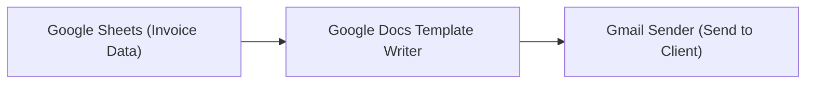

##### Step 3: Configure the Node

1. **Enter template link** - The node detects 7 placeholders
2. **Connect your data sources:**

   * `invoice_number` ← Sheet column A
   * `invoice_date` ← Datetime node
   * `client_name` ← Sheet column B
   * `client_address` ← Sheet column C
   * `service_description` ← Sheet column D
   * `total_amount` ← Sheet column E
   * `due_date` ← Calculated date
3. **Set document name** to `"Invoice-{{invoice_number}}"`
4. **Run the workflow**

##### Result

A new Google Doc is created with all placeholders replaced with actual data, ready to send to your client.

#### Common Use Cases

##### Automated Contracts

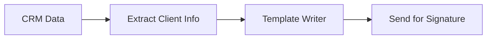

##### Performance Reports

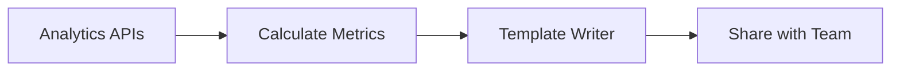

##### Personalized Proposals

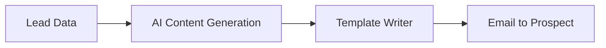

#### Processing Multiple Documents

To create multiple documents from a list of data:

1. **Enable Loop Mode** on the Google Docs Template Writer node
2. **Connect list inputs** - Each placeholder receives a list of values
3. **Run once** - Creates multiple documents automatically

Example: Creating 50 personalized contracts from a spreadsheet with 50 rows of client data.

#### Best Practices

##### 1. Template Design

Start with a well-structured template:

* Use descriptive placeholder names (`{{client_full_name}}` not `{{name}}`)
* Place placeholders strategically where content varies
* Test with sample data

##### 2. Data Preparation

Ensure your data is ready:

* Format dates and numbers consistently
* Clean text data (remove extra spaces, fix capitalization)
* Validate required fields before processing

#### Important Considerations

> **Warning:** Placeholders are **case-sensitive**. The placeholder `{{Company}}` is different from `{{company}}`. Ensure exact matches between your template and data sources.

> **Note:** You must authenticate with Google to use this node. Connect your Google account in the [Connectors page](https://www.gumloop.com/personal/connectors).

#### Troubleshooting Guide

| Issue                       | Cause                    | Solution                                                                   |
| --------------------------- | ------------------------ | -------------------------------------------------------------------------- |
| "Google Doc not found"      | Invalid URL or no access | Check URL and ensure the template is shared with your Google account       |
| "No placeholders detected"  | Wrong format             | Verify placeholders use `{{name}}` format                                  |
| "Missing placeholder value" | No data connected        | Connect data to all placeholders or disable "Error On Missing Placeholder" |
| "Cannot create document"    | Permission issue         | Check Google Drive permissions and available storage                       |

#### Comparison: Template Writer vs Google Docs Writer

| Use Case                | Template Writer                     | Google Docs Writer            |
| ----------------------- | ----------------------------------- | ----------------------------- |
| **Starting Point**      | Existing template with placeholders | Blank or existing document    |
| **Content Replacement** | Automatic placeholder detection     | Manual content insertion      |
| **Best For**            | Structured, repeatable documents    | Free-form writing and updates |
| **Examples**            | Contracts, invoices, certificates   | Meeting notes, documentation  |

The Google Docs Template Writer node transforms static templates into dynamic, automated document generation systems. By understanding how placeholders work and connecting them to your data sources, you can eliminate hours of manual document creation.

### Google Docs Writer

*This document outlines the functionality and characteristics of the Google Docs Writer node, which enables automated document creation and editing in Google Docs.*

**Source:** https://docs.gumloop.com/nodes/integrations/gdocs_writer

This document outlines the functionality and characteristics of the Google Docs Writer node, which enables automated document creation and editing in Google Docs.

#### Node Inputs

##### Document Settings

* **Title**: Name for the new document (required for new documents)
* **Content**: Text to be written to the document
* **Content Format**: Choose the format for your content
  * **Plain Text**: Unformatted text
  * **HTML**: Formatted content using HTML tags
  * **Markdown**: Formatted content using Markdown syntax

##### Document Configuration

* **Use Existing Doc**: Toggle between creating a new document or editing an existing one
  * When enabled: Updates an existing Google Doc
  * When disabled: Creates a new Google Doc
* **Document Link/ID**: URL or document ID of the existing document (required if editing)
* **Folder**: Target Google Drive folder for new documents
  * When enabled as a configurable input, folder URL or ID can be used
* **Make Doc Public**: Option to make the document accessible to anyone with the link
  * When enabled: Sets sharing permissions to "Anyone with the link can view"
  * When disabled: Maintains default permissions (private to you)
  * **Note**: Valid Google Drive credentials must be present for this feature to work
* **Insert Content at Start of Document**: Controls content placement in existing documents
  * When enabled: Adds new content at the beginning of the document
  * When disabled: Appends new content to the end of the document

#### Node Output

* **Doc Link**: URL to access the created or edited document
  * Can be used to send to stakeholders or connect to other nodes

#### Content Formatting Support

##### Important Limitations

* **Tables and images are not supported** in any content format
* Complex formatting may have inconsistent results

##### Formatting Options

###### Plain Text

Basic text without formatting. Line breaks are preserved.

###### HTML

Supports basic HTML formatting:

* Headings (`<h1>`, `<h2>`, etc.)
* Text formatting (`<b>`, `<i>`, `<u>`, etc.)
* Lists (`<ul>`, `<ol>`, `<li>`)
* Paragraphs (`<p>`)

###### Markdown

Supports common Markdown syntax:

* Headings (`#`, `##`, etc.)
* Text formatting (`**bold**`, `*italic*`, etc.)
* Lists (`-`, `1.`, etc.)

##### Formatting with AI

When using Markdown or HTML, consider using AI to format your content properly. Here's an example prompt you can use with the Ask AI node:

```text
Format the following content as clean, well-structured [Markdown/HTML] that can be rendered in Google Docs. 
Include appropriate headings, lists, and text formatting.
Focus on readability and professional presentation.
Do not include HTML backticks, code blocks, tables, or images as they are not supported.

Content to format:
{input}
```

#### Common Use Cases

##### 1. Automated Reporting

  ```mermaid theme={"dark"}
  %%{init: {'theme':'neutral', 'themeVariables': { 'primaryColor': '#f5f5f5', 'primaryBorderColor': '#ddd'}}}%%
  flowchart LR
      A["Google Sheets Reader"] --> B["Ask AI"] 
      B --> C["Google Docs Writer"]
  ```

Generate periodic reports (daily, weekly, monthly) with consistent formatting.

##### 2. Documentation Management

  ```mermaid theme={"dark"}
  %%{init: {'theme':'neutral', 'themeVariables': { 'primaryColor': '#f5f5f5', 'primaryBorderColor': '#ddd'}}}%%
  flowchart LR
      A["File Reader"] --> B["Ask AI"] 
      B --> C["Google Docs Writer"]
  ```

Create customized documentation from templates or source files.

##### 3. Knowledge Base Building

  ```mermaid theme={"dark"}
  %%{init: {'theme':'neutral', 'themeVariables': { 'primaryColor': '#f5f5f5', 'primaryBorderColor': '#ddd'}}}%%
  flowchart LR
      A["Website Scraper"] --> B["Ask AI"] 
      B --> C["Google Docs Writer"]
  ```

Continuously add new information to a centralized knowledge document.

##### 4. Update Logs

  ```mermaid theme={"dark"}
  %%{init: {'theme':'neutral', 'themeVariables': { 'primaryColor': '#f5f5f5', 'primaryBorderColor': '#ddd'}}}%%
  flowchart LR
      A["Slack Message Reader"] --> B["Combine Text"] 
      B --> C["Google Docs Writer"]
  ```

Add new entries at the beginning of change logs or update records.

#### Loop Mode Usage

When processing multiple items with Loop Mode:

* Output is a list of document links
* Creates or updates multiple documents in one operation
* Each item processes independently

  ```mermaid theme={"dark"}
  %%{init: {'theme':'neutral', 'themeVariables': { 'primaryColor': '#f5f5f5', 'primaryBorderColor': '#ddd'}}}%%
  flowchart LR
      A["Google Sheets Reader (Multiple content items)"] --> B["Ask AI (Format content, Loop Mode)"]
      B --> C["Google Docs Writer (Loop Mode)"]
      C --> D["List of document links"]
  ```

#### Important Considerations

1. **Authentication**: Requires Google account connection in the [Connectors page](https://www.gumloop.com/personal/connectors)
2. **Permissions**:
   * You must have appropriate permissions to edit existing documents
3. **Content Limitations**:
   * Tables and images are not supported in any format
4. **Folder Access**:
   * When specifying a folder, you must have write access to it
   * When configured as an input, folder URL or ID can be passed from previous nodes
5. **Public Sharing**:
   * "Make Doc Public" sets view-only permissions and requires valid Google Drive credentials

#### Troubleshooting

| Issue                       | Possible Solution                                            |
| --------------------------- | ------------------------------------------------------------ |
| Content formatting issues   | Try simplifying HTML/Markdown or switch to Plain Text format |
| Folder not found            | Use appropriate folder ID or check permissions               |
| Error when editing document | Verify document ID/link is correct and you have edit access  |

In summary, the Google Docs Writer node provides a powerful way to automate document creation and updates in Google Docs, with flexible formatting options and content placement control.

### Google Drive File Reader

*This document outlines the functionality and characteristics of the Google Drive File Reader node, which enables automated retrieval of files from Google Drive.*

**Source:** https://docs.gumloop.com/nodes/integrations/gdrive_file_reader

This document outlines the functionality and characteristics of the Google Drive File Reader node, which enables automated retrieval of files from Google Drive.

#### Node Inputs

##### File Selection (Choose one method)

* **Select File**: Choose a file directly from Google Drive
* **Use Link**: Option to use a direct Google Drive URL

#### Node Output

* **File**: The file object that can be:
  * Passed directly to file operation nodes (PDF Reader, File Reader, etc.)
  * Sent to communication nodes as attachments (Slack, Gmail, etc.)
  * Used with the AI `Analyze Image` and `Analyze Video` nodes for image/video files

#### Working with File Outputs

The node's output can be connected directly to various other nodes:

##### File Operations

* PDF Reader: Process PDF files directly
* File Reader: Extract content from text files

##### Communication

* Slack Message Sender: Share files in Slack channels
* Gmail Sender: Send files as email attachments
* Discord Message Sender: Share files in Discord

##### AI Processing

Note: For text-based AI processing, files must first be processed by appropriate reader nodes:

* Text files → [File Reader](https://docs.gumloop.com/nodes/file_operations/file_reader)
* PDFs → [PDF Reader](https://docs.gumloop.com/nodes/pdf/pdf_reader)
* Google Docs → [Google Docs Reader](https://docs.gumloop.com/nodes/integrations/gdocs_reader)
* Google Sheets → [Google Sheets Reader](https://docs.gumloop.com/nodes/integrations/gsheets_reader)

Only [Analyze Image](https://docs.gumloop.com/nodes/using_ai/analyze_image) and [Analyze Video](https://docs.gumloop.com/nodes/using_ai/analyze_video) nodes can process the relevant media file objects directly.

#### Node Functionality

The Google Drive File Reader node provides automated access to files stored in Google Drive.

**Key features include**:

* Support for multiple file formats
* Loop mode to process multiple files
* Direct file selection or URL input
* Secure authentication with Gumloop

#### Example Workflows

##### 1. Document Analysis Pipeline

```text
Google Drive File Reader 
→ File Reader/PDF Reader/Google Docs Reader 
→ Ask AI 
→ Notion Page Writer

Purpose: Analyze and summarize document contents

Note: File content must be extracted before AI processing
```

##### 2. File Distribution

```text
Google Drive File Reader 
→ Slack Message Sender

Purpose: Share documents with team members
```

##### 3. Data Analysis

```text
Google Drive File Reader 
→ File Reader
→ Extract Data 
→ Airtable Writer

Purpose: Process and store data from excel files
```

##### 4. Image Analysis

```text
Google Drive File Reader 
→ Analyze Image 
→ Categorizer

Purpose: Process and categorize images
```

#### When to Use

The Google Drive File Reader node is particularly valuable in scenarios requiring processing of files from Google Drive. Common use cases include:

* **Document Analysis**: Extract and analyze text from essays or research papers
* **Invoice Processing**: Process invoices stored as PDFs to extract payment information
* **Report Compilation**: Access financial reports for analysis
* **Dataset Processing**: Extract data from spreadsheets containing customer feedback
* **Media Processing**: Analyze images or videos stored in Drive

**Some specific examples**:

* Reading financial statements to extract spending patterns
* Processing student assignments
* Extracting product information from specification sheets
* Analyzing system performance logs
* Processing images for content moderation

#### Important Considerations

1. Requires Authentication with Google - Set up in the [Connectors page](https://www.gumloop.com/personal/connectors)
2. You must have access to the file
3. Text-based AI nodes (eg. Ask AI, Extract Data, Categorizer, etc) require content extraction first using the file operation nodes.

In summary, the Google Drive File Reader node simplifies access to files in Google Drive, providing a file object that can be seamlessly integrated with other nodes for comprehensive file processing workflows.

### Google Drive File Writer

*This document outlines the functionality and characteristics of the Google Drive File Writer node, which enables automated file uploads to Google Drive.*

**Source:** https://docs.gumloop.com/nodes/integrations/gdrive_file_writer

This document outlines the functionality and characteristics of the Google Drive File Writer node, which enables automated file uploads to Google Drive.

#### Node Inputs

##### File Selection (Choose one method)

* **Use Link**: Option to upload a file from a URL
  * **Link**: URL of the file to upload (required if using link method)
* **Input File**: Receive file from previous node (when enabled in Configure Inputs)

##### Configuration Options

* **Folder**: Target Google Drive folder for upload (optional)
* **File Name**: Name for the uploaded file
  * Leave blank to use original file name
  * Add extension if not included in original file name (e.g., .pdf, .csv)

##### Configure Inputs

You can make these parameters dynamic by enabling them in "Configure Inputs":

* **file**: File to upload (from previous node output)
* **file\_name**: Name for the uploaded file
* **folder**: Google Drive folder ID or link

#### Dynamic Drive Folders

This node supports specifying destination folders dynamically:

1. Enable the "Folder" input in "Configure Inputs"
2. Connect to a node that outputs either:
   * A folder link: `https://drive.google.com/drive/folders/FOLDER_ID`
   * A folder ID: `FOLDER_ID`
3. The file will be saved to the specified folder

```text
Valid folder link: https://drive.google.com/drive/folders/1xGA0zvylsPs2t8FoC5DP2YQgO3tptIxI
Valid folder ID: 1xGA0zvylsPs2t8FoC5DP2YQgO3tptIxI
```

> Note: The folder input can't be the folder name, it must either be the Drive folder URL or ID.

#### Node Output

* **Drive URL**: The Google Drive URL of the uploaded file

#### Node Functionality

The Google Drive File Writer node automates file uploads to Google Drive.

**Key features include**:

* Support for multiple file sources (URL, or node input)
* Flexible file naming options
* Dynamic folder destination selection
* Batch mode for multiple file uploads via Loop Mode
* Secure authentication with Gumloop

#### Example Workflows

##### 1. Automated Report Archiving

```text
Generate File → Google Drive File Writer
Setup:
- Input File: Generated PDF report
- File Name: "Report-{timestamp}.pdf"
- Folder: Reports folder
Purpose: Automatically archive generated reports with timestamps
```

##### 2. Website Image Collection

```text
Website Scraper → Extract Data → Google Drive File Writer
Setup:
- Use Link: Yes
- Link: Image URLs from website
- Loop Mode: Enabled to process multiple images
- Dynamic folder based on image category
Purpose: Save images from websites into categorized folders
```

##### 3. File Type Organization

```text
Zip File Reader → Categorizer → If-Else → Google Drive File Writer
Setup:
- Dynamic folder selection based on file type categorization
Purpose: Automatically sort uploaded files by their content type
```

#### Loop Mode Pattern

When using Loop Mode, the node processes a list of files or links:

* Input a list of file links
* Optionally input a list of file names (must match the size of the file list)
* Optionally input a list of folder destinations
* The node uploads each file to its corresponding destination

  ```mermaid theme={"dark"}
  %%{init: {'theme':'neutral', 'themeVariables': { 'primaryColor': '#f5f5f5', 'primaryBorderColor': '#ddd'}}}%%
  flowchart LR
      A["Extract Image URLs\n(List of URLs)"] --> B["Google Drive File Writer\n(Loop Mode)"]
      C["Generate File Names\n(List of names)"] --> B
      D["Select Folders\n(List of folders)"] --> B
      B --> E["Multiple files\nuploaded to Drive"]
  ```

#### Important Considerations

1. Requires Authentication with Google - Set up in the [Connectors page](https://www.gumloop.com/personal/connectors)
2. In Loop Mode, ensure list sizes match to avoid errors

In summary, the Google Drive File Writer node provides a streamlined way to automate file uploads to Google Drive, supporting multiple file sources with flexible naming and organization options for efficient file management workflows.

### Google Drive Folder Creator

*This document outlines the functionality and characteristics of the Google Drive Folder Creator node, which enables you to create new folders in Google Drive directly from your Gumloop workflow.*

**Source:** https://docs.gumloop.com/nodes/integrations/gdrive_folder_creator

This document outlines the functionality and characteristics of the Google Drive Folder Creator node, which enables you to create new folders in Google Drive directly from your Gumloop workflow.

#### Node Inputs

##### Required Fields

* **Folder Name**: The name you want to give your new folder

##### Optional Fields

* **Parent Folder**: Where to create the folder
  * By default, uses a folder picker UI to select from your Drive
  * If left empty, creates folder in your Drive root

##### Configure Inputs

You can make these parameters dynamic by enabling them in "Configure Inputs":

* **Folder Name**: Name for the new folder
* **Parent Folder**: Google Drive folder ID or link where the new folder will be created

#### Dynamic Parent Folders

This node supports specifying parent folders dynamically:

1. Enable the "Parent Folder" input in "Configure Inputs"
2. Connect to a node that outputs either:
   * A folder link: `https://drive.google.com/drive/folders/FOLDER_ID`
   * A folder ID: `FOLDER_ID`
3. The new folder will be created inside the specified parent folder

```text
Valid parent folder link: https://drive.google.com/drive/folders/1xGA0zvylsPs2t8FoC5DP2YQgO3tptIxI
Valid parent folder ID: 1xGA0zvylsPs2t8FoC5DP2YQgO3tptIxI
```

> Note: The parent folder input can't be the folder name, it must either be the Drive folder URL or ID. By default, parent folder selection uses a folder picker UI unless configured as a dynamic input.

#### Node Output

* **Folder URL**: The complete URL of the newly created folder

#### Node Functionality

The Google Drive Folder Creator node creates new folders in Google Drive, with options for naming and placement.

**Key features include**:

* Simple folder creation with custom naming
* Ability to nest folders within existing structures
* Dynamic folder naming and placement
* Batch folder creation via Loop Mode
* Secure authentication with Gumloop

#### Business Use Cases

##### 1. Client Onboarding Automation

```text
Airtable Reader (New Clients) → Google Drive Folder Creator → Gmail Sender
Setup:
- Folder Name: "{client_name} - {project_type}"
- Parent Folder: Company's Client Projects folder
- Loop Mode: Enabled to create folders for each new client
Purpose: Automatically create organized client folders when new accounts are added to your CRM
```

##### 2. Document Compliance Management

```text
Google Sheets Reader (Departments) → Google Drive Folder Creator → Google Docs Writer
Setup:
- Folder Name: "Compliance Docs - {department_name} - Q{quarter}"
- Nested structure for regulatory documentation
Purpose: Create quarterly compliance document repositories for each department
```

##### 3. Sales Pipeline Document Organization

```text
HubSpot Contact Reader → Categorizer (Deal Stage) → Google Drive Folder Creator
Setup:
- Dynamic folder names based on deal stages
- Create hierarchical folder structure by customer segment
Purpose: Automatically organize sales materials based on pipeline stage and customer type
```

#### Loop Mode Pattern

When using Loop Mode, the node creates multiple folders from a list - ideal for batch processing business data:

* Input a list of folder names (e.g., new client accounts, projects, departments)
* Optionally input a list of parent folder locations
* The node creates each folder in its corresponding parent location

  ```mermaid theme={"dark"}
  %%{init: {'theme':'neutral', 'themeVariables': { 'primaryColor': '#f5f5f5', 'primaryBorderColor': '#ddd'}}}%%
  flowchart LR
      A["CRM Data\n(New Client List)"] --> B["Google Drive Folder Creator\n(Loop Mode)"]
      C["Department-Specific\nParent Folders"] --> B
      B --> D["Organized client folders\nby department"]
  ```

#### Important Considerations

1. Requires Authentication with Google - Set up in the [Connectors page](https://www.gumloop.com/personal/connectors)
2. Parent folders must exist prior to running the workflow
3. You must have permission to create folders in the specified parent location

In summary, the Google Drive Folder Creator node provides an easy way to create and organize folder structures in Google Drive, supporting both simple and complex organizational hierarchies for efficient business document management and workflow automation.

### Google Drive Folder Reader

**Source:** https://docs.gumloop.com/nodes/integrations/gdrive_folder_reader

The Google Drive Folder Reader node enables automated content extraction from multiple files in a Google Drive folder. This node is particularly powerful for batch processing documents, images, and data files stored in Google Drive.

#### Table of Contents

* [Quick Start](#quick-start)
* [Node Configuration](#node-configuration)
* [Output Types & Link Options](#output-types--link-options)
* [Processing Different File Types](#processing-different-file-types)
* [Example Workflows](#example-workflows)
* [Trigger Functionality](#trigger-functionality)
* [Best Practices](#best-practices)

#### Quick Start

Choose your approach based on your situation:

| Your Situation                          | Configuration                    | Next Node                | Example Workflow                                                                    | Why This Works                          |
| --------------------------------------- | -------------------------------- | ------------------------ | ----------------------------------------------------------------------------------- | --------------------------------------- |
| **Small folder, want file content**     | Keep default settings            | File Reader (Loop Mode)  | [View Example](https://www.gumloop.com/pipeline?workbook_id=uZT4TBdNgoYaKNwDJFKZ2b) | Simple setup, gets content directly     |
| **Large folder, need speed**            | Enable "Return Drive Links Only" | Google Drive File Reader | [View Example](https://www.gumloop.com/pipeline?workbook_id=qCBGaLAQtFJRNEnQJnHRHv) | Fast folder scan, then download files   |
| **Mixed file types (Docs, PDFs, etc.)** | Enable "Return Doc Links Only"   | Router node              | [View Example](https://www.gumloop.com/pipeline?workbook_id=cQAUbZZeqrNnzYGcgnvSZd) | Routes each file type to best processor |

#### Node Configuration

  *[Image: Google Drive Folder Reader configuration options]*

##### Folder Selection

Choose one method to specify your folder:

* **Select Folder**: Browse and select from your Google Drive
* **Use Link**: Paste a direct Google Drive folder URL

##### Core Options

###### Read All Subfolders

* **When enabled**: Reads files from all nested subfolders recursively
* **When disabled**: Reads only files from the selected folder
* **Performance**: Can significantly increase processing time for deeply nested structures
* **Note**: Not available when using the node as a trigger

###### Link Return Options

  *[Image: Return Drive or Doc Links configuration]*

These options make the node run **significantly faster** by returning links instead of downloading the files:

**Return Drive Links Only**

* **Output**: `drive.google.com` links for ALL files (G Suite and non-G Suite)
* **Best for**: Large folders where you want consistent link format
* **Performance**: Fastest option available

**Return Doc Links Only**

* **Output**:
  * G Suite files (Docs, Sheets, Slides): `docs.google.com` links
  * Non-G Suite files: `drive.google.com` links
* **Best for**: Mixed file types requiring different processing paths
* **Performance**: Fast, with automatic file type routing

#### Output Types & Link Options

##### Default Output (No Link Options Enabled)

```text
Output: File objects that can be directly connected to:
✓ File Reader, PDF Reader
✓ Slack Message Sender, Gmail Sender (as attachments)
✓ AI Analyze Image, Analyze Video nodes
```

> Note: Total folder size limit of 400 MB applies when downloading files directly.

##### With Link Options Enabled

```text
Output: Text links that require additional processing:
✓ Google Drive File Reader → File objects
✓ Google Docs/Sheets/Slides Reader → Content
✓ Router → Conditional processing
```

#### Processing Different File Types

##### Method 1: Fast Link-Based Processing (Recommended for Large Folders)

**Example Workflow**: [Mixed File Type Processing](https://www.gumloop.com/pipeline?workbook_id=cQAUbZZeqrNnzYGcgnvSZd)

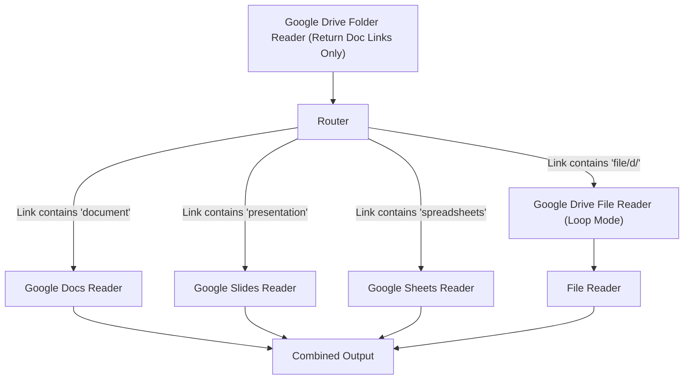

**Why this works**:

* **Speed**: Scanning folder returns links instantly
* **Efficiency**: Each file type uses its optimal reader
* **Scalability**: Handles hundreds of files efficiently

##### Method 2: Direct File Processing (Simpler Setup)

**Example Workflow**: [Direct File Processing](https://www.gumloop.com/pipeline?workbook_id=uZT4TBdNgoYaKNwDJFKZ2b)

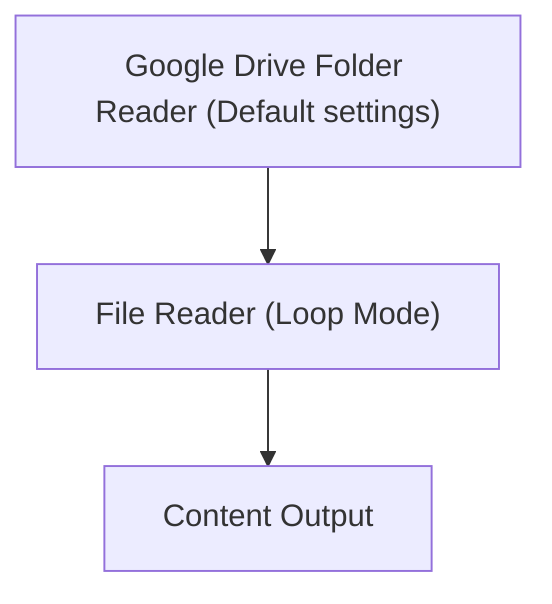

**When to use**:

* Small to medium folders (under 400 MB total size)
* Mixed file types that you want to process uniformly
* Quick prototyping and testing

**Important Setup Note**:
When connecting Google Drive Folder Reader to File Reader:

1. **Do NOT** enable "Use Link" on the File Reader node
2. **Do** enable "file" as an input in the File Reader's "Configure Inputs" section
3. The connection should pass file objects, not links

**Note**: File Reader now supports Google Docs, Sheets, and Slides when connected directly with the `Drive Folder Reader` node, but specialized nodes (Google Docs Reader, Google Sheets Reader, etc.) provide better performance and more features.

#### Example Workflows

##### 1. Enterprise Document Analysis

```text
Google Drive Folder Reader (Return Doc Links Only)
→ Router (file type detection)
→ Specialized Readers (Docs/Sheets/PDF)
→ Extract Data
→ Airtable Writer

Purpose: Process quarterly reports across multiple departments
```

##### 2. Student Assignment Processing

```text
Google Drive Folder Reader (Read All Subfolders enabled)
→ File Reader (Loop Mode)
→ Ask AI (plagiarism check)
→ Google Sheets Writer

Purpose: Batch process assignments from multiple class folders
```

##### 3. Fast File Distribution

```text
Google Drive Folder Reader (Return Drive Links Only)
→ Google Drive File Reader (Loop Mode)
→ Slack Message Sender

Purpose: Share new files with team members efficiently
```

##### 4. Invoice Processing Pipeline

```text
Google Drive Folder Reader
→ PDF Reader (Loop Mode)
→ Extract Data (invoice details)
→ Categorizer (by vendor)
→ Notion Database Writer

Purpose: Automate accounts payable document processing
```

#### Trigger Functionality

The node can automatically start your workflow when new files are added to the folder.

  *[Image: Google Drive Folder Reader as trigger]*

> Only monitors the selected top-level folder.

**Learn more**: [Workflow Triggers Documentation](https://docs.gumloop.com/core-concepts/workflow_triggers)

#### Best Practices

##### Performance Optimization

1. **Large folders**: Always enable link return options
2. **Mixed file types**: Use "Return Doc Links Only" with Router
3. **Uniform processing**: Use File Reader for simple content extraction
4. **Specialized needs**: Use dedicated nodes (Google Docs Reader, PDF Reader, etc.)

##### File Type Strategy

| File Types in Folder  | Recommended Approach    | Configuration                                                          |
| --------------------- | ----------------------- | ---------------------------------------------------------------------- |
| **All PDFs**          | Direct processing       | Default → PDF Reader                                                   |
| **All G Suite files** | Specialized readers     | Return Doc Links → Native readers (ie. Doc Reader, Slides Reader, etc) |
| **Mixed types**       | Router-based processing | Return Doc Links → Router                                              |
| **Large volume**      | Link-based processing   | Return Drive Links → Loop processing → Drive File Reader → File Reader |

#### Important Considerations

**Authentication**

* Requires Google Drive authentication via [Connectors page](https://www.gumloop.com/personal/connectors)
* Must have access to the target folder

**Performance**

* Link options significantly improve speed for large folders
* Subfolder reading can increase processing time exponentially

**Limitations**

* Very large folders (100+ files) may timeout without link options. Make sure to enable `Return Drive Links` or `Return Doc Links` under `Show More Options` in such cases.
* Total folder size limit: 400 MB. Folders exceeding this total size limit will fail during processing.

In summary, the Google Drive Folder Reader is a versatile node that adapts to different use cases through its configuration options. For best results, choose your configuration based on folder size, file types, and processing requirements.

### Google Sheets Reader

*This document outlines the functionality and characteristics of the Google Sheets Reader node, which enables automated data extraction from Google Sheets.*

**Source:** https://docs.gumloop.com/nodes/integrations/gsheets_reader

This document outlines the functionality and characteristics of the Google Sheets Reader node, which enables automated data extraction from Google Sheets.

#### Node Inputs

The Google Sheets Reader node accepts the following inputs:

##### Sheet Selection (Choose one method)

* **Select Sheet**: Choose a Google Sheet directly from your Drive
* **Use Link**: Option to use a direct Google Sheets URL
  * **Link**: The URL of your Google Sheet (required if using link method)

##### Configuration Options

* **Sheet Name**: Specific worksheet within the Google Sheets file
  * **Example**: "Sales Data" or "Q3 Reports"
  * **When to use**: When your Google Sheet contains multiple tabs/worksheets and you need data from a specific one

* **Row Range**: Specify exact rows to read (Cannot include row 1 since Gumloop uses the first row to identify headers)
  * **Format**: Use commas for individual rows and dashes for ranges
  * **Examples**:
    * `2-10`: Read rows 2 through 10
    * `2,5,8`: Read only rows 2, 5, and 8
    * `2-5,8,10-12`: Read rows 2 through 5, row 8, and rows 10 through 12
  * **When to use**:
    * When you need specific sections of your sheet
    * When processing historical data from specific row ranges
    * When targeting specific entries by their row positions

* **Search Column**: Column to use for filtering data
  * **Example**: If your sheet has a column named "Status", you can filter by this column
  * **When to use**:
    * When you need to find rows matching certain criteria
    * When processing only specific categories of data
    * When implementing conditional workflows based on data values
  * **Note**: Select "No Search Column" if you want all data without filtering

* **Search Value**: Value to match in the specified search column
  * **Example**: If Search Column is "Status", Search Value might be "Completed"
  * **When to use**:
    * When extracting records matching exact criteria
    * When processing items of a specific status or category
    * When automated actions should only apply to certain values
  * **Note**: The search is case-sensitive and requires exact matching

* **Number of Rows**: Limit the number of rows returned
  * **Examples**:
    * `10`: Return only the first 10 matching rows
    * Leave blank to return all matching rows
  * **When to use**:
    * When working with large sheets but only need a sample
    * When implementing pagination in your outputs
    * When testing workflows before processing full datasets

* **Sort**: Choose the sorting direction
  * **Top-Down**: Sort data from top to bottom (ascending)
    * **When to use**: For chronological data, oldest first
  * **Bottom-Up**: Sort data from bottom to top (descending)
    * **When to use**: For accessing most recent entries first

#### Refreshing Column Headers

> **Important**: If you modify column headers in your Google Sheet, you must refresh the node's column data in Gumloop.

  *[Image: Google Sheet refresh button]*

To refresh column headers:

1. Click the refresh icon (🔄) next to the Sheet Name dropdown
2. This will update the available columns to match your current Google Sheet structure
3. You'll need to reconnect any outputs that were using columns that have been renamed

**Common issues solved by refreshing:**

* Column names not appearing in the node's outputs
* Missing new columns that were recently added
* Workflow errors after renaming columns in your sheet

Always refresh the node when you make structural changes to your Google Sheet to ensure Gumloop has the most current column information.

#### Node Output

The Google Sheets Reader node produces:

* **Sheet Data**: Structured data from the Google Sheet based on your column headers. Each column header is exposed as a list of text output containing all records from that column.

#### Node Functionality

The Google Sheets Reader node provides automated access to Google Sheets data with advanced filtering and sorting capabilities.

**Key features include**:

* Flexible row range selection
* Search and filter functionality
* Customizable data retrieval options
* Secure authentication with Gumloop

#### When To Use

The Google Sheets Reader node is particularly valuable in scenarios requiring automated data extraction from Google Sheets. Common use cases include:

* **Data Analysis**: Extract data for reports and analytics
* **Content Management**: Pull content stored in spreadsheets
* **Inventory Tracking**: Monitor stock levels and changes
* **Project Management**: Track task status and updates
* **Lead Management**: Extract new leads from submission forms
* **Event Planning**: Access event details and attendee information
* **Budget Tracking**: Pull financial data for automated reporting

#### Trigger Functionality

This node can also function as a trigger to start your workflow when your Google Sheet updates:

* **Automatically starts your workflow when data in your Google Sheet changes**
* **Two trigger modes**:
  * **Create**: Only triggers on new rows added to the sheet
  * **Create or Update**: Triggers when rows are added OR existing rows are modified

  *[Image: Google Sheets trigger mode options]*

* **Understanding Row Events**:
  * **Row Creation**: Triggers when any new row is added to your sheet
  * **Row Update**: Triggers when any cell value is changed in any existing row
* **Configuration**:
  * Select your Google Sheet (via direct selection or URL)
  * Specify worksheet tab to monitor
  * Choose trigger mode based on your needs
  * Toggle `Activate as workflow trigger`
  * Save workflow

#### Trigger Activation Time and Behavior

**Important**: When configuring a Google Sheets trigger, be aware of the following:

* **Activation Time**: After creating or updating a trigger, it may upto 5 minutes for the trigger to become active. If you've just set up a trigger, please be patient during this initialization period.
* **Polling Frequency**: Subsequently, the system checks for updates approximately every 60 seconds.

#### Troubleshooting

If your Google Sheets trigger isn't working as expected:

1. **Verify Activation**: Ensure you've saved the workflow after setting up the trigger and running the workflow manually works.
2. **Check Permissions**: Confirm your Google account has appropriate access to the spreadsheet.
3. **Inspect Headers**: Make sure your sheet has headers in the first row and atleast one row of data thereafter.
4. **Test Simple Changes**: Test the trigger with a simple row addition to verify functionality.
5. **Refresh Column Data**: If you've modified your sheet structure, click the refresh icon (🔄) next to the Sheet Name and save.
6. **Consider Row Order**: If using the "Create" mode, remember that it only detects newly added rows, not modified existing rows.
7. **Unique Identifiers**: For mission-critical workflows, include a unique ID column to ensure reliable row tracking.
8. **Reset Trigger**: Consider resetting the trigger by disabling the "Activate as workflow trigger" toggle, saving, enabling the same toggle and saving again.

#### Understanding Edge Cases

When using Google Sheets triggers, here's how the system handles specific spreadsheet modifications:

##### Column Changes

* **Adding New Columns**: New columns are automatically included in trigger data
* **Inserting Columns**: System adapts to columns inserted between existing ones, but may trigger for any rows where the the row hash changes
* **Deleting Columns**: System adapts to columns deleted between existing ones, but may trigger for any rows where the the row hash changes

##### Row Operations

* **Row Additions**: Always triggers workflows in both "Create" and "Create or Update" modes
* **Row Updates**: Only trigger in "Create or Update" mode
* **Row Deletions**:
  * In "Create" mode: No trigger occurs when rows are deleted
  * In "Create or Update" mode: Triggers for rows that shift position after deletion
* **Row Reordering**:
  * In "Create" mode: Not detected
  * In "Create or Update" mode: Triggers for all affected rows as their position-based hashes change

#### Important Considerations:

1. Requires Authentication with Google - Set up in the [Connectors page](https://www.gumloop.com/personal/connectors)
2. Sheet must have headers in the first row (ie. the data you want to extract)
3. Row Range cannot include row 1 (headers)
4. You must have access to the Google Sheet
5. When using as a trigger, ensure your workflow is saved before and after adding the trigger
6. After modifying column headers in your Google Sheet, click the refresh button (🔄) next to the Sheet Name to update the available columns in Gumloop
7. Allow 5 minutes for trigger activation after creation or mode modification

In summary, the Google Sheets Reader node provides powerful data extraction capabilities from Google Sheets, with flexible configuration options for precise data retrieval and filtering. Its trigger functionality enables real-time workflow automation based on spreadsheet changes, with built-in handling for common spreadsheet modifications.

### Google Sheets Updater

*This document outlines the functionality and characteristics of the Google Sheets Updater node, which enables updating existing records in Google Sheets.*

**Source:** https://docs.gumloop.com/nodes/integrations/gsheets_updater

This document outlines the functionality and characteristics of the Google Sheets Updater node, which enables updating existing records in Google Sheets.

#### Node Inputs

##### Sheet Selection (Choose one method)

* **Select Sheet**: Choose a Google Sheet directly from your Drive
* **Use Link**: Option to use a direct Google Sheets URL

##### Configuration Options

* **Sheet Name**: Specific worksheet within the Google Sheets file
* **Search Column**: Column to use for identifying the row(s) to update
* **Search Value**: Value to match in the search column

##### Updater Mode

Defines how the node updates data in your Google Sheet:

1. **Update A Single Row**
   * Updates one specific row at a time
   * Search Value: Single text (e.g., "Gumloop")
   * Column inputs: Single values (e.g., "Active", "2024-01-13")
   * Example: Update status for company "Gumloop" to "Active"

2. **Update Multiple Rows**
   * Updates multiple rows in one operation
   * Search Value: Must be a list (e.g., \["Gumloop", "Acme", "TechCorp"])
   * Column inputs: Must be lists of the same length
   * Example: Update status for three companies to \["Active", "Pending", "Inactive"]

##### Data Input

Connect your node outputs directly to the column headers you want to update. The node will automatically map the data to the appropriate columns based on these connections.

#### Upsert Option

Under **Show More Options**, you'll find a **Upsert** toggle that enhances update operations.

  *[Image: Upsert option toggle]*

##### What is Upsert?

Upsert combines "update" and "insert" functionality in one operation:

* If a record matching your Search Value exists, it will be updated
* If no matching record is found, a new row will be created automatically

> New rows are added at the end of the sheet

##### When to Use Upsert

* Updating records that may not exist yet
* Simplifying workflows that would otherwise require conditional logic

#### Refreshing Column Headers

> **Important**: If you modify column headers in your Google Sheet, you must refresh the node's column data in Gumloop to see these changes.

  *[Image: Google Sheet Updater refresh button]*

To refresh column headers:

1. Click the refresh icon (🔄) next to the Sheet Name dropdown
2. This will update the available column inputs to match your current Google Sheet structure
3. You'll need to reconnect any node outputs to columns that have been renamed

**When to refresh your column headers:**

* After adding new columns to your spreadsheet
* After renaming existing columns
* After deleting columns that are no longer needed
* When new columns in your sheet don't appear as inputs in the node

Failure to refresh column headers after modifying your spreadsheet structure is a common cause of workflow failures. Always refresh when you make changes to your Google Sheet's first row.

#### Understanding Search Column and Search Value

The "Search Column" and "Search Value" fields work together to find the specific row(s) you want to update in your Google Sheet.

##### How It Works

Think of these fields as creating a filter for your spreadsheet rows:

1. **Search Column**: The column you'll use to identify rows (like using a product ID to find its inventory record)
2. **Search Value**: The specific value to look for in that column (like "PROD-123")

##### Example: Product Inventory Update

Let's say you have a Google Sheet with product information:

| Product ID | Product Name      | Category    | Price   | Stock |
| ---------- | ----------------- | ----------- | ------- | ----- |
| PROD-001   | Wireless Mouse    | Electronics | \$29.99 | 45    |
| PROD-002   | USB-C Cable       | Accessories | \$12.99 | 78    |
| PROD-003   | Bluetooth Speaker | Electronics | \$49.99 | 15    |

To update the stock level for the Bluetooth Speaker:

1. **Search Column**: Choose "Product ID" (since product IDs are unique)
2. **Search Value**: Enter "PROD-003"
3. **Update Fields**: Connect "Stock" to a node that outputs "25"

When the workflow runs, the node will:

* Search the "Product ID" column for "PROD-003"
* Find the Bluetooth Speaker's row
* Update only its "Stock" field to "25"
* Leave all other fields and rows unchanged

##### Multiple Row Updates

For updating several products at once:

1. **Updater Mode**: Set to "Update Multiple Rows"
2. **Search Column**: "Product ID"
3. **Search Value**: Connect to a list like: \["PROD-001", "PROD-002"]
4. **Update Fields**: Connect "Price" to a list like: \["$24.99", "$9.99"]

This will update the prices for both the Wireless Mouse and USB-C Cable in a single operation.

##### Important Tips

* **Choose Unique Identifiers**: When possible, use columns with unique values (IDs, emails)
* **Exact Matching**: Search values must match exactly (including case)
* **No Records Found**: If no matching records are found, the node will error out
* **Multiple Matches**: If multiple records match your search value, the first instance is updated

#### Node Output

* **Sheet Link**: URL to access the updated Google Sheet

#### Node Functionality

The Google Sheets Updater node modifies existing records within Google Sheets.

**Key features include**:

* Exact value matching for precise row identification
* Dynamic column mapping through node connections
* Loop Mode support for batch updates
* Secure authentication with Gumloop

#### When To Use

The Google Sheets Updater node is particularly valuable in scenarios requiring modification of existing spreadsheet data. Common use cases include:

* **Data Maintenance**: Update records when information changes
* **Status Updates**: Modify status fields based on events
* **Inventory Management**: Update stock levels
* **Record Tracking**: Maintain current information across records

**Some specific examples**:

* Updating task status
* Modifying contact information
* Refreshing inventory counts
* Adjusting project timelines

#### Example

Let's say you have a customer order tracking sheet:

Your Google Sheet has columns: `Order ID`, `Customer Name`, `Status`, `Last Updated`

To update an order status:

* Search Column: "Order ID"
* Search Value: "ORD-123"
* Connect your data to the column inputs, eg:
  * Status: "Completed"
  * Last Updated: current timestamp

The node will find the row with order ID "ORD-123" and update the corresponding columns, leaving other data unchanged.

#### Important Considerations:

1. Requires Authentication with Google - Set up in the [Connectors page](https://www.gumloop.com/personal/connectors)
2. Sheet must have headers in the first row
3. Can only update existing rows (use Google Sheets Writer for new rows)
4. After modifying column headers in your Google Sheet, click the refresh button (🔄) next to the Sheet Name to update the available column inputs in Gumloop
5. Search value must exactly match the data in the specified search column
6. Ensure search column contains unique values for accurate updates

In summary, the Google Sheets Updater node provides a reliable way to modify existing records in your Google Sheets. For adding new records, use the Google Sheets Writer node instead.

### Google Sheets Writer

*This document outlines the functionality and characteristics of the Google Sheets Writer node, which enables automated data writing to Google Sheets.*

**Source:** https://docs.gumloop.com/nodes/integrations/gsheets_writer

This document outlines the functionality and characteristics of the Google Sheets Writer node, which enables automated data writing to Google Sheets.

#### Node Overview

The Google Sheets Writer node allows you to write data to Google Sheets from your Gumloop workflows. It can append new rows, add a single row, or write to specific columns in your spreadsheet.

#### Basic Node Operation

The Google Sheets Writer node works by mapping your workflow's outputs to spreadsheet columns:

1. **Sheet Connection**: Connect to an existing Google Sheet
2. **Column Detection**: The node reads the headers in the first row of your selected sheet
3. **Dynamic Inputs**: These headers become available as inputs to the node
4. **Data Mapping**: Connect outputs from previous nodes to these column inputs
5. **Execution**: When the workflow runs, data is written to the corresponding columns

For example, if your sheet has headers "Name", "Email", and "Date", these will appear as input options on the node. You can then connect data from other nodes directly to these inputs.

#### Node Inputs

##### Sheet Selection (Choose one method)

* **Select Sheet**: Choose to write to an existing Google Sheet from your Drive
* **Use Link**: Option to use a direct Google Sheets URL

##### Writer Mode

Choose how to write data to your sheet:

1. **Add New Rows**:

* Appends new rows at the bottom of your sheet
* Preserves existing data
* Best for logging or adding new records over time

2. **Add A Single New Row**:

* Appends one row at the end with data from connected nodes

3. **Write to Column**:

* Adds data to a specified column based on connected input
* Writes data vertically down a single specified column

##### Column Inputs

Once connected to a sheet, the node dynamically displays inputs matching the column headers found in the first row of your sheet. Connect your node outputs directly to these column headers to map your data to the appropriate columns in the spreadsheet.

#### Refreshing Column Headers

> **Important**: If you modify column headers in your Google Sheet, you must refresh the node's column data in Gumloop to see these changes.

  *[Image: Google Sheet Writer refresh button]*

To refresh column headers:

1. Click the refresh icon (🔄) next to the Sheet Name dropdown
2. This will update the available column inputs to match your current Google Sheet structure
3. You'll need to reconnect any node outputs to columns that have been renamed

**When to refresh your column headers:**

* After adding new columns to your spreadsheet
* After renaming existing columns
* After deleting columns that are no longer needed
* When new columns in your sheet don't appear as inputs in the node

Failure to refresh column headers after modifying your spreadsheet structure is a common cause of workflow failures. Always refresh when you make changes to your Google Sheet's first row.

#### Node Output

* **Sheet Link**: URL to access the Google Sheet where data was written

#### Additional Features

##### Create New Sheet Option

Under "Show More Options", you can enable the "Create New Sheet" feature, which creates a copy of the selected sheet's schema in a new workbook. When enabled, you can configure:

* **New Sheet Name**: Specify a name for your new sheet (optional)
* **New Sheet Permissions**: Set access levels for your new sheet:
  * **Keep Sharing Settings**: Maintain your default Google Drive sharing settings
  * **Anyone Can Edit**: Allow anyone with the link to edit the sheet
  * **Anyone Can View**: Allow anyone with the link to view (but not edit) the sheet
  * **Private**: Restricts access to only you

##### Configure Inputs

The node allows you to configure any of its parameters as dynamic inputs. You can enable these in the "Configure Inputs" section, including:

* **New Sheet Name**: Name for your newly created Google Sheet
* **Sheet URL**: The URL of the Google Sheet
* **Sheet Name**: The name of the worksheet within the Google Sheet
* Writer Mode parameters
* And any other node parameters

This allows you to dynamically set values from previous nodes rather than using static configurations.

#### Example Use Cases

##### 1. Customer Feedback Collection

```text
Website Scraper → Extract Data → Google Sheets Writer
Setup:
- Writer Mode: Add New Rows
- Columns: Company, Rating, Feedback
Result: Automated collection of online reviews
```

##### 2. Daily Metrics Logging

```text
Current Datetime → Web Scraper → Extract Data → Google Sheets Writer
Setup:
- Writer Mode: Add A Single New Row
- Columns: Date, Visits, Conversions, Revenue
Result: Daily performance tracking in spreadsheet
```

##### 3. Creating a New Report Sheet

```text
CSV Reader → Google Sheets Writer
Setup:
- Select Sheet: [Template Sheet with proper columns]
- Create New Sheet: Yes (under Show More Options)
- New Sheet Name: "Q2 Sales Report"
- New Sheet Permissions: Anyone Can View
- Writer Mode: Add New Rows
Result: New shareable report with same schema as template but in a new workbook
```

#### Important Considerations

1. Requires Authentication with Google - Set up in the [Connectors page](https://www.gumloop.com/personal/connectors)
2. Sheet must have headers in the first row for column mapping to work
3. You must have write access to the Google Sheet
4. After modifying column headers in your Google Sheet, click the refresh button (🔄) next to the Sheet Name to update the available column inputs in Gumloop
5. This node only adds new rows - to update existing rows, use the Google Sheets Updater node
6. If you're facing a type mismatch error, toggle the Writer Mode to "Add New Rows" if you're writing multiple rows
7. If "Create New Sheet" option is enabled (found under "Show More Options"):
   * An existing sheet must first be selected (to copy the schema)
   * Google Drive credentials are required
   * You must have permission to write to that Google Drive

In summary, the Google Sheets Writer node streamlines data writing to Google Sheets by adding new rows or columns, with additional options to create new sheets with specific permissions. For updating existing data, consider using the Google Sheets Updater node instead.

### Google Slides Reader

*This document outlines the functionality and characteristics of the Google Slides Reader node, which enables automated data extraction from Google Slides presentations.*

**Source:** https://docs.gumloop.com/nodes/integrations/google_slide_reader

This document outlines the functionality and characteristics of the Google Slides Reader node, which enables automated data extraction from Google Slides presentations.

#### Node Inputs

##### Presentation Selection

* **Presentation Link**: The URL of your Google Slides presentation
  * Example: "[https://docs.google.com/presentation/d/1abc123def456/edit](https://docs.google.com/presentation/d/1abc123def456/edit)"

##### Configuration Options

* **Slide Information**: Specify which slides to extract from the presentation
  * Format: Numbers, ranges, or combinations (e.g., "1,3,5-8")
  * Example: "2-5,7,10-12" to extract slides 2,3,4,5,7,10,11,12
  * Leave blank to extract all slides

#### Node Output

The Google Slides Reader node produces the following outputs, all in list format (one item per slide):

* **Slide Contents**: List of text content extracted from each slide
* **Slide IDs**: List of unique identifiers for each slide
* **Slide Numbers**: List of numerical positions of each slide in the presentation
* **Slide Thumbnails**: List of preview images of each slide
* **Speaker Notes**: List of speaker notes attached to slides
* **Image URLs**: List of links to images used in the presentation

> **Important**: All outputs are in list format, even if you only extract a single slide.

#### Node Functionality

The Google Slides Reader node provides automated access to Google Slides presentation content with flexible filtering capabilities.

**Key features include**:

* Text extraction from slides
* Image URL retrieval
* Speaker notes access
* Selective slide processing
* Secure authentication with Gumloop

#### When To Use

The Google Slides Reader node is particularly valuable in scenarios requiring automated extraction and processing of presentation content. Common use cases include:

* **Content Repurposing**: Transform presentations into other formats
* **Analysis**: Extract and analyze presentation content
* **Training Material Processing**: Process educational slide decks
* **Marketing Content Management**: Extract visuals and messaging from brand presentations
* **Knowledge Management**: Index and categorize internal presentations

**Some specific examples**:

* Generating blog posts from presentation content
* Extracting key points for meeting summaries
* Creating transcripts from speaker notes
* Analyzing images in presentations

#### Example Workflows

##### 1. Presentation to Blog Post Converter

  ```mermaid theme={"dark"}
  %%{init: {'theme':'neutral', 'themeVariables': { 'primaryColor': '#f5f5f5', 'primaryBorderColor': '#ddd'}}}%%
  flowchart LR
      A["Google Slides Reader"] --> |"Slide Contents Speaker Notes"| B["Join List Items"]
      B --> C["Ask AI (Blog Generation)"]
      C --> D["Ghost Blog Writer"]
  ```

**Setup:**

* Extract all slides from the presentation
* Use Join List Items to combine all slide content and speaker notes
* Use Ask AI to transform the presentation content into a well-structured blog post
* Publish the content with Ghost Blog Writer

**Purpose:** Repurpose presentations as blog content without manual reformatting

##### 2. Presentation Image Analysis

  ```mermaid theme={"dark"}
  %%{init: {'theme':'neutral', 'themeVariables': { 'primaryColor': '#f5f5f5', 'primaryBorderColor': '#ddd'}}}%%
  flowchart LR
      A["Google Slides Reader"] --> B["Image URLs"]
      
      subgraph C["Error Shield"]
          B --> D["Analyze Image"]
      end
      
      C --> E["Extract Data"]
  ```

**Setup:**

* Use Google Slides Reader to get image URLs from slides
* Wrap the Analyze Image node with Error Shield
* Connect Image URLs output to the Error Shield
* Use Extract Data to structure the image analysis results

**Why Error Shield is necessary:**
Not all slides contain images, which would cause the Analyze Image node to fail when processing empty image URLs. The Error Shield prevents these failures from stopping your entire workflow, allowing successful analyses to continue while safely handling slides without images.

**Purpose:** Extract and analyze data from charts, diagrams, and other visuals in presentations

##### 3. Training Material Extractor

  ```mermaid theme={"dark"}
  %%{init: {'theme':'neutral', 'themeVariables': { 'primaryColor': '#f5f5f5', 'primaryBorderColor': '#ddd'}}}%%
  flowchart LR
      A["Google Slides Reader"] --> B["Speaker Notes"]
      B --> C["Summarizer"]
      C --> D["Generate File"]
  ```

**Setup:**

* Extract Speaker Notes from training presentations
* Use Summarizer to condense the key learning points
* Generate PDF or text files with the training summaries

**Purpose:** Convert slide-based training into concise reference materials

#### Processing Multiple Presentations

The Google Slides Reader node itself doesn't directly support Loop Mode. However, you can still process multiple presentations using a subflow approach:

  ```mermaid theme={"dark"}
  %%{init: {'theme':'neutral', 'themeVariables': { 'primaryColor': '#f5f5f5', 'primaryBorderColor': '#ddd'}}}%%
  flowchart LR
      A["Google Sheets Reader (URLs)"] --> B["Subflow (Loop Mode ON)"]
      
      subgraph C["Inside Subflow"]
      D["Input"] --> E["Google Slides Reader"] --> F["Output"]
      end
  ```

**Steps to implement:**

1. **Create a simple subflow:**
   * Add an Input node to receive a URL
   * Add the Google Slides Reader node and connect it to the input
   * Add an Output node to return the slide data
   * Save this subflow

2. **In your main workflow:**
   * Add a node that outputs presentation URLs (like Google Sheets Reader)
   * Add your saved subflow
   * Enable Loop Mode on the subflow node
   * The subflow will now process each URL individually

This approach lets you process multiple presentations in sequence while maintaining proper data types in your workflow.

#### Important Considerations

1. **Authentication Required**: You must authenticate with Google - Set up in the [Connectors page](https://www.gumloop.com/personal/connectors)

2. **Permissions Matter**: You must have access to the presentations you're trying to read

3. **Image Processing**:
   * Image URLs can be further processed using the [Analyze Image node](https://docs.gumloop.com/nodes/using_ai/analyze_image) for content analysis
   * **Tip**: When passing Image URLs to the Analyze Image node, use a subflow or Error Shield node because not all slides may contain images, which could cause errors

#### Example Implementation: Sales Presentation Analysis

This example demonstrates how to extract and analyze content from sales presentations:

  ```mermaid theme={"dark"}
  %%{init: {'theme':'neutral', 'themeVariables': { 'primaryColor': '#f5f5f5', 'primaryBorderColor': '#ddd'}}}%%
  flowchart TD
      A["Google Slides Reader"] --> |"Slide Contents Speaker Notes"| B["Combine Text (Format with labels)"]
      B --> C["Join List Items (Merge all slides)"]
      C --> D["Extract Data"]
      D --> F["Airtable Writer"]
  ```

1. **Configuration**:
   * Presentation Link: Your sales deck URL
   * Slide Information: "5-15" (focusing on the main content slides)

2. **Processing Workflow**:
   ```text theme={"dark"}
   Google Slides Reader → Combine Text → Join List Items → Extract Data → Airtable Writer
   ```

3. **Data Processing Steps**:
   * Use Combine Text to format each slide with proper labels (e.g., "Slide 3 - Product Features: ")
   * Use Join List Items to merge all formatted slides into one comprehensive text block
   * Use Extract Data to pull out structured information from the combined content
   * Store results in Airtable for team reference

4. **Benefits of This Approach**:
   * Preserves slide context with proper labeling
   * Allows AI to see relationships between slides
   * Enables more accurate data extraction by providing complete context
   * Creates a structured database of presentation content

This workflow automatically extracts valuable information from sales presentations and organizes it for better team access and analysis.

In summary, the Google Slides Reader node provides powerful capabilities for extracting and utilizing content from Google Slides presentations, enabling you to repurpose and analyze presentation content in your automation workflows.

### Google Slides Writer

*Create new Google Slides presentations by replacing placeholders in a template with dynamic content. Supports both text and image placeholders.*

**Source:** https://docs.gumloop.com/nodes/integrations/google_slide_writer

Create new Google Slides presentations by replacing placeholders in a template with dynamic content. Supports both text and image placeholders.

> **Info:** This node creates a **new** presentation from your template. It does not modify the original template file.

#### Inputs

| Input                     | Description                                                             |
| ------------------------- | ----------------------------------------------------------------------- |
| **Template Presentation** | Select a Google Slides template from your Drive containing placeholders |
| **New Presentation Name** | Name for the newly created presentation                                 |
| **Placeholder Values**    | Dynamic inputs for each placeholder detected in your template           |

##### More Options

| Option                           | Description                                                                                                                    |
| -------------------------------- | ------------------------------------------------------------------------------------------------------------------------------ |
| **Error On Missing Placeholder** | When enabled (default), the node fails if any placeholder is missing a value. Disable to leave missing placeholders unchanged. |

#### Outputs

| Output                | Description                                |
| --------------------- | ------------------------------------------ |
| **Presentation Link** | URL to the newly created presentation      |
| **Presentation ID**   | Unique identifier for the new presentation |

#### Text Placeholders

Add placeholders in your template using double curly braces: `{{placeholder_name}}`

##### Valid Formats

* Simple: `{{title}}`, `{{subtitle}}`, `{{body_text}}`
* With spaces: `{{Company Name}}`, `{{Total Amount}}`
* With dots: `{{company.name}}`, `{{client.address}}`
* With hyphens: `{{sales-report}}`, `{{q1-revenue}}`

> **Warning:** Placeholders cannot contain forward slashes (`/`), square brackets (`[]`), or colons (`:`).

##### Supported Locations

* Slide titles and subtitles
* Text boxes
* Bullet points
* Table cells
* Speaker notes

To use literal curly braces (not as a placeholder), escape with a backslash: `\{{not a placeholder}}`

  *[Image: Example slide with placeholders]*

#### Image Placeholders

Replace images in your template by setting a placeholder in the image's ALT text.

##### Setup

1. Insert a placeholder image in your template
2. Right-click the image and select **Alt text**

  *[Image: Right-click menu showing Alt text option]*

3. Set the description to a placeholder name: `{{image_variable}}`

  *[Image: Alt Text panel with placeholder variable]*

4. Save your template

When the node runs, provide an image URL as the placeholder value. The image will be replaced using center-crop to fit the original dimensions.

##### URL Requirements

The replacement URL must:

* Start with `http://` or `https://`
* Be publicly accessible (Google's servers need to fetch it)
* Point to a supported image format (PNG, JPG, GIF, etc.)

#### Using Google Drive Images

Google Drive sharing URLs don't work directly. Convert them to a direct URL format:

**Original Drive URL:**

```text
https://drive.google.com/file/d/FILE_ID/view?usp=sharing
```

**Convert to:**

```text
https://drive.google.com/uc?export=view&id=FILE_ID
```

> **Tip:** The file must be shared as "Anyone with the link can view" for Google's servers to access it.

#### Template Best Practices

When creating your template presentation:

* **Use descriptive placeholder names** that clearly indicate the content purpose (e.g., `{{quarterly_revenue}}` instead of `{{QR}}`)
* **Maintain consistent naming conventions** throughout your template (snake\_case or camelCase)
* **Consider using a distinct text color** for placeholder text to make them easy to identify during template creation
* **Test with sample data first** to ensure placeholders are positioned correctly

#### Use Cases

* **Client Presentations**: Generate personalized decks with client-specific data and logos
* **Sales Proposals**: Create custom proposals with prospect details and pricing
* **Reports**: Automate weekly/monthly/quarterly report generation
* **Training Materials**: Produce personalized onboarding decks

#### Example Workflow

  ```mermaid theme={"dark"}
  %%{init: {'theme':'neutral', 'themeVariables': { 'primaryColor': '#f5f5f5', 'primaryBorderColor': '#ddd'}}}%%
  flowchart LR
      A["Google Sheets Reader"] --> B["Google Slides Writer"]
      B --> C["Gmail Sender"]
  ```

1. **Google Sheets Reader** pulls client data (name, logo URL, metrics)
2. **Google Slides Writer** creates a personalized presentation from template
3. **Gmail Sender** delivers the presentation to the client

##### Processing Multiple Presentations

To create presentations for multiple clients, use a subflow with Loop Mode:

1. Create a subflow containing: Input node → Google Slides Writer → Output node
2. In your main workflow, connect your data source (e.g., Google Sheets Reader) to the subflow
3. Enable **Loop Mode** on the subflow node
4. The subflow will create a separate presentation for each row of data

#### Important Notes

* **Authentication**: Connect your Google account in [Connectors page](https://www.gumloop.com/personal/connectors)
* **Permissions**: Your Google account must have read access to the template and write access to Google Drive
* **Case Sensitivity**: `{{Company}}` and `{{company}}` are different placeholders
* **Placeholder Detection**: All placeholders are automatically detected when you select your template

### HubSpot Company Reader

*This document outlines the functionality and characteristics of the HubSpot Company Reader node, which enables automated company data retrieval from HubSpot CRM.*

**Source:** https://docs.gumloop.com/nodes/integrations/hubspot_company_reader

This document outlines the functionality and characteristics of the HubSpot Company Reader node, which enables automated company data retrieval from HubSpot CRM.

#### Node Inputs

##### Required Field

* **Outputs**: Select company properties to retrieve
  * Names
  * Phone numbers
  * Industry
  * Country
  * Owners
  * And more

##### Optional Fields

* **Use List**: Toggle to read from specific HubSpot lists
  * **List**: Select HubSpot list (required if Use List is enabled)

#### Node Output

Selected company properties provided as lists (string\[]).

#### Node Functionality

The HubSpot Company Reader node retrieves company data from your HubSpot CRM.

**Key features include**:

* Multiple property selection
* Dynamic data retrieval
* Secure authentication with Gumloop

#### When To Use

The HubSpot Company Reader node is valuable for CRM data retrieval. Common use cases include:

* **Data Analysis**: Extract company information for reporting
* **Contact Management**: Access company contact details
* **Lead Processing**: Retrieve company qualification data
* **Account Management**: Monitor company status changes

**Some specific examples**:

* Pulling company data for email campaigns
* Gathering company details for account reviews
* Extracting industry data for market analysis
* Collecting company contacts for outreach

#### Important Considerations:

1. Requires Authentication with HubSpot - Set up in the [Connectors page](https://www.gumloop.com/personal/connectors)
2. All outputs are in list format
3. Properties must exist in HubSpot
4. Lists must be configured in HubSpot

In summary, the HubSpot Company Reader node streamlines company data retrieval from HubSpot CRM, supporting various property selections and list-based filtering for efficient data access.

### HubSpot Company Updater

**Source:** https://docs.gumloop.com/nodes/integrations/hubspot_company_updater

The HubSpot Company Updater node allows you to automatically update company information in your HubSpot CRM. Whether you need to update a single company or process bulk updates, this node streamlines the process of maintaining accurate company data.

#### What Does It Do?

Think of this node as your company information manager in HubSpot. Just like updating a contact card, you can modify various company details such as:

* Company name
* Website URL
* Industry
* Number of employees
* Annual revenue
* And many more custom properties

#### Basic Configuration

###### Required Fields

* **Company Name**: The unique identifier for the company you want to update
  * Example: "Gumloop"

> Note: The company name must exist in your HubSpot CRM

###### Available Parameters to Update

> These input fields are based on your Hubspot configuration

**Example:**

* **Company Domain Name**: The company's domain
  * Example: "gumloop.com"
* **Create Date**: Date the record was created/updated
* **First Contact Create Date**: When the first contact was created
* **Lifecycle Stage**: Current stage in your business process
  * Example: "Customer"

#### Real-World Automation Examples

##### 1. AI-Powered Company Research & Enrichment

**Purpose:**\
Automatically research companies and update their HubSpot records with AI-enriched data

**Workflow:**

```text
HubSpot Company Reader -> Website Scraper -> Extract Data (AI) -> HubSpot Company Updater
```

* **HubSpot Company Reader**
  * Fetches companies with "Needs Research" status
* **Website Scraper**
  * Scrapes company website content
* **Extract Data (AI)**
  * Analyzes collected data
  * Structures company insights
* **HubSpot Company Updater**
  * Updates with enriched information:
    * Industry classification
    * Employee count range
    * Company description
    * Target market

> This automation helps maintain accurate company profiles with minimal manual intervention

##### 2. Lead Qualification Pipeline

**Purpose:**\
Automatically qualify and update company records based on engagement and AI analysis

**Workflow:**

```text
HubSpot Engagement Reader ─┐
HubSpot Deal Reader ───────┼─> Extract Data (AI) -> Scorer (AI) -> If/Else -> HubSpot Company Updater      
```

* **HubSpot Engagement Reader & Deal Reader**
  * Track company interactions
  * Monitor deal progression
* **Extract Data (AI) & Scorer (AI)**
  * Analyze patterns
  * Calculate lead scores based on:
    * Engagement frequency
    * Deal potential
    * Company size
* **If/Else & Company Updater**
  * Route based on score
  * Update records with:
    * Lead score
    * Qualification status
    * Priority level
    * Next action date

##### 3. Multi-Platform Company Data Sync

**Purpose:**\
Keep company information synchronized across HubSpot and other platforms

**Workflow:**

```text
HubSpot Company Reader ─┐
LinkedIn Scrape ┼─> Custom Filter Node -> HubSpot Company Updater
Salesforce Reader ──────┘
```

* **Data Collection Nodes**
  * HubSpot Company Reader: Fetches existing data
  * LinkedIn Scrape: Scrape current up to date data
  * Salesforce Reader: Gets CRM data
* **Processing & Update**
  * [Custom Filter Node](https://docs.gumloop.com/nodes/custom_node_details): Identifies significant changes
  * HubSpot Company Updater: Syncs changes across platforms
    * Company size
    * Industry updates
    * Latest news
    * Key personnel

**Loop Mode:** Enabled to process multiple companies

#### Best Practices

1. **Verify Company Names**
   * Double-check company names before updates
   * HubSpot matches companies based on exact name matches
   * Ensure the company exists in your HubSpot CRM

2. **Batch Processing**
   * Enable Loop Mode for updating multiple companies
   * Prepare your input data in a list (array) format
   * Test with a single company first before batch updates

#### Need Help?

* Need help? [Reach out to us](https://portal.usepylon.com/gumloop/forms/help)

#### Important Considerations

1. Requires Authentication with HubSpot - Set up in the [Connectors page](https://www.gumloop.com/personal/connectors)
2. Properties must exist in HubSpot
3. All inputs are of list format when Loop mode is enabled

### HubSpot Contact Reader

*This document outlines the functionality and characteristics of the HubSpot Contact Reader node, which enables automated contact data retrieval from HubSpot CRM.*

**Source:** https://docs.gumloop.com/nodes/integrations/hubspot_contact_reader

This document outlines the functionality and characteristics of the HubSpot Contact Reader node, which enables automated contact data retrieval from HubSpot CRM.

#### Node Inputs

##### Required Field

* **Outputs**: Select contact properties to retrieve
  * Names
  * Emails
  * Phone numbers
  * Lead status
  * Owner assignments
  * And more

##### Optional Fields

* **Use List**: Toggle to read from specific HubSpot lists
  * **List**: Select HubSpot list (required if Use List is enabled)

#### Node Output

Selected contact properties provided as lists (string\[]).

#### Node Functionality

The HubSpot Contact Reader node retrieves contact data from your HubSpot CRM.

**Key features include**:

* Multiple property selection
* Dynamic data retrieval
* Secure authentication with Gumloop

#### When To Use

The HubSpot Contact Reader node is valuable for contact data management. Common use cases include:

* **Lead Processing**: Extract contact data for lead nurturing
* **Email Marketing**: Gather contacts for campaigns
* **Data Synchronization**: Update contact information across systems
* **Contact Analysis**: Review contact properties and status

**Some specific examples**:

* Building email lists for targeted campaigns
* Extracting leads for sales follow-ups
* Monitoring contact lifecycle stages
* Creating contact reports for analysis

#### Important Considerations:

1. Requires Authentication with HubSpot - Set up in the [Connectors page](https://www.gumloop.com/personal/connectors)
2. All outputs are in list format
3. Properties must exist in HubSpot
4. Lists must be configured in HubSpot

In summary, the HubSpot Contact Reader node streamlines contact data retrieval from HubSpot CRM, supporting various property selections and list-based filtering for efficient contact management.

### HubSpot Contact Updater

*This document outlines the functionality and characteristics of the HubSpot Contact Updater node, which enables automated contact updates in HubSpot CRM.*

**Source:** https://docs.gumloop.com/nodes/integrations/hubspot_contact_updater

This document outlines the functionality and characteristics of the HubSpot Contact Updater node, which enables automated contact updates in HubSpot CRM.

#### Node Inputs

##### Required Fields

* **Contact Email**: Email address to identify the contact
* **Inputs**: Select properties to update
  * Names
  * Phone numbers
  * Lead status
  * Company details
  * Custom fields
  * And more...

##### Dynamic Inputs

Connect your node outputs to any contact property you wish to update. Properties are populated based on your HubSpot configuration.

##### Available Properties

The Hubspot Contact Updater node displays properties that can be updated based on your existing contact data. Important notes about property visibility:

* Only properties that already have values across multiple existing contacts will appear in the node's input fields. The node samples a random set of contacts to determine which properties to display.
  * This helps keep the node focused by only showing actively used properties.
* New properties with no existing values across contacts will not appear automatically.

#### Node Output

Success/failure status of the update operation.

#### Node Functionality

The HubSpot Contact Updater node modifies existing contact records in HubSpot.

**Key features include**:

* Email-based contact identification
* Multiple property updates
* Custom field support
* Loop Mode for batch updates
* Dynamic property mapping
* Secure authentication with Gumloop

#### When To Use

The HubSpot Contact Updater node is valuable for contact maintenance. Common use cases include:

* **Data Enrichment**: Update contact details from external sources
* **Status Updates**: Modify lead or lifecycle stages
* **Information Correction**: Fix or update contact data
* **Bulk Updates**: Process multiple contact changes

**Some specific examples**:

* Updating contact information from form submissions
* Modifying lead status based on interactions
* Enriching contact data from third-party tools
* Synchronizing contact details across systems

#### Important Considerations:

1. Requires Authentication with HubSpot - Set up in the [Connectors page](https://www.gumloop.com/personal/connectors)
2. Contact email must exist in HubSpot
3. Only specified fields are updated
4. Properties must match HubSpot fields

In summary, the HubSpot Contact Updater node streamlines contact maintenance in HubSpot CRM, supporting both individual and batch updates with flexible property selection.

### HubSpot Deal Reader

*This document outlines the functionality and characteristics of the HubSpot Deal Reader node, which enables automated deal data retrieval from HubSpot CRM.*

**Source:** https://docs.gumloop.com/nodes/integrations/hubspot_deal_reader

This document outlines the functionality and characteristics of the HubSpot Deal Reader node, which enables automated deal data retrieval from HubSpot CRM.

#### Node Inputs

##### Filter Options

* **Contact Email**: Filter deals by associated contact

* **Filters**: Additional filtering options
  * Company Domain
  * Contact Email
  * Deal Stage

* **Contact Email**: If you’re filtering by contact email, you would input the specific contact’s email here. For example, ‘[contact@email.com](mailto:contact@email.com)’.

* **Company Domain**: This would be the domain of the company you’re associating the deals with. For example, ‘google.com’.

* **Pipeline**: If filtering by Deal Stage, this is the pipeline from which you’re interested in loading deals. For instance, ‘Sales Pipeline’.

* **Deal Stage**: The specific stages of the deals you want to load. For example, ‘Qualified to Buy’.

##### Data Fields

* **Outputs**: Select deal properties to retrieve:
  * Deal name
  * Owner
  * Create/Close dates
  * Amount
  * Custom properties

#### Node Output

Selected deal properties provided as lists (string\[]).

#### Node Functionality

The HubSpot Deal Reader node retrieves deal information based on specified filters.

**Key features include**:

* Multiple filtering options
* Custom property selection
* Secure authentication with Gumloop

#### When To Use

The HubSpot Deal Reader node is valuable for sales pipeline analysis. Common use cases include:

* **Pipeline Management**: Track deals across stages
* **Revenue Forecasting**: Analyze deal values and timelines
* **Contact Analysis**: Review deals associated with contacts
* **Company Reporting**: Generate company-specific deal reports

**Some specific examples**:

* Monitoring high-value deals in late stages
* Tracking deals for specific clients
* Analyzing pipeline velocity metrics
* Generating sales team performance reports

#### Important Considerations:

1. Requires Authentication with HubSpot - Set up in the [Connectors page](https://www.gumloop.com/personal/connectors)
2. At least one filter must be selected
3. All outputs are in list format

In summary, the HubSpot Deal Reader node streamlines deal data retrieval from HubSpot CRM, supporting various filtering options for efficient pipeline analysis.

### HubSpot Email Sender

*Send marketing emails using HubSpot's Single-Send API. This node enables you to programmatically send pre-designed HubSpot marketing emails to specific recipients.*

**Source:** https://docs.gumloop.com/nodes/integrations/hubspot_email_sender

Send marketing emails using HubSpot's Single-Send API. This node enables you to programmatically send pre-designed HubSpot marketing emails to specific recipients.

#### Prerequisites

* HubSpot account with Marketing Hub access
* Published Single-Send API emails in HubSpot
* Verified sender email addresses in HubSpot

#### Node Configuration

##### Required Parameters

* **Email**
  * Select a published Single-Send API marketing email from your HubSpot account
  * Only published emails are available for selection
  * Marketing emails must be enabled for Single-Send API

* **Recipient**
  * The email address of the recipient
  * Can be a single email or dynamic input
  * Must be a valid email format

##### Optional Parameters

* **From**
  * Sender's name and email
  * Must exist and be verified in HubSpot workspace
  * Format: `Name <email@domain.com>`

* **Reply To**
  * Comma-separated list of reply-to email addresses
  * Example: `support@company.com, sales@company.com`
  * All addresses must be verified in HubSpot
  > If not specified, the sender email address will be used.

* **CC**
  * Comma-separated list of CC recipients
  * Multiple addresses separated by commas
  * Example: `user1@domain.com, user2@domain.com`

* **BCC**
  * Comma-separated list of BCC recipients
  * Multiple addresses separated by commas
  * Example: `manager@domain.com, archive@domain.com`

#### Email Templates and Custom Properties

> **Note**: Custom properties are configured in your HubSpot email template, not in this node. You can define custom properties in your email template and subject line using placeholders as described in [HubSpot's documentation](https://developers.hubspot.com/beta-docs/guides/api/marketing/emails/single-send-api#customproperties). These properties will be replaced with the values from your HubSpot database when the email is sent.

The node will use these templates as-is and HubSpot will handle the property replacement during sending.

#### Loop Mode

The node supports batch operations for sending emails:

* Can process a list of recipient emails
* Maintains same email template and sender details
* Useful for bulk email campaigns
* Each recipient receives an individual email

#### Common Use Cases

1. Automated Marketing Campaigns
   * Welcome series emails
   * Product announcements
   * Event invitations

2. Customer Communication
   * Onboarding sequences
   * Follow-up emails
   * Support responses

3. Batch Operations
   * Newsletter distribution
   * Product updates
   * Customer surveys

#### Important Notes

* **Email Template**: Only published Single-Send API emails can be used
* **Sender Verification**: All sender emails must be verified in HubSpot
* **Analytics**: Email performance can be tracked in HubSpot dashboard

#### Troubleshooting

Common issues and solutions:

* **Email Not Sending**: Verify sender email is verified in HubSpot
* **Template Errors**: Ensure email is published and Single-Send API enabled
* **Custom Property Errors**: Validate property names and formats

### HubSpot Engagement Reader

*This document outlines the functionality and characteristics of the HubSpot Engagement Reader node, which enables automated engagement data retrieval from HubSpot CRM.*

**Source:** https://docs.gumloop.com/nodes/integrations/hubspot_engagement_reader

This document outlines the functionality and characteristics of the HubSpot Engagement Reader node, which enables automated engagement data retrieval from HubSpot CRM.

#### Node Inputs

##### Required Field

* **Company Domain**: Domain name to filter engagements (e.g., "google.com")

##### Optional Field

* **Outputs**: Select engagement types to retrieve:
  * Emails
  * Notes
  * Meetings
  * Other communications (WhatsApp, LinkedIn, SMS)

#### Node Output

Selected engagement types provided as lists (string\[]):

* **Emails**: Email communication records
* **Notes**: Internal notes and annotations
* **Meetings**: Meeting records
* **Other**: WhatsApp, LinkedIn, SMS communications

#### Node Functionality

The HubSpot Engagement Reader node retrieves company engagement history.

**Key features include**:

* Multiple engagement types
* Company-specific filtering
* Communication tracking
* Secure authentication with Gumloop

#### When To Use

The HubSpot Engagement Reader node is valuable for relationship tracking. Common use cases include:

* **Communication Analysis**: Review interaction history
* **Customer Engagement**: Track communication patterns
* **Meeting Monitoring**: Review meeting frequencies
* **Internal Documentation**: Access team notes

**Some specific examples**:

* Analyzing email communication patterns
* Reviewing meeting history with clients
* Monitoring internal note documentation
* Tracking multi-channel communications

#### Important Considerations:

1. Requires Authentication with HubSpot - Set up in the [Connectors page](https://www.gumloop.com/personal/connectors)
2. Company domain must exist in HubSpot
3. All outputs are in list format

In summary, the HubSpot Engagement Reader node streamlines access to company engagement history, providing comprehensive communication tracking and analysis capabilities.

### Incident.io Incidents Reader

*Read and monitor incidents from incident.io with automated polling triggers*

**Source:** https://docs.gumloop.com/nodes/integrations/incident_io

Read and monitor incidents from incident.io with automated polling triggers

  *[Image: Incident.io Incidents Reader node interface]*

The Incident.io Incidents Reader connects to your incident.io workspace to retrieve and monitor incidents. Use it to fetch incident data manually or set up automated workflows that trigger when new incidents are detected.

#### How It Works

This node operates in two modes:

  - **Manual Mode**: Fetch incidents on-demand with custom filters. Returns all matching incidents as lists for reporting and analysis.

  - **Trigger Mode**: Automatically polls incident.io every 5 minutes for new incidents. Triggers your workflow when incidents are detected.

#### Setup

1. **Get your API key**

   Navigate to your incident.io settings and generate an API key with permissions to read incidents.

2. **Add the secret to Gumloop**

   Search for `Incident.io` on the [Connectors page](https://www.gumloop.com/personal/connectors) and save the API key.

3. **Configure filters (optional)**

   Set Status, Severity, or Mode filters to narrow down which incidents you want to retrieve.

> **Warning:** Ensure your API key has sufficient permissions to read incidents via the incident.io v2 API.

#### Configuration

##### Filters

All filters support multiple selections and use case-insensitive matching:

  
**Status**

Filter incidents by their current status:

    * **Triage** - Incident is being assessed
    * **Investigating** - Team is diagnosing the issue
    * **Fixing** - Solution is being implemented
    * **Monitoring** - Fix deployed, watching for stability
    * **Closed** - Incident resolved

  
**Severity**

Filter by incident severity level:

    * **Minor** - Low impact incidents
    * **Major** - Significant business impact
    * **Critical** - Severe, immediate attention required

  
**Mode**

Filter by incident type:

    * **Standard** - Regular production incidents
    * **Retrospective** - Post-incident analysis
    * **Tutorial** - Training incidents
    * **Test** - Testing workflows

#### Outputs

The node provides comprehensive incident data. Output format depends on the mode:

| Output Field     | Description                                  | Source Field           |
| ---------------- | -------------------------------------------- | ---------------------- |
| Incident ID      | Unique identifier                            | `id`                   |
| Name             | Incident title                               | `name`                 |
| Status           | Current status (Triage, Investigating, etc.) | `incident_status.name` |
| Severity         | Severity level (Minor, Major, Critical)      | `severity.name`        |
| Mode             | Incident type                                | `mode`                 |
| Created At       | Creation timestamp (ISO format)              | `created_at`           |
| Updated At       | Last update timestamp (ISO format)           | `updated_at`           |
| Summary          | Incident description                         | `summary`              |
| Permalink        | Direct link to incident                      | `permalink`            |
| Slack Channel ID | Associated Slack channel                     | `slack_channel_id`     |

> **Info:** **Manual mode** returns arrays (lists) for each field. **Trigger mode** returns single values for each detected incident.

#### Using as a Trigger

When enabled as a trigger, the node automatically monitors for new incidents:

  
**How Polling Works**

* Checks incident.io every 5 minutes
    * Applies Severity and Mode filters (Status is not used in polling)
    * Tracks processed incidents to avoid duplicates
    * Fires workflow once per new incident detected

  
**Deduplication**

The trigger maintains a list of processed incident IDs in its state. Only newly detected incidents trigger the workflow. Clearing the trigger state or changing filters may cause previously seen incidents to be treated as new.

##### Common Trigger Use Cases

  - **Slack Notifications**: Automatically post to Slack when critical incidents are created

  - **Ticket Creation**: Create Jira or Linear tickets for new high-priority incidents

  - **Team Alerts**: Send email or SMS alerts when specific types of incidents occur

  - **Incident Dashboard**: Update real-time dashboards when incident status changes

**Example trigger configuration:**

```text
Severity: Major, Critical
Mode: Standard
```

This will trigger your workflow for every new Major or Critical incident in Standard mode.

#### Example Workflows

  
**Daily Incident Report**

Run the node manually (no trigger) to fetch all incidents, filter by status (Investigating, Fixing), and pass the arrays to a reporting node. Perfect for daily standups or retrospectives.

  
**Critical Incident Response**

Enable as a trigger with Severity set to Critical. Connect to nodes that post to Slack, create a PagerDuty alert, and log to your incident tracking system.

  
**Incident Analysis Pipeline**

Fetch closed incidents weekly, extract patterns from summaries using AI, and generate insights about recurring issues.

#### Error Handling

The node provides clear error messages for common issues:

| Error                          | Cause                               | Solution                                                 |
| ------------------------------ | ----------------------------------- | -------------------------------------------------------- |
| No incidents found             | incident.io returned zero incidents | Check your API permissions and ensure incidents exist    |
| No incidents match filters     | All incidents filtered out          | Adjust your Status, Severity, or Mode filters            |
| Failed to connect (HTTP error) | API request failed                  | Verify your API key and check incident.io service status |
| Empty response                 | API returned no data                | Contact incident.io support if persistent                |
| Invalid JSON                   | Response parsing failed             | Check API compatibility or contact support               |

> **Note:** In trigger mode, if no event is found in the webhook input, ensure the trigger is properly configured and the polling mechanism is active.

#### Tips

> **Tip:** Combine multiple filters to narrow results. For example, Status = "Investigating" + Severity = "Critical" gives you high-priority active incidents.

> **Tip:** When using as a trigger, start with broader filters and refine based on workflow volume. Too many triggers can overwhelm downstream systems.

> **Tip:** The Permalink output provides direct links to incidents in incident.io - perfect for including in notifications or tickets.

### Jira Issue Reader

*This document outlines the functionality and characteristics of the Jira Issue Reader node, which enables automated issue retrieval from Jira projects.*

**Source:** https://docs.gumloop.com/nodes/integrations/jira_issue_reader

This document outlines the functionality and characteristics of the Jira Issue Reader node, which enables automated issue retrieval from Jira projects.

#### Node Inputs

##### Required Fields

* **Resource**: Your Jira instance/site URL
* **Project**: The specific Jira project to read from
* **Issue Information**: The information to retrieve from each issue (eg. Assignee, Description, Issue Type, etc)
* **Number of Issues**: The maximum number of issues to retrieve (defaults to 10)

> Note: Use the 'Configure Inputs' option to expose these fields as inputs to the node. Especially helpful for Loop Mode operations.

##### Advanced Filtering Options

The node offers three filtering methods - you can only use one at a time:

###### 1. Basic Filters

* **Status**: Filter by issue status (e.g., "To Do", "In Progress", "Done")
* **Priority**: Filter by priority level (e.g., "High", "Medium", "Low")
* **Issue Type**: Filter by the type of issue (eg. Subtask, Task)
* **Labels**: Filter by specific labels attached to issues
* **Assignee**: Filter by team member assignments
* **Custom Fields**: Filter by any custom fields configured in your Jira instance

###### 2. JQL (Jira Query Language)

When enabled under `Show More Options`, you can write custom JQL queries to filter issues with greater precision:

* Allows for complex conditions and combinations
* Follows Jira's query syntax
* Overrides basic filters when enabled

**Example JQL Queries:**

```text
project = "Marketing" AND status = "In Progress" AND priority = High
```

```text
project = "Tech" AND labels = "backend" AND created >= -30d
```

```text
project = "Support" AND type = "Bug" AND (status = "To Do" OR status = "In Progress")
```

###### 3. Saved Filter

When enabled under `Show More Options`, you can select filters already saved in your Jira instance:

* Uses existing filters you've created in Jira
* Simplifies complex filtering without writing JQL
* Easier to maintain as you can update the filter in Jira directly

> Note: You can only use one filtering method at a time - either Basic Filters, JQL, or Saved Filter.

##### Issue Information Selection

Choose which information to retrieve for each issue:

* Description
* Key
* Summary
* URL
* Assignee
* Status
* Priority
* Labels
* Issue Type
* etc.

#### Node Output

The node outputs lists (arrays) for each selected information field. For example:

* If you select "Summary" and "Assignee", you'll receive:
  * `summaries`: string\[] - List of issue summaries
  * `assignees`: string\[] - List of issue assignees

All outputs are provided as lists, unless the `Number of Issues to Read` input is set to `1`.

#### Node Functionality

The Jira Issue Reader node serves as a bridge between your workflows and Jira, enabling automated issue retrieval and filtering.

#### Key Features

##### Filtering Options

* **Basic Fields**: Priority, Status, Labels, Assignee, Issue Type
* **Custom Fields**: Organization-specific fields with AND/OR logic
* **JQL**: Advanced filtering with Jira Query Language
* **Saved Filters**: Reuse existing filters from your Jira instance
* **Number of Issues**: Control how many issues to retrieve

##### Custom Fields Combination

You can choose how to combine multiple custom field filters:

* **AND**: Issues must match all selected custom fields
* **OR**: Issues must match at least one selected custom field

This gives you flexibility in how you filter issues based on your organization's specific fields.

#### When To Use

The Jira Issue Reader node is particularly valuable in these scenarios:

##### Project Management

* Monitor open issues across projects
* Track issue status changes
* Generate workload reports
* Identify bottlenecks

##### Automation Workflows

* Trigger actions based on issue status
* Create automated reports
* Send notifications for specific issue types
* Sync issues with other tools

##### Example Use Cases

1. **Daily Status Report**

```text
Filters:
- Status: "In Progress"
- Priority: "High"
Information:
- Summary
- Assignee
- Status
```

Result: Lists of high-priority in-progress issues with their assignees

2. **Bug Tracking with JQL**

```text
JQL: project = "Mobile App" AND issuetype = Bug AND labels = "Critical" AND status != Done
Information:
- Key
- Description
- Status
```

Result: Lists of critical bugs in the Mobile App project that aren't done

3. **Sprint Planning with Saved Filter**

```text
Saved Filter: "Current Sprint Backlog"
Information:
- Summary
- Story Points
- Priority
```

Result: Lists of upcoming sprint tasks with effort estimates

4. **Cross-Project Executive Report**

```text
JQL: project in ("Website", "Mobile App", "API") AND created >= -7d AND priority in (Highest, High)
Information:
- Key
- Project
- Summary
- Status
```

Result: High-priority issues created in the last week across multiple projects

#### Important Considerations

1. **Authentication**: Requires setup in the [Connectors page](https://www.gumloop.com/personal/connectors)
2. **Permissions**: Node can only access projects and issues the authenticated user has permission to view
3. **JQL Knowledge**: For advanced filtering, basic familiarity with JQL syntax is helpful
4. **Saved Filters**: Only filters visible to the authenticated user will be available

#### Practical Integration Examples

Here are simple yet powerful ways to use the Jira Issue Reader with AI nodes:

##### 1. Bug Report Analysis

```text
Jira Issue Reader → Ask AI → Slack Message Sender
```

**Setup:**

1. **Jira Issue Reader**
   * Filter by: JQL = "project = 'Product' AND issuetype = Bug AND status = Open"
   * Get: Description, Priority, Components

2. **Ask AI**
   * Prompt: "Analyze these bug reports and:
     1. Group similar issues
     2. Identify most affected components
     3. Suggest priority order for fixes"

3. **Slack Message Sender**
   * Daily digest to #engineering channel

**Value:** Helps engineering teams quickly identify patterns in bugs and prioritize fixes.

##### 2. Sprint Health Check

```text
Jira Issue Reader → Scorer → Sendgrid Email Sender
```

**Setup:**

1. **Jira Issue Reader**
   * Filter: Use Saved Filter "Current Sprint Issues"
   * Get: Story Points, Status, Blocked status

2. **Scorer**
   * Score sprint health (0-100) based on:
     * Completion rate
     * Blocked issues
     * Remaining story points

3. **Email Sender**
   * Weekly report to project managers
   * Highlights risk areas when score \< 70

**Value:** Early warning system for sprint issues, helps prevent missed deadlines.

##### 3. Customer Issue Prioritization

```text
Jira Issue Reader → Extract Data → Ask AI → Slack Message Sender
```

**Setup:**

1. **Jira Issue Reader**
   * JQL: "project = 'Support' AND labels = 'customer-reported' AND created >= -14d"
   * Get: Description, Impact, Customer name

2. **Extract Data**
   * Extract from Description:
     * Reported Problems
     * Error Messages
     * Business Impact
     * Customer Urgency

3. **Ask AI**
   * Input: Extracted data + Impact + Customer name
   * Analyze impact and urgency
   * Suggest priority order
   * Identify issues needing immediate attention

4. **Slack Message Sender**
   * Alerts to #customer-success for high-priority items

**Value:** Ensures customer issues get appropriate attention and quick response.

##### 4. Technical Debt Tracking

```text
Jira Issue Reader → Categorizer → Notion Page Writer
```

**Setup:**

1. **Jira Issue Reader**
   * JQL: "project in (Backend, Frontend, Infrastructure) AND labels = technical-debt"
   * Get: Description, Components, Story Points

2. **Categorizer**
   * Categories:
     * Infrastructure
     * Code Quality
     * Security
     * Performance
   * Categorize based on issue description

3. **Notion Page Writer**
   * Organized tech debt dashboard
   * Group by category with effort estimates

**Value:** Better visibility and management of technical debt, helps with sprint planning.

In summary, the Jira Issue Reader node is a powerful tool for automating Jira issue management, enabling efficient project tracking, reporting, and workflow automation through flexible filtering and comprehensive data retrieval options.

### Jira Issue Updater

*This document outlines the functionality and characteristics of the Jira Issue Updater node, which enables updating fields and properties of existing issues in your Jira projects.*

**Source:** https://docs.gumloop.com/nodes/integrations/jira_issue_updater

This document outlines the functionality and characteristics of the Jira Issue Updater node, which enables updating fields and properties of existing issues in your Jira projects.

#### Node Inputs

##### Required Fields

* **Resource**: Your Jira instance/site URL
* **Project**: The specific Jira project containing the issues to update

##### Issue Selection Methods

Choose one of these methods to select which issues to update:

###### 1. Single Issue Update

* **Issue Key**: The unique identifier of a specific issue (e.g., CCS-4). Only used when not using JQL or Saved Filter.

###### 2. JQL-Based Update

* **Use JQL?**: Enable to use Jira Query Language to find issues to update
* **JQL Query**: Enter a custom JQL query to select multiple issues
  * Example: `project = CCS AND priority = High`
  * Example: `assignee = currentUser() AND status = Open`
  * Example: `created >= -7d` (issues created in last 7 days)

> Note: You can expose the JQL Query as a dynamic input under 'Configure Inputs'. This allows you to pass JQL queries from previous nodes in your workflow.

###### 3. Saved Filter Update

* **Use Saved Filter?**: Enable to use pre-configured JQL filters from your Jira instance
* **Filter**: Select from your saved Jira filters

> Note: Only one selection method can be used at a time.

##### Field Selection

Select which fields you want to update in the issue(s):

* **Summary**: Update the issue title/summary
* **Custom Fields**: Update any custom fields configured in your Jira instance
* **Description**: Update the detailed explanation of the issue
* **Priority**: Modify the issue's priority level
* **Labels**: Add or remove labels associated with the issue
* **Assignee**: Change the team member assigned to the issue
* **Comment**: Add a new comment to the issue

> Note: Use the 'Configure Inputs' option to expose these fields as inputs to the node. This is particularly useful for Loop Mode operations.

##### Custom Fields Guide

Custom fields are special fields that your team has added to Jira. Here's how to work with them:

1. First, select which custom fields you want to use by clicking the "Fields" dropdown
2. Once selected, these fields appear as new inputs in your node
3. Different types of custom fields work in different ways:

###### Types of Custom Field Inputs

When you select custom fields in the Fields dropdown, they appear as input fields in your node. Here's how to handle different types of custom field inputs:

1. **Single-Value Custom Fields**
   * Appears as: A text input field expecting a single value
   * Example: For a "Component" field, enter: "Frontend"
   * Note: Even though these might be dropdowns in Jira, they appear as text inputs in the node

2. **Multi-Value Custom Fields**
   * Appears as: A text input field that accepts multiple values
   * Example: For an "Affected Systems" field, enter: "Website,Mobile App,API"
   * Note: Use commas to separate multiple values

3. **Cascading (Parent-Child) Custom Fields**
   * Appears as: A text input field expecting a parent-child relationship
   * Example: For a "Location" field, enter: "North America > United States"
   * Note: Use the ">" symbol to separate parent and child values

4. **Numeric Custom Fields**
   * Appears as: A text input field expecting a number
   * Example: For a "Story Points" field, enter: "5"
   * Note: Only enter numeric values for these fields

#### Node Output

The node outputs two key pieces of information:

* **Updated Issue Key** (`List`): A list containing the key(s) of the updated issue(s)
* **Updated Issue URL** (`List`): A list containing direct link(s) to access the updated issue(s) in Jira

#### Node Functionality

The Jira Issue Updater node serves as a tool for automating updates to existing Jira issues, enabling efficient issue management and workflow automation.

#### Key Features

##### Issue Selection Methods

* **Single Issue**: Update one specific issue by key
* **JQL Query**: Update multiple issues matching custom criteria
* **Saved Filters**: Update issues using pre-configured filters

##### Field Selection

* Standard Fields: Summary, Description, Priority, Labels, Assignee, and Comments
* Custom Fields: Support for organization-specific fields
* Flexible Updates: Only selected fields are modified

##### Loop Mode Support

* Enable Loop Mode to update multiple issues in batch
* Useful for bulk issue updates from data sources
* Can iterate over arrays (list inputs) from previous nodes

#### When To Use

The Jira Issue Updater node is particularly valuable in these scenarios:

* Update issue statuses based on external triggers
* Modify issue details from automated processes
* Sync issue information with other systems
* Bulk update issue priorities or assignees
* Standardize issue descriptions
* Add automated comments based on external events

#### Example Use Cases

1. **Smart Ticket Updates from Slack**

```text
Slack Message Reader → Ask AI → Jira Issue Updater
```

Monitor Slack channels for issue updates and automatically:

* Update existing ticket descriptions with new information
* Modify priority based on urgency in messages
* Update custom fields with new customer feedback
* Add relevant labels based on conversation context
* Add comments documenting customer communications

2. **Bulk Priority Updates with JQL**

```text
Google Sheet Reader → Jira Issue Updater (with JQL)
```

Update multiple issue priorities at once:

* JQL Query: `project = "Marketing" AND labels = "campaign-q1" AND status != Done`
* Priority field connected to Sheet column with new values
* Updates all matching marketing campaign issues in one operation

3. **Email-Driven Updates**

```text
Gmail Reader → Extract Data → Jira Issue Updater
```

Monitor specific email threads to:

* Update ticket status based on client responses
* Append new information to descriptions
* Update custom fields with latest communications
* Modify assignee based on email participants
* Add comments with email content for record-keeping

4. **Team Workload Balancing with Saved Filter**

```text
Jira Issue Updater (with Saved Filter)
```

Use a saved filter for team workload management:

* Saved Filter: "Overdue Support Tasks"
* Reassign issues to available team members
* Update priority levels based on due dates
* Add "needs-attention" label to flagged items
* Add comments explaining reassignment decisions

5. **AI-Enhanced Issue Refinement with Dynamic JQL**

```text
Ask AI → Jira Issue Updater (with JQL as input)
```

Use AI to generate appropriate JQL based on business rules:

* AI generates JQL query based on business conditions
* Connected as dynamic input to JQL field
* Updates matching issues with standardized descriptions
* Adds consistency across issue documentation
* Adds comments summarizing AI-driven changes

#### Important Considerations

1. **Authentication**: Requires setup in the [Connectors page](https://www.gumloop.com/personal/connectors)
2. **Permissions**: Node can only update issues the authenticated user has permission to modify
3. **Field Validation**: Ensure provided values match the expected format for each field type
4. **Issue Existence**: Issues must exist before they can be updated
5. **Custom Fields**: Must be properly configured in your Jira instance
6. **JQL Knowledge**: For advanced filtering, basic familiarity with JQL syntax is helpful. For reference, check [Atlassian's JQL documentation](https://support.atlassian.com/jira-software-cloud/docs/advanced-search-reference-jql-fields/)
7. **Saved Filters**: Only filters visible to the authenticated user will be available

In summary, the Jira Issue Updater node is a powerful tool for automating Jira issue updates, enabling efficient project tracking and workflow automation through flexible issue selection and field updates. When combined with the AI nodes, it can create sophisticated automation workflows for intelligent issue management.

### Jira Issue Writer

*This document outlines the functionality and characteristics of the Jira Issue Writer node, which enables automated issue creation and updates in Jira projects.*

**Source:** https://docs.gumloop.com/nodes/integrations/jira_issue_writer

This document outlines the functionality and characteristics of the Jira Issue Writer node, which enables automated issue creation and updates in Jira projects.

#### Node Inputs

##### Required Fields

* **Resource**: Your Jira instance/site URL
* **Project**: The specific Jira project where issues will be created
* **Issue Type**: The type of issue to create (e.g., "Epic", "Story", "Task", "Subtask")
* **Reporter**: The user creating the issue
* **Summary**: Short description/title of the issue

##### Optional Fields

These fields will appear in the node based on your Jira project's configuration. Think of them as additional information you can add to your issue:

* **Description**: The detailed write-up of your issue. While Summary is like a title, Description is where you can explain everything in detail.
  Example: "When a user clicks the login button, nothing happens. This occurs on Chrome and Firefox browsers."

* **Priority**: How urgent the issue is. The options you see here come directly from your Jira settings.
  Example: If your Jira has priorities set as "High", "Medium", "Low", you'll see these exact options in a dropdown.

* **Labels**: Tags that help organize and find issues easily. You can add multiple labels to better categorize your issues.
  Example: An issue might have labels like "frontend", "bug", "customer-reported"

* **Assignee**: Who should work on this issue. The dropdown will show all users who can be assigned issues in your Jira project.
  Example: If "Sarah Chen" and "Mike Smith" are members of your Jira project, you'll see their names in the assignee dropdown.

> Note: Use the 'Configure Inputs' option to expose these fields as inputs to the node. This is particularly useful for Loop Mode operations.

##### Custom Fields Guide

Custom fields are special fields that your team has added to Jira. Here's how to work with them:

1. First, select which custom fields you want to use by clicking the "Fields" dropdown
2. Once selected, these fields appear as new inputs in your node
3. Different types of custom fields work in different ways:

###### Types of Custom Field Inputs

When you select custom fields in the Fields dropdown, they appear as input fields in your node. Here's how to handle different types of custom field inputs:

1. **Single-Value Custom Fields**
   * Appears as: A text input field expecting a single value
   * Example: For a "Component" field, enter: "Frontend"
   * Note: Even though these might be dropdowns in Jira, they appear as text inputs in the node

2. **Multi-Value Custom Fields**
   * Appears as: A text input field that accepts multiple values
   * Example: For an "Affected Systems" field, enter: "Website,Mobile App,API"
   * Note: Use commas to separate multiple values

3. **Cascading (Parent-Child) Custom Fields**
   * Appears as: A text input field expecting a parent-child relationship
   * Example: For a "Location" field, enter: "North America > United States"
   * Note: Use the ">" symbol to separate parent and child values

4. **Numeric Custom Fields**
   * Appears as: A text input field expecting a number
   * Example: For a "Story Points" field, enter: "5"
   * Note: Only enter numeric values for these fields

#### Node Output

The node outputs two key pieces of information for the created issue:

* **Issue Key**: The unique identifier for the created Jira issue
* **Issue URL**: Direct link to access the issue in Jira

#### Authentication

##### Credentials Configuration

* The node supports multiple credential configurations
* Use the "Credentials to use" dropdown to select from:
  * Personal Default
  * Custom credentials for specific projects/instances
* Credentials can be managed in the [Connectors page](https://www.gumloop.com/personal/connectors)

#### Key Features

##### Loop Mode Support

* Enable Loop Mode to create multiple issues in batch
* Useful for bulk issue creation from data sources
* Can iterate over arrays (list inputs) from previous nodes

##### Field Configuration

* Flexible field selection based on issue type
* Dynamic field validation
* Support for custom fields and configurations

#### When To Use

The Jira Issue Writer node helps you automatically create new issues in Jira. Here are common scenarios where it's most useful:

##### Daily Project Tasks

* Create a bug ticket when someone fills out your bug report Typeform
* Generate a new task whenever a customer requests a feature through email
* Create standardized onboarding tickets for each new team member
* Set up all sprint tasks at once from your sprint planning spreadsheet

##### Bulk Issue Creation

* Create 20 similar tasks at once by connecting a spreadsheet with task details
* Convert a list of requirements from Google Sheets into individual Jira stories
* Create multiple bug tickets from an error monitoring system's report
* Generate a set of standard tasks that you create frequently (like monthly maintenance tasks)

##### External System Integration

* Generate an issue when a customer raises a ticket in your support system
* Create a task when someone assigns you something in Slack

The node is perfect for any situation where you find yourself manually creating the same types of Jira issues repeatedly or need to create multiple issues at once.

> Note: This node can only create new issues. It cannot update existing Jira issues.

#### Example Use Cases

1. **Sprint Task Creation**

```text
Google Sheet Reader → Jira Issue Writer → Slack Message Sender
```

**Setup:**

* **Google Sheet Reader**
  * Read sprint tasks from planning sheet
* **Jira Issue Writer** (Loop Mode)
  * Issue Type: Story
  * Fields: Summary, Description, Story Points
* **Slack Notifier**
  * Notify team of created stories

2. **Bug Report Automation**

```text
Form Submission → Ask AI → Jira Issue Writer
```

**Setup:**

* **Typeform Submission**
  * Capture bug details from users Typeform submissions
* **Ask AI**
  * Analyze and format bug description
  * Suggest priority and labels
* **Jira Issue Writer**
  * Issue Type: Bug
  * Fields: All relevant bug information

3. **Customer Feature Requests**

```text
Airtable → Jira Issue Writer → Hubspot Updater
```

**Setup:**

* **Airtable**
  * Monitor "Feature Requests" table
  * Each row: Customer Name, Feature Description, Business Impact
* **Jira Issue Writer** (Loop Mode)
  * Issue Type: Story
  * Labels: "customer-request", "needs-review"
  * Description includes customer context and business impact
* **Hubspot Contact Updater**
  * Updates customer record with Jira ticket reference

#### Important Considerations

1. **Authentication**: Requires setup in the [Connectors page](https://www.gumloop.com/personal/connectors)
2. **Permissions**: Node can only access projects and issues the authenticated user has permission to view

This node serves as a powerful tool for automating Jira issue management, enabling efficient project tracking, and streamlining workflow automation through flexible issue creation and update options.

### Launch Phantom

**Source:** https://docs.gumloop.com/nodes/integrations/launch_phantom

This document outlines the functionality and usage of the `Launch Phantom` node, which allows users to execute PhantomBuster automations directly within Gumloop workflows. The node is designed to streamline the integration of data from PhantomBuster by automating tasks and waiting for completion before proceeding.

#### Node Inputs

The `Launch Phantom` node requires the following inputs:

* **Phantom Name**: The name of the specific [PhantomBuster automation](https://phantombuster.com) you wish to run.

#### Node Output

The `Launch Phantom` node outputs a single text result containing the data fetched or processed by the Phantom. This output can be used for further steps within the workflow.

#### Node Functionality

The `Launch Phantom` node is designed to run PhantomBuster automations, also known as "Phantoms," directly within Gumloop. Phantoms are pre-configured automation scripts that can perform a variety of tasks on social media platforms, websites, and more. This node can be used to automate the retrieval of data from platforms like LinkedIn, Twitter, Instagram, etc., and bring that data into your workflow.

**Key Features**:

* **Batch Processing**: The node can execute multiple Phantoms in batch mode, processing each one sequentially.
  * You can expose the 'Phantom Name' dynamically for this under 'configure options'
* **Real-Time Execution**: The node waits for the Phantom to complete its execution before continuing with the workflow, ensuring that only fully processed data is passed forward.

#### When To Use

The `Launch Phantom` node is useful in scenarios where automated data collection, web scraping, or social media monitoring is needed. Common use cases include:

* **Lead Generation**: Use Phantoms to gather leads from Facebook, Twitter, or other platforms.
* **Social Media Insights**: Automate the retrieval of engagement metrics, follower counts, or profile details.
* **Web Scraping**: Pull structured data from websites to integrate into your analytics or CRM systems.

#### Important Considerations

1. **Authentication**: Requires a PhantomBuster API Key – set up the API Key in the [Connectors page](https://www.gumloop.com/personal/connectors).
2. **PhantomBuster Account**: Ensure that your PhantomBuster account has the necessary credits to run the Phantom.
3. **Execution Time**: Depending on the Phantom and the amount of data to process, execution times can vary. Be aware of PhantomBuster's rate limits and usage policies.

In summary, the `Launch Phantom` node provides a seamless way to incorporate PhantomBuster automations within Gumloop workflows, enabling automated data retrieval and web scraping in a reliable, streamlined manner. With simple configuration and secure API-based authentication, it allows for powerful integrations with minimal setup.

### Linear Issue Reader

**Source:** https://docs.gumloop.com/nodes/integrations/linear_issue_reader

The Linear Issue Reader node retrieves issues from your Linear workspace. It can be used as a **manual node** in your workflow or activated as a **trigger** to automatically start your workflow when issues are created or updated.

#### Node Inputs

##### Required Fields

* **Team**: Select the Linear team to read issues from (required for trigger mode)

* **Filters**: Optionally narrow down which issues to retrieve:
  * **Status**: Filter by issue status (e.g., "In Progress", "Done", "Backlog")
  * **Project**: Filter by Linear project
  * **Priority**: Filter by priority level (e.g., "Urgent", "High", "Medium", "Low")
  * **Labels**: Filter by custom labels (e.g., "Bug", "Feature") — matches issues with at least one of the selected labels
  * **Assignee**: Filter by team member assignments

* **Issue Information**: Choose which data fields to retrieve:
  * **Description**: The detailed explanation of the issue
  * **Identifier**: The unique issue ID (e.g., "ENG-123")
  * **Title**: The issue title/summary
  * **URL**: Link to the issue in Linear
  * **Assignee**: Team member assigned to the issue
  * **Status**: Current status of the issue
  * **Project**: The project the issue belongs to
  * **Labels**: Labels applied to the issue (comma-separated)

##### Optional Field

* **Number of Issues**: Limit the total number of issues to retrieve
  * Default: 10
  * Set a number to limit or increase results

##### Trigger Configuration

* **Trigger Mode**: Choose when the trigger should fire:
  * **New Issue** — Triggers when a new issue is created in the selected team
  * **Updated Issue** — Triggers when an existing issue is modified in the selected team
* **Activate as workflow trigger**: Toggle this to automatically run your workflow based on the selected trigger mode

##### Configure Inputs

All parameters can be set as dynamic inputs to the node. This option is accessible under "Show more options" or when you hover over the node.

This makes the node adaptable for Loop Mode operations and conditional workflows.

#### Node Output

The node produces data for each selected information field:

* If **Number of Issues** is set to 1: Output is in **Text** format
* If **Number of Issues** is greater than 1: Output is in **List** format (string\[])

When used as a trigger, the node outputs: Description, Identifier, Title, URL, Assignee, Status, Project, and Labels.

#### How It Works

##### Manual Mode

When used as a regular node (trigger toggle off), the Linear Issue Reader fetches issues from the selected team matching your filters. Connect it to downstream nodes to process the data.

##### Trigger Mode

When activated as a workflow trigger, the node polls your Linear workspace every **60 seconds** for new or updated issues, depending on the selected trigger mode:

  
**New Issue Mode**

1. On each poll, it queries for issues created after the last known cursor position using `createdAt`
    2. Up to **5 new issues** are fetched per poll
    3. Each new issue triggers a workflow run with all output fields available
    4. Deduplication is based on the issue ID, so each issue only triggers the workflow once

  
**Updated Issue Mode**

1. On each poll, it queries for issues modified after the last known cursor position using `updatedAt`
    2. Up to **5 updated issues** are fetched per poll
    3. Each updated issue triggers a workflow run with all output fields available
    4. Issues that were just created are automatically filtered out to avoid overlap with the New Issue trigger mode
    5. Each time the same issue is modified again, it will trigger the workflow again (deduplication includes the update timestamp)

  *[Image: Linear Issue Reader trigger configuration showing New Issue and Updated Issue modes]*

#### Setup

1. **Connect Linear**

   Connect your Linear account on the [Connectors page](https://www.gumloop.com/personal/connectors).

2. **Add the Node**

   Drag the **Linear Issue Reader** node into your workflow from the Node Library (under Integrations > Linear).

3. **Select a Team**

   Choose the Linear team you want to read issues from. This is required for trigger mode.

4. **Configure Filters (Optional)**

   Add filters to narrow which issues are retrieved: Status, Project, Priority, Labels, and/or Assignee.

5. **Choose a Trigger Mode (Optional)**

   Select **New Issue** to trigger on newly created issues, or **Updated Issue** to trigger when existing issues are modified.

6. **Activate as Trigger (Optional)**

   Toggle **Activate as workflow trigger** to have the node automatically poll for issues and start your workflow when they appear.

7. **Save Workflow**

   Save your workflow. If using trigger mode, the trigger will begin polling within a few minutes.

#### Example Workflows

##### 1. Weekly Project Status Report

```text
Linear Issue Reader → Ask AI → Google Docs Writer
Setup:
- Filters: Team="Product", Status="In Progress", Labels="Q2 Goals"
- Issue Information: Title, Status, Assignee, Project
- Number of Issues: 50
Purpose: Generate weekly status report of active product initiatives
```

##### 2. Engineering Team Workload Analysis

```text
Linear Issue Reader → Extract Data → Google Sheets Writer
Setup:
- Filters: Team="Engineering", Status≠"Done"
- Issue Information: Assignee, Priority, Status, Project
Purpose: Analyze current workload distribution across engineering team
```

##### 3. Bug Tracking Alert System (Trigger)

```text
Linear Issue Reader (Trigger: New Issue) → If-Else → Slack Message Sender
Setup:
- Team: "Engineering"
- Trigger Mode: New Issue
- Filters: Labels="Bug", Priority="High"
Purpose: Alert team in Slack when high-priority bugs are filed
```

##### 4. Issue Update Tracker (Trigger)

```text
Linear Issue Reader (Trigger: Updated Issue) → Ask AI → Slack Message Sender
Setup:
- Team: "Product"
- Trigger Mode: Updated Issue
- Filters: Project="Q2 Launch"
Purpose: Notify stakeholders when issues in the Q2 Launch project are updated
```

##### 5. Sprint Planning Assistant

```text
Linear Issue Reader → Categorizer → Ask AI → Airtable Writer
Setup:
- Filters: Status="Backlog", Team="Design" 
- Issue Information: All fields
Purpose: Categorize and prioritize backlog issues for upcoming sprint
```

#### Loop Mode Pattern

The Linear Issue Reader works effectively in Loop Mode when you need to process issues individually:

```text
Input: List of Assignee names from Google Sheet
Process: Retrieve issues for each Assignee (Loop Mode)
Output: Assignee-specific issue reports
```

#### Important Notes

* Triggers are available on the [Pro tier](https://www.gumloop.com/pricing) and above
* Triggers automatically deactivate after 3 consecutive failed runs
* The trigger uses the credentials of the person who created it
* Always save your workflow after enabling or disabling the trigger
* Polling begins within a few minutes of activation and checks every 60 seconds thereafter
* A **Team** must be selected for the trigger to work — it is a required parameter
* In **Updated Issue** mode, newly created issues are automatically excluded to prevent overlap with New Issue triggers
* In **Updated Issue** mode, every modification to the same issue triggers the workflow again — use downstream logic if you need to filter specific field changes
* Requires authentication with Linear — connect your account on the [Connectors page](https://www.gumloop.com/personal/connectors)
* Output format depends on Number of Issues setting (1 = Text, >1 = List) in manual mode
* For best performance, use specific filters when dealing with large Linear workspaces

### Linear Issue Writer

*This document explains the Linear Issue Writer node, which enables automated issue creation in Linear workspaces.*

**Source:** https://docs.gumloop.com/nodes/integrations/linear_issue_writer

This document explains the Linear Issue Writer node, which enables automated issue creation in Linear workspaces.

#### Node Inputs

##### Required Fields

* **Issue Title**: Name of the issue
* **Issue Description**: Detailed issue content
* **Team**: Target team (e.g., "Engineering", "Design")
* **Status**: Issue state (e.g., "Backlog", "In Progress")

##### Optional Fields

* **Priority**: Importance level (e.g., "Urgent", "High", "Medium", "Low")
* **Labels**: Categories or tags for the issue
* **Assignee**: Team member responsible for the issue
* **Project**: The project the issue belongs to

##### Configure Inputs

All parameters can be set as dynamic inputs to the node through the "Show more options" menu or when hovering over the node. This is particularly useful for:

* Creating issues with titles/descriptions from previous nodes
* Assigning issues based on data from other sources
* Setting project information dynamically from connected nodes like Slack
* Applying labels based on categorization results

Example: You can connect a Slack Message Reader to dynamically capture project information from messages and automatically assign it to new issues.

#### Node Output

* **Status**: Status of the issue creation

#### Node Functionality

The Linear Issue Writer node creates issues in Linear workspaces based on your specified parameters.

**Key features include**:

* Dynamic field configuration
* Batch issue creation via Loop Mode
* Team assignment
* Priority setting
* Label management
* Project assignment
* Secure authentication with Gumloop

#### Example Workflows

##### 1. Customer Feedback to Issue

```text
Form Input → Extract Data → Linear Issue Writer
Setup:
- Title: Connect to "Feedback Subject" from form
- Description: Connect to "Feedback Details" from form
- Team: "Product"
- Status: "Backlog"
- Labels: "Customer Feedback"
Purpose: Convert customer feedback directly into trackable issues
```

##### 2. Slack Support Request Tracker

```text
Slack Message Reader → Ask AI → Linear Issue Writer
Setup:
- Title: Connect to AI-generated summary
- Description: Connect to original Slack message content
- Team: "Support"
- Project: Connect to project name extracted from Slack
- Assignee: Connect to support team member name
Purpose: Create issues from support requests in Slack channels
```

##### 3. Bug Report Automation

```text
Gmail Reader → Extract Data → Linear Issue Writer
Setup:
- Title: Connect to "Bug Title" extraction
- Description: Connect to "Bug Details" extraction
- Team: "Engineering"
- Priority: Connect to extracted severity level
- Status: "Todo"
Purpose: Generate engineering tickets from email bug reports
```

##### 4. Sprint Task Creator

```text
Google Sheets Reader → Linear Issue Writer
Setup:
- Enable Loop Mode to create multiple issues
- Connect sheet columns to respective Linear fields
- Title: Connect to "Task Name" column
- Description: Connect to "Details" column
- Team: Connect to "Team" column
- Status: "Backlog"
Purpose: Bulk create sprint tasks from planning spreadsheet
```

#### Important Considerations

1. Requires Authentication with Linear - Set up in the [Connectors page](https://www.gumloop.com/personal/connectors)
2. Title, Description, Team, and Status are required fields
3. Configure Inputs enables dynamic field values from other nodes
4. When using Loop Mode, ensure connected inputs have matching list sizes

In summary, the Linear Issue Writer node streamlines issue creation in Linear workspaces, supporting both individual and batch operations through configurable inputs and Loop Mode. It's particularly powerful when combined with data extraction and AI nodes to automatically generate structured issues from various sources.

### LinkedIn Company Profile Scraper

*This document outlines the functionality and characteristics of the LinkedIn Company Profile Scraper node, which enables automated data extraction from LinkedIn company profiles using Proxycurl.*

**Source:** https://docs.gumloop.com/nodes/integrations/linkedin_company_profile_scraper

This document outlines the functionality and characteristics of the LinkedIn Company Profile Scraper node, which enables automated data extraction from LinkedIn company profiles using Proxycurl.

#### Node Inputs

##### Input Methods (At least one required)

* **Company LinkedIn URL**: Direct URL to company profile (e.g., [https://www.linkedin.com/company/google/](https://www.linkedin.com/company/google/))
* **Company Domain**: Company's website domain (e.g., google.com)
* **Company Name**: Official company name (e.g., Google)

#### Node Output

Choose which data points to retrieve:

###### Basic Information

* Company Name
* Description
* Industry
* Website

###### Size Information

* Company Size Range
* LinkedIn Company Size

###### Company Details

* Company Type
* Founded Year

###### Location Information

* Headquarters
* All Locations

###### Additional Details

* Specialities
* Tagline

###### Related Companies

* Similar Companies
* Affiliated Companies

#### Node Functionality

The LinkedIn Company Profile Scraper node extracts company information using Proxycurl's API.

##### Key Features

* Multiple input methods for flexibility
* Comprehensive data extraction
* Customizable information selection
* No rate limits
* Loop Mode support for batch processing

#### When To Use

The LinkedIn Company Profile Scraper node is valuable in scenarios requiring company research and data collection:

##### Market Research

* Analyze competitor profiles
* Research potential partners
* Study industry leaders
* Build company databases

##### Lead Generation

* Gather company information for sales outreach
* Create targeted prospect lists
* Research potential clients

##### Business Intelligence

* Track competitor information
* Monitor industry trends
* Analyze company networks

#### Example Use Cases

1. **Competitor Analysis**

```text
LinkedIn Company Profile Scraper → Ask AI → Notion Page Writer
```

* Use the scraper to collect data about your competitors
* Ask AI analyzes the data to identify:
  * Unique selling points
  * Market positioning
  * Growth trends
  * Key differentiators
* Automatically create organized Notion pages for each competitor
* Keep your competitive intelligence database current

2. **Lead Enrichment**

```text
CSV Reader → LinkedIn Company Profile Scraper → Airtable Writer
```

* Input a CSV containing basic company information (names or domains)
* Scraper enriches each entry with:
  * Verified company details
  * Employee count
  * Office locations
  * Industry classifications
* Automatically update Airtable records with enriched data
* Provide sales teams with accurate, up-to-date lead information

3. **Market Research**

```text
LinkedIn Company Profile Scraper → Ask AI → Slack Block Kit Sender
```

* Gather data on multiple companies in your target market
* Ask AI processes the data to generate:
  * Industry trends
  * Market opportunity analysis
  * Competitive landscape overview
  * Growth patterns
* Send formatted reports to specific Slack channels using Block Kit
* Keep stakeholders informed with regular market updates

4. **Company Database Building**

```text
LinkedIn Company Profile Scraper → Perplexity Search → Supabase Table Writer
```

* Scrape company profiles in bulk using Loop Mode to extract all the relevant data
* Use Perplexity Search node to analyze news about the company
* Write structured data to Supabase for:
  * Market analytics
  * Lead generation
  * Partnership opportunities
  * Investment research

#### Important Considerations

1. **Credits Usage**
   * 25 credits per company scrape
   * Reduced to 1 credit with own Proxycurl API key

2. **Data Availability**
   * Not all information may be available for every company
   * Some fields may return empty strings

3. **API Limits**
   * No rate limiting with Proxycurl integration
   * Suitable for bulk processing

4. **Input Flexibility**
   * Can use URL, domain, or company name
   * Multiple input methods increase success rate

In summary, the LinkedIn Company Profile Scraper node provides powerful company data extraction capabilities, with flexible input options and comprehensive information retrieval. Its integration with Proxycurl ensures reliable data access without rate limits, making it ideal for both individual company research and bulk data collection projects.

### LinkedIn Job Scraper

*This document outlines the functionality and characteristics of the LinkedIn Job Scraper node, which enables automated job listing extraction from LinkedIn company profiles using Proxycurl.*

**Source:** https://docs.gumloop.com/nodes/integrations/linkedin_job_scraper

This document outlines the functionality and characteristics of the LinkedIn Job Scraper node, which enables automated job listing extraction from LinkedIn company profiles using Proxycurl.

#### Node Inputs

##### Company Identification (At least one required)

* **Company Domain**: Company's website domain (e.g., google.com)
* **Company Name**: Official company name (e.g., Google)

##### Search Parameters (Optional)

* **Keyword**: Search term for job titles or descriptions (e.g., "software engineer")

* **Job Type**: Filter by employment type:
  * Full-time
  * Part-time
  * Contract
  * Internship
  * Temporary
  * Volunteer
  * Anything (default)

* **Experience Level**: Filter by seniority:
  * Internship
  * Entry\_level
  * Associate
  * Mid\_senior\_level
  * Director
  * Anything (default)

* **Time Posted**: Filter by posting date:
  * Yesterday
  * Past-week
  * Past-month
  * Anytime (default)

* **Workplace Type**: Filter by work location:
  * Remote
  * On-site
  * Hybrid
  * Anything (default)

* **Maximum Number of Jobs**: Limit number of results (default: 10)

> Note: Use the 'Configure Inputs' option to expose these fields as inputs to the node. This is particularly useful for Loop Mode operations.

#### Node Output

Each selected information field becomes an output containing a list (array) of values:

* **Total Company Listings**: Total number of active job postings for the company

> Note: This is different from the "Maximum Number of Jobs" parameter, which limits how many jobs you want to retrieve. For instance, even if a company has 500 total listings, you might only want to fetch the 10 most recent ones.

* **Posted Date**: When each job was posted
* **Location**: Job locations
* **Company URL**: LinkedIn company profile URLs
* **Company Name**: Company names
* **Job URL**: Direct links to job listings
* **Job Title**: Position titles

#### Node Functionality

The LinkedIn Job Scraper node extracts job listings using Proxycurl's API.

##### Key Features

* Multiple company identification methods
* Comprehensive search filters
* Customizable information selection
* No rate limits
* Loop Mode support for multiple companies

#### Example Use Cases

1. **Tech Talent Market Analysis**

```text
LinkedIn Job Scraper → Website Scraper → Ask AI → Slack Block Kit Sender
```

* Use Job Scraper to collect job postings from top tech companies with "software engineer" keyword
* Website scraper node scrapes the job listing URL
* Ask AI analyzes the scraped data to identify:
  * Most in-demand programming languages
  * Common experience requirements
  * Emerging technical skills
* Slack Message Sender delivers weekly trend reports in formatted blocks

2. **Competitive Hiring Intelligence**

```text
LinkedIn Job Scraper → Categorizer → Notion Page Writer
```

* Job Scraper monitors competitors' job posts with director-level filter enabled
* Categorizer automatically classifies jobs into departments:
  * Engineering & Tech
  * Sales & Marketing
  * Product & Design
  * Operations & Finance
* Notion pages are organized by department with automated updates about:
  * New leadership positions
  * Team expansion areas
  * Required qualifications

3. **Job Market Dashboard**

```text
LinkedIn Job Scraper → Website Scraper → Ask AI → Google Sheets Writer
```

* Job Scraper retrieves latest job posts from target companies with experience\_level filter
* Website scraper node scrapes the job listing URL
* Ask AI processes job descriptions to extract:
  * Salary ranges when mentioned
  * Required qualifications
  * Benefits packages
* Google Sheets Writer updates a live dashboard with:
  * Job count by level
  * Compensation trends
  * Skills in demand

#### Important Considerations

1. **Credits Usage**
   * 27 credits per scrape
   * Reduced to 3 credits with own Proxycurl API key

2. **Data Availability**
   * Results depend on public job listings
   * Some fields may be empty if information isn't available

3. **API Limits**
   * No rate limiting with Proxycurl integration
   * Suitable for bulk processing

4. **Search Optimization**
   * More specific searches yield better results
   * Combine multiple filters for precision
   * Use company domain for accurate targeting

In summary, the LinkedIn Job Scraper node provides powerful job listing extraction capabilities with flexible search options and comprehensive information retrieval. Its integration with Proxycurl ensures reliable data access without rate limits, making it ideal for both individual job searches and market analysis projects.

### LinkedIn Post Writer

*This document outlines the functionality and characteristics of the LinkedIn Post Writer node, which enables automated post creation and publishing on LinkedIn.*

**Source:** https://docs.gumloop.com/nodes/integrations/linkedin_post_writer

This document outlines the functionality and characteristics of the LinkedIn Post Writer node, which enables automated post creation and publishing on LinkedIn.

#### Node Inputs

##### Required Field

* **Content**: Text content for your LinkedIn post

##### Optional Fields

* **Visibility**: Choose post visibility (Public or Connections)
* **Media Filenames**: Images or videos to attach to your post

#### Node Output

* **LinkedIn Post Link**: URL to access the published post

#### Node Functionality

The LinkedIn Post Writer node creates and publishes posts on LinkedIn.

**Key features include**:

* Customizable visibility settings
* Multiple media attachment support (as comma separated values)
* Loop Mode for batch posting
* Automatic publishing
* Secure authentication with Gumloop

#### When To Use

The LinkedIn Post Writer node is essential when you need to automate posting to LinkedIn. Common use cases include:

* **Content Distribution**: Share blog posts or articles automatically
* **Company Updates**: Post regular business announcements
* **Event Promotion**: Share upcoming event information
* **Achievement Sharing**: Post company milestones or successes

**Some specific examples**:

* Posting daily company updates with relevant images
* Sharing weekly blog content with preview images
* Announcing new product launches with media
* Publishing team achievements with photos

#### Important Considerations:

1. Requires Authentication with LinkedIn - Set up in the [Connectors page](https://www.gumloop.com/personal/connectors)
2. Posts are published immediately

In summary, the LinkedIn Post Writer node streamlines social media content publishing on LinkedIn, supporting both text and media content with customizable visibility options.

### LinkedIn Profile Scraper

*This document outlines the functionality and characteristics of the LinkedIn Profile Scraper node, which enables automated data extraction from LinkedIn profiles using Proxycurl.*

**Source:** https://docs.gumloop.com/nodes/integrations/linkedin_profile_scraper

This document outlines the functionality and characteristics of the LinkedIn Profile Scraper node, which enables automated data extraction from LinkedIn profiles using Proxycurl.

#### Node Inputs

##### Required Field

* **LinkedIn URL**: Profile URL to scrape (format: [https://www.linkedin.com/in/username/](https://www.linkedin.com/in/username/))

##### Optional Field

* **Scraped Information**: Select which data points to retrieve:

###### Personal Information

* First Name
* Last Name
* Headline
* About
* Profile Picture URL

###### Location Details

* Country
* Country Code
* City
* State

###### Professional Information

* Job Title
* Work Experiences
* Education
* Certifications

###### Additional Details

* Volunteer Work
* Number of Connections
* Recommendations

#### Node Output

Each selected information field becomes an individual output containing the scraped data.

#### Node Functionality

The LinkedIn Profile Scraper node extracts profile information using Proxycurl's API.

**Key features include**:

* Comprehensive data extraction
* Customizable information selection
* No rate limits
* Loop Mode support

#### When To Use

The LinkedIn Profile Scraper node is essential when you need to extract professional information from LinkedIn profiles. Common use cases include:

* **Candidate Research**: Gather detailed information about potential candidates
* **Lead Generation**: Extract professional details for sales outreach
* **Market Analysis**: Research competitors or industry professionals
* **Network Building**: Analyze potential connections or partners

#### Example Use Cases

1. **Talent Acquisition**

```text
CSV Reader → LinkedIn Profile Scraper → Ask AI → Notion Page Writer
```

* Input CSV with list of candidate LinkedIn URLs
* Scraper collects detailed professional information
* Ask AI analyzes profiles to:
  * Evaluate skill matches
  * Identify experience relevance
  * Assess cultural fit indicators
* Create organized candidate profiles in Notion
* Streamline recruitment workflow

2. **Sales Lead Qualification**

```text
LinkedIn Profile Scraper → Perplexity Search → HubSpot Contact Updater
```

* Scrape profiles of potential leads
* Perplexity Search node researches and extracts relevant articles/links related to the lead
* Automatically update or create HubSpot contacts
* Enable data-driven sales outreach

3. **Network Building**

```text
LinkedIn Profile Scraper → Categorizer → Airtable Writer
```

* Collect data from industry professionals
* Categorizer classifies experts based on:
  * Domain expertise
  * Years of experience
  * Industry focus
  * Geographic location
* Build structured database in Airtable

4. **Leadership Analysis**

```text
LinkedIn Profile Scraper → Ask AI → Slack Block Kit Sender
```

* Gather executive team profiles
* Ask AI generates insights about:
  * Leadership experience
  * Industry backgrounds
  * Common career patterns
  * Team composition
* Send formatted analysis to Slack
* Keep stakeholders informed about key personnel

#### Important Considerations:

1. Costs 25 credits per profile scrape
2. Cost reduces to 1 credit if using your own Proxycurl API key
3. Profile must be publicly accessible
4. Not all selected fields may be available (in that case, the output would be an empty string)
5. No rate limiting with Proxycurl integration

In summary, the LinkedIn Profile Scraper node provides reliable profile data extraction using Proxycurl, with flexible data selection and no rate limits.

### Mailgun Sender

*This document outlines the functionality and characteristics of the Mailgun Sender node, which enables automated email sending at scale using the Mailgun API.*

**Source:** https://docs.gumloop.com/nodes/integrations/mailgun_sender

This document outlines the functionality and characteristics of the Mailgun Sender node, which enables automated email sending at scale using the Mailgun API.

#### Node Inputs

##### Required Fields

* **Body**: Email content
* **Recipients**: Comma-separated email addresses
* **Subject**: Email subject line
* **Sender Email**: Your sending email address

##### Optional Fields

* **Sender Display Name**: Name shown in "From" field
* **Attachment File Name**: Files to attach to email (use comma separated values for multiple files)

#### Node Output

* Email send confirmation and status

#### Node Functionality

The Mailgun Sender node provides scalable email sending capabilities through Mailgun's API.

**Key features include**:

* HTML and plain text support
* File attachment capability
* Bulk email sending
* Customizable sender info
* Loop Mode for batch sending
* Secure authentication with Gumloop

#### When To Use

The Mailgun Sender node is essential when you need to send emails at scale. Common use cases include:

* **Email Campaigns**: Send bulk marketing emails
* **Notifications**: Distribute system alerts
* **Report Distribution**: Send automated reports
* **Customer Communication**: Handle transactional emails

**Some specific examples**:

* Sending monthly newsletters with attachments
* Distributing daily reports to stakeholders
* Sending order confirmations to customers
* Alerting team members about system events

#### Important Considerations:

1. Requires Mailgun API Key - Set up in the [Connectors page](https://www.gumloop.com/personal/connectors)
2. Recipients must be valid email addresses

In summary, the Mailgun Sender node provides reliable, scalable email sending capabilities, perfect for both bulk email campaigns and individual transactional emails.

### Microsoft OneLake File Writer

*This document outlines the functionality and characteristics of the Microsoft OneLake File Writer node, which enables you to save files to Microsoft Fabric's OneLake data storage.*

**Source:** https://docs.gumloop.com/nodes/integrations/onelake_file_writer

This document outlines the functionality and characteristics of the Microsoft OneLake File Writer node, which enables you to save files to Microsoft Fabric's OneLake data storage.

#### Node Inputs

##### Required Fields

* **File Content**: The content you want to save to OneLake (text, data, structured content)

##### Required Parameters

* **Lakehouse URL**: The URL to your Microsoft Fabric Lakehouse
  * Format: `https://app.fabric.microsoft.com/groups/[workspace-id]/lakehouses/[lakehouse-name]`
  * Example: `https://app.fabric.microsoft.com/groups/12345abcd-ef67-89gh-ijkl/lakehouses/marketing-analytics`

* **Destination Folder**: Path within your Lakehouse where the file will be saved
  * Example: `reports/quarterly/q2` or `processed-data/customers`
  * Can include nested folders (folders will be created if they don't exist)

##### Optional Parameters

* **File Name**: Name for the saved file (with extension)
  * Default: Uses a system-generated name if not specified
  * Example: `analysis-report.csv` or `customer-data.json`

* **Overwrite Existing**: Whether to replace files with the same name
  * Options: True (overwrite) or False (keep both)
  * Default: False

#### Node Output

* **OneLake URL**: The URL to access the stored file
  * Can be used to share access to the file or for further processing in Microsoft Fabric

#### Node Functionality

The Microsoft OneLake File Writer node allows you to write files directly to Microsoft Fabric's OneLake data lake storage. This integration enables seamless data flows between Gumloop automations and your organization's Microsoft Fabric environment.

**Key features include**:

* Direct connection to Microsoft Fabric OneLake storage
* Support for various file formats
* Automatic folder creation
* Integration with Microsoft's data ecosystem
* Secure authentication via Microsoft credentials

#### When to Use

The Microsoft OneLake File Writer node is particularly valuable in scenarios requiring integration with Microsoft Fabric analytics tools. Common use cases include:

* **Data Pipeline Integration**: Save processed data for use in Microsoft Fabric's analytics tools
* **Report Generation**: Store automated reports in your organization's central data repository
* **Content Archive**: Preserve important AI-generated content in your corporate data lake
* **Analytics Preparation**: Prepare and structure data for Power BI and other Microsoft analytics tools

**Some specific examples**:

* Storing AI-processed customer feedback for later analysis
* Archiving auto-generated reports in your organization's data lake
* Saving data extraction results for team access through Microsoft Fabric
* Creating structured datasets for immediate use in Power BI dashboards

#### Example Workflow: Customer Feedback Analysis

```text
Gmail Reader → Extract Data → Ask AI → Microsoft OneLake File Writer
```

This workflow:

1. Collects customer feedback emails
2. Extracts key information
3. Analyzes sentiment and topics with AI
4. Saves the structured analysis to your OneLake storage

**OneLake File Writer Configuration**:

* Lakehouse URL: Your team's analytics lakehouse URL
* Destination Folder: `customer-insights/feedback-analysis/weekly`
* File Name: `feedback-analysis-{date}.json`

#### Loop Mode Pattern

When used in Loop Mode, the OneLake File Writer can process multiple content items, saving each as a separate file:

```text
Airtable Reader → Ask AI (Loop Mode) → OneLake File Writer (Loop Mode)
```

This pattern:

1. Reads multiple records from Airtable
2. Processes each with AI individually
3. Saves each result as a separate file in OneLake
4. Creates a directory of related but individual files

#### Data Organization Best Practices

For optimal management of your OneLake storage:

1. **Hierarchical Folder Structure**:
   ```text theme={"dark"}
   /department/project/data-type/year/month/
   ```
   Example: `/marketing/campaign-analysis/social-metrics/2025/04/`

2. **Consistent File Naming**:

   * Include dates in ISO format (YYYY-MM-DD)
   * Add descriptive prefixes
   * Use consistent extensions

   Example: `twitter-sentiment-2025-04-12.json`

3. **Metadata Management**:
   * Consider including metadata in your files
   * Standardize metadata fields across files
   * Include source information, processing details, and timestamps

4. **Access Pattern Consideration**:
   * Organize by how data will be accessed and by whom
   * Group related data that will be analyzed together
   * Consider Power BI and other tool access patterns

#### Authentication Requirements

1. **Microsoft Fabric Credentials**: Set up in the [Connectors page](https://www.gumloop.com/personal/connectors)
2. **Proper Permissions**: Ensure your authenticated account has:
   * Write access to the specified Lakehouse
   * Permissions to create folders if necessary
   * Appropriate data access rights within your organization

#### Important Considerations

1. **URL Format**: Ensure your Lakehouse URL follows the correct format
2. **File Size Limits**: Be aware of any size limitations in your Microsoft Fabric environment
3. **File Format Compatibility**: Ensure the format is compatible with your intended Fabric tools
4. **Workspace Permissions**: Verify appropriate sharing settings in your Fabric workspace
5. **Authentication Required**: Set up Microsoft Fabric credentials in the [Connectors page](https://www.gumloop.com/personal/connectors)

#### Troubleshooting

| Issue                 | Possible Cause                 | Solution                                              |
| --------------------- | ------------------------------ | ----------------------------------------------------- |
| Authentication Failed | Invalid or expired credentials | Refresh your Microsoft credentials in Gumloop         |
| Permission Denied     | Insufficient access rights     | Check your permissions in Microsoft Fabric            |
| Invalid URL           | Incorrect Lakehouse URL format | Verify the URL format in your Microsoft Fabric portal |
| Folder Not Found      | Mistyped destination path      | Check for typos in your folder path                   |

In summary, the Microsoft OneLake File Writer node creates a seamless bridge between your Gumloop automations and Microsoft Fabric's analytics ecosystem, enabling centralized storage of your workflow outputs for advanced analysis and sharing across your organization.

### Monday.com Board Reader

*This document outlines the functionality and characteristics of the `Monday.com Board Reader` node, which enables users to retrieve data from specified Monday.com boards and groups.*

**Source:** https://docs.gumloop.com/nodes/integrations/monday_board_reader

This document outlines the functionality and characteristics of the `Monday.com Board Reader` node, which enables users to retrieve data from specified Monday.com boards and groups.

#### Node Inputs

The `Monday.com Board Reader` node requires several inputs to operate effectively. These inputs include:

* **Workspace**: The specific [Monday.com workspace](https://www.monday.com) from which to retrieve data.
* **Board**: The particular board within the selected workspace to read data from.
* **Group**: Specifies the group within the board to read (e.g., "Completed", "To-Do").
* **Number of Items** (optional): Limits the number of items to fetch.
  * If set to `1`, outputs a single `text` item.
  * If left blank or set to more than `1`, outputs a `List of text` items.

#### Node Output

The `Monday.com Board Reader` node outputs:

* Retrieved data as either a single text item or a list of text items, based on the `Number of Items` setting.

#### Node Functionality

The `Monday.com Board Reader` node is designed to read data from Monday.com boards and integrate it into workflows.

Key features include:

* **Loop Mode**: Allows for batch processing of multiple items, enabling iteration over data within workflows.
* **Dynamic Inputs**: Configurable options for showing inputs dynamically, allowing you to toggle visibility for `Workspace`, `Board`, and `Number of Items`.

#### When To Use

The `Monday.com Board Reader` node is valuable in scenarios where data from Monday.com is needed within an automated workflow. Common use cases include:

* **Task Management**: Automatically retrieve tasks from specific boards and groups for tracking progress.
* **Automated Reporting**: Pull data for reporting purposes, such as completed tasks or pending items.
* **Project Monitoring**: Sync project data from multiple boards to centralize tracking within a workflow.

**Some specific examples**:

* Fetching a list of completed tasks for generating a status report.
* Retrieving new tasks from a "To-Do" group to integrate into a task management system.
* Pulling data from a project board for team-wide visibility in another system.

#### Important Considerations:

1. Requires Authentication with Monday.com – Set up in the [Connectors page](https://www.gumloop.com/personal/connectors)
2. **Pre-requisite**: Ensure the Gumloop app is installed in your Monday.com workspace.

In summary, the `Monday.com Board Reader` node provides a powerful way to integrate data from Monday.com boards into automated workflows. With its flexible configuration options and secure access, it is ideal for retrieving and utilizing Monday.com data in real-time.

### Monday.com Board Updater

**Source:** https://docs.gumloop.com/nodes/integrations/monday_board_updater

This document provides a guide for using the `Monday.com Board Updater` node, which is designed to update existing items in a specified Monday.com board. This node is particularly useful for workflows where you need to modify or correct data on Monday.com in real-time.

#### Node Inputs

The `Monday.com Board Updater` node requires several key inputs:

* **Workspace**: Select the specific [Monday.com workspace](https://www.monday.com) where the data to be updated resides.
* **Board**: Choose the specific board within the selected workspace where items will be updated.
* **Search Column**: Specify the column to search within, to identify the item(s) that need updating. For example, you might search by "Task Name" or "ID".
* **Updater Mode**: Choose between two update modes:
  * **Update a Single Item**: Updates only one item that matches the search value.
  * **Update Multiple Items**: Updates all items that match the search value.
* **Search Value**: Enter the specific value to search for within the specified search column. This value should match the exact text in the Monday.com board to locate the correct item(s).

#### Node Output

Status of the write operation.

#### Node Functionality

The `Monday.com Board Updater` node allows users to modify existing data in Monday.com boards without manually editing items. It is commonly used to:

Note: Use 'Configure Inputs' option to make certain fields dynamic inputs for Loop Mode operations.

* Correct data in real-time.
* Automate updates to items based on triggers in other systems.
* Batch update multiple items that share a specific attribute.

Note:

##### Example Workflow

Suppose you have a Monday.com board that tracks project tasks. One column, "Status," holds values like "In Progress" and "Completed."

**Scenario**: Automatically mark tasks as "Completed" if they reach a certain stage in your workflow.

**Steps**:

1. Set **Workspace** to your Monday.com workspace (e.g., "Main workspace").
2. Select **Board** as your task-tracking board (e.g., "Project Tasks").
3. Set **Search Column** to "Task Name" to locate items by their task names.
4. Choose **Updater Mode** as "Update a Single Item" if updating only one task at a time.
5. Enter **Search Value** as the specific task name, e.g., "Design Phase".
6. Set the **Status** column value to "Completed".

This setup allows the node to locate the "Design Phase" task in the "Task Name" column and update its "Status" to "Completed" automatically.

#### Important Considerations

1. Requires Authentication with Monday.com – Set up in the [Connectors page](https://www.gumloop.com/personal/connectors).
2. **Pre-requisite**: Ensure the Gumloop app is installed and authorized in your Monday.com workspace.
3. **Search Value Precision**: The search value must exactly match the value in your specified search column to locate the correct item(s).

In summary, the `Monday.com Board Updater` node simplifies data management by allowing seamless updates to items within Monday.com. With its flexible configuration and ability to batch update, it is a valuable tool for maintaining accurate and up-to-date information in your project boards.

### Monday.com Board Writer

*This document outlines the functionality and setup of the `Monday.com Board Writer` node, which enables users to write data directly to specified boards and groups on Monday.com, automating the creation of items.*

**Source:** https://docs.gumloop.com/nodes/integrations/monday_board_writer

This document outlines the functionality and setup of the `Monday.com Board Writer` node, which enables users to write data directly to specified boards and groups on Monday.com, automating the creation of items.

#### Node Inputs

The `Monday.com Board Writer` node requires the following inputs:

* **Workspace**: Select the specific [Monday.com workspace](https://www.monday.com) where data will be written.
* **Board**: Choose the specific board within the selected workspace to write data.
* **Group**: Specify the group within the board where the data will be added (e.g., "To-Do", "Completed").

#### Node Output

Status of the write operation.

#### Node Functionality

The `Monday.com Board Writer` node allows users to automate data entry in Monday.com, integrating it into workflows that involve task creation, project management, and other data-driven processes.

Note: Use 'Configure Inputs' option to make certain fields dynamic inputs for Loop Mode operations.

##### Key Features:

* **Loop Mode**: Enables batch processing to create multiple items at once.
* **Dynamic Inputs**: Allows toggling visibility for `Workspace`, `Board`, and `Group` inputs for customized data entry and flexibility in automation.

#### When To Use

The `Monday.com Board Writer` node is ideal for workflows that require data to be added or updated on Monday.com automatically. Common use cases include:

* **Task Automation**: Automatically create new tasks based on triggers from other systems.
* **Project Updates**: Send updates directly to a board based on other workflow events.
* **Data Synchronization**: Sync information from other systems into Monday.com in real-time.

**Examples:**

* Creating a new task in the "To-Do" group whenever an email is marked as important.
* Adding completed project data to a "Completed" group for tracking purposes.
* Updating project boards based on data received from external sources.

#### Important Considerations:

1. Requires Authentication with Monday.com – Set up in the [Connectors page](https://www.gumloop.com/personal/connectors).
2. **Pre-requisite**: The Gumloop app must be authorized and installed in your Monday.com workspace.
3. **Data Matching**: Ensure the input types match the column types on the Monday.com board to prevent errors during data entry.

In summary, the `Monday.com Board Writer` node is a robust tool for automating data entry in Monday.com, offering flexible configuration options and secure access. It is especially useful for real-time data synchronization and task management within automated workflows.

### NetSuite OAuth Configuration

**Source:** https://docs.gumloop.com/nodes/integrations/netsuite-oauth-config

This guide walks you through setting up NetSuite OAuth authentication for Gumloop. By following these steps, you'll configure a secure OAuth integration that allows Gumloop to connect to your NetSuite account on behalf of your users.

> **Note:** **Intended Audience:** NetSuite administrators with administrator access or users with Integration Application permission. This setup is performed once and enables OAuth authentication for your organization's NetSuite connection.

> **Warning:** This guide provides basic setup instructions for integrating NetSuite with Gumloop. For production environments and security best practices, please refer to the [official NetSuite OAuth 2.0 documentation](https://docs.oracle.com/en/cloud/saas/netsuite/ns-online-help/section_157771733782.html) to ensure your configuration meets your organization's security requirements.

#### What This Guide Covers

This documentation will help you:

1. **Create a NetSuite Integration Record** - Register Gumloop as an OAuth 2.0 client in NetSuite
2. **Configure Role Permissions** - Set up OAuth permissions for user roles
3. **Retrieve OAuth Credentials** - Get the Client ID and Client Secret needed for Gumloop
4. **Configure Gumloop (Administrator)** - Add the NetSuite OAuth Config to your organization
5. **User Authentication** - Connect individual user accounts

Once complete, your team will be able to authenticate NetSuite connections through OAuth in Gumloop.

#### Overview

NetSuite OAuth integration enables secure authentication between Gumloop and your NetSuite ERP account. Instead of sharing static credentials, OAuth allows users to authorize Gumloop to access NetSuite on their behalf with automatic token refresh and better security controls.

##### Why Use NetSuite OAuth with Gumloop?

  - **Enhanced Security**: OAuth tokens are temporary and can be revoked, reducing the risk of credential exposure

  - **Automatic Token Refresh**: Refresh tokens keep your connection active without manual re-authentication

  - **Centralized Control**: Manage access and permissions directly in NetSuite

  - **Audit Trail**: Track OAuth authentication events in NetSuite's audit logs

***

#### Prerequisites

Before you begin, ensure you have:

* **NetSuite Account Access** - You need administrator access or Integration Application permission
* **NetSuite Account ID** - Your NetSuite account identifier (e.g., `1234567` or `1234567_SB1` for sandbox)

***

#### Step 1: Create the NetSuite Integration Record

You'll create an OAuth 2.0 integration record in NetSuite to register Gumloop as an authorized application.

##### 1.1 Navigate to Integration Management

1. Log in to your [NetSuite account](https://system.netsuite.com)
2. Navigate to **Setup > Integration > Manage Integrations > New**

> **Info:** If you don't have access to this menu, contact your NetSuite administrator to either grant you the necessary permissions or create the integration on your behalf.

##### 1.2 Configure Basic Information

Enter the following details in the integration record:

* **Name:** `Gumloop` (or your preferred name, e.g., "Gumloop NetSuite Integration")
* **Description:** Optional description for documentation purposes
* **State:** Set to **Enabled**

##### 1.3 Configure Authentication Settings

On the **Authentication** subtab, configure the following settings:

1. **Enable Token-Based Authentication**

   Check **Token-Based Authentication** to enable this authentication method.

2. **Configure OAuth 2.0 Settings**

   Under **OAuth 2.0**, configure the following:

       * **Authorization Code Grant:** Check this option
       * **Public Client:** Check this option (required for the integration)
       * **Redirect URI:** Enter `https://api.gumloop.com/auth/callback`

   > **Warning:** **Important:** The redirect URI must be exactly `https://api.gumloop.com/auth/callback`. The `http://` scheme is not supported for security reasons.

3. **Enable Required Scopes**

   Enable the following scopes (you can remove other enabled scopes):

       * **RESTlets** - Required for RESTlet access
       * **REST Web Services** - Required for REST API access

   > **Info:** These are the minimum required scopes for Gumloop to interact with NetSuite records and run SuiteQL queries.

4. **Enable User Credentials**

   Under **User Credentials**, check **User Credential** to enable user-based authentication.

##### 1.4 Optional Settings

You may also configure these optional settings based on your organization's needs:

* **Refresh Token Validity:** Default is 48 hours (range: 1-720 hours)
* **Maximum Time For Token Rotation:** Default is 168 hours (range: 1-720 hours)
* **OAuth 2.0 Consent Policy:** Choose "Always Ask", "Never Ask", or "Ask First Time"

##### 1.5 Save and Record Credentials

1. Click **Save**
2. After saving, copy and securely store your:
   * **Client ID**
   * **Client Secret**
   * **Account ID**

> **Warning:** **Important:** The Client ID and Client Secret are only displayed once after saving. If lost, you'll need to reset them to obtain new values. Store these credentials securely.

***

#### Step 2: Configure Role Permissions

OAuth is not automatically enabled for all NetSuite roles. You must configure the appropriate permissions for users who will authenticate via OAuth.

##### 2.1 Edit User Roles

1. Navigate to **Setup > Users/Roles > Manage Roles**
2. Edit the role you want to use for OAuth authentication

##### 2.2 Add OAuth Permissions

Under **Permissions > Setup**, add the following OAuth permissions:

| Permission                                       | Description                   |
| ------------------------------------------------ | ----------------------------- |
| **OAuth 2.0 Authorized Applications Management** | For admins managing auth apps |
| **Log in using OAuth 2.0 Access Tokens**         | Required for OAuth 2.0 login  |

##### 2.3 Add Functional Permissions

Under **Permissions > Setup** or **Permissions > Web Services**, add the functional permissions required for your integration:

| Permission             | Description                  |
| ---------------------- | ---------------------------- |
| **REST Web Services**  | Access to REST API endpoints |
| **RESTlets**           | Access to RESTlet scripts    |
| **User Access Tokens** | Ability to use access tokens |

> **Tip:** The specific permissions needed depend on your use case. At minimum, ensure REST Web Services and RESTlets are enabled for the role.

##### 2.4 Save the Role

Click **Save** to apply the permission changes.

> **Info:** For detailed information on role permissions, refer to the [NetSuite OAuth 2.0 documentation](https://docs.oracle.com/en/cloud/saas/netsuite/ns-online-help/section_157771733782.html#procedure_157838925981).

***

#### Step 3: Configure Gumloop Credentials

Now that you have your NetSuite OAuth credentials, you'll add them to Gumloop. The setup process differs based on your Gumloop plan.

> **Note:** **Understanding the Two Credential Types:** >  >   * **NetSuite OAuth Config** - Contains the Client ID and Client Secret from your NetSuite integration record   * **NetSuite** - Your personal NetSuite authentication that uses the OAuth Config to connect >  >   Both credentials are required for NetSuite OAuth to work. The difference is where the OAuth Config is stored based on your plan.

  
**Pro & Enterprise Plans**

##### Organization-Level Setup (Recommended)

    For users on **Pro** or **Enterprise** plans, organization administrators can configure the NetSuite OAuth Config once at the organization level. After this setup, all organization members only need to add their personal NetSuite credentials.

    #### Administrator Setup

    1. Navigate to [Settings → Organization → OAuth Configuration](https://www.gumloop.com/settings/organization/oauth-configuration)
    2. Search for **"NetSuite OAuth Config"** in the credentials list
    3. Click **Add Credential**
    4. Enter the following information:
       * **Client ID**: The Client ID from Step 1.5
       * **Client Secret**: The Client Secret from Step 1.5
    5. Save the configuration

    
> **Tip:** Once an organization admin completes this setup, all organization members can authenticate with NetSuite without needing to configure the OAuth Config themselves.

    #### User Setup (After Admin Configuration)

    After your organization admin has configured the OAuth Config:

    1. Navigate to [Connectors page](https://www.gumloop.com/personal/connectors)
    2. Click **Add Credential**
    3. Select **NetSuite** from the list of integrations
    4. Enter your **workspace name** (the first part of your NetSuite URL, e.g., `gumloop` for `gumloop.app.netsuite.com`)
    5. Click **Add credential** - you'll be redirected to NetSuite to log in and authorize
    6. After logging in, you'll be redirected back to Gumloop with a successful connection

  
**Individual Users (Free/Pro Plans)**

##### Personal Credentials Setup

    For users **without an organization** (below Pro plan), you need to add **both** the NetSuite OAuth Config and your NetSuite credentials under your personal credentials.

    #### Step 1: Add NetSuite OAuth Config

    1. Navigate to [Connectors page](https://www.gumloop.com/personal/connectors)
    2. Click **Add Credential**
    3. Search for **"NetSuite OAuth Config"**
    4. Enter the following information:
       * **Client ID**: The Client ID from Step 1.5
       * **Client Secret**: The Client Secret from Step 1.5
    5. Save the configuration

    #### Step 2: Add NetSuite Credentials

    1. Click **Add Credential** again
    2. Select **NetSuite** from the list of integrations
    3. Enter your **workspace name** (the first part of your NetSuite URL, e.g., `gumloop` for `gumloop.app.netsuite.com`)
    4. Click **Add credential** - you'll be redirected to NetSuite to log in and authorize
    5. After logging in, you'll be redirected back to Gumloop with a successful connection

    
> **Warning:** Individual users must configure both credentials. If you only add the NetSuite OAuth Config without adding the NetSuite credential, you won't be able to authenticate.

***

#### Step 4: User Authentication

Once the NetSuite OAuth Config is set up (either at the organization level or personally), users can connect their NetSuite accounts with a simple OAuth flow.

##### 4.1 Connect Your NetSuite Account

1. Navigate to [Connectors page](https://www.gumloop.com/personal/connectors)
2. Click **Add Credential**
3. Select **NetSuite** from the list of integrations
4. Enter your **workspace name** - this is the first part of your NetSuite URL (e.g., `gumloop` for `gumloop.app.netsuite.com`)
5. Click **Add credential**

> **Info:** **Finding Your Workspace Name** >  >   Your workspace name is the subdomain of your NetSuite account URL: >  >   * If your NetSuite URL is `https://gumloop.app.netsuite.com`, your workspace name is `gumloop`   * If your NetSuite URL is `https://mycompany.app.netsuite.com`, your workspace name is `mycompany`

##### 4.2 Authorize via NetSuite

After clicking **Add credential**:

1. You'll be automatically redirected to NetSuite's login page
2. Log in with your NetSuite credentials
3. Review and approve the requested permissions
4. You'll be redirected back to Gumloop with a successful connection

> **Tip:** The entire process takes just a few seconds - enter your workspace name, click Add credential, log in to NetSuite, and you're done!

##### 4.3 Verify Your Connection

To confirm your OAuth connection is working correctly:

1. Go to [Connectors page](https://www.gumloop.com/personal/connectors)
2. Search for **NetSuite**
3. If the connection is successful, you should see your NetSuite account connected

***

#### Troubleshooting

##### "Invalid Client" Error

**Problem:** Getting an "invalid\_client" error when connecting

**Solution:**

* Verify the Client ID and Client Secret are correct in the NetSuite OAuth Config
* Check that the integration is enabled in NetSuite
* Ensure the redirect URI matches exactly: `https://api.gumloop.com/auth/callback`

##### "Access Denied" or Permission Errors

**Problem:** Connected successfully but NetSuite operations return permission errors

**Solution:**

* Verify the user's role has the required OAuth permissions (Step 2)
* Ensure REST Web Services and RESTlets scopes are enabled on the integration
* Check that the user has been assigned a role with the necessary permissions

##### OAuth Not Working for Specific Users

**Problem:** Some users can't authenticate via OAuth

**Solution:**

* OAuth is not automatically enabled for all roles
* Verify the user's role has "Log in using OAuth 2.0 Access Tokens" permission
* Check that the role has REST Web Services and RESTlets permissions

##### Token Expiring Too Quickly

**Problem:** Users need to re-authenticate frequently

**Solution:**
Increase the refresh token validity in your NetSuite integration record:

1. Go to **Setup > Integration > Manage Integrations**
2. Edit your Gumloop integration
3. Increase **Refresh Token Validity** (up to 720 hours / 30 days)

***

#### Security Best Practices

  - **Regular Credential Rotation**: Periodically rotate your OAuth client secrets to maintain security

  - **Principle of Least Privilege**: Grant users only the minimum NetSuite roles needed for their work

  - **Monitor OAuth Activity**: Regularly review OAuth token usage in NetSuite audit logs

  - **Role-Based Access**: Use NetSuite roles to control what data users can access through Gumloop

> **Info:** For comprehensive security guidance and advanced configuration options, refer to the [official NetSuite OAuth 2.0 documentation](https://docs.oracle.com/en/cloud/saas/netsuite/ns-online-help/section_157771733782.html).

***

#### Additional Resources

* [NetSuite OAuth 2.0 Documentation](https://docs.oracle.com/en/cloud/saas/netsuite/ns-online-help/section_157771733782.html)
* [NetSuite REST Web Services](https://docs.oracle.com/en/cloud/saas/netsuite/ns-online-help/section_1558708800.html)
* [NetSuite SuiteQL](https://docs.oracle.com/en/cloud/saas/netsuite/ns-online-help/section_156257770590.html)
* [Gumloop Credentials Guide](https://docs.gumloop.com/core-concepts/credentials)
* [Okta Integration Guide](https://docs.gumloop.com/core-concepts/okta-integration)

***

#### Need Help?

If you encounter issues not covered in this guide:

1. Check the [NetSuite OAuth 2.0 documentation](https://docs.oracle.com/en/cloud/saas/netsuite/ns-online-help/section_157771733782.html) for detailed technical information
2. Contact your NetSuite administrator for account-specific issues
3. [Reach out to us](https://portal.usepylon.com/gumloop/forms/help) for integration assistance

### Notion Database Reader

*This document outlines the functionality and characteristics of the Notion Database Reader node, which enables automated data retrieval from Notion databases.*

**Source:** https://docs.gumloop.com/nodes/integrations/notion_database_reader

This document outlines the functionality and characteristics of the Notion Database Reader node, which enables automated data retrieval from Notion databases.

#### Node Inputs

##### Required Field

* **Select Database**: Choose the Notion database to read from

##### Optional Field

* **Number of Records**: Limit the number of records to retrieve (default: 10)

#### Node Output

Each database property becomes an output containing the corresponding values as a list.

#### Node Functionality

The Notion Database Reader node retrieves data from Notion databases.

**Key features include**:

* Dynamic property mapping
* Customizable record limits
* Direct database access
* Secure authentication with Gumloop

##### Trigger Functionality

This node can also function as a trigger to start your workflow when your Notion database is updated. Learn more about triggers in our [Workflow Triggers documentation](https://docs.gumloop.com/core-concepts/workflow_triggers).

#### When To Use

The Notion Database Reader node is particularly useful when you need to:

* **Data Export**: Extract database content for processing or analysis
* **Status Monitoring**: Track changes in project or task status
* **Information Retrieval**: Pull specific records based on criteria
* **Automated Updates**: Trigger workflows when database entries change

**Some specific examples**:

* Reading task statuses for progress reports
* Extracting project data for analytics
* Accessing inventory levels for monitoring
* Retrieving contact information for communications

#### Example

To read from a task database:

* Select Database: "Project Tasks"
* Number of Records: 10

Outputs will include lists for each database property (e.g., Task Name, Status, Due Date)

#### Important Considerations:

1. Requires Authentication with Notion - Set up in the [Connectors page](https://www.gumloop.com/personal/connectors)
2. Database must be shared with Gumloop during the authentication
3. Output format matches database property types
4. Can trigger automations on database changes
5. Limited to 10 records by default
6. If database structure changes, node may need refresh

In summary, the Notion Database Reader node provides reliable access to Notion database content with optional trigger functionality to fully automate your workflows.

### Notion Database Updater

*This document outlines the functionality and characteristics of the Notion Database Updater node, which enables updating existing records in Notion databases.*

**Source:** https://docs.gumloop.com/nodes/integrations/notion_database_updater

This document outlines the functionality and characteristics of the Notion Database Updater node, which enables updating existing records in Notion databases.

#### Node Inputs

##### Required Fields

* **Select Database**: Choose the Notion database to update
* **Search Column**: Column to use for identifying the record to update
* **Search Value**: Value to match in the search column

##### Optional Field

* **Update Body Text**: Toggle to update the page's content

#### Node Output

* **Page Link**: URL to access the updated Notion page

#### Node Functionality

The Notion Database Updater node modifies existing records in Notion databases.

**Key features include**:

* Exact value matching for record identification
* Body text modification support
* Loop Mode for batch updates
* Secure authentication with Gumloop

#### When To Use

The Notion Database Updater node is essential when you need to modify existing database records. Common use cases include:

* **Status Updates**: Update task or project statuses when specific events occur
* **Record Maintenance**: Modify existing entries with new information
* **Progress Tracking**: Update completion percentages or milestones
* **Content Revision**: Modify page content based on external changes

**Some specific examples**:

* Updating task status when moving through workflow stages
* Modifying priority levels based on new criteria
* Updating deadline dates when schedules change
* Refreshing content details when source information changes

#### Example: Using Search Column and Search Value

The Search Column and Search Value fields work together to identify which record(s) to update in your Notion database. Think of them as the database equivalent of a "find" operation.

##### How It Works

| Field             | Purpose                                     | Example      |
| ----------------- | ------------------------------------------- | ------------ |
| **Search Column** | Specifies which column to look in           | "Project ID" |
| **Search Value**  | Specifies what value to find in that column | "PRJ-2025"   |

When you set these values, the node will:

1. Look in the specified column ("Project ID")
2. Find the row where that column contains your search value ("PRJ-2025")
3. Update the matching row

##### Example Database

Here's how this would work with a sample Project Tracker database in Notion:

| Project ID | Project Name     | Status      | Assigned To | Due Date       |
| ---------- | ---------------- | ----------- | ----------- | -------------- |
| PRJ-2025   | Website Redesign | In Progress | Sarah       | April 15, 2025 |
| PRJ-2026   | Mobile App       | Not Started | Michael     | May 20, 2025   |
| PRJ-2027   | SEO Campaign     | In Progress | Alex        | April 10, 2025 |

If you configure:

* Search Column: "Project ID"
* Search Value: "PRJ-2025"
* Connect "Completed" to the Status input

Then **only** the "Website Redesign" project will be updated to have Status = "Completed". The other projects remain unchanged.

##### Multiple Updates with Loop Mode

When using Loop Mode, you can update multiple records at once:

| Loop Input                              | Result                                                      |
| --------------------------------------- | ----------------------------------------------------------- |
| Search Value: \["PRJ-2025", "PRJ-2027"] | Updates both the Website Redesign and SEO Campaign projects |
| Status: \["Completed", "Completed"]     | Sets both projects to "Completed" status                    |

#### Important Considerations:

1. Requires Authentication with Notion - Set up in the [Connectors page](https://www.gumloop.com/personal/connectors)
2. Database must be shared with Gumloop during authentication
3. Search value must exactly match the value in the specified column
4. Only updates existing records (to create new records, you can use the 'Notion Database Writer' node)
5. Node must be refreshed if database structure changes

In summary, the Notion Database Updater node provides a reliable way to modify existing Notion database records. For adding new records, use the Notion Database Writer node instead.

### Notion Database Writer

*This document outlines the functionality and characteristics of the Notion Database Writer node, which enables automated data writing to Notion databases.*

**Source:** https://docs.gumloop.com/nodes/integrations/notion_database_writer

This document outlines the functionality and characteristics of the Notion Database Writer node, which enables automated data writing to Notion databases.

#### Node Inputs

##### Required Field

* **Select Database**: Choose the Notion database to write to

##### Optional Field

* **Add Body Text**: Toggle to include content in the page body
* **Dynamic Input Fields**: Based on your database columns

#### Node Output

* **Page Link**: URL to access the newly created Notion page

#### Node Functionality

The Notion Database Writer node creates new pages/rows in Notion databases.

**Key features include**:

* Automatic input fields based on column headers
* Body text support
* Loop Mode for batch writing on different databases
* Secure authentication with Gumloop

#### When To Use

You can use the Notion Database Writer node when you need to programmatically add new information to a Notion database as part of an automated process. This is particularly useful for scenarios such as:

* Automatically logging data from another system to Notion for organization or analysis purposes.
* Capturing form responses and recording them directly into a Notion database.
* Synchronizing data between Notion and other platforms or services by adding new entries automatically whenever updates are detected elsewhere.

#### Important Considerations:

1. Requires Authentication with Notion - Set up in the [Connectors page](https://www.gumloop.com/personal/connectors)
2. Database must be shared with Gumloop integration

In summary, the Notion Database Writer node streamlines data entry into Notion databases, supporting various field types and enabling automated workflow integration with Notion's organizational capabilities.

### Notion Page Reader

*This document outlines the functionality and characteristics of the Notion Page Reader node, which enables automated content extraction from Notion pages.*

**Source:** https://docs.gumloop.com/nodes/integrations/notion_page_reader

This document outlines the functionality and characteristics of the Notion Page Reader node, which enables automated content extraction from Notion pages.

#### Node Inputs

##### Required Field

* **Page Link**: URL of the Notion page to read

#### Node Output

* **Page Content**: Complete text content from the Notion page, including basic formatting

#### Node Functionality

The Notion Page Reader node extracts content from specified Notion pages.

**Key features include**:

* Complete content extraction
* Basic formatting support
* Loop Mode for batch reading
* Secure authentication with Gumloop

#### When To Use

The Notion Page Reader node is essential when you need to extract content from Notion pages. Common use cases include:

* **Documentation Export**: Extract documentation for use in other systems
* **Content Migration**: Move content from Notion to other platforms
* **Content Processing**: Extract text for analysis or transformation
* **Knowledge Base Access**: Retrieve information stored in Notion pages

**Some specific examples**:

* Extracting process documentation for team training
* Converting Notion pages to other document formats
* Pulling content for backup purposes
* Accessing stored procedures or guidelines

#### Important Considerations:

1. Requires Authentication with Notion - Set up in the [Connectors page](https://www.gumloop.com/personal/connectors)
2. Page must be shared with Gumloop during authentication
3. Only extracts text content and basic formatting
4. Some advanced Notion features may not be captured

In summary, the Notion Page Reader node provides reliable access to Notion page content, making it ideal for content extraction and migration workflows.

### Notion Page Writer

*This document outlines the functionality and characteristics of the Notion Page Writer node, which enables automated page creation and updating in Notion.*

**Source:** https://docs.gumloop.com/nodes/integrations/notion_page_writer

This document outlines the functionality and characteristics of the Notion Page Writer node, which enables automated page creation and updating in Notion.

#### Node Inputs

##### Required Fields

* **Content**: Main text content for the page
* **Title**: Title for the page

##### Optional Fields

* **Use Existing Notion Page**: Toggle between creating new or updating existing page
* **Select Database**: Choose database to create page in (required for new pages)

#### Node Output

* **Notion Page Link**: URL to access the created or updated page

#### Node Functionality

The Notion Page Writer node creates or modifies pages in Notion databases.

**Key features include**:

* New page creation
* Existing page updates
* Basic content formatting support
* Loop Mode for batch creation
* Secure authentication with Gumloop

#### When To Use

The Notion Page Writer node is essential when you need to automate page creation or updates in Notion. Common use cases include:

* **Documentation Generation**: Create formatted documentation automatically
* **Content Publishing**: Write processed or generated content to Notion
* **Knowledge Base Building**: Automatically create reference pages
* **Note Creation**: Generate structured notes from other sources

**Some specific examples**:

* Creating meeting note templates with predefined structure
* Generating process documentation from existing content
* Building knowledge base articles from processed data
* Updating standard operating procedures with new content

#### Important Considerations:

1. Requires Authentication with Notion - Set up in the [Connectors page](https://www.gumloop.com/personal/connectors)
2. Database and new page must be shared with Gumloop during authentication

In summary, the Notion Page Writer node streamlines the creation and updating of Notion pages, supporting both individual and batch operations for efficient content management.

### Outlook Reader

*This document outlines the functionality and characteristics of the Outlook Reader node, which enables automated email retrieval from Microsoft Outlook.*

**Source:** https://docs.gumloop.com/nodes/integrations/outlook_reader

This document outlines the functionality and characteristics of the Outlook Reader node, which enables automated email retrieval from Microsoft Outlook.

#### Node Inputs

##### Required Field

* **Folder**: Select Outlook folder to read from (default: 'Inbox')

##### Optional Fields

* **Email Information**: Choose data types to retrieve:
  * Email Bodies
  * Attached Filenames
  * Message IDs
  * Sender/Recipient Addresses
  * Subjects
  * Dates
* **Number of Emails**: Limit emails to read (default: 10)
* **Search Query**: Filter emails based on specific criteria
* **Mark as Read**: Option to mark processed emails as read
* **Ignore Read Status**: Include both read and unread emails

#### Node Output

All selected email information appears as list outputs (string\[]):

* Email content
* Attachment filenames

> Note that multiple attachments are separated by a comma, eg: `PDF1, PDF2`. You can use the `Split Text` node here to output a list with each file.

* Message IDs
* Addresses
* Subjects
* Dates
* Sender Display Names

##### Date Range Filtering

Filter emails by a specific time period, this option is available under `Show More Options`

* **Use Dates?**: Enable this toggle to filter emails by time period

* **Date Range**: Choose from preset ranges for quick filtering:
  * Last 24 Hours
  * Last Week
  * Last Month
  * Last 3 Months
  * Last 6 Months

* **Use Exact Dates?**: Toggle this option to specify custom date ranges
  * When enabled, you can set precise Start and End dates
  * When disabled, the preset Date Range selection is used

* **Start Date (UTC)**: The beginning of your custom date range (only available when Use Exact Dates is enabled)

* **End Date (UTC)**: The end of your custom date range (only available when Use Exact Dates is enabled)

Date filtering is useful for:

* Historical email analysis
* Periodic reporting
* Retrieving emails from specific events or timeframes
* Automating regular email processing batches

> **Note**: When "Use Exact Dates?" is enabled, you can expose the Start Date and End Date parameters through "Configure Inputs" and connect them directly to the `Datetime` node for dynamic date ranges.

#### Node Functionality

The Outlook Reader node retrieves email data from specified Outlook folders.

**Key features include**:

* Multiple data type selection
* Email filtering capabilities
* Read status management
* Batch email processing
* Attachment handling
* Secure authentication with Gumloop

#### When To Use

The Outlook Reader node is particularly valuable in scenarios requiring automated email processing. Common use cases include:

* **Email Monitoring**: Track incoming communications
* **Attachment Processing**: Handle incoming files
* **Communication Analysis**: Review email patterns
* **Data Extraction**: Pull information from emails

**Some specific examples**:

* Processing incoming support tickets
* Collecting daily report attachments
* Monitoring supplier communications
* Tracking customer inquiries

#### Important Considerations:

1. Requires Authentication with Microsoft - Set up in the [Connectors page](https://www.gumloop.com/personal/connectors)
2. Only processes unread emails by default
3. All outputs are provided as lists

In summary, the Outlook Reader node streamlines email retrieval and processing from Outlook, supporting various data types and filtering options for efficient email automation.

### Outlook Sender

*This document outlines the functionality and characteristics of the Outlook Sender node, which enables automated email sending through Microsoft Outlook.*

**Source:** https://docs.gumloop.com/nodes/integrations/outlook_sender

This document outlines the functionality and characteristics of the Outlook Sender node, which enables automated email sending through Microsoft Outlook.

#### Node Inputs

##### Required Fields

* **Body**: Main content of the email
* **Recipients**: Email addresses of recipients
  * Use comma separation for multiple recipients
  * Use 'cc:' prefix for CC recipients
  * Use 'bcc:' prefix for BCC recipients
* **Subject**: Email subject line

##### Optional Fields

* **Save as draft**: Option to save email as draft instead of sending
* **Send as html**: Enable HTML formatting in the email
* **Attachment file names**: Files to attach to the email
* **Message ID**: ID of email to reply to (for reply functionality) - You can pass this dynamically using the 'Outlook Reader' node

#### Node Output

* **Email Status**: Success or failure status of the send operation

#### Node Functionality

The Outlook Sender node automates email sending through Microsoft Outlook.

**Key features include**:

* Multiple recipient types (To, CC, BCC)
* HTML formatting support
* File attachment capability
* Draft saving option
* Reply functionality
* Loop Mode for batch sending
* Secure authentication with Gumloop

#### When To Use

The Outlook Sender node is particularly valuable in scenarios requiring automated email communication. Common use cases include:

* **Customer Communication**: Send automated responses or updates
* **Report Distribution**: Share regular reports with stakeholders
* **Team Updates**: Send automated team notifications
* **Document Sharing**: Distribute files via email

**Some specific examples**:

* Sending weekly performance reports
* Distributing meeting minutes with attachments
* Sending customer order confirmations
* Automated response to inquiries

#### Important Considerations:

1. Requires Authentication with Microsoft - Set up in the [Connectors page](https://www.gumloop.com/personal/connectors)
2. HTML formatting requires 'Send as html' to be enabled
3. All recipient emails must be valid

In summary, the Outlook Sender node provides a robust way to automate email communications through Microsoft Outlook, supporting various email formats and recipient types.

### Perplexity Web Search

*This node performs AI-powered web searches to retrieve current information with citations.*

**Source:** https://docs.gumloop.com/nodes/integrations/perplexity_web_search

This node performs AI-powered web searches to retrieve current information with citations.

#### Node Inputs

##### Required Fields

* **Search Query**: The text to search for
* **Model**: Choose between Perplexity Sonar models:
  * Perplexity Sonar: Basic web search capabilities
  * Perplexity Sonar Pro: Enhanced search with advanced analysis
  * Perplexity Sonar Reasoning: Advanced reasoning and analysis
  * Perplexity Sonar Reasoning Pro: Premium model with superior reasoning capabilities

##### Optional Fields

* **Temperature**: Controls response creativity (0-1, default: 1)
* **Cache Response**: Save responses for reuse

##### Show As Input Options

You can expose these fields as inputs by clicking on `Configure Inputs`:

* Search Query
* Temperature

#### Node Outputs

* **Response**: AI-generated answer based on search results
* **Citations**: List of source URLs

#### Available Models

##### Perplexity Sonar

* Best for: Basic searches and quick facts
* Features: Standard web search capabilities
* Use when: Need straightforward information quickly

##### Perplexity Sonar Pro (Advanced)

* Best for: Detailed research and analysis
* Features: Enhanced search capabilities and deeper analysis
* Use when: Need comprehensive information with detailed insights

##### Perplexity Sonar Reasoning (Advanced)

* Best for: Complex queries requiring logical analysis
* Features: Advanced reasoning capabilities and structured analysis
* Use when: Need logical deduction and thorough reasoning

##### Perplexity Sonar Reasoning Pro (Advanced)

* Best for: Premium research requiring superior reasoning
* Features: Top-tier reasoning and analysis capabilities
* Use when: Need the most sophisticated analysis and insights

#### Best Practices

1. **Model Selection Guide**:
   * Use Sonar for quick facts and simple queries
   * Use Sonar Pro for detailed research
   * Use Sonar Reasoning for complex analytical tasks
   * Use Sonar Reasoning Pro for highest quality analysis

2. **Query Construction**:
   * Be specific and clear
   * Include relevant timeframes
   * Use keywords effectively

3. **Temperature Usage**:
   * Low (0-0.3): Factual, consistent responses
   * Medium (0.4-0.7): Balanced analysis
   * High (0.8-1.0): Creative insights

#### Common Use Cases

1. **Research Automation**:

```text
Query: "Latest developments in quantum computing 2024"
Model: Sonar Reasoning Pro
Use: Academic research, technology tracking
```

2. **Fact Verification**:

```text
Query: "Current market share of electric vehicles"
Model: Sonar
Use: Quick data verification
```

3. **Complex Analysis**:

```text
Query: "Impact of AI on healthcare systems"
Model: Sonar Reasoning
Use: Detailed analytical reports
```

4. **Market Research**:

```text
Query: "Emerging trends in renewable energy"
Model: Sonar Pro
Use: Comprehensive market analysis
```

The Perplexity node provides powerful web search capabilities with AI-driven analysis and citation tracking, suitable for various research and analysis needs.

### Post to WordPress

*This document outlines the functionality and characteristics of the Post to WordPress node, which enables automated content publishing to WordPress sites.*

**Source:** https://docs.gumloop.com/nodes/integrations/wordpress_poster

This document outlines the functionality and characteristics of the Post to WordPress node, which enables automated content publishing to WordPress sites.

#### Node Inputs

##### Required Fields

* **WordPress URL**: Your WordPress site address (e.g., my\_name.wordpress.com)
* **Title**: Post title
* **Content**: Post body content (supports HTML formatting)

#### Node Output

* **Post URL**: Link to the published post

#### Node Functionality

The Post to WordPress node creates and publishes blog posts automatically.

**Key features include**:

* Direct post creation
* HTML content support
* Secure authentication with Gumloop

#### When To Use

The Post to WordPress node is valuable for automated content publishing. Common use cases include:

* **Content Distribution**: Push content from other platforms to WordPress
* **Automated Blogging**: Schedule and publish posts automatically
* **Cross-Platform Posting**: Share content across multiple channels
* **Content Syndication**: Distribute content from central sources

**Some specific examples**:

* Publishing daily news roundups
* Creating product update announcements
* Sharing generated content from AI tools
* Cross-posting from other blogging platforms

#### Important Considerations:

* Requires Authentication with WordPress - Set up in the [Connectors page](https://www.gumloop.com/personal/connectors)

In summary, the Post to WordPress node streamlines blog post creation and publishing, perfect for automated content management workflows.

### RSS Feed Reader

*This document outlines the functionality and characteristics of the RSS Feed Reader node, which enables automated content extraction from RSS feeds using Inoreader's API.*

**Source:** https://docs.gumloop.com/nodes/integrations/rss_feed_reader

This document outlines the functionality and characteristics of the RSS Feed Reader node, which enables automated content extraction from RSS feeds using Inoreader's API.

#### Node Inputs

##### Required Field

* **Feed**: URL or name of RSS feed to read from

##### Optional Fields

* **Number of Items**: Quantity of recent items to fetch (default: 1)
* **Outputs**: Select specific information types to retrieve:
  * URLs
  * Titles
  * Dates
  * Categories
  * IDs
  * Origin Feeds

#### Node Output

All outputs are provided as lists (string\[]):

* **URLs**: Links to feed content
* **Titles**: Content headlines
* **Dates**: Publication dates in ISO format
* **Categories**: Content categorization
* **IDs**: Unique identifiers
* **Origin Feeds**: Source feed URLs

#### Node Functionality

The RSS Feed Reader node retrieves and processes content from RSS feeds.

**Key features include**:

* Flexible output selection
* Customizable item count
* ISO formatted dates
* Multiple feed support
* Secure authentication with Inoreader
* Batch processing capabilities

#### When To Use

The RSS Feed Reader node is essential when you need to monitor and collect content from RSS feeds. Common use cases include:

* **Content Monitoring**: Track updates from specific sources
* **News Aggregation**: Collect articles from multiple feeds
* **Research Collection**: Gather topic-specific content
* **Website Updates**: Track changes across multiple sites

**Some specific examples**:

* Monitoring competitor blog updates for market analysis
* Aggregating industry news for team newsletters
* Collecting research papers from academic feeds
* Tracking product announcements across multiple sources

#### Important Considerations:

1. Requires Authentication with Inoreader - Set up in the [Connectors page](https://www.gumloop.com/personal/connectors)
2. Feed must be accessible and valid
3. All outputs are provided as lists
4. Dates follow ISO format

In summary, the RSS Feed Reader node streamlines content monitoring from RSS feeds, making it ideal for automated content aggregation and tracking workflows.

### Read GitHub Pull Request

**Source:** https://docs.gumloop.com/nodes/integrations/github_pr_reader

#### Node Inputs

The following input is necessary for the node to function properly:

* **pr url**: This input expects text containing the full URL of the pull request you are interested in. An example placeholder URL is provided: `https://github.com/user_name/repository_name/pull/PR_number`. You must replace `user name`, `repository name`, and `PR number` with actual values to specify which pull request to fetch details from.

#### Node Output

The node produces the following outputs after successful execution:

* **pr metadata**: A piece of text that contains metadata of the specified GitHub pull request. Metadata includes information like the title, description, creation date, and more.
* **edited file diffs**: A list of text snippets showing the changes made to each file in the pull request. This output is technical and contains updates in code or text made in the pull request.
* **edited file names**: A list of text containing the names of each file that was edited as part of the pull request. This tells you which files were involved in the changes.

#### Node Functionality

The "Read GitHub Pull Request" node is designed to retrieve detailed information about a pull request on GitHub. Once the user provides the URL of a pull request, the node interacts with GitHub's services to fetch a variety of information, including the changes made and a summary of the pull request's contents. All the gathered data is formatted and provided as outputs for further use in other processes or analyses.

##### When To Use

This node is quite useful when you need to programmatically review and analyze the details of pull requests on GitHub. Scenarios for its use include:

* Automating the extraction of pull request details for reporting purposes.
* Monitoring pull request activity by reading and potentially alerting on recent changes.
* Integrating with other tools or services that require information from GitHub pull requests, such as CI/CD pipelines or code review workflows.

This functionality is helpful for project managers, developers, and DevOps engineers looking to streamline their manual review processes or integrate PR information into other systems.

### Reddit Scraper

*This document outlines the functionality and characteristics of the Reddit Scraper node, which enables automated content extraction from Reddit.*

**Source:** https://docs.gumloop.com/nodes/integrations/reddit_scraper

This document outlines the functionality and characteristics of the Reddit Scraper node, which enables automated content extraction from Reddit.

#### Node Inputs

##### Optional Fields

* **Subreddit**: Target subreddit (default: 'all')
* **Query**: Search term for finding relevant posts
* **Post Limit**: Number of posts to return (default: 10, max: 500)
* **Sort by**: Post sorting method:
  * hot: trending posts
  * new: recent posts
  * top: highest rated posts
  * relevance: most relevant to query

#### Node Output

All outputs are provided as lists (string\[]):

* **Post Titles**: Titles of scraped posts
* **Post URLs**: Links to scraped posts
* **Post Contents**: Text content from posts
* **Post Comments**: User comments from the post

##### Date Range Filtering

Filter Reddit posts by a specific time period. This option is available under `Show More Options`:

* **Date Range**: Choose from preset ranges for quick filtering:
  * Last 24 Hours
  * Last Week
  * Last Month
  * Last 3 Months
  * Last 6 Months

Date filtering is useful for:

* Trend analysis over specific periods
* Tracking community sentiment changes
* Researching historical discussions on a topic
* Monitoring subreddit growth patterns
* Collecting posts from specific events or timeframes
* Creating periodic reports on subreddit activity

#### Node Functionality

The Reddit Scraper node retrieves posts and content from Reddit.

**Key features include**:

* Flexible search options
* Multiple sorting methods
* Customizable post limits
* Subreddit targeting
* Batch processing via Loop Mode

#### When To Use

The Reddit Scraper node is essential when you need to monitor or collect content from Reddit. Common use cases include:

* **Trend Analysis**: Track trending topics in specific communities
* **Content Research**: Gather information on specific topics
* **Community Monitoring**: Follow discussions in target subreddits
* **Data Collection**: Aggregate posts for analysis

**Some specific examples**:

* Monitoring investment discussions in r/wallstreetbets
* Collecting programming solutions from r/programming
* Tracking product mentions in relevant subreddits
* Gathering user feedback about specific topics

In summary, the Reddit Scraper node provides comprehensive Reddit content extraction capabilities, making it ideal for monitoring discussions and collecting targeted information from Reddit communities.

#### Reddit Scraper vs Reddit MCP

The **Reddit Scraper** node works out of the box without requiring you to configure custom Reddit credentials. It's ideal for read-only operations like fetching posts, comments, and searching subreddits.

If you need more advanced capabilities like creating posts, editing content, or managing comments, use the [Reddit MCP](https://docs.gumloop.com/nodes/mcp/reddit) node instead. Note that Reddit MCP requires you to bring your own Reddit app credentials due to Reddit's [Responsible Builder Policy](https://support.reddithelp.com/hc/en-us/articles/42728983564564-Responsible-Builder-Policy). See the [Reddit MCP setup instructions](https://docs.gumloop.com/nodes/mcp/reddit#important-bring-your-own-reddit-app-mcp-only) for details.

### Run Zap

*This document outlines the functionality and characteristics of the Run Zap node, which enables Zapier automation triggering from Gumloop workflows.*

**Source:** https://docs.gumloop.com/nodes/integrations/run_zap

This document outlines the functionality and characteristics of the Run Zap node, which enables Zapier automation triggering from Gumloop workflows.

#### Node Inputs

##### Required Field

* **Zapier Webhook URL**: Your Zapier webhook trigger URL

##### Optional Fields

* **Method**: HTTP method (GET/POST/PATCH)
* **Headers**: Custom HTTP headers
* **Body**: Data to send to Zapier

#### Node Output

* **Zapier Response JSON**: Response data from Zapier

#### Node Functionality

The Run Zap node triggers Zapier automations via webhooks.

**Key features include**:

* Multiple HTTP methods
* Custom header support
* Data payload sending
* Response handling
* Loop Mode support for batch operations
* Secure webhook communication

#### When To Use

The Run Zap node is valuable for cross-platform automation. Common use cases include:

* **Data Transfer**: Send data to other platforms via Zapier
* **Workflow Triggers**: Start Zapier automations
* **Integration Bridge**: Connect Gumloop with other tools
* **Event Notifications**: Trigger notifications through Zapier

#### Example

To trigger a Zapier email automation:

1. Basic Setup:
   * Webhook URL: "[https://hooks.zapier.com/hooks/catch/123456/abcdef/](https://hooks.zapier.com/hooks/catch/123456/abcdef/)"
   * Method: "POST"

2. Headers Configuration:
   * Add header:
     * Key: "Authorization"
     * Value: "Bearer 123456789"

3. Body Parameters:
   * Add first parameter:
     * Key: "email"
     * Value: "[user@example.com](mailto:user@example.com)"
     * Value Type: string

   * Add second parameter:
     * Key: "send\_welcome"
     * Value: true
     * Value Type: boolean

   * Add third parameter:
     * Key: "user\_id"
     * Value: 12345
     * Value Type: integer

#### Important Considerations:

1. Webhook URL must be from Zapier
2. Headers must be key-value pairs
3. Test webhooks before production use

In summary, the Run Zap node provides reliable Zapier integration, enabling cross-platform automation through webhook triggers and data transmission.

### Salesforce Record Reader

**Source:** https://docs.gumloop.com/nodes/integrations/salesforce_record_reader

The Salesforce Record Reader node reads records from any Salesforce object. It can be used as a **manual node** in your workflow or activated as a **trigger** to automatically start your workflow when records are created or updated.

#### Node Inputs

##### Required Fields

* **Salesforce Object**: Choose which Salesforce object to read from (e.g., Contact, Lead, Opportunity, Account, Case, or any custom object)

##### Trigger Configuration

* **Trigger Mode**: Choose when the trigger should fire:
  * **New Record** — Triggers when a new record is created in the selected object
  * **Updated Record** — Triggers when an existing record is modified in the selected object
* **Activate as workflow trigger**: Toggle this to automatically run your workflow based on the selected trigger mode

#### Node Output

All fields from the selected Salesforce object are returned as individual outputs. The exact fields depend on the object type you selected. For example, selecting "Contact" will output fields like First Name, Last Name, Email, Phone, Account ID, etc.

> **Info:** Compound fields (like `MailingAddress`) are excluded. Individual component fields (like `MailingStreet`, `MailingCity`) are included instead.

#### How It Works

##### Manual Mode

When used as a regular node (trigger toggle off), the Salesforce Record Reader fetches the most recent records from the selected object. Connect it to downstream nodes to process the data.

##### Trigger Mode

When activated as a workflow trigger, the node polls your Salesforce org every **60 seconds** for new or updated records, depending on the selected trigger mode:

  
**New Record Mode**

1. On each poll, it queries for records created after the last known cursor position using `CreatedDate`
    2. It uses a compound cursor of `CreatedDate` and `Id` to track its position and avoid duplicates
    3. Up to **5 new records** are fetched per poll
    4. Each new record triggers a workflow run with all of the record's fields available as outputs

  
**Updated Record Mode**

1. On each poll, it queries for records modified after the last known cursor position using `LastModifiedDate`
    2. It uses a compound cursor of `LastModifiedDate` and `Id` to track its position and avoid duplicates
    3. Up to **5 updated records** are fetched per poll
    4. Each updated record triggers a workflow run with all of the record's fields available as outputs
    5. Records that were just created (within a few seconds) are automatically filtered out to avoid overlap with the New Record trigger mode
    6. Each time the same record is modified again, it will trigger the workflow again (deduplication includes the modification timestamp)

#### Setup

1. **Connect Salesforce**

   Configure your Salesforce credentials on the [Salesforce Connectors page](https://www.gumloop.com/personal/connectors?provider=salesforce). Gumloop is a **Salesforce Connected App** — a Salesforce administrator must authorize the connection first. See [Salesforce Setup](https://docs.gumloop.com/core-concepts/credentials#salesforce-setup-admin-only) for details.

2. **Add the Node**

   Drag the **Salesforce Record Reader** node into your workflow from the Node Library (under Integrations > Salesforce).

3. **Select an Object**

   Choose the Salesforce object you want to read from. The dropdown lists all standard and custom objects available in your Salesforce org.

4. **Choose a Trigger Mode**

   Select **New Record** to trigger on newly created records, or **Updated Record** to trigger when existing records are modified.

5. **Activate as Trigger (Optional)**

   Toggle **Activate as workflow trigger** to have the node automatically poll for records and start your workflow when they appear.

       
         *[Image: Salesforce Record Reader trigger configuration showing New Record and Updated Record modes]*
       

6. **Save Workflow**

   Save your workflow. If using trigger mode, the trigger will begin polling within a few minutes.

#### Example Workflows

##### New Lead Enrichment

```text
Salesforce Record Reader (Trigger: Lead, New Record) → Enrich Contact Information → Slack Message Sender
```

Automatically enrich new leads with external data as soon as they're created in Salesforce and notify your team.

##### Opportunity Stage Change Alerts

```text
Salesforce Record Reader (Trigger: Opportunity, Updated Record) → Ask AI → Slack Message Sender
```

Post a summary to Slack whenever an opportunity is updated (e.g., stage changes, amount adjustments).

##### Case Routing

```text
Salesforce Record Reader (Trigger: Case, New Record) → Categorizer → Slack Message Sender
```

Categorize incoming support cases and route them to the right team channel.

##### Case Update Tracking

```text
Salesforce Record Reader (Trigger: Case, Updated Record) → Ask AI → Email Sender
```

Notify stakeholders via email whenever a support case is updated or reassigned.

#### Important Notes

* Triggers are available on the [Pro tier](https://www.gumloop.com/pricing) and above
* Triggers automatically deactivate after 3 consecutive failed runs
* The trigger uses the credentials of the person who created it
* Always save your workflow after enabling or disabling the trigger
* Polling begins within a few minutes of activation and checks every 60 seconds thereafter
* In **Updated Record** mode, newly created records are automatically excluded to prevent overlap with New Record triggers
* In **Updated Record** mode, every modification to the same record triggers the workflow again — use downstream logic if you need to filter specific field changes

### Scrape Hacker News

*This document outlines the functionality and characteristics of the Scrape Hacker News node, which enables automated content retrieval from Hacker News.*

**Source:** https://docs.gumloop.com/nodes/integrations/hacker_news

This document outlines the functionality and characteristics of the Scrape Hacker News node, which enables automated content retrieval from Hacker News.

#### Node Inputs

##### Optional Fields

* **Query**: Keywords to filter news articles by title
* **Num Pages**: Number of pages to scrape (maximum: 5)

#### Node Output

* **Post Titles**: List of matching article titles
* **Post Links**: List of corresponding article URLs

#### Node Functionality

The Scrape Hacker News node retrieves and filters content from Hacker News.

**Key features include**:

* Keyword-based filtering
* Multi-page scraping
* Front page focus
* Title and URL extraction
* Automatic content parsing

#### When To Use

The Scrape Hacker News node is valuable for tech news monitoring. Common use cases include:

* **Tech Monitoring**: Track specific technology trends
* **Market Research**: Follow startup and industry news
* **Competition Analysis**: Monitor tech landscape
* **Content Curation**: Gather relevant tech articles

**Some specific examples**:

* Tracking AI/ML developments
* Monitoring startup funding news
* Following specific tech company mentions
* Gathering programming language discussions

#### Important Considerations:

1. Maximum 5 pages per request
2. Results are in chronological order

In summary, the Scrape Hacker News node provides efficient tech news monitoring through automated content filtering and retrieval from Hacker News.

### Semrush Domain Keywords

**Source:** https://docs.gumloop.com/nodes/integrations/semrush_domain_keywords

The `Semrush Domain Keywords` node allows you to retrieve detailed keyword ranking data for any specified domain, providing insights into its search performance and visibility. This node is ideal for competitive analysis, SEO research, and content strategy development.

#### Node Inputs

The `Semrush Domain Keywords` node requires the following inputs:

1. **Domain** (required): The target domain or website to analyze (e.g., `example.com`).
2. **# of Keywords** (optional): The number of top keywords to retrieve for the domain. The default is 5 keywords, but this can be increased based on your analysis needs.
3. **Country** (optional): Specify the country to get region-specific ranking data (e.g., `US` for the United States, `UK` for the United Kingdom). If left blank, the data defaults to the United States.
4. **Outputs** (optional): Select which data points to retrieve, based on the metrics you need. By default, all available metrics are selected.

Note: Use 'Configure Inputs' option to make certain fields dynamic inputs for Loop Mode operations.

#### Available Output Data

This node provides multiple metrics and data points, allowing you to customize the outputs for your workflow:

* **Keyword Rankings**:
  * **Current Position**: The current ranking position of the keyword.
  * **Previous Position**: The keyword's ranking position in the previous data period.
  * **Position Difference**: Change in ranking position since the last data period.
* **Search Metrics**:
  * **Search Volume**: Average monthly search volume for each keyword.
  * **CPC (Cost Per Click)**: Estimated cost per click for each keyword in paid search.
  * **Competition**: Level of competition for the keyword in paid search.
* **Traffic Data**:
  * **Traffic %**: Percentage of the domain’s total traffic generated by each keyword.
  * **Cost %**: Percentage of the domain's paid search cost attributed to each keyword.
* **URL and Search Result Counts**:
  * **URL**: The URL on the domain that ranks for each keyword.
  * **Search Results**: The number of search results for the keyword.
* **12-Month Keyword Trends**: Search trend data for each keyword over the past 12 months.

All outputs are returned in list format (`string[]`), making it easy to integrate with other workflow nodes.

#### Credit Cost

* Each run of this node costs **2 Semrush credits per keyword retrieved**. Adjust the number of keywords based on your available credits and data needs.

#### Usage Tips

* **Competitive Analysis**: Retrieve keyword data for competitor domains to understand their SEO strategy and top-performing keywords.
* **SEO Strategy**: Analyze your own domain to identify keywords driving traffic and potential areas for improvement.
* **Content Planning**: Use the keyword data to inform your content strategy by focusing on keywords with high search volume and lower competition.

In summary, the `Semrush Domain Keywords` node is a powerful tool for uncovering keyword insights for any domain. It provides essential data for improving SEO performance, conducting competitor analysis, and guiding content strategies.

### Semrush Domain Overview

**Source:** https://docs.gumloop.com/nodes/integrations/semrush_domain_overview

The `Semrush Domain Overview` node provides a comprehensive snapshot of SEO, advertising, and traffic metrics for any specified domain using data from Semrush. This node is especially useful for competitive analysis, SEO research, and understanding the online presence of competitors or potential partners.

#### Node Inputs

The `Semrush Domain Overview` node requires the following key inputs:

1. **Domain** (required): The target domain or website for analysis (e.g., `example.com`). This input must be specified to generate data.
2. **Country** (optional): Specify the target country for regional data, such as `US` for the United States, `UK` for the United Kingdom, etc. If left blank, the data defaults to the United States.
3. **Outputs (optional)**: Allows you to specify which metrics to retrieve. By default, the node will fetch all available metrics.

Note: Use 'Configure Inputs' option to make certain fields dynamic for Loop Mode operations.

#### Available Outputs

The node provides various metrics grouped into different categories:

* **Rank**: The overall global ranking of the domain based on traffic and visibility.
* **Organic Metrics**:
  * **Keywords**: Number of keywords the domain ranks for in organic search.
  * **Traffic**: Estimated monthly traffic driven by organic search.
  * **Cost**: The estimated cost of traffic if it were obtained through paid search.
* **Adwords Metrics**:
  * **Keywords**: Number of keywords the domain ranks for in paid search.
  * **Traffic**: Estimated monthly traffic from paid search.
  * **Cost**: The estimated cost of paid traffic.
* **PLA (Product Listing Ads)**:
  * **Keywords**: Number of keywords targeted in Product Listing Ads.
  * **Unique Visitors**: Estimated unique visitors from PLA campaigns.

All outputs are returned in `string` format, allowing for easy integration with other workflow steps.

#### Credit Cost

* Each run of this node costs **10 Semrush credits**.

#### Usage Tips

* **Competitive Analysis**: Use this node to gather insights on competitors' organic and paid search strategies, top keywords, and overall online performance.
* **SEO Research**: Obtain organic search data for a specific domain to understand its ranking strength and keyword opportunities.
* **Batch Processing**: This node can be used in batch mode to analyze multiple domains in one go, making it ideal for broader market research.

In summary, the `Semrush Domain Overview` node is a powerful tool for gathering valuable insights into a domain’s search visibility, SEO performance, and advertising reach. It offers essential data to support digital marketing strategies, competitive analysis, and business development.

### Semrush Keyword Overview

**Source:** https://docs.gumloop.com/nodes/integrations/semrush_keyword_overview

The `Semrush Keyword Overview` node provides detailed insights into any specific keyword, offering essential metrics that aid in keyword research, SEO analysis, and paid search planning. This node leverages Semrush’s database to give a comprehensive overview of a keyword’s search potential and competition.

#### Node Inputs

The `Semrush Keyword Overview` node requires the following inputs:

1. **Keyword** (required): The target keyword or search term you want to analyze (e.g., `digital marketing`).
2. **Country** (optional): The target country for search data, using the country’s two-letter ISO code (e.g., `US` for the United States, `UK` for the United Kingdom). Defaults to `US` if not specified.
3. **Outputs** (optional): Customize the metrics you want to retrieve based on your specific needs. By default, all available metrics are selected.

#### Available Output Data

This node offers multiple data points related to keyword performance and competitiveness. You can customize the outputs based on what is most relevant for your analysis:

* **Search Volume**: The average monthly search volume for the keyword.
* **CPC (Cost Per Click)**: The estimated cost per click for ads targeting this keyword.
* **Competition**: A score from 0.0 to 1.0, indicating the level of competition in paid search.
* **Keyword Difficulty**: A score from 0 to 100, showing how hard it is to rank for this keyword organically.
* **Number of Results**: The total number of search results for the keyword in the selected country.
* **Database**: The specific Semrush database used for the keyword analysis (e.g., `US`, `UK`).
* **Keyword**: The actual keyword being analyzed, returned as a confirmation.

All outputs are returned as individual strings.

#### Credit Cost

* Running this node costs **2 Semrush credits per keyword**.

#### Usage Tips

* **Keyword Research**: Use this node to find high-volume, low-competition keywords to target in SEO and content strategies.
* **PPC Strategy**: Review CPC and competition scores to identify profitable keywords for paid campaigns.
* **Content Planning**: The keyword difficulty score helps prioritize topics that are achievable to rank for based on current SEO resources.

In summary, the `Semrush Keyword Overview` node is a valuable tool for obtaining a high-level understanding of keyword potential and competitiveness. It’s ideal for setting SEO priorities, optimizing paid campaigns, and making informed content strategy decisions.

### Semrush URL Keywords

**Source:** https://docs.gumloop.com/nodes/integrations/semrush_url_keywords

The `Semrush URL Keywords` node retrieves organic keyword data for any specific URL, offering insight into the keywords a webpage ranks for in search engine results. This node is useful for SEO analysis, allowing you to understand keyword performance and discover optimization opportunities.

#### Node Inputs

The `Semrush URL Keywords` node requires the following parameters:

1. **URL** (required): The target webpage URL you want to analyze (e.g., `https://example.com/blog-post`).
2. **# of Keywords** (optional): The number of top-ranking keywords to retrieve for the URL. Defaults to `10` if not specified.
3. **Country** (optional): The country code for the region you want data from (e.g., `US` for United States). Defaults to `US` if not specified.
4. **Outputs** (optional): Customize the metrics you want to retrieve, based on your analysis needs. Multiple options are available to select from, allowing you to focus on specific data points.

#### Available Output Data

This node provides multiple metrics related to the URL’s keyword rankings. Each output is returned in list format (`string[]`), allowing for easy processing and further analysis.

* **Keywords**: The specific keywords for which the webpage ranks.
* **Position**: The current ranking position of the webpage in search engine results for each keyword.
* **Search Volume**: The monthly search volume of the keyword.
* **CPC (Cost Per Click)**: The estimated cost per click for paid ads targeting the keyword.
* **Competition**: The level of competition in paid search for the keyword, on a scale from 0.0 to 1.0.
* **Traffic %**: The percentage of the webpage's traffic driven by the keyword.
* **Traffic Cost**: The estimated paid traffic cost that the keyword contributes.
* **Num of Results**: The total number of search results for the keyword, indicating the level of competition in organic search.
* **Trends**: Data showing how the search volume for the keyword has changed over time.

#### Credit Cost

* Each run costs **1 Semrush credit per keyword retrieved**.

#### Usage Tips

* **Competitor Analysis**: Analyze URLs from competitor websites to understand their keyword strategies and identify high-traffic keywords.
* **Content Optimization**: Use the keyword list to refine your own webpage’s SEO strategy, focusing on keywords with good search volume and low competition.
* **PPC Planning**: Review CPC and competition scores to find keywords suitable for paid campaigns.

The `Semrush URL Keywords` node is an effective tool for evaluating how a specific webpage performs in organic search. It’s ideal for competitive analysis, content refinement, and understanding the impact of individual keywords on traffic.

### Slack Block Kit Sender

*The **Slack Block Kit Sender** node sends richly formatted, interactive messages using Slack's Block Kit framework.*

**Source:** https://docs.gumloop.com/nodes/integrations/slack_block_kit_sender

The **Slack Block Kit Sender** node sends richly formatted, interactive messages using Slack's Block Kit framework.

#### Channel Access Requirements

> **Info:** To send Block Kit messages to a channel, you must be a member of that channel AND the Gumloop bot must be invited to the channel (unless using "Send as user" mode).

1. **Authenticate with Slack**

   Go to the [Connectors page](https://www.gumloop.com/personal/connectors) and connect your Slack workspace.

2. **Join the Channel**

   Make sure you're a member of the channel where you want to send messages. Private channels require an invite from an existing member.

3. **Invite the Gumloop Bot**

   Type `/invite @Gumloop` in the channel, or click the channel name and select Add integrations/Add app to search for "Gumloop".

       
         *[Image: Adding Gumloop app to Slack channel]*
       

4. **Select the Channel**

   The channel will now appear in the dropdown menu in the node configuration.

> **Tip:** If you enable **"Send as user profile"** in the node options, the Gumloop bot does not need to be in the channel. The message will be sent using your personal Slack token instead. You still need to be a member of the channel.

##### Direct Messages (DMs)

You can send Block Kit messages directly to users by selecting a user from the dropdown or using their user ID.

  *[Image: Block Kit direct message configuration]*

#### When to Use

The Block Kit Sender is ideal for:

| Use Case                 | Example                                                          |
| ------------------------ | ---------------------------------------------------------------- |
| **Structured Messages**  | Visually appealing messages with headers, sections, and dividers |
| **Interactive Elements** | Buttons, hyperlinks, and embedded images                         |
| **Status Updates**       | Rich formatting for project updates and alerts                   |
| **Message Templates**    | Consistent, reusable message formats                             |

#### Node Inputs

| Input                             | Description                                                                                                   |
| --------------------------------- | ------------------------------------------------------------------------------------------------------------- |
| **Channel**                       | The Slack channel where the message will be sent                                                              |
| **Blocks JSON String**            | JSON-formatted Block Kit content defining your message layout                                                 |
| **Blocks Description** (Optional) | Text description for accessibility/notifications and mobile push alerts                                       |
| **Thread ID** (Optional)          | For replying in specific threads. Fetch from [Slack Message Reader](https://docs.gumloop.com/nodes/integrations/slack_message_reader) |

> **Tip:** If you have raw content that needs to be converted to Slack Markdown for Block Kit, use the [Generate Report](https://docs.gumloop.com/nodes/using_ai/generate_report) node to automatically format your content.

##### Send as User Profile

**Send as User Profile Option**

When enabled under "Show More Options", this uses your personal Slack token to send messages:

  * The message appears as sent by you, not the Gumloop bot
  * **The Gumloop bot does not need to be in the channel**
  * You still need to be a member of the channel
  * Useful for personal messaging or when you want messages to appear from your account

#### Node Output

| Output               | Description                                      |
| -------------------- | ------------------------------------------------ |
| **Posted Thread ID** | The unique identifier of the sent message thread |
| **Message Status**   | Success/failure of message delivery              |

#### Example Implementations

##### 1. Project Update Template

Perfect for regular team updates with clear progress indicators.

```json
[
  {
    "type": "header",
    "text": {
      "type": "plain_text",
      "text": "🚀 Project Update",
      "emoji": true
    }
  },
  {
    "type": "section",
    "text": {
      "type": "mrkdwn",
      "text": "Hello <#C05QUSA4CC9>! Here's your weekly project status:"
    }
  },
  {
    "type": "section",
    "text": {
      "type": "mrkdwn",
      "text": "*Current Progress:*\n• Phase 1: ✅ Complete\n• Phase 2: 🚧 In Progress `(75%)`\n• Phase 3: ⏳ Pending"
    }
  },
  {
    "type": "context",
    "elements": [
      {
        "type": "mrkdwn",
        "text": "📅 Next review: Monday at 10 AM"
      }
    ]
  }
]
```

**Preview**:

> 🚀 Project Update
>
> Hello #project-team! Here's your weekly project status:
>
> **Current Progress:**
>
> • Phase 1: ✅ Complete
>
> • Phase 2: 🚧 In Progress `(75%)`
>
> • Phase 3: ⏳ Pending
>
> 📅 Next review: Monday at 10 AM

##### 2. Interactive Support Ticket

Useful for creating actionable support tickets with response options.

````json theme={"dark"}
[
 {
   "type": "header",
   "text": {
     "type": "plain_text", 
     "text": "🎫 New Support Ticket",
     "emoji": true
   }
 },
 {
   "type": "section",
   "text": {
     "type": "mrkdwn",
     "text": "*Ticket ID:* #1234\n*Priority:* High\n*Reported by:* <@U07L10GLL80>"
   }
 },
 {
   "type": "section", 
   "text": {
     "type": "mrkdwn",
     "text": "*Issue Description:*\n```Unable to access production database. Error occurs during authentication.```"
   }
 },
 {
   "type": "actions",
   "elements": [
     {
       "type": "button",
       "text": {
         "type": "plain_text",
         "text": "View Details",
         "emoji": true
       },
       "url": "https://www.gumloop.com/",
       "value": "view_1234"
     }
   ]
 },
 {
   "type": "context",
   "elements": [
     {
       "type": "mrkdwn",
       "text": "🕐 Reported: 2024-11-26 14:30 UTC"
     }
   ]
 }
]
````

**Preview**:

> 🎫 New Support Ticket
>
> **Ticket ID:** #1234
>
> **Priority:** High
>
> **Reported by:** @Sarah
>
> **Issue Description:**
> `Unable to access production database. Error occurs during authentication.`
>
> \[View Details]
>
> 🕐 Reported: 2024-11-26 14:30 UTC

##### 3. Performance Report Template

Great for sharing metrics and achievements in a structured format.

````json theme={"dark"}
[
  {
    "type": "header",
    "text": {
      "type": "plain_text",
      "text": "📊 Q4 Performance Report",
      "emoji": true
    }
  },
  {
    "type": "section",
    "text": {
      "type": "mrkdwn",
      "text": "*Team Lead:* <@U07L10GLL80> | *Department:* <#C05QUSA4CC9>"
    },
    "accessory": {
      "type": "image",
      "image_url": "https://i.sstatic.net/JOiNx.png",
      "alt_text": "Team performance graph"
    }
  },
  {
    "type": "divider"
  },
  {
    "type": "section",
    "text": {
      "type": "mrkdwn",
      "text": "*Key Metrics:*\n```• Revenue: $1.2M (+15%)\n• Customer Growth: 2.5k (+30%)\n• Response Time: 2h (-50%)```"
    }
  },
  {
    "type": "section",
    "text": {
      "type": "mrkdwn",
      "text": "*Team Achievements:*\n• Launched 5 major features\n• Reduced bug backlog by 40%\n• Achieved 99.9% uptime"
    }
  }
]
````

**Preview**:

> 📊 Q4 Performance Report
>
> **Team Lead:** @Sarah | **Department:** #sales-team \[Graph Image]
>
> **Key Metrics:**
>
> ```
> • Revenue: $1.2M (+15%)
> • Customer Growth: 2.5k (+30%)
> • Response Time: 2h (-50%)
> ```
>
> **Team Achievements:**
>
> • Launched 5 major features
>
> • Reduced bug backlog by 40%
>
> • Achieved 99.9% uptime

#### Common Use Cases

1. **Automated Alerts**
   * System status updates
   * Performance monitoring alerts
   * Security notifications
   * Deployment status messages

2. **Team Communication**
   * Sprint updates
   * Meeting summaries
   * Project milestones
   * Team announcements

3. **Interactive Workflows**
   * Approval requests
   * Incident management
   * Task assignments

4. **Data Visualization**
   * Performance metrics via graphs
   * Analytics reports
   * Usage statistics
   * Health checks

#### Important Considerations

1. **Authentication**: Set up Slack authentication in the [Connectors page](https://www.gumloop.com/personal/connectors)
2. **Channel Membership**: You must be a member of the channel for it to appear in the dropdown
3. **Gumloop Bot Required**: The Gumloop bot must be invited to the channel using `/invite @Gumloop` (unless using "Send as user profile")
4. **Send as User**: When enabled, the bot is not required - messages are sent using your personal token
5. **JSON Testing**: Validate layouts in [Block Kit Builder](https://app.slack.com/block-kit-builder)
6. **Loop Mode**: Use Loop Mode for sending multiple messages

#### Advanced Slack Features

> **Info:** Need more advanced Slack capabilities like managing channels, uploading files, or adding reactions? Use the [Slack MCP node](https://docs.gumloop.com/nodes/mcp/slack) to create custom Slack integrations with natural language prompts.

#### Learn More

* [Block Kit Overview](https://api.slack.com/block-kit)
* [Block Kit Builder](https://app.slack.com/block-kit-builder)
* [Block Kit Reference](https://api.slack.com/reference/block-kit/blocks)

### Slack Canvas Writer

*The **Slack Canvas Writer** node creates and shares formatted documents in Slack channels and threads using Slack's Canvas feature.*

**Source:** https://docs.gumloop.com/nodes/integrations/slack_canvas_writer

The **Slack Canvas Writer** node creates and shares formatted documents in Slack channels and threads using Slack's Canvas feature.

#### Channel Access Requirements

> **Info:** To post canvases to a channel, you must be a member of that channel AND the Gumloop bot must be invited to the channel.

1. **Authenticate with Slack**

   Go to the [Connectors page](https://www.gumloop.com/personal/connectors) and connect your Slack workspace.

2. **Join the Channel**

   Make sure you're a member of the channel where you want to post canvases. Private channels require an invite from an existing member.

3. **Invite the Gumloop Bot**

   Type `/invite @Gumloop` in the channel, or click the channel name and select Add integrations/Add app to search for "Gumloop".

       
         *[Image: Adding Gumloop app to Slack channel]*
       

4. **Select the Channel**

   The channel will now appear in the dropdown menu in the node configuration.

#### Node Inputs

| Input                    | Description                                                                                                      |
| ------------------------ | ---------------------------------------------------------------------------------------------------------------- |
| **Channel**              | The Slack channel where the canvas will be posted                                                                |
| **Canvas Title**         | The title of your canvas document                                                                                |
| **Canvas Content**       | The main content of your canvas in markdown format                                                               |
| **Thread ID** (Optional) | The thread ID if posting as a reply. Fetch from [Slack Message Reader](https://docs.gumloop.com/nodes/integrations/slack_message_reader) |
| **Canvas Access Level**  | Access level for channel members: **Read Only** or **Read and Write**                                            |

#### Node Output

| Output          | Description                                  |
| --------------- | -------------------------------------------- |
| **Canvas Link** | A URL linking to the created canvas in Slack |

#### Key Features

* Markdown formatting support for rich content
* Thread reply capabilities for contextual discussions
* Loop Mode support for creating multiple canvases
* Configurable access levels for collaboration

#### When to Use

The Slack Canvas Writer is ideal for sharing well-formatted content:

| Use Case            | Example                                           |
| ------------------- | ------------------------------------------------- |
| **Documentation**   | Process documents, guides, SOPs                   |
| **Reports**         | Weekly status reports, performance summaries      |
| **Meeting Notes**   | Well-organized meeting summaries and action items |
| **Project Updates** | Detailed project status updates with milestones   |

#### Example Implementation

##### Weekly Status Report

```markdown
### 🎯 Week 47 Team Update

#### Key Achievements
- Launched v2.1 of the API
- Reduced load times by 40%
- Onboarded 3 new enterprise clients

#### Project Status

API v2.1
✅ Done - Released on Tuesday

Mobile App
🚧 80% - Testing in progress

Analytics
⏳ 45% - Dependencies blocking

#### Next Week's Goals
1. Complete mobile app testing
2. Start analytics dashboard
3. Plan v2.2 features

#### Reminders
* Team meeting moved to 2 PM on Tuesday
* Submit expense reports by Friday
* Holiday schedule planning starts next week

#### Questions or Issues?
Reach out in the thread below! 👇
```

**Preview in Slack Canvas**:

> # 🎯 Week 47 Team Update
>
> ## Key Achievements
>
> * Launched v2.1 of the API
> * Reduced load times by 40%
> * Onboarded 3 new enterprise clients
>
> ## Project Status
>
> API v2.1
> ✅ Done - Released on Tuesday
>
> Mobile App
> 🚧 80% - Testing in progress
>
> Analytics
> ⏳ 45% - Dependencies blocking
>
> ## Next Week's Goals
>
> 1. Complete mobile app testing
> 2. Start analytics dashboard
> 3. Plan v2.2 features
>
> ## Reminders
>
> * Team meeting moved to 2 PM on Tuesday
> * Submit expense reports by Friday
> * Holiday schedule planning starts next week
>
> ## Questions or Issues?
>
> Reach out in the thread below! 👇

#### Important Considerations

1. **Authentication**: Set up Slack authentication in the [Connectors page](https://www.gumloop.com/personal/connectors)
2. **Channel Membership**: You must be a member of the channel for it to appear in the dropdown
3. **Gumloop Bot Required**: The Gumloop bot must be invited to the channel using `/invite @Gumloop`
4. **Thread Replies**: When replying to threads, ensure the channel matches the original message
5. **Loop Mode**: Use Loop Mode for creating multiple canvases

#### Advanced Slack Features

> **Info:** Need more advanced Slack capabilities like managing channels, uploading files, or adding reactions? Use the [Slack MCP node](https://docs.gumloop.com/nodes/mcp/slack) to create custom Slack integrations with natural language prompts.

#### Learn More

* [Slack Canvas Documentation](https://slack.com/features/canvas)

### Slack Message Reader

**Source:** https://docs.gumloop.com/nodes/integrations/slack_message_reader

The **Slack Message Reader** node retrieves messages, threads, sender details, and attachments from Slack channels. It supports triggers for automation and can be customized to filter and fetch specific data for your workflows.

#### Channel Access Requirements

> **Info:** To read messages from any Slack channel (public or private), you must be a member of that channel. Channels you're not a member of won't appear in the dropdown.

1. **Authenticate with Slack**

   Go to the [Connectors page](https://www.gumloop.com/personal/connectors) and connect your Slack workspace.

2. **Join the Channel**

   Make sure you're a member of the channel you want to read from. Private channels require an invite from an existing member.

3. **Select the Channel**

   The channel will now appear in the dropdown menu in the node configuration.

#### Node Configuration

##### Message Information Options

Select which data elements you want to retrieve from Slack messages:

| Output               | Description                                                                                                                                     |
| -------------------- | ----------------------------------------------------------------------------------------------------------------------------------------------- |
| **Messages**         | The actual text content of messages, including formatted text, emojis, and timestamps. If "Read Full Thread" is enabled, this includes replies. |
| **Thread IDs**       | Unique identifiers for each message thread. Useful for replying to specific threads using the Slack Message Sender node.                        |
| **Thread Links**     | Direct URLs to specific message threads in Slack for quick access to original discussions.                                                      |
| **Attachment Names** | Files shared in messages including documents, images, and videos.                                                                               |
| **Sender Names**     | Names of users who sent the messages. Useful for filtering or routing based on sender.                                                          |
| **Channel Name**     | The name of the channel where messages were posted.                                                                                             |
| **Channel ID**       | The unique identifier for the Slack channel, useful for API integrations.                                                                       |
| **Date**             | The datetime in UTC when the message was sent.                                                                                                  |

##### Basic Settings

1. **Channel**: Select target Slack channel
2. **Message Count**: Number of messages to fetch (default: 10)
   * Set to 1 for single message processing
     * The output in this case is in the `Text` format
   * Higher numbers return lists of messages
     * The output in this case is in the `List` format

##### Optional Settings

  
**Date Range Filtering**

Filter messages by a specific time period:

    * **Use Dates?**: Enable to filter messages by time period
    * **Date Range**: Choose from preset ranges (Last 24 Hours, Last Week, Last Month, Last 3 Months, Last 6 Months)
    * **Use Exact Dates?**: Toggle to specify custom date ranges with precise Start and End dates

    
> **Tip:** When "Use Exact Dates?" is enabled, connect the Start Date and End Date inputs to a `Datetime` node for dynamic date ranges.

  
**Thread Settings**

* **Read Full Thread**: When enabled, retrieves the main message plus all replies in the thread, including participant information. Perfect for tracking complete conversations or support threads.

  
**Bot Message Handling**

* **Ignore Bot Messages**: When enabled, skips messages from all Slack apps and integrations, processing only messages from human users. Useful when multiple automations are active in the channel.

##### Configure Inputs

Make these parameters dynamic by enabling them in "Configure Inputs":

* **Channel**: Switch channels based on conditions or other node outputs
* **Message Count**: Adjust the volume of messages processed based on workflow needs
* **Start Date**: Dynamically adjust your date window (requires "Use Dates?" enabled)
* **End Date**: Pair with Start Date for dynamic date ranges

#### Trigger Mode

The Slack Message Reader can function as a trigger to start your workflow when new messages arrive.

  *[Image: Slack trigger configuration]*

##### Trigger Settings

  
**Ignore Bot Messages?**

* **No (Default)**: All messages trigger your workflow, including those from bots and integrations
    * **Yes (Recommended)**: Only human-generated messages trigger your workflow
      * Prevents trigger loops where your workflow output triggers itself
      * Reduces noise from system notifications
      * Essential when your workflow posts back to the same channel

  
**Ignore Replies?**

* **No (Default)**: All messages trigger your workflow, including replies in threads
      * Best for monitoring ongoing conversations
      * Useful for support bots tracking entire discussions
    * **Yes**: Only new standalone messages trigger your workflow
      * Replies within conversation threads are ignored
      * Focuses automation on new topics only

> **Warning:** When building response bots, always enable "Ignore Bot Messages" to prevent infinite loops where your bot responds to its own messages.

##### Recommended Trigger Settings

For most automations:

* **Ignore Bot Messages: Yes** - Prevents trigger loops and focuses on human communications
* **Ignore Replies: No** - Captures all relevant communications including thread discussions

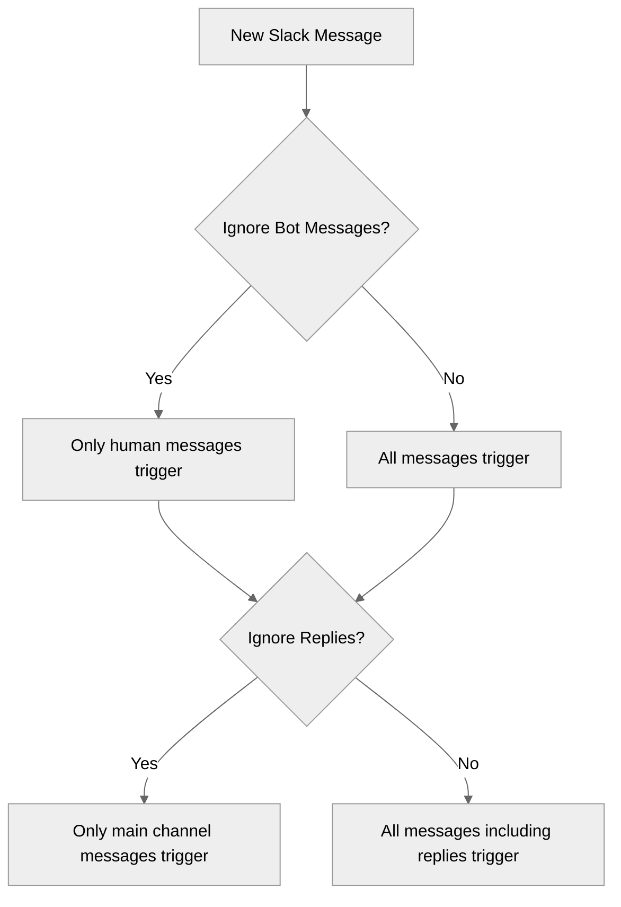

> **Note**: When building response bots, always enable "Ignore Bot Messages" to prevent infinite loops where your bot responds to its own messages.

#### Example Workflows

##### Customer Support Monitor

```text
Slack Message Reader -> Ask AI -> Notion Page Writer
```

* **Channel**: #support
* **Read Full Thread**: Yes
* **Ignore Bot Messages**: No
* **Purpose**: Analyze and document support conversations

##### Team Updates Trigger

```text
Slack Message Reader [Trigger] -> Categorizer -> Gmail Sender
```

* **Channel**: #team-updates
* **Message Count**: 1
* **Ignore Bot Messages**: Yes
* **Purpose**: Send important updates to stakeholders

##### Resource Archival

```text
Slack Message Reader -> Attachments Output -> Google Drive File Writer
```

* **Channel**: #resources
* **Read Full Thread**: Yes
* **Date Range**: Last 7 days
* **Purpose**: Archive shared resources and documentation

##### Weekly Channel Report

```text
Current DateTime -> Slack Message Reader -> Ask AI -> Gmail Sender
```

* **Use Dates?**: Yes
* **Use Exact Dates?**: Yes
* **Start Date**: Connected to Current DateTime with -7 days modifier
* **End Date**: Connected to Current DateTime
* **Purpose**: Generate weekly summary reports of channel activity

#### Output Format

The output format changes based on Message Count:

##### Multiple Messages (Count > 1)

Returns lists:

* Messages: \["Hello", "How are you"]
* Thread IDs: \["123", "456"]
* Thread Links: \["[https://company.slack.com/archives/C123/p456](https://company.slack.com/archives/C123/p456)", "[https://company.slack.com/archives/C123/p789](https://company.slack.com/archives/C123/p789)"]
* Sender Names: \["Alice", "Bob"]
* Channel Name: \["general", "general"]
* Channel ID: \["C123456", "C123456"]

##### Single Message (Count = 1)

Returns single values \[text]:

* Message: "Hello"
* Thread ID: "123"
* Thread Link: "[https://company.slack.com/archives/C123/p456](https://company.slack.com/archives/C123/p456)"
* Sender Name: "Alice"
* Channel Name: "general"
* Channel ID: "C123456"

#### Important Considerations

1. **Authentication**: Set up Slack authentication in the [Connectors page](https://www.gumloop.com/personal/connectors)
2. **Channel Membership**: You must be a member of the channel for it to appear in the dropdown
3. **Thread Messages**: Thread messages will trigger workflows when using as trigger
4. **Bot Filtering**: Bot message filtering applies to thread replies as well
5. **Timezone**: Date filtering uses UTC timezone, which may not match your local time

#### Advanced Slack Features

> **Info:** Need more advanced Slack capabilities like managing channels, uploading files, or adding reactions? Use the [Slack MCP node](https://docs.gumloop.com/nodes/mcp/slack) to create custom Slack integrations with natural language prompts.

### Slack Message Sender

**Source:** https://docs.gumloop.com/nodes/integrations/slack_message_sender

The **Slack Message Sender** node sends simple text messages and formatted content to Slack channels or direct messages to users. For complex layouts and interactive elements, consider using [Slack Block Kit Sender](https://docs.gumloop.com/nodes/integrations/slack_block_kit_sender).

  *[Image: Slack Message Sender node interface]*

#### Channel Access Requirements

> **Info:** To send messages to a channel, you must be a member of that channel AND the Gumloop bot must be invited to the channel (unless using "Send as user" mode).

1. **Authenticate with Slack**

   Go to the [Connectors page](https://www.gumloop.com/personal/connectors) and connect your Slack workspace.

2. **Join the Channel**

   Make sure you're a member of the channel where you want to send messages. Private channels require an invite from an existing member.

3. **Invite the Gumloop Bot**

   Type `/invite @Gumloop` in the channel, or click the channel name and select Add integrations/Add app to search for "Gumloop".

       
         *[Image: Adding Gumloop app to Slack channel]*
       

4. **Select the Channel**

   The channel will now appear in the dropdown menu in the node configuration.

> **Tip:** If you enable **"Send as user"** in the node options, the Gumloop bot does not need to be in the channel. The message will be sent using your personal Slack token instead. You still need to be a member of the channel.

##### Direct Messages to Users

You can send direct messages to any user in your Slack organization by toggling to "User" under "Show more options".

> **Warning:** Direct messages sent this way come from the Gumloop bot, not your personal account. They won't appear in your personal DM history with the user, and you can only message users within your Slack organization.

#### When to Use

The Slack Message Sender is ideal for:

| Use Case            | Example                           |
| ------------------- | --------------------------------- |
| **Quick Updates**   | Text updates to channels          |
| **Direct Messages** | Personal messages to team members |
| **File Sharing**    | Attach files to messages          |
| **Thread Replies**  | Reply to existing conversations   |
| **Notifications**   | Automated alerts and reminders    |

#### Node Inputs

| Input                      | Description                                                                                                                                                                            |
| -------------------------- | -------------------------------------------------------------------------------------------------------------------------------------------------------------------------------------- |
| **Send Type**              | Choose "Channel" (default) or "User" under "More options"                                                                                                                              |
| **Channel/User**           | The destination channel or user for your message                                                                                                                                       |
| **Message**                | The text content of your message (supports basic formatting)                                                                                                                           |
| **Thread ID** (Optional)   | For replying to existing messages. Fetch from [Slack Message Reader](https://docs.gumloop.com/nodes/integrations/slack_message_reader)                                                                         |
| **Attachments** (Optional) | Files to attach. Use `Join List Items` node for multiple files. [Example Workflow](https://www.gumloop.com/pipeline?workbook_id=gm3gC9ou3zXRygVR215WGr\&run_id=iS2Gs9uP6RLw8rUn447gxj) |

##### Send as User

**Send as User Option**

When enabled under "Show More Options", this uses your personal Slack token to send messages:

  * The message appears as sent by you, not the Gumloop bot
  * **The Gumloop bot does not need to be in the channel**
  * You still need to be a member of the channel
  * For direct messages, the DM will be sent from your account (not the Gumloop bot)
  * Useful for personal messaging or when you want messages to appear from your account

#### Node Output

| Output               | Description                           |
| -------------------- | ------------------------------------- |
| **Posted Thread ID** | Unique identifier of the sent message |
| **Message Status**   | Success/failure of message delivery   |

#### Message Formatting

The node supports basic Slack formatting:

##### Text Formatting

```text
*bold text*              → bold text
_italic text_            → italic text
~strikethrough~         → strikethrough
`inline code`           → monospace text
```

##### Block Formatting

```text
> Block quote           → Indented quote
>>> Multi-line quote    → Multi-line indented quote
```

##### Code Blocks

````text theme={"dark"}
```
Code block
Multiple lines
```
````

##### Lists

```text
• Use regular hyphens for bullets
1. Numbers for ordered lists
```

#### Example Messages

##### 1. Simple Status Update

```text
🎯 Sprint Goals Update:
*Completed Tasks:*
• User authentication fixed
• API performance improved
• Documentation updated

_Next up:_ Dashboard optimization
```

**Preview**:

> 🎯 Sprint Goals Update:
>
> **Completed Tasks:**
>
> • User authentication fixed
>
> • API performance improved
>
> • Documentation updated
>
> *Next up:* Dashboard optimization

##### 2. System Alert

```text
⚠️ *System Alert*
`Database CPU Usage: 85%`
> Action required: Scale up database instances
```

**Preview**:

> ⚠️ **System Alert**
> `Database CPU Usage: 85%`
>
> > Action required: Scale up database instances

##### 3. Code Sharing

````text theme={"dark"}
*New API Endpoint Added:*
```javascript
GET /api/v1/users/:id
Authorization: Bearer {token}

_Please update your clients accordingly._
````

**Preview**:

> **New API Endpoint Added:**
>
> ```javascript theme={"dark"}
> GET /api/v1/users/:id
> Authorization: Bearer {token}
> ```
>
> *Please update your clients accordingly.*

#### Common Use Cases

1. **Automated Notifications**
   * Build status alerts
   * Monitoring alerts
   * Scheduled reminders
   * System health updates

2. **Team Communication**
   * Daily standups
   * Meeting reminders
   * Quick updates
   * Task assignments

3. **Development Workflows**
   * Deployment notifications
   * Error alerts
   * PR notifications
   * Build status updates

4. **Support Operations**
   * Ticket updates
   * Service status
   * Customer inquiries
   * Response tracking

5. **User Notifications**
   * Personal task reminders
   * Approval requests
   * 1:1 communication
   * Personalized updates

#### Important Considerations

1. **Authentication**: Set up Slack authentication in the [Connectors page](https://www.gumloop.com/personal/connectors)
2. **Channel Membership**: You must be a member of the channel for it to appear in the dropdown
3. **Gumloop Bot Required**: The Gumloop bot must be invited to the channel using `/invite @Gumloop` (unless using "Send as user")
4. **Send as User**: When enabled, the bot is not required - messages are sent using your personal token
5. **DM Behavior**: Messages to users come from the Gumloop bot, not your account (unless using "Send as user")
6. **Loop Mode**: Use Loop Mode for sending multiple messages to different channels or users

#### Advanced Slack Features

> **Info:** Need more advanced Slack capabilities like managing channels, uploading files, or adding reactions? Use the [Slack MCP node](https://docs.gumloop.com/nodes/mcp/slack) to create custom Slack integrations with natural language prompts.

### Snowflake OAuth Configuration

**Source:** https://docs.gumloop.com/nodes/integrations/snowflake-oauth-config

This guide walks you through setting up Snowflake OAuth authentication for Gumloop. By following these steps, you'll configure a secure OAuth integration that allows Gumloop to connect to your Snowflake account on behalf of your users.

> **Note:** **Intended Audience:** Snowflake administrators with ACCOUNTADMIN role or users with CREATE INTEGRATION privilege. This setup is performed once and enables OAuth authentication for your organization's Snowflake connection.

> **Tip:** **Alternative Authentication:** If setting up OAuth is not feasible for your organization, you can use [Snowflake PAT (Programmatic Access Token)](https://docs.gumloop.com/nodes/integrations/snowflake-pat-config) as an alternative authentication method. However, OAuth is the recommended approach for enhanced security and automatic token refresh.

> **Warning:** This guide provides basic setup instructions for integrating Snowflake with Gumloop. For production environments and security best practices, please refer to the [official Snowflake OAuth documentation](https://docs.snowflake.com/en/user-guide/oauth-custom) to ensure your configuration meets your organization's security requirements.

#### What This Guide Covers

This documentation will help you:

1. **Create a Snowflake OAuth Integration** - Register Gumloop as a custom OAuth client in Snowflake
2. **Retrieve OAuth Credentials** - Get the Client ID and Client Secret needed for Gumloop
3. **Configure Gumloop (Administrator)** - Add the Snowflake OAuth Config to your organization
4. **User Authentication** - Connect individual user accounts with proper scopes

Once complete, your team will be able to authenticate Snowflake connections through OAuth in Gumloop.

#### Overview

Snowflake OAuth integration enables secure authentication between Gumloop and your Snowflake account. Instead of sharing static credentials, OAuth allows users to authorize Gumloop to access Snowflake on their behalf with automatic token refresh and better security controls.

##### Why Use Snowflake OAuth with Gumloop?

  - **Enhanced Security**: OAuth tokens are temporary and can be revoked, reducing the risk of credential exposure

  - **Automatic Token Refresh**: Refresh tokens keep your connection active without manual re-authentication

  - **Centralized Control**: Manage access and permissions directly in Snowflake

  - **Audit Trail**: Track OAuth authentication events in Snowflake's audit logs

***

#### Prerequisites

Before you begin, ensure you have:

* **Snowflake Account Access** - You need the ACCOUNTADMIN role or a role with CREATE INTEGRATION privilege
* **Snowflake Account URL** - Your Snowflake account URL (e.g., `https://myorg-account123.snowflakecomputing.com`)

***

#### Step 1: Create the Snowflake OAuth Integration

You'll run SQL commands in Snowflake to create a custom OAuth integration for Gumloop.

##### 1.1 Connect to Snowflake

1. Log in to your [Snowflake account](https://app.snowflake.com)
2. Open a new SQL worksheet
3. Ensure you're using a role with sufficient privileges:

```sql
USE ROLE ACCOUNTADMIN;
```

> **Info:** If you don't have the ACCOUNTADMIN role, ask your Snowflake administrator to either grant you this role temporarily or execute these commands on your behalf.

##### 1.2 Create the OAuth Integration

Copy and execute the following SQL command to create the OAuth integration:

```sql
CREATE OR REPLACE SECURITY INTEGRATION GUMLOOP
  TYPE = OAUTH
  ENABLED = TRUE
  OAUTH_CLIENT = CUSTOM
  OAUTH_CLIENT_TYPE = 'CONFIDENTIAL'
  OAUTH_REDIRECT_URI = 'https://api.gumloop.com/auth/callback'
  OAUTH_ISSUE_REFRESH_TOKENS = TRUE
  OAUTH_REFRESH_TOKEN_VALIDITY = 7776000;
```

**Understanding the Configuration Parameters**

* **TYPE = OAUTH** - Specifies this is an OAuth integration
  * **ENABLED = TRUE** - Activates the integration immediately
  * **OAUTH\_CLIENT = CUSTOM** - Indicates this is a custom OAuth client (not a pre-built partner integration)
  * **OAUTH\_CLIENT\_TYPE = 'CONFIDENTIAL'** - Marks this as a confidential client that can securely store secrets
  * **OAUTH\_REDIRECT\_URI** - The Gumloop callback URL where users are redirected after authentication
  * **OAUTH\_ISSUE\_REFRESH\_TOKENS = TRUE** - Enables automatic token refresh for persistent connections
  * **OAUTH\_REFRESH\_TOKEN\_VALIDITY = 7776000** - Sets refresh token validity to 90 days (7,776,000 seconds)

> **Warning:** **Important:** Snowflake automatically adds certain administrative roles to the OAuth blocked roles list: **ACCOUNTADMIN**, **ORGADMIN**, **SECURITYADMIN**, and **GLOBALORGADMIN**. If you need to use these roles with OAuth, you must either: >  >   * Remove them from the blocked roles list (if your organization's security policy allows), or   * Switch to a different role that is not blocked >  >   For more information, see the [Blocking Specific Roles](#blocking-specific-roles) section below.

> **Info:** For custom OAuth integrations (`OAUTH_CLIENT = CUSTOM`), scopes are not configured on the security integration itself. Instead, scopes are specified during the OAuth authorization request. Gumloop handles this automatically when users connect their accounts. >  >   To control which roles can be used with this integration, use `BLOCKED_ROLES_LIST` to deny specific roles or `PRE_AUTHORIZED_ROLES_LIST` to skip the user consent step for specific roles. Refer to the [Snowflake OAuth documentation](https://docs.snowflake.com/en/user-guide/oauth-custom) for details.

##### 1.3 Verify the Integration

Confirm the integration was created successfully:

```sql
SHOW SECURITY INTEGRATIONS LIKE 'GUMLOOP';
```

You should see `GUMLOOP` in the results.

##### 1.4 View Integration Details

To see all configuration details:

```sql
DESC SECURITY INTEGRATION GUMLOOP;
```

This displays all properties of your OAuth integration, including the OAuth endpoints.

***

#### Step 2: Retrieve OAuth Credentials

Now you need to get the Client ID and Client Secret that Gumloop will use to authenticate.

##### 2.1 Get Client Credentials

Execute the following command:

```sql
SELECT SYSTEM$SHOW_OAUTH_CLIENT_SECRETS('GUMLOOP');
```

This returns a JSON object containing your credentials. The output will look like:

```json
{
  "OAUTH_CLIENT_ID": "ABC123XYZ456...",
  "OAUTH_CLIENT_SECRET": "def789ghi012...",
  "OAUTH_CLIENT_SECRET_2": ""
}
```

> **Warning:** **Keep these credentials secure!** Treat the Client ID and Client Secret like passwords. Do not share them publicly or commit them to version control.

##### 2.2 Save the Credentials

Copy and save the following values from the JSON response:

* **OAUTH\_CLIENT\_ID** - You'll need this for Gumloop
* **OAUTH\_CLIENT\_SECRET** - You'll need this for Gumloop

> **Tip:** Store these credentials in a secure password manager until you're ready to add them to Gumloop.

***

#### Step 3: Configure Gumloop (Administrator Setup)

Now that you have your Snowflake OAuth credentials, you'll add them to Gumloop as an administrator.

##### 3.1 Add Snowflake OAuth Config to Gumloop

1. Navigate to [Settings → Organization → OAuth Configuration](https://www.gumloop.com/settings/organization/oauth-configuration)
2. Search for **"Snowflake OAuth Config"** in the credentials list
3. Click **Add Credential**

  

4. Enter the following information:
   * **Client ID**: The `OAUTH_CLIENT_ID` from Step 2.1
   * **Client Secret**: The `OAUTH_CLIENT_SECRET` from Step 2.1

  

5. Save the configuration

This sets up the OAuth integration at the organization level. Individual users will now be able to connect using this configuration.

***

#### Step 4: User Authentication

Once the Gumloop administrator has completed Step 3, individual users can connect their Snowflake accounts.

##### 4.1 Connect Your Snowflake Account

1. Navigate to [Connectors page](https://www.gumloop.com/personal/connectors)
2. Click **Add Credential**
3. Select **Snowflake** from the list of integrations
4. Choose the first Snowflake option as the authentication method

  

5. Select **Snowflake OAuth Config** (the configuration added by your administrator or Okta if that is setup)
6. Enter the following information:
   * **Workspace ID**: Your Snowflake account identifier (e.g., `myorg-account123`)
   * **Scopes**: Space-separated list of OAuth scopes (see warning below)

##### PrivateLink and Private Service Connect

> **Warning:** **PrivateLink accounts are not supported with Gumloop's standard (cloud-hosted) deployment** unless you whitelist Gumloop's [static egress IPs](https://docs.gumloop.com/enterprise-features/static_egress_ips) in your Snowflake network policy. The OAuth handshake requires Gumloop to reach your Snowflake account over the public internet. If your Snowflake account is behind AWS PrivateLink, Azure Private Link, or Google Cloud Private Service Connect and you are unable to whitelist Gumloop's IPs, connections will fail because Gumloop's servers cannot reach the private endpoint. >  >   **The solution is a VPC deployment**, where Gumloop runs inside your network perimeter so the OAuth handshake stays private. Contact [support@gumloop.com](mailto:support@gumloop.com) to explore VPC deployment options for your organization.

If your Snowflake account uses PrivateLink **and** you have a Gumloop VPC deployment, include `.privatelink` in the Workspace ID. For example, if your Snowflake URL is `https://myorg-account123.privatelink.snowflakecomputing.com`, enter `myorg-account123.privatelink`.

Snowflake admins can find the private account URL by running `SYSTEM$GET_PRIVATELINK_CONFIG()` and checking the `regionless-privatelink-account-url` field (or `privatelink-account-url` for the region-specific locator format).

> **Warning:** **Critical: Scopes Configuration** >  >   If you leave scopes empty, most Snowflake operations will fail. You must specify the role(s) you want to use with this connection. >  >   **Required format:** >  >   ```text theme={"dark"}   session:role:YOUR_ROLE_NAME   ``` >  >   Replace `YOUR_ROLE_NAME` with your actual Snowflake role (e.g., `PUBLIC`, `ANALYST`, etc.). The role name is case-sensitive and must be in uppercase unless the role was created with quotes. >  >   
> **Info:** **Note:** Gumloop automatically handles the `refresh_token` scope internally. You only need to specify the role scope(s).
 >  >   **Examples:** >  >   * Basic access: `session:role:PUBLIC`   * Analyst role: `session:role:ANALYST`   * Custom role: `session:role:DATA_ENGINEER`   * Multiple roles: `session:role:ANALYST,session:role:DATA_ENGINEER` >  >   For detailed scope configuration, refer to the [Snowflake OAuth scope documentation](https://docs.snowflake.com/en/user-guide/oauth-custom#label-oauth-scope).

##### 4.2 Authorize the Connection

After entering your information:

1. Click **Connect** or **Authorize**
2. You'll be redirected to Snowflake's authorization page
3. Log in with your Snowflake credentials
4. Review the requested permissions and role
5. Click **Authorize** to grant Gumloop access
6. You'll be redirected back to Gumloop with a successful connection

##### 4.3 Verify Your Connection

To confirm your OAuth connection is working correctly:

1. Go to [Connectors page](https://www.gumloop.com/personal/connectors)
2. Search for **Snowflake**
3. If the connection is successful, you should see your **Snowflake username** displayed instead of "Snowflake Account"

*[Screenshot: Snowflake OAuth verification showing username instead of account name]*

> **Tip:** If you see your username listed (as shown in the image above), your OAuth connection is properly configured and ready to use!

***

#### Blocking Specific Roles

Snowflake automatically blocks certain administrative roles from being used with OAuth for security reasons. These blocked roles include:

* **ACCOUNTADMIN**
* **ORGADMIN**
* **SECURITYADMIN**
* **GLOBALORGADMIN**

These roles are blocked by default and cannot be removed from the block list without contacting Snowflake Support and obtaining approval from your security team.

##### Adding Additional Blocked Roles

To block additional custom roles from being used with OAuth:

```sql
ALTER SECURITY INTEGRATION GUMLOOP 
  SET BLOCKED_ROLES_LIST = ('SYSADMIN', 'CUSTOM_ADMIN_ROLE');
```

> **Info:** If users need to access Snowflake with OAuth using a role that's currently blocked, they have two options: >  >   1. Request removal from the blocked roles list (requires Snowflake Support approval)   2. Switch to a different, non-blocked role that has the necessary permissions

***

#### Troubleshooting

##### "Invalid Client" Error

**Problem:** Getting an "invalid\_client" error when connecting

**Solution:**

* Verify the Client ID and Client Secret are correct in the Snowflake OAuth Config
* Check that the integration is enabled: `DESC SECURITY INTEGRATION GUMLOOP;`
* Ensure the redirect URI matches exactly: `https://api.gumloop.com/auth/callback`

##### Most Operations Are Failing

**Problem:** Connected successfully but Snowflake operations return permission errors

**Solution:**
This usually means scopes are not configured correctly. Ensure you specified a valid role scope when connecting your Snowflake account.

Update your credential with a proper role scope, for example: `session:role:PUBLIC`

Gumloop automatically handles the `refresh_token` scope, so you only need to specify the role.

##### Role Access Issues

**Problem:** Users can't access certain Snowflake resources or specific role

**Solution:**

* Verify the role name in your scope is spelled correctly and in uppercase
* Check if the desired role is blocked: `DESC SECURITY INTEGRATION GUMLOOP;`
* Ensure the user has been granted the role in Snowflake: `SHOW GRANTS TO USER your_username;`
* If using an administrative role (ACCOUNTADMIN, SECURITYADMIN, etc.), these are blocked by default

##### Username Not Showing in Gumloop

**Problem:** Still seeing "Snowflake Account" instead of username in credentials page

**Solution:**

* The OAuth authorization may not have completed successfully
* Try removing the credential and re-connecting
* Verify scopes are configured correctly with a valid role (e.g., `session:role:PUBLIC`)
* Check Snowflake audit logs to confirm the OAuth authorization was successful

##### Tokens Expiring Too Quickly

**Problem:** Users need to re-authenticate frequently

**Solution:**
Increase the refresh token validity in Snowflake:

```sql
ALTER SECURITY INTEGRATION GUMLOOP 
  SET OAUTH_REFRESH_TOKEN_VALIDITY = 15552000;  -- 180 days
```

***

#### Security Best Practices

  - **Regular Credential Rotation**: Periodically rotate your OAuth client secrets to maintain security

  - **Principle of Least Privilege**: Grant users only the minimum Snowflake roles needed for their work

  - **Monitor OAuth Activity**: Regularly review OAuth token usage in Snowflake audit logs

  - **Network Policies**: Configure Snowflake network policies to restrict OAuth access by IP

> **Info:** For comprehensive security guidance and advanced configuration options, refer to the [official Snowflake OAuth documentation](https://docs.snowflake.com/en/user-guide/oauth-custom).

***

#### Additional Resources

* [Snowflake OAuth Custom Clients Documentation](https://docs.snowflake.com/en/user-guide/oauth-custom)
* [Snowflake OAuth Error Codes](https://docs.snowflake.com/en/user-guide/oauth-error-codes)
* [Snowflake Network Policies](https://docs.snowflake.com/en/user-guide/network-policies)
* [Gumloop Credentials Guide](https://docs.gumloop.com/core-concepts/credentials)

***

#### Need Help?

If you encounter issues not covered in this guide:

1. Check the [Snowflake OAuth documentation](https://docs.snowflake.com/en/user-guide/oauth-custom) for detailed technical information
2. Contact your Snowflake administrator for account-specific issues
3. [Reach out to us](https://portal.usepylon.com/gumloop/forms/help) for integration assistance

### Snowflake PAT Configuration

*This guide walks you through setting up Snowflake PAT (Programmatic Access Token) authentication for Gumloop. PAT provides an alternative authentication method to OAuth, using username and password-based authentication.*

**Source:** https://docs.gumloop.com/nodes/integrations/snowflake-pat-config

This guide walks you through setting up Snowflake PAT (Programmatic Access Token) authentication for Gumloop. PAT provides an alternative authentication method to OAuth, using username and password-based authentication.

> **Note:** **When to Use PAT vs OAuth:** For most users, we recommend using [Snowflake OAuth](https://docs.gumloop.com/nodes/integrations/snowflake-oauth-config) as the preferred authentication method. PAT is an alternative for users who cannot set up OAuth integrations or need a simpler authentication approach.

#### What This Guide Covers

This documentation will help you:

1. **Understand when PAT is appropriate** - Learn when to use PAT vs OAuth
2. **Generate a Snowflake PAT** - Create a programmatic access token in Snowflake
3. **Configure Gumloop** - Add your PAT credentials to connect Gumloop to Snowflake
4. **Handle Network Policies** - Understand and configure network policy requirements

***

#### OAuth vs PAT: Which Should You Use?

  - **Use OAuth (Recommended)**: * Enhanced security with temporary tokens * Automatic token refresh * Centralized access control * Better audit trail * [Set up OAuth →](https://docs.gumloop.com/nodes/integrations/snowflake-oauth-config)

  - **Use PAT When**: * OAuth integration setup is not feasible * You need a simpler authentication method * Your organization restricts OAuth integrations * You need quick access for testing

> **Warning:** **Important:** Snowflake OAuth and Snowflake PAT are **either/or** authentication methods. While you can technically have both configured, most users should choose one method.

***

#### Prerequisites

Before you begin, ensure you have:

* **Snowflake Account Access** - A Snowflake user account with permissions to generate PATs
* **Account Identifier** - Your Snowflake account identifier (e.g., `myorg-account123`)
* **Network Policy Considerations** - Understanding of your organization's network policies (see [Network Policy Requirements](#network-policy-requirements) below)
* **Public Internet Access** - Your Snowflake account must be reachable over the public internet (see note below)

> **Warning:** **PrivateLink accounts are not supported with Gumloop's standard (cloud-hosted) deployment** unless you whitelist Gumloop's [static egress IPs](https://docs.gumloop.com/enterprise-features/static_egress_ips) in your Snowflake network policy. PAT authentication requires Gumloop to reach your Snowflake account over the public internet. If your Snowflake account is behind AWS PrivateLink, Azure Private Link, or Google Cloud Private Service Connect and you are unable to whitelist Gumloop's IPs, PAT connections will fail because Gumloop's servers cannot reach the private endpoint. >  >   **The solution is a VPC deployment**, where Gumloop runs inside your network perimeter. Contact [support@gumloop.com](mailto:support@gumloop.com) to explore VPC deployment options for your organization.

***

#### Step 1: Generate a Snowflake PAT

##### 1.1 Access the PAT Settings

1. Log in to your [Snowflake account](https://app.snowflake.com)
2. Click on your profile icon in the bottom-left corner
3. Select **My Profile**
4. Navigate to the **Authentication** section
5. Find **Programmatic access tokens**

##### 1.2 Generate a New Token

1. Click **Generate new token**
2. Enter a descriptive name for the token (e.g., "Gumloop")
3. Set an appropriate expiration date
4. Click **Generate**

  

> **Warning:** **Save Your Token Immediately!** The token value is only shown once. Copy and store it securely before closing the dialog.

##### 1.3 Token Management Options

After creating your token, you can manage it through the menu (three dots):

* **Edit** - Modify token settings
* **Rotate** - Generate a new token value while keeping the same configuration
* **Bypass requirement for network policy** - Temporarily bypass network restrictions (see below)
* **Delete** - Remove the token

***

#### Step 2: Configure Gumloop

##### 2.1 Add Snowflake PAT Credentials

1. Navigate to [Connectors page](https://www.gumloop.com/personal/connectors)
2. Click **Add Credential**
3. Search for **"Snowflake PAT"** in the Snowflake PAT tab

  

4. Click **Add credential** on the Snowflake PAT option

5. Enter the following information:
   * **Username**: Your Snowflake username
   * **Password**: The PAT token you generated in Step 1
   * **Account Identifier**: Your Snowflake account identifier (e.g., `myorg-account123`)

6. Click **Save** to store your credentials

##### 2.2 Verify Your Connection

To confirm your PAT connection is working:

1. Create a new agent or workflow with a Snowflake Reader node or the Snowflake MCP integration
2. Configure a simple query like `SELECT CURRENT_USER()`
3. Run the agent or workflow to verify the connection succeeds

***

#### Network Policy Requirements

Snowflake network policies can restrict which IP addresses are allowed to connect. When using PAT authentication, you may encounter network policy restrictions that block connections from Gumloop's servers.

##### Understanding Network Policies

Network policies in Snowflake control access based on IP addresses. If your organization has network policies configured, PAT connections from Gumloop may be blocked unless:

1. Gumloop's [static egress IPs](https://docs.gumloop.com/enterprise-features/static_egress_ips) are whitelisted in your network policy, **OR**
2. You temporarily bypass the network policy requirement for your PAT

##### Option 1: Whitelist Gumloop's IP Range (Recommended for Production)

For production use, add Gumloop's [static egress IPs](https://docs.gumloop.com/enterprise-features/static_egress_ips) to your Snowflake network policy's allowed list. This provides permanent access without requiring repeated bypasses.

##### Option 2: Temporary Network Policy Bypass (For Testing)

For testing purposes, you can temporarily bypass the network policy requirement:

1. Go to your Snowflake profile → **Authentication** → **Programmatic access tokens**
2. Click the menu (three dots) next to your token
3. Select **Bypass requirement for network policy**
4. Set the bypass duration (maximum 24 hours)

> **Warning:** **Temporary Bypass Limitations:** >  >   * Maximum bypass duration is **24 hours**   * After the bypass expires, you'll need to either renew it or whitelist Gumloop's [static egress IPs](https://docs.gumloop.com/enterprise-features/static_egress_ips)   * This option is intended for testing, not production use

##### When Network Policy Bypass is Needed

You may need to bypass or whitelist if:

* Your Snowflake account has network policies restricting access to specific IP ranges
* You receive connection errors mentioning "network policy" or "IP not allowed"
* PAT authentication fails even with correct credentials

***

#### Troubleshooting

##### Connection Refused or Network Policy Error

**Problem:** Getting a network policy error when connecting

**Solution:**

* Use the temporary bypass option for testing (see [Option 2](#option-2-temporary-network-policy-bypass-for-testing) above)
* For production, whitelist Gumloop's [static egress IPs](https://docs.gumloop.com/enterprise-features/static_egress_ips) in your Snowflake network policy

##### Invalid Credentials Error

**Problem:** Authentication fails with invalid credentials

**Solution:**

* Verify your username is correct
* Ensure you're using the PAT token (not your regular password) in the Password field
* Check that the Account Identifier matches your Snowflake account URL
* Confirm the PAT hasn't expired

##### Token Expired

**Problem:** Previously working connection now fails

**Solution:**

* Check if your PAT has expired in Snowflake
* Generate a new token and update your Gumloop credentials
* Consider setting a longer expiration when creating new tokens

##### Warehouse Access Issues

**Problem:** Connected but queries fail with warehouse errors

**Solution:**

* Ensure your user has USAGE privilege on the warehouse
* Specify the warehouse explicitly in the Snowflake Reader node
* Check if a default warehouse is configured for your user

***

#### Security Best Practices

  - **Token Expiration**: Set appropriate expiration dates for your PATs. Shorter durations are more secure but require more frequent rotation.

  - **Least Privilege**: Use a Snowflake user with only the minimum permissions needed for your workflows.

  - **Regular Rotation**: Periodically rotate your PAT tokens to maintain security, even before they expire.

  - **Secure Storage**: Never share PAT tokens in plain text. Gumloop encrypts your credentials securely.

***

#### Additional Resources

* [Snowflake OAuth Configuration](https://docs.gumloop.com/nodes/integrations/snowflake-oauth-config) - Recommended authentication method
* [Snowflake Programmatic Access Tokens Documentation](https://docs.snowflake.com/en/user-guide/programmatic-access-tokens)
* [Snowflake Network Policies](https://docs.snowflake.com/en/user-guide/network-policies)
* [Gumloop Credentials Guide](https://docs.gumloop.com/core-concepts/credentials)

***

#### Need Help?

If you encounter issues not covered in this guide:

1. Check the [Snowflake PAT documentation](https://docs.snowflake.com/en/user-guide/programmatic-access-tokens) for detailed technical information
2. Contact your Snowflake administrator for account-specific issues
3. Reach out to [Gumloop Support](support@gumloop.com) for integration assistance

### Snowflake Reader

*This document outlines the functionality of the Snowflake Reader node, which enables executing SELECT queries on Snowflake databases and using the results in automated workflows.*

**Source:** https://docs.gumloop.com/nodes/integrations/snowflake_reader

This document outlines the functionality of the Snowflake Reader node, which enables executing SELECT queries on Snowflake databases and using the results in automated workflows.

#### Node Configuration

* **Query**: SQL SELECT statement to execute
  * Must be a valid SELECT query
  * Can be dynamically provided from previous nodes
  * [View Snowflake SQL reference](https://docs.snowflake.com/en/sql-reference/sql/select)

* **Column Names**: Specify which columns from your query results to expose as outputs
  * Each column becomes a separate output that can connect to other nodes
  * Output is in `List` format

#### Authentication

1. Navigate to [Connectors page](https://www.gumloop.com/personal/connectors)
2. Add Snowflake credentials:
   * Account Identifier URL (e.g., `org-account.region.snowflakecomputing.com`)
     * Required for connecting to your Snowflake instance
     * [How to find your account identifier](https://docs.snowflake.com/en/user-guide/admin-account-identifier)
   * Username
   * Password

#### Example Workflows

##### 1. Sales Performance Alerts

```text
Snowflake Reader (sales metrics) → Combine Text → Slack Message Sender
```

* Snowflake Reader fetches daily sales metrics including revenue, targets, and regional performance
* Combine Text formats the data into a structured alert message:
  * Highlights underperforming regions and revenue gaps
  * Shows month-over-month comparisons
  * Includes relevant sales manager contacts
* Slack messages are automatically routed to:
  * Regional sales channels for local performance
  * Executive channel for company-wide metrics
  * Custom channels based on alert severity

##### 2. Inventory Management

```text
Snowflake Reader (inventory levels) → Gmail Sender → Airtable Writer
```

* Snowflake Reader monitors:
  * Current stock levels across warehouses
  * Historical consumption rates
  * Supplier details and lead times
* Gmail Sender automates:
  * Purchase order emails to suppliers
  * Order confirmation requests
  * Delivery timeline updates
* Airtable Writer maintains:
  * Complete order history
  * Supplier response times
  * Reorder patterns for analysis

##### 3. Customer Engagement Automation

```text
Snowflake Reader (customer data) → Ask AI → SendGrid Email Sender
```

* Snowflake Reader collects:
  * Purchase history and frequency
  * Product category preferences
  * Customer interaction data
* Ask AI processes this data to:
  * Generate personalized product recommendations
  * Create customized email content
  * Optimize sending times
* SendGrid Email Sender delivers:
  * Targeted promotional campaigns
  * Personalized follow-up messages
  * Product recommendation emails

##### 4. Data Quality Monitoring

```text
Snowflake Reader (data quality metrics) → Jira Issue Creator → Slack Message Sender
```

* Snowflake Reader checks for:
  * Missing or null values
  * Data format inconsistencies
  * Anomalous patterns
* Jira Issue Creator automatically:
  * Opens tickets for detected issues
  * Assigns to appropriate team members
  * Sets priority based on impact
* Slack notifications include:
  * Issue summary and severity
  * Direct link to Jira ticket
  * Required action items

#### Common Use Cases

1. **Data-Driven Alerts**
   * Performance monitoring
   * Threshold-based notifications
   * SLA tracking
   * Error detection

2. **Automated Reporting**
   * Regular business reports
   * KPI dashboards
   * Compliance reporting
   * Team performance metrics

3. **Process Automation**
   * Customer communications
   * Supply chain management
   * Resource allocation
   * Quality control

4. **Data Integration**
   * Sync data to other platforms
   * Update external systems
   * Consolidate information
   * Cross-platform analytics

#### In Summary

The Snowflake Reader node allows seamless integration of Snowflake databases into automated workflows by executing SELECT queries and exposing query results as outputs for further processing. Ideal for data-driven alerts, reporting, and process automation.

### Store in S3

*This document outlines the functionality and characteristics of the Store in S3 node, which enables automated file uploading to Amazon S3 buckets.*

**Source:** https://docs.gumloop.com/nodes/integrations/amazon_s3

This document outlines the functionality and characteristics of the Store in S3 node, which enables automated file uploading to Amazon S3 buckets.

#### Node Inputs

##### Required Fields

* **Stored File Name**: Name to give the file in S3 (including extension)
* **S3 Bucket**: Target bucket name
* **File URL**: Source URL of file to upload

##### Optional Field

* **Overwrite**: Toggle to allow overwriting existing files

#### Node Output

* **S3 File URI**: Access URI for the uploaded file

#### Node Functionality

The Store in S3 node uploads files to Amazon S3 from URLs.

**Key features include**:

* Direct file uploading
* Overwrite option
* Custom file naming
* URI generation
* Secure authentication with Gumloop

#### When To Use

The Store in S3 node is valuable for automated file storage in AWS. Common use cases include:

* **File Backup**: Store important files in the cloud
* **Media Storage**: Upload images and documents
* **Data Archiving**: Save processed data files
* **Content Distribution**: Store files for CDN access

**Some specific examples**:

* Backing up daily reports as PDFs
* Storing processed images for web use
* Archiving generated data files
* Uploading assets for web applications

#### Important Considerations:

1. Requires Authentication with AWS - Set up in the [Connectors page](https://www.gumloop.com/personal/connectors)
2. Bucket must exist and be accessible

In summary, the Store in S3 node provides reliable file uploading to Amazon S3, ideal for automated cloud storage workflows.

### Supabase SQL Writer

*This document outlines the functionality and characteristics of the Supabase SQL Writer node, which enables executing SQL queries on Supabase databases.*

**Source:** https://docs.gumloop.com/nodes/integrations/supabase_sql_writer

This document outlines the functionality and characteristics of the Supabase SQL Writer node, which enables executing SQL queries on Supabase databases.

#### Node Inputs

##### Required Fields

* **Project**: Select your Supabase project
* **SQL Query**: Your SQL command

##### Optional Field

* **Number of Records**: Limit the number of returned records (default: 10, max: 10,000)

#### Node Output

* **Query Output**: Results from your SQL query as a list

#### Node Functionality

The Supabase SQL Writer node executes custom SQL queries on your Supabase database.

**Key features include**:

* Full SQL query support
* Customizable record limits
* Direct database access
* Secure authentication with Gumloop

#### Example

Think of SQL queries like giving specific instructions to your database:

* Simple SELECT query:

```sql
SELECT name, email 
FROM users 
WHERE signup_date > '2024-01-01'
```

#### Important Considerations:

1. Requires Authentication with Supabase - Set up in the [Connectors page](https://www.gumloop.com/personal/connectors)
2. SQL queries must be properly formatted

In summary, the Supabase SQL Writer node provides powerful database manipulation capabilities through direct SQL queries, perfect for complex data operations and custom database management tasks.

### Supabase Table Reader

*This document outlines the functionality and characteristics of the Supabase Table Reader node, which enables automated data retrieval from Supabase tables.*

**Source:** https://docs.gumloop.com/nodes/integrations/supabase_table_reader

This document outlines the functionality and characteristics of the Supabase Table Reader node, which enables automated data retrieval from Supabase tables.

#### Node Inputs

##### Required Fields

* **Project**: Select your Supabase project
* **Table**: Choose the table to read from

##### Optional Field

* **Number of Records**: Limit the number of records to retrieve (default: 10)

#### Node Output

Each column in your table becomes an output containing the corresponding data.

#### Node Functionality

The Supabase Table Reader node retrieves data from specified Supabase tables.

**Key features include**:

* Direct table access
* Customizable record limits
* Dynamic column outputs
* Secure authentication with Gumloop

#### When To Use

The Supabase Table Reader node is essential when you need to access data stored in Supabase. Common use cases include:

* **Data Retrieval**: Access stored records for analysis, reporting, or integration with other services
  * Pulling sales data for monthly performance reports
  * Retrieving customer records for CRM integration
  * Accessing inventory levels for stock management

* **User Information**: Work with user-related data stored in your database
  * Fetching user preferences for personalization
  * Reading user activity logs for behavior analysis

* **Content Management**: Access content and settings stored in your database
  * Reading blog posts or articles for publishing
  * Retrieving product catalogs for e-commerce operations

* **Status Checking**: Monitor and track various system states
  * Checking order statuses for fulfillment
  * Monitoring subscription states for billing
  * Tracking project milestones for automation

#### Example

Think of Supabase as your project's database, like a collection of spreadsheets:

1. Choose where to read from:
   * Project: "My App" (like picking which spreadsheet file)
   * Table: "Users" (like selecting which sheet to read)

2. Control how much to read:
   * Number of Records: 10 (will read first 10 rows)

The node will then output data from each column in your table, like getting specific columns from a spreadsheet.

#### Important Considerations:

1. Requires Authentication with Supabase - Set up in the [Connectors page](https://www.gumloop.com/personal/connectors)
2. Tables must exist in your project
3. Output format matches table structure
4. Default limit is 10 records

In summary, the Supabase Table Reader node provides straightforward access to your Supabase database tables, making it easy to retrieve and use stored data in your workflows.

### Supabase Table Writer

*This document outlines the functionality and characteristics of the Supabase Table Writer node, which enables automated data writing to Supabase tables.*

**Source:** https://docs.gumloop.com/nodes/integrations/supabase_table_writer

This document outlines the functionality and characteristics of the Supabase Table Writer node, which enables automated data writing to Supabase tables.

#### Node Inputs

##### Required Fields

* **Project**: Select your Supabase project
* **Table**: Choose the table to write to

##### Optional Fields

* **Upsert Mode**: Toggle to update existing rows instead of creating duplicates
* **Ignore Duplicates**: Skip duplicate rows when Upsert Mode is enabled

##### Dynamic Fields

Connect your node outputs to any column in your Supabase table.

#### Node Output

Success/failure status of the write operation.

#### When To Use

The Supabase Table Writer node is essential when you need to store data in Supabase. Common use cases include:

* **User Management**: Store and update user profiles
  * Saving user preferences from form submissions
  * Updating profile information from external sources

* **Data Collection**: Capture and store information
  * Recording form submissions from your website
  * Storing analytics data from various sources

* **Content Management**: Maintain dynamic content
  * Creating new blog posts or articles
  * Updating product information in catalogs

* **Transaction Recording**: Store business transactions
  * Recording payment transactions from invoices
  * Logging customer interactions

#### Example

Think of writing to Supabase like adding rows to a spreadsheet:

1. Choose where to write:
   * Project: "My App" (like picking which spreadsheet file)
   * Table: "Users" (like selecting which sheet)

2. Configure how to handle duplicates:
   * Upsert Mode: Yes (update if record exists)
   * Ignore Duplicates: No (always update existing records)

3. Connect your data:
   * Each column in your table appears as an input
   * Connect relevant node outputs to these inputs

#### Important Considerations:

* Requires Authentication with Supabase - Set up in the [Connectors page](https://www.gumloop.com/personal/connectors)

In summary, the Supabase Table Writer node provides reliable data writing capabilities to your Supabase database, with flexible options for handling duplicates and array data.

### Teams Message Reader

*The **Teams Message Reader** node retrieves messages from Microsoft Teams channels, including message content, thread IDs, attachments, sender information, and timestamps.*

**Source:** https://docs.gumloop.com/nodes/integrations/teams_message_reader

The **Teams Message Reader** node retrieves messages from Microsoft Teams channels, including message content, thread IDs, attachments, sender information, and timestamps.

> **Warning:** **Enterprise Accounts Only**: Teams nodes only work with Microsoft 365 work or school accounts. Personal Microsoft accounts cannot access Teams channel data because the Microsoft Graph API permissions required (ChannelMessage.Read.All) are only available for enterprise tenants. See [Why Enterprise Only?](#why-enterprise-only) for more details.

#### Authentication

1. **Connect Your Account**

   Go to the [Connectors page](https://www.gumloop.com/personal/connectors) and connect your Microsoft Teams work/school account. You'll be prompted to sign in with your organization's Microsoft 365 credentials.

2. **Grant Permissions**

   Approve the requested permissions when prompted. The node requires access to read channel messages and view team information.

3. **Select Team and Channel**

   Choose the Team and Channel from the dropdown menus. Only teams you're a member of and channels you have access to will appear.

#### Trigger Mode

The Teams Message Reader can be used as a **flow trigger** to automatically start your workflow whenever a new message is posted in a Teams channel.

  *[Image: Teams Message Reader trigger configuration]*

To enable trigger mode:

1. **Configure the Node**

   Select your **Team** and **Channel** from the dropdowns.

2. **Activate Trigger**

   Toggle **Activate as flow trigger** to Yes at the top of the node.

3. **Configure Filtering**

   Optionally enable **Ignore Bot Messages** and **Ignore Replies** to control which messages trigger your flow.

4. **Save Your Flow**

   Save the workflow to activate the trigger.

When used as a trigger, the node outputs a **single message** (not a list) each time a new message arrives in the channel. The Filter By, Date Range, and Message Count settings are not used in trigger mode.

> **Tip:** Enable **Ignore Bot Messages** when building response automations to prevent infinite loops where your flow responds to its own messages.

***

#### Node Configuration

##### Basic Settings

| Parameter     | Description                                                              |
| ------------- | ------------------------------------------------------------------------ |
| **Team**      | The Teams team to read from. Select from teams you're a member of.       |
| **Channel**   | The channel within the selected team. Appears after selecting a team.    |
| **Filter By** | Choose how to filter messages: Date Range, Exact Dates, or Message Count |

##### Filter Options

  
**Date Range**

Filter messages using relative time periods. This is useful for recurring workflows that need to process recent messages.

    Available options include:

    * Last 24 Hours
    * Last 7 Days
    * Last 30 Days
    * Custom relative ranges

  
**Exact Dates**

Specify precise Start Date (UTC) and End Date (UTC) for message retrieval. Use this when you need messages from a specific time window.

    
> **Tip:** Connect these inputs to a Current DateTime node to create dynamic date ranges for scheduled workflows.

  
**Message Count**

Retrieve a specific number of recent messages. Valid range is 1-10,000 messages. Default is 10.

    When set to 1, outputs are returned as single text values instead of lists.

##### Additional Options

  
**Ignore Bot Messages**

When enabled, messages from bots and applications are filtered out. This is useful when you only want to process messages from human users.

    Recommended when building response automations to prevent processing your own bot's messages.

  
**Ignore Replies**

When enabled, only root messages are fetched and thread replies are skipped. Use this when you only care about new conversation starters, not ongoing discussions.

  
**Read Full Thread**

When enabled, fetches all replies for each root message. The Messages output will include the full conversation thread, making it useful for:

    * Analyzing complete discussions
    * Archiving conversations
    * Processing support threads

#### Outputs

| Output               | Description                                                                                                              |
| -------------------- | ------------------------------------------------------------------------------------------------------------------------ |
| **Messages**         | Text content of the messages. When "Read Full Thread" is enabled, includes all replies.                                  |
| **Thread IDs**       | Unique identifiers for each message. Use with Teams Message Sender to reply to specific threads.                         |
| **Attachment Names** | Comma-separated list of attached file names. Files up to 10MB are downloaded and can be passed to file processing nodes. |
| **Sender Names**     | Display names of message authors.                                                                                        |
| **Channel Names**    | Name of the channel where messages were posted.                                                                          |
| **Channel IDs**      | Unique channel identifiers for API integrations.                                                                         |
| **Date**             | Message timestamps in UTC.                                                                                               |
| **Subject**          | Message subjects when present (typically for channel announcements).                                                     |

#### Output Format

The output format changes based on your configuration:

##### Multiple Messages (Count > 1)

Returns lists for all outputs:

```text
Messages: ["Hello team", "Meeting at 3pm", "Sounds good"]
Thread IDs: ["1234567890", "1234567891", "1234567892"]
Sender Names: ["Alice", "Bob", "Alice"]
```

##### Single Message (Count = 1 or Trigger Mode)

Returns single text values when Message Count is set to 1 or when the node is used as a trigger:

```text
Message: "Hello team"
Thread ID: "1234567890"
Sender Name: "Alice"
```

#### Example Workflows

##### Channel Activity Monitor

```text
Teams Message Reader -> Ask AI (Summarize) -> Gmail Sender
```

* **Filter By**: Date Range (Last 24 Hours)
* **Purpose**: Daily summary of channel activity sent via email

##### Support Thread Archiver

```text
Teams Message Reader -> Google Sheets Writer
```

* **Read Full Thread**: Yes
* **Filter By**: Date Range (Last 7 Days)
* **Purpose**: Archive support conversations to a spreadsheet

##### Message Routing

```text
Teams Message Reader -> Categorizer -> Router -> [Multiple Destinations]
```

* **Message Count**: 1
* **Ignore Bot Messages**: Yes
* **Purpose**: Route messages to different workflows based on content

##### Real-Time Response Bot (Trigger)

```text
Teams Message Reader (Trigger) -> Ask AI -> Teams Message Sender
```

* **Activate as flow trigger**: Yes
* **Ignore Bot Messages**: Yes
* **Purpose**: Automatically respond to incoming messages using AI

#### Important Considerations

1. **Channel Access**: You must be a member of the channel to read messages. Private channels require an invite.
2. **Rate Limits**: Microsoft Graph API has rate limits. For high-volume channels, consider using date filters to limit the number of messages processed.
3. **Attachments**: File attachments up to 10MB are automatically downloaded. Larger files are skipped.
4. **Timezone**: All date filtering uses UTC timezone. Account for timezone differences when setting date ranges.
5. **Message Types**: System messages (member added/removed, channel renamed) are automatically filtered out.

#### Why Enterprise Only?

Microsoft Teams is designed as an enterprise collaboration platform integrated with Microsoft 365. The Microsoft Graph API endpoints for reading channel messages require specific permissions that are only available for work and school accounts:

**Required Permission**: `ChannelMessage.Read.All`

This permission is classified as an "application permission" in Microsoft's permission model and requires:

* A Microsoft 365 business or education subscription
* An Azure AD tenant (automatically created with Microsoft 365)
* Admin consent for the application to access channel messages

Personal Microsoft accounts (outlook.com, hotmail.com, live.com) do not have:

* Access to Teams workspaces (Teams is not available for personal accounts)
* An Azure AD tenant to grant application permissions
* The underlying infrastructure that supports channel message APIs

If you're seeing authentication errors, verify that you're signing in with your organization's work or school account (typically your corporate email), not a personal Microsoft account.

#### Advanced Teams Features

> **Info:** Need more advanced Teams capabilities like managing channels, updating messages, or working with tabs? Use the [Microsoft Teams MCP node](https://docs.gumloop.com/nodes/mcp/microsoft_teams) to create custom Teams integrations with natural language prompts.

> **Tip:** Want your team to chat with an agent directly inside a Teams channel? See [Using Agents in Microsoft Teams](https://docs.gumloop.com/core-concepts/agents_teams).

### Teams Message Sender

*The **Teams Message Sender** node sends messages to Microsoft Teams channels, with support for thread replies and batch messaging.*

**Source:** https://docs.gumloop.com/nodes/integrations/teams_message_sender

The **Teams Message Sender** node sends messages to Microsoft Teams channels, with support for thread replies and batch messaging.

> **Warning:** **Enterprise Accounts Only**: Teams nodes only work with Microsoft 365 work or school accounts. Personal Microsoft accounts cannot send messages to Teams channels because the Microsoft Graph API permissions required (ChannelMessage.Send) are only available for enterprise tenants. See [Why Enterprise Only?](#why-enterprise-only) for more details.

#### Authentication

1. **Connect Your Account**

   Go to the [Connectors page](https://www.gumloop.com/personal/connectors) and connect your Microsoft Teams work/school account. You'll be prompted to sign in with your organization's Microsoft 365 credentials.

2. **Grant Permissions**

   Approve the requested permissions when prompted. The node requires access to send channel messages and view team information.

3. **Select Team and Channel**

   Choose the Team and Channel from the dropdown menus. Only teams you're a member of and channels you have access to will appear.

#### Node Configuration

##### Required Inputs

| Parameter   | Description                                                           |
| ----------- | --------------------------------------------------------------------- |
| **Team**    | The Teams team to send to. Select from teams you're a member of.      |
| **Channel** | The channel within the selected team. Appears after selecting a team. |
| **Message** | The text content of your message. Supports plain text.                |

##### Thread Replies

To reply within an existing thread instead of posting a new message:

1. **Enable Thread Reply**

   Toggle **Reply In Thread?** in the node settings under "Show more options".

2. **Provide Thread ID**

   Connect the **Thread ID** input to a Thread ID output from a Teams Message Reader node, or provide a known thread ID.

> **Tip:** Thread IDs from Teams Message Reader can be used directly with Teams Message Sender to create conversational workflows that respond to specific messages.

#### Output

| Output               | Description                                                                                                              |
| -------------------- | ------------------------------------------------------------------------------------------------------------------------ |
| **Posted Thread ID** | The unique identifier of the sent message. Use this to reply to the message in subsequent workflow steps or future runs. |

#### Batch Mode

The Teams Message Sender supports Loop Mode for sending multiple messages efficiently.

##### Sending Multiple Messages

Connect a list to the Message input to send messages in batch:

```text
Create List -> Teams Message Sender (Loop Mode)
```

Each item in the list will be sent as a separate message to the configured channel.

##### Sending to Multiple Threads

Combine with Loop Mode on both Message and Thread ID inputs to reply to multiple threads:

```text
Teams Message Reader -> Teams Message Sender (Loop Mode)
```

This pattern is useful for:

* Automated responses to multiple conversations
* Bulk notifications to existing threads
* Processing and responding to support requests

#### Common Use Cases

##### Automated Notifications

Send alerts and updates to your team channel:

```text
[Trigger Source] -> Ask AI (Format Message) -> Teams Message Sender
```

* Monitor external systems and post updates
* Send daily/weekly summaries
* Alert on important events

##### Conversation Response Bot

Respond to messages in Teams channels:

```text
Teams Message Reader -> Ask AI -> Teams Message Sender
```

* **Teams Message Reader**: Get incoming messages with Thread IDs
* **Ask AI**: Generate appropriate responses
* **Teams Message Sender**: Reply to the original thread using Thread ID

> **Warning:** When building response bots, use "Ignore Bot Messages" in the Teams Message Reader to prevent infinite loops where your automation responds to its own messages.

##### Cross-Platform Notifications

Bridge communications between platforms:

```text
Slack Message Reader -> Teams Message Sender
```

* Sync important messages between Slack and Teams
* Notify Teams channels of Slack activity
* Create unified communication workflows

##### Scheduled Reports

Post regular updates to channels:

```text
Google Sheets Reader -> Ask AI (Summarize) -> Teams Message Sender
```

* Daily standup summaries
* Weekly metrics reports
* Automated status updates

#### Important Considerations

1. **Channel Membership**: You must be a member of the channel to send messages. Private channels require an invite.
2. **Message Format**: Messages are sent as plain text. For rich formatting, consider using the Microsoft Teams MCP node.
3. **Rate Limits**: Microsoft Graph API has rate limits. When sending many messages, the node handles rate limiting automatically with retries.
4. **Thread Replies**: When replying to a thread, the Thread ID must be valid and from the same channel.
5. **Message Length**: Teams supports messages up to 28KB in size. Longer messages may be truncated.

#### Why Enterprise Only?

Microsoft Teams is designed as an enterprise collaboration platform integrated with Microsoft 365. The Microsoft Graph API endpoints for sending channel messages require specific permissions that are only available for work and school accounts:

**Required Permission**: `ChannelMessage.Send`

This permission requires:

* A Microsoft 365 business or education subscription
* An Azure AD tenant (automatically created with Microsoft 365)
* User authentication with delegated permissions

Personal Microsoft accounts (outlook.com, hotmail.com, live.com) do not have:

* Access to Teams workspaces (Teams is not available for personal accounts)
* An Azure AD tenant to support delegated permissions
* The underlying infrastructure that supports channel message APIs

If you're seeing authentication errors, verify that you're signing in with your organization's work or school account (typically your corporate email), not a personal Microsoft account.

#### Advanced Teams Features

> **Info:** Need more advanced Teams capabilities like sending rich cards, managing channels, or working with adaptive cards? Use the [Microsoft Teams MCP node](https://docs.gumloop.com/nodes/mcp/microsoft_teams) to create custom Teams integrations with natural language prompts.

> **Tip:** Want your team to chat with an agent directly inside a Teams channel? See [Using Agents in Microsoft Teams](https://docs.gumloop.com/core-concepts/agents_teams).

### Translate

**Source:** https://docs.gumloop.com/nodes/integrations/translate

#### Node Inputs

* **text**: The text that you want to translate.
* **Input Language**: The language of the text you're providing. You can set it to "Detect Language" if you're not sure, and the node will try to figure it out for you.
* **Output Language**: The language you want your text to be translated into. The default is English if you don't specify anything.

#### Node Output

* **translated text**: The text after it has been translated to the desired language.

### Node Functionality

#### When To Use

Use this node when you need to translate text from one language to another. This is especially useful in situations where you're dealing with content in a foreign language or when you want to make information accessible to a wider audience by translating it into multiple languages.

It's a handy tool for businesses expanding internationally, for travelers learning about new cultures, or for educators and students dealing with multilingual resources.

### Tweet

*This document outlines the functionality and characteristics of the Tweet node, which enables automated posting to Twitter/X.*

**Source:** https://docs.gumloop.com/nodes/integrations/tweet

This document outlines the functionality and characteristics of the Tweet node, which enables automated posting to Twitter/X.

#### Node Inputs

##### Required Field

* **Tweet Text**: Content to be posted as tweet

##### Optional Fields

* **Remove Hashtags**: Toggle to remove trailing hashtags
* **Media Filenames**: Images or videos to attach

#### Node Output

* **Tweet URL**: Link to the posted tweet

#### Node Functionality

The Tweet node publishes content directly to Twitter/X.

**Key features include**:

* Text and media support
* Hashtag management
* Direct posting
* Secure authentication with Gumloop

#### When To Use

The Tweet node is valuable for automated Twitter/X content posting. Common use cases include:

* **Content Sharing**: Post updates from other platforms
* **Automated Updates**: Schedule regular announcements
* **Media Distribution**: Share images and videos

**Some specific examples**:

* Announcing new blog posts
* Sharing daily updates or metrics
* Posting scheduled marketing content

#### Important Considerations:

1. Requires Authentication with Twitter/X - Set up in the [Connectors page](https://www.gumloop.com/personal/connectors)
2. Must follow Twitter's character limits
3. Supported media types: images, videos
4. Tweet posts immediately

In summary, the Tweet node streamlines Twitter/X posting with support for text, media, and hashtag management.

### Twitter Scraper

**Source:** https://docs.gumloop.com/nodes/integrations/twitter_scraper

#### Overview

The Twitter Scraper node enables automated collection of Twitter/X posts, user information, and engagement metrics through the Twitter API. This node is perfect for social media monitoring, sentiment analysis, and user research.

> **Important**: A Twitter Developer Account is required to use this node.

#### Core Features

* Scrape tweets by username or search term
* Collect user metrics and engagement data
* Support for multiple post types
* Customizable data outputs
* Batch processing capability

#### Configuration

##### Input Parameters

###### 1. Query (Required)

* Format: Text string
* Examples:
  * Username: `@username`
  * Search terms: `artificial intelligence`
  * Hashtags: `#AI`

###### 2. Post Limit (Optional)

* Default: 100 posts
* Range: 1-100
* Format: Integer
* Controls the maximum number of posts retrieved

###### 3. Post Types (Multiple Selection)

* **Posts**: Original tweets
* **Replies**: Response tweets
* **Retweets**: Shared tweets
* Note: Select multiple types to include various content

###### 4. Outputs (Multiple Selection)

Available data points to extract:

* **Post Content**: The tweet text
* **Post Author**: Username of the tweet creator
* **Follower Count**: Number of followers for the author
* **Post URL**: Direct link to the tweet

##### Output Format

All selected outputs are returned as lists (array)

#### Usage Examples

##### 1. Basic User Analysis

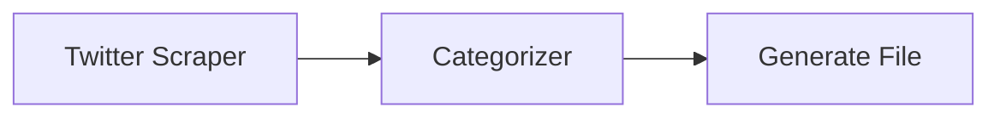

**Setup**:

* Query: `@username`
* Post Types: Posts only
* Outputs: Post Content, Follower Count

##### 2. Hashtag Monitoring

```mermaid
graph LR
    A[Twitter Scraper] --> B[Categorizer]
    B --> C[Airtable Database Writer]
```

**Setup**:

* Query: `#hashtag`
* Post Types: Posts, Retweets
* Outputs: All fields

##### 3. Competitor Analysis

```mermaid
graph LR
    A[Twitter Scraper] --> B[Extract Data]
    B --> C[AI Analysis Report Generation]
    C --> D[Gmail Sender]
```

**Setup**:

* Query: Multiple competitor handles
* Post Types: All
* Outputs: All fields
* Loop Mode: Enabled

#### Best Practices

##### Optimization Tips

1. **Query Structure**
   * Use precise usernames/terms
   * Include relevant hashtags
   * Avoid overly broad searches

2. **Rate Limiting**
   * Monitor API usage
   * Use appropriate post limits

##### Common Workflows

1. **Social Media Monitoring**
   * Twitter Scraper → Sentiment Analysis → Alert System
   * Monitor brand mentions and sentiment

2. **Content Curation**
   * Twitter Scraper → Categorizer → Content Generator
   * Create digests of industry news

3. **Market Research**
   * Twitter Scraper → Data Extraction → Analytics
   * Analyze trends and competitors

#### Technical Notes

##### Prerequisites

1. [Twitter Developer Account](https://developer.twitter.com/)
2. [API credentials configured in Gumloop](https://www.gumloop.com/personal/connectors)

##### Limitations

* Maximum 100 posts per query
* API rate limits apply
* Some content may be unavailable

#### Troubleshooting

##### Common Issues

1. **Authentication Errors**
   * Verify API credentials
   * Check account status
   * Confirm rate limits

2. **Empty Results**
   * Validate query syntax
   * Check content availability
   * Verify account permissions

#### In Summary

The Twitter Scraper node enables automated collection of Twitter/X posts, user data, and engagement metrics using the Twitter API. It supports queries by username, search terms, and hashtags, offering customizable outputs for social media monitoring, sentiment analysis, and market research.

### Typeform Submission Reader

*This document outlines the functionality and characteristics of the Typeform Submission Reader node, which enables automated form response retrieval from Typeform.*

**Source:** https://docs.gumloop.com/nodes/integrations/get_typeform_responses

This document outlines the functionality and characteristics of the Typeform Submission Reader node, which enables automated form response retrieval from Typeform.

#### Node Inputs

##### Required Fields

* **Workspace**: Select Typeform workspace
* **Form**: Choose specific form to read from

##### Optional Fields

* **Response Limit**: Number of responses to retrieve
* **Fields**: Select form fields to extract

#### Node Output

Selected form fields provided as lists (string\[]).

#### Node Functionality

The Typeform Submission Reader node retrieves form submissions from Typeform.

**Key features include**:

* Multiple field selection
* Response limiting
* Trigger capability
* Loop Mode support for batch operations
* Secure authentication with Gumloop

##### Trigger Functionality

This node can also function as a trigger to start your workflow when new form submissions arrive. Learn more about triggers in our [Workflow Triggers documentation](https://docs.gumloop.com/core-concepts/workflow_triggers).

#### When To Use

The Typeform Submission Reader node is valuable for form data processing. Common use cases include:

* **Lead Collection**: Process new form submissions
* **Survey Analysis**: Gather response data
* **Registration Processing**: Handle event signups
* **Feedback Management**: Collect user feedback

**Some specific examples**:

* Creating leads from contact forms
* Processing job applications
* Analyzing customer feedback
* Managing event registrations

#### Important Considerations:

* Requires Authentication with Typeform - Set up in the [Connectors page](https://www.gumloop.com/personal/connectors)

In summary, the Typeform Submission Reader node streamlines form response collection from Typeform, with optional trigger functionality for automated response processing.

### Web Search

*This document outlines the functionality and characteristics of the Web Search node, which enables automated search queries across Google and Bing search engines.*

**Source:** https://docs.gumloop.com/nodes/integrations/web_search

This document outlines the functionality and characteristics of the Web Search node, which enables automated search queries across Google and Bing search engines.

#### Node Inputs

##### Required Fields

* **Query**: Your search term or phrase

##### Optional Fields

* **Results Count**: Number of results to return (default: 5)
* **Use Advanced Search**: Toggle for enhanced search capabilities
  * **Engine**: Choose between Google, Bing, Images, Hotels, Events, or News
  * **Country**: Select search region
  * **Event Dates**: For Google Events searches (when Engine is set to Events)

#### Node Outputs

* **URLs**: List of webpage URLs from search results
* **Snippets**: List of descriptions for each result

#### Node Functionality

The Web Search node performs searches using Google's Custom Search API and Bing's Web Search API.

**Key features include**:

* Basic and advanced search options
* Multiple search engine types
* Regional search targeting
* Customizable result count
* Loop Mode support for multiple searches

#### Example Workflows

##### 1. Competitor Content Analysis

```text
Web Search → Website Scraper → Summarizer → Notion Page Writer
Setup:
- Query: "site:competitor.com product reviews"
- Engine: Google
- Results Count: 10
Next Steps: Use Extract Data to identify key product features
```

##### 2. Industry News Monitoring

```text
Web Search → Website Scraper → Categorizer → Slack Message Sender
Setup:
- Query: "industry keyword news"
- Engine: News
- Country: United States
- Results Count: 15
Next Steps: Use Ask AI to generate daily briefings
```

##### 3. Social Media Content Research

```text
Web Search → Website Scraper → Extract Data → Airtable Writer
Setup:
- Query: "trending topics technology"
- Engine: Bing
- Results Count: 20
Next Steps: Use AI List Sorter to prioritize content ideas
```

##### 4. Event Marketing Pipeline

```text
Web Search → Extract Data → Gmail Sender
Setup:
- Query: "tech conferences 2024"
- Engine: Events
- Country: United States
- Event Dates: Next 3 months
Next Steps: Use LinkedIn Post Writer to share event details
```

#### Best Practices

##### Query Optimization

* Use specific keywords for targeted results
* Include `site:` operator for domain-specific searches
  * Example:  Site:Linkedin.com/in
* Combine with the [Filter](https://docs.gumloop.com/nodes/flow_basics/filter) node for refined results

##### Handling Result Count with Advanced Search

When using advanced search, the Results Count parameter will be disabled due to SERP API limitations. To control the number of results:

1. Add a [List Trimmer](https://docs.gumloop.com/nodes/list_operations/list_trimmer) node after your Web Search node
2. Configure the List Trimmer to keep your desired number of items
3. Connect the URLs, Snippets, or Titles output to the List Trimmer input

##### Engine Selection

* **Google**: Best for general web searches and comprehensive results
* **Bing**: Alternative perspective and sometimes different results
* **News**: Recent articles and press releases
* **Events**: Upcoming conferences, webinars, meetups
* **Images**: Visual content and media
* **Hotels**: Travel and accommodation information

#### Important Considerations

1. Basic search costs 2 credits per run
2. Advanced search costs 5 credits per run

In summary, the Web Search node provides flexible search capabilities across multiple engines, making it a versatile starting point for research, monitoring, and content aggregation workflows. Its integration with other nodes enables powerful automation sequences for various business needs.

### Zendesk Ticket Reader

*Read and monitor support tickets from Zendesk with automated triggers*

**Source:** https://docs.gumloop.com/nodes/integrations/zendesk_ticket_reader

Read and monitor support tickets from Zendesk with automated triggers

  *[Image: Zendesk Ticket Reader node interface]*

The Zendesk Ticket Reader connects to your Zendesk account to retrieve and monitor support tickets. Use it to fetch ticket data manually or set up automated workflows that trigger when new tickets are created, comments are added, or ticket statuses change.

#### How It Works

This node operates in two modes:

  - **Manual Mode**: Fetch tickets on-demand with custom filters for type, priority, status, date range, and views. Returns all matching tickets as lists for reporting and analysis.

  - **Trigger Mode**: Automatically monitors Zendesk for ticket events. Triggers your workflow when new tickets are created, comments are added, or statuses change.

#### Setup

1. **Connect your Zendesk account**

   Navigate to the [Connectors page](https://www.gumloop.com/personal/connectors) and search for "Zendesk" to connect your account.

2. **Add the node to your workflow**

   Drag the Zendesk Ticket Reader node onto your canvas from the Node Library.

3. **Configure filters (optional)**

   Set Type, Priority, Status, Date Range, or View filters to narrow down which tickets you want to retrieve.

#### Configuration

##### Filters

All filters support multiple selections:

  
**Type**

Filter tickets by their type:

    * **Question** - General inquiries
    * **Incident** - Issues affecting service
    * **Problem** - Root cause issues
    * **Task** - Work items to complete
    * **Empty** - Tickets without a type assigned

  
**Priority**

Filter by ticket priority level:

    * **Low** - Non-urgent issues
    * **Normal** - Standard priority
    * **High** - Important issues requiring attention
    * **Urgent** - Critical issues needing immediate action
    * **Empty** - Tickets without priority assigned

  
**Status**

Filter by ticket status:

    * **Open** - Active tickets awaiting response
    * **Pending** - Waiting for customer response
    * **Solved** - Resolved tickets

##### Date Filtering

Control which tickets are retrieved based on when they were created:

  
**Date Range**

Use relative date ranges for quick filtering:

    * Select "Last X Days/Weeks/Months" format
    * Default: Last 1 Week
    * Perfect for regular reporting workflows

  
**Exact Dates**

Specify precise date boundaries:

    * **Start Date (UTC)** - Beginning of your date range
    * **End Date (UTC)** - End of your date range
    * Useful for historical analysis or specific time periods

  
**Limit Number**

Retrieve a specific number of tickets:

    * Set **Number of Tickets to Read** (default: 100)
    * Ignores date filtering
    * Useful when you need the most recent N tickets

##### View Filtering

Filter tickets by Zendesk Views to retrieve tickets matching your pre-configured view criteria. Select a view from the dropdown to only return tickets that appear in that view.

> **Info:** Views are pre-configured in your Zendesk account and can include complex filter combinations. Using views is a powerful way to retrieve exactly the tickets you need.

##### Additional Settings

Access these options under "More Options":

| Setting                    | Description                                                                                             |
| -------------------------- | ------------------------------------------------------------------------------------------------------- |
| **Skip Reading Comments?** | When enabled, skips fetching ticket comments to improve performance. The Comments output will be empty. |
| **Credentials to use**     | Select which Zendesk credential to use if you have multiple accounts configured.                        |

#### Outputs

The node provides comprehensive ticket data. Output format depends on the mode:

| Output Field    | Description                                     |
| --------------- | ----------------------------------------------- |
| Ticket ID       | Unique identifier for the ticket                |
| Ticket URL      | Direct link to the ticket in Zendesk            |
| Created Date    | When the ticket was created (ISO format)        |
| Updated Date    | When the ticket was last updated (ISO format)   |
| Type            | Ticket type (Question, Incident, Problem, Task) |
| Priority        | Priority level (Low, Normal, High, Urgent)      |
| Status          | Current status (Open, Pending, Solved)          |
| Subject         | Ticket subject line                             |
| Description     | Initial ticket description                      |
| Requester Email | Email of the person who requested support       |
| Submitter Email | Email of the person who submitted the ticket    |
| Assignee Email  | Email of the assigned agent                     |
| Comments        | All ticket comments formatted as markdown       |

> **Info:** **Manual mode** returns arrays (lists) for each field. **Trigger mode** returns single values for each detected ticket event.

#### Using as a Trigger

When enabled as a trigger, the node automatically monitors Zendesk for ticket events:

  *[Image: Zendesk Ticket Reader trigger mode]*

##### Trigger Modes

  
**New Ticket Created**

Triggers when a new ticket is created in Zendesk. Applies Type, Priority, and Status filters to determine if the workflow should run.

  
**New Comment Added**

Triggers when a new comment is added to any ticket. Applies Type, Priority, and Status filters based on the ticket's current state.

  
**Ticket Status Changed**

Triggers when a ticket's status changes (e.g., from Open to Pending). Applies Type, Priority, and Status filters.

  
**New Ticket in View**

Triggers when a ticket enters a specific Zendesk View. Requires selecting a View. Only triggers on transition - tickets already in the view won't trigger.

  
**New Comment in View**

Triggers when a comment is added to a ticket that's currently in a specific View. Requires selecting a View.

##### Trigger Configuration

1. **Enable trigger mode**

   Toggle "Activate as workflow trigger" to Yes

2. **Select trigger mode**

   Choose when the trigger should fire from the Trigger Mode dropdown

3. **Configure filters**

   Set Type, Priority, and Status filters (for standard triggers) or select a View (for view-based triggers)

4. **Save your workflow**

   Save the workflow to activate the trigger

> **Warning:** View-based triggers (New Ticket in View, New Comment in View) only require a View selection. Type, Priority, and Status filters are not available for these trigger modes as the View itself defines the filtering criteria.

##### Common Trigger Use Cases

  - **Urgent Ticket Alerts**: Trigger on new tickets with High or Urgent priority to notify your team immediately via Slack or email

  - **Customer Response Tracking**: Trigger on new comments to track customer responses and update CRM systems

  - **Escalation Workflows**: Trigger on status changes to escalate tickets that have been pending too long

  - **SLA Monitoring**: Trigger on tickets entering specific views to monitor SLA compliance

#### Example Workflows

  
**Daily Open Tickets Report**

Fetch all open tickets daily and generate a summary report:

    ```text theme={"dark"}
    Time Trigger (Daily) -> Zendesk Ticket Reader -> Ask AI -> Gmail Sender
    ```

    **Configuration:**

    * Status: Open
    * Date Range: Last 24 Hours

  
**Urgent Ticket Slack Alert**

Immediately notify your team when urgent tickets are created:

    ```text theme={"dark"}
    Zendesk Ticket Reader [Trigger] -> Slack Message Sender
    ```

    **Configuration:**

    * Trigger Mode: New Ticket Created
    * Priority: Urgent, High

  
**Customer Feedback Analysis**

Analyze solved tickets to extract customer feedback patterns:

    ```text theme={"dark"}
    Zendesk Ticket Reader -> Ask AI -> Google Sheets Writer
    ```

    **Configuration:**

    * Status: Solved
    * Date Range: Last Week
    * Skip Reading Comments: No

  
**VIP Customer Routing**

Route tickets from VIP customers to a dedicated support queue:

    ```text theme={"dark"}
    Zendesk Ticket Reader [Trigger] -> Router -> Slack Message Sender
    ```

    **Configuration:**

    * Trigger Mode: New Ticket in View
    * View: VIP Customers

#### Tips

> **Tip:** Combine multiple filters to narrow results. For example, Status = "Open" + Priority = "Urgent" gives you high-priority active tickets that need immediate attention.

> **Tip:** Use the "Skip Reading Comments?" option when you only need ticket metadata. This significantly improves performance for large ticket volumes.

> **Tip:** For view-based triggers, the trigger only fires when a ticket transitions into the view. Tickets already in the view when the trigger is created won't trigger the workflow.

> **Tip:** The Comments output is formatted as markdown with author emails and timestamps, making it easy to include in reports or AI analysis.

#### Important Considerations

1. **Authentication**: Requires Zendesk authentication - set up in the [Connectors page](https://www.gumloop.com/personal/connectors)
2. **Output Format**: Returns lists in manual mode, single values in trigger mode
3. **Comments Performance**: Reading comments requires additional API calls per ticket - disable if not needed
4. **View Permissions**: You can only access views you have permission to see in Zendesk
5. **Trigger Availability**: Triggers are available on the [Pro tier](https://www.gumloop.com/pricing) and above

---