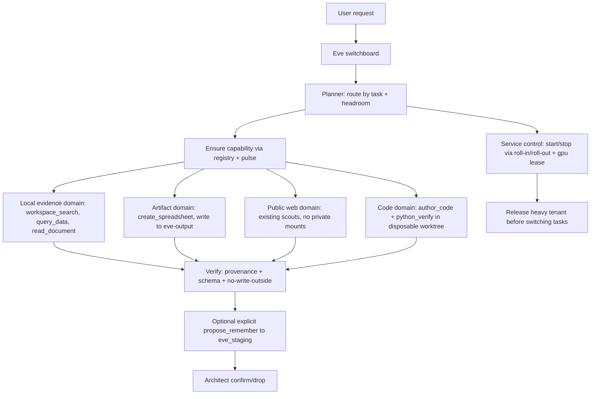

# Eve Governed Arms — Layered Implementation Plan

> **For agentic workers:** Implement phase-by-phase. Each phase ends with a gate
> script that exits 0 only when its tests pass. `scripts/advance-arms.ps1` runs
> the gates in order, stopping at the first red; `-Continue` auto-proceeds past
> green gates so no user input is needed to reach the next phase. `mechanic-green.ps1`
> stays the final pre-Architect gate. Build and test fully before any Architect
> smoke; clone/make-local immediately and test that too.

**Goal:** Make Eve a governed, autonomous partner on the Architect's hardware —
not a chatbot, not a new stack. She already has a brain (Ollama + Cognee +
PocketBase) and many tools; this plan gives her the *switchboard* (she runs
services by task so the Architect never toggles them), plus artifact-producing
*arms* (evidence, spreadsheets, code author+verify) that follow the existing
EMPIRE pattern and run fully offline after bootstrap.

Each arm follows the pattern already proven by docling/github-scout:

`pipeline/<name>.py` (pure Python, local libs) → `mcp/<name>_mcp.py` (FastMCP,
Cursor) → `agents/empire-task-agent/agent/tools/<name>.ts` (typed Eve tool) →
`agents/empire-task-agent/agent/skills/skill-<name>.md` (playbook) → registered
in `config/lego-bricks.json` + `config/capability-manifest.json` +
`frontend/eve_toolbelt.py` buckets.

## Hardware reality (Lenovo Legion 7 Pro — 16 GB VRAM / 64 GB RAM)

- Chat models are pinned per Workbench mode in `config/empire-release-manifest.json`:
  Fast = `qwen2.5:14b-instruct` (temp 0.2), Deep = `qwen3:14b` (0.7), Librarian =
  `command-r:35b` (0.4). All use `num_ctx 8192` to protect 16 GB VRAM.
- **No model hot-swap** — the `switch_chat_model` tool is disabled; VRAM thrashing
  is the crash risk. Mode changes are manual in the header, and that stays.
- **One heavy GPU tenant at a time** via `pipeline/gpu_lease.py`
  (chat/stem/vision/voice/extract). Vision (`qwen3-vl:8b`) and the 14B chat model
  must not co-reside.
- Every Eve-run service change must go through headroom checks
  (`pipeline/resource_pulse.py`) before start, and release before switching.

## Global constraints (from `.cursor/rules/` + Architect)

- No SPA/cloud/BaaS/paid-LLM. HTMX+Alpine, PocketBase :8090, Ollama
  localhost:11434, Cognee 1.0, FastMCP in `mcp/`.
- Eve uses typed tools via `defineTool` + Zod, not MCP stdio (Eve MCP needs
  HTTP/SSE). FastMCP stdio servers are for Cursor only.
- npm only inside `agents/*`. Full files only. Non-destructive (copy, never
  move). `try/catch` everywhere. `mechanic-green.ps1` must exit 0 before any
  Architect smoke. Read `EMPIRE_MANIFESTO.md` first.
- No unrestricted shell/browser/socket; trust-domain split; read-only by
  default; mutations explicit.
- **Offline-convertibility gate (every arm):** "can this become a local
  skill/tool/resource that runs with no internet after bootstrap?" Keep useful
  capabilities only if convertible offline; otherwise defer (not kill).
  Public-web tools (Phase 4) are a bootstrap lane whose end state is a local
  mirror (`config/offline-mirror.json` + `scripts/build-offline-mirror.ps1`),
  mirroring the local Wikipedia library pattern.
- **Code autonomy (build with me):** Eve authors *and* verifies code in
  disposable worktrees; every change returns as a reviewable diff before merge.
  No silent self-merge.

## Reference architecture (trust domains + switchboard)

## Phases

### Phase 0 — Switchboard foundation (flagship: Eve runs services, not you)

Wire the existing service-control engine (`scripts/lib/service-control.ps1` →
`Invoke-EmpireRollIn` / `Invoke-EmpireRollOut`, health checks, per-service
start/stop) and GPU lease behind a governed Eve tool, so Eve starts/stops
exactly the services a task needs and never oversubscribes 16 GB VRAM.

- [ ] `pipeline/switchboard.py` — Python wrapper over `service-control.ps1` + `services.json` + `gpu_lease`: `status`, `ensure(services)`, `release(services)`, `tenant(acquire/release)`; every action gated by `resource_pulse` headroom; audit events appended.
- [ ] `mcp/switchboard_mcp.py` — FastMCP (Cursor) exposing `switchboard_status`, `switchboard_ensure`, `switchboard_release`, `switchboard_tenant`.
- [ ] `agents/empire-task-agent/agent/tools/switchboard_status.ts`, `switchboard_ensure.ts`, `switchboard_release.ts` — typed Eve tools; heavy actions require `need_architect` only for GPU tenants, light ensures auto-admit.
- [ ] `agents/empire-task-agent/agent/skills/skill-switchboard.md` — routing: which services a task class needs (chat→ollama+pocketbase+eve; memory→cognee/weaviate; wiki→wiki glasses; vision/stem/voice→their GPU tenant, one at a time).
- [ ] `tests/pipeline/test_switchboard.py` — dry-run (no real service mutation), headroom-fail-closed, tenant-serialization, release-on-switch.

**Gate:** dry-run suite green; headroom block refuses a start; heavy tenant
serializes to one; a task switch releases the prior tenant. On green,
auto-proceed to Phase 1.

### Phase 1 — Local evidence arms

Build 3 arms using only local, no-auth libs already compatible with the venv:

1. `workspace_search` — ripgrep over allowlisted roots (`C:/Empire_Workbench`,
   `C:/EMPIRE` docs), JSON output, redaction.
2. `query_data` — DuckDB/Polars read-only over CSV/JSON/Parquet/SQLite copies;
   row/byte/time caps; no extension install.
3. `read_document` — MarkItDown first, Docling fallback (Docling already wired
   via `pipeline/docling_convert.py`).

- [ ] `pipeline/workspace_search.py`, `pipeline/query_data.py`, `pipeline/read_document.py`
- [ ] `mcp/workspace_search_mcp.py`, `mcp/query_data_mcp.py` (read_document reuses `docling_mcp.py`)
- [ ] `agents/empire-task-agent/agent/tools/workspace_search.ts`, `query_data.ts`, `read_document.ts`
- [ ] `agents/empire-task-agent/agent/skills/skill-workspace-search.md`, `skill-query-data.md`, `skill-read-document.md`
- [ ] `tests/pipeline/test_workspace_search.py`, `test_query_data.py`, `test_read_document.py`

**Gate:** benign fixtures ≥95% pass; `..`/symlink/UNC escapes denied; zero
writes outside `eve-staging`/`eve-output`; provenance on every extract; arms run
offline (no network import at runtime).

### Phase 2 — Artifact, code-author, and verification arms

1. `create_spreadsheet` — openpyxl (no-auth, pure Python) writing `.xlsx` with
   formulas/formatting to `eve-output` only; formula-injection and
   external-link tests.
2. `author_code` — create/apply a patch in a disposable Git worktree
   (`eve-worktrees/{run-id}`); emits a reviewable diff, never pushes or merges.
3. `python_verify` — uv + Ruff + pytest in a disposable worktree; no inherited
   secrets; diff+test report out.

- [ ] `pipeline/create_spreadsheet.py`, `pipeline/author_code.py`, `pipeline/python_verify.py`
- [ ] `mcp/create_spreadsheet_mcp.py`
- [ ] `agents/empire-task-agent/agent/tools/create_spreadsheet.ts`, `author_code.ts`, `python_verify.ts`
- [ ] `agents/empire-task-agent/agent/skills/skill-create-spreadsheet.md`, `skill-author-code.md`, `skill-python-verify.md`
- [ ] `tests/pipeline/test_create_spreadsheet.py`, `test_author_code.py`, `test_python_verify.py`

**Gate:** `.xlsx` opens, formulas valid, injection blocked; every code change
represented as a reviewable diff in a disposable worktree (no push/merge);
tests pass; no production mutation; arms run offline.

### Phase 3 — Wire into Eve + governance

- [ ] Register all arms + switchboard in `config/lego-bricks.json` and `config/capability-manifest.json` as light/`auto_enable` or session limbs per trust domain
- [ ] Add buckets to `frontend/eve_toolbelt.py`; add `resource_pulse` classification (light vs heavy) for the new arms and the switchboard tenant mapping
- [ ] Add `agents/empire-task-agent/agent/skills/skill-capability-routing.md` (prefer read-only over write, local over web, light service before GPU tenant)
- [ ] Extend `scripts/smoke-eve-hands.py` with an arm + switchboard check (ensure light → search → query → spreadsheet → release)

**Gate:** `scripts/smoke-eve-hands.py --eve-chat` shows Eve requesting a
Phase 1/2 tool-call without refuse; switchboard dry-run returns the correct
plan; `mechanic-green.ps1` (then `-Full`) exits 0.

### Phase 4 — Public-web bootstrap lane + isolation (gated)

- [ ] URL broker behind existing `web_scout`/`github_scout` with SSRF/redirect blocks (loopback/RFC1918/link-local denied)
- [ ] Prompt-injection isolation: a turn consuming untrusted content cannot auto-acquire write/shell/memory tools
- [ ] Offline-mirror convertibility: every public-web source gets a documented local-mirror path (via `config/offline-mirror.json` + `scripts/build-offline-mirror.ps1`), mirroring the local Wikipedia library

**Gate:** no private-address request; no browser persistence; every result
carries source/time/version; each public source has a demonstrated offline
mirror path. Held until Phase 0-3 are green.

## Auto-advance mechanism

Each phase ends with a gate script that returns exit 0 only when its tests
pass. `scripts/advance-arms.ps1` runs the gates in order and stops at the first
red; `-Continue` auto-proceeds past green gates so no user input is needed to
reach the next phase. `mechanic-green.ps1` stays the final pre-Architect gate.

## What already exists (do not rebuild)

- Service control: `scripts/lib/service-control.ps1` + `service-status.ps1`,
  `roll-in.ps1`, `roll-out.ps1`, `check-status.ps1`, `services.json`.
- GPU serialization: `pipeline/gpu_lease.py` (one heavy tenant), `resource_pulse.py` (headroom).
- Model routing: `agents/empire-task-agent/agent/skills/route-local-models.md` + `get_model_suite.ts` (no hot-swap).
- Evidence/arms already present: `docling_convert`, `structured_extract`, `web_scout`, `github_scout`, `wiki_extract`, workbench read/list.
- Governance already present: `admission_controller.py`, `eve_toolbelt.py`, `eve_staging.py`, `lego-bricks.json`.

## Deferred (per rules + research)

- No third-party MCP servers (Filesystem/DBHub/Excel MCP) — native `pipeline` modules instead.
- No LangGraph/AutoGen/Chroma/Qdrant; Cognee stays memory; Ollama stays inference.
- No whole-drive/`%USERPROFILE%`/`.ssh`/browser-profile access; no Docker socket on host.
- Playwright/browser, Whisper, FFmpeg, Serena, public datasets — Phase 4+,
  measured-exception only, and each must pass the offline-convertibility gate.

## Acceptance

`mechanic-green.ps1 -Full` exits 0; `smoke-eve-hands.py --eve-chat` shows Eve
using at least one arm tool; switchboard dry-run plans services correctly with
no oversubscription; no write outside `eve-staging`/`eve-output`; provenance on
all extracts; every arm passes the offline-convertibility gate (runs with no
internet after bootstrap); code changes surface as reviewable diffs, never
silent self-merges.
