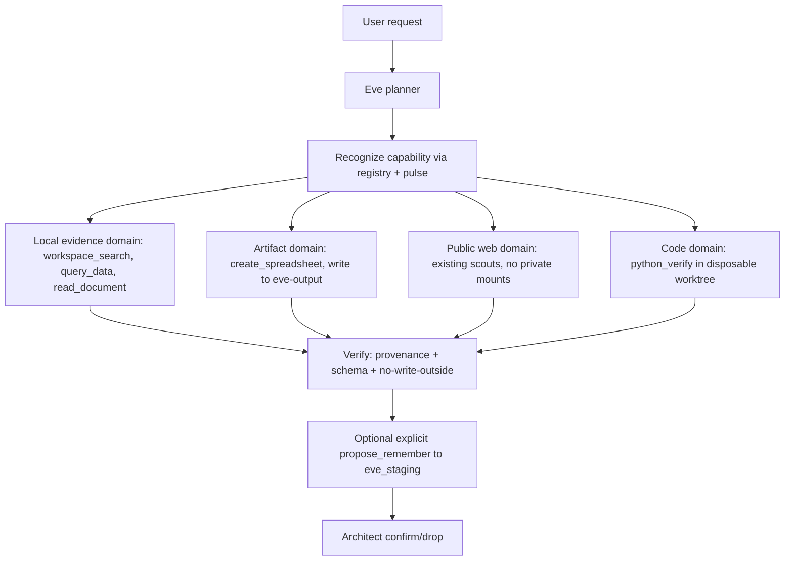

# Eve Governed Arms — Layered Implementation Plan

> **For agentic workers:** Implement phase-by-phase. Each phase ends with a gate
> script that exits 0 only when its tests pass. `scripts/advance-arms.ps1` runs
> the gates in order, stopping at the first red; `-Continue` auto-proceeds past
> green gates so no user input is needed to reach the next phase. `mechanic-green.ps1`
> stays the final pre-Architect gate.

**Goal:** Give Eve reliable, governed, artifact-producing "arms" so she can build
*with* the Architect and *autonomously* on local hardware — not a new stack, not
third-party MCP servers. Eve is a local system: every capability, MCP service,
skill, and resource must be clonable and runnable with zero internet after a
first bootstrap install. The internet is a bootstrap lane, never a runtime
dependency.

Each arm follows the existing EMPIRE pattern already proven by
docling/github-scout:

`pipeline/<name>.py` (pure Python, local libs) → `mcp/<name>_mcp.py` (FastMCP,
Cursor) → `agents/empire-task-agent/agent/tools/<name>.ts` (typed Eve tool) →
`agents/empire-task-agent/agent/skills/skill-<name>.md` (playbook) → registered
in `config/lego-bricks.json` + `config/capability-manifest.json` +
`frontend/eve_toolbelt.py` buckets.

## Global constraints (from `.cursor/rules/`)

- No SPA/cloud/BaaS/paid-LLM. HTMX+Alpine, PocketBase :8090, Ollama
  localhost:11434, Cognee 1.0, FastMCP in `mcp/`.
- Eve uses typed tools via `defineTool` + Zod, not MCP stdio (Eve MCP needs
  HTTP/SSE). FastMCP stdio servers are for Cursor only.
- npm only inside `agents/*`. Full files only. Non-destructive (copy, never
  move). `try/catch` everywhere.
- `mechanic-green.ps1` must exit 0 before any Architect smoke. Read
  `EMPIRE_MANIFESTO.md` first.
- No unrestricted shell/browser/socket; trust-domain split; read-only by
  default; mutations explicit.
- **Offline-convertibility gate (applies to every arm):** "can this become a
  local skill/tool/resource that runs with no internet after bootstrap?" Useful
  capabilities are kept only if they can be converted offline; otherwise they
  are deferred, not killed. Public-web tools (Phase 4) are a bootstrap lane
  whose end state is a local mirror (see `config/offline-mirror.json` +
  `scripts/build-offline-mirror.ps1`), mirroring the existing local Wikipedia
  library pattern.
- **Code autonomy (build with me):** Eve authors *and* verifies code in
  disposable worktrees; every change returns as a reviewable diff before merge.
  No silent self-merge.

## Reference architecture (trust domains)

## Phases

### Phase 0 — Governance foundation

Build `config/eve-capabilities/` registry + dirs (`eve-input`, `eve-output`,
`eve-staging` reuse) + per-capability PowerShell disable scripts + global kill
switch. Extend existing `lego-bricks.json` / `capability-manifest.json` rather
than a parallel system.

- [ ] `pipeline/capability_registry.py` (load/hash `tools/list` + schemas, fail-closed on change)
- [ ] `scripts/capability-kill-switch.ps1`
- [ ] `tests/pipeline/test_capability_registry.py`

**Gate:** `python -m unittest tests.pipeline.test_capability_registry` green;
a changed schema fails closed; kill switch disables all arms.

### Phase 1 — Local evidence arms

Build 3 arms using only local, no-auth libs already compatible with the venv:

1. `workspace_search` — ripgrep over allowlisted roots (`C:/Empire_Workbench`,
   `C:/EMPIRE` docs), JSON output, redaction.
2. `query_data` — DuckDB/Polars read-only over CSV/JSON/Parquet/SQLite copies;
   row/byte/time caps; no extension install.
3. `read_document` — MarkItDown first, Docling fallback (Docling already wired
   via `pipeline/docling_convert.py`).

- [ ] `pipeline/workspace_search.py`, `pipeline/query_data.py`, `pipeline/read_document.py`
- [ ] `mcp/workspace_search_mcp.py`, `mcp/query_data_mcp.py` (read_document reuses `docling_mcp.py`)
- [ ] `agents/empire-task-agent/agent/tools/workspace_search.ts`, `query_data.ts`, `read_document.ts`
- [ ] `agents/empire-task-agent/agent/skills/skill-workspace-search.md`, `skill-query-data.md`, `skill-read-document.md`
- [ ] `tests/pipeline/test_workspace_search.py`, `test_query_data.py`, `test_read_document.py`

**Gate:** benign fixtures ≥95% pass; `..`/symlink/UNC escapes denied; zero
writes outside `eve-staging`/`eve-output`; provenance on every extract.

### Phase 2 — Artifact, code-author, and verification arms

1. `create_spreadsheet` — openpyxl (no-auth, pure Python) writing `.xlsx` with
   formulas/formatting to `eve-output` only; formula-injection and
   external-link tests.
2. `author_code` — create/apply a patch in a disposable Git worktree
   (`eve-worktrees/{run-id}`); emits a reviewable diff, never pushes or merges.
3. `python_verify` — uv + Ruff + pytest in a disposable worktree; no inherited
   secrets; diff+test report out.

- [ ] `pipeline/create_spreadsheet.py`, `pipeline/author_code.py`, `pipeline/python_verify.py`
- [ ] `mcp/create_spreadsheet_mcp.py`
- [ ] `agents/empire-task-agent/agent/tools/create_spreadsheet.ts`, `author_code.ts`, `python_verify.ts`
- [ ] `agents/empire-task-agent/agent/skills/skill-create-spreadsheet.md`, `skill-author-code.md`, `skill-python-verify.md`
- [ ] `tests/pipeline/test_create_spreadsheet.py`, `test_author_code.py`, `test_python_verify.py`

**Gate:** `.xlsx` opens, formulas valid, injection blocked; every code change
represented as a reviewable diff in a disposable worktree (no push/merge);
tests pass; no production mutation.

### Phase 3 — Wire into Eve + governance

- [ ] Register all arms in `config/lego-bricks.json` and `config/capability-manifest.json` as light/`auto_enable` or session limbs per trust domain
- [ ] Add buckets to `frontend/eve_toolbelt.py`; add `resource_pulse` classification (light vs heavy) for the new arms
- [ ] Add `agents/empire-task-agent/agent/skills/skill-capability-routing.md` (prefer read-only over write, local over web)
- [ ] Extend `scripts/smoke-eve-hands.py` with an arm check (search → query → spreadsheet → release)

**Gate:** `scripts/smoke-eve-hands.py --eve-chat` shows Eve requesting a Phase
1/2 tool-call without refuse; `mechanic-green.ps1` (then `-Full`) exits 0.

### Phase 4 — Public-web bootstrap lane + isolation (gated)

- [ ] URL broker behind existing `web_scout`/`github_scout` with SSRF/redirect blocks (loopback/RFC1918/link-local denied)
- [ ] Prompt-injection isolation: a turn consuming untrusted content cannot auto-acquire write/shell/memory tools
- [ ] Offline-mirror convertibility: every public-web source gets a documented local-mirror path (via `config/offline-mirror.json` + `scripts/build-offline-mirror.ps1`), mirroring the local Wikipedia library

**Gate:** no private-address request; no browser persistence; every result
carries source/time/version; each public source has a demonstrated offline
mirror path. Held until Phase 1-3 are green.

## Auto-advance mechanism

Each phase ends with a gate script that returns exit 0 only when its tests
pass. `scripts/advance-arms.ps1` runs the gates in order and stops at the first
red; `-Continue` auto-proceeds past green gates so no user input is needed to
reach the next phase. `mechanic-green.ps1` stays the final pre-Architect gate.

## Deferred (per rules + research)

- No third-party MCP servers (Filesystem/DBHub/Excel MCP) — native `pipeline` modules instead.
- No LangGraph/AutoGen/Chroma/Qdrant; Cognee stays memory; Ollama stays inference.
- No whole-drive/`%USERPROFILE%`/`.ssh`/browser-profile access; no Docker socket on host.
- Playwright/browser, Whisper, FFmpeg, Serena, public datasets — Phase 4+,
  measured-exception only, and each must pass the offline-convertibility gate
  (useful capabilities kept only if convertible to a local skill/tool/resource).

## Acceptance

`mechanic-green.ps1 -Full` exits 0; `smoke-eve-hands.py --eve-chat` shows Eve
using at least one arm tool; no write outside `eve-staging`/`eve-output`;
provenance on all extracts; every arm passes the offline-convertibility gate
(runs with no internet after bootstrap); code changes surface as reviewable
diffs, never silent self-merges.
