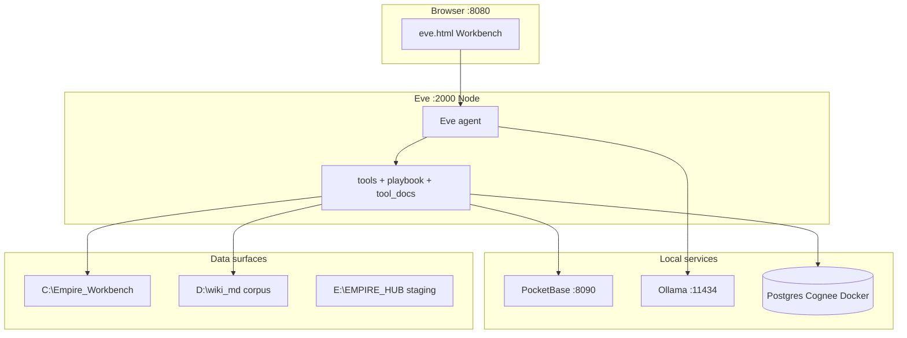

# System Patterns — Architecture, key decisions, component relationships

## System overview
Local, zero-build AI stack on Windows 11. Meter-free runtime; optional **cloud backup tier** (`pool:` / `E:\EMPIRE_HUB`) for estate copies — not for Eve inference.

## Answer-path spine (refactor)
Contract: **`intent → resolution → evidence → answer`** (`docs/REFACTOR_PLAN.md`).
- **Resolution:** wiki/title ambiguity must be explicit (E-13), not silent wrong-article matches.
- **Evidence:** capped cards, repeat-search refusal, playbook-routed limbs.
- **Prompt budget:** R-03 moved tool prose to `config/eve-capabilities/tool-docs/`; Eve fetches via `tool_docs`; routes via `playbook`.

## Process boundaries
| Process | Started by | Talks to |
|---------|------------|----------|
| `frontend.serve` | `start-stack.ps1` | PB, Ollama, Eve proxy, memory jobs |
| `eve start` | `start-eve.ps1` | Ollama, PB, Python subprocesses |
| MCP (Cursor) | Cursor host | Same backends as Eve tools |
| graft MCP | `npx @nanonets/graft mcp` | Indexed `graft/` graph |

## Key technical decisions
1. Zero-build UI (HTMX + Alpine CDN).
2. Node only in `agents/empire-task-agent/`.
3. Cognee on Docker Postgres; heavy files on **`V:\Cognee` when mounted** — else use documented K: backup / remount (ESTATE §12).
4. `cognee.lock` for MCP + CLI safety.
5. **resource_pulse / admit_for_goal** — light hands; Toolbelt categories default mostly OFF.
6. **eve-skills/** — packaged offline skills; playbook is runtime contract.
7. **graft/** — repo context graph; prefer `graft ask` / MCP over blind full-file reads.

## Eve roles (unchanged)
Orchestrator · Builder · Tool expert · Advisor — see `docs/EMPIRE_CLARITY.md`.

## Repository layout
`agents/` · `backend/pocketbase/` · `config/eve-capabilities/` · `frontend/` · `mcp/` · `pipeline/` · `scripts/` · `tests/` · `eve-skills/` · `graft/` · `docs/` (estate + refactor + audits)

## Conventions
- Mechanic-green before Architect smoke.
- Forge Protocol for Work Orders in `05_Work_Orders/`.
- Constants in two languages → parity tests.
- Memory Bank = Cursor/Cline session docs; Cognee = Eve recall.
